# 03.14 — Application-Level Caching

## Learning Objectives

By the end of this chapter, you should understand:

* What application-level caching means
* Why an application needs its own cache
* Where application-level caching sits in the request path
* Local/in-process vs distributed application caches
* What should and should not be cached
* Cache keys and namespaces
* Cache hits and misses
* Cache-aside at the application layer
* TTL and invalidation
* Serialization and deserialization costs
* Memory limits and eviction
* Cache consistency and stale data
* Multiple application instances
* Why local caches behave differently when an application scales horizontally
* Hot keys and cache stampede
* Cache failure and fallback behavior
* Security and authorization concerns
* How application caching differs from CDN, browser, and database caching
* How to measure whether application caching actually helps

---

# 1. What Is Application-Level Caching?

**Application-level caching** means storing reusable data or computed results so that the application can avoid performing the same expensive work repeatedly.

Consider a request:

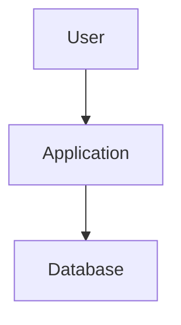

Suppose the application repeatedly executes:

```sql
SELECT *
FROM products
WHERE id = 123;
```

If the product does not change frequently, repeating the same database work for every request may be unnecessary.

Application-level caching introduces another layer:

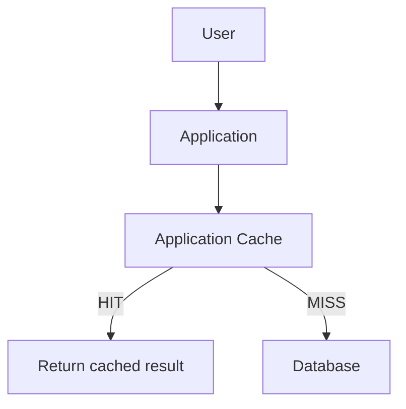

The main idea is:

> **Once a request reaches the application, avoid repeating expensive work when a reusable result is already available.**

---

# 2. Why Do We Need Application-Level Caching?

A CDN can prevent some requests from reaching the application.

But not every response can be safely cached at the CDN.

For example:

```text
GET /account/orders
```

may depend on the logged-in user.

The request reaches the application:

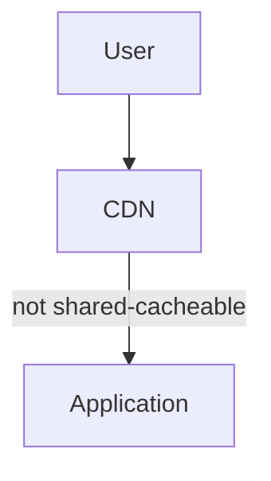

The application may then need:

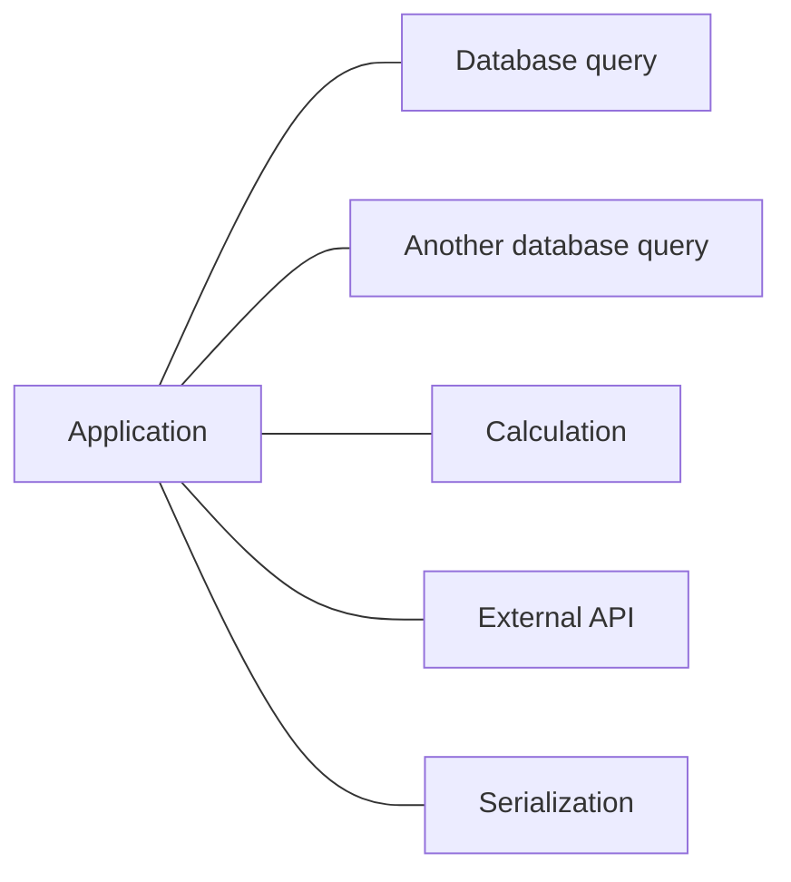

If the result can safely be reused, application-level caching can prevent some of this work.

---

# 3. Where Application-Level Caching Fits

A simplified request path:

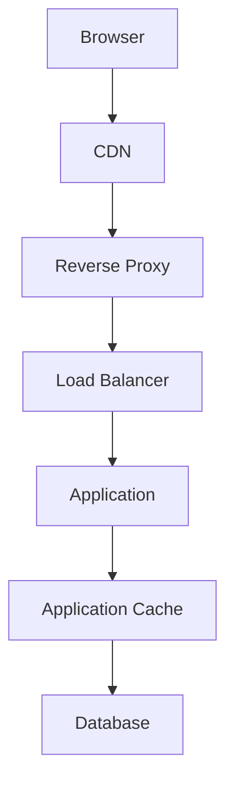

Notice the responsibility of each layer:

```text
Browser
  → reuse content on the user's device

CDN
  → serve reusable content closer to users

Reverse Proxy
  → avoid unnecessary requests reaching the application

Application Cache
  → avoid repeated application/data work

Database
  → authoritative data
```

The layers solve related but different problems.

---

# 4. A Simple Example

Imagine an online store.

Every product page requests:

```text
Product ID: 123
```

The application normally performs:

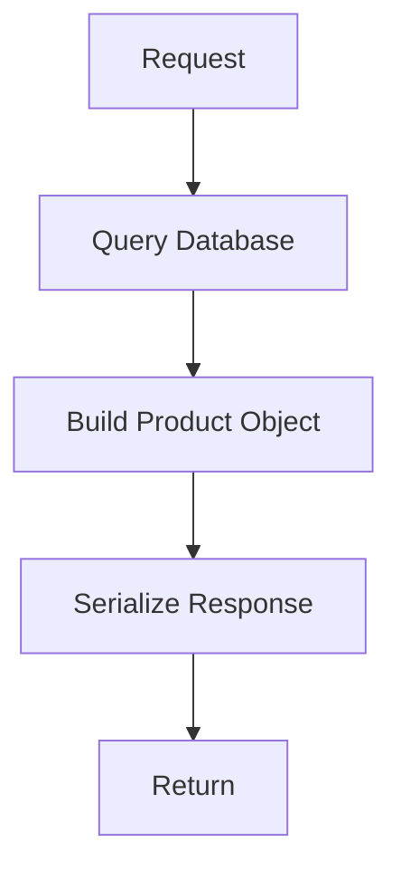

Suppose 10,000 users request the same product.

Without application caching:

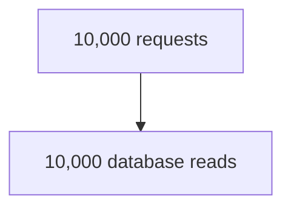

With application caching:

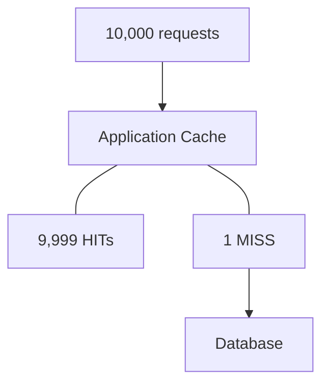

The exact numbers will vary in real systems, but the principle is important:

> **Repeated expensive work can sometimes be replaced by repeated cheap cache lookups.**

---

# 5. What Can an Application Cache Store?

Application caches can store many kinds of reusable results.

Examples:

### Database results

```text
product:123
user:456
category:17
```

### Computed values

```text
homepage:statistics
monthly:sales:2026-09
recommendations:user:123
```

### API responses

```text
weather:kolkata
exchange-rate:USD-INR
shipping:560001
```

### Configuration

```text
feature-flags
application-settings
```

### Session-related data

In some architectures, session state may be stored in a shared cache.

But this requires careful consideration of durability, availability, security, and consistency.

---

# 6. Cache the Result, Not the Work

A useful mental model is:

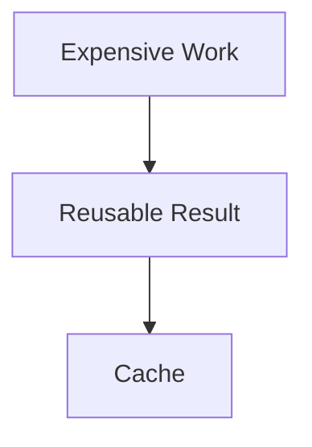

For example:

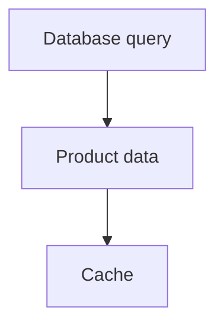

The next request does not repeat the query.

Instead:

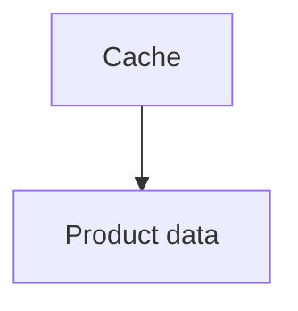

This is why application caching is often described as:

> **Caching the result of expensive work.**

---

# 7. What Makes Something a Good Cache Candidate?

A good candidate usually has several characteristics:

* Frequently requested
* Expensive to calculate or retrieve
* Relatively stable
* Safe to reuse
* Clear identity
* Acceptable freshness window

For example:

```text
Popular product
Frequently requested
Changes occasionally
Database query is moderately expensive
```

This is a strong candidate.

---

# 8. What Makes Something a Poor Candidate?

Caching may provide little value when:

* Data is rarely requested
* Data changes constantly
* Computing the result is already extremely cheap
* Every request produces a unique result
* The cached object is larger than its benefit justifies
* Correctness requires real-time data
* The cache key becomes excessively complex

Example:

```text
Current account balance
```

If the business requirement demands the latest committed value for every operation, blindly caching the value may introduce unacceptable correctness problems.

---

# 9. Cache Hit and Cache Miss

The two fundamental outcomes are:

### Cache hit

The requested value is available and usable.

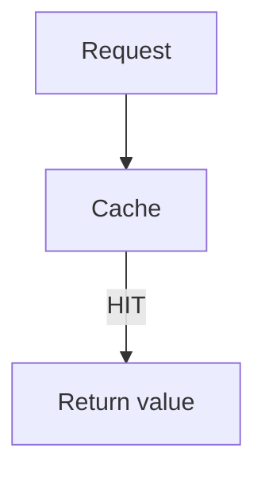

### Cache miss

The requested value is not available or cannot be used.

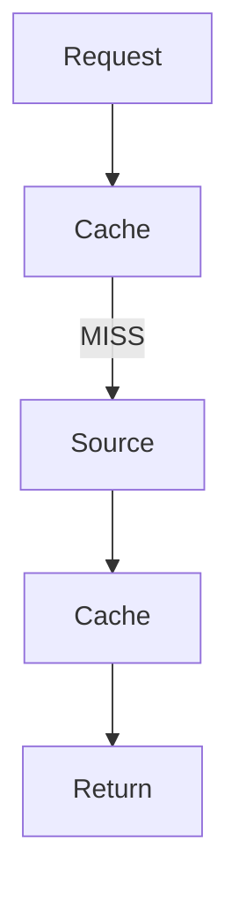

The application usually needs a fallback source.

That source might be:

* Database
* Another service
* Object storage
* Computation
* External API

---

# 10. Cache Lookup Is Not Free

It is easy to think:

```text
Cache = free performance
```

It is not.

A cache lookup itself costs resources.

For a distributed cache:

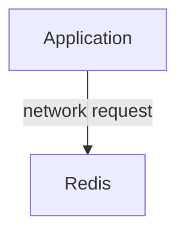

There is:

* Network latency
* Serialization/deserialization
* Connection usage
* CPU work
* Memory usage

Therefore:

> **Cache only when the work avoided is more expensive than the cost of caching and retrieving the result.**

---

# 11. Local Application Cache

A **local cache** lives inside the application process or on the same machine.

Conceptually:

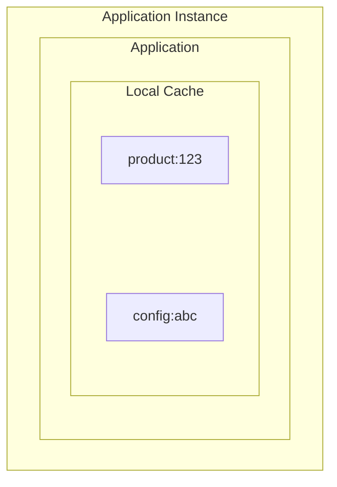

The application can access it without making a network request to another cache server.

This can make local caching extremely fast.

---

# 12. Local Cache Example

Suppose an application process stores:

```text
feature-flags
```

in memory.

Request:

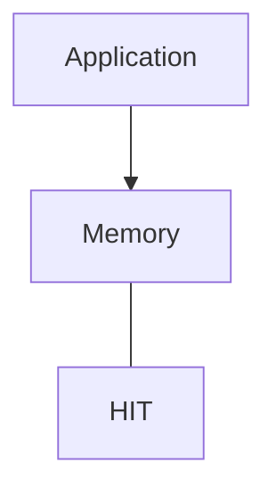

There is no Redis or database network call.

This can be useful for:

* Small configuration
* Feature flags
* Metadata
* Frequently accessed immutable data
* Expensive computations

---

# 13. The Problem With Local Cache

Now scale the application horizontally.

Instead of one instance:

```text
Application 1
```

we have:

```text
Application 1
Application 2
Application 3
```

Each instance has its own memory:

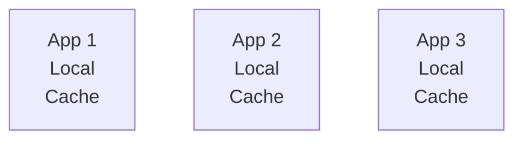

The caches are independent.

App 1 may have:

```text
product:123 = Version A
```

while App 2 may have:

```text
product:123 = Version B
```

This creates a consistency problem.

---

# 14. Local Cache and Horizontal Scaling

Consider:

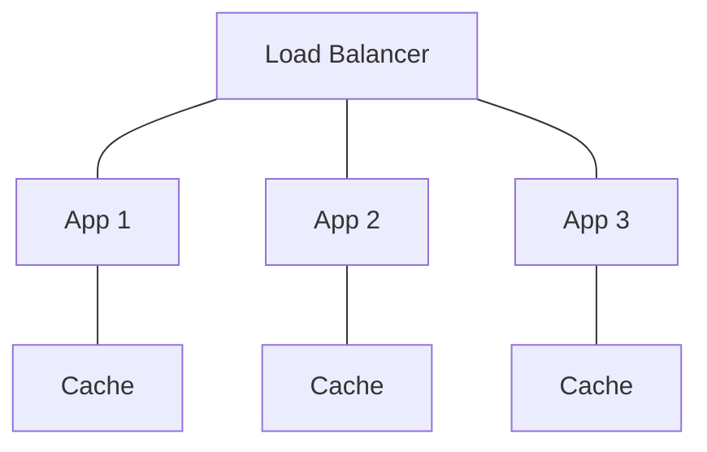

A user updates product 123 through App 1.

App 1 may invalidate:

```text
App 1 Cache
product:123
```

But:

```text
App 2 Cache
product:123
```

may still contain the old value.

Therefore:

> **A local cache is local to an application instance unless another mechanism synchronizes it.**

---

# 15. Distributed Application Cache

A **distributed cache** is shared by multiple application instances.

Conceptually:

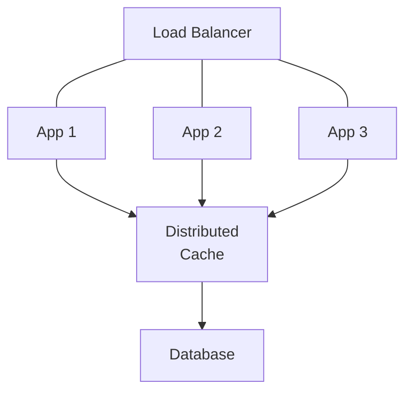

All application instances can access the same cache.

A common architecture uses a dedicated caching system such as Redis.

The important idea is not the product name.

The important idea is:

> **Multiple application instances can access a shared cache instead of maintaining completely separate copies.**

---

# 16. Local vs Distributed Cache

| Local Cache                              | Distributed Cache                            |
| ---------------------------------------- | -------------------------------------------- |
| Lives with application instance          | Shared infrastructure                        |
| Very low access latency                  | Network access required                      |
| Simple for instance-local data           | Useful across instances                      |
| Separate copy per instance               | Shared cache state                           |
| Can become inconsistent across instances | Centralized consistency is easier            |
| Limited by instance memory               | Can have dedicated memory capacity           |
| Lost when process restarts               | Persistence/recovery depends on cache system |

Neither is universally better.

The correct choice depends on the data and system requirements.

---

# 17. Why Use Both?

A system can use both.

For example:

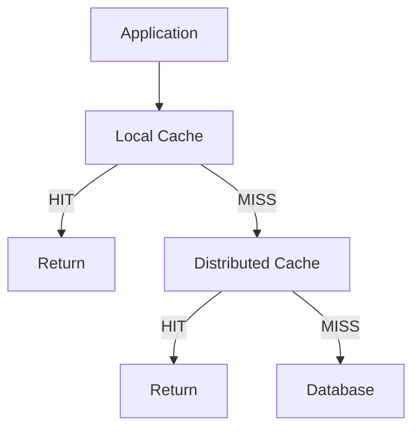

This is a multi-level cache.

The local cache handles extremely hot data.

The distributed cache provides shared state between application instances.

---

# 18. Multi-Level Application Caching

A more complete architecture:

```mermaid
flowchart TD
  accTitle: Multi-level application caching
  accDescr: The user reaches the CDN, the load balancer and the application, which uses a local cache and a distributed cache in front of the database.
  U["User"] --> C["CDN"] --> L["Load Balancer"] --> A["Application"]
  A --- LC["Local Cache"]
  A --- DC["Distributed Cache"] --> D["Database"]
```

The layers are not duplicates.

They have different responsibilities.

### CDN

Avoid reaching the application.

### Local cache

Avoid reaching the distributed cache.

### Distributed cache

Avoid reaching the database or expensive source.

This creates a hierarchy:

```mermaid
flowchart TD
  accTitle: From closer to farther
  accDescr: From closer and faster to farther and more expensive: local cache, distributed cache, database.
  F["Closer / Faster"] --> L["Local Cache"] --- D["Distributed Cache"] --- B["Database"] --> X["Farther / More Expensive"]
```

---

# 19. Cache Key Design

A cache needs a reliable identity.

Suppose we cache:

```text
Product 123
```

A simple key might be:

```text
product:123
```

For users:

```text
user:456
```

For categories:

```text
category:17
```

The key should clearly identify the cached representation.

---

# 20. Cache-Key Collisions

Suppose we use:

```text
123
```

for everything.

We could accidentally mix:

```text
User 123
Product 123
Order 123
```

A namespace solves this:

```text
user:123
product:123
order:123
```

This is more than naming style.

It protects cache correctness.

---

# 21. Composite Cache Keys

Sometimes the result depends on multiple dimensions.

For example:

```text
Product recommendations
User = 123
Language = en
Page = 2
```

A possible key:

```text
recommendations:user:123:language:en:page:2
```

The important question is:

> **What inputs determine the cached result?**

Every input that materially changes the representation must be considered.

But adding too many dimensions can create a huge number of cache entries.

---

# 22. Cache-Key Explosion

Suppose a response varies by:

```text
User
Language
Currency
Country
Device
Page
Sort
Filter
```

The number of possible combinations can become enormous.

Conceptually:

```text
Users
 ×
Languages
 ×
Currencies
 ×
Countries
 ×
Pages
 ×
Filters
```

This can create:

* Large memory usage
* Low cache reuse
* More cache misses
* More invalidation complexity

Therefore:

> **A cache key should contain the dimensions that actually determine the result, not every available request attribute.**

---

# 23. Namespaces

A namespace groups related cache keys.

For example:

```text
user:
product:
category:
recommendation:
settings:
```

This makes it easier to reason about cache data.

It can also support broad invalidation strategies.

For example:

```text
product:123
product:124
product:125
```

may belong to the same logical namespace.

---

# 24. Cache-Aside at the Application Layer

Application-level caching commonly uses **Cache-Aside**.

The flow is:

```mermaid
flowchart TD
  accTitle: Cache-Aside at the application layer
  accDescr: The application checks the cache. HIT: return. MISS: read the source, store in the cache and return.
  R["Request"] --> A["Application"] --> C["Check Cache"]
  C -->|"HIT"| H["Return"]
  C -->|"MISS"| S["Source"] --> T["Store Cache"] --> U["Return"]
```

The application explicitly controls:

* Cache lookup
* Cache key
* Source lookup
* Cache population
* Cache invalidation
* TTL

This is why Cache-Aside is an important application-level caching pattern.

---

# 25. Application Cache and Write Operations

Suppose:

```text
Product 123
```

is cached.

A user changes the product price.

The common Cache-Aside write flow is:

```mermaid
flowchart TD
  accTitle: On a write
  accDescr: Update Database, then Successful Commit, then Invalidate Cache.
  N0["Update Database"] --> N1["Successful Commit"] --> N2["Invalidate Cache"]
```

Then:

```mermaid
flowchart TD
  accTitle: The next read
  accDescr: Next Read, then Cache MISS, then Read New Data, then Populate Cache.
  N0["Next Read"] --> N1["Cache MISS"] --> N2["Read New Data"] --> N3["Populate Cache"]
```

This connects directly to:

**03.09 — Cache Invalidation**

---

# 26. Update-Then-Invalidate

A useful conceptual sequence is:

```mermaid
flowchart TD
  accTitle: Update, then invalidate
  accDescr: Application, then Database UPDATE, then Commit succeeds, then Invalidate cache.
  N0["Application"] --> N1["Database UPDATE"] --> N2["Commit succeeds"] --> N3["Invalidate cache"]
```

Why invalidate after successful database change?

Because if the database update fails:

```mermaid
flowchart TD
  accTitle: A failed update
  accDescr: The database update fails.
  A["Database UPDATE"] -. "X" .- B["Failure"]
```

you generally do not want to invalidate a valid cached value unnecessarily.

The exact implementation depends on transaction boundaries and failure handling.

---

# 27. Cache Consistency

Suppose:

```text
Database
Price = ₹500
```

Cache:

```text
Price = ₹500
```

Then database changes:

```text
Database
Price = ₹550
```

but cache still contains:

```text
Price = ₹500
```

The cache is stale.

So:

```text
Database = NEW
Cache    = OLD
```

Application-level caching therefore introduces a consistency decision:

> **How stale is acceptable?**

---

# 28. Stronger Freshness vs Better Performance

Suppose product prices can be stale for:

```text
5 seconds
```

A cache may be acceptable.

But suppose the system is:

```text
Bank transaction balance
```

and the latest value is required for a financial decision.

The caching strategy must be much more conservative.

This illustrates a broader principle:

> **Caching is not only a performance decision. It is also a correctness decision.**

---

# 29. TTL as a Safety Boundary

Application caches often use TTL.

Example:

```text
product:123
TTL = 60 seconds
```

After the TTL expires:

```mermaid
flowchart TD
  accTitle: TTL as a safety boundary
  accDescr: Cache, then Expired, then Next request fetches fresh data.
  N0["Cache"] --> N1["Expired"] --> N2["Next request fetches fresh data"]
```

TTL can limit how long stale data remains available.

But TTL is not always enough.

If important data changes immediately, waiting 60 seconds may be unacceptable.

In those cases, explicit invalidation may be needed.

---

# 30. TTL + Invalidation

A robust design can use both:

```mermaid
flowchart TD
  accTitle: Invalidation
  accDescr: Explicit Change, then Invalidate Cache.
  N0["Explicit Change"] --> N1["Invalidate Cache"]
```

and:

```mermaid
flowchart TD
  accTitle: TTL as a fallback
  accDescr: If invalidation fails, then TTL eventually expires.
  N0["If invalidation fails"] --> N1["TTL eventually expires"]
```

Conceptually:

```mermaid
flowchart TD
  accTitle: TTL + invalidation
  accDescr: Update the database and invalidate the cache. Success: fresh cache on the next read. Failure: TTL fallback.
  U["Update DB"] --> I["Invalidate Cache"]
  I -->|"success"| F["fresh cache on next read"]
  I -->|"failure"| T["TTL fallback"]
```

This does not guarantee perfect consistency, but it provides multiple safety mechanisms.

---

# 31. Serialization and Deserialization

Distributed caches usually store data in a serialized form.

For example:

```mermaid
flowchart TD
  accTitle: Serialization
  accDescr: Application Object, then Serialization, then Cache, then Deserialization, then Application Object.
  N0["Application Object"] --> N1["Serialization"] --> N2["Cache"] --> N3["Deserialization"] --> N4["Application Object"]
```

Serialization costs:

* CPU
* Memory
* Time
* Network bandwidth

For very small objects, the cost may be tiny.

For very large objects, it can become significant.

---

# 32. Large Cached Objects

Suppose an application caches:

```text
10 MB object
```

Every cache request may require:

```text
Network transfer
Deserialization
Memory allocation
```

Even though the database query was avoided.

Therefore:

> **A cache hit is not automatically cheap.**

You must consider the cost of retrieving and reconstructing the cached value.

---

# 33. Cache Granularity

Should you cache:

```text
Entire homepage
```

or:

```text
Homepage statistics
Homepage recommendations
Homepage categories
```

The answer depends on the application.

Large coarse-grained entries can be easy to retrieve but harder to invalidate.

Small fine-grained entries can be easier to update independently but may require more lookups.

This is a trade-off.

---

# 34. Example: Product Page

Option A:

```text
product-page:123
```

contains:

```text
Product
Reviews
Recommendations
Inventory
```

One cache entry.

But if inventory changes frequently, the whole entry may become stale.

Option B:

```text
product:123
reviews:123
recommendations:123
inventory:123
```

Different lifetimes and invalidation rules are possible.

This gives more control but increases application complexity.

---

# 35. Cache Eviction

Application cache memory is limited.

Suppose:

```text
Cache Capacity = 1 GB
```

but the application wants to store:

```text
2 GB
```

Some entries must be removed.

This is called **eviction**.

Conceptually:

```text
Cache
+--------------------+
| A B C D E F G H   |
+--------------------+
          |
          v
       Capacity
       exceeded
          |
          v
      Evict entries
```

Eviction is different from invalidation.

---

# 36. Eviction vs Invalidation vs Expiration

These concepts must remain separate.

### Invalidation

The application says:

> This cached value should no longer be used.

### Expiration

The entry reaches its TTL.

### Eviction

The cache removes an entry because it needs space or follows its eviction policy.

```text
Invalidation → correctness/change
Expiration   → time/freshness
Eviction     → capacity/resource
```

The same entry may experience more than one of these.

---

# 37. Cache Capacity Planning

Application caching consumes resources.

Consider:

```text
Number of entries
×
Average entry size
```

For example:

```text
1,000,000 entries
×
2 KB
≈
2 GB
```

This is only a simplified estimate.

Real memory requirements may be higher because of:

* Metadata
* Object overhead
* Serialization
* Memory fragmentation
* Replication
* Internal cache structures

Therefore:

> **Cache sizing is a capacity-planning problem.**

---

# 38. Hot Keys

A **hot key** is a cache key requested much more frequently than others.

Example:

```text
product:123
```

might receive:

```text
50,000 requests/second
```

while most other products receive only a few requests.

This creates concentration of traffic.

A hot key can stress:

* One cache node
* One network path
* Serialization/deserialization
* Application instances
* Locking mechanisms

---

# 39. Hot Key vs Cache Miss

A hot key is not necessarily bad.

A hot key that is always cached can be extremely efficient.

The problem becomes more serious when:

```text
Hot key
   +
Cache miss
   +
Many concurrent requests
```

Then many requests may attempt to regenerate the same expensive value.

This leads to:

**Cache Stampede**

---

# 40. Cache Stampede

Suppose:

```text
popular:data
TTL = 60 seconds
```

The entry expires.

Suddenly:

```text
1,000 requests
```

arrive.

All see:

```text
CACHE MISS
```

They all query the database:

```mermaid
flowchart TD
  accTitle: A stampede
  accDescr: 1,000 requests all go to the database.
  subgraph G[" "]
    direction LR
    R["1,000 requests"] --- D4["DB"] & E["..."] & D1["DB"] & D2["DB"] & D3["DB"]
  end
```

The cache has unintentionally caused a burst of expensive work.

Possible solutions include:

* Request coalescing
* Locks
* Single-flight
* Background refresh
* Stale-while-revalidate
* TTL jitter
* Early refresh

These were introduced in **03.10 — Cache Stampede**.

---

# 41. Cache Failure

A distributed cache is another infrastructure dependency.

Consider:

```mermaid
flowchart TD
  accTitle: The cache fails
  accDescr: The application cannot reach the distributed cache.
  A["Application"] -. "X" .- B["Distributed Cache"]
```

What happens?

A robust application needs a fallback strategy.

For example:

```mermaid
flowchart TD
  accTitle: Falling back to the database
  accDescr: The request reaches the cache, which fails, and falls back to the database.
  R["Request"] --> C["Cache"] -. "X" .- F["Failure"] --> D["Database"]
```

This may preserve correctness but increase load on the database.

---

# 42. Cache Failure Can Become a Database Failure

Imagine:

```mermaid
flowchart TD
  accTitle: Normal
  accDescr: Normal: application, then cache, then database.
  subgraph G["Normal:"]
    direction TB
    N0["Application"] --> N1["Cache"] --> N2["Database"]
  end
```

The database handles only a fraction of requests.

Now cache fails:

```mermaid
flowchart TD
  accTitle: Cache failure
  accDescr: The application cannot reach the cache and goes to the database.
  A["Application"] -. "X" .- C["Cache"] --> D["Database"]
```

Suddenly the database receives far more traffic.

This can create a cascading failure:

```mermaid
flowchart TD
  accTitle: A cache failure becomes a database failure
  accDescr: Cache failure, then Database load increases, then Database slows, then Application requests slow, then Requests accumulate, then System becomes unstable.
  N0["Cache failure"] --> N1["Database load increases"] --> N2["Database slows"] --> N3["Application requests slow"] --> N4["Requests accumulate"] --> N5["System becomes unstable"]
```

Therefore:

> **A cache is not merely a performance feature. It can change the load profile of the entire system.**

---

# 43. Cache as an Optional Dependency

If the cache is only an optimization:

```mermaid
flowchart TD
  accTitle: An optional cache
  accDescr: Cache failure, then Use source of truth.
  N0["Cache failure"] --> N1["Use source of truth"]
```

The application can continue, although slower.

This is often desirable.

Conceptually:

```mermaid
flowchart TD
  accTitle: Fast path and fallback
  accDescr: Cache available: fast path. Unavailable: slower fallback.
  C["Cache"] -->|"available"| F["fast path"]
  C -->|"unavailable"| S["slower fallback"]
```

But this only works if the source can safely handle the increased load.

---

# 44. Cache as a Critical Dependency

Sometimes applications intentionally depend heavily on a cache.

For example:

```text
Session state
Distributed coordination data
Frequently accessed shared state
```

If the cache is required for correctness, its availability becomes much more important.

This changes the architecture:

```mermaid
flowchart TD
  accTitle: A critical dependency
  accDescr: Cache, then High Availability, then Replication, then Failover, then Monitoring, then Capacity Planning.
  N0["Cache"] --> N1["High Availability"] --> N2["Replication"] --> N3["Failover"] --> N4["Monitoring"] --> N5["Capacity Planning"]
```

Therefore, decide explicitly:

> **Is the cache an optimization, or has the system made it part of the critical path?**

---

# 45. Multiple Application Instances

Suppose:

```mermaid
flowchart TD
  accTitle: Multiple instances
  accDescr: The load balancer spreads requests over App 1, App 2 and App 3.
  L["Load Balancer"] --> A["App 1"] & B["App 2"] & C["App 3"]
```

With a shared cache:

```mermaid
flowchart LR
  accTitle: A shared cache
  accDescr: App 1, App 2 and App 3 share one cache.
  A["App 1"] & B["App 2"] & C["App 3"] --> S["Shared Cache"]
```

A cache update made through App 1 can be observed by App 2 and App 3.

This is one major reason distributed caches become useful as systems scale horizontally.

---

# 46. Local Cache + Distributed Cache

A common architecture is:

```mermaid
flowchart TD
  accTitle: Local cache + distributed cache
  accDescr: The request reaches App 1 and its local cache: a hit, or a miss that goes to the distributed cache: a hit, or a miss that goes to the database.
  R["Request"] --> A["App 1"] --> L["Local Cache"]
  L --- H1["HIT"]
  L --- M1["MISS"] --> D["Distributed Cache"]
  D --- H2["HIT"]
  D --- M2["MISS"] --> B["Database"]
```

This can provide very fast access for extremely hot values while maintaining shared cache state.

But it introduces more complexity.

---

# 47. The Invalidation Problem Gets Harder

With one cache:

```mermaid
flowchart TD
  accTitle: One application, one cache
  accDescr: Application, then Cache.
  N0["Application"] --> N1["Cache"]
```

invalidation is relatively simple.

With:

```text
App 1 → Local Cache
App 2 → Local Cache
App 3 → Local Cache
             \
              Shared Cache
```

an update may need to invalidate:

* Shared cache
* App 1 local cache
* App 2 local cache
* App 3 local cache

This can require:

* Broadcast events
* Pub/Sub
* Versioning
* Short local TTL
* Explicit invalidation messages

Distributed caching therefore introduces distributed-systems problems.

---

# 48. Authorization and Security

Never assume:

```text
Same key = same data for everyone
```

Consider:

```text
dashboard:user:123
```

This is user-specific.

A dangerous design might accidentally use:

```text
dashboard
```

as the cache key.

Then:

```mermaid
flowchart TD
  accTitle: A shared key leaks data
  accDescr: User A, then Cache, then User B.
  N0["User A"] --> N1["Cache"] --> N2["User B"]
```

could receive User A's data.

Therefore:

> **Authorization context is part of cache correctness whenever the result depends on identity or permissions.**

---

# 49. Permission Changes

Suppose:

```text
User A
Role = Admin
```

The application caches:

```text
permissions:user:A
```

Later:

```text
Role changes
Admin → Normal User
```

The old permissions must not remain usable indefinitely.

Possible strategies include:

* Immediate invalidation
* Short TTL
* Versioned authorization state
* Permission checks outside the cached result
* Event-driven invalidation

Security-sensitive caches deserve especially careful design.

---

# 50. Sensitive Data

Application caches may contain:

* Personal information
* Tokens
* User profiles
* Business data
* Internal configuration

Therefore consider:

* Access controls
* Encryption where appropriate
* Network security
* Key naming
* Data retention
* Memory exposure
* Logging
* Debugging tools

A cache is still a data store, even if it is called "just a cache."

---

# 51. Cache and Transactions

Suppose:

```text
Database transaction
```

updates several related records.

If the application updates or invalidates cache entries too early, another request may observe inconsistent data.

For example:

```text
Transaction starts
     |
     +---- Update A
     |
     +---- Update B
     |
     X---- Cache invalidated here
     |
Transaction fails
```

The cache may now no longer match the database.

A safer conceptual pattern is:

```mermaid
flowchart TD
  accTitle: Invalidate after commit
  accDescr: The transaction updates A and B, commits, and then invalidates or updates the cache.
  T["Transaction"] --- A["Update A"]
  T --- B["Update B"]
  T --> C["Commit"] --> I["Invalidate / update cache"]
```

Exact implementation depends on the database and application architecture.

---

# 52. Cache and Read-After-Write

Suppose:

```text
User updates profile
```

Then immediately:

```text
GET /profile
```

If the cache still contains the old value:

```text
Write → Database = NEW
Read  → Cache = OLD
```

the user may see stale data immediately after their own update.

This is called a **read-after-write consistency concern**.

Possible strategies include:

* Invalidate immediately after successful write
* Update cache during the write
* Bypass cache for a short period
* Use version information
* Route reads carefully

The correct choice depends on product requirements.

---

# 53. Application Cache vs Database Index

These solve different problems.

### Database index

Improves how the database finds data.

```mermaid
flowchart TD
  accTitle: A database index
  accDescr: Database, then Index, then Rows.
  N0["Database"] --> N1["Index"] --> N2["Rows"]
```

### Application cache

Avoids asking the database at all for repeated data.

```mermaid
flowchart TD
  accTitle: An application cache hit
  accDescr: The application finds the result in its cache; the database is not needed.
  A["Application"] --> C["Cache"] -. "X" .- D["Database not needed"]
```

A good system may use both:

```mermaid
flowchart TD
  accTitle: Both together
  accDescr: On a cache miss, the database uses its index to find the rows.
  N0["Application"] --> N1["Cache"] -->|"MISS"| N2["Database Index"] --> N3["Rows"]
```

They are complementary.

---

# 54. Application Cache vs CDN

### CDN

```mermaid
flowchart TD
  accTitle: A CDN hit
  accDescr: The CDN serves the user; the application is not reached.
  U["User"] --> C["CDN"] -. "X" .- A["Application not reached"]
```

### Application cache

```mermaid
flowchart TD
  accTitle: An application cache hit
  accDescr: The application cache serves the request; the database is not reached.
  U["User"] --> A["Application"] --> C["Cache"] -. "X" .- D["Database not reached"]
```

The difference is where the repeated work is prevented.

```text
CDN
→ avoids application work

Application Cache
→ avoids internal application/data work
```

---

# 55. Application Cache vs Browser Cache

### Browser

```text
User device
```

The cache is private to the client.

### Application cache

```text
Server-side application infrastructure
```

The cache is controlled by the application.

A user cannot directly depend on the application's internal cache behavior.

---

# 56. Application Cache vs Database Cache

Databases themselves may maintain internal caches for:

* Data pages
* Index pages
* Query-related structures
* Metadata

Application-level caching sits outside the database.

```mermaid
flowchart TD
  accTitle: Application cache vs database cache
  accDescr: Application, then Application Cache, then Database, then Database Internal Cache, then Storage.
  N0["Application"] --> N1["Application Cache"] --> N2["Database"] --> N3["Database Internal Cache"] --> N4["Storage"]
```

These caches operate at different layers.

---

# 57. The Cost of Caching

Application caching has benefits:

```text
Lower DB load
Lower latency
Higher throughput
Reduced repeated computation
```

But also costs:

```text
Memory
Network
Serialization
Invalidation
Consistency
Operational complexity
Monitoring
Failure handling
```

The correct question is not:

> "Can we cache this?"

It is:

> **"Does the benefit of caching outweigh its correctness, resource, and operational costs?"**

---

# 58. Measuring Application Cache Performance

Important metrics include:

### Hit ratio

```text
Hits
------------------
Hits + Misses
```

### Miss rate

```text
Misses
------------------
Hits + Misses
```

### Cache latency

How long does a cache lookup take?

### Origin/database load

Did caching actually reduce expensive work?

### Eviction rate

How often are entries removed due to capacity?

### Error rate

How often does the cache fail?

### Entry size

How much memory does each cached value consume?

### Hot-key distribution

Are a small number of keys receiving most requests?

---

# 59. Hit Ratio Is Not Everything

Consider two caches.

### Cache A

```text
99% hit ratio
```

but each cached object is:

```text
10 MB
```

### Cache B

```text
90% hit ratio
```

but objects are:

```text
1 KB
```

You cannot determine which system is better from hit ratio alone.

Also consider:

* Request volume
* Object size
* Cache latency
* Origin cost
* Memory cost
* Freshness
* Correctness

Metrics must be interpreted in context.

---

# 60. Practical Investigation Workflow

Suppose your database is overloaded.

Do not immediately add a cache.

First investigate.

### Step 1 — Find expensive operations

```text
Which queries?
Which computations?
Which APIs?
```

### Step 2 — Find repeated work

```text
Is the same result being requested repeatedly?
```

### Step 3 — Measure reuse

```text
How frequently?
How many unique keys?
```

### Step 4 — Check freshness

```text
How stale can the result safely be?
```

### Step 5 — Design the key

```text
What determines the result?
```

### Step 6 — Choose cache location

```text
Local?
Distributed?
Both?
```

### Step 7 — Define failure behavior

```text
What happens if cache fails?
```

### Step 8 — Define invalidation

```text
When does the cached value stop being valid?
```

### Step 9 — Measure again

After implementation:

```text
Cache metrics
+
Database metrics
+
Application latency
```

Compare before and after.

---

# 61. Example: Product Catalog

Suppose:

```text
100,000 products
```

and:

```text
10,000 requests/second
```

The same popular products are requested repeatedly.

Without cache:

```mermaid
flowchart TD
  accTitle: Without a cache
  accDescr: Requests, then Database.
  N0["Requests"] --> N1["Database"]
```

With application cache:

```mermaid
flowchart TD
  accTitle: With a distributed cache
  accDescr: Requests reach the distributed cache. HIT: return. MISS: read the database.
  R["Requests"] --> C["Distributed Cache"]
  C -->|"HIT"| H["Return"]
  C -->|"MISS"| D["Database"]
```

Product information may be cached for:

```text
TTL = 5 minutes
```

and invalidated when a product is updated.

This could significantly reduce repeated database reads.

But the actual benefit must be measured.

---

# 62. Example: Search Results

Suppose:

```text
GET /search?q=laptop
```

Search results may change frequently.

Caching every search query could produce huge numbers of keys:

```text
search:laptop
search:laptop+bag
search:laptop+gaming
search:laptop+budget
...
```

Many may be requested only once.

Caching may therefore provide limited benefit.

However, if certain queries are extremely popular, targeted caching may help.

The lesson:

> **Cache based on actual access patterns, not simply because something is technically cacheable.**

---

# 63. Example: Configuration

Suppose an application repeatedly reads:

```text
feature_flags
```

from a database.

The configuration changes only occasionally.

Caching it may make sense:

```mermaid
flowchart TD
  accTitle: Configuration in a local cache
  accDescr: The application checks its local cache: a hit, or a miss that reads the database.
  A["Application"] --> L["Local Cache"]
  L --- H["HIT"]
  L --- M["MISS"] --> D["Database"]
```

Because the data is:

* Small
* Frequently read
* Infrequently changed

But configuration changes may require explicit invalidation or refresh.

---

# 64. Example: Expensive Computation

Suppose generating a recommendation takes:

```text
500 ms
```

and the result can safely be reused for:

```text
30 seconds
```

Caching can transform:

```mermaid
flowchart TD
  accTitle: Without a cache
  accDescr: Request, then 500 ms computation.
  N0["Request"] --> N1["500 ms computation"]
```

into:

```mermaid
flowchart TD
  accTitle: With a cache
  accDescr: Request, then Cache lookup, then Fast result.
  N0["Request"] --> N1["Cache lookup"] --> N2["Fast result"]
```

The expensive computation is performed only when needed to refresh the cache.

---

# 65. Common Mistake: Cache Everything

A common reaction to performance problems is:

```mermaid
flowchart TD
  accTitle: Cache everything
  accDescr: Database is slow, then Cache everything.
  N0["Database is slow"] --> N1["Cache everything"]
```

This can create:

* Stale data
* Memory pressure
* Complex invalidation
* Incorrect results
* Hard-to-debug behavior
* Hidden dependencies

Caching should be selective.

---

# 66. Common Mistake: No Expiration

Suppose:

```text
product:123
```

is cached forever.

Eventually:

```text
Database = New
Cache    = Old
```

If invalidation fails, the old value may remain indefinitely.

A TTL can provide a safety boundary.

---

# 67. Common Mistake: Ignoring Cache Failure

Bad design:

```mermaid
flowchart TD
  accTitle: Ignoring cache failure
  accDescr: The application reaches the cache, which fails, and the application fails.
  A["Application"] --> C["Cache"] -. "X" .- F["Application fails"]
```

If the cache is only an optimization, the application may be able to fall back to the source.

But fallback itself must be designed carefully so that cache failure does not overload the database.

---

# 68. Common Mistake: Using Local Cache After Horizontal Scaling

This architecture:

```text
App 1 → Local Cache
App 2 → Local Cache
App 3 → Local Cache
```

can work for instance-local data.

But it becomes dangerous when developers assume:

```text
All caches are synchronized
```

They are not.

If shared consistency is required, consider a distributed cache or an explicit synchronization mechanism.

---

# 69. Common Mistake: Forgetting Cache Invalidation

A cache entry is only useful while its value remains acceptable.

For every cached value, ask:

```text
When does this become invalid?
```

If the answer is:

```text
We don't know
```

the caching design is incomplete.

---

# 70. Common Mistake: Ignoring Authorization

Never assume that:

```text
Same endpoint
=
Same response
```

A response may depend on:

* User
* Role
* Tenant
* Permissions
* Region
* Subscription
* Feature flags

These dimensions may need to be represented in the cache key or handled outside the cache.

---

# 71. System Design View

Application-level caching is an example of a broader principle:

> **Avoid repeating work when the result can be safely reused.**

The pattern appears everywhere:

```mermaid
flowchart TD
  accTitle: Caching everywhere in the system
  accDescr: Browser Cache, then CDN, then Application Cache, then Database Buffer Cache, then CPU Cache.
  N0["Browser Cache"] --> N1["CDN"] --> N2["Application Cache"] --> N3["Database Buffer Cache"] --> N4["CPU Cache"]
```

At every layer, the system asks:

> **Can we reuse something we already have instead of doing the expensive work again?**

The implementation differs, but the principle is similar.

---

# 72. Application Cache as a Performance Layer

Think of the application cache as an optional fast path:

```mermaid
flowchart TD
  accTitle: Application cache as a performance layer
  accDescr: The request reaches the application. Cache hit: fast path. Cache miss: slow path to the database.
  R["Request"] --> A["Application"]
  A -->|"Cache HIT"| F["Fast Path"]
  A -->|"Cache MISS"| S["Slow Path"] --> D["Database"]
```

This mental model is useful.

The cache should accelerate the common case.

The source of truth should still provide correctness when the cache cannot.

---

# 73. Application Cache Decision Framework

Before caching something, ask:

### 1. Is the work expensive?

If not, caching may not matter.

### 2. Is the result reused?

If every request is unique, cache reuse is low.

### 3. Can it be safely reused?

Consider identity, permissions, and correctness.

### 4. How fresh must it be?

Determine TTL and invalidation.

### 5. What should the cache key contain?

Identify all meaningful inputs.

### 6. Local or distributed?

Consider horizontal scaling and sharing requirements.

### 7. What happens on cache failure?

Define the fallback.

### 8. How much memory will it consume?

Estimate capacity.

### 9. How will it be invalidated?

Define the lifecycle.

### 10. How will success be measured?

Define metrics before optimizing.

---

# 74. Hands-On Lab — Application-Level Cache

This lab uses:

* PostgreSQL
* Redis
* A simple backend application

The goal is to observe how application-level caching changes database work.

---

## Step 1 — Create a Products Table

```sql
CREATE TABLE products (
    id SERIAL PRIMARY KEY,
    name TEXT NOT NULL,
    price NUMERIC(10,2) NOT NULL,
    updated_at TIMESTAMP DEFAULT CURRENT_TIMESTAMP
);
```

Insert sample data:

```sql
INSERT INTO products (name, price)
VALUES
('Laptop', 50000),
('Keyboard', 1500),
('Mouse', 800);
```

---

## Step 2 — Build the Normal Database Request

Create:

```text
GET /products/1
```

The application should:

```mermaid
flowchart TD
  accTitle: Step 2 — the normal database request
  accDescr: Request, then Database, then Product, then Response.
  N0["Request"] --> N1["Database"] --> N2["Product"] --> N3["Response"]
```

Measure:

* Response time
* Database query count

---

## Step 3 — Add Redis

Introduce:

```mermaid
flowchart TD
  accTitle: Step 3 — add Redis
  accDescr: Application, then Redis, then PostgreSQL.
  N0["Application"] --> N1["Redis"] --> N2["PostgreSQL"]
```

Use:

```text
product:1
```

as the cache key.

---

## Step 4 — Implement Cache-Aside

Pseudo-code:

```text
product = cache.get("product:1")

if product exists:
    return product

product = database.getProduct(1)

cache.set("product:1", product, TTL)

return product
```

---

## Step 5 — Test the First Request

First request:

```mermaid
flowchart TD
  accTitle: The first request
  accDescr: Cache MISS, then Database, then Redis, then Response.
  N0["Cache MISS"] --> N1["Database"] --> N2["Redis"] --> N3["Response"]
```

Record:

```text
Cache Misses = 1
Database Queries = 1
```

---

## Step 6 — Test the Second Request

Second request:

```mermaid
flowchart TD
  accTitle: The second request
  accDescr: Cache HIT, then Response.
  N0["Cache HIT"] --> N1["Response"]
```

Record:

```text
Cache Hits = 1
Database Queries = 0
```

---

## Step 7 — Update the Product

Run:

```sql
UPDATE products
SET price = 55000,
    updated_at = CURRENT_TIMESTAMP
WHERE id = 1;
```

Then invalidate:

```text
DEL product:1
```

The next request should:

```mermaid
flowchart TD
  accTitle: After the update
  accDescr: MISS, then Database, then Cache, then New response.
  N0["MISS"] --> N1["Database"] --> N2["Cache"] --> N3["New response"]
```

---

## Step 8 — Add TTL

Set:

```text
TTL = 30 seconds
```

Then:

1. Request product
2. Observe cache hit
3. Wait for expiration
4. Request again
5. Observe cache miss
6. Check database query count

---

## Step 9 — Simulate Cache Failure

Stop Redis.

Then request:

```text
GET /products/1
```

Observe what happens.

A robust implementation should have a defined fallback.

For example:

```mermaid
flowchart TD
  accTitle: Simulated cache failure
  accDescr: Redis unavailable, then Log cache error, then Read PostgreSQL.
  N0["Redis unavailable"] --> N1["Log cache error"] --> N2["Read PostgreSQL"]
```

Do not silently hide failures if they matter operationally.

---

## Step 10 — Add Metrics

Track:

```text
cache_hits
cache_misses
cache_errors
database_queries
cache_latency
database_latency
```

Then compare:

```text
Without cache
vs
With cache
```

The goal is not simply to produce a higher hit ratio.

The goal is to determine whether the system actually improved.

---

# 75. Lab Challenge

Extend the application with:

```text
GET /products/:id
```

Then implement:

```text
product:{id}
```

as the cache key.

Add:

```text
GET /products
```

and compare:

```text
products:all
```

with individual keys:

```text
product:1
product:2
product:3
```

Then answer:

1. Which design is easier to invalidate?
2. Which design handles individual product updates better?
3. What happens when one product changes?
4. Which design could consume more cache memory?
5. Which design could require more cache lookups?

There is no universal answer.

The workload determines the appropriate design.

---

# 76. Key Principle

> **Application-level caching allows an application to reuse expensive results instead of repeatedly performing the underlying work.**

But remember:

```text
Cache
≠
Source of Truth
```

A good application cache design answers five questions:

```mermaid
flowchart TD
  accTitle: Key principle
  accDescr: What are we caching?, then Why is it expensive?, then When is it reusable?, then When does it become invalid?, then What happens when the cache fails?.
  N0["What are we caching?"] --> N1["Why is it expensive?"] --> N2["When is it reusable?"] --> N3["When does it become invalid?"] --> N4["What happens when the cache fails?"]
```

If these questions are unanswered, the cache design is incomplete.

---

# 77. Quick Reference

| Concept           | Meaning                                                 |
| ----------------- | ------------------------------------------------------- |
| Application Cache | Cache controlled/used by application logic              |
| Cache Hit         | Requested value found and usable                        |
| Cache Miss        | Value unavailable or unusable                           |
| Local Cache       | Cache inside an application instance                    |
| Distributed Cache | Shared cache accessible by multiple instances           |
| Cache Key         | Identity of cached result                               |
| Namespace         | Logical grouping of cache keys                          |
| TTL               | Maximum configured freshness lifetime                   |
| Invalidation      | Explicitly make cached data unusable                    |
| Eviction          | Remove entries because of capacity/resource policy      |
| Hot Key           | Very frequently requested cache key                     |
| Cache Stampede    | Many requests regenerate the same missing value         |
| Cache Fallback    | Source used when cache is unavailable                   |
| Serialization     | Convert data into cacheable representation              |
| Deserialization   | Reconstruct application data from cached representation |

---

# 78. Knowledge Check

### 1. What is application-level caching?

Caching reusable results so the application can avoid repeating expensive work.

---

### 2. What is the main difference between a CDN and application-level cache?

A CDN can prevent requests from reaching the application.

Application-level caching helps the application avoid repeating work after the request has reached it.

---

### 3. Why can local caching become difficult after horizontal scaling?

Each application instance has its own cache, so cached values can differ between instances.

---

### 4. Why use a distributed cache?

To provide shared cached state that multiple application instances can access.

---

### 5. Why is cache-key design important?

Because the key determines which requests are treated as asking for the same cached result.

---

### 6. Why is caching user-specific data dangerous?

An incorrectly designed shared cache can return one user's data to another user.

---

### 7. What is the difference between eviction and invalidation?

Eviction is generally caused by cache capacity/resource policy.

Invalidation is caused by a known correctness or data-change requirement.

---

### 8. Why can cache failure overload the database?

Because requests that normally hit the cache may suddenly fall through to the database.

---

### 9. Is a higher cache hit ratio always better?

No.

Correctness, freshness, latency, memory cost, origin load, and operational complexity also matter.

---

### 10. What should you determine before caching a value?

At minimum:

```text
Identity
Reuse
Freshness
Invalidation
Failure behavior
Capacity
```

---

# Next Chapter

**03.15 — Redis**

Application-level caching explains the architectural responsibility.

The next chapter looks at a technology commonly used to implement a fast shared application cache.

The focus will be:

* What Redis actually is
* In-memory data storage
* Keys and values
* Redis data types
* TTL
* Eviction
* Persistence
* Replication
* High availability
* Redis as a cache vs Redis as a data store
* Common application patterns
* Failure scenarios
* Scaling considerations
* When Redis is useful and when it is unnecessary

The key question will be:

> **What does a real distributed in-memory system need to provide so that applications can safely use it as a high-speed shared cache?**

---

# 80. Remember

```mermaid
flowchart TD
  accTitle: Remember
  accDescr: CDN: avoid reaching the application. Application cache: avoid repeating application/data work. Database: authoritative source of data.
  A0["CDN"] --> A1["Avoid reaching the application"]
  B0["Application Cache"] --> B1["Avoid repeating application/data work"]
  C0["Database"] --> C1["Authoritative source of data"]
  A1 ~~~ B0
  B1 ~~~ C0
```

And inside the application:

```mermaid
flowchart TD
  accTitle: Inside the application
  accDescr: The request checks the cache. HIT: fast path. MISS: source, cache, return.
  R["Request"] --> C["Cache"]
  C -->|"HIT"| F["Fast Path"]
  C -->|"MISS"| S["Source"] --> K["Cache"] --> T["Return"]
```

The most important system-design lesson is:

> **Caching is not about storing everything. It is about identifying expensive, reusable work and designing a safe way to reuse its result.**
