# 03.15 — Redis

## Learning Objectives

By the end of this chapter, you should understand:

* What Redis is
* Why Redis is commonly used for application caching
* Why Redis is described as an in-memory data store
* How Redis keys and values work
* Redis data types
* How Redis fits into an application architecture
* Redis TTL and expiration
* Redis eviction
* Redis persistence
* Redis replication
* Redis high availability
* Redis as a cache vs Redis as a primary data store
* Common application patterns using Redis
* Redis failure scenarios
* Redis memory and capacity considerations
* Redis performance trade-offs
* When Redis makes sense and when it does not
* How Redis relates to the caching concepts covered in previous chapters

---

# 1. What Is Redis?

**Redis** is an in-memory data store commonly used for:

* Application caching
* Session storage
* Counters
* Rate limiting
* Queues
* Pub/Sub
* Temporary state
* Distributed coordination
* Fast key-value access

The important system-design idea is:

> **Redis provides very fast access to data kept primarily in memory, making it useful when an application needs a fast shared data layer.**

A simple architecture:

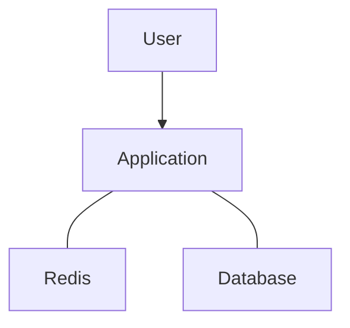

Redis is often placed between the application and the primary database.

---

# 2. Why Does Redis Exist in an Architecture?

Consider an application that repeatedly asks the database for the same information.

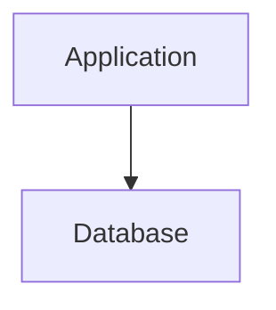

If the database receives millions of repeated reads, unnecessary work may occur.

Redis can provide a faster shared layer:

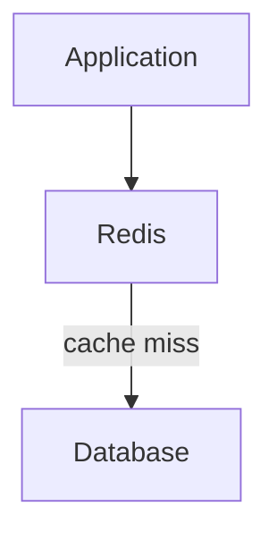

The application can use Redis to avoid repeatedly reaching the database.

---

# 3. Redis Is Not "Just a Cache"

Redis is commonly introduced as a caching technology.

That is useful, but incomplete.

Redis provides data structures and operations that can support several patterns:

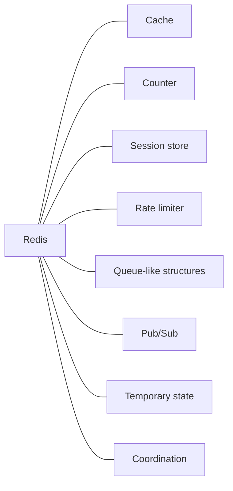

Therefore:

> **Redis is a general-purpose in-memory data store that is often used as a cache.**

This distinction becomes important when deciding whether Redis is an optional optimization or a critical dependency.

---

# 4. Why Is Redis Fast?

A major reason is that Redis keeps frequently accessed data in memory.

Compare a simplified path:

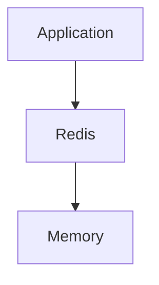

with:

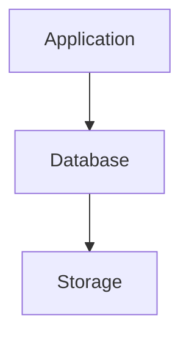

Memory access is generally much faster than storage access.

But do not reduce Redis performance to:

> "Redis is fast because it uses RAM."

There are other factors:

* Simple data structures
* Efficient operations
* In-memory processing
* Network protocol design
* Low-complexity operations
* Avoiding repeated database work

And Redis still has network latency when accessed by another process.

---

# 5. Redis Is Usually a Separate Process

Redis is not normally part of the application process.

A typical architecture is:

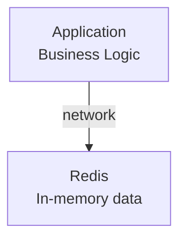

This is different from a local application cache:

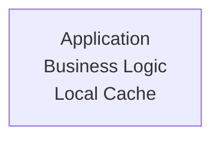

The Redis process can be shared by multiple application instances.

---

# 6. Redis in a Horizontally Scaled Application

Suppose we have:

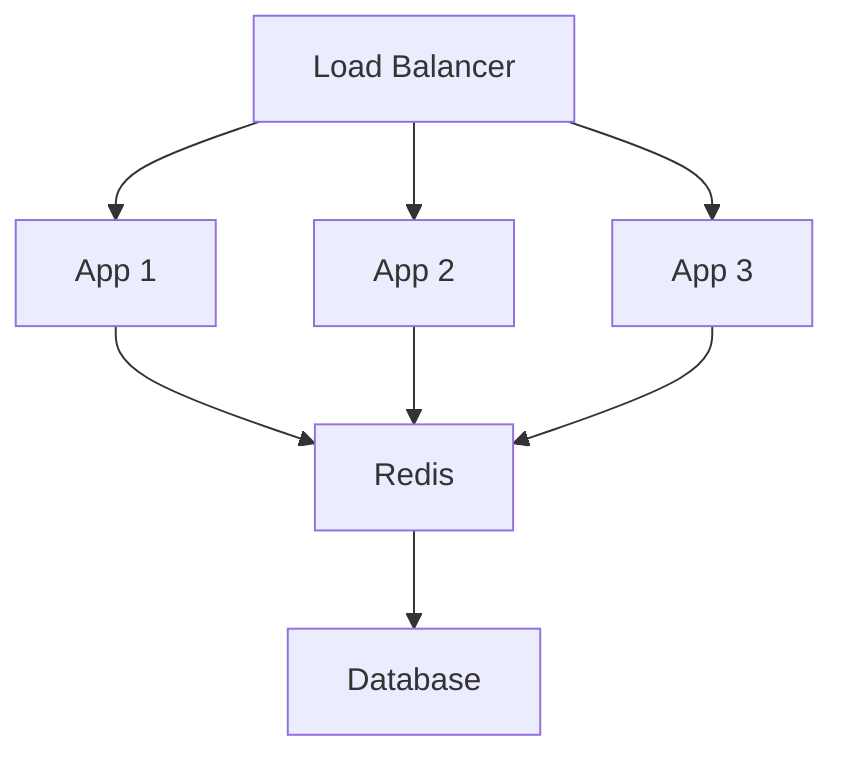

All application instances can access the same Redis data.

This is one reason Redis is useful for horizontally scaled applications.

---

# 7. Redis Keys and Values

The simplest Redis mental model is:

```text
KEY → VALUE
```

For example:

```text
product:123 → {...product data...}
```

Another:

```text
user:456 → {...user data...}
```

A cache lookup might conceptually be:

```text
GET product:123
```

and Redis returns the stored value.

---

# 8. Why Key Naming Matters

Good key naming makes a Redis-based system easier to understand.

For example:

```text
user:123
product:456
order:789
session:abc123
```

Compare that with:

```text
123
456
789
abc123
```

The second approach makes it harder to understand what each value represents.

Namespaces make the purpose explicit.

---

# 9. Cache Key Example

Suppose the application caches a product:

```text
product:123
```

The flow becomes:

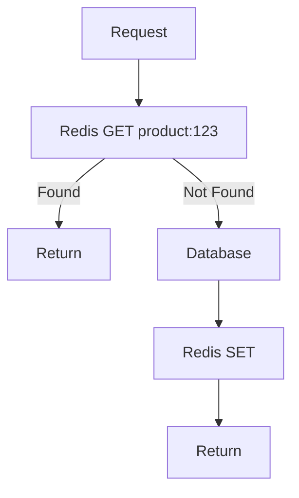

This is the Cache-Aside pattern from **03.05 — Cache-Aside**.

---

# 10. Redis Data Types

Redis supports multiple data structures.

The major ones to understand are:

* Strings
* Hashes
* Lists
* Sets
* Sorted sets
* Streams

The exact feature set depends on the Redis version and deployment.

The important idea is:

> **Redis is not limited to a single string value per key.**

Different data structures support different application problems.

---

# 11. Redis Strings

A Redis string is the simplest value type.

Conceptually:

```text
key → value
```

Example:

```text
user:name:123 → "Ranjit"
```

Strings can also represent:

* Numbers
* Serialized JSON
* Tokens
* Flags
* Counters

For example:

```text
feature:new_checkout → "enabled"
```

---

# 12. Redis Counters

Strings can be used for counters.

For example:

```text
pageviews:homepage → 15000
```

An application can increment the value.

Conceptually:

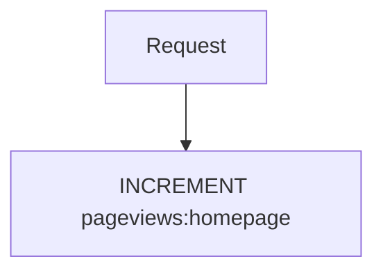

This can be useful for:

* Page views
* Request counts
* Login attempts
* Usage metrics
* Rate limiting

Counters are a simple example of why Redis can be more than a traditional cache.

---

# 13. Redis Hashes

A Redis hash stores multiple fields under one key.

Conceptually:

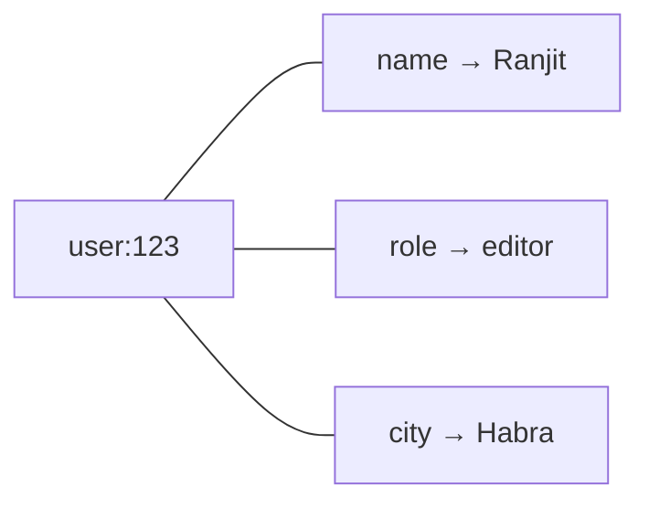

This can be useful when an object naturally consists of multiple fields.

Instead of:

```text
user:123:name
user:123:role
user:123:city
```

a hash can group them:

```text
user:123
```

with fields inside it.

---

# 14. Redis Lists

A Redis list is an ordered collection.

Conceptually:

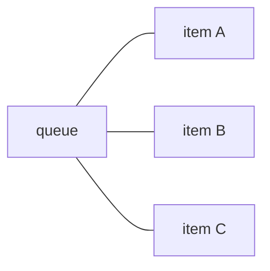

Lists can support queue-like patterns.

For example:

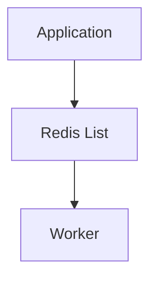

However, whether Redis is the right queue technology depends on the durability, delivery, ordering, retry, and operational requirements.

A Redis list is not automatically equivalent to a full message broker.

---

# 15. Redis Sets

A Redis set stores unique members.

Example:

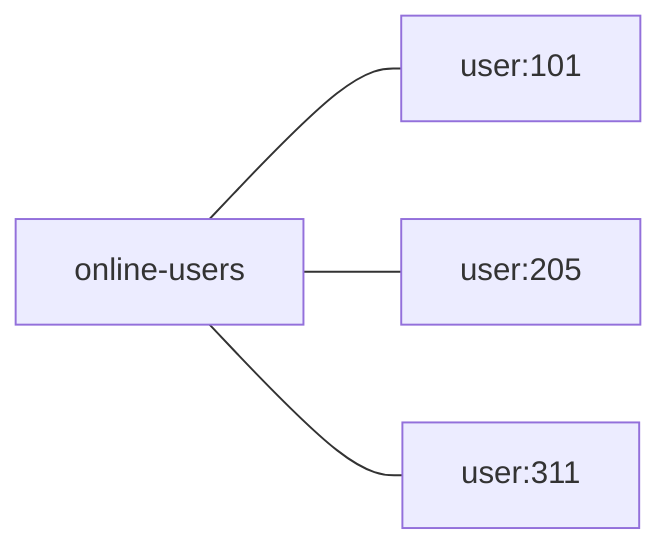

A set is useful when uniqueness matters.

Possible applications include:

* Membership tracking
* Tags
* Feature membership
* Unique IDs

---

# 16. Redis Sorted Sets

A sorted set associates members with scores.

Conceptually:

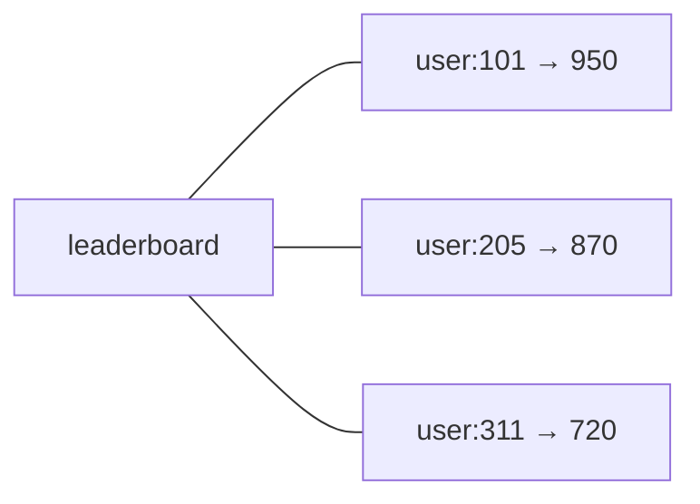

The scores determine ordering.

This can be useful for:

* Leaderboards
* Rankings
* Priority-like structures
* Time-based ordering

---

# 17. Redis Streams

Redis Streams provide an append-oriented data structure for processing sequences of messages/events.

Conceptually:

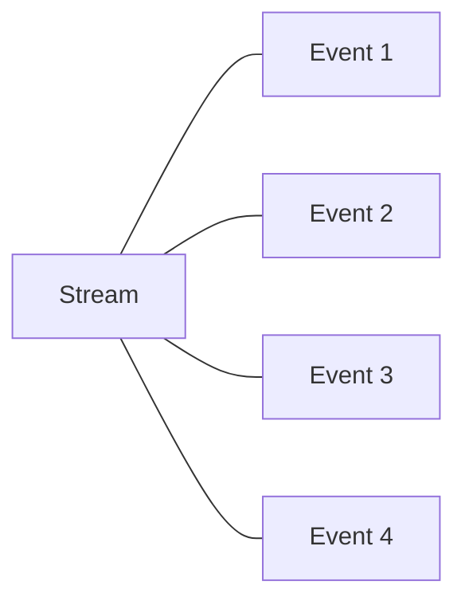

They can support consumer-oriented processing patterns.

However:

> **Redis Streams should not automatically be treated as a replacement for every message broker.**

Systems such as Kafka or RabbitMQ may provide different durability, delivery, operational, and scaling characteristics.

---

# 18. Choosing the Data Type

A simple mental model:

| Need                   | Possible Redis Type |
| ---------------------- | ------------------- |
| Simple value           | String              |
| Object-like fields     | Hash                |
| Ordered collection     | List                |
| Unique membership      | Set                 |
| Ranking                | Sorted Set          |
| Event/message sequence | Stream              |

The data structure should follow the problem.

Do not choose a Redis structure simply because it exists.

---

# 19. Redis TTL

Redis supports expiration for keys.

For example:

```text
session:abc123
TTL = 30 minutes
```

After the configured lifetime:

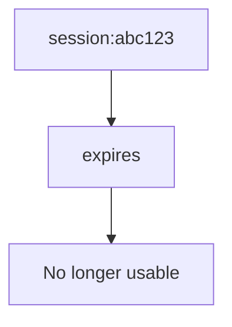

This makes Redis particularly convenient for temporary data.

---

# 20. TTL Example

Suppose:

```text
product:123
TTL = 60 seconds
```

The application writes:

```text
SET product:123 ...
EXPIRE product:123 60
```

Conceptually:

```text
T = 0
Cache entry created

T = 30
Cache entry still usable

T = 60
Entry expires

T > 60
Cache miss
```

The application can then fetch fresh data from the source.

---

# 21. TTL Is Not Invalidation

These concepts remain separate.

### TTL

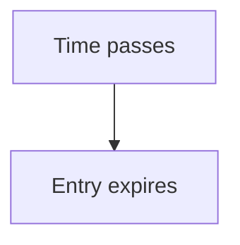

### Invalidation

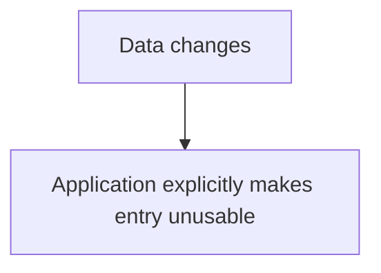

A Redis cache can use both:

```mermaid
flowchart TD
  accTitle: Invalidating in Redis
  accDescr: Database update, then DEL product:123, then Fresh data on next read.
  N0["Database update"] --> N1["DEL product:123"] --> N2["Fresh data on next read"]
```

and:

```mermaid
flowchart TD
  accTitle: TTL as a safety boundary
  accDescr: TTL, then Safety boundary.
  N0["TTL"] --> N1["Safety boundary"]
```

---

# 22. Redis Expiration Is a Policy

Suppose product prices change frequently.

You might use:

```text
TTL = 30 seconds
```

For a relatively stable configuration:

```text
TTL = 1 hour
```

For temporary login state:

```text
TTL = several minutes
```

The correct value depends on:

* Freshness requirement
* Request frequency
* Database cost
* Cache capacity
* Business impact of stale data

There is no universal Redis TTL.

---

# 23. Redis Eviction

Redis memory is finite.

Suppose:

```text
Redis Memory
+----------------------+
| A B C D E F G H      |
+----------------------+
           |
           v
        Capacity
        reached
```

Redis may need to evict keys according to the configured eviction policy.

This is different from expiration.

```text
Expiration
→ key reaches its TTL

Eviction
→ key removed due to memory/resource policy
```

---

# 24. Why Eviction Policy Matters

Consider a cache containing:

```text
popular:product
rare:product
temporary:result
```

If Redis reaches its memory limit, which entries should disappear?

Different policies can make different choices.

Possible strategies include policies based on:

* Least recently used
* Least frequently used
* Random selection
* Expiration status
* No eviction

The appropriate policy depends on the workload.

The system-design lesson is:

> **Cache memory is a finite resource, so eviction is part of cache design.**

---

# 25. Redis Memory Planning

Suppose you estimate:

```text
500,000 keys
```

with an average logical value of:

```text
2 KB
```

A simple estimate:

```text
500,000 × 2 KB
≈ 1 GB
```

But actual Redis memory consumption will be higher because of:

* Key storage
* Data structure overhead
* Object metadata
* Internal memory management
* Replication
* Fragmentation
* Additional structures

Therefore:

> **Never size Redis using only raw application payload size.**

Measure actual memory usage.

---

# 26. Redis and Serialization

Applications often convert objects into a Redis-compatible representation.

For example:

```mermaid
flowchart TD
  accTitle: Writing to Redis
  accDescr: Application Object, then JSON / binary representation, then Redis.
  N0["Application Object"] --> N1["JSON / binary representation"] --> N2["Redis"]
```

On retrieval:

```mermaid
flowchart TD
  accTitle: Reading from Redis
  accDescr: Redis, then Serialized data, then Deserialization, then Application Object.
  N0["Redis"] --> N1["Serialized data"] --> N2["Deserialization"] --> N3["Application Object"]
```

Serialization adds:

* CPU work
* Memory
* Network transfer

For large objects, this can become significant.

---

# 27. Avoid Huge Cache Values

Suppose:

```text
homepage:data
```

contains:

```text
10 MB
```

Every request may require transferring and reconstructing a large object.

Instead, the application might cache smaller pieces:

```text
homepage:products
homepage:categories
homepage:stats
```

This can allow more targeted invalidation.

But it may also require multiple Redis requests.

Again:

> **Cache granularity is a trade-off.**

---

# 28. Redis Persistence

Redis is primarily an in-memory system, but Redis deployments can also use persistence mechanisms.

This matters because:

```mermaid
flowchart TD
  accTitle: Memory is not durable
  accDescr: Data in memory is lost on a process or machine failure.
  M["Memory"] -. "X" .- F["Process / machine failure"]
```

could otherwise result in loss of in-memory state.

Persistence can allow data to be reconstructed after a restart.

However:

> **Persistence does not automatically make Redis equivalent to a traditional relational database.**

Different persistence modes have different durability characteristics.

---

# 29. Why Persistence Matters for a Cache

If Redis is only an optional cache:

```mermaid
flowchart TD
  accTitle: Losing a cache
  accDescr: Redis lost, then Database, then Repopulate cache.
  N0["Redis lost"] --> N1["Database"] --> N2["Repopulate cache"]
```

Loss may be acceptable.

But if Redis stores important application state:

```mermaid
flowchart TD
  accTitle: Losing a data store
  accDescr: Redis lost, then Application data unavailable/lost.
  N0["Redis lost"] --> N1["Application data unavailable/lost"]
```

the durability requirement becomes much more serious.

Therefore:

> **The importance of Redis persistence depends on what the application is storing in Redis.**

---

# 30. Redis as a Cache

The common architecture:

```mermaid
flowchart TD
  accTitle: Redis as a cache
  accDescr: The application checks Redis; on a miss it reads the database.
  N0["Application"] --> N1["Redis"] -->|"MISS"| N2["Database"]
```

Here:

```text
Database = Source of Truth
Redis    = Performance Layer
```

If Redis disappears:

```mermaid
flowchart TD
  accTitle: Rebuilding the cache
  accDescr: Database, then Redis repopulation.
  N0["Database"] --> N1["Redis repopulation"]
```

The system can recover.

This is the simplest Redis role to reason about.

---

# 31. Redis as a Primary Data Store

Redis can also be used to hold application state more directly.

For example:

```mermaid
flowchart TD
  accTitle: Redis as a primary data store
  accDescr: Application, then Redis.
  N0["Application"] --> N1["Redis"]
```

There may be no relational database behind a particular data path.

Now Redis is no longer merely an optional cache.

The system must consider:

* Durability
* Recovery
* Replication
* Backup
* Data lifecycle
* Failure handling
* Capacity
* Consistency

This is a fundamentally different architectural decision.

---

# 32. Cache vs Data Store

A useful distinction:

### Redis as cache

```mermaid
flowchart TD
  accTitle: Redis as a cache
  accDescr: Redis, then Database.
  N0["Redis"] --> N1["Database"]
```

If Redis loses data:

```text
Rebuild from database
```

### Redis as primary store

```mermaid
flowchart TD
  accTitle: Redis as the primary store
  accDescr: Application, then Redis.
  N0["Application"] --> N1["Redis"]
```

If Redis loses data:

```text
Where does the data come from?
```

The answer determines the durability architecture.

---

# 33. Redis Replication

Redis can be deployed with replicas.

Conceptually:

```mermaid
flowchart TD
  accTitle: Replication
  accDescr: A primary replicates to Replica 1 and Replica 2.
  P["Primary"] --- R1["Replica 1"]
  P --- R2["Replica 2"]
```

Replication can provide:

* Additional copies of data
* Read scaling in some architectures
* Recovery options
* High-availability building blocks

But replication itself introduces concerns:

* Replication lag
* Failover
* Network partitions
* Operational complexity

---

# 34. Primary and Replica

A simplified architecture:

```mermaid
flowchart TD
  accTitle: Primary and replica
  accDescr: The application writes to the primary Redis, which replicates to Replica 1 and Replica 2.
  A["Application"] --> P["Primary Redis"]
  P --- R1["Replica 1"]
  P --- R2["Replica 2"]
```

Writes generally go to the primary.

Replicas receive replicated state.

A read may sometimes be served by a replica, depending on the architecture.

But if the application requires the most recent value immediately after a write, replica lag matters.

---

# 35. Replication Does Not Automatically Mean Strong Consistency

Suppose:

```text
T1:
Primary = value B

T2:
Replica = value A
```

The replica has not caught up yet.

An application reading from the replica may see older data.

Therefore:

> **Replication provides copies, not automatic zero-lag consistency.**

The application must understand the consistency behavior it requires.

---

# 36. Redis High Availability

A production system may need Redis to survive failures.

A simplified architecture:

```mermaid
flowchart TD
  accTitle: High availability
  accDescr: The Redis primary has two replicas, and a failover system watches them.
  P["Redis Primary"] --- R1["Replica"]
  P --- R2["Replica"]
  R1 --> F["Failover System"]
```

High availability can involve:

* Replication
* Health monitoring
* Automatic failover
* Multiple nodes
* Failure detection

The exact architecture depends on the Redis deployment model and infrastructure.

---

# 37. Redis Failure Scenario

Suppose:

```mermaid
flowchart TD
  accTitle: Redis is down
  accDescr: The application reaches Redis, which is down.
  A["Application"] --> R["Redis"] -. "X" .- D["DOWN"]
```

If Redis is only a cache:

```mermaid
flowchart TD
  accTitle: Falling back to the database
  accDescr: Application, then Database.
  N0["Application"] --> N1["Database"]
```

may be a valid fallback.

But now database load increases.

Therefore the architecture needs to answer:

> **Can the database survive the traffic normally absorbed by Redis?**

---

# 38. Cache Failure and Cascading Failure

Normal state:

```mermaid
flowchart TD
  accTitle: Normal operation
  accDescr: 10,000 requests per second reach Redis; 90% hit, and the rest reach the database.
  N0["10,000 requests/s"] --> N1["Redis"] -->|"90% hits"| N2["Database"]
```

The database may see only:

```text
1,000 requests/s
```

Now Redis fails.

Potentially:

```mermaid
flowchart TD
  accTitle: After Redis fails
  accDescr: 10,000 requests/s, then Database.
  N0["10,000 requests/s"] --> N1["Database"]
```

The database may become overloaded.

Then:

```mermaid
flowchart TD
  accTitle: Cascading failure
  accDescr: Redis failure, then Database overload, then Slow responses, then More concurrent requests, then Timeouts, then Retries, then Even more load.
  N0["Redis failure"] --> N1["Database overload"] --> N2["Slow responses"] --> N3["More concurrent requests"] --> N4["Timeouts"] --> N5["Retries"] --> N6["Even more load"]
```

This is a classic cascading-failure pattern.

---

# 39. Protecting the Database During Redis Failure

Possible techniques include:

* Request rate limiting
* Circuit breakers
* Local fallback cache
* Graceful degradation
* Database connection limits
* Backpressure
* Load shedding
* Stale cached data
* Controlled cache warm-up

The correct combination depends on the system.

The key idea:

> **Design the cache failure path, not only the cache success path.**

---

# 40. Redis and Rate Limiting

Redis counters are useful for rate limiting.

Suppose:

```text
user:123:requests
```

tracks request count.

Conceptually:

```mermaid
flowchart TD
  accTitle: Rate limiting with Redis
  accDescr: A request increments a Redis counter. Under the limit: allow. Over the limit: reject.
  R["Request"] --> C["Redis Counter"]
  C -->|"under limit"| A["Allow"]
  C -->|"over limit"| J["Reject"]
```

A TTL can define the window.

For example:

```text
100 requests
per
60 seconds
```

The implementation details matter, especially around concurrency and atomicity.

---

# 41. Redis and Sessions

Traditional server-side sessions may look like:

```mermaid
flowchart TD
  accTitle: Sessions in Redis
  accDescr: The browser sends its session ID; the application looks up the session data in Redis.
  N0["Browser"] -->|"session ID"| N1["Application"] --> N2["Redis"] --> N3["Session Data"]
```

This can help multiple application instances access the same session state:

```mermaid
flowchart TD
  accTitle: Shared sessions
  accDescr: The load balancer spreads requests over App 1, App 2 and App 3, which share sessions in Redis.
  L["Load Balancer"] --> A["App 1"] & B["App 2"] & C["App 3"]
  A & B & C --- R["Redis"]
```

Without shared session storage, session state kept only in local process memory can become problematic after horizontal scaling.

---

# 42. Redis and Distributed Locks

Redis can be used in some distributed coordination patterns.

Conceptually:

```mermaid
flowchart LR
  accTitle: A lock in Redis
  accDescr: App 1, App 2 and App 3 coordinate through Redis.
  A["App 1"] & B["App 2"] & C["App 3"] --> R["Redis"]
```

The application can attempt to acquire a lock for a resource.

For example:

```text
lock:order:123
```

But distributed locking is subtle.

A lock must consider:

* Expiration
* Ownership
* Failure
* Clock behavior
* Network partitions
* Duplicate acquisition
* Release safety

Do not treat:

```text
SET lock
```

as a complete distributed-locking design.

---

# 43. Redis and Pub/Sub

Redis can support publish/subscribe patterns.

Conceptually:

```mermaid
flowchart TD
  accTitle: Pub/Sub
  accDescr: A publisher sends to a Redis channel, which delivers to App 1, App 2 and App 3.
  P["Publisher"] --> C["Redis Channel"]
  C --> A["App 1"] & B["App 2"] & D["App 3"]
```

A publisher sends an event.

Subscribers receive it.

Possible uses:

* Cache invalidation notifications
* Real-time application events
* Local development messaging
* Lightweight notifications

But Pub/Sub has specific delivery semantics.

If a subscriber is disconnected, it may miss messages.

Therefore:

> **Pub/Sub is not automatically a durable message queue.**

---

# 44. Redis and Cache Invalidation

Suppose multiple application instances have local caches:

```text
App 1 → Local Cache
App 2 → Local Cache
App 3 → Local Cache
```

A product changes.

An event can notify instances:

```mermaid
flowchart TD
  accTitle: Invalidating local caches with Pub/Sub
  accDescr: A product update goes through Redis Pub/Sub to App1, App2 and App3, which invalidate their local caches.
  U["Product Updated"] --> P["Redis Pub/Sub"]
  P --> A["App1"] & B["App2"] & C["App3"]
  A & B & C --- I["Invalidate local cache"]
```

This can help coordinate cache invalidation.

But delivery guarantees and failure behavior must be considered.

---

# 45. Redis and Queues

Redis structures can support queue-like designs:

```mermaid
flowchart TD
  accTitle: A queue-like pattern
  accDescr: Producer, then Redis, then Worker.
  N0["Producer"] --> N1["Redis"] --> N2["Worker"]
```

This can be useful for lightweight workloads.

However, a production queue may require:

* Durable messages
* Retries
* Dead-letter handling
* Delivery guarantees
* Ordering
* Backpressure
* Consumer groups
* Operational tooling

If those requirements become significant, a dedicated messaging system may be more appropriate.

This connects to:

**Level 5 — Asynchronous Systems**

---

# 46. Redis vs Relational Database

| Redis                       | Relational Database                |
| --------------------------- | ---------------------------------- |
| Primarily memory-oriented   | Storage-oriented                   |
| Key/data-structure access   | Relational queries                 |
| Very fast simple operations | Complex querying                   |
| TTL built in                | Usually application/schema-managed |
| Useful for temporary state  | Strong system-of-record role       |
| Limited relational modeling | Rich relationships                 |
| Often used as cache         | Often source of truth              |

These are not competing technologies in every architecture.

A system may use both:

```mermaid
flowchart LR
  accTitle: Redis beside a relational database
  accDescr: The application uses Redis and PostgreSQL.
  R["Application"]
  R --- K0["Redis"]
  R --- K1["PostgreSQL"]
```

---

# 47. Redis vs Memcached

Both Redis and Memcached can be used as distributed caches.

At a high level:

### Memcached

Primarily a simple distributed in-memory cache.

### Redis

Provides a richer set of:

* Data structures
* Expiration
* Counters
* Streams
* Pub/Sub
* Persistence options
* Replication capabilities

This does not mean Redis is automatically the correct choice.

The right technology depends on the required behavior.

---

# 48. Redis Is Not Always Necessary

A small application may have:

```mermaid
flowchart TD
  accTitle: A simple system
  accDescr: Users, then Application, then Database.
  N0["Users"] --> N1["Application"] --> N2["Database"]
```

If performance is already sufficient, adding Redis introduces:

```mermaid
flowchart TD
  accTitle: Redis added
  accDescr: Application, then Redis, then Database.
  N0["Application"] --> N1["Redis"] --> N2["Database"]
```

Now you have another:

* Service
* Deployment
* Network dependency
* Monitoring target
* Failure mode
* Capacity problem

Therefore:

> **Do not introduce Redis merely because production systems commonly use it.**

Introduce it when the workload justifies it.

---

# 49. When Redis Makes Sense

Redis can make sense when you need:

* Very fast shared reads
* High-volume repeated data access
* Shared session state
* Counters
* Rate limiting
* Temporary state
* Shared application cache
* Lightweight coordination
* Specific Redis data structures
* Low-latency access to frequently used data

---

# 50. When Redis May Not Be Necessary

Redis may provide limited value when:

* Traffic is low
* Database performance is already sufficient
* Data is rarely reused
* The workload requires complex relational queries
* Cache invalidation would be more complicated than the performance benefit
* Another existing cache layer already solves the problem
* Operational simplicity is more valuable

The architecture should follow the bottleneck.

---

# 51. Redis and Connection Management

Redis is a network service.

Therefore applications need connections to it.

A simplified path:

```mermaid
flowchart TD
  accTitle: A Redis connection
  accDescr: The application talks to Redis over a connection.
  N0["Application"] -->|"Redis connection"| N1["Redis"]
```

At high traffic, inefficient connection management can create unnecessary overhead.

Applications commonly use connection pooling or reusable connections depending on their runtime and Redis client.

The important principle:

> **A fast cache can still become a bottleneck if the application interacts with it inefficiently.**

---

# 52. Redis Network Latency

Suppose the application and Redis are far apart:

```mermaid
flowchart TD
  accTitle: A distant Redis
  accDescr: The application reaches Redis over a long network path.
  N0["Application"] -->|"long network path"| N1["Redis"]
```

The benefit of an in-memory data store can be reduced by network latency.

A better architecture generally keeps tightly coupled low-latency components geographically close:

```mermaid
flowchart TD
  accTitle: A nearby Redis
  accDescr: The application reaches Redis over a low-latency network.
  N0["Application"] -->|"low-latency network"| N1["Redis"]
```

This becomes especially important when an application performs many Redis operations per request.

---

# 53. Too Many Redis Calls

Suppose one HTTP request performs:

```text
GET key1
GET key2
GET key3
GET key4
GET key5
GET key6
```

Each operation can introduce network and processing overhead.

Even though Redis is fast, many sequential network calls can add latency.

Possible strategies include:

* Batch operations
* Pipelining
* Better cache modeling
* Fewer round trips
* Parallel requests where appropriate

The principle:

> **Optimize the interaction with Redis, not just Redis itself.**

---

# 54. Redis and Pipelining

Pipelining allows multiple commands to be sent without waiting for each response individually.

Instead of:

```text
App → Redis
     ← response

App → Redis
     ← response

App → Redis
     ← response
```

a pipeline can conceptually batch them:

```mermaid
flowchart TD
  accTitle: Pipelining
  accDescr: The app sends commands 1, 2 and 3 together; Redis sends the responses back together.
  N0["App"] -->|"command 1<br/>command 2<br/>command 3"| N1["Redis"] -->|"responses"| N2["App"]
```

This can reduce network round trips.

But batching too much can increase memory usage and response size.

---

# 55. Redis and Atomic Operations

Some Redis operations are atomic at the command level.

This can be useful for:

* Counters
* Conditional updates
* Rate limiting
* Simple coordination

For example:

```text
INCR requests:user:123
```

can safely increment a counter as a Redis operation.

Atomicity is useful, but it does not mean every multi-step application workflow is automatically atomic.

---

# 56. Redis Transactions

Redis provides mechanisms for grouping operations.

But Redis transactions should not be confused with relational database transactions.

A Redis transaction model has different semantics from:

```text
BEGIN
UPDATE ...
UPDATE ...
COMMIT
```

in a relational database.

Therefore:

> **Do not assume that "Redis transaction" means the same thing as an ACID database transaction.**

Always reason about the actual guarantees required by the operation.

---

# 57. Redis and Lua / Server-Side Logic

Redis can execute certain logic close to the data using server-side scripting mechanisms.

This can help when multiple operations need to be coordinated.

Conceptually:

```mermaid
flowchart LR
  accTitle: Server-side logic
  accDescr: The application asks Redis to run operations A, B and C together.
  A["Application"] --> R["Redis"]
  R --- X["Operation A"]
  R --- Y["Operation B"]
  R --- Z["Operation C"]
```

This can reduce round trips and provide atomic behavior for appropriate operations.

But server-side logic also introduces:

* Complexity
* CPU consumption
* Operational concerns
* Debugging difficulty

Use it when the problem justifies it.

---

# 58. Redis Memory Pressure

Suppose Redis memory reaches capacity:

```text
Redis
+----------------------+
|██████████████████████|
+----------------------+
         100%
```

Possible outcomes depend on configuration:

* Keys are evicted
* Writes fail
* Temporary data disappears
* Application errors increase

This is why monitoring memory utilization is important.

A Redis cache should have a deliberate capacity policy.

---

# 59. Redis Monitoring

Useful metrics include:

### Memory

```text
Used memory
Peak memory
Fragmentation
```

### Operations

```text
Commands/second
Reads
Writes
```

### Performance

```text
Latency
Slow operations
```

### Connections

```text
Connected clients
Connection failures
```

### Cache behavior

```text
Hits
Misses
Evictions
Expired keys
```

### Replication

```text
Replication lag
Replica health
```

The exact metrics depend on how Redis is being used.

---

# 60. Redis Failure Modes

A production Redis architecture should consider:

```text
Redis process failure
Machine failure
Network failure
Memory exhaustion
Replica failure
Replication lag
Failover problems
Hot keys
Slow commands
Connection exhaustion
Incorrect eviction
```

The goal is not to eliminate every failure.

The goal is to understand:

> **What happens to the application when each failure occurs?**

---

# 61. Redis and Graceful Degradation

Suppose Redis stores recommendations:

```text
recommendations:user:123
```

If Redis fails, the application may choose:

```mermaid
flowchart TD
  accTitle: Graceful degradation
  accDescr: Redis unavailable, then Return basic recommendations.
  N0["Redis unavailable"] --> N1["Return basic recommendations"]
```

instead of:

```mermaid
flowchart TD
  accTitle: No degradation
  accDescr: Redis unavailable, then Request fails completely.
  N0["Redis unavailable"] --> N1["Request fails completely"]
```

This is **graceful degradation**.

Whether it is possible depends on the business requirement.

---

# 62. Redis and Critical State

Now consider:

```text
payment:processing:123
```

If Redis contains state required to safely process a payment, silently ignoring Redis failure may be dangerous.

The application may need to stop the operation rather than guess.

This demonstrates an important distinction:

```text
Optional cached data
→ degrade if unavailable

Critical state
→ protect correctness if unavailable
```

The architecture must classify the data.

---

# 63. Redis and Data Classification

Before storing something in Redis, ask:

```text
What kind of data is this?
```

Possible categories:

```text
1. Optional cache
2. Temporary state
3. Shared session state
4. Coordination state
5. Durable application data
```

Each category requires different guarantees.

For example:

```text
Optional cache
→ loss may be acceptable

Durable state
→ loss may be unacceptable
```

This classification should happen before choosing persistence and availability requirements.

---

# 64. Redis Architecture Evolution

A small application may begin:

```mermaid
flowchart TD
  accTitle: Stage 1
  accDescr: Application, then Database.
  N0["Application"] --> N1["Database"]
```

Then repeated reads become expensive:

```mermaid
flowchart TD
  accTitle: Stage 2
  accDescr: Application, then Redis, then Database.
  N0["Application"] --> N1["Redis"] --> N2["Database"]
```

Later, multiple application instances need shared state:

```mermaid
flowchart LR
  accTitle: Stage 3
  accDescr: App 1, App 2 and App 3 share Redis in front of the database.
  A["App 1"] & B["App 2"] & C["App 3"] --> R["Redis"] --> D["Database"]
```

Later, availability becomes important:

```mermaid
flowchart TD
  accTitle: Stage 4
  accDescr: The Redis primary replicates to Replica 1 and Replica 2.
  P["Redis Primary"] --> R1["Replica 1"] & R2["Replica 2"]
```

Eventually:

```mermaid
flowchart TD
  accTitle: Stage 5
  accDescr: Applications, then Redis Cluster / HA architecture, then Database.
  N0["Applications"] --> N1["Redis Cluster / HA architecture"] --> N2["Database"]
```

The architecture grows because the requirements grow.

---

# 65. Redis and System Design

Redis is a tool.

The system-design question is not:

> "Should we use Redis?"

The better question is:

> **"What problem are we trying to solve, and what guarantees do we need?"**

For example:

### Problem

Database receives too many repeated reads.

Possible solution:

```text
Redis Cache
```

### Problem

Need shared session state across application instances.

Possible solution:

```text
Redis
```

### Problem

Need a leaderboard.

Possible solution:

```text
Redis Sorted Set
```

### Problem

Need a durable, replayable event platform.

Redis may not automatically be the right answer.

The requirement comes first.

---

# 66. A Practical Redis Decision Framework

Before introducing Redis, ask:

### 1. What problem are we solving?

Be specific.

```text
Database load?
Latency?
Sessions?
Rate limiting?
Temporary state?
```

### 2. How much traffic exists?

Estimate:

```text
Requests/second
Reads/second
Writes/second
```

### 3. How reusable is the data?

Measure actual access patterns.

### 4. How fresh must the data be?

Define:

```text
TTL
Invalidation
Consistency
```

### 5. Is Redis optional?

Can the system fall back to another source?

### 6. How much memory is required?

Estimate and measure.

### 7. What happens if Redis fails?

Define the failure path.

### 8. Does the application require shared state?

If yes, local cache may not be enough.

### 9. Does Redis need persistence?

Depends on whether the data can be reconstructed.

### 10. What operational complexity are we accepting?

Redis is another production dependency.

---

# 67. Hands-On Lab — Redis as an Application Cache

This lab builds directly on **03.14 — Application-Level Caching**.

Use:

* PostgreSQL
* Redis
* Your backend application

---

## Step 1 — Run Redis

Start a local Redis instance.

Verify that the application can connect to:

```text
localhost:6379
```

---

## Step 2 — Test Basic Key/Value Operations

Create:

```text
product:1
```

with a simple value.

Conceptually:

```text
SET product:1 "Laptop"
```

Then:

```text
GET product:1
```

Observe the result.

---

## Step 3 — Add TTL

Set:

```text
product:1
TTL = 30 seconds
```

Then inspect the remaining TTL.

Observe:

```text
30
29
28
...
0
```

After expiration:

```text
GET product:1
```

should no longer return the cached value.

---

## Step 4 — Use a Hash

Create:

```text
product:1
```

with fields such as:

```text
name
price
category
```

Observe how a Redis hash differs from storing one serialized JSON value.

---

## Step 5 — Build Cache-Aside

Implement:

```text
GET /products/1
```

Flow:

```mermaid
flowchart TD
  accTitle: Step 5 — Cache-Aside
  accDescr: Redis GET product:1. HIT: return. MISS: read PostgreSQL, Redis SET, return.
  A["Application"] --> G["Redis GET product:1"]
  G -->|"HIT"| H["Return"]
  G -->|"MISS"| P["PostgreSQL"] --> S["Redis SET"] --> T["Return"]
```

---

## Step 6 — Add Invalidation

Implement:

```text
PUT /products/1
```

Flow:

```mermaid
flowchart TD
  accTitle: Step 6 — invalidation
  accDescr: Update PostgreSQL, then Commit, then DEL product:1.
  N0["Update PostgreSQL"] --> N1["Commit"] --> N2["DEL product:1"]
```

Then test:

```text
GET /products/1
```

The next request should rebuild the cache.

---

## Step 7 — Simulate Redis Failure

Stop Redis.

Then make:

```text
GET /products/1
```

Observe:

```mermaid
flowchart TD
  accTitle: Step 7 — Redis failure
  accDescr: Redis unavailable, then Database fallback.
  N0["Redis unavailable"] --> N1["Database fallback"]
```

Measure the database load.

---

## Step 8 — Add Metrics

Track:

```text
Redis hits
Redis misses
Redis errors
Database queries
Redis latency
Database latency
```

Compare:

```text
Redis enabled
vs
Redis unavailable
```

This demonstrates why cache failure can change the load profile of the entire system.

---

## Step 9 — Simulate Multiple Application Instances

Run:

```text
App 1
App 2
App 3
```

All should connect to the same Redis instance.

Then:

```text
App 1 → SET product:1
```

Check:

```text
App 2 → GET product:1
App 3 → GET product:1
```

Observe that the cache is shared.

---

## Step 10 — Test a Hot Key

Generate many requests for:

```text
product:1
```

Measure:

```text
Requests
Redis operations
Database queries
```

Then remove the key and generate concurrent requests.

Observe what happens when many requests experience a cache miss simultaneously.

This connects the experiment back to:

**03.10 — Cache Stampede**

---

# 68. Lab Challenge

Build a small endpoint:

```text
GET /leaderboard
```

Store scores in a Redis sorted set.

Example:

```text
leaderboard
 |
 +-- user:101 → 950
 +-- user:205 → 870
 +-- user:311 → 720
```

Then implement:

```text
GET /leaderboard/top/10
```

Questions:

1. Why is a sorted set useful here?
2. Why might Redis be more convenient than recalculating the ranking from a database every request?
3. What happens if Redis loses the leaderboard?
4. Can the leaderboard be rebuilt from another source?
5. Does the leaderboard need strong durability?

The goal is not merely to use a Redis command.

The goal is to identify the required system guarantees.

---

# 69. Common Redis Mistakes

## Mistake 1 — Adding Redis Without a Bottleneck

```mermaid
flowchart TD
  accTitle: Adding Redis without a bottleneck
  accDescr: Database is fine, then Add Redis anyway.
  N0["Database is fine"] --> N1["Add Redis anyway"]
```

This increases complexity without necessarily solving a problem.

---

## Mistake 2 — Treating Redis as Automatically Durable

Redis can support persistence, but the durability guarantees depend on configuration and architecture.

---

## Mistake 3 — Storing Unlimited Data

Memory is finite.

A cache without capacity planning eventually becomes a problem.

---

## Mistake 4 — Ignoring Serialization Cost

Large cached objects can consume significant CPU, memory, and network bandwidth.

---

## Mistake 5 — Ignoring Redis Failure

Always define:

```text
What happens when Redis is unavailable?
```

---

## Mistake 6 — Assuming Replication Means Zero Data Loss

Replication can involve lag.

Do not assume every replica has the latest state immediately.

---

## Mistake 7 — Using Redis as a Database Without Database-Level Reasoning

If Redis becomes the primary store, think about:

* Durability
* Backup
* Recovery
* Availability
* Data lifecycle
* Capacity

---

## Mistake 8 — Making Too Many Sequential Redis Calls

A large number of network round trips can become a latency problem.

---

## Mistake 9 — Ignoring Hot Keys

One extremely popular key can create a concentrated load even when total traffic looks manageable.

---

## Mistake 10 — Confusing Pub/Sub With Durable Messaging

A Pub/Sub message is not automatically a durable event that every future consumer can replay.

---

# 70. Redis in the Bigger System

A common architecture might look like:

```mermaid
flowchart TD
  accTitle: Redis in the bigger system
  accDescr: Users reach the CDN and the load balancer, which spreads requests over App 1, App 2 and App 3; they share Redis, and cache misses go to the database.
  U["Users"] --> C["CDN"] --> L["Load Balancer"]
  L --> A["App 1"] & B["App 2"] & D["App 3"]
  A & B & D --> R["Redis"] -->|"Cache Miss"| DB["Database"]
```

Redis sits between the application and its slower or more authoritative data sources.

But Redis can also support other responsibilities:

```mermaid
flowchart LR
  accTitle: What Redis is used for
  accDescr: Redis is used for caching, sessions, counters, rate limiting, pub/sub, streams and coordination.
  R["Redis"]
  R --- K0["Cache"]
  R --- K1["Sessions"]
  R --- K2["Counters"]
  R --- K3["Rate Limiting"]
  R --- K4["Pub/Sub"]
  R --- K5["Streams"]
  R --- K6["Coordination"]
```

Each responsibility has different reliability requirements.

---

# 71. The Most Important Redis Question

When someone says:

> "Let's use Redis."

Ask:

> **"For what?"**

If the answer is:

```text
Database is overloaded
```

ask:

```text
Which queries?
How repetitive?
How expensive?
How fresh must the data be?
```

If the answer is:

```text
We need sessions
```

ask:

```text
How many users?
How long should sessions live?
What happens if Redis fails?
```

If the answer is:

```text
We need a queue
```

ask:

```text
Do we need durability?
Retries?
Ordering?
Replay?
Dead-letter handling?
```

The technology comes after the requirements.

---

# 72. Redis Decision Table

| Requirement                    | Redis May Help          |
| ------------------------------ | ----------------------- |
| Repeated reads                 | Yes                     |
| Low-latency shared cache       | Yes                     |
| Temporary state                | Yes                     |
| Session storage                | Often                   |
| Counters                       | Yes                     |
| Rate limiting                  | Often                   |
| Leaderboards                   | Yes                     |
| Lightweight Pub/Sub            | Yes                     |
| Queue-like workloads           | Sometimes               |
| Durable event streaming        | Depends on requirements |
| Complex relational queries     | No                      |
| Primary relational data model  | No                      |
| Automatic consistency solution | No                      |

---

# 73. System Design Mental Model

Think about Redis as:

```mermaid
flowchart TD
  accTitle: System design mental model
  accDescr: The application uses Redis for fast, shared, reusable state, and the database for authoritative, durable data.
  A["Application"] --> R["Redis<br/>Fast / shared<br/>reusable state"]
  A --> D["Database<br/>Authoritative<br/>durable data"]
```

When Redis is used as a cache:

```mermaid
flowchart TD
  accTitle: The Redis question
  accDescr: Redis, then "Can I answer this quickly?".
  N0["Redis"] --> N1["#quot;Can I answer this quickly?#quot;"]
```

If yes:

```text
Return cached result
```

If no:

```mermaid
flowchart TD
  accTitle: If not
  accDescr: Go to source, then Get authoritative result, then Populate Redis, then Return.
  N0["Go to source"] --> N1["Get authoritative result"] --> N2["Populate Redis"] --> N3["Return"]
```

This is the core relationship.

---

# 74. Key Principle

> **Redis is a fast in-memory data store that can serve as an application cache, shared state layer, or specialized data structure store. Its value comes from matching its capabilities to a specific system requirement—not from adding Redis by default.**

Remember:

```mermaid
flowchart LR
  accTitle: Key principle
  accDescr: Redis is fast, in-memory and shared, with data structures, TTL, counters, optional persistence, replication and multiple application patterns.
  R["Redis"]
  R --- K0["Fast"]
  R --- K1["In-memory"]
  R --- K2["Shared"]
  R --- K3["Data structures"]
  R --- K4["TTL"]
  R --- K5["Counters"]
  R --- K6["Optional persistence"]
  R --- K7["Replication"]
  R --- K8["Multiple application patterns"]
```

But always ask:

```mermaid
flowchart TD
  accTitle: Before choosing Redis
  accDescr: What problem?, then What data?, then What guarantees?, then What failure behavior?, then What operational cost?.
  N0["What problem?"] --> N1["What data?"] --> N2["What guarantees?"] --> N3["What failure behavior?"] --> N4["What operational cost?"]
```

---

# 75. Quick Reference

| Concept           | Meaning                                                    |
| ----------------- | ---------------------------------------------------------- |
| Redis             | In-memory data store                                       |
| Key               | Identifier for stored data                                 |
| String            | Simple Redis value type                                    |
| Hash              | Collection of fields under one key                         |
| List              | Ordered collection                                         |
| Set               | Unique collection                                          |
| Sorted Set        | Members ordered by scores                                  |
| Stream            | Append-oriented event/data structure                       |
| TTL               | Time-to-live for a key                                     |
| Expiration        | Key becomes unusable after its lifetime                    |
| Eviction          | Key removed due to memory policy                           |
| Persistence       | Mechanism for recovering data after restart/failure        |
| Replication       | Maintaining copies of Redis data                           |
| Primary           | Redis node receiving primary writes in a replication setup |
| Replica           | Copy of primary data                                       |
| Hot Key           | Extremely frequently accessed key                          |
| Cache Miss        | Requested data unavailable in cache                        |
| Cache Hit         | Requested data available                                   |
| Pub/Sub           | Publish and subscribe messaging pattern                    |
| Distributed Cache | Shared cache accessed by multiple application instances    |

---

# 76. Knowledge Check

### 1. What is Redis?

An in-memory data store commonly used for caching, temporary state, counters, sessions, coordination, and other low-latency workloads.

---

### 2. Why is Redis commonly used for application caching?

Because it provides fast access to frequently reused data and can be shared by multiple application instances.

---

### 3. Is Redis only a cache?

No.

Redis supports multiple data structures and application patterns.

---

### 4. Why can Redis help horizontally scaled applications?

Multiple application instances can access the same shared Redis data.

---

### 5. What is the difference between expiration and eviction?

```text
Expiration → TTL causes the entry to become unusable.

Eviction → Cache removes data according to its memory/resource policy.
```

---

### 6. Does replication guarantee zero-lag consistency?

No.

Replicas can temporarily lag behind the primary.

---

### 7. Why does Redis failure potentially overload the database?

Because requests that normally receive cached responses may fall through to the database.

---

### 8. Why is Redis persistence important?

It determines how Redis data can be recovered after process or infrastructure failure.

Its importance depends on whether Redis data is disposable cache data or important application state.

---

### 9. Why are Redis data structures useful?

They allow Redis to support more than simple key-value caching, such as counters, rankings, sets, lists, and streams.

---

### 10. Should every production application use Redis?

No.

Redis should be introduced when the workload and system requirements justify its benefits and operational cost.
