# 04.01 — How Applications Store Data

## Learning Objectives

By the end of this chapter, you should understand:

* Why applications need persistent data storage
* The difference between application memory and persistent storage
* What a data store is
* How an application writes and reads data
* Why applications usually use a database instead of files
* What happens between an application and its database
* How data storage affects system design
* The difference between storing data and processing data
* Why different applications need different storage strategies
* How storage requirements change as a system grows

---

# 1. Why Do Applications Need to Store Data?

An application can calculate things and respond to requests without storing much information.

For example:

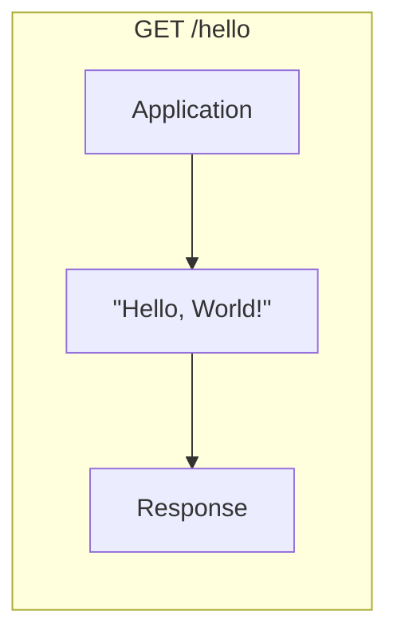

Nothing needs to be remembered.

But real applications usually need to remember things.

A user creates an account:

```text
Name: Riya
Email: riya@example.com
```

An e-commerce customer places an order:

```text
Order #1024
Customer: Riya
Product: Laptop
Quantity: 1
Amount: ₹65,000
```

A social application stores:

```text
User
Post
Comment
Like
Follow
Message
```

A banking application stores:

```text
Account
Transaction
Balance
Beneficiary
Payment
```

The application therefore needs somewhere to keep information so that it can be retrieved later.

That is the fundamental purpose of **data storage**.

---

# 2. Data Must Survive the Request

Consider this request:

```text
POST /users

{
    "name": "Riya",
    "email": "riya@example.com"
}
```

The application receives the request.

It can temporarily keep the data in memory:

```text
Application Memory

name  → Riya
email → riya@example.com
```

But what happens when the request finishes?

The process may continue running, but the data in memory is not automatically a reliable permanent record.

Even worse, the application process could restart:

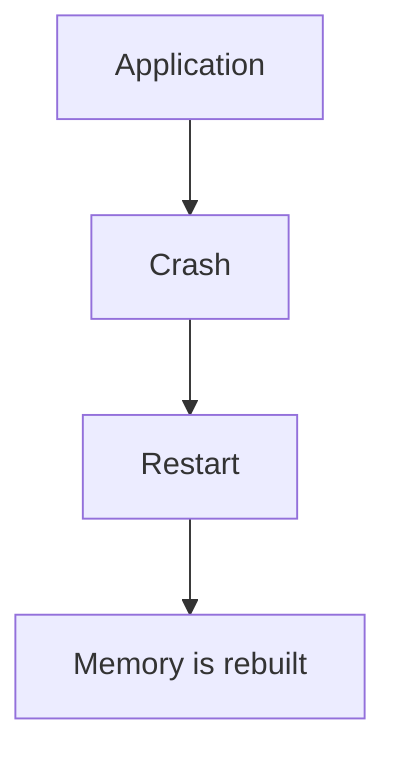

The previously stored in-memory data may be gone.

Therefore, important application data normally needs **persistent storage**.

---

# 3. Memory vs Persistent Storage

There are two important concepts to understand.

## Application Memory

Memory such as RAM is extremely useful for temporary working data.

For example:

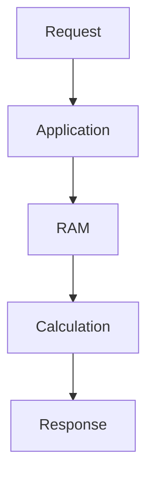

Memory is fast, but application memory is generally temporary.

## Persistent Storage

Persistent storage is designed to retain data beyond an individual request or application process.

Examples include:

* Databases
* Files
* Object storage
* Persistent logs
* Specialized data stores

The basic distinction is:

```text
Memory
→ temporary working state

Persistent Storage
→ data that needs to survive
```

This distinction becomes extremely important when designing reliable systems.

---

# 4. What Is a Data Store?

A **data store** is a system used to store and retrieve data.

The term is intentionally broad.

A data store could be:

```text
Database
File system
Object storage
Key-value store
Search engine
Specialized data store
```

For example:

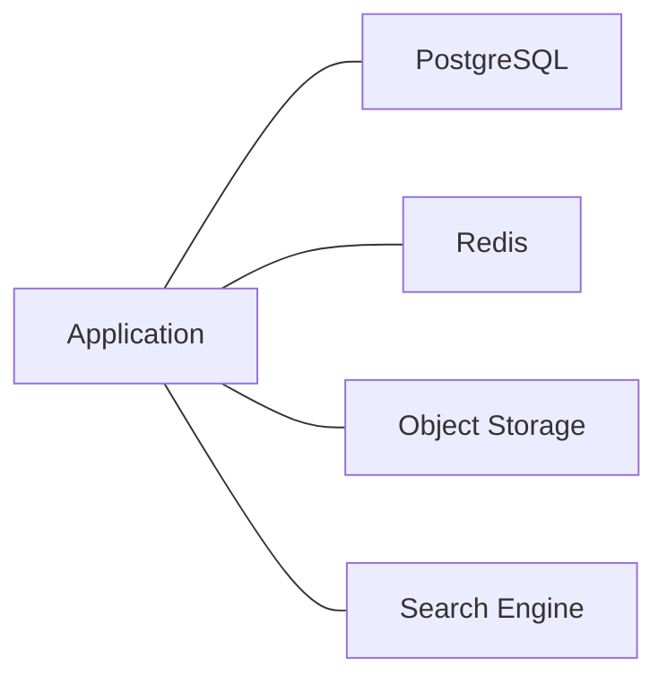

Each storage technology is designed around different requirements.

There is no single storage system that is automatically best for every type of data.

---

# 5. The Simplest Application Storage Model

At a basic level, an application does two important things with stored data:

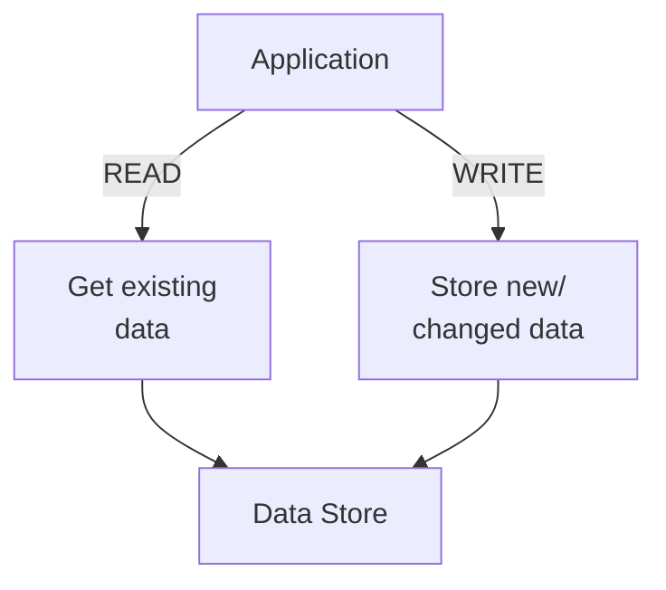

For example:

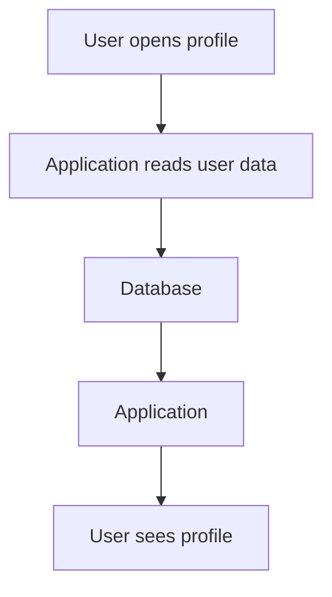

When the user changes the profile:

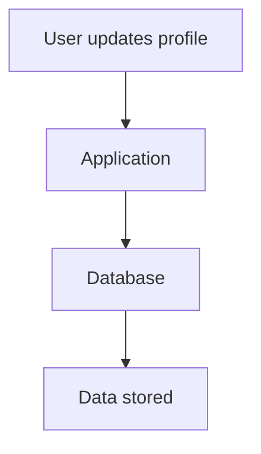

This read/write model is the foundation for almost every later storage concept.

---

# 6. Why Not Just Store Everything in Files?

One of the simplest ways to store information is a file.

For example:

```text
users.txt
```

Contents:

```text
1,Riya,riya@example.com
2,Amit,amit@example.com
3,Sneha,sneha@example.com
```

This works for small applications.

The application could:

1. Open the file
2. Read the contents
3. Find the required user
4. Modify the data
5. Write the file again

For a tiny application, this may be completely reasonable.

But problems appear as the application grows.

---

# 7. The Problems With Simple Files

Imagine a file containing:

```text
10 million users
```

The application wants:

```text
Find user where email = "riya@example.com"
```

If the data is just a plain file, the application may have to search through a large amount of data.

There are other problems too.

## Concurrent Access

Two requests may try to modify the same file simultaneously.

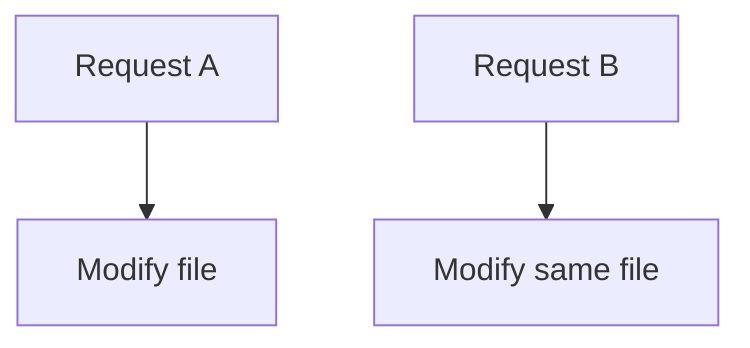

Now the application needs to safely coordinate those operations.

## Data Relationships

Real applications have relationships.

For example:

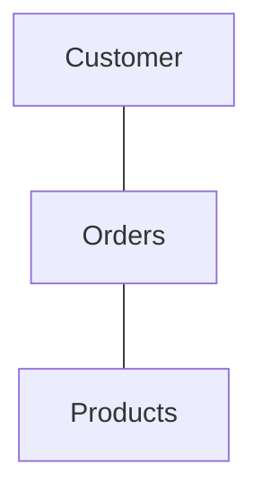

Managing these relationships manually inside files becomes increasingly difficult.

## Transactions

Suppose an order requires two operations:

```text
Create Order
Decrease Inventory
```

What happens if the first succeeds but the second fails?

A serious data system needs mechanisms for handling such situations.

## Querying

Applications often need questions like:

```text
Find all customers from West Bengal

Find orders created this week

Find products cheaper than ₹1,000

Find the top 10 customers by spending
```

A data store can provide specialized mechanisms for these operations.

---

# 8. Why Databases Exist

A **database** is a system designed to store, organize, retrieve, and manage data.

Instead of making every application implement storage logic itself, the database provides capabilities such as:

* Data organization
* Querying
* Indexing
* Concurrency control
* Transactions
* Constraints
* Durability
* Recovery
* Access control

The application can therefore focus on application behavior.

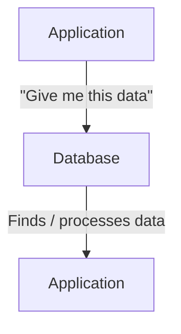

The database becomes a specialized component responsible for data management.

---

# 9. The Application Does Not Usually Talk Directly to Disk

A common beginner mental model is:

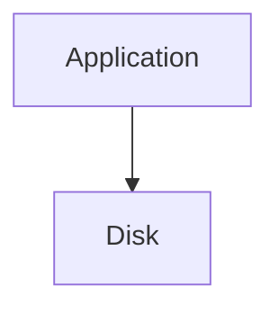

In real systems, there are usually several layers.

A simplified model is:

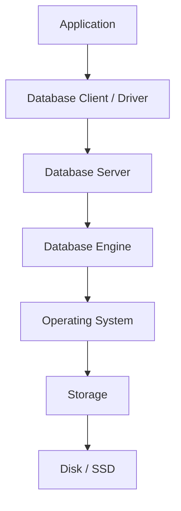

For example:

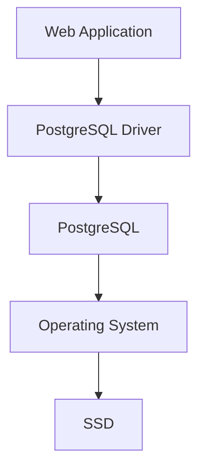

The application normally does not need to understand how bytes are physically arranged on the SSD.

The database handles that complexity.

---

# 10. Database Server vs Database Engine

These terms can sometimes be used loosely, so keep the basic distinction clear.

A **database server** is the running service that accepts connections and requests.

A **database engine** is the software responsible for operations such as:

* Parsing queries
* Planning queries
* Executing queries
* Managing indexes
* Managing transactions
* Reading and writing data

For example:

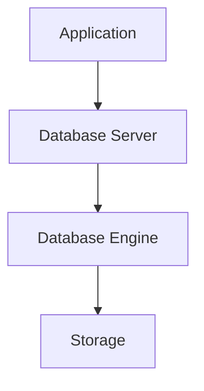

The exact architecture depends on the database technology.

The important idea is that the application delegates data-management work to specialized software.

---

# 11. A Simple Read

Suppose the application needs a user's profile.

The application may send:

```sql
SELECT id, name, email
FROM users
WHERE id = 42;
```

Conceptually:

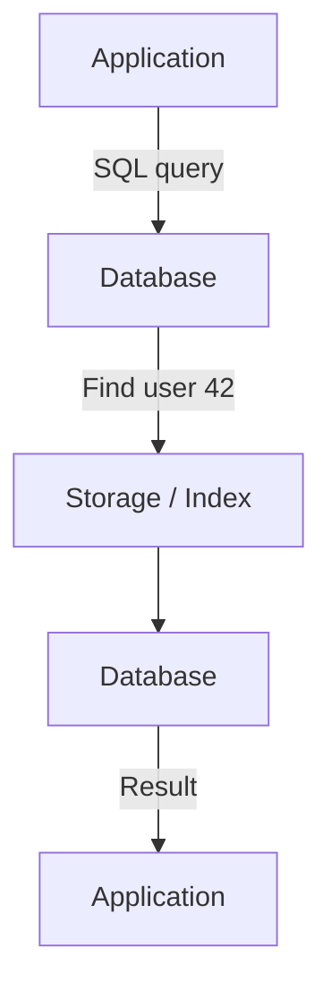

The application receives something like:

```text
id: 42
name: Riya
email: riya@example.com
```

The details of how the database finds the row are handled by the database.

Later chapters will explore indexes and query optimization in much greater detail.

---

# 12. A Simple Write

Now suppose the user creates an account.

The application may execute something conceptually like:

```sql
INSERT INTO users (name, email)
VALUES ('Riya', 'riya@example.com');
```

The flow becomes:

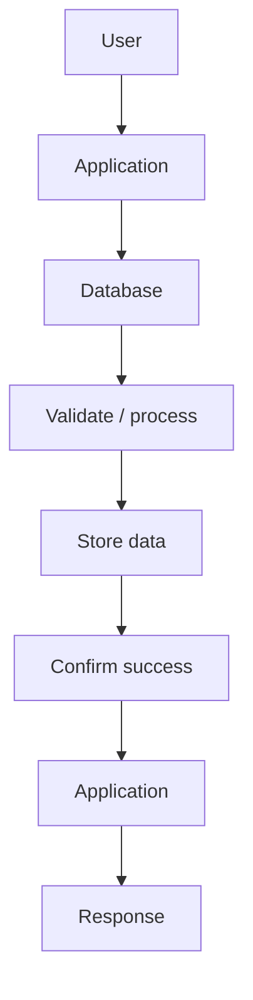

The database is now responsible for maintaining the stored representation of that information.

---

# 13. The Database Is More Than Storage

It is tempting to think:

> "A database is just a place where data is saved."

That is incomplete.

A database often provides important guarantees and capabilities.

For example:

### Querying

```text
Find users
Filter orders
Aggregate sales
Join related data
```

### Constraints

```text
Email must be unique
Order must reference a valid customer
```

### Transactions

```text
Operation A
+
Operation B
+
Operation C

All succeed
OR
the transaction is rolled back
```

### Concurrency Control

Multiple requests can access data simultaneously without every application having to implement all coordination itself.

### Recovery

A database can use mechanisms that help recover data after failures.

These capabilities are why databases are such important system components.

---

# 14. One Application Can Use Multiple Data Stores

An application does not necessarily have one storage system.

A larger system may look like:

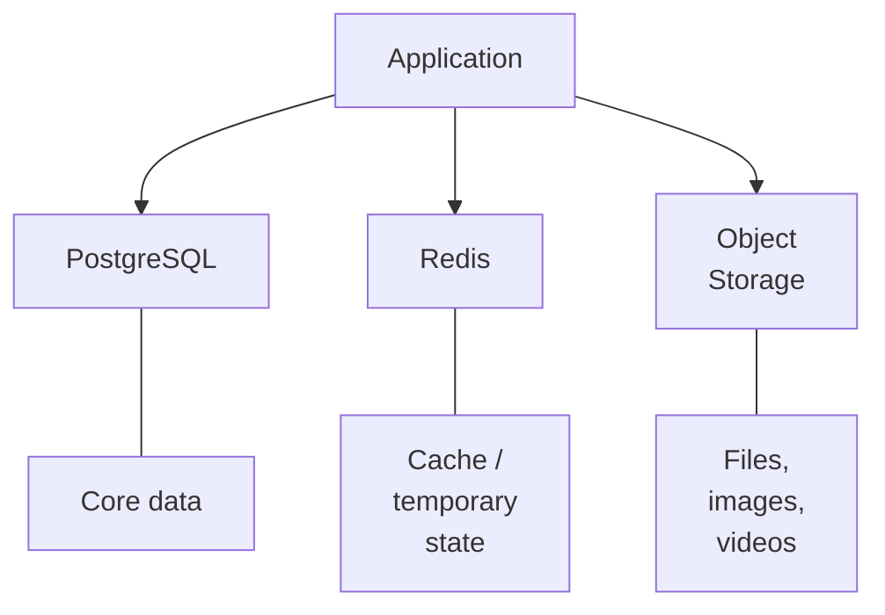

Each system has a different responsibility.

For example:

| Storage        | Possible Responsibility                 |
| -------------- | --------------------------------------- |
| PostgreSQL     | Core relational application data        |
| Redis          | Cache, counters, temporary/shared state |
| Object Storage | Images, videos, documents               |
| Search Engine  | Search-oriented indexing                |
| Message System | Asynchronous event/message storage      |

This is an important system-design principle:

> **Choose storage based on the problem the storage must solve.**

---

# 15. Not All Data Is the Same

Before choosing a storage technology, first understand the data.

Consider an e-commerce system.

It may contain:

```text
Customer information
Product information
Orders
Product images
Search indexes
Shopping cart
Sessions
Payments
Logs
Analytics events
```

These have different characteristics.

For example:

### Product Image

```text
Large binary file
```

### Customer

```text
Structured information
```

### Shopping Cart

```text
Frequently changing temporary state
```

### Search Index

```text
Optimized for searching
```

### Analytics Events

```text
Large volume of event data
```

Trying to force all of these into exactly the same storage system may create unnecessary problems.

---

# 16. Structured Data

Some application data has a clearly defined structure.

For example:

```text
User

id
name
email
created_at
```

Another example:

```text
Order

id
customer_id
total_amount
status
created_at
```

Structured data is often represented using clearly defined fields and relationships.

Relational databases are particularly well suited to many such workloads.

We will study relational databases in:

**04.02 — Relational Databases**

---

# 17. Semi-Structured and Flexible Data

Some data does not fit neatly into a fixed table structure.

For example:

```json
{
  "name": "Riya",
  "preferences": {
    "theme": "dark",
    "language": "en"
  }
}
```

Another user might have additional information:

```json
{
  "name": "Amit",
  "preferences": {
    "theme": "light"
  },
  "social_profiles": {
    "github": "amit123"
  }
}
```

Some storage systems are designed to work naturally with flexible or document-oriented data.

This does not mean:

> "Flexible data always requires NoSQL."

The correct choice depends on the application's access patterns, consistency requirements, relationships, scale, and operational needs.

We will study this distinction later.

---

# 18. Data Access Patterns Matter

One of the most important ideas in data architecture is:

> **How you need to use the data matters almost as much as the data itself.**

Suppose you store customer information.

You might frequently ask:

```text
Find customer by ID
```

Or:

```text
Find customer by email
```

Or:

```text
Find customers by city
```

Or:

```text
Find the customer's recent orders
```

These are different access patterns.

A storage system should be designed around the operations the application actually performs.

This idea becomes extremely important when we discuss:

* Indexes
* Data modeling
* Partitioning
* Sharding
* Replication
* Caching

---

# 19. Read-Heavy vs Write-Heavy Workloads

Applications can also behave differently depending on how often data is read and written.

### Read-Heavy

```text
1 write
100 reads
```

Example:

```text
Popular product catalog
```

The system may benefit heavily from:

* Indexes
* Caching
* Read replicas
* CDN

### Write-Heavy

```text
100 writes
10 reads
```

Example:

```text
High-volume event collection
```

The system may need different strategies.

The important point is:

> **Storage architecture should reflect workload characteristics.**

There is no universal storage architecture.

---

# 20. Data Has a Lifecycle

Data is not always equally important forever.

Consider an application log:

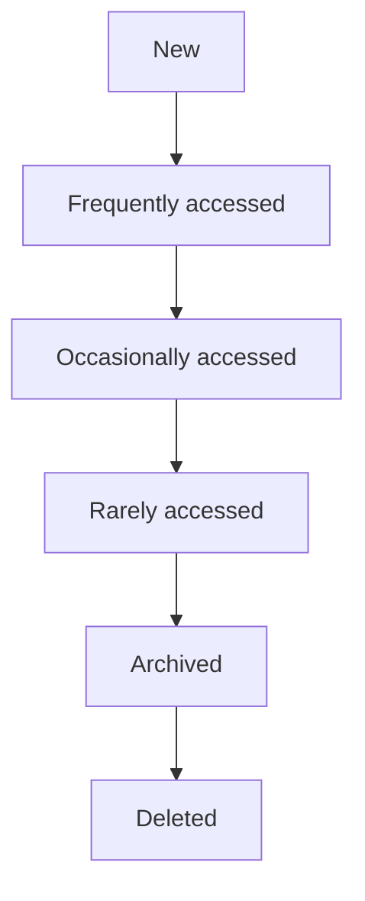

Similarly, a shopping cart may be:

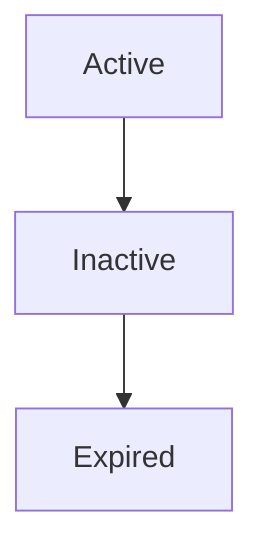

Understanding the data lifecycle helps determine:

* Where data should live
* How long it should be retained
* Whether it should be cached
* Whether it should be archived
* Whether it can be deleted

Storage design is therefore also about **data lifecycle management**.

---

# 21. Source of Truth

A system may have several copies of the same information.

For example:

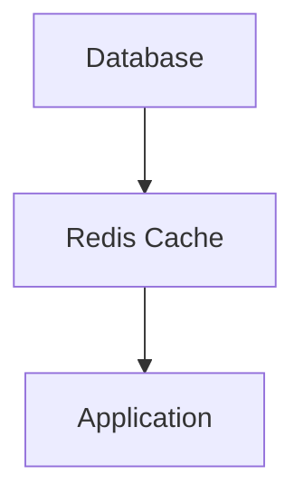

The database might be the **source of truth**.

Redis contains a reusable copy.

If Redis disappears:

```text
Redis
   X
```

the application may rebuild the cache from the database.

This distinction is extremely important.

```mermaid
flowchart TD
  accTitle: Source of truth vs cache
  accDescr: The source of truth holds authoritative data; a cache holds a reusable copy.
  A0["Source of Truth"] --> A1["Authoritative data"]
  B0["Cache"] --> B1["Reusable copy"]
```

Not every copy of data is equally authoritative.

---

# 22. Storage and Caching Are Different Responsibilities

This connects directly to the previous level.

A database may be responsible for:

```text
Persistent application data
```

A cache may be responsible for:

```text
Avoiding repeated expensive work
```

For example:

```mermaid
flowchart TD
  accTitle: Cache in front of storage
  accDescr: A request goes to the cache; on a miss, to the database.
  R["Request"] --> C["Cache"] -->|"miss"| D["Database"]
```

The cache improves performance.

The database may remain the authoritative storage.

This is why adding a cache does not automatically replace the database.

---

# 23. Storage Has a Cost

Every storage decision introduces trade-offs.

Consider a database.

It provides powerful capabilities, but it also introduces:

```text
CPU
Memory
Disk
Network
Connections
Operational complexity
Backups
Monitoring
Maintenance
```

A distributed storage system introduces even more concerns:

```text
Replication
Failure handling
Consistency
Network partitions
Recovery
Operational complexity
```

Therefore:

> **Do not choose a storage technology because it is popular. Choose it because its capabilities match the problem.**

---

# 24. What Happens When the Application Grows?

A small application might begin as:

```mermaid
flowchart TD
  accTitle: Stage 1
  accDescr: User, then Application, then Database.
  N0["User"] --> N1["Application"] --> N2["Database"]
```

This may be enough.

As traffic increases:

```mermaid
flowchart TD
  accTitle: Stage 2
  accDescr: Users, then Application, then Database.
  N0["Users"] --> N1["Application"] --> N2["Database"]
```

The database may become a bottleneck.

The system may evolve:

```mermaid
flowchart TD
  accTitle: Stage 3
  accDescr: Users, then Load Balancer, then Application Instances, then Cache, then Database.
  N0["Users"] --> N1["Load Balancer"] --> N2["Application Instances"] --> N3["Cache"] --> N4["Database"]
```

Later:

```mermaid
flowchart TD
  accTitle: Stage 4
  accDescr: Users reach the load balancer, application instances, the cache and a database with a primary and replicas.
  N0["Users"] --> N1["Load Balancer"] --> N2["Application Instances"] --> N3["Cache"] --> N4["Database"]
  N4 --- P["Primary"]
  N4 --- R["Replicas"]
```

Eventually, depending on requirements:

```mermaid
flowchart LR
  accTitle: Stage 5
  accDescr: The application uses a relational database, a cache, object storage, a search system and a message system.
  R["Application"]
  R --- K0["Relational Database"]
  R --- K1["Cache"]
  R --- K2["Object Storage"]
  R --- K3["Search System"]
  R --- K4["Message System"]
```

The important lesson is that storage architecture often evolves **because the workload and requirements evolve**.

---

# 25. Storage Is Part of the Request Path

Storage is not isolated from the rest of the architecture.

Consider:

```mermaid
flowchart TD
  accTitle: Storage is part of the request path
  accDescr: User, then DNS, then Load Balancer, then Application, then Cache, then Database, then Storage.
  N0["User"] --> N1["DNS"] --> N2["Load Balancer"] --> N3["Application"] --> N4["Cache"] --> N5["Database"] --> N6["Storage"]
```

A slow database can increase application latency.

A database connection limit can restrict application throughput.

A storage failure can affect database availability.

A database overload can cause application requests to queue.

Therefore:

> **Data storage is part of the overall system, not a separate box that can be ignored.**

---

# 26. Storage and Failure

Every storage system can fail.

For example:

```mermaid
flowchart TD
  accTitle: Storage failure
  accDescr: The application reaches the database, which fails.
  A["Application"] --> D["Database"] -. "X" .- F["Failure"]
```

What happens next?

Possible behaviors include:

### Fail the request

```mermaid
flowchart TD
  accTitle: Fail the request
  accDescr: Database unavailable, then Request fails.
  N0["Database unavailable"] --> N1["Request fails"]
```

### Serve cached data

```mermaid
flowchart TD
  accTitle: Serve cached data
  accDescr: Database unavailable, then Cache has data, then Serve cached response.
  N0["Database unavailable"] --> N1["Cache has data"] --> N2["Serve cached response"]
```

### Retry

```mermaid
flowchart TD
  accTitle: Retry
  accDescr: Database request, then Failure, then Retry.
  N0["Database request"] --> N1["Failure"] --> N2["Retry"]
```

But retries can create another problem:

```mermaid
flowchart TD
  accTitle: Retries can make it worse
  accDescr: Database is overloaded, then Requests retry, then More database requests, then Database becomes even more overloaded.
  N0["Database is overloaded"] --> N1["Requests retry"] --> N2["More database requests"] --> N3["Database becomes even more overloaded"]
```

Storage decisions therefore connect directly to:

* Reliability
* Caching
* Timeouts
* Retries
* Graceful degradation
* Backpressure

These topics will appear throughout later levels.

---

# 27. Storage and Consistency

Suppose a user's balance is:

```text
₹10,000
```

The application updates it to:

```text
₹9,000
```

Now imagine another server still sees:

```text
₹10,000
```

This raises an important question:

> How quickly should different copies of the data agree?

Different systems provide different consistency models.

For some applications:

```text
A small delay is acceptable.
```

For others:

```text
Incorrect or stale data may be unacceptable.
```

Consistency is therefore a system requirement, not merely a database feature.

We will explore this much more deeply in Level 4.

---

# 28. Storage and Transactions

Some operations must happen together.

Consider transferring money:

```text
Account A: -₹1,000
Account B: +₹1,000
```

We do not want:

```text
A updated
B failed
```

because money has effectively disappeared.

A transaction can provide a mechanism for grouping operations:

```text
BEGIN

Debit A
Credit B

COMMIT
```

If something goes wrong:

```text
ROLLBACK
```

Transactions are therefore closely connected to how applications store and modify data.

We will study transactions and ACID in:

**04.08 — Transactions & ACID**

---

# 29. Storage and Concurrency

Real applications rarely have only one request.

Imagine:

```mermaid
flowchart TD
  accTitle: Concurrency
  accDescr: 100 users, then 100 requests, then Same database.
  N0["100 users"] --> N1["100 requests"] --> N2["Same database"]
```

Two requests may attempt to change the same data at nearly the same time.

For example:

```text
Inventory = 1

Request A → buy 1 item
Request B → buy 1 item
```

If both requests incorrectly read:

```text
Inventory = 1
```

both may believe they can purchase the final item.

This is a concurrency problem.

Database systems provide mechanisms to help control such situations.

Later we will study:

* Transactions
* Isolation
* Locks
* Replication
* Distributed coordination

---

# 30. The Storage Decision Should Start With Requirements

Do not begin with:

> "Should I use PostgreSQL or MongoDB?"

Begin with:

```mermaid
flowchart TD
  accTitle: Start with requirements
  accDescr: What data do I have?, then How much data?, then How is it accessed?, then How frequently is it read?, then How frequently is it written?, then What consistency is required?, then What durability is required?, then What latency is required?, then How much growth is expected?, then What failures must the system survive?.
  N0["What data do I have?"] --> N1["How much data?"] --> N2["How is it accessed?"] --> N3["How frequently is it read?"] --> N4["How frequently is it written?"] --> N5["What consistency is required?"] --> N6["What durability is required?"] --> N7["What latency is required?"] --> N8["How much growth is expected?"] --> N9["What failures must the system survive?"]
```

Only after understanding these requirements should you choose technology.

This is the system-design way of thinking about storage.

---

# 31. A Practical Example — Blog Application

Suppose we are building a simple blog.

We need:

```text
Users
Posts
Comments
Images
```

A simple architecture might be:

```mermaid
flowchart TD
  accTitle: A small blog
  accDescr: Users, then Application, then Database.
  N0["Users"] --> N1["Application"] --> N2["Database"]
```

The database stores:

```text
Users
Posts
Comments
```

Images could be stored separately:

```mermaid
flowchart TD
  accTitle: Images outside the database
  accDescr: The application keeps metadata in the database and image files in object storage.
  A["Application"] --- D["Database"] --- M["metadata"]
  A --- O["Object Storage"] --- I["image files"]
```

Later, if posts become popular:

```mermaid
flowchart TD
  accTitle: A growing blog
  accDescr: User, then CDN, then Cache, then Application, then Database.
  N0["User"] --> N1["CDN"] --> N2["Cache"] --> N3["Application"] --> N4["Database"]
```

Notice how the architecture evolved based on actual needs.

---

# 32. Another Example — E-Commerce

An e-commerce system may eventually need:

```mermaid
flowchart TD
  accTitle: E-commerce storage
  accDescr: The application keeps orders, users and products in the database, cache and state in Redis, and product images in object storage.
  A["Application"] --> D["Database"] & R["Redis"] & O["Object<br/>Storage"]
  D --- DD["Orders, Users<br/>Products"]
  R --- RD["Cache/State"]
  O --- OD["Product<br/>Images"]
```

Search may later become:

```mermaid
flowchart LR
  accTitle: Adding search
  accDescr: The application uses a database, Redis, object storage and a search engine.
  R["Application"]
  R --- K0["Database"]
  R --- K1["Redis"]
  R --- K2["Object Storage"]
  R --- K3["Search Engine"]
```

The architecture is not becoming complicated merely because someone likes complicated architectures.

Each additional system should exist because it solves a specific problem.

---

# 33. Storage Technology Is a Design Decision

Choosing storage affects many other parts of the system.

For example:

```mermaid
flowchart TD
  accTitle: One choice shapes the rest
  accDescr: Storage choice, then Data model, then Query patterns, then Indexes, then Transactions, then Scaling strategy, then Replication, then Failure handling.
  N0["Storage choice"] --> N1["Data model"] --> N2["Query patterns"] --> N3["Indexes"] --> N4["Transactions"] --> N5["Scaling strategy"] --> N6["Replication"] --> N7["Failure handling"]
```

This is why database selection should not be treated as a simple library choice.

It is an architectural decision.

---

# 34. A Simple Storage Decision Framework

When evaluating a storage technology, ask:

### 1. What are we storing?

```text
Rows?
Documents?
Files?
Events?
Key/value data?
Search indexes?
```

### 2. How will we access it?

```text
By ID?
By key?
By range?
By text search?
By relationships?
By aggregation?
```

### 3. How much data?

```text
MB?
GB?
TB?
PB?
```

### 4. What is the workload?

```text
Read-heavy?
Write-heavy?
Mixed?
```

### 5. What latency is required?

```text
Milliseconds?
Seconds?
Batch processing?
```

### 6. What consistency is required?

```text
Strong?
Eventual?
Something in between?
```

### 7. What durability is required?

```text
Can data be recreated?
Must it survive failures?
```

### 8. How will it scale?

```text
Vertical?
Replication?
Partitioning?
Sharding?
```

### 9. What happens when it fails?

```text
Fail request?
Retry?
Use cache?
Queue work?
Degrade gracefully?
```

### 10. What operational complexity can we accept?

```text
Simple managed database?
Multiple distributed systems?
Self-managed infrastructure?
```

---

# 35. Common Beginner Mistakes

## Mistake 1 — Treating Every Database as the Same

Different databases have different capabilities and trade-offs.

---

## Mistake 2 — Choosing Technology Before Understanding the Problem

Starting with:

```text
"Let's use MongoDB."
```

or:

```text
"Let's use PostgreSQL."
```

without understanding requirements reverses the design process.

Start with:

```mermaid
flowchart TD
  accTitle: The right order
  accDescr: Requirements, then Access patterns, then Constraints, then Storage requirements, then Technology.
  N0["Requirements"] --> N1["Access patterns"] --> N2["Constraints"] --> N3["Storage requirements"] --> N4["Technology"]
```

---

## Mistake 3 — Treating the Database as a Passive Disk

A database does much more than store bytes.

It can provide:

* Querying
* Indexing
* Transactions
* Constraints
* Concurrency control
* Recovery

---

## Mistake 4 — Adding Multiple Storage Systems Too Early

Having:

```text
PostgreSQL
Redis
MongoDB
Elasticsearch
Kafka
```

does not automatically make an architecture better.

Every additional system introduces:

```text
More infrastructure
More failure modes
More monitoring
More operational work
More data consistency concerns
```

Add a component because it solves a real problem.

---

## Mistake 5 — Ignoring Access Patterns

The same data can behave very differently depending on how the application queries it.

Storage design must consider actual access patterns.

---

## Mistake 6 — Ignoring Failure

Ask:

> "What happens if this storage system becomes unavailable?"

A design is incomplete until failure behavior is understood.

---

# 36. System Design View

At the beginning, storage may look simple:

```mermaid
flowchart TD
  accTitle: A simple system
  accDescr: Application, then Database.
  N0["Application"] --> N1["Database"]
```

As the system evolves:

```mermaid
flowchart TD
  accTitle: A growing system
  accDescr: The application and a cache both use the database, which has replicas.
  C["Cache"] --> D["Database"]
  A["Application"] --> D
  D --> R["Replicas"]
```

Later:

```mermaid
flowchart LR
  accTitle: A larger system
  accDescr: The application uses a relational database, a cache, object storage, search and messaging.
  R["Application"]
  R --- K0["Relational Database"]
  R --- K1["Cache"]
  R --- K2["Object Storage"]
  R --- K3["Search"]
  R --- K4["Messaging"]
```

Eventually:

```mermaid
flowchart TD
  accTitle: The system design view
  accDescr: Applications use a primary data store (with replicas or partitioning), fast shared state (cache or coordination), and large files storage (objects).
  A["Applications"] --> P["Primary Data<br/>Store"] & F["Fast/Shared<br/>State"] & L["Large Files<br/>Storage"]
  P --> P2["Replicas /<br/>Partitioning"]
  F --> F2["Cache /<br/>Coordination"]
  L --> L2["Objects"]
```

The architecture should evolve when the problem requires it.

Not before.

---

# 37. The Most Important Mental Model

Think about storage as a responsibility.

```mermaid
flowchart TD
  accTitle: The most important mental model
  accDescr: The application needs data to survive, so it uses a persistent data store.
  N0["Application"] -->|"#quot;I need data to survive.#quot;"| N1["Persistent Data Store"]
```

Then ask:

```mermaid
flowchart TD
  accTitle: Questions before technology
  accDescr: What kind of data?, then What operations?, then What scale?, then What consistency?, then What durability?, then What latency?, then What failure behavior?.
  N0["What kind of data?"] --> N1["What operations?"] --> N2["What scale?"] --> N3["What consistency?"] --> N4["What durability?"] --> N5["What latency?"] --> N6["What failure behavior?"]
```

Only then:

```text
Choose technology
```

This prevents technology-first architecture.

---

# 38. Practical Investigation Exercise

Imagine you are designing a small food-delivery application.

It needs:

```text
Users
Restaurants
Menus
Orders
Payments
Restaurant images
Delivery locations
Notifications
```

Before choosing technologies, classify each piece.

| Data          | Questions to Ask                 |
| ------------- | -------------------------------- |
| Users         | Structured? Relationships?       |
| Restaurants   | Frequently read?                 |
| Menus         | Read-heavy? Cacheable?           |
| Orders        | Durable? Transactional?          |
| Payments      | Strong correctness requirements? |
| Images        | Large binary objects?            |
| Locations     | Geospatial queries?              |
| Notifications | Can processing be asynchronous?  |

Do not immediately choose a database.

First understand the problem.

That is the skill this chapter is teaching.

---

# 39. Hands-On Mini Lab

You can understand the basic storage model with a small PostgreSQL application.

## Step 1 — Create a Database

```sql
CREATE DATABASE systemly_demo;
```

---

## Step 2 — Create a Table

```sql
CREATE TABLE users (
    id BIGSERIAL PRIMARY KEY,
    name VARCHAR(100) NOT NULL,
    email VARCHAR(255) UNIQUE NOT NULL,
    created_at TIMESTAMP NOT NULL DEFAULT CURRENT_TIMESTAMP
);
```

---

## Step 3 — Insert Data

```sql
INSERT INTO users (name, email)
VALUES
    ('Riya', 'riya@example.com'),
    ('Amit', 'amit@example.com'),
    ('Sneha', 'sneha@example.com');
```

---

## Step 4 — Read Data

```sql
SELECT id, name, email
FROM users;
```

---

## Step 5 — Query One User

```sql
SELECT id, name, email
FROM users
WHERE id = 1;
```

---

## Step 6 — Update Data

```sql
UPDATE users
SET name = 'Riya Sharma'
WHERE id = 1;
```

---

## Step 7 — Delete Data

```sql
DELETE FROM users
WHERE id = 1;
```

Now connect the operations to the system model:

```mermaid
flowchart TD
  accTitle: The basic operations
  accDescr: The application uses INSERT to store data, SELECT to read, UPDATE to change and DELETE to remove data in the database.
  A["Application"] --- G
  subgraph G[" "]
    direction TB
    I["INSERT → Store data"] ~~~ S["SELECT → Read data"] ~~~ U["UPDATE → Change data"] ~~~ X["DELETE → Remove data"]
  end
  G --> D["Database"]
```

This is the basic CRUD interaction between an application and persistent data storage.

---

# 40. Challenge

Before moving forward, design the storage requirements for a simple course platform.

It contains:

```text
Students
Courses
Lessons
Videos
Progress
Quiz Results
Profile Photos
```

Answer these questions:

### Question 1

Which information is structured?

### Question 2

Which information consists of large files?

### Question 3

Which data needs to be durable?

### Question 4

Which data might be frequently read?

### Question 5

Which data might be temporary?

### Question 6

Which data has relationships?

### Question 7

Which operations may need transactions?

### Question 8

Which data might eventually benefit from caching?

Do not choose technologies yet.

The goal is to understand the **storage problem first**.

---

# 41. Answers to the Challenge

There can be multiple reasonable designs. The goal is to demonstrate the reasoning process.

### Students

Structured and durable.

```text
Student
- id
- name
- email
```

### Courses

Structured and durable.

```text
Course
- id
- title
- description
```

### Lessons

Structured and related to courses.

```mermaid
flowchart TD
  accTitle: Courses have lessons
  accDescr: Course, then Lessons.
  N0["Course"] --> N1["Lessons"]
```

### Videos

Large binary objects.

They may be better suited to object storage rather than storing the actual video bytes inside ordinary database rows.

### Progress

Frequently updated application data.

```mermaid
flowchart TD
  accTitle: Progress links everything
  accDescr: Student, then Course, then Lesson, then Progress.
  N0["Student"] --> N1["Course"] --> N2["Lesson"] --> N3["Progress"]
```

### Quiz Results

Durable structured data.

Depending on requirements, updates may need transactional handling.

### Profile Photos

Large binary objects.

Object storage is often more appropriate than keeping the image itself in the main relational database.

### Caching Candidates

Frequently accessed data such as:

```text
Course information
Popular course lists
Lesson metadata
```

The exact caching strategy depends on the workload and freshness requirements.

---

# 42. Key Principle

> **Applications store data because important information must survive individual requests and process restarts. The storage system should be chosen based on the data, access patterns, scale, consistency, durability, latency, and failure requirements—not simply because a particular technology is popular.**

---

# 43. Quick Reference

| Concept            | Meaning                                                            |
| ------------------ | ------------------------------------------------------------------ |
| Data Store         | System used to store and retrieve data                             |
| Persistent Storage | Storage intended to survive beyond temporary application memory    |
| Database           | Specialized system for managing structured or semi-structured data |
| Read               | Retrieve stored data                                               |
| Write              | Create or modify stored data                                       |
| Source of Truth    | Authoritative representation of data                               |
| Cache              | Reusable copy used to reduce expensive work                        |
| Access Pattern     | How the application reads or writes data                           |
| Read-Heavy         | Workload dominated by reads                                        |
| Write-Heavy        | Workload dominated by writes                                       |
| Transaction        | Group of operations treated as one logical unit                    |
| Durability         | Data survives appropriate failures                                 |
| Consistency        | How and when different reads observe updates                       |

---

# 44. Knowledge Check

### 1. Why isn't application memory usually enough for important persistent data?

Because application memory is temporary and can disappear when a process restarts or fails.

### 2. What is a data store?

A system that stores and retrieves data.

### 3. Why do databases exist instead of applications simply using files?

Databases provide specialized capabilities such as querying, indexing, transactions, concurrency control, constraints, and recovery.

### 4. Is every data store a database?

No. The term data store is broader and can include databases, object storage, key-value stores, search systems, and other storage technologies.

### 5. Why does access pattern matter?

Because the way an application reads and writes data affects which storage structures and technologies are suitable.

### 6. Is a cache usually the source of truth?

Not necessarily. In many architectures, the database remains authoritative while the cache contains a reusable copy.

### 7. Should an application always use multiple storage technologies?

No. Additional systems should be introduced when they solve actual requirements.

### 8. What should you determine before choosing a database?

At minimum:

```text
Data
Access patterns
Scale
Latency
Consistency
Durability
Growth
Failure requirements
Operational constraints
```

---

# 46. Remember

A system does not start with:

```text
"Which database should I use?"
```

It starts with:

```mermaid
flowchart TD
  accTitle: Remember
  accDescr: What data do I have?, then How will the application use it?, then How much data?, then How often?, then How quickly?, then How correct must it be?, then How durable must it be?, then How should it behave during failure?, then What storage design fits?.
  N0["What data do I have?"] --> N1["How will the application use it?"] --> N2["How much data?"] --> N3["How often?"] --> N4["How quickly?"] --> N5["How correct must it be?"] --> N6["How durable must it be?"] --> N7["How should it behave during failure?"] --> N8["What storage design fits?"]
```

**Understand the data problem first. Choose the technology second.**

---

# Next Chapter

## 04.02 — Relational Databases

We will now examine the most common structured-data model used by applications:

* Tables
* Rows
* Columns
* Primary keys
* Foreign keys
* Relationships
* Constraints
* SQL
* Transactions
* Why relational databases work so well for many applications
* Where their limitations begin
