# 04.02 — Relational Databases

## Learning Objectives

By the end of this chapter, you should understand:

* What a relational database is
* Why the relational model was created
* What tables, rows, and columns represent
* How primary keys identify records
* How foreign keys represent relationships
* The difference between one-to-one, one-to-many, and many-to-many relationships
* What database constraints do
* Why normalization exists
* Why relational databases are useful for application systems
* How applications interact with relational databases
* The difference between logical data structure and physical storage
* Where relational databases work particularly well
* What trade-offs relational databases introduce

---

# 1. What Is a Relational Database?

A **relational database** stores data using a model based primarily on **relations**.

In practical application development, a relation is commonly represented as a **table**.

For example:

```text
users

+----+--------+----------------------+
| id | name   | email                |
+----+--------+----------------------+
| 1  | Riya   | riya@example.com     |
| 2  | Amit   | amit@example.com     |
| 3  | Sneha  | sneha@example.com    |
+----+--------+----------------------+
```

The table contains:

* Columns
* Rows
* Values

A relational database can contain many related tables:

```text
users
orders
products
order_items
```

The relationships between these tables are an important part of the relational model.

---

# 2. Why Is It Called "Relational"?

The word **relational** comes from the mathematical concept of a relation.

You do not need advanced mathematics to use a relational database.

For system design, the useful mental model is:

> **A relation is a structured set of records represented as a table, and relationships between data can be represented through keys.**

For example:

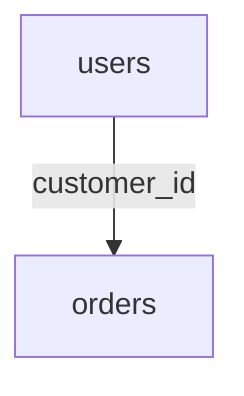

One user's information can therefore be related to that user's orders.

The database can then answer questions such as:

```text
Which orders belong to Riya?
```

or:

```text
Which customer placed order #1024?
```

---

# 3. The Basic Building Blocks

A relational database is commonly understood through four basic concepts:

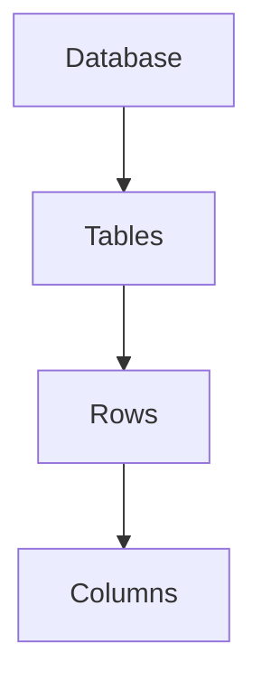

For example:

```text
Database: shop

Table: users

+----+--------+----------------------+
| id | name   | email                |
+----+--------+----------------------+
| 1  | Riya   | riya@example.com     |
| 2  | Amit   | amit@example.com     |
+----+--------+----------------------+
```

Here:

* `shop` is the database
* `users` is the table
* Each horizontal record is a row
* `id`, `name`, and `email` are columns

---

# 4. What Is a Table?

A **table** represents a collection of related records.

For example:

```text
products
```

could contain:

```text
+----+----------------+--------+
| id | name           | price  |
+----+----------------+--------+
| 1  | Laptop         | 65000  |
| 2  | Keyboard       | 1500   |
| 3  | Mouse          | 800    |
+----+----------------+--------+
```

The table describes one particular type of data.

In this case:

```text
products → product records
```

Another table might represent:

```text
customers → customer records
orders    → order records
payments  → payment records
```

A useful design principle is:

> **A table should have a clear responsibility.**

Do not put unrelated concepts into one giant table simply because they all belong to the same application.

---

# 5. What Is a Row?

A **row** represents one record in a table.

For example:

```text
+----+-------+-------------------+
| id | name  | email             |
+----+-------+-------------------+
| 1  | Riya  | riya@example.com  |
+----+-------+-------------------+
```

This row represents one user.

Another row represents another user:

```text
+----+------+-------------------+
| 2  | Amit | amit@example.com  |
+----+------+-------------------+
```

You can think of a row as:

> **One instance of the thing represented by the table.**

---

# 6. What Is a Column?

A **column** describes one attribute of the records in a table.

For example:

```text
users

id
name
email
created_at
```

Each column has a meaning.

```text
id         → identifies the user
name       → user's name
email      → user's email
created_at → when the record was created
```

A column also normally has a data type.

For example:

```text
id         → integer
name       → text
email      → text
created_at → timestamp
```

The data type tells the database what kind of values are valid for that column.

---

# 7. Data Types

Relational databases provide data types for representing different kinds of values.

Common categories include:

```text
Integer
Decimal
Text
Boolean
Date
Time
Timestamp
Binary
JSON
```

For example:

```sql
CREATE TABLE products (
    id BIGINT,
    name VARCHAR(200),
    price DECIMAL(10,2),
    available BOOLEAN,
    created_at TIMESTAMP
);
```

The exact data types differ between database systems.

For example:

* PostgreSQL
* MySQL
* SQL Server
* Oracle

may provide different names and capabilities.

The relational model is broader than any one SQL database product.

---

# 8. A Table Represents a Concept

A useful way to design tables is to think in terms of **entities** or concepts.

For an e-commerce application:

```text
Customer
Product
Order
Payment
```

These might become:

```text
customers
products
orders
payments
```

The application then connects these concepts through relationships.

For example:

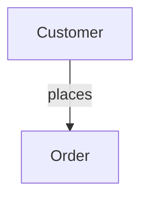

This gives the database a meaningful structure.

---

# 9. Primary Keys

A table normally needs a way to uniquely identify each row.

This is the job of a **primary key**.

Example:

```text
users

+----+-------+-------------------+
| id | name  | email             |
+----+-------+-------------------+
| 1  | Riya  | riya@example.com  |
| 2  | Amit  | amit@example.com  |
| 3  | Sneha | sneha@example.com |
+----+-------+-------------------+
```

Here:

```text
id
```

can be the primary key.

The database can then identify:

```text
User 1
User 2
User 3
```

unambiguously.

---

# 10. Properties of a Primary Key

A primary key should uniquely identify a row.

Conceptually:

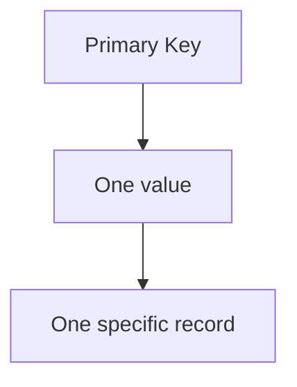

For example:

```sql
CREATE TABLE users (
    id BIGINT PRIMARY KEY,
    name VARCHAR(100),
    email VARCHAR(255)
);
```

Now the database can enforce the uniqueness of `id`.

You should not be able to create two rows with the same primary-key value.

---

# 11. Natural Keys vs Surrogate Keys

There are two common approaches to identifying records.

## Natural Key

A value that already has meaning in the real world.

For example:

```text
email
ISBN
country_code
```

## Surrogate Key

An identifier created specifically for the database.

For example:

```text
id = 1
id = 2
id = 3
```

A common application design is:

```text
id → primary key
email → UNIQUE
```

This separates:

```text
Identity
```

from:

```text
Business attribute
```

For example:

```text
id = 42

email = riya@example.com
```

The email can change while the internal identifier remains stable.

There are valid cases for natural keys as well. The important point is to understand what role the key is serving.

---

# 12. Foreign Keys

A **foreign key** represents a relationship between rows in different tables.

Suppose we have:

```text
customers

+----+-------+
| id | name  |
+----+-------+
| 1  | Riya  |
| 2  | Amit  |
+----+-------+
```

And:

```text
orders

+----+-------------+--------+
| id | customer_id | amount |
+----+-------------+--------+
| 101| 1           | 5000   |
| 102| 1           | 2000   |
| 103| 2           | 3500   |
+----+-------------+--------+
```

Here:

```text
orders.customer_id
```

references:

```text
customers.id
```

Conceptually:

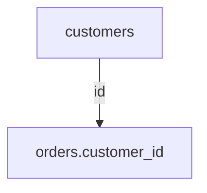

This is a foreign-key relationship.

---

# 13. Why Foreign Keys Matter

Without a foreign key, the application could accidentally store:

```text
order.customer_id = 999999
```

even though customer `999999` does not exist.

A foreign-key constraint can prevent that invalid relationship.

For example:

```sql
CREATE TABLE orders (
    id BIGINT PRIMARY KEY,
    customer_id BIGINT NOT NULL,
    amount DECIMAL(10,2),

    FOREIGN KEY (customer_id)
        REFERENCES customers(id)
);
```

Now the database can enforce the relationship.

This is an important principle:

> **Constraints allow the database to protect data correctness instead of relying entirely on application code.**

---

# 14. Relationships Between Data

Relational databases are particularly useful because real-world concepts have relationships.

For example:

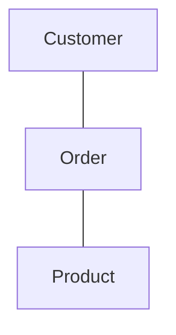

Common relationship types are:

```text
One-to-One
One-to-Many
Many-to-Many
```

Understanding these is essential for data modeling.

---

# 15. One-to-One Relationship

In a one-to-one relationship, one record corresponds to at most one record in another table.

Example:

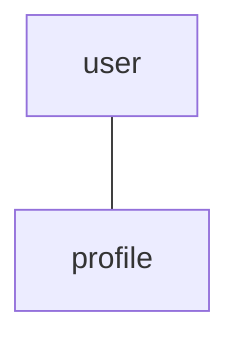

For example:

```text
users

+----+-------+
| id | name  |
+----+-------+
| 1  | Riya  |
+----+-------+
```

```text
profiles

+----+---------+------------+
| id | user_id | bio        |
+----+---------+------------+
| 10 | 1       | Developer  |
+----+---------+------------+
```

Conceptually:

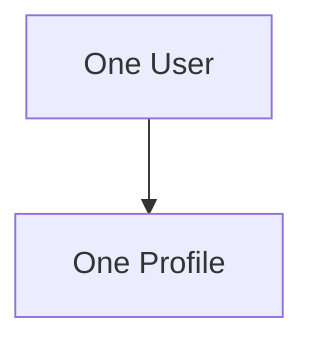

One-to-one relationships are useful when two sets of information have different responsibilities or different lifecycle/security requirements.

---

# 16. One-to-Many Relationship

This is one of the most common relationships.

One customer can have many orders:

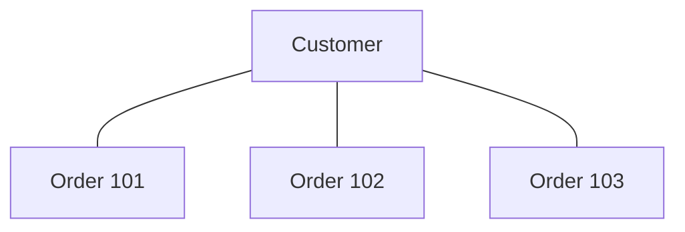

Database structure:

```text
customers
+----+-------+
| id | name  |
+----+-------+
| 1  | Riya  |
+----+-------+
```

```text
orders
+-----+-------------+
| id  | customer_id |
+-----+-------------+
| 101 | 1           |
| 102 | 1           |
| 103 | 1           |
+-----+-------------+
```

The foreign key is stored on the **many** side.

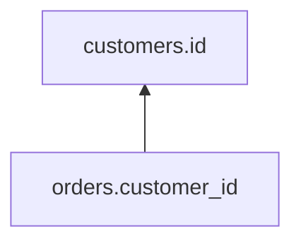

This is a fundamental relational modeling pattern.

---

# 17. Many-to-Many Relationship

Suppose:

```text
Students
```

can enroll in many:

```text
Courses
```

and each course can have many students.

That is:

```text
Student ←→ Course
```

A relational database commonly represents this using a **junction table**.

```text
students
courses
student_courses
```

For example:

```text
students
+----+-------+
| id | name  |
+----+-------+
| 1  | Riya  |
| 2  | Amit  |
+----+-------+
```

```text
courses
+----+-------------+
| id | title       |
+----+-------------+
| 10 | PHP         |
| 20 | React       |
+----+-------------+
```

Junction table:

```text
student_courses

+------------+-----------+
| student_id | course_id |
+------------+-----------+
| 1          | 10        |
| 1          | 20        |
| 2          | 10        |
+------------+-----------+
```

Now:

```text
Riya → PHP
Riya → React
Amit → PHP
```

The junction table converts:

```text
Many ↔ Many
```

into:

```text
Student → Many StudentCourse rows
Course  → Many StudentCourse rows
```

---

# 18. Why Relationships Matter

Without relationships, the application might duplicate information.

For example:

```text
Order #101
Riya
riya@example.com
Laptop
```

and:

```text
Order #102
Riya
riya@example.com
Keyboard
```

The customer's information is repeated.

A relational design can separate the concepts:

```text
customers
orders
order_items
products
```

and connect them through keys.

This reduces unnecessary duplication and makes relationships explicit.

---

# 19. Data Duplication

Some duplication is harmless or intentional.

But uncontrolled duplication creates problems.

Suppose the customer's email appears in 500 order records.

The customer changes their email.

Now the application may need to update:

```text
500 records
```

If one record is missed:

```text
Old email
New email
```

may coexist.

This creates inconsistent data.

Relational modeling often tries to reduce unnecessary duplication.

This leads us to **normalization**.

---

# 20. Normalization

**Normalization** is a set of principles for organizing relational data to reduce unnecessary redundancy and dependency problems.

A simplified example:

Instead of:

```text
orders

order_id
customer_name
customer_email
product_name
product_price
```

we can separate concepts:

```text
customers
products
orders
order_items
```

Then:

```text
orders.customer_id
order_items.product_id
```

connect the records.

The result is more structured:

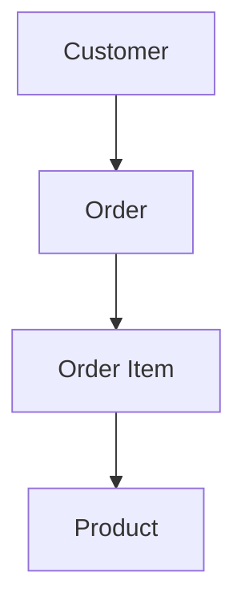

Normalization is not simply:

> "Never duplicate any data."

Real systems sometimes intentionally denormalize data for performance or other requirements.

The important principle is:

> **First design for correct data relationships. Introduce duplication deliberately when there is a reason.**

---

# 21. Why Normalization Helps

Consider:

```text
orders

order_id | customer_name | customer_email
```

If the customer changes their email, multiple records may need modification.

With a separate customer table:

```text
customers

id | name | email
```

orders only need:

```text
customer_id
```

Now the customer's information has one primary location.

This helps reduce update anomalies.

---

# 22. The Three Common Data Anomalies

Poorly structured relational data can produce:

### Update Anomaly

The same information exists in multiple places and one copy is updated while another is not.

### Insert Anomaly

You cannot insert one piece of information without unnecessarily creating another record.

### Delete Anomaly

Deleting one record accidentally removes information that should have been preserved.

Normalization helps reduce these problems.

---

# 23. Constraints

Relational databases can enforce rules about the data.

Common constraints include:

```text
PRIMARY KEY
FOREIGN KEY
UNIQUE
NOT NULL
CHECK
```

For example:

```sql
CREATE TABLE users (
    id BIGINT PRIMARY KEY,
    name VARCHAR(100) NOT NULL,
    email VARCHAR(255) NOT NULL UNIQUE,
    age INTEGER CHECK (age >= 0)
);
```

The database can now enforce:

```text
id → unique identity
name → required
email → required + unique
age → cannot be negative
```

This is an important architectural capability.

---

# 24. Database Constraints vs Application Validation

Suppose the application checks:

```text
"Email must be unique."
```

That is useful.

But imagine two application instances receive requests at almost exactly the same time:

```text
Request A → check email
Request B → check email
```

Both may see:

```text
Email does not exist.
```

Then both attempt to insert it.

Application-level checking alone may not be sufficient to guarantee uniqueness.

A database-level:

```sql
UNIQUE(email)
```

constraint can enforce the invariant at the storage layer.

This gives us an important principle:

> **Application validation improves user experience; database constraints protect data integrity.**

---

# 25. NULL

Relational databases also have a special value:

```text
NULL
```

`NULL` does not simply mean:

```text
0
```

or:

```text
""
```

or:

```text
false
```

It generally represents the absence of a known value.

For example:

```text
middle_name = NULL
```

could mean:

```text
No middle name is recorded.
```

But the exact business meaning should be defined by the application.

`NULL` also affects SQL comparisons and conditions, so it must be handled carefully.

---

# 26. SQL and Relational Databases

Most relational databases are accessed using **SQL**.

SQL allows applications and developers to express operations such as:

```sql
SELECT
INSERT
UPDATE
DELETE
```

For example:

```sql
SELECT name, email
FROM users
WHERE id = 42;
```

SQL describes what data is wanted.

The database determines how to execute the request.

This connects directly to the earlier Systemly chapter:

**03.03 — Query Optimization**

The database can choose:

```text
Index Scan
Sequential Scan
Join Strategy
Sort
Aggregation
```

depending on the query and available structures.

---

# 27. SQL Is Not the Same Thing as a Relational Database

These terms are related but not identical.

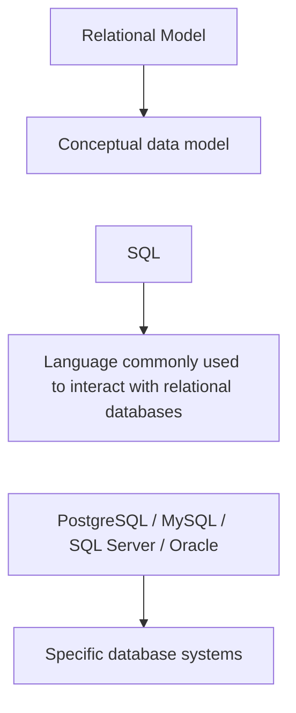

For example:

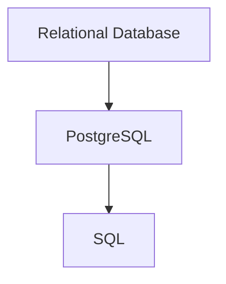

SQL is the language.

PostgreSQL is a database system implementing a relational model along with many additional capabilities.

We will examine SQL databases specifically in:

**04.03 — SQL Databases**

---

# 28. Joins

One of the most important capabilities of relational databases is combining related data.

Suppose:

```text
customers

id | name
---+------
1  | Riya
2  | Amit
```

and:

```text
orders

id  | customer_id | amount
----+-------------+-------
101 | 1           | 5000
102 | 2           | 3000
103 | 1           | 2000
```

We can combine them:

```sql
SELECT
    customers.name,
    orders.id,
    orders.amount
FROM customers
JOIN orders
    ON orders.customer_id = customers.id;
```

Conceptually:

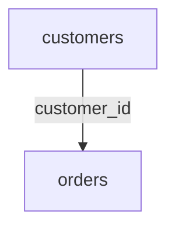

The result can be:

```text
Riya  | 101 | 5000
Amit  | 102 | 3000
Riya  | 103 | 2000
```

Joins allow the application to work with related data without storing everything in one giant table.

---

# 29. Why Not Put Everything in One Table?

A beginner might think:

```text
Why not create:

customer_name
customer_email
order_id
product_name
product_price
payment_status
...
```

in one enormous table?

Because different concepts have different lifecycles.

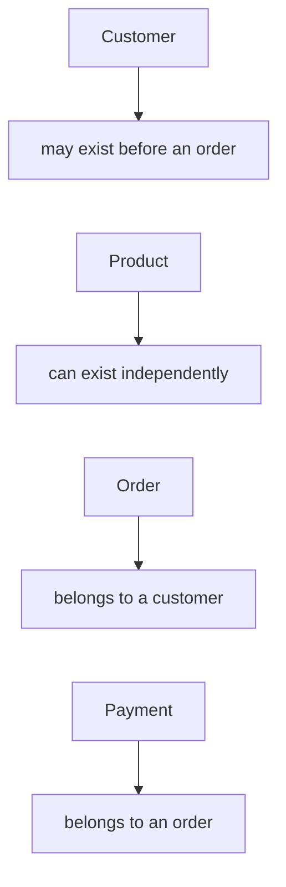

A single giant table can cause:

* Repetition
* Update anomalies
* Difficult constraints
* Large rows
* Difficult maintenance
* Complicated relationships

Relational design allows the concepts to remain separate while still being connected.

---

# 30. Transactions

Relational databases are widely used for workloads that require coordinated changes.

Suppose an order is created.

We may need:

```text
Create order
Create order items
Decrease inventory
Record payment state
```

These operations may need to be treated as one logical unit.

Conceptually:

```text
BEGIN
    Create Order
    Create Order Items
    Update Inventory
COMMIT
```

If something fails:

```text
ROLLBACK
```

Transactions are one of the major reasons relational databases are useful for business applications.

A detailed discussion comes later in:

**04.08 — Transactions & ACID**

---

# 31. Concurrency

A production database may receive thousands or millions of operations.

For example:

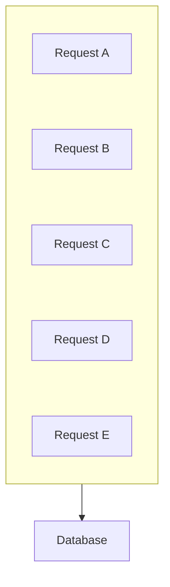

The database must coordinate these operations correctly.

This is particularly important when multiple operations touch the same data.

For example:

```text
Inventory = 1

Request A → buy item
Request B → buy item
```

The database needs mechanisms to prevent incorrect results.

This is one reason relational databases provide transactions, locking, and isolation mechanisms.

---

# 32. ACID

Relational databases are commonly associated with **ACID transactions**.

ACID stands for:

```text
A → Atomicity
C → Consistency
I → Isolation
D → Durability
```

At a high level:

### Atomicity

A transaction is treated as one logical unit.

### Consistency

A successful transaction leaves the database satisfying its defined integrity rules.

### Isolation

Concurrent transactions are controlled so that their interactions follow the database's isolation rules.

### Durability

After a successful commit, the database aims to preserve the committed data through appropriate failures.

Do not interpret ACID as:

> "Every relational database operation is automatically safe."

Correct behavior still depends on transaction boundaries, schema constraints, isolation settings, failure handling, and the database implementation.

ACID will be studied deeply later.

---

# 33. Relational Databases and Indexes

Tables can contain millions or billions of rows.

A query such as:

```sql
SELECT *
FROM users
WHERE email = 'riya@example.com';
```

may need an efficient way to locate the record.

An index can help:

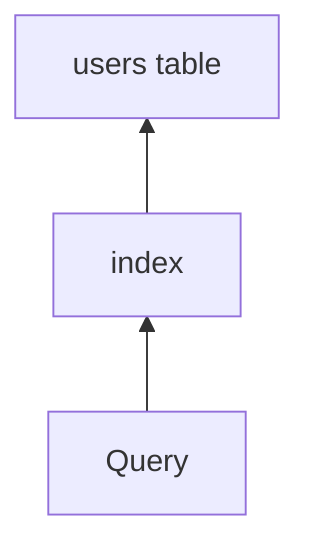

Indexes are separate data structures maintained by the database.

They can make reads much faster for suitable access patterns.

But they also have costs:

```text
More storage
More write work
More memory pressure
```

We studied the fundamentals of indexes earlier and will revisit database indexing in:

**04.07 — Database Indexing**

---

# 34. Relational Databases and Scaling

A single relational database can handle substantial workloads.

But eventually the workload may grow.

A simplified evolution could be:

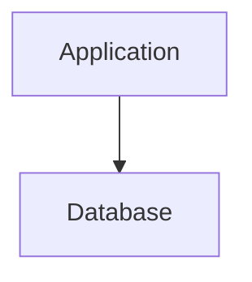

Then:

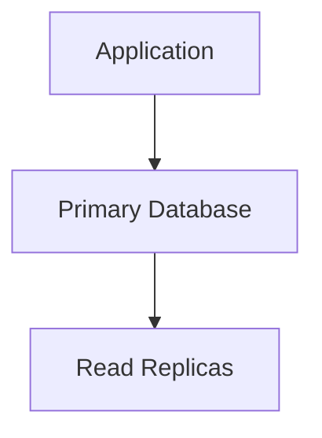

Later:

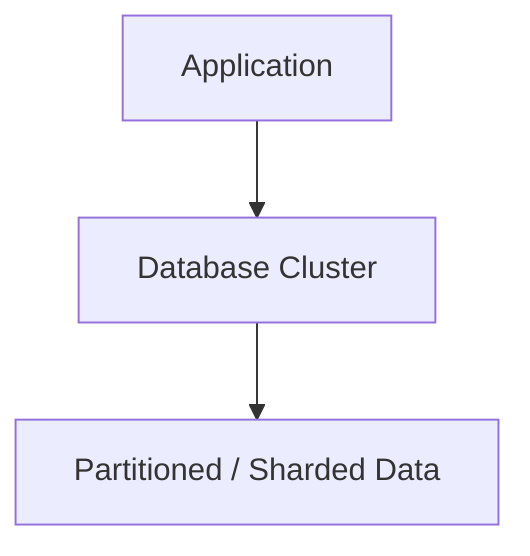

Other supporting systems may also appear:

```mermaid
flowchart LR
  accTitle: Stage 4
  accDescr: The application uses a cache, a primary database, read replicas, object storage and search.
  R["Application"]
  R --- K0["Cache"]
  R --- K1["Primary Database"]
  R --- K2["Read Replicas"]
  R --- K3["Object Storage"]
  R --- K4["Search"]
```

The key point is:

> **A relational database can scale in multiple ways; "relational" does not mean "cannot scale."**

The appropriate scaling strategy depends on workload and constraints.

---

# 35. Vertical Scaling

One way to scale a relational database is to give the database server more resources.

For example:

```mermaid
flowchart TD
  accTitle: Vertical scaling
  accDescr: Before: 4 CPU, 16 GB RAM, 500 GB SSD. After: 16 CPU, 64 GB RAM, 2 TB SSD.
  B["Before:<br/>4 CPU<br/>16 GB RAM<br/>500 GB SSD"] --> A["After:<br/>16 CPU<br/>64 GB RAM<br/>2 TB SSD"]
```

This can be simple and effective.

But it has limits.

Eventually, a single machine may become too expensive or physically constrained.

That is one reason distributed techniques become important.

---

# 36. Replication

Another approach is to maintain copies of database data.

For example:

```mermaid
flowchart TD
  accTitle: Replication
  accDescr: The primary replicates to Replica A and Replica B.
  P["Primary"] --> A["Replica A"] & B["Replica B"]
```

The primary may handle writes while replicas can serve some reads.

This can increase read capacity and improve availability.

But replication introduces new questions:

```text
How quickly do replicas receive changes?
What happens if the primary fails?
Can a replica be behind?
Which reads require the latest data?
```

We will study replication in:

**04.10 — Database Replication**

---

# 37. Partitioning and Sharding

When a dataset becomes extremely large, it may be divided.

For example:

```mermaid
flowchart TD
  accTitle: Partitioning
  accDescr: Users 1 to 1,000,000 go to partition A; users 1,000,001 to 2,000,000 go to partition B.
  A0["Users 1–1,000,000"] --> A1["Partition A"]
  B0["Users 1,000,001–2,000,000"] --> B1["Partition B"]
```

This is broadly called **partitioning**.

When data is distributed across multiple database servers, we often use the term **sharding**.

These techniques can increase capacity but introduce complexity.

We will study them later in detail.

---

# 38. Relational Databases and Consistency

One reason relational databases are widely used for business applications is that they provide strong mechanisms for maintaining relationships and constraints.

For example:

```mermaid
flowchart TD
  accTitle: Integrity
  accDescr: Order, then must reference, then existing Customer.
  N0["Order"] --> N1["must reference"] --> N2["existing Customer"]
```

and:

```mermaid
flowchart TD
  accTitle: Integrity
  accDescr: Payment, then must reference, then existing Order.
  N0["Payment"] --> N1["must reference"] --> N2["existing Order"]
```

The database can enforce these relationships.

This becomes particularly valuable when correctness matters.

However, consistency requirements are not identical for every application.

A social-media "like" counter may tolerate different behavior from a financial transaction.

Storage decisions should therefore follow business requirements.

---

# 39. When Relational Databases Work Well

Relational databases are often a strong fit when you have:

### Structured Data

```text
Users
Orders
Products
Invoices
Payments
```

### Relationships

```text
Customer → Orders
Order → Items
Product → Category
```

### Transactions

```text
Transfer
Payment
Order creation
Inventory update
```

### Strong Integrity Requirements

```text
Unique email
Valid foreign key
Valid status
Non-negative quantity
```

### Complex Queries

```text
Joins
Filtering
Aggregation
Sorting
Grouping
```

These are common requirements in business applications.

---

# 40. When Relational Databases May Need Help

A relational database may not be the only system required when the application has specialized needs.

For example:

### Large Files

Use object storage for things like:

```text
Videos
Images
Backups
Documents
```

### Extremely Fast Temporary Data

A cache such as Redis may help.

### Full-Text Search

A specialized search system may be appropriate for some workloads.

### Very High-Volume Event Processing

A message or streaming system may be introduced.

This does not mean:

> "Relational databases cannot do these things."

It means:

> **Different systems can be optimized for different responsibilities.**

---

# 41. Relational Database vs File Storage

| Feature                | Relational Database | Simple File                   |
| ---------------------- | ------------------- | ----------------------------- |
| Structured queries     | Strong              | Limited                       |
| Relationships          | Built-in modeling   | Manual                        |
| Transactions           | Supported           | Application-managed           |
| Constraints            | Supported           | Manual                        |
| Concurrent access      | Designed for it     | More difficult                |
| Indexing               | Built-in mechanisms | Manual                        |
| Recovery               | Database mechanisms | Application/storage dependent |
| Operational complexity | Higher              | Lower                         |

For a tiny script, a file may be enough.

For a business application with relationships and concurrent access, a relational database often provides much more useful infrastructure.

---

# 42. Relational Database vs Key-Value Storage

A key-value store typically looks conceptually like:

```text
"user:42" → "{...data...}"
```

A relational database may instead represent:

```text
users

id | name | email
```

Key-value storage can be extremely useful for simple lookup-oriented workloads.

Relational databases provide richer capabilities around:

* Relationships
* Queries
* Constraints
* Transactions
* Structured data

Neither model is universally better.

The workload determines the appropriate choice.

---

# 43. The Relational Model Encourages Explicit Structure

One of the strengths of relational design is that relationships and rules can be made explicit.

For example:

```mermaid
flowchart TD
  accTitle: customers to orders
  accDescr: One customer has many orders.
  N0["customers"] -->|"1<br/>many"| N1["orders"]
```

and:

```mermaid
flowchart TD
  accTitle: orders to order_items
  accDescr: One order has many order items.
  N0["orders"] -->|"1<br/>many"| N1["order_items"]
```

and:

```mermaid
flowchart TD
  accTitle: products to order_items
  accDescr: One product appears in many order items.
  N0["products"] -->|"1<br/>many"| N1["order_items"]
```

The model communicates the structure of the application data.

That structure becomes useful for:

* Development
* Validation
* Querying
* Debugging
* Reporting
* Maintenance

---

# 44. A Complete Example

Consider an online store.

We could start with these concepts:

```text
Customer
Product
Order
Order Item
Payment
```

Represent them as:

```text
customers
+----+-------+
| id | name  |
+----+-------+

products
+----+--------+-------+
| id | name   | price |
+----+--------+-------+

orders
+----+-------------+
| id | customer_id |
+----+-------------+

order_items
+----+----------+------------+----------+
| id | order_id | product_id | quantity |
+----+----------+------------+----------+

payments
+----+----------+--------+
| id | order_id | status |
+----+----------+--------+
```

Relationships:

```mermaid
flowchart TD
  accTitle: The complete example
  accDescr: Customer 1:N order, order 1:N order item, order item N:1 product; order to payment is 1:N or 1:1 depending on business rules.
  C["Customer"] -->|"1:N"| O["Order"] -->|"1:N"| I["Order Item"] -->|"N:1"| P["Product"]
  O2["Order"] -->|"1:N / 1:1 depending on business rules"| Y["Payment"]
  P ~~~ O2
```

Now the database structure reflects the business domain.

---

# 45. The Relational Design Process

A useful beginner workflow is:

```mermaid
flowchart TD
  accTitle: The relational design process
  accDescr: Business Requirements, then Identify Concepts, then Identify Data, then Identify Relationships, then Define Keys, then Define Constraints, then Design Tables, then Consider Access Patterns, then Add Indexes, then Test With Realistic Workload.
  N0["Business Requirements"] --> N1["Identify Concepts"] --> N2["Identify Data"] --> N3["Identify Relationships"] --> N4["Define Keys"] --> N5["Define Constraints"] --> N6["Design Tables"] --> N7["Consider Access Patterns"] --> N8["Add Indexes"] --> N9["Test With Realistic Workload"]
```

Notice what is missing:

```text
"Pick a database because everyone uses it."
```

Technology selection comes after understanding the data problem.

---

# 46. Common Beginner Mistakes

## Mistake 1 — One Giant Table

Putting everything into one table usually creates unnecessary duplication and makes relationships harder to manage.

---

## Mistake 2 — No Primary Key

Every important record should have a clear identity strategy.

---

## Mistake 3 — Using Foreign Keys Only in Application Code

If a relationship must always be valid, consider enforcing it at the database level.

---

## Mistake 4 — Treating IDs as Business Meaning

An ID such as:

```text
42
```

usually identifies a record.

It does not necessarily tell you anything about the business meaning of that record.

---

## Mistake 5 — Over-Normalizing Without Understanding the Workload

Normalization is useful, but excessive decomposition can sometimes make common access patterns unnecessarily complex.

Design should balance correctness, clarity, and workload requirements.

---

## Mistake 6 — Assuming Relational Means Slow

Performance depends on:

```text
Schema
Indexes
Queries
Data volume
Hardware
Concurrency
Workload
Configuration
Architecture
```

The word "relational" alone does not determine performance.

---

## Mistake 7 — Assuming NoSQL Is Automatically More Scalable

Scalability depends on the workload and architecture.

A relational database can scale substantially through:

* Vertical scaling
* Replication
* Partitioning
* Sharding
* Caching
* Query optimization
* Appropriate architecture

---

# 47. System Design View

At a system-design level, a relational database is not simply:

```text
"the place where tables live."
```

It is a system component responsible for managing important application state.

Think:

```mermaid
flowchart TD
  accTitle: What a relational database does
  accDescr: The application uses a relational database, which provides queries (with indexes), transactions (with concurrency) and constraints (with integrity).
  A["Application"] --> R["Relational Database"]
  R --> Q["Queries"] & T["Transactions"] & C["Constraints"]
  Q --> I["Indexes"]
  T --> K["Concurrency"]
  C --> G["Integrity"]
```

As the system grows:

```mermaid
flowchart TD
  accTitle: A growing system
  accDescr: The application uses a cache and a database; the database has a primary, replicas and a backup.
  A["Application"] --> C["Cache"] & D["Database"]
  D --> P["Primary"] & R["Replicas"] & B["Backup"]
```

Later:

```mermaid
flowchart TD
  accTitle: A large system
  accDescr: The database is split into partition A and partition B.
  D["Database"] --> A["Partition A"] & B["Partition B"]
```

Every additional component exists to address a particular constraint.

---

# 48. The Most Important Mental Model

Think of a relational database as three things working together:

```text
Structure
    +
Relationships
    +
Integrity
```

### Structure

```text
Tables
Rows
Columns
Types
```

### Relationships

```text
Primary Keys
Foreign Keys
Joins
```

### Integrity

```text
Constraints
Transactions
Concurrency Control
```

Together they allow applications to manage structured data reliably.

---

# 49. Practical Design Exercise

Design the basic relational model for a learning platform.

Requirements:

```text
A student can enroll in many courses.

A course contains many lessons.

A student can complete many lessons.

A lesson belongs to one course.

A student can attempt quizzes.

Each quiz attempt produces a score.
```

Start with the concepts:

```text
Student
Course
Lesson
Enrollment
Progress
Quiz
Quiz Attempt
```

Then think about the relationships:

```mermaid
flowchart TD
  accTitle: The learning platform relationships
  accDescr: Student to course is many-to-many; course to lesson is one-to-many; student to progress is one-to-many; student to quiz attempt is one-to-many.
  S1["Student"] -->|"many-to-many"| C1["Course"]
  C2["Course"] -->|"one-to-many"| L["Lesson"]
  S2["Student"] -->|"one-to-many"| P["Progress"]
  S3["Student"] -->|"one-to-many"| Q["Quiz Attempt"]
  C1 ~~~ C2
  L ~~~ S2
  P ~~~ S3
```

Do not worry about perfect SQL yet.

The objective is to practice thinking in **entities, relationships, keys, and constraints**.

---

# 50. Knowledge Check

### 1. What is a relational database?

A database that organizes data using the relational model, commonly represented through tables and relationships between data.

### 2. What is a row?

One record in a table.

### 3. What is a column?

An attribute describing a type of value stored for records in a table.

### 4. What is a primary key?

A column or set of columns used to uniquely identify rows.

### 5. What is a foreign key?

A column or set of columns that references a key in another table to represent and enforce a relationship.

### 6. What is a one-to-many relationship?

One record on one side can be associated with multiple records on the other side.

### 7. How is many-to-many commonly represented?

Using a junction/intermediate table.

### 8. Why does normalization exist?

To organize data and reduce unnecessary redundancy and update/insert/delete anomalies.

### 9. Why are constraints important?

They allow the database to enforce important data-integrity rules.

### 10. Does relational mean "cannot scale"?

No. Relational databases can scale using several strategies, depending on workload and requirements.

### 11. Is SQL the same thing as a relational database?

No. SQL is a language commonly used to interact with relational databases; PostgreSQL, MySQL, SQL Server, and Oracle are examples of database systems.

---

# 51. Quick Reference

| Concept             | Meaning                                            |
| ------------------- | -------------------------------------------------- |
| Relational Database | Database based on the relational model             |
| Table               | Structured collection of records                   |
| Row                 | One record                                         |
| Column              | Attribute/field of a record                        |
| Primary Key         | Unique identity of a row                           |
| Foreign Key         | Reference to another table's key                   |
| One-to-One          | One record ↔ one record                            |
| One-to-Many         | One record ↔ many records                          |
| Many-to-Many        | Many records ↔ many records                        |
| Junction Table      | Table used to represent many-to-many relationships |
| Constraint          | Rule enforced by the database                      |
| Normalization       | Organizing data to reduce unnecessary redundancy   |
| Join                | Combines related rows from tables                  |
| Transaction         | Group of operations treated as one logical unit    |
| ACID                | Atomicity, Consistency, Isolation, Durability      |
| Index               | Data structure that can speed up suitable queries  |

---

# 52. Key Principle

> **A relational database is not merely a collection of tables. It is a structured system for representing data, relationships, and integrity rules so that applications can store and work with information reliably.**

---

# 53. Remember

When designing relational data, think in this order:

```mermaid
flowchart TD
  accTitle: Remember
  accDescr: What are the concepts?, then What data belongs to each concept?, then How are the concepts related?, then What identifies each record?, then What rules must always be true?, then What queries will the application perform?, then What indexes and optimizations are required?.
  N0["What are the concepts?"] --> N1["What data belongs to each concept?"] --> N2["How are the concepts related?"] --> N3["What identifies each record?"] --> N4["What rules must always be true?"] --> N5["What queries will the application perform?"] --> N6["What indexes and optimizations are required?"]
```

Do not start with:

```text
"Which database should I install?"
```

Start with:

```text
"What does the data mean?"
```

---

# Next Chapter

## 04.03 — SQL Databases

The next chapter will clarify the relationship between:

```mermaid
flowchart TD
  accTitle: Next: SQL databases
  accDescr: Relational Model, then SQL, then SQL Database Systems, then PostgreSQL / MySQL / SQL Server / Oracle.
  N0["Relational Model"] --> N1["SQL"] --> N2["SQL Database Systems"] --> N3["PostgreSQL / MySQL / SQL Server / Oracle"]
```

We will examine what makes a database an SQL database, how SQL fits into application architecture, and why SQL is more than simply a language for writing `SELECT` queries.
