# 04.03 — SQL Databases

## Learning Objectives

By the end of this chapter, you should understand:

- What an SQL database is
- What SQL actually means
- The relationship between SQL, relational databases, and database systems
- How applications communicate with SQL databases
- The major categories of SQL operations
- How databases create, read, update, and delete data
- How SQL handles relationships between tables
- What schemas, constraints, and transactions mean
- Why SQL databases are widely used in application systems
- The difference between SQL syntax and database-specific features
- Why PostgreSQL, MySQL, SQL Server, and Oracle are different systems even though they use SQL
- How SQL databases fit into system architecture
- When SQL databases are a natural fit
- What trade-offs to consider

---

# 1. What Is an SQL Database?

An **SQL database** is a database system that uses **SQL (Structured Query Language)** as its primary language for interacting with data.

A typical SQL database organizes data using relational concepts:

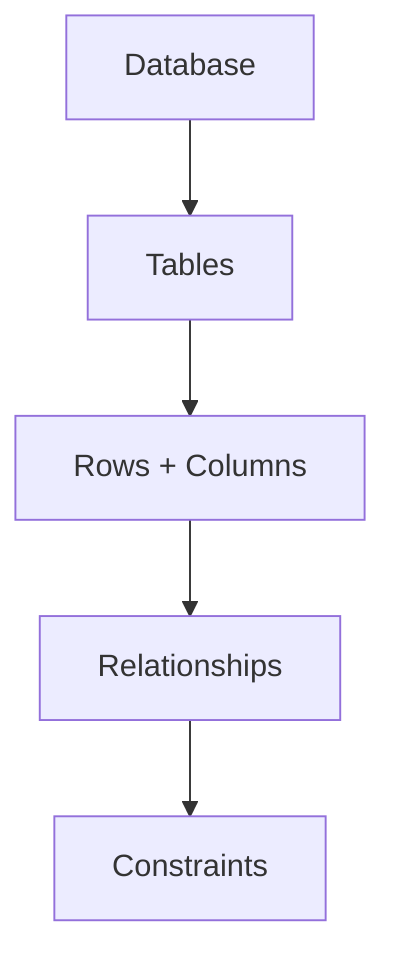

Applications can use SQL to:

```text
Create data structures
Insert data
Read data
Update data
Delete data
Control transactions
Define constraints
Manage permissions
```

For example:

```sql
SELECT name, email
FROM users
WHERE id = 42;
```

The database receives the SQL statement, determines how to execute it, and returns the result.

---

# 2. SQL Means Structured Query Language

SQL stands for:

> **Structured Query Language**

It is a language designed for interacting with data managed by database systems.

For example:

```sql
SELECT *
FROM users;
```

The SQL statement expresses what data is requested.

Another example:

```sql
INSERT INTO users (name, email)
VALUES ('Riya', 'riya@example.com');
```

This tells the database to insert a new record.

SQL therefore acts as an interface between the application/developer and the database system.

---

# 3. SQL Is a Language, Not a Database

This distinction is extremely important.

SQL itself is not:

```text
A database server
A database engine
A storage device
A database product
```

SQL is a language.

Think of the relationship like this:

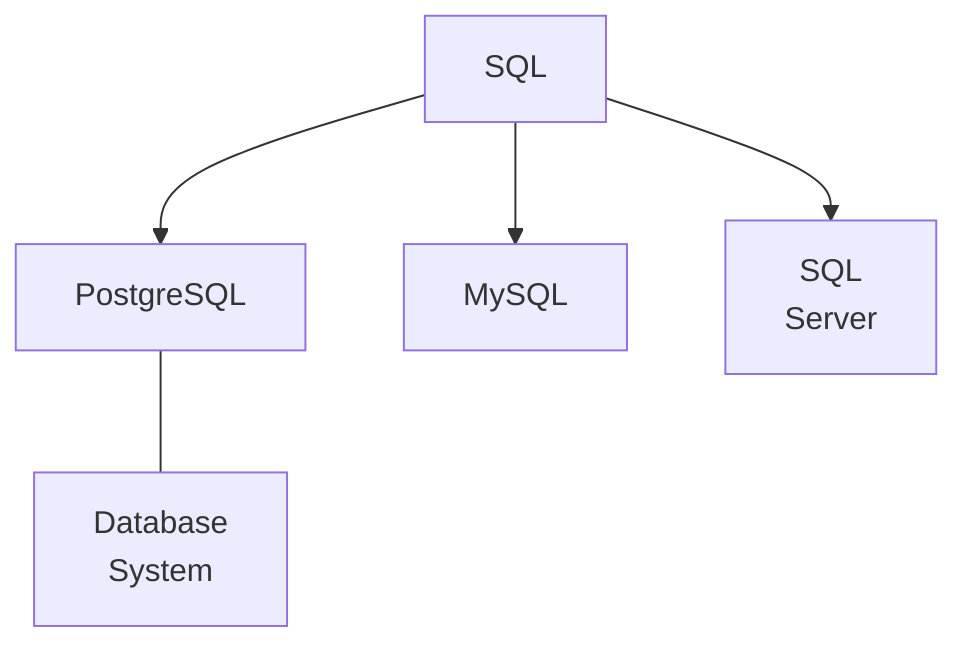

Another way to think about it:

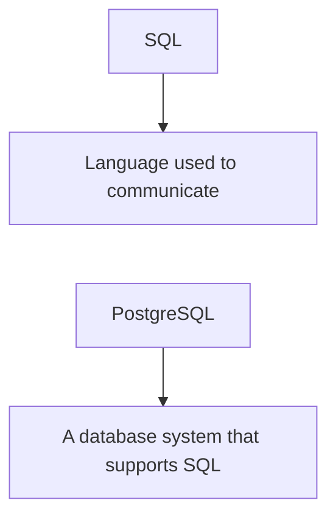

This distinction prevents a common beginner misunderstanding:

> "I installed SQL."

Usually, what you actually installed was a database system such as PostgreSQL or MySQL.

---

# 4. Relational Model vs SQL

These concepts are related but different.

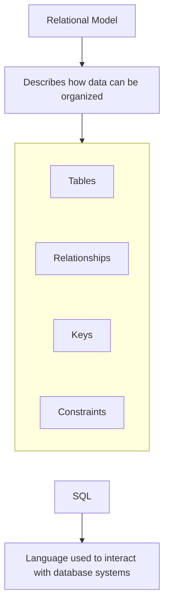

The relational model is a **data model**.

SQL is a **language**.

A database system can implement the relational model and provide SQL as its primary interface.

This is why the previous chapter focused on:

```text
Tables
Rows
Columns
Keys
Relationships
Constraints
```

and this chapter focuses on:

```text
SQL
Queries
Statements
Transactions
Database interaction
```

---

# 5. Examples of SQL Database Systems

Common SQL database systems include:

- PostgreSQL
- MySQL
- MariaDB
- Microsoft SQL Server
- Oracle Database
- SQLite

They all support SQL, but they are not identical.

They differ in:

- SQL features
- Data types
- Functions
- Extensions
- Performance characteristics
- Storage engines or architecture
- Replication capabilities
- Administration tools
- Licensing
- Operational features

Therefore:

> **Knowing SQL gives you a transferable foundation, but it does not mean every SQL database behaves exactly the same way.**

---

# 6. Why SQL Became So Important

Applications need to ask structured questions about data.

For example:

```text
Find customer #42
```

```text
Find all orders placed today
```

```text
Calculate total sales
```

```text
Find products cheaper than ₹1,000
```

```text
Find customers who placed more than five orders
```

SQL provides a standardized way to express many of these operations.

Instead of manually reading files and implementing every search algorithm, an application can tell the database what information it needs.

---

# 7. Declarative Thinking

One of the most important ideas in SQL is that it is largely **declarative**.

Consider:

```sql
SELECT name
FROM users
WHERE country = 'India';
```

You are saying:

> Give me the names of users whose country is India.

You are generally **not** telling the database:

```text
Open this file
Go to byte 100
Read this block
Compare this value
Move to the next record
...
```

The database determines how to execute the request.

This separation is powerful:

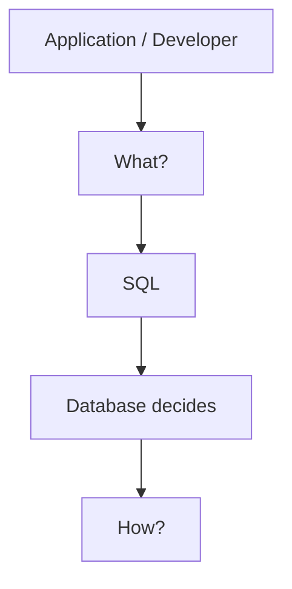

The database optimizer can choose an execution strategy based on:

- Available indexes
- Data distribution
- Table size
- Statistics
- Query structure
- Current system conditions

This connects directly to:

**03.03 — Query Optimization**

---

# 8. The SQL Database Architecture

A simplified architecture looks like this:

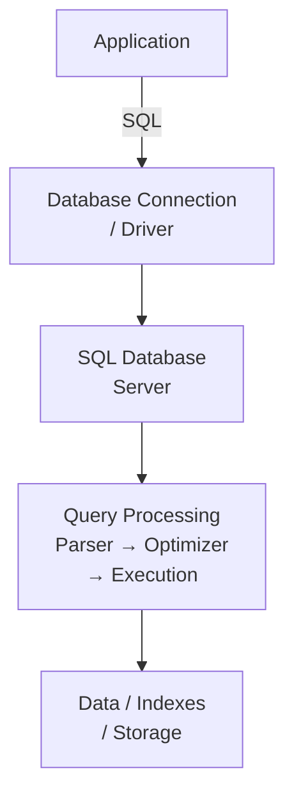

The application normally communicates with the database through a driver or database client library.

---

# 9. Application → Database

Suppose a web application needs a user's profile.

The flow may look like:

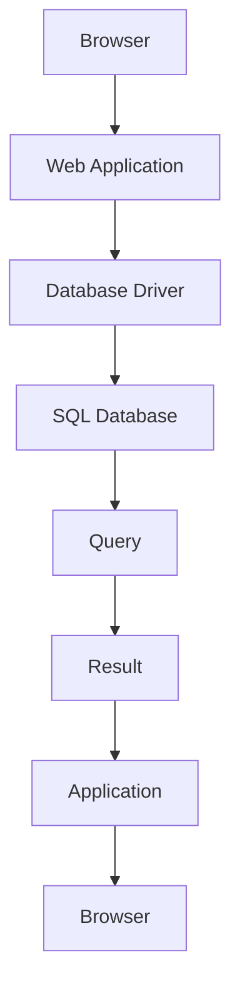

The application might execute:

```sql
SELECT id, name, email
FROM users
WHERE id = 42;
```

The database processes the query and returns the matching data.

---

# 10. SQL Statements

SQL contains different types of statements.

The most familiar are:

```text
SELECT
INSERT
UPDATE
DELETE
```

These are commonly associated with **CRUD** operations.

```text
Create → INSERT
Read   → SELECT
Update → UPDATE
Delete → DELETE
```

Example:

### Create

```sql
INSERT INTO users (name, email)
VALUES ('Riya', 'riya@example.com');
```

### Read

```sql
SELECT *
FROM users;
```

### Update

```sql
UPDATE users
SET name = 'Riya Sharma'
WHERE id = 1;
```

### Delete

```sql
DELETE FROM users
WHERE id = 1;
```

These four operations form the basic interaction between an application and its data.

---

# 11. SQL Has More Than CRUD

SQL is much larger than:

```text
SELECT
INSERT
UPDATE
DELETE
```

It also includes mechanisms for:

```text
Creating tables
Altering structures
Creating indexes
Defining constraints
Managing transactions
Creating views
Managing permissions
```

For example:

```sql
CREATE TABLE users (
    id BIGINT PRIMARY KEY,
    name VARCHAR(100) NOT NULL,
    email VARCHAR(255) UNIQUE NOT NULL
);
```

This is part of SQL's ability to define database structures.

---

# 12. DDL — Data Definition Language

SQL statements that define or change database structures are commonly grouped under **DDL**.

Examples include:

```sql
CREATE
ALTER
DROP
TRUNCATE
```

For example:

```sql
CREATE TABLE products (
    id BIGINT PRIMARY KEY,
    name VARCHAR(200) NOT NULL,
    price DECIMAL(10,2) NOT NULL
);
```

You are defining the structure of the database.

Conceptually:

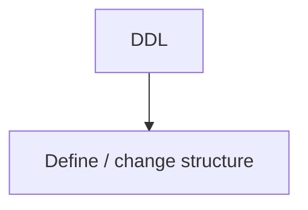

---

# 13. DML — Data Manipulation Language

DML is commonly used to describe statements that manipulate stored data.

Typical examples:

```text
INSERT
UPDATE
DELETE
```

For example:

```sql
UPDATE products
SET price = 59999
WHERE id = 10;
```

The table structure remains the same.

The stored data changes.

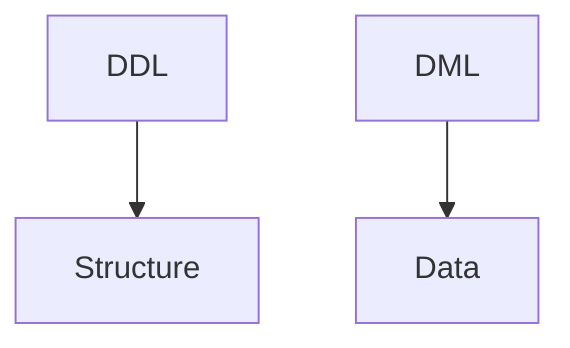

---

# 14. DQL — Data Query Language

`SELECT` is commonly described as **DQL (Data Query Language)**.

For example:

```sql
SELECT name, price
FROM products
WHERE price < 1000;
```

It retrieves data.

The terminology is useful for learning, but remember that SQL terminology classifications are not always used identically across every database reference.

The important distinction is:

```text
Define structure
Manipulate data
Retrieve data
```

---

# 15. DCL — Data Control Language

SQL can also manage access and permissions.

Examples include:

```text
GRANT
REVOKE
```

For example:

```sql
GRANT SELECT ON users TO reporting_user;
```

This allows a database administrator to control which users or roles can perform certain operations.

Security is therefore part of database architecture.

We will study database security concepts later in the Systemly curriculum.

---

# 16. TCL — Transaction Control Language

SQL databases also provide transaction-control statements.

Common examples include:

```text
BEGIN
COMMIT
ROLLBACK
```

For example:

```sql
BEGIN;

UPDATE accounts
SET balance = balance - 1000
WHERE id = 1;

UPDATE accounts
SET balance = balance + 1000
WHERE id = 2;

COMMIT;
```

If something goes wrong:

```sql
ROLLBACK;
```

The database can undo the uncommitted transaction.

This is one of the reasons SQL databases are widely used for transactional applications.

---

# 17. Tables Are Defined With SQL

Suppose we need a users table.

We can define it:

```sql
CREATE TABLE users (
    id BIGINT PRIMARY KEY,
    name VARCHAR(100) NOT NULL,
    email VARCHAR(255) NOT NULL UNIQUE,
    created_at TIMESTAMP NOT NULL
);
```

This statement defines:

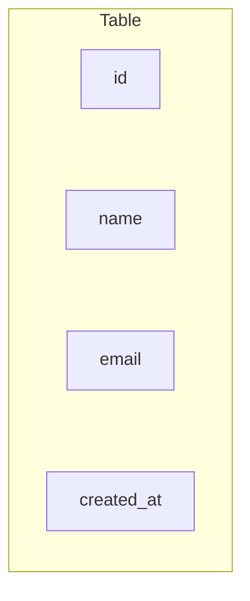

It also defines rules:

```text
id → Primary Key
name → Required
email → Required + Unique
created_at → Required
```

The database now understands the expected structure.

---

# 18. SQL Databases Enforce Constraints

Consider:

```sql
email VARCHAR(255) UNIQUE
```

The database can enforce:

```text
No duplicate email values
```

Likewise:

```sql
name VARCHAR(100) NOT NULL
```

means:

```text
name cannot be NULL
```

And:

```sql
quantity INTEGER CHECK (quantity >= 0)
```

means:

```text
quantity cannot be negative
```

Constraints are important because they protect the database even when multiple application instances are writing data.

---

# 19. SQL and Relationships

SQL is especially powerful when working with related data.

Suppose:

```text
customers
orders
```

are related:

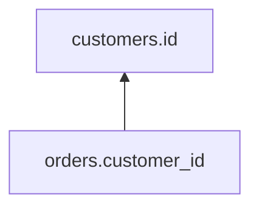

SQL can combine them.

```sql
SELECT
    customers.name,
    orders.id,
    orders.amount
FROM customers
JOIN orders
    ON orders.customer_id = customers.id;
```

The database performs the join.

The application receives the result.

---

# 20. SQL and Aggregation

SQL is also useful for calculations over many rows.

For example:

```sql
SELECT COUNT(*)
FROM orders;
```

This asks:

> How many orders exist?

Another example:

```sql
SELECT SUM(amount)
FROM orders;
```

This asks:

> What is the total order value?

You can also group data:

```sql
SELECT
    customer_id,
    COUNT(*) AS order_count
FROM orders
GROUP BY customer_id;
```

The database performs the aggregation.

This is much more efficient than always retrieving every row into the application and performing all calculations there.

---

# 21. Filtering Data

SQL can filter rows:

```sql
SELECT *
FROM products
WHERE price < 1000;
```

It can combine conditions:

```sql
SELECT *
FROM products
WHERE price < 1000
  AND available = TRUE;
```

The database can use suitable indexes and query plans to execute these operations efficiently.

This is where SQL and database performance become closely connected.

---

# 22. Ordering and Limiting

SQL can also control the result:

```sql
SELECT *
FROM products
ORDER BY price ASC
LIMIT 10;
```

This means:

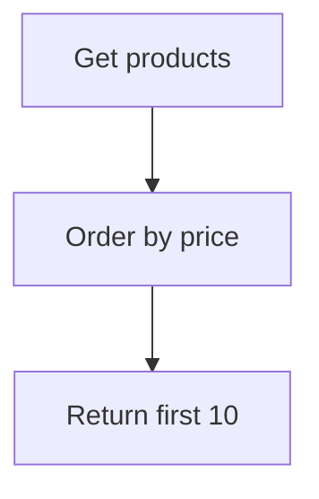

The database optimizer determines the actual execution strategy.

For large datasets, the right indexes and query design can make a major difference.

---

# 23. SQL and Indexes

Suppose we frequently execute:

```sql
SELECT *
FROM users
WHERE email = 'riya@example.com';
```

We may create:

```sql
CREATE INDEX idx_users_email
ON users(email);
```

Conceptually:

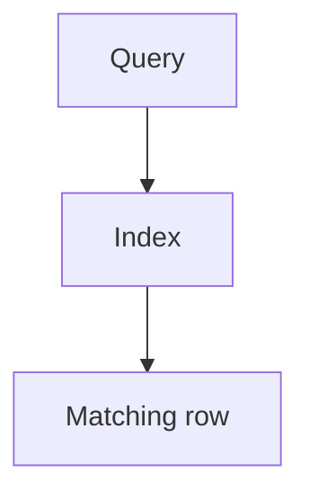

Without an appropriate index, the database may need to inspect many rows.

But indexes have costs.

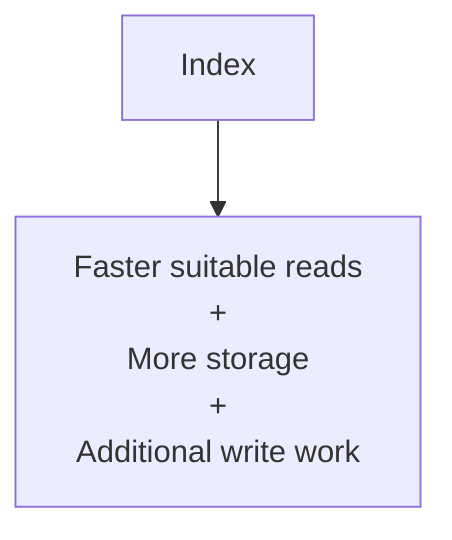

This is why indexes should follow actual access patterns.

---

# 24. SQL Does Not Guarantee Every Query Will Be Fast

A common misconception is:

> "Because I am using SQL, the database will automatically make every query fast."

No.

Performance depends on:

```text
Query structure
Schema
Indexes
Data size
Data distribution
Statistics
Concurrency
Hardware
Database configuration
Execution plan
```

For example:

```sql
SELECT *
FROM orders
WHERE LOWER(customer_email) = 'riya@example.com';
```

may behave differently from a query that can use a suitable index directly.

The database optimizer can make intelligent decisions, but good schema and query design still matter.

---

# 25. SQL Injection

Applications should **not** construct SQL by directly concatenating untrusted user input.

Dangerous pattern:

```text
"SELECT * FROM users WHERE email = '" + userInput + "'"
```

If user input contains SQL syntax, it may alter the query.

Instead, applications should use **parameterized queries / prepared statements**.

Conceptually:

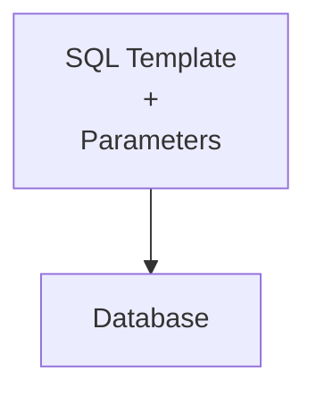

For example:

```sql
SELECT *
FROM users
WHERE email = $1;
```

The application supplies the email separately.

This keeps data separate from SQL instructions.

Security is not an optional extra in database architecture.

---

# 26. Transactions in SQL

Consider a bank transfer.

We want:

```text
Account A
    - ₹1,000

Account B
    + ₹1,000
```

A transaction can group the operations:

```sql
BEGIN;

UPDATE accounts
SET balance = balance - 1000
WHERE id = 1;

UPDATE accounts
SET balance = balance + 1000
WHERE id = 2;

COMMIT;
```

If the second operation fails:

```sql
ROLLBACK;
```

The database can return to the state before the transaction.

The exact behavior depends on transaction configuration and database semantics, but the fundamental idea is:

> **A transaction groups related changes into a controlled unit of work.**

---

# 27. SQL and Concurrency

Imagine:

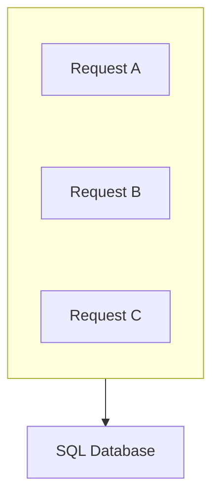

All three may modify the same data.

The database needs to manage concurrent operations.

For example:

```text
Inventory = 1

Request A → purchase
Request B → purchase
```

Without proper concurrency control, both requests might incorrectly succeed.

SQL databases provide mechanisms involving:

```text
Transactions
Locks
Isolation levels
MVCC in some systems
```

These mechanisms help the database maintain correct behavior under concurrent access.

---

# 28. SQL Database Connections

The application normally needs a database connection.

Conceptually:

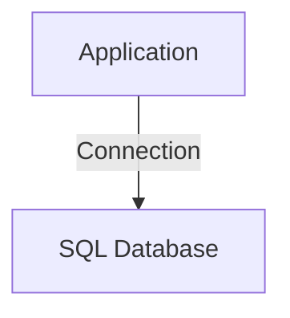

A production application may have many concurrent requests.

Creating a new database connection for every request can be expensive.

Therefore applications commonly use:

```text
Connection Pool
```

Conceptually:

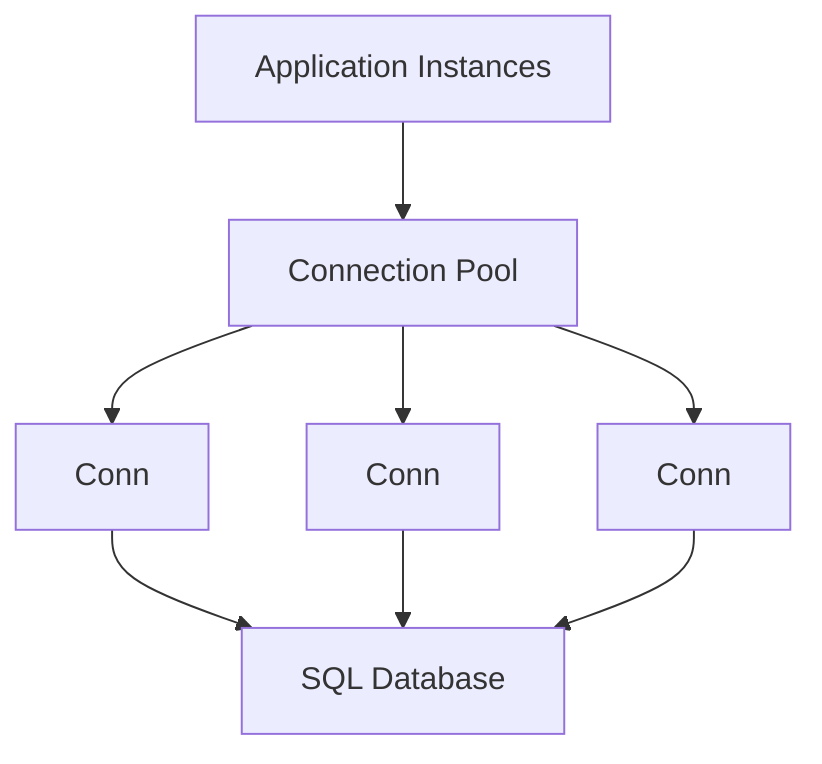

This connects directly to:

- **01.11 — Database Connections**
- **01.12 — Connection Pooling**

---

# 29. SQL Database and Application Scaling

Suppose we start with:

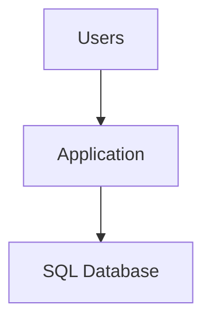

As traffic grows:

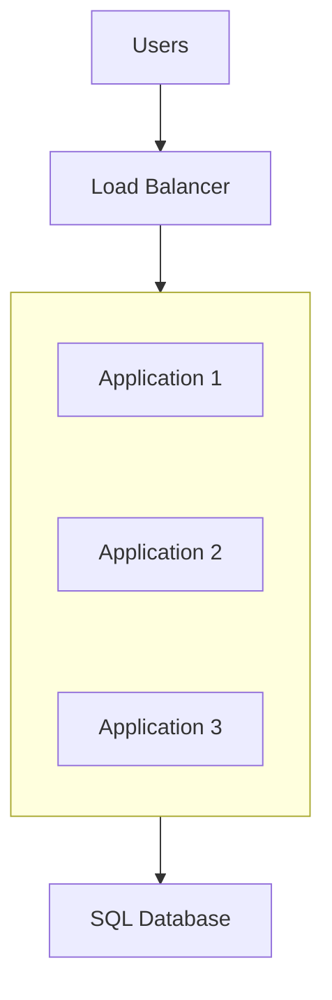

Now several application instances share the same database.

This makes database connection management important.

The database may become the bottleneck:

```mermaid
flowchart TD
  accTitle: The database bottleneck
  accDescr: Application Instances, then Database, then Bottleneck.
  N0["Application Instances"] --> N1["Database"] --> N2["Bottleneck"]
```

The architecture may then evolve using:

```text
Caching
Read replicas
Query optimization
Indexing
Partitioning
Sharding
```

depending on the actual bottleneck.

---

# 30. SQL Database and Read Replicas

A common architecture is:

```mermaid
flowchart TD
  accTitle: Read replicas
  accDescr: The application uses a primary and a replica; the primary feeds another replica.
  A["Application"] --> P["Primary"] & R1["Replica"]
  P --> R2["Replica"]
```

The primary may handle writes.

Replicas may handle suitable reads.

For example:

```mermaid
flowchart TD
  accTitle: Writes and reads
  accDescr: Writes go to the primary; reads go to a replica.
  A0["Write"] --> A1["Primary"]
  B0["Read"] --> B1["Replica"]
```

But this introduces an important issue:

> A replica may temporarily lag behind the primary.

Therefore:

```text
Write → Primary
Immediately read → Replica
```

may not always return the newest data.

This is an architectural trade-off.

Replication will be covered in detail later.

---

# 31. SQL Database and Caching

A SQL database does not need to serve every repeated read directly.

A cache can be placed in front:

```mermaid
flowchart TD
  accTitle: Caching in front of SQL
  accDescr: A request checks the cache: on a hit it returns; on a miss it goes to the SQL database.
  R["Request"] --> C["Cache"]
  C -->|"HIT"| H["Return"]
  C -->|"MISS"| D["SQL Database"]
```

This can reduce database load.

For example:

```mermaid
flowchart TD
  accTitle: Popular data in Redis
  accDescr: Popular Product, then Redis, then SQL Database only when needed.
  N0["Popular Product"] --> N1["Redis"] --> N2["SQL Database only when needed"]
```

The database can remain the source of truth.

This connects the current chapter with Level 3:

```text
03.04 Caching
03.05 Cache-Aside
03.09 Cache Invalidation
03.15 Redis
```

---

# 32. SQL Database and Object Storage

A SQL database is generally not the ideal place for every large binary object.

Suppose an application stores profile images.

Instead of putting large image data directly into the main database, an architecture may use:

```mermaid
flowchart TD
  accTitle: SQL database and object storage
  accDescr: The application keeps image metadata / URL in the SQL database and the image file in object storage.
  A["Application"] --> S["SQL Database"] & O["Object Storage"]
  S --- M["image metadata / URL"]
  O --- F["image file"]
```

For example:

```text
users
+----+-------+----------------------+
| id | name  | profile_image_url    |
+----+-------+----------------------+
```

The database stores metadata.

Object storage stores the actual file.

This separation can simplify scaling and delivery.

---

# 33. SQL Databases and Schema

A **schema** describes the structure of database objects.

For example:

```text
users
orders
products
```

with:

```text
columns
types
constraints
relationships
indexes
```

A simplified schema might look like:

```mermaid
flowchart TD
  accTitle: Schema relationships
  accDescr: customers 1:N orders, orders 1:N order_items, order_items N:1 products.
  N0["customers"] -->|"1:N"| N1["orders"] -->|"1:N"| N2["order_items"] -->|"N:1"| N3["products"]
```

The schema acts as a structural model of the application's data.

---

# 34. Schema-on-Write

SQL databases commonly use a structured approach where the expected data shape is defined before normal data is stored.

For example:

```sql
CREATE TABLE users (
    id BIGINT PRIMARY KEY,
    name VARCHAR(100) NOT NULL,
    email VARCHAR(255) NOT NULL UNIQUE
);
```

Now the database knows:

```text
id → BIGINT
name → VARCHAR
email → VARCHAR
```

This is often described as **schema-on-write**.

The database enforces the defined structure when data is written.

This differs from systems where data can be stored with a more flexible structure and interpreted later.

That distinction becomes important when comparing SQL and NoSQL.

---

# 35. SQL Standard vs Database-Specific SQL

SQL has standardized features.

However, database systems also provide extensions.

For example, PostgreSQL may support syntax or features that differ from MySQL or SQL Server.

You may encounter:

```text
Standard SQL
      +
Vendor-specific extensions
```

Therefore:

```sql
SELECT ...
```

is often portable.

But more specialized syntax may not be.

This is why a developer should understand both:

```text
SQL fundamentals
```

and:

```text
Specific database behavior
```

---

# 36. PostgreSQL Example

PostgreSQL is a relational database system with extensive SQL support.

A typical architecture might be:

```mermaid
flowchart TD
  accTitle: PostgreSQL
  accDescr: Web Application, then PostgreSQL Driver, then PostgreSQL, then Database Storage.
  N0["Web Application"] --> N1["PostgreSQL Driver"] --> N2["PostgreSQL"] --> N3["Database Storage"]
```

Example query:

```sql
SELECT id, name
FROM users
WHERE email = 'riya@example.com';
```

PostgreSQL also provides capabilities beyond basic SQL, including additional data types, indexing options, extensions, and advanced database features.

The important lesson is:

> PostgreSQL is a database system, not the SQL language itself.

---

# 37. MySQL Example

MySQL is another widely used relational database system.

The conceptual application flow is similar:

```mermaid
flowchart TD
  accTitle: MySQL
  accDescr: Application, then MySQL Driver, then MySQL Server, then Storage.
  N0["Application"] --> N1["MySQL Driver"] --> N2["MySQL Server"] --> N3["Storage"]
```

It also supports SQL for operations such as:

```sql
SELECT
INSERT
UPDATE
DELETE
CREATE TABLE
```

However, PostgreSQL and MySQL are not identical.

Their syntax, features, defaults, and operational behavior can differ.

---

# 38. SQL Server and Oracle

Other major relational database systems include:

```text
Microsoft SQL Server
Oracle Database
```

They also use SQL but have their own ecosystems.

For example:

```mermaid
flowchart TD
  accTitle: SQL Server
  accDescr: Application, then Database Driver, then SQL Server.
  N0["Application"] --> N1["Database Driver"] --> N2["SQL Server"]
```

or:

```mermaid
flowchart TD
  accTitle: Oracle
  accDescr: Application, then Database Driver, then Oracle Database.
  N0["Application"] --> N1["Database Driver"] --> N2["Oracle Database"]
```

A developer who understands SQL fundamentals can transfer much of that knowledge between systems.

But production work requires learning the specific database being used.

---

# 39. SQLite Is Different Architecturally

SQLite is also a relational database system, but its architecture is different from a typical client-server database.

A simplified model is:

```mermaid
flowchart TD
  accTitle: SQLite
  accDescr: Application, then SQLite Library, then Database File.
  N0["Application"] --> N1["SQLite Library"] --> N2["Database File"]
```

Instead of:

```mermaid
flowchart TD
  accTitle: Client-server database
  accDescr: Application, then Network, then Database Server.
  N0["Application"] --> N1["Network"] --> N2["Database Server"]
```

This makes SQLite useful for many embedded applications, local applications, prototypes, mobile applications, and other workloads where a separate database server is unnecessary.

This illustrates an important point:

> **"SQL database" does not necessarily mean "separate database server on another machine."**

---

# 40. SQL Database vs SQL Language vs SQL Server

These three phrases are easy to confuse.

### SQL

A language.

```text
SELECT ...
```

### SQL Database

A database system that uses SQL as a primary interface.

Examples:

```text
PostgreSQL
MySQL
Oracle
```

### SQL Server

A specific Microsoft database product.

So:

```text
SQL
≠
SQL Server
```

This distinction is important in technical conversations.

---

# 41. Why SQL Databases Are Popular

SQL databases provide a combination of capabilities that fit many business applications:

```text
Structured data
+
Relationships
+
Constraints
+
Transactions
+
Querying
+
Indexes
+
Aggregation
+
Mature tooling
```

Consider an e-commerce system:

```mermaid
flowchart TD
  accTitle: Strong relationships
  accDescr: Customer, then Order, then Order Items, then Product.
  N0["Customer"] --> N1["Order"] --> N2["Order Items"] --> N3["Product"]
```

A relational database naturally represents these relationships.

SQL then allows the application to query them.

---

# 42. When SQL Databases Are a Natural Fit

SQL databases are often a strong choice when the application needs:

### Strong Relationships

```text
Customers
Orders
Products
Payments
```

### Transactions

```text
Money transfers
Order creation
Inventory updates
```

### Data Integrity

```text
Unique values
Foreign keys
Business constraints
```

### Complex Queries

```text
Joins
Aggregations
Filtering
Sorting
Reporting
```

### Structured Data

Data whose structure and relationships are reasonably well understood.

---

# 43. When SQL May Not Be the Only Tool

An application can use SQL as its primary database while still using other technologies.

For example:

```mermaid
flowchart TD
  accTitle: SQL alongside other tools
  accDescr: The application uses PostgreSQL, Redis and object storage; PostgreSQL holds the core data.
  A["Application"] --> P["PostgreSQL"] & R["Redis"] & O["Object<br/>Storage"]
  P --- C["Core data"]
```

Another application might use:

```text
PostgreSQL
Redis
Search Engine
Message Broker
Object Storage
```

The presence of additional systems does not mean the SQL database has failed.

Each component may have a specific responsibility.

---

# 44. Common Beginner Mistakes

## Mistake 1 — Saying "SQL" When You Mean a Database

Incorrect:

```text
"I installed SQL."
```

More precise:

```text
"I installed PostgreSQL."
```

or:

```text
"I installed MySQL."
```

SQL is the language.

---

## Mistake 2 — Assuming All SQL Databases Are Identical

They share many concepts, but implementation and features differ.

---

## Mistake 3 — Treating SQL as Only SELECT

SQL also covers:

```text
Schema definition
Data modification
Transactions
Permissions
Database objects
```

---

## Mistake 4 — Writing SQL by Concatenating User Input

This can create SQL injection vulnerabilities.

Use parameterized queries.

---

## Mistake 5 — Putting Every Query Inside Application Code Without Thinking About the Database

The database is an active system component.

Query design, indexes, transactions, and connection management all affect application behavior.

---

## Mistake 6 — Assuming a Faster Database Automatically Fixes a Bad Query

A poor query can remain expensive even on powerful hardware.

Measure and inspect the execution plan.

---

## Mistake 7 — Assuming SQL Means "One Server"

SQL databases can use:

```text
Replication
Read replicas
Partitioning
Sharding
Clusters
Managed infrastructure
```

The architecture can be distributed.

---

# 45. SQL Database in the Bigger System

Consider a typical web application:

```mermaid
flowchart TD
  accTitle: SQL database in the bigger system
  accDescr: Users reach a load balancer, which spreads requests over app instances 1 and 2; both use a cache, then the SQL database with a primary and a replica.
  U["Users"] --> L["Load Balancer"] --> A1["App Instance 1"] & A2["App Instance 2"] --> C["Cache"] --> D["SQL Database"] --> P["Primary"] & R["Replica"]
```

Each layer has a different responsibility.

```text
Load Balancer
→ distributes requests

Application
→ executes business logic

Cache
→ avoids repeated expensive work

SQL Database
→ stores and manages core structured data

Replica
→ provides another copy for suitable reads/availability
```

This is how database technology fits into system architecture.

---

# 46. The SQL Request Lifecycle

A useful mental model is:

```mermaid
flowchart TD
  accTitle: The SQL request lifecycle
  accDescr: Application, then Build parameterized query, then Database connection, then SQL parser, then Query optimizer, then Execution plan, then Execution engine, then Tables / Indexes / Storage, then Result, then Application.
  N0["Application"] --> N1["Build parameterized query"] --> N2["Database connection"] --> N3["SQL parser"] --> N4["Query optimizer"] --> N5["Execution plan"] --> N6["Execution engine"] --> N7["Tables / Indexes / Storage"] --> N8["Result"] --> N9["Application"]
```

For a write:

```mermaid
flowchart TD
  accTitle: A write
  accDescr: Application, then SQL statement, then Parser, then Validation, then Execution, then Transaction / Storage, then Commit, then Result.
  N0["Application"] --> N1["SQL statement"] --> N2["Parser"] --> N3["Validation"] --> N4["Execution"] --> N5["Transaction / Storage"] --> N6["Commit"] --> N7["Result"]
```

This connects several earlier Systemly concepts together.

---

# 47. A Practical Example — User Registration

Suppose a user registers:

```text
Name: Riya
Email: riya@example.com
```

The application receives:

```text
POST /register
```

Then:

```mermaid
flowchart TD
  accTitle: User registration
  accDescr: User, then Application, then Validate input, then Parameterized SQL, then SQL Database, then UNIQUE(email), then Insert, then Commit, then Application, then Response.
  N0["User"] --> N1["Application"] --> N2["Validate input"] --> N3["Parameterized SQL"] --> N4["SQL Database"] --> N5["UNIQUE(email)"] --> N6["Insert"] --> N7["Commit"] --> N8["Application"] --> N9["Response"]
```

SQL might look like:

```sql
INSERT INTO users (name, email)
VALUES ($1, $2);
```

The values are supplied separately as parameters.

The database enforces:

```text
email must be unique
```

This is much safer than trusting the application alone.

---

# 48. A Practical Example — Creating an Order

Suppose a customer buys two products.

The application may need to:

```text
1. Create order
2. Create order items
3. Update inventory
4. Record payment state
```

These operations may be coordinated using a transaction.

```mermaid
flowchart TD
  accTitle: Creating an order
  accDescr: BEGIN, then Create Order, then Create Items, then Update Inventory, then Record Payment State, then COMMIT.
  N0["BEGIN"] --> N1["Create Order"] --> N2["Create Items"] --> N3["Update Inventory"] --> N4["Record Payment State"] --> N5["COMMIT"]
```

If a critical step fails:

```text
ROLLBACK
```

The exact design depends on whether external systems such as payment providers are involved.

A database transaction cannot automatically roll back an external payment provider's action.

This is an important boundary between database transactions and distributed system operations.

---

# 49. SQL Database Trade-offs

SQL databases are powerful, but they are not free.

They introduce:

```text
Schema management
Query complexity
Index maintenance
Connection management
Database operations
Backups
Monitoring
Scaling considerations
```

As the system grows, additional concerns appear:

```text
Replication
Failover
Partitioning
Sharding
Migration
Connection limits
Lock contention
Storage capacity
```

The right question is not:

> "Is SQL perfect?"

The right question is:

> "Do its capabilities match our requirements?"

---

# 50. Decision Framework

When considering an SQL database, ask:

### Data

```text
Is the data structured?
```

### Relationships

```text
Are relationships important?
```

### Integrity

```text
Do we need database-enforced constraints?
```

### Transactions

```text
Do multiple changes need to be coordinated?
```

### Queries

```text
Do we need joins, filtering, aggregation, and reporting?
```

### Scale

```text
How much data and traffic do we expect?
```

### Consistency

```text
How quickly must reads observe writes?
```

### Availability

```text
What happens if the primary database fails?
```

### Operations

```text
Can we operate and monitor the database?
```

### Growth

```text
How might the architecture evolve?
```

Do not answer these questions by looking at database popularity.

Answer them using the actual application requirements.

---

# 51. Hands-On Lab — Build a Small SQL Database

Use PostgreSQL, MySQL, or another SQL database available in your environment.

## Step 1 — Create a Database

For PostgreSQL:

```sql
CREATE DATABASE systemly_shop;
```

---

## Step 2 — Create Customers

```sql
CREATE TABLE customers (
    id BIGSERIAL PRIMARY KEY,
    name VARCHAR(100) NOT NULL,
    email VARCHAR(255) NOT NULL UNIQUE
);
```

---

## Step 3 — Create Products

```sql
CREATE TABLE products (
    id BIGSERIAL PRIMARY KEY,
    name VARCHAR(200) NOT NULL,
    price DECIMAL(10,2) NOT NULL CHECK (price >= 0)
);
```

---

## Step 4 — Create Orders

```sql
CREATE TABLE orders (
    id BIGSERIAL PRIMARY KEY,
    customer_id BIGINT NOT NULL,
    created_at TIMESTAMP NOT NULL DEFAULT CURRENT_TIMESTAMP,

    FOREIGN KEY (customer_id)
        REFERENCES customers(id)
);
```

---

## Step 5 — Insert Customers

```sql
INSERT INTO customers (name, email)
VALUES
    ('Riya', 'riya@example.com'),
    ('Amit', 'amit@example.com');
```

---

## Step 6 — Insert Products

```sql
INSERT INTO products (name, price)
VALUES
    ('Keyboard', 1500),
    ('Mouse', 800),
    ('Monitor', 12000);
```

---

## Step 7 — Create an Order

```sql
INSERT INTO orders (customer_id)
VALUES (1);
```

---

## Step 8 — Read the Order With Customer Information

```sql
SELECT
    orders.id,
    customers.name,
    customers.email,
    orders.created_at
FROM orders
JOIN customers
    ON orders.customer_id = customers.id;
```

Observe how SQL combines information from two related tables.

---

## Step 9 — Test a Constraint

Try:

```sql
INSERT INTO customers (name, email)
VALUES ('Another Riya', 'riya@example.com');
```

The database should reject the duplicate email because of:

```sql
UNIQUE(email)
```

This demonstrates that the database itself can protect an invariant.

---

# 52. Lab Challenge

Extend the small shop database.

Add:

```text
order_items
```

with:

```text
id
order_id
product_id
quantity
```

Create the relationships:

```mermaid
flowchart TD
  accTitle: Order items
  accDescr: Order, then Order Items, then Product.
  N0["Order"] --> N1["Order Items"] --> N2["Product"]
```

Then write SQL to answer:

### Challenge 1

Find all orders placed by Riya.

### Challenge 2

Find all products in order #1.

### Challenge 3

Calculate the total quantity of products in an order.

### Challenge 4

Calculate the total value of an order.

### Challenge 5

Find the top 3 most expensive products.

The goal is not merely to write SQL.

The goal is to see how:

```mermaid
flowchart TD
  accTitle: System design mental model
  accDescr: Data Model, then Relationships, then SQL, then Result.
  N0["Data Model"] --> N1["Relationships"] --> N2["SQL"] --> N3["Result"]
```

work together.

---

# 53. System Design Mental Model

Think of an SQL database as a specialized system sitting behind your application:

```mermaid
flowchart TD
  accTitle: Inside the SQL database
  accDescr: The application talks through SQL / driver to the SQL database, whose tables, indexes and transactions all rest on storage.
  A["Application"] --> S["SQL / Driver"] --> D["SQL Database"] --> T["Tables"] & I["Indexes"] & X["Transactions"] --> G["Storage"]
```

The database is responsible for much more than saving rows.

It manages:

```text
Data
Queries
Relationships
Constraints
Indexes
Concurrency
Transactions
Durability
```

This is why database architecture is a major part of system design.

---

# 54. Key Principle

> **SQL is the language; PostgreSQL, MySQL, SQL Server, Oracle, and SQLite are database systems. SQL databases are powerful because they combine structured data, relationships, constraints, querying, indexing, and transactional capabilities into a system that applications can depend on.**

---

# 55. Quick Reference

| Concept | Meaning |
|---|---|
| SQL | Structured Query Language |
| Relational Model | Model based on relations/tables and relationships |
| SQL Database | Database system primarily accessed through SQL |
| PostgreSQL | Relational database system |
| MySQL | Relational database system |
| SQL Server | Microsoft's relational database system |
| SQLite | Embedded relational database system |
| DDL | Defines database structures |
| DML | Manipulates stored data |
| DQL | Common term for querying data with `SELECT` |
| DCL | Controls permissions |
| TCL | Controls transactions |
| CRUD | Create, Read, Update, Delete |
| JOIN | Combines related data |
| Constraint | Database-enforced rule |
| Index | Structure that can accelerate suitable queries |
| Transaction | Group of operations treated as a logical unit |
| Parameterized Query | Query where values are supplied separately from SQL text |

---

# 56. Knowledge Check

### 1. Is SQL a database?

No. SQL is a language.

### 2. Is PostgreSQL SQL?

No. PostgreSQL is a database system that supports SQL.

### 3. What does SQL allow an application to do?

It allows the application to define, query, insert, modify, and manage data and database operations.

### 4. What does declarative mean in SQL?

The developer generally describes what result is wanted rather than manually specifying every physical step required to obtain it.

### 5. What is DDL?

SQL used to define or modify database structures.

### 6. What is DML?

SQL used to manipulate stored data, commonly through `INSERT`, `UPDATE`, and `DELETE`.

### 7. Why are parameterized queries important?

They separate user-provided values from SQL instructions and help prevent SQL injection.

### 8. Why are transactions important?

They allow related database operations to be coordinated as a logical unit.

### 9. Does SQL automatically make every query fast?

No. Query design, indexes, data volume, execution plans, and system conditions all affect performance.

### 10. Can an SQL database scale?

Yes. Depending on the workload, techniques include vertical scaling, replication, partitioning, sharding, caching, and query optimization.

---

# 57. Remember

Keep these distinctions clear:

```mermaid
flowchart TD
  accTitle: Keep these distinctions clear
  accDescr: The relational model is how structured relational data is modeled; SQL is the language used to interact with databases; PostgreSQL, MySQL, SQL Server and Oracle are specific database systems.
  A0["Relational Model"] --> A1["How structured relational data is modeled"]
  B0["SQL"] --> B1["Language used to interact with databases"]
  C0["PostgreSQL / MySQL / SQL Server / Oracle"] --> C1["Specific database systems"]
  A1 ~~~ B0
  B1 ~~~ C0
```

And remember the application flow:

```mermaid
flowchart TD
  accTitle: The application flow
  accDescr: Application, then Parameterized SQL, then Database Connection, then SQL Database, then Parser, then Optimizer, then Execution, then Tables / Indexes / Storage, then Result.
  N0["Application"] --> N1["Parameterized SQL"] --> N2["Database Connection"] --> N3["SQL Database"] --> N4["Parser"] --> N5["Optimizer"] --> N6["Execution"] --> N7["Tables / Indexes / Storage"] --> N8["Result"]
```

The application says **what it needs**.

The database determines **how to obtain or modify it**.

---

# Next Chapter

## 04.04 — NoSQL Databases

The next chapter will introduce the other major family of application data stores:

- What NoSQL means
- Why NoSQL databases emerged
- Key-value databases
- Document databases
- Wide-column databases
- Graph databases
- How NoSQL differs from relational databases
- Schema flexibility
- Access-pattern-driven modeling
- Consistency and scalability trade-offs
- When NoSQL makes sense
- When a relational database may still be the simpler choice
