# 04.04 — NoSQL Databases

## Learning Objectives

By the end of this chapter, you should understand:

- What a NoSQL database is
- Why NoSQL databases emerged
- Why "NoSQL" does not simply mean "not SQL"
- The major NoSQL database models
- Key-value databases
- Document databases
- Wide-column databases
- Graph databases
- How NoSQL data modeling differs from relational modeling
- Why access patterns matter so much in NoSQL
- Schema flexibility and its trade-offs
- How NoSQL systems can scale horizontally
- Consistency and availability trade-offs
- When NoSQL is a natural fit
- When a relational database may remain simpler
- Why SQL and NoSQL often coexist in the same system
- How to choose a database based on system requirements rather than popularity

---

# 1. What Is a NoSQL Database?

**NoSQL** is a broad category of database systems that do not primarily rely on the traditional relational-table model and SQL-based relational architecture.

NoSQL databases are designed around different data models and access patterns.

Common NoSQL models include:

- Key-value
- Document
- Wide-column
- Graph

Examples include:

| Model | Examples |
|---|---|
| Key-value | Redis, Amazon DynamoDB |
| Document | MongoDB, Couchbase |
| Wide-column | Apache Cassandra, ScyllaDB |
| Graph | Neo4j |

The important point is:

> **NoSQL is not one database technology. It is a family of database approaches.**

Different NoSQL databases can have very different architectures and capabilities.

---

# 2. Why Did NoSQL Databases Emerge?

Relational databases are extremely capable.

But some systems began facing requirements where a traditional relational model was not always the simplest or most natural solution.

Consider a large application with:

- Millions of users
- Very high request rates
- Large amounts of semi-structured data
- Rapidly changing data structures
- Global users
- Huge write volumes
- Simple, predictable access patterns
- Requirements for horizontal scaling

A traditional relational database may still work in many cases.

But sometimes the system may benefit from a database designed around a different model.

This led to the growth of NoSQL systems.

The motivation was not:

> "SQL databases are bad."

It was closer to:

> "Some workloads have different requirements, so different data models and architectures can be useful."

---

# 3. NoSQL Does Not Simply Mean "No SQL"

The name can be misleading.

Historically, NoSQL was often interpreted as:

> Not SQL

But modern usage is broader.

It is often understood as:

> **Not Only SQL**

Some NoSQL systems may provide SQL-like query languages, APIs, or interfaces.

The important distinction is the underlying data model and architecture.

For example:

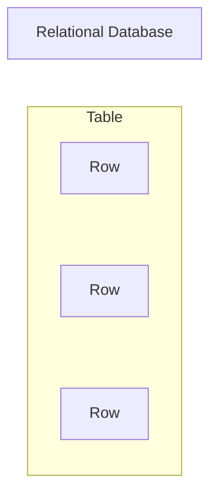

A document database may instead look like:

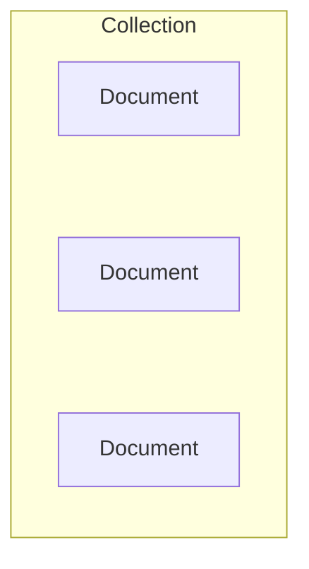

A key-value database may look like:

```text
Key → Value

user:101 → {...}
user:102 → {...}
user:103 → {...}
```

The storage model is different.

---

# 4. Relational vs NoSQL Thinking

A relational database often starts with:

> What entities and relationships does my data have?

For example:

```text
customers
orders
order_items
products
```

Then relationships are represented using keys.

NoSQL systems often encourage another question:

> **How will the application access this data?**

This difference is extremely important.

Suppose an application frequently needs:

```text
Get user profile by user ID
```

A key-value or document model may represent that access pattern directly.

For example:

```text
user:101
    ↓
{
    "name": "Riya",
    "email": "riya@example.com",
    "city": "Kolkata"
}
```

The database structure is designed around the operation.

This leads to a major NoSQL principle:

> **Model the data around the application's access patterns.**

---

# 5. The Major NoSQL Database Models

The four major categories are:

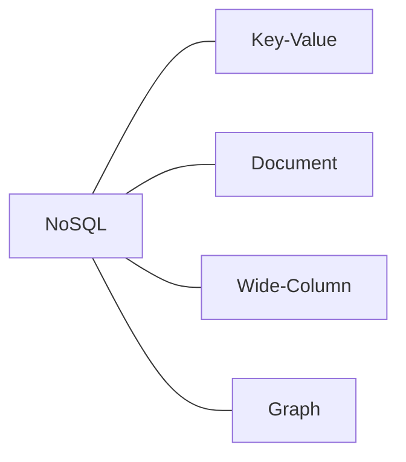

A better conceptual view is:

```text
NoSQL
 |
 +-- Key-Value
 |     └── key → value
 |
 +-- Document
 |     └── document-oriented data
 |
 +-- Wide-Column
 |     └── distributed column-oriented data
 |
 +-- Graph
       └── nodes + relationships
```

Each model solves different problems.

---

# 6. Key-Value Databases

A key-value database stores data using a simple relationship:

```text
KEY → VALUE
```

For example:

```text
user:101 → "Riya"
user:102 → "Arjun"
user:103 → "Maya"
```

The key identifies the data.

The value may contain:

- A string
- Number
- JSON-like object
- Binary data
- List
- Set
- Other supported structures

The exact capabilities depend on the database.

---

# 7. Key-Value Example

Imagine an application storing shopping-cart information.

```text
cart:user:101
    ↓
{
    "items": [
        {"product": 10, "quantity": 2},
        {"product": 20, "quantity": 1}
    ]
}
```

The application can retrieve the cart using:

```text
cart:user:101
```

The database does not necessarily need to understand the relationships between products, users, and carts in the same way a relational database does.

The application already knows how to interpret the value.

---

# 8. When Is Key-Value Useful?

Key-value databases are useful when access patterns are predictable.

For example:

```text
Get session by session ID
Get user preferences by user ID
Get shopping cart by user ID
Get token by token ID
Get cached result by cache key
```

The pattern is often:

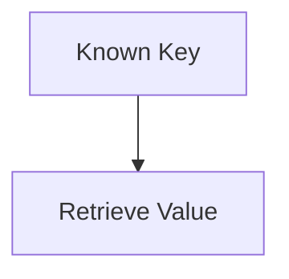

This can be extremely efficient.

---

# 9. Document Databases

Document databases store information as documents.

A document commonly looks similar to JSON.

For example:

```json
{
  "id": 101,
  "name": "Riya",
  "email": "riya@example.com",
  "address": {
    "city": "Kolkata",
    "country": "India"
  }
}
```

Instead of spreading this information across multiple relational tables, related information can sometimes be stored together.

MongoDB is a well-known document database.

---

# 10. Collections and Documents

A document database commonly organizes documents into collections.

Conceptually:

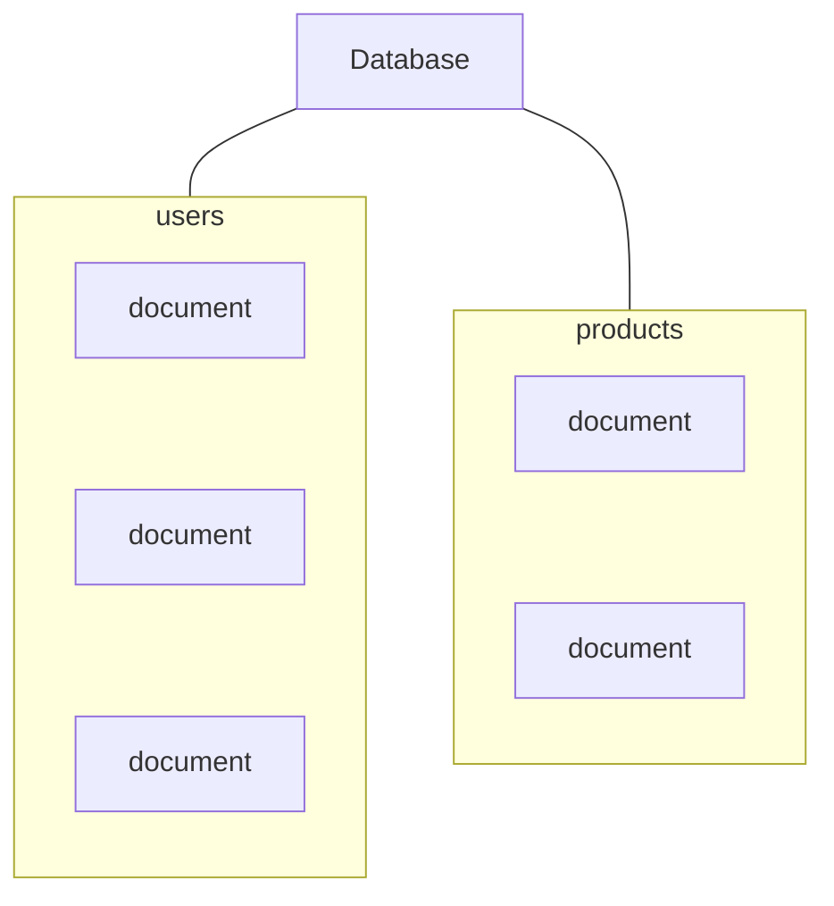

This is different from:

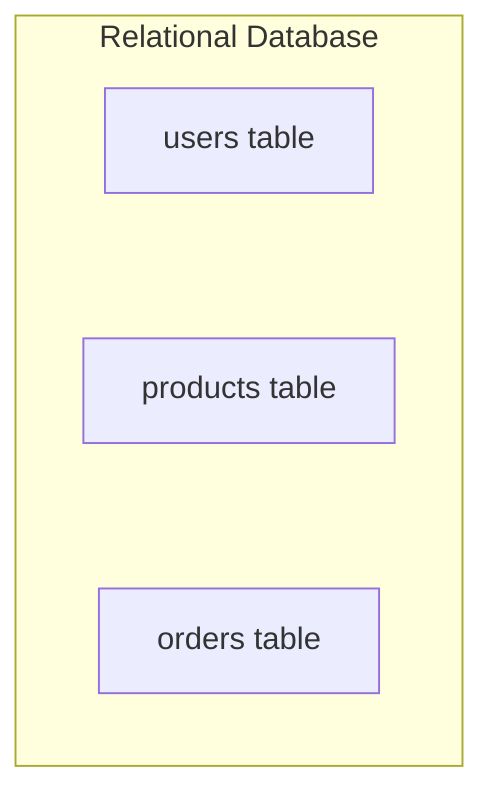

The terminology and storage model are different.

---

# 11. Flexible Document Structure

Consider two user documents:

```json
{
  "id": 101,
  "name": "Riya",
  "email": "riya@example.com"
}
```

Another document might contain:

```json
{
  "id": 102,
  "name": "Arjun",
  "email": "arjun@example.com",
  "social_links": {
    "github": "arjun-dev",
    "linkedin": "arjun-profile"
  }
}
```

The documents do not necessarily need to have exactly the same fields.

This is commonly called **schema flexibility**.

But schema flexibility does not mean:

> "There is no schema."

There is still a structure.

It may simply be enforced differently.

---

# 12. Schema-on-Write vs Schema Flexibility

Relational databases commonly encourage:

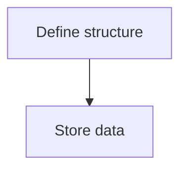

This is often called:

> Schema-on-write

A document database may allow:

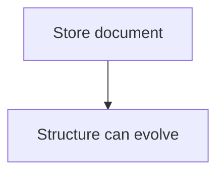

This is often described as:

> Schema flexibility

But application developers still need to understand the structure.

Otherwise, the application can end up with inconsistent documents:

```text
Document A
name
email
address

Document B
username
mail
location

Document C
user_name
email_address
city_name
```

The database may accept this.

The application may suffer.

Therefore:

> **Flexible schema does not remove the need for data modeling.**

It changes where and how some schema decisions are enforced.

---

# 13. Embedding Data

Document databases can store related information inside the same document.

For example:

```json
{
  "order_id": 5001,
  "customer_id": 101,
  "items": [
    {
      "product_id": 10,
      "name": "Keyboard",
      "quantity": 1
    },
    {
      "product_id": 20,
      "name": "Mouse",
      "quantity": 2
    }
  ]
}
```

The order and its items can be retrieved together.

This can reduce the need for joins for that particular access pattern.

But embedding has consequences.

If the same information is repeated across many documents, updates may become harder.

---

# 14. Denormalization

NoSQL systems commonly use **denormalization**.

Denormalization means storing some duplicated or pre-combined data to make reads easier or faster.

For example:

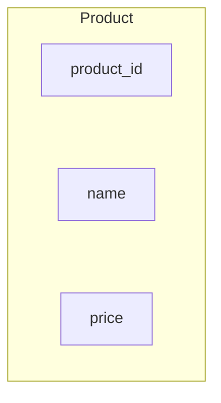

An order document might store:

```json
{
  "product_id": 10,
  "product_name": "Keyboard",
  "price_at_purchase": 1200
}
```

Why store the product name again?

Because the order needs to remember what was purchased at that time.

It also avoids depending on another read for the historical order representation.

But duplication creates another responsibility:

> **When duplicated data changes, the system must know which copy is authoritative and whether other copies need updating.**

---

# 15. Wide-Column Databases

Wide-column databases organize data differently from both relational and document databases.

Examples include:

- Apache Cassandra
- ScyllaDB

They are designed for highly distributed workloads and large amounts of data.

Conceptually:

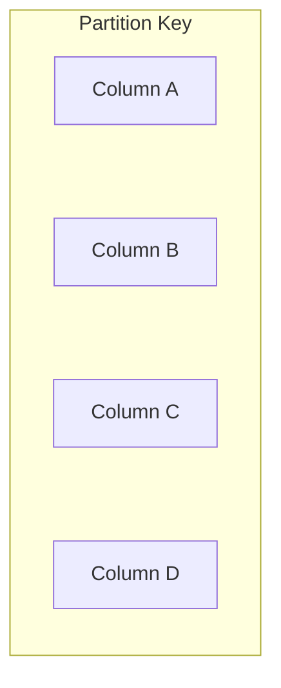

Different rows can have different sets of columns depending on the system and data model.

The exact architecture varies by database.

---

# 16. Why Wide-Column Databases Exist

Wide-column systems are often designed around:

- Very large datasets
- High write throughput
- Horizontal scaling
- Distributed operation
- High availability
- Predictable access patterns

Instead of designing the database first around normalized relationships, the model is often designed around the queries the system needs to perform.

For example:

```text
Get all events for user 101
ordered by time
```

A wide-column model may be designed specifically around that access pattern.

---

# 17. Partitioning in Wide-Column Systems

Large distributed databases divide data across machines.

Conceptually:

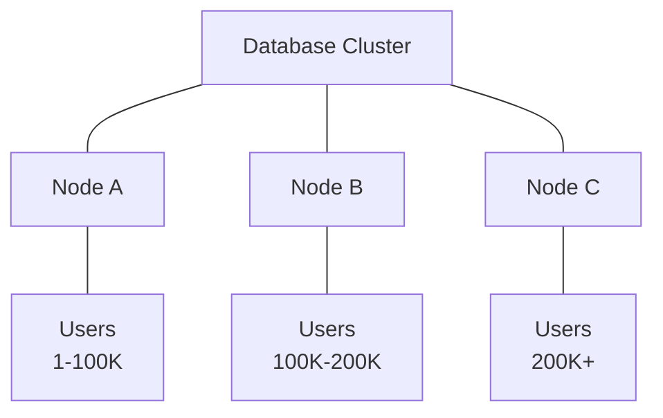

The exact distribution mechanism depends on the database.

The important system-design idea is:

> **Data must be distributed in a way that allows the cluster to handle the workload without creating overloaded partitions.**

This connects directly to later topics such as:

- Partitioning
- Sharding
- Consistent hashing
- Hot partitions

---

# 18. Graph Databases

Graph databases are designed around relationships.

Instead of thinking primarily in terms of:

```text
rows and columns
```

the model focuses on:

```text
Nodes
  +
Relationships
  +
Properties
```

For example:

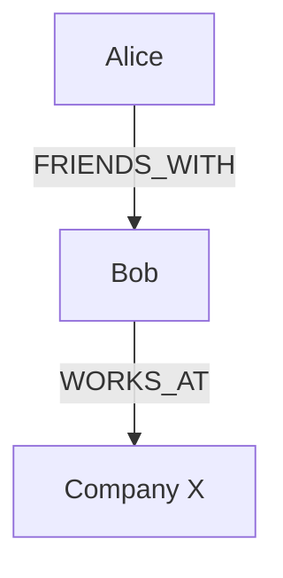

Neo4j is a well-known graph database.

---

# 19. Why Graph Databases Exist

Some applications are dominated by relationships.

Examples include:

- Social networks
- Recommendation systems
- Fraud detection
- Knowledge graphs
- Network topology
- Dependency analysis

Imagine asking:

> Find people who are friends of friends of a particular user.

In a graph model, the relationship itself is a first-class part of the data model.

---

# 20. The Four Models at a Glance

| Model | Basic Idea | Common Strength |
|---|---|---|
| Key-value | Key → Value | Very fast direct lookup |
| Document | Document-oriented data | Flexible, nested application data |
| Wide-column | Distributed column-oriented model | Large-scale distributed workloads |
| Graph | Nodes + relationships | Relationship-heavy queries |

Do not memorize this as:

> "MongoDB is always better for X."

The actual workload matters.

---

# 21. Access Patterns Drive NoSQL Design

This is one of the most important ideas in this chapter.

Suppose the application needs:

```text
Get user by ID
```

You might model:

```text
user_id → user data
```

If the application needs:

```text
Get all orders for customer 101
ordered by creation time
```

the database structure may be designed around:

```text
customer_id + order_time
```

The database model follows the query pattern.

This is very different from designing a completely normalized schema first and then asking how every query will work.

---

# 22. Why Access Patterns Matter

Imagine a system receives:

```text
10 million requests/day
```

and almost every request is:

```text
Get product by product_id
```

The database should be optimized around that access pattern.

But if the main operation is:

```text
Find relationships between millions of users
```

a graph-oriented model may be more natural.

Therefore:

> **The right database depends heavily on what the application actually needs to do with the data.**

---

# 23. NoSQL and Horizontal Scaling

Many NoSQL databases were designed with distributed systems in mind.

A simplified architecture may look like:

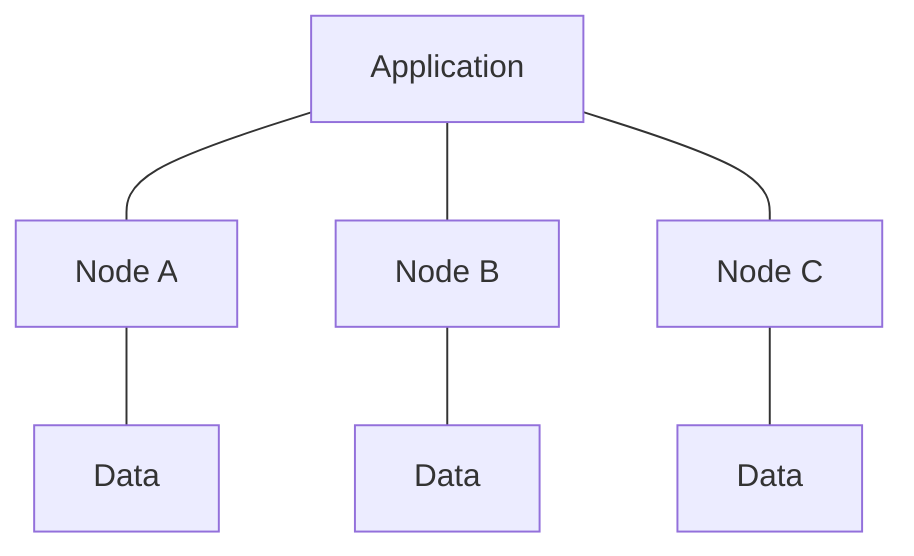

As the workload grows, additional nodes can sometimes be added.

This is called:

> Horizontal scaling

However:

> **NoSQL does not automatically mean infinite scalability.**

The database still has:

- Network limits
- Storage limits
- CPU limits
- Memory limits
- Partition limits
- Hot-key/hot-partition problems
- Operational complexity

---

# 24. Partitioning and Distribution

A distributed NoSQL database may divide data across multiple nodes.

For example:

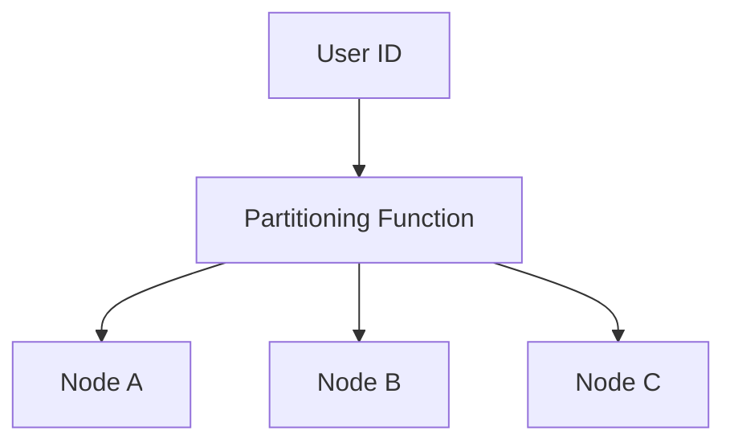

The goal is generally to distribute workload.

But a poor partition key can create a hotspot.

For example:

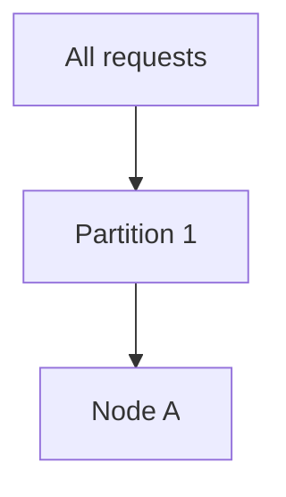

while other nodes remain underused.

This is called a **hot partition**.

Partition-key design becomes a major system-design concern.

---

# 25. Consistency in NoSQL Systems

Different NoSQL databases provide different consistency models.

Do not assume:

> "NoSQL means eventual consistency."

That statement is too broad.

Some NoSQL databases provide strong consistency options.

Others may offer different consistency levels or favor availability and partition tolerance in particular configurations.

The important question is:

> **What consistency guarantees does this particular database provide, and what does this application require?**

---

# 26. Eventual Consistency

In an eventually consistent system, different replicas may temporarily contain different versions of data.

Conceptually:

```text
Write
  |
  v
Replica A → updated
Replica B → updating
Replica C → updating
```

After some time:

```text
Replica A → updated
Replica B → updated
Replica C → updated
```

This can be acceptable for some workloads.

For example:

- Social activity counts
- Recommendations
- Some analytics
- Some feeds
- Non-critical replicated data

But it may be inappropriate for every operation.

For example:

```text
Bank account balance
Payment authorization
Inventory reservation
```

These systems may require stronger guarantees depending on the business rules.

---

# 27. NoSQL Does Not Mean "No Transactions"

Another common misconception is:

> NoSQL databases cannot perform transactions.

This is not universally true.

Modern NoSQL databases may provide various forms of:

- Atomic operations
- Conditional writes
- Transactions
- Compare-and-set operations
- Multi-document transactions

The exact capabilities differ by database.

Therefore, ask:

> What transactional guarantees does this database provide?

rather than:

> Does NoSQL support transactions?

---

# 28. Relationships in NoSQL

Relational databases represent relationships using keys and joins.

For example:

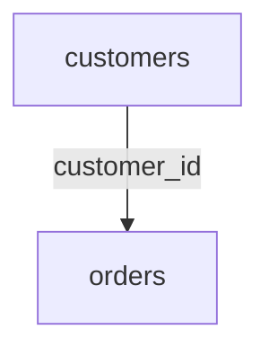

NoSQL systems may represent the same relationship differently.

Possible approaches include:

### Reference

```json
{
  "customer_id": 101
}
```

### Embedding

```json
{
  "customer": {
    "id": 101,
    "name": "Riya"
  }
}
```

### Duplication

```json
{
  "customer_id": 101,
  "customer_name": "Riya"
}
```

Each approach has trade-offs.

---

# 29. NoSQL Data Modeling Is Not "No Modeling"

This is a very important distinction.

A beginner may think:

```text
SQL:
    Design schema carefully

NoSQL:
    Put JSON into database
```

That is incorrect.

A NoSQL system still requires decisions about:

- Keys
- Partitioning
- Data duplication
- Access patterns
- Consistency
- Retention
- Indexes
- Query patterns
- Data size
- Updates
- Failure recovery

Sometimes NoSQL requires **more application-level discipline**, not less.

---

# 30. SQL vs NoSQL: Different Starting Questions

A simplified comparison:

### Relational approach

```text
What entities exist?

What relationships exist?

What constraints must hold?

How should the normalized data model look?
```

### NoSQL approach

```text
What queries will the application perform?

Which data is accessed together?

How should the data be partitioned?

What consistency is required?

How will this workload scale?
```

These are not mutually exclusive philosophies.

Real systems often use both.

---

# 31. SQL and NoSQL Can Coexist

A system does not have to choose one database for everything.

For example:

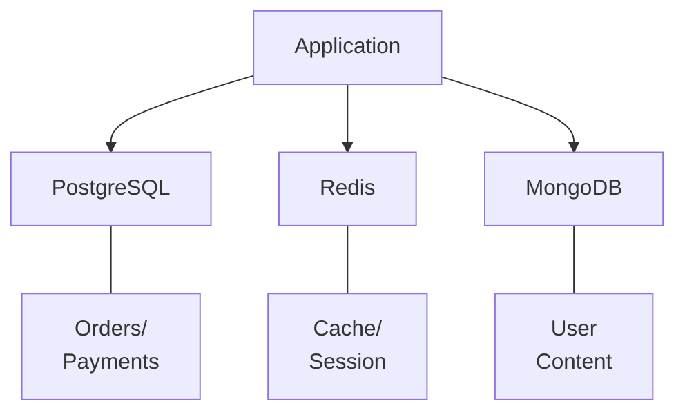

Each database can have a specific responsibility.

This is sometimes called **polyglot persistence**.

The idea is:

> Use different storage technologies when different parts of the system have genuinely different requirements.

---

# 32. Polyglot Persistence

Suppose an e-commerce system has:

### PostgreSQL

```text
Customers
Orders
Payments
Inventory
```

### Redis

```text
Cache
Sessions
Rate limiting
Temporary state
```

### Object Storage

```text
Product images
Invoices
Videos
Documents
```

### Search Engine

```text
Product search
Full-text search
Filtering
Ranking
```

The system uses multiple specialized technologies.

But there is a cost.

Every additional technology adds:

- Operational complexity
- Monitoring requirements
- Failure modes
- Deployment complexity
- Data synchronization concerns
- Developer learning requirements

Therefore:

> **Use multiple databases because the system needs them, not because using more technologies looks sophisticated.**

---

# 33. NoSQL and Schema Evolution

One reason teams choose document databases is that application data structures may evolve frequently.

Suppose version 1 stores:

```json
{
  "name": "Riya",
  "email": "riya@example.com"
}
```

Later version 2 adds:

```json
{
  "name": "Riya",
  "email": "riya@example.com",
  "preferences": {
    "theme": "dark"
  }
}
```

Older documents may still exist.

The application may need to support both:

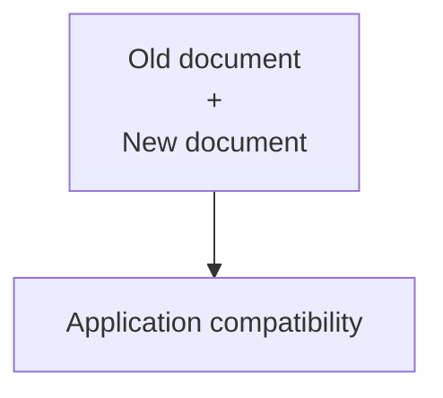

This means schema flexibility shifts some responsibility toward application code and migration strategies.

---

# 34. NoSQL Indexes

NoSQL databases can also provide indexes.

For example, a document database may allow an index on:

```text
email
```

A key-value database may provide different mechanisms for alternate access patterns.

A wide-column database may organize data around partition and clustering keys.

The exact indexing model varies.

Therefore:

> **NoSQL does not mean "no indexes."**

The database still needs a way to locate relevant data efficiently.

---

# 35. NoSQL and Query Flexibility

Relational databases are generally strong at flexible queries across related data.

For example:

```sql
SELECT ...
FROM orders
JOIN customers ...
JOIN order_items ...
GROUP BY ...
ORDER BY ...
```

Some NoSQL databases intentionally optimize for more predictable access patterns.

This can be a strength.

If the application knows exactly what it needs:

```text
Get user by ID
Get orders by customer ID
Get events by device ID and time range
```

the database can be designed specifically around those operations.

But if the application suddenly requires many unpredictable queries, the data model may become harder to work with.

---

# 36. The Trade-off of Query Flexibility

Consider two approaches.

### Flexible relational querying

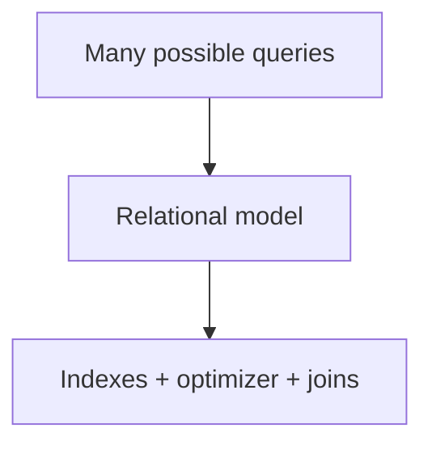

### Access-pattern-driven NoSQL

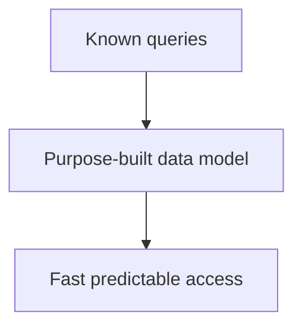

Neither is universally superior.

The correct choice depends on workload.

---

# 37. NoSQL and Joins

A common reason to choose NoSQL is to avoid expensive or complex joins.

Instead of:

```mermaid
flowchart TD
  accTitle: Joining related data
  accDescr: Order, then Customer, then Order Items, then Products.
  N0["Order"] --> N1["Customer"] --> N2["Order Items"] --> N3["Products"]
```

the application may store commonly accessed data together.

For example:

```json
{
  "order_id": 5001,
  "customer": {
    "id": 101,
    "name": "Riya"
  },
  "items": [
    {
      "product_id": 10,
      "name": "Keyboard",
      "quantity": 1
    }
  ]
}
```

This can make a read simple.

But it also introduces duplication and update complexity.

---

# 38. NoSQL and Large Data Volumes

Large-scale NoSQL systems often focus on distributing data across machines.

Conceptually:

```mermaid
flowchart TD
  accTitle: Partitioning large data
  accDescr: Data is partitioned across nodes A, B and C.
  D["Data"] --- P["Partitioning"] --- A["Node A"] & B["Node B"] & C["Node C"]
```

This can allow the system to grow horizontally.

But the design must consider:

- Partition key
- Data distribution
- Replication
- Network traffic
- Hot partitions
- Storage growth
- Repair/recovery
- Consistency

Scaling is an architectural problem, not merely a database feature.

---

# 39. When NoSQL Is a Natural Fit

NoSQL can be a natural fit when the application has requirements such as:

### 1. Large-scale distributed workloads

```text
Very large data
+
High traffic
+
Horizontal scaling
```

### 2. Semi-structured data

```text
Documents vary naturally
```

### 3. Predictable access patterns

```text
Known queries
+
High volume
```

### 4. Very high write workloads

Some distributed NoSQL systems are designed for high write throughput.

### 5. Relationship-heavy workloads

Graph databases may be a natural fit when relationships are the primary query target.

### 6. Specialized data structures

Key-value systems can be useful for simple, extremely fast lookups.

---

# 40. When a Relational Database May Be Simpler

A relational database may be a simpler choice when the application needs:

- Strong relationships
- Complex joins
- Strong integrity constraints
- Complex reporting
- Multi-step transactions
- Flexible ad-hoc queries
- Mature SQL tooling
- Structured business data

For example:

```text
Accounting
Payments
Orders
Inventory
ERP
Business management systems
```

These often benefit from relational modeling.

This does not mean NoSQL cannot be used.

It means the relational model may naturally match the problem.

---

# 41. Example — E-Commerce System

Suppose we are building an e-commerce platform.

Data includes:

```text
Customers
Products
Orders
Payments
Inventory
Reviews
Product images
Sessions
```

A possible architecture could be:

```mermaid
flowchart TD
  accTitle: E-commerce data stores
  accDescr: The e-commerce app uses PostgreSQL for orders/payments, Redis for sessions/cache and MongoDB for product content; object storage holds product images.
  A["E-Commerce App"] --> P["PostgreSQL"] & R["Redis"] & M["MongoDB"]
  P --- PD["Orders/<br/>Payments"]
  R --- RD["Sessions/<br/>Cache"]
  M --- MD["Product<br/>Content"]
  PD --- O["Object<br/>Storage"] --- I["Product<br/>Images"]
```

The important question is not:

> "Which database is best?"

Instead ask:

> **Which storage technology best matches each workload?**

---

# 42. Example — Social Feed

Consider a social application.

A user's feed might contain:

```text
Post
Author
Timestamp
Likes
Comments
Media
```

Different parts of the system may have different storage requirements.

For example:

```text
User profile
    → Document database

Feed cache
    → Redis

Post metadata
    → Relational or document database

Images/videos
    → Object storage

Search
    → Search engine
```

The final architecture depends on:

- Traffic
- Consistency requirements
- Query patterns
- Scale
- Team capabilities
- Operational constraints

---

# 43. Example — Recommendation Graph

Suppose a system needs to answer:

```text
Which products are frequently viewed
by people similar to this user?
```

The system may contain relationships such as:

```mermaid
flowchart TD
  accTitle: A recommendation graph
  accDescr: A user viewed a product; the product belongs to a category.
  N0["User"] -->|"viewed"| N1["Product"] -->|"belongs to"| N2["Category"]
```

A graph-oriented system may be useful when traversing relationships is central to the workload.

Again:

> The access pattern drives the technology choice.

---

# 44. NoSQL Is Not Automatically Faster

This is a very common mistake.

You may hear:

> "NoSQL is faster than SQL."

That is too broad.

Performance depends on:

- Query pattern
- Data model
- Indexes
- Hardware
- Network
- Dataset size
- Workload
- Concurrency
- Consistency requirements
- Database implementation

A poorly designed NoSQL data model can be slow.

A well-designed relational database can be extremely fast.

Therefore:

> **Do not choose a database based on the label "SQL" or "NoSQL" alone.**

---

# 45. NoSQL Is Not Automatically More Scalable

Another misconception:

> "NoSQL scales horizontally, SQL does not."

This is also too broad.

Modern relational databases can use:

- Read replicas
- Partitioning
- Sharding
- Distributed SQL architectures
- Caching
- Connection pooling
- Horizontal application scaling

NoSQL systems can also scale horizontally.

The real question is:

> **How does this particular database scale for this particular workload?**

---

# 46. NoSQL and Consistency Trade-offs

Distributed systems often force trade-offs.

For example:

```mermaid
flowchart TD
  accTitle: Replicas and consistency
  accDescr: More replicas, then More availability + More distribution, then Potential consistency complexity.
  N0["More replicas"] --> N1["More availability<br/>+<br/>More distribution"] --> N2["Potential consistency complexity"]
```

The exact behavior depends on the database.

You must understand:

- Read consistency
- Write consistency
- Replication
- Conflict handling
- Failure recovery
- Network partitions

before choosing a distributed database.

---

# 47. Data Duplication Is a Design Decision

NoSQL systems often duplicate data intentionally.

For example:

```text
Order A
  customer_name = "Riya"

Order B
  customer_name = "Riya"

Order C
  customer_name = "Riya"
```

This can make reads easier.

But suppose the customer's name changes.

Now the system must decide:

```text
Update every copy?
```

or:

```text
Keep historical value?
```

or:

```text
Read current customer data separately?
```

This is not a database-only problem.

It is a domain and system-design decision.

---

# 48. Source of Truth

When data is duplicated, the system should clearly define the source of truth.

For example:

```mermaid
flowchart TD
  accTitle: Source of truth
  accDescr: The customer service writes to the customer database, which feeds a cached customer name, a search index and an analytics copy.
  S["Customer Service"] --> D["Customer Database"] --> C["Cached<br/>customer<br/>name"] & I["Search<br/>index"] & A["Analytics<br/>copy"]
```

The primary database may be the source of truth.

Other representations may be derived copies.

This distinction becomes very important when data changes.

---

# 49. NoSQL Failure Scenarios

A production NoSQL system can fail in many ways.

For example:

### Node failure

```mermaid
flowchart TD
  accTitle: Node failure
  accDescr: Node A fails; replicas continue serving.
  N["Node A<br/>X"] ~~~ R["Replicas"] --> C["Continue serving"]
```

### Network partition

```text
Node A  X  Node B
```

### Hot partition

```mermaid
flowchart TD
  accTitle: Hot partition
  accDescr: Huge traffic, then Partition A, then Overloaded node.
  N0["Huge traffic"] --> N1["Partition A"] --> N2["Overloaded node"]
```

### Large document

```mermaid
flowchart TD
  accTitle: Large document
  accDescr: One huge record, then Memory / network / latency problems.
  N0["One huge record"] --> N1["Memory / network / latency problems"]
```

### Inconsistent duplicated data

```mermaid
flowchart TD
  accTitle: Inconsistent duplicated data
  accDescr: Source updated, then Derived copy not updated.
  N0["Source updated"] --> N1["Derived copy not updated"]
```

These are system-design concerns, not merely database configuration issues.

---

# 50. Operational Complexity

NoSQL can simplify some problems while introducing others.

For example:

```mermaid
flowchart TD
  accTitle: Flexible schema benefit
  accDescr: Flexible schema, then Less rigid migration.
  N0["Flexible schema"] --> N1["Less rigid migration"]
```

But:

```mermaid
flowchart TD
  accTitle: Flexible schema cost
  accDescr: Flexible schema, then Potentially inconsistent data.
  N0["Flexible schema"] --> N1["Potentially inconsistent data"]
```

Similarly:

```mermaid
flowchart TD
  accTitle: Horizontal scaling benefit
  accDescr: Horizontal scaling, then More capacity.
  N0["Horizontal scaling"] --> N1["More capacity"]
```

But:

```mermaid
flowchart TD
  accTitle: Distributed cluster cost
  accDescr: Distributed cluster, then More operational complexity.
  N0["Distributed cluster"] --> N1["More operational complexity"]
```

Always consider the entire lifecycle.

---

# 51. NoSQL and Application Code

With relational databases, some rules can be enforced strongly inside the database:

```text
PRIMARY KEY
FOREIGN KEY
UNIQUE
CHECK
NOT NULL
```

In some NoSQL designs, more responsibility may move into application code.

For example:

```mermaid
flowchart TD
  accTitle: Responsibilities in application code
  accDescr: The application validates structure and relationships, handles duplicates and retries, and manages consistency and migrations.
  subgraph G["Application"]
    direction TB
    I0["Validate structure"] ~~~ I1["Validate relationships"] ~~~ I2["Handle duplicates"] ~~~ I3["Handle retries"] ~~~ I4["Manage consistency"] ~~~ I5["Manage migrations"]
  end
```

This can be appropriate.

But it means developers must understand the consequences.

---

# 52. NoSQL and Transactions

Suppose an order operation needs to perform:

```text
Create Order
+
Reduce Inventory
+
Record Payment State
```

This may require transactional guarantees.

Before selecting a NoSQL database, ask:

```text
Can it provide the transaction scope I need?
```

For example:

```text
One document?
Multiple documents?
Multiple partitions?
Multiple nodes?
```

The answer may differ dramatically between databases.

---

# 53. NoSQL and Security

Database choice does not remove security requirements.

A NoSQL system still needs:

- Authentication
- Authorization
- Encryption
- Network protection
- Secrets management
- Access controls
- Audit logging
- Input validation
- Backup protection

For example, a publicly accessible database can expose sensitive data regardless of whether it is SQL or NoSQL.

Security is a system property.

---

# 54. NoSQL and Backups

A distributed database still needs recovery planning.

Ask:

```text
What happens if a node fails?

What happens if several nodes fail?

What happens if data is accidentally deleted?

Can we restore historical data?

How long does restoration take?
```

Replication is not automatically a backup.

For example:

```mermaid
flowchart TD
  accTitle: Replication is not backup
  accDescr: Accidental deletion, then Replication, then Deletion copied to replicas.
  N0["Accidental deletion"] --> N1["Replication"] --> N2["Deletion copied to replicas"]
```

The system still needs a recovery strategy.

---

# 55. Choosing Between SQL and NoSQL

Use this decision sequence.

### Step 1 — Understand the data

```text
Structured?
Semi-structured?
Relationship-heavy?
Document-oriented?
Key-value?
Graph?
```

### Step 2 — Understand access patterns

```text
What queries happen most often?
```

### Step 3 — Understand consistency

```text
Strong?
Eventual?
Configurable?
```

### Step 4 — Understand transactions

```text
Single record?
Multiple records?
Multiple partitions?
```

### Step 5 — Understand scale

```text
How much data?
How many reads?
How many writes?
How many users?
```

### Step 6 — Understand operations

```text
Can the team operate the database?
```

### Step 7 — Understand future evolution

```text
Will the workload change?
Will the schema change?
Will queries become less predictable?
```

---

# 56. A Simple Decision Framework

```mermaid
flowchart TD
  accTitle: A simple decision framework
  accDescr: Start: what kind of data? Structured: SQL often natural; documents: document DB possible; relationships: graph DB possible. Then: what are the access patterns, how must it scale, what consistency is required, what transactions are needed, final technology decision.
  S["Start"] --> Q1["What kind of data?"] --> G
  subgraph G[" "]
    direction TB
    subgraph RA[" "]
      direction LR
      A["Structured"] --> A1["SQL often<br/>natural"]
    end
    subgraph RB[" "]
      direction LR
      B["Documents"] --> B1["Document DB<br/>possible"]
    end
    subgraph RC[" "]
      direction LR
      C["Relationships"] --> C1["Graph DB<br/>possible"]
    end
    RA ~~~ RB ~~~ RC
  end
  G --> Q2["What are the<br/>access patterns?"] --> Q3["How must it scale?"] --> Q4["What consistency<br/>is required?"] --> Q5["What transactions<br/>are needed?"] --> F["Final technology<br/>decision"]
```

This is not a rigid decision tree.

It is a thinking framework.

---

# 57. Common Beginner Mistakes

## Mistake 1 — "NoSQL means no structure"

Wrong.

NoSQL databases still have data models.

---

## Mistake 2 — "NoSQL is always faster"

Wrong.

Performance depends on workload and design.

---

## Mistake 3 — "NoSQL always scales better"

Wrong.

Scaling depends on the database architecture and workload.

---

## Mistake 4 — "NoSQL cannot use transactions"

Wrong.

Transaction capabilities vary by database.

---

## Mistake 5 — "NoSQL means MongoDB"

Wrong.

MongoDB is one type of NoSQL database.

---

## Mistake 6 — "NoSQL means JSON"

Wrong.

Document databases commonly use document structures, but NoSQL includes other models.

---

## Mistake 7 — "Flexible schema means no schema"

Wrong.

Data still has an implicit or application-level structure.

---

## Mistake 8 — "Just duplicate everything"

Wrong.

Duplication can improve reads but increases consistency and update complexity.

---

## Mistake 9 — "Use NoSQL because the application is large"

Wrong.

Large systems can use SQL, NoSQL, or both.

---

## Mistake 10 — "Choose the database before understanding the workload"

This is one of the most important mistakes.

Start with:

```mermaid
flowchart TD
  accTitle: Workload first
  accDescr: Requirements, then Access patterns, then Constraints, then Data model, then Database technology.
  N0["Requirements"] --> N1["Access patterns"] --> N2["Constraints"] --> N3["Data model"] --> N4["Database technology"]
```

Not:

```mermaid
flowchart TD
  accTitle: Database first
  accDescr: Popular database, then Try to fit application into it.
  N0["Popular database"] --> N1["Try to fit application into it"]
```

---

# 58. Practical Example — User Profiles

Suppose an application has:

```text
10 million users
```

Each request commonly asks:

```text
Get profile by user ID
```

The access pattern is simple:

```text
user_id → profile
```

A document or key-value-oriented design may be suitable.

But if the application frequently needs:

```text
Find users
who purchased X
and live in Y
and have subscription Z
and joined between dates A and B
```

the query requirements become more complex.

A relational database may provide a more natural model.

The workload determines the decision.

---

# 59. Practical Example — IoT Data

Imagine millions of devices sending events.

```mermaid
flowchart TD
  accTitle: IoT data
  accDescr: Device 101 sends 10 events/sec; device 102 sends 10 events/sec; and so on.
  A0["Device 101"] --> A1["10 events/sec"]
  B0["Device 102"] --> B1["10 events/sec"]
  C0["..."]
```

The system may need:

- Huge write throughput
- Time-based queries
- Horizontal scaling
- Distributed storage

A wide-column or specialized time-series architecture may be considered.

But again, the actual workload must be measured and modeled before making the decision.

---

# 60. Practical Example — Social Relationships

Suppose the system needs:

```text
Who follows whom?

Who are mutual friends?

What communities are connected?

What paths connect two entities?
```

The primary workload is relationship traversal.

A graph database may be a natural candidate.

The important point is not:

> "Graph databases are better."

It is:

> **The graph model directly represents the relationships the application needs to reason about.**

---

# 61. Hands-On Lab — Compare SQL and a Document Model

The goal of this lab is not to prove that one database is better.

The goal is to understand how the same data can be modeled differently.

## Step 1 — Relational Model

Imagine:

```text
customers
---------
id
name
email
```

and:

```text
orders
------
id
customer_id
total
created_at
```

Relationship:

```mermaid
flowchart TD
  accTitle: The foreign key
  accDescr: customers.id is referenced by orders.customer_id.
  C["customers.id"] --> O["orders.customer_id"]
```

---

## Step 2 — Document Model

The same order could be represented as:

```json
{
  "order_id": 5001,
  "customer": {
    "id": 101,
    "name": "Riya"
  },
  "total": 2400,
  "created_at": "2026-10-01T10:30:00Z"
}
```

Now the customer information is embedded.

---

## Step 3 — Ask the Important Question

Which query is most common?

```text
Get order by ID
```

or:

```text
Find every order
for customers in Kolkata
with total > 5000
during the last 30 days
```

The answer affects the data model.

---

## Step 4 — Think About Updates

If the customer's name changes:

```mermaid
flowchart TD
  accTitle: A name change
  accDescr: Riya, then Riya Sharma.
  N0["Riya"] --> N1["Riya Sharma"]
```

What happens to existing documents containing:

```json
"customer": {
  "name": "Riya"
}
```

Should every document be updated?

Or should historical orders keep the original value?

This is the kind of question system designers must ask.

---

# 62. Lab Challenge

Design the storage model for a simple social application.

Requirements:

```text
Users
Posts
Followers
Likes
Comments
```

The application needs these operations:

```text
1. Get user profile by ID

2. Get latest posts by user

3. Get follower list

4. Check whether A follows B

5. Get posts liked by a user

6. Get comments for a post
```

Do not immediately choose MongoDB, PostgreSQL, Cassandra, or another database.

First write:

```mermaid
flowchart TD
  accTitle: Lab challenge
  accDescr: Access Pattern, then Data Needed, then Expected Scale, then Consistency Requirement, then Possible Data Model, then Database Choice.
  N0["Access Pattern"] --> N1["Data Needed"] --> N2["Expected Scale"] --> N3["Consistency Requirement"] --> N4["Possible Data Model"] --> N5["Database Choice"]
```

The purpose of the exercise is to practice the reasoning process.

---

# 63. System Design View

A database is not an isolated component.

A production system may look like:

```mermaid
flowchart TD
  accTitle: System design view
  accDescr: Users reach a load balancer, which spreads requests over apps 1, 2 and 3; the apps use a cache and a database; the database has a primary, a replica and storage.
  U["Users"] --> L["Load Balancer"] --> A1["App 1"] & A2["App 2"] & A3["App 3"]
  J@{ shape: sm-circ }
  A1 & A2 & A3 --- J
  J --> C["Cache"] & D["Database"]
  D --- P["Primary"] & R["Replica"] & S["Storage"]
```

The database interacts with:

- Application servers
- Cache
- Network
- Storage
- Replication
- Backups
- Monitoring
- Security
- Queues
- Search systems

Database architecture is therefore part of the larger system architecture.

---

# 64. The Most Important NoSQL Question

When someone asks:

> "Should we use NoSQL?"

Do not immediately answer.

Ask:

```text
What data do we have?

How will we access it?

How much data will exist?

How many reads?

How many writes?

What consistency is required?

What transactions are required?

How will it scale?

What failures must it survive?

Can the team operate it?
```

These questions are more useful than comparing database popularity.

---

# 65. NoSQL Mental Model

Keep this mental model:

```text
NoSQL
  |
  +-- Key-Value
  |      └── key → value
  |
  +-- Document
  |      └── documents
  |
  +-- Wide-Column
  |      └── distributed data by access pattern
  |
  +-- Graph
         └── nodes + relationships
```

Then think:

```mermaid
flowchart TD
  accTitle: NoSQL mental model
  accDescr: Requirements, then Access Patterns, then Data Model, then Consistency, then Scale, then Database Choice.
  N0["Requirements"] --> N1["Access Patterns"] --> N2["Data Model"] --> N3["Consistency"] --> N4["Scale"] --> N5["Database Choice"]
```

---

# 66. Key Principle

> **NoSQL is a family of database approaches designed around data models and workloads that may differ from traditional relational systems. The right choice is not "SQL vs NoSQL"; it is choosing a data model, consistency model, and scaling approach that fit the application's requirements and access patterns.**

---

# 67. Quick Reference

| Concept | Meaning |
|---|---|
| NoSQL | Broad family of non-relational database approaches |
| Key-value | Key → value storage model |
| Document | Stores document-oriented data |
| Wide-column | Distributed column-oriented model |
| Graph | Nodes and relationships |
| Schema flexibility | Data structure can evolve more freely |
| Embedding | Store related data inside another record/document |
| Denormalization | Intentionally duplicate or combine data |
| Access pattern | How the application reads/writes data |
| Partitioning | Dividing data across nodes/partitions |
| Hot partition | Partition receiving disproportionate workload |
| Eventual consistency | Replicas may temporarily differ |
| Polyglot persistence | Using multiple storage technologies |
| Source of truth | Authoritative representation of data |

---

# 68. Knowledge Check

### Question 1

What does NoSQL refer to?

**Answer:**

A broad family of database approaches that use models other than the traditional relational database model.

---

### Question 2

Name four major NoSQL models.

**Answer:**

- Key-value
- Document
- Wide-column
- Graph

---

### Question 3

Does NoSQL mean there is no schema?

**Answer:**

No. NoSQL may provide greater schema flexibility, but applications still have data structures and rules.

---

### Question 4

Why are access patterns especially important in NoSQL?

**Answer:**

Because many NoSQL systems are designed around predictable ways the application reads and writes data.

---

### Question 5

Is NoSQL automatically faster than SQL?

**Answer:**

No. Performance depends on the workload, data model, database implementation, hardware, queries, and system architecture.

---

### Question 6

Can SQL and NoSQL databases exist in the same application?

**Answer:**

Yes. Different databases can be used for different responsibilities when the system genuinely benefits from it.

---

### Question 7

What is a hot partition?

**Answer:**

A partition receiving disproportionately high traffic or data activity compared with other partitions.

---

### Question 8

Why can denormalization create problems?

**Answer:**

Duplicated data may need to be updated consistently across multiple copies.

---

# 70. Remember

If you remember only five things:

1. **NoSQL is a family of database approaches, not one database.**
2. **The major models include key-value, document, wide-column, and graph.**
3. **NoSQL does not mean "no schema."**
4. **Access patterns are extremely important when designing NoSQL data models.**
5. **Choose a database based on requirements, consistency, access patterns, scale, and operational constraints—not popularity.**

---

# Next Chapter

## 04.05 — SQL vs NoSQL

The next chapter will directly compare relational SQL databases and NoSQL systems.

We will examine:

- Data models
- Schema
- Relationships
- Joins
- Transactions
- Consistency
- Scaling
- Query flexibility
- Performance
- Operational complexity
- Data modeling
- Access patterns
- Use cases
- Trade-offs
- How to make a database decision without falling into "SQL vs NoSQL" hype
