# 04.05 — SQL vs NoSQL

## Learning Objectives

By the end of this chapter, you should understand:

- The fundamental difference between SQL and NoSQL databases
- How their data models differ
- How schema design differs
- How relationships are represented
- How joins differ
- How transactions differ
- How consistency models can differ
- How SQL and NoSQL systems scale
- How query flexibility affects database choice
- How normalization and denormalization differ
- How access patterns influence NoSQL design
- How performance should be evaluated
- The operational trade-offs of both approaches
- When SQL is a natural fit
- When NoSQL is a natural fit
- Why real systems often use both
- How to make a database decision based on requirements

---

# 1. SQL vs NoSQL Is Not a Simple Competition

A common beginner question is:

> "Which is better: SQL or NoSQL?"

That is the wrong starting point.

SQL and NoSQL databases solve overlapping but different classes of problems.

A better question is:

> **Which data model and database architecture best match the requirements of this system?**

Think of the decision like this:

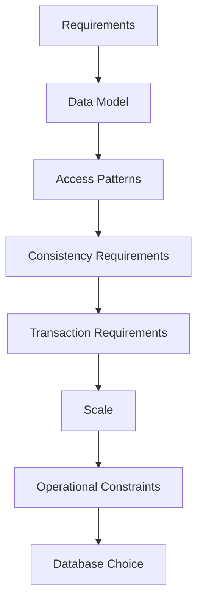

The database should follow the problem.

The problem should not be forced to follow the database.

---

# 2. What Does SQL Mean?

SQL stands for:

> **Structured Query Language**

SQL is a language used to work with data in relational database systems.

Examples include:

- PostgreSQL
- MySQL
- MariaDB
- Microsoft SQL Server
- Oracle Database
- SQLite

A typical relational structure looks like:

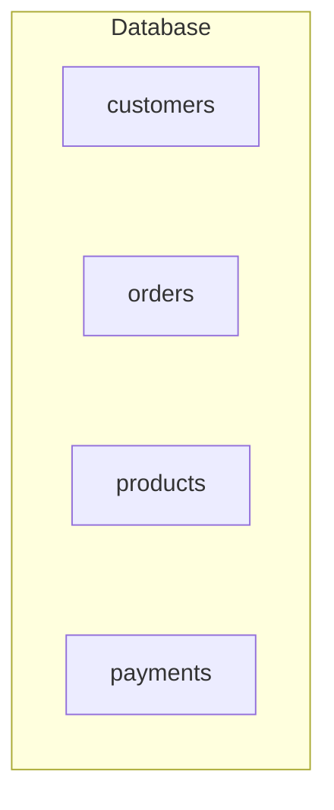

Data is organized into tables containing rows and columns.

---

# 3. What Does NoSQL Mean?

NoSQL is a broad family of non-relational database approaches.

Major models include:

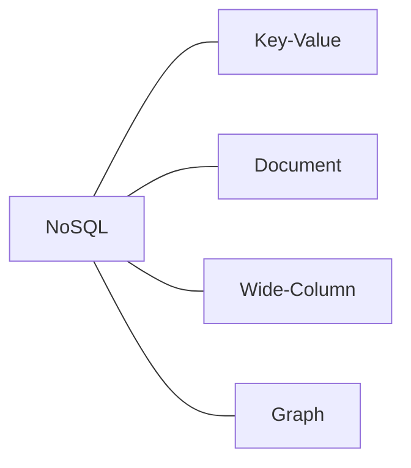

Examples include:

- Redis
- MongoDB
- Apache Cassandra
- ScyllaDB
- Neo4j
- Amazon DynamoDB

The important point is:

> **NoSQL is not one specific database model.**

Different NoSQL databases can have very different capabilities.

---

# 4. The Core Difference

A simplified mental model is:

### SQL

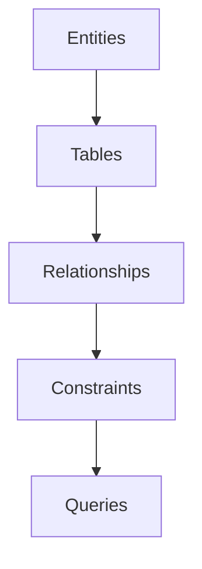

### NoSQL

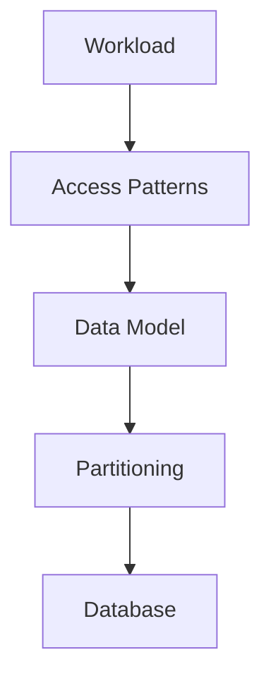

This is simplified, not absolute.

A relational database also needs access-pattern analysis.

A NoSQL system also needs careful data modeling.

The difference is where the database model places emphasis.

---

# 5. Data Model

SQL databases primarily use the relational model.

Example:

```text
customers
+----+--------+-------------------+
| id | name   | email             |
+----+--------+-------------------+
| 1  | Riya   | riya@example.com  |
| 2  | Arjun  | arjun@example.com |
+----+--------+-------------------+
```

Relationships can connect tables:

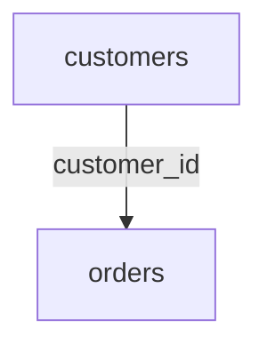

NoSQL databases use different models.

For example, a document database:

```json
{
  "id": 1,
  "name": "Riya",
  "email": "riya@example.com",
  "orders": [
    {
      "id": 5001,
      "total": 2400
    }
  ]
}
```

The data model is different.

---

# 6. Schema

SQL databases commonly define the schema before inserting data.

For example:

```sql
CREATE TABLE customers (
    id INTEGER PRIMARY KEY,
    name VARCHAR(100) NOT NULL,
    email VARCHAR(255) UNIQUE NOT NULL
);
```

The database knows:

```text
id → integer
name → string
email → string
```

A document database may allow documents with different fields:

```json
{
  "name": "Riya",
  "email": "riya@example.com"
}
```

and:

```json
{
  "name": "Arjun",
  "email": "arjun@example.com",
  "phone": "+91..."
}
```

This is schema flexibility.

But remember:

> **Flexible schema does not mean no schema.**

The application still needs to understand the data structure.

---

# 7. Schema Flexibility Has a Cost

Flexible data structures can make evolution easier.

But they can also create inconsistent data.

For example:

```text
Document A
email

Document B
email_address

Document C
mail

Document D
user_email
```

The database may accept these structures.

The application now has to handle the inconsistency.

Therefore:

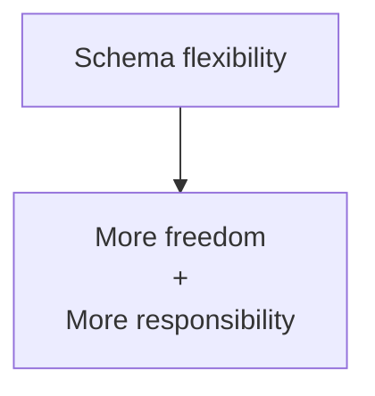

---

# 8. Relationships

Relational databases are built around relationships.

For example:

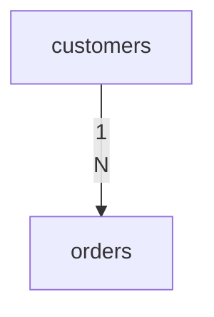

One customer can have many orders.

This relationship can be enforced using a foreign key.

```sql
FOREIGN KEY (customer_id)
REFERENCES customers(id)
```

NoSQL systems can represent relationships differently.

For example:

```json
{
  "customer_id": 101
}
```

or:

```json
{
  "customer": {
    "id": 101,
    "name": "Riya"
  }
}
```

or by storing related information in another structure.

---

# 9. Joins

SQL databases are designed to query related tables.

For example:

```sql
SELECT
    customers.name,
    orders.total
FROM customers
JOIN orders
    ON orders.customer_id = customers.id;
```

The database can combine data from multiple tables.

Some NoSQL systems can perform joins or join-like operations.

Others intentionally encourage data to be modeled so that commonly accessed information is already together.

Therefore:

> **The important difference is not simply "SQL has joins and NoSQL does not."**

The deeper difference is how the data model expects related information to be accessed.

---

# 10. Normalization

Relational databases commonly use normalization.

Suppose we have:

```text
customers
---------
id
name
email
```

and:

```text
orders
------
id
customer_id
total
```

The customer information exists once.

The order references the customer.

Conceptually:

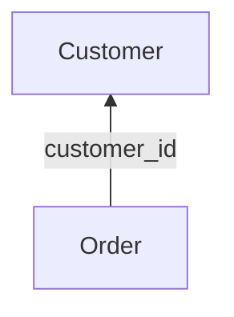

This reduces unnecessary duplication.

---

# 11. Denormalization

NoSQL systems often use denormalization.

For example:

```json
{
  "order_id": 5001,
  "customer": {
    "id": 101,
    "name": "Riya"
  },
  "total": 2400
}
```

The customer name is stored with the order.

This can make the order read simple.

But now the same customer name may exist in many documents.

This creates a trade-off:

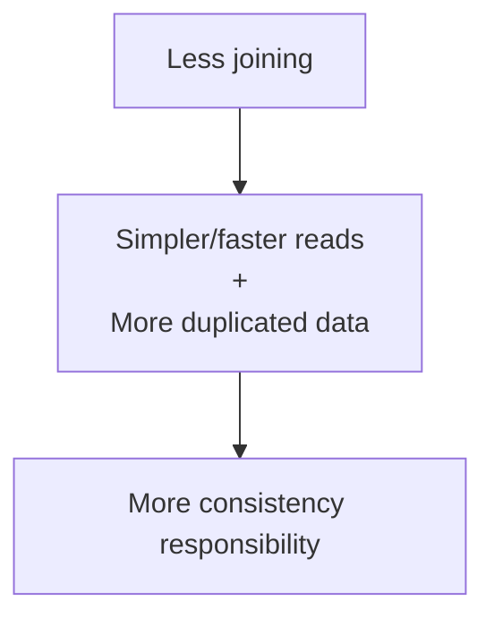

---

# 12. Transactions

Relational databases are widely used for transactional workloads.

For example, creating an order might require:

```text
BEGIN

Create order
Reduce inventory
Create order items
Record payment state

COMMIT
```

If something fails:

```text
ROLLBACK
```

The database can provide atomicity across the transaction scope.

NoSQL databases vary.

Some provide:

- Atomic single-record operations
- Conditional writes
- Multi-document transactions
- Distributed transactions
- Other consistency mechanisms

Others deliberately optimize around simpler operations.

Therefore:

> **Never assume transaction capabilities from the SQL/NoSQL label alone.**

Check the specific database.

---

# 13. ACID

Relational databases commonly emphasize ACID transactions:

```text
A → Atomicity
C → Consistency
I → Isolation
D → Durability
```

This is useful when multiple related changes must behave as one logical operation.

For example:

```text
Transfer ₹1,000

Account A
   - ₹1,000

Account B
   + ₹1,000
```

We generally do not want only one side of the operation to succeed.

However, modern NoSQL databases can also provide transactional or atomic guarantees.

The important question is:

> **What guarantees does the specific database provide for the operation we need?**

---

# 14. Consistency

Consistency is not simply:

```text
SQL = consistent
NoSQL = inconsistent
```

That is incorrect.

SQL and NoSQL systems can provide different consistency guarantees.

A distributed database may have multiple replicas:

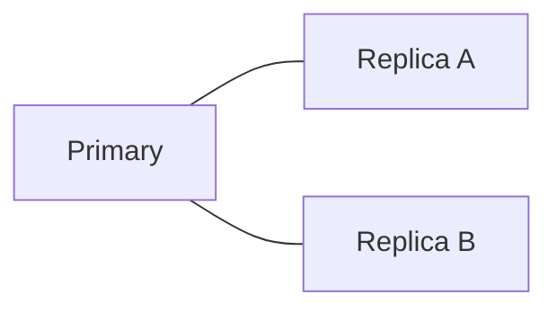

After a write, replicas may not become visible at exactly the same moment.

The system must define what reads are allowed to observe.

---

# 15. Eventual Consistency

Some distributed systems allow temporary differences between replicas.

For example:

```text
Write
  |
  v
Replica A → New value
Replica B → Old value
Replica C → Old value
```

Later:

```text
Replica A → New
Replica B → New
Replica C → New
```

This is eventual consistency.

It can be acceptable for workloads such as:

- Some feeds
- Recommendations
- Analytics
- Activity counters
- Non-critical replicated data

But the system must determine whether temporary staleness is acceptable.

---

# 16. Stronger Consistency Requirements

Some operations may require stronger guarantees.

Examples:

```text
Payment authorization
Inventory reservation
Financial balance
Unique account creation
Critical security state
```

For these operations, the system must carefully define:

```text
What can be stale?
What must be current?
When is a write considered successful?
Which replica can answer a read?
```

Database selection follows these requirements.

---

# 17. Query Flexibility

One major strength of relational databases is flexible querying.

Suppose we have:

```text
customers
orders
products
payments
```

We might ask many different questions:

```text
Orders from last month

Customers from Kolkata

Top-selling products

Customers who spent more than ₹50,000

Orders containing a specific product

Monthly revenue
```

SQL provides a powerful language for expressing these queries.

---

# 18. Access-Pattern-Driven NoSQL

Some NoSQL databases encourage a different approach.

Instead of asking:

> "What query might I want later?"

the design often begins with:

> "What queries does the application need to perform?"

For example:

```text
Get user by ID

Get orders by customer ID

Get events by device ID + time range
```

The data model can then be designed around those operations.

This can be extremely effective for predictable, high-scale workloads.

---

# 19. The Trade-off

The difference can be summarized as:

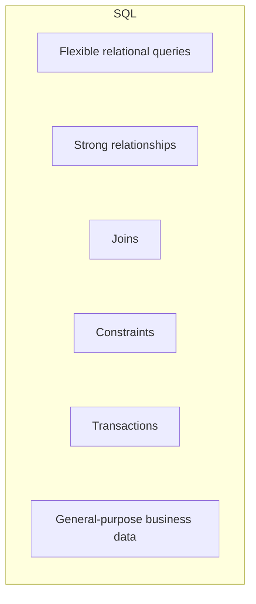

versus:

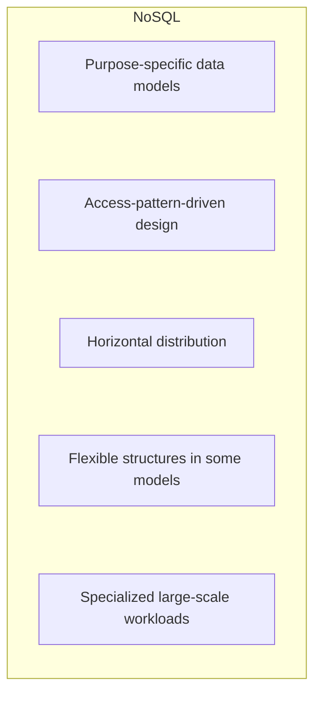

This is a simplification.

Actual capabilities depend on the specific database.

---

# 20. Horizontal Scaling

Both SQL and NoSQL systems can scale.

A basic SQL deployment might begin as:

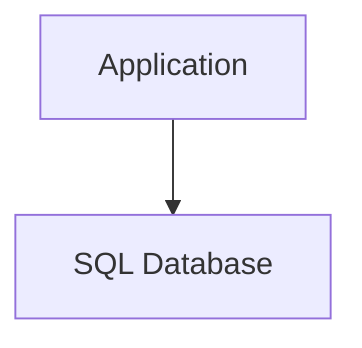

As traffic increases:

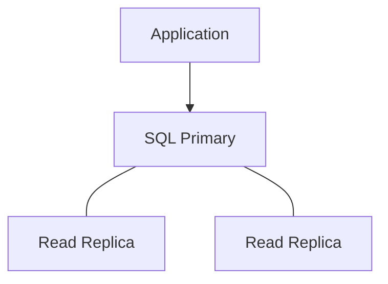

Other techniques include:

- Partitioning
- Sharding
- Caching
- Distributed SQL systems

NoSQL systems are often designed with horizontal distribution as a core architectural characteristic:

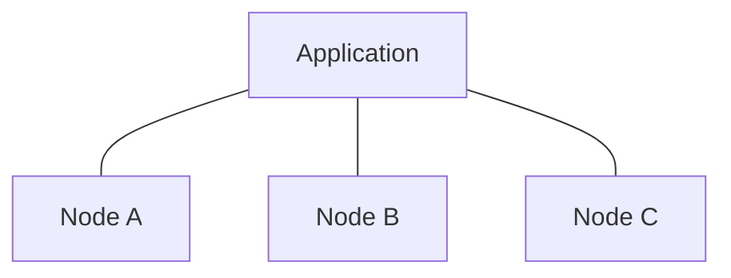

But horizontal scaling introduces complexity regardless of database category.

---

# 21. Scaling Is Not Just "More Servers"

Adding nodes does not automatically solve every problem.

A distributed database must consider:

```text
Data placement
Replication
Network communication
Partitioning
Consistency
Hot partitions
Failure recovery
Rebalancing
```

For example:

```text
Traffic
   |
   v
Partition A → 90% of traffic
Partition B → 5%
Partition C → 5%
```

Adding more nodes may not help if the workload remains concentrated on one partition.

This is why access-pattern and partition-key design matter.

---

# 22. Performance

Do not use this rule:

```text
SQL = slow
NoSQL = fast
```

It is false.

Performance depends on:

- Data model
- Query
- Indexes
- Dataset size
- Hardware
- Network
- Concurrency
- Consistency requirements
- Caching
- Database implementation

A well-designed PostgreSQL query may be faster than a poorly designed NoSQL query.

Likewise, a purpose-built NoSQL workload may outperform a relational design for that particular access pattern.

---

# 23. A Better Performance Question

Instead of asking:

> "Which database is faster?"

ask:

```text
What operation?

How frequently?

How much data?

How many concurrent users?

What latency target?

What consistency?

What indexes or partitioning?

What hardware?

What network path?
```

Then measure.

---

# 24. Data Size

Both SQL and NoSQL databases can handle substantial amounts of data.

The important question is not simply:

> "How many gigabytes?"

Consider:

```text
Total data
+
Growth rate
+
Read rate
+
Write rate
+
Record size
+
Access pattern
+
Replication factor
+
Retention period
```

For example:

```text
100 GB
+
10 million writes/day
```

may be a very different problem from:

```text
100 GB
+
100 reads/day
```

The workload matters.

---

# 25. Operational Complexity

Database selection also affects the operations team.

A simple architecture:

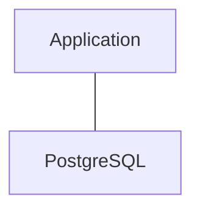

may be easier to operate than:

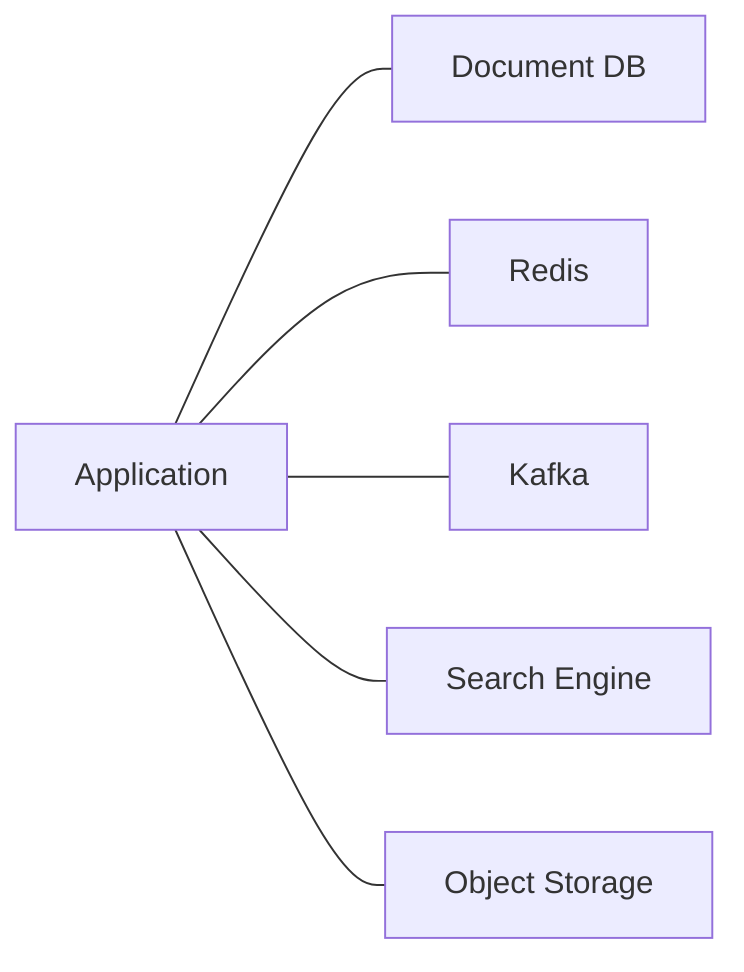

The second architecture may be justified.

But every additional system introduces:

- Monitoring
- Backups
- Upgrades
- Security
- Capacity planning
- Failure scenarios
- Network dependencies

Therefore:

> **Architectural simplicity is itself a valuable system property.**

---

# 26. SQL Operational Strengths

SQL databases generally have mature ecosystems for:

- Transactions
- Schema management
- Querying
- Reporting
- Constraints
- Backups
- Migration tooling
- Monitoring
- Administration
- Business applications

This is one reason relational databases remain widely used.

---

# 27. NoSQL Operational Strengths

Different NoSQL systems may provide strengths such as:

- Horizontal distribution
- Large-scale partitioning
- High write throughput
- Flexible document structures
- High availability
- Specialized data models
- Predictable access-pattern performance

But these strengths differ significantly between NoSQL products.

Always evaluate the actual database.

---

# 28. SQL and NoSQL Can Both Be Distributed

A common misconception is:

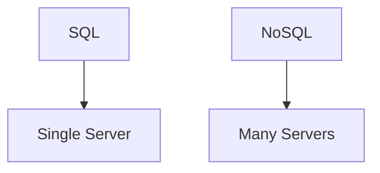

Real systems are more complicated.

A relational architecture can become:

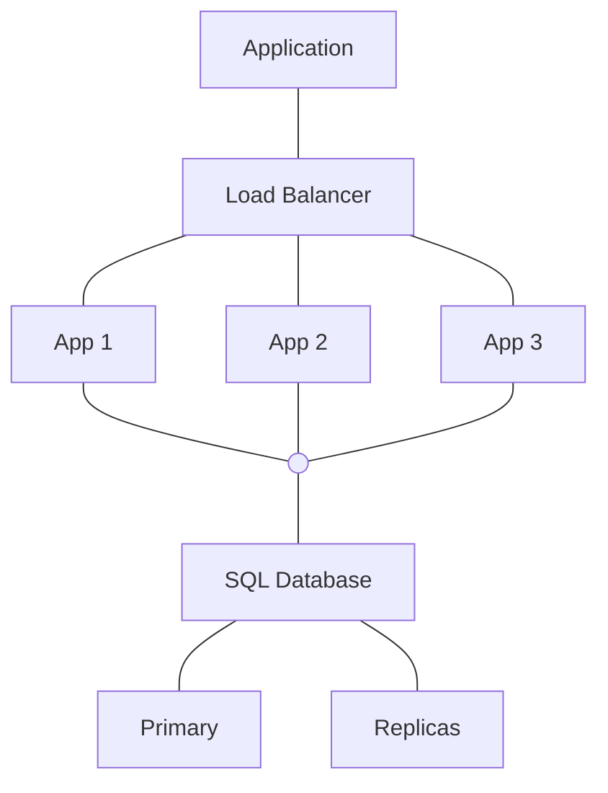

A distributed SQL system may also distribute data across multiple nodes.

NoSQL systems can also use multiple nodes.

Therefore:

> **Distributed vs non-distributed is not the same distinction as SQL vs NoSQL.**

---

# 29. Example — Banking System

Suppose we are designing a banking system.

Important requirements may include:

```text
Account balances
Transactions
Transfers
Audit history
Strong integrity
```

A relational database may be a natural fit for much of this data because the system benefits from:

- Structured schemas
- Relationships
- Constraints
- Transactions
- Strong consistency requirements

Other components may still use different technologies.

For example:

```text
Banking System
 |
 +-- SQL → accounts/transactions
 |
 +-- Cache → frequently accessed data
 |
 +-- Object Storage → statements/documents
 |
 +-- Search → operational search
```

The system is not required to use one technology everywhere.

---

# 30. Example — Social Feed

A social feed may have:

```text
Users
Posts
Followers
Likes
Comments
Media
```

Different workloads may emerge:

```text
User profile
    → Document / SQL

Feed retrieval
    → Cache + specialized data model

Media
    → Object storage

Search
    → Search engine

Counters
    → Cache / specialized store
```

The final architecture depends on traffic, consistency, product requirements, and engineering constraints.

---

# 31. Example — IoT Platform

Suppose millions of devices send measurements:

```text
device_id
timestamp
temperature
humidity
battery
```

The workload may involve:

```text
Huge write volume
+
Time-range queries
+
Horizontal scaling
+
Large historical dataset
```

A specialized distributed database may be considered.

But the decision should still be based on:

```text
Write rate
Read patterns
Retention
Partitioning
Consistency
Query requirements
```

not simply:

> "IoT uses NoSQL."

---

# 32. Example — E-Commerce

An e-commerce system may use both approaches.

```mermaid
flowchart TD
  accTitle: E-commerce data stores
  accDescr: E-commerce uses PostgreSQL for orders/payments, Redis for cache/session and a document DB for catalog content; object storage holds product images.
  A["E-Commerce"] --> P["PostgreSQL"] & R["Redis"] & M["Document<br/>DB"]
  P --- PD["Orders/<br/>Payments"]
  R --- RD["Cache/<br/>Session"]
  M --- MD["Catalog<br/>Content"]
  PD --> O["Object<br/>Storage"] --- I["Product<br/>Images"]
```

Why?

Because different data has different characteristics.

For example:

| Data | Possible Storage |
|---|---|
| Orders | SQL |
| Payments | SQL |
| Sessions | Redis |
| Product images | Object storage |
| Product catalog | SQL or document DB |
| Search | Search engine |

There is no rule that an application must use exactly one database.

---

# 33. Polyglot Persistence

Using multiple persistence technologies is called:

> **Polyglot persistence**

Example:

```mermaid
flowchart TD
  accTitle: Polyglot persistence
  accDescr: PostgreSQL for transactional business data; Redis for cache / sessions / rate limits; MongoDB for document-oriented data; object storage for large files; a search engine for search and ranking.
  A0["PostgreSQL"] --> A1["Transactional business data"]
  B0["Redis"] --> B1["Cache / sessions / rate limits"]
  C0["MongoDB"] --> C1["Document-oriented data"]
  D0["Object Storage"] --> D1["Large files"]
  E0["Search Engine"] --> E1["Search and ranking"]
  A1 ~~~ B0
  B1 ~~~ C0
  C1 ~~~ D0
  D1 ~~~ E0
```

This can be powerful.

But it should not become technology collection.

Each component should have a clear reason to exist.

---

# 34. The Cost of Polyglot Persistence

Every additional data system creates additional responsibilities.

For example:

```mermaid
flowchart TD
  accTitle: Each database needs operating
  accDescr: Database A and database B each need backup, monitoring, security, upgrade and scaling.
  subgraph A["Database A"]
    direction TB
    A0["Backup"] ~~~ A1["Monitoring"] ~~~ A2["Security"] ~~~ A3["Upgrade"] ~~~ A4["Scaling"]
  end
  subgraph B["Database B"]
    direction TB
    B0["Backup"] ~~~ B1["Monitoring"] ~~~ B2["Security"] ~~~ B3["Upgrade"] ~~~ B4["Scaling"]
  end
```

Therefore:

> **Use multiple databases when the benefits justify the operational cost.**

---

# 35. SQL vs NoSQL Comparison

| Area | SQL | NoSQL |
|---|---|---|
| Primary model | Relational | Multiple models |
| Tables | Core concept | Depends on database |
| Documents | Possible, but not primary model | Core for document DBs |
| Schema | Usually explicitly defined | Often more flexible |
| Relationships | Strong relational model | Model-dependent |
| Joins | Major capability | Model-dependent |
| Transactions | Strong and mature | Database-dependent |
| Query language | SQL | Database-dependent |
| Scaling | Vertical + horizontal techniques | Often designed strongly around horizontal distribution |
| Data duplication | Usually minimized | Often intentional |
| Access patterns | Important | Often central to data modeling |
| Query flexibility | Generally high | Model-dependent |
| Consistency | Database/configuration-dependent | Database/configuration-dependent |
| Best fit | Structured relational workloads | Specialized/distributed workloads |
| Operational complexity | Mature ecosystem | Varies significantly |

This table is a mental guide, not a rulebook.

---

# 36. What "Flexible Schema" Really Means

Consider a product catalog.

Products may have different attributes:

```mermaid
flowchart TD
  accTitle: Products with different attributes
  accDescr: A laptop has RAM, CPU and screen size; a shirt has size, color and material; a book has author, ISBN and pages.
  subgraph L["Laptop"]
    direction TB
    L0["RAM"] ~~~ L1["CPU"] ~~~ L2["Screen Size"]
  end
  subgraph S["Shirt"]
    direction TB
    S0["Size"] ~~~ S1["Color"] ~~~ S2["Material"]
  end
  subgraph B["Book"]
    direction TB
    B0["Author"] ~~~ B1["ISBN"] ~~~ B2["Pages"]
  end
  L ~~~ S ~~~ B
```

A document model can represent these naturally.

But a relational database can also model such data.

Possible relational approaches include:

- Separate product tables
- Attribute tables
- JSON columns
- Hybrid designs

Therefore:

> **A requirement does not automatically dictate one database.**

It narrows the possible designs.

---

# 37. Hybrid SQL + NoSQL Designs

Modern applications frequently combine technologies.

For example:

```mermaid
flowchart TD
  accTitle: Hybrid SQL + NoSQL
  accDescr: The application uses SQL for transactions, a cache for fast reads and NoSQL for specialized data.
  A["Application"] --> S["SQL"] & C["Cache"] & N["NoSQL"]
  S --- SD["Transactions"]
  C --- CD["Fast<br/>reads"]
  N --- ND["Specialized<br/>data"]
```

This allows each component to solve a specific problem.

But it creates data synchronization concerns.

For example:

```mermaid
flowchart TD
  accTitle: Change events
  accDescr: SQL, then Change Event, then NoSQL / Search / Cache.
  N0["SQL"] --> N1["Change Event"] --> N2["NoSQL / Search / Cache"]
```

Now the system must consider:

- Delivery
- Ordering
- Retries
- Duplicate events
- Eventual consistency
- Recovery

These topics become important later in Systemly.

---

# 38. Database Choice and Lock-In

Database choice can create long-term architectural consequences.

Suppose an application deeply depends on a particular NoSQL data model.

Later, the team wants to move to another database.

The problem may not be:

```mermaid
flowchart TD
  accTitle: Migration is not just copying
  accDescr: Export data, then Import data.
  N0["Export data"] --> N1["Import data"]
```

The real problem may be:

```mermaid
flowchart TD
  accTitle: Where lock-in lives
  accDescr: Application code, then Data model assumptions, then Partition keys, then Query patterns, then Consistency assumptions, then Migration complexity.
  N0["Application code"] --> N1["Data model assumptions"] --> N2["Partition keys"] --> N3["Query patterns"] --> N4["Consistency assumptions"] --> N5["Migration complexity"]
```

This is **technology lock-in**.

The more deeply application behavior depends on database-specific features, the harder replacement can become.

---

# 39. Avoiding Unnecessary Lock-In

You do not need to avoid every database-specific feature.

Instead, understand the dependency.

Ask:

```text
Which features are database-specific?

Which assumptions exist in application code?

Can data be exported?

Can another system represent the same model?

How much code would need to change?
```

The goal is not zero lock-in.

The goal is:

> **Understand the cost of the lock-in before accepting it.**

---

# 40. A Better Database Decision Process

Use this sequence.

## Step 1 — Define the requirements

```text
Users
Traffic
Data size
Latency
Availability
Consistency
```

## Step 2 — Identify data types

```text
Structured
Document
Key-value
Graph
Large files
Search data
```

## Step 3 — Identify access patterns

```text
Reads
Writes
Queries
Aggregations
Relationships
Lookups
Time ranges
```

## Step 4 — Identify transaction requirements

```text
Single record?
Multiple records?
Multiple partitions?
```

## Step 5 — Identify scaling requirements

```text
Vertical?
Read replicas?
Partitioning?
Sharding?
Distributed?
```

## Step 6 — Identify operational constraints

```text
Team expertise
Budget
Managed services
Backup
Monitoring
Recovery
```

## Step 7 — Compare candidate technologies

Only now should the database shortlist be created.

---

# 41. Do Not Start With Technology

Bad process:

```mermaid
flowchart TD
  accTitle: Technology first
  accDescr: "We are building a large application.", then "Let's use MongoDB.", then Try to fit the system into MongoDB.
  N0["#quot;We are building a large application.#quot;"] --> N1["#quot;Let's use MongoDB.#quot;"] --> N2["Try to fit the system into MongoDB"]
```

Better process:

```mermaid
flowchart TD
  accTitle: Requirements first
  accDescr: Requirements, then Workload, then Access Patterns, then Data Model, then Constraints, then Candidate Databases, then Trade-offs, then Decision.
  N0["Requirements"] --> N1["Workload"] --> N2["Access Patterns"] --> N3["Data Model"] --> N4["Constraints"] --> N5["Candidate Databases"] --> N6["Trade-offs"] --> N7["Decision"]
```

This is a core system-design habit.

---

# 42. A Practical Decision Matrix

Use questions like these:

| Question | SQL | NoSQL |
|---|---|---|
| Strong relational model required? | Often natural | Model-dependent |
| Complex joins required? | Often natural | May be less natural |
| Complex transactions? | Often natural | Database-dependent |
| Highly predictable access patterns? | Possible | Often a strong fit |
| Flexible document structure? | Possible with some systems | Often natural |
| Massive distributed workload? | Possible | Often a strong fit |
| Relationship traversal? | Possible | Graph DB may be natural |
| Simple key lookup? | Possible | Key-value may be natural |
| Team already skilled in SQL? | Lower learning cost | Depends |
| Operational simplicity important? | Often a strong starting point | Depends on system |

Do not turn this into a scoring system.

The purpose is to identify constraints and trade-offs.

---

# 43. Hands-On Lab — Model the Same System Two Ways

We will model a small order system.

Requirements:

```text
Customer
Order
Products
Order Items
```

---

## Step 1 — Relational Design

```text
customers
---------
id
name
email
```

```text
orders
------
id
customer_id
created_at
total
```

```text
order_items
-----------
id
order_id
product_id
quantity
price
```

Relationships:

```mermaid
flowchart TD
  accTitle: Relational design
  accDescr: Customer 1:N orders, orders 1:N order items.
  N0["Customer"] -->|"1:N"| N1["Orders"] -->|"1:N"| N2["Order Items"]
```

This design minimizes duplication.

---

## Step 2 — Document Design

A document could look like:

```json
{
  "order_id": 5001,
  "customer": {
    "id": 101,
    "name": "Riya"
  },
  "items": [
    {
      "product_id": 10,
      "name": "Keyboard",
      "quantity": 1,
      "price": 1200
    },
    {
      "product_id": 20,
      "name": "Mouse",
      "quantity": 2,
      "price": 600
    }
  ],
  "total": 2400
}
```

Now the order can often be retrieved as one document.

---

# 44. Compare the Two Designs

### Relational model

Advantages:

- Strong relationships
- Less duplication
- Flexible querying
- Constraints
- Transactions
- Mature SQL ecosystem

Potential costs:

- Joins
- More complex distributed scaling in some architectures
- Schema migrations

### Document model

Advantages:

- Related data can be stored together
- Flexible structure
- Convenient application-level representation
- Can work well for predictable access patterns

Potential costs:

- Data duplication
- Update complexity
- More careful partitioning
- Query limitations depending on database
- Consistency considerations

Neither design wins automatically.

The workload decides.

---

# 45. Lab Challenge

Imagine the application grows to:

```text
100 million users
```

and receives:

```text
50,000 requests/second
```

Suppose the most common operations are:

```text
Get user profile by ID
Get latest 20 posts by user
Check whether user A follows user B
Create a new post
```

Before choosing a database, write down:

```text
1. Data model

2. Access patterns

3. Read/write ratio

4. Consistency requirements

5. Partition key candidates

6. Transaction requirements

7. Expected growth

8. Failure scenarios

9. Operational requirements

10. Candidate database technologies
```

Do not start with the database name.

Start with the workload.

---

# 46. Common Beginner Mistakes

## Mistake 1 — "SQL is old, NoSQL is modern"

Technology age does not determine suitability.

---

## Mistake 2 — "NoSQL is always faster"

Performance depends on workload and design.

---

## Mistake 3 — "SQL cannot scale"

SQL systems can scale using multiple architectural strategies.

---

## Mistake 4 — "NoSQL has no schema"

NoSQL systems still have data models and application-level schemas.

---

## Mistake 5 — "NoSQL means MongoDB"

MongoDB is only one NoSQL database.

---

## Mistake 6 — "SQL means PostgreSQL"

PostgreSQL is one SQL database system.

---

## Mistake 7 — "NoSQL means eventual consistency"

Consistency guarantees vary by database and configuration.

---

## Mistake 8 — "SQL means ACID, NoSQL means BASE"

These slogans are too simplistic for modern systems.

Always examine the actual guarantees.

---

## Mistake 9 — "Use multiple databases because big companies do"

Architecture should follow requirements.

---

## Mistake 10 — "Choose a database before understanding queries"

This can lead to a badly matched data model.

---

# 47. System Design View

At the system-design level, the question is not:

```text
SQL vs NoSQL
```

The question is:

```mermaid
flowchart TD
  accTitle: Better questions
  accDescr: What does the system need?, then What data do we have?, then How do we access it?, then What consistency is required?, then What transaction guarantees are required?, then How much must it scale?, then What failures must it survive?, then Which technology provides those properties at acceptable cost?.
  N0["What does the system need?"] --> N1["What data do we have?"] --> N2["How do we access it?"] --> N3["What consistency is required?"] --> N4["What transaction guarantees are required?"] --> N5["How much must it scale?"] --> N6["What failures must it survive?"] --> N7["Which technology provides<br/>those properties at acceptable cost?"]
```

This is how experienced system designers approach database decisions.

---

# 48. The Database Decision Is a Trade-off

Every choice has consequences.

For example:

```mermaid
flowchart TD
  accTitle: Flexible schema
  accDescr: Flexible schema: less rigid structure plus more application responsibility.
  N0["Flexible schema"] --> N1["Less rigid structure<br/>+<br/>More application responsibility"]
```

```mermaid
flowchart TD
  accTitle: Denormalization
  accDescr: Denormalization: simpler reads plus more duplicated data.
  N0["Denormalization"] --> N1["Simpler reads<br/>+<br/>More duplicated data"]
```

```mermaid
flowchart TD
  accTitle: Distributed architecture
  accDescr: Distributed architecture: more scale/availability options plus more coordination complexity.
  N0["Distributed architecture"] --> N1["More scale/availability options<br/>+<br/>More coordination complexity"]
```

```mermaid
flowchart TD
  accTitle: Multiple databases
  accDescr: Multiple databases: specialized capabilities plus more operational complexity.
  N0["Multiple databases"] --> N1["Specialized capabilities<br/>+<br/>More operational complexity"]
```

System design is the process of understanding these trade-offs.

---

# 49. SQL vs NoSQL Is Often a False Binary

A production architecture may contain:

```text
SQL
+
NoSQL
+
Cache
+
Object Storage
+
Search
+
Message Broker
```

Each component has a responsibility.

For example:

```text
SQL
→ Transactional source of truth

NoSQL
→ Specialized high-scale workload

Redis
→ Fast temporary/shared state

Object Storage
→ Large binary objects

Search
→ Search and ranking

Message Broker
→ Asynchronous communication
```

The architecture is designed around responsibilities.

---

# 50. Systemly Mental Model

Use this sequence whenever you face a database decision:

```mermaid
flowchart TD
  accTitle: Systemly mental model
  accDescr: REQUIREMENTS, then DATA CHARACTER, then ACCESS PATTERNS, then CONSISTENCY, then TRANSACTIONS, then SCALE, then OPERATIONS, then DATABASE MODEL, then TECHNOLOGY.
  N0["REQUIREMENTS"] --> N1["DATA CHARACTER"] --> N2["ACCESS PATTERNS"] --> N3["CONSISTENCY"] --> N4["TRANSACTIONS"] --> N5["SCALE"] --> N6["OPERATIONS"] --> N7["DATABASE MODEL"] --> N8["TECHNOLOGY"]
```

Notice what comes last.

**Technology.**

That is intentional.

---

# 51. Key Principle

> **SQL vs NoSQL is not a competition with a universal winner. SQL databases are often a natural fit for structured relational data, complex queries, strong integrity, and transactional workloads. NoSQL databases can be a natural fit for specialized data models, predictable access patterns, and certain highly distributed workloads. The correct decision comes from requirements, access patterns, consistency, transactions, scale, and operational constraints.**

---

# 52. Quick Reference

| Concept | SQL | NoSQL |
|---|---|---|
| Core model | Relational | Multiple models |
| Schema | Usually explicit | Often more flexible |
| Relationships | First-class | Model-dependent |
| Joins | Strong capability | Model-dependent |
| Transactions | Strong, mature | Database-dependent |
| Query language | SQL | Database-dependent |
| Normalization | Common | Less central in many designs |
| Denormalization | Possible | Common in many models |
| Access patterns | Important | Often central |
| Horizontal scaling | Possible | Common design goal |
| Consistency | Database-dependent | Database-dependent |
| Key-value workload | Possible | Key-value DBs are natural |
| Document workload | Possible | Document DBs are natural |
| Graph workload | Possible | Graph DBs are natural |
| Complex business data | Often natural | Possible |
| Operational model | Mature ecosystem | Highly database-dependent |

---

# 53. Knowledge Check

### Question 1

Is SQL a database?

**Answer:**

No. SQL is a query language. PostgreSQL, MySQL, SQL Server, and Oracle are database systems that support SQL.

---

### Question 2

Is NoSQL one specific database?

**Answer:**

No. It is a broad family of database approaches.

---

### Question 3

Does NoSQL mean there is no schema?

**Answer:**

No. NoSQL often provides schema flexibility, but data still has structure and rules.

---

### Question 4

Why is denormalization common in many NoSQL designs?

**Answer:**

To store commonly accessed data together and reduce the need for additional reads or joins.

---

### Question 5

What is the major risk of duplicated data?

**Answer:**

Maintaining consistency between multiple copies.

---

### Question 6

Can SQL databases scale horizontally?

**Answer:**

Yes. Techniques include read replicas, partitioning, sharding, distributed SQL architectures, and other system-level approaches.

---

### Question 7

Does NoSQL always provide eventual consistency?

**Answer:**

No. Consistency guarantees vary by database and configuration.

---

### Question 8

What should come before choosing a database?

**Answer:**

Requirements, data model, access patterns, consistency requirements, transaction requirements, scale, and operational constraints.

---

# 55. Remember

If you remember only seven things:

1. **SQL and NoSQL are families of database approaches, not simple competing products.**
2. **SQL databases use the relational model; NoSQL databases use several different models.**
3. **Schema flexibility does not mean no schema.**
4. **NoSQL often emphasizes access-pattern-driven data modeling.**
5. **SQL does not mean "cannot scale," and NoSQL does not mean "automatically scalable."**
6. **Consistency and transaction guarantees must be evaluated for the specific database.**
7. **Choose the database after understanding the workload—not before.**

---

# Next Chapter

## 04.06 — Data Modeling

The next chapter will go deeper into **how to design the actual shape of application data**.

We will cover:

- What data modeling means
- Entities and attributes
- Relationships
- Cardinality
- Primary and foreign keys
- Normalization
- Denormalization
- Modeling for access patterns
- Relational data modeling
- Document data modeling
- Choosing what to embed and what to reference
- Data ownership
- Data duplication
- Constraints
- Evolution of a data model
- Common modeling mistakes
- How a data model influences the architecture
