# 04.06 — Data Modeling

## Learning Objectives

By the end of this chapter, you should understand:

- What data modeling means
- Why data modeling matters in system design
- How to identify entities and attributes
- How to identify relationships between entities
- Cardinality: 1:1, 1:N, and M:N
- Primary keys and foreign keys
- Natural keys and surrogate keys
- Normalization
- Denormalization
- How to model relational data
- How to model document data
- Embedding vs referencing
- How access patterns influence data models
- Data ownership and source of truth
- Data duplication and its consequences
- Constraints and data integrity
- How data models evolve
- Common data-modeling mistakes
- How a data model affects application architecture

---

# 1. What Is Data Modeling?

**Data modeling** is the process of deciding:

- What data the system needs to store
- How that data is structured
- How different pieces of data relate to each other
- Which rules must be enforced
- How the application will access the data

For example, an e-commerce system may need:

```text
Customer
Product
Order
Order Item
Payment
Address
```

Data modeling determines how these concepts are represented.

A simplified relational model might become:

```text
customers
orders
order_items
products
payments
addresses
```

The model becomes the foundation for the database.

---

# 2. Why Does Data Modeling Matter?

A database can store data without a carefully designed model.

But poor modeling creates problems later.

For example:

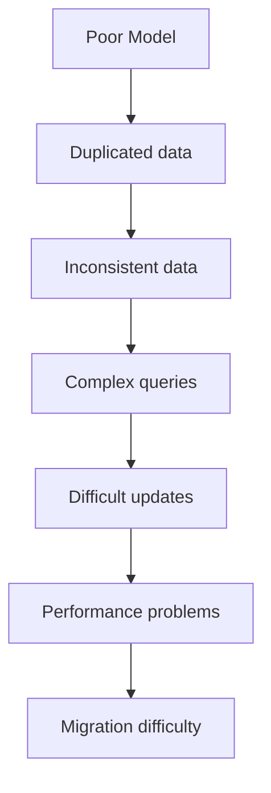

A good model helps the system maintain:

- Correctness
- Consistency
- Understandability
- Queryability
- Scalability
- Maintainability

Data modeling is therefore not just a database task.

It is a system-design task.

---

# 3. Start With the Real World

Before creating tables or collections, understand the domain.

Suppose we are building an e-commerce system.

The real-world concepts may include:

```text
Customer
Product
Order
Payment
Address
```

Ask:

> What things exist in this system?

These things are often called **entities**.

---

# 4. What Is an Entity?

An **entity** is a distinct thing that the system needs to represent.

Examples:

```text
Customer
Product
Order
Payment
Employee
Course
Student
Invoice
```

An entity usually has its own identity.

For example:

```text
Customer #101
Product #501
Order #9001
```

The identity allows the system to distinguish one entity from another.

---

# 5. What Is an Attribute?

An **attribute** describes an entity.

For a customer:

```text
Customer
---------
id
name
email
phone
created_at
```

Here:

```text
id
name
email
phone
created_at
```

are attributes.

For a product:

```text
Product
-------
id
name
price
stock_quantity
created_at
```

The important question is:

> What information does the system need to know about this entity?

---

# 6. Entity vs Attribute

Consider:

```text
Customer
---------
name
email
address
```

Is `address` an attribute?

Possibly.

But suppose the system needs:

```text
Street
City
State
Country
Postal Code
```

Now the address may become a separate concept.

For example:

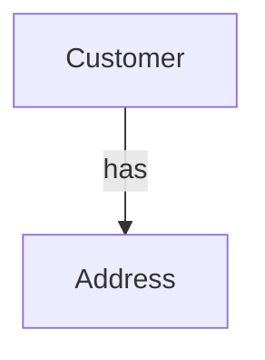

The correct model depends on how the application uses the information.

This is an important modeling lesson:

> **A concept becomes a separate entity when the system needs to treat it as an independent thing.**

---

# 7. Identity

Entities usually need a way to identify them uniquely.

For example:

```text
Customer
---------
id = 101
```

The `id` distinguishes this customer from another customer.

A database commonly uses a **primary key** for this purpose.

```sql
CREATE TABLE customers (
    id BIGINT PRIMARY KEY,
    name VARCHAR(100),
    email VARCHAR(255)
);
```

The primary key identifies a row.

---

# 8. Primary Key

A **primary key** is a column or set of columns that uniquely identifies a record.

Example:

```text
customers
+-----+--------+
| id  | name   |
+-----+--------+
| 101 | Riya   |
| 102 | Arjun  |
| 103 | Maya   |
+-----+--------+
```

Here:

```text
id
```

is the primary key.

A primary key should provide stable identity.

---

# 9. Composite Primary Keys

Sometimes one column is not enough.

For example:

```text
course_id
student_id
```

Together they may identify an enrollment.

```text
enrollments
----------------------
course_id
student_id
enrolled_at
```

The combination:

```text
(course_id, student_id)
```

can be the primary key.

Conceptually:

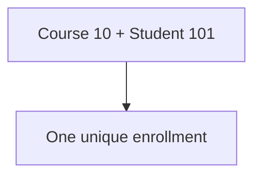

Composite keys are useful when the relationship itself has a natural identity.

---

# 10. Surrogate Keys

A **surrogate key** is an artificial identifier created specifically for the database.

For example:

```text
customer_id = 101
```

It may have no meaning outside the database.

Common examples:

```text
INTEGER
BIGINT
UUID
```

For example:

```text
id = 8f7c...
```

The advantage is that the identifier can remain stable even if business information changes.

---

# 11. Natural Keys

A **natural key** is an existing business value that uniquely identifies something.

Examples:

```text
ISBN
Email address
National registration number
SKU
```

For example:

```text
ISBN = 978...
```

could identify a book.

But natural keys can change.

An email address may change.

A product SKU may change.

Therefore, many systems use a surrogate primary key and place a unique constraint on the natural business value.

Example:

```sql
id BIGINT PRIMARY KEY,
email VARCHAR(255) UNIQUE
```

Now:

```text
id
```

provides stable identity.

While:

```text
email
```

enforces business uniqueness.

---

# 12. Relationships

Entities rarely exist independently.

For example:

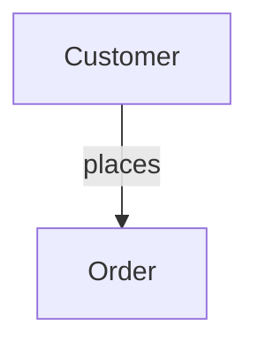

The relationship tells us how entities are connected.

Common relationship types are:

- One-to-one
- One-to-many
- Many-to-many

Understanding these relationships is fundamental to data modeling.

---

# 13. One-to-One Relationship

A **one-to-one** relationship means one entity corresponds to at most one entity on the other side.

Example:

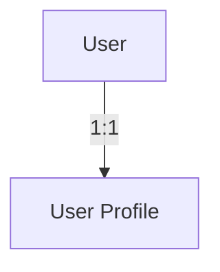

For example:

```text
users
-----
id
name

profiles
--------
id
user_id
bio
avatar
```

One user may have one profile.

But ask an important question:

> Does the profile really need to be a separate entity?

If the profile is always loaded with the user and has no independent lifecycle, it might be simpler to keep it in the same record.

Data modeling is about understanding the domain, not creating tables for every noun.

---

# 14. One-to-Many Relationship

A **one-to-many** relationship means one entity can be associated with many entities.

Example:

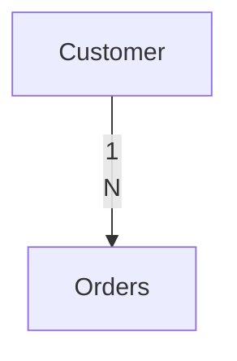

One customer can have many orders.

Relationally:

```text
customers
---------
id
name
```

```text
orders
------
id
customer_id
total
```

The `customer_id` points back to the customer.

---

# 15. Foreign Key

A **foreign key** is a reference from one relational table to another.

Example:

```sql
CREATE TABLE orders (
    id BIGINT PRIMARY KEY,
    customer_id BIGINT NOT NULL,
    total NUMERIC(12,2),

    FOREIGN KEY (customer_id)
        REFERENCES customers(id)
);
```

Now:

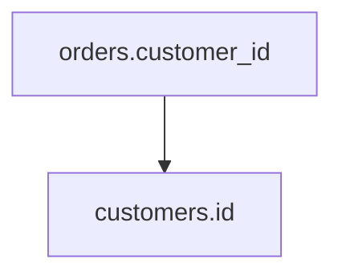

The database can enforce referential integrity.

---

# 16. Many-to-Many Relationship

A many-to-many relationship means:

- One entity can relate to many entities
- The other entity can also relate to many entities

Example:

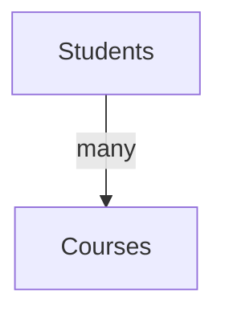

One student can take many courses.

One course can contain many students.

Relational databases usually represent this using a junction table.

```text
students
courses
enrollments
```

---

# 17. Junction Table

Example:

```text
enrollments
-----------
student_id
course_id
enrolled_at
```

Conceptually:

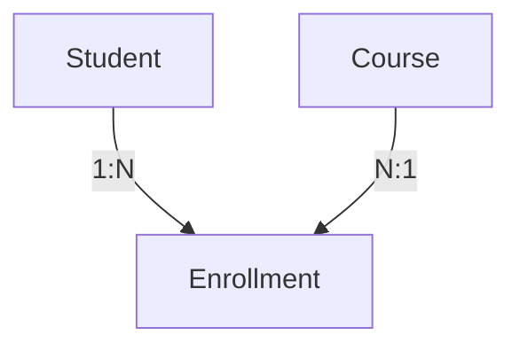

The many-to-many relationship becomes two one-to-many relationships.

---

# 18. Cardinality

**Cardinality** describes how many instances of one entity can relate to another.

Common examples:

```text
1 : 1
1 : N
M : N
```

For example:

```text
Customer : Order
1 : N
```

and:

```text
Student : Course
M : N
```

Cardinality is important because it influences the database structure.

---

# 19. Optional vs Required Relationships

Cardinality is not the only question.

We also need to ask:

> Is the relationship required?

For example:

```text
Order → Customer
```

An order may require a customer.

But:

```text
User → Profile
```

might be optional.

We could have:

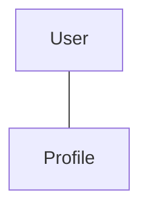

or:

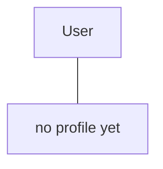

These business rules should be represented in the data model where appropriate.

---

# 20. Data Ownership

A useful modeling question is:

> **Who owns this data?**

Suppose we have:

```text
Order
Customer
```

The customer owns:

```text
name
email
phone
```

The order owns:

```text
order_id
created_at
status
total
```

But an order may reference the customer.

Conceptually:

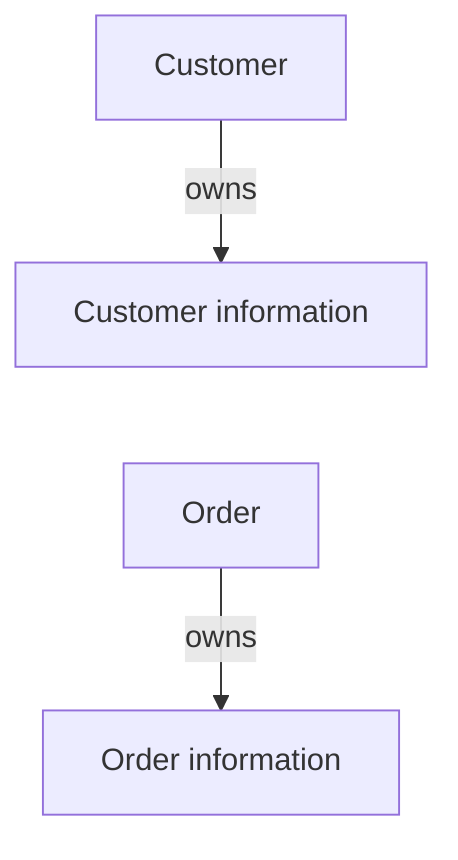

Ownership becomes increasingly important in distributed systems and microservices.

---

# 21. Source of Truth

If the same information exists in multiple places, define which copy is authoritative.

For example:

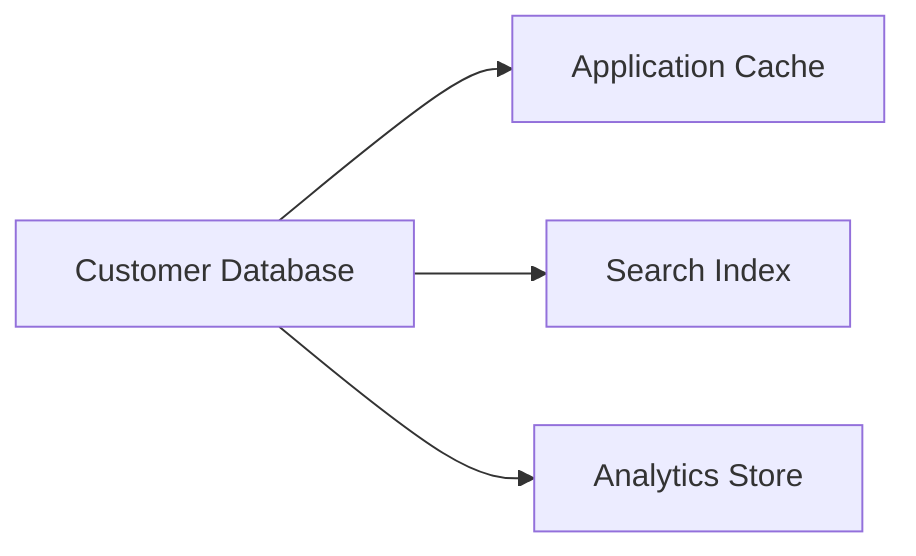

The customer database may be the source of truth.

The others are derived representations.

This prevents confusion about which copy should be updated first.

---

# 22. Normalization

**Normalization** is a relational data-modeling approach that organizes data to reduce unnecessary duplication and dependency problems.

Consider this table:

```text
orders
------------------------------------------------
order_id
customer_name
customer_email
product_name
product_price
```

Suppose the same customer places 100 orders.

Their information may be repeated 100 times.

This creates duplication.

Instead, we can separate the entities:

```text
customers
---------
id
name
email
```

```text
orders
------
id
customer_id
```

```text
products
--------
id
name
price
```

```text
order_items
-----------
order_id
product_id
quantity
price
```

---

# 23. Why Normalize?

Normalization can reduce:

- Duplicate data
- Update anomalies
- Inconsistent values
- Storage waste
- Unclear ownership

Suppose a customer's email changes.

With duplicated data:

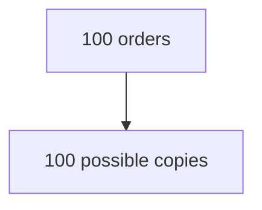

With normalized data:

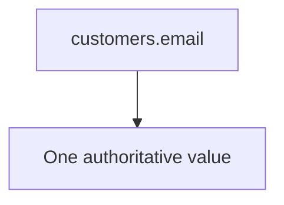

This is easier to maintain.

---

# 24. Update Anomaly

Suppose:

```text
orders
------------------------------------------------
order_id | customer_name | customer_email
------------------------------------------------
1        | Riya          | old@example.com
2        | Riya          | old@example.com
3        | Riya          | old@example.com
```

The customer changes their email.

If only one row is updated:

```text
Order 1 → new@example.com
Order 2 → old@example.com
Order 3 → old@example.com
```

Now the database contains conflicting information.

Normalization reduces this type of problem.

---

# 25. Insert Anomaly

Suppose customer information can only be stored inside an order record.

What if a customer registers but has not placed an order?

There may be nowhere appropriate to store the customer.

This is an **insert anomaly**.

Separating customers from orders solves the problem:

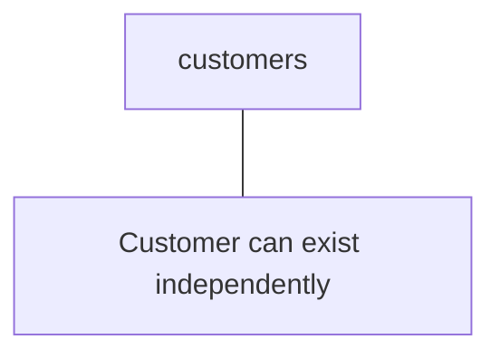

---

# 26. Delete Anomaly

Suppose the only record containing customer information is an order.

If the last order is deleted:

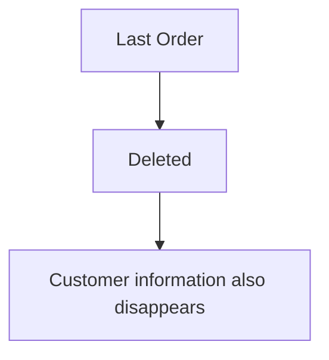

That may be incorrect.

Separate entities prevent unrelated data from being accidentally coupled.

---

# 27. Normalization Does Not Mean "Maximum Tables"

A common beginner mistake is:

> "More tables = better normalization."

Not necessarily.

A useful model should reflect the domain and workload.

Over-normalization can create:

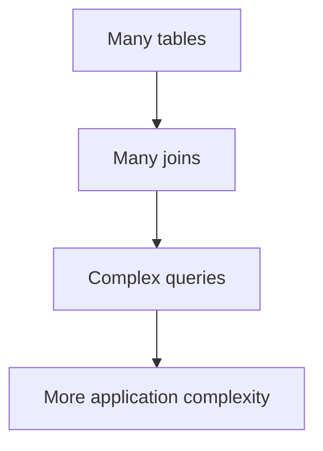

The goal is a sound model, not the maximum number of tables.

---

# 28. Denormalization

**Denormalization** intentionally duplicates or combines data to improve access patterns.

For example:

```text
orders
-------------------------------
order_id
customer_id
customer_name
total
```

The customer name is duplicated.

Why?

Because perhaps the application frequently displays:

```text
Order #5001
Customer: Riya
Total: ₹2400
```

and wants to retrieve the information efficiently.

Denormalization can be useful.

But it creates consistency responsibilities.

---

# 29. Normalization vs Denormalization

Think of the trade-off:

```text
Normalization
      |
      +-- Less duplication
      +-- Stronger separation
      +-- Easier updates
      |
      - More joins
```

```text
Denormalization
      |
      +-- Fewer joins
      +-- Convenient reads
      +-- Can improve read performance
      |
      - More duplication
      - More consistency work
```

Neither is universally correct.

---

# 30. Access Patterns

An **access pattern** describes how the application uses the data.

Examples:

```text
Get user by ID
Get orders for customer
Get product by SKU
Get latest posts by user
Search products by category
Get events for device in time range
```

Data modeling should consider these operations.

Especially in NoSQL systems, access patterns can strongly influence the model.

But even in SQL systems, access patterns matter.

---

# 31. Model the Data, Then Model the Queries

A relational design often begins with:

```text
Entities
Relationships
Constraints
```

Then we ask:

```text
How will we query this data?
```

A NoSQL design may begin more directly from:

```text
Access Patterns
```

and work backward toward the data representation.

In both cases, a good system designer considers both:

```text
Data Model
     +
Access Model
```

---

# 32. Relational Data Modeling

A typical relational design process might be:

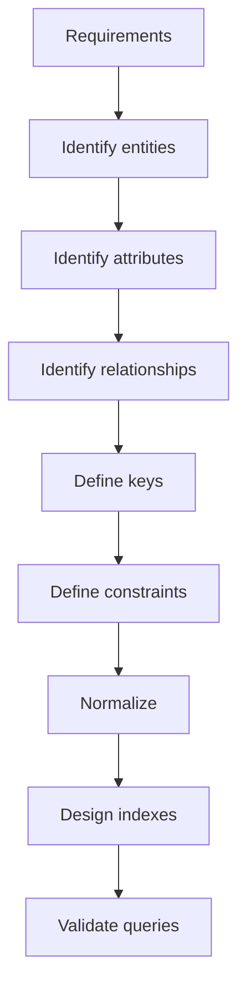

Example:

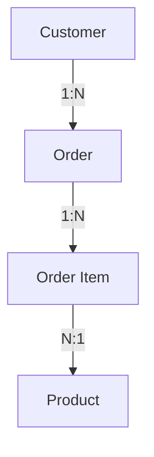

This gives us a structured relational model.

---

# 33. Document Data Modeling

Document modeling often starts with:

```text
What data is accessed together?
```

Suppose an application frequently retrieves an order with all its items.

Instead of:

```text
orders
order_items
products
```

we might represent:

```json
{
  "order_id": 5001,
  "customer_id": 101,
  "items": [
    {
      "product_id": 10,
      "name": "Keyboard",
      "quantity": 1
    },
    {
      "product_id": 20,
      "name": "Mouse",
      "quantity": 2
    }
  ]
}
```

The data model directly supports the read.

---

# 34. Embedding vs Referencing

Document databases commonly provide two broad modeling approaches.

## Embedding

Store related data inside the document.

```json
{
  "user_id": 101,
  "name": "Riya",
  "address": {
    "city": "Kolkata",
    "country": "India"
  }
}
```

## Referencing

Store a reference to another document.

```json
{
  "user_id": 101,
  "address_id": 501
}
```

The choice depends on:

- How often the data is accessed together
- Data size
- Update frequency
- Sharing
- Consistency requirements
- Lifecycle

---

# 35. When Embedding Makes Sense

Embedding can make sense when:

- Data is usually read together
- Child data belongs strongly to the parent
- Child data is relatively small
- Child data does not need an independent lifecycle
- Duplication is acceptable

For example:

```mermaid
flowchart TD
  accTitle: Embedding preferences
  accDescr: A user embeds preferences.
  A["User"] --- B["Preferences"]
```

If preferences are always retrieved with the user, embedding may be natural.

---

# 36. When Referencing Makes Sense

Referencing may be more appropriate when:

- Data is shared by many entities
- Data is large
- Data changes independently
- Data has its own lifecycle
- Duplication would become expensive
- Independent queries are common

For example:

```mermaid
flowchart BT
  accTitle: Shared by many orders
  accDescr: Many orders refer to a product.
  O["Many Orders"] --> P["Product"]
```

It may not make sense to duplicate the entire product record inside every order.

---

# 37. A Useful Embedding Question

Ask:

> **Does this child belong to the parent, or is it an independent entity that merely relates to the parent?**

For example:

```mermaid
flowchart TD
  accTitle: Embedding order items
  accDescr: An order embeds its order items.
  A["Order"] --- B["Order Items"]
```

Order items are strongly associated with the order.

But:

```mermaid
flowchart TD
  accTitle: Embedding a product
  accDescr: An order embeds a product.
  A["Order"] --- B["Product"]
```

A product exists independently of a specific order.

That difference can influence the model.

---

# 38. Data Duplication Is Not Always Bad

Duplication often sounds like a mistake.

It is not automatically a mistake.

Suppose an order stores:

```text
product_name
price_at_purchase
```

Even if the current product price changes, the order should preserve the historical purchase price.

Therefore:

```text
Product current price
        ≠
Order purchase price
```

The duplicated value represents different business facts.

This is an important modeling distinction.

---

# 39. Business Meaning Matters

Consider:

```text
Product price = ₹1,500
```

and:

```text
Order item price = ₹1,200
```

Why are they different?

Because the order may have received a discount.

Therefore:

```mermaid
flowchart TD
  accTitle: Current vs historical price
  accDescr: A product has a current price; an order item has the price at purchase time.
  A0["Product"] --> A1["Current price"]
  B0["Order Item"] --> B1["Price at purchase time"]
```

The duplication is intentional.

Data modeling must understand the business meaning of the fields.

---

# 40. Immutable Historical Data

Some data should represent what happened in the past.

Examples:

- Invoice amount
- Payment amount
- Order price
- Tax charged
- Transaction timestamp

These values should generally not change simply because the current business state changes.

For example:

```mermaid
flowchart TD
  accTitle: Prices change
  accDescr: Product price today: ₹1,500. Order from last year: ₹1,100.
  A0["Product price today"] --> A1["₹1,500"]
  B0["Order from last year"] --> B1["₹1,100"]
```

The order should preserve its historical fact.

This is why copying certain values can be correct.

---

# 41. Constraints

A data model should define rules that must always hold.

Examples:

```text
Email must be unique
Price cannot be negative
Order must belong to a customer
Quantity must be greater than zero
```

Relational databases can enforce many of these using constraints.

For example:

```sql
CREATE TABLE products (
    id BIGINT PRIMARY KEY,
    name VARCHAR(200) NOT NULL,
    price NUMERIC(12,2) CHECK (price >= 0)
);
```

Constraints protect the data even if an application bug occurs.

---

# 42. Database Constraints vs Application Validation

Both are useful.

Application validation:

```mermaid
flowchart TD
  accTitle: Application validation
  accDescr: User Input, then Application, then Validate, then Database.
  N0["User Input"] --> N1["Application"] --> N2["Validate"] --> N3["Database"]
```

Database constraints provide another protection layer:

```mermaid
flowchart TD
  accTitle: Database constraints
  accDescr: Application, then Database, then Constraint, then Accept / Reject.
  N0["Application"] --> N1["Database"] --> N2["Constraint"] --> N3["Accept / Reject"]
```

Why both?

Because applications can have:

- Multiple services
- Admin tools
- Scripts
- Background jobs
- Future applications

The database may receive writes from more than one path.

---

# 43. Nullability

Another modeling decision is whether a value can be missing.

For example:

```text
phone
```

Is it required?

If not:

```text
phone NULL
```

may be allowed.

But be careful.

`NULL` does not simply mean:

```text
empty string
```

or:

```text
zero
```

It represents the absence of a known value.

Good modeling asks:

> Is this information required for the entity to be valid?

---

# 44. Data Types Matter

Choosing a data type is part of modeling.

For example:

```text
age
```

may be an integer.

```text
price
```

should generally use an appropriate exact numeric representation rather than floating-point arithmetic when exact monetary values are required.

```text
created_at
```

should use an appropriate timestamp type.

Correct data types provide:

- Better validation
- Better storage
- Better query behavior
- Better correctness

---

# 45. Time Modeling

Time is frequently mishandled.

A system may need to distinguish:

```text
created_at
updated_at
published_at
deleted_at
expires_at
```

These represent different concepts.

For example:

```text
created_at
```

means when the record was created.

```text
updated_at
```

means when it was last modified.

They should not automatically be treated as the same field.

---

# 46. Soft Deletion

Some systems do not physically delete records immediately.

Instead:

```text
deleted_at = timestamp
```

The record remains in storage but is treated as deleted by the application.

Conceptually:

```mermaid
flowchart TD
  accTitle: Soft deletion
  accDescr: Deleting an active record makes it soft deleted.
  A["Active"] -->|"delete"| B["Soft Deleted"]
```

This can support:

- Recovery
- Auditing
- Historical records

But it also creates additional complexity.

Queries must consistently exclude deleted records where appropriate.

---

# 47. Data Lifecycle

Data modeling should consider the entire lifecycle.

For example:

```mermaid
flowchart TD
  accTitle: Data lifecycle
  accDescr: Created, then Active, then Updated, then Archived, then Deleted.
  N0["Created"] --> N1["Active"] --> N2["Updated"] --> N3["Archived"] --> N4["Deleted"]
```

Different data may have different retention requirements.

For example:

```text
Temporary session
    → short lifetime

Order
    → long retention

Audit record
    → potentially very long retention
```

The data model should support the required lifecycle.

---

# 48. Data Ownership and Service Boundaries

In a larger architecture, data ownership becomes even more important.

Suppose we have:

```text
User Service
Order Service
Payment Service
```

A dangerous design might allow every service to directly modify every table.

Instead:

```mermaid
flowchart TD
  accTitle: Service ownership
  accDescr: The user service owns user data; the order service owns order data; the payment service owns payment data.
  A0["User Service"] --- A1["Owns user data"]
  B0["Order Service"] --- B1["Owns order data"]
  C0["Payment Service"] --- C1["Owns payment data"]
  A1 ~~~ B0
  B1 ~~~ C0
```

Other services may consume the data through APIs or events.

This reduces uncontrolled coupling.

---

# 49. One Database Does Not Mean One Owner

Even if multiple services use the same database, ownership should still be clear.

For example:

```text
users
orders
payments
```

could have logical ownership:

```mermaid
flowchart TD
  accTitle: Domains own tables
  accDescr: The user domain owns users; the order domain owns orders; the payment domain owns payments.
  A0["User domain"] --> A1["users"]
  B0["Order domain"] --> B1["orders"]
  C0["Payment domain"] --> C1["payments"]
  A1 ~~~ B0
  B1 ~~~ C0
```

This becomes especially important when the architecture evolves toward separate services.

---

# 50. Data Model Evolution

Data models change.

For example:

### Version 1

```text
users
-----
id
name
email
```

### Version 2

```text
users
-----
id
first_name
last_name
email
```

Now the system needs a migration.

A migration might:

```mermaid
flowchart TD
  accTitle: Data migration
  accDescr: Old data, then Transform, then New structure.
  N0["Old data"] --> N1["Transform"] --> N2["New structure"]
```

Schema evolution should be planned.

---

# 51. Backward Compatibility

During a deployment, old and new application versions may temporarily coexist.

For example:

```mermaid
flowchart TD
  accTitle: Two versions at once
  accDescr: The load balancer sends traffic to app v1 and app v2.
  L["Load Balancer"] --- A["App v1"] & B["App v2"]
```

If App v1 expects:

```text
name
```

while App v2 expects:

```text
first_name
last_name
```

a sudden destructive schema change can break one version.

Therefore, production migrations often need to be compatible across deployment stages.

This becomes increasingly important as systems scale.

---

# 52. Expand-and-Contract Migration

A useful migration pattern is:

```mermaid
flowchart TD
  accTitle: Expand-and-contract
  accDescr: Old Schema, then Expand, then Support Old + New, then Migrate Data, then Switch Application, then Remove Old.
  N0["Old Schema"] --> N1["Expand"] --> N2["Support Old + New"] --> N3["Migrate Data"] --> N4["Switch Application"] --> N5["Remove Old"]
```

For example:

```text
Step 1
Add first_name and last_name

Step 2
Application writes both formats

Step 3
Backfill existing rows

Step 4
Application reads new fields

Step 5
Remove old name field
```

This reduces the risk of breaking a running system.

---

# 53. Data Modeling and Indexes

The data model and indexes are closely connected.

Suppose the application frequently performs:

```sql
SELECT *
FROM orders
WHERE customer_id = 101
ORDER BY created_at DESC;
```

The model tells us:

```text
customer_id
created_at
```

are important access fields.

An index may then be designed around the query:

```text
(customer_id, created_at)
```

This demonstrates:

```mermaid
flowchart TD
  accTitle: Index design
  accDescr: Data model plus access pattern lead to index design.
  N0["Data Model<br/>+<br/>Access Pattern"] --> N1["Index Design"]
```

Database design should not treat these as isolated decisions.

---

# 54. Data Modeling and Performance

A data model can make a query naturally easy or unnecessarily expensive.

Poor model:

```mermaid
flowchart TD
  accTitle: A costly model
  accDescr: One request, then 12 tables, then Many joins, then Complex query.
  N0["One request"] --> N1["12 tables"] --> N2["Many joins"] --> N3["Complex query"]
```

Another model may allow:

```mermaid
flowchart TD
  accTitle: A well-shaped model
  accDescr: One request, then One well-designed table/document, then Simple lookup.
  N0["One request"] --> N1["One well-designed table/document"] --> N2["Simple lookup"]
```

But simplifying every read through duplication can create update and consistency problems.

Therefore:

> **Performance-aware data modeling is about choosing where complexity should live.**

---

# 55. Data Modeling and Caching

The data model also affects caching.

Suppose the application frequently requests:

```text
Product
+
Category
+
Pricing
```

If these are always needed together, the cache representation may store them together.

For example:

```text
product:101
    ↓
{
  product,
  category,
  price
}
```

The cache key and invalidation strategy now depend on the underlying data relationships.

Therefore:

```mermaid
flowchart TD
  accTitle: Caching follows the model
  accDescr: Data Model, then Access Pattern, then Cache Model.
  N0["Data Model"] --> N1["Access Pattern"] --> N2["Cache Model"]
```

These decisions are connected.

---

# 56. Data Modeling and APIs

API design and data modeling also influence each other.

Suppose an API returns:

```json
{
  "id": 101,
  "name": "Riya",
  "orders": [...]
}
```

The API may not need to expose the database schema directly.

The API representation can be different from the storage model.

This is important:

> **Database schema and API schema do not have to be identical.**

For example:

```mermaid
flowchart TD
  accTitle: API vs database model
  accDescr: API Model, then Application Logic, then Database Model.
  N0["API Model"] --> N1["Application Logic"] --> N2["Database Model"]
```

The application acts as a boundary between them.

---

# 57. Storage Model vs Domain Model

A domain model represents business concepts.

A storage model represents how those concepts are persisted.

They may be similar.

They do not have to be identical.

For example:

```text
Domain
------
Order
Customer
Product
```

Database:

```text
orders
customers
products
order_items
```

API:

```text
OrderResponse
{
    customer,
    items,
    total
}
```

Three representations can exist for the same business concept.

---

# 58. Data Modeling for SQL

A practical SQL modeling workflow:

```mermaid
flowchart TD
  accTitle: Data modeling for SQL
  accDescr: Requirements, then Entities, then Attributes, then Relationships, then Primary Keys, then Foreign Keys, then Constraints, then Normalization, then Indexes, then Queries.
  N0["Requirements"] --> N1["Entities"] --> N2["Attributes"] --> N3["Relationships"] --> N4["Primary Keys"] --> N5["Foreign Keys"] --> N6["Constraints"] --> N7["Normalization"] --> N8["Indexes"] --> N9["Queries"]
```

Then test the design using realistic operations.

---

# 59. Data Modeling for NoSQL

A practical NoSQL modeling workflow may look more like:

```mermaid
flowchart TD
  accTitle: Data modeling for NoSQL
  accDescr: Requirements, then Access Patterns, then Data Needed Per Query, then Choose Data Model, then Partition Key, then Embedding / Referencing, then Duplication Strategy, then Consistency Requirements, then Indexes, then Failure Scenarios.
  N0["Requirements"] --> N1["Access Patterns"] --> N2["Data Needed Per Query"] --> N3["Choose Data Model"] --> N4["Partition Key"] --> N5["Embedding / Referencing"] --> N6["Duplication Strategy"] --> N7["Consistency Requirements"] --> N8["Indexes"] --> N9["Failure Scenarios"]
```

Notice the emphasis on access patterns and distribution.

---

# 60. One Concept Can Have Different Models

Suppose we have:

```text
Customer
Order
Product
```

### Relational

```text
customers
orders
products
order_items
```

### Document

```mermaid
flowchart TD
  accTitle: Document model
  accDescr: An order document holds customer information and items.
  subgraph G["order document"]
    direction TB
    I0["customer information"] ~~~ I1["items"]
  end
```

### Key-value

```mermaid
flowchart TD
  accTitle: Key-value model
  accDescr: order:5001, then serialized order data.
  N0["order:5001"] --> N1["serialized order data"]
```

### Graph

```mermaid
flowchart TD
  accTitle: Graph model
  accDescr: Customer PLACED order; order CONTAINS product.
  C["Customer"] ---|"PLACED"| O["Order"] ---|"CONTAINS"| P["Product"]
```

The business concepts remain similar.

The storage model changes.

---

# 61. Common Data Modeling Mistakes

## Mistake 1 — Modeling tables before understanding the domain

Start with requirements.

---

## Mistake 2 — Creating a table for every noun

Not every concept needs an independent table.

---

## Mistake 3 — Ignoring relationships

Ask:

```text
Who belongs to whom?
Who owns what?
How many?
```

---

## Mistake 4 — Duplicating data without a reason

Duplication should have a clear purpose.

---

## Mistake 5 — Avoiding all duplication

Some duplication is intentional and useful.

---

## Mistake 6 — Ignoring access patterns

A theoretically clean model can still produce poor application performance.

---

## Mistake 7 — Treating the database as the API

The database representation does not need to be exposed directly.

---

## Mistake 8 — Ignoring historical meaning

Current product price and historical purchase price may represent different facts.

---

## Mistake 9 — Ignoring data lifecycle

Ask:

```text
How long should this data exist?
```

---

## Mistake 10 — Ignoring migration

A production data model will eventually evolve.

---

# 62. Practical Modeling Exercise

Design a learning platform.

Requirements:

```text
Students
Courses
Lessons
Enrollments
Progress
Certificates
```

Start with the entities:

```text
Student
Course
Lesson
Enrollment
Progress
Certificate
```

Now identify relationships.

```mermaid
flowchart TD
  accTitle: Learning platform relationships
  accDescr: Students and courses are M:N; a course has many lessons (1:N).
  N0["Student"] -->|"M:N"| N1["Course"] -->|"1:N"| N2["Lesson"]
```

Enrollment resolves:

```mermaid
flowchart TD
  accTitle: Enrollment
  accDescr: Student and course both connect to enrollment.
  S["Student"] --> E["Enrollment"]
  C["Course"] --> E
```

Then ask:

```text
Who owns progress?
```

Possibly:

```mermaid
flowchart TD
  accTitle: Progress ownership
  accDescr: Enrollment, then Progress.
  N0["Enrollment"] --> N1["Progress"]
```

Then ask:

```text
Does a certificate belong to the student,
the course, or the enrollment?
```

The business meaning determines the answer.

---

# 63. Modeling Questions Checklist

Before finalizing a model, ask:

### Domain

```text
What entities exist?
What does each entity mean?
```

### Identity

```text
How is each entity uniquely identified?
```

### Relationships

```text
How are entities connected?
What is the cardinality?
```

### Ownership

```text
Who owns each piece of data?
```

### Integrity

```text
What rules must always hold?
```

### Access

```text
How will the application read the data?
```

### Updates

```text
How often does the data change?
```

### Duplication

```text
Is duplicated data intentional?
Who updates it?
```

### Lifecycle

```text
When is data created?
Updated?
Archived?
Deleted?
```

### Scale

```text
How much data?
How many reads?
How many writes?
```

### Evolution

```text
How might this model change later?
```

---

# 64. Hands-On Lab — Design an E-Commerce Data Model

We will model a small e-commerce system.

Requirements:

```text
Customers
Products
Orders
Order Items
Payments
Addresses
```

---

## Step 1 — Identify Entities

Start with:

```text
Customer
Product
Order
Order Item
Payment
Address
```

---

## Step 2 — Identify Relationships

```mermaid
flowchart TD
  accTitle: E-commerce relationships
  accDescr: Customer 1:N order, order 1:N order item, order item N:1 product.
  N0["Customer"] -->|"1:N"| N1["Order"] -->|"1:N"| N2["Order Item"] -->|"N:1"| N3["Product"]
```

And:

```mermaid
flowchart TD
  accTitle: Order to payment
  accDescr: Order to payment is 1:N or 1:1 depending on requirements.
  A["Order"] -->|"1:N or 1:1 depending on requirements"| B["Payment"]
```

And:

```mermaid
flowchart TD
  accTitle: Customer to address
  accDescr: One customer has many addresses.
  A["Customer"] -->|"1:N"| B["Address"]
```

---

## Step 3 — Define Keys

Example:

```text
customers.id
products.id
orders.id
order_items.id
payments.id
addresses.id
```

Then define references.

```text
orders.customer_id
order_items.order_id
order_items.product_id
payments.order_id
addresses.customer_id
```

---

## Step 4 — Identify Constraints

Examples:

```text
Customer email → UNIQUE

Product price → >= 0

Order quantity → > 0

Order item → must belong to an order

Order item → must reference a valid product
```

---

## Step 5 — Identify Historical Values

Suppose a product currently costs:

```text
₹1,500
```

but the customer purchased it for:

```text
₹1,200
```

Store the order item's purchase price.

Do not rely on the current product price to reconstruct historical orders.

---

## Step 6 — Identify Access Patterns

Typical queries:

```text
Get customer by email

Get customer's orders

Get order with all items

Get product by SKU

Get latest orders

Get payment for an order
```

Now the data model can be tested against these operations.

---

# 65. Lab Challenge

Extend the e-commerce model.

Add:

```text
Product Categories
Product Reviews
Coupons
Shipping Addresses
Refunds
```

For each new concept, answer:

```text
1. Is it an entity?

2. What identifies it?

3. Who owns it?

4. What is its relationship with existing entities?

5. What data does it contain?

6. What constraints exist?

7. How is it accessed?

8. Does any data need to be duplicated?

9. What historical information must be preserved?

10. How might it evolve?
```

Do not immediately create tables.

First explain the model.

---

# 66. System Design View

A data model sits between business requirements and physical storage.

Think of the flow as:

```mermaid
flowchart TD
  accTitle: System design view
  accDescr: Business requirements lead to domain concepts, then a data model, realised as a relational model or a NoSQL model, then the physical database, then storage.
  R["Business Requirements"] --> D["Domain Concepts"] --> M["Data Model"] --> A["Relational Model"] & B["NoSQL Model"]
  A & B --> P["Physical Database"] --> S["Storage"]
```

The database technology is only one part of the process.

---

# 67. Data Modeling Is About Trade-offs

There is no universally perfect model.

For example:

```mermaid
flowchart TD
  accTitle: Normalize
  accDescr: Normalize: Less duplication plus More joins.
  N0["Normalize"] --> N1["Less duplication<br/>+<br/>More joins"]
```

```mermaid
flowchart TD
  accTitle: Denormalize
  accDescr: Denormalize: Fewer joins plus More duplication.
  N0["Denormalize"] --> N1["Fewer joins<br/>+<br/>More duplication"]
```

```mermaid
flowchart TD
  accTitle: Embed
  accDescr: Embed: Simple reads plus Potentially larger documents.
  N0["Embed"] --> N1["Simple reads<br/>+<br/>Potentially larger documents"]
```

```mermaid
flowchart TD
  accTitle: Reference
  accDescr: Reference: Less duplication plus Additional lookups.
  N0["Reference"] --> N1["Less duplication<br/>+<br/>Additional lookups"]
```

```mermaid
flowchart TD
  accTitle: Strict schema
  accDescr: Strict schema: Strong structure plus More migration work.
  N0["Strict schema"] --> N1["Strong structure<br/>+<br/>More migration work"]
```

```mermaid
flowchart TD
  accTitle: Flexible schema
  accDescr: Flexible schema: Easier structural evolution plus More application responsibility.
  N0["Flexible schema"] --> N1["Easier structural evolution<br/>+<br/>More application responsibility"]
```

Data modeling is the process of choosing where these trade-offs belong.

---

# 68. The Most Important Modeling Question

When designing data, ask:

> **What facts does the system need to preserve, and how will the application use those facts?**

Then ask:

```text
Who owns the fact?

Who can change it?

Who needs to read it?

How often?

How quickly?

How consistently?

For how long?

At what scale?
```

These questions lead to better models than starting with:

> "Which database should I use?"

---

# 69. Data Model → Architecture

A data model can influence the entire architecture.

For example:

```mermaid
flowchart TD
  accTitle: Data model → architecture
  accDescr: Data Model, then Query Patterns, then Indexes, then Caching, then Database Scaling, then Replication, then Partitioning, then Application Architecture.
  N0["Data Model"] --> N1["Query Patterns"] --> N2["Indexes"] --> N3["Caching"] --> N4["Database Scaling"] --> N5["Replication"] --> N6["Partitioning"] --> N7["Application Architecture"]
```

This is why database design is a system-design concern.

---

# 70. Key Principle

> **Data modeling is the process of translating real-world requirements and application access patterns into a structured representation of data, relationships, ownership, constraints, and lifecycle. A good model does not try to eliminate every trade-off; it makes the important trade-offs explicit and appropriate for the system.**

---

# 71. Quick Reference

| Concept | Meaning |
|---|---|
| Entity | A distinct thing the system represents |
| Attribute | A property of an entity |
| Primary key | Unique identity of a record |
| Foreign key | Reference to another relational record |
| Natural key | Existing business identifier |
| Surrogate key | Artificial database identifier |
| Cardinality | Number of relationships between entities |
| 1:1 | One-to-one relationship |
| 1:N | One-to-many relationship |
| M:N | Many-to-many relationship |
| Normalization | Reducing unnecessary duplication and dependency |
| Denormalization | Intentional duplication/combination of data |
| Embedding | Storing related data together |
| Referencing | Linking to separately stored data |
| Constraint | Rule enforced on data |
| Source of truth | Authoritative representation of a fact |
| Access pattern | How the application uses data |
| Data ownership | Which component/domain is responsible for data |
| Schema evolution | Changing the data structure over time |

---

# 72. Knowledge Check

### Question 1

What is data modeling?

**Answer:**

Designing how application data, relationships, identities, constraints, ownership, and lifecycle are represented and accessed.

---

### Question 2

What is an entity?

**Answer:**

A distinct concept or thing that the system needs to represent.

---

### Question 3

What is the difference between an attribute and an entity?

**Answer:**

An attribute describes an entity. An entity represents an independent concept that the system needs to track.

---

### Question 4

What is a one-to-many relationship?

**Answer:**

One instance of an entity can be associated with many instances of another entity.

Example:

```text
Customer → Orders
```

---

### Question 5

Why is normalization useful?

**Answer:**

It reduces unnecessary duplication and helps prevent inconsistent updates and other data anomalies.

---

### Question 6

Why might we intentionally denormalize data?

**Answer:**

To simplify or speed up common reads, reduce joins, or preserve a particular business fact.

---

### Question 7

When might embedding be useful in a document database?

**Answer:**

When related data is usually accessed together, belongs strongly to the parent, and is reasonably bounded in size.

---

### Question 8

When might referencing be better?

**Answer:**

When data is shared, independently updated, large, or has its own lifecycle.

---

### Question 9

Does a database schema have to match the API response?

**Answer:**

No. The application can transform database data into an API-specific representation.

---

### Question 10

What should you understand before choosing a database model?

**Answer:**

The domain, data, relationships, access patterns, consistency requirements, transactions, scale, lifecycle, and operational constraints.

---

# 74. Remember

If you remember only eight things:

1. **Data modeling starts with understanding the domain, not the database product.**
2. **Entities represent things; attributes describe them.**
3. **Relationships and cardinality define how entities connect.**
4. **Primary keys provide identity; foreign keys represent relational references.**
5. **Normalization reduces unnecessary duplication; denormalization intentionally introduces some duplication for a reason.**
6. **In NoSQL, embedding vs referencing should be driven by access patterns, ownership, lifecycle, and consistency needs.**
7. **Every duplicated value should have a clear reason and a clear source of truth.**
8. **A data model influences queries, indexes, caching, scaling, replication, and the larger system architecture.**

---

# Next Chapter

## 04.07 — Database Indexing

The next chapter moves from **how data is modeled** to **how databases locate that data efficiently**.

It will cover:

- What a database index is
- Why indexes exist
- How indexes work conceptually
- B-tree indexes
- Hash indexes
- Primary-key indexes
- Unique indexes
- Composite indexes
- Index column order
- Selectivity
- Query patterns
- Indexes and sorting
- Indexes and range queries
- Covering indexes
- Index storage cost
- Write overhead
- Index maintenance
- How indexes interact with query optimization
- When an index helps
- When an index does not help
- Common indexing mistakes
- Practical index-design workflow
