# 04.07 — Database Indexing

## Learning Objectives

By the end of this chapter, you should understand:

- What a database index is
- Why databases need indexes
- How an index helps find rows faster
- How an index is different from a table scan
- How B-tree indexes work at a high level
- Primary, unique, single-column, and composite indexes
- Why column order matters in composite indexes
- Selectivity and cardinality
- How indexes support filtering, sorting, and range queries
- What covering indexes are
- Why indexes consume storage
- Why indexes can make writes more expensive
- When an index helps and when it may not
- How indexes interact with query optimization
- How indexing decisions affect system architecture
- How to investigate indexing problems in a real database

---

# 1. What Is a Database Index?

A **database index** is a data structure that helps a database find rows without examining every row in a table.

Imagine a table containing:

```text
10,000,000 users
```

You run:

```sql
SELECT *
FROM users
WHERE email = 'alex@example.com';
```

Without a suitable index, the database may need to examine many rows:

```text
users table
    ↓
row 1     → not Alex
row 2     → not Alex
row 3     → not Alex
row 4     → not Alex
...
row 8,472,193 → Alex
```

That can be expensive.

With an index:

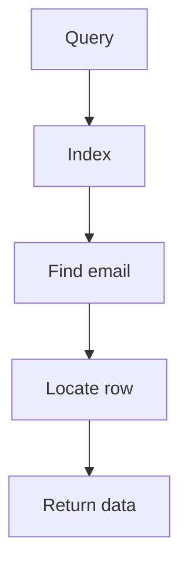

The database can often find the required row much more efficiently.

### Core idea

> **An index is an additional data structure that helps the database locate data efficiently.**

The index does not replace the table.

It helps the database **navigate to the table data**.

---

# 2. Why Do Indexes Exist?

The basic problem is simple:

> **Searching a large amount of data can be expensive.**

Suppose we have:

```text
1,000 rows
```

Searching 1,000 rows may be acceptable.

But consider:

```text
10 million rows
100 million rows
1 billion rows
```

Scanning the entire table for every query becomes increasingly expensive.

An index can reduce the amount of data the database needs to examine.

Conceptually:

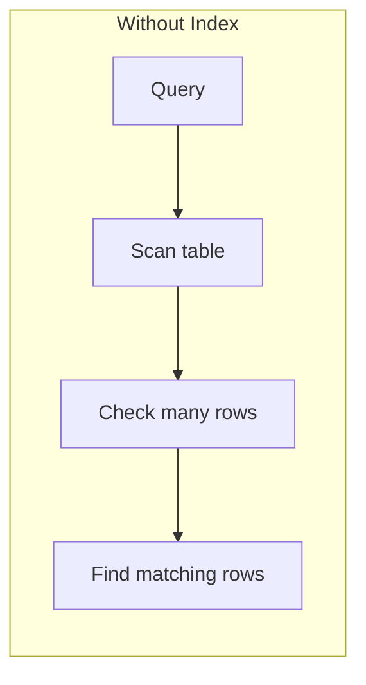

With an index:

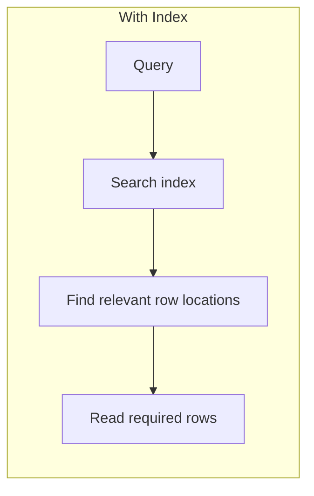

The goal is not simply:

> "Make queries fast."

The real goal is:

> **Reduce unnecessary work for important access patterns.**

---

# 3. A Simple Real-World Analogy

Imagine a 1,000-page book.

You want to find:

```text
Database Indexing
```

### Without an index

You start from page 1:

```text
Page 1
Page 2
Page 3
Page 4
...
Page 731
```

You keep searching until you find the topic.

This is similar to a table scan.

### With an index

The book has an index:

```text
Database Indexing ........ 731
```

You immediately know where to look.

This is similar to a database index.

### Important difference

A database index is not exactly the same as a book index.

But the analogy teaches the main idea:

> **An index provides an organized path to data.**

---

# 4. Table Scan

When a database reads rows one by one to find matching records, this is commonly called a **table scan** or **sequential scan**.

Example:

```sql
SELECT *
FROM users
WHERE country = 'India';
```

Conceptually:

```text
users

Row 1  → check
Row 2  → check
Row 3  → check
Row 4  → check
Row 5  → check
...
Row 1,000,000 → check
```

If the database must examine most rows, this can be expensive.

However, an important point is:

> **A table scan is not automatically bad.**

Suppose the query wants almost every row:

```sql
SELECT *
FROM users;
```

Using an index may not provide any meaningful benefit.

The database may correctly decide:

```text
Scanning the table is cheaper.
```

So:

> **The database optimizer chooses a plan based on the expected cost.**

---

# 5. Index Lookup

Now imagine:

```sql
SELECT *
FROM users
WHERE email = 'alex@example.com';
```

Suppose we have:

```sql
CREATE INDEX idx_users_email
ON users(email);
```

The database can use the index to locate the relevant row.

Conceptually:

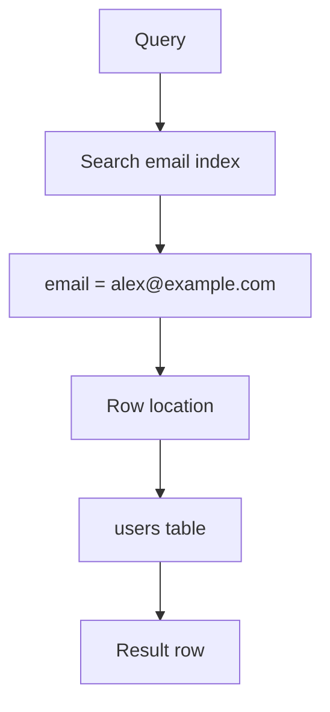

The exact internal behavior depends on the database engine and query plan.

But the architectural idea is:

> **The index provides a more efficient path to the required data.**

---

# 6. What Does an Index Actually Store?

A simplified index might look like this:

```text
Index

Value                  Row Location
------------------------------------
alex@example.com       → row 827
bob@example.com        → row 1042
carol@example.com      → row 3891
david@example.com      → row 9201
```

The real structure is more sophisticated.

An index typically contains:

```text
Indexed value
+
Information needed to locate the corresponding table row
```

The exact representation depends on:

- Database engine
- Index type
- Storage engine
- Data type
- Database version
- Configuration

Therefore, do not think of an index simply as:

```text
"another copy of the column"
```

It is a specialized data structure designed for efficient access.

---

# 7. Indexes Are Additional Data Structures

Consider:

```text
users
```

with:

```text
id
name
email
country
created_at
```

The table stores the actual records.

You might create:

```sql
CREATE INDEX idx_users_email
ON users(email);
```

Now the database has:

```text
Users Table
     +
Email Index
```

If you create another index:

```sql
CREATE INDEX idx_users_country
ON users(country);
```

you now have:

```text
Users Table
     +
Email Index
     +
Country Index
```

Each additional index has a cost.

This leads to one of the most important indexing principles:

> **Indexes improve some reads by adding storage and write-maintenance work.**

---

# 8. Why Not Index Every Column?

This is a common beginner mistake.

Suppose a table has:

```text
id
name
email
phone
country
city
age
created_at
status
```

It may be tempting to create:

```text
Index on id
Index on name
Index on email
Index on phone
Index on country
Index on city
Index on age
Index on created_at
Index on status
```

But more indexes do not automatically mean better performance.

Every index can introduce:

- Storage cost
- Memory pressure
- Insert overhead
- Update overhead
- Delete overhead
- Maintenance work
- More optimizer choices
- More operational complexity

The right question is not:

> "Which columns can I index?"

Ask:

> **"Which query patterns need efficient access?"**

---

# 9. Indexes and Query Patterns

Indexes should be designed around how the application actually accesses data.

Suppose your application frequently runs:

```sql
SELECT *
FROM users
WHERE email = ?;
```

An index on:

```text
email
```

may make sense.

If the application frequently runs:

```sql
SELECT *
FROM orders
WHERE customer_id = ?
ORDER BY created_at DESC;
```

you might investigate an index such as:

```sql
(customer_id, created_at)
```

The exact design depends on:

- Query frequency
- Data distribution
- Selectivity
- Result size
- Sorting requirements
- Database engine
- Workload

So:

> **Indexes should follow access patterns, not arbitrary column lists.**

---

# 10. Primary Key Indexes

A primary key identifies a row uniquely.

Example:

```sql
CREATE TABLE users (
    id BIGINT PRIMARY KEY,
    name VARCHAR(100),
    email VARCHAR(255)
);
```

Most relational databases create or require an index-like structure to enforce primary-key uniqueness and support efficient primary-key access.

This allows queries such as:

```sql
SELECT *
FROM users
WHERE id = 1001;
```

to be efficiently supported.

The exact physical implementation depends on the database system.

---

# 11. Unique Indexes

A unique index can enforce uniqueness.

Example:

```sql
CREATE UNIQUE INDEX idx_users_email
ON users(email);
```

Now the database can enforce:

```text
One email → one user
```

Attempting to insert:

```text
alex@example.com
```

twice can result in a uniqueness violation.

This shows that indexes are not only about performance.

They can also support **data integrity**.

---

# 12. Single-Column Index

A single-column index indexes one column.

Example:

```sql
CREATE INDEX idx_users_email
ON users(email);
```

Conceptually:

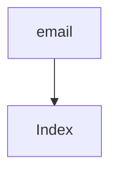

This can be useful for queries such as:

```sql
WHERE email = ?
```

or, depending on the index type and database:

```sql
WHERE email > ?
```

The actual supported operations depend on the index type and query.

---

# 13. Composite Index

A **composite index** contains multiple columns.

Example:

```sql
CREATE INDEX idx_orders_customer_created
ON orders(customer_id, created_at);
```

This index is different from:

```text
Index on customer_id
+
Index on created_at
```

It is one index with an ordered combination:

```text
(customer_id, created_at)
```

This distinction is extremely important.

---

# 14. Why Composite Indexes Exist

Consider this query:

```sql
SELECT *
FROM orders
WHERE customer_id = 42
ORDER BY created_at DESC;
```

A composite index:

```text
(customer_id, created_at)
```

may help the database efficiently locate the customer's orders and support the ordering.

Conceptually:

```text
(customer_id, created_at)

42, 2026-01-10
42, 2026-01-08
42, 2026-01-02
43, 2026-01-12
43, 2026-01-01
```

The index is organized according to the indexed columns.

This leads to a critical rule.

---

# 15. Column Order Matters

Consider:

```sql
CREATE INDEX idx_orders_customer_created
ON orders(customer_id, created_at);
```

The order is:

```text
1. customer_id
2. created_at
```

The index is primarily organized by `customer_id`, then by `created_at` within that grouping.

Therefore:

```text
(customer_id, created_at)
```

is not equivalent to:

```text
(created_at, customer_id)
```

For example:

```sql
WHERE customer_id = 42
```

may fit naturally with:

```text
(customer_id, created_at)
```

But a query primarily filtering by:

```sql
WHERE created_at >= ?
```

may not benefit in the same way.

### Simplified mental model

Think of:

```text
(customer_id, created_at)
```

as:

```text
First organize by customer_id
Then organize each customer's rows by created_at
```

This is why composite index design must consider actual query patterns.

---

# 16. Leftmost-Prefix Idea

For many B-tree-style composite indexes, the leading columns matter.

Suppose:

```sql
CREATE INDEX idx_orders_customer_status_date
ON orders(customer_id, status, created_at);
```

The index begins with:

```text
customer_id
```

then:

```text
status
```

then:

```text
created_at
```

Queries using the leading portion can often make better use of the index.

Conceptually:

```text
(customer_id)
(customer_id, status)
(customer_id, status, created_at)
```

fit naturally into the index ordering.

But:

```text
(status)
```

or:

```text
(created_at)
```

alone does not represent the same leading path.

This is often described as the **leftmost-prefix principle**.

### Important

Do not memorize this as:

> "A composite index only works if every column is used."

That is too simplistic.

A database optimizer can sometimes use part of an index depending on:

- Query predicates
- Index structure
- Database engine
- Statistics
- Sort requirements
- Range conditions

The correct lesson is:

> **The order of columns in a composite index matters.**

---

# 17. Selectivity

**Selectivity** describes how effectively a condition narrows down the possible rows.

Suppose we have:

```text
1,000,000 users
```

and:

```text
email
```

is unique.

A query:

```sql
WHERE email = 'alex@example.com'
```

may identify:

```text
1 row
```

That is highly selective.

Now consider:

```text
country
```

Suppose:

```text
600,000 users → India
300,000 users → USA
100,000 users → Other
```

The query:

```sql
WHERE country = 'India'
```

returns:

```text
600,000 rows
```

The condition is much less selective.

An index may still be useful depending on the workload, but the benefit can be much smaller.

---

# 18. High Selectivity vs Low Selectivity

Simplified example:

| Column | Example values | Selectivity |
|---|---|---|
| user_id | Unique | Very high |
| email | Usually unique | Very high |
| phone | Often unique | High |
| city | Many repeated values | Medium/low |
| country | Few repeated values | Low |
| gender/status flag | Very few values | Very low |

This does **not** mean:

> "Never index low-cardinality columns."

That would be incorrect.

An index can still be useful for a low-cardinality column depending on:

- Table size
- Data distribution
- Query pattern
- Combined indexes
- Query selectivity after other predicates
- Database optimizer

The important lesson is:

> **Selectivity influences whether an index is useful; it does not provide a universal yes/no rule.**

---

# 19. Cardinality

**Cardinality** describes the number of distinct values in a column or result.

For example:

```text
1,000,000 rows
```

Column:

```text
country
```

might contain:

```text
200 distinct countries
```

while:

```text
email
```

might contain:

```text
1,000,000 distinct values
```

So:

```text
email → high cardinality
country → lower cardinality
```

Cardinality helps the optimizer estimate how many rows a query may return.

---

# 20. Indexes and Sorting

Indexes can also help with sorting.

Suppose:

```sql
SELECT *
FROM orders
WHERE customer_id = 42
ORDER BY created_at DESC;
```

An index such as:

```text
(customer_id, created_at)
```

may allow the database to retrieve rows in a useful order.

Without a suitable index, the database may need to:

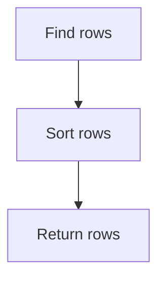

With a suitable index, it may be able to:

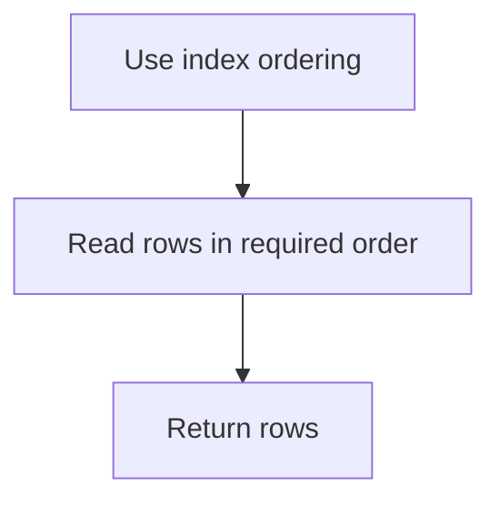

However, the optimizer decides whether using the index is cheaper.

---

# 21. Indexes and Range Queries

Indexes can be useful for range conditions.

For example:

```sql
SELECT *
FROM orders
WHERE created_at >= '2026-01-01'
  AND created_at < '2026-02-01';
```

An ordered index on:

```text
created_at
```

can provide a path to the relevant range.

Conceptually:

```text
2025-12
2025-12
2026-01 ← start
2026-01
2026-01
2026-01 ← end
2026-02
```

The database can locate the beginning of the relevant range and continue through the required portion.

This is one reason ordered index structures are powerful.

---

# 22. B-Tree Indexes

One of the most common general-purpose index structures is the **B-tree** family of indexes.

You do not need to memorize the internal implementation yet.

Think of it as a balanced search structure designed to efficiently navigate ordered values.

Conceptually:

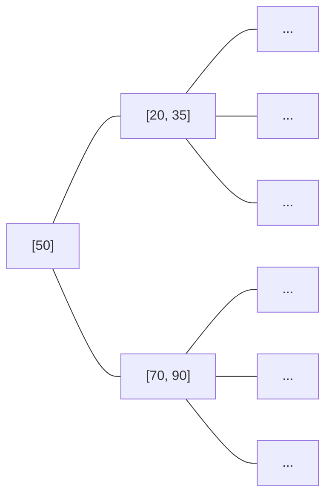

The actual structure is more complex and database-specific.

The important properties are:

- Ordered data
- Efficient searching
- Efficient range access
- Balanced structure
- Good support for many common query patterns

B-tree indexes are commonly useful for:

```text
=
<
>
<=
>=
BETWEEN
ORDER BY
```

depending on the query and database.

---

# 23. Hash Indexes

Another index structure is a **hash index**.

Conceptually:

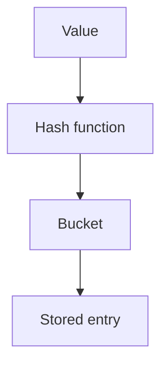

Hash structures are designed around fast equality lookup.

For example:

```sql
WHERE user_id = 1001
```

may be a natural equality lookup.

But hash indexes generally do not provide the same ordered traversal capabilities as B-tree indexes.

Therefore:

```text
B-tree
→ ordered access

Hash
→ equality-oriented access
```

The exact support and implementation depend on the database system.

### Important

Do not choose an index type merely because:

> "Hash sounds faster."

Choose based on the required access pattern and database behavior.

---

# 24. Covering Index

Sometimes a query needs only a small set of columns.

Example:

```sql
SELECT email
FROM users
WHERE email = 'alex@example.com';
```

The index itself may contain enough information to answer the query.

Conceptually:

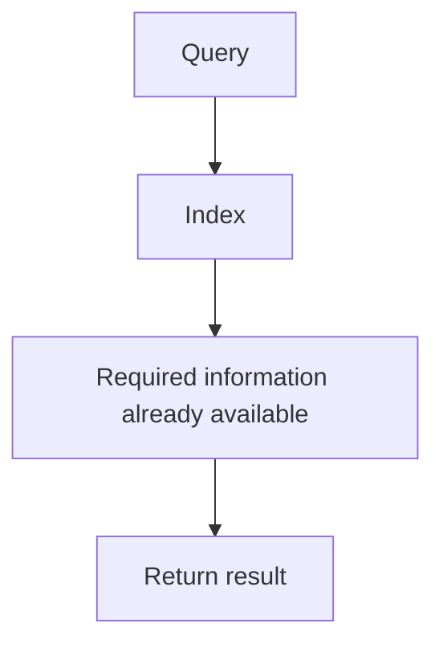

This is commonly described as an **index-only scan** or, more generally, using a **covering index**, depending on the database terminology.

A covering index can reduce the need to access the underlying table.

But there is a trade-off:

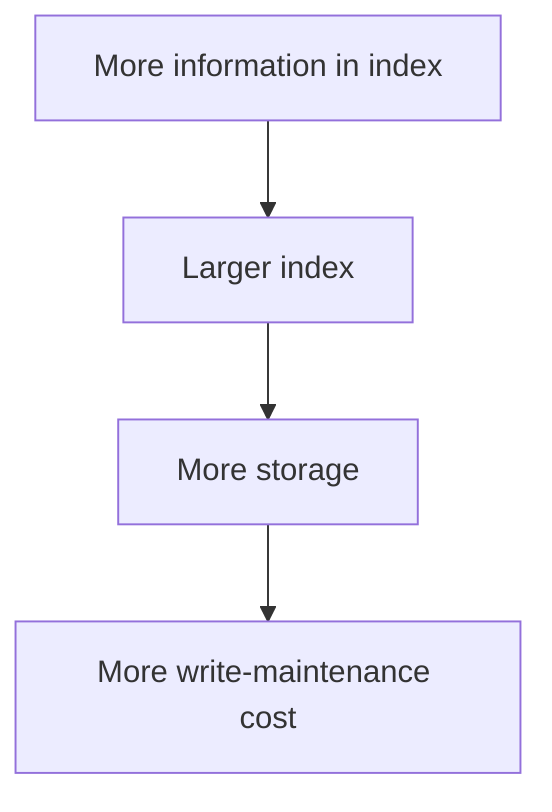

So covering indexes should be used intentionally.

---

# 25. Indexes and INSERT

Suppose we have:

```text
users table
+
email index
+
country index
+
created_at index
```

Now we execute:

```sql
INSERT INTO users (...);
```

The database must:

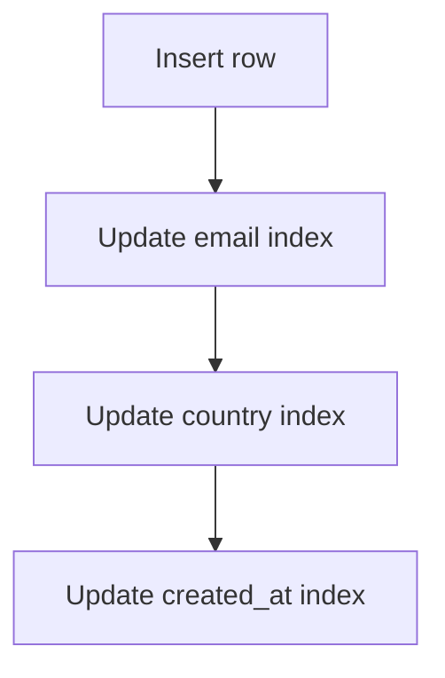

Therefore:

> **Indexes can make writes more expensive.**

The exact cost depends on:

- Number of indexes
- Index size
- Storage engine
- Hardware
- Workload
- Concurrency
- Database engine

---

# 26. Indexes and UPDATE

Suppose:

```sql
UPDATE users
SET email = 'new@example.com'
WHERE id = 1001;
```

If `email` is indexed, the database may need to update the relevant index entry.

Conceptually:

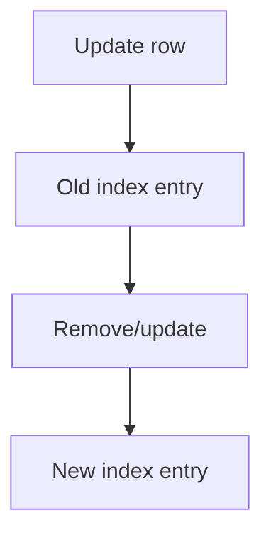

Therefore, indexing a frequently modified column can introduce additional write work.

---

# 27. Indexes and DELETE

Deleting a row also requires index maintenance.

Example:

```sql
DELETE FROM users
WHERE id = 1001;
```

The database must remove the corresponding row and maintain affected indexes.

Conceptually:

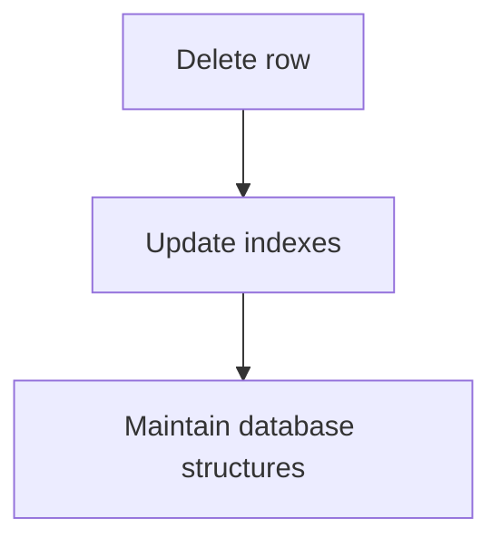

This is why indexes have a lifecycle cost.

---

# 28. The Read vs Write Trade-Off

We can visualize the trade-off like this:

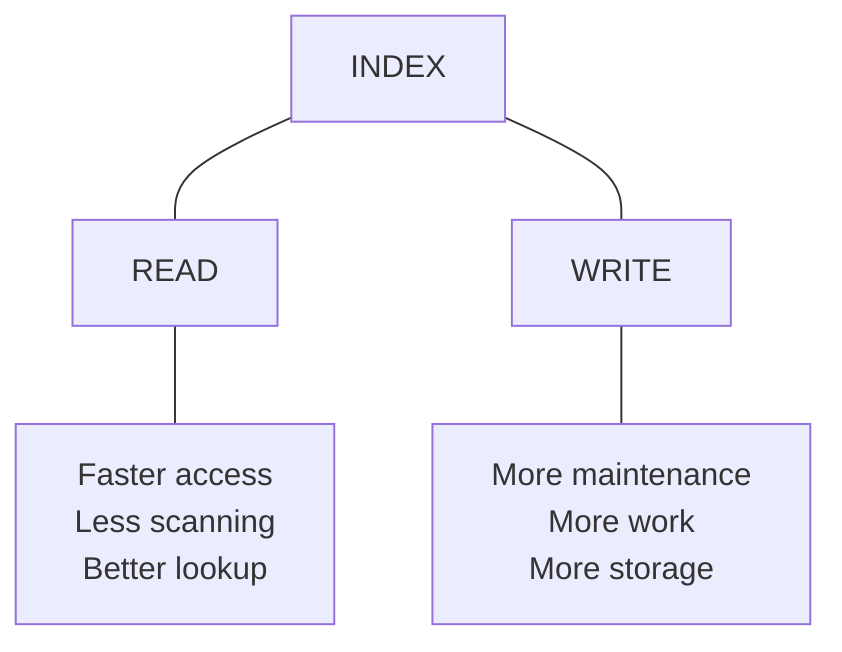

Adding an index is therefore a trade-off.

You are effectively saying:

> "I am willing to spend additional storage and write-maintenance work to improve certain read patterns."

---

# 29. Index Storage Cost

Indexes consume disk space.

Suppose:

```text
users table = 20 GB
```

You create several large indexes.

The total storage might become:

```text
Table       → 20 GB
Index A     → 5 GB
Index B     → 4 GB
Index C     → 7 GB
--------------------
Total       → 36 GB
```

The exact sizes depend on:

- Number of rows
- Indexed columns
- Data types
- Index structure
- Database engine
- Included columns
- Internal metadata

Indexes are therefore part of your database capacity planning.

---

# 30. Indexes and Memory

Indexes are frequently accessed.

Databases often try to keep useful pages in memory.

A large number of large indexes can increase memory pressure.

Conceptually:

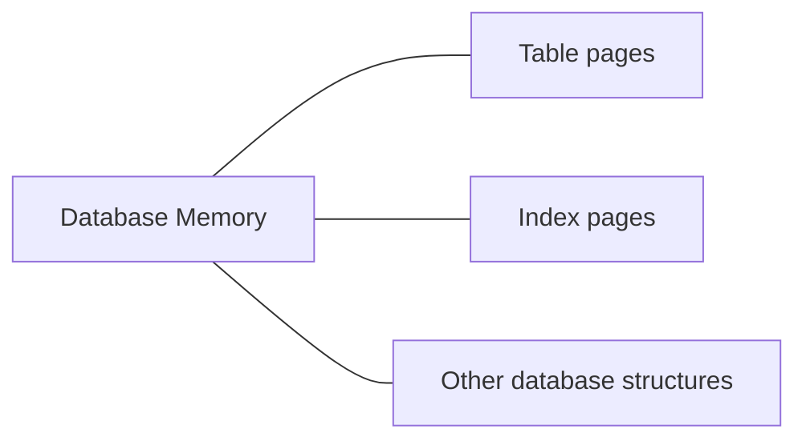

If indexes become too large, the database may have to perform more disk I/O.

Therefore:

> **An index is not free simply because the database manages it automatically.**

---

# 31. Indexes and Query Optimizers

The database does not blindly use every available index.

Suppose:

```sql
CREATE INDEX idx_users_country
ON users(country);
```

You execute:

```sql
SELECT *
FROM users
WHERE country = 'India';
```

If:

```text
80% of rows = India
```

the optimizer may decide:

```text
Index scan → expensive
Table scan → cheaper
```

and choose a table scan.

This is perfectly valid.

### Important principle

> **Having an index does not mean the database must use it.**

The optimizer estimates the cost of different execution strategies.

---

# 32. Indexes and Statistics

The optimizer needs information about the data.

It may use statistics describing things such as:

- Number of rows
- Number of distinct values
- Data distribution
- Estimated selectivity
- Value frequencies

Conceptually:

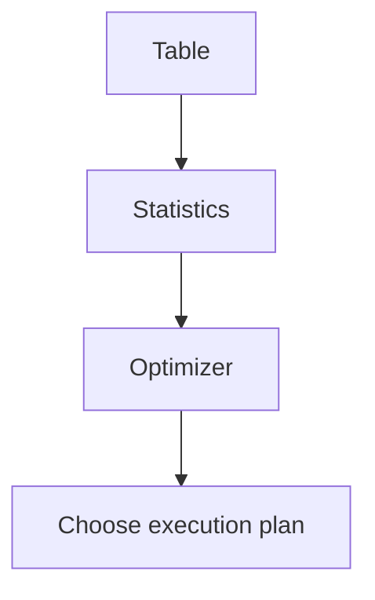

If statistics are outdated, the optimizer may make poor estimates.

This is why database maintenance and statistics matter.

---

# 33. Index Does Not Mean Faster

Consider:

```sql
SELECT *
FROM users;
```

If the query needs:

```text
every row
every column
```

an index is usually not the right shortcut.

The database may simply scan the table.

Another example:

```sql
WHERE status = 'active'
```

If:

```text
99% of rows are active
```

an index on `status` may provide little benefit for that particular query.

Therefore:

> **The usefulness of an index depends on the query and the data, not just the existence of the index.**

---

# 34. Indexes Do Not Fix Every Performance Problem

Suppose an application performs:

```text
100 database queries
```

for one web request.

Adding indexes to every table may not solve the real problem.

The application may have an:

```text
N+1 query problem
```

For example:

```text
1 query → fetch 100 products

Then:

100 queries → fetch product details
```

Total:

```text
101 queries
```

The better solution may involve:

- Query restructuring
- Joins
- Batching
- Eager loading
- Reducing database round trips

Indexes can help individual queries, but they cannot automatically eliminate inefficient application behavior.

---

# 35. Indexes vs Caching

Indexes and caches solve different problems.

### Index

Helps the database **find data efficiently**.

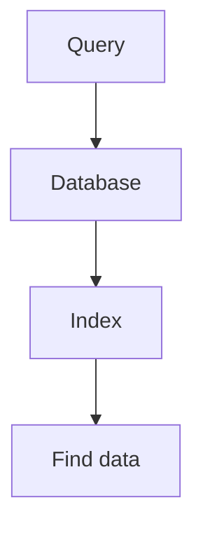

### Cache

Helps the system **avoid repeating work**.

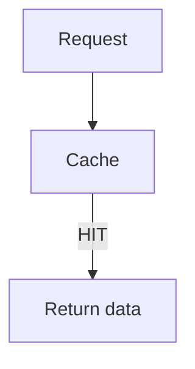

A cache hit may avoid the database entirely.

An index is still useful when the database must be queried.

Therefore:

```text
Cache
→ Avoid database work

Index
→ Make database work more efficient
```

They can work together.

---

# 36. Indexes and Transactions

Indexes also participate in transactional database operations.

Suppose:

```sql
BEGIN;

UPDATE users
SET email = 'new@example.com'
WHERE id = 1001;

COMMIT;
```

The database must maintain consistency between:

```text
Table data
+
Index data
```

The exact internal mechanism depends on the database engine.

The important system-design idea is:

> **Indexes are part of the database's maintained state.**

They are not external lookup files that the application manually updates.

---

# 37. Foreign Keys and Indexes

Consider:

```text
customers
---------
id

orders
------
id
customer_id
```

The relationship is:

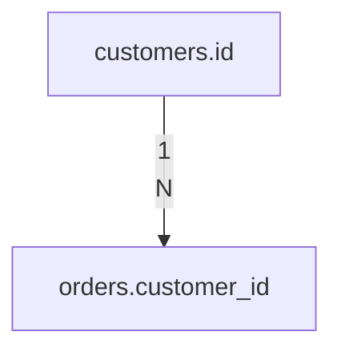

A query might be:

```sql
SELECT *
FROM orders
WHERE customer_id = 42;
```

An index on:

```text
orders.customer_id
```

may be useful.

For example:

```sql
CREATE INDEX idx_orders_customer_id
ON orders(customer_id);
```

This is a common example of how data modeling and indexing connect.

The ER relationship tells us:

```text
Orders belong to customers
```

The access pattern tells us:

```text
Find orders for a customer
```

The index supports that access pattern.

---

# 38. Indexing the Foreign-Key Side

Suppose:

```mermaid
flowchart TD
  accTitle: Orders belong to customers
  accDescr: One customer has N orders.
  A["Customer"] -->|"1<br/>N"| B["Order"]
```

The foreign key is:

```text
orders.customer_id
```

Queries frequently search:

```sql
WHERE customer_id = ?
```

Therefore, indexing the child-side foreign key can often be useful.

However, do not treat:

> "Every foreign key must always have an index."

as an absolute rule.

The correct question remains:

> **What operations and queries does the system perform against this relationship?**

Indexes can also be important for certain update/delete operations involving referenced rows, depending on the database and constraints.

---

# 39. Index Column Order: A Practical Example

Suppose the application frequently runs:

```sql
SELECT *
FROM orders
WHERE customer_id = 42
  AND status = 'paid'
ORDER BY created_at DESC;
```

A candidate index could be:

```text
(customer_id, status, created_at)
```

Why?

Because the query accesses data using:

```text
customer_id
status
created_at
```

The index potentially provides a path through those dimensions.

But index design should be verified using the actual execution plan.

Do not create the index simply because the columns appear in the query.

---

# 40. One Query Is Not Enough

Imagine you have these queries:

```sql
Q1:
WHERE customer_id = ?

Q2:
WHERE customer_id = ?
ORDER BY created_at DESC

Q3:
WHERE status = ?

Q4:
WHERE created_at >= ?
```

One index may not optimally serve every query.

You might consider:

```text
(customer_id)
(customer_id, created_at)
(status)
(created_at)
```

But creating all four indexes may also be excessive.

This creates an optimization problem:

```mermaid
flowchart TD
  accTitle: Choosing indexes for a workload
  accDescr: Query workload, then Candidate indexes, then Read benefit, then Storage cost, then Write cost, then Operational complexity, then Final index strategy.
  N0["Query workload"] --> N1["Candidate indexes"] --> N2["Read benefit"] --> N3["Storage cost"] --> N4["Write cost"] --> N5["Operational complexity"] --> N6["Final index strategy"]
```

This is why indexing is an architectural decision, not just a SQL command.

---

# 41. Indexes and Pagination

Consider:

```sql
SELECT *
FROM products
ORDER BY id
LIMIT 20 OFFSET 100000;
```

The database may still need to process a large number of rows before reaching the desired page.

An index can help with ordering and filtering, but it does not automatically make large offsets cheap.

An alternative is **keyset pagination**:

```sql
SELECT *
FROM products
WHERE id > 100000
ORDER BY id
LIMIT 20;
```

If `id` is indexed appropriately, the database can navigate directly to the relevant region.

This connects indexing with application-level pagination design.

---

# 42. Indexes and `LIKE`

Consider:

```sql
WHERE email LIKE 'alex%'
```

An ordered index may be useful depending on the database and query.

But:

```sql
WHERE email LIKE '%alex%'
```

is a different problem because the wildcard appears at the beginning.

The database may not be able to use a normal ordered index in the same efficient way.

This demonstrates an important principle:

> **The form of the query matters, not just the column being searched.**

Specialized search requirements may need different indexing or search technologies.

---

# 43. Functions on Indexed Columns

Consider:

```sql
SELECT *
FROM users
WHERE LOWER(email) = 'alex@example.com';
```

Even if:

```text
email
```

has an index, applying a function can affect whether the ordinary index can be used efficiently.

Depending on the database, alternatives may include:

- Normalized stored values
- Expression/function-based indexes
- Generated columns
- Different query design

The exact solution depends on the database engine.

The broader lesson is:

> **Write queries in ways that allow the database to exploit available indexes when appropriate.**

---

# 44. Indexes and Data Modeling

Data modeling and indexing should not be treated as completely separate activities.

Recall the modeling process:

```mermaid
flowchart TD
  accTitle: Indexes come from the data model
  accDescr: Requirements, then Entities, then Relationships, then Access Patterns, then Data Model, then Indexes.
  N0["Requirements"] --> N1["Entities"] --> N2["Relationships"] --> N3["Access Patterns"] --> N4["Data Model"] --> N5["Indexes"]
```

For example:

```mermaid
flowchart TD
  accTitle: Customer to order
  accDescr: One customer has many orders.
  A["Customer"] -->|"1:N"| B["Order"]
```

If the application frequently asks:

```text
"Show me this customer's recent orders."
```

the model and index strategy should support that requirement.

Potential index:

```text
(customer_id, created_at)
```

Now:

```mermaid
flowchart TD
  accTitle: From model to index
  accDescr: Data Model, then Relationship, then Query Pattern, then Index Design.
  N0["Data Model"] --> N1["Relationship"] --> N2["Query Pattern"] --> N3["Index Design"]
```

This is system thinking.

---

# 45. Indexes and Caching Together

Suppose an application requests:

```text
Product #1001
```

The architecture might be:

```mermaid
flowchart TD
  accTitle: Indexes and caching together
  accDescr: The user calls the application, which checks the Redis cache: on a hit it returns the product; on a miss it reads the SQL database through the index to the product row, stores it in the Redis cache and returns.
  U["User"] --> A["Application"] --> C["Redis Cache"]
  C -->|"HIT"| H["Return product"]
  C -->|"MISS"| D["SQL Database"] --> I["Index"] --> P["Product row"] --> C2["Redis Cache"] --> R["Return"]
```

Here:

- Cache reduces repeated database work.
- Index makes database lookup efficient when the cache misses.

One optimization does not replace the other.

---

# 46. Indexes at Scale

Suppose a system starts with:

```text
10,000 users
```

A query may work acceptably without many indexes.

Later:

```text
10 million users
```

The same query may become expensive.

Later:

```text
500 million users
```

Now indexing, partitioning, caching, replication, and query architecture may become much more important.

The evolution might look like:

```mermaid
flowchart TD
  accTitle: Indexes at scale
  accDescr: Small system, then Simple table, then Add appropriate indexes, then Optimize queries, then Add caching, then Read replicas, then Partitioning, then Sharding.
  N0["Small system"] --> N1["Simple table"] --> N2["Add appropriate indexes"] --> N3["Optimize queries"] --> N4["Add caching"] --> N5["Read replicas"] --> N6["Partitioning"] --> N7["Sharding"]
```

Not every system reaches every stage.

The point is:

> **Indexing is one tool in a larger scaling strategy.**

---

# 47. When Should You Consider an Index?

Consider an index when:

- A query runs frequently
- A query filters a large table
- The filtering condition is reasonably selective
- A query frequently joins using a column
- A query frequently sorts by certain columns
- A range query is common
- A relationship is frequently traversed
- Query latency is a measured problem
- Execution plans show an expensive scan that an index could improve

The key phrase is:

> **Measured problem.**

Do not create indexes simply because a column "looks important."

---

# 48. When Might an Index Not Help?

An index may provide little benefit when:

- The table is very small
- The query returns most rows
- The column has very low selectivity
- The query cannot efficiently use the index
- The index is rarely used
- Another index already provides the required access path
- The index introduces excessive write overhead
- The query is bottlenecked somewhere else

Again:

> **The execution plan and workload matter more than assumptions.**

---

# 49. Common Indexing Mistakes

### Mistake 1 — Index everything

More indexes create more cost.

---

### Mistake 2 — Never create indexes

Large systems need efficient access paths.

---

### Mistake 3 — Assume every index will be used

The optimizer chooses the execution plan.

---

### Mistake 4 — Ignore composite index order

```text
(a, b)
```

is not the same as:

```text
(b, a)
```

---

### Mistake 5 — Ignore write cost

Every additional index can require maintenance.

---

### Mistake 6 — Optimize without measuring

You may solve the wrong problem.

---

### Mistake 7 — Assume an index fixes slow SQL

The query itself may be poorly designed.

---

### Mistake 8 — Ignore data distribution

An index that works well with one distribution may behave differently with another.

---

### Mistake 9 — Create an index for one rare query

The index may add permanent storage and write costs for little benefit.

---

### Mistake 10 — Forget to review unused indexes

Indexes that no longer serve meaningful workloads may still consume resources.

---

# 50. Practical Index Investigation

When a query is slow, follow a structured process.

```mermaid
flowchart TD
  accTitle: Practical index investigation
  accDescr: Slow Query, then Measure actual latency, then Understand query frequency, then Inspect execution plan, then Identify expensive operation, then Check existing indexes, then Check data distribution/statistics, then Design candidate index, then Test, then Compare execution plans, then Measure again.
  N0["Slow Query"] --> N1["Measure actual latency"] --> N2["Understand query frequency"] --> N3["Inspect execution plan"] --> N4["Identify expensive operation"] --> N5["Check existing indexes"] --> N6["Check data distribution/statistics"] --> N7["Design candidate index"] --> N8["Test"] --> N9["Compare execution plans"] --> N10["Measure again"]
```

Do not begin with:

```text
"Let's add an index."
```

Begin with:

```text
"Why is this query slow?"
```

---

# 51. Use `EXPLAIN`

Most SQL databases provide an execution-plan tool.

For PostgreSQL:

```sql
EXPLAIN
SELECT *
FROM users
WHERE email = 'alex@example.com';
```

For actual execution details:

```sql
EXPLAIN ANALYZE
SELECT *
FROM users
WHERE email = 'alex@example.com';
```

The plan can help answer questions such as:

```text
Did the database use an index?

How many rows did it estimate?

How many rows did it actually process?

Did it scan the whole table?

Was sorting required?

Which operation consumed the most time?
```

This connects directly to:

**03.03 — Query Optimization**

---

# 52. Before and After Indexing

Suppose:

```sql
SELECT *
FROM users
WHERE email = 'alex@example.com';
```

### Before

```text
Execution Plan

Seq Scan on users
    Filter: email = ...
```

The database scans the table.

### Add index

```sql
CREATE INDEX idx_users_email
ON users(email);
```

### After

The optimizer may choose something conceptually like:

```text
Index Scan using idx_users_email
    Index Cond: email = ...
```

The important lesson is not the exact plan name.

The lesson is:

```text
Before
Query → many rows examined

After
Query → index → targeted rows
```

Always verify with the actual execution plan.

---

# 53. Hands-On Lab — Database Indexing

This lab uses PostgreSQL.

## Step 1 — Create the Database

```sql
CREATE DATABASE systemly_index_lab;
```

Connect to it.

---

## Step 2 — Create a Users Table

```sql
CREATE TABLE users (
    id BIGSERIAL PRIMARY KEY,
    name VARCHAR(100) NOT NULL,
    email VARCHAR(255) NOT NULL,
    country VARCHAR(100) NOT NULL,
    created_at TIMESTAMP NOT NULL DEFAULT CURRENT_TIMESTAMP
);
```

---

## Step 3 — Insert Test Data

For a large enough dataset, PostgreSQL can generate rows:

```sql
INSERT INTO users (name, email, country, created_at)
SELECT
    'User ' || generate_series,
    'user' || generate_series || '@example.com',
    CASE
        WHEN generate_series % 5 = 0 THEN 'India'
        WHEN generate_series % 5 = 1 THEN 'USA'
        WHEN generate_series % 5 = 2 THEN 'UK'
        WHEN generate_series % 5 = 3 THEN 'Canada'
        ELSE 'Australia'
    END,
    CURRENT_TIMESTAMP - (generate_series || ' minutes')::interval
FROM generate_series(1, 1000000);
```

This creates approximately:

```text
1,000,000 users
```

---

## Step 4 — Query Without an Email Index

Run:

```sql
EXPLAIN ANALYZE
SELECT *
FROM users
WHERE email = 'user500000@example.com';
```

Observe:

```text
Seq Scan
```

or another plan selected by PostgreSQL.

Record:

- Execution time
- Rows examined
- Execution plan

---

## Step 5 — Create an Email Index

```sql
CREATE INDEX idx_users_email
ON users(email);
```

Run the same query again:

```sql
EXPLAIN ANALYZE
SELECT *
FROM users
WHERE email = 'user500000@example.com';
```

Compare the plan.

You may now see an index-based plan.

---

## Step 6 — Test a Low-Selectivity Column

Run:

```sql
EXPLAIN ANALYZE
SELECT *
FROM users
WHERE country = 'India';
```

There is an index you could create:

```sql
CREATE INDEX idx_users_country
ON users(country);
```

Create it:

```sql
CREATE INDEX idx_users_country
ON users(country);
```

Then run:

```sql
EXPLAIN ANALYZE
SELECT *
FROM users
WHERE country = 'India';
```

Observe whether PostgreSQL actually chooses the index.

It may or may not.

This is an important lesson:

> **Creating an index does not force the optimizer to use it.**

---

## Step 7 — Create a Composite Index

Consider:

```sql
SELECT *
FROM users
WHERE country = 'India'
ORDER BY created_at DESC;
```

Create:

```sql
CREATE INDEX idx_users_country_created
ON users(country, created_at);
```

Now run:

```sql
EXPLAIN ANALYZE
SELECT *
FROM users
WHERE country = 'India'
ORDER BY created_at DESC
LIMIT 20;
```

Study the plan.

Ask:

```text
Did the index help filtering?

Did it help ordering?

Was sorting still required?

How many rows were processed?
```

---

# 54. Lab Challenge

Try these queries:

### Challenge 1

Find a user by email:

```sql
SELECT *
FROM users
WHERE email = 'user750000@example.com';
```

Determine which index supports it.

---

### Challenge 2

Find recent users:

```sql
SELECT *
FROM users
ORDER BY created_at DESC
LIMIT 20;
```

Determine whether an index on:

```text
created_at
```

would be useful.

---

### Challenge 3

Find recent Indian users:

```sql
SELECT *
FROM users
WHERE country = 'India'
ORDER BY created_at DESC
LIMIT 20;
```

Compare:

```text
country
```

versus:

```text
(country, created_at)
```

---

### Challenge 4

Run:

```sql
EXPLAIN ANALYZE
SELECT *
FROM users
WHERE id > 900000;
```

Ask:

> Why is the primary-key index potentially useful here?

---

# 55. A Simple Index Decision Framework

When considering an index, ask:

```mermaid
flowchart TD
  accTitle: A simple index decision framework
  accDescr: 1. What query is slow? 2. How frequently does it run? 3. How many rows does it process? 4. What does the execution plan show? 5. Can an index reduce the work? 6. What columns should the index contain? 7. What should the column order be? 8. What storage will the index require? 9. What write overhead will it introduce? 10. Does testing show a real improvement?
  N0["1#46; What query is slow?"] --> N1["2#46; How frequently does it run?"] --> N2["3#46; How many rows does it process?"] --> N3["4#46; What does the execution plan show?"] --> N4["5#46; Can an index reduce the work?"] --> N5["6#46; What columns should the index contain?"] --> N6["7#46; What should the column order be?"] --> N7["8#46; What storage will the index require?"] --> N8["9#46; What write overhead will it introduce?"] --> N9["10#46; Does testing show a real improvement?"]
```

This is a much better process than:

```text
"Add an index to every WHERE column."
```

---

# 56. Indexing as a Trade-Off

Think about an index using four dimensions:

```mermaid
flowchart TD
  accTitle: Indexing as a trade-off
  accDescr: An index balances read speed, storage cost and write cost, which together add complexity.
  I["INDEX"] --- A["READ<br/>SPEED"] & B["STORAGE<br/>COST"] & C["WRITE<br/>COST"]
  A & B & C --- X["COMPLEXITY"]
```

You gain:

```text
Faster access for suitable queries
```

But you pay:

```text
Storage
+
Maintenance
+
Write overhead
+
Operational complexity
```

Therefore:

> **An index is an optimization with a cost, not a free performance upgrade.**

---

# 57. Database Indexing and System Design

At small scale:

```mermaid
flowchart TD
  accTitle: A simple system
  accDescr: Application, then Database, then Table.
  N0["Application"] --> N1["Database"] --> N2["Table"]
```

As the workload grows:

```mermaid
flowchart TD
  accTitle: Where indexing fits
  accDescr: Application, then Database, then Query Optimization, then Indexes, then Caching, then Replication, then Partitioning, then Sharding.
  N0["Application"] --> N1["Database"] --> N2["Query Optimization"] --> N3["Indexes"] --> N4["Caching"] --> N5["Replication"] --> N6["Partitioning"] --> N7["Sharding"]
```

Indexes are one layer in the broader architecture.

They can reduce database work, but they cannot solve every scaling problem.

Eventually, the system may face constraints involving:

- CPU
- Memory
- Storage
- I/O
- Connection limits
- Lock contention
- Replication
- Data size
- Write throughput

Indexing addresses specific access-path problems within that larger system.

---

# 58. Indexes and the Evolution of a System

Imagine an application with:

```text
10,000 users
```

The database is small.

Later:

```text
1 million users
```

Some queries become slow.

You investigate and add appropriate indexes.

Later:

```text
100 million users
```

Now:

```text
Indexes
+
Query optimization
+
Caching
+
Read replicas
```

may become part of the architecture.

Later still:

```text
Very large dataset
+
High write volume
```

You may investigate:

```text
Partitioning
+
Sharding
+
Different storage strategies
```

The lesson is:

> **Indexing is often an early and important optimization, but it is not the final answer to every scaling problem.**

---

# 59. Database Indexing vs Partitioning

These concepts are related but different.

### Indexing

Organizes access to rows within a database structure.

```mermaid
flowchart TD
  accTitle: Indexing
  accDescr: Table, then Index, then Find relevant rows.
  N0["Table"] --> N1["Index"] --> N2["Find relevant rows"]
```

### Partitioning

Splits a large logical table into smaller physical pieces.

```mermaid
flowchart LR
  accTitle: Partitioning
  accDescr: A large table is split into partitions A, B and C.
  R["Large Table"]
  R --- K0["Partition A"]
  R --- K1["Partition B"]
  R --- K2["Partition C"]
```

They can be used together.

For example:

```text
Partition by year
       +
Index within each partition
```

The choice depends on the workload and database capabilities.

---

# 60. Database Indexing vs Sharding

Indexing:

```text
Improve access inside a database
```

Sharding:

```text
Distribute data across multiple database nodes
```

Conceptually:

```mermaid
flowchart TD
  accTitle: Indexing vs sharding
  accDescr: Indexing: the database gives efficient lookup. Sharding: the application uses shards 1, 2 and 3.
  subgraph I["Indexing"]
    direction TB
    D["Database"] --> E["Efficient lookup"]
  end
  subgraph S["Sharding"]
    direction TB
    A["Application"] --> G
    subgraph G[" "]
      direction TB
      S1["Shard 1"] ~~~ S2["Shard 2"] ~~~ S3["Shard 3"]
    end
  end
  E ~~~ A
```

Sharding solves a different class of scaling problem.

Do not jump to sharding simply because a query is slow.

First understand:

```text
Query
→ Plan
→ Index
→ Data distribution
→ Database limits
→ Actual bottleneck
```

---

# 61. System Design Mental Model

A useful mental model is:

```mermaid
flowchart TD
  accTitle: System design mental model
  accDescr: Application Requirement, then Access Pattern, then Query, then Execution Plan, then Index / Scan / Other Strategy, then Storage, then Result.
  N0["Application Requirement"] --> N1["Access Pattern"] --> N2["Query"] --> N3["Execution Plan"] --> N4["Index / Scan / Other Strategy"] --> N5["Storage"] --> N6["Result"]
```

When performance becomes a problem:

```mermaid
flowchart TD
  accTitle: The most important indexing habit
  accDescr: Measure, then Understand, then Optimize, then Measure again.
  N0["Measure"] --> N1["Understand"] --> N2["Optimize"] --> N3["Measure again"]
```

This is the same philosophy used throughout system design.

---

# 62. The Most Important Indexing Question

Do not ask:

> "Which columns should I index?"

Ask:

> **"Which important access patterns should this database support efficiently?"**

For example:

```mermaid
flowchart TD
  accTitle: Practical checklist
  accDescr: Requirement: Show a customer's recent orders., then Access Pattern: Find orders by customer, ordered by creation time., then Query: WHERE customer_id = ? ORDER BY created_at DESC, then Possible Index: (customer_id, created_at), then Validate: EXPLAIN ANALYZE.
  N0["Requirement:<br/>Show a customer's recent orders."] --> N1["Access Pattern:<br/>Find orders by customer,<br/>ordered by creation time."] --> N2["Query:<br/>WHERE customer_id = ?<br/>ORDER BY created_at DESC"] --> N3["Possible Index:<br/>(customer_id, created_at)"] --> N4["Validate:<br/>EXPLAIN ANALYZE"]
```

This connects:

```text
Requirement
→ Data Model
→ Query
→ Index
→ Execution Plan
```

That is the real purpose of database indexing.

---

# 63. Practical Checklist

Before creating an index, ask:

- [ ] What query needs improvement?
- [ ] How often does the query run?
- [ ] How large is the table?
- [ ] How many rows does the query usually return?
- [ ] What does `EXPLAIN` show?
- [ ] Is the condition selective?
- [ ] Is a suitable index already present?
- [ ] Is column order correct for a composite index?
- [ ] Does the index help filtering?
- [ ] Does it help sorting?
- [ ] Does it help joining?
- [ ] How much storage will it require?
- [ ] How will it affect writes?
- [ ] Has the change been tested with realistic data?

---

# 64. Key Principle

> **A database index is an additional data structure that provides an efficient access path for specific query patterns. Indexes can dramatically reduce unnecessary database work, but they introduce storage and write-maintenance costs. Good indexing starts with real access patterns and execution plans—not with indexing every column.**

---

# 65. Quick Reference

| Concept | Meaning |
|---|---|
| Index | Additional structure for efficient data access |
| Table scan | Examining table rows to find matching data |
| Primary key | Unique identifier for a row |
| Unique index | Index that can enforce uniqueness |
| Composite index | Index containing multiple columns |
| Selectivity | How effectively a condition narrows rows |
| Cardinality | Number of distinct values |
| B-tree | Common ordered index structure |
| Hash index | Equality-oriented index structure |
| Covering index | Index containing enough information to satisfy a query without needing the base table in some cases |
| Query optimizer | Chooses an execution strategy |
| Statistics | Information used to estimate query costs |
| Index maintenance | Work required to keep indexes synchronized with table data |

---

# 66. Knowledge Check

### Question 1

Why does a database need indexes?

**Answer:**  
To provide efficient access paths so the database does not always need to examine large portions of a table.

---

### Question 2

Does creating an index guarantee that the database will use it?

**Answer:**  
No. The optimizer chooses the execution plan based on estimated cost and available information.

---

### Question 3

Why can indexes slow down writes?

**Answer:**  
When rows are inserted, updated, or deleted, affected indexes may also need to be maintained.

---

### Question 4

Is:

```text
(customer_id, created_at)
```

the same as:

```text
(created_at, customer_id)
```

**Answer:**  
No. Column order affects how a composite index can be used.

---

### Question 5

Why might an index on `country` provide little benefit?

**Answer:**  
If a large percentage of the table contains the same country value, the condition may not narrow the result enough to make an index efficient.

---

### Question 6

Can an index replace a cache?

**Answer:**  
No.

An index makes database access more efficient.

A cache can avoid repeated database work entirely.

---

### Question 7

What should you inspect before adding an index to a slow query?

**Answer:**  

```text
The actual query
+
Execution plan
+
Data distribution
+
Existing indexes
+
Workload
```

---

# 68. Remember

```text
Indexing is not:

"Add indexes everywhere."

Indexing is:

"Identify important access patterns,
design appropriate indexes,
measure their effect,
and accept their storage and write costs."
```

A strong database design connects:

```mermaid
flowchart TD
  accTitle: A strong database design
  accDescr: Requirements, then Access Patterns, then Data Model, then Queries, then Indexes, then Execution Plans, then Measured Performance.
  N0["Requirements"] --> N1["Access Patterns"] --> N2["Data Model"] --> N3["Queries"] --> N4["Indexes"] --> N5["Execution Plans"] --> N6["Measured Performance"]
```

---

# 69. Next Chapter

## 04.08 — Transactions & ACID

Next we will examine how databases keep related operations consistent.

We will learn:

- What a transaction is
- Why transactions exist
- Atomicity
- Consistency
- Isolation
- Durability
- COMMIT
- ROLLBACK
- Transaction boundaries
- Partial failure
- Concurrent transactions
- Why ACID matters in system design
- Practical transaction examples
- Common transaction mistakes
- How transactions affect scalability
