# 04.08 — Transactions & ACID

## Learning Objectives

By the end of this chapter, you should understand:

- What a database transaction is
- Why transactions exist
- Why multiple SQL statements sometimes need to behave as one operation
- `BEGIN`, `COMMIT`, and `ROLLBACK`
- The four ACID properties
- Atomicity
- Consistency
- Isolation
- Durability
- Transaction boundaries
- Partial failure
- Concurrent transactions
- Why transactions matter in real applications
- How transactions interact with constraints and indexes
- Why transactions do not automatically solve every consistency problem
- How transactions affect system scalability
- Common transaction mistakes
- How to design practical transaction boundaries

---

# 1. What Is a Transaction?

A **transaction** is a group of database operations that the database treats as one logical unit of work.

For example, imagine transferring money from one account to another.

The operation involves at least two changes:

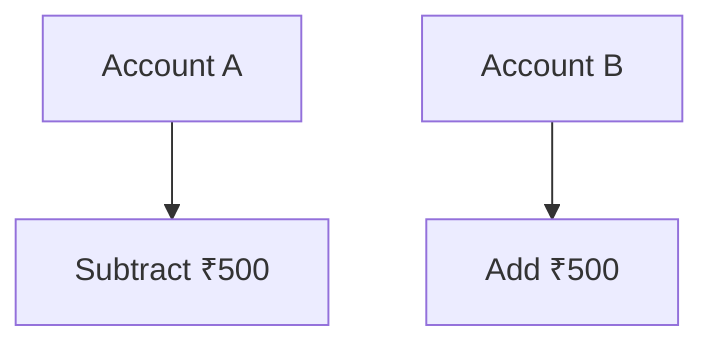

These operations are related.

We do not want this:

```text
Account A → ₹500 removed
Account B → update failed
```

because money would effectively disappear from the application state.

Instead, we want:

```text
Both operations succeed
        OR
Neither operation is applied
```

That is the fundamental reason transactions exist.

---

# 2. A Transaction Is a Unit of Work

Suppose an online shop creates an order.

The operation might involve:

```text
1. Create order
2. Create order items
3. Reduce inventory
4. Record payment information
```

Some of these operations may need to succeed together.

Conceptually:

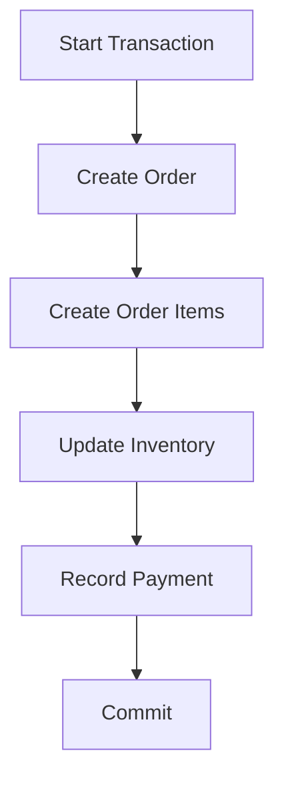

If an important operation fails:

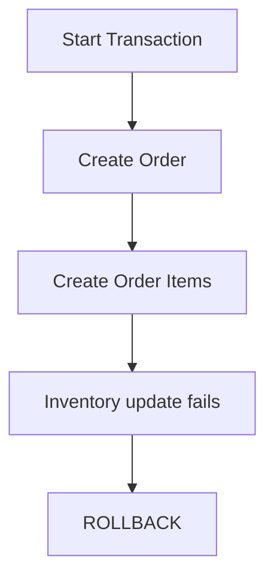

The transaction gives the database a mechanism for treating the operations as one unit.

---

# 3. Why Do Transactions Exist?

Without transactions, applications would have to manage partial failures manually.

Consider:

```sql
UPDATE accounts
SET balance = balance - 500
WHERE id = 1;

UPDATE accounts
SET balance = balance + 500
WHERE id = 2;
```

Suppose the first statement succeeds.

Then:

```text
Network failure
Database failure
Constraint violation
Application crash
```

prevents the second statement from completing.

Now the database may contain:

```text
Account 1 → money removed
Account 2 → money not added
```

The database has reached an unwanted intermediate state.

A transaction allows the application to say:

> "These operations belong together."

---

# 4. Transaction Lifecycle

A basic transaction looks like:

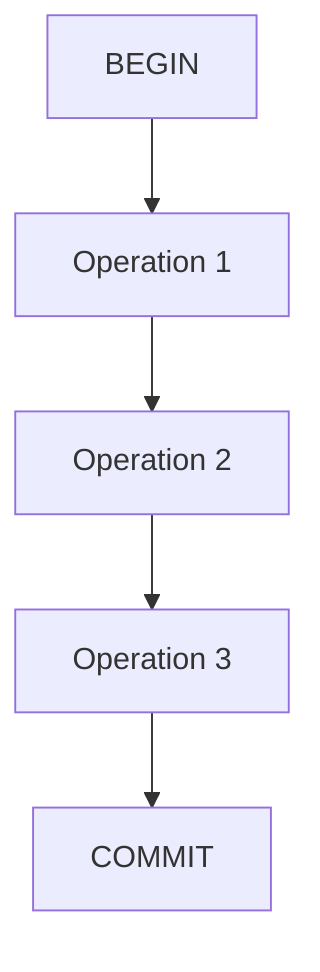

If something goes wrong:

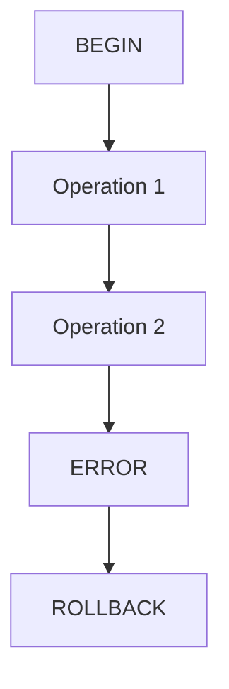

So the basic lifecycle is:

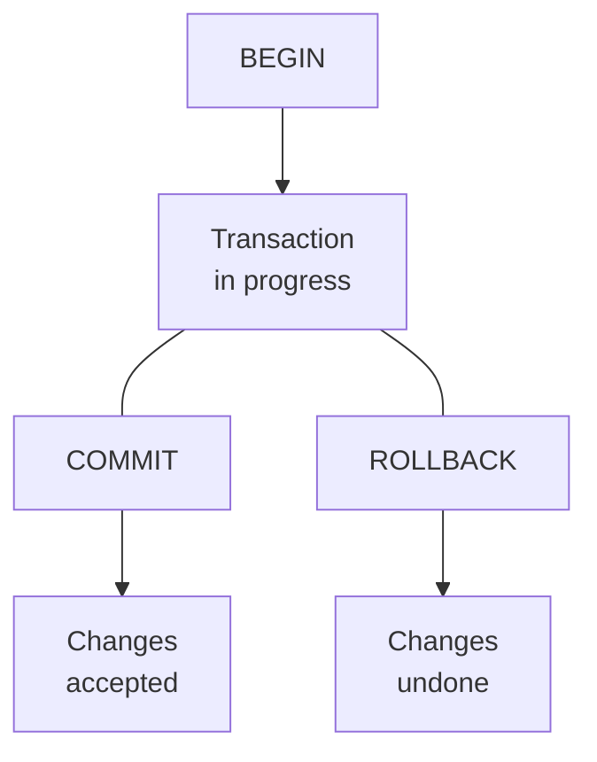

---

# 5. `BEGIN`

A transaction can be explicitly started using:

```sql
BEGIN;
```

or, depending on the database and client:

```sql
START TRANSACTION;
```

Example:

```sql
BEGIN;

UPDATE accounts
SET balance = balance - 500
WHERE id = 1;

UPDATE accounts
SET balance = balance + 500
WHERE id = 2;
```

At this point, the transaction is still in progress.

The application has not yet finalized the transaction.

---

# 6. `COMMIT`

When all required operations succeed:

```sql
COMMIT;
```

The transaction is completed successfully.

Conceptually:

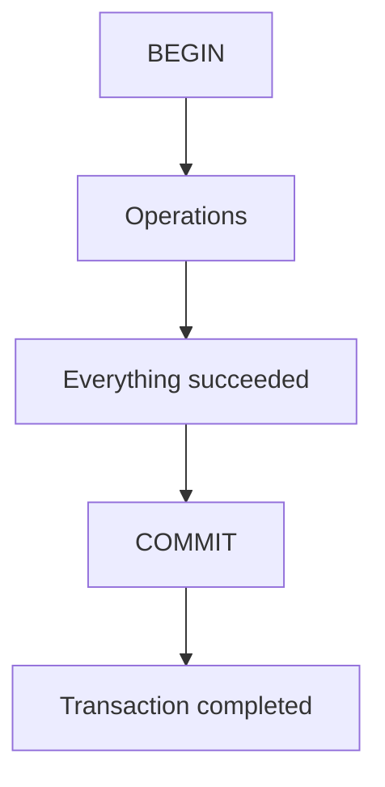

The database now accepts the transaction's changes according to its transaction guarantees.

---

# 7. `ROLLBACK`

If something goes wrong:

```sql
ROLLBACK;
```

The database abandons the transaction's uncommitted changes.

Example:

```sql
BEGIN;

UPDATE accounts
SET balance = balance - 500
WHERE id = 1;

-- Something goes wrong

ROLLBACK;
```

The intended result is that the transaction's changes are not committed.

Conceptually:

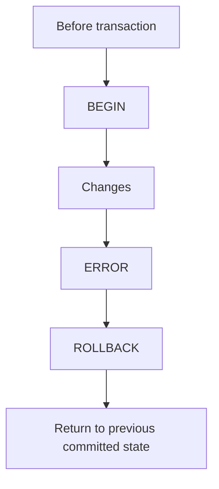

The exact behavior can depend on database features and transaction state, but this is the fundamental model.

---

# 8. The Four ACID Properties

The most important concept in database transactions is **ACID**.

ACID stands for:

```text
A → Atomicity
C → Consistency
I → Isolation
D → Durability
```

These properties describe important guarantees associated with transactional database systems.

---

# 9. Atomicity

**Atomicity** means that a transaction is treated as one unit of work.

Conceptually:

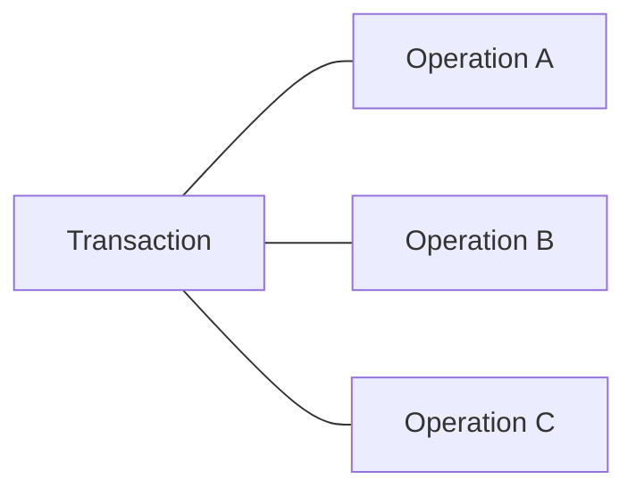

The intended outcome is:

```text
All succeed
    OR
Transaction does not commit
```

This is often simplified as:

> **All or nothing.**

---

# 10. Atomicity Example

Suppose we create an order:

```text
Create Order
Create Order Item
Reduce Inventory
```

If inventory reduction fails:

```text
Create Order      ✓
Create Item       ✓
Reduce Inventory  ✗
```

Without a transaction, the database might contain:

```text
Order exists
Order item exists
Inventory unchanged
```

That could represent an invalid application state.

With a transaction:

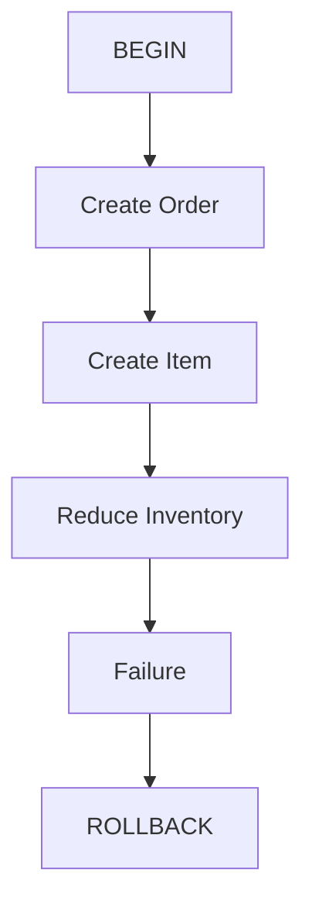

The transaction does not commit the partial result.

---

# 11. Atomicity Does Not Mean "No Errors"

A transaction can fail.

Atomicity does not mean:

> "The transaction will always succeed."

It means:

> **The transaction's operations are treated as one unit rather than being partially committed as independent pieces.**

For example:

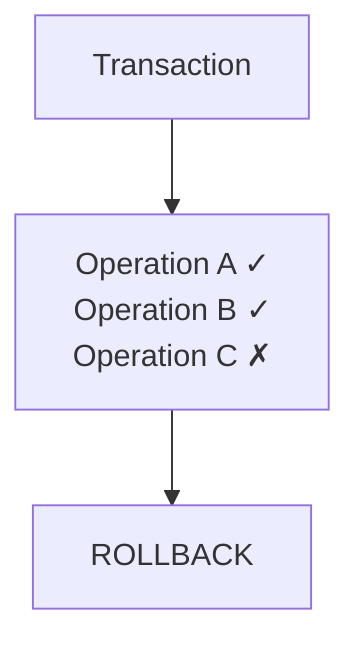

The failure still happened.

Atomicity controls what happens to the transaction's changes.

---

# 12. Consistency

**Consistency** means that a successfully committed transaction takes the database from one valid state to another valid state according to the database's defined rules and constraints.

Suppose:

```text
accounts.balance >= 0
```

is a business/database rule.

A transaction should not successfully commit a state that violates the rules enforced by the database.

For example:

```text
Before
Account balance = ₹1,000

Transaction
Withdraw ₹500

After
Account balance = ₹500
```

The transaction moves the database from:

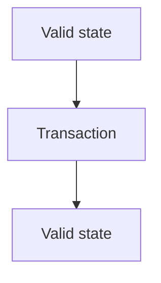

---

# 13. Consistency Is About Rules

Consistency depends on the rules defined by the system.

These rules can include:

- Primary keys
- Foreign keys
- Unique constraints
- `NOT NULL`
- `CHECK` constraints
- Data types
- Application-level business rules
- Other database constraints

For example:

```sql
CREATE TABLE users (
    id BIGINT PRIMARY KEY,
    email VARCHAR(255) UNIQUE NOT NULL
);
```

The database should not allow two rows with the same unique email.

A transaction attempting to violate the constraint can fail.

---

# 14. Database Consistency vs General "Correctness"

Do not interpret ACID consistency as:

> "The entire application is always logically correct."

That is too broad.

Database consistency refers to maintaining the defined integrity rules and transaction guarantees of the database.

An application can still contain a business logic bug.

For example:

```text
Database:
Order total = ₹1,000
```

may satisfy all database constraints.

But the application may have incorrectly calculated:

```text
Expected total = ₹1,200
```

The database cannot automatically know every business rule.

Therefore:

> **Database consistency is not the same thing as application correctness.**

---

# 15. Isolation

**Isolation** describes how concurrent transactions interact with each other.

This becomes important when multiple users perform operations at the same time.

Imagine:

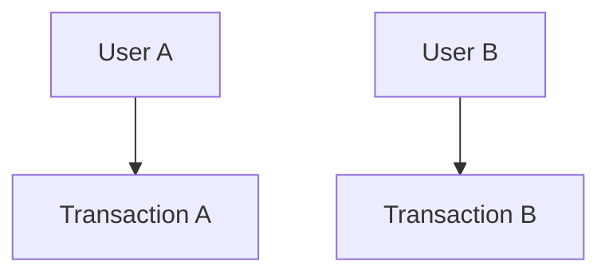

Both transactions may access the same data.

Without appropriate isolation, one transaction could observe intermediate or conflicting states from another.

Isolation controls these interactions.

---

# 16. Why Isolation Matters

Suppose an account has:

```text
Balance = ₹1,000
```

Two requests arrive at nearly the same time:

```text
Request A → withdraw ₹700
Request B → withdraw ₹700
```

If both transactions independently read:

```text
₹1,000
```

they may both believe enough money exists.

Without appropriate concurrency control:

```text
A reads ₹1,000
B reads ₹1,000

A subtracts ₹700
B subtracts ₹700

Unexpected result
```

The database needs mechanisms to control concurrent access.

This is part of transaction isolation.

---

# 17. Concurrent Transactions

Think of two transactions:

```text
Time →

Transaction A:
BEGIN
Read
Update
COMMIT

Transaction B:
BEGIN
Read
Update
COMMIT
```

They may execute:

```text
sequentially
```

or overlap:

```text
A: BEGIN
A: READ
B: BEGIN
B: READ
A: UPDATE
B: UPDATE
A: COMMIT
B: COMMIT
```

The database must manage such concurrency safely according to the configured isolation model and transaction semantics.

---

# 18. Durability

**Durability** means that once a transaction is successfully committed, its committed effects are intended to survive subsequent failures according to the database's durability guarantees.

For example:

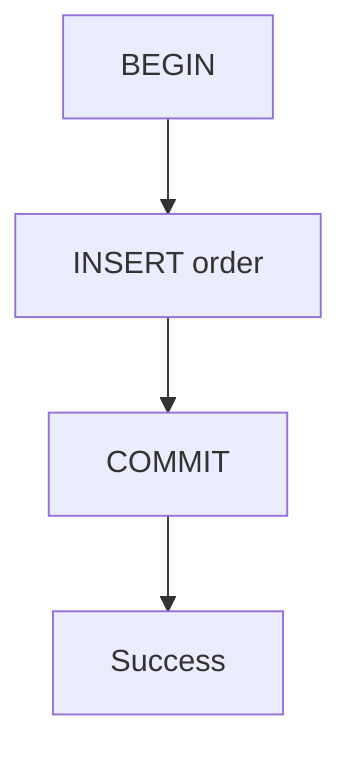

Then:

```text
Database process crashes
```

After recovery, the committed transaction should still be represented.

Conceptually:

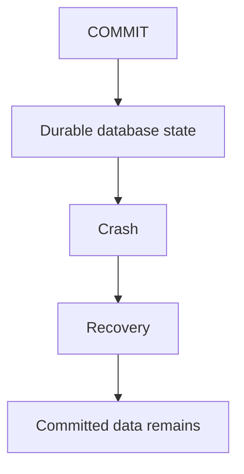

Durability is a major reason databases use mechanisms such as:

- Write-ahead logging
- Recovery logs
- Durable storage
- Checkpoints
- Replication in some architectures

The exact mechanism varies by database.

---

# 19. ACID Together

The four properties address different problems.

| Property | Main Question |
|---|---|
| Atomicity | Do the transaction's changes behave as one unit? |
| Consistency | Does the committed state obey defined integrity rules? |
| Isolation | How are concurrent transactions separated from each other? |
| Durability | Does committed data survive failure according to the database's guarantees? |

Think of:

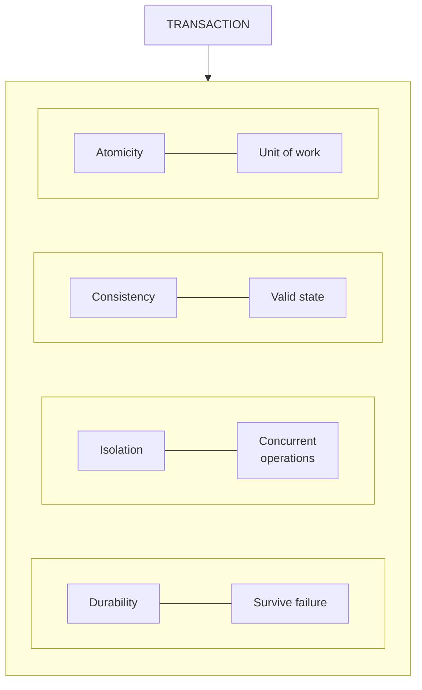

---

# 20. A Complete Transaction Example

Consider a bank transfer.

Initial state:

```text
Account A = ₹10,000
Account B = ₹5,000
```

Transfer:

```text
₹2,000
```

Transaction:

```sql
BEGIN;

UPDATE accounts
SET balance = balance - 2000
WHERE id = 1;

UPDATE accounts
SET balance = balance + 2000
WHERE id = 2;

COMMIT;
```

Final state:

```text
Account A = ₹8,000
Account B = ₹7,000
```

The transaction represents one logical operation:

```text
Transfer ₹2,000 from A to B
```

---

# 21. What If the Second Operation Fails?

Suppose:

```text
UPDATE Account A → success
UPDATE Account B → failure
```

The application should not simply continue.

Instead:

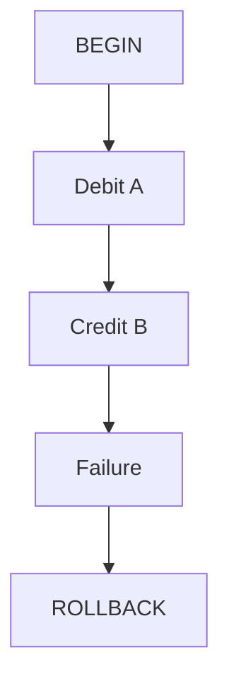

The goal is to avoid committing only the debit.

This is atomicity in action.

---

# 22. Transaction Boundaries

A critical design decision is:

> **Which operations belong inside one transaction?**

Consider order creation:

```text
Create Order
Create Order Items
Reduce Inventory
```

You might decide these operations need to be in the same transaction.

But what about:

```text
Send Email
Send SMS
Generate Analytics Event
Call External Payment API
```

These operations are different.

A database transaction generally cannot simply roll back an external email that has already been sent.

This is where system design becomes important.

---

# 23. Database Transactions Have Boundaries

Imagine:

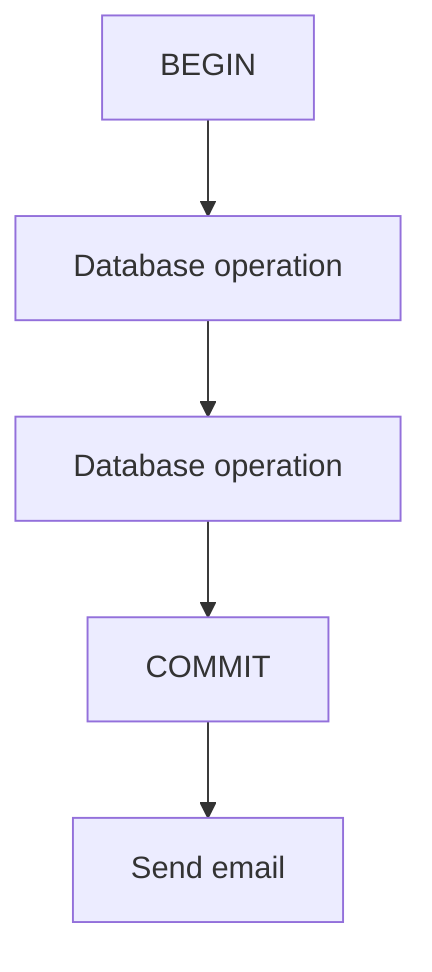

If sending the email fails:

```text
Database transaction
→ Already committed
```

You cannot simply:

```text
ROLLBACK email
```

because the email system is external to the database transaction.

This is a fundamental distributed-systems problem.

---

# 24. Transaction Scope

A transaction should generally cover a coherent unit of database work.

Too small:

```text
Operation A → COMMIT
Operation B → COMMIT
Operation C → COMMIT
```

may allow unwanted partial states.

Too large:

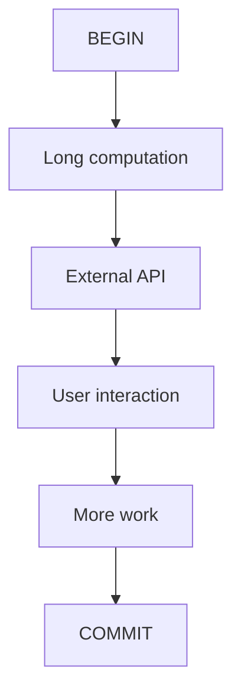

can cause:

- Long-held locks
- More contention
- More resources occupied
- Greater rollback cost
- Lower throughput

Therefore:

> **Transactions should be large enough to preserve required correctness, but not unnecessarily large or long-lived.**

---

# 25. Long Transactions

Imagine:

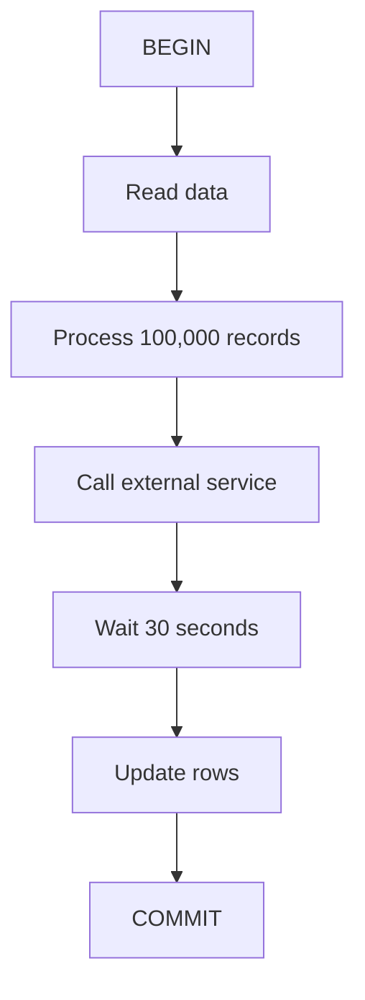

Holding a transaction open for a long time can cause problems.

Depending on the database and workload, long transactions can contribute to:

- Lock contention
- Increased resource usage
- Old row versions remaining longer
- Reduced concurrency
- Increased rollback work

Therefore:

> **Keep transactions focused and reasonably short when possible.**

---

# 26. Transactions and Indexes

Indexes are part of the database state.

Suppose:

```sql
UPDATE users
SET email = 'new@example.com'
WHERE id = 100;
```

and:

```text
email
```

has an index.

The database may need to update:

```text
users table
+
email index
```

The transaction must preserve the database's integrity while these structures are modified.

Conceptually:

```mermaid
flowchart LR
  accTitle: Transactions and indexes
  accDescr: A transaction covers table data, index data and constraints.
  R["Transaction"]
  R --- K0["Table data"]
  R --- K1["Index data"]
  R --- K2["Constraints"]
```

This connects directly to the previous chapter.

---

# 27. Transactions and Constraints

Suppose:

```sql
CREATE TABLE users (
    id BIGINT PRIMARY KEY,
    email VARCHAR(255) UNIQUE NOT NULL
);
```

Now:

```sql
BEGIN;

INSERT INTO users (id, email)
VALUES (1, 'alex@example.com');

INSERT INTO users (id, email)
VALUES (2, 'alex@example.com');

COMMIT;
```

The second insert violates the uniqueness constraint.

The transaction may fail rather than successfully committing an invalid state.

The exact transaction behavior after a statement error depends on the database and client, but the important concept is:

> **Constraints help define which database states are valid, while transactions control how groups of changes are applied.**

---

# 28. Transactions and Foreign Keys

Suppose:

```text
customers
---------
id

orders
------
id
customer_id
```

with:

```mermaid
flowchart TD
  accTitle: A foreign key
  accDescr: orders.customer_id refers to customers.id.
  N0["orders.customer_id"] --> N1["customers.id"]
```

Now imagine creating an order.

If the referenced customer does not exist:

```sql
INSERT INTO orders (
    customer_id
)
VALUES (999999);
```

a foreign-key constraint can reject the operation.

This helps preserve relational integrity.

Transactions allow multiple related operations to be performed as one unit.

For example:

```mermaid
flowchart TD
  accTitle: Creating related rows
  accDescr: BEGIN, then Create Customer, then Create Order referencing Customer, then COMMIT.
  N0["BEGIN"] --> N1["Create Customer"] --> N2["Create Order referencing Customer"] --> N3["COMMIT"]
```

---

# 29. Read Transactions

Transactions are not only for writes.

A transaction can contain reads:

```sql
BEGIN;

SELECT ...;

SELECT ...;

COMMIT;
```

Why?

Because the application may need a controlled view of data while multiple operations occur.

The exact behavior depends on the isolation level.

This is where transaction isolation becomes more important.

---

# 30. Isolation Levels

Databases provide different **isolation levels**.

Common SQL transaction isolation levels include:

```text
Read Uncommitted
Read Committed
Repeatable Read
Serializable
```

Different database systems implement these levels differently.

They represent different trade-offs between:

```mermaid
flowchart TD
  accTitle: Isolation is a balance
  accDescr: Concurrency and isolation guarantees trade off against each other.
  C["Concurrency"] <--> I["Isolation guarantees"]
```

A simplified conceptual spectrum is:

```text
More concurrency
       ↑
       |
Read Uncommitted
Read Committed
Repeatable Read
Serializable
       |
       ↓
Stronger isolation
```

Do not treat this as a universal performance ranking.

Actual behavior depends on the database implementation and workload.

---

# 31. Read Uncommitted

The name suggests that a transaction may be allowed to see changes that have not yet been committed by another transaction.

This can permit weaker consistency behavior.

It is generally the weakest standard isolation level.

However, actual implementation varies across database systems.

The important lesson for now is:

> **Lower isolation can permit more concurrency at the cost of weaker guarantees.**

---

# 32. Read Committed

Under **Read Committed**, a transaction generally sees data committed before its individual statement reads it.

Consider:

```text
Transaction A
     |
     | updates data
     |
     | not committed
     |
Transaction B
     |
     | reads data
```

Transaction B should not normally see A's uncommitted change under Read Committed.

This is a common default isolation level in several database systems.

However, exact semantics differ by implementation.

---

# 33. Repeatable Read

Repeatable Read provides stronger guarantees around repeated reads within a transaction.

Conceptually:

```mermaid
flowchart TD
  accTitle: Non-repeatable read
  accDescr: Transaction B: Read row, then Other transaction changes row, then Read same row again.
  subgraph G["Transaction B"]
    direction TB
    N0["Read row"] --> N1["Other transaction changes row"] --> N2["Read same row again"]
  end
```

The isolation model attempts to provide a stable view according to its database-specific semantics.

This can reduce certain concurrency anomalies.

---

# 34. Serializable

**Serializable** aims to provide behavior equivalent to transactions executing in some serial order.

Conceptually:

```text
Transaction A
Transaction B
Transaction C
```

should behave as though the system had chosen a valid serial ordering, even though the database may use concurrency internally.

This provides strong isolation.

But stronger isolation can introduce:

- More contention
- More waiting
- Serialization failures
- Reduced concurrency in some workloads

Therefore:

> **Stronger isolation is not automatically better for every workload.**

---

# 35. Isolation Is a Trade-Off

Think of isolation as a design choice:

```text
        Stronger guarantees
               ↑
               |
               |
        More coordination
               |
               |
        Potentially less
          concurrency
```

The correct isolation level depends on:

- Business requirements
- Data correctness requirements
- Concurrency
- Database engine
- Query patterns
- Failure behavior

This is why system designers should understand what guarantees they actually need.

---

# 36. Common Concurrency Problems

Different isolation models are designed around problems that can occur when transactions run concurrently.

Important concepts include:

- Dirty reads
- Non-repeatable reads
- Phantom reads
- Lost updates
- Write conflicts

These are not simply "bugs in SQL."

They arise from the interaction between:

```text
Multiple transactions
+
Shared data
+
Concurrency
+
Isolation rules
```

---

# 37. Dirty Read

A dirty read occurs when one transaction observes data written by another transaction before that other transaction commits.

Conceptually:

```text
Transaction A
    |
    | UPDATE balance = 500
    | (not committed)
    |
Transaction B
    |
    | reads balance = 500
```

Then:

```mermaid
flowchart TD
  accTitle: Rollback after a dirty read
  accDescr: Transaction A, then ROLLBACK.
  N0["Transaction A"] --> N1["ROLLBACK"]
```

The value Transaction B observed never became part of committed database state.

That is the problem represented by a dirty read.

---

# 38. Non-Repeatable Read

Suppose Transaction A reads:

```text
balance = ₹1,000
```

Then Transaction B updates and commits:

```text
balance = ₹500
```

Transaction A reads again:

```text
balance = ₹500
```

The same logical read produced different results during the transaction.

This is a **non-repeatable read**.

---

# 39. Phantom Read

A phantom read involves rows appearing or disappearing from a repeated query because another transaction inserted or deleted matching rows.

Example:

Transaction A:

```sql
SELECT *
FROM orders
WHERE customer_id = 42;
```

It gets:

```text
10 rows
```

Another transaction inserts a matching order and commits.

Transaction A repeats the query:

```sql
SELECT *
FROM orders
WHERE customer_id = 42;
```

Now it may see:

```text
11 rows
```

The additional row is conceptually a "phantom."

---

# 40. Lost Update

Suppose:

```text
Initial balance = ₹1,000
```

Two transactions read it.

```text
A reads ₹1,000
B reads ₹1,000
```

A calculates:

```text
₹1,000 - ₹200 = ₹800
```

B calculates:

```text
₹1,000 - ₹300 = ₹700
```

If both write their calculated values without appropriate concurrency control:

```text
A writes ₹800
B writes ₹700
```

The update from A may effectively be lost.

This is a classic concurrency problem.

---

# 41. Transactions Do Not Automatically Prevent Every Race

A common misconception is:

> "I used a transaction, so concurrency is solved."

Not necessarily.

A transaction gives a framework for atomicity and consistency, but the actual result depends on:

- Isolation level
- Query design
- Locking
- Database engine
- Constraints
- Application logic

For example:

```text
BEGIN
SELECT balance
UPDATE balance
COMMIT
```

may still need appropriate concurrency control for the business rule.

---

# 42. Pessimistic Locking

One approach is to lock data while it is being processed.

For example, some SQL databases support:

```sql
SELECT *
FROM accounts
WHERE id = 1
FOR UPDATE;
```

Conceptually:

```mermaid
flowchart TD
  accTitle: Pessimistic locking
  accDescr: Transaction A, then Lock row, then Read, then Update, then Commit.
  N0["Transaction A"] --> N1["Lock row"] --> N2["Read"] --> N3["Update"] --> N4["Commit"]
```

Another transaction trying to modify the same locked row may have to wait or otherwise encounter database-specific behavior.

This is called a form of **pessimistic concurrency control**.

The exact behavior depends on the database.

---

# 43. Optimistic Concurrency

Another approach is to detect conflicting updates instead of locking everything in advance.

For example, a row may contain:

```text
version = 7
```

Application reads:

```text
balance = ₹1,000
version = 7
```

Then attempts:

```sql
UPDATE accounts
SET balance = 800,
    version = 8
WHERE id = 1
  AND version = 7;
```

If another transaction already changed the row:

```text
version = 8
```

the update may affect zero rows.

The application can then detect:

```text
Conflict occurred.
```

This is a simplified example of optimistic concurrency control.

---

# 44. Transaction Retry

Some transaction failures are temporary or caused by concurrency.

For example:

```mermaid
flowchart TD
  accTitle: Transaction retry
  accDescr: Transaction, then Conflict, then Rollback / Abort, then Retry.
  N0["Transaction"] --> N1["Conflict"] --> N2["Rollback / Abort"] --> N3["Retry"]
```

A retry may be appropriate in some systems.

But retries must be designed carefully.

Repeated retries can produce:

```mermaid
flowchart TD
  accTitle: Retry storms
  accDescr: Transaction fails, then Retry, then Retry, then Retry, then Many concurrent attempts.
  N0["Transaction fails"] --> N1["Retry"] --> N2["Retry"] --> N3["Retry"] --> N4["Many concurrent attempts"]
```

This can increase database pressure.

This connects to earlier system-design topics:

- Retries
- Retry storms
- Timeouts
- Connection limits

A database retry strategy must therefore be bounded and deliberate.

---

# 45. Transactions and External Services

Consider an order workflow:

```mermaid
flowchart TD
  accTitle: Mixing external services
  accDescr: Database, then Create order, then Payment API, then Send email, then Update inventory.
  N0["Database"] --> N1["Create order"] --> N2["Payment API"] --> N3["Send email"] --> N4["Update inventory"]
```

You cannot normally make the entire workflow one ordinary database transaction.

Why?

Because:

```text
Payment API
Email service
```

are external systems.

Your SQL database cannot simply execute:

```text
ROLLBACK
```

and undo a payment that has already been processed by another service.

This is one reason distributed systems need additional patterns.

Later Systemly chapters will cover concepts such as:

- Distributed transactions
- Saga Pattern
- Outbox Pattern

---

# 46. Transaction vs Request

A transaction is not necessarily the same thing as an HTTP request.

You might have:

```mermaid
flowchart TD
  accTitle: Transaction vs request
  accDescr: HTTP Request, then Application, then Database Transaction, then Response.
  N0["HTTP Request"] --> N1["Application"] --> N2["Database Transaction"] --> N3["Response"]
```

Often this is a useful relationship.

But an HTTP request can also involve:

```text
Multiple database transactions
```

or:

```text
No database transaction
```

depending on the application.

Therefore:

> **A transaction is a database unit of work, not simply "one web request."**

---

# 47. Transaction vs Database Connection

A database connection and a transaction are also different concepts.

Think:

```mermaid
flowchart LR
  accTitle: One connection, many transactions
  accDescr: One connection can run transactions A, B and C.
  R["Connection"]
  R --- K0["Transaction A"]
  R --- K1["Transaction B"]
  R --- K2["Transaction C"]
```

A connection is a communication channel/session with the database.

A transaction is a unit of database work.

Connection pooling makes this distinction especially important.

A pooled connection may be reused by different requests.

The application must ensure transaction state is correctly completed before returning a connection to the pool.

---

# 48. Transactions and Connection Pools

Consider:

```mermaid
flowchart TD
  accTitle: Transactions and connection pools
  accDescr: Request A, then Connection Pool, then Connection 3, then BEGIN, then UPDATE, then COMMIT, then Return connection.
  N0["Request A"] --> N1["Connection Pool"] --> N2["Connection 3"] --> N3["BEGIN"] --> N4["UPDATE"] --> N5["COMMIT"] --> N6["Return connection"]
```

The connection must not accidentally remain inside an unfinished transaction.

A common failure pattern is:

```mermaid
flowchart TD
  accTitle: A leaked transaction
  accDescr: Request A, then BEGIN, then ERROR, then Connection returned incorrectly.
  N0["Request A"] --> N1["BEGIN"] --> N2["ERROR"] --> N3["Connection returned incorrectly"]
```

If transaction cleanup is mishandled, another request may inherit unexpected database session state.

Therefore:

> **Transaction lifecycle management is important when using connection pools.**

---

# 49. Transactions and Performance

Transactions provide important correctness guarantees, but they are not free.

Costs can involve:

- Locking
- Logging
- Memory
- Coordination
- Waiting
- Disk I/O
- Conflict handling
- Rollback work

A transaction that updates one row may be relatively simple.

A transaction that modifies thousands of rows may be much more expensive.

Therefore:

> **Transaction design affects both correctness and performance.**

---

# 50. Large Transactions

Suppose:

```mermaid
flowchart TD
  accTitle: A large transaction
  accDescr: BEGIN, then Update 1 million rows, then COMMIT.
  N0["BEGIN"] --> N1["Update 1 million rows"] --> N2["COMMIT"]
```

This may create significant database work.

Potential issues include:

- Large transaction logs
- Long-running locks
- Increased contention
- Large rollback work
- Replication impact
- Resource pressure

For large jobs, the system may need:

```text
Batch processing
+
Smaller transactions
```

instead of one enormous transaction.

However, splitting a transaction changes atomicity boundaries.

So the decision must consider correctness.

---

# 51. Transaction Boundary Trade-Off

Imagine processing:

```text
1,000,000 records
```

### Option A

One transaction:

```text
BEGIN
1,000,000 updates
COMMIT
```

Advantages:

- One atomic unit

Potential disadvantages:

- Long transaction
- Large resource usage
- More contention

### Option B

Process batches:

```text
BEGIN
10,000 updates
COMMIT

BEGIN
10,000 updates
COMMIT

...
```

Advantages:

- Smaller transactions
- Reduced transaction size

Potential disadvantage:

- The entire 1,000,000-row operation is no longer one atomic unit.

This is a system-design trade-off.

---

# 52. Transactions and Durability Mechanisms

Databases need a way to recover committed state after failures.

A common mechanism is **Write-Ahead Logging (WAL)**.

The simplified idea is:

```mermaid
flowchart TD
  accTitle: Durability mechanisms
  accDescr: Application, then Transaction changes, then Write recovery information, then Commit, then Database state.
  N0["Application"] --> N1["Transaction changes"] --> N2["Write recovery information"] --> N3["Commit"] --> N4["Database state"]
```

If the process crashes, the database can use its recovery information to reconstruct committed state.

The exact implementation differs between databases.

For example, PostgreSQL uses WAL.

The important conceptual connection is:

```mermaid
flowchart TD
  accTitle: Durability
  accDescr: Transaction, then Durability, then Recovery mechanism.
  N0["Transaction"] --> N1["Durability"] --> N2["Recovery mechanism"]
```

---

# 53. Commit Is an Important Boundary

Think carefully about:

```sql
COMMIT;
```

Before commit:

```mermaid
flowchart TD
  accTitle: Before commit
  accDescr: Transaction, then Changes are still part of an active transaction.
  N0["Transaction"] --> N1["Changes are still part of an active transaction"]
```

After successful commit:

```mermaid
flowchart TD
  accTitle: After commit
  accDescr: Transaction, then Committed database state.
  N0["Transaction"] --> N1["Committed database state"]
```

This boundary matters for:

- Atomicity
- Durability
- Visibility
- Recovery
- Replication
- Application behavior

A successful commit is therefore much more than:

> "The SQL command finished."

It represents a significant state transition.

---

# 54. What Happens If the Application Crashes?

Suppose:

```mermaid
flowchart TD
  accTitle: Crash before commit
  accDescr: BEGIN, then UPDATE, then Application crashes.
  N0["BEGIN"] --> N1["UPDATE"] --> N2["Application crashes"]
```

The transaction has not committed.

The database can recover according to its transaction and recovery mechanisms rather than treating the incomplete transaction as successfully committed.

Conceptually:

```mermaid
flowchart TD
  accTitle: Recovery after a crash
  accDescr: Uncommitted transaction, then Application crash, then Database recovery, then Incomplete transaction not treated as committed.
  N0["Uncommitted transaction"] --> N1["Application crash"] --> N2["Database recovery"] --> N3["Incomplete transaction not treated as committed"]
```

This is one of the reasons transactions are fundamental to database reliability.

---

# 55. What Happens After Commit?

Suppose:

```mermaid
flowchart TD
  accTitle: Crash after commit
  accDescr: BEGIN, then INSERT order, then COMMIT, then Application crashes.
  N0["BEGIN"] --> N1["INSERT order"] --> N2["COMMIT"] --> N3["Application crashes"]
```

The transaction has already committed.

Durability mechanisms are intended to ensure that the committed state survives recovery according to the database's guarantees.

This is the "D" in ACID.

---

# 56. Transactions and Replication

Suppose:

```mermaid
flowchart TD
  accTitle: Transactions and replication
  accDescr: Application, then Primary Database, then Replica.
  N0["Application"] --> N1["Primary Database"] --> N2["Replica"]
```

A transaction commits on the primary.

The replica may receive the changes afterward depending on the replication architecture.

Therefore:

```text
Transaction commit
≠
Every replica has immediately applied the transaction
```

This distinction becomes important when discussing:

- Read replicas
- Replication lag
- Read-after-write behavior
- Distributed databases

Transactions provide guarantees within the transactional database system; replication introduces additional architectural considerations.

---

# 57. Transactions and Caching

Consider:

```mermaid
flowchart TD
  accTitle: Transactions and caching
  accDescr: Database, then Cache.
  N0["Database"] --> N1["Cache"]
```

Suppose:

```text
BEGIN
UPDATE product
COMMIT
```

What happens to the cache?

The database transaction itself does not automatically know how to invalidate an external Redis cache.

You may need:

```mermaid
flowchart TD
  accTitle: Invalidate after commit
  accDescr: Database transaction, then COMMIT, then Invalidate cache.
  N0["Database transaction"] --> N1["COMMIT"] --> N2["Invalidate cache"]
```

or another synchronization strategy.

This connects transactions with the caching concepts from Level 3.

A transaction protects database state.

Cache consistency is a separate concern.

---

# 58. Transactional Database vs Distributed Transaction

A transaction inside one database is conceptually simpler:

```mermaid
flowchart TD
  accTitle: A local transaction
  accDescr: Application, then One Database, then Transaction.
  N0["Application"] --> N1["One Database"] --> N2["Transaction"]
```

A distributed transaction may involve:

```mermaid
flowchart TD
  accTitle: Separate databases
  accDescr: Service A uses database A; service B uses database B.
  A0["Service A"] --> A1["Database A"]
  B0["Service B"] --> B1["Database B"]
```

Now a single business operation may span multiple systems.

You cannot assume:

```text
COMMIT Database A
+
COMMIT Database B
```

will behave like one local transaction.

This is why distributed transactions require additional patterns.

Systemly will explore this later in:

**07.13 — Distributed Transactions**

---

# 59. Common Transaction Mistakes

## Mistake 1 — No transaction for related writes

```text
Create order
Create order item
Update inventory
```

committed independently can create partial state.

---

## Mistake 2 — One giant transaction

Huge transactions can create contention and resource pressure.

---

## Mistake 3 — Keeping transactions open while waiting

Avoid:

```mermaid
flowchart TD
  accTitle: Waiting inside a transaction
  accDescr: BEGIN, then Call external API, then Wait 5 seconds, then COMMIT.
  N0["BEGIN"] --> N1["Call external API"] --> N2["Wait 5 seconds"] --> N3["COMMIT"]
```

when the transaction does not need to remain open during the external call.

---

## Mistake 4 — Assuming transactions solve external side effects

A database rollback cannot automatically undo:

- An email
- An HTTP request
- A payment processed by another system
- A message already consumed externally

---

## Mistake 5 — Ignoring isolation

Concurrent transactions can interact in surprising ways if isolation requirements are not understood.

---

## Mistake 6 — Ignoring retries

A failed transaction may be retried, potentially increasing database load.

---

## Mistake 7 — Forgetting rollback/cleanup

Application code must correctly handle transaction failures.

---

## Mistake 8 — Treating COMMIT as optional

A transaction that never commits does not represent successful completion.

---

# 60. Practical Transaction Workflow

A good application transaction flow often looks like:

```mermaid
flowchart TD
  accTitle: Practical transaction workflow
  accDescr: Receive request, then Validate input, then Start transaction, then Perform related database operations, then Check required results, then Commit, then Perform appropriate post-commit work, then Return response.
  N0["Receive request"] --> N1["Validate input"] --> N2["Start transaction"] --> N3["Perform related database operations"] --> N4["Check required results"] --> N5["Commit"] --> N6["Perform appropriate post-commit work"] --> N7["Return response"]
```

If something fails:

```mermaid
flowchart TD
  accTitle: Failure path
  accDescr: Perform database operation, then Failure, then Rollback, then Handle error, then Return appropriate response.
  N0["Perform database operation"] --> N1["Failure"] --> N2["Rollback"] --> N3["Handle error"] --> N4["Return appropriate response"]
```

The exact placement of validation and external work depends on the application.

---

# 61. Hands-On Lab — Transactions & ACID

We will use PostgreSQL.

## Step 1 — Create the Database

```sql
CREATE DATABASE systemly_transaction_lab;
```

Connect to it.

---

## Step 2 — Create Accounts

```sql
CREATE TABLE accounts (
    id BIGSERIAL PRIMARY KEY,
    owner_name VARCHAR(100) NOT NULL,
    balance NUMERIC(12, 2) NOT NULL CHECK (balance >= 0)
);
```

---

## Step 3 — Insert Accounts

```sql
INSERT INTO accounts (owner_name, balance)
VALUES
    ('Alice', 10000.00),
    ('Bob', 5000.00);
```

Check:

```sql
SELECT *
FROM accounts;
```

Expected conceptual state:

```text
Alice → ₹10,000
Bob   → ₹5,000
```

---

# 62. Perform a Transfer

Start a transaction:

```sql
BEGIN;
```

Debit Alice:

```sql
UPDATE accounts
SET balance = balance - 2000
WHERE owner_name = 'Alice';
```

Credit Bob:

```sql
UPDATE accounts
SET balance = balance + 2000
WHERE owner_name = 'Bob';
```

Check the values before commit:

```sql
SELECT *
FROM accounts;
```

Then:

```sql
COMMIT;
```

Check again:

```sql
SELECT *
FROM accounts;
```

Expected:

```text
Alice → ₹8,000
Bob   → ₹7,000
```

---

# 63. Test ROLLBACK

Start another transaction:

```sql
BEGIN;
```

Run:

```sql
UPDATE accounts
SET balance = balance - 1000
WHERE owner_name = 'Alice';
```

Check:

```sql
SELECT *
FROM accounts
WHERE owner_name = 'Alice';
```

Now:

```sql
ROLLBACK;
```

Check again:

```sql
SELECT *
FROM accounts
WHERE owner_name = 'Alice';
```

The transaction's uncommitted change should no longer be present.

---

# 64. Test a Constraint Failure

Try:

```sql
BEGIN;

UPDATE accounts
SET balance = balance - 100000
WHERE owner_name = 'Alice';
```

The `CHECK` constraint:

```sql
balance >= 0
```

should prevent an invalid committed state.

The exact transaction state after the error is database-specific; in PostgreSQL, a statement error places the transaction in a failed state until it is rolled back.

Therefore:

```sql
ROLLBACK;
```

Then verify:

```sql
SELECT *
FROM accounts;
```

---

# 65. Challenge — Order Transaction

Create:

```sql
CREATE TABLE orders (
    id BIGSERIAL PRIMARY KEY,
    customer_name VARCHAR(100) NOT NULL,
    total NUMERIC(12, 2) NOT NULL CHECK (total >= 0)
);

CREATE TABLE order_items (
    id BIGSERIAL PRIMARY KEY,
    order_id BIGINT NOT NULL REFERENCES orders(id),
    product_name VARCHAR(100) NOT NULL,
    quantity INTEGER NOT NULL CHECK (quantity > 0)
);
```

Now create an order using a transaction:

```mermaid
flowchart TD
  accTitle: Order transaction challenge
  accDescr: BEGIN, then Create order, then Create order item, then Create another order item, then COMMIT.
  N0["BEGIN"] --> N1["Create order"] --> N2["Create order item"] --> N3["Create another order item"] --> N4["COMMIT"]
```

Then intentionally cause one operation to fail.

Observe what happens when you:

```text
ROLLBACK
```

The goal is to understand:

```mermaid
flowchart TD
  accTitle: One logical operation
  accDescr: One logical operation, then Multiple SQL statements, then One transaction.
  N0["One logical operation"] --> N1["Multiple SQL statements"] --> N2["One transaction"]
```

---

# 66. Transaction Decision Framework

When designing a transaction, ask:

```mermaid
flowchart TD
  accTitle: Transaction decision framework
  accDescr: 1. What is the logical unit of work? 2. Which database changes must succeed together? 3. What constraints must remain valid? 4. What happens if operation 3 fails? 5. How long does the transaction need to remain open? 6. What happens when multiple requests run concurrently? 7. What isolation guarantees are required? 8. Could the transaction conflict and need retry? 9. Are external systems involved? 10. What must happen after COMMIT?
  N0["1#46; What is the logical unit of work?"] --> N1["2#46; Which database changes must succeed together?"] --> N2["3#46; What constraints must remain valid?"] --> N3["4#46; What happens if operation 3 fails?"] --> N4["5#46; How long does the transaction need to remain open?"] --> N5["6#46; What happens when multiple requests run concurrently?"] --> N6["7#46; What isolation guarantees are required?"] --> N7["8#46; Could the transaction conflict and need retry?"] --> N8["9#46; Are external systems involved?"] --> N9["10#46; What must happen after COMMIT?"]
```

This turns transaction design into a reasoning process rather than a SQL syntax exercise.

---

# 67. Transaction vs ACID

These terms are related but not identical.

### Transaction

A logical unit of database work.

```mermaid
flowchart TD
  accTitle: A transaction
  accDescr: BEGIN, then Operations, then COMMIT / ROLLBACK.
  N0["BEGIN"] --> N1["Operations"] --> N2["COMMIT / ROLLBACK"]
```

### ACID

A set of properties describing important guarantees of transactional database systems.

```text
A → Atomicity
C → Consistency
I → Isolation
D → Durability
```

So:

> **A transaction is the unit of work; ACID describes key guarantees associated with that transactional behavior.**

---

# 68. The System Design View

At the application level:

```mermaid
flowchart TD
  accTitle: The system design view
  accDescr: HTTP Request, then Application, then Transaction, then Database.
  N0["HTTP Request"] --> N1["Application"] --> N2["Transaction"] --> N3["Database"]
```

Inside the transaction:

```mermaid
flowchart TD
  accTitle: Operations in a transaction
  accDescr: Operation A, then Operation B, then Operation C.
  N0["Operation A"] --> N1["Operation B"] --> N2["Operation C"]
```

Then:

```mermaid
flowchart TD
  accTitle: COMMIT
  accDescr: COMMIT, then Committed State.
  N0["COMMIT"] --> N1["Committed State"]
```

If something goes wrong:

```mermaid
flowchart TD
  accTitle: ROLLBACK
  accDescr: ROLLBACK, then Transaction Aborted.
  N0["ROLLBACK"] --> N1["Transaction Aborted"]
```

This gives the application a reliable boundary around related database work.

---

# 69. Transactions and Scalability

Transactions are essential for correctness, but they influence scalability.

More concurrency means:

```mermaid
flowchart TD
  accTitle: Transactions and scalability
  accDescr: More transactions, then More shared data access, then More potential conflicts, then More coordination.
  N0["More transactions"] --> N1["More shared data access"] --> N2["More potential conflicts"] --> N3["More coordination"]
```

Longer transactions can increase:

```text
Locks
Contention
Resource usage
Waiting
```

Stronger isolation can increase coordination.

Therefore:

> **Transaction design is part of scalability design.**

A highly scalable system does not simply ask:

> "Can we use transactions?"

It asks:

> **"Where do we actually need transactional guarantees, and what is the smallest useful boundary?"**

---

# 70. The Most Important Transaction Question

Do not ask:

> "Should I use a transaction?"

Ask:

> **"What must succeed or fail together to preserve the correctness of this operation?"**

For example:

```text
Create Order
+
Create Order Items
```

may need one transactional boundary.

But:

```text
Send Marketing Email
```

may not belong inside that same database transaction.

This distinction becomes increasingly important as systems become distributed.

---

# 71. Key Principle

> **A transaction groups related database operations into one logical unit of work. ACID properties provide important guarantees around atomicity, consistency, isolation, and durability. Good transaction design is not about putting every operation inside one transaction; it is about defining the smallest boundary that preserves the required correctness while considering concurrency, failure, performance, and system boundaries.**

---

# 72. Quick Reference

```text
BEGIN
→ Start transaction

COMMIT
→ Successfully finalize transaction

ROLLBACK
→ Abort uncommitted transaction changes
```

### ACID

```text
A — Atomicity
    All-or-nothing unit of work

C — Consistency
    Valid committed state according to defined rules

I — Isolation
    Controls interaction between concurrent transactions

D — Durability
    Committed changes survive failure according to database guarantees
```

### Core mental model

```mermaid
flowchart TD
  accTitle: Core mental model
  accDescr: A logical unit of work becomes a transaction of operations A, B and C, ending in COMMIT or ROLLBACK.
  N0["Logical Unit of Work"] --> N1["Transaction"] --> N2["Operation A<br/>Operation B<br/>Operation C"] --> N3["COMMIT / ROLLBACK"]
```

---

# 73. Knowledge Check

### Question 1

What is a transaction?

**Answer:**  
A transaction is a logical unit of database work whose operations are handled together according to the database's transaction guarantees.

---

### Question 2

What does atomicity mean?

**Answer:**  
The transaction's changes are treated as one unit rather than being successfully committed as unrelated partial pieces.

---

### Question 3

What does `ROLLBACK` do?

**Answer:**  
It aborts the current transaction and discards its uncommitted changes.

---

### Question 4

What does durability mean?

**Answer:**  
After a successful commit, the committed state is intended to survive subsequent failures according to the database's durability guarantees.

---

### Question 5

Does a transaction automatically undo an email sent by the application?

**Answer:**  
No. The email service is external to the database transaction.

---

### Question 6

Why can very long transactions be problematic?

**Answer:**  
They can increase lock duration, contention, resource usage, rollback work, and reduce concurrency.

---

### Question 7

Does using a transaction automatically solve concurrency problems?

**Answer:**  
No. Concurrency behavior also depends on isolation level, locking/concurrency mechanisms, query design, constraints, and the database engine.

---

### Question 8

What is the difference between a transaction and ACID?

**Answer:**  
A transaction is a unit of database work. ACID describes important properties and guarantees associated with transactional behavior.

---

# 75. Remember

A transaction is not simply:

```text
BEGIN
...
COMMIT
```

The deeper idea is:

```mermaid
flowchart TD
  accTitle: The deeper idea
  accDescr: Business Operation, then Logical Unit of Work, then Transaction Boundary, then Atomic Changes, then Concurrency Control, then Committed State.
  N0["Business Operation"] --> N1["Logical Unit of Work"] --> N2["Transaction Boundary"] --> N3["Atomic Changes"] --> N4["Concurrency Control"] --> N5["Committed State"]
```

And the four ACID properties answer four fundamental questions:

```text
Atomicity
→ Does this work behave as one unit?

Consistency
→ Does the committed state obey the defined rules?

Isolation
→ What happens when other transactions run at the same time?

Durability
→ What happens to committed data if the system fails?
```

---

# 76. Next Chapter

## 04.09 — Isolation Levels

Next we will go deeper into the **I in ACID**.

We will examine:

- Why isolation is necessary
- Concurrent transactions
- Read Uncommitted
- Read Committed
- Repeatable Read
- Serializable
- Dirty reads
- Non-repeatable reads
- Phantom reads
- Lost updates
- MVCC
- Locks
- Blocking
- Deadlocks
- Isolation trade-offs
- Practical PostgreSQL examples
- How isolation affects system performance and scalability
