# 04.09 — Isolation Levels

## Learning Objectives

By the end of this chapter, you should understand:

- Why transaction isolation is necessary
- What concurrent transactions are
- What an isolation level controls
- Read Uncommitted
- Read Committed
- Repeatable Read
- Serializable
- Dirty reads
- Non-repeatable reads
- Phantom reads
- Lost updates
- MVCC
- Locks and blocking
- Deadlocks
- Snapshot-based reads
- How PostgreSQL handles isolation
- Why isolation is a trade-off
- How isolation affects performance and scalability
- How to choose an isolation level based on application requirements

---

# 1. What Is Transaction Isolation?

In the previous chapter, we learned that a transaction is a logical unit of database work.

But real applications rarely run one transaction at a time.

Imagine:

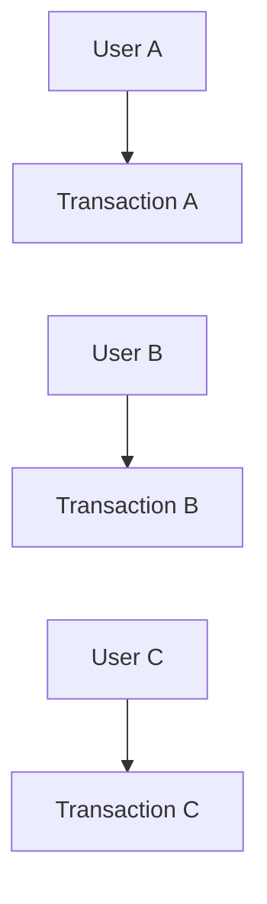

All three may access the same database at nearly the same time.

The database therefore needs rules for answering:

> **What should one transaction be allowed to see or change while other transactions are running?**

Those rules are called **transaction isolation**.

---

# 2. Why Do We Need Isolation?

Consider an account:

```text
Balance = ₹1,000
```

Two users request withdrawals at almost the same time:

```text
User A → withdraw ₹700
User B → withdraw ₹700
```

Both transactions might initially read:

```text
₹1,000
```

If the database does not properly coordinate these operations, both transactions could make decisions based on the same old value.

That could produce an invalid result.

The database therefore needs concurrency-control mechanisms.

Conceptually:

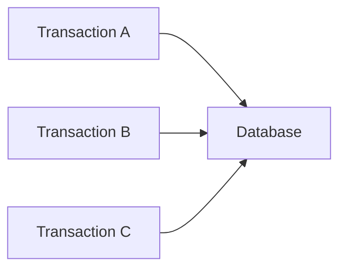

Isolation defines how these concurrent transactions interact.

---

# 3. Isolation Is About Concurrency

A useful mental model is:

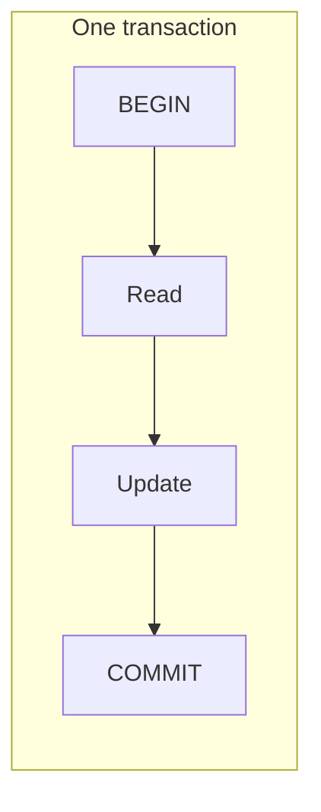

Isolation becomes important when we have:

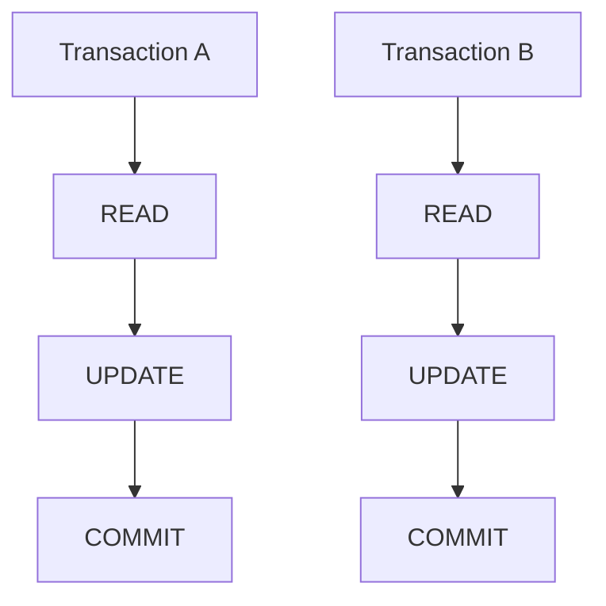

The database must coordinate these operations.

So:

> **Isolation is primarily about controlling the effects of concurrent transactions.**

---

# 4. What Does "Isolated" Mean?

The word "isolated" does not mean:

> "Every transaction must run completely alone."

That would destroy much of the benefit of concurrency.

Instead, isolation means the database provides defined rules about what one transaction can observe from other concurrent transactions.

The goal is to balance:

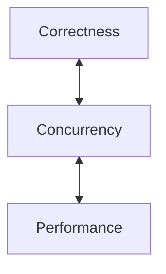

Different isolation levels make different trade-offs.

---

# 5. The Four Standard Isolation Levels

The SQL standard commonly defines four isolation levels:

```text
1. Read Uncommitted
2. Read Committed
3. Repeatable Read
4. Serializable
```

Conceptually:

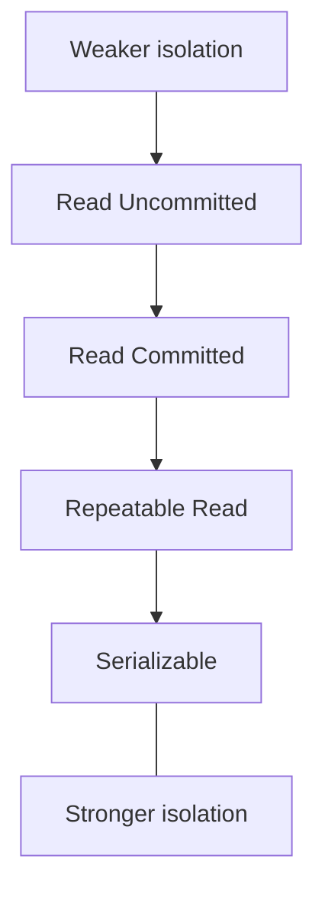

However, do not interpret this as a simple performance ladder.

Real database engines implement these levels differently.

The same isolation-level name can have different practical behavior across systems.

---

# 6. What Problems Are Isolation Levels Trying to Control?

Three classic anomalies are commonly used to explain isolation:

```text
Dirty Read
Non-Repeatable Read
Phantom Read
```

We will also examine:

```text
Lost Update
```

These examples help explain why isolation levels exist.

---

# 7. Dirty Read

A **dirty read** happens when one transaction reads data written by another transaction before that other transaction commits.

Consider:

```text
Initial balance = ₹1,000
```

Transaction A:

```text
BEGIN
UPDATE balance → ₹500
```

But A has not committed.

Transaction B:

```text
READ balance
```

If B sees:

```text
₹500
```

it has observed uncommitted data.

Now:

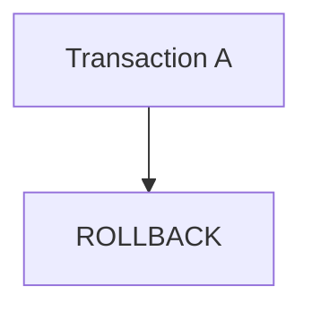

The actual committed balance returns to:

```text
₹1,000
```

Transaction B had temporarily observed a value that never became committed.

That is a dirty read.

---

# 8. Dirty Read Timeline

```text
Time →

Transaction A              Transaction B
     |                          |
BEGIN                           |
     |                          |
UPDATE balance = 500            |
     |                          |
(not committed)                 |
     |                          |
     |                       READ balance
     |                          |
     |                       sees 500
     |                          |
ROLLBACK                        |
     |                          |
balance = 1000                  |
```

The problem:

```text
B saw 500
but 500 was never committed
```

This is why dirty reads are generally undesirable for normal application logic.

---

# 9. Non-Repeatable Read

A **non-repeatable read** occurs when a transaction reads the same row twice and gets different committed values because another transaction changed and committed the row between the reads.

Suppose:

```text
Balance = ₹1,000
```

Transaction A:

```text
READ balance
→ ₹1,000
```

Transaction B:

```text
UPDATE balance = ₹500
COMMIT
```

Transaction A reads again:

```text
READ balance
→ ₹500
```

The same transaction observed two different values.

Timeline:

```text
Transaction A              Transaction B

READ → ₹1,000

                           UPDATE → ₹500
                           COMMIT

READ → ₹500
```

That is a non-repeatable read.

---

# 10. Phantom Read

A **phantom read** is different.

Instead of an existing row changing, the set of rows matching a query changes because another transaction inserts or deletes matching rows.

Suppose Transaction A executes:

```sql
SELECT *
FROM orders
WHERE customer_id = 42;
```

It receives:

```text
10 rows
```

Transaction B then inserts another matching order:

```text
customer_id = 42
```

and commits.

Transaction A repeats:

```sql
SELECT *
FROM orders
WHERE customer_id = 42;
```

Now it might receive:

```text
11 rows
```

The additional row is a **phantom row**.

---

# 11. Phantom Read Timeline

```text
Transaction A                  Transaction B

SELECT customer_id = 42
→ 10 rows

                               INSERT order
                               customer_id = 42
                               COMMIT

SELECT customer_id = 42
→ 11 rows
```

The first query returned one set of rows.

The second query returned a different set.

That is the phantom-read concept.

---

# 12. Lost Update

A **lost update** occurs when concurrent transactions overwrite each other's changes.

Suppose:

```text
Balance = ₹1,000
```

Both transactions read it.

```text
Transaction A → ₹1,000
Transaction B → ₹1,000
```

A calculates:

```text
₹1,000 - ₹200 = ₹800
```

B calculates:

```text
₹1,000 - ₹300 = ₹700
```

Then:

```text
A writes ₹800
B writes ₹700
```

The final value may be:

```text
₹700
```

The effect of A's update has effectively been lost.

---

# 13. Why Isolation Levels Exist

The anomalies we just saw come from concurrency.

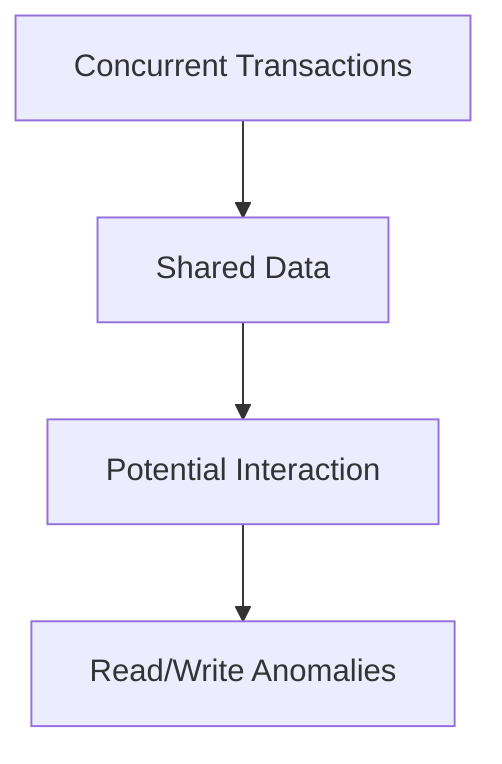

Isolation levels provide rules for managing these interactions.

The central trade-off is:

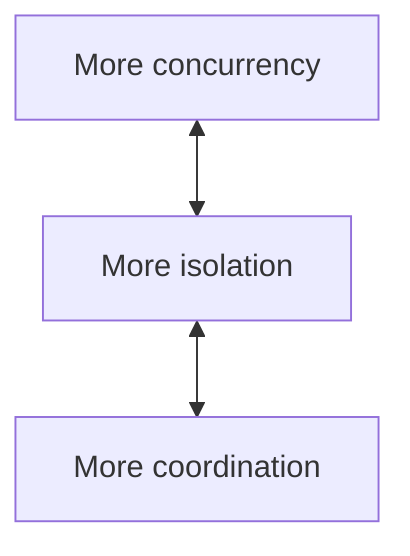

The correct choice depends on the application.

---

# 14. Read Uncommitted

**Read Uncommitted** is the weakest standard isolation level.

Conceptually, it may allow a transaction to observe changes that another transaction has not committed yet.

Therefore, dirty reads can be possible under this isolation level.

Mental model:

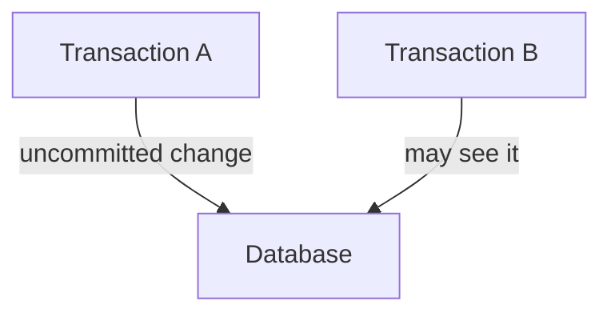

This provides weak isolation.

However, database implementations differ, and some systems do not provide truly dirty-read behavior even when this level is requested.

---

# 15. When Would Read Uncommitted Be Useful?

Very weak isolation might be acceptable for certain approximate or non-critical workloads where exact transactional consistency is not required.

For example:

```text
Approximate reporting
```

might tolerate weaker guarantees.

But using weak isolation simply because:

> "It is faster"

is poor system design.

You must understand what incorrect observations your application can tolerate.

---

# 16. Read Committed

**Read Committed** generally prevents a transaction from seeing another transaction's uncommitted changes.

Example:

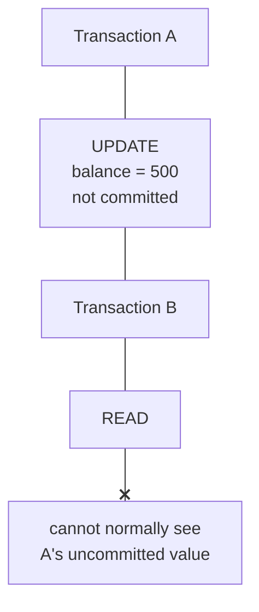

After A commits:

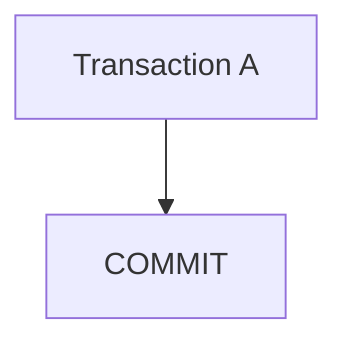

a later read by B can observe the committed value.

Read Committed is widely used because it provides useful isolation while allowing substantial concurrency.

---

# 17. Read Committed and Repeated Reads

Suppose:

```text
Initial balance = ₹1,000
```

Transaction A:

```text
READ → ₹1,000
```

Transaction B:

```text
UPDATE → ₹500
COMMIT
```

Transaction A reads again:

```text
READ → ₹500
```

Under Read Committed, this behavior can occur because each statement can see the committed state appropriate to that statement.

Therefore:

> **Read Committed does not necessarily guarantee that repeated reads inside one transaction return the same result.**

That is an important distinction.

---

# 18. Repeatable Read

**Repeatable Read** provides stronger guarantees around repeated reads.

Conceptually:

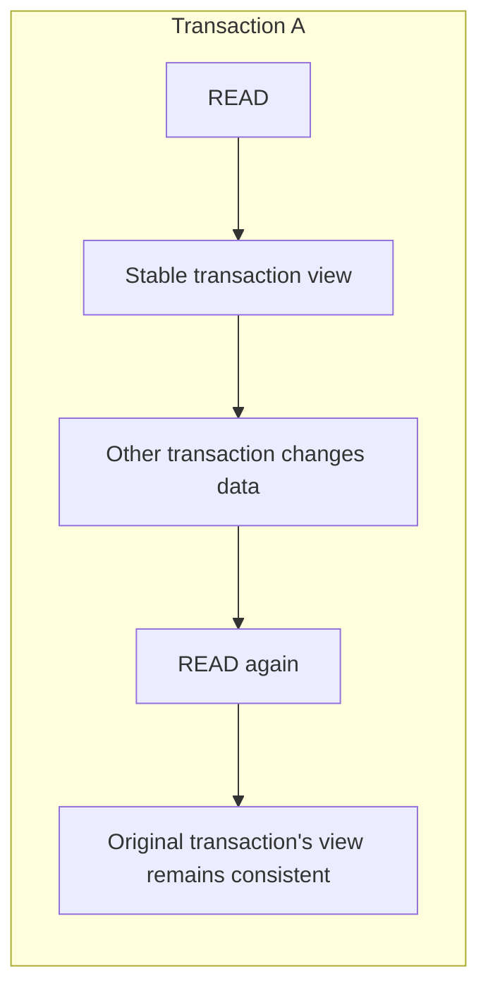

The exact behavior varies by database implementation.

For example, PostgreSQL's implementation uses MVCC and provides stronger behavior than a simplistic interpretation of the SQL standard's minimum requirements.

Therefore, always consult the specific database's documentation when relying on exact isolation semantics.

---

# 19. Serializable

**Serializable** is the strongest standard isolation level.

The goal is to make concurrent transactions behave as if they had executed in some serial order.

Suppose:

```text
Transaction A
Transaction B
```

execute concurrently.

Serializable aims to ensure the final outcome is equivalent to some valid ordering such as:

```text
A → B
```

or:

```text
B → A
```

rather than allowing an unsafe interleaving.

---

# 20. Serializable Does Not Necessarily Mean "One at a Time"

This is an important misconception.

Serializable does **not** necessarily mean:

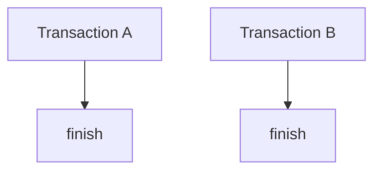

The database can still use concurrency internally.

The requirement is about the **observable correctness of the result**, not necessarily literal sequential execution.

Depending on the implementation, the database may use:

- Locks
- Predicate/range mechanisms
- MVCC
- Serialization checks
- Other concurrency-control techniques

---

# 21. Serializable and Conflicts

With Serializable isolation, a transaction may be aborted if the database detects that allowing it to commit would violate serializable behavior.

Conceptually:

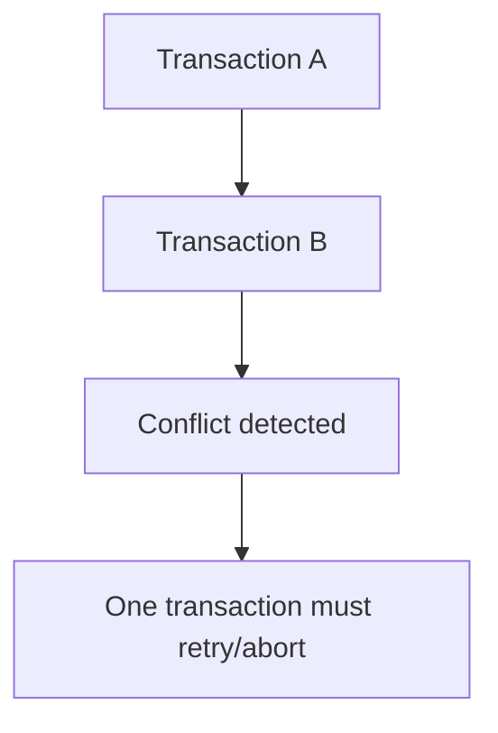

Therefore:

> **Stronger isolation can result in transaction failures that the application needs to handle.**

This is a crucial system-design consideration.

---

# 22. Isolation Level Comparison

A simplified conceptual table:

| Isolation Level | Dirty Read | Non-Repeatable Read | Phantom Read |
|---|---:|---:|---:|
| Read Uncommitted | Possible | Possible | Possible |
| Read Committed | Prevented | Possible | Possible |
| Repeatable Read | Prevented | Prevented | Database-dependent |
| Serializable | Prevented | Prevented | Prevented |

This table represents the standard conceptual model, not the exact behavior of every database engine.

**Important:** Actual behavior must be verified against the specific database implementation.

---

# 23. PostgreSQL Isolation Levels

PostgreSQL is particularly useful for learning isolation because its concurrency model is based heavily on **MVCC**.

PostgreSQL supports:

```text
Read Committed
Repeatable Read
Serializable
```

It also accepts `READ UNCOMMITTED`, but PostgreSQL treats it effectively as:

```text
READ COMMITTED
```

So PostgreSQL does not provide true dirty reads.

For PostgreSQL, the practical levels are therefore:

```text
READ COMMITTED
REPEATABLE READ
SERIALIZABLE
```

---

# 24. What Is MVCC?

**MVCC** means:

> **Multi-Version Concurrency Control**

Instead of thinking:

```text
One row
One physical value
```

think conceptually:

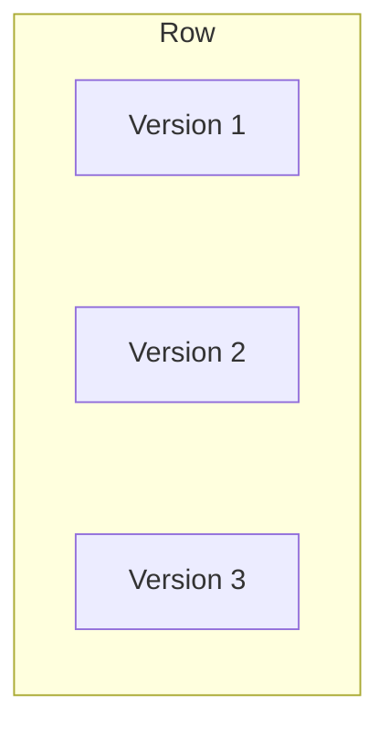

Different transactions can see appropriate versions according to the database's visibility rules.

This can allow readers and writers to operate with less direct blocking than a simplistic "everyone locks the row" model.

---

# 25. Why MVCC Exists

Without a sophisticated concurrency model, imagine:

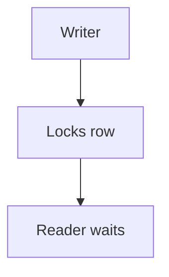

and:

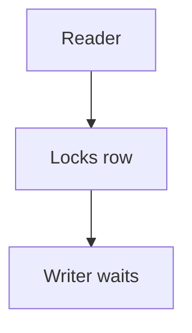

High concurrency could lead to significant blocking.

MVCC can allow certain readers to see an appropriate committed version while another transaction is modifying a newer version.

Conceptually:

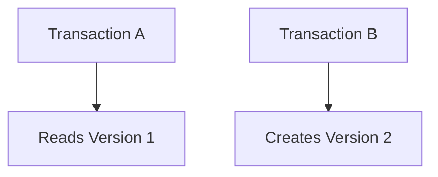

A can continue reading according to its snapshot rules while B works on the newer version.

The exact internal implementation is database-specific.

---

# 26. MVCC Does Not Mean "No Locks"

This is important.

MVCC does **not** mean:

> "PostgreSQL never uses locks."

Databases still use locks for many operations and coordination tasks.

Think of:

```text
MVCC
+
Locks
+
Transaction rules
+
Visibility rules
```

together forming the database's concurrency-control system.

---

# 27. Snapshot

A transaction may operate using a **snapshot** of database state.

Conceptually:

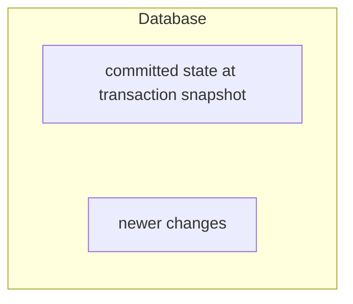

The transaction determines which versions of rows are visible according to its isolation semantics.

This helps explain why:

```text
Transaction A
READ
```

can see a different version from:

```text
Transaction B
READ
```

even while both transactions are active.

---

# 28. Read Committed in PostgreSQL

PostgreSQL's default isolation level is:

```text
READ COMMITTED
```

A useful mental model is:

> **Each statement gets a snapshot of the data as of an appropriate point when that statement begins.**

Therefore:

```mermaid
flowchart TD
  accTitle: Read Committed in PostgreSQL
  accDescr: Transaction A: statement 1 gets snapshot 1. Transaction B commits changes. Statement 2 gets snapshot 2.
  A0["Transaction A"]
  B0["Statement 1"] --> B1["Snapshot 1"]
  C0["Transaction B"] --> C1["COMMIT changes"]
  D0["Statement 2"] --> D1["Snapshot 2"]
  A0 ~~~ B0
  B1 ~~~ C0
  C1 ~~~ D0
```

The second statement can see changes committed before it began.

This is why repeated queries can return different results inside one transaction.

---

# 29. Repeatable Read in PostgreSQL

Under PostgreSQL's Repeatable Read:

```mermaid
flowchart TD
  accTitle: Repeatable Read in PostgreSQL
  accDescr: Transaction begins, then Transaction snapshot, then Statements, then Statements continue using the transaction's consistent view.
  N0["Transaction begins"] --> N1["Transaction snapshot"] --> N2["Statements"] --> N3["Statements continue using<br/>the transaction's consistent view"]
```

This provides a stronger snapshot-based view than Read Committed.

If concurrent modifications conflict with the transaction's assumptions, PostgreSQL may abort the transaction rather than allow an inconsistent result.

Therefore:

```mermaid
flowchart TD
  accTitle: Repeatable Read guarantees
  accDescr: Repeatable Read gives a stable transaction view plus conflict detection.
  N0["Repeatable Read"] --> N1["Stable transaction view<br/>+<br/>Conflict detection"]
```

---

# 30. Serializable in PostgreSQL

PostgreSQL implements Serializable using **Serializable Snapshot Isolation (SSI)**.

The goal is to provide serializable behavior while allowing significant concurrency.

The database tracks certain dependency patterns.

If a dangerous pattern is detected:

```mermaid
flowchart TD
  accTitle: Serializable in PostgreSQL
  accDescr: Transaction A and transaction B interact, a dangerous dependency forms, and a serialization failure follows.
  A["Transaction A"] <--> B["Transaction B"] --> D["Dangerous dependency"] --> F["Serialization failure"]
```

one transaction can be aborted.

The application can then retry when appropriate.

This is a good example of a broader principle:

> **Stronger correctness guarantees can move some failure handling into the application.**

---

# 31. Read Phenomena vs Actual Database Behavior

The classic anomalies are useful teaching tools.

But do not assume:

```text
"Repeatable Read means exactly the same thing everywhere."
```

or:

```text
"Serializable means the database literally locks everything."
```

Database engines use different concurrency-control mechanisms.

Therefore:

```mermaid
flowchart TD
  accTitle: Isolation in practice
  accDescr: SQL isolation level, then Database implementation, then Actual behavior.
  N0["SQL isolation level"] --> N1["Database implementation"] --> N2["Actual behavior"]
```

When designing production systems, always understand the specific database.

---

# 32. Locks

A **lock** is a mechanism used by a database to coordinate concurrent access to shared resources.

A simplified example:

```mermaid
flowchart TD
  accTitle: Taking a lock
  accDescr: Transaction A, then Lock row, then Update row.
  N0["Transaction A"] --> N1["Lock row"] --> N2["Update row"]
```

Another transaction:

```mermaid
flowchart TD
  accTitle: Meeting a lock
  accDescr: Transaction B, then Attempt conflicting operation, then Wait / conflict.
  N0["Transaction B"] --> N1["Attempt conflicting operation"] --> N2["Wait / conflict"]
```

The exact locking behavior depends on:

- Database
- Operation
- Isolation level
- Lock mode
- Indexes
- Query plan

---

# 33. Row-Level Locking

Some operations can lock specific rows rather than an entire table.

Example:

```sql
SELECT *
FROM accounts
WHERE id = 1
FOR UPDATE;
```

Conceptually:

```text
accounts

Row 1 → locked
Row 2 → available
Row 3 → available
Row 4 → available
```

This can allow unrelated rows to continue being accessed concurrently.

Row-level locking is useful when a business operation needs to safely modify a particular record.

---

# 34. Table-Level Locks

Some operations can involve broader locks.

Conceptually:

```mermaid
flowchart TD
  accTitle: Table-level lock
  accDescr: A table lock affects many rows.
  R["Table"]
  R --- K0["many rows affected"]
```

A broader lock can reduce concurrency because more operations may need to wait.

The database's lock hierarchy and compatibility rules are engine-specific.

The system-design lesson is:

> **The scope of coordination affects concurrency.**

---

# 35. Blocking

When one transaction cannot proceed because another transaction holds a conflicting lock, it may wait.

Example:

```mermaid
flowchart TD
  accTitle: Blocking
  accDescr: Transaction A locks row 100 and does work; transaction B needs row 100 and waits.
  A0["Transaction A"] --> A1["Locks row 100"] --> A2["Doing work"]
  B0["Transaction B"] --> B1["Needs row 100"] --> B2["WAIT"]
```

This is **blocking**.

Blocking is not automatically a bug.

Sometimes it is exactly what is required for correctness.

The problem occurs when blocking becomes excessive.

---

# 36. Blocking and Performance

Imagine:

```mermaid
flowchart TD
  accTitle: A slow lock holder
  accDescr: Transaction A, then Lock, then Wait 5 seconds.
  N0["Transaction A"] --> N1["Lock"] --> N2["Wait 5 seconds"]
```

Now:

```text
Transaction B → waits
Transaction C → waits
Transaction D → waits
Transaction E → waits
```

One long-running transaction can create a chain of waiting requests.

This can increase:

```text
Latency
Connection usage
Queueing
Resource consumption
```

Therefore:

> **Transaction duration can directly affect system performance.**

---

# 37. Deadlocks

A **deadlock** occurs when transactions wait for each other in a cycle.

Example:

```mermaid
flowchart TD
  accTitle: Deadlock: transaction A
  accDescr: Transaction A, then Locks Row 1, then Wants Row 2.
  N0["Transaction A"] --> N1["Locks Row 1"] --> N2["Wants Row 2"]
```

At the same time:

```mermaid
flowchart TD
  accTitle: Deadlock: transaction B
  accDescr: Transaction B, then Locks Row 2, then Wants Row 1.
  N0["Transaction B"] --> N1["Locks Row 2"] --> N2["Wants Row 1"]
```

Now:

```text
A waits for B
B waits for A
```

Diagram:

```mermaid
flowchart TD
  accTitle: Deadlock cycle
  accDescr: A wants row 2, which is locked by B; B wants row 1, which leads back to A.
  A["A"] -->|"wants"| R2["Row 2"]
  R2 -->|"locked by"| B["B"]
  B -->|"wants"| R1["Row 1"]
  R1 --> A
```

Neither can proceed.

The database must detect the deadlock and abort one transaction.

---

# 38. Deadlock Handling

A typical database strategy is:

```mermaid
flowchart TD
  accTitle: Deadlock handling
  accDescr: Transaction A and transaction B: deadlock detected, abort one transaction, other transaction continues.
  A["Transaction A"] & B["Transaction B"] --> D["Deadlock detected"] --> X["Abort one transaction"] --> C["Other transaction continues"]
```

The aborted transaction may need to be retried by the application.

This is another reason applications must be prepared for transaction failures.

---

# 39. How to Reduce Deadlocks

One useful strategy is to access resources in a consistent order.

Bad:

```text
Transaction A:
Lock User → Lock Order

Transaction B:
Lock Order → Lock User
```

Better:

```text
Transaction A:
Lock User → Lock Order

Transaction B:
Lock User → Lock Order
```

Now both follow the same ordering rule.

This does not eliminate every possible deadlock, but consistent resource ordering can reduce the risk.

Other strategies include:

- Keep transactions short
- Avoid unnecessary locks
- Access only required rows
- Avoid waiting for external services while holding locks
- Handle deadlock errors with controlled retries

---

# 40. Isolation and Locking Are Related but Not Identical

Do not treat these terms as synonyms.

### Isolation

Describes the visibility and concurrency guarantees between transactions.

### Locking

Is one mechanism databases can use to coordinate concurrent access.

### MVCC

Is another important concurrency-control mechanism.

So:

```mermaid
flowchart LR
  accTitle: Isolation mechanisms
  accDescr: Transaction isolation is provided by locks, MVCC and other mechanisms.
  R["Transaction<br/>Isolation"]
  R --- K0["Locks"]
  R --- K1["MVCC"]
  R --- K2["Other mechanisms"]
```

The exact combination depends on the database.

---

# 41. Isolation and Query Design

Poor query design can increase contention.

Suppose:

```sql
UPDATE accounts
SET balance = balance - 100
WHERE id = 1;
```

This targets one row.

Compare that with:

```sql
UPDATE accounts
SET balance = balance - 100
WHERE country = 'India';
```

The second query may affect many rows.

That can involve much more work and potentially more locking/coordination.

Therefore:

> **Query design and transaction isolation are closely connected.**

---

# 42. Isolation and Indexes

Indexes can influence how efficiently the database finds rows involved in a transaction.

Suppose:

```sql
UPDATE orders
SET status = 'paid'
WHERE customer_id = 42;
```

An appropriate index can help locate the target rows efficiently.

Without an efficient access path, the database may need to examine many rows.

Therefore:

```mermaid
flowchart TD
  accTitle: Isolation and indexes
  accDescr: Indexing, then Efficient row identification, then Less unnecessary work, then Potentially shorter transaction work.
  N0["Indexing"] --> N1["Efficient row identification"] --> N2["Less unnecessary work"] --> N3["Potentially shorter transaction work"]
```

But an index does not automatically eliminate locking or contention.

---

# 43. Isolation and Long Transactions

Consider:

```mermaid
flowchart TD
  accTitle: A long transaction
  accDescr: BEGIN, then Read, then Process large dataset, then Wait, then Update, then COMMIT.
  N0["BEGIN"] --> N1["Read"] --> N2["Process large dataset"] --> N3["Wait"] --> N4["Update"] --> N5["COMMIT"]
```

A long transaction can:

- Keep snapshots open longer
- Increase lock duration where locks are held
- Increase contention
- Increase resource usage
- Make conflicts more likely
- Complicate recovery

This is why transaction scope and isolation strategy should be designed together.

---

# 44. Choosing an Isolation Level

Do not start with:

> "Which isolation level is fastest?"

Start with:

> **"What anomalies can my application tolerate?"**

Then ask:

```mermaid
flowchart TD
  accTitle: Choosing an isolation level
  accDescr: What data is being accessed?, then What can happen concurrently?, then What must never be observed?, then What conflicts are acceptable?, then What latency/concurrency is required?, then Which isolation level provides the needed guarantees?.
  N0["What data is being accessed?"] --> N1["What can happen concurrently?"] --> N2["What must never be observed?"] --> N3["What conflicts are acceptable?"] --> N4["What latency/concurrency is required?"] --> N5["Which isolation level provides the needed guarantees?"]
```

---

# 45. Example — Product Catalog

Suppose users are browsing products:

```mermaid
flowchart TD
  accTitle: Product catalog
  accDescr: User, then Product Catalog, then Database.
  N0["User"] --> N1["Product Catalog"] --> N2["Database"]
```

Most operations are reads.

The application may not need the strongest possible transaction isolation for every product-view query.

A common approach might use:

```text
READ COMMITTED
```

or even avoid explicit multi-statement transactions for simple reads.

The exact choice depends on the consistency requirements.

---

# 46. Example — Bank Balance Update

Now consider:

```text
Withdraw money
```

The system must carefully coordinate concurrent updates.

A stronger concurrency-control strategy may be necessary.

Possible techniques include:

```text
Transaction
+
Appropriate isolation
+
Row locking
+
Constraints
+
Conflict handling
```

The important lesson is not:

> "Always use Serializable."

The lesson is:

> **Use the guarantees required by the business operation.**

---

# 47. Example — Inventory

Suppose:

```text
Product stock = 1
```

Two customers attempt to buy the final item simultaneously.

```text
Customer A → Buy 1
Customer B → Buy 1
```

The system must prevent both transactions from successfully claiming the same single unit.

Possible approaches include:

```text
Transaction
+
Atomic update
+
Conditional update
+
Row locking
+
Appropriate isolation
```

For example:

```sql
UPDATE products
SET stock = stock - 1
WHERE id = 100
  AND stock > 0;
```

The application can inspect the number of affected rows.

This can sometimes be preferable to reading the stock first and then updating it separately.

The key lesson:

> **Good concurrency control often combines transaction semantics with carefully designed SQL.**

---

# 48. Isolation Is Not a Replacement for Constraints

Suppose:

```text
email must be unique
```

Do not rely only on application code:

```mermaid
flowchart TD
  accTitle: Check-then-insert
  accDescr: Check email, then No match, then Insert.
  N0["Check email"] --> N1["No match"] --> N2["Insert"]
```

Two concurrent requests can both perform the check.

Instead, enforce the rule in the database:

```sql
email VARCHAR(255) UNIQUE
```

Then:

```text
Application validation
        +
Database constraint
```

provide stronger protection.

Isolation and constraints solve related but different problems.

---

# 49. Isolation and Application Retries

Some databases can abort transactions because of:

```text
Deadlock
Serialization conflict
Transient failure
```

The application may retry.

A safe retry pattern is conceptually:

```mermaid
flowchart TD
  accTitle: Retrying a transaction
  accDescr: Attempt transaction. Success? Yes: return success. No: retry if retryable.
  A["Attempt transaction"] --> S{"Success?"}
  S -->|"YES"| R["Return<br/>success"]
  S -->|"NO"| T["Retry if<br/>retryable"]
```

But retries must have:

- Maximum attempts
- Backoff
- Time limits
- Idempotent behavior where appropriate

Otherwise:

```mermaid
flowchart TD
  accTitle: Retrying without limits
  accDescr: Failure, then Immediate retry, then Failure, then Immediate retry, then Database overload.
  N0["Failure"] --> N1["Immediate retry"] --> N2["Failure"] --> N3["Immediate retry"] --> N4["Database overload"]
```

This connects transaction design to the retry-storm concepts covered earlier.

---

# 50. Isolation and Idempotency

Suppose an application retries:

```text
Create Order
```

after a transaction failure.

If the request is not safely retryable, the application could accidentally create duplicate orders.

Therefore:

```text
Transactions
+
Retries
+
Idempotency
```

often need to be considered together.

A database transaction can protect atomicity inside the database.

Idempotency can help ensure repeated attempts represent the same logical operation.

---

# 51. Hands-On Lab — Isolation Levels

This lab uses PostgreSQL.

You will need **two SQL sessions** connected to the same database.

For example:

```text
Session A
psql / pgAdmin Query Tool 1

Session B
psql / pgAdmin Query Tool 2
```

This is important because we need two concurrent transactions.

---

# 52. Step 1 — Create the Database

```sql
CREATE DATABASE systemly_isolation_lab;
```

Connect to it.

---

# 53. Step 2 — Create the Accounts Table

```sql
CREATE TABLE accounts (
    id BIGSERIAL PRIMARY KEY,
    owner_name VARCHAR(100) NOT NULL,
    balance NUMERIC(12, 2) NOT NULL
);
```

Insert:

```sql
INSERT INTO accounts (owner_name, balance)
VALUES
    ('Alice', 1000.00),
    ('Bob', 1000.00);
```

Verify:

```sql
SELECT *
FROM accounts;
```

---

# 54. Step 3 — Check PostgreSQL's Current Isolation Level

Run:

```sql
SHOW transaction_isolation;
```

You will normally see:

```text
read committed
```

This is PostgreSQL's default transaction isolation level.

---

# 55. Step 4 — Observe Read Committed

### Session A

Run:

```sql
BEGIN;

SELECT balance
FROM accounts
WHERE owner_name = 'Alice';
```

You should see:

```text
1000.00
```

Do not commit yet.

### Session B

Run:

```sql
BEGIN;

UPDATE accounts
SET balance = 500
WHERE owner_name = 'Alice';

COMMIT;
```

### Session A

Run again:

```sql
SELECT balance
FROM accounts
WHERE owner_name = 'Alice';
```

Under PostgreSQL's Read Committed behavior, Session A can now see the committed change:

```text
500.00
```

This demonstrates that two statements in the same transaction can observe different committed states.

Finish:

```sql
COMMIT;
```

---

# 56. Step 5 — Observe Repeatable Read

Reset the data:

```sql
UPDATE accounts
SET balance = 1000
WHERE owner_name = 'Alice';
```

### Session A

```sql
BEGIN ISOLATION LEVEL REPEATABLE READ;

SELECT balance
FROM accounts
WHERE owner_name = 'Alice';
```

Result:

```text
1000.00
```

### Session B

```sql
BEGIN;

UPDATE accounts
SET balance = 500
WHERE owner_name = 'Alice';

COMMIT;
```

### Session A

Run:

```sql
SELECT balance
FROM accounts
WHERE owner_name = 'Alice';
```

The transaction's snapshot behavior means Session A continues to see the appropriate consistent view from its transaction.

The exact observed behavior should be tested in your PostgreSQL environment.

Then:

```sql
COMMIT;
```

---

# 57. Step 6 — Observe Row Locking

Reset:

```sql
UPDATE accounts
SET balance = 1000
WHERE owner_name = 'Alice';
```

### Session A

```sql
BEGIN;

SELECT *
FROM accounts
WHERE owner_name = 'Alice'
FOR UPDATE;
```

Session A now holds a row-level lock appropriate to the operation.

Do not commit yet.

### Session B

Try:

```sql
BEGIN;

UPDATE accounts
SET balance = 900
WHERE owner_name = 'Alice';
```

Depending on the exact environment, Session B will wait for the conflicting lock.

Now return to Session A:

```sql
COMMIT;
```

Session B can proceed according to PostgreSQL's locking rules.

Then:

```sql
COMMIT;
```

---

# 58. Step 7 — Observe Deadlock Conceptually

Using two sessions:

### Session A

```sql
BEGIN;

SELECT *
FROM accounts
WHERE id = 1
FOR UPDATE;
```

### Session B

```sql
BEGIN;

SELECT *
FROM accounts
WHERE id = 2
FOR UPDATE;
```

Now:

### Session A

```sql
SELECT *
FROM accounts
WHERE id = 2
FOR UPDATE;
```

Session A waits.

Then:

### Session B

```sql
SELECT *
FROM accounts
WHERE id = 1
FOR UPDATE;
```

Now you have:

```text
A holds Row 1
A waits for Row 2

B holds Row 2
B waits for Row 1
```

Conceptually:

```text
A → waits for B
B → waits for A
```

PostgreSQL should detect the deadlock and abort one transaction.

The surviving transaction can then complete.

---

# 59. Isolation Lab Questions

After running the experiments, answer:

### Question 1

Why could Session A observe a newer value under Read Committed?

### Question 2

Why does Repeatable Read provide a more stable view?

### Question 3

What happened when `FOR UPDATE` was used?

### Question 4

Why did the second transaction wait?

### Question 5

Why did PostgreSQL need to abort one transaction in the deadlock experiment?

### Question 6

What would happen if the application automatically retried the aborted transaction?

These questions turn the experiments into system-design reasoning.

---

# 60. Practical Isolation Decision Framework

Use this reasoning process:

```mermaid
flowchart TD
  accTitle: Practical isolation decision framework
  accDescr: Business Operation, then What data is shared?, then What concurrent operations are possible?, then Which anomalies are unacceptable?, then Can SQL design avoid the race?, then Do constraints help?, then Is locking required?, then What isolation level is required?, then What happens if the transaction conflicts?, then Can the operation safely retry?.
  N0["Business Operation"] --> N1["What data is shared?"] --> N2["What concurrent operations are possible?"] --> N3["Which anomalies are unacceptable?"] --> N4["Can SQL design avoid the race?"] --> N5["Do constraints help?"] --> N6["Is locking required?"] --> N7["What isolation level is required?"] --> N8["What happens if the transaction conflicts?"] --> N9["Can the operation safely retry?"]
```

This is more useful than memorizing:

```text
"Use Serializable."
```

---

# 61. Common Isolation Mistakes

### Mistake 1 — Assuming transactions automatically prevent races

They do not.

Isolation and concurrency behavior matter.

---

### Mistake 2 — Assuming stronger isolation is always better

Stronger guarantees can introduce more conflicts, waiting, or transaction aborts.

---

### Mistake 3 — Ignoring database-specific behavior

Isolation-level names do not guarantee identical implementation behavior across databases.

---

### Mistake 4 — Holding locks unnecessarily

Unnecessary locks increase contention.

---

### Mistake 5 — Keeping transactions open while calling external services

This can hold resources while waiting for systems outside the database.

---

### Mistake 6 — Ignoring deadlocks

Concurrent transactions can form dependency cycles.

---

### Mistake 7 — Retrying without limits

Uncontrolled retries can create additional load.

---

### Mistake 8 — Solving every concurrency problem with higher isolation

Sometimes better SQL, constraints, atomic updates, or explicit locking are more appropriate.

---

### Mistake 9 — Forgetting idempotency

Retries can create duplicate business operations if the operation is not designed to be safely repeated.

---

# 62. Isolation and the Bigger System

Isolation is one part of a larger database architecture:

```mermaid
flowchart TD
  accTitle: Isolation in the stack
  accDescr: Application, then Connection Pool, then Transactions, then Isolation, then Locks / MVCC, then Indexes, then Storage.
  N0["Application"] --> N1["Connection Pool"] --> N2["Transactions"] --> N3["Isolation"] --> N4["Locks / MVCC"] --> N5["Indexes"] --> N6["Storage"]
```

At larger scale:

```mermaid
flowchart TD
  accTitle: Beyond one database
  accDescr: Application, then Primary Database, then Replication, then Read Replicas, then Partitioning, then Sharding.
  N0["Application"] --> N1["Primary Database"] --> N2["Replication"] --> N3["Read Replicas"] --> N4["Partitioning"] --> N5["Sharding"]
```

Each layer introduces additional trade-offs.

This is why database architecture cannot be designed by looking at SQL statements alone.

---

# 63. Isolation and Scalability

Suppose a database receives:

```text
10 transactions/sec
```

Then:

```text
1,000 transactions/sec
```

Then:

```text
100,000 transactions/sec
```

As concurrency increases:

```mermaid
flowchart TD
  accTitle: Isolation and scalability
  accDescr: More transactions, then More shared data, then More potential conflicts, then More coordination, then More contention.
  N0["More transactions"] --> N1["More shared data"] --> N2["More potential conflicts"] --> N3["More coordination"] --> N4["More contention"]
```

The system may eventually need:

- Better query design
- Better indexes
- Shorter transactions
- Partitioning
- Application-level coordination
- Queue-based processing
- Data ownership changes
- Different storage strategies

Isolation is therefore part of scalability planning.

---

# 64. A Practical Mental Model

When you see:

```text
Transaction A
Transaction B
```

ask four questions:

```text
1. What are they reading?

2. What are they writing?

3. Can they overlap?

4. What must never happen?
```

Then determine:

```text
SQL design
+
Constraints
+
Isolation
+
Locks
+
Retry strategy
```

This is a much stronger approach than starting with the isolation-level name.

---

# 65. The Most Important Isolation Question

Do not ask:

> "Which isolation level is the strongest?"

Ask:

> **"What concurrent behavior must this business operation prevent, and what level of coordination is acceptable to achieve that?"**

For example:

```text
Inventory = 1
```

Two customers want the last item.

Your requirement may be:

```text
Never sell the same inventory unit twice.
```

That requirement drives the concurrency strategy.

The solution may involve:

```text
Atomic SQL update
+
Constraint
+
Transaction
+
Appropriate locking/isolation
```

The exact solution depends on the system.

---

# 66. Key Principle

> **Isolation defines how concurrent transactions interact and what each transaction is allowed to observe. Higher isolation can provide stronger guarantees, but may increase coordination, contention, or transaction failures. Good database design chooses the smallest amount of isolation and coordination necessary to preserve the application's correctness.**

---

# 67. Quick Reference

### Isolation Levels

```mermaid
flowchart TD
  accTitle: Isolation levels
  accDescr: Read Uncommitted, then Weakest standard isolation, then Read Committed, then Repeatable Read, then Serializable, then Strongest standard isolation.
  N0["Read Uncommitted"] --> N1["Weakest standard isolation"] --> N2["Read Committed"] --> N3["Repeatable Read"] --> N4["Serializable"] --> N5["Strongest standard isolation"]
```

### Common anomalies

```text
Dirty Read
→ See another transaction's uncommitted data

Non-Repeatable Read
→ Same row can produce different committed values

Phantom Read
→ Repeated query can return a different set of rows

Lost Update
→ One concurrent update overwrites another
```

### Concurrency mechanisms

```text
Isolation
+
MVCC
+
Locks
+
Constraints
+
Good SQL
+
Retry handling
```

---

# 68. Knowledge Check

### Question 1

What problem does transaction isolation solve?

**Answer:**  
It defines how concurrent transactions interact and what changes one transaction can observe from other transactions.

---

### Question 2

What is a dirty read?

**Answer:**  
Reading data written by another transaction before that transaction has committed.

---

### Question 3

What is a non-repeatable read?

**Answer:**  
Reading the same row twice within a transaction and seeing a different committed value because another transaction changed it between the reads.

---

### Question 4

What is a phantom read?

**Answer:**  
A repeated query returns a different set of matching rows because another transaction inserted or deleted rows that match the query.

---

### Question 5

What is MVCC?

**Answer:**  
Multi-Version Concurrency Control, a concurrency-control approach that maintains multiple row versions so transactions can see appropriate versions according to visibility rules.

---

### Question 6

Does MVCC mean databases never use locks?

**Answer:**  
No. MVCC and locking can coexist and serve different concurrency-control purposes.

---

### Question 7

Why can Serializable transactions fail?

**Answer:**  
The database may detect that allowing a transaction to commit would violate serializable behavior and abort it so the application can retry.

---

### Question 8

Why can deadlocks occur?

**Answer:**  
Two or more transactions can each hold resources the others need, creating a circular dependency.

---

### Question 9

Why isn't stronger isolation always better?

**Answer:**  
Stronger guarantees can require more coordination and may increase contention, waiting, or transaction aborts.

---

### Question 10

What should determine your isolation strategy?

**Answer:**  
The application's correctness requirements, concurrency patterns, acceptable anomalies, database behavior, query design, and performance requirements.

---

# 70. Remember

The most useful way to think about isolation is not:

```text
Read Committed
Repeatable Read
Serializable
```

as a list to memorize.

Instead, think:

```mermaid
flowchart TD
  accTitle: Remember
  accDescr: Concurrent Transactions, then Shared Data, then Possible Conflicts, then Required Guarantees, then Isolation / Locking / MVCC, then Transaction Result.
  N0["Concurrent Transactions"] --> N1["Shared Data"] --> N2["Possible Conflicts"] --> N3["Required Guarantees"] --> N4["Isolation / Locking / MVCC"] --> N5["Transaction Result"]
```

And always remember:

> **Transactions protect units of work. Isolation controls how concurrent units of work interact.**

---

# 71. Next Chapter

## 04.10 — Database Replication

Next we will move from **concurrent transactions inside a database** to **multiple database copies**.

We will learn:

- Why databases are replicated
- Primary and replica architecture
- Replication flow
- Synchronous vs asynchronous replication
- Replication lag
- Read replicas
- Read-after-write consistency
- Failover
- Replica promotion
- Replication and durability
- Replication vs backup
- Scaling reads with replicas
- Failure scenarios
- Replication trade-offs
- Practical PostgreSQL replication concepts
