# 04.10 — Database Replication

## Learning Objectives

By the end of this chapter, you should understand:

- What database replication is
- Why databases are replicated
- Primary and replica databases
- Synchronous vs asynchronous replication
- How database changes are propagated
- Replication lag
- Read-after-write problems
- Read replicas
- Failover and replica promotion
- Replication vs backup
- Replication and high availability
- Replication and read scaling
- Replication consistency trade-offs
- Common replication failure scenarios
- How applications interact with replicated databases
- When replication helps and when it does not

---

# 1. What Is Database Replication?

**Database replication** is the process of maintaining copies of database state on multiple database servers.

Instead of having:

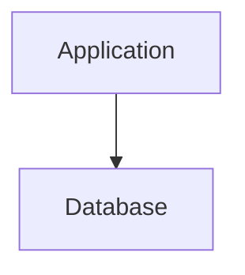

we can have:

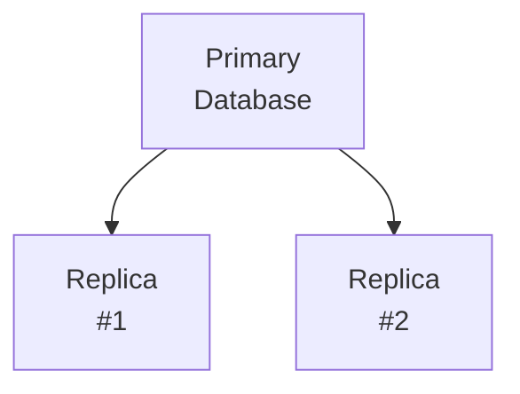

The important question is:

> **Why do we need multiple copies?**

Replication is commonly used for:

- availability
- failover
- read scaling
- geographic distribution
- reducing load on the primary
- operational resilience

Replication does **not** automatically solve every scaling or reliability problem.

---

# 2. Why Does Database Replication Exist?

Imagine an application with one database:

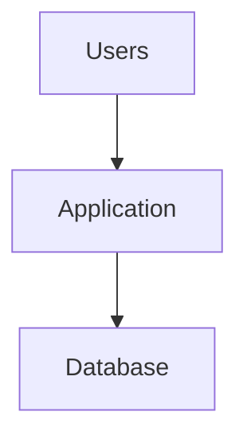

At small scale, this can work very well.

Eventually, however, the database may become:

- heavily loaded
- difficult to take offline
- a single point of failure
- overloaded by read traffic
- geographically far from some users

Replication allows additional database servers to maintain copies of the data.

For example:

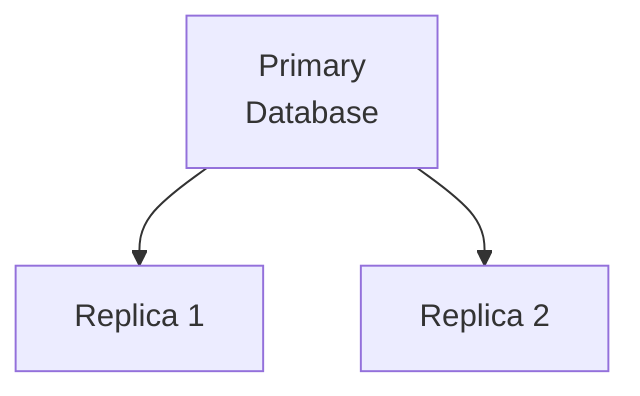

Different responsibilities can then be distributed.

For example:

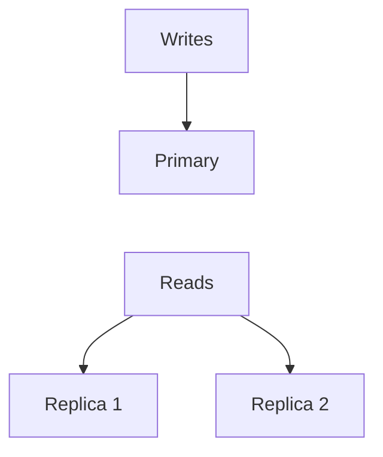

This can reduce pressure on the primary.

---

# 3. Replication Is Copying Database State, Not Creating Independent Databases

A common misunderstanding is:

> "If I have three databases, I have three independent databases."

That is usually not what replication means.

The replicas are maintained from another database.

Conceptually:

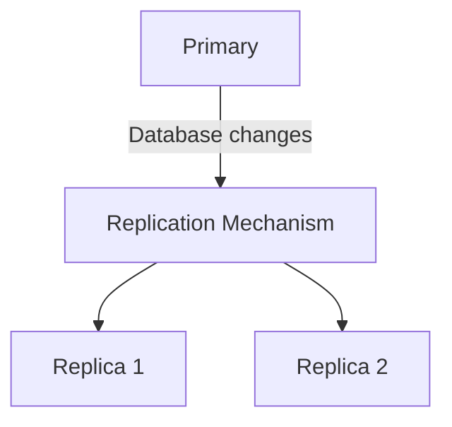

The replicas are intended to represent the same logical dataset.

However, they may not contain exactly the same state at exactly the same moment.

That leads to one of the most important concepts in replication:

> **Replication lag.**

---

# 4. Primary and Replica

A common replication architecture uses two roles.

## Primary

The **primary** is the database server that normally accepts authoritative writes.

For example:

```text
INSERT
UPDATE
DELETE
```

may be directed to the primary.

## Replica

A **replica** receives replicated database changes and maintains another copy of the data.

A replica may be used for:

- read queries
- failover
- reporting
- analytics
- geographic distribution

A simplified architecture:

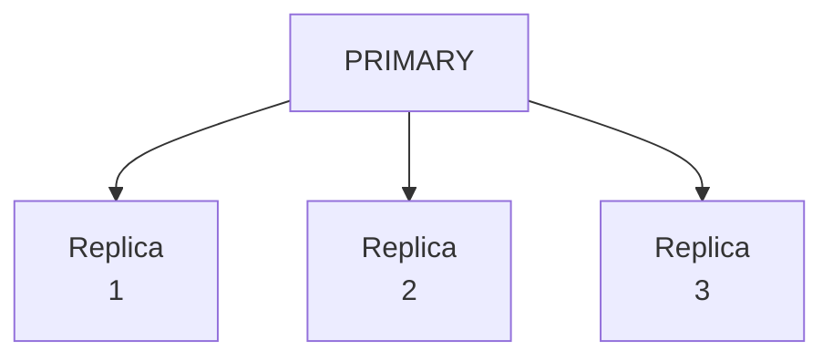

You may also encounter terminology such as:

- master / slave
- leader / follower

Modern documentation commonly prefers:

- primary / replica
- leader / follower

The exact terminology depends on the database technology.

---

# 5. How Does Replication Work?

A database does not normally copy the entire database after every change.

That would be extremely inefficient.

Instead, database systems generally propagate information about database changes.

The exact mechanism depends on the database system.

Conceptually:

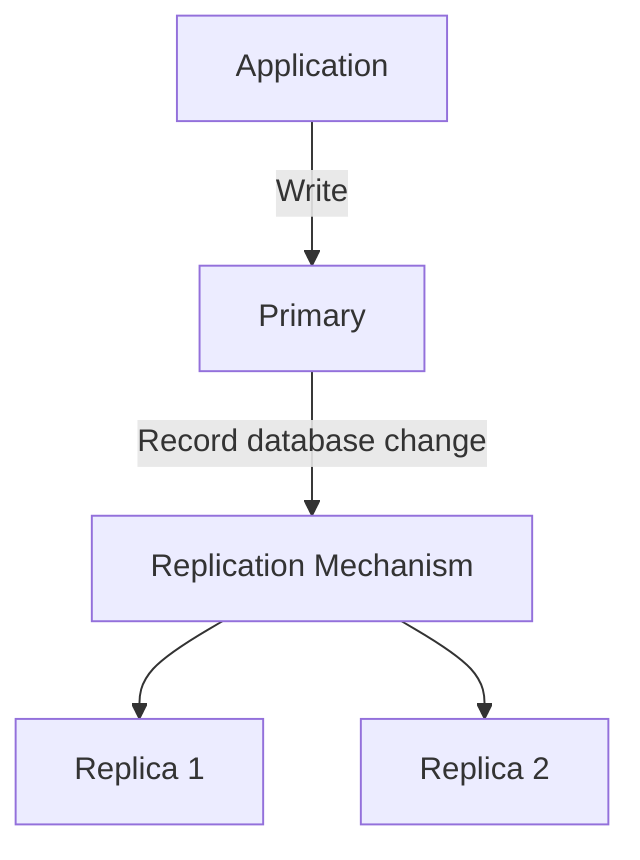

For example, PostgreSQL uses mechanisms involving its write-ahead log (WAL) to support physical replication.

Other database systems use different mechanisms and terminology.

The architectural idea is more important at this stage:

> **The primary produces database changes, and replicas consume those changes to maintain copies of database state.**

---

# 6. Why Not Simply Copy the Database?

Suppose we have a 5 TB database.

If we copied the entire database after every small update:

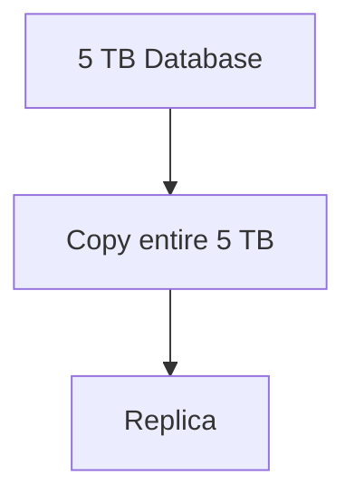

that would be extremely inefficient.

Instead, replication mechanisms propagate changes.

For example, conceptually:

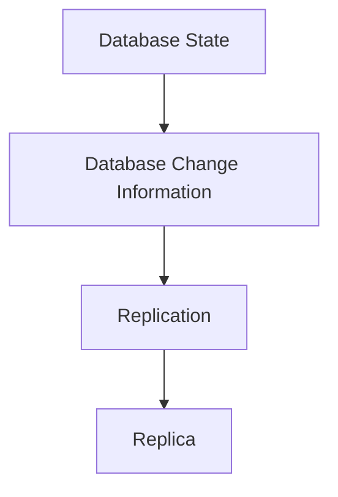

The exact representation of the changes depends on the replication technology.

The important concept is:

> **Replication continuously propagates database changes rather than repeatedly rebuilding the entire database for every write.**

---

# 7. Replication Is Usually Continuous

Replication is normally an ongoing process.

Conceptually:

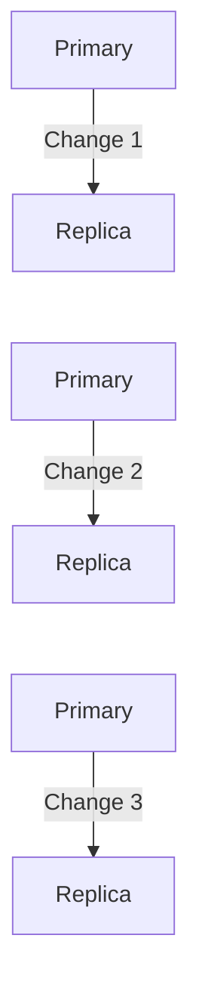

The replica continuously receives and applies changes.

This creates a moving relationship between primary and replica.

---

# 8. Synchronous Replication

There are different ways to determine when a write can be considered successfully replicated.

One approach is **synchronous replication**.

Conceptually:

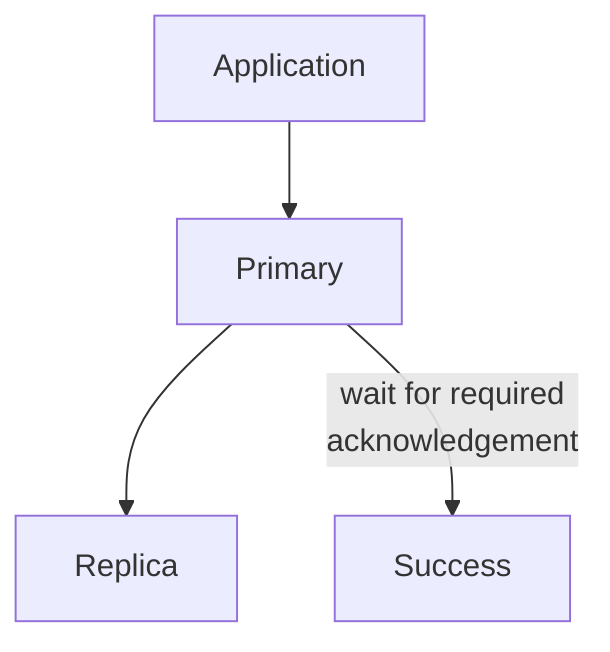

The primary waits for the required replica acknowledgement before confirming the write to the application.

This can provide stronger replication guarantees.

For example:

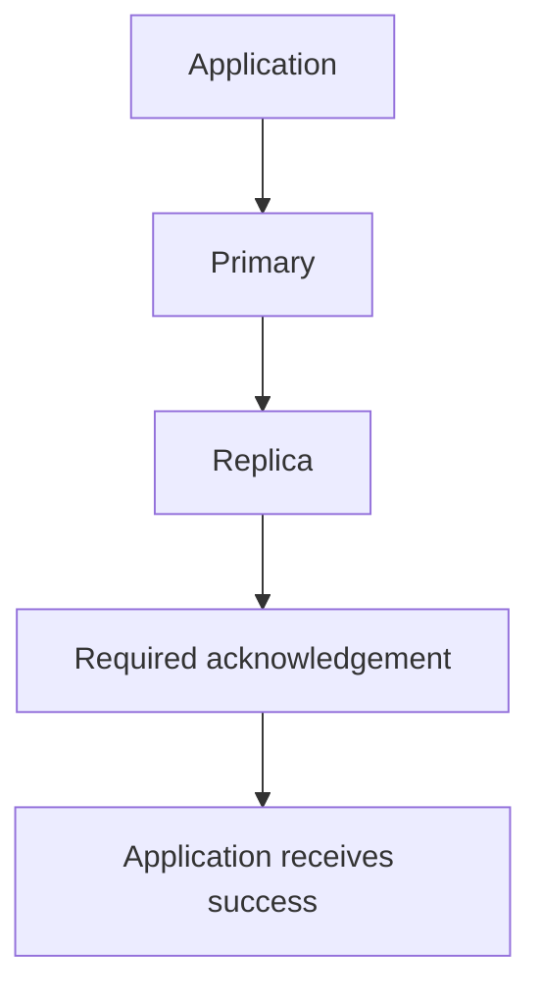

The benefit is that the system can reduce the chance that a successfully acknowledged write exists only on the primary.

But there is a cost.

The write may take longer because the primary must coordinate with another server.

---

# 9. Asynchronous Replication

Another common approach is **asynchronous replication**.

Conceptually:

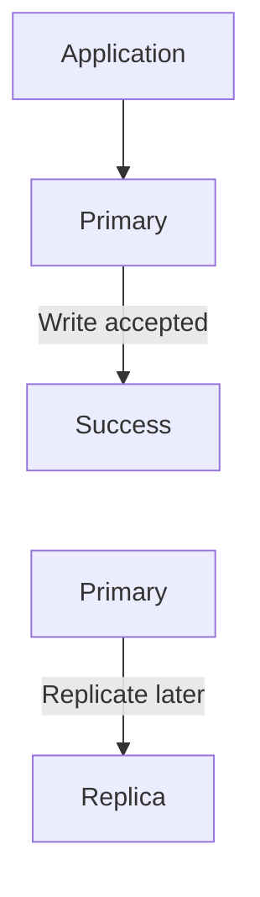

The primary does not necessarily wait for the replica to confirm the change before responding to the application.

This can reduce write latency.

But it introduces a window where:

```text
Primary = New State

Replica = Older State
```

That difference is called:

> **Replication lag**

---

# 10. Synchronous vs Asynchronous Replication

| Property | Synchronous | Asynchronous |
|---|---|---|
| Primary waits for required replica acknowledgement | Yes | Usually no |
| Write latency | Can increase | Usually lower |
| Replica can temporarily lag | Reduced/depends on configuration | Yes |
| Consistency guarantees | Potentially stronger | Potentially weaker |
| Network dependency in write path | Greater | Lower |
| Failure behavior | More coordination required | Primary may continue without replica |
| Operational complexity | Higher | Still significant |

There is no universal winner.

The appropriate choice depends on the system's requirements.

---

# 11. What Is Replication Lag?

Suppose the primary contains:

```text
Users
-----
Alice
Bob
Charlie
David
```

A replica is still processing changes and contains:

```text
Users
-----
Alice
Bob
Charlie
```

The replica is behind the primary.

That difference is:

> **Replication lag**

Conceptually:

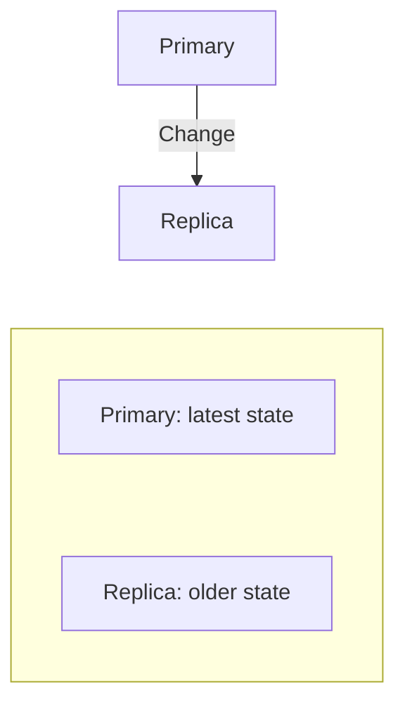

Replication lag can be:

- milliseconds
- seconds
- minutes
- or potentially much longer during serious problems

depending on the system and failure conditions.

---

# 12. Why Does Replication Lag Matter?

Imagine a user changes their email address.

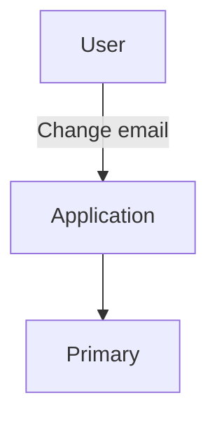

The write succeeds.

Immediately afterward, the application reads the user's profile from a replica:

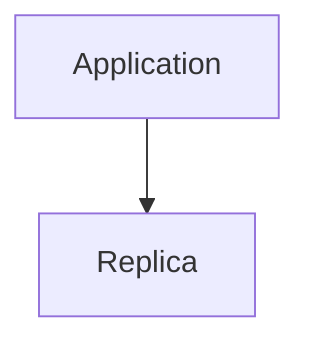

The replica may not have applied the update yet.

The user may therefore see the old email address.

The sequence becomes:

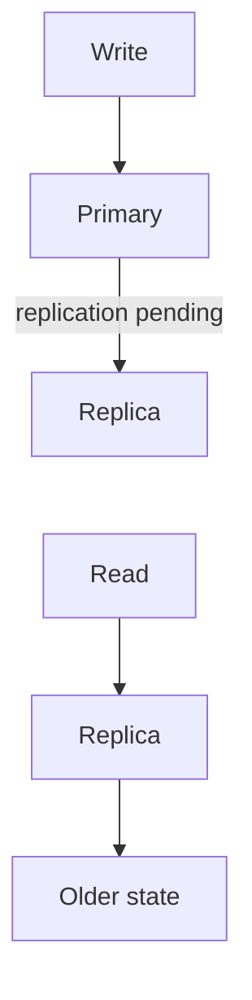

The write succeeded.

The read returned older data.

This is one of the most important consequences of asynchronous replication.

---

# 13. Read-After-Write Consistency

Suppose:

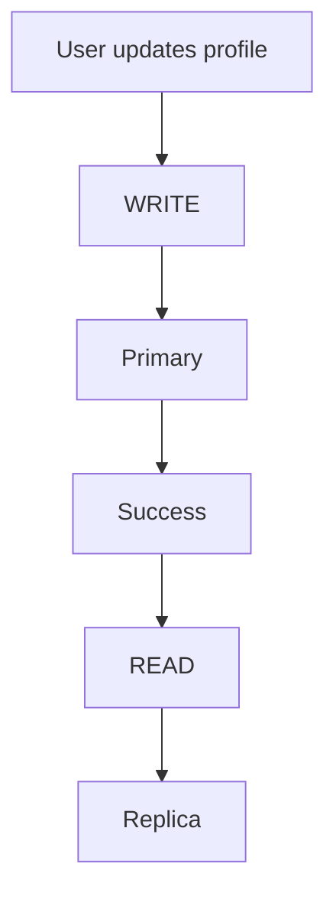

The user naturally expects:

> "I just changed this value, so my next read should show the new value."

But with asynchronous replication, the replica may not have caught up.

Therefore:

```text
Successful write
      ≠
Immediate visibility on every replica
```

This is often called a **read-after-write consistency** problem.

---

# 14. A Simple Strategy: Read From Primary After a Write

One simple strategy is:

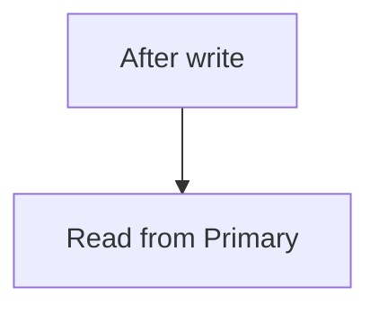

For example:

```mermaid
flowchart TD
  accTitle: Reading your own write
  accDescr: Write request, then Primary, then Success, then Read request, then Primary.
  N0["Write request"] --> N1["Primary"] --> N2["Success"] --> N3["Read request"] --> N4["Primary"]
```

This avoids reading stale replica data immediately after the write.

But it increases primary read traffic.

Therefore, applications need deliberate routing rules rather than blindly sending every read to replicas.

---

# 15. Read Routing

A common architecture separates reads and writes.

```mermaid
flowchart TD
  accTitle: Read routing
  accDescr: The application sends WRITE to the primary and READ to the replicas, replica 1 and replica 2.
  A["Application"] -->|"WRITE"| P["Primary"]
  A -->|"READ"| R["Replicas"] --> R1["Replica 1"] & R2["Replica 2"]
```

This is often called:

> **Read/write splitting**

For example:

```text
INSERT → Primary

UPDATE → Primary

DELETE → Primary

SELECT → Replica
```

But this is only a simplified rule.

Some reads must go to the primary because they require the latest state.

---

# 16. Not Every Read Can Go to a Replica

Consider an online shopping application.

The user places an order:

```mermaid
flowchart TD
  accTitle: A write request
  accDescr: POST /orders, then Primary.
  N0["POST /orders"] --> N1["Primary"]
```

Immediately afterward:

```text
GET /orders/123
```

If this request goes to a lagging replica, the order may temporarily appear missing.

Therefore:

```mermaid
flowchart TD
  accTitle: Read after creating an order
  accDescr: Write order goes to the primary; immediately reading the order may require the primary.
  A0["Write order"] --> A1["Primary"]
  B0["Immediately read order"] --> B1["Primary may be required"]
  A1 ~~~ B0
```

But a product catalog query such as:

```sql
SELECT *
FROM products;
```

may tolerate a small amount of staleness.

That query could potentially use a replica.

This leads to an important system-design question:

> **Which data can tolerate stale reads, and which data cannot?**

---

# 17. Replicas Are Not Universally Read-Only

In many common architectures, replicas are configured primarily for reading.

Conceptually:

```mermaid
flowchart TD
  accTitle: Read-only replicas
  accDescr: The primary handles writes and reads; a replica handles reads.
  P["Primary"] --- PW["Writes"] & PR["Reads"]
  R["Replica"] --- RR["Reads"]
```

But "replica" does not universally mean "cannot accept writes."

Different database technologies support different replication models and write behaviors.

The important architectural rule is:

> **Understand the specific database's replication model instead of assuming every replica behaves the same way.**

---

# 18. Why Use Replicas for Read Scaling?

Suppose an application receives:

```text
10,000 reads/sec
1,000 writes/sec
```

The database may be spending most of its capacity serving reads.

A single primary might become overloaded.

Replication can distribute some read traffic:

```mermaid
flowchart TD
  accTitle: Read scaling
  accDescr: Writes go to the primary, which replicates to R1, R2 and R3; reads go to R1, R2 and R3.
  W["Writes"] --> P["Primary"]
  P --> G
  subgraph G[" "]
    direction TB
    subgraph C1[" "]
      direction RL
      D1["Reads"] --> R1["R1"]
    end
    subgraph C2[" "]
      direction RL
      D2["Reads"] --> R2["R2"]
    end
    subgraph C3[" "]
      direction RL
      D3["Reads"] --> R3["R3"]
    end
    C1 ~~~ C2 ~~~ C3
  end
```

The primary handles writes.

Replicas handle selected reads.

This can increase read capacity.

---

# 19. Replication Does Not Automatically Scale Writes

This distinction is extremely important.

Suppose:

```text
Writes = 5,000/sec
Reads  = 50,000/sec
```

Adding replicas can help distribute reads.

But:

```mermaid
flowchart TD
  accTitle: Writes still go to one primary
  accDescr: Writes, then Primary.
  N0["Writes"] --> N1["Primary"]
```

may still be the bottleneck.

Adding more read replicas does not automatically create independent write capacity.

Write scaling is a different problem and may eventually involve:

- partitioning
- sharding
- workload separation
- data-model changes
- multiple write partitions

These topics come later.

For now:

> **Replication commonly improves read scalability, but does not automatically solve write scalability.**

---

# 20. Replication and High Availability

Replication can also reduce the impact of database server failure.

Without replication:

```mermaid
flowchart TD
  accTitle: Primary failure
  accDescr: The application uses the primary, which fails.
  A["Application"] --> P["Primary"] --x F["Failure"]
```

The application may lose database access.

With a replica:

```mermaid
flowchart TD
  accTitle: Primary and replica
  accDescr: Primary, then Replica.
  N0["Primary"] --> N1["Replica"]
```

If the primary fails, the replica may be promoted.

```mermaid
flowchart TD
  accTitle: Promotion
  accDescr: The primary fails; the replica is promoted to primary.
  P["Primary"] --x F["Failure"] --> R["Replica"] --> N["Promoted Primary"]
```

This is called:

> **Failover**

---

# 21. What Is Failover?

**Failover** is the process of moving database responsibility from a failed or unhealthy server to another suitable server.

Before:

```mermaid
flowchart TD
  accTitle: Before failover
  accDescr: Application, then Primary, then Replica.
  N0["Application"] --> N1["Primary"] --> N2["Replica"]
```

After a failure:

```mermaid
flowchart TD
  accTitle: After failover
  accDescr: The application connects to the new primary, which is the former replica.
  A["Application"] --> N["New Primary"]
  F["Former Replica"] --> N
```

The exact process depends on the database and infrastructure.

It may involve:

1. Detecting failure
2. Selecting a suitable replica
3. Checking its replication state
4. Promoting the replica
5. Updating connection routing
6. Redirecting application traffic
7. Recovering or replacing the failed server

Failover is therefore not simply:

> "Turn replica into primary."

It is an operational process with consistency and coordination concerns.

---

# 22. The Danger of Failover With Replication Lag

Suppose:

```text
Primary
Data version: 100

Replica
Data version: 95
```

The primary fails.

If the replica becomes the new primary:

```text
New Primary
Data version: 95
```

some recently committed changes may not be present.

This is one reason replication configuration and failover behavior matter.

With asynchronous replication, a successfully acknowledged write may not yet exist on every replica.

Therefore:

> **Failover can involve a trade-off between availability and the possibility of losing the most recent changes that had not yet reached the promoted replica.**

The exact risk depends on the replication and failover design.

---

# 23. Replication vs Backup

Replication and backup are not the same thing.

## Replication

Maintains additional database copies:

```mermaid
flowchart TD
  accTitle: Replication
  accDescr: The primary copies to two replicas.
  P["Primary"] --> R1["Replica"] & R2["Replica"]
```

Its purposes can include:

- availability
- read scaling
- failover

## Backup

Creates recoverable copies, often representing specific points in time:

```mermaid
flowchart TD
  accTitle: Backup
  accDescr: Database, then Backup, then Storage.
  N0["Database"] --> N1["Backup"] --> N2["Storage"]
```

Its purposes include:

- accidental deletion recovery
- corruption recovery
- historical recovery
- disaster recovery

---

# 24. Why Replication Does Not Replace Backups

Imagine an application accidentally executes:

```sql
DELETE FROM users;
```

If the delete is replicated:

```mermaid
flowchart TD
  accTitle: Replicated mistakes
  accDescr: The primary replicates the DELETE to the replica.
  N0["Primary"] -->|"DELETE"| N1["Replica"]
```

the replicas may also apply the delete.

Replication faithfully propagates database changes, including unwanted changes.

A backup may allow recovery of the previous state.

Therefore:

> **Replication protects against some server failures. Backups protect against many forms of data loss and operational mistakes.**

A production system commonly needs both.

---

# 25. Replication and Transactions

Replication interacts closely with transactions.

Suppose:

```sql
BEGIN;

UPDATE accounts
SET balance = balance - 100
WHERE id = 1;

UPDATE accounts
SET balance = balance + 100
WHERE id = 2;

COMMIT;
```

The transaction represents one logical unit.

The replication mechanism must preserve the appropriate transactional semantics when propagating the changes.

Conceptually:

```mermaid
flowchart TD
  accTitle: Replication and transactions
  accDescr: Transaction, then Primary, then Replication, then Replica.
  N0["Transaction"] --> N1["Primary"] --> N2["Replication"] --> N3["Replica"]
```

The replica should not simply expose an arbitrary mixture of transaction states.

The exact behavior depends on the database and replication mechanism.

---

# 26. Replication and Isolation Are Different

The previous chapter discussed:

> **Isolation**

Isolation describes how concurrent transactions interact.

Replication describes how database state is propagated between database servers.

They solve different problems.

### Isolation

```mermaid
flowchart TD
  accTitle: Isolation
  accDescr: Isolation is about transaction A and transaction B interacting.
  A["Transaction A"] <--> B["Transaction B"]
```

Question:

> What can concurrent transactions see?

### Replication

```mermaid
flowchart TD
  accTitle: Replication
  accDescr: Primary, then Replica.
  N0["Primary"] --> N1["Replica"]
```

Question:

> How is database state propagated between servers?

They can interact, but they are not the same concept.

---

# 27. Replication Does Not Automatically Mean Strong Consistency

A common misconception is:

> "If every database has a copy, they must all be consistent."

Not necessarily.

With asynchronous replication:

```text
Primary = New State

Replica = Older State
```

for some period.

Therefore:

```text
Replication
   ≠
Immediate consistency everywhere
```

The system must define what consistency guarantees are required.

---

# 28. Replication Topologies

Replication does not always have to be:

```mermaid
flowchart TD
  accTitle: Single primary, multiple replicas
  accDescr: The primary copies to replicas 1, 2 and 3.
  P["Primary"] --> R1["Replica<br/>1"] & R2["Replica<br/>2"] & R3["Replica<br/>3"]
```

There can be other designs.

For example:

```mermaid
flowchart TD
  accTitle: Chained replication
  accDescr: Primary, then Replica 1, then Replica 2.
  N0["Primary"] --> N1["Replica 1"] --> N2["Replica 2"]
```

Or:

```mermaid
flowchart TD
  accTitle: Tree replication
  accDescr: The primary copies to replica A and replica B; replica A copies to replica C.
  P["Primary"] --> A["Replica A"] & B["Replica B"]
  A --> C["Replica C"]
```

The appropriate topology depends on:

- database technology
- geographic requirements
- failure domains
- network architecture
- replication method
- operational requirements

Do not assume one topology works everywhere.

---

# 29. Geographic Replication

Replication can also be used across geographic regions.

For example:

```mermaid
flowchart TD
  accTitle: Geographic replication
  accDescr: The primary in region A copies to a replica in region B and a replica in region C.
  P["Primary<br/>Region A"] --> B["Region B<br/>Replica"] & C["Region C<br/>Replica"]
```

This can help with:

- regional read latency
- disaster recovery
- geographic availability

But long-distance replication introduces additional concerns:

- network latency
- replication lag
- network failures
- bandwidth cost
- regional failure
- consistency

The farther apart the servers are, the more carefully these trade-offs must be designed.

---

# 30. Local Replication vs Cross-Region Replication

Consider:

```mermaid
flowchart TD
  accTitle: Local replication
  accDescr: Server A replicates to server B over very low network latency.
  N0["Server A"] -->|"very low network latency"| N1["Server B"]
```

versus:

```mermaid
flowchart TD
  accTitle: Cross-region replication
  accDescr: Region A replicates to region B over a long-distance network.
  N0["Region A"] -->|"long-distance network"| N1["Region B"]
```

The second scenario makes synchronous coordination more expensive.

This is why distributed database architecture requires careful consideration of:

> **Distance + latency + consistency + availability**

---

# 31. Replication and Connection Routing

Once multiple database servers exist, the application needs to know where to send requests.

For example:

```mermaid
flowchart TD
  accTitle: Connection routing
  accDescr: The application sends WRITE to the primary and READ to the replica.
  A["Application"] -->|"WRITE"| P["Primary"]
  A -->|"READ"| R["Replica"]
```

This routing may be handled by:

- application logic
- database drivers
- connection pools
- proxies
- managed database services
- database-aware routing infrastructure

The exact implementation varies.

But the architecture must answer:

> **Where should this database request go?**

---

# 32. Connection Pooling With Replicas

Earlier we learned about connection pooling.

With replication, there may be different connection pools:

```mermaid
flowchart TD
  accTitle: Separate pools
  accDescr: The application uses a write pool for the primary and a read pool for the replicas.
  A["Application"] --> W["Write Pool"] & R["Read Pool"]
  W --> P["Primary"]
  R --> S["Replicas"]
```

For example:

```mermaid
flowchart TD
  accTitle: Pools and targets
  accDescr: The primary pool connects to the primary; the read pool connects to replica 1 and replica 2.
  A["Primary Pool"] --> P["Primary"]
  P ~~~ B
  B["Read Pool"] --> R1["Replica 1"] & R2["Replica 2"]
```

This can help manage:

- connection limits
- routing
- load distribution
- database resource usage

But it also increases configuration complexity.

---

# 33. What Happens When a Replica Falls Behind?

Suppose:

```text
Primary
Writes: 10,000 changes/sec

Replica
Can apply: 8,000 changes/sec
```

The replica cannot keep up.

Its lag grows:

```text
Time →

Lag:
10ms
50ms
200ms
1s
5s
30s
```

At some point, routing reads to that replica may become unsafe for certain workloads.

Production systems therefore monitor things such as:

- replication lag
- replication errors
- replica health
- apply/replay progress
- storage capacity
- network throughput

---

# 34. Replica Health Is More Than "Server Is Running"

A replica can be:

```text
Server = UP
```

while:

```text
Replication = BROKEN
```

For example:

```mermaid
flowchart TD
  accTitle: Replica health
  accDescr: Replica: server process running, network working, disk working, replication stopped.
  subgraph G["Replica"]
    direction TB
    I0["Server process: running"] ~~~ I1["Network: working"] ~~~ I2["Disk: working"] ~~~ I3["Replication: stopped"]
  end
```

The server is technically alive.

But the replica may contain increasingly stale data.

Therefore:

> **Health checks for replicated databases must consider replication state, not only process availability.**

---

# 35. Replication Failure Scenario

Consider:

```mermaid
flowchart TD
  accTitle: Replication running
  accDescr: Primary, then Replica.
  N0["Primary"] --> N1["Replica"]
```

Now replication stops:

```mermaid
flowchart TD
  accTitle: Replication broken
  accDescr: Replication from the primary to the replica is broken.
  P["Primary"] --x R["Replica"]
```

The primary may continue accepting writes.

The replica becomes stale.

If the application continues sending reads to it:

```mermaid
flowchart TD
  accTitle: Reading a stale replica
  accDescr: Application, then Stale Replica.
  N0["Application"] --> N1["Stale Replica"]
```

users may receive outdated information.

A resilient system may:

1. detect replication lag
2. remove the replica from read routing
3. investigate the replication problem
4. allow it to catch up
5. verify its health
6. return it to service

This is an example of why observability is part of database architecture.

---

# 36. Replication and Cache Are Different

It is easy to confuse replication with caching.

### Replication

```mermaid
flowchart TD
  accTitle: Replication
  accDescr: Primary, then Replica.
  N0["Primary"] --> N1["Replica"]
```

The replica is another database copy.

### Cache

```mermaid
flowchart TD
  accTitle: Cache
  accDescr: Application, then Cache, then Database.
  N0["Application"] --> N1["Cache"] --> N2["Database"]
```

The cache stores reusable data to reduce expensive work.

The goals are different.

| Replication | Caching |
|---|---|
| Maintains another database copy | Stores reusable data |
| Can improve availability | Can improve latency |
| Can scale reads | Can reduce database work |
| Can support failover | Usually not the source of truth |
| Replica contains database state | Cache contains selected data |

A system can use both:

```mermaid
flowchart TD
  accTitle: Cache and replicas together
  accDescr: Users reach the application, which uses a cache and the primary; the primary copies to replica 1 and replica 2.
  U["Users"] --> A["Application"]
  A --> C["Cache"]
  A --> P["Primary"]
  P --> R1["Replica 1"] & R2["Replica 2"]
```

---

# 37. Replication and Indexes

Replication does not eliminate the need for good indexes.

Suppose a query is slow:

```sql
SELECT *
FROM orders
WHERE customer_id = 100;
```

Adding replicas may distribute query load.

But each replica may still need an appropriate index.

```mermaid
flowchart TD
  accTitle: Indexes on both
  accDescr: The primary has an index; the replica has an index.
  P["Primary"] --> I1["Index"]
  R["Replica"] --> I2["Index"]
```

Replication can distribute workload.

Indexes can make individual queries more efficient.

They solve different problems.

---

# 38. Replication and Query Optimization

Similarly, replication does not automatically make inefficient queries efficient.

Suppose a query takes:

```text
2 seconds
```

on one database.

Adding three replicas does not necessarily make that query:

```text
10 milliseconds
```

Instead, you may simply have four servers capable of running the same expensive query.

Therefore:

> **Replication can distribute workload, while query optimization reduces the work required by each query.**

Both can be useful.

---

# 39. Replication and Capacity

Imagine:

```mermaid
flowchart TD
  accTitle: Replica capacity
  accDescr: The primary produces 50,000 changes/sec; the replica can apply 40,000/sec; lag increases.
  N0["Primary"] -->|"50,000 changes/sec"| N1["Replica"] -->|"Can apply 40,000/sec"| N2["Lag increases"]
```

The replica cannot consume changes as quickly as the primary produces them.

This creates a backlog.

The system may need to:

- increase replica capacity
- reduce workload
- investigate slow replication
- add or replace replicas
- remove unhealthy replicas from read traffic
- change the architecture

Replication is therefore also a capacity problem.

---

# 40. Replication Does Not Mean Infinite Read Scaling

Suppose:

```mermaid
flowchart LR
  accTitle: Many replicas
  accDescr: The primary copies to replicas 1 to 5.
  R["Primary"]
  R --> K0["Replica 1"]
  R --> K1["Replica 2"]
  R --> K2["Replica 3"]
  R --> K3["Replica 4"]
  R --> K4["Replica 5"]
```

Adding replicas can increase read capacity.

But eventually other bottlenecks appear:

- replication bandwidth
- primary CPU
- storage I/O
- network
- connection limits
- replication processing
- operational complexity

Therefore:

> **Scaling by adding replicas eventually encounters system limits.**

System design is about finding those limits.

---

# 41. Replication Can Increase Operational Complexity

One database:

```mermaid
flowchart TD
  accTitle: One database
  accDescr: Application, then Database.
  N0["Application"] --> N1["Database"]
```

Multiple databases:

```mermaid
flowchart LR
  accTitle: Operational complexity
  accDescr: The application connects to the primary and replicas 1, 2 and 3.
  R["Application"]
  R --> K0["Primary"]
  R --> K1["Replica 1"]
  R --> K2["Replica 2"]
  R --> K3["Replica 3"]
```

Now we must think about:

- replication
- lag
- routing
- failover
- monitoring
- backups
- consistency
- capacity
- connection pools
- recovery
- replica promotion

Therefore:

> **Do not add replicas simply because "large systems use replicas."**

Add them when a real requirement justifies the complexity.

---

# 42. When Does Replication Make Sense?

Replication can be useful when:

### 1. Read traffic is high

```mermaid
flowchart TD
  accTitle: Read traffic is high
  accDescr: Many Reads, then Replicas.
  N0["Many Reads"] --> N1["Replicas"]
```

### 2. Database availability matters

```mermaid
flowchart TD
  accTitle: Database availability matters
  accDescr: Primary, then Replica.
  N0["Primary"] --> N1["Replica"]
```

### 3. Failover is required

```mermaid
flowchart TD
  accTitle: Failover is required
  accDescr: Primary fails, then Replica promoted.
  N0["Primary fails"] --> N1["Replica promoted"]
```

### 4. Geographic distribution matters

```mermaid
flowchart TD
  accTitle: Geographic distribution matters
  accDescr: Region A, then Region B.
  N0["Region A"] --> N1["Region B"]
```

### 5. Reporting workloads should be separated

```mermaid
flowchart TD
  accTitle: Separating reporting
  accDescr: The application uses the primary; reporting uses the replica.
  A0["Application"] --> A1["Primary"]
  B0["Reporting"] --> B1["Replica"]
```

The important question is:

> **What problem is replication solving?**

---

# 43. When Might Replication Not Be Necessary?

Replication may add unnecessary complexity when:

- the database is small
- traffic is low
- availability requirements are modest
- one database server has sufficient capacity
- read traffic is not a bottleneck
- simpler recovery is sufficient

A simple architecture can be better:

```mermaid
flowchart TD
  accTitle: One database
  accDescr: Application, then Database.
  N0["Application"] --> N1["Database"]
```

System design should start with the simplest architecture that satisfies the requirements.

---

# 44. Replication Decision Framework

When considering replication, ask:

### Question 1 — Why?

What problem are we solving?

```text
Read scaling?
Availability?
Failover?
Geographic distribution?
```

### Question 2 — Which data?

Does all data need the same replication behavior?

### Question 3 — How fresh must replicas be?

Can users tolerate:

```text
100 ms?
1 second?
10 seconds?
```

of staleness?

### Question 4 — What happens during lag?

Should reads:

```text
Use replica?
Use primary?
Wait?
Fail?
```

### Question 5 — What happens when primary fails?

Who becomes primary?

### Question 6 — What happens when replica fails?

Can the system continue?

### Question 7 — What happens during network failure?

Can the system remain safe?

### Question 8 — How is replication monitored?

How do we know it is healthy?

---

# 45. Practical Architecture

A common architecture might look like:

```mermaid
flowchart TD
  accTitle: Practical architecture
  accDescr: Users reach the application, which sends writes to the primary DB and reads to the replica DB; the primary replicates.
  U["Users"] --> A["Application"]
  A -->|"Writes"| P["Primary<br/>DB"]
  A -->|"Reads"| R["Replica<br/>DB"]
  P -->|"Replication"| R
```

As the system grows:

```mermaid
flowchart TD
  accTitle: Multiple replicas
  accDescr: Users reach the application, which sends writes to the primary and reads to replica 1; the primary replicates to replica 1, which feeds replica 2, and to replica 3.
  U["Users"] --> A["Application"]
  A -->|"Writes"| P["Primary"]
  A -->|"Reads"| R1["Replica 1"]
  P --> R1
  R1 --> R2["Replica 2"]
  P --> R3["Replica 3"]
```

This can be a useful evolution from a single database.

But the application now needs to understand:

- read/write routing
- replica health
- replication lag
- consistency requirements
- failover behavior

---

# 46. Hands-On Lab — Understand Replication Without Faking a Replica

This lab is intentionally a **conceptual lab**, not a manual PostgreSQL replication setup.

The goal is to understand the behavior of replication before configuring a real PostgreSQL primary/standby environment.

> **Important:** Do not create a second PostgreSQL database and call it a "replica." A normal second database is simply another independent database. A real replica requires an actual replication mechanism and configuration.

---

## Step 1 — Create a Normal PostgreSQL Database

Create a database:

```sql
CREATE DATABASE systemly_replication;
```

Connect to it and create a table:

```sql
CREATE TABLE products (
    id SERIAL PRIMARY KEY,
    name VARCHAR(100) NOT NULL,
    price NUMERIC(10,2) NOT NULL
);
```

Insert some data:

```sql
INSERT INTO products (name, price)
VALUES
    ('Keyboard', 1200.00),
    ('Mouse', 600.00),
    ('Monitor', 15000.00);
```

Check the data:

```sql
SELECT *
FROM products;
```

You should see:

```text
1 | Keyboard | 1200.00
2 | Mouse    | 600.00
3 | Monitor  | 15000.00
```

At this point you have:

```mermaid
flowchart TD
  accTitle: The lab database
  accDescr: PostgreSQL Database, then systemly_replication.
  N0["PostgreSQL Database"] --> N1["systemly_replication"]
```

You do **not** yet have a replica.

---

# 47. Step 2 — Understand the Primary Conceptually

For the purpose of this exercise, imagine that this database is the:

```text
PRIMARY
```

Now execute:

```sql
INSERT INTO products (name, price)
VALUES ('Webcam', 2500.00);
```

The primary now contains:

```text
Keyboard
Mouse
Monitor
Webcam
```

Conceptually:

```mermaid
flowchart TD
  accTitle: Writing to the primary
  accDescr: The application sends an INSERT to the primary.
  N0["Application"] -->|"INSERT"| N1["Primary"]
```

The important lesson is:

> A write is directed to the database responsible for accepting the authoritative write.

---

# 48. Step 3 — Understand What a Real Replica Would Do

In a real replication setup, another PostgreSQL server would be configured as a replica/standby and would receive replicated database changes through PostgreSQL's replication mechanisms.

Conceptually:

```mermaid
flowchart TD
  accTitle: A real replica
  accDescr: The PRIMARY replicates to the REPLICA.
  N0["PRIMARY"] -->|"Replication"| N1["REPLICA"]
```

After the `Webcam` insert has been successfully replicated and applied, the replica would also contain:

```text
Keyboard
Mouse
Monitor
Webcam
```

But you should **not** manually insert the row into another database and call that replication.

That would only simulate the final data state, not the replication process.

---

# 49. Step 4 — Simulate Replication Lag Correctly

We can still learn the concept without pretending that two ordinary databases are actually replicating.

Imagine this timeline:

```text
10:00:00

Primary:
Keyboard
Mouse
Monitor
```

At:

```text
10:00:01
```

the application inserts:

```text
Webcam
```

The primary now has:

```text
Keyboard
Mouse
Monitor
Webcam
```

Suppose the replica has not yet applied that change.

At that moment:

```text
PRIMARY
Keyboard
Mouse
Monitor
Webcam

REPLICA
Keyboard
Mouse
Monitor
```

This is **replication lag**.

The correct lesson is:

> **The replica is not missing the row because someone forgot to copy it manually. It is temporarily behind because the replicated change has not yet been applied there.**

---

# 50. Step 5 — Understand the Read-After-Write Problem

Imagine the application performs:

```text
1. Write order → Primary
2. Read order  → Replica
```

Timeline:

```mermaid
flowchart TD
  accTitle: The read-after-write problem
  accDescr: A WRITE goes to the primary; replication to the replica is pending; the READ comes from the replica.
  N0["WRITE"] --> N1["Primary"] -->|"replication pending"| N2["Replica"] --> N3["READ"]
```

If the replica has not caught up, the read may return older state.

Therefore:

```text
Write → Primary
Read  → Replica
```

does not automatically guarantee:

```text
Read sees the latest write
```

This is the key behavior you should remember from the lab.

---

# 51. Step 6 — Test the Routing Idea Without Creating Fake Replication

You can use your single PostgreSQL database to practice identifying which operations conceptually belong on the primary.

Consider:

```text
Create user
Update user
Delete order
Change account balance
```

These are write operations.

Conceptually:

```mermaid
flowchart TD
  accTitle: Writes go to the primary
  accDescr: WRITE, then PRIMARY.
  N0["WRITE"] --> N1["PRIMARY"]
```

Now consider:

```text
Browse product catalog
Generate a report
Search older order history
```

These may be suitable for a replica **if the application's freshness requirements allow it**.

Conceptually:

```mermaid
flowchart TD
  accTitle: Some reads go to a replica
  accDescr: READ, then REPLICA.
  N0["READ"] --> N1["REPLICA"]
```

This exercise is about routing decisions, not pretending that one local database has become a replica.

---

# 52. Optional Real PostgreSQL Replication Lab

If you later want to build an actual PostgreSQL replication environment, the architecture should look like:

```mermaid
flowchart TD
  accTitle: PostgreSQL streaming replication
  accDescr: The PostgreSQL primary accepts writes and replicates to the PostgreSQL standby, which receives and applies replicated changes.
  N0["PostgreSQL Primary<br/>Accepts writes"] -->|"Replication"| N1["PostgreSQL Standby<br/>Receives/applies<br/>replicated changes"]
```

A real setup requires configuration involving things such as:

- separate PostgreSQL instances
- network connectivity
- authentication
- replication settings
- WAL configuration
- standby configuration
- replication slots where appropriate
- monitoring
- failure handling

The exact commands depend on the PostgreSQL version and deployment environment.

Do not reduce a real replication setup to:

```text
CREATE DATABASE replica;
```

That creates another database; it does not configure database replication.

---

# 53. Lab Challenge

Answer these questions:

### Challenge 1

If a write succeeds on the primary but the replica has not received the change yet, what is the replica experiencing?

**Answer:** Replication lag.

### Challenge 2

If an application writes to the primary and immediately reads from a lagging replica, what can happen?

**Answer:** The read may return older data.

### Challenge 3

Does creating another PostgreSQL database automatically make it a replica?

**Answer:** No. It creates another independent database unless an actual replication mechanism is configured.

### Challenge 4

Why might an application read from the primary immediately after an important write?

**Answer:** To ensure the read observes the latest state rather than potentially stale replica data.

### Challenge 5

Does replication replace backups?

**Answer:** No. Replication and backup solve different problems.

---

# 54. Common Mistakes

## Mistake 1 — "Replication is backup."

It is not.

---

## Mistake 2 — "All replicas are always identical."

With asynchronous replication, replicas can temporarily lag.

---

## Mistake 3 — "Adding replicas scales writes."

Read replicas primarily help distribute reads.

---

## Mistake 4 — "A replica is always safe for reads."

Some reads require the latest state.

---

## Mistake 5 — "Replication means zero downtime."

Replication can support high availability, but failover must be designed and tested.

---

## Mistake 6 — "Replication automatically gives strong consistency."

Replication mechanisms have different guarantees.

---

## Mistake 7 — "More replicas are always better."

More replicas can introduce:

- replication overhead
- network traffic
- operational complexity
- additional failure scenarios

---

## Mistake 8 — "A running replica is a healthy replica."

Replication can be broken even when the database process is running.

---

## Mistake 9 — "Replication removes the need for indexes."

Replicas still execute queries and may need appropriate indexes.

---

## Mistake 10 — "Replication makes slow queries fast."

Replication may distribute workload, but query optimization is still necessary.

---

## Mistake 11 — "CREATE DATABASE replica creates a replica."

It does not.

A real replica requires an actual replication configuration.

---

# 55. Replication and the Bigger System

Database replication does not exist independently.

It interacts with:

```mermaid
flowchart TD
  accTitle: Replication in the bigger system
  accDescr: A load balancer sends traffic to the application, which uses a cache and the database; the database is a primary and replicas, linked by replication.
  L["Load Balancer"] --> A["Application"]
  A --- C["Cache"] & D["Database"]
  D --- P["Primary"] & R["Replicas"]
  P --- X["Replication"]
```

Replication therefore interacts with:

- application servers
- connection pooling
- caching
- transactions
- isolation
- query optimization
- indexes
- backups
- failover
- monitoring
- networking
- capacity planning

A database replica is not just another machine.

It changes how the application interacts with the database.

---

# 56. The Most Important Question

When you see:

```mermaid
flowchart TD
  accTitle: Replication
  accDescr: The primary copies to two replicas.
  P["Primary"] --> R1["Replica"] & R2["Replica"]
```

do not immediately think:

> "This is a scalable architecture."

Ask:

> **What problem are these replicas solving?**

Maybe the answer is:

```text
Read scaling
```

or:

```text
High availability
```

or:

```text
Disaster recovery
```

or:

```text
Geographic distribution
```

Different requirements can lead to different replication designs.

---

# 57. Replication Trade-offs

Replication provides benefits, but also introduces costs.

| Benefit | Trade-off |
|---|---|
| Read scaling | More infrastructure |
| Failover | Operational complexity |
| Higher availability | Promotion/recovery complexity |
| Geographic copies | Network latency |
| Reporting isolation | Replication overhead |
| Distributed reads | Replication lag |
| Additional capacity | More monitoring |
| Failure resilience | Consistency considerations |

System design is about understanding these trade-offs.

---

# 58. A Simple Mental Model

Remember replication using this model:

```mermaid
flowchart TD
  accTitle: A simple mental model
  accDescr: WRITE goes to the primary, which replicates to replica 1 and replica 2, which serve READ.
  W["WRITE"] --> P["Primary"] -->|"Replication"| R1["Replica 1"] & R2["Replica 2"]
  R1 & R2 --- D["READ"]
```

Think:

> **The primary accepts the authoritative write. Replicas maintain copies that can serve selected workloads or support failover.**

Then ask:

```text
How fresh?
How available?
How much read traffic?
What happens during failure?
```

---

# 59. Quick Reference

### Database Replication

Maintaining database copies across multiple database servers.

### Primary

Usually handles authoritative writes.

### Replica

Maintains replicated database state from another database server.

### Synchronous Replication

Required replica acknowledgement is part of the write path.

### Asynchronous Replication

Replication can continue after the primary acknowledges the write.

### Replication Lag

The replica is temporarily behind the primary.

### Read Replica

A replica commonly used to serve selected read traffic.

### Read/Write Splitting

Routing writes to the primary and selected reads to replicas.

### Failover

Moving database responsibility to another suitable server after failure.

### Promotion

Changing a replica/standby into the active primary role.

### Replication ≠ Backup

Replication provides additional copies; backups provide recoverable historical data.

### Independent Database ≠ Replica

Creating another database does not automatically configure replication.

---

# 60. Knowledge Check

### 1. Why is database replication used?

To maintain additional copies of database state for requirements such as read scaling, availability, failover, or geographic distribution.

### 2. What is replication lag?

The delay between a database change being available on the primary and that change being applied/visible on a replica.

### 3. Why can a user see old data immediately after a successful write?

Because the write may go to the primary while the following read goes to a replica that has not caught up.

### 4. Does adding read replicas automatically scale writes?

No.

### 5. Does replication replace backups?

No.

### 6. Why can asynchronous replication provide lower write latency?

Because the primary does not necessarily wait for replicas before acknowledging the write.

### 7. Why can failover be risky with asynchronous replication?

A replica may not yet contain the most recent committed changes when it is promoted.

### 8. What should determine whether a read can use a replica?

Whether the operation can tolerate the replica's possible staleness and consistency characteristics.

### 9. Does replication make inefficient queries efficient?

No.

### 10. Does `CREATE DATABASE replica` create a PostgreSQL replica?

No. It creates another independent database unless an actual replication configuration is established.

### 11. What is the most important replication question?

> **What problem are we solving with replication, and what consistency and availability guarantees does the application require?**

---

# 62. Remember

A database does not become highly available or scalable simply because multiple copies exist.

Replication introduces another layer of distributed-system behavior:

```mermaid
flowchart TD
  accTitle: Replication
  accDescr: The primary sends changes to the replicas.
  N0["Primary"] -->|"Changes"| N1["Replicas"]
```

Those replicas introduce questions about:

- freshness
- lag
- routing
- consistency
- failure
- promotion
- monitoring
- recovery

The architecture must deliberately answer those questions.

Also remember:

```text
Another database
      ≠
Database replica
```

A replica exists only when an actual replication mechanism connects it to the source database.

---

# 63. Key Principle

> **Database replication maintains copies of database state across multiple servers to support requirements such as read scaling, availability, failover, and geographic distribution. But replication introduces new trade-offs around lag, consistency, routing, failure handling, and operational complexity.**

The goal is not to have as many replicas as possible.

The goal is to use replication when its benefits justify the complexity and to design the application around the consistency and failure behavior that replication introduces.

---

# 64. Next Chapter

## 04.11 — Primary / Replica Architecture

In the next chapter, we will go deeper into the actual **primary/replica architecture**:

- Primary database responsibilities
- Replica responsibilities
- Write routing
- Read routing
- Read/write splitting
- Replication flow
- Replica promotion
- Failover architecture
- Connection routing
- Health checks
- Handling replica lag
- Application behavior during failures
- Primary/replica architecture diagrams
- Common routing mistakes
- Practical architecture design
- Hands-on primary/replica exercise
- How this architecture evolves as traffic grows
