# 04.11 — Primary / Replica Architecture

## Learning Objectives

By the end of this chapter, you should understand:

- What primary/replica architecture means
- The responsibilities of a primary database
- The responsibilities of replicas
- How application requests are routed
- Write routing and read routing
- Read/write splitting
- How replication fits into the architecture
- Why replica lag affects application behavior
- How connection pools work with primary/replica databases
- Replica health and routing
- Failover and replica promotion
- What happens when the primary fails
- What happens when a replica fails
- Why applications should not blindly trust replicas
- How primary/replica architecture evolves as traffic grows
- Common architecture mistakes
- How to reason about this architecture in system design

---

# 1. What Is Primary / Replica Architecture?

**Primary / replica architecture** is a database architecture where one database server acts as the primary for authoritative writes while one or more replica servers maintain copies of the database state.

A simple architecture looks like this:

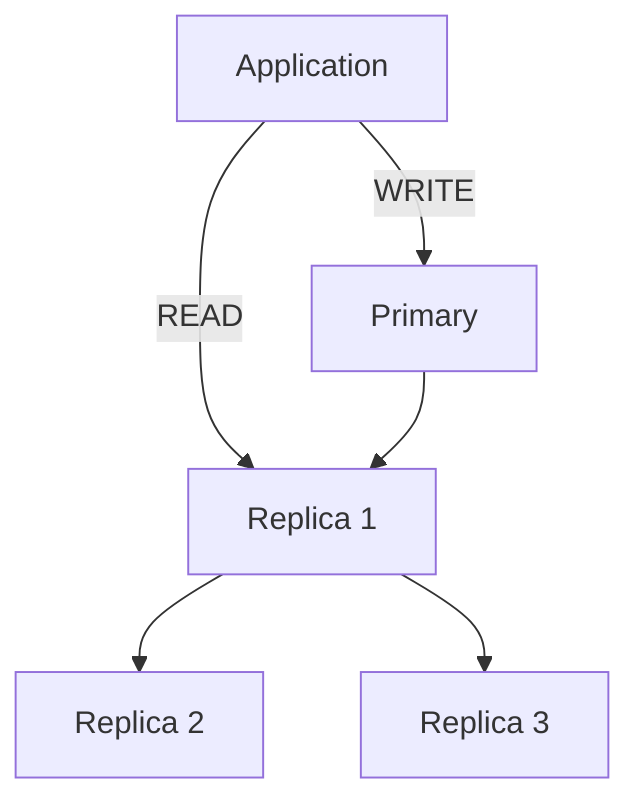

The important distinction is:

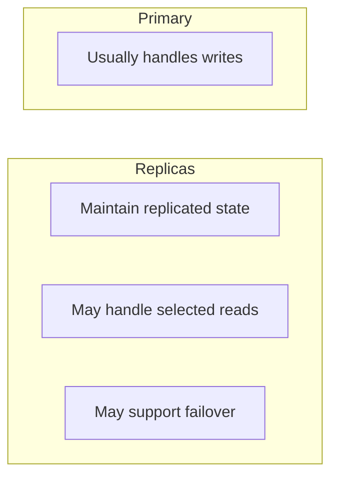

This architecture is not simply:

> "One database for writing and several databases for reading."

It also requires decisions about:

- consistency
- routing
- replication lag
- health
- failover
- connection management
- recovery

---

# 2. Why Do We Need This Architecture?

Start with the simplest architecture:

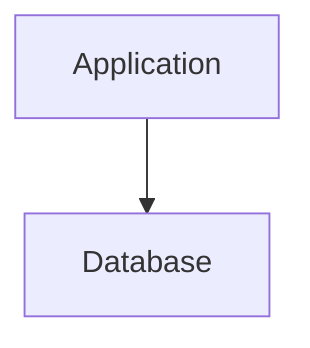

As the application grows, suppose the database receives:

```text
50,000 reads/sec
5,000 writes/sec
```

If most of the database's work is reads, the primary may become overloaded.

One possible evolution is:

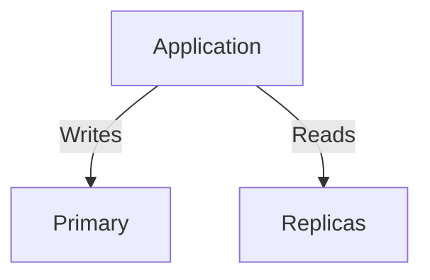

This allows some read workload to move away from the primary.

The same architecture can also provide another database server that may be promoted if the primary fails.

Therefore, primary/replica architecture commonly addresses two different concerns:

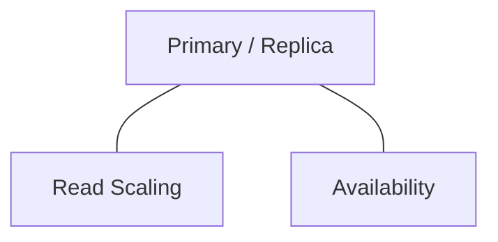

These benefits are related, but they are not the same thing.

---

# 3. Primary Responsibilities

The primary database usually acts as the authoritative write destination.

It handles operations such as:

```sql
INSERT
UPDATE
DELETE
```

For example:

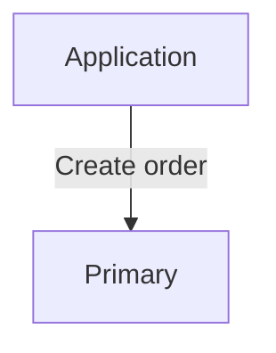

The primary may also serve reads.

For example:

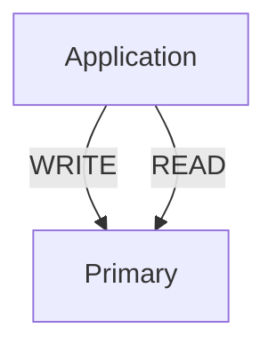

There is no rule saying that the primary must serve only writes.

The architecture decides which reads can safely use replicas.

---

# 4. Replica Responsibilities

A replica maintains a copy of database state through the configured replication mechanism.

A replica can potentially be used for:

- read traffic
- reporting
- analytics
- failover
- disaster recovery
- geographic distribution

For example:

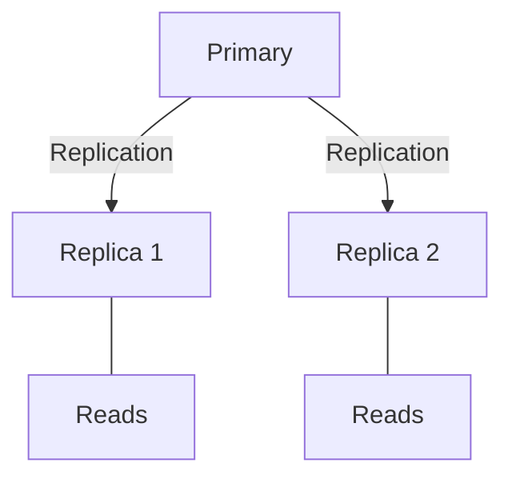

However, a replica's usefulness depends on:

- how current it is
- whether it is healthy
- whether the query tolerates stale data
- whether the replica is overloaded

---

# 5. Write Routing

In a traditional primary/replica design, writes are routed to the primary.

The primary is normally the authoritative database for those writes.

This gives the application a clear write destination.

---

# 6. Read Routing

Reads are more complicated.

A simple architecture may route reads to replicas:

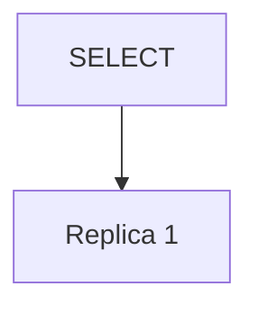

If multiple replicas exist:

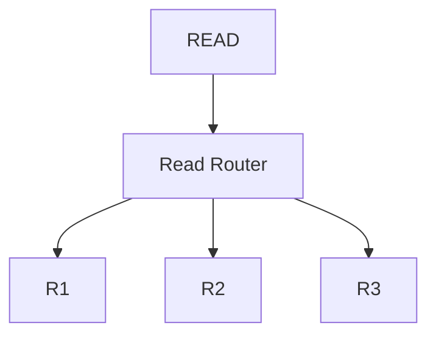

The router might consider:

- replica health
- replication lag
- current load
- connection availability
- geographic location

The exact routing mechanism varies.

---

# 7. Read/Write Splitting

The general idea of sending writes to the primary and selected reads to replicas is called:

> **Read/write splitting**

This can help when:

```text
Reads >> Writes
```

For example:

```text
Reads  = 100,000/sec
Writes = 5,000/sec
```

Replicas can absorb some of the read workload.

---

# 8. Read/Write Splitting Is an Application Behavior

A database cluster does not automatically understand the business meaning of every query.

The application needs some way to decide:

```text
Where should this query go?
```

Possible approaches include:

- application code
- database-aware drivers
- connection pools
- database proxies
- managed database routing
- service infrastructure

For example:

```text
Application
   |
   +--> Write connection → Primary
   |
   +--> Read connection  → Replica
```

The exact implementation depends on the technology stack.

---

# 9. Not Every SELECT Is a Replica Read

This is one of the most important rules.

The SQL operation:

```sql
SELECT
```

only tells us that the query reads data.

It does not tell us whether stale data is acceptable.

Consider:

```text
SELECT product catalog
```

A small amount of staleness may be acceptable.

But:

```text
SELECT current account balance
```

may require a stronger freshness guarantee.

Therefore:

```text
SELECT
  |
  +-- Can tolerate staleness? → Replica may be suitable
  |
  +-- Requires latest state? → Primary or stronger consistency mechanism
```

The routing decision should be based on **consistency requirements**, not only SQL command type.

---

# 10. The Read-After-Write Problem

Suppose a user changes their profile.

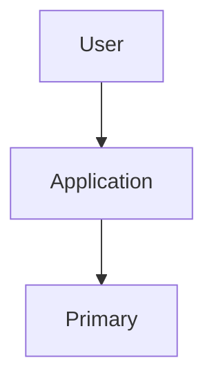

The write succeeds.

Immediately afterward:

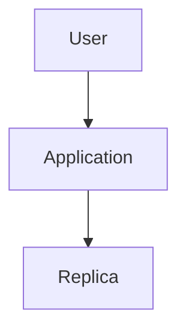

The replica may still contain the old state.

The user might see:

```text
"I changed my name, but the old name is still showing!"
```

The problem is:

```text
Write → Primary
Read  → Replica
```

combined with:

```text
Replica lag
```

---

# 11. Sticky Reads

One strategy for reducing read-after-write problems is to temporarily keep a user's reads directed to the primary after an important write.

Conceptually:

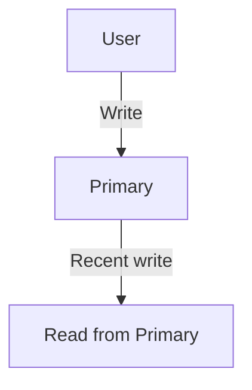

After the replica catches up, reads may return to the replica.

This idea is sometimes called:

> **Sticky reads**

The exact implementation can vary.

The important concept is:

> **After a write, the application may need a routing strategy that preserves the user's expected visibility of that write.**

---

# 12. Session-Level Routing

Another approach is to associate routing behavior with a session.

For example:

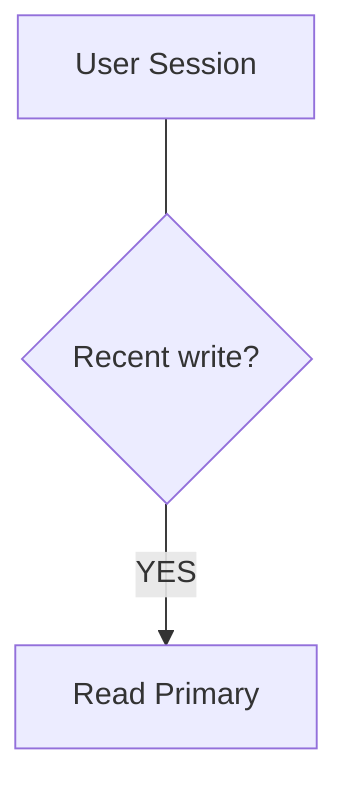

After some condition is satisfied:

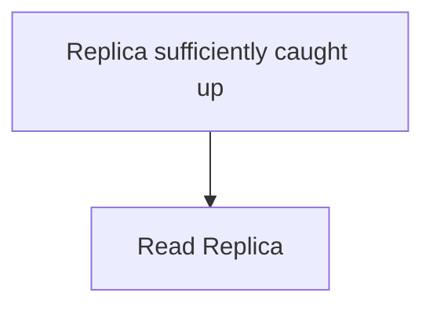

This can reduce unnecessary primary traffic while still improving the user's experience.

However, it introduces additional complexity.

---

# 13. Replica Lag Must Be Observable

If replicas are used for application traffic, the system should know whether they are healthy.

For example:

```text
Replica 1
Lag = 20 ms

Replica 2
Lag = 40 ms

Replica 3
Lag = 15 seconds
```

The third replica may not be suitable for some reads.

A routing system might therefore:

```text
Replica 1 → Available
Replica 2 → Available
Replica 3 → Remove from read pool
```

This requires monitoring.

---

# 14. Health vs Freshness

A replica can be healthy at the infrastructure level:

```text
Server = Running
Disk   = Working
Network = Working
```

but still have:

```text
Replication = Severely delayed
```

Therefore, database health should consider both:

```text
Infrastructure Health
+
Replication Health
```

Conceptually:

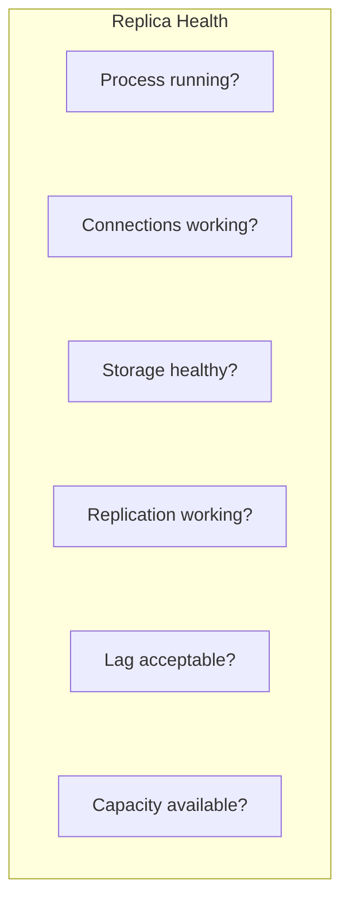

---

# 15. Routing Around an Unhealthy Replica

Suppose:

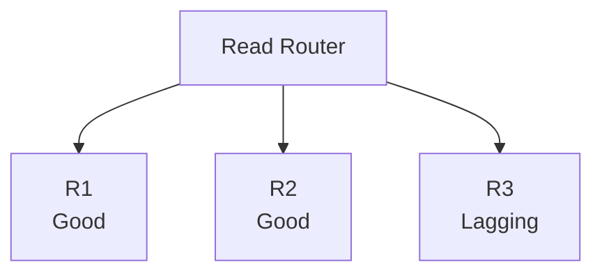

The routing layer can remove R3:

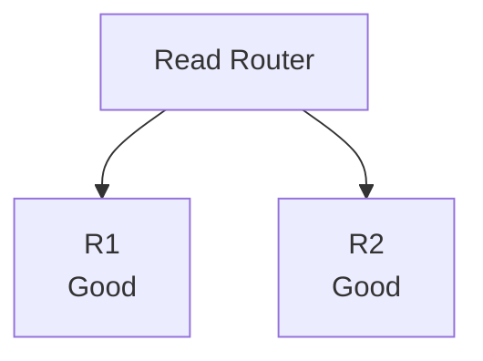

This prevents known-unhealthy replicas from receiving normal read traffic.

The exact implementation depends on the infrastructure.

---

# 16. Multiple Replicas

As read traffic increases, more replicas can be added:

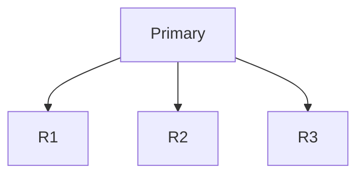

The application can distribute reads:

```text
Read 1 → R1
Read 2 → R2
Read 3 → R3
Read 4 → R1
Read 5 → R2
```

But simple round-robin routing is not always sufficient.

A replica may be:

- overloaded
- lagging
- geographically distant
- temporarily unavailable

Therefore routing may need to consider more than just rotation.

---

# 17. Geographic Read Routing

Suppose users are distributed across regions:

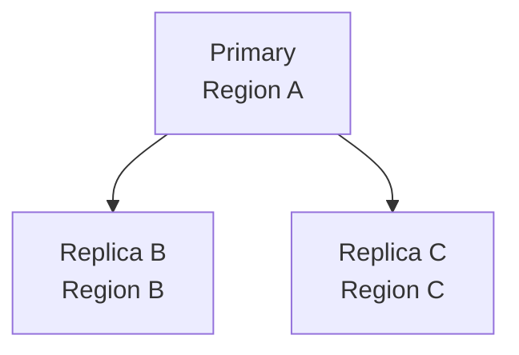

A user in Region B might read from:

```text
Replica B
```

while a user in Region C might read from:

```text
Replica C
```

This can reduce network latency.

But geographic replicas may have additional replication lag.

Therefore:

```text
Closer
  ≠
Always more current
```

Geographic routing must consider both latency and consistency.

---

# 18. Connection Pools

Earlier we learned about connection pooling.

With primary/replica architecture, the application may maintain different pools:

```mermaid
flowchart TD
  accTitle: Separate pools
  accDescr: The application uses a write pool for the primary and a read pool for the replicas.
  A["Application"] --> W["Write Pool"] & R["Read Pool"]
  W --> P["Primary"]
  R --> S["Replicas"]
```

This allows the application to manage connections according to workload.

---

# 19. Why Connection Limits Matter

Suppose each application instance opens:

```text
20 primary connections
50 replica connections
```

and there are:

```text
20 application instances
```

The theoretical number of connections could become:

```text
Primary:
20 × 20 = 400

Replicas:
20 × 50 = 1,000
```

The database servers must be able to handle these connections.

Therefore:

> **Adding replicas does not remove connection-management concerns.**

Poor connection planning can create a new bottleneck.

---

# 20. Primary Failure

Now consider the most important failure scenario.

Before failure:

```mermaid
flowchart TD
  accTitle: Before primary failure
  accDescr: The application uses the primary, which replicates to R1 and R2.
  A["Application"] --> P["Primary"] --> R1["R1"] & R2["R2"]
```

The primary fails:

```mermaid
flowchart TD
  accTitle: Primary failure
  accDescr: The application cannot reach the failed primary.
  A["Application"] --x P["Primary<br/>FAILURE"]
```

The system needs a failover process.

---

# 21. Replica Promotion

One suitable replica may be promoted:

```mermaid
flowchart TD
  accTitle: Replica promotion
  accDescr: The application connects to the new primary, which is the former replica.
  A["Application"] --> N["New Primary"]
  F["Former Replica"] --> N
```

Conceptually:

```mermaid
flowchart TD
  accTitle: Before and after promotion
  accDescr: Before: the primary replicates to R1 and R2. After: R1 is the new primary and replicates to R2.
  subgraph B["Before:"]
    direction TB
    P["Primary"] --> R1["R1"] & R2["R2"]
  end
  subgraph F["After:"]
    direction TB
    N["R1 → New Primary"] --> S2["R2"]
  end
  R1 & R2 ~~~ N
```

The exact promotion process depends on the database and infrastructure.

It may involve:

1. Detecting primary failure
2. Choosing a suitable replica
3. Checking replication state
4. Promoting the replica
5. Updating routing
6. Redirecting application writes
7. Rebuilding or rejoining the old primary later

---

# 22. Why Promotion Is Not Instant Magic

Suppose:

```text
Primary
Latest transaction: 1000

Replica 1
Latest transaction: 1000

Replica 2
Latest transaction: 998
```

If Replica 2 is promoted, it may not contain the most recent changes.

Therefore the system needs to consider:

```text
Which replica is suitable?
```

The decision may involve:

- replication position
- lag
- health
- region
- infrastructure state
- operational policy

Failover is an architectural process, not simply a DNS change.

---

# 23. What Happens to Application Connections?

Suppose the application has:

```text
DB_HOST=primary.example
```

The primary fails.

The application cannot continue using a dead connection.

The architecture may use:

```mermaid
flowchart TD
  accTitle: A stable endpoint
  accDescr: Application, then Database Endpoint / Proxy, then Current Primary.
  N0["Application"] --> N1["Database Endpoint / Proxy"] --> N2["Current Primary"]
```

After failover:

```mermaid
flowchart TD
  accTitle: After failover
  accDescr: Database Endpoint, then New Primary.
  N0["Database Endpoint"] --> N1["New Primary"]
```

This can hide some of the topology changes from the application.

Other systems may use service discovery or updated connection configuration.

The important idea is:

> **Applications need a reliable way to discover the current write destination.**

---

# 24. Replica Failure

Not every failure involves the primary.

Suppose:

```mermaid
flowchart LR
  accTitle: Three replicas
  accDescr: The primary replicates to replicas 1, 2 and 3.
  R["Primary"]
  R --> K0["Replica 1"]
  R --> K1["Replica 2"]
  R --> K2["Replica 3"]
```

Replica 2 fails:

```mermaid
flowchart LR
  accTitle: Replica failure
  accDescr: The primary replicates to replicas 1, 2 and 3; replica 2 has failed.
  R["Primary"]
  R --> K0["Replica 1"]
  R --> K1["Replica 2 X"]
  R --> K2["Replica 3"]
```

The primary can often continue accepting writes.

The read router can stop sending traffic to Replica 2:

```mermaid
flowchart LR
  accTitle: Routing around the failure
  accDescr: The read router sends reads to R1 and R3.
  R["Read Router"]
  R --> K0["R1"]
  R --> K1["R3"]
```

Later, Replica 2 can be repaired or rebuilt.

This is one advantage of having multiple replicas.

---

# 25. What If All Replicas Fail?

Consider:

```mermaid
flowchart LR
  accTitle: All replicas fail
  accDescr: The primary has R1, R2 and R3, all failed.
  R["Primary"]
  R --> K0["R1 X"]
  R --> K1["R2 X"]
  R --> K2["R3 X"]
```

The application may still be able to write and read from the primary.

But:

- read capacity is reduced
- failover options are reduced
- redundancy is reduced

Therefore, replicas provide resilience only while the overall architecture remains healthy.

---

# 26. What If the Primary and Replica Lose Communication?

Consider:

```mermaid
flowchart TD
  accTitle: Lost communication
  accDescr: The primary and the replica can no longer communicate.
  P["Primary"] --x R["Replica"]
```

The network path fails.

Now:

```text
Primary = continuing
Replica = disconnected
```

The replica may stop receiving updates.

This creates a critical question:

> **What should the system do when database nodes cannot communicate?**

Incorrectly allowing multiple nodes to independently become writable can create conflicting states.

This is one reason automatic failover requires careful coordination.

---

# 27. Split Brain

A dangerous failure mode is **split brain**.

Conceptually:

```mermaid
flowchart TD
  accTitle: Split brain
  accDescr: During a network partition, primary A and primary B both accept writes.
  N["Network Partition<br/>X"]
  N ~~~ A & B
  A["Primary A"] --- W1["Writes"]
  B["Primary B"] --- W2["Writes"]
```

Now two nodes believe they can accept authoritative writes.

The system may produce conflicting changes.

This is dangerous because the databases are no longer operating under one clear write authority.

Preventing or safely handling split brain is an important part of distributed database architecture.

---

# 28. Data Access Policy

A useful way to think about routing is to define a policy.

For example:

```mermaid
flowchart TD
  accTitle: Data access policy
  accDescr: Data type: freshness requirement, read frequency and business impact lead to a routing decision.
  subgraph G["Data Type"]
    direction TB
    I0["Freshness requirement"] ~~~ I1["Read frequency"] ~~~ I2["Business impact"]
  end
  G --> R["Routing Decision"]
```

Example:

| Data | Possible routing |
|---|---|
| Product descriptions | Replica |
| Product images metadata | Replica |
| Search/reporting data | Replica |
| Recently created order | Primary or consistency-aware routing |
| Current account balance | Primary or stronger consistency mechanism |
| Configuration requiring latest value | Primary or controlled routing |

These are examples, not universal rules.

The correct destination depends on the application's guarantees.

---

# 29. Primary / Replica and Caching

A larger architecture may contain both:

```mermaid
flowchart TD
  accTitle: Cache and replicas
  accDescr: The application uses a cache and the primary; the primary replicates to the replicas.
  A["Application"] --> C["Cache"]
  A --> P["Primary"]
  P --> R["Replicas"]
```

Now there are multiple sources from which a read may be served.

For example:

```mermaid
flowchart TD
  accTitle: Reading through a cache
  accDescr: A request checks the cache: HIT returns; MISS goes to the replica and then the database.
  Q["Request"] --> C["Cache"]
  C -->|"HIT"| R["Return"]
  C -->|"MISS"| P["Replica"] --> D["Database"]
```

This creates more opportunities for stale data.

For example:

```text
Cache may be stale
Replica may be behind
Primary has latest state
```

Therefore:

> **Adding caching and replication together requires deliberate freshness and invalidation rules.**

---

# 30. Replication and Transactions

Suppose an order creation transaction changes several tables:

```mermaid
flowchart TD
  accTitle: An order transaction
  accDescr: BEGIN, then changes to orders, order_items and payments, then COMMIT.
  B["BEGIN"] --> G
  subgraph G[" "]
    direction TB
    O["orders"] ~~~ I["order_items"] ~~~ P["payments"]
  end
  G --> C["COMMIT"]
```

The application may then read related information.

If those reads go to a replica that is still catching up, the application must consider whether the required transaction state is visible there.

This is another reason why transaction semantics and replication behavior must be considered together.

---

# 31. Replication and Query Optimization

Suppose a report query takes:

```text
10 seconds
```

Moving it from the primary to a replica may protect the primary from the reporting workload.

But the query can still take:

```text
10 seconds
```

on the replica.

Therefore:

```mermaid
flowchart TD
  accTitle: Two different fixes
  accDescr: Replication gives workload isolation; query optimization gives less work per query.
  A0["Replication"] --> A1["Workload isolation"]
  B0["Query optimization"] --> B1["Less work per query"]
  A1 ~~~ B0
```

Both may be required.

---

# 32. Reporting on Replicas

A useful application of replicas is separating reporting workloads.

Without a replica:

```mermaid
flowchart TD
  accTitle: Reporting without a replica
  accDescr: The application and reporting both use the primary.
  A["Application"] --> P["Primary"]
  R["Reporting"] --> P
```

A large report can compete with normal application traffic.

With a replica:

```mermaid
flowchart TD
  accTitle: Reporting on a replica
  accDescr: The application uses the primary, which replicates to a replica used by reporting.
  A["Application"] --> P["Primary"] --> R["Replica"]
  T["Reporting"] --> R
```

The reporting workload can be isolated from the primary.

However, reporting data may be slightly behind.

That may be perfectly acceptable depending on the reporting requirement.

---

# 33. The Primary Can Still Become the Bottleneck

Suppose:

```text
Reads = 1,000,000/sec
Writes = 100,000/sec
```

Many replicas might help with reads.

But the primary still has to handle:

- writes
- transaction processing
- indexes
- replication work
- storage
- locks
- other database operations

Eventually the primary itself may become the bottleneck.

This leads to later concepts such as:

- partitioning
- sharding
- workload separation

Replication is not the final answer to database scaling.

---

# 34. More Replicas Also Mean More Work

Suppose:

```mermaid
flowchart LR
  accTitle: Five replicas
  accDescr: The primary replicates to R1 to R5.
  R["Primary"]
  R --> K0["R1"]
  R --> K1["R2"]
  R --> K2["R3"]
  R --> K3["R4"]
  R --> K4["R5"]
```

The primary or replication infrastructure must propagate changes to more destinations.

This can increase:

- network traffic
- replication workload
- monitoring requirements
- operational complexity

Therefore:

> **Adding replicas is a trade-off, not a free capacity multiplier.**

---

# 35. Failure Scenario — Replica Lag During Heavy Writes

Consider:

```mermaid
flowchart TD
  accTitle: Normal replication
  accDescr: Normal:: Primary, then Replica.
  subgraph G["Normal:"]
    direction TB
    N0["Primary"] --> N1["Replica"]
  end
```

Now write traffic increases dramatically:

```mermaid
flowchart TD
  accTitle: Heavy writes
  accDescr: Primary writes are very high; the replica apply rate is lower.
  N0["Primary<br/>Writes = Very High"] --> N1["Replica<br/>Apply rate = Lower"]
```

Lag increases:

```mermaid
flowchart TD
  accTitle: Lag increases
  accDescr: 100 ms, then 1 sec, then 5 sec, then 30 sec.
  N0["100 ms"] --> N1["1 sec"] --> N2["5 sec"] --> N3["30 sec"]
```

The application may need to stop using that replica for freshness-sensitive reads.

This demonstrates an important principle:

> **Read capacity is useful only when the replica is sufficiently healthy and current for the workload.**

---

# 36. A More Complete Architecture

A production architecture may look conceptually like:

```mermaid
flowchart TD
  accTitle: A more complete architecture
  accDescr: Users reach the application, which sends writes to the primary and reads to a read router for R1, R2 and R3; the primary replicates to the replicas.
  U["Users"] --> A["Application"]
  A -->|"Writes"| P["Primary"]
  A -->|"Reads"| RR["Read Router"]
  RR --> G
  P -->|"Replication"| G
  subgraph G[" "]
    direction LR
    R1["R1"] ~~~ R2["R2"] ~~~ R3["R3"]
  end
```

There may also be:

```text
Cache
Monitoring
Failover Manager
Connection Pools
Backup System
```

around this architecture.

---

# 37. What Should Happen During Replica Failure?

A good design should define:

```mermaid
flowchart TD
  accTitle: Handling replica failure
  accDescr: Replica fails, then Detect failure, then Remove from read routing, then Continue using healthy replicas, then Repair / rebuild replica, then Verify health, then Return to read pool.
  N0["Replica fails"] --> N1["Detect failure"] --> N2["Remove from read routing"] --> N3["Continue using healthy replicas"] --> N4["Repair / rebuild replica"] --> N5["Verify health"] --> N6["Return to read pool"]
```

This is much better than discovering the failure only when users start receiving errors.

---

# 38. Common Mistakes

## Mistake 1 — Sending Every SELECT to Replicas

A `SELECT` may require fresh data.

---

## Mistake 2 — Ignoring Replication Lag

A replica can be healthy but behind.

---

## Mistake 3 — Treating Replicas as Backups

Replication does not replace backups.

---

## Mistake 4 — Assuming More Replicas Always Improve Performance

Replication introduces network, storage, and operational overhead.

---

## Mistake 5 — Forgetting Connection Limits

More application instances and replicas can create many database connections.

---

## Mistake 6 — Hardcoding One Primary Forever

Failover may change which server is the primary.

---

## Mistake 7 — Assuming Failover Is Instant

Promotion and routing changes take time and require coordination.

---

## Mistake 8 — Ignoring Read-After-Write Behavior

Users may observe older data after successful writes.

---

## Mistake 9 — Treating Replicas as Identical

Replicas can differ in:

- lag
- health
- capacity
- location

---

## Mistake 10 — Using Replication to Fix Slow Queries

Replication distributes workload; it does not automatically optimize inefficient queries.

---

## Mistake 11 — Ignoring Split-Brain Risk

Automatic failover must prevent conflicting writable primaries.

---

# 39. Hands-On Lab — Model Primary / Replica Routing

This lab is intentionally a **conceptual architecture exercise**.

Do not create several ordinary PostgreSQL databases and call them replicas. A real replica requires an actual replication mechanism.

---

## Step 1 — Start With One Database

Imagine:

```mermaid
flowchart TD
  accTitle: Start with one database
  accDescr: Application, then PostgreSQL.
  N0["Application"] --> N1["PostgreSQL"]
```

All requests go to one database.

---

## Step 2 — Assign the Primary Role

Conceptually call the database:

```text
Primary
```

Now classify operations.

### Writes

```text
Create user
Update profile
Create order
Update payment
Delete product
```

Route them conceptually to:

```text
Primary
```

---

## Step 3 — Add Conceptual Replicas

Now imagine a properly configured replication architecture:

```mermaid
flowchart TD
  accTitle: Conceptual replicas
  accDescr: The primary replicates to R1 and R2.
  P["Primary"] --> R1["R1"] & R2["R2"]
```

R1 and R2 are actual replicas only if a real replication mechanism has been configured.

---

## Step 4 — Classify Reads

Consider:

```text
Browse products
Read product description
Generate sales report
Read current account balance
Immediately view newly created order
```

Ask:

> **Can this read tolerate replica staleness?**

Possible reasoning:

```text
Browse products
    → Replica may be suitable

Sales report
    → Replica may be suitable

Current account balance
    → May require primary/stronger consistency

Immediately view newly created order
    → Primary or consistency-aware routing may be required
```

These are architecture decisions, not absolute SQL rules.

---

# 40. Lab Challenge — Routing Table

Complete this table:

| Operation | Freshness requirement | Possible destination | Why? |
|---|---|---|---|
| Create account | Latest write | Primary | Authoritative write |
| Browse products | Usually tolerant | Replica | Read-heavy workload |
| Update order | Latest state | Primary | Authoritative write |
| Sales report | Often tolerant | Replica | Isolate reporting |
| Immediately view new order | Recent state | Primary / consistency-aware route | Avoid stale read |
| Read current balance | High freshness | Primary / consistency-aware route | Business correctness |

The important lesson is:

> **Database routing should be based on business and consistency requirements, not merely on whether a query is a `SELECT`.**

---

# 41. Lab Challenge — Failure Handling

Imagine:

```mermaid
flowchart TD
  accTitle: Failure handling setup
  accDescr: The primary replicates to R1 and R2.
  P["Primary"] --> R1["R1"] & R2["R2"]
```

### Scenario A

R1 fails.

What should happen?

A reasonable design:

```text
Remove R1 from read routing
Continue with R2
Repair/rebuild R1
```

### Scenario B

Primary fails.

What should happen?

A reasonable high-level process:

```mermaid
flowchart TD
  accTitle: Primary failure process
  accDescr: Detect failure, then Select suitable replica, then Promote replica, then Update write routing, then Reconnect applications.
  N0["Detect failure"] --> N1["Select suitable replica"] --> N2["Promote replica"] --> N3["Update write routing"] --> N4["Reconnect applications"]
```

### Scenario C

R2 has 30 seconds of replication lag.

Should it continue serving every read?

No.

The answer depends on the read's freshness requirement, but freshness-sensitive traffic should not blindly use a severely lagging replica.

---

# 42. The Architecture Evolves

A useful evolution might look like this:

### Stage 1 — Single Database

```mermaid
flowchart TD
  accTitle: Stage 1 — Single Database
  accDescr: Application, then Database.
  N0["Application"] --> N1["Database"]
```

### Stage 2 — Primary + Replica

```mermaid
flowchart TD
  accTitle: Stage 2 — Primary + Replica
  accDescr: The application uses the primary and a replica.
  A["Application"] --> P["Primary"] & R["Replica"]
```

### Stage 3 — Multiple Replicas

```mermaid
flowchart LR
  accTitle: Stage 3 — Multiple Replicas
  accDescr: The application uses the primary and R1, R2 and R3.
  R["Application"]
  R --> K0["Primary"]
  R --> K1["R1"]
  R --> K2["R2"]
  R --> K3["R3"]
```

### Stage 4 — Routing + Health Awareness

```mermaid
flowchart TD
  accTitle: Stage 4 — Routing + Health Awareness
  accDescr: The application uses a write router for the primary and a read router for R1, R2 and R3.
  A["Application"] --> W["Write<br/>Router"] & R["Read<br/>Router"]
  W ---> P["Primary"]
  R --> R1["R1"] & R2["R2"] & R3["R3"]
```

### Stage 5 — Failover

```mermaid
flowchart TD
  accTitle: Stage 5 — Failover
  accDescr: The write router points at the current primary, which a replica can become through promotion.
  W["Write Router"] --> C["Current Primary"]
  R["Replica"] --> M["Promotion"] --> C
```

The important idea is:

> **Architecture evolves because requirements and bottlenecks evolve.**

---

# 43. Primary / Replica vs Sharding

Do not confuse replication with sharding.

### Replication

```mermaid
flowchart LR
  accTitle: Replication
  accDescr: Replication: the same logical data in copies 1, 2 and 3.
  R["Same logical data"]
  R --> K0["Copy 1"]
  R --> K1["Copy 2"]
  R --> K2["Copy 3"]
```

### Sharding

```mermaid
flowchart LR
  accTitle: Sharding
  accDescr: Sharding: different portions of data in shards 1, 2 and 3.
  R["Different portions<br/>of data"]
  R --> K0["Shard 1"]
  R --> K1["Shard 2"]
  R --> K2["Shard 3"]
```

Replication is commonly used for:

- read scaling
- availability
- failover

Sharding is commonly used when:

- one database cannot handle the total dataset/workload
- data must be divided across multiple database nodes

Sharding comes later in the curriculum.

---

# 44. Primary / Replica vs Partitioning

Partitioning is another different concept.

Replication:

```mermaid
flowchart TD
  accTitle: Replication
  accDescr: Primary, then Replica.
  N0["Primary"] --> N1["Replica"]
```

Partitioning:

```mermaid
flowchart LR
  accTitle: Partitioning
  accDescr: Partitioning: a database split into partitions A, B and C.
  R["Database"]
  R --> K0["Partition A"]
  R --> K1["Partition B"]
  R --> K2["Partition C"]
```

A system can use both.

For example:

```mermaid
flowchart TD
  accTitle: Both together
  accDescr: Sharded or partitioned data, each part with its own primary and replica.
  D["Sharded / Partitioned Data"] --> P1["Primary"] & P2["Primary"]
  P1 --> R1["Replica"]
  P2 --> R2["Replica"]
```

This is much more complex and should be introduced only when the requirements justify it.

---

# 45. The Most Important Questions

When designing primary/replica architecture, ask:

### 1. What is the write authority?

```text
Which node accepts authoritative writes?
```

### 2. Which reads can tolerate staleness?

```text
Can this request use a replica?
```

### 3. How much lag is acceptable?

```text
Milliseconds?
Seconds?
More?
```

### 4. How is routing handled?

```text
Application?
Proxy?
Driver?
Managed service?
```

### 5. How is replica health measured?

```text
Lag?
Errors?
Load?
Connections?
```

### 6. What happens when a replica fails?

```text
Remove?
Repair?
Rebuild?
```

### 7. What happens when the primary fails?

```text
Which replica is promoted?
How does the application discover it?
```

### 8. How is split brain prevented?

```text
Can two nodes become writable?
```

### 9. How are backups handled?

```text
Replication + Backup
```

not:

```text
Replication instead of Backup
```

---

# 46. Quick Reference

### Primary

Usually the authoritative write destination.

### Replica

Maintains replicated database state and may serve selected reads.

### Read/Write Splitting

Routing writes to the primary and selected reads to replicas.

### Read Router

Chooses an appropriate replica for a read.

### Replica Lag

Difference between the current primary state and a replica's applied state.

### Sticky Reads

Routing a user's recent reads to a node that can provide the required freshness, often the primary.

### Promotion

Changing a suitable replica into the active primary role.

### Failover

Moving database responsibility after primary failure.

### Split Brain

A dangerous situation where multiple nodes independently behave as writable authorities.

### Primary/Replica ≠ Sharding

Replication creates copies; sharding divides data across nodes.

---

# 47. Knowledge Check

### 1. What is the primary's usual responsibility?

To act as the authoritative write destination.

### 2. What is a replica?

A database server maintaining replicated state from another database server.

### 3. What is read/write splitting?

Routing writes to the primary and selected reads to replicas.

### 4. Should every `SELECT` go to a replica?

No. The read's freshness and consistency requirements matter.

### 5. Why can users see old data after a successful write?

Because the application may read from a replica that has not caught up.

### 6. What should happen when a replica becomes severely lagged?

The system should consider removing it from workloads that cannot tolerate its staleness.

### 7. What happens when the primary fails?

A suitable replica may be promoted, and application write routing must be redirected.

### 8. Why is connection pooling important?

Because multiple application instances and database nodes can otherwise create excessive database connections.

### 9. Does replication replace backups?

No.

### 10. Does replication automatically scale writes?

No.

### 11. What is split brain?

A situation where multiple database nodes independently act as writable authorities, potentially causing conflicting state.

### 12. What should determine read routing?

The application's consistency/freshness requirements, along with replica health and capacity.

---

# 49. Remember

Primary/replica architecture is not simply:

```text
Primary = Write
Replica = Read
```

The real architecture is:

```mermaid
flowchart TD
  accTitle: The real architecture
  accDescr: The application sends writes to the primary and reads to a suitable destination: the primary, or a replica if it is healthy, current and can serve this workload.
  A["Application"] -->|"Writes"| P["Primary"]
  A -->|"Reads"| S["Suitable<br/>destination"]
  S --- P2["Primary"] & R["Replica"]
  R --- Q["Is it healthy?<br/>Is it current?<br/>Can it serve<br/>this workload?"]
```

Every read needs a consistency decision.

Every replica needs health monitoring.

Every failover needs a recovery plan.

---

# 50. Key Principle

> **Primary/replica architecture separates authoritative database writes from replicated database copies that can serve selected reads or support failover. Its real complexity comes from routing, replication lag, consistency requirements, health monitoring, connection management, and failure handling—not simply from adding more database servers.**

Start with one database.

Find the actual bottleneck.

Add replication when it solves a real requirement.

Then design the application around the behavior that replication introduces.

---

# 51. Next Chapter

## 04.12 — Read Replicas

The next chapter will focus specifically on **Read Replicas**:

- What a read replica is
- Why read replicas exist
- Read-heavy workloads
- Read/write splitting
- Routing read traffic
- Replica lag
- Stale reads
- Read-after-write consistency
- Replica selection
- Load distribution
- Reporting workloads
- Geographic read replicas
- Read replica failure
- Monitoring
- When read replicas help
- When they do not
- Common mistakes
- Hands-on read-replica exercise
- Scaling read capacity
- How read replicas fit into the complete database architecture
