# 04.12 — Read Replicas

## Learning Objectives

By the end of this chapter, you should understand:

- What a read replica is
- Why read replicas exist
- How read replicas handle read-heavy workloads
- How read/write splitting works
- How applications route reads to replicas
- What replica lag means
- Why replicas can return stale data
- What the read-after-write problem is
- How applications handle consistency requirements
- How multiple replicas distribute read traffic
- How reporting workloads can use replicas
- How geographic replicas can reduce network latency
- What happens when a read replica fails
- How read replicas should be monitored
- When read replicas help
- When read replicas do not solve the real problem
- Common read-replica mistakes
- How read replicas fit into a complete database architecture

---

# 1. What Is a Read Replica?

A **read replica** is a database server that maintains a replicated copy of data from another database server and is used primarily to serve read requests.

A simplified architecture looks like this:

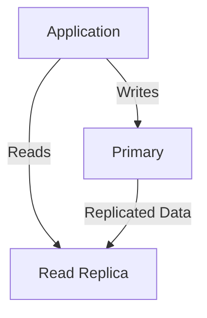

The primary normally handles authoritative writes.

The replica maintains a copy of the primary's data and can serve appropriate read requests.

For example:

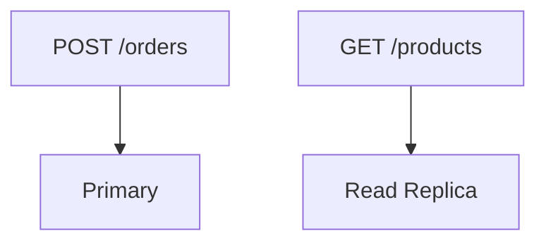

The important word is **appropriate**.

Not every read should automatically go to a replica.

---

# 2. Why Do Read Replicas Exist?

A database can become a bottleneck when many users are reading data.

Imagine an application with:

```text
10,000 requests/second
```

Suppose:

```text
9,000 = reads
1,000 = writes
```

The primary must potentially handle both:

```text
Reads
+
Writes
+
Transactions
+
Indexes
+
Locks
+
Replication
```

If read traffic becomes large enough, the primary may spend significant resources answering queries that do not need to modify data.

Read replicas allow some of those reads to be moved elsewhere.

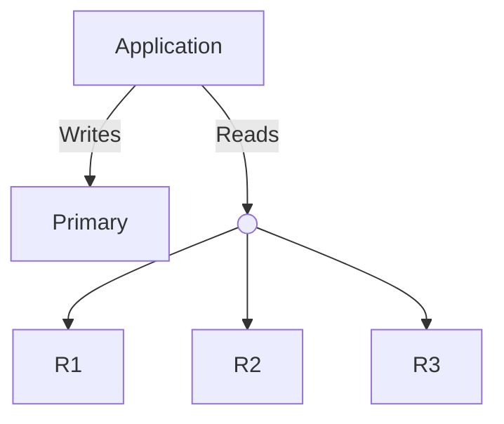

The goal is not:

> "Add replicas because large systems use replicas."

The goal is:

> **Move suitable read workload away from the primary when read capacity is actually a bottleneck.**

---

# 3. Read Replicas Are Copies of Data

A read replica does not normally contain a completely independent dataset.

It receives changes originating from the primary.

Conceptually:

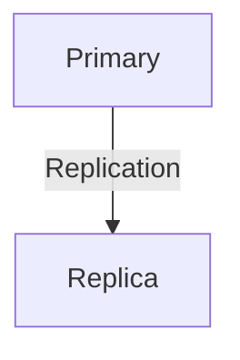

If the primary changes:

```text
Product price
₹500 → ₹550
```

the replica eventually receives that change.

There may be a delay:

```text
Primary:
price = ₹550

Replica:
price = ₹500
```

for some period.

This is one of the most important properties of read replicas.

---

# 4. Replication Is Usually Not Instantaneous

Replication can be synchronous or asynchronous depending on the database system and configuration.

With asynchronous replication:

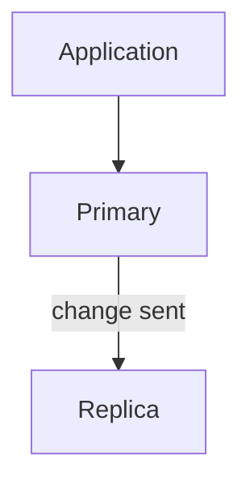

The primary can continue after accepting the change while the replica catches up.

This creates **replication lag**.

For example:

```text
10:00:00.000
Primary receives order

10:00:00.020
Primary commits order

10:00:00.050
Replica receives change

10:00:00.070
Replica applies change
```

During part of this period:

```text
Primary → new state
Replica → older state
```

That difference matters to application behavior.

---

# 5. What Is Replica Lag?

**Replica lag** is the delay between the state of the primary and the state currently available on a replica.

For example:

```text
Primary:
Order #501 exists

Replica:
Order #501 does not exist yet
```

The replica is not necessarily broken.

It may simply be behind.

---

# 6. Why Can Replica Lag Happen?

Many things can contribute to lag.

For example:

- High write volume
- Slow replication
- Network delays
- Replica CPU saturation
- Replica disk I/O pressure
- Long-running queries on the replica
- Large transactions
- Replication configuration
- Resource limits
- Temporary failures

A useful mental model is:

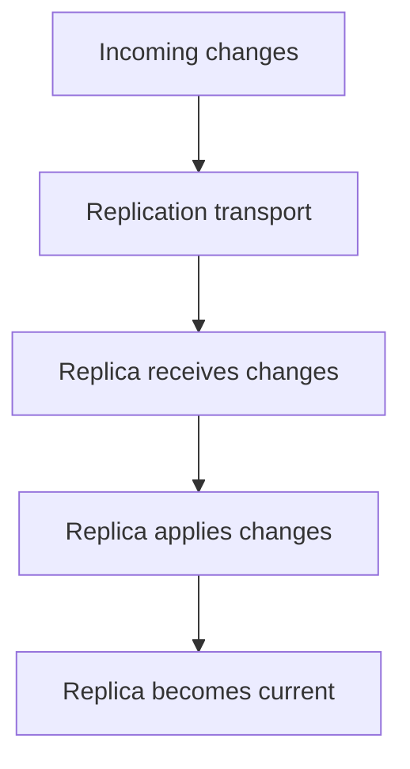

If any stage falls behind, replica lag can increase.

---

# 7. Read Replicas and Read/Write Splitting

Read replicas become useful when the application separates database operations by their purpose.

This is called **read/write splitting**.

For example:

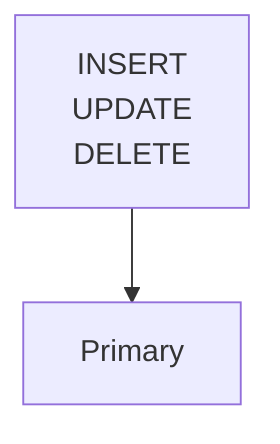

while:

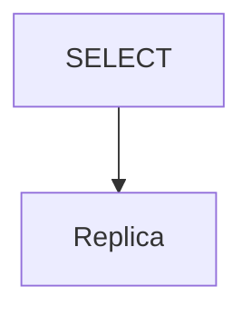

may be suitable.

But this is only a starting rule.

The application should also consider:

```text
How fresh must this data be?
```

---

# 8. Not Every SELECT Should Go to a Replica

This is a critical point.

A SQL `SELECT` only tells us that the operation is a read.

It does not tell us whether stale data is acceptable.

Consider:

```text
SELECT * FROM products;
```

For a product browsing page, a slightly old result may be acceptable.

But:

```text
SELECT balance FROM accounts WHERE user_id = 10;
```

may require stronger freshness.

So the better rule is:

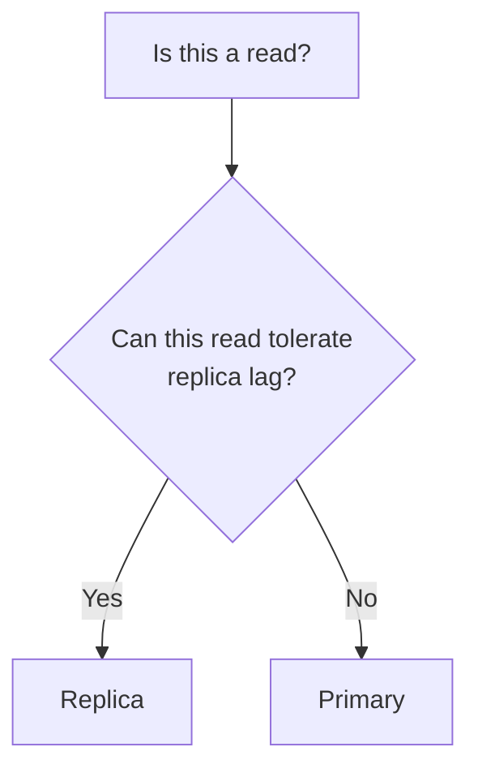

The routing decision is about **business correctness and consistency**, not merely SQL syntax.

---

# 9. Example: Product Browsing

Suppose an e-commerce application has:

```text
Products
Categories
Descriptions
Images
Reviews
```

Millions of users may browse products.

Most requests are reads:

```text
GET /products
GET /products/123
GET /categories
GET /products/123/reviews
```

If slightly stale data is acceptable, these requests can potentially use replicas.

This can reduce the read workload on the primary.

---

# 10. Example: Immediately After Updating a Product

Suppose an administrator changes:

```text
Product price:
₹500 → ₹550
```

The write goes to the primary.

Immediately afterward:

```text
Primary:
₹550

Replica:
₹500
```

If the admin is redirected to a page that reads from the replica, they might see:

```text
₹500
```

even though their update succeeded.

This is a **read-after-write consistency problem**.

---

# 11. The Read-After-Write Problem

Read-after-write means:

> After successfully writing data, a subsequent read should observe that write.

The system has not necessarily lost the write.

The read simply happened against an older copy.

---

# 12. Sticky Reads

One approach is **sticky reads**.

After a user performs a write, subsequent reads from that user may temporarily be routed to the primary.

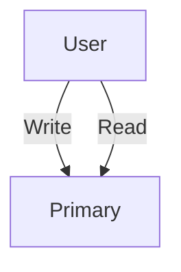

Later, when replica freshness is sufficient:

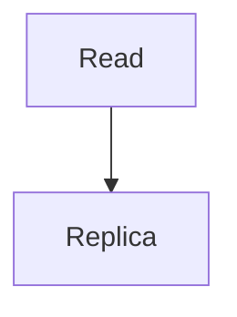

This can reduce confusing stale-read experiences.

However, it also sends additional traffic to the primary.

---

# 13. Waiting for Replica Catch-Up

Another possible approach is to wait until a replica has reached an appropriate replication position before allowing a read from it.

Conceptually:

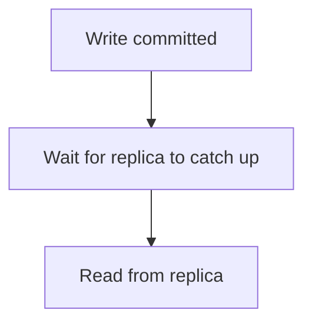

This can improve freshness but introduces waiting.

That means:

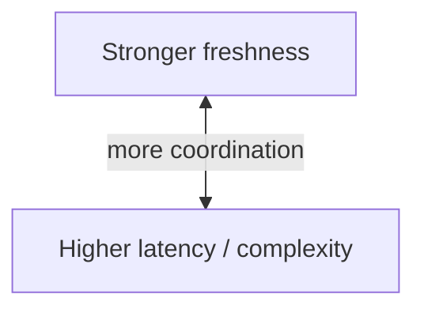

The application should only introduce this complexity when the requirement justifies it.

---

# 14. Read Replica Selection

With multiple replicas, the application needs to decide:

> Which replica should handle this read?

Suppose:

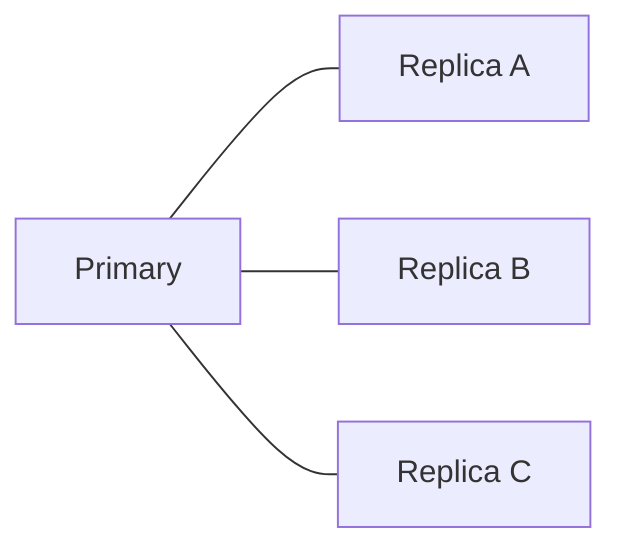

Possible selection strategies include:

- Round robin
- Least loaded replica
- Connection-aware routing
- Geographic proximity
- Health-based routing
- Freshness-aware routing

For example:

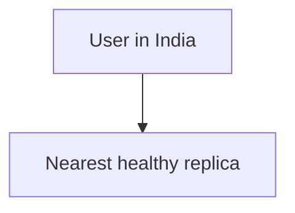

But geographical proximity alone is not enough.

The replica also needs to be:

```text
Healthy
+
Available
+
Fresh enough
```

---

# 15. Load Distribution Across Replicas

Suppose one replica receives all read traffic:

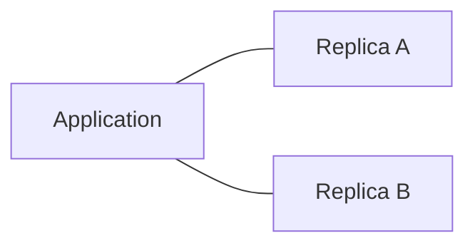

Replica A may become overloaded while B remains mostly idle.

A routing layer can distribute requests:

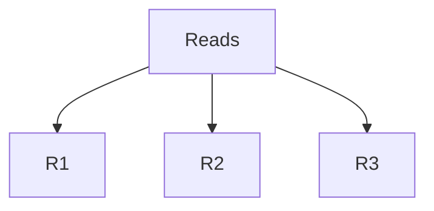

The objective is not simply equal traffic.

A better objective is:

> **Use available capacity while respecting health, freshness, latency, and workload requirements.**

---

# 16. Read Replicas for Reporting

Reporting queries can be expensive.

For example:

```sql
SELECT
    customer_id,
    COUNT(*) AS order_count,
    SUM(total) AS revenue
FROM orders
GROUP BY customer_id;
```

A large reporting query may consume:

- CPU
- Memory
- Disk I/O
- Database connections

Running heavy reporting on the primary can interfere with transactional workloads.

A dedicated replica can sometimes isolate this workload:

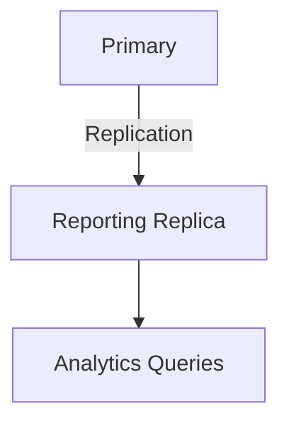

This does not make the query itself faster automatically.

It can instead **protect the primary from that workload**.

---

# 17. Reporting Data May Be Slightly Stale

A reporting replica may intentionally accept some lag.

For example:

```text
Dashboard requirement:

Data can be 30 seconds old.
```

A replica with:

```text
Lag = 5 seconds
```

may be perfectly suitable.

This illustrates an important system-design principle:

> **The acceptable freshness of the data should influence where the read is served.**

Not every feature requires the newest possible state.

---

# 18. Geographic Read Replicas

Large systems may place replicas closer to users.

For example:

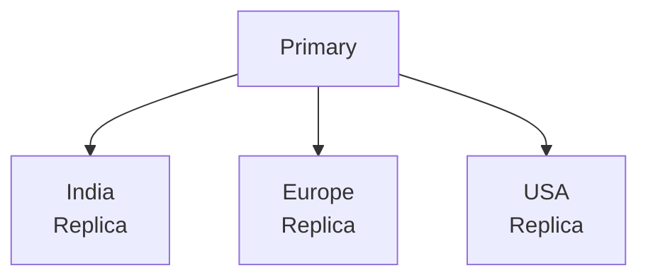

A user in India may access an India-based replica.

This can reduce network distance.

However, geographic replication introduces additional concerns:

- Replication latency
- Network failures
- Cross-region traffic
- Data freshness
- Failover complexity
- Operational cost

So:

```text
Closer replica
≠ automatically better architecture
```

The system still needs to satisfy its consistency and reliability requirements.

---

# 19. Read Replica Failure

A read replica can fail.

For example:

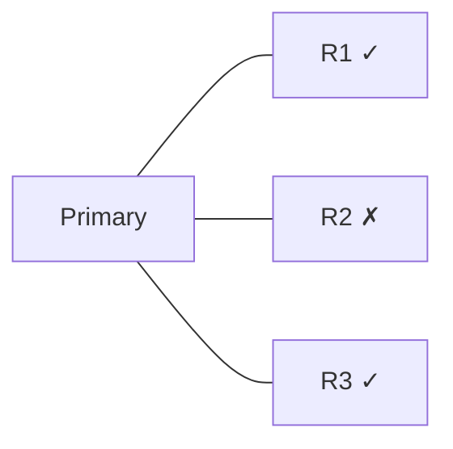

The application should avoid sending new traffic to R2.

A healthy routing system can do:

```mermaid
flowchart TD
  accTitle: Routing around the failure
  accDescr: Read request, then Healthy replicas?, then R1 or R3.
  N0["Read request"] --> N1["Healthy replicas?"] --> N2["R1 or R3"]
```

If no replica is available, the application may temporarily route suitable reads to the primary.

```mermaid
flowchart TD
  accTitle: Fallback
  accDescr: Replica unavailable, then Fallback to primary.
  N0["Replica unavailable"] --> N1["Fallback to primary"]
```

But this has a consequence:

```mermaid
flowchart TD
  accTitle: The cost of fallback
  accDescr: Replica failure, then More reads to primary, then Primary load increases.
  N0["Replica failure"] --> N1["More reads to primary"] --> N2["Primary load increases"]
```

A system must therefore be prepared for the failure itself **and** the load created by the fallback.

---

# 20. All Replicas Are Not Automatically Healthy

A replica can be:

```text
Server = UP
```

while still being unsuitable.

For example:

```text
Replica:
Process running ✓
Network available ✓
Replication lag = 10 minutes ✗
```

From an infrastructure perspective, it is alive.

From an application perspective, it may be too stale.

Therefore, replica health can include:

```text
Infrastructure health
+
Replication freshness
+
Query responsiveness
+
Capacity
```

---

# 21. Connection Pools and Read Replicas

Applications commonly use database connection pools.

With primary/replica architecture, separate pools may be useful:

```mermaid
flowchart TD
  accTitle: Separate pools
  accDescr: The application has a primary pool and a replica pool.
  A["Application"] --> P["Primary Pool"] & R["Replica Pool"]
```

For example:

```text
Primary Pool:
20 connections

Replica Pool:
50 connections
```

The numbers depend on workload and database capacity.

Adding more connections does not automatically improve performance.

Too many connections can increase:

- Memory usage
- CPU overhead
- Context switching
- Lock contention
- Database pressure

Connection capacity is part of the system design.

---

# 22. Read Replicas Do Not Automatically Make Reads Faster

This is an important correction to a common assumption.

Suppose a query takes:

```text
800 ms
```

on the primary because it has a poor execution plan.

Moving the same query to a replica may still result in:

```text
800 ms
```

The replica has the same basic data and may have the same indexes and workload characteristics.

Read replicas primarily provide **additional capacity and workload isolation**.

They do not replace:

- Query optimization
- Proper indexing
- Caching
- Pagination
- Good data modeling

---

# 23. Read Replicas and Caching

Read replicas and caching solve different problems.

A cache can avoid executing a database query entirely.

```mermaid
flowchart TD
  accTitle: Cache in front of a replica
  accDescr: A request checks the cache: HIT returns; MISS goes to the replica.
  Q["Request"] --> C["Cache"]
  C -->|"HIT"| R["Return"]
  C -->|"MISS"| P["Replica"]
```

A replica still executes database work.

So:

```text
Cache:
Avoid database work

Read Replica:
Distribute database work
```

They can work together.

---

# 24. Read Replicas and Transactions

Transactions normally have an authoritative execution point.

For example:

```mermaid
flowchart TD
  accTitle: A transaction on the primary
  accDescr: BEGIN, then UPDATE inventory, then UPDATE order, then COMMIT.
  N0["BEGIN"] --> N1["UPDATE inventory"] --> N2["UPDATE order"] --> N3["COMMIT"]
```

These operations occur against the primary in a primary/replica architecture.

A replica receives the resulting changes through replication.

Therefore, an application should not assume that a replica immediately reflects every committed transaction.

This is another reason why transaction-related reads may require careful routing.

---

# 25. Read Replicas and Caches Can Create Multiple Freshness Layers

Consider:

```mermaid
flowchart TD
  accTitle: Freshness layers
  accDescr: User, then Browser Cache, then Application Cache, then Read Replica, then Primary.
  N0["User"] --> N1["Browser Cache"] --> N2["Application Cache"] --> N3["Read Replica"] --> N4["Primary"]
```

The user may potentially see data that is older at several layers.

For example:

```text
Browser cache: 60 seconds old
Application cache: 20 seconds old
Replica: 5 seconds behind primary
```

Caching and replication therefore need to be designed together.

The question becomes:

> **How stale can this data safely be?**

---

# 26. Read Replicas and Business Requirements

Different data has different freshness requirements.

Consider:

| Data | Typical freshness requirement |
|---|---|
| Product description | Often tolerant of some staleness |
| Product category | Often tolerant |
| Public article | Often tolerant |
| Search results | Often tolerant |
| Sales report | May tolerate some lag |
| Current account balance | Usually more freshness-sensitive |
| Inventory availability | Often freshness-sensitive |
| Newly created order status | May require read-after-write behavior |
| Security permissions | Requires careful consistency handling |

These are not universal rules.

The correct choice depends on the application's actual requirements.

---

# 27. Read Replica Routing Policy

A mature system may define explicit routing policies.

For example:

```mermaid
flowchart TD
  accTitle: Read routing policy
  accDescr: What does the request need? Freshest data: primary. Some lag OK: replica. Heavy reporting: reporting replica.
  Q["Read Request"] --> N["What does the request need?"]
  N -->|"Freshest<br/>data"| P["Primary"]
  N -->|"Some lag<br/>OK"| R["Replica"]
  N -->|"Heavy<br/>reporting"| T["Reporting<br/>Replica"]
```

This is much better than:

```text
SELECT → Replica
```

as a universal rule.

---

# 28. What Happens When a Replica Is Too Far Behind?

Suppose:

```text
Replica A → 2 seconds behind
Replica B → 3 seconds behind
Replica C → 45 seconds behind
```

If the application requires:

```text
Lag < 10 seconds
```

then:

```text
A → eligible
B → eligible
C → temporarily excluded
```

This demonstrates why monitoring and routing are connected.

```mermaid
flowchart TD
  accTitle: Monitoring drives routing
  accDescr: Monitoring, then Freshness information, then Routing decision.
  N0["Monitoring"] --> N1["Freshness information"] --> N2["Routing decision"]
```

---

# 29. Read Replica Scaling

Suppose one replica can safely handle:

```text
5,000 reads/second
```

and the workload requires more capacity.

More replicas provide additional read capacity.

But scaling is not infinite.

The system also adds:

- Replication traffic
- Storage
- Monitoring
- Network traffic
- Connection management
- Operational complexity
- Failover considerations

Therefore:

> **Scaling out the database read layer also creates a larger system to operate.**

---

# 30. What If the Primary Becomes the Bottleneck?

Read replicas primarily reduce read pressure.

They do not automatically solve:

```text
Write bottleneck
```

For example:

```text
Primary:
CPU = 95%

Cause:
8,000 writes/sec
```

Adding five read replicas may not solve the problem.

The architecture may eventually need other techniques:

```text
Query optimization
Indexes
Caching
Batching
Partitioning
Sharding
Write optimization
Data model changes
```

The correct solution depends on the actual bottleneck.

---

# 31. Read Replicas vs Sharding

These concepts are easy to confuse.

### Replication

Copies data.

```mermaid
flowchart LR
  accTitle: Replication copies data
  accDescr: Replication: the primary and three copies.
  R["Primary"]
  R --- K0["Copy"]
  R --- K1["Copy"]
  R --- K2["Copy"]
```

### Sharding

Divides data.

```text
Shard A → Users 1–1M
Shard B → Users 1M–2M
Shard C → Users 2M–3M
```

So:

```text
Replication → more copies
Sharding    → divided ownership of data
```

They can also be combined.

```mermaid
flowchart TD
  accTitle: Shards with replicas
  accDescr: Shard A: primary, replica, replica. Shard B: primary, replica, replica.
  subgraph G1["Shard A"]
    direction TB
    I0["Primary"] ~~~ I1["Replica"] ~~~ I2["Replica"]
  end
  subgraph G2["Shard B"]
    direction TB
    J0["Primary"] ~~~ J1["Replica"] ~~~ J2["Replica"]
  end
```

That is a much more advanced architecture.

---

# 32. Read Replicas Are Not Backups

A replica contains another copy of database state.

A backup serves a different purpose.

Replication:

```mermaid
flowchart TD
  accTitle: Replication
  accDescr: Primary, then Replica.
  N0["Primary"] --> N1["Replica"]
```

Backup:

```mermaid
flowchart TD
  accTitle: Backup
  accDescr: Database, then Backup Storage.
  N0["Database"] --> N1["Backup Storage"]
```

If bad data is accidentally written:

```text
DELETE FROM users;
```

that change may also be replicated.

Replication therefore does not replace a proper backup and recovery strategy.

---

# 33. Failure Scenario — Replica Lag During Heavy Writes

Suppose:

```text
Normal:
Replica lag = 1 second
```

A large traffic spike occurs.

```mermaid
flowchart TD
  accTitle: A traffic spike
  accDescr: Write traffic, then Primary, then Huge replication stream, then Replica.
  N0["Write traffic"] --> N1["Primary"] --> N2["Huge replication stream"] --> N3["Replica"]
```

Replica lag increases:

```mermaid
flowchart TD
  accTitle: Lag grows
  accDescr: 1 sec, then 5 sec, then 20 sec, then 60 sec.
  N0["1 sec"] --> N1["5 sec"] --> N2["20 sec"] --> N3["60 sec"]
```

A read that normally uses the replica may now return very old data.

A freshness-aware system can respond by:

```mermaid
flowchart TD
  accTitle: Freshness-aware response
  accDescr: Replica too stale, then Stop routing sensitive reads there, then Use another replica or primary.
  N0["Replica too stale"] --> N1["Stop routing sensitive reads there"] --> N2["Use another replica or primary"]
```

The fallback itself must be capacity-aware.

---

# 34. Failure Scenario — All Replicas Become Unavailable

Suppose:

```text
Primary ✓
R1 ✗
R2 ✗
R3 ✗
```

Possible behavior:

```mermaid
flowchart TD
  accTitle: All replicas down
  accDescr: Suitable reads, then Primary.
  N0["Suitable reads"] --> N1["Primary"]
```

This preserves availability but increases primary load.

If the primary cannot safely absorb that load, the application may need another strategy:

```text
Graceful degradation
+
Request limiting
+
Caching
+
Reduced read features
```

The correct fallback depends on system requirements and capacity.

---

# 35. Monitoring Read Replicas

A production system should monitor more than:

```text
Replica process = running
```

Useful signals can include:

### Replication

- Replication lag
- Replication errors
- Replication throughput
- Replay/apply progress

### Database performance

- CPU
- Memory
- Disk I/O
- Query latency
- Active connections

### Application behavior

- Reads per replica
- Error rate
- Fallback-to-primary rate
- Replica selection
- Stale-read indicators where measurable

A simplified dashboard might look like:

```text
Replica     Lag       CPU      Reads/sec
-----------------------------------------
R1          0.8s      45%      3,200
R2          1.2s      51%      3,100
R3          18s       72%      1,900
```

R3 may need investigation or temporary exclusion.

---

# 36. The Fallback-to-Primary Metric Matters

Imagine replicas fail and all traffic silently moves to the primary.

The application may appear healthy initially.

But:

```mermaid
flowchart TD
  accTitle: Silent fallback
  accDescr: Replica failure, then More primary reads, then Primary load increases, then Primary latency increases, then Application latency increases.
  N0["Replica failure"] --> N1["More primary reads"] --> N2["Primary load increases"] --> N3["Primary latency increases"] --> N4["Application latency increases"]
```

Therefore, a useful metric is:

```text
How many reads are falling back to the primary?
```

This can reveal hidden capacity problems.

---

# 37. Read Replica Connection Architecture

A more complete architecture can look like:

```mermaid
flowchart TD
  accTitle: Read replica connection architecture
  accDescr: Users reach a load balancer that spreads traffic over App 1 and App 2. Each app has a primary pool to the primary; they share a replica pool to a read router for R1, R2 and R3.
  U["Users"] --> L["Load Balancer"] --> A1["App 1"] & A2["App 2"]
  A1 --> P1["Primary<br/>Pool"]
  A1 --> RP["Replica<br/>Pool"]
  A2 --> RP
  A2 --> P2["Primary<br/>Pool"]
  P1 --> P["Primary"]
  P2 --> P
  RP --> RR["Read Router"] --> R1["R1"] & R2["R2"] & R3["R3"]
```

The exact architecture differs by database and infrastructure.

The important concepts are:

```text
Write routing
Read routing
Connection management
Replica health
Replica freshness
Failure handling
```

---

# 38. When Do Read Replicas Help?

Read replicas are useful when several conditions align.

For example:

```text
Large read workload
        +
Primary read capacity is a bottleneck
        +
Reads can tolerate some replication lag
        +
Queries can be distributed
        +
The organization can operate replicas
```

Then read replicas may provide additional read capacity and workload isolation.

---

# 39. When Do Read Replicas Not Help?

They may not address the real problem when:

### The database is write-bound

```text
Writes are the bottleneck
```

Replicas do not automatically increase write capacity.

### Queries are inefficient

```mermaid
flowchart TD
  accTitle: Replicas do not fix queries
  accDescr: Bad query, then Replica, then Still bad query.
  N0["Bad query"] --> N1["Replica"] --> N2["Still bad query"]
```

### Missing indexes are the problem

Replication does not replace indexing.

### Most data is already cached

If almost all reads are cache hits, additional replicas may provide little benefit.

### Strong consistency is required for most reads

If most requests must observe the latest state, routing them to asynchronous replicas may provide limited benefit.

---

# 40. Common Mistakes

## Mistake 1 — Sending Every SELECT to a Replica

A read may still require fresh data.

---

## Mistake 2 — Ignoring Replica Lag

A replica can be reachable but significantly behind.

---

## Mistake 3 — Assuming Replication Is Instant

Asynchronous replication can produce stale reads.

---

## Mistake 4 — Using Replicas to Fix Slow Queries

A poor query can remain poor on every replica.

---

## Mistake 5 — Adding Replicas Without Measuring

More replicas increase operational complexity.

---

## Mistake 6 — Forgetting Primary Fallback Load

If replicas fail, the primary may receive a large amount of additional read traffic.

---

## Mistake 7 — Treating Replicas as Backups

Replication and backup solve different problems.

---

## Mistake 8 — Ignoring Connection Limits

Every additional application instance and replica can affect connection management.

---

## Mistake 9 — Ignoring Reporting Workloads

Heavy analytical queries can interfere with transactional traffic if they share the wrong database workload.

---

## Mistake 10 — Treating "Healthy" as "Fresh"

A running replica can still be too stale for a particular request.

---

# 41. Hands-On Exercise — Design Read Replica Routing

Instead of creating fake PostgreSQL databases and calling them replicas, this exercise focuses on **application-level routing decisions**.

Actual database replication requires a real replication mechanism and configuration.

## Scenario

You operate an e-commerce application.

The architecture is:

```mermaid
flowchart LR
  accTitle: Exercise architecture
  accDescr: The primary has replicas A, B and C.
  R["Primary"]
  R --- K0["Replica A"]
  R --- K1["Replica B"]
  R --- K2["Replica C"]
```

The application receives these requests:

```text
1. Browse product catalog
2. View current account balance
3. Create an order
4. View newly created order
5. Generate yesterday's sales report
6. View product description
```

---

## Step 1 — Classify the Reads

Create this table:

| Request | Read/Write | Freshness Need | Possible Destination |
|---|---|---|---|
| Browse product catalog | Read | Low/Medium | Replica |
| Current account balance | Read | High | Primary |
| Create an order | Write | Authoritative write | Primary |
| View newly created order | Read | High immediately after write | Primary or consistency-aware routing |
| Yesterday's sales report | Read | May tolerate lag | Reporting Replica |
| Product description | Read | Often tolerant | Replica |

These are examples, not universal rules.

The important exercise is to explain **why** each request has its routing requirement.

---

# 42. Lab Challenge — Replica Failure

Initial state:

```text
Primary ✓
Replica A ✓
Replica B ✓
Replica C ✓
```

Replica B fails.

Design the routing behavior.

A reasonable approach:

```mermaid
flowchart TD
  accTitle: Handling the failure
  accDescr: Replica B, then Remove from eligible pool, then Route reads to A/C.
  N0["Replica B"] --> N1["Remove from eligible pool"] --> N2["Route reads to A/C"]
```

Then ask:

```text
Can A and C handle the additional traffic?
```

If not, the application may need:

```text
Primary fallback
+
Caching
+
Traffic reduction
+
Graceful degradation
```

The correct response depends on the system's capacity and requirements.

---

# 43. Lab Challenge — Replica Lag

Suppose:

```text
Replica A → 2 sec
Replica B → 4 sec
Replica C → 60 sec
```

A product browsing request can tolerate:

```text
up to 30 sec
```

A current account balance request requires:

```text
latest available state
```

Possible routing:

```text
Product browsing:
A or B

Current balance:
Primary
```

Notice that the same database cluster can use different routing policies for different application operations.

---

# 44. System Design View

Read replicas are not primarily about creating database copies.

They are about answering a larger system-design question:

> **How can a database serve more read workload without forcing every read through the same authoritative database node?**

The evolution may look like:

```mermaid
flowchart TD
  accTitle: System design evolution
  accDescr: Single Database, then Optimize Queries, then Add Indexes, then Add Cache, then Primary + Read Replica, then Multiple Read Replicas, then Dedicated Reporting / Geographic Replicas.
  N0["Single Database"] --> N1["Optimize Queries"] --> N2["Add Indexes"] --> N3["Add Cache"] --> N4["Primary + Read Replica"] --> N5["Multiple Read Replicas"] --> N6["Dedicated Reporting / Geographic Replicas"]
```

Notice the progression.

You do not automatically jump to replicas.

You first understand the bottleneck.

---

# 45. Read Replicas Are Part of a Larger Performance Strategy

A mature application may use several layers:

```mermaid
flowchart TD
  accTitle: A larger performance strategy
  accDescr: User, CDN/cache, application cache, application; writes go to the primary and reads to the read replica pool of R1, R2 and R3.
  U["User"] --> C["CDN/Cache"] --> AC["Application Cache"] --> A["Application"]
  A -->|"Writes"| P["Primary"]
  A -->|"Reads"| RP["Read Replica Pool"]
  RP --> R1["R1"] & R2["R2"] & R3["R3"]
```

Each layer has a different responsibility.

```text
Cache:
Avoid database work

Read replicas:
Distribute database reads

Primary:
Authoritative writes

Indexes:
Reduce query work

Query optimization:
Make database work efficient
```

This is system thinking: **different mechanisms solve different bottlenecks.**

---

# 46. A Read Replica Decision Framework

Before adding read replicas, ask:

### 1. What is the bottleneck?

```text
Reads?
Writes?
CPU?
I/O?
Connections?
Queries?
```

### 2. How much read traffic exists?

```text
Reads/sec = ?
```

### 3. Can the reads tolerate stale data?

```text
Yes / No / Sometimes
```

### 4. How much lag is acceptable?

```text
0 sec?
1 sec?
10 sec?
1 minute?
```

### 5. Can reads be routed independently?

```text
Yes / No
```

### 6. What happens when a replica fails?

```text
Another replica?
Primary fallback?
Cache?
Degraded feature?
```

### 7. Can the primary handle fallback traffic?

This is often overlooked.

### 8. How will replica freshness be monitored?

```text
Lag
Errors
Latency
Capacity
```

### 9. Are queries optimized?

Adding replicas should not hide inefficient database work.

### 10. Is the operational complexity justified?

A replica is another system component to monitor, maintain, secure, and recover.

---

# 47. Quick Reference

| Concept | Meaning |
|---|---|
| Read Replica | Replicated database copy used primarily for reads |
| Primary | Usually authoritative node for writes |
| Read/Write Splitting | Routing writes and reads to different database nodes |
| Replica Lag | Difference in freshness between primary and replica |
| Stale Read | Read that returns older replicated state |
| Sticky Read | Temporarily routing a user's reads to a consistent source after a write |
| Read Scaling | Increasing read capacity by distributing reads |
| Reporting Replica | Replica used to isolate reporting/analytical workload |
| Geographic Replica | Replica placed closer to users in another region |
| Replica Health | Whether a replica is usable |
| Replica Freshness | Whether its data is current enough |
| Fallback | Sending traffic elsewhere when a replica cannot serve it |

---

# 48. Read Replica Mental Model

Remember this flow:

```mermaid
flowchart TD
  accTitle: Read replica mental model
  accDescr: Writes go to the primary, which replicates to R1, R2 and R3, which serve reads.
  W["Write"] --> P["Primary"] -->|"Replication"| R1["R1"] & R2["R2"] & R3["R3"]
  R1 & R2 & R3 --- D["Reads"]
```

But the real routing decision is:

```mermaid
flowchart TD
  accTitle: The real routing decision
  accDescr: What freshness does the read need? Latest or consistency-sensitive: primary. Some lag acceptable: healthy replica.
  Q["Read Request"] --> F["What freshness does it need?"]
  F -->|"Latest /<br/>consistency-sensitive"| P["Primary"]
  F -->|"Some lag<br/>acceptable"| H["Healthy Replica"]
```

---

# 49. Knowledge Check

### Question 1

What is the primary purpose of a read replica?

<details>
<summary>Answer</summary>

To provide a replicated copy of database state that can serve suitable read workloads, helping distribute read traffic and isolate workloads from the primary.
</details>

---

### Question 2

Why can a read replica return stale data?

<details>
<summary>Answer</summary>

Because replication can take time. The primary may contain a newer committed state while the replica has not yet received or applied that change.
</details>

---

### Question 3

Should every `SELECT` automatically go to a replica?

<details>
<summary>Answer</summary>

No. The correct destination depends on the read's freshness and consistency requirements.
</details>

---

### Question 4

What is read-after-write consistency?

<details>
<summary>Answer</summary>

It means that after a successful write, a subsequent read should be able to observe that write.
</details>

---

### Question 5

Can read replicas solve a write bottleneck?

<details>
<summary>Answer</summary>

Not directly. Read replicas primarily increase read capacity. A write bottleneck requires a different solution based on the actual constraint.
</details>

---

### Question 6

What is the difference between replication and sharding?

<details>
<summary>Answer</summary>

Replication creates copies of data. Sharding divides data across different partitions or nodes.
</details>

---

### Question 7

Why is a healthy replica not necessarily a suitable replica?

<details>
<summary>Answer</summary>

A replica can be reachable and operational while still being too far behind the primary for a particular request.
</details>

---

# 51. Remember

A read replica is not simply:

> "another database."

It is a database copy introduced to serve a particular architectural purpose.

The important questions are:

```text
Why do we need it?
What reads can use it?
How stale can the data be?
How do we route requests?
How do we detect lag?
What happens if it fails?
Can the primary handle fallback traffic?
```

If those questions are unanswered, simply adding replicas does not create a reliable read-scaling strategy.

---

# 52. Key Principle

> **Read replicas increase database read capacity by allowing suitable read workloads to be served from replicated copies of the primary's data. Their real design challenge is not replication itself, but deciding which reads can tolerate lag, routing them safely, monitoring freshness, and handling failures without overwhelming the primary.**

---

# 53. Next Chapter

## 04.13 — Database Partitioning

In the next chapter, we move from **copying data** to **dividing data**.

We will learn:

- What database partitioning is
- Why partitioning exists
- Horizontal partitioning
- Vertical partitioning
- Range partitioning
- List partitioning
- Hash partitioning
- Partition keys
- Partition pruning
- Partition size
- Time-based partitioning
- Hot partitions
- Partition maintenance
- Partitioning vs sharding
- Partitioning vs replication
- Query behavior
- Indexes and partitions
- Failure and operational considerations
- When partitioning helps
- When partitioning does not
- Common mistakes
- Hands-on partitioning exercise
- How partitioning prepares us for sharding
