# 04.13 — Database Partitioning

## Learning Objectives

By the end of this chapter, you should understand:

- What database partitioning means
- Why databases are partitioned
- The difference between partitioning and simply creating more tables
- Horizontal partitioning
- Vertical partitioning
- Range partitioning
- List partitioning
- Hash partitioning
- What a partition key is
- How partition pruning works
- Why partition size matters
- Time-based partitioning
- How indexes interact with partitions
- What hot partitions are
- Partition maintenance
- Partitioning vs replication
- Partitioning vs sharding
- When partitioning helps
- When partitioning does not solve the real problem
- Common partitioning mistakes
- How partitioning changes query and system behavior

---

# 1. What Is Database Partitioning?

**Database partitioning** is the process of dividing a large logical dataset into smaller physical pieces called **partitions**, while allowing the application to treat them as one logical dataset.

For example, imagine a table containing:

```text
1 billion orders
```

Instead of storing all rows in one physical partition:

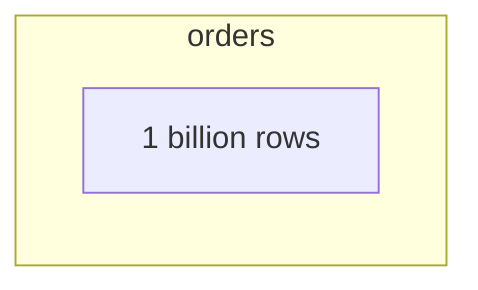

the database can divide the data:

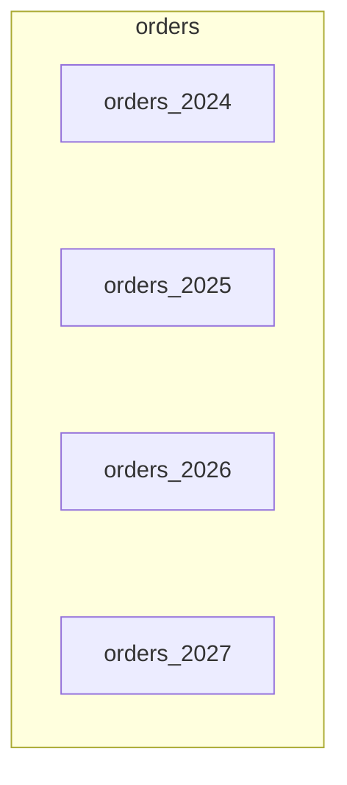

From the application's perspective, it can still query:

```sql
SELECT *
FROM orders
WHERE order_date >= '2026-01-01';
```

The database can determine which partitions are relevant.

The key idea is:

> **One logical dataset can be physically divided into smaller pieces.**

---

# 2. Why Does Partitioning Exist?

Large tables create several problems.

As a table grows:

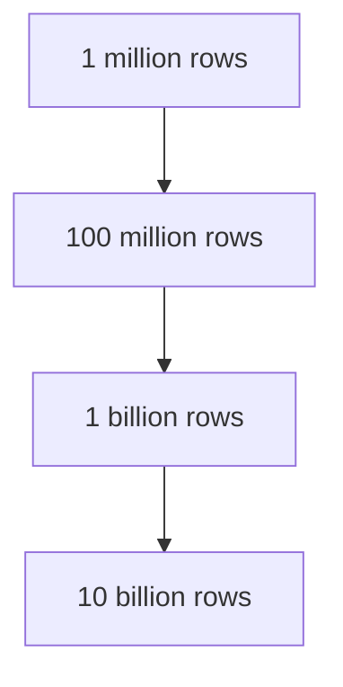

operations can become increasingly expensive.

Potential problems include:

- Large indexes
- Large scans
- Maintenance operations
- Backup/restore complexity
- Data archival
- Storage management
- Vacuum/cleanup work
- Query performance
- Operational management

Partitioning allows the database to work with smaller sections of the dataset.

For example:

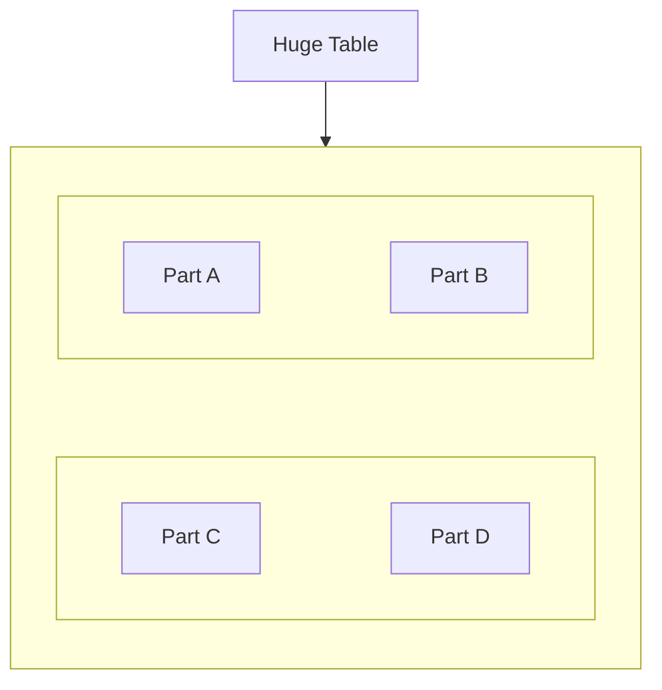

The database can sometimes avoid touching partitions that cannot contain the requested rows.

---

# 3. Partitioning Does Not Mean Multiple Databases

This is an important distinction.

Partitioning can happen inside one database system.

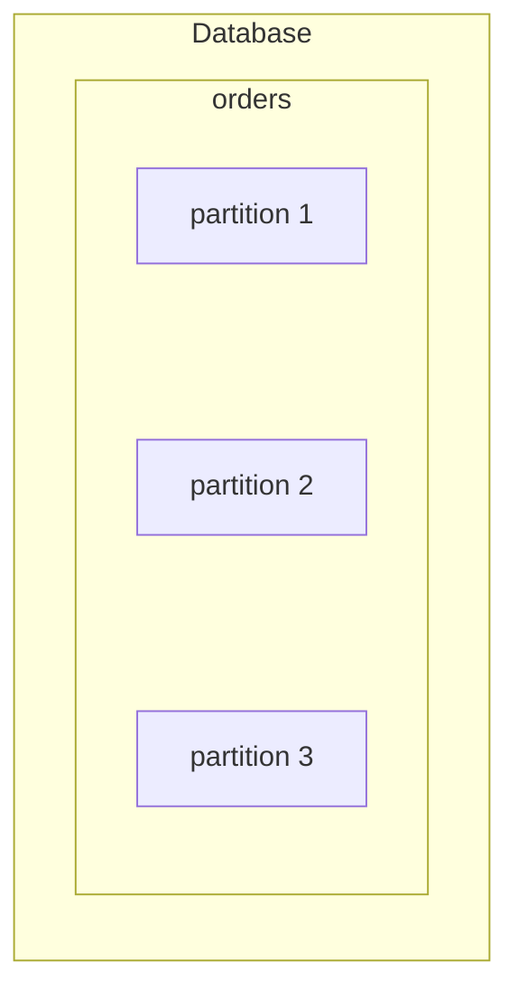

You do not necessarily have:

```text
Database A
Database B
Database C
```

Instead, you may have:

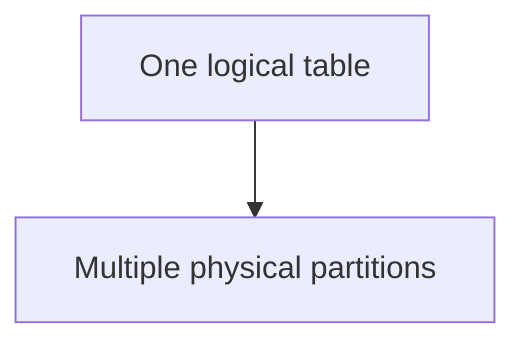

The exact implementation depends on the database system.

---

# 4. A Simple Analogy

Imagine a library with one billion books.

Instead of placing every book into one enormous room:

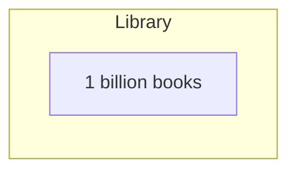

you organize them into sections:

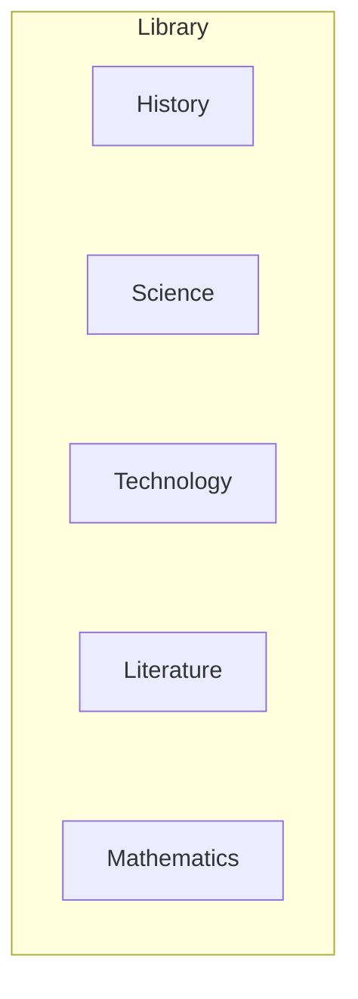

When someone asks:

> "Show me technology books."

you do not search every section.

You go directly to:

```text
Technology
```

Database partitioning can provide a similar benefit.

The database uses the partitioning scheme to identify which physical sections may contain the required data.

---

# 5. Horizontal Partitioning

**Horizontal partitioning** divides a table by **rows**.

Suppose:

```text
users
```

contains:

| id | name | country |
|---:|---|---|
| 1 | A | IN |
| 2 | B | US |
| 3 | C | IN |
| 4 | D | UK |
| 5 | E | US |

Horizontal partitioning might divide rows by country:

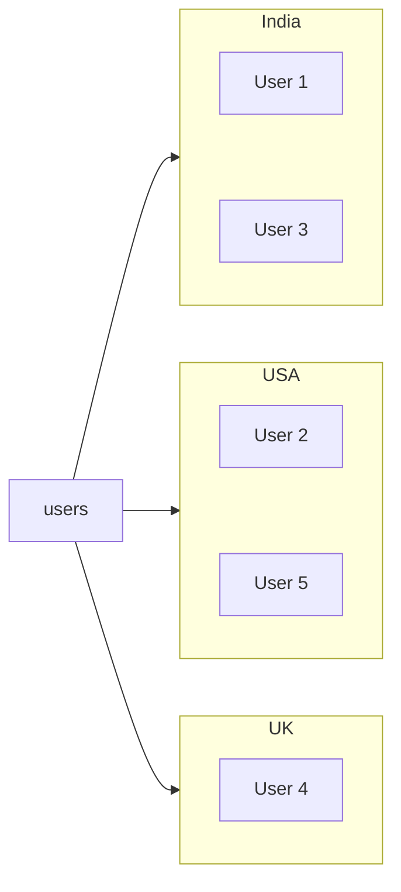

The columns remain essentially the same.

What changes is **which rows live in which partition**.

---

# 6. Vertical Partitioning

**Vertical partitioning** divides data by **columns** rather than rows.

Suppose:

```text
users
```

contains:

```text
id
name
email
phone
address
profile_photo
preferences
```

You might separate frequently accessed data from less frequently accessed data:

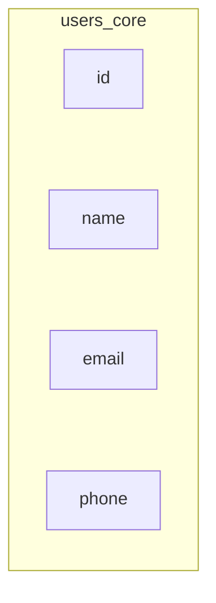

and:

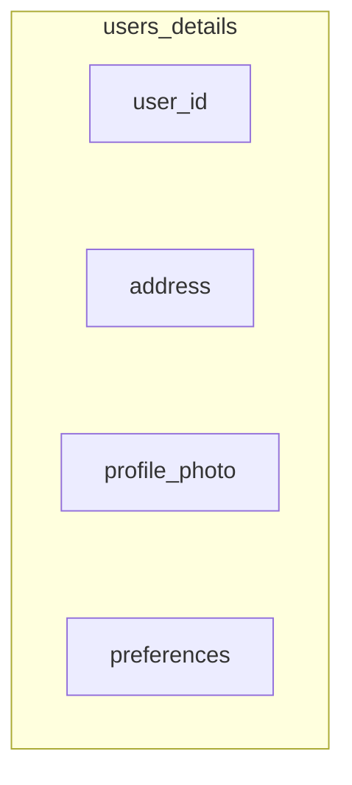

The data is still logically related to the same user.

The goal may be to avoid carrying large or rarely used columns through common queries.

---

# 7. Horizontal vs Vertical Partitioning

| Type | Divides | Example |
|---|---|---|
| Horizontal | Rows | Orders by year |
| Vertical | Columns | User core data vs profile data |

Visual comparison:

```text
Horizontal
────────────────────────────

Partition A → Rows 1–1M
Partition B → Rows 1M–2M
Partition C → Rows 2M–3M
```

```text
Vertical
────────────────────────────

Table A → id, name, email
Table B → id, address, preferences
```

Horizontal partitioning is the type most commonly discussed when talking about very large database tables.

---

# 8. What Is a Partition Key?

A **partition key** is the value used to determine which partition should contain a row.

For example:

```text
orders
partition key = order_date
```

Conceptually:

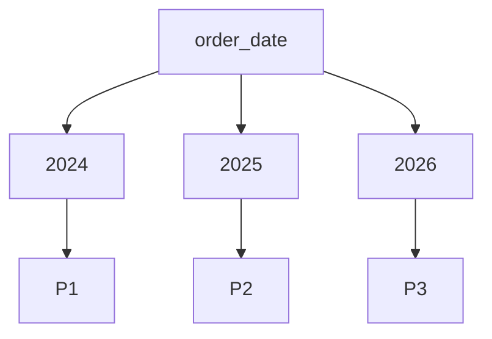

Choosing the partition key is one of the most important partitioning decisions.

---

# 9. A Good Partition Key

A useful partition key generally has these properties:

- It matches important query patterns
- It distributes data reasonably
- It does not create extreme hotspots
- It provides useful partition pruning
- It supports operational requirements
- It is reasonably stable

For example, if most queries are:

```sql
WHERE order_date >= ...
```

then date-based partitioning may make sense.

But if most queries are:

```sql
WHERE customer_id = ...
```

then partitioning by date may not provide much benefit for those queries.

---

# 10. Partitioning Should Follow Access Patterns

This is the same principle introduced in data modeling.

Do not begin with:

> "Which partitioning strategy is popular?"

Begin with:

> **"How does the application access this data?"**

For example:

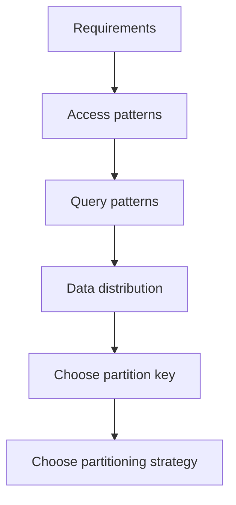

Partitioning is an architectural decision, not merely a database configuration option.

---

# 11. Range Partitioning

**Range partitioning** divides data according to ranges of values.

For example:

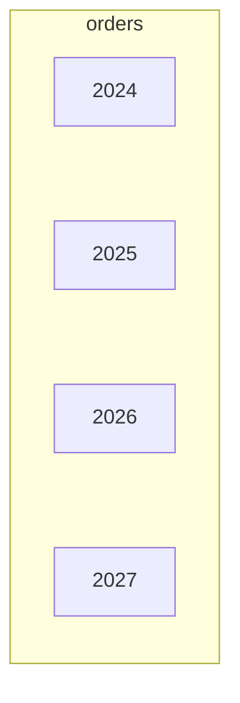

The partition ranges could be based on:

- Dates
- Numeric IDs
- Timestamps
- Other ordered values

Example:

```text
Partition 1:
order_date < 2025-01-01

Partition 2:
2025-01-01 ≤ order_date < 2026-01-01

Partition 3:
2026-01-01 ≤ order_date < 2027-01-01
```

---

# 12. Partition Pruning

**Partition pruning** means eliminating partitions that cannot contain the requested rows.

Query:

```sql
SELECT *
FROM orders
WHERE order_date >= '2026-01-01'
  AND order_date < '2027-01-01';
```

The database can potentially determine:

```text
2024 → skip
2025 → skip
2026 → scan
2027 → skip
```

So:

```text
Without pruning:

P1 + P2 + P3 + P4

With pruning:

P3
```

This can significantly reduce the amount of data that needs to be examined.

But pruning depends on the database, partition definition, query, and planner behavior.

---

# 13. Partition Pruning Is Not the Same as Indexing

These concepts work at different levels.

An index helps the database find rows **within a data structure**.

Partition pruning helps the database decide:

> **Which partitions do I need to look at at all?**

Conceptually:

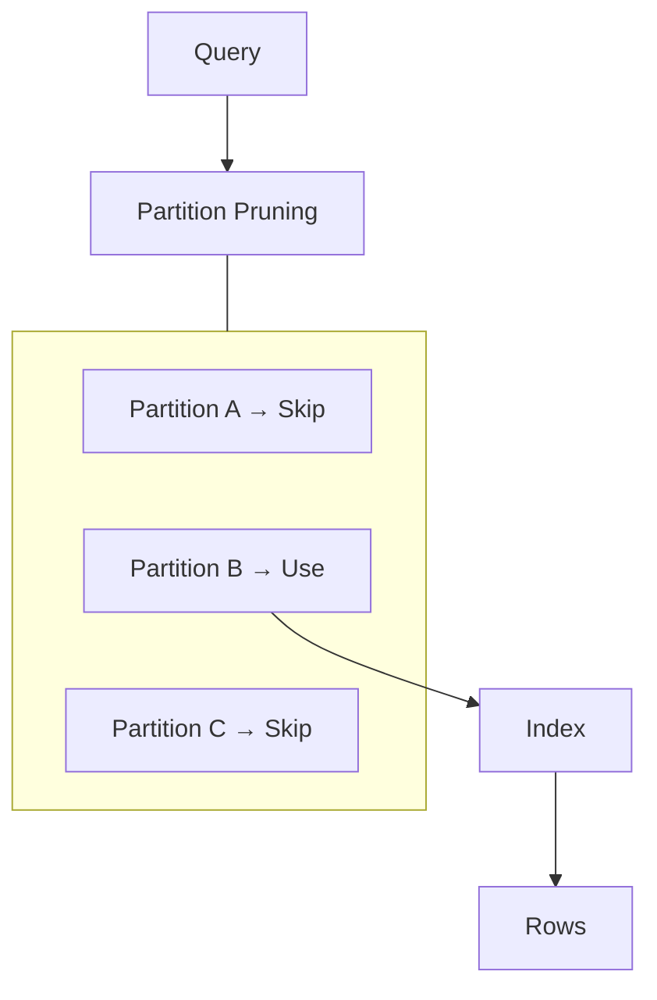

Partitioning and indexing can therefore complement each other.

---

# 14. List Partitioning

**List partitioning** divides rows according to explicit values.

For example:

```text
country
```

could be divided into:

```text
Partition India
Partition USA
Partition UK
Partition Canada
```

This can make sense when the set of categories is known and relatively stable.

---

# 15. Problems With List Partitioning

Suppose you partition by:

```text
country
```

and initially have:

```text
India
USA
UK
Canada
```

Later the business expands into:

```text
Germany
France
Japan
Australia
Brazil
```

The partition design now needs to evolve.

If the number of categories becomes very large or changes frequently, list partitioning can become operationally awkward.

Therefore:

> **A partitioning scheme should consider how the data and business will evolve, not just how it looks today.**

---

# 16. Hash Partitioning

**Hash partitioning** uses a hash function to distribute rows across partitions.

Suppose:

```text
partition key = customer_id
```

The database can conceptually calculate:

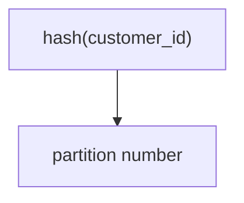

For example:

```text
Customer 101 → Partition 2
Customer 102 → Partition 4
Customer 103 → Partition 1
Customer 104 → Partition 3
```

The exact hash values are implementation-dependent.

The important idea is:

> **Hash partitioning aims to distribute rows across partitions rather than grouping them into meaningful ranges.**

---

# 17. Why Hash Partitioning Exists

Hash partitioning can help distribute data more evenly.

For example:

```text
Partition 1 → 25%
Partition 2 → 24%
Partition 3 → 26%
Partition 4 → 25%
```

This can be useful when:

- Data needs broad distribution
- There is no useful natural range
- You want to reduce concentration in one partition
- Queries commonly use the partition key

But hash partitioning has a trade-off.

It does not naturally group related ranges.

For example:

```text
customer_id 1000
customer_id 1001
customer_id 1002
```

may end up in different partitions.

---

# 18. Range vs List vs Hash

| Strategy | Partition decision | Useful when |
|---|---|---|
| Range | Value falls within a range | Time/range queries |
| List | Value belongs to a defined set | Known categories |
| Hash | Hash determines partition | Even distribution |

There is no universally correct strategy.

---

# 19. Time-Based Partitioning

Time-based partitioning is common for data that continuously grows.

Examples:

- Orders
- Events
- Logs
- Transactions
- Metrics
- Audit records

For example:

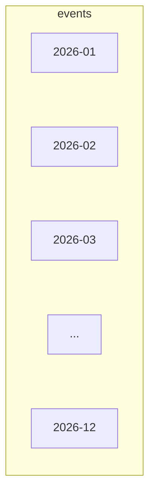

New data enters the current partition.

Older data moves naturally into historical partitions.

This can make lifecycle management easier.

---

# 20. Partitioning and Data Lifecycle

Suppose an application keeps:

```text
7 years of audit events
```

but only recent data is queried frequently.

You could organize:

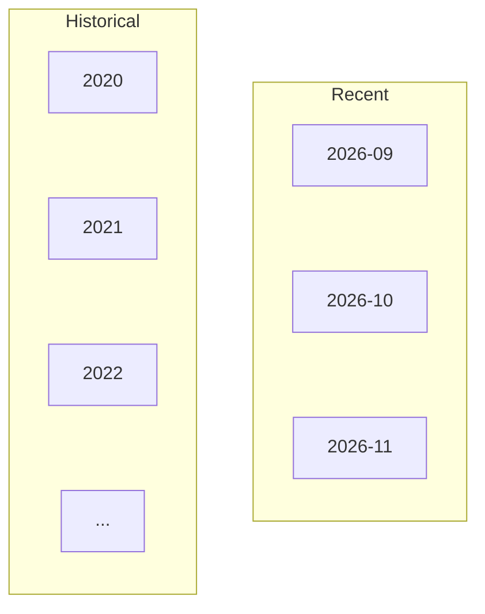

The architecture can then apply different operational policies to different partitions.

For example:

```text
Recent partitions
→ frequently queried

Old partitions
→ rarely queried

Very old partitions
→ archived
```

Partitioning can therefore support data lifecycle management, not only query performance.

---

# 21. Partition Size Matters

Partitioning a table into two pieces is not automatically useful.

Consider:

```text
1 billion rows
```

divided into:

```text
2 partitions
```

Each contains:

```text
500 million rows
```

That may still be very large.

On the other hand:

```text
1 billion rows
```

divided into:

```text
10,000 tiny partitions
```

can create excessive management and planning overhead.

Therefore:

> **Partition size should be appropriate for the workload and database system.**

There is no universal ideal number of rows per partition.

---

# 22. Too Many Partitions

Too many partitions can create:

- Metadata overhead
- More planning complexity
- More maintenance
- More indexes to manage
- More operational work
- More complicated monitoring

For example:

```text
1 million tiny partitions
```

is not automatically better than:

```text
100 well-sized partitions
```

The correct number depends on the database engine and workload.

---

# 23. Hot Partitions

A **hot partition** is a partition receiving disproportionately high traffic or write activity.

Suppose:

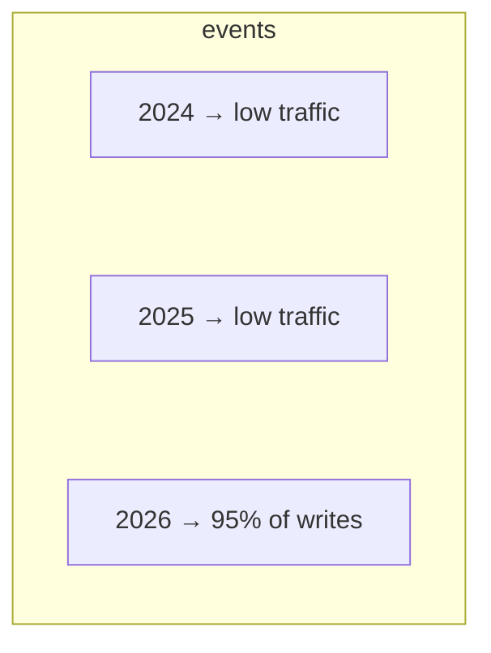

The 2026 partition becomes hot.

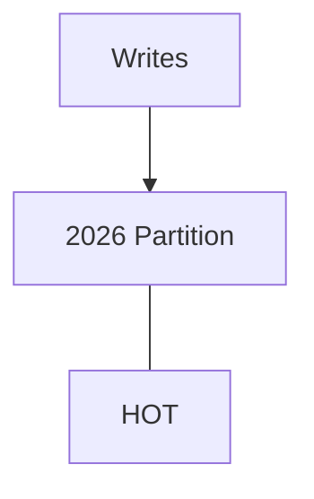

This can create:

- CPU pressure
- Lock contention
- I/O pressure
- Uneven resource utilization

Partitioning does not automatically guarantee even workload distribution.

---

# 24. Partitioning and Indexes

Indexes can exist alongside partitions.

Conceptually:

```mermaid
flowchart TD
  accTitle: Indexes per partition
  accDescr: Orders has partitions 2025, 2026 and 2027, each with its own index.
  O["Orders"] --- P1["Partition<br/>2025"] & P2["Partition<br/>2026"] & P3["Partition<br/>2027"]
  P1 --- I1["Index"]
  P2 --- I2["Index"]
  P3 --- I3["Index"]
```

The exact indexing model depends on the database system.

The important point is:

> **Partitioning does not eliminate the need for appropriate indexes.**

A query may first benefit from partition pruning and then from an index inside the selected partition.

---

# 25. Partitioning Does Not Automatically Fix Bad Queries

Suppose the query is:

```sql
SELECT *
FROM orders
WHERE LOWER(customer_name) = 'alice';
```

If the partitioning scheme is based on:

```text
order_date
```

partitioning may provide little benefit.

The real problem may involve:

- Missing index
- Function applied to column
- Poor selectivity
- Large result set
- Inefficient query pattern

The same principle from query optimization applies:

> **Find the bottleneck before adding architecture.**

---

# 26. Partitioning and Transactions

Transactions can interact with multiple partitions.

For example:

```mermaid
flowchart TD
  accTitle: A transaction across partitions
  accDescr: A transaction touches partition A and partition B.
  R["Transaction"]
  R --- K0["Partition A"]
  R --- K1["Partition B"]
```

The database must maintain transactional guarantees across the affected data according to its supported partitioning model.

Therefore, partitioning does not mean:

> "Each partition is an independent transaction system."

The logical table can still require transactional correctness across partitions.

---

# 27. Partitioning and Constraints

Partitioning schemes must also respect data integrity.

For example:

```text
orders
partitioned by order_date
```

The database needs a clear rule determining where each row belongs.

Conceptually:

```mermaid
flowchart TD
  accTitle: Row placement
  accDescr: order_date = 2026-09-20, then 2026 partition.
  N0["order_date = 2026-09-20"] --> N1["2026 partition"]
```

The partitioning design should prevent ambiguous or invalid placement.

Exact constraint behavior varies by database system.

---

# 28. Partitioning and Maintenance

One major benefit of partitioning can be easier maintenance.

Suppose:

```mermaid
flowchart TD
  accTitle: Yearly partitions
  accDescr: orders has 2024, 2025 and 2026 partitions.
  subgraph G["orders"]
    direction TB
    I0["2024"] ~~~ I1["2025"] ~~~ I2["2026"]
  end
```

You may want to archive 2024.

Instead of processing the entire logical table, a database system may allow operations focused on the relevant partition.

Conceptually:

```mermaid
flowchart TD
  accTitle: Partition maintenance
  accDescr: 2024 Partition, then Archive / Detach / Remove.
  N0["2024 Partition"] --> N1["Archive / Detach / Remove"]
```

The exact operation depends on the database.

This can be especially useful for time-series and historical data.

---

# 29. Partitioning vs Replication

These concepts solve different problems.

### Replication

Creates copies.

```mermaid
flowchart LR
  accTitle: Replication
  accDescr: Replication: a primary with replicas A, B and C.
  R["Primary"]
  R --- K0["Replica A"]
  R --- K1["Replica B"]
  R --- K2["Replica C"]
```

### Partitioning

Divides one logical dataset into physical pieces.

```mermaid
flowchart LR
  accTitle: Partitioning
  accDescr: Partitioning: orders divided into partitions A, B and C.
  R["Orders"]
  R --- K0["Partition A"]
  R --- K1["Partition B"]
  R --- K2["Partition C"]
```

So:

```text
Replication → Copy data

Partitioning → Divide data
```

They can be combined.

```mermaid
flowchart TD
  accTitle: Replicas of a partitioned table
  accDescr: The primary has a replica and another replica, each holding partitions A, B and C.
  P["Primary"] --- G1 & G2
  subgraph G1["Replica"]
    direction TB
    I0["Partition A"] ~~~ I1["Partition B"] ~~~ I2["Partition C"]
  end
  subgraph G2["Another Replica"]
    direction TB
    J0["Partition A"] ~~~ J1["Partition B"] ~~~ J2["Partition C"]
  end
```

The exact implementation varies by database system.

---

# 30. Partitioning vs Sharding

This distinction is especially important because the next chapters cover sharding.

### Partitioning

Data is divided into partitions within a database system.

### Sharding

Data is distributed across separate database nodes or database instances.

```mermaid
flowchart TD
  accTitle: Sharding
  accDescr: The application uses shards A, B and C.
  A["Application"] --> S1["Shard A"] & S2["Shard B"] & S3["Shard C"]
```

A useful simplified distinction is:

```text
Partitioning
= divide data

Sharding
= distribute divided data across independent database nodes
```

However, terminology can vary across database products.

Some systems use "partition" for pieces that are stored independently, and some architectures combine partitioning with distribution.

The important system-design distinction is **where the data physically lives and who is responsible for coordinating access to it**.

---

# 31. Partitioning Can Be a Step Toward Sharding

Suppose you begin with:

```text
One huge table
```

Then:

```text
Partition by customer_id
```

Later the workload becomes too large for one database node.

You might evolve toward:

```mermaid
flowchart TD
  accTitle: Toward sharding
  accDescr: Customer partitions are distributed across multiple database nodes, which is sharding.
  N0["Customer partitions"] --> N1["Distributed across<br/>multiple database nodes"] --> N2["Sharding"]
```

Conceptually:

```mermaid
flowchart TD
  accTitle: Partitions across shards
  accDescr: Orders are spread over shard A (P1/P2), shard B (P3/P4) and shard C (P5/P6).
  O["Orders"] --> A["Shard A"] & B["Shard B"] & C["Shard C"]
  A --- A1["P1/P2"]
  B --- B1["P3/P4"]
  C --- C1["P5/P6"]
```

This is not an automatic migration path, but partitioning can help develop the thinking needed for distributed data.

---

# 32. Partitioning vs Separate Tables

A common question is:

> "Why not just create separate tables?"

For example:

```text
orders_2024
orders_2025
orders_2026
```

This is a form of manual table separation.

Database-native partitioning can provide a unified logical table while allowing the database to manage physical partitions.

Conceptually:

```mermaid
flowchart TD
  accTitle: Manual tables
  accDescr: Manual tables: the application uses orders_2024, orders_2025 and orders_2026 directly.
  subgraph G["Manual tables:"]
    direction LR
    A["Application"] --- T1["orders_2024"] & T2["orders_2025"] & T3["orders_2026"]
  end
```

versus:

```mermaid
flowchart TD
  accTitle: Partitioned table
  accDescr: Partitioned table: the application uses orders, which holds P2024, P2025 and P2026.
  subgraph G["Partitioned table:"]
    direction TB
    A["Application"] --> O["orders"]
    O --- P2["P2025"] & P3["P2026"] & P1["P2024"]
  end
```

The second model can reduce application-level routing logic.

The exact advantages depend on the database system.

---

# 33. What Happens Without a Useful Partition Filter?

Consider:

```sql
SELECT COUNT(*)
FROM orders;
```

There is no date filter.

The database may need to examine every relevant partition:

```mermaid
flowchart LR
  accTitle: Aggregating every partition
  accDescr: P2024 to P2028 all feed the aggregate.
  P1["P2024"] & P2["P2025"] & P3["P2026"] & P4["P2027"] & P5["P2028"] --> A["Aggregate"]
```

Partitioning does not eliminate the work.

It may still help with:

- Maintenance
- Storage management
- Lifecycle operations
- Parallelism in some systems

But it does not automatically turn every query into a fast query.

---

# 34. Failure and Operational Considerations

Partitioning introduces its own operational questions.

You need to consider:

- Partition creation
- Partition removal
- Partition retention
- Index management
- Backup behavior
- Restore behavior
- Monitoring
- Migration
- Partition growth
- Uneven data distribution
- Query planner behavior

For time-based partitioning, for example:

```text
Before new month:
Create next partition
```

Otherwise new data may encounter a partitioning problem depending on the database configuration.

Automation is often useful for predictable partition lifecycle management.

---

# 35. Schema Evolution

A partitioned table still needs schema changes.

For example:

```text
Add column:
customer_segment
```

The database needs to apply the schema change consistently across the partitioned structure according to its implementation.

This means partitioning can increase the scope of operational planning.

The benefit of partitioning must therefore justify the added complexity.

---

# 36. Partitioning and Backups

Partitioning does not automatically make backups unnecessary or trivial.

You still need to answer:

```text
What data must be backed up?
How frequently?
How is it restored?
Can individual partitions be restored?
What consistency guarantees are required?
```

A partition may be an operational unit, but the application's data may span multiple partitions.

Backup and recovery strategy must therefore be designed at the system level.

---

# 37. Partitioning and Security

Partitioning is primarily a data organization mechanism.

It should not automatically be treated as a security boundary.

For example:

```text
India partition
USA partition
```

does not automatically mean:

```text
India users cannot access USA data
```

Authorization still needs to be enforced.

Security comes from mechanisms such as:

- Authentication
- Authorization
- Database permissions
- Row-level security where appropriate
- Application-level access control

Partitioning and security can interact, but they are different concerns.

---

# 38. A Practical Partitioning Investigation

Before partitioning a table, collect evidence.

### Step 1 — Measure table size

```text
Rows
Storage
Index size
Growth rate
```

### Step 2 — Understand query patterns

```text
Which columns are commonly filtered?
Which ranges are common?
Which queries scan large amounts of data?
```

### Step 3 — Understand data distribution

```text
Even?
Skewed?
Time-concentrated?
```

### Step 4 — Identify lifecycle requirements

```text
How long is data retained?
What becomes historical?
What gets archived?
```

### Step 5 — Identify operational requirements

```text
Backup
Maintenance
Migration
Monitoring
```

### Step 6 — Choose the partition key

Only after understanding the workload.

---

# 39. Decision Flow

A simplified decision process:

```mermaid
flowchart TD
  accTitle: Decision flow
  accDescr: Is the table large enough to create a real problem? No: don't partition. Yes: measure workload. Do queries target predictable ranges? Yes: range. No: consider list/hash or other design. Then check distribution, check partition size, test query plans, test maintenance.
  L{"Is the table<br/>large enough to<br/>create a real<br/>problem?"} -->|"No"| D["Don#39;t<br/>partition"]
  L -->|"Yes"| M["Measure workload"] --> Q{"Do queries target<br/>predictable ranges?"}
  Q -->|"Yes"| R["Range"]
  Q -->|"No"| C["Consider<br/>list/hash or<br/>other design"]
  R & C --> CD["Check distribution"] --> CS["Check partition size"] --> TQ["Test query plans"] --> TM["Test maintenance"]
```

This is a reasoning framework, not a universal algorithm.

---

# 40. Hands-On Lab — PostgreSQL Range Partitioning

This lab uses PostgreSQL to understand partitioning with a simple orders table.

## Step 1 — Create a Partitioned Table

```sql
CREATE TABLE orders (
    id BIGSERIAL,
    customer_id BIGINT NOT NULL,
    order_date DATE NOT NULL,
    total NUMERIC(12,2) NOT NULL
) PARTITION BY RANGE (order_date);
```

Here:

```text
Partition strategy = RANGE
Partition key      = order_date
```

---

## Step 2 — Create Partitions

```sql
CREATE TABLE orders_2025
PARTITION OF orders
FOR VALUES FROM ('2025-01-01') TO ('2026-01-01');

CREATE TABLE orders_2026
PARTITION OF orders
FOR VALUES FROM ('2026-01-01') TO ('2027-01-01');
```

Conceptually:

```mermaid
flowchart TD
  accTitle: Lab partitions
  accDescr: orders has partitions orders_2025 and orders_2026.
  subgraph G["orders"]
    direction TB
    I0["orders_2025"] ~~~ I1["orders_2026"]
  end
```

---

## Step 3 — Insert Data

Insert through the logical table:

```sql
INSERT INTO orders (customer_id, order_date, total)
VALUES
    (101, '2025-03-10', 500.00),
    (102, '2025-07-15', 750.00),
    (103, '2026-01-05', 1200.00),
    (104, '2026-09-20', 900.00);
```

You do not need to manually choose the partition.

The partitioning rule determines where the row belongs.

Conceptually:

```text
2025-03-10 → orders_2025
2025-07-15 → orders_2025

2026-01-05 → orders_2026
2026-09-20 → orders_2026
```

---

## Step 4 — Query the Logical Table

```sql
SELECT *
FROM orders;
```

The application can continue querying:

```text
orders
```

rather than:

```text
orders_2025
orders_2026
```

This demonstrates the logical-table abstraction.

---

## Step 5 — Query One Date Range

Run:

```sql
EXPLAIN
SELECT *
FROM orders
WHERE order_date >= '2026-01-01'
  AND order_date < '2027-01-01';
```

Inspect the plan.

The database should be able to identify that only the 2026 partition is relevant.

The exact `EXPLAIN` output depends on your PostgreSQL version and configuration.

Look for evidence that the query is accessing the relevant partition rather than scanning unrelated partitions.

---

## Step 6 — Compare With a Broad Query

Now run:

```sql
EXPLAIN
SELECT *
FROM orders;
```

There is no date restriction.

The database may need to access all relevant partitions.

Conceptually:

```mermaid
flowchart TD
  accTitle: Pruning vs no filter
  accDescr: WHERE 2026 reads P2026 only; no filter reads P2025 and P2026.
  A0["WHERE 2026"] --> A1["P2026 only"]
  B0["No filter"] --> B1["P2025 + P2026"]
```

This demonstrates why partitioning works best when query patterns align with the partition key.

---

## Step 7 — Add an Index

Create an index on each partition as appropriate:

```sql
CREATE INDEX idx_orders_2025_customer
ON orders_2025 (customer_id);

CREATE INDEX idx_orders_2026_customer
ON orders_2026 (customer_id);
```

Then test:

```sql
EXPLAIN
SELECT *
FROM orders
WHERE customer_id = 103
  AND order_date >= '2026-01-01'
  AND order_date < '2027-01-01';
```

Conceptually:

```mermaid
flowchart TD
  accTitle: Pruning plus an index
  accDescr: Query, then Partition pruning, then orders_2026, then customer_id index, then Matching rows.
  N0["Query"] --> N1["Partition pruning"] --> N2["orders_2026"] --> N3["customer_id index"] --> N4["Matching rows"]
```

This illustrates how partitioning and indexing can work together.

---

## Step 8 — Inspect Partition Distribution

Insert more data and inspect the partitions.

For example:

```sql
SELECT tableoid::regclass AS partition_name,
       COUNT(*) AS rows
FROM orders
GROUP BY tableoid
ORDER BY partition_name;
```

This helps you see where rows physically landed.

Example result:

```text
partition_name | rows
---------------+------
orders_2025    | 2
orders_2026    | 2
```

The exact output depends on your data.

---

# 41. Lab Challenge

Modify the design to support:

```text
2027
```

Create:

```text
orders_2027
```

Then insert:

```sql
INSERT INTO orders (customer_id, order_date, total)
VALUES
    (105, '2027-02-10', 1500.00);
```

Verify that the row is stored in the correct partition.

Then run:

```sql
SELECT tableoid::regclass AS partition_name,
       COUNT(*)
FROM orders
GROUP BY tableoid
ORDER BY partition_name;
```

### Challenge Question

What should happen if you try to insert:

```text
2028-01-01
```

when no matching partition exists?

Think about:

```text
Partition boundaries
+
Data validity
+
Operational planning
```

The exact behavior depends on the partitioning configuration, but a partitioned table must have a valid destination for an inserted row.

---

# 42. Common Partitioning Mistakes

## Mistake 1 — Partitioning Every Large Table

Large does not automatically mean partitioning is required.

---

## Mistake 2 — Choosing a Partition Key Without Studying Queries

The partition key should support actual access patterns.

---

## Mistake 3 — Creating Too Many Partitions

More partitions are not automatically better.

---

## Mistake 4 — Creating Very Large Partitions

Huge partitions may reduce the practical benefit of partitioning.

---

## Mistake 5 — Ignoring Data Skew

One partition can become much larger or hotter than others.

---

## Mistake 6 — Assuming Partitioning Replaces Indexes

Indexes and partitions solve different problems.

---

## Mistake 7 — Assuming Every Query Becomes Faster

Queries that touch many partitions may still be expensive.

---

## Mistake 8 — Forgetting Partition Lifecycle

Time-based partitions often require ongoing creation and retention management.

---

## Mistake 9 — Confusing Partitioning With Replication

Partitioning divides data.

Replication copies data.

---

## Mistake 10 — Confusing Partitioning With Sharding

Partitioning can exist within one database system.

Sharding distributes data across independent database nodes or instances.

---

# 43. Partitioning in the Bigger System

Partitioning is one layer in database architecture.

A larger architecture might look like:

```mermaid
flowchart TD
  accTitle: Partitioning in the bigger system
  accDescr: Application, cache, primary DB; the primary has partitions P1, P2 and P3 and replicas R1, R2 and R3.
  A["Application"] --> C["Cache"] --> D["Primary DB"] --> P["Partitions"] & R["Replicas"]
  P --> GP
  R --> GR
  subgraph GP[" "]
    direction TB
    p0["P1"] ~~~ p1["P2"] ~~~ p2["P3"]
  end
  subgraph GR[" "]
    direction TB
    r0["R1"] ~~~ r1["R2"] ~~~ r2["R3"]
  end
```

These mechanisms solve different problems:

```text
Cache
→ Avoid database work

Replication
→ Create additional copies

Partitioning
→ Divide a logical dataset

Indexes
→ Find data efficiently

Query optimization
→ Choose efficient execution

Sharding
→ Distribute data across database nodes
```

Good architecture combines these mechanisms only when the workload requires them.

---

# 44. Partitioning and Architecture Evolution

A system might evolve like this:

```text
Stage 1
Single table
```

```text
Stage 2
Single table + indexes
```

```text
Stage 3
Partitioned table
```

```text
Stage 4
Partitioned table + replicas
```

```text
Stage 5
Distributed partitions / sharding
```

But the sequence is not mandatory.

For example, some systems may need replicas before partitioning, while others may never need partitioning at all.

The correct architecture follows the actual bottleneck and constraints.

---

# 45. The Most Important Partitioning Questions

Before introducing partitioning, ask:

```text
1. How large is the dataset?

2. How quickly is it growing?

3. Which queries are expensive?

4. What columns do those queries filter on?

5. Can the data be divided naturally?

6. Will the partitions remain reasonably balanced?

7. Will queries benefit from partition pruning?

8. How many partitions will exist?

9. How will partitions be created and removed?

10. How will indexes work with the partitions?

11. What happens when a partition becomes hot?

12. How does partitioning affect backup and recovery?

13. Will the architecture eventually need sharding?
```

These questions force you to think about the system rather than the database feature.

---

# 46. Partitioning Decision Table

| Situation | Possible approach |
|---|---|
| Small table | Usually no partitioning needed |
| Very large time-series table | Range/time partitioning may help |
| Queries target time ranges | Range partitioning may help |
| Known stable categories | List partitioning may help |
| Need broad distribution | Hash partitioning may help |
| Data is heavily skewed | Reconsider partition key |
| Queries ignore partition key | Partitioning may provide limited query benefit |
| Primary problem is slow query | Optimize query first |
| Primary problem is read capacity | Consider caching/replicas |
| Primary problem is write capacity | Investigate write bottleneck |
| Data exceeds one node's practical capacity | Sharding may eventually be relevant |

This table is a reasoning aid, not a universal rule.

---

# 47. System Design Mental Model

Think of partitioning as:

```mermaid
flowchart TD
  accTitle: Partitioning mental model
  accDescr: One logical dataset, physical organization, smaller data groups: better pruning, easier lifecycle management, potentially smaller working sets, more operational structure.
  A["One Logical Dataset"] --> B["Physical Organization"] --> C["Smaller Data Groups"] --- G
  subgraph G[" "]
    direction TB
    I0["Better pruning"] ~~~ I1["Easier lifecycle management"] ~~~ I2["Potentially smaller working sets"] ~~~ I3["More operational structure"]
  end
```

The benefit comes from reducing or isolating work.

The cost comes from additional structure and operational complexity.

---

# 48. Key Principle

> **Database partitioning divides a large logical dataset into smaller physical partitions so the database can organize, access, and maintain the data more effectively. Partitioning is valuable when the partition key matches real access patterns, data distribution, and lifecycle requirements; it is not a universal performance solution.**

---

# 49. Quick Reference

```mermaid
flowchart TD
  accTitle: Partitioning quick reference
  accDescr: Partitioning: divide one logical dataset, choose partition key, choose strategy (range, list, hash), database identifies relevant partitions, partition pruning, indexes or scans, rows.
  A["Partitioning"] --> B["Divide one logical dataset"] --> K["Choose partition key"] --> S["Choose strategy"] --- G
  G --> D["Database identifies relevant partitions"] --> P["Partition pruning"] --> I["Indexes / scans"] --> R["Rows"]
  subgraph G[" "]
    direction LR
    T0["Range"] ~~~ T1["List"] ~~~ T2["Hash"]
  end
```

### Horizontal

```text
Divide rows
```

### Vertical

```text
Divide columns
```

### Range

```text
Value ranges
```

### List

```text
Defined values/categories
```

### Hash

```text
Hash-based distribution
```

### Replication

```text
Copy data
```

### Partitioning

```text
Divide data
```

### Sharding

```text
Distribute divided data across independent nodes
```

---

# 50. Knowledge Check

### Question 1

What is database partitioning?

**Answer:**  
Dividing a logical dataset into smaller physical partitions while allowing the data to be accessed as one logical dataset.

---

### Question 2

What is the difference between horizontal and vertical partitioning?

**Answer:**  
Horizontal partitioning divides rows. Vertical partitioning divides columns.

---

### Question 3

What is a partition key?

**Answer:**  
A value or set of values used to determine which partition should contain a row.

---

### Question 4

What is partition pruning?

**Answer:**  
The database planner's ability to eliminate partitions that cannot contain rows relevant to a query.

---

### Question 5

Why might range partitioning work well for orders?

**Answer:**  
Orders often have a natural time dimension, and queries frequently request particular date ranges.

---

### Question 6

Can partitioning replace indexes?

**Answer:**  
No. Partitioning determines which physical sections may need to be accessed, while indexes help locate data efficiently within the relevant data structures.

---

### Question 7

What is a hot partition?

**Answer:**  
A partition that receives disproportionately high traffic, writes, or resource usage compared with other partitions.

---

### Question 8

How is partitioning different from replication?

**Answer:**  
Partitioning divides data into physical sections. Replication creates additional copies of data.

---

### Question 9

How is partitioning different from sharding?

**Answer:**  
Partitioning divides data into partitions, often within one database system. Sharding distributes data across independent database nodes or instances.

---

### Question 10

Should every large table be partitioned?

**Answer:**  
No. Partitioning should be introduced when the workload, data size, access patterns, lifecycle, or operational requirements justify it.

---

# 51. Remember

Partitioning is not:

> "Make the database faster."

It is a way to **organize a large dataset so that the database can work with appropriate portions of it**.

The strongest partitioning designs answer four questions clearly:

```mermaid
flowchart TD
  accTitle: Remember
  accDescr: What data are we dividing?, then How are we dividing it?, then Why does that division match our workload?, then How will we operate it as the system grows?.
  N0["What data are we dividing?"] --> N1["How are we dividing it?"] --> N2["Why does that division match our workload?"] --> N3["How will we operate it as the system grows?"]
```

---

# 52. Next Chapter

## 04.14 — Sharding

The next chapter moves from dividing data within a database system to **distributing data across independent database nodes**.

We will learn:

- What database sharding means
- Why sharding exists
- When one database node is no longer enough
- Shard keys
- Horizontal data distribution
- Application-level sharding
- Database-managed sharding
- Routing requests to shards
- Shard ownership
- Range-based sharding
- Hash-based sharding
- Directory-based sharding
- Shard imbalance
- Hot shards
- Cross-shard queries
- Cross-shard transactions
- Rebalancing
- Adding and removing shards
- Failure scenarios
- Sharding vs partitioning
- Sharding vs replication
- When sharding makes sense
- When sharding is unnecessary
- Common mistakes
- Hands-on sharding exercise
- How sharding changes application architecture
