# 04.14 — Sharding

## Learning Objectives

By the end of this chapter, you should understand:

- What database sharding means
- Why sharding exists
- When one database node becomes a limitation
- What a shard is
- What a shard key is
- How data is distributed across shards
- How applications route requests to shards
- Range-based sharding
- Hash-based sharding
- Directory-based sharding
- Shard ownership
- Shard imbalance
- Hot shards
- Cross-shard queries
- Cross-shard transactions
- Rebalancing
- Adding and removing shards
- Sharding vs partitioning
- Sharding vs replication
- Sharding failure scenarios
- When sharding makes sense
- When sharding is unnecessary
- Common sharding mistakes
- How sharding changes application architecture

---

# 1. What Is Sharding?

**Database sharding** is a technique for distributing a large dataset across multiple independent database nodes.

Each node stores only a portion of the total dataset.

For example, instead of:

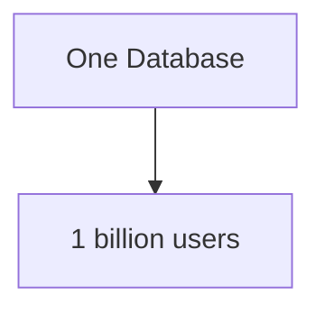

we can distribute users:

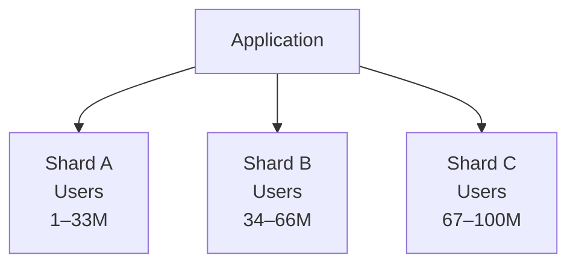

Each shard owns a subset of the data.

The application or routing layer determines which shard should receive a request.

The core idea is:

> **Sharding divides a dataset and distributes the pieces across independent database nodes.**

---

# 2. Why Does Sharding Exist?

A database can scale vertically:

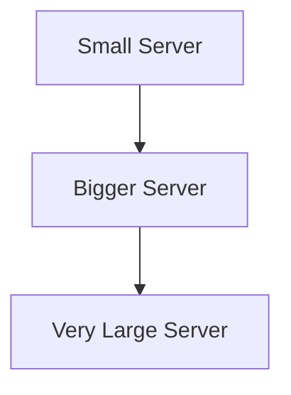

But eventually, a single database node may become constrained by:

- CPU
- Memory
- Disk capacity
- Disk I/O
- Network bandwidth
- Connection limits
- Write throughput
- Operational limits

Suppose one database node can safely support:

```text
10 TB storage
```

but the application eventually requires:

```text
100 TB
```

Simply buying a larger machine may not be practical.

Sharding provides another direction:

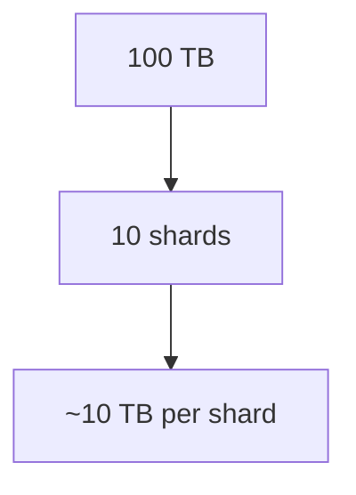

The actual distribution will rarely be perfectly equal, but the principle is to distribute the workload and data.

---

# 3. Vertical Scaling vs Sharding

Before sharding, consider vertical scaling.

For example:

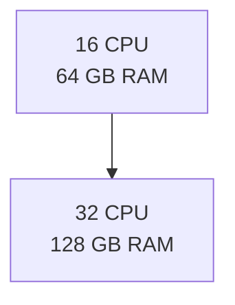

This can be much simpler than sharding.

Sharding introduces additional application and operational complexity.

Therefore:

> **Sharding is not automatically the next step after a database becomes large.**

You first need to understand whether the existing system can be improved sufficiently through:

- Query optimization
- Indexes
- Better data modeling
- Caching
- Read replicas
- Partitioning
- Hardware scaling

Only then should sharding become a serious consideration.

---

# 4. What Is a Shard?

A **shard** is one independently managed portion of a larger distributed dataset.

Suppose:

```text
100 million users
```

are distributed across:

```text
Shard A
Shard B
Shard C
Shard D
```

Each shard might contain:

```text
25 million users
```

in an idealized example.

The logical dataset is:

```text
Users
```

while physically:

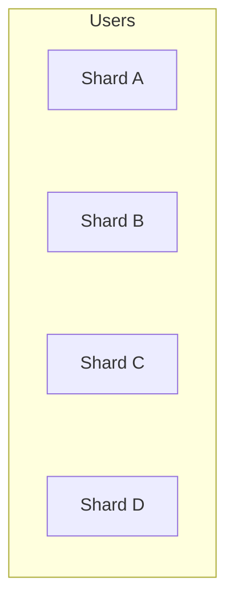

A shard is therefore both:

- A data ownership unit
- A scaling unit

---

# 5. Sharding Is Horizontal Data Distribution

Sharding usually distributes **rows or records** across database nodes.

For example:

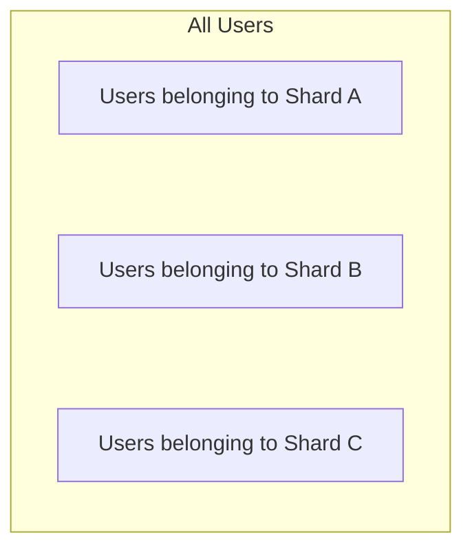

This is commonly called **horizontal sharding**.

Compare this with vertical partitioning:

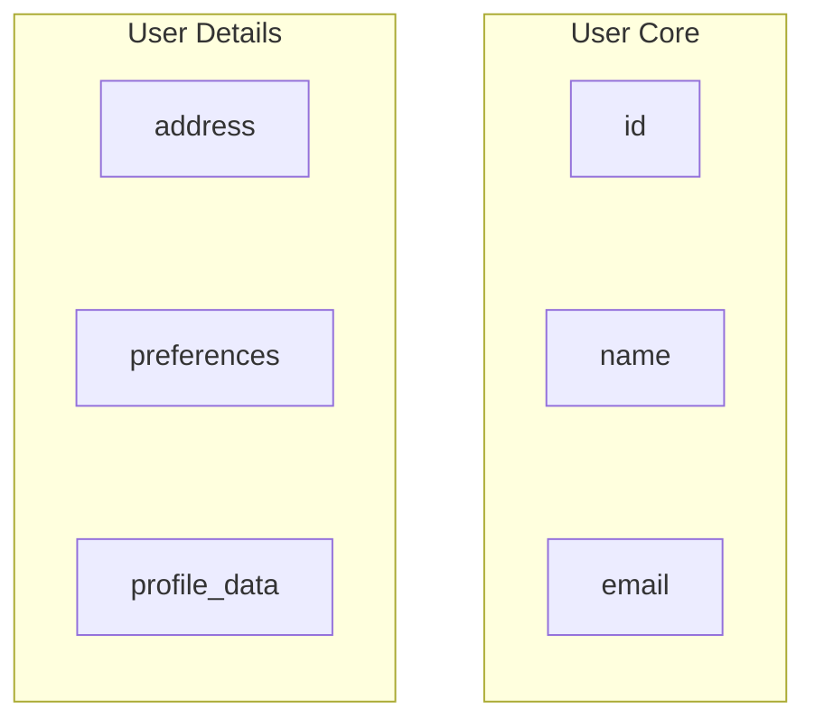

Vertical partitioning divides columns.

Sharding generally divides records across independent nodes.

---

# 6. Partitioning vs Sharding

These terms are closely related and can overlap in real database products, so terminology must be handled carefully.

A useful system-design distinction is:

### Partitioning

Divide a logical dataset into physical partitions.

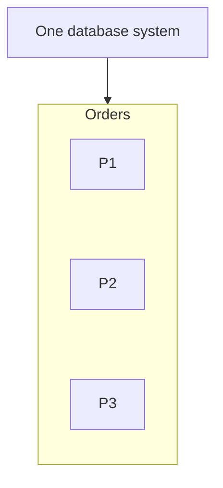

### Sharding

Distribute portions of a dataset across independent database nodes.

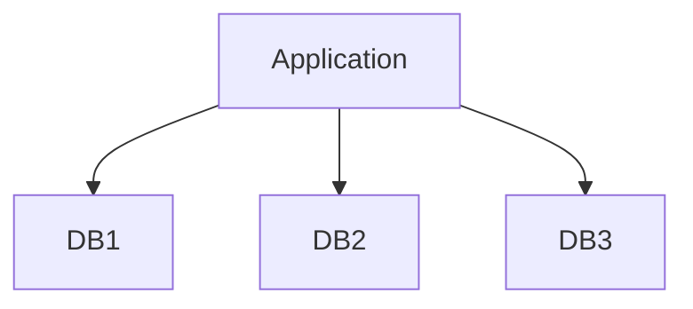

A shard can itself contain partitions.

For example:

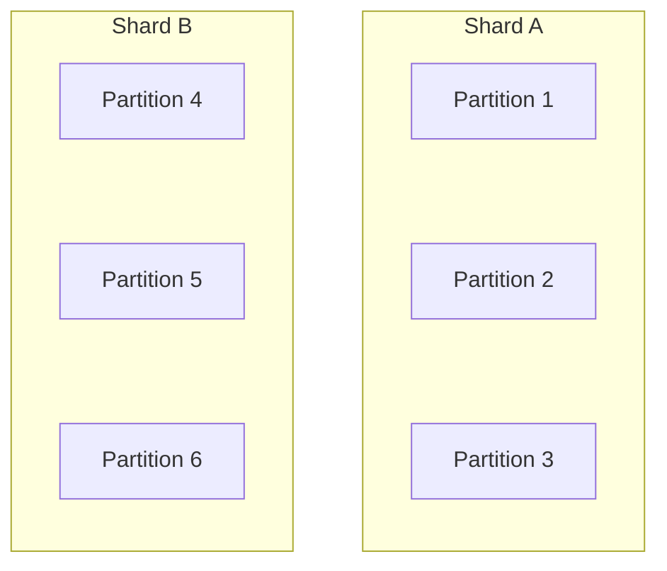

The terminology varies between database systems.

The architectural question is:

> **Are we simply organizing data into partitions, or are we distributing ownership of those partitions across independent database nodes?**

---

# 7. Sharding vs Replication

These solve different problems.

### Replication

Creates copies:

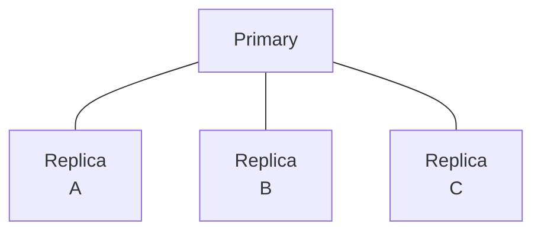

### Sharding

Divides data:

```text
Shard A → Users 1–30M
Shard B → Users 31–60M
Shard C → Users 61–90M
```

So:

```text
Replication → Copy

Sharding → Divide and distribute
```

They can be combined.

For example:

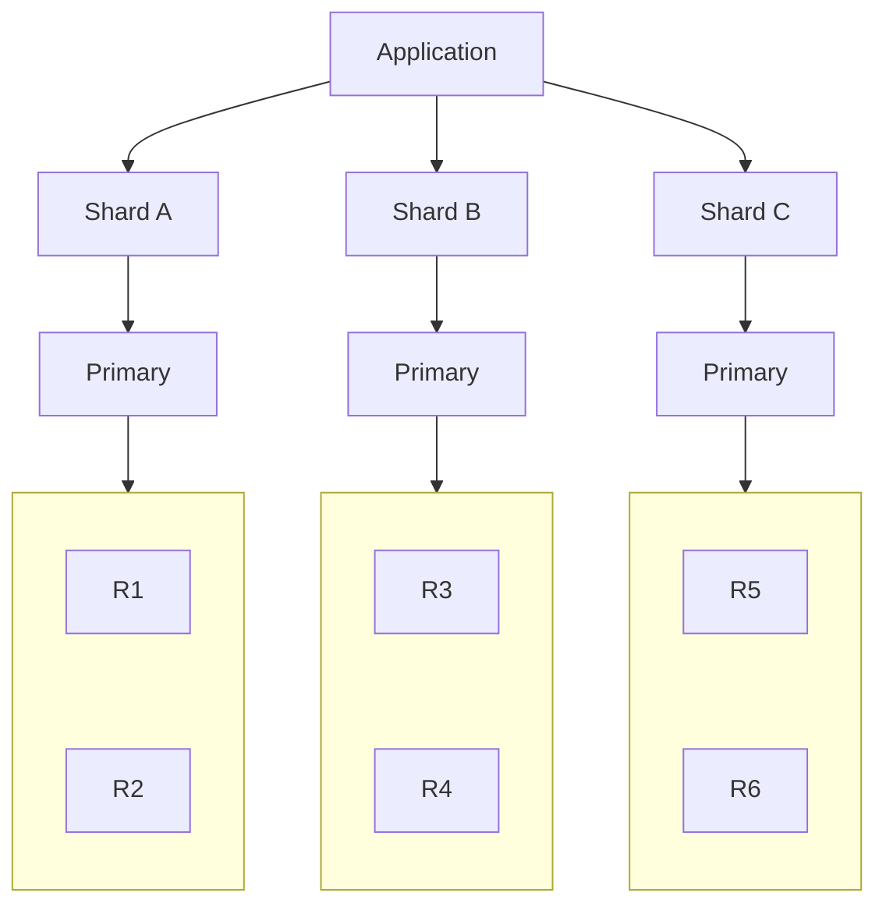

Now each shard has its own replicas.

---

# 8. The Most Important Concept: Shard Key

A **shard key** determines which shard should contain a particular record.

Suppose:

```text
users
```

uses:

```text
user_id
```

as its shard key.

Conceptually:

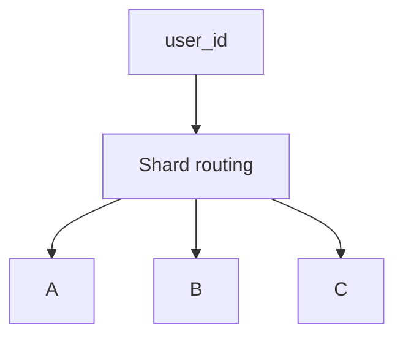

For example:

```text
User 101 → Shard A
User 202 → Shard B
User 303 → Shard C
```

The exact routing mechanism depends on the sharding strategy.

Choosing the shard key is one of the most important decisions in a sharded architecture.

---

# 9. What Makes a Good Shard Key?

A good shard key should ideally:

- Distribute data reasonably
- Distribute workload reasonably
- Appear in important queries
- Avoid creating a hot shard
- Support efficient routing
- Remain reasonably stable
- Match application access patterns

Consider:

```text
user_id
```

If most requests are:

```text
GET /users/{user_id}
```

then `user_id` can be a natural routing key.

The application already knows the user ID.

---

# 10. A Bad Shard Key

Suppose we choose:

```text
account_status
```

with only:

```text
active
inactive
```

as values.

We might end up with:

```text
Shard A → active → 95% of users
Shard B → inactive → 5% of users
```

This creates severe imbalance.

The goal of sharding is to distribute workload, not merely to create multiple databases.

---

# 11. Data Distribution Matters

A shard key can produce uneven distribution.

Suppose:

```text
Shard A → 40%
Shard B → 35%
Shard C → 20%
Shard D → 5%
```

Shard D is lightly loaded.

Shard A may become the bottleneck.

A better distribution might be:

```text
Shard A → 25%
Shard B → 25%
Shard C → 25%
Shard D → 25%
```

Perfect balance is not always possible or necessary.

The important question is:

> **Can the system keep the busiest shard within acceptable capacity?**

---

# 12. Workload Distribution Matters Too

Data size alone is not enough.

Imagine:

```text
Shard A → 10 TB
Shard B → 10 TB
```

The data is balanced.

But:

```text
Shard A → 1,000 queries/sec
Shard B → 50,000 queries/sec
```

The workload is not balanced.

Therefore, shard design should consider:

```text
Data distribution
+
Request distribution
+
Write distribution
+
Read distribution
```

---

# 13. Range-Based Sharding

Range-based sharding distributes records according to ranges of the shard key.

For example:

```text
user_id

1–10M       → Shard A
10M–20M     → Shard B
20M–30M     → Shard C
```

This is easy to understand.

---

# 14. Advantages of Range-Based Sharding

Range-based sharding can work well when queries naturally target ranges.

For example:

```sql
SELECT *
FROM orders
WHERE customer_id >= 100000
  AND customer_id < 200000;
```

The routing layer may determine:

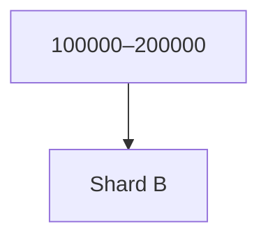

instead of querying every shard.

This can reduce cross-shard work.

---

# 15. The Hotspot Problem With Range Sharding

Range sharding can create hotspots when new records concentrate in one range.

Suppose:

```text
order_id
```

continuously increases.

You might have:

```text
1–10M       → Shard A
10M–20M     → Shard B
20M–30M     → Shard C
```

New orders are continuously added near:

```text
30M+
```

The newest shard may receive most writes.

```text
Shard A → low writes
Shard B → low writes
Shard C → very high writes
```

This creates a hot shard.

---

# 16. Hash-Based Sharding

Hash-based sharding uses a hash function to distribute records.

For example:

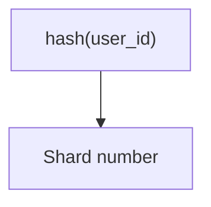

Conceptually:

```text
User 101 → hash → Shard C
User 102 → hash → Shard A
User 103 → hash → Shard D
User 104 → hash → Shard B
```

The goal is generally to spread records more evenly.

---

# 17. Advantages of Hash-Based Sharding

Hash-based sharding can reduce obvious range hotspots.

For example:

```text
Shard A → 25%
Shard B → 24%
Shard C → 26%
Shard D → 25%
```

Sequential IDs do not necessarily all land on the newest shard.

This can provide more balanced distribution.

But hash-based sharding introduces another trade-off.

Range queries become harder.

---

# 18. Range Queries With Hash Sharding

Suppose:

```sql
SELECT *
FROM users
WHERE user_id BETWEEN 100000 AND 200000;
```

With range sharding:

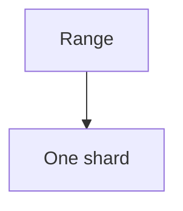

may be possible.

With hash sharding:

```text
100000 → Shard A
100001 → Shard C
100002 → Shard B
...
```

The requested range may span many shards.

This is a **scatter-gather** operation.

---

# 19. Scatter-Gather

Scatter-gather means:

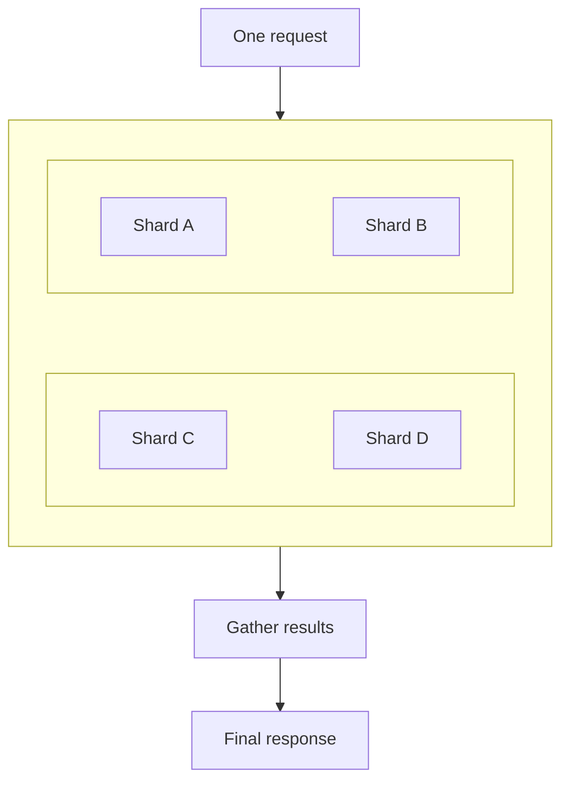

This can be expensive.

If one shard is slow:

```text
A → 20 ms
B → 25 ms
C → 22 ms
D → 500 ms
```

the overall request may need to wait for D.

This introduces a distributed-system performance problem.

---

# 20. Directory-Based Sharding

Another approach is a **directory** or routing map.

Instead of calculating the shard directly:

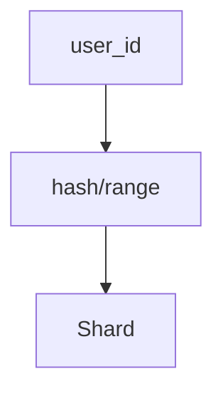

the system maintains a mapping:

```text
Customer 101 → Shard A
Customer 202 → Shard B
Customer 303 → Shard C
```

The directory can provide flexible placement.

But now the routing metadata itself becomes an important system component.

---

# 21. Directory Failure

Suppose:

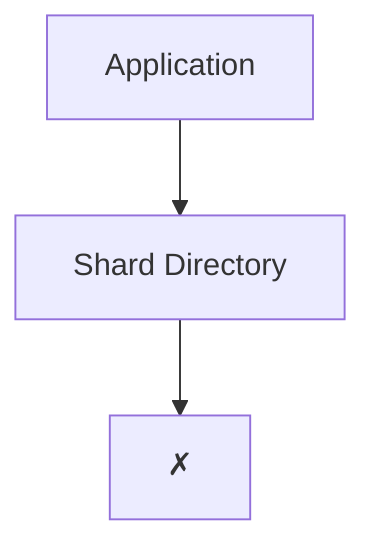

If the application cannot determine where data lives, requests may fail even though the database shards themselves are healthy.

This introduces a new dependency.

Therefore, the directory may itself require:

- High availability
- Replication
- Caching
- Recovery
- Monitoring

This is a recurring system-design principle:

> **When you introduce a routing component, its failure becomes part of the system's failure model.**

---

# 22. Shard Routing

A sharded application needs a routing mechanism.

Conceptually:

```mermaid
flowchart TD
  accTitle: Shard routing
  accDescr: User request, application, determine shard, shard router, then shard A, B or C.
  N0["User Request"] --> N1["Application"] --> N2["Determine shard"] --> N3["Shard Router"] --> A["A"] & B["B"] & C["C"]
```

Routing can happen:

- In the application
- In a database proxy
- In a middleware layer
- Through a database-native mechanism

The exact implementation depends on the technology.

---

# 23. Application-Level Sharding

With application-level sharding, the application determines the destination.

For example:

```mermaid
flowchart TD
  accTitle: Application-level routing
  accDescr: user_id = 12345, then routing function, then Shard B.
  N0["user_id = 12345"] --> N1["routing function"] --> N2["Shard B"]
```

The application may have logic like:

```mermaid
flowchart TD
  accTitle: Routing logic
  accDescr: Request, then Extract user_id, then Calculate shard, then Connect to shard, then Execute query.
  N0["Request"] --> N1["Extract user_id"] --> N2["Calculate shard"] --> N3["Connect to shard"] --> N4["Execute query"]
```

This provides control.

But it also means the application becomes aware of database distribution.

---

# 24. Database-Managed Sharding

Some database systems or distributed database products can manage distribution and routing more transparently.

Conceptually:

```mermaid
flowchart TD
  accTitle: Database-managed sharding
  accDescr: The application talks to a distributed database, which manages shards A, B and C.
  P["Application"] --> D["Distributed Database"] --> A["A"] & B["B"] & C["C"]
```

The application may interact with a logical database interface while the database system manages placement.

This can reduce application-level routing logic.

However, the underlying trade-offs still exist:

- Data distribution
- Cross-shard operations
- Rebalancing
- Failure
- Consistency
- Capacity

Abstraction does not remove system complexity; it may simply move where that complexity is managed.

---

# 25. Shard Ownership

Every record should have a clear answer to:

> **Which shard owns this data?**

Ownership matters because it affects:

- Writes
- Reads
- Transactions
- Failover
- Migration
- Rebalancing

A useful mental model is:

```mermaid
flowchart TD
  accTitle: Ownership
  accDescr: Record, then Shard Key, then Ownership, then Shard.
  N0["Record"] --> N1["Shard Key"] --> N2["Ownership"] --> N3["Shard"]
```

---

# 26. Cross-Shard Queries

Consider:

```text
Users
Orders
```

Suppose users are sharded by:

```text
user_id
```

and each user's orders live on the same shard.

Then:

```mermaid
flowchart TD
  accTitle: Same-shard orders
  accDescr: User 101, then Shard A, then User's Orders.
  N0["User 101"] --> N1["Shard A"] --> N2["User's Orders"]
```

can be efficient.

But if related data is distributed differently:

```text
User → Shard A
Orders → Shard C
```

a single logical operation may require communication across shards.

This is where sharding becomes significantly more complex.

---

# 27. Cross-Shard Joins

Suppose:

```text
Customers → Sharded by customer_id
Orders    → Sharded by order_id
```

A query like:

```sql
SELECT *
FROM customers
JOIN orders
    ON customers.id = orders.customer_id;
```

may require data from multiple shards.

Conceptually:

```mermaid
flowchart LR
  accTitle: A cross-shard join
  accDescr: Shards A, B and C all feed a join somewhere.
  A["Shard A"] & B["Shard B"] & C["Shard C"] --> J["Join somewhere"]
```

This can be expensive.

A major sharding design principle is:

> **Keep data that is commonly accessed together close together when practical.**

This is sometimes called **co-location**.

---

# 28. Co-Locating Related Data

Suppose:

```text
Customer 101
Orders for Customer 101
```

are both assigned using:

```text
customer_id
```

Then:

```mermaid
flowchart TD
  accTitle: Co-located customer data
  accDescr: Customer 101 lives on shard B, which holds the customer record and customer orders.
  C["Customer 101"] --- G
  subgraph G["Shard B"]
    direction TB
    I0["Customer record"] ~~~ I1["Customer orders"]
  end
```

A query for that customer's data may stay within one shard.

This can simplify:

- Joins
- Transactions
- Routing
- Latency

But co-location may conflict with other access patterns.

There is no free solution.

---

# 29. Cross-Shard Transactions

Transactions become more difficult when a business operation touches multiple shards.

The system now needs to coordinate multiple database nodes.

This can introduce:

- More network communication
- Longer transaction duration
- More failure possibilities
- Distributed transaction complexity

A local transaction:

```mermaid
flowchart TD
  accTitle: A local transaction
  accDescr: BEGIN, then Shard A, then COMMIT.
  N0["BEGIN"] --> N1["Shard A"] --> N2["COMMIT"]
```

is generally simpler than:

```mermaid
flowchart TD
  accTitle: A cross-shard transaction
  accDescr: BEGIN, then shard A and shard B need coordination, then COMMIT.
  B["BEGIN"] --> SA["Shard A"] & SB["Shard B"]
  SA & SB --- X["coordination"]
  X --> C["COMMIT"]
```

This is why shard-key design should consider transaction boundaries.

---

# 30. Designing Around Cross-Shard Transactions

Sometimes the better solution is to redesign the operation.

For example, instead of:

```mermaid
flowchart TD
  accTitle: One transaction
  accDescr: One transaction spans shard A and shard B.
  R["One transaction"] --- K0["Shard A"] & K1["Shard B"]
```

the application may use:

```mermaid
flowchart TD
  accTitle: Event-driven alternative
  accDescr: Shard A, then Commit, then Event / message, then Shard B, then Process independently.
  N0["Shard A"] --> N1["Commit"] --> N2["Event / message"] --> N3["Shard B"] --> N4["Process independently"]
```

This introduces asynchronous behavior and consistency trade-offs.

These patterns will become more important later in the curriculum when we study:

- Message queues
- Distributed transactions
- Saga
- Outbox
- Eventual consistency

For now, remember:

> **Sharding can turn a simple local transaction into a distributed coordination problem.**

---

# 31. Hot Shards

A **hot shard** is a shard receiving disproportionately high workload.

For example:

```text
Shard A → 10K requests/sec
Shard B → 10K
Shard C → 10K
Shard D → 100K
```

Shard D becomes the bottleneck.

Adding another shard does not automatically fix this:

```text
A
B
C
D ← HOT
E ← new
```

If the routing strategy continues sending the same hot workload to D, E may remain mostly unused.

The actual problem is the distribution strategy.

---

# 32. Hotspot Causes

Hot shards can result from:

- Poor shard key
- Highly popular customer
- Popular geographic region
- Sequential IDs with range sharding
- Time-based concentration
- Uneven tenant sizes
- Uneven traffic
- Large batch operations

The key lesson:

> **A good shard key distributes workload, not just rows.**

---

# 33. Rebalancing

**Rebalancing** means redistributing data or ownership across shards to improve distribution.

Suppose:

```text
Before:

A → 40%
B → 30%
C → 20%
D → 10%
```

You may want something closer to:

```text
After:

A → 25%
B → 25%
C → 25%
D → 25%
```

The actual target depends on the workload.

Rebalancing can be difficult because data must move while the application continues operating.

---

# 34. Why Rebalancing Is Hard

Suppose:

```text
Shard A
1 TB
```

needs to move part of its data to:

```text
Shard D
```

The system may need to:

```mermaid
flowchart TD
  accTitle: Moving data
  accDescr: Read existing data, then Copy data, then Track changes during copy, then Switch ownership, then Verify correctness, then Remove old ownership.
  N0["Read existing data"] --> N1["Copy data"] --> N2["Track changes during copy"] --> N3["Switch ownership"] --> N4["Verify correctness"] --> N5["Remove old ownership"]
```

During this process:

- Writes may continue
- Data may change
- Network bandwidth is consumed
- Both source and destination need capacity
- Routing metadata must change
- Failures can happen

Therefore:

> **Rebalancing is a distributed migration problem.**

---

# 35. Adding a New Shard

Suppose:

```text
A
B
C
```

are running near capacity.

You add:

```text
D
```

A naive assumption is:

```mermaid
flowchart TD
  accTitle: A naive assumption
  accDescr: Add D, then Problem solved.
  N0["Add D"] --> N1["Problem solved"]
```

The new shard may initially be empty.

```text
A → 40%
B → 35%
C → 25%
D → 0%
```

To benefit from D, some data or future ownership must move to it.

This is why shard expansion requires planning.

---

# 36. Removing a Shard

Removing a shard is the reverse problem.

Suppose:

```text
A
B
C
D
```

and you want to remove D.

You cannot simply shut down D if it owns data.

You first need to:

```mermaid
flowchart TD
  accTitle: Removing shard D
  accDescr: D, then Move data, then New owners, then Update routing, then Verify, then Remove D.
  N0["D"] --> N1["Move data"] --> N2["New owners"] --> N3["Update routing"] --> N4["Verify"] --> N5["Remove D"]
```

The system must preserve correctness during the transition.

---

# 37. Consistent Hashing Preview

Hash-based sharding often faces a rebalancing problem.

Suppose:

```text
4 shards
```

and routing uses:

```text
hash(key) % 4
```

Adding a fifth shard changes:

```text
hash(key) % 5
```

for many keys.

A large amount of data may need to move.

**Consistent hashing** is one technique designed to reduce the amount of data that needs to move when nodes are added or removed.

It will be covered in depth later in:

> **04.16 — Consistent Hashing**

For now:

```text
Simple hash
→ easier
→ more movement during topology changes

Consistent hashing
→ more sophisticated
→ can reduce remapping
```

---

# 38. Sharding and Caching

Caching can exist in front of a sharded database.

```mermaid
flowchart TD
  accTitle: Cache in front of shards
  accDescr: Request goes to the cache. HIT returns. MISS goes to the shard router, then the shard.
  R["Request"] --> C["Cache"]
  C --> H["HIT → Return"]
  C --> M["MISS"] --> SR["Shard Router"] --> S["Shard"]
```

The cache key may need to include enough identity information to avoid collisions.

For example:

```text
user:101:profile
```

instead of an ambiguous key such as:

```text
profile
```

The routing and caching layers must agree on data identity.

---

# 39. Sharding and Application Complexity

Without sharding:

```mermaid
flowchart TD
  accTitle: Without sharding
  accDescr: Application, then Database.
  N0["Application"] --> N1["Database"]
```

With sharding:

```mermaid
flowchart TD
  accTitle: With sharding
  accDescr: The application goes through a shard router to shard A, B or C.
  P["Application"] --> R["Shard Router"] --> A["A"] & B["B"] & C["C"]
```

The application or routing layer now needs to understand:

```text
Where does the data live?
Which shard should I contact?
Can this query span shards?
Can this transaction span shards?
What happens if one shard fails?
```

Sharding therefore changes application architecture, not just database configuration.

---

# 40. Shard Failure

Suppose:

```text
Shard A ✓
Shard B ✓
Shard C ✗
```

If a user belongs to Shard C:

```mermaid
flowchart TD
  accTitle: An unavailable shard
  accDescr: User, then Shard C, then Unavailable.
  N0["User"] --> N1["Shard C"] --> N2["Unavailable"]
```

the application needs a failure strategy.

If each shard has replicas:

```mermaid
flowchart TD
  accTitle: Shard C replicas
  accDescr: Shard C: the primary has failed; replica 1 and replica 2 are healthy.
  subgraph G["Shard C"]
    direction TB
    I0["Primary ✗"] ~~~ I1["Replica 1 ✓"] ~~~ I2["Replica 2 ✓"]
  end
```

a replica may be promoted.

This connects sharding with the replication and failover concepts already learned.

---

# 41. Shard Failure Can Affect Only Part of the System

One benefit of sharding is that a failure can potentially have a limited blast radius.

For example:

```text
Shard A ✓
Shard B ✓
Shard C ✗
Shard D ✓
```

Users whose data belongs to A, B, or D may continue operating.

Users whose data belongs to C may be affected.

This is not automatic isolation; application design and routing determine the actual behavior.

---

# 42. Partial Failure

Sharding introduces a distributed system.

That means:

> **One part of the database system can fail while another part continues operating.**

The application must be designed to handle partial failure.

This becomes increasingly important as the number of shards grows.

---

# 43. Global Queries

Some queries naturally need the entire dataset.

For example:

```sql
SELECT COUNT(*)
FROM users;
```

With one database:

```mermaid
flowchart TD
  accTitle: A local count
  accDescr: Database, then COUNT.
  N0["Database"] --> N1["COUNT"]
```

With four shards:

```mermaid
flowchart TD
  accTitle: A global count
  accDescr: COUNT(*) runs on shards A, B, C and D, and their results combine into the global result.
  C["COUNT(*)"] --> A["A"] & B["B"] & C["C"] & D["D"]
  A & B & C & D --> G["Global result"]
```

The application or distributed database must combine partial results.

This can be considerably more complex than a local query.

---

# 44. Global Ordering

Consider:

```sql
SELECT *
FROM orders
ORDER BY created_at DESC
LIMIT 20;
```

With multiple shards:

```text
Shard A → newest 20
Shard B → newest 20
Shard C → newest 20
```

The system may need to merge the results.

```mermaid
flowchart LR
  accTitle: Merging sorted results
  accDescr: A, B and C feed merge / sort, which produces the top 20.
  A["A"] & B["B"] & C["C"] --> M["Merge / Sort"] --> T["Top 20"]
```

The complexity increases because the database is no longer performing the entire operation against one local dataset.

---

# 45. Pagination Across Shards

Pagination can become especially complicated.

With one database:

```text
OFFSET 100 LIMIT 20
```

is already potentially expensive at large offsets.

With multiple shards:

```text
Shard A
Shard B
Shard C
Shard D
```

the system may need to coordinate results across nodes.

This is one reason distributed systems often favor cursor/keyset-style approaches for large-scale access patterns.

The exact solution depends on the query and data model.

---

# 46. Referential Integrity Across Shards

Suppose:

```text
Customer
```

is on:

```text
Shard A
```

while:

```text
Order
```

is on:

```text
Shard B
```

A normal database foreign-key relationship may not work in the same way across independent database nodes.

This means application-level integrity may become more important.

Possible strategies include:

- Co-locating related data
- Application validation
- Service-level ownership
- Asynchronous consistency
- Carefully designed identifiers and workflows

This is another cost of distributing data.

---

# 47. Sharding and Multi-Tenant Systems

SaaS applications often have a natural tenant boundary.

For example:

```text
Tenant A → Shard 1
Tenant B → Shard 2
Tenant C → Shard 3
```

This can provide strong logical separation.

But tenant sizes can differ greatly.

```text
Tenant A → 10 GB
Tenant B → 20 GB
Tenant C → 8 TB
```

If Tenant C occupies one shard alone, that shard may become a hotspot.

Therefore:

> **Tenant-based sharding is simple to understand but must account for tenant size and workload skew.**

---

# 48. Choosing a Sharding Strategy

A simplified comparison:

| Strategy | Main idea | Strength | Risk |
|---|---|---|---|
| Range | Key ranges | Efficient range queries | Hot ranges |
| Hash | Hash determines shard | Broad distribution | Range queries become harder |
| Directory | Explicit mapping | Flexible placement | Directory becomes dependency |
| Tenant-based | Tenant determines shard | Natural ownership | Large tenants can become hot |

The correct choice depends on:

```text
Access patterns
+
Data distribution
+
Write patterns
+
Query patterns
+
Transaction boundaries
+
Growth model
```

---

# 49. When Sharding Makes Sense

Sharding may become appropriate when:

- A single database node cannot provide enough capacity
- Data volume exceeds practical single-node limits
- Write throughput exceeds single-node capacity
- Storage requirements exceed practical limits
- Workload cannot be solved adequately with simpler techniques
- Data has a suitable distribution key
- The organization can operate distributed database infrastructure

The important phrase is:

> **Cannot be solved adequately with simpler techniques.**

Sharding is a major architectural commitment.

---

# 50. When Sharding May Be Unnecessary

Do not shard simply because:

```text
The application is growing.
```

For example:

```text
Database CPU = 40%
Storage = 30%
Read traffic = manageable
Writes = manageable
```

Sharding may add complexity without solving an actual bottleneck.

---

# 51. The Cost of Sharding

Sharding can introduce:

```text
More databases
+
More connections
+
More monitoring
+
More deployment complexity
+
More migrations
+
More routing
+
Cross-shard queries
+
Cross-shard transactions
+
Rebalancing
+
Failure coordination
```

Therefore, the system designer should compare:

```text
Cost of current architecture
        VS
Cost of distributed architecture
```

The decision should be based on real constraints.

---

# 52. Common Sharding Mistakes

## Mistake 1 — Sharding Too Early

Complexity arrives before it is needed.

---

## Mistake 2 — Choosing a Shard Key Based Only on Data Size

Traffic distribution matters too.

---

## Mistake 3 — Ignoring Hot Shards

A badly distributed shard can become the new bottleneck.

---

## Mistake 4 — Ignoring Query Patterns

Cross-shard queries can become expensive.

---

## Mistake 5 — Ignoring Transaction Boundaries

Transactions that frequently cross shards are difficult to coordinate.

---

## Mistake 6 — Assuming Adding a Shard Automatically Balances Data

Existing data may still remain on the old shards.

---

## Mistake 7 — Forgetting Rebalancing

Data distribution changes as the system grows.

---

## Mistake 8 — Treating Shards as Independent Applications

They collectively represent one logical dataset.

---

## Mistake 9 — Ignoring Routing Failure

A failed routing layer can make healthy shards unreachable.

---

## Mistake 10 — Forgetting Replication

A shard may still need replicas for availability and read scaling.

---

# 53. Hands-On Exercise — Model a Sharded User System

We will model sharding without requiring a multi-node production database.

Suppose:

```text
30 million users
```

need to be distributed across:

```text
3 shards
```

Use:

```text
user_id
```

as the conceptual shard key.

---

## Step 1 — Define the Shards

```text
Shard A
Shard B
Shard C
```

Assume the system uses range-based sharding:

```text
1–10M       → A
10M–20M     → B
20M–30M     → C
```

Create the following table:

| User ID | Shard |
|---:|---|
| 1,000 | A |
| 5,000,000 | A |
| 12,000,000 | B |
| 18,000,000 | B |
| 21,000,000 | C |
| 29,000,000 | C |

---

## Step 2 — Route a Request

Request:

```text
GET /users/18,000,000
```

Routing:

```mermaid
flowchart TD
  accTitle: Routing user 18,000,000
  accDescr: user_id, then 18,000,000, then Range lookup, then 10M–20M, then Shard B.
  N0["user_id"] --> N1["18,000,000"] --> N2["Range lookup"] --> N3["10M–20M"] --> N4["Shard B"]
```

The application does not need to query A or C.

---

## Step 3 — Add an Order

Suppose:

```text
User = 18,000,000
Order = 90001
```

If orders are co-located using:

```text
user_id
```

then:

```mermaid
flowchart TD
  accTitle: Co-located user and orders
  accDescr: User 18M lives on shard B, which holds the user and the orders.
  U["User 18M"] --> G
  subgraph G["Shard B"]
    direction TB
    I0["User"] ~~~ I1["Orders"]
  end
```

This can make user-specific transactions easier.

---

## Step 4 — Consider a Global Query

Now run:

```text
How many users exist?
```

The system may need:

```text
Shard A → 10M
Shard B → 10M
Shard C → 10M
```

Then:

```mermaid
flowchart TD
  accTitle: Distributed aggregation
  accDescr: 10M + 10M + 10M, then 30M.
  N0["10M + 10M + 10M"] --> N1["30M"]
```

This is a simple example of a distributed aggregation.

---

## Step 5 — Simulate a Hot Shard

Suppose:

```text
Shard A → 5,000 requests/sec
Shard B → 5,000 requests/sec
Shard C → 100,000 requests/sec
```

Ask:

> Is adding Shard D enough?

Not necessarily.

First investigate:

```text
Why is C hot?
```

Possible causes:

```text
Popular users
Uneven user distribution
Traffic concentration
Poor shard key
Range hotspot
```

This is the correct system-design approach.

---

## Step 6 — Simulate a Shard Failure

Suppose:

```text
A ✓
B ✓
C ✗
```

Users routed to C are affected.

Now introduce replicas:

```mermaid
flowchart TD
  accTitle: Shard C replicas
  accDescr: Shard C: the primary has failed; replica 1 and replica 2 are healthy.
  subgraph G["Shard C"]
    direction TB
    I0["Primary ✗"] ~~~ I1["Replica 1 ✓"] ~~~ I2["Replica 2 ✓"]
  end
```

Possible recovery:

```mermaid
flowchart TD
  accTitle: Recovery
  accDescr: Replica 1, then Promotion, then New Primary, then Update routing.
  N0["Replica 1"] --> N1["Promotion"] --> N2["New Primary"] --> N3["Update routing"]
```

This connects:

```text
Sharding
+
Replication
+
Failover
```

into one architecture.

---

# 54. Lab Challenge

Design a sharding strategy for:

```text
50 million customers
500 million orders
```

Requirements:

```text
1. Customer-specific queries should be fast.

2. Customer + order operations should avoid
   unnecessary cross-shard communication.

3. The system should support read replicas.

4. One very large customer should not
   automatically overload the entire system.

5. The system should be able to add capacity later.
```

Answer these questions:

### Question 1

What could be the shard key?

### Question 2

Should customers and their orders be co-located?

### Question 3

Would range or hash sharding be more suitable?

### Question 4

What could create a hot shard?

### Question 5

How would you handle a shard failure?

### Question 6

What happens when a new shard is added?

The goal is not to find one universally correct architecture.

The goal is to explain the **trade-offs** behind your design.

---

# 55. A Practical Sharding Investigation

Before introducing sharding:

### Step 1 — Measure the current system

```text
CPU
Memory
Storage
I/O
Connections
Queries/sec
Writes/sec
Reads/sec
Latency
```

### Step 2 — Identify the actual bottleneck

```text
Storage?
CPU?
Writes?
Reads?
Connections?
```

### Step 3 — Try simpler solutions

```text
Query optimization
Indexes
Caching
Vertical scaling
Read replicas
Partitioning
```

### Step 4 — Study access patterns

```text
How are records queried?
What data is accessed together?
What transactions happen together?
```

### Step 5 — Find candidate shard keys

```text
user_id?
tenant_id?
region?
account_id?
```

### Step 6 — Simulate distribution

Estimate:

```text
Data per shard
Traffic per shard
Writes per shard
Hotspot risk
```

### Step 7 — Test cross-shard operations

```text
Joins
Aggregations
Transactions
Sorting
Pagination
```

### Step 8 — Design failure handling

```text
Shard failure
Router failure
Network partition
Replica failure
```

### Step 9 — Design rebalancing

Ask:

```text
How will data move?
How will routing change?
How will writes continue?
```

### Step 10 — Re-evaluate complexity

If the architecture is significantly more complex than the problem requires, reconsider sharding.

---

# 56. Sharding Decision Flow

```mermaid
flowchart TD
  accTitle: Sharding decision flow
  accDescr: Is one database node approaching a real limit? No: keep it simple. Yes: can simpler solutions help? Yes: optimize. No: study sharding, find shard key, test distribution, test cross-shard work, design rebalancing, design failures, validate complexity.
  L{"Is one database<br/>node approaching<br/>a real limit?"} -->|"No"| K["Keep it<br/>simple"]
  L -->|"Yes"| S{"Can simpler<br/>solutions help?"}
  S -->|"Yes"| O["Optimize"]
  S -->|"No"| N0["Study sharding"] --> N1["Find shard key"] --> N2["Test distribution"] --> N3["Test cross-shard work"] --> N4["Design rebalancing"] --> N5["Design failures"] --> N6["Validate complexity"]
```

---

# 57. Sharding in the Bigger Architecture

A mature sharded system might look like:

```mermaid
flowchart TD
  accTitle: Sharding in the bigger architecture
  accDescr: Users, load balancer, application, cache layer, shard router, then shards A, B and C; each shard has a primary and a replica (R1, R2, R3).
  U0["Users"] --> U1["Load Balancer"] --> U2["Application"] --> U3["Cache Layer"] --> U4["Shard Router"] --> G
  subgraph G[" "]
    direction TB
    subgraph WA[" "]
      direction LR
      SA["Shard A"] --> PA["Primary"] & R1["R1"]
    end
    subgraph WB[" "]
      direction LR
      SB["Shard B"] --> PB["Primary"] & R2["R2"]
    end
    subgraph WC[" "]
      direction LR
      SC["Shard C"] --> PC["Primary"] & R3["R3"]
    end
    WA ~~~ WB ~~~ WC
  end
```

Now several previously learned concepts work together:

```text
Cache
Replication
Primary/Replica
Read Replicas
Partitioning
Sharding
Routing
```

Each solves a different problem.

---

# 58. The Architecture Has More Failure Modes

A single database might have:

```text
Database failure
```

A sharded system can have:

```text
Shard A failure
Shard B failure
Shard C failure
Replica failure
Router failure
Routing metadata failure
Cross-shard network failure
Rebalancing failure
```

This is the cost of distribution.

Therefore:

> **Sharding solves capacity and distribution problems by turning one database problem into a distributed-systems problem.**

This is not necessarily bad.

It is simply the trade-off that must be understood.

---

# 59. Sharding and the System Design Principle

Remember the Systemly principle:

```mermaid
flowchart TD
  accTitle: The Systemly principle
  accDescr: Understand, then Model, then Measure, then Find Bottleneck, then Choose Solution, then Understand Trade-offs, then Scale.
  N0["Understand"] --> N1["Model"] --> N2["Measure"] --> N3["Find Bottleneck"] --> N4["Choose Solution"] --> N5["Understand Trade-offs"] --> N6["Scale"]
```

Sharding belongs late in this process.

Do not start with:

```text
"We need sharding."
```

Start with:

```text
"What constraint are we trying to solve?"
```

Then determine whether sharding is actually appropriate.

---

# 60. Quick Reference

| Concept | Meaning |
|---|---|
| Sharding | Distributing a dataset across independent database nodes |
| Shard | One independently managed portion of the dataset |
| Shard Key | Determines where a record belongs |
| Range Sharding | Shards own ranges of values |
| Hash Sharding | Hash determines shard placement |
| Directory Sharding | Explicit mapping determines placement |
| Hot Shard | Shard receiving disproportionate workload |
| Rebalancing | Moving data/ownership to improve distribution |
| Scatter-Gather | Query multiple shards and combine results |
| Co-location | Keeping related data on the same shard |
| Cross-Shard Query | Query requiring multiple shards |
| Cross-Shard Transaction | Transaction involving multiple shards |
| Shard Router | Component determining shard destination |

---

# 61. Sharding Mental Model

Think about sharding in this order:

```mermaid
flowchart TD
  accTitle: Sharding mental model
  accDescr: Large Dataset, then Can one node handle it?, then If not, how can data be divided?, then Choose Shard Key, then Choose Distribution Strategy, then Route Requests, then Monitor Distribution, then Handle Hot Shards, then Rebalance, then Handle Failure.
  N0["Large Dataset"] --> N1["Can one node handle it?"] --> N2["If not, how can data be divided?"] --> N3["Choose Shard Key"] --> N4["Choose Distribution Strategy"] --> N5["Route Requests"] --> N6["Monitor Distribution"] --> N7["Handle Hot Shards"] --> N8["Rebalance"] --> N9["Handle Failure"]
```

The central question is:

> **Where should this record live, and can the system continue to find and operate on it efficiently as the number of records and nodes grows?**

---

# 62. Knowledge Check

### Question 1

What is database sharding?

**Answer:**  
Distributing a dataset across multiple independent database nodes, with each shard owning a portion of the data.

---

### Question 2

What is a shard key?

**Answer:**  
A value or set of values used to determine which shard owns a record.

---

### Question 3

Why is shard-key selection important?

**Answer:**  
Because it affects data distribution, workload distribution, routing efficiency, hotspots, query patterns, and transaction boundaries.

---

### Question 4

What is the main difference between range and hash sharding?

**Answer:**  
Range sharding assigns values based on ranges, while hash sharding uses a hash function to distribute values across shards.

---

### Question 5

Why can range sharding create hot shards?

**Answer:**  
If new or popular data concentrates in one range, most writes or requests may be routed to the same shard.

---

### Question 6

What is scatter-gather?

**Answer:**  
Sending a query to multiple shards and combining their results.

---

### Question 7

Why are cross-shard transactions difficult?

**Answer:**  
They require coordination across multiple independent database nodes, increasing network communication, latency, failure scenarios, and implementation complexity.

---

### Question 8

What is a hot shard?

**Answer:**  
A shard receiving disproportionately high traffic, data, or resource usage compared with other shards.

---

### Question 9

Does adding a new shard automatically rebalance existing data?

**Answer:**  
No. Existing data may remain on the old shards until a redistribution or rebalancing process occurs.

---

### Question 10

Can sharding and replication be used together?

**Answer:**  
Yes. A sharded system can use replicas for each shard to provide availability and additional read capacity.

---

# 63. Remember

Sharding is not simply:

> "Put the database on multiple servers."

It introduces a distributed ownership model.

You now need to know:

```text
Which shard owns this data?
How do I find that shard?
Can related data stay together?
What happens if one shard fails?
What happens if one shard becomes hot?
How do I add capacity?
How do I move data?
Can my queries cross shards?
Can my transactions cross shards?
```

If these questions cannot be answered, the system is not ready for a reliable sharding strategy.

---

# 64. Key Principle

> **Sharding distributes a logical dataset across independent database nodes so that storage and workload can scale beyond the practical limits of a single node. The difficult part is not creating multiple databases; it is choosing a shard key, routing requests, keeping workloads balanced, minimizing cross-shard operations, handling failures, and rebalancing the system as it grows.**

---

# 65. Next Chapter

## 04.15 — Sharding Strategies

The next chapter goes deeper into **how data should actually be distributed across shards**.

We will compare:

- Range-based sharding
- Hash-based sharding
- Directory-based sharding
- Tenant-based sharding
- Geographic sharding
- Time-based sharding
- Composite shard keys
- Choosing a shard key
- Cardinality
- Distribution quality
- Query locality
- Write distribution
- Hotspot prevention
- Cross-shard queries
- Rebalancing implications
- Adding and removing shards
- Migration strategies
- Trade-offs between strategies
- Practical shard-key selection
- Hands-on sharding strategy exercise
