# 04.15 — Sharding Strategies

## Learning Objectives

By the end of this chapter, you should understand:

- What a sharding strategy is
- Why different systems need different sharding strategies
- Range-based sharding
- Hash-based sharding
- Directory-based sharding
- Tenant-based sharding
- Geographic sharding
- Time-based sharding
- Composite shard keys
- How to choose a shard key
- Cardinality and distribution quality
- Query locality
- Write distribution
- Hotspot prevention
- Cross-shard queries
- Rebalancing implications
- Adding and removing shards
- Migration strategies
- Trade-offs between strategies
- How to evaluate a shard key before production

---

# 1. What Is a Sharding Strategy?

In the previous chapter, we learned that **sharding distributes one logical dataset across multiple independent database nodes**.

A sharding strategy answers a more specific question:

> **How should the system decide which data belongs to which shard?**

For example, suppose we have 100 million users.

We could distribute them by:

- user ID range
- hash of user ID
- customer/tenant
- geographic region
- creation time
- a combination of multiple fields

Each approach produces a different architecture.

There is no universally correct strategy.

The correct strategy depends on:

- data distribution
- query patterns
- write patterns
- geographic requirements
- tenant structure
- growth pattern
- failure requirements
- rebalancing requirements.

---

# 2. Start With the Access Pattern

A common mistake is to begin with:

> "Which sharding algorithm should I use?"

A better question is:

> **"How does the application access the data?"**

Suppose an application frequently performs:

```text
Get user by user_id
```

A shard key based on `user_id` may work well.

But suppose the application frequently performs:

```text
Get all orders for customer_id
```

Then `customer_id` may be a better shard key.

The shard key should support the application's important operations.

---

# 3. The Shard Key Comes First

A **shard key** is the value used to determine where a record belongs.

Example:

```text
users

id
name
email
country
```

If we choose:

```text
id
```

as the shard key, the system may calculate:

```text
user_id → shard
```

For example:

```text
User 101 → Shard A
User 102 → Shard B
User 103 → Shard C
```

The exact mapping depends on the sharding strategy.

The shard key is one of the most important architectural decisions in a sharded system.

---

# 4. What Makes a Good Shard Key?

A useful shard key usually has several properties.

## 4.1 High Cardinality

Cardinality means the number of distinct values.

Example:

```text
gender
```

might have only a few distinct values.

But:

```text
user_id
```

can have millions or billions of distinct values.

A high-cardinality key usually provides more opportunities for distributing data.

---

## 4.2 Good Distribution

The key should distribute data reasonably evenly.

Bad:

```text
Shard A → 90 GB
Shard B → 5 GB
Shard C → 5 GB
```

Better:

```text
Shard A → 33 GB
Shard B → 34 GB
Shard C → 33 GB
```

Balanced storage matters.

But storage balance alone is not enough.

---

# 5. Distribution of Workload

Consider:

```text
Shard A → 30 GB
Shard B → 30 GB
Shard C → 30 GB
```

This looks balanced.

But suppose almost every request goes to Shard A.

Then:

```text
Storage:
A ██████████
B ██████████
C ██████████

Traffic:
A ████████████████████
B ██
C █
```

The shards contain similar amounts of data, but the workload is extremely uneven.

Therefore:

> **A good shard key should distribute both data and workload.**

---

# 6. Strategy 1 — Range-Based Sharding

Range-based sharding divides data according to ranges of the shard key.

Suppose user IDs are used.

```text
Shard A → 1 – 1,000,000
Shard B → 1,000,001 – 2,000,000
Shard C → 2,000,001 – 3,000,000
```

The routing logic is straightforward:

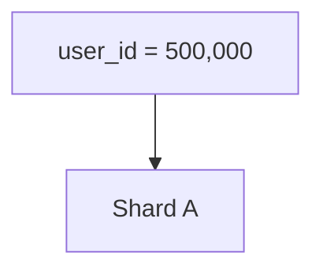

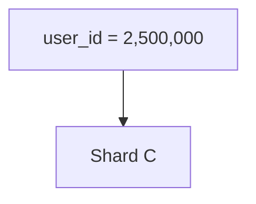

---

# 7. Why Use Range-Based Sharding?

Range sharding is useful when queries frequently use ranges.

For example:

```sql
SELECT *
FROM orders
WHERE created_at >= '2026-10-01'
  AND created_at < '2026-11-01';
```

If the data is organized by time ranges, the system may know exactly which shard contains the required data.

Instead of:

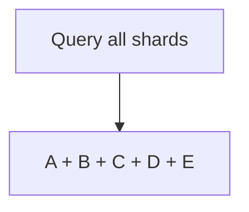

it can do:

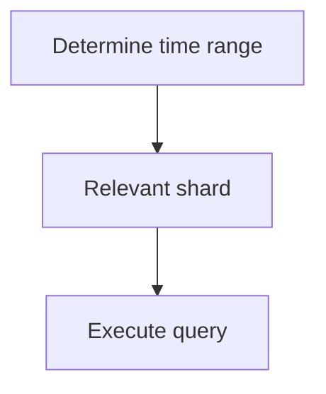

This is called **query locality**.

---

# 8. The Main Problem With Range Sharding

Range sharding can create hotspots.

Suppose new users are continuously assigned increasing IDs:

```text
1,000,001
1,000,002
1,000,003
1,000,004
...
```

If the newest range belongs to Shard C:

```text
Shard A → old users
Shard B → older users
Shard C → newest users
```

Almost every new write may go to:

```text
Shard C
```

This creates a **hot shard**.

---

# 9. Strategy 2 — Hash-Based Sharding

Hash-based sharding uses a hash function.

Conceptually:

```text
hash(shard_key) → shard
```

For example:

```text
hash(user_id) % 4
```

could produce:

```text
0 → Shard A
1 → Shard B
2 → Shard C
3 → Shard D
```

The exact hash function and routing mechanism vary by system.

---

# 10. Why Hash Sharding Helps

Hashing can distribute records more evenly.

Consider sequential IDs:

```text
1001
1002
1003
1004
1005
```

With range sharding, nearby IDs may go to the same shard.

With hashing:

```text
hash(1001) → Shard C
hash(1002) → Shard A
hash(1003) → Shard D
hash(1004) → Shard B
```

The writes can be distributed across the shards.

This can reduce sequential-write hotspots.

---

# 11. The Cost of Hash Sharding

Hashing usually makes range queries harder.

Suppose we need:

```text
Users with IDs 1000–2000
```

With hash sharding:

```text
1000 → hash → Shard B
1001 → hash → Shard D
1002 → hash → Shard A
...
2000 → hash → Shard C
```

The requested records may be distributed across many shards.

The system may need a **scatter-gather** operation.

---

# 12. The Slowest Shard Can Affect Latency

Suppose a query is sent to four shards:

```text
Shard A → 20 ms
Shard B → 25 ms
Shard C → 22 ms
Shard D → 150 ms
```

The overall operation cannot complete until the required responses are available.

Therefore, the query may effectively experience approximately:

```text
150 ms + coordination overhead
```

This is one reason cross-shard queries must be designed carefully.

---

# 13. Strategy 3 — Directory-Based Sharding

Directory-based sharding uses a separate mapping system.

Instead of calculating:

```text
key → shard
```

the system asks a directory:

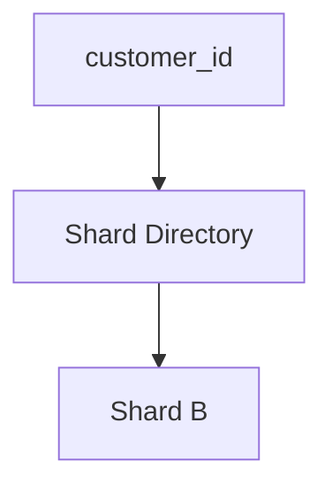

Example:

```text
Customer 101 → Shard A
Customer 102 → Shard C
Customer 103 → Shard A
Customer 104 → Shard B
```

The mapping does not have to follow a mathematical range or hash.

---

# 14. Why Use a Directory?

Directory-based sharding provides flexibility.

For example, a very large customer could be moved:

```text
Before:

Customer 500 → Shard A
```

to:

```text
After:

Customer 500 → Shard D
```

The routing directory can be updated without changing the customer's identity.

This can be useful when data needs to be moved or rebalanced.

---

# 15. Directory-Based Sharding Has a New Dependency

The directory becomes important infrastructure.

Architecture:

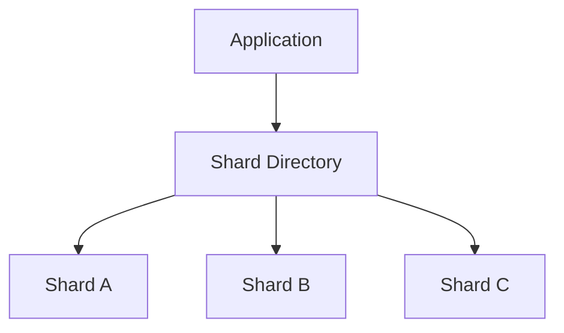

What happens if the directory is unavailable?

The application may not know where the data belongs.

Therefore, the directory itself needs:

- high availability
- replication
- caching where appropriate
- failure handling
- consistency guarantees
- operational monitoring.

The strategy solves one problem while introducing another dependency.

---

# 16. Strategy 4 — Tenant-Based Sharding

Tenant-based sharding is common in multi-tenant SaaS systems.

Suppose a SaaS application has:

```text
Tenant A
Tenant B
Tenant C
Tenant D
```

Data can be distributed by:

```text
tenant_id
```

For example:

```text
Shard A → Tenant A, B
Shard B → Tenant C, D
Shard C → Tenant E, F
```

A request already contains:

```text
tenant_id
```

so routing can be straightforward.

---

# 17. Why Tenant Sharding Can Be Useful

Most SaaS requests naturally include tenant context.

For example:

```text
GET /projects
Authorization: ...
Tenant: company-123
```

The application can determine:

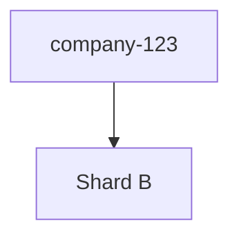

This provides strong **query locality**.

Most tenant-specific operations remain inside one shard.

That can reduce:

- cross-shard joins
- cross-shard transactions
- distributed queries.

---

# 18. The Large-Tenant Problem

Tenant-based sharding has an important failure mode.

Suppose:

```text
Tenant A → 500 GB
Tenant B → 2 GB
Tenant C → 3 GB
```

If each tenant is treated as a unit:

```text
Shard A → Tenant A
Shard B → Tenant B, C, ...
```

Tenant A may become a hot or oversized shard.

This is sometimes called a:

> **hot tenant**

or:

> **large tenant problem**

A strategy may therefore need to support moving or splitting large tenants.

---

# 19. Strategy 5 — Geographic Sharding

Geographic sharding distributes data according to geographic location.

Example:

```text
India       → India shard
Europe      → Europe shard
North America → US shard
Asia-Pacific → Singapore shard
```

A user's request can be routed toward the appropriate region.

---

# 20. Why Geographic Sharding?

Geographic distribution can help with:

- latency
- data residency requirements
- regional availability
- disaster isolation
- regional traffic management.

For example:

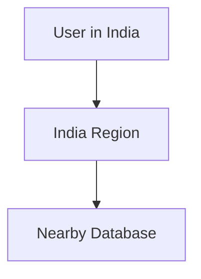

instead of:

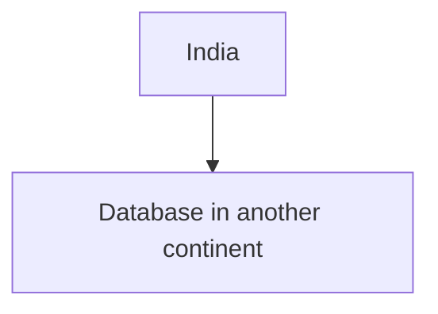

---

# 21. Geographic Sharding Creates Data-Location Questions

Geographic distribution introduces important questions:

- Can users access data from another region?
- Can an order created in India be viewed in Europe?
- Where is the source of truth?
- How is cross-region consistency handled?
- What happens if one region fails?
- Are there data residency requirements?
- What happens when a user moves countries?

Geographic sharding is therefore not simply:

```text
country → database
```

It is an architectural decision about **data ownership and access**.

---

# 22. Strategy 6 — Time-Based Sharding

Time-based sharding distributes data according to time.

Example:

```text
2026 Q1 → Shard A
2026 Q2 → Shard B
2026 Q3 → Shard C
2026 Q4 → Shard D
```

Another system might use:

```text
daily
weekly
monthly
yearly
```

depending on volume.

---

# 23. When Time-Based Sharding Makes Sense

Time-based distribution is useful for data such as:

- logs
- events
- analytics records
- transactions
- historical measurements
- audit data.

The common access pattern is:

```text
Show data from last 30 days
```

or:

```text
Analyze last month's events
```

The system can target the relevant time ranges.

---

# 24. Time-Based Sharding and Retention

Time-based distribution can simplify lifecycle management.

Suppose data is retained for 12 months:

```text
Month 1
Month 2
...
Month 12
```

When Month 1 expires, the system may be able to remove the entire old data unit rather than deleting individual records one by one.

This can make retention operations much more predictable.

However, exact implementation depends on the database and storage architecture.

---

# 25. The Hot-Newest-Shard Problem

Time-based sharding has a common pattern:

```text
Old data → mostly reads
New data → almost all writes
```

For example:

```text
2026-07 → low writes
2026-08 → low writes
2026-09 → medium writes
2026-10 → very high writes
```

The newest shard may become the bottleneck.

Therefore:

> **Time locality can improve query locality while creating write concentration.**

---

# 26. Strategy 7 — Composite Shard Keys

Sometimes one field is not enough.

A system can use multiple values:

```text
country + user_id
```

or:

```text
tenant_id + user_id
```

This is a **composite shard key**.

For example:

```text
tenant_id = 42
user_id   = 9876
```

The routing function might conceptually use:

```text
hash(tenant_id, user_id)
```

The exact mechanism depends on the database/system.

---

# 27. Why Composite Keys?

Suppose we shard only by:

```text
tenant_id
```

A large tenant may become a hotspot.

Suppose we shard only by:

```text
user_id
```

Tenant-specific queries may require multiple shards.

A composite strategy can attempt to balance both requirements.

But it also makes routing and data modeling more complicated.

---

# 28. Query Locality

One of the most important ideas in sharding is **query locality**.

Query locality means:

> **A query can find the required data in as few shards as possible.**

Good:

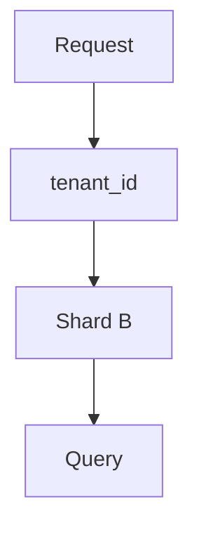

Less efficient:

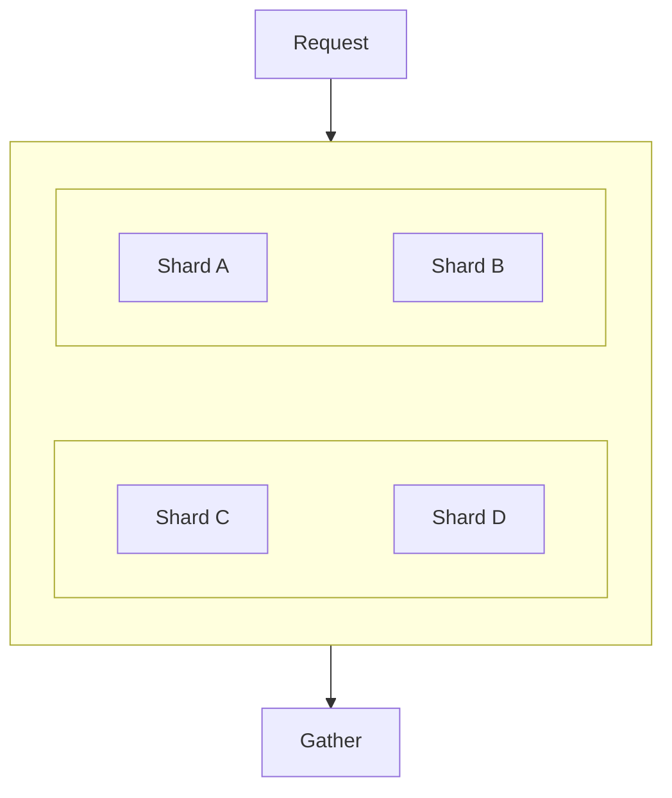

A good shard key often makes important queries local.

---

# 29. Distribution Quality

A shard key should be evaluated using actual workload characteristics.

Consider:

```text
Shard A → 10%
Shard B → 11%
Shard C → 9%
Shard D → 70%
```

This is a warning sign.

A better distribution might be:

```text
Shard A → 24%
Shard B → 26%
Shard C → 25%
Shard D → 25%
```

But even this does not automatically mean the architecture is correct.

A small percentage of traffic can still be expensive if those requests perform very heavy operations.

---

# 30. Hotspots

A hotspot occurs when one shard receives disproportionately high:

- writes
- reads
- storage
- CPU work
- memory pressure
- connections.

Possible causes include:

### Poor shard key

```text
country
```

where one country contains most users.

### Popular tenant

```text
Tenant A → huge traffic
```

### Sequential writes

```text
newest IDs → newest range
```

### Time concentration

```text
current time window → most writes
```

### Popular object

```text
one product → millions of requests
```

---

# 31. Hotspot Prevention

Possible approaches include:

- choose a better shard key
- use hashing
- use composite keys
- split large tenants
- distribute hot objects
- add caching
- isolate workloads
- use additional partitions
- rebalance data
- introduce request-level controls.

The correct solution depends on the source of the hotspot.

---

# 32. Migration Strategies

Common migration approaches include:

### Offline migration

Stop writes, move data, switch routing.

Simple conceptually, but may require downtime.

### Online migration

Continue serving traffic while data is copied.

More complex, but can reduce downtime.

### Dual-write period

Temporarily write to both old and new locations.

This can help migration but introduces consistency risks.

### Copy → Verify → Switch

A safer conceptual sequence is:

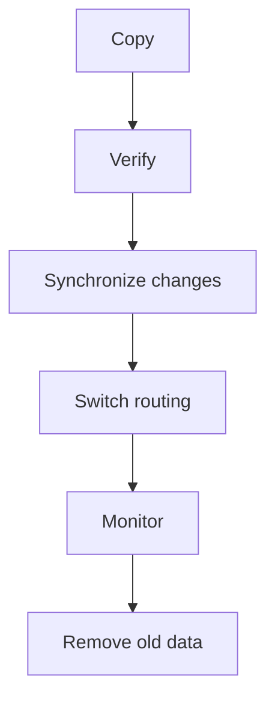

The exact implementation depends on the database and application.

---

# 33. Shard-Key Stability

A good shard key should ideally remain stable.

Suppose a user is initially routed by:

```text
country = India
```

Then the user moves to:

```text
country = Germany
```

If the shard key is country, their data may need to move.

This can be acceptable, but the architecture must explicitly handle it.

Changing shard ownership should not silently create inconsistent copies.

---

# 34. Choosing Between Strategies

A simplified comparison:

| Strategy | Main Strength | Main Challenge |
|---|---|---|
| Range | Excellent range locality | Hot ranges |
| Hash | Good distribution | Poorer range locality |
| Directory | Flexible placement | Directory dependency |
| Tenant | Strong tenant locality | Large/hot tenants |
| Geographic | Regional latency/data ownership | Cross-region complexity |
| Time | Time-range queries and retention | Hot newest range |
| Composite | Balances multiple requirements | More complexity |

This is not a ranking.

The appropriate strategy depends on the workload.

---

# 35. A Practical Decision Process

Instead of choosing a strategy first, use this sequence:

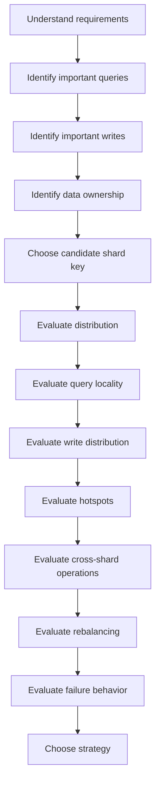

---

# 36. Question 1 — What Queries Must Be Fast?

List the important queries.

Example:

```text
Get customer
Get customer's orders
Get order
Get order history
Generate monthly report
```

Now ask:

> Which of these queries can be routed to one shard?

This can eliminate poor shard-key candidates early.

---

# 37. Question 2 — What Data Should Stay Together?

If an operation frequently needs:

```text
Customer
Orders
Payments
```

keeping these related records together may reduce distributed operations.

This is **data locality**.

But do not blindly co-locate everything.

The larger the unit of co-location, the greater the possibility of creating a hotspot.

---

# 38. Question 3 — Where Will Writes Go?

Estimate the write pattern.

For example:

```text
100,000 writes/sec
```

If a strategy causes:

```text
Shard A → 70,000 writes/sec
Shard B → 10,000
Shard C → 10,000
Shard D → 10,000
```

then Shard A may become the bottleneck.

A strategy that looks good from a data-model perspective may still fail operationally.

---

# 39. Question 4 — Where Will Reads Go?

The same analysis should be performed for reads.

For example:

```text
Shard A → 80% reads
Shard B → 7%
Shard C → 7%
Shard D → 6%
```

Even if storage is balanced, read traffic is not.

Caching, replica placement, or a different shard strategy may be required.

---

# 40. Question 5 — How Will the System Rebalance?

Ask this **before** production.

Not:

> "What happens when the shard becomes too large?"

But:

> **"How will we move data without breaking the application?"**

Consider:

- migration time
- routing updates
- online migration
- synchronization
- validation
- rollback
- monitoring.

A sharding strategy that cannot evolve safely can become a long-term operational problem.

---

# 41. Question 6 — What Happens When a Shard Fails?

Suppose:

```text
Shard B ❌
```

Ask:

- Which users are affected?
- Which requests fail?
- Can the shard be recovered?
- Is there a replica?
- Can traffic be rerouted?
- Is data available elsewhere?
- How is recovery coordinated?

Sharding can make failure **more localized**, but it can also make the architecture more complicated.

---

# 42. Common Mistake — Choosing a Key Because It Looks Convenient

Example:

```text
country
```

It is easy to understand.

But suppose:

```text
India → 70% users
USA   → 10%
UK    → 5%
Other → 15%
```

Country may produce poor distribution.

The easiest key to explain is not necessarily the best key to operate.

---

# 43. Common Mistake — Ignoring Cross-Shard Operations

A design may distribute data beautifully but make every important query distributed.

For example:

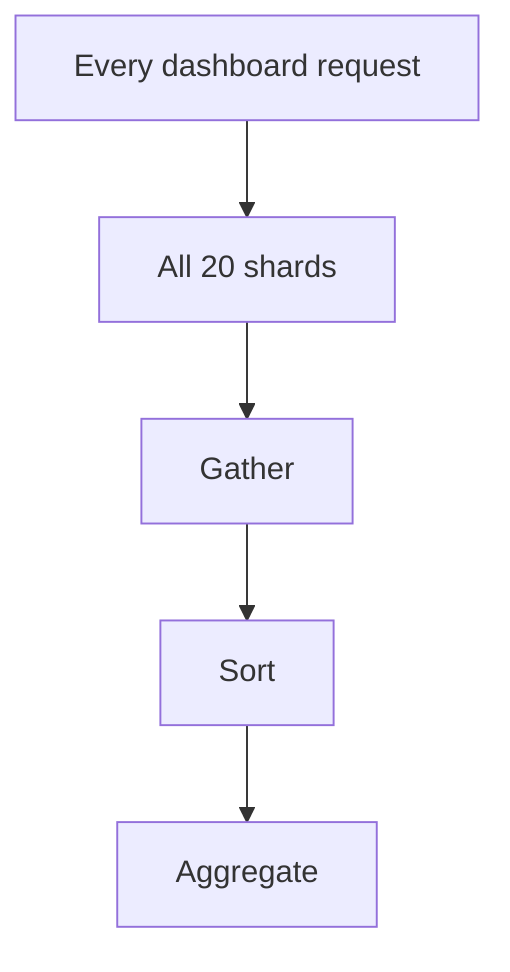

The database is technically sharded, but the application may have gained little from the architecture.

Ask:

> **Can the important queries be answered locally?**

---

# 44. Common Mistake — Assuming More Shards Always Means More Performance

Suppose:

```text
4 shards
```

becomes:

```text
40 shards
```

That introduces more:

- connections
- routing decisions
- monitoring
- migrations
- network calls
- failure cases
- operational overhead.

More shards can increase capacity, but they also increase complexity.

---

# 45. Common Mistake — Forgetting Future Growth

A shard key may work at:

```text
10 million users
```

but become problematic at:

```text
10 billion users
```

Before choosing a strategy, ask:

> What happens when the system becomes 10× larger?

Growth changes:

- data volume
- request volume
- shard count
- migration frequency
- hotspot probability
- operational complexity.

---

# 46. Practical Shard-Key Evaluation

Suppose an e-commerce system has:

```text
customers
orders
products
payments
```

Candidate keys might include:

```text
customer_id
order_id
product_id
country
```

Evaluate each.

| Candidate | Query Locality | Distribution | Hotspot Risk | Notes |
|---|---|---|---|---|
| `customer_id` | Good for customer workflows | Usually high | Large customers can be hot | Useful for tenant/customer locality |
| `order_id` | Good for individual orders | Usually high | Depends on generation strategy | Poor for customer history |
| `product_id` | Good for product workflows | Usually high | Popular products can be hot | Product popularity matters |
| `country` | Good for regional access | Depends on population | Large countries may dominate | Useful when geography is fundamental |

The table does not select a winner.

It shows the questions that must be investigated.

---

# 47. Hands-On Exercise — Compare Sharding Strategies

We will model a simple user system.

Assume:

```text
Users: 100 million
Daily reads: 1 billion
Daily writes: 50 million
```

Important queries:

```text
1. Get user by user_id
2. Get all users in a country
3. Get a user's recent activity
4. Generate a global user count
```

Consider these strategies:

```text
A. Range by user_id
B. Hash by user_id
C. Geographic by country
D. Tenant/user composite
```

---

## Step 1 — Evaluate Query Locality

Ask:

### Get user by user_id

Which strategy can locate the user efficiently?

```text
Range by user_id → likely local
Hash by user_id  → likely local
Country          → still needs user lookup inside region
```

### Get all users in a country

```text
Country sharding → naturally local
Hash user_id     → potentially distributed
```

The important lesson:

> Different access patterns favor different shard keys.

---

## Step 2 — Evaluate Write Distribution

Suppose users are continuously created.

Range-based IDs may concentrate writes into the newest range.

Hashing may distribute them more evenly.

Therefore:

```text
Range:
new writes → newest shard
```

versus:

```text
Hash:
new writes → distributed shards
```

The exact result depends on the implementation and workload.

---

## Step 3 — Evaluate Global Queries

Consider:

```text
Count all users
```

With any sharding strategy, a global query may require multiple shards.

Conceptually:

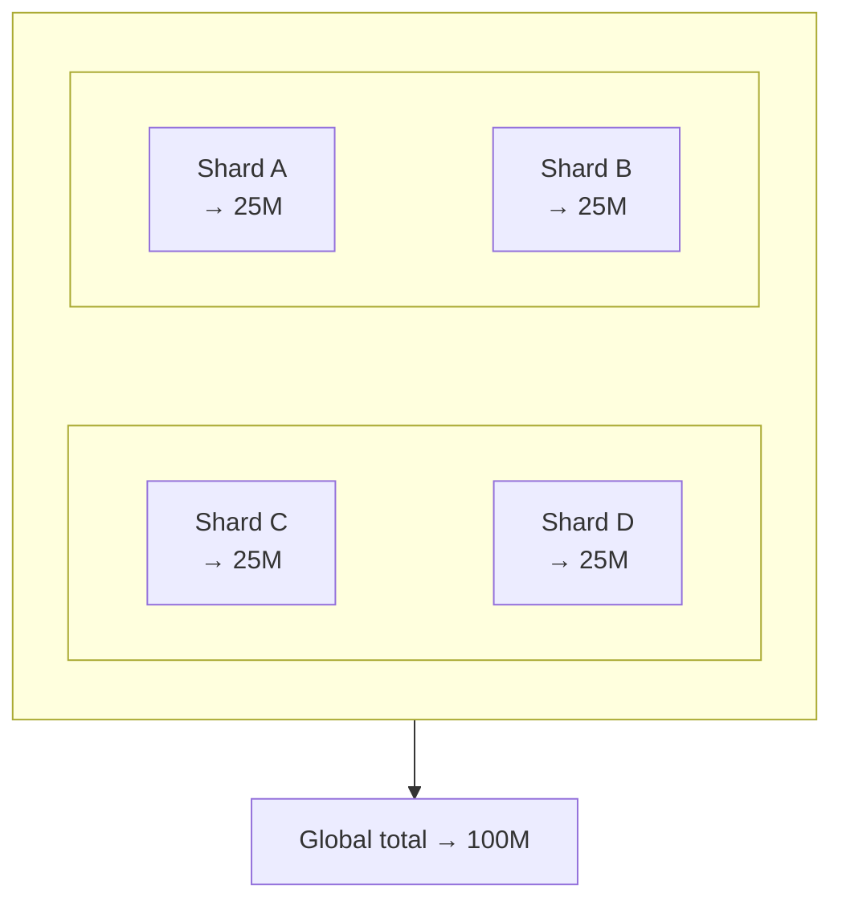

Global operations should therefore be considered during system design.

---

## Step 4 — Evaluate Rebalancing

Suppose one shard becomes too large.

Ask:

```text
Can data be moved?
Can routing change safely?
Can writes continue?
How long will migration take?
What happens if migration fails?
```

This often becomes one of the most important operational questions in a mature sharded system.

---

# 48. Lab Challenge

Design a sharding strategy for:

### Scenario

A SaaS platform has:

```text
10,000 tenants
50 million users
2 billion records
```

Most queries are:

```text
Get data for one tenant
Get users for one tenant
Get reports for one tenant
```

Answer:

1. What would you consider as the shard key?
2. Why?
3. What could create a hot shard?
4. What happens if one tenant becomes extremely large?
5. How could that tenant be isolated?
6. How would you handle a global report?
7. How would you rebalance the system?

There is no single answer.

The objective is to justify the architecture using:

```text
Access patterns
+
Distribution
+
Workload
+
Failure
+
Growth
```

---

# 49. A Practical Sharding Checklist

Before implementing sharding, ask:

### Data

- What data is being distributed?
- How large will it become?
- How quickly will it grow?

### Shard Key

- Is the key high-cardinality?
- Is it stable?
- Is it present in important queries?
- Does it distribute data well?
- Does it distribute writes well?

### Queries

- Can important queries target one shard?
- How many queries require scatter-gather?
- Are joins cross-shard?
- Are transactions cross-shard?

### Workload

- Where do reads go?
- Where do writes go?
- Are there hot tenants?
- Are there hot objects?

### Operations

- How is data rebalanced?
- How are shards added?
- How are shards removed?
- How are migrations performed?

### Failure

- What happens when one shard fails?
- Is there replication?
- Can traffic be isolated?
- How is recovery performed?

### Growth

- What happens at 10× scale?
- What happens when the shard count increases?
- Does the routing model still work?

---

# 50. Sharding Strategy Is a Workload Decision

A common misconception is:

> "Hash sharding is better because it distributes data evenly."

That is incomplete.

Another system may prefer range sharding because it performs many range queries.

Another may prefer tenant-based sharding because most operations are tenant-local.

Another may need geographic distribution because data location is part of the system requirement.

Therefore:

> **The best sharding strategy is the one that matches the system's access patterns, workload, ownership model, and operational requirements.**

---

# 51. Sharding Strategy and Architecture Evolution

A system does not need to begin with sharding.

A common evolution might look like:

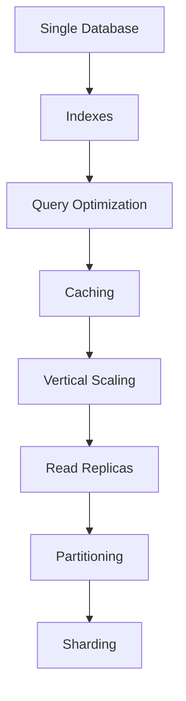

This is not a mandatory sequence.

The actual path depends on the bottleneck.

Sharding should solve a demonstrated scaling problem.

---

# 52. Sharding Mental Model

Think about sharding as four questions:

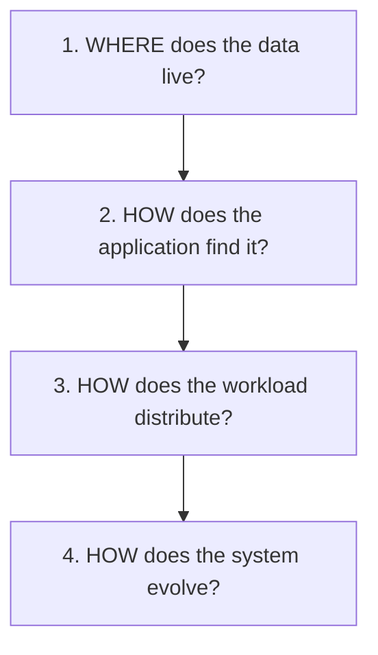

A sharding strategy is incomplete if it answers only the first question.

---

# 53. The Most Important Questions

When evaluating a sharding strategy, ask:

### Question 1

> **Can important requests find their data without querying every shard?**

### Question 2

> **Does the shard key distribute both data and workload?**

### Question 3

> **What happens when one shard becomes hot?**

### Question 4

> **How will data move when the architecture grows?**

### Question 5

> **What happens when a shard fails?**

These questions expose most major sharding design problems.

---

# 54. Key Principle

> **A sharding strategy defines how data and workload are distributed across independent database nodes. Choosing the strategy is not about picking the most sophisticated algorithm; it is about matching the shard key and distribution model to the system's access patterns, workload, ownership, growth, and failure requirements.**

---

# 55. Quick Reference

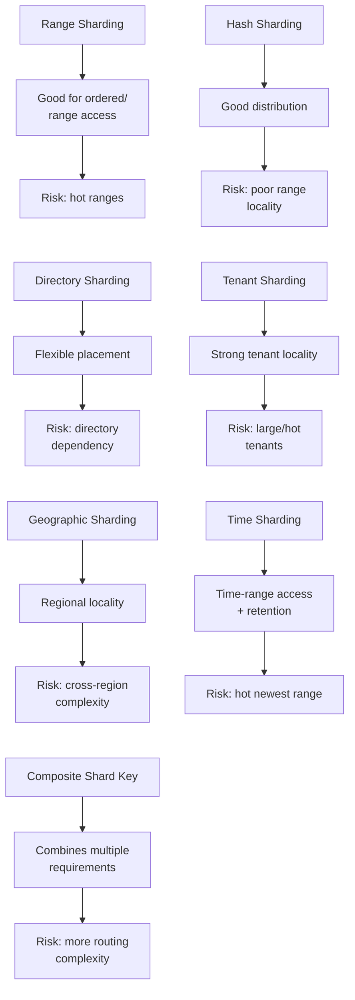

---

# 56. Knowledge Check

### 1. What is a sharding strategy?

A method for deciding how records are distributed across shards.

### 2. Why is the shard key important?

Because it determines where data goes and often determines how efficiently requests can be routed.

### 3. What is a major advantage of range sharding?

It can provide strong locality for range queries.

### 4. What is a major risk of range sharding?

Hot ranges, especially when new writes concentrate in the newest range.

### 5. Why does hash sharding distribute data well?

Hashing can spread keys across shards rather than keeping nearby keys together.

### 6. What is the major trade-off of hash sharding?

Range queries may require multiple shards.

### 7. What is directory-based sharding?

A separate mapping determines which shard owns a particular key or data group.

### 8. Why is tenant-based sharding useful?

Tenant-specific requests can often remain within one shard.

### 9. What is a hot tenant?

A tenant whose data or traffic is disproportionately large and puts pressure on its shard.

### 10. What is query locality?

The ability to answer a query using as few shards as practical.

### 11. Why is rebalancing necessary?

Because data and workload distribution change as the system grows.

### 12. Does adding a shard automatically redistribute existing data?

No. Existing data generally requires an explicit rebalancing or migration process.

---

# 57. Remember

```text
Sharding is not:

"Create more databases."

Sharding is:

"Distribute data and workload deliberately
across independent database nodes."
```

And the strategy must answer:

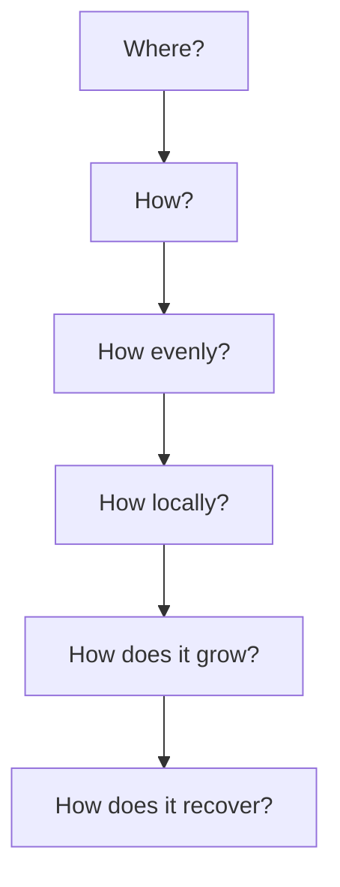

---

# 58. Next Chapter

## 04.16 — Consistent Hashing

We will build on sharding strategies and study:

- Why ordinary hashing makes rebalancing difficult
- The key movement problem
- Consistent hashing
- Hash rings
- Nodes and virtual nodes
- Key distribution
- Adding a node
- Removing a node
- Minimizing data movement
- Virtual nodes
- Hotspots
- Consistent hashing vs simple modulo hashing
- Consistent hashing in distributed caches
- Consistent hashing in sharded systems
- Failure and node replacement
- Rebalancing
- Practical examples
- Hands-on consistent-hashing exercise
- System-design trade-offs.
