# 04.16 — Consistent Hashing

## Learning Objectives

By the end of this chapter, you should understand:

- Why ordinary hashing can create a rebalancing problem
- What consistent hashing is
- Why a hash ring is used
- How keys are mapped to nodes
- How nodes are added and removed
- Why consistent hashing reduces data movement
- What virtual nodes are
- How virtual nodes improve distribution
- How consistent hashing relates to sharding
- How consistent hashing relates to distributed caching
- How hotspots can still occur
- What happens when a node fails
- The difference between modulo hashing and consistent hashing
- The trade-offs of consistent hashing
- When consistent hashing is useful and when it is unnecessary

---

# 1. The Problem Consistent Hashing Solves

In the previous chapter, we learned that a sharded system needs a way to decide:

> **Which shard should own this piece of data?**

A simple approach is:

```text
hash(key) % number_of_shards
```

For example:

```text
hash(user_id) % 4
```

This works well while there are exactly four shards.

But what happens when the system grows?

Suppose we have:

```text
4 shards
```

and later add:

```text
Shard 5
```

The formula changes from:

```text
hash(key) % 4
```

to:

```text
hash(key) % 5
```

That small change can cause a surprisingly large amount of data to move.

This is the problem consistent hashing addresses.

---

# 2. Ordinary Modulo Hashing

Let's start with the simpler approach.

For example:

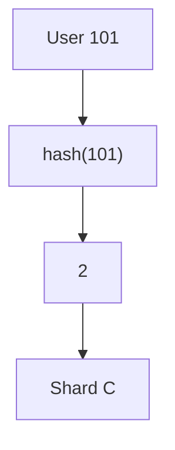

Another user:

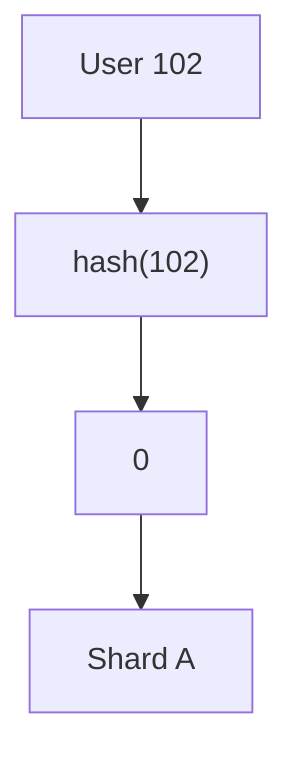

The mapping is simple.

---

# 3. What Happens When a Shard Is Added?

Because the divisor changed, many keys can produce different results.

For example:

```text
Key        % 4       % 5

A          0         3
B          1         4
C          2         1
D          3         0
E          0         2
F          1         4
G          2         3
```

Notice that several keys changed owners.

The important point is not the exact numbers.

The important point is:

> **Changing the number of nodes changes the mapping for many keys.**

---

# 4. Why This Is Expensive

Imagine a distributed cache:

```text
Cache A
Cache B
Cache C
Cache D
```

Millions of cached objects are distributed using:

```text
hash(key) % 4
```

Now Cache E is added.

The system starts using:

```text
hash(key) % 5
```

Many keys now map to different cache nodes.

The system may see:

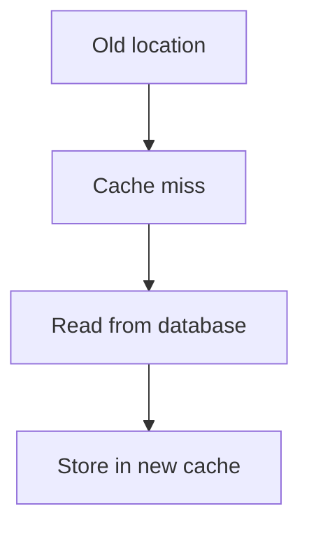

If millions of keys move logically at once, the database can receive a sudden burst of requests.

This can create:

- cache misses
- database load
- network traffic
- latency spikes
- unnecessary data movement.

---

# 5. The Key Movement Problem

This is the central problem:

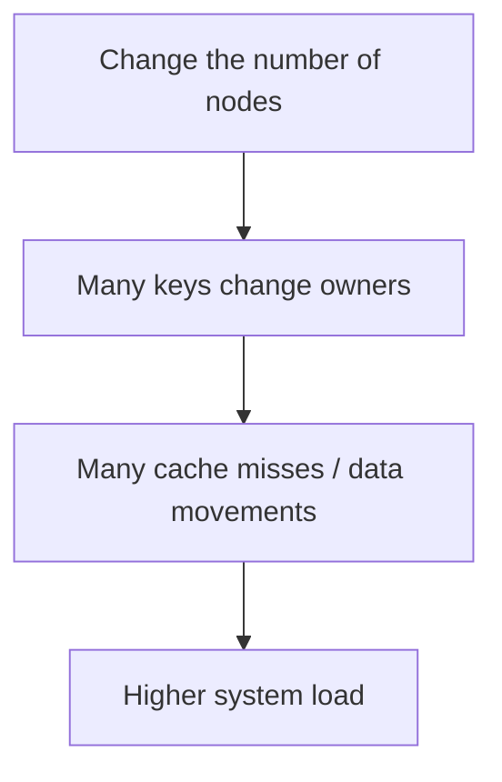

A good distributed system wants to minimize unnecessary movement.

This leads to the idea of **consistent hashing**.

---

# 6. What Is Consistent Hashing?

**Consistent hashing** is a hashing technique that maps both:

- data keys
- nodes

onto the same logical hash space.

Instead of:

```text
key → modulo → node number
```

we use a circular structure called a:

> **hash ring**

The ring allows the system to add or remove nodes while changing the ownership of only a portion of the keys.

---

# 7. The Hash Ring

Imagine a circular number line:

```text
              0
          .-------.
       .             .
     .                 .
   .                     .
  .                       .
  |                       |
   .                     .
     .                 .
       .             .
          '-------'
          2^N - 1
```

The hash values wrap around.

So after the largest value, we return to:

```text
0
```

Conceptually:

```text
0 → 1 → 2 → ... → MAX
↑                  ↓
└──────────────────┘
```

This circular space is the **hash ring**.

---

# 8. Nodes Also Live on the Ring

Suppose we have three nodes:

```text
Node A
Node B
Node C
```

Hash each node's identifier:

```text
hash(Node A) → position
hash(Node B) → position
hash(Node C) → position
```

Conceptually:

```text
                Node A
                   ●
              .---------.
           .               .
        .                     .
     .                           .
 Node C ●                       ● Node B
     .                           .
        .                     .
           .               .
              '---------'
```

The exact positions depend on the hash function.

---

# 9. Keys Also Live on the Ring

Now hash a data key.

For example:

```text
hash("user:101")
```

produces a position on the same ring.

The system then follows the ring in a defined direction until it reaches a node.

A common rule is:

> **A key belongs to the first node encountered when moving clockwise from the key's position.**

For example:

```text
Key X
  ↓
●──────────────→
                Node B
```

Therefore:

```text
Key X → Node B
```

---

# 10. A Simple Ring Example

Suppose the ring contains:

```text
Node A → position 100
Node B → position 300
Node C → position 700
```

And:

```text
Key X → position 150
```

Moving clockwise:

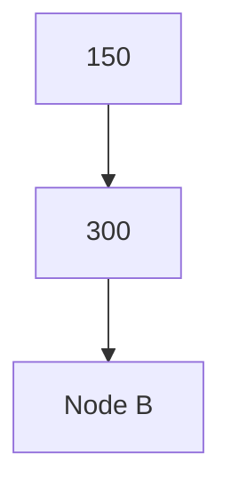

Therefore:

```text
Key X → Node B
```

Another key:

```text
Key Y → position 500
```

Moving clockwise:

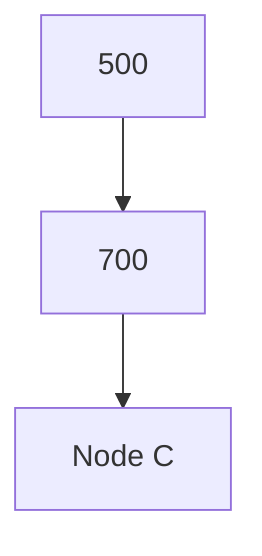

Therefore:

```text
Key Y → Node C
```

---

# 11. The Wrap-Around Rule

Consider a key near the end of the ring.

Suppose:

```text
Node A → 100
Node B → 300
Node C → 700
```

and:

```text
Key Z → 900
```

There may be no node after position 900.

The ring wraps around:

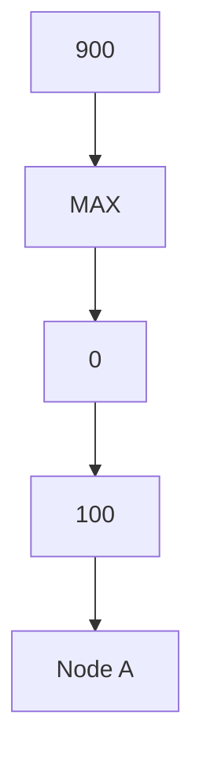

Therefore:

```text
Key Z → Node A
```

This wrap-around behavior is fundamental to the hash ring.

---

# 12. Why the Ring Helps

Now suppose we add a new node:

```text
Node D
```

Assume it is placed at:

```text
position 500
```

Before:

```text
Node B → 300
Node C → 700
```

Keys between:

```text
300 < key ≤ 700
```

may have belonged to Node C.

After Node D is inserted:

```text
Node B → 300
Node D → 500
Node C → 700
```

Only keys in the affected interval need to change ownership:

```text
300 < key ≤ 500
```

Keys in other intervals can remain where they were.

This is the key benefit.

---

# 13. Consistent Hashing Reduces Data Movement

Without consistent hashing:

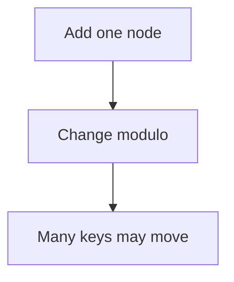

With consistent hashing:

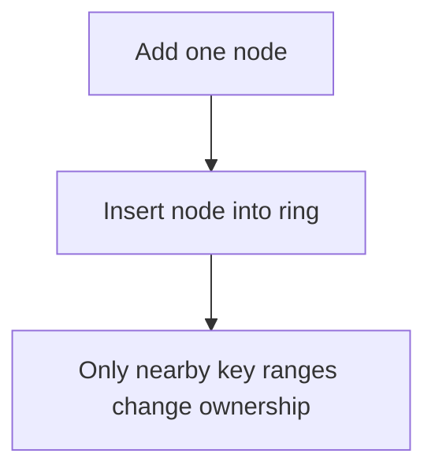

Therefore:

> **Consistent hashing minimizes unnecessary key movement when nodes are added or removed.**

It does not mean zero movement.

Some keys still need to move.

---

# 14. Removing a Node

The same idea works when a node disappears.

Suppose:

```text
A ───── B ───── C
```

and B fails or is removed.

The keys previously owned by B can move to the next appropriate node.

Conceptually:

```text
Before:

A → keys
B → keys
C → keys
```

After:

```text
A → keys
C → B's former keys + C's original keys
```

Only the keys associated with the removed node need reassignment.

---

# 15. Node Failure

Consider:

```text
Node A ✓
Node B ✓
Node C ✓
```

Then:

```text
Node B ✗
```

The routing system must determine where B's keys should go.

With consistent hashing:

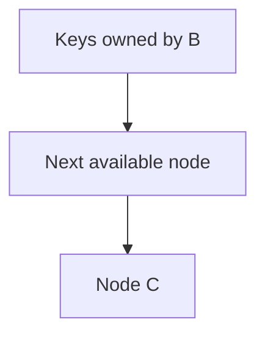

However, a real production system usually combines consistent hashing with:

- replication
- health checks
- failure detection
- routing metadata
- recovery procedures.

Consistent hashing itself does not make data durable.

---

# 16. Consistent Hashing Does Not Mean Replication

This distinction is important.

Consistent hashing answers:

> **Which node should own this key?**

Replication answers:

> **Where should additional copies of this data exist?**

For example:

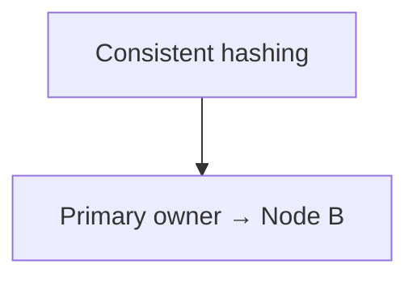

Replication may then create:

```text
Node B → Primary
Node C → Replica
Node D → Replica
```

The two concepts solve different problems.

---

# 17. Virtual Nodes

There is another problem.

Suppose we place only one position on the ring for each physical server:

```text
Node A → one position
Node B → one position
Node C → one position
```

The positions may not be evenly distributed.

For example:

```text
A ──────────────────────────────── B
                  C
```

Node C may own a very small or very large section of the ring.

This can produce uneven load.

The solution is commonly called:

> **Virtual nodes**, or **vnodes**.

---

# 18. What Is a Virtual Node?

Instead of placing one physical node on the ring, place many logical positions representing that node.

For example:

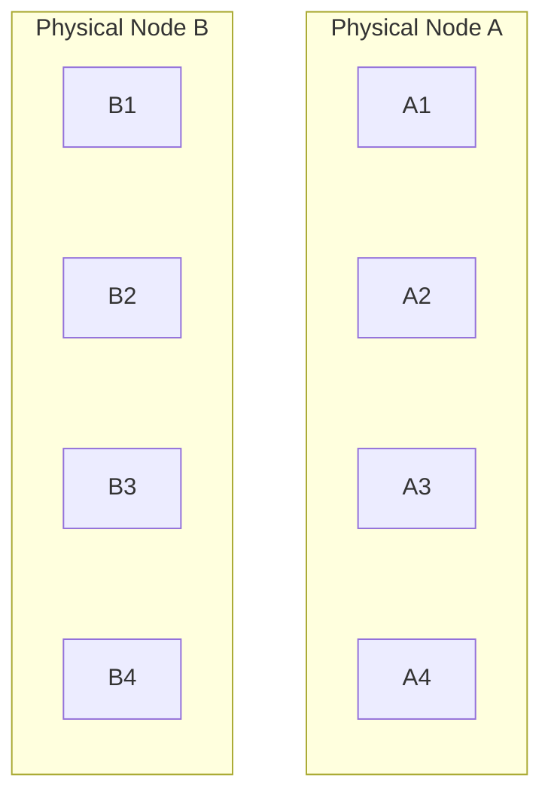

All these positions exist on the same hash ring.

---

# 19. Virtual Node Example

Instead of:

```text
A
B
C
```

we might have:

```text
A1
B1
C1
A2
C2
B2
A3
B3
C3
```

distributed around the ring.

Conceptually:

```text
A1 ─ B1 ─ C1 ─ A2 ─ C2 ─ B2 ─ A3 ─ B3 ─ C3
```

Each physical server owns multiple sections.

This usually produces better distribution.

---

# 20. Why Virtual Nodes Help

Virtual nodes can provide:

### Better distribution

A physical node owns many smaller ranges instead of one large range.

### Smoother load

The ownership of keys is spread across the ring.

### Easier rebalancing

When a physical node is added, it can receive multiple smaller ranges.

### More flexibility

A larger server can potentially own more virtual nodes than a smaller server.

---

# 21. Weighted Nodes

Suppose:

```text
Server A → 32 GB RAM
Server B → 128 GB RAM
```

Treating them identically may not be appropriate.

A system can conceptually assign:

```text
Server A → fewer virtual nodes
Server B → more virtual nodes
```

Therefore:

```text
A → 10 virtual nodes
B → 40 virtual nodes
```

This can give the larger machine a larger share of the hash space.

The exact mechanism depends on the implementation.

---

# 22. Consistent Hashing vs Modulo Hashing

The central difference is how node membership affects key ownership.

| Property | Modulo Hashing | Consistent Hashing |
|---|---|---|
| Mapping | `hash(key) % N` | Hash ring |
| Add node | Can remap many keys | Usually affects nearby ranges |
| Remove node | Can remap many keys | Usually affects keys owned by that node |
| Data movement | Potentially large | Usually smaller |
| Distribution | Depends on hash/N | Improved with vnodes |
| Complexity | Simple | More complex |
| Range queries | Not naturally supported | Not naturally supported |
| Common use | Simple fixed node sets | Dynamic distributed systems |

The key difference is:

> **How much ownership changes when the node set changes.**

---

# 23. Important Clarification: "Consistent" Does Not Mean "Always Consistent"

The name can be confusing.

**Consistent hashing does not mean strong data consistency.**

It is a technique for determining:

```text
key → node
```

and minimizing movement when nodes change.

It does not automatically provide:

- ACID transactions
- strong consistency
- replication
- durability
- conflict resolution.

Those are separate system properties.

---

# 24. Consistent Hashing and Distributed Caches

Consistent hashing is especially useful in distributed caches.

Architecture:

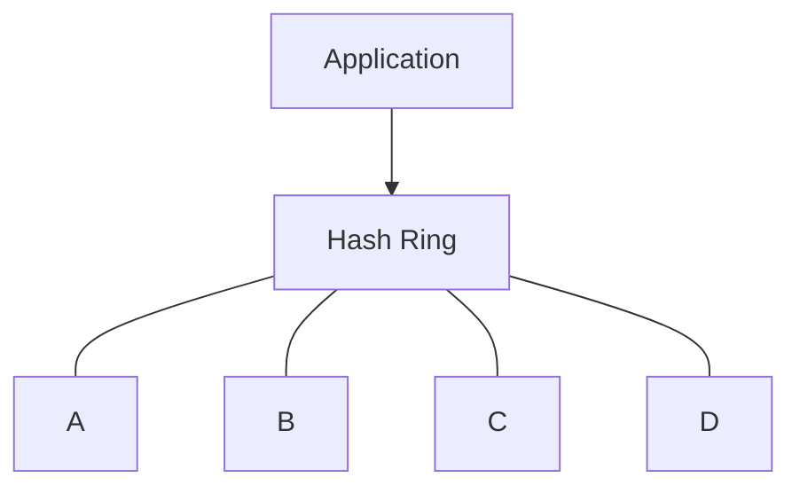

For:

```text
cache_key = user:101
```

the routing layer calculates:

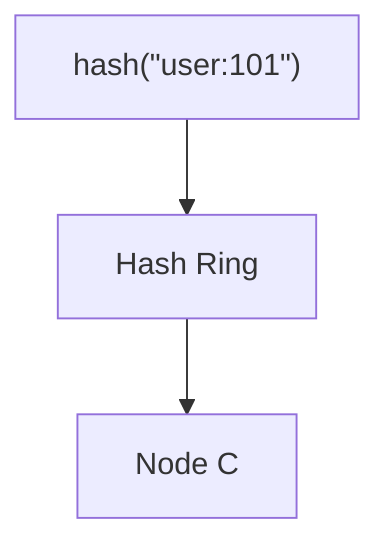

The application accesses Node C.

---

# 25. Consistent Hashing and Sharded Databases

Consistent hashing can also be used as part of a sharding strategy.

Conceptually:

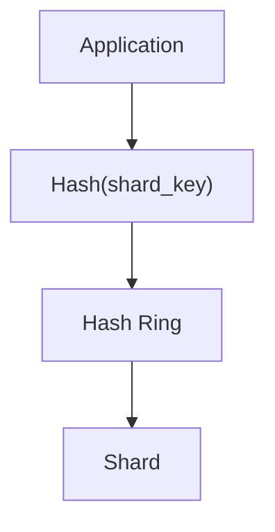

For example:

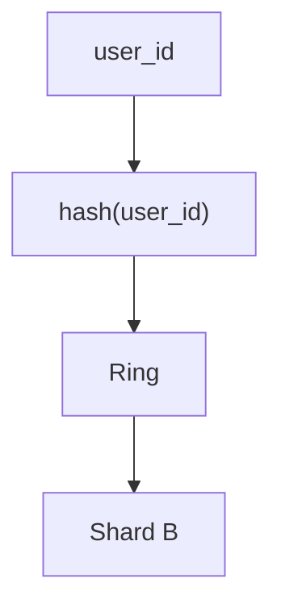

This is one possible implementation.

It is not a requirement that every sharded database use consistent hashing.

---

# 26. Consistent Hashing Does Not Solve Every Sharding Problem

Suppose consistent hashing distributes:

```text
user_id
```

very evenly.

But the application frequently asks:

```text
Get all orders
for customers in Germany
```

Those records may still be distributed across many shards.

The system can still require:

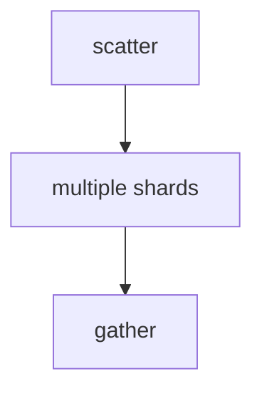

Therefore:

> **Good distribution does not automatically mean good query locality.**

This is an important connection to 04.15.

---

# 27. Hotspots Can Still Exist

Consistent hashing improves distribution, but it does not magically eliminate hotspots.

Suppose:

```text
user:123
```

is extremely popular.

Millions of requests may target:

```text
user:123
```

The key still maps to one owner.

That node can become hot.

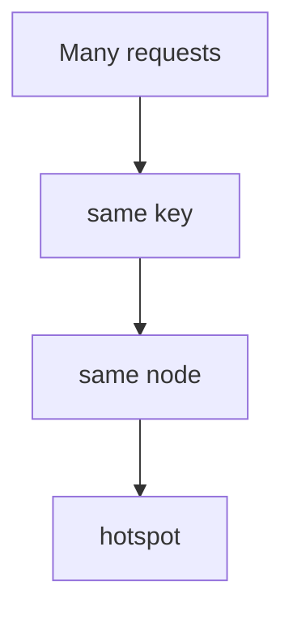

This is a **hot key** problem.

---

# 28. Handling Hot Keys

Possible approaches include:

- caching
- key replication
- request coalescing
- read replicas
- splitting a workload
- application-level fan-out
- specialized data distribution.

The correct approach depends on the workload.

Consistent hashing solves node membership movement.

It does not automatically solve hot-key traffic concentration.

---

# 29. Virtual Nodes and Hotspots

Virtual nodes help with **general distribution**.

They do not necessarily solve a single extremely popular key.

For example:

```text
A1 B1 C1 A2 B2 C2
```

If:

```text
user:123
```

maps to:

```text
B2
```

then all requests for that key still go to B2.

Therefore:

> **Virtual nodes distribute many keys more evenly; they do not automatically distribute one hot key.**

---

# 30. Failure Domains Still Matter

Suppose virtual nodes are distributed across:

```text
Server A
Server B
Server C
```

But:

```text
Server A
Server B
```

are both in the same physical rack.

A rack failure could affect both.

Therefore, a real distributed architecture must consider:

- machines
- racks
- availability zones
- regions
- network failure domains.

Hash placement is only one part of the architecture.

---

# 31. Consistent Hashing and Replication

A more complete design may look like:

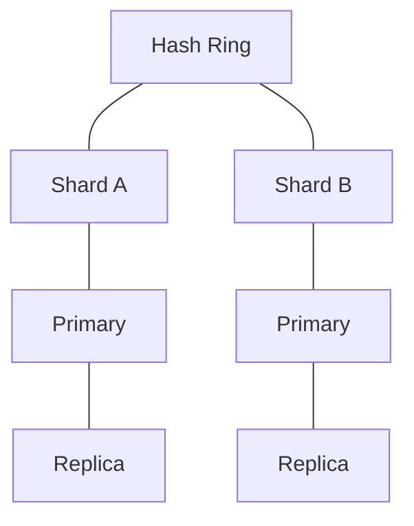

The hash ring determines primary ownership.

Replication provides additional copies.

If the primary fails, another replica may take over.

This creates separate responsibilities:

```text
Hashing
  → routing

Replication
  → additional copies

Failover
  → recovery

Monitoring
  → detection
```

---

# 32. Node Addition With Virtual Nodes

Suppose we have:

```text
A
B
C
```

Each has multiple virtual nodes.

Now add:

```text
D
```

D receives several positions:

```text
D1
D2
D3
D4
```

These positions take ownership of several small intervals.

Instead of moving one huge continuous range, ownership changes across multiple smaller ranges.

This usually provides smoother distribution.

---

# 33. Node Removal With Virtual Nodes

Suppose:

```text
B
```

fails.

B may own:

```text
B1
B2
B3
B4
```

Each affected interval can be reassigned according to the ring.

Instead of one large ownership block, the lost ownership is distributed among multiple surviving nodes.

This can help prevent one surviving node from receiving the entire failed node's workload.

---

# 34. Rebalancing Is Still Necessary

Consistent hashing reduces movement.

It does not eliminate it.

When a node is added:

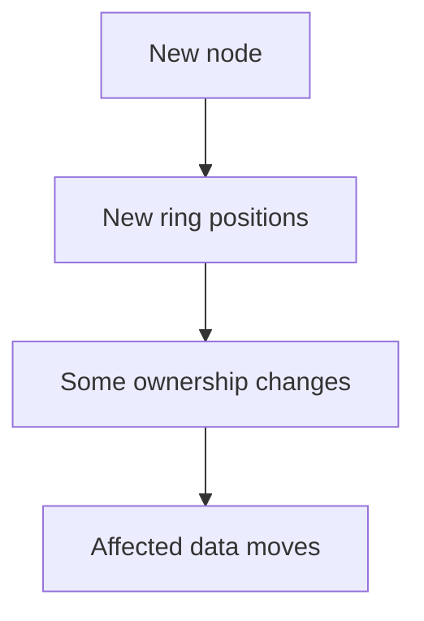

The system still needs mechanisms for:

- data migration
- synchronization
- routing updates
- verification
- cleanup.

Therefore:

> **Consistent hashing reduces the amount of rebalancing; it does not remove the need for rebalancing.**

---

# 35. Data Migration During Rebalancing

Conceptually:

```mermaid
flowchart TD
  accTitle: Data migration
  accDescr: Old owner (copy) to new owner, (verify) to routing update, then the new owner becomes authoritative.
  N0["Old Owner"] -->|"copy"| N1["New Owner"] -->|"verify"| N2["Routing update"] --> N3["New Owner becomes authoritative"]
```

A production system must also handle writes that occur during migration.

Possible approaches include:

- dual writes
- change logs
- synchronization
- temporary routing rules
- controlled cutover.

The exact method depends on the database or distributed system.

---

# 36. Node Replacement

Suppose:

```text
Node B
```

fails permanently.

A replacement:

```text
Node B'
```

can take over B's ring positions.

Conceptually:

```mermaid
flowchart TD
  accTitle: Node replacement
  accDescr: B → failed, then B' → same logical positions.
  N0["B → failed"] --> N1["B' → same logical positions"]
```

This can reduce unnecessary remapping.

However, the new node still needs the actual data.

Therefore:

```text
Routing position
        ≠
Data automatically available
```

The replacement must recover or rebuild the required state.

---

# 37. Hands-On Exercise — Build a Hash Ring

We can simulate a small ring without using a real distributed database.

Create:

```text
ring = 0 ... 99
```

Place three nodes:

```text
A → 20
B → 50
C → 80
```

Use the rule:

> A key belongs to the next node clockwise.

---

## Step 1 — Map Keys

Suppose:

```text
User A → 10
User B → 25
User C → 55
User D → 75
User E → 95
```

Determine ownership.

For:

```text
User A → 10
```

the next node is:

```text
A → 20
```

Therefore:

```text
User A → Node A
```

For:

```text
User B → 25
```

the next node is:

```text
B → 50
```

Therefore:

```text
User B → Node B
```

---

## Step 2 — Complete the Mapping

Given:

```text
Nodes:

A → 20
B → 50
C → 80
```

and:

```text
Keys:

K1 → 10
K2 → 25
K3 → 55
K4 → 75
K5 → 90
```

Map each key.

The rule is:

```text
Find the next node clockwise.
```

For example:

```text
K1 → 10
next node → A at 20

K1 → A
```

---

## Step 3 — Add a Node

Now add:

```text
D → 60
```

The ring becomes:

```text
A → 20
B → 50
D → 60
C → 80
```

Recalculate the ownership.

Which keys changed?

Only keys whose next node changed because D was inserted.

This demonstrates the core property of consistent hashing.

---

## Step 4 — Remove a Node

Now remove:

```text
B → 50
```

The remaining nodes are:

```text
A → 20
D → 60
C → 80
```

Keys that previously belonged to B now move to the next available node.

Again, only the affected ownership range changes.

---

## Step 5 — Add Virtual Nodes

Instead of:

```text
A → 20
B → 50
C → 80
```

use:

```text
A1 → 10
A2 → 40
A3 → 90

B1 → 20
B2 → 60
B3 → 75

C1 → 30
C2 → 55
C3 → 85
```

Now each physical node owns multiple smaller sections.

Observe how ownership becomes more distributed.

---

# 38. Lab Challenge

Design a simple consistent-hashing ring for:

```text
Physical nodes:

A
B
C
D
```

Each node should have:

```text
3 virtual nodes
```

Then answer:

1. Why are virtual nodes useful?
2. What happens when node C fails?
3. Which keys need to move?
4. What happens when node E is added?
5. Does every key move?
6. Does consistent hashing guarantee equal traffic?
7. What happens if one key receives 50% of all requests?
8. What additional mechanisms would you need for production?

The goal is not to memorize the algorithm.

The goal is to understand **ownership movement**.

---

# 39. Common Mistake — Assuming Virtual Nodes Solve Everything

Virtual nodes improve distribution.

They do not automatically solve:

- hot keys
- bad shard keys
- cross-shard queries
- distributed transactions
- data migration
- replication
- durability.

They are one tool inside a larger architecture.

---

# 40. Common Mistake — Using Too Many Virtual Nodes Without Reason

More virtual nodes can improve distribution granularity.

But they also create more:

- ring metadata
- routing entries
- management overhead.

The exact number should be chosen according to the system and implementation.

There is no universal "correct" vnode count.

---

# 41. Consistent Hashing in the Bigger System

A simplified architecture might be:

```mermaid
flowchart TD
  accTitle: Consistent hashing in the bigger system
  accDescr: Users, load balancer, application, shard router, hash function, hash ring, then shards A, B and C, each with a replica.
  U0["Users"] --> U1["Load Balancer"] --> U2["Application"] --> U3["Shard Router"] --- H0["Hash Function"] --- H1["Hash Ring"]
  H1 --> A["Shard A"] & B["Shard B"] & C["Shard C"]
  A --- RA["Replica"]
  B --- RB["Replica"]
  C --- RC["Replica"]
```

Each layer has a different responsibility.

```text
Load Balancer
→ distributes requests

Shard Router
→ determines data destination

Hash Ring
→ maps keys to ownership

Database Shard
→ stores the data

Replica
→ maintains additional copy
```

---

# 42. Consistent Hashing and System Evolution

Consider:

```text
3 nodes
```

then:

```text
5 nodes
```

then:

```text
10 nodes
```

then:

```text
20 nodes
```

A good distribution mechanism should make these changes manageable.

Consistent hashing helps by making ownership changes more local.

But the system still needs:

- migration
- monitoring
- capacity planning
- failure handling
- routing management.

---

# 43. Decision Framework

Consider consistent hashing when:

```text
✓ Number of nodes can change
✓ Keys need distributed ownership
✓ Large-scale key movement is expensive
✓ Distributed cache is being built
✓ Shard membership changes frequently
✓ Dynamic node membership matters
```

It may be unnecessary when:

```text
✓ Node count is fixed
✓ Dataset is small
✓ Simpler routing is sufficient
✓ The database already provides appropriate partitioning/routing
✓ Data movement is inexpensive
```

The goal is not to use consistent hashing everywhere.

The goal is to solve the node-membership problem when it actually exists.

---

# 44. Sharding vs Consistent Hashing

These are related but different concepts.

### Sharding

Answers:

> How do we divide the dataset across independent nodes?

### Consistent hashing

Can answer:

> How do we map keys to nodes while minimizing ownership changes when nodes change?

For example:

```mermaid
flowchart TD
  accTitle: Sharding
  accDescr: Sharding, then User data distributed across shards.
  N0["Sharding"] --> N1["User data distributed across shards"]
```

and:

```mermaid
flowchart TD
  accTitle: Consistent hashing
  accDescr: Consistent hashing, then Determine which shard owns a user key.
  N0["Consistent hashing"] --> N1["Determine which shard owns a user key"]
```

Consistent hashing can therefore be part of a sharding implementation.

It is not synonymous with sharding.

---

# 45. The Most Important Question

When evaluating a distributed hashing system, ask:

> **What happens to existing keys when a node is added or removed?**

If the answer is:

```text
Almost everything gets remapped
```

then the system may experience substantial movement and cache misses.

If the answer is:

```text
Only the affected ownership ranges change
```

then the design is using a strategy that limits unnecessary movement.

---

# 46. Key Principle

> **Consistent hashing maps keys and nodes onto a shared hash ring so that adding or removing nodes changes the ownership of only a relatively small portion of keys. Virtual nodes improve distribution across physical nodes, but consistent hashing does not solve replication, durability, hot keys, cross-shard queries, or data consistency by itself.**

---

# 47. Quick Reference

```mermaid
flowchart TD
  accTitle: Consistent hashing quick reference
  accDescr: Ordinary modulo hashing: hash(key) % N to node, change N and many keys may remap. Consistent hashing: hash(key), hash ring, next node clockwise, owner; add node, nearby ownership changes; remove node, affected ownership moves. Virtual nodes: physical node, A1 A2 A3 A4, multiple ring positions, better distribution.
  subgraph M["Ordinary Modulo Hashing"]
    direction TB
    M0_0["hash(key) % N"] --> M0_1["Node"]
    M1_0["Change N"] --> M1_1["Many keys may remap"]
    M0_1 ~~~ M1_0
  end
  subgraph C["Consistent Hashing"]
    direction TB
    C0_0["hash(key)"] --> C0_1["Hash Ring"] --> C0_2["Next node clockwise"] --> C0_3["Owner"]
    C1_0["Add node"] --> C1_1["Nearby ownership changes"]
    C2_0["Remove node"] --> C2_1["Affected ownership moves"]
    C0_3 ~~~ C1_0
    C1_1 ~~~ C2_0
  end
  subgraph V["Virtual Nodes"]
    direction TB
    V0_0["Physical Node"] --> V0_1["A1 A2 A3 A4"] --> V0_2["Multiple ring positions"] --> V0_3["Better distribution"]
  end
  M1_1 ~~~ C0_0
  C2_1 ~~~ V0_0
```

---

# 48. Knowledge Check

### 1. What problem does consistent hashing primarily solve?

It reduces unnecessary key movement when nodes are added or removed.

### 2. What is a hash ring?

A circular logical hash space where both keys and nodes are assigned positions.

### 3. How is a key commonly assigned to a node?

By moving around the ring to the next node according to the routing rule, commonly clockwise.

### 4. Does adding a node move every key?

No. The goal is to change ownership for only the affected ranges.

### 5. What are virtual nodes?

Multiple logical positions on the ring representing one physical node.

### 6. Why are virtual nodes useful?

They can improve distribution and make ownership more granular.

### 7. Does consistent hashing provide replication?

No.

### 8. Does consistent hashing guarantee strong consistency?

No.

### 9. Can a hot key still create a hotspot?

Yes. A very popular key can still concentrate traffic on its owner.

### 10. Does consistent hashing eliminate rebalancing?

No. It reduces the amount of ownership movement but does not eliminate migration and rebalancing.

### 11. What is the difference between sharding and consistent hashing?

Sharding distributes data across nodes; consistent hashing is one possible mechanism for determining key ownership across those nodes.

### 12. Why can modulo hashing be problematic when nodes change?

Changing the number of nodes changes the modulo calculation and can remap many existing keys.

---

# 49. Remember

```mermaid
flowchart TD
  accTitle: What each approach asks
  accDescr: Modulo hashing asks: hash(key) % N, which node? Consistent hashing asks: where does the key land on the ring? Which node owns the next position?
  subgraph M["Modulo hashing asks:"]
    direction TB
    M0_0["hash(key) % N"] --> M0_1["Which node?"]
  end
  subgraph C["Consistent hashing asks:"]
    direction TB
    C0_0["Where does the key land on the ring?"] --> C0_1["Which node owns the next position?"]
  end
  M0_1 ~~~ C0_0
```

And the most important difference is:

```mermaid
flowchart TD
  accTitle: The most important difference
  accDescr: Node membership changes, then How much existing ownership changes?.
  N0["Node membership changes"] --> N1["How much existing ownership changes?"]
```

That is the problem consistent hashing is designed to reduce.

---

# 50. Next Chapter

## 04.17 — Hot Partitions

We will build on sharding and consistent hashing and study:

- What a hot partition is
- Hot shard vs hot partition vs hot key
- Why data can be evenly distributed but workload can still be uneven
- Causes of hotspots
- Sequential IDs
- Time-based writes
- Popular tenants
- Celebrity users
- Popular products
- Uneven traffic
- Read hotspots
- Write hotspots
- Detecting hotspots
- Metrics and observability
- Splitting hot partitions
- Better shard keys
- Key salting
- Request distribution
- Caching
- Replication
- Rebalancing
- Practical hotspot investigation
- Hands-on exercise
- System-design trade-offs.
