# 04.17 — Hot Partitions

## Learning Objectives

By the end of this chapter, you should understand:

- What a hot partition is
- Why a partition can become a bottleneck
- The difference between a hot partition, hot shard, and hot key
- Why evenly distributed data can still produce uneven traffic
- Read hotspots and write hotspots
- Common causes of hotspots
- Sequential-ID problems
- Time-based workload concentration
- Popular users, tenants, and products
- How consistent hashing helps—and where it does not
- How to detect hotspots
- Metrics that reveal uneven workload
- Strategies for reducing hotspot pressure
- Key salting
- Splitting hot partitions
- Caching and replication as hotspot controls
- Rebalancing
- The trade-offs of hotspot mitigation
- How to investigate a hotspot systematically

---

# 1. What Is a Hot Partition?

A **hot partition** is a partition that receives a disproportionately large amount of workload compared with other partitions.

For example:

```text
Partition A → 10% traffic
Partition B → 12% traffic
Partition C → 68% traffic
Partition D → 10% traffic
```

Partition C is **hot**.

The problem is not necessarily that Partition C contains more data.

The problem is that too much work is concentrated there.

---

# 2. Why Hot Partitions Matter

Suppose a database has four partitions:

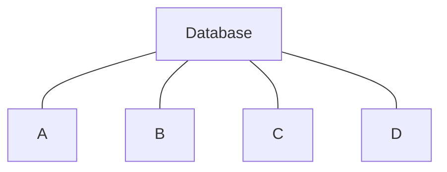

Assume each partition can handle:

```text
10,000 requests/sec
```

The total theoretical capacity appears to be:

```text
4 × 10,000
=
40,000 requests/sec
```

But if traffic looks like:

```text
A → 5,000
B → 5,000
C → 28,000
D → 2,000
```

the system cannot use the full theoretical capacity.

Partition C becomes the bottleneck.

Therefore:

> **Distributed capacity is useful only when the workload can actually be distributed.**

---

# 3. Data Distribution vs Workload Distribution

This is one of the most important concepts in sharding.

Suppose:

```text
Partition A → 25 GB
Partition B → 25 GB
Partition C → 25 GB
Partition D → 25 GB
```

Storage is perfectly balanced.

But traffic is:

```text
A → 10%
B → 10%
C → 70%
D → 10%
```

The data is balanced.

The workload is not.

This gives us two separate questions:

```text
Is the data balanced?
        +
Is the workload balanced?
```

Both matter.

---

# 4. What Is a Partition?

A partition is a smaller logical or physical portion of a larger dataset.

For example:

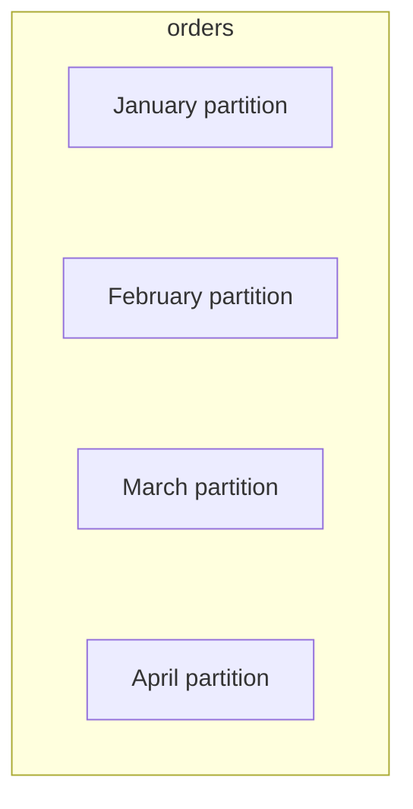

A database may route a query to one or more partitions based on the partition key.

A partition can become hot when many requests repeatedly target it.

---

# 5. What Is a Hot Shard?

The term **hot shard** is often used when the partitioned data is distributed across independent database nodes.

For example:

```text
Shard A
Shard B
Shard C ← HOT
Shard D
```

A hot shard may contain one or more hot partitions.

The terminology varies across systems.

A useful mental model is:

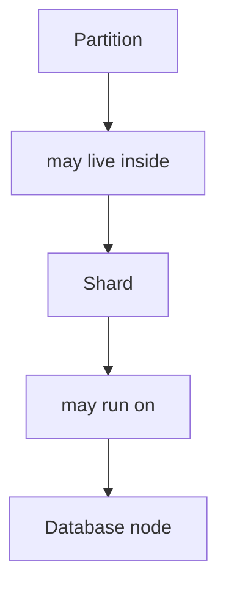

A hot partition can therefore contribute to a hot shard.

---

# 6. What Is a Hot Key?

A **hot key** is a single key receiving a disproportionately large number of requests.

Example:

```text
product:123
```

Suppose:

```text
product:123 → 50,000 requests/sec
```

while most other products receive:

```text
10 requests/sec
```

The key itself is hot.

If that key maps to one partition:

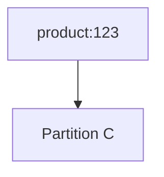

Partition C can become hot.

---

# 7. Hot Key vs Hot Partition vs Hot Shard

These terms describe different levels.

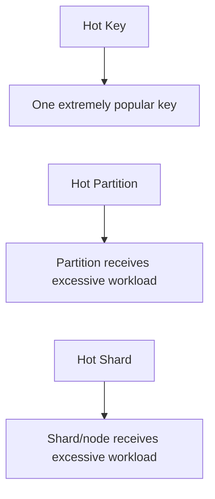

They can be related:

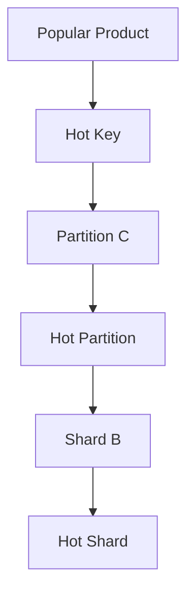

But they are not always the same problem.

---

# 8. Read Hotspots

A **read hotspot** occurs when a partition receives too many reads.

Example:

```text
Product Catalog

Product A → 100 reads/sec
Product B → 100 reads/sec
Product C → 100 reads/sec
Product D → 100,000 reads/sec
```

Product D may be extremely popular.

If it maps to one partition:

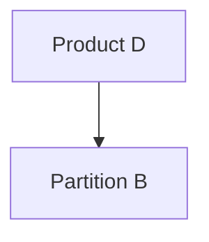

Partition B can become overloaded.

---

# 9. Write Hotspots

A **write hotspot** occurs when writes concentrate on one partition.

Example:

```text
New records:

Partition A → 5,000 writes/sec
Partition B → 5,000 writes/sec
Partition C → 45,000 writes/sec
Partition D → 5,000 writes/sec
```

Partition C is receiving most writes.

Write hotspots are especially important because writes may involve:

- indexes
- locking
- WAL/logging
- replication
- storage
- CPU
- transaction coordination.

---

# 10. Read Hotspots and Write Hotspots Behave Differently

A read hotspot might sometimes be relieved by:

```text
Caching
+
Read replicas
```

A write hotspot usually cannot be solved simply by adding read replicas.

For example:

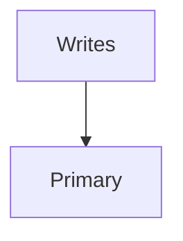

Adding more read replicas:

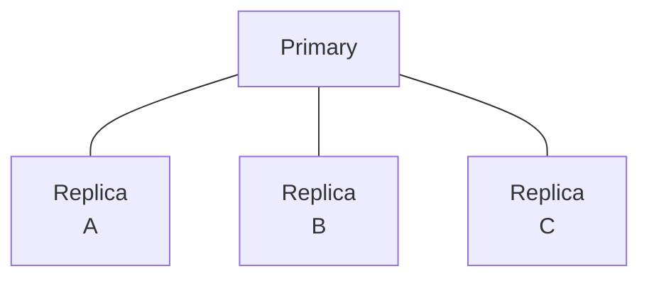

does not automatically increase primary write capacity.

The solution must address where the writes are going.

---

# 11. Cause #1 — Poor Partition Key

Suppose we partition users by:

```text
country
```

and the data looks like:

```text
India → 700 million
USA → 300 million
UK → 80 million
Other → 100 million
```

One partition can become much larger than the others.

If traffic follows the same distribution, it can also become hot.

The problem is not the partitioning mechanism itself.

The problem is the choice of partition key.

---

# 12. Cause #2 — Sequential Values

Consider:

```text
id
101
102
103
104
105
...
```

Suppose range partitioning is used:

```text
Partition A → 1–1,000,000
Partition B → 1,000,001–2,000,000
Partition C → 2,000,001–3,000,000
```

New writes continuously go toward the newest range.

If Partition C contains the current range:

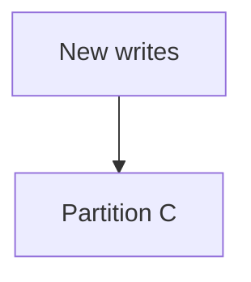

Partition C becomes hot.

---

# 13. Cause #3 — Time-Based Partitioning

Suppose events are partitioned by month:

```text
January
February
March
April
```

Current writes all go to:

```text
April
```

while older partitions mostly receive reads.

Therefore:

```text
Current partition → very high writes
Old partitions    → mostly reads
```

Time-based partitioning gives excellent time locality but can create a hot current partition.

---

# 14. Cause #4 — Popular Tenant

Consider a SaaS application:

```text
Tenant A → 1,000 users
Tenant B → 2,000 users
Tenant C → 3,000 users
Tenant D → 5,000,000 users
```

If tenant ID is the shard key:

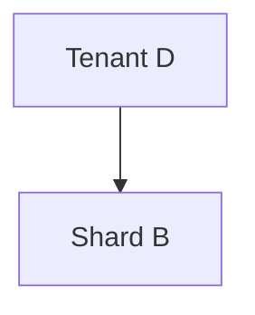

Shard B may become extremely busy.

The problem is not that tenant-based sharding is inherently wrong.

The problem is **uneven tenant size and traffic**.

---

# 15. Cause #5 — Popular Product

Imagine an e-commerce system.

Most products receive:

```text
10–100 requests/sec
```

But one product becomes extremely popular:

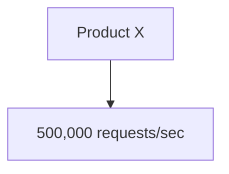

If the system routes Product X to one shard:

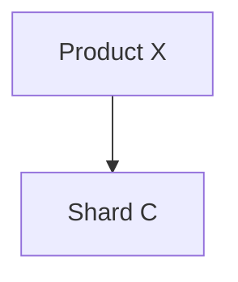

Shard C becomes hot.

This is a classic hot-key problem.

---

# 16. Cause #6 — Celebrity User

A social platform may have:

```text
Normal user → 10 requests/sec
Popular user → 1,000 requests/sec
Celebrity user → 500,000 requests/sec
```

If a large amount of activity is associated with that user:

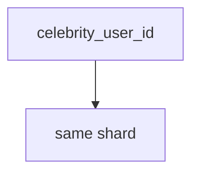

the shard may become overloaded.

The data itself may be small.

The traffic is the problem.

---

# 17. Cause #7 — Uneven Access Patterns

Suppose four partitions contain:

```text
A → old data
B → old data
C → old data
D → current data
```

If users almost always request current data:

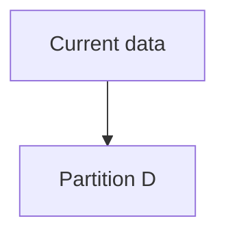

then D receives most requests.

This can happen even when every partition has exactly the same amount of storage.

---

# 18. Cause #8 — Application Behavior

Sometimes the database distribution is fine.

The application creates the hotspot.

Example:

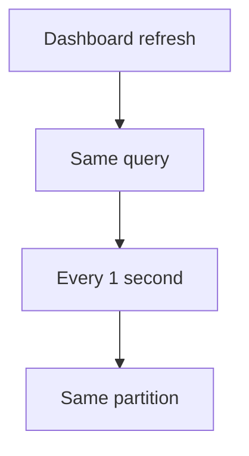

A poorly designed polling system can produce huge repeated traffic.

Therefore:

> **Hotspots are not always database problems. They can be application workload problems.**

---

# 19. Cause #9 — Background Jobs

Suppose a scheduled job starts:

```text
00:00
```

and processes millions of records from one partition.

During the job:

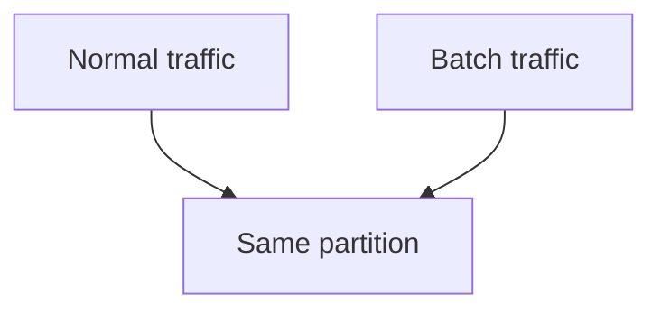

The partition becomes temporarily hot.

This is a workload scheduling problem as much as a partitioning problem.

---

# 20. Cause #10 — Uneven Data Distribution

A partition may simply contain much more data.

Example:

```text
A → 20 GB
B → 20 GB
C → 200 GB
D → 20 GB
```

Large data volume can increase:

- storage usage
- index size
- cache pressure
- query work
- maintenance work.

This is a **data imbalance** problem.

It can become a workload problem as well.

---

# 21. Consistent Hashing and Hot Partitions

The previous chapter showed how consistent hashing can distribute keys across nodes.

For example:

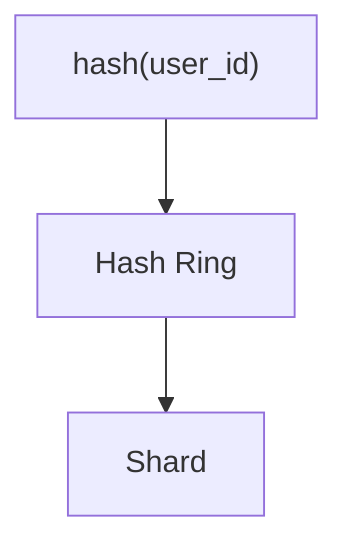

This can reduce broad distribution problems.

But suppose one key is extremely popular:

```text
user:123
```

The hash still produces one location:

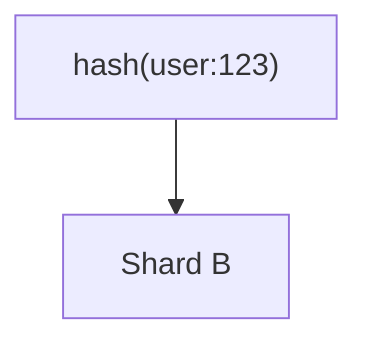

All requests for that key still target Shard B.

Therefore:

> **Consistent hashing distributes keys; it does not automatically distribute requests for the same hot key.**

---

# 22. Detecting Hot Partitions

You cannot solve a hotspot reliably if you cannot observe it.

Useful measurements include:

- requests per second per partition
- reads per second
- writes per second
- CPU per node
- memory usage
- disk I/O
- storage size
- query latency
- queue depth
- connection count
- replication lag
- cache hit ratio.

The important part is:

> **Measure per partition or shard, not only at the cluster level.**

---

# 23. Cluster Average Can Hide a Hotspot

Suppose:

```text
Cluster CPU:

Average → 50%
```

That sounds acceptable.

But individual nodes might be:

```text
Node A → 20%
Node B → 25%
Node C → 95%
Node D → 20%
```

The average hides the problem.

Similarly:

```text
Average query latency → 30 ms
```

might hide:

```text
Partition C → 300 ms
```

Per-partition metrics reveal the actual bottleneck.

---

# 24. Look at Traffic Distribution

A useful dashboard might show:

```text
Partition A → 8,000 req/s
Partition B → 7,500 req/s
Partition C → 48,000 req/s
Partition D → 8,500 req/s
```

The imbalance is immediately visible.

A simple ratio can also help:

```text
hot partition traffic
---------------------
average partition traffic
```

For example:

```text
48,000
-------
18,000
```

≈ 2.67×

The exact threshold for concern depends on the system.

There is no universal "hot partition = X%" rule.

---

# 25. Look at Percentiles Per Partition

Overall latency:

```text
p99 = 80 ms
```

may look acceptable.

But:

```text
Partition A p99 → 40 ms
Partition B p99 → 45 ms
Partition C p99 → 250 ms
Partition D p99 → 42 ms
```

Partition C clearly deserves investigation.

This connects hotspot detection to the observability concepts covered later in Systemly.

---

# 26. Strategy 1 — Improve the Partition Key

The cleanest solution can be changing the key.

Suppose:

```text
country
```

creates:

```text
India → huge partition
```

A different key may distribute records more evenly.

For example:

```text
user_id
```

or:

```text
country + user_id
```

may provide better distribution.

But changing a production partition key can require significant migration.

---

# 27. Strategy 2 — Use a Composite Key

Suppose:

```text
tenant_id
```

creates a hotspot.

Instead of:

```text
tenant_id
```

the system could consider:

```text
tenant_id + user_id
```

or another stable attribute.

Conceptually:

```text
tenant_id = 42
user_id   = 1001
```

becomes part of the routing decision.

This can spread a large tenant across multiple locations.

However, it also changes query routing.

---

# 28. The Large-Tenant Trade-Off

Without splitting:

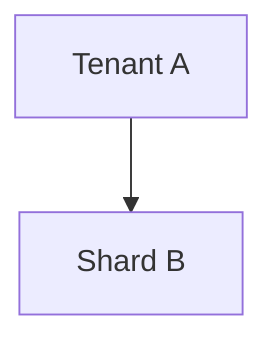

All tenant data stays together.

This gives excellent locality.

But:

```text
Tenant A → 5 TB
```

may overwhelm one shard.

After splitting:

```mermaid
flowchart TD
  accTitle: A split tenant
  accDescr: Tenant A is split into partitions 1, 2, 3 and 4.
  subgraph G["Tenant A"]
    direction TB
    I0["Partition 1"] ~~~ I1["Partition 2"] ~~~ I2["Partition 3"] ~~~ I3["Partition 4"]
  end
```

capacity improves.

But tenant-specific queries may now require multiple partitions.

This is a classic trade-off:

```text
Locality
   vs
Distribution
```

---

# 29. Strategy 3 — Split a Hot Partition

Suppose:

```mermaid
flowchart TD
  accTitle: A hot partition
  accDescr: Partition C, then too much traffic.
  N0["Partition C"] --> N1["too much traffic"]
```

It can potentially be split:

```mermaid
flowchart TD
  accTitle: Partition splitting
  accDescr: Partition C is split into C1, C2 and C3.
  subgraph G["Partition C"]
    direction TB
    I0["C1"] ~~~ I1["C2"] ~~~ I2["C3"]
  end
```

The routing logic must then decide:

```text
Which sub-partition owns the record?
```

This is a form of **partition splitting**.

The exact implementation depends on the database or distributed system.

---

# 30. Strategy 4 — Key Salting

Key salting is one technique for distributing a hot key's workload.

Suppose:

```text
product:123
```

receives enormous traffic.

Instead of using one key:

```text
product:123
```

the application can conceptually distribute requests across multiple derived keys:

```text
product:123:0
product:123:1
product:123:2
product:123:3
```

These can map to different partitions.

---

# 31. How Key Salting Changes the Problem

Without salting:

```mermaid
flowchart TD
  accTitle: Without salting
  accDescr: product:123, then Shard B, then 500k req/s.
  N0["product:123"] --> N1["Shard B"] --> N2["500k req/s"]
```

With salting:

```text
product:123:0 → Shard A
product:123:1 → Shard B
product:123:2 → Shard C
product:123:3 → Shard D
```

Traffic can be distributed.

But there is an important cost.

The application now needs to know that the logical object:

```text
product:123
```

is represented by multiple physical keys.

---

# 32. Key Salting and Reads

Suppose the data is:

```text
product:123
```

and we store:

```text
product:123:0
product:123:1
product:123:2
product:123:3
```

A read may need to:

```mermaid
flowchart TD
  accTitle: Reading salted keys
  accDescr: query multiple salted keys, then combine results.
  N0["query multiple salted keys"] --> N1["combine results"]
```

For a simple cache lookup, this may be manageable.

For complex mutable data, it can become much harder.

Therefore:

> **Key salting trades hotspot reduction for additional routing and read/write complexity.**

---

# 33. Key Salting Is Not Always Appropriate

Key salting works best when the workload can naturally be distributed.

It becomes difficult when:

- strong ordering is required
- atomic updates must affect the whole object
- transactions span all salted keys
- every read needs all salted fragments
- the data is frequently updated.

The technique must match the access pattern.

---

# 34. Strategy 5 — Cache Hot Data

For read hotspots, caching can be extremely useful.

Architecture:

```mermaid
flowchart TD
  accTitle: Cache hot data
  accDescr: Request goes to the cache. HIT returns a response. MISS goes to the database.
  R["Request"] --> C["Cache"]
  C --> H["HIT → Response"]
  C --> M["MISS"] --> D["Database"]
```

If a product receives:

```text
100,000 reads/sec
```

but is cached effectively, the database may receive only a small fraction of those requests.

This moves the bottleneck away from the database.

---

# 35. Cache Does Not Solve Hot Writes

Suppose:

```mermaid
flowchart TD
  accTitle: A hot write
  accDescr: Product X, then 100,000 writes/sec.
  N0["Product X"] --> N1["100,000 writes/sec"]
```

Caching reads does not automatically solve the write concentration.

The system may instead need:

- better partitioning
- write distribution
- batching
- asynchronous processing
- queueing
- workload redesign.

Always identify whether the hotspot is:

```text
READ
```

or:

```text
WRITE
```

before selecting a solution.

---

# 36. Strategy 6 — Read Replicas

Read hotspots may sometimes be distributed using replicas.

Reads can potentially be distributed.

However, replicas have trade-offs:

- replication lag
- additional storage
- additional network traffic
- consistency implications
- connection management.

Read replicas also do not solve a write hotspot.

---

# 37. Strategy 7 — Request Coalescing

Suppose 10,000 requests simultaneously ask for:

```text
product:123
```

Instead of allowing every request to hit the database:

```mermaid
flowchart TD
  accTitle: Without coalescing
  accDescr: 10,000 requests, then 10,000 DB queries.
  N0["10,000 requests"] --> N1["10,000 DB queries"]
```

the application can coordinate them:

```mermaid
flowchart TD
  accTitle: Request coalescing
  accDescr: 10,000 requests, then 1 origin request, then Shared result, then 10,000 responses.
  N0["10,000 requests"] --> N1["1 origin request"] --> N2["Shared result"] --> N3["10,000 responses"]
```

This is sometimes called:

- request coalescing
- single-flight
- duplicate request suppression.

This connects directly to the cache-stampede concepts from Level 3.

---

# 38. Strategy 8 — Asynchronous Processing

For write-heavy hotspots, some workloads can be moved to asynchronous processing.

Instead of:

```mermaid
flowchart TD
  accTitle: A synchronous heavy write
  accDescr: Request, then Heavy write, then Database.
  N0["Request"] --> N1["Heavy write"] --> N2["Database"]
```

the system may use:

```mermaid
flowchart TD
  accTitle: Asynchronous processing
  accDescr: Request, then Queue, then Workers, then Database.
  N0["Request"] --> N1["Queue"] --> N2["Workers"] --> N3["Database"]
```

This does not magically increase database capacity.

But it can:

- smooth bursts
- control concurrency
- batch writes
- apply backpressure
- separate user latency from background processing.

The correct design depends on whether immediate consistency is required.

---

# 39. Strategy 9 — Rate Limiting

Sometimes the problem is simply too much traffic.

For example:

```mermaid
flowchart TD
  accTitle: A hot product
  accDescr: Hot product, then 500,000 requests/sec.
  N0["Hot product"] --> N1["500,000 requests/sec"]
```

If the business can tolerate limits, rate limiting can protect the system.

```mermaid
flowchart TD
  accTitle: Rate limiting
  accDescr: Request, then Rate Limiter, then Allowed traffic, then Database.
  N0["Request"] --> N1["Rate Limiter"] --> N2["Allowed traffic"] --> N3["Database"]
```

This does not increase capacity.

It prevents demand from exceeding available capacity.

---

# 40. Strategy 10 — Replicate Hot Data

A particularly popular read object may be intentionally replicated.

For example:

```mermaid
flowchart TD
  accTitle: Replicating hot data
  accDescr: Product X is copied to A, B, C and D.
  subgraph G["Product X"]
    direction TB
    I0["Copy A"] ~~~ I1["Copy B"] ~~~ I2["Copy C"] ~~~ I3["Copy D"]
  end
```

Reads can then be distributed.

But replication introduces:

- synchronization
- consistency
- invalidation
- storage cost
- update complexity.

Again, the solution introduces another trade-off.

---

# 41. Strategy 11 — Rebalance the Data

If a partition is hot because it contains too much data or traffic, data can be redistributed.

For example:

```text
Before:

A → 20%
B → 20%
C → 50%
D → 10%
```

After rebalancing:

```text
A → 25%
B → 25%
C → 25%
D → 25%
```

But rebalancing itself consumes:

- network bandwidth
- storage I/O
- CPU
- operational attention.

A system should avoid repeatedly rebalancing because of temporary traffic fluctuations unless the architecture supports it safely.

---

# 42. Static Imbalance vs Temporary Hotspot

This distinction matters.

### Static imbalance

```text
Partition C
always receives 60% traffic
```

This suggests a structural problem.

### Temporary hotspot

```text
Partition C
receives 60% traffic
for 10 minutes
```

This may be caused by:

- a promotion
- a flash sale
- a scheduled job
- a breaking news event
- a traffic spike.

A permanent data migration may be the wrong response to a temporary event.

---

# 43. Hotspot Duration Matters

Ask:

```text
How long has the partition been hot?
```

For example:

```text
5 seconds
5 minutes
5 hours
5 days
```

Different durations suggest different solutions.

Short burst:

```text
Caching
Request coalescing
Rate limiting
Queueing
```

Long-term imbalance:

```text
Partition redesign
Shard-key change
Data migration
Partition splitting
```

---

# 44. Hotspot Detection Workflow

A practical investigation can follow:

```mermaid
flowchart TD
  accTitle: Hotspot detection workflow
  accDescr: Observe, then Identify hot partition, then Check read/write ratio, then Identify hottest keys, then Check data size, then Check query patterns, then Check application traffic, then Identify root cause, then Choose mitigation, then Measure again.
  N0["Observe"] --> N1["Identify hot partition"] --> N2["Check read/write ratio"] --> N3["Identify hottest keys"] --> N4["Check data size"] --> N5["Check query patterns"] --> N6["Check application traffic"] --> N7["Identify root cause"] --> N8["Choose mitigation"] --> N9["Measure again"]
```

Do not immediately redesign the database.

First determine why the partition is hot.

---

## Step 1 — Find the Hot Partition

Start with:

```text
requests/sec by partition
```

Example:

```text
A → 8k
B → 9k
C → 70k
D → 8k
```

C is the first investigation target.

---

## Step 2 — Separate Reads and Writes

Measure:

```mermaid
flowchart TD
  accTitle: A read hotspot
  accDescr: Partition C: reads 65k/s, writes 5k/s.
  subgraph G["Partition C"]
    direction TB
    I0["Reads → 65k/s"] ~~~ I1["Writes → 5k/s"]
  end
```

This is primarily a read hotspot.

Compare:

```mermaid
flowchart TD
  accTitle: A write hotspot
  accDescr: Partition C: reads 5k/s, writes 65k/s.
  subgraph G["Partition C"]
    direction TB
    I0["Reads → 5k/s"] ~~~ I1["Writes → 65k/s"]
  end
```

This is primarily a write hotspot.

The mitigation can be very different.

---

## Step 3 — Find the Hottest Keys

Suppose:

```mermaid
flowchart TD
  accTitle: Top keys
  accDescr: Partition C top keys: product:123 40k/s, product:456 10k/s, other 20k/s.
  P["Partition C"] --> G
  subgraph G["Top keys:"]
    direction TB
    I0["product:123 → 40k/s"] ~~~ I1["product:456 → 10k/s"] ~~~ I2["other → 20k/s"]
  end
```

Now the root cause becomes clearer.

A single popular product may be driving most traffic.

---

## Step 4 — Check Query Patterns

Ask:

```text
Which queries are hitting this partition?
```

Maybe the workload is:

```sql
SELECT *
FROM products
WHERE product_id = 123;
```

or:

```sql
SELECT *
FROM orders
WHERE tenant_id = 42
ORDER BY created_at DESC;
```

The query pattern can reveal why the partition is receiving traffic.

---

## Step 5 — Check Application Behavior

Look for:

- polling
- retries
- retry storms
- duplicate requests
- batch jobs
- traffic spikes
- inefficient API calls
- missing caching
- client bugs.

For example:

```mermaid
flowchart BT
  accTitle: Client polling
  accDescr: The client polls every second; the application sends 10,000 repeated requests to the database.
  C["Client polling every second"] --> A["Application"] -->|"10,000 repeated requests"| D["Database"]
```

The partition may be healthy.

The application may simply be generating excessive demand.

---

## Step 6 — Identify the Correct Root Cause

Possible root causes:

```text
Poor shard key
        OR
Hot key
        OR
Large tenant
        OR
Time concentration
        OR
Application behavior
        OR
Batch workload
        OR
Traffic spike
```

Do not use the same solution for every cause.

---

# 45. Hands-On Exercise — Detect a Hot Partition

Assume four partitions:

| Partition | Storage | Reads/s | Writes/s |
|---|---:|---:|---:|
| A | 100 GB | 8,000 | 2,000 |
| B | 98 GB | 9,000 | 2,000 |
| C | 101 GB | 70,000 | 3,000 |
| D | 100 GB | 8,000 | 2,000 |

Answer:

1. Which partition is hot?
2. Is the hotspot primarily read or write?
3. Is storage distribution balanced?
4. What does this tell you about data balance vs workload balance?
5. What should you investigate next?

The important observation is:

```text
Storage is balanced.
Traffic is not.
```

Therefore, the hotspot is primarily a workload-distribution problem.

---

# 46. Lab Challenge — Find the Root Cause

Suppose Partition C receives:

```text
70,000 reads/sec
3,000 writes/sec
```

Top keys:

```text
product:123 → 50,000 reads/sec
product:456 → 5,000 reads/sec
Other       → 15,000 reads/sec
```

Questions:

1. Is this a general partition-key problem?
2. Is there a hot key?
3. Would adding read replicas potentially help?
4. Could caching help?
5. Could request coalescing help?
6. Would key salting be possible?
7. What new complexity would salting introduce?

The goal is to identify the bottleneck before choosing the architecture.

---

# 47. Lab Challenge — Write Hotspot

Now suppose:

```text
Partition C
Reads  → 5,000/s
Writes → 60,000/s
```

and:

```text
95% of writes
```

are associated with:

```text
tenant_id = 42
```

Questions:

1. What is the likely root cause?
2. Why might tenant-based sharding create this problem?
3. Could tenant 42 be split across multiple partitions?
4. What would happen to tenant-local queries?
5. Would caching solve the write problem?
6. Would read replicas solve the write problem?
7. What migration challenges would exist?

---

# 48. Hot Partition Decision Framework

Use this simplified flow:

```mermaid
flowchart TD
  accTitle: Hot partition decision framework
  accDescr: Is one partition much hotter? Yes: read or write? Read: hot key? Then cache, coalesce, replicate. Write: hot key/tenant? Can writes be distributed? Redesign key or split data.
  Q{"Is one partition<br/>much hotter?"} -->|"YES"| RW{"Read or<br/>Write?"}
  RW -->|"Read"| HR{"Hot key?"} --> C["Cache?<br/>Coalesce?<br/>Replicate?"]
  RW -->|"Write"| HW{"Hot key/<br/>tenant?"} --> W{"Can writes<br/>be distributed?"} --> R["Redesign key<br/>or split data"]
```

Then consider:

```text
Temporary or permanent?
```

and:

```text
Can the workload be redistributed
without breaking locality?
```

---

# 49. Hot Partitions and Rebalancing

Rebalancing is useful when the underlying distribution is wrong.

For example:

```text
A → 10%
B → 10%
C → 70%
D → 10%
```

If C is structurally overloaded, data can be redistributed.

But suppose the hotspot comes from:

```text
product:123
```

and the same key remains on one partition.

Moving the partition elsewhere does not solve the fundamental problem.

The key itself remains hot.

Therefore:

> **Rebalancing moves workload; it does not necessarily change workload concentration.**

---

# 50. Hot Partitions and Caching

Consider:

```mermaid
flowchart TD
  accTitle: Caching a hot product
  accDescr: Hot product, then Cache, then Database.
  N0["Hot product"] --> N1["Cache"] --> N2["Database"]
```

If the cache hit ratio is high:

```mermaid
flowchart TD
  accTitle: A high hit ratio
  accDescr: 100,000 requests, then 99,000 cache hits, then 1,000 database requests.
  N0["100,000 requests"] --> N1["99,000 cache hits"] --> N2["1,000 database requests"]
```

The database hotspot can be dramatically reduced.

But if the cache expires:

```mermaid
flowchart TD
  accTitle: Cache expiry
  accDescr: Cache expires, then Many misses, then Database hotspot.
  N0["Cache expires"] --> N1["Many misses"] --> N2["Database hotspot"]
```

you can create a cache stampede.

Therefore, hotspot mitigation and cache-stampede protection are connected.

---

# 51. Hot Partitions and Backpressure

Suppose:

```text
Incoming writes → 100k/s
Database capacity → 50k/s
```

A queue grows:

```mermaid
flowchart TD
  accTitle: A growing queue
  accDescr: 100k, then Queue, then 50k processed.
  N0["100k"] --> N1["Queue"] --> N2["50k processed"]
```

The remaining:

```text
50k/s
```

accumulates.

Eventually the queue itself becomes a capacity problem.

This is why hotspot handling must consider:

- queue depth
- processing rate
- arrival rate
- maximum acceptable delay.

---

# 52. Hot Partition vs Hot Key

A useful diagnostic table:

| Problem | Example | Possible Direction |
|---|---|---|
| Hot partition | Partition C receives most traffic | Rebalance/redesign partitioning |
| Hot shard | Shard B overloaded | Rebalance/routing |
| Hot key | `product:123` dominates traffic | Cache/replicate/salt |
| Hot tenant | One customer dominates traffic | Split tenant/shard differently |
| Hot time range | Current partition receives all writes | Change time granularity/distribution |
| Application hotspot | Polling creates repeated queries | Fix application behavior |

These are related problems, but they require different investigations.

---

# 53. Hot Partitions and System Evolution

A system may evolve like this:

```mermaid
flowchart TD
  accTitle: Hot partitions and system evolution
  accDescr: Small system, then One database, then Partitioning, then Hot partition discovered, then Partition redesign, then Sharding, then Hot shard discovered, then Better shard key, then Hot key discovered, then Caching / replication / salting.
  N0["Small system"] --> N1["One database"] --> N2["Partitioning"] --> N3["Hot partition discovered"] --> N4["Partition redesign"] --> N5["Sharding"] --> N6["Hot shard discovered"] --> N7["Better shard key"] --> N8["Hot key discovered"] --> N9["Caching / replication / salting"]
```

The architecture evolves as workload patterns become visible.

This is why:

> **System design is not just choosing components; it is continuously responding to observed bottlenecks.**

---

# 54. Common Mistake — Ignoring Business Events

Hotspots often have business causes:

- product launches
- flash sales
- breaking news
- sporting events
- marketing campaigns
- major releases
- billing periods
- monthly reporting.

A system designer should ask:

> **What real-world event could suddenly concentrate traffic?**

Architecture should account for predictable business-driven hotspots.

---

# 55. A Useful Mental Model

When you see a hotspot, ask four questions:

```text
WHO?
Which keys/users/tenants are hot?

WHAT?
Are reads or writes hot?

WHERE?
Which partition/shard receives the work?

WHY?
Why is the workload concentrated there?
```

Then choose the mitigation.

---

# 56. Hot Partition Decision Flow

```mermaid
flowchart TD
  accTitle: Hot partition decision flow
  accDescr: Hot partition: is the workload temporary? Yes: protect capacity during the burst. No: inspect key; one key/tenant hot? Yes: split, cache, replicate or salt. No: review partition key. Then re-measure.
  H["Hot Partition"] --> T{"Is workload<br/>temporary?"}
  T -->|"YES"| P["Protect<br/>capacity<br/>during the<br/>burst"]
  T -->|"NO"| I["Inspect key"] --> O{"One key/tenant<br/>hot?"}
  O -->|"YES"| S["Split/cache/<br/>replicate/<br/>salt"]
  O -->|"NO"| K["Review<br/>partition<br/>key"]
  P & S & K --> M["Re-measure"]
```

---

# 57. Key Principle

> **A hot partition occurs when too much workload becomes concentrated on one partition, shard, or node. The root cause may be a poor partition key, hot key, large tenant, time concentration, uneven access pattern, or application behavior. The correct response is to identify where the workload is concentrated and why before choosing between caching, replication, key redesign, partition splitting, salting, rebalancing, or workload control.**

---

# 58. Quick Reference

```mermaid
flowchart TD
  accTitle: Hot partitions quick reference
  accDescr: Hot key: one key receives excessive traffic. Hot partition: one partition receives excessive workload. Hot shard: one shard/node receives excessive workload. Common causes: Poor partition key, Sequential IDs, Time-based writes, Popular tenant, Popular product, Celebrity user, Uneven traffic, Batch jobs, Polling, Retries. Possible mitigations: Better partition key, Composite key, Partition splitting, Key salting, Caching, Request coalescing, Read replicas, Replication, Queues, Rate limiting, Rebalancing.
  A0["Hot Key"] --> A1["One key receives excessive traffic"]
  B0["Hot Partition"] --> B1["One partition receives excessive workload"]
  C0["Hot Shard"] --> C1["One shard/node receives excessive workload"]
  A1 ~~~ B0
  B1 ~~~ C0
  C1 ~~~ G
  subgraph G[" "]
    direction TB
    subgraph GC["Common Causes"]
      direction TB
      I0["Poor partition key"] ~~~ I1["Sequential IDs"] ~~~ I2["Time-based writes"] ~~~ I3["Popular tenant"] ~~~ I4["Popular product"] ~~~ I5["Celebrity user"] ~~~ I6["Uneven traffic"] ~~~ I7["Batch jobs"] ~~~ I8["Polling"] ~~~ I9["Retries"]
    end
    subgraph GM["Possible Mitigations"]
      direction TB
      J0["Better partition key"] ~~~ J1["Composite key"] ~~~ J2["Partition splitting"] ~~~ J3["Key salting"] ~~~ J4["Caching"] ~~~ J5["Request coalescing"] ~~~ J6["Read replicas"] ~~~ J7["Replication"] ~~~ J8["Queues"] ~~~ J9["Rate limiting"] ~~~ J10["Rebalancing"]
    end
    I9 ~~~ J0
  end
```

Remember:

```text
Balanced storage
       ≠
Balanced workload
```

---

# 59. Knowledge Check

### 1. What is a hot partition?

A partition receiving a disproportionately large amount of workload.

### 2. Can data be evenly distributed while workload is uneven?

Yes.

### 3. What is a hot key?

A single key receiving disproportionately high traffic.

### 4. What is a hot tenant?

A tenant whose data or traffic is much larger than other tenants.

### 5. Does consistent hashing eliminate hot keys?

No.

### 6. Can caching help a read hotspot?

Yes, when the data is cacheable and the cache is effective.

### 7. Can read replicas automatically solve a write hotspot?

No.

### 8. What is key salting?

Distributing one logical hot key across multiple derived physical keys to spread workload.

### 9. What is the trade-off of key salting?

It can reduce hotspot pressure but increases routing and data-management complexity.

### 10. Why can time-based partitioning create hotspots?

New writes often concentrate on the current time partition.

### 11. Why can tenant-based sharding create hotspots?

A small number of tenants may be much larger or busier than others.

### 12. Why are per-partition metrics important?

Cluster-wide averages can hide a single overloaded partition.

### 13. Does adding more shards always solve a hot partition?

No. If the workload remains concentrated on the same key or partition, additional shards may not help.

### 14. What should you determine before choosing a hotspot solution?

The root cause, operation type, affected keys, workload pattern, and whether the hotspot is temporary or structural.

---

# 60. Remember

```text
A system can have:

10 shards
10 partitions
10 database nodes

and still have:

1 hot node
+
9 mostly idle nodes
```

The goal of distributed architecture is not merely to **create more nodes**.

The goal is to:

```text
Distribute data
      +
Distribute workload
      +
Preserve useful locality
      +
Handle growth
      +
Handle failure
```

---

# 61. Next Chapter

## 04.18 — Data Consistency

We will now move from **where data lives** to **what users are allowed to observe when multiple copies or distributed operations exist**.

Topics will include:

- What data consistency means
- Why consistency becomes difficult in distributed systems
- Strong consistency
- Weak consistency
- Eventual consistency
- Read-after-write consistency
- Monotonic reads
- Consistent reads
- Stale reads
- Multiple copies of data
- Replication and consistency
- Primary/replica consistency
- Cache consistency
- Distributed writes
- Conflict scenarios
- Consistency vs availability
- Application-level consistency requirements
- Choosing the required consistency model
- Practical examples
- Hands-on consistency exercise
- System-design trade-offs.
