# 04.18 — Data Consistency

## Learning Objectives

By the end of this chapter, you should understand:

- What data consistency means
- Why multiple copies of data create consistency problems
- Strong vs eventual consistency
- Read-after-write consistency
- Stale reads
- How replication affects consistency
- How caches affect consistency
- Consistency requirements in real applications
- How to choose an appropriate consistency model
- The trade-off between consistency, latency, availability, and complexity

---

# 1. What Is Data Consistency?

**Data consistency** describes whether different parts of a system observe data in a way that satisfies the application's correctness requirements.

Consider a user's account balance:

```text
Balance = ₹10,000
```

The system may store or expose this value through:

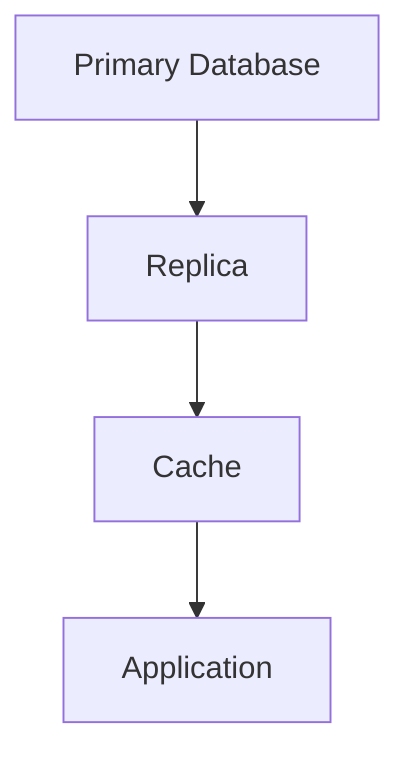

If the database says:

```text
₹10,000
```

but a replica temporarily says:

```text
₹8,000
```

the system has different views of the same logical data.

The important question is not simply:

> "Are all copies identical right now?"

The better question is:

> **"What does the application require users to observe?"**

---

# 2. Why Does Consistency Become Difficult?

Consistency becomes harder when data exists in multiple places.

For example:

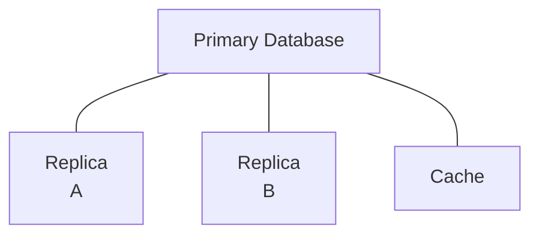

A write may happen on the primary first.

The other copies may update later.

There can therefore be a period where:

```text
Primary = New Value
Replica = Old Value
Cache   = Old Value
```

This creates a **consistency window**.

---

# 3. Strong Consistency

With **strong consistency**, a successful write is followed by reads that observe the required latest state according to the system's consistency guarantees.

Simplified example:

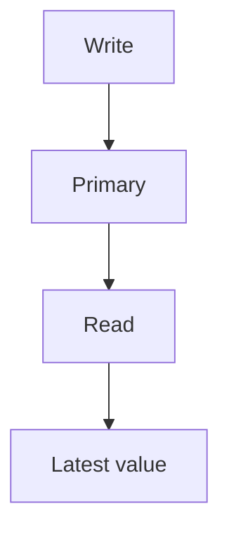

Example:

A banking system processes:

```text
Balance: ₹10,000
Withdrawal: ₹2,000
```

After the withdrawal succeeds:

```text
Balance = ₹8,000
```

A subsequent balance check should not incorrectly return:

```text
₹10,000
```

when the application's correctness requirements require the latest committed balance.

Strong consistency can require more coordination, waiting, or failure handling.

---

# 4. Eventual Consistency

With **eventual consistency**, different copies may temporarily contain different values, but if updates stop and the system continues operating normally, the copies are expected to converge.

Example:

```text
Time 1

Primary  = ₹8,000
Replica  = ₹10,000
```

Later:

```text
Time 2

Primary  = ₹8,000
Replica  = ₹8,000
```

The replica was temporarily stale.

This is often acceptable for data where a short delay does not break correctness.

Examples:

- Social-media counters
- Product recommendations
- Analytics dashboards
- View counts
- Search indexes
- Some notification data

---

# 5. Strong vs Eventual Consistency

| Property | Stronger Consistency | Eventual Consistency |
|---|---|---|
| Latest data visibility | Stronger guarantee | May be delayed |
| Coordination | Usually higher | Often lower |
| Latency | Can increase | Can often be lower |
| Availability during failures | May be reduced depending on design | Can often remain higher |
| Complexity | Coordination can be complex | Application must tolerate stale data |
| Typical examples | Financial state, critical inventory | Feeds, analytics, recommendations |

There is no universal requirement that every piece of data use the same consistency model.

---

# 6. Stale Reads

A **stale read** occurs when a read returns an older version of data than the application expects.

Example:

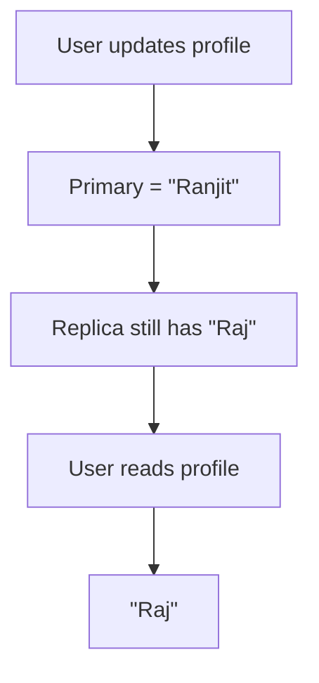

The replica is behind the primary.

This is commonly caused by **replication lag**.

---

# 7. Read-After-Write Consistency

A common application requirement is:

> After I successfully write something, I should be able to read that new value.

Example:

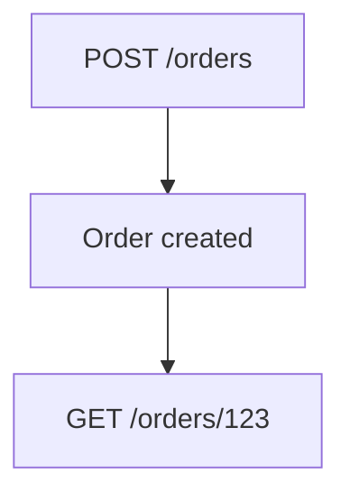

The user expects the newly created order to appear.

But if:

```text
POST → Primary
GET  → Lagging Replica
```

the second request may not find the order yet.

This is a **read-after-write consistency problem**.

---

# 8. Handling Read-After-Write

Several strategies are possible.

### Strategy 1 — Read From Primary

```text
Write → Primary
Read  → Primary
```

Simple and strong for this requirement, but increases primary read load.

### Strategy 2 — Sticky Reads

After a write:

```text
User
  |
  +── Write → Primary
  |
  +── Read  → Primary
```

Later, reads may return to replicas when appropriate.

### Strategy 3 — Track Replication Position

The application can sometimes ensure that a replica has caught up sufficiently before reading from it.

This requires database/system-specific mechanisms.

### Strategy 4 — Accept Eventual Consistency

For some applications, the short delay is acceptable.

The correct choice depends on the business requirement.

---

# 9. Consistency Is About Requirements

Different data can require different guarantees.

| Data | Possible Requirement |
|---|---|
| Bank balance | Strong |
| Order creation | Read-after-write |
| Product catalog | Slightly stale may be acceptable |
| Social feed | Eventual may be acceptable |
| Analytics | Eventual often acceptable |
| Inventory during checkout | Stronger coordination |
| Recommendation score | Eventual often acceptable |

The key is to ask:

> **What can go wrong if the user sees an older value?**

If the answer is:

> "Nothing important."

Eventual consistency may be sufficient.

If the answer is:

> "The user could lose money or perform an invalid operation."

Stronger guarantees may be necessary.

---

# 10. Replication and Consistency

Replication creates multiple copies.

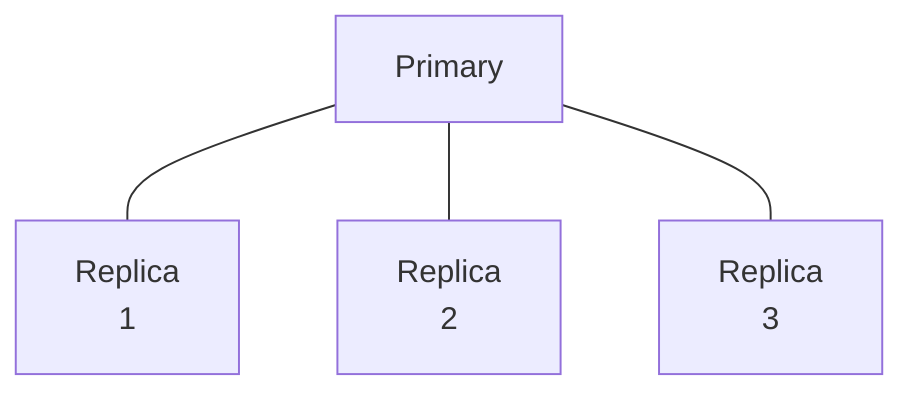

If replication is asynchronous:

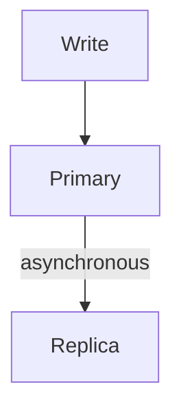

the primary can acknowledge the write before the replica receives it.

This improves write latency and availability characteristics, but creates a window for stale reads.

With stronger synchronization:

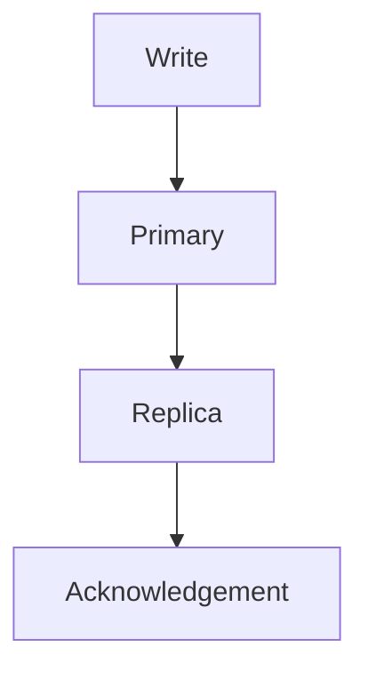

the write may require more coordination.

This can increase latency and make failures more visible to the write path.

---

# 11. Cache Consistency

Caches introduce another copy of data.

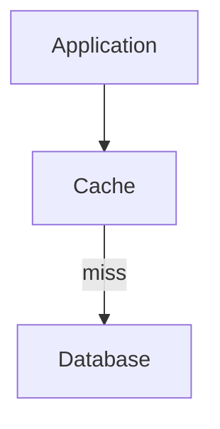

Suppose:

```text
Database = ₹500
Cache    = ₹400
```

The cache is stale.

This is why cache invalidation matters.

Common approaches include:

### Delete on Update

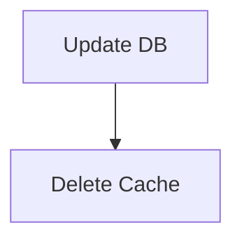

### Update Cache

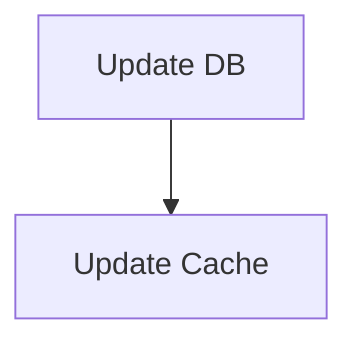

### Short TTL

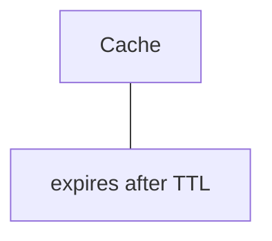

Each approach has different correctness and operational trade-offs.

---

# 12. Multiple Consistency Layers

A real system can have several copies:

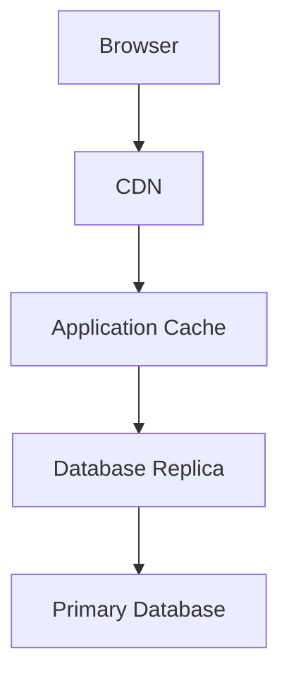

The user may therefore encounter stale data at several layers.

For example:

```text
Primary = Version 5
Replica = Version 4
Redis   = Version 3
Browser = Version 2
```

The problem is no longer simply:

> "Is the database consistent?"

The system must consider the **entire data path**.

---

# 13. Consistency and Transactions

Transactions provide consistency guarantees within a database transaction, but they do not automatically make every external copy consistent.

For example:

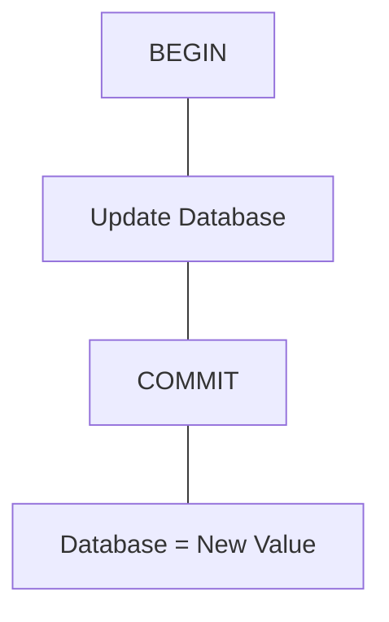

After commit:

```text
Replica → may still be old
Cache   → may still be old
Search  → may still be old
```

Therefore:

> **Database transaction consistency and system-wide consistency are related but different problems.**

---

# 14. Consistency Across Services

In a distributed architecture:

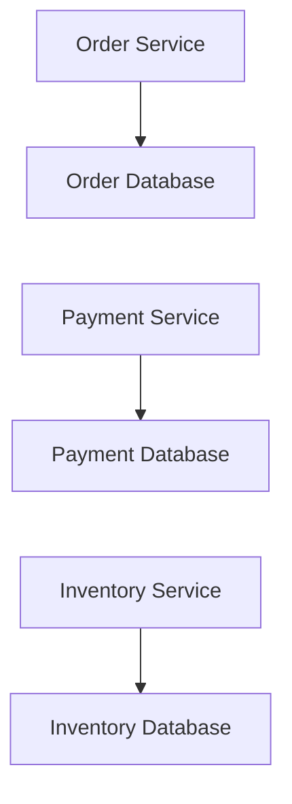

A single business operation may affect several systems.

For example:

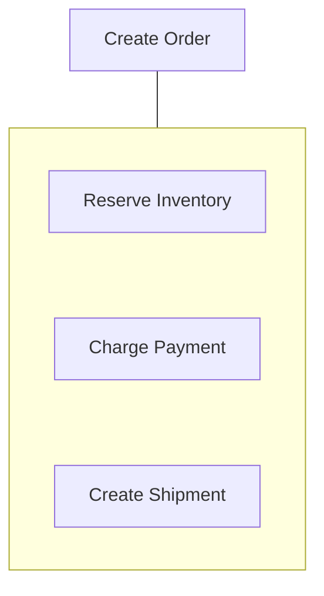

There may not be one database transaction covering everything.

This is why distributed systems often use patterns such as:

- Idempotency
- Events
- Outbox Pattern
- Saga Pattern
- Retry handling
- Compensation

These topics appear later in the curriculum.

---

# 15. Consistency vs Availability

In distributed systems, stronger consistency can require more coordination.

Suppose a replica cannot communicate with the authoritative system.

The application must decide:

```text
Return possibly stale data?
        OR
Reject / delay the request?
```

For some operations:

```text
Correctness > availability
```

For others:

```text
Availability > immediate freshness
```

This is a system requirement, not a universal rule.

The later **CAP Theorem** chapter will examine these distributed-system trade-offs more formally.

---

# 16. Consistency vs Latency

Stronger coordination can increase latency.

Simplified:

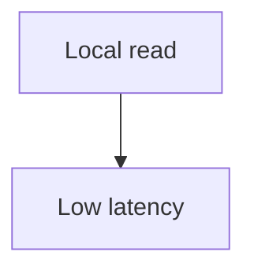

versus:

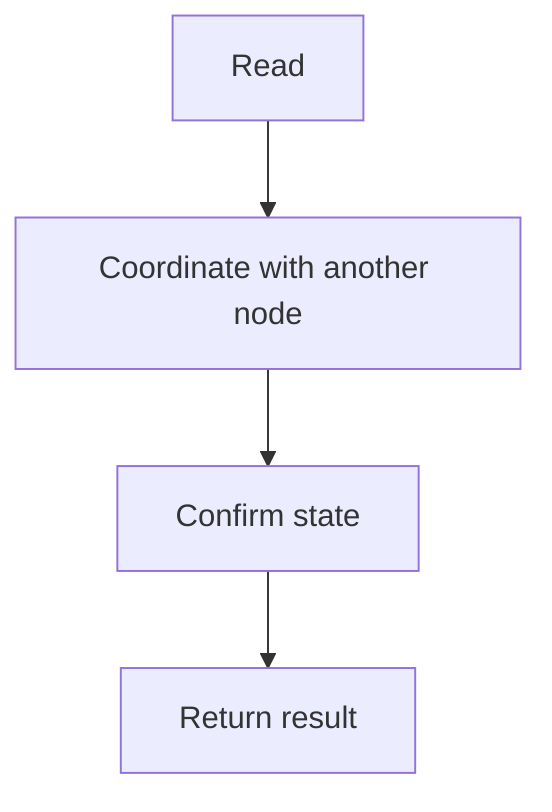

The second path may provide stronger guarantees but can take longer.

This matters especially across regions:

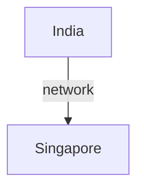

Network distance itself can become part of the consistency/latency trade-off.

---

# 17. Consistency Is Not Binary

It is tempting to think:

```text
Consistent
     vs
Inconsistent
```

Real systems have more nuanced guarantees.

Examples include:

- Strong consistency
- Eventual consistency
- Read-after-write consistency
- Monotonic reads
- Session consistency
- Causal consistency

You do not always need the strongest possible model.

You need the model that satisfies the application's correctness requirements.

---

# 18. Practical Consistency Questions

When designing a system, ask:

### Question 1 — What data is involved?

```text
Balance?
Order?
Product?
Analytics?
Feed?
```

### Question 2 — How stale can it be?

```text
0 seconds?
1 second?
1 minute?
1 hour?
```

### Question 3 — What happens if the value is stale?

```text
Minor UI difference?
Incorrect business decision?
Financial loss?
Security problem?
```

### Question 4 — Where are copies created?

```text
Replica
Cache
CDN
Search index
Browser
Other service
```

### Question 5 — How does each copy become current?

```text
Replication
Invalidation
Event
Refresh
TTL
Rebuild
```

### Question 6 — What happens when synchronization fails?

```text
Retry?
Serve stale?
Read primary?
Reject request?
Queue work?
```

---

# 19. Example — E-Commerce Product

Suppose:

```text
Product price = ₹1,000
```

The product page is cached.

An administrator changes it:

```text
₹1,000 → ₹900
```

Possible states:

```text
Primary DB       = ₹900
Read Replica     = ₹900
Redis Cache      = ₹1,000
CDN              = ₹1,000
Browser Cache    = ₹1,000
```

Different users may temporarily see different prices.

For a normal informational page, a short delay might be acceptable.

But during checkout, the system should not blindly trust a stale cached price.

A safer flow could be:

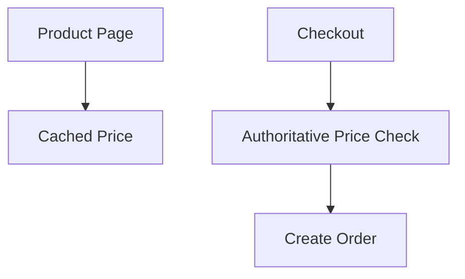

This illustrates an important principle:

> **Different stages of the same application can have different consistency requirements.**

---

# 20. Example — Social Feed

Consider a social-media feed.

A user posts:

```text
"Hello Systemly!"
```

The post may propagate through:

```mermaid
flowchart TD
  accTitle: Post propagation
  accDescr: Primary Storage, then Feed Service, then Caches, then Search / Recommendation Systems.
  N0["Primary Storage"] --> N1["Feed Service"] --> N2["Caches"] --> N3["Search / Recommendation Systems"]
```

It may take some time for every system to observe the new post.

That delay may be acceptable.

Trying to make every copy update synchronously could add unnecessary coordination and latency.

This is a common case where eventual consistency can be useful.

---

# 21. Detecting Consistency Problems

A consistency problem can appear as:

- Newly created data not immediately visible
- Old profile information
- Incorrect cached values
- Different users seeing different states
- Search results missing recent records
- Analytics lagging behind transactions
- Duplicate or conflicting state
- Temporary differences between primary and replicas

Useful observability signals include:

| Signal | What It Helps Identify |
|---|---|
| Replication lag | Replica freshness |
| Cache age | Cached-data freshness |
| Cache hit ratio | Cache behavior |
| Version numbers | Data propagation |
| Event processing delay | Asynchronous propagation |
| Error/retry rate | Synchronization problems |
| Read source | Primary vs replica behavior |

---

# 22. Hands-On Exercise — Model Consistency

Consider:

```mermaid
flowchart TD
  accTitle: Exercise architecture
  accDescr: The application uses a Redis cache and a primary database, which has a replica.
  A["Application"] --- R["Redis Cache"] & P["Primary DB"]
  P --- X["Replica"]
```

Initial state:

```text
Product stock = 10
```

## Step 1

A customer purchases one item.

```text
Primary = 9
```

What should the cache contain?

---

## Step 2

The replica has not caught up.

```text
Primary = 9
Replica = 10
```

A customer immediately checks stock.

If the request goes to the replica, what could happen?

---

## Step 3

The cache still contains:

```text
Cache = 10
```

What additional consistency problem exists?

---

## Step 4

Choose a strategy for checkout.

Possible answer:

```mermaid
flowchart TD
  accTitle: A safe checkout
  accDescr: Checkout, then Authoritative / consistency-aware stock check, then Transaction, then Update inventory.
  N0["Checkout"] --> N1["Authoritative / consistency-aware stock check"] --> N2["Transaction"] --> N3["Update inventory"]
```

Do not rely blindly on a stale cache or lagging replica for the final inventory decision.

---

# 23. Common Mistakes

### Mistake 1 — "All systems should use strong consistency"

Not necessarily.

The correct consistency level depends on business requirements.

### Mistake 2 — "Eventual consistency means broken data"

No.

It means different copies may temporarily differ while the system is converging.

### Mistake 3 — "Replication automatically provides consistency"

Replication creates copies. It does not define what users are guaranteed to observe.

### Mistake 4 — "Transactions make the whole system consistent"

A database transaction does not automatically synchronize caches, replicas, search indexes, or other services.

### Mistake 5 — "Read replicas are always safe for reads"

A read may require fresh or authoritative data.

### Mistake 6 — "TTL solves consistency"

TTL limits how long cached data can remain, but it does not guarantee immediate freshness.

---

# 24. System Design View

Data consistency should be treated as a **requirement**, not as a database feature that is simply switched on.

A useful architecture process is:

```mermaid
flowchart TD
  accTitle: Consistency design process
  accDescr: Business Requirement, then What must be correct?, then How fresh must data be?, then Where are copies created?, then How are copies synchronized?, then What happens when synchronization fails?, then Choose consistency model, then Measure and monitor.
  N0["Business Requirement"] --> N1["What must be correct?"] --> N2["How fresh must data be?"] --> N3["Where are copies created?"] --> N4["How are copies synchronized?"] --> N5["What happens when synchronization fails?"] --> N6["Choose consistency model"] --> N7["Measure and monitor"]
```

The strongest possible consistency is not automatically the best architecture.

The goal is:

> **Enough consistency to preserve correctness, without adding unnecessary coordination and latency.**

---

# 25. Consistency Decision Framework

| Requirement | Possible Approach |
|---|---|
| Must always observe latest authoritative state | Read from authoritative source / stronger consistency |
| User must see their own write | Read-after-write strategy |
| Small delay is acceptable | Eventual consistency |
| Very high read volume | Replicas + caching |
| Cached data may become stale | TTL + invalidation |
| Cross-service update | Events / Outbox / Saga patterns |
| Critical financial state | Stronger transactional guarantees |
| Analytics can lag | Asynchronous/eventual processing |

These are starting points, not universal rules.

---

# 26. Key Principle

> **Data consistency is about what different parts of a system are allowed to observe and how quickly they must converge. The right consistency model depends on business correctness, freshness requirements, latency, availability, and system complexity—not on choosing the strongest model everywhere.**

---

# 27. Quick Reference

```mermaid
flowchart TD
  accTitle: Data consistency quick reference
  accDescr: Data consistency: Strong Consistency: Stronger latest-state guarantees, Eventual Consistency: Copies may temporarily differ, Read-After-Write: User can observe their successful write, Replication: Creates multiple data copies, Cache: Creates another potentially stale copy, Distributed Systems: Require explicit consistency decisions.
  subgraph G["Data Consistency"]
    direction TB
    Q0_0["Strong Consistency"] --- Q0_1["Stronger latest-state guarantees"]
    Q1_0["Eventual Consistency"] --- Q1_1["Copies may temporarily differ"]
    Q2_0["Read-After-Write"] --- Q2_1["User can observe their successful write"]
    Q3_0["Replication"] --- Q3_1["Creates multiple data copies"]
    Q4_0["Cache"] --- Q4_1["Creates another potentially stale copy"]
    Q5_0["Distributed Systems"] --- Q5_1["Require explicit consistency decisions"]
    Q0_1 ~~~ Q1_0
    Q1_1 ~~~ Q2_0
    Q2_1 ~~~ Q3_0
    Q3_1 ~~~ Q4_0
    Q4_1 ~~~ Q5_0
  end
```

### Remember

**Multiple copies create consistency decisions.**

Before choosing a database, cache, replica, or distributed architecture, ask:

> **How stale can this data safely be?**

---

# 28. Knowledge Check

1. What is data consistency?
2. Why can replicas contain stale data?
3. What is eventual consistency?
4. What is a stale read?
5. What does read-after-write consistency mean?
6. Why can caching create consistency problems?
7. Does a database transaction automatically synchronize a cache?
8. Why might an application read from the primary after a write?
9. When might eventual consistency be acceptable?
10. What should determine the consistency model of a system?

---

# 29. Next Chapter

## 04.19 — Eventual Consistency

Next we will go deeper into:

- What eventual consistency actually guarantees
- Why systems use it
- Replication delay
- Asynchronous propagation
- Stale reads
- Convergence
- Read-after-write strategies
- Versioning
- Conflict scenarios
- Event-driven propagation
- Caches and eventual consistency
- Search indexes and asynchronous updates
- User experience implications
- Failure and recovery
- When eventual consistency is appropriate
- When it is dangerous
- Practical examples
- Hands-on exercise
- System-design trade-offs
