# 04.19 — Eventual Consistency

## Learning Objectives

By the end of this chapter, you should understand:

- What eventual consistency means
- Why distributed systems use it
- How data propagates between copies
- What stale reads look like
- What "eventual" actually guarantees
- Read-after-write problems
- Convergence and versioning
- Conflict scenarios
- Eventual consistency in replicas, caches, search, and events
- How failures affect convergence
- When eventual consistency is appropriate
- When stronger consistency is required

---

# 1. What Is Eventual Consistency?

**Eventual consistency** means that different copies of data may temporarily contain different values, but if updates stop and the system continues making progress, the copies are expected to eventually converge.

Example:

```text
Time 1

Primary  = Product price ₹900
Replica  = Product price ₹1,000
```

Later:

```text
Time 2

Primary  = ₹900
Replica  = ₹900
```

The replica was temporarily stale.

The important word is:

> **Eventually**

The system does not necessarily guarantee that every copy is immediately up to date.

---

# 2. Why Do Systems Accept This?

Keeping every copy synchronized immediately can require coordination.

Consider:

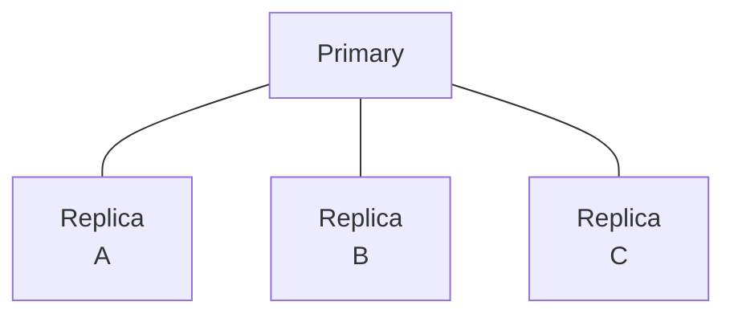

A write may need to wait for other systems before being acknowledged.

That can increase:

- latency
- network communication
- coordination
- failure sensitivity
- operational complexity

Instead, a system may allow:

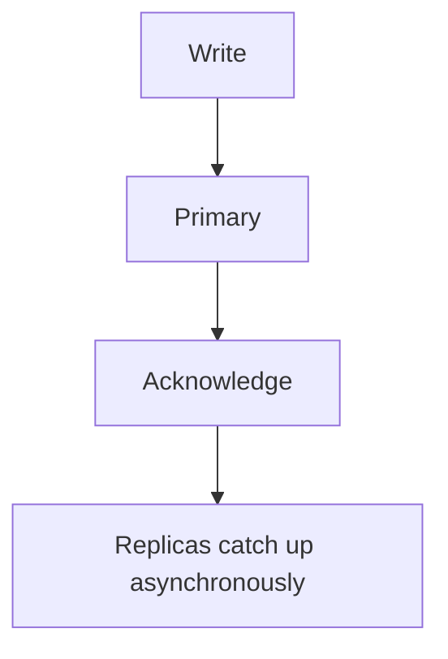

This can make the write path faster and allow the system to continue operating while replicas catch up.

---

# 3. The Basic Propagation Model

A simplified eventual-consistency flow is:

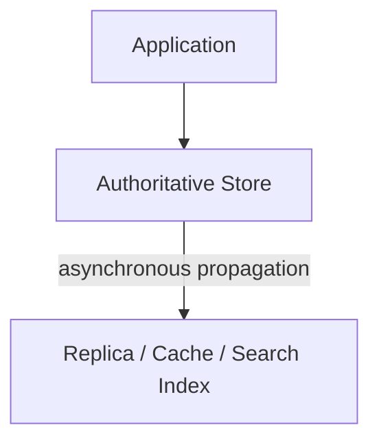

For example:

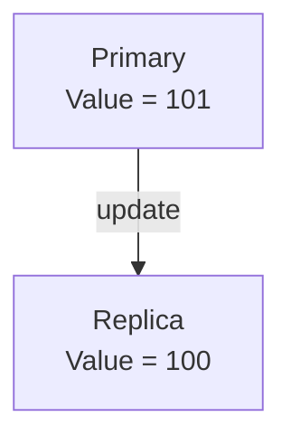

After propagation:

```text
Primary = 101
Replica = 101
```

The system has **converged**.

---

# 4. What Does "Eventually" Mean?

"Eventually" does **not** mean:

> "The data will definitely become correct after exactly 5 seconds."

The convergence time depends on the system.

Possible causes of delay include:

- network latency
- replication backlog
- overloaded workers
- queue delays
- database load
- retries
- temporary failures
- rate limiting
- downstream outages

Therefore:

```text
Eventually ≠ Fixed Time
```

A well-designed system should define or monitor acceptable propagation delay where freshness matters.

---

# 5. Convergence

**Convergence** means that independently stored copies eventually move toward the same state.

Example:

```text
Before propagation:

A = 10
B = 9
C = 10
```

After propagation:

```text
A = 10
B = 10
C = 10
```

The copies have converged.

A system using eventual consistency therefore depends on a propagation mechanism such as:

- replication
- events
- message queues
- cache refresh
- background workers
- synchronization processes

---

# 6. Eventual Consistency Is Not "Randomly Inconsistent"

A common misunderstanding is:

> "If the system is eventually consistent, anything can happen."

No.

A useful eventual-consistency design still defines:

- what state is authoritative
- how updates propagate
- how conflicts are handled
- how failures are retried
- how versions are identified
- how convergence is detected
- what users can temporarily observe

For example:

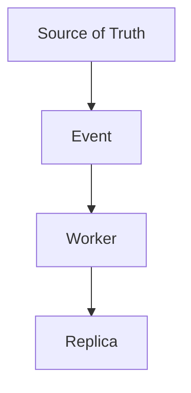

If the worker fails, the system needs a retry or recovery mechanism.

---

# 7. Versioning

When multiple copies exist, it can be useful to identify which version of data each copy contains.

Example:

```text
Primary:
value = "B"
version = 12

Replica:
value = "A"
version = 11
```

The version makes the difference explicit.

After propagation:

```text
Replica:
value = "B"
version = 12
```

Versioning can help with:

- detecting stale state
- ordering updates
- conflict detection
- synchronization
- debugging

The exact versioning mechanism varies by system.

---

# 8. Why Ordering Matters

Consider two updates:

```text
Update A:
Balance = ₹900

Update B:
Balance = ₹800
```

If they are delivered in the correct order:

```text
A → B
```

the final state is:

```text
₹800
```

But if propagation delivers:

```text
B → A
```

the final state could incorrectly become:

```text
₹900
```

Therefore, eventual consistency alone does not solve **update ordering**.

A distributed system may need:

- sequence numbers
- versions
- timestamps
- ordered logs
- conflict-resolution rules

---

# 9. Conflicts

A conflict occurs when different nodes independently produce changes that cannot simply be combined.

Example:

```text
Replica A:
Name = "Alice"

Replica B:
Name = "Bob"
```

Both changes may have occurred before the replicas synchronized.

Which value should win?

The system needs a conflict-resolution strategy.

Possible approaches include:

- last-write-wins
- version-based resolution
- application-specific rules
- merge operations
- rejecting conflicting writes
- authoritative ownership

There is no universal conflict-resolution strategy.

---

# 10. Last-Write-Wins

A common strategy is **Last-Write-Wins (LWW)**.

Example:

```text
Update A → version/time 100
Update B → version/time 101
```

The system chooses:

```text
Update B
```

because it is considered newer.

However, "last" must be defined carefully.

Distributed clocks can differ, and wall-clock time does not automatically provide a perfect global ordering.

Therefore:

> **LWW is a policy, not proof that one update was globally the last real-world event.**

---

# 11. Some Data Is Easier to Merge

Consider a counter.

Two systems produce:

```text
A adds +1
B adds +1
```

A suitable design may combine them:

```text
+1 + +1 = +2
```

Instead of treating them as conflicting replacements.

This is one reason data models matter.

Some operations are easier to make safely distributed than others.

For example:

```text
Increment counter
```

can sometimes be merged more naturally than:

```text
Set account status = X
```

The application's data model can therefore influence how well eventual consistency works.

---

# 12. Eventual Consistency With Replicas

A write reaches the primary first:

```text
Primary = Version 20
```

For a short period:

```text
Replica A = Version 20
Replica B = Version 19
Replica C = Version 18
```

Eventually:

```text
A = 20
B = 20
C = 20
```

This is a classic eventual-consistency scenario.

Replication lag becomes an important operational metric.

---

# 13. Eventual Consistency With Caches

Caches can also produce eventually consistent views.

Example:

```text
Database = ₹900
Cache    = ₹1,000
```

The cache may eventually become:

```text
Cache = ₹900
```

through:

- invalidation
- expiration
- refresh
- update-on-write
- event-driven updates

Therefore, caching is another place where freshness requirements must be considered.

---

# 14. Eventual Consistency With Search

Consider an e-commerce system:

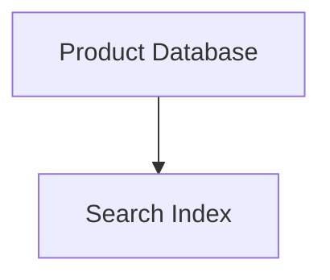

A product is created:

```text
Database:
Product X exists
```

The search index may not contain it immediately.

```text
Immediately:
Search → Product not found

Later:
Search → Product found
```

This can be acceptable because search is often a derived representation rather than the authoritative source.

The important distinction is:

```text
Database = Source of Truth
Search   = Derived View
```

---

# 15. Eventual Consistency With Events

A common architecture is:

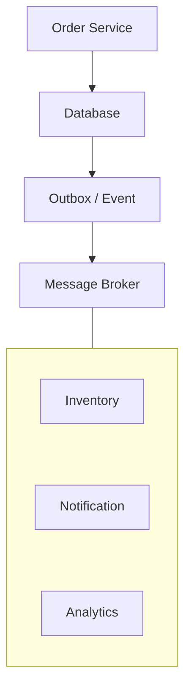

Different services process the event at different times.

For a short period:

```text
Order Service  = Order Created
Inventory      = Processing
Analytics      = Not updated yet
Notification   = Not sent yet
```

Later, the system converges toward the expected state.

This is a major reason asynchronous architectures often involve eventual consistency.

---

# 16. Failure Does Not Mean Convergence Is Guaranteed

Consider:

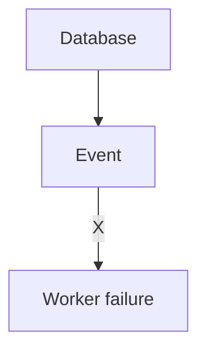

If the update is lost permanently, the downstream system may never converge.

Therefore:

```text
Eventual Consistency
        +
Reliable Propagation
        +
Retry / Recovery
```

is required for a useful system.

Common mechanisms include:

- durable queues
- retries
- dead-letter queues
- idempotent consumers
- replayable events
- monitoring
- reconciliation jobs

These topics are covered more deeply later in the curriculum.

---

# 17. Duplicate Delivery

A retry can produce duplicate events.

Example:

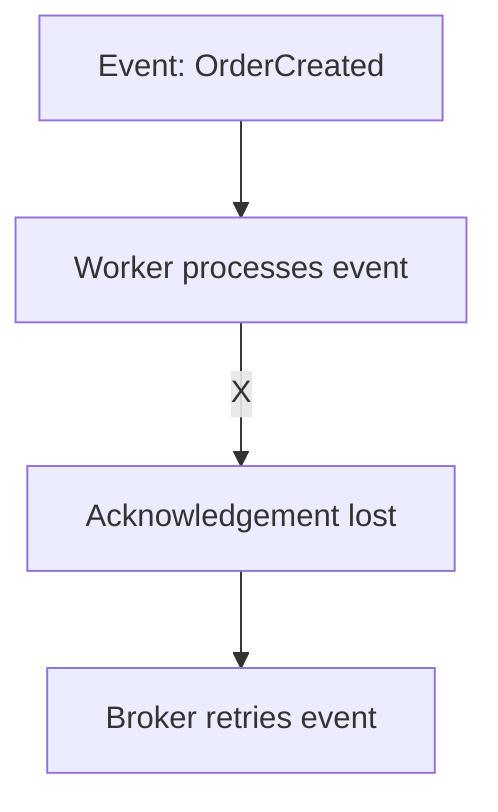

The worker may receive:

```text
OrderCreated
OrderCreated
```

Therefore, an eventually consistent system often needs **idempotent processing**.

For example:

```text
if event_id already processed:
    do nothing
else:
    process event
```

The goal is to make repeated delivery safe.

---

# 18. Reconciliation

Sometimes systems use periodic reconciliation to detect differences.

Example:

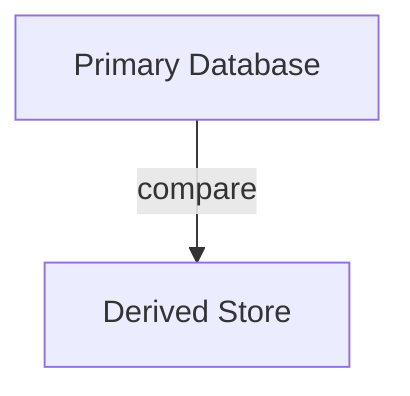

Suppose:

```text
Primary = 10,000 orders
Search Index = 9,998 orders
```

A reconciliation process can identify missing records and repair them.

This is useful because distributed systems must assume that:

> **Failures can interrupt propagation.**

Reconciliation provides another path toward convergence.

---

# 19. User Experience and Eventual Consistency

Technical consistency decisions become user-experience decisions.

Example:

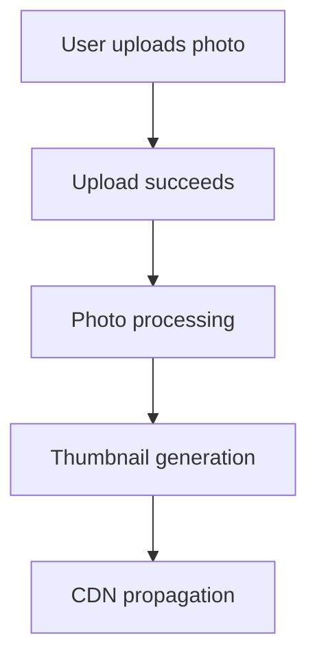

The user might briefly see:

```text
Uploading...
```

then:

```text
Uploaded
Processing...
```

then:

```text
Ready
```

Instead of pretending everything becomes available simultaneously, the UI can represent intermediate states honestly.

This is often better than forcing unnecessary synchronous coordination.

---

# 20. When Eventual Consistency Can Work Well

It can be appropriate when:

- short periods of stale data are acceptable
- derived data can lag
- high availability matters
- low latency matters
- workloads are geographically distributed
- asynchronous processing is useful
- exact immediate visibility is not required

Examples include:

- analytics
- recommendation systems
- search indexes
- social feeds
- notification pipelines
- view counters
- some content-distribution systems

The specific requirement matters more than the category.

---

# 21. When Eventual Consistency Can Be Dangerous

It can be problematic when stale data can cause serious incorrect behavior.

Examples include operations involving:

- financial balances
- payment authorization
- inventory reservation
- security permissions
- critical state transitions
- uniqueness requirements

For example:

```text
Actual stock = 1

Replica A = 1
Replica B = 1
```

Two customers may read stale stock and both attempt to purchase.

The system needs stronger coordination around the critical operation.

---

# 22. Eventual Consistency Is Often Local, Not Universal

A system does not need to choose:

```text
Everything = Strong
```

or:

```text
Everything = Eventual
```

It can use different guarantees for different operations.

Example:

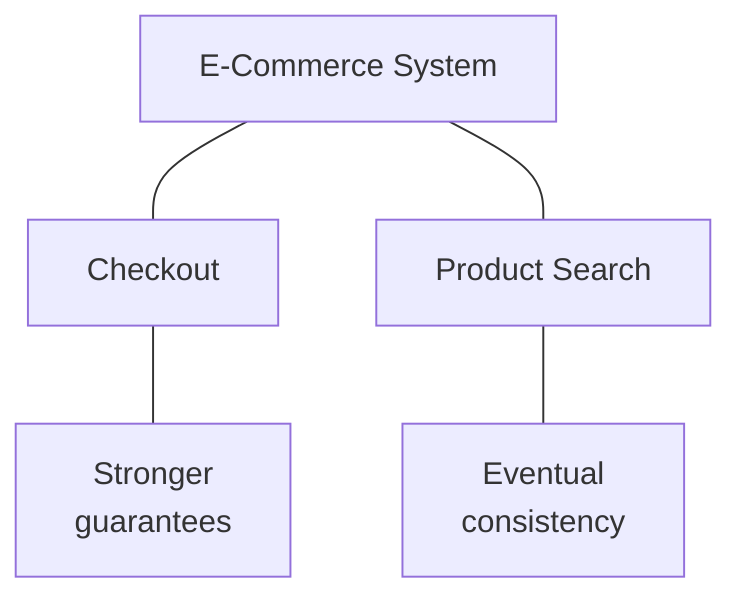

This is often a more practical architecture.

---

# 23. Hands-On Exercise — Simulate Convergence

Imagine three replicas:

```text
Replica A = 100
Replica B = 100
Replica C = 100
```

A new update occurs:

```text
New value = 120
```

Propagation happens asynchronously.

## Step 1

After the write:

```text
A = 120
B = 100
C = 100
```

Which replicas are stale?

## Step 2

Later:

```text
A = 120
B = 120
C = 100
```

Has the system converged?

## Step 3

Finally:

```text
A = 120
B = 120
C = 120
```

What has happened?

**Answer:** all copies have converged to the latest state.

---

# 24. Lab Challenge — Propagation Failure

Start with:

```text
Primary = Version 10
Replica = Version 10
```

A new write creates:

```text
Primary = Version 11
```

The propagation worker fails.

The replica remains:

```text
Version 10
```

Answer:

1. Is the replica stale?
2. Has the system converged?
3. What could help recovery?
4. Why might retries be necessary?
5. What could happen if the event is processed twice?

Expected concepts:

```text
Stale read
No convergence yet
Retry / replay / reconciliation
Reliable propagation
Idempotency
```

---

# 25. Practical Investigation Workflow

When users report stale data:

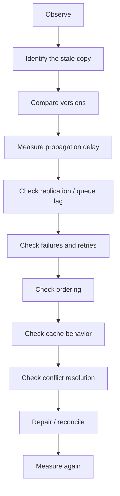

Do not immediately conclude that the database is broken.

Find **where the stale state entered the request path**.

---

# 26. Common Mistakes

### Mistake 1 — "Eventually means immediately after some delay"

No fixed delay is guaranteed unless the system explicitly provides one.

### Mistake 2 — "Eventual consistency means no correctness"

The system can still have strict rules around critical operations.

### Mistake 3 — Ignoring propagation failures

If updates are lost, convergence may never happen.

### Mistake 4 — Ignoring duplicate events

Retries can produce duplicate processing.

### Mistake 5 — Assuming timestamps solve ordering

Distributed clocks do not automatically provide perfect global ordering.

### Mistake 6 — Using eventual consistency for every operation

Critical operations may require stronger guarantees.

### Mistake 7 — Treating every stale read as a database problem

The stale value may come from:

```text
Cache
Replica
Search index
CDN
Application state
```

---

# 27. System Design View

Eventual consistency is fundamentally a **propagation design problem**.

A useful mental model is:

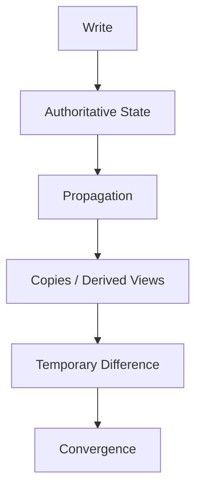

Then ask:

```text
How long can the difference exist?
How is propagation performed?
What if propagation fails?
What if an update arrives twice?
What if updates arrive out of order?
What if two updates conflict?
How is convergence detected?
```

These questions turn "eventual consistency" from a buzzword into an actual architecture decision.

---

# 28. Decision Framework

| Requirement | Possible Approach |
|---|---|
| Immediate authoritative read required | Read authoritative source |
| Replica can be slightly stale | Eventual replication |
| Search can lag behind database | Asynchronous indexing |
| Analytics can lag | Event-driven processing |
| Cache can temporarily be stale | TTL/invalidation |
| Updates can arrive repeatedly | Idempotent processing |
| Propagation can fail | Durable events + retry |
| Copies can diverge | Versioning + reconciliation |
| Conflicting updates possible | Explicit conflict-resolution policy |
| Critical business operation | Stronger consistency/coordination |

---

# 29. The Deeper Trade-Off

Eventual consistency can reduce coordination.

That can provide benefits such as:

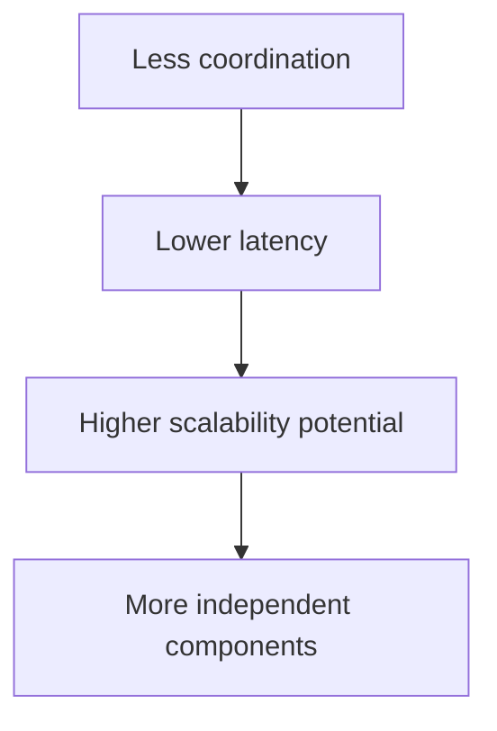

But it also introduces:

```text
Stale reads
      +
Propagation delays
      +
Ordering problems
      +
Duplicate processing
      +
Conflict handling
      +
Operational complexity
```

The architecture is exchanging **immediate global agreement** for **asynchronous convergence**.

---

# 30. Key Principle

> **Eventual consistency allows distributed copies or derived views to temporarily differ while the system propagates updates toward a converged state. It can improve scalability, latency, and availability characteristics, but only when the system can safely tolerate temporary staleness and has reliable propagation, retry, ordering, conflict-handling, and recovery mechanisms.**

---

# 31. Quick Reference

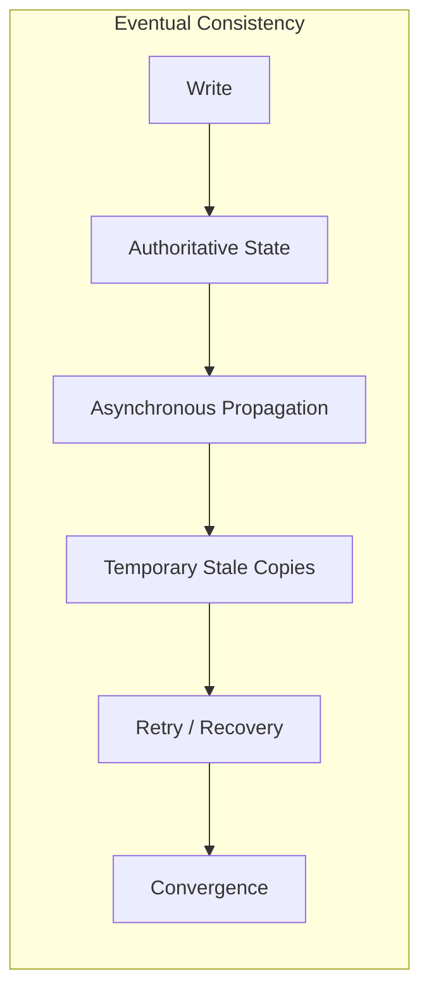

### Important Terms

| Term | Meaning |
|---|---|
| Stale Read | Reading an older state |
| Propagation | Moving an update to another copy/system |
| Convergence | Copies reaching the expected common state |
| Replication Lag | Delay between source and replica |
| Version | Identifier representing a state/update |
| Conflict | Competing changes that need resolution |
| Reconciliation | Detecting and repairing differences |
| Idempotency | Safe repeated processing |

---

# 32. Knowledge Check

1. What does eventual consistency mean?
2. Why might a system choose eventual consistency?
3. What is a stale read?
4. What does convergence mean?
5. Why doesn't "eventually" mean a fixed number of seconds?
6. How can read-after-write problems occur?
7. Why is versioning useful?
8. Why does update ordering matter?
9. Why are retries connected to idempotency?
10. Why can search indexes be eventually consistent?
11. What happens if propagation permanently fails?
12. Why might critical inventory operations need stronger consistency?

---

# 33. Remember

When you hear **eventual consistency**, think:

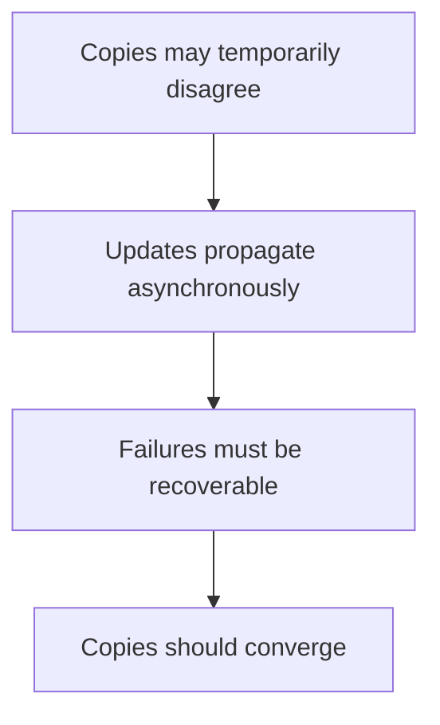

And always ask:

> **"How much staleness can this particular operation safely tolerate?"**

---

# 34. Next Chapter

## 04.20 — CAP Theorem

Next we will connect consistency to distributed-system constraints:

- What CAP actually says
- Consistency
- Availability
- Partition tolerance
- Network partitions
- Why partitions matter
- CP vs AP as a simplified model
- What CAP does and does not say
- Common CAP misconceptions
- Database and distributed-system examples
- Real-world trade-offs
- Consistency vs latency vs availability
- Practical system-design decisions
- Hands-on CAP exercise
