# 04.20 — CAP Theorem

## Learning Objectives

By the end of this chapter, you should understand:

- What the CAP Theorem is
- What Consistency, Availability, and Partition Tolerance mean
- Why network partitions matter
- What CAP actually requires you to choose during a partition
- CP and AP systems
- Why CAP does **not** mean "pick any two"
- The difference between CAP consistency and everyday database consistency
- Common CAP misconceptions
- How CAP affects real system-design decisions

---

# 1. What Is the CAP Theorem?

The **CAP Theorem** describes a fundamental limitation of distributed systems.

It says that when a distributed system experiences a **network partition**, it cannot simultaneously guarantee both:

- **Consistency**
- **Availability**

while also tolerating that partition.

In simple terms:

> **During a network partition, a distributed system must choose between preserving consistency and continuing to provide availability.**

The three CAP properties are:

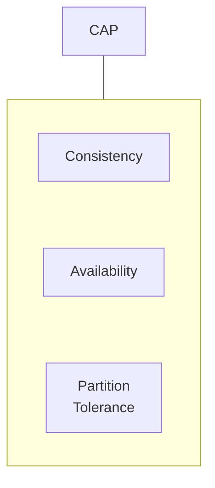

---

# 2. The Three CAP Properties

## C — Consistency

In CAP, consistency means that a read receives the latest successful write, or an error.

Simplified:

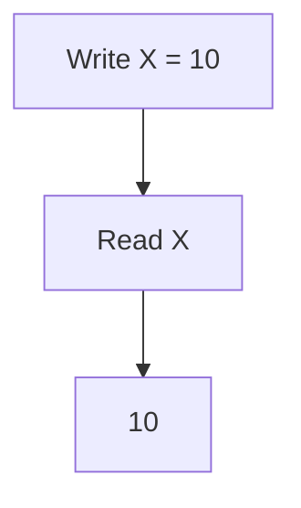

A successful read should not return an older value when the system's consistency guarantee requires the latest state.

This is specifically **CAP consistency**, and should not be confused with every use of the word "consistent" in database terminology.

---

## A — Availability

In CAP, availability means:

> **Every request to a non-failing node receives a response.**

The response may not necessarily contain the newest data.

For example:

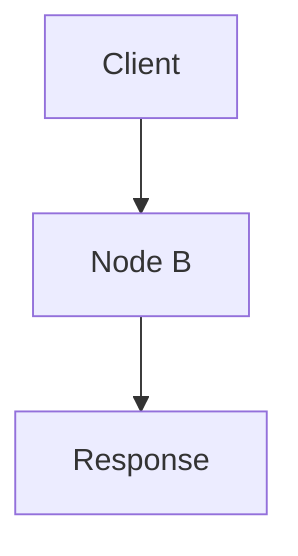

The node continues responding even when another part of the system cannot be reached.

Availability therefore means more than:

> "The server is online."

It is a formal distributed-system property.

---

## P — Partition Tolerance

A **network partition** occurs when distributed nodes cannot reliably communicate with each other.

For example:

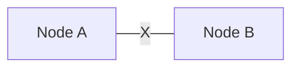

The nodes are still running, but communication between them has failed.

The rest of the system may look like:

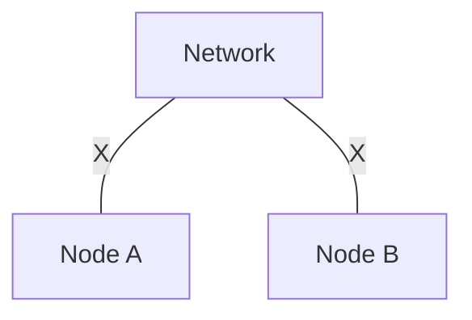

Partition tolerance means the system continues to operate despite this communication failure, according to its design.

---

# 3. Why Is Partition Tolerance Special?

In a real distributed system, network communication can fail.

Examples:

- network cable failure
- router failure
- firewall problem
- DNS/network issue
- cloud networking failure
- overloaded network
- regional connectivity failure
- packet loss or severe delay

Therefore, when designing a distributed system, you cannot simply assume:

> "All nodes can always communicate."

A partition can occur.

The important question becomes:

```text
What should the system do
when nodes cannot communicate?
```

---

# 4. The Classic CAP Scenario

Imagine two database nodes:

```text
Node A              Node B
Value = 10          Value = 10
```

A client writes:

```text
Value = 20
```

The network then partitions:


Now the system has a problem.

Node A knows:

```text
Value = 20
```

Node B may still know:

```text
Value = 10
```

What should happen if a client asks Node B for the value?

---

# 5. Choice 1 — Preserve Consistency

The system can refuse or delay the request until it can safely determine the correct state.

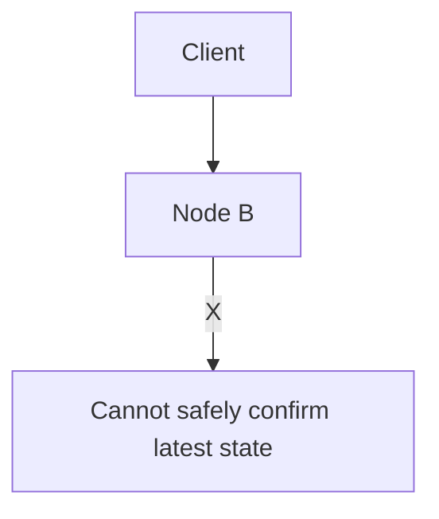

The system sacrifices availability for that operation.

This is the basic idea behind a **CP-oriented** design:

```text
Consistency
     +
Partition Tolerance
```

---

# 6. Choice 2 — Preserve Availability

Node B can continue responding:

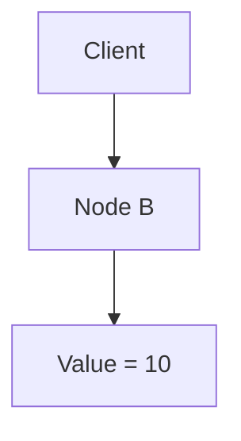

The response may be stale.

The system remains available but sacrifices the stronger consistency guarantee during the partition.

This is the basic idea behind an **AP-oriented** design:

```text
Availability
      +
Partition Tolerance
```

The application may need reconciliation or conflict handling later.

---

# 7. Why "Pick Any Two" Is Misleading

A common CAP diagram says:

```text
        C
       / \
      /   \
     A-----P
```

This often leads to the statement:

> "You can pick any two of the three."

That is an oversimplification.

In a distributed system that must tolerate partitions, **P is not normally an optional feature you simply give up**.

The meaningful CAP trade-off happens **when a partition occurs**:

```text
During a partition:

Consistency  ←→  Availability
```

The system cannot guarantee both simultaneously under the CAP model.

---

# 8. CAP Is About Distributed Systems

CAP is concerned with systems where multiple nodes communicate over a network.

For example:

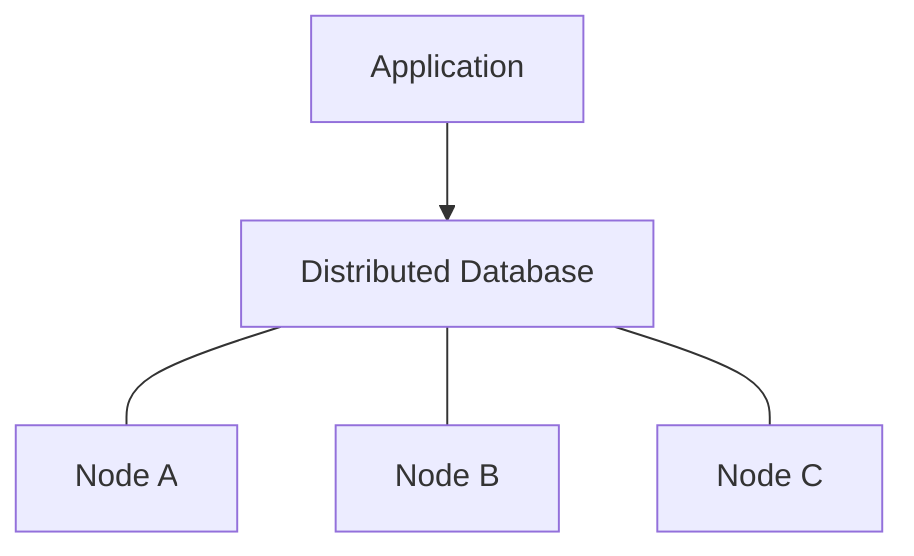

A simple single-node database does not face a network partition between database nodes in the same CAP sense.

This is one reason CAP becomes important as architecture becomes distributed.

---

# 9. CP Systems

A **CP-oriented system** prioritizes consistency during network partitions.

The system prefers:

```text
Correct state
     >
Always responding
```

This can be appropriate when stale or conflicting data would be unacceptable.

Examples of operations that may require stronger guarantees include:

- financial transactions
- critical inventory decisions
- unique resource allocation
- certain coordination operations

The exact behavior depends on the implementation.

---

# 10. AP Systems

An **AP-oriented system** prioritizes availability during partitions.

The system may temporarily return stale or divergent state.

Later:

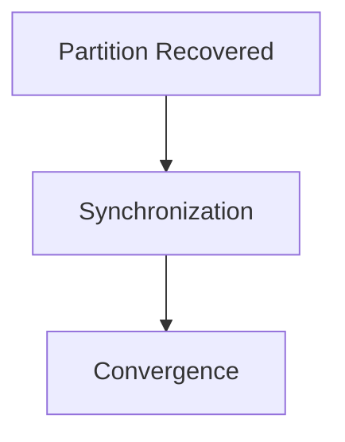

This can be useful when continued service is more important than immediate agreement for a particular operation.

Examples can include some:

- feeds
- recommendation systems
- analytics
- distributed content systems

Again, the actual guarantees depend on the technology and application.

---

# 11. CP vs AP

| During Partition | CP-Oriented | AP-Oriented |
|---|---|---|
| Primary goal | Preserve consistency | Preserve availability |
| Requests | May fail or wait | Continue responding |
| Stale data | More restricted | May be allowed |
| Conflict handling | Often reduced by coordination | May require resolution |
| User experience | Possible errors/delays | Possible stale data |
| Recovery | Resume normal coordination | Reconcile/converge |

This table describes the **CAP trade-off during a partition**, not a complete classification of every behavior of a database.

---

# 12. A Simple E-Commerce Example

Suppose inventory is:

```text
Stock = 1
```

Two application nodes communicate with separate database replicas.

A network partition occurs:

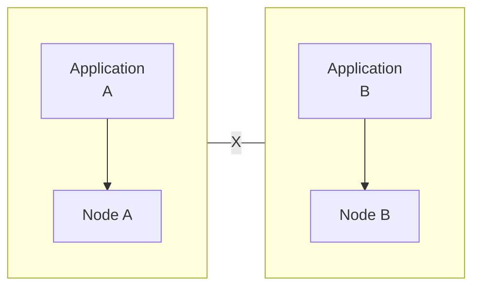

Both sides believe:

```text
Stock = 1
```

Two customers attempt to buy the last item.

If both sides continue accepting the purchase independently:

```text
Customer A → Success
Customer B → Success
```

the system may oversell the product.

A stronger consistency strategy might instead reject or delay one operation until coordination is restored.

This illustrates why business requirements matter.

---

# 13. CAP Consistency vs Database Consistency

The word **consistency** appears in several contexts.

### CAP Consistency

Concerned with what distributed clients observe, especially during a partition.

### Transactional Consistency

Part of ACID:

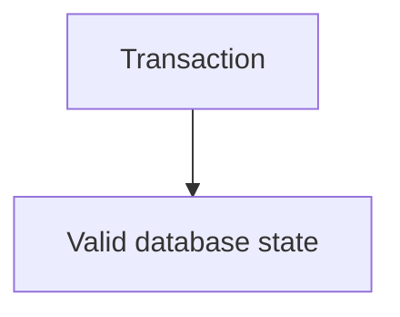

### Isolation

Controls how concurrent transactions interact.

### Eventual Consistency

Describes a model where replicas or derived views can temporarily differ and later converge.

These concepts are related, but they are **not interchangeable**.

```text
CAP Consistency
       ≠
ACID Consistency
       ≠
Isolation
       ≠
Eventual Consistency
```

This distinction is extremely important.

---

# 14. CAP Does Not Mean "No Availability"

CAP does not say:

> "CP systems are unavailable."

A CP-oriented system can be highly available during normal operation.

The trade-off concerns behavior **when a partition occurs**.

For example:

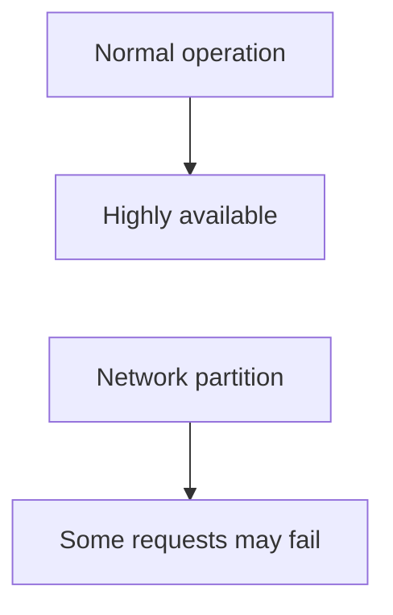

Similarly, an AP-oriented system can have failures for other reasons.

CAP is not a complete reliability model.

---

# 15. CAP Does Not Mean "AP Systems Are Inconsistent Forever"

An AP-oriented design may allow temporary divergence:

```text
Node A = 20
Node B = 10
```

After communication returns:

```text
Node A = 20
Node B = 20
```

The system can converge.

This connects directly to **eventual consistency**.

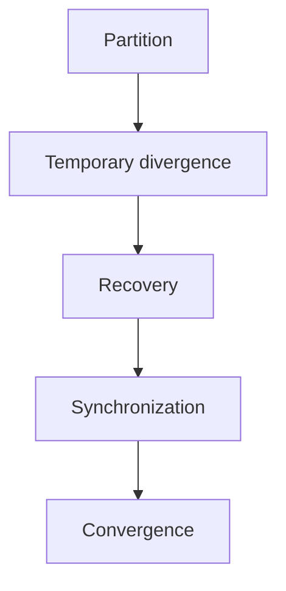

However, eventual consistency is not identical to AP. CAP and eventual consistency describe different aspects of distributed behavior.

---

# 16. What Happens After the Partition?

Suppose:

```text
Node A = 20
Node B = 10
```

The network recovers:

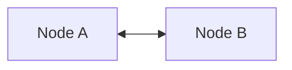

The system must determine:

```text
Which state should win?
```

Possible mechanisms include:

- authoritative source
- versioning
- conflict resolution
- ordered logs
- quorum mechanisms
- application-specific merge rules
- reconciliation

The answer depends on the system architecture.

---

# 17. CAP and Quorum

Some distributed systems use **quorums**.

Suppose there are:

```text
3 nodes
```

A quorum might require:

```text
2 of 3 nodes
```

for certain operations.

Simplified:

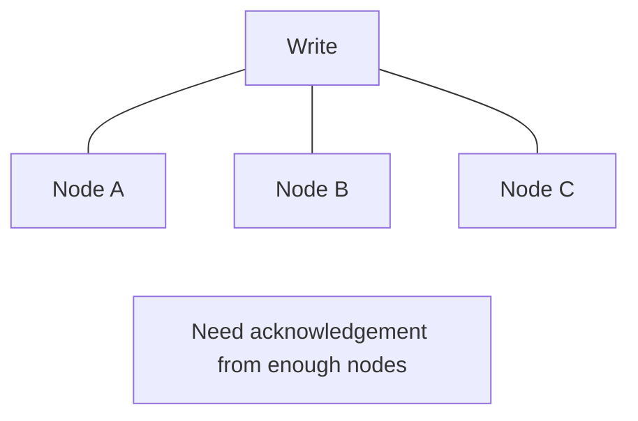

Quorum mechanisms can help coordinate distributed state, but they do not eliminate the CAP trade-off.

If a partition prevents the required quorum from being reached, the system must decide whether to:

```text
Reject / delay
```

or use some weaker behavior.

---

# 18. CAP and Latency

Partition tolerance is not the only consideration.

Coordination also affects latency.

For example:

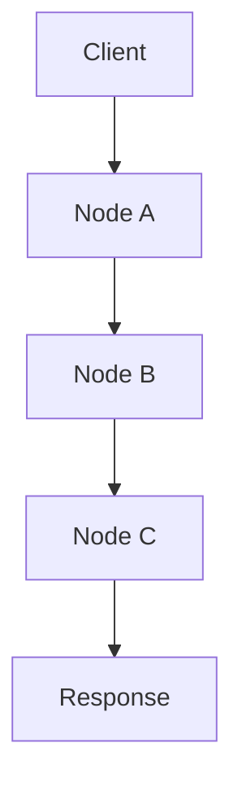

More coordination can mean more network communication.

This introduces another practical trade-off:

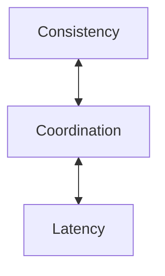

CAP itself does not provide a complete formula for latency, but real system design must consider it.

---

# 19. CAP and Geographic Distribution

Consider a multi-region system:

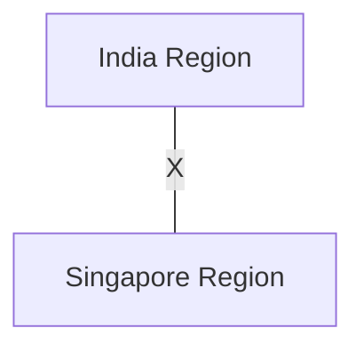

A regional network failure can create a partition between regions.

The system must decide whether to:

```text
Continue serving both regions
```

or:

```text
Restrict operations until coordination returns
```

The answer depends on the business requirements.

Geographic distribution can therefore make consistency decisions more visible.

---

# 20. A Practical Design Example

Imagine a notification system.

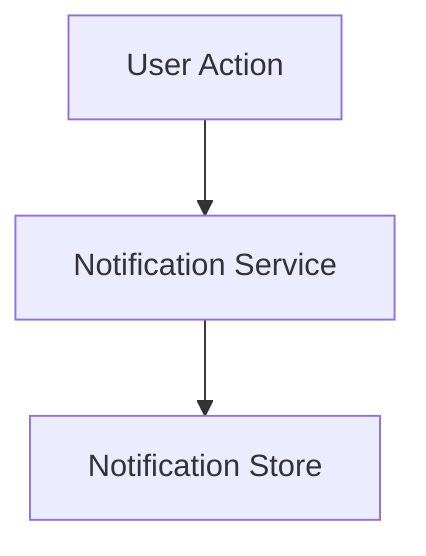

Suppose a temporary network partition affects one region.

For a notification:

```text
"New recommendation available"
```

temporary delay may be acceptable.

For a financial authorization:

```text
"Payment approved"
```

incorrect state may have much greater consequences.

Therefore:

```mermaid
flowchart TD
  accTitle: Requirements drive the decision
  accDescr: Same distributed-system problem, then Different business requirement, then Different consistency/availability decision.
  N0["Same distributed-system problem"] --> N1["Different business requirement"] --> N2["Different consistency/availability decision"]
```

---

# 21. CAP Decision Framework

When designing a distributed system, ask:

### 1. Is the system distributed?

```text
One node?
Multiple nodes?
Multiple regions?
```

### 2. What happens if nodes cannot communicate?

```text
Partition scenario
```

### 3. Can the system safely continue accepting requests?

If yes, what state can it safely return?

### 4. What must remain correct?

```text
Money?
Inventory?
Permissions?
Content?
Analytics?
```

### 5. Can temporary divergence be tolerated?

```text
Yes → eventual behavior may be acceptable
No  → stronger coordination may be required
```

### 6. How does the system recover?

```text
Retry
Reconcile
Merge
Replay
Promote
Repair
```

---

# 22. Hands-On Exercise — CAP Partition

Imagine three nodes:

```text
Node A = 100
Node B = 100
Node C = 100
```

A network partition occurs:

```mermaid
flowchart TD
  accTitle: A three-node partition
  accDescr: Node A and node B communicate; node C is partitioned from them (X).
  A["Node A"] <--> B["Node B"] ---|"X"| C["Node C"]
```

The application receives:

```text
Write: value = 120
```

### Question 1

If the system requires strong consistency and cannot safely coordinate with enough nodes, what might it do?

**Expected:** reject, delay, or otherwise prevent an unsafe write.

### Question 2

If the system prioritizes availability, what might it do?

**Expected:** continue processing according to its availability-oriented design, potentially allowing temporary divergence.

### Question 3

After the partition heals, what additional work may be required?

**Expected:**

```text
Synchronization
Conflict resolution
Reconciliation
Convergence
```

---

# 23. Common CAP Misconceptions

### Misconception 1 — "CAP means choose two of three."

Oversimplified.

The important trade-off occurs **during a network partition**.

### Misconception 2 — "P is optional."

For a distributed system operating over an unreliable network, partition behavior must be considered.

### Misconception 3 — "CP means the system is always available."

No.

It may remain highly available during normal operation but reject some operations during a partition to preserve consistency.

### Misconception 4 — "AP means bad data."

Not necessarily.

It may mean temporarily stale or divergent data with an explicit convergence strategy.

### Misconception 5 — "CAP explains all database behavior."

No.

CAP does not replace:

- ACID
- isolation levels
- replication theory
- caching
- transactions
- consensus
- failure handling

### Misconception 6 — "CAP tells you which architecture to choose."

CAP describes a fundamental constraint. Business requirements determine what trade-offs are acceptable.

---

# 24. System Design View

CAP is most useful when you turn it into a failure scenario.

Do not ask only:

> "Is this system CP or AP?"

Ask:

```mermaid
flowchart TD
  accTitle: CAP as a failure scenario
  accDescr: What happens if communication fails?, then Which requests continue?, then What data can they return?, then Can conflicting writes occur?, then How is state reconciled?, then What does the user experience?, then What happens when the partition heals?.
  N0["What happens if communication fails?"] --> N1["Which requests continue?"] --> N2["What data can they return?"] --> N3["Can conflicting writes occur?"] --> N4["How is state reconciled?"] --> N5["What does the user experience?"] --> N6["What happens when the partition heals?"]
```

That is the practical system-design use of CAP.

---

# 25. CAP Mental Model

Remember this:

```mermaid
flowchart TD
  accTitle: CAP mental model
  accDescr: Distributed system, network partition, nodes cannot coordinate normally. Preserve consistency: may reject or delay. Continue availability: may serve stale/divergent state.
  N0["Distributed System"] --> N1["Network Partition"] --> N2["Nodes cannot coordinate normally"] --> C["Preserve<br/>Consistency"] & A["Continue<br/>Availability"]
  C --> R["May reject<br/>or delay"]
  A --> S["May serve<br/>stale/divergent state"]
```

The trade-off appears **when the partition happens**.

---

# 26. CAP vs Previous Chapters

The Level 4 progression now looks like:

```mermaid
flowchart TD
  accTitle: The Level 4 progression
  accDescr: 04.08 Transactions & ACID, then 04.09 Isolation Levels, then 04.10 Database Replication, then 04.11 Primary / Replica, then 04.12 Read Replicas, then 04.13 Partitioning, then 04.14 Sharding, then 04.15 Sharding Strategies, then 04.16 Consistent Hashing, then 04.17 Hot Partitions, then 04.18 Data Consistency, then 04.19 Eventual Consistency, then 04.20 CAP Theorem.
  N0["04.08 Transactions & ACID"] --> N1["04.09 Isolation Levels"] --> N2["04.10 Database Replication"] --> N3["04.11 Primary / Replica"] --> N4["04.12 Read Replicas"] --> N5["04.13 Partitioning"] --> N6["04.14 Sharding"] --> N7["04.15 Sharding Strategies"] --> N8["04.16 Consistent Hashing"] --> N9["04.17 Hot Partitions"] --> N10["04.18 Data Consistency"] --> N11["04.19 Eventual Consistency"] --> N12["04.20 CAP Theorem"]
```

The concepts connect:

```mermaid
flowchart TD
  accTitle: How the concepts connect
  accDescr: Replication, then Multiple Copies, then Consistency Problem, then Eventual Consistency, then Distributed Network Failure, then CAP Trade-Off.
  N0["Replication"] --> N1["Multiple Copies"] --> N2["Consistency Problem"] --> N3["Eventual Consistency"] --> N4["Distributed Network Failure"] --> N5["CAP Trade-Off"]
```

---

# 27. Key Principle

> **The CAP Theorem says that a distributed system cannot guarantee both strong consistency and availability during a network partition. The practical design question is not simply "CP or AP?" but what the system must preserve when distributed components cannot communicate, what temporary divergence is acceptable, and how the system recovers afterward.**

---

# 28. Quick Reference

| Term | Meaning |
|---|---|
| Consistency | Reads observe the required latest state |
| Availability | Requests to non-failing nodes receive responses |
| Partition | Nodes cannot reliably communicate |
| Partition Tolerance | System is designed to operate despite partitions |
| CP | Preserve consistency during partition at availability's expense |
| AP | Preserve availability during partition while allowing weaker consistency |
| Convergence | Copies move toward a common state |
| Quorum | Required subset of nodes for an operation |
| Reconciliation | Repairing divergent state |

### One-Sentence CAP

> **When communication between distributed nodes fails, you cannot guarantee both immediate consistency and continued availability for every operation.**

---

# 29. Knowledge Check

1. What does CAP stand for?
2. What is a network partition?
3. What does consistency mean in CAP?
4. What does availability mean in CAP?
5. Why is partition tolerance important?
6. Why is "pick any two" an oversimplification?
7. What happens to a CP-oriented system during a partition?
8. What happens to an AP-oriented system during a partition?
9. How is CAP consistency different from ACID consistency?
10. Does CAP mean AP systems are permanently inconsistent?
11. Why can quorum mechanisms help?
12. What should happen after a network partition heals?
13. Why should business requirements influence consistency decisions?

---

# 30. Remember

When you hear **CAP Theorem**, think:

```mermaid
flowchart TD
  accTitle: Remember
  accDescr: Distributed System, then Network Partition, then Cannot coordinate normally, then Consistency ↔ Availability, then Choose the behavior that protects the system's actual requirements.
  N0["Distributed System"] --> N1["Network Partition"] --> N2["Cannot coordinate normally"] --> N3["Consistency ↔ Availability"] --> N4["Choose the behavior that protects the system's actual requirements"]
```

And remember:

> **CAP is about what happens during a partition—not a simple label for an entire database or application.**
