# 05.01 — Synchronous vs Asynchronous Work

## Learning Objectives

By the end of this chapter, you should understand:

- What synchronous work means
- What asynchronous work means
- How request waiting differs between them
- Why asynchronous processing exists
- How queues and workers fit into asynchronous systems
- The relationship between latency and asynchronous work
- When synchronous processing is appropriate
- When asynchronous processing is appropriate
- The reliability and failure trade-offs
- How to identify asynchronous work in a real system

---

# 1. What Is Synchronous Work?

**Synchronous work** means the caller waits for the operation to complete before continuing.

Example:

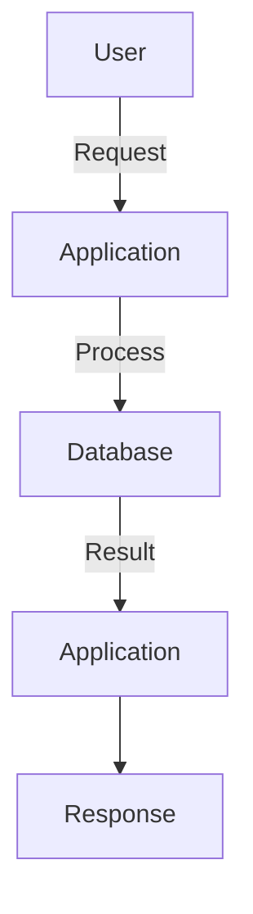

The application does not finish the request until the required work is completed.

A simple example:

```text
POST /orders
```

The application may:

1. Validate the order
2. Check inventory
3. Create the order
4. Return the result

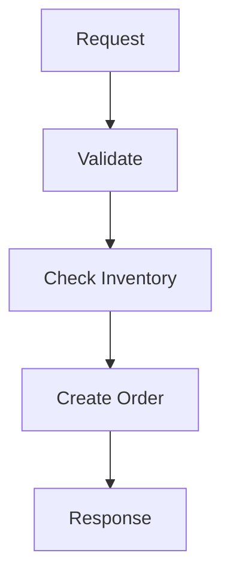

The caller waits for this process.

---

# 2. What Does "Waiting" Mean?

Suppose a request takes:

```text
Validation       10 ms
Database         80 ms
Payment API     300 ms
Response         10 ms
----------------------
Total            400 ms
```

The user waits approximately 400 ms for the response.

The application may also spend part of that time waiting for another system:

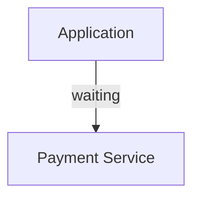

This distinction is important:

> **Synchronous does not mean the CPU is constantly working. It means the caller is waiting for the operation's result.**

---

# 3. What Is Asynchronous Work?

**Asynchronous work** allows the caller to continue without waiting for the entire operation to finish.

Example:

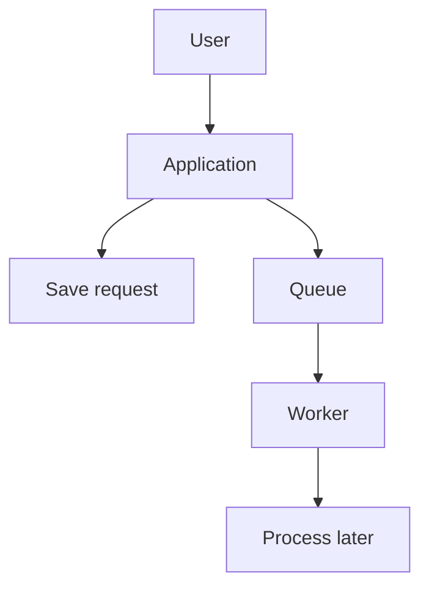

The initial request can finish before the background work is complete.

For example:

```text
POST /reports
```

The application could respond:

```text
Report generation started.
```

while the actual report is generated later.

---

# 4. Synchronous vs Asynchronous

### Synchronous

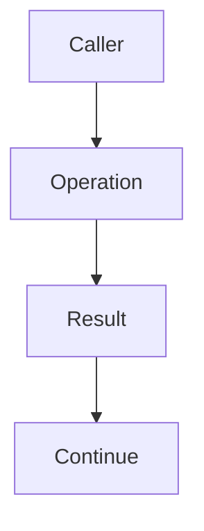

### Asynchronous

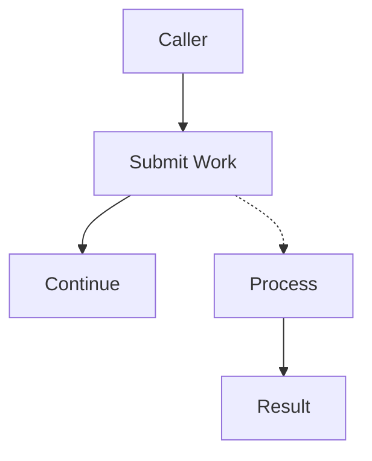

The fundamental difference is:

> **Does the caller need to wait for the work to finish?**

---

# 5. A Real Example — Sending Email

Suppose a user creates an account.

The application needs to send a welcome email.

### Synchronous approach

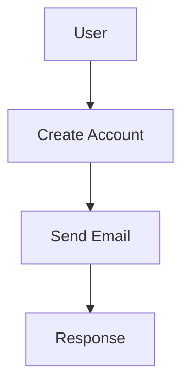

If the email service takes 500 ms, the user waits.

If the email service is unavailable, account creation may also fail depending on the implementation.

### Asynchronous approach

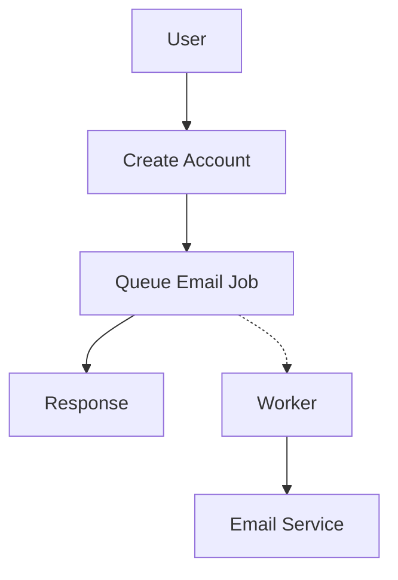

The account can be created without waiting for the email to be delivered.

---

# 6. Why Does Asynchronous Work Exist?

Asynchronous processing is useful when work:

- takes a long time
- does not need to finish before responding
- can be processed later
- happens in bursts
- should be retried independently
- should not block user requests
- can be handled by background workers

Examples:

```text
Image processing
Email sending
Video encoding
Report generation
Analytics processing
Search indexing
Notifications
Data exports
```

The goal is not simply "make everything asynchronous."

The goal is:

> **Separate work that must happen now from work that can safely happen later.**

---

# 7. User Request vs Background Work

Consider an e-commerce order:

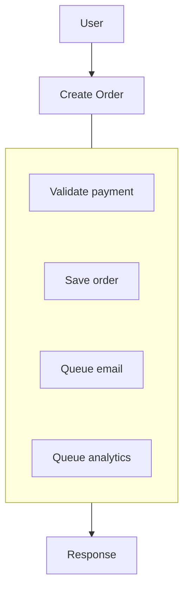

Some operations are part of the immediate business transaction.

Others can happen afterward.

For example:

| Work | Could be asynchronous? |
|---|---|
| Validate critical payment state | Usually no |
| Create order | Usually no |
| Send confirmation email | Often yes |
| Generate recommendation | Often yes |
| Update analytics | Often yes |
| Generate PDF invoice | Often yes |
| Update search index | Often yes |

The answer depends on the application's requirements.

---

# 8. Asynchronous Does Not Mean "Instant"

A common misunderstanding is:

> "Async makes the work faster."

Not necessarily.

Suppose report generation takes:

```text
30 seconds
```

Making it asynchronous does not automatically reduce:

```text
30 seconds → 1 second
```

Instead:

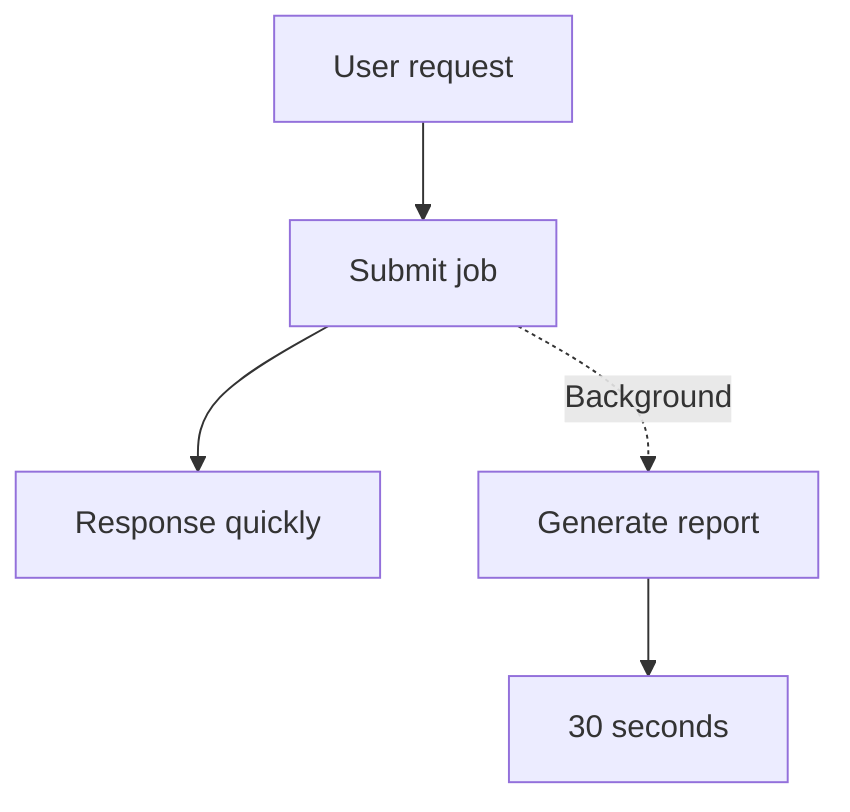

The **user-facing request becomes faster**, while the actual work still takes time.

---

# 9. Asynchronous Work Separates Two Latencies

With synchronous processing:

```text
Request latency
     =
All required work
```

With asynchronous processing:

```text
Request latency
     =
Time to accept/submit work
```

and:

```text
Completion latency
     =
Time until background work finishes
```

These are different measurements.

For example:

```text
Request accepted:       50 ms
Job completed:        2,500 ms
```

The request is fast even though the complete operation takes 2.5 seconds.

---

# 10. The Queue Pattern

A common asynchronous architecture is:

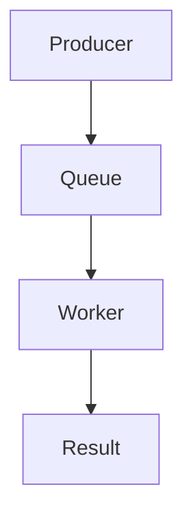

Where:

### Producer

Creates work.

```text
Application → Queue
```

### Queue

Stores work until it can be processed.

### Worker

Consumes and executes the work.

```text
Queue → Worker
```

This becomes the foundation for the next chapters.

---

# 11. Why Not Just Start a Background Thread?

An application can sometimes perform work in a background thread/process.

But at system scale, this can create problems.

Imagine:

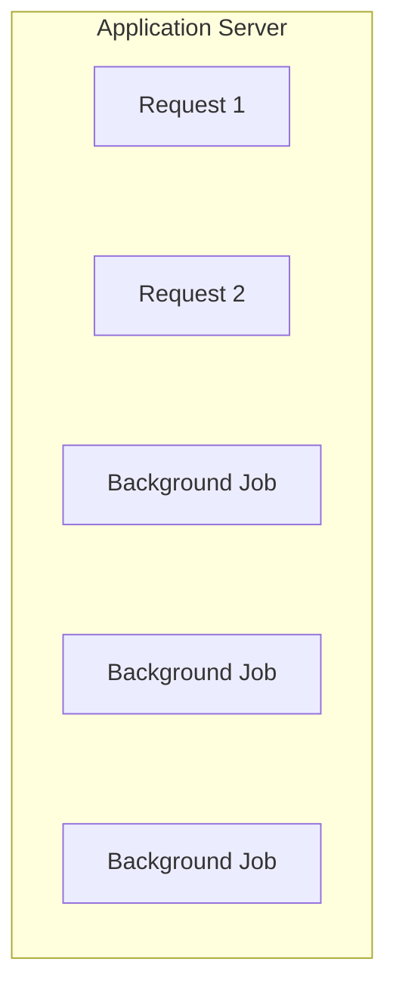

Now the application server is responsible for both:

- serving user requests
- executing background work

Heavy background work can consume:

- CPU
- memory
- connections
- file descriptors
- network capacity

This can affect user traffic.

A dedicated worker architecture separates the responsibilities:

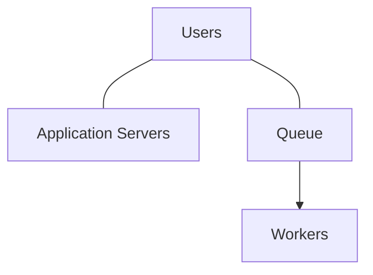

---

# 12. Asynchronous Work and Scaling

Suppose 10,000 image-processing jobs arrive.

A single worker may process:

```text
10 jobs/sec
```

The queue grows:

```text
Queue
████████████████████
```

More workers can process jobs concurrently:

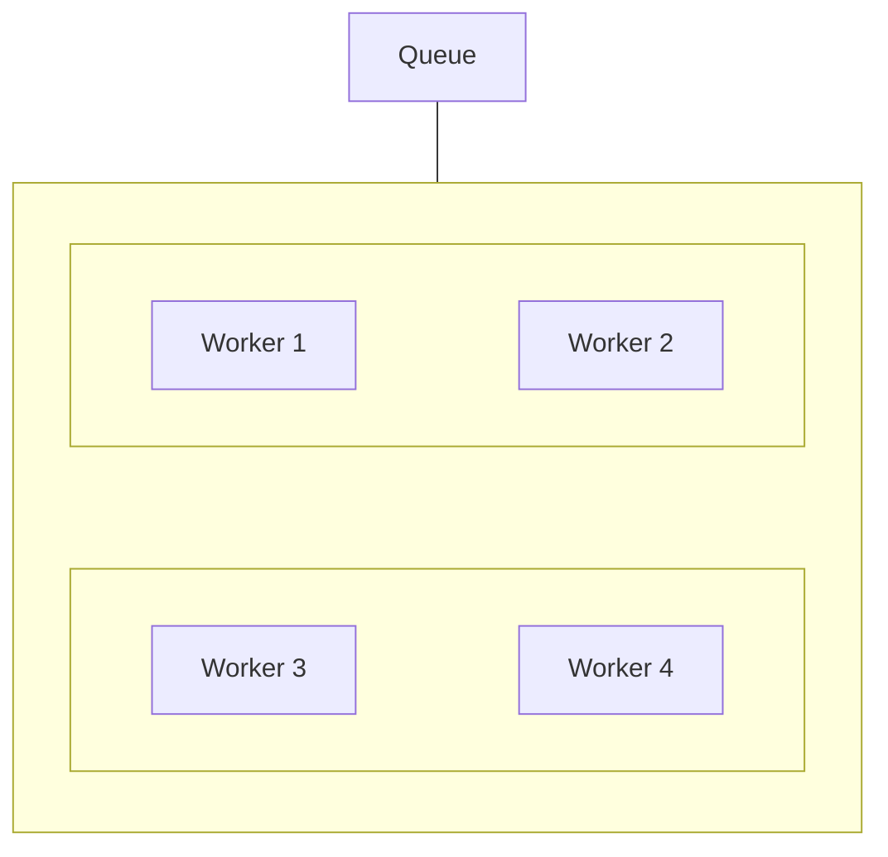

This allows the processing capacity to scale independently from the web application.

---

# 13. Burst Absorption

Queues are particularly useful when work arrives unevenly.

Suppose:

```text
Normal traffic:
100 jobs/minute

Peak:
5,000 jobs/minute
```

The system does not necessarily need 50× permanent worker capacity.

Instead:

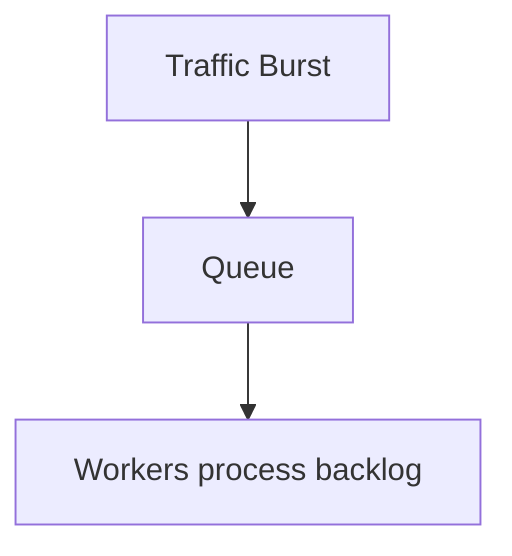

The queue absorbs the temporary difference between:

```text
Incoming Work
      vs
Processing Capacity
```

This concept becomes important when we study **backpressure** later.

---

# 14. Queue Backlog

A queue is not magic.

Suppose:

```text
Incoming = 1,000 jobs/sec
Workers  =   500 jobs/sec
```

Then backlog grows.

```text
Queue
100
200
300
400
500
...
```

The system is receiving work faster than it can process it.

Eventually:

- memory/storage may fill
- latency increases
- jobs may expire
- users may wait too long
- downstream systems may become overloaded

Therefore, asynchronous systems need monitoring and capacity planning.

---

# 15. Asynchronous Work and Failure Isolation

Suppose an email provider fails.

### Synchronous

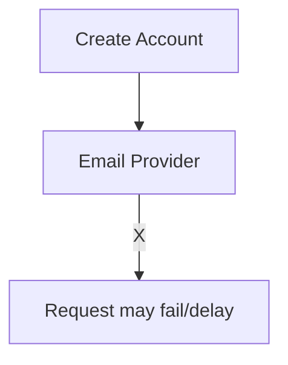

The external dependency directly affects the request.

### Asynchronous

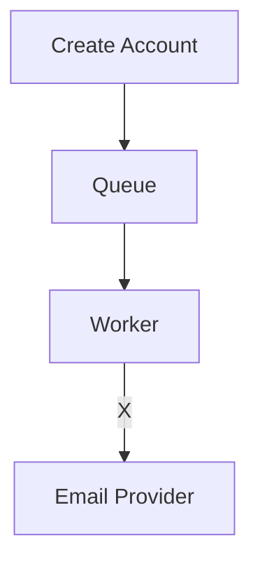

The job can remain in the queue and be retried later.

This creates a useful separation:

```text
User Request
      ≠
Background Dependency
```

However, this only works if the queued job is durable and failure handling is designed correctly.

---

# 16. Asynchronous Work Introduces New Problems

Async is not automatically better.

It introduces additional system behavior.

### Delayed results

The user may have to wait for background completion.

### Duplicate processing

A job may be delivered more than once.

### Ordering

Jobs may not always be processed in the order expected.

### Retries

A failed job may need to run again.

### Monitoring

The system must track work after the original request has finished.

### Failure recovery

A worker may crash halfway through processing.

### User experience

The UI needs to represent:

```text
Queued
Processing
Completed
Failed
```

These problems form much of Level 5.

---

# 17. Synchronous Does Not Mean One Server

A synchronous architecture can still be distributed.

Example:

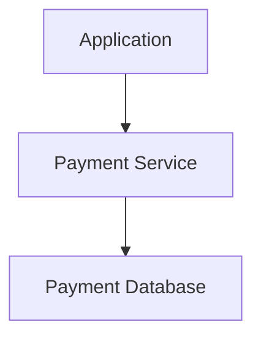

The application waits for the payment service.

That is synchronous even though multiple machines may be involved.

Similarly, asynchronous work can occur inside a single application.

The distinction is about **coordination and waiting**, not the number of servers.

---

# 18. Asynchronous Does Not Mean Parallel

These terms are related but different.

### Asynchronous

The caller does not wait for completion.

### Parallel

Multiple operations execute at the same time.

Example:

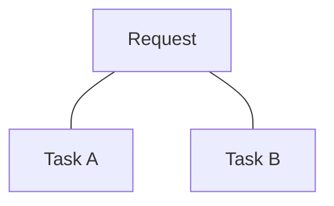

Tasks A and B might execute concurrently.

But asynchronous work does not automatically mean parallel execution.

A queue with one worker is asynchronous:

```text
Queue → Worker
```

but only one job may be processed at a time.

---

# 19. Choosing Synchronous or Asynchronous

A useful decision process:

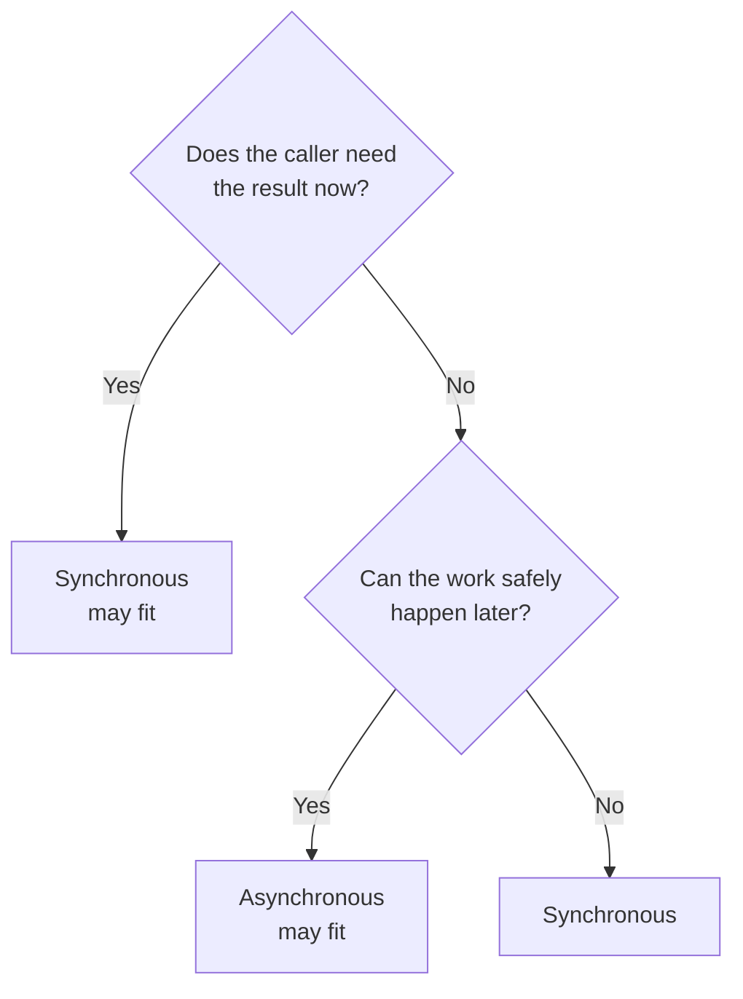

Then ask:

- Can the user tolerate delay?
- Can the work be retried?
- What happens if it fails?
- Does ordering matter?
- Can duplicate processing be tolerated?
- How much backlog is acceptable?
- Does the result need to be immediately visible?

---

# 20. Example — Image Upload

Suppose a user uploads:

```text
photo.jpg
```

The application needs to:

- store the original
- generate thumbnails
- optimize the image
- create metadata
- update search/indexing

A synchronous design could be:

```mermaid
flowchart TD
  accTitle: Synchronous image upload
  accDescr: Upload, then Store, then Resize, then Optimize, then Index, then Response.
  N0["Upload"] --> N1["Store"] --> N2["Resize"] --> N3["Optimize"] --> N4["Index"] --> N5["Response"]
```

This could make the upload request unnecessarily long.

An asynchronous design could be:

```mermaid
flowchart TD
  accTitle: Asynchronous image upload
  accDescr: Upload, store original, queue processing, response; later a worker resizes, optimizes and creates metadata.
  U["Upload"] --> S["Store Original"] --> Q["Queue Processing"] --> R["Response"]
  Q -.-> W["Worker"] --- G
  subgraph G[" "]
    direction TB
    I0["Resize"] ~~~ I1["Optimize"] ~~~ I2["Metadata"]
  end
```

Now the user can receive a quick upload acknowledgement while processing continues.

---

# 21. Example — Report Generation

A user requests:

```text
Generate annual sales report
```

The report might require:

- millions of database rows
- aggregation
- formatting
- PDF generation
- file storage

Doing all of this synchronously could keep the HTTP request open for a long time.

An asynchronous architecture:

```mermaid
flowchart TD
  accTitle: Asynchronous report generation
  accDescr: Request, then Create Report Job, then Queue, then Worker, then Generate Report, then Store File, then Mark Complete.
  N0["Request"] --> N1["Create Report Job"] --> N2["Queue"] --> N3["Worker"] --> N4["Generate Report"] --> N5["Store File"] --> N6["Mark Complete"]
```

The user can later receive:

```text
Report ready.
```

---

# 22. Asynchronous Work and HTTP

HTTP itself does not automatically make an operation synchronous or asynchronous.

An API can expose asynchronous work explicitly.

Example:

```text
POST /reports
```

Response:

```text
202 Accepted
```

with a job identifier:

```text
job_id = 12345
```

The client can later request:

```text
GET /reports/jobs/12345
```

Possible states:

```text
queued
processing
completed
failed
```

This is one common way to model asynchronous operations at the API boundary.

---

# 23. Asynchronous Work and User Experience

The frontend must understand that:

```text
Request accepted
```

does not necessarily mean:

```text
Work completed
```

A useful state flow is:

```mermaid
flowchart TD
  accTitle: Successful job states
  accDescr: Submitted, then Queued, then Processing, then Completed.
  N0["Submitted"] --> N1["Queued"] --> N2["Processing"] --> N3["Completed"]
```

or:

```mermaid
flowchart TD
  accTitle: Failed job states
  accDescr: Submitted, then Queued, then Processing, then Failed, then Retry / Recovery.
  N0["Submitted"] --> N1["Queued"] --> N2["Processing"] --> N3["Failed"] --> N4["Retry / Recovery"]
```

This makes asynchronous behavior visible and understandable to users.

---

# 24. A More Complete Architecture

A typical asynchronous architecture can look like:

```mermaid
flowchart TD
  accTitle: A more complete asynchronous architecture
  accDescr: Users, application, (submit work) queue, workers 1, 2 and 3, then the external system.
  U["Users"] --> A["Application"] -->|"submit work"| Q["Queue"] --> W1["Worker<br/>1"] & W2["Worker<br/>2"] & W3["Worker<br/>3"]
  W1 & W2 & W3 --> E["External System"]
```

The queue separates:

```text
Request Traffic
```

from:

```text
Background Processing
```

This separation is one of the most important ideas in asynchronous architecture.

---

# 25. Synchronous vs Asynchronous: Trade-Offs

| Aspect | Synchronous | Asynchronous |
|---|---|---|
| Caller waits | Yes | Usually no |
| Immediate result | Natural | Often delayed |
| Architecture | Simpler initially | More components |
| Failure propagation | Immediate | Can be isolated |
| Retry | Often request-level | Can be background |
| Burst handling | Limited by request capacity | Queue can absorb bursts |
| Monitoring | Simpler | More involved |
| Ordering | Often easier | Must be designed |
| Duplicate work | Usually simpler | Must consider |
| User experience | Immediate response/result | Status may be needed |

---

# 26. Common Mistakes

### Mistake 1 — "Async means faster"

It mainly moves work outside the caller's waiting path.

### Mistake 2 — "Everything should be asynchronous"

Some operations require an immediate result.

### Mistake 3 — "A queue solves capacity problems"

A queue can absorb bursts, but persistent overload creates an ever-growing backlog.

### Mistake 4 — "Accepted means completed"

An asynchronous API may only confirm that work was accepted.

### Mistake 5 — Ignoring duplicate processing

Workers may process the same job more than once.

### Mistake 6 — Ignoring failure recovery

Background work needs retry and recovery strategies.

### Mistake 7 — Confusing asynchronous with parallel

An asynchronous system can process jobs sequentially.

---

# 27. Hands-On Exercise — Classify the Work

Classify each operation as **synchronous**, **asynchronous**, or **depends on requirements**.

| Operation | Likely Choice |
|---|---|
| Validate login credentials | Synchronous |
| Read current account balance | Synchronous |
| Send welcome email | Asynchronous |
| Generate a large report | Asynchronous |
| Create an order | Synchronous |
| Update analytics | Asynchronous |
| Generate image thumbnails | Asynchronous |
| Process a payment | Depends on requirements |
| Update search index | Often asynchronous |
| Send push notification | Often asynchronous |

The important question is not memorizing the table.

Ask:

> **Does the caller need this work completed before it can safely continue?**

---

# 28. Lab Challenge — Design an Order Flow

Design an architecture for:

> A customer places an order. The system must create the order, send an email, update analytics, and generate an invoice.

Start with:

```mermaid
flowchart TD
  accTitle: Starting point
  accDescr: Customer, then Application.
  N0["Customer"] --> N1["Application"]
```

Decide which work belongs in the immediate request and which can happen afterward.

One reasonable design:

```mermaid
flowchart TD
  accTitle: One reasonable order design
  accDescr: Customer, application: create order, queue email, queue analytics, queue invoice, then response. The queue feeds the email, analytics and invoice workers.
  C["Customer"] --> A["Application"] --- G
  subgraph G[" "]
    direction TB
    I0["Create Order"] ~~~ I1["Queue Email"] ~~~ I2["Queue Analytics"] ~~~ I3["Queue Invoice"]
  end
  G --> R["Response"]
  R ~~~ Q["Queue"]
  Q --- H
  subgraph H[" "]
    direction TB
    J0["Email Worker"] ~~~ J1["Analytics Worker"] ~~~ J2["Invoice Worker"]
  end
```

The exact design depends on whether the business requires the invoice to exist before the response.

---

# 29. System Design View

The most useful question is:

> **What work must happen before the system can safely respond, and what work can happen afterward?**

This leads to:

```mermaid
flowchart TD
  accTitle: Immediate and deferrable paths
  accDescr: Business requirement, required immediate work, synchronous path, response. Non-critical / deferrable work, asynchronous path, queue, workers.
  S0["Business Requirement"] --> S1["Required Immediate Work"] --> S2["Synchronous Path"] --> S3["Response"]
  A0["Non-Critical / Deferrable Work"] --> A1["Asynchronous Path"] --> A2["Queue"] --> A3["Workers"]
  S3 ~~~ A0
```

A good asynchronous design therefore starts with **business requirements**, not with a desire to add queues.

---

# 30. The Core Trade-Off

Synchronous systems optimize for:

```mermaid
flowchart TD
  accTitle: What synchronous systems optimize for
  accDescr: Immediate result, then Simple request flow.
  N0["Immediate result"] --> N1["Simple request flow"]
```

Asynchronous systems optimize for:

```text
Decoupling
   +
Burst absorption
   +
Independent processing
   +
Failure isolation
```

But asynchronous systems introduce:

```text
Delay
+
State tracking
+
Retries
+
Duplicates
+
Ordering
+
Monitoring
+
Recovery
```

The architecture should accept this complexity only when it provides a useful system-level benefit.

---

# 31. Key Principle

> **Synchronous work keeps the caller waiting for completion; asynchronous work separates submitting the work from completing it. Asynchronous processing is valuable when work can safely happen later, allowing systems to decouple request latency from background processing—but it introduces queues, retries, ordering, duplicate processing, monitoring, and recovery concerns.**

---

# 32. Quick Reference

```mermaid
flowchart TD
  accTitle: Synchronous vs asynchronous quick reference
  accDescr: Synchronous: caller, work, result, continue. Asynchronous: caller, submit work, continue; then queue, worker, complete.
  subgraph S["Synchronous"]
    direction TB
    S0["Caller"] --> S1["Work"] --> S2["Result"] --> S3["Continue"]
  end
  subgraph A["Asynchronous"]
    direction TB
    A0["Caller"] --> A1["Submit Work"] --> A2["Continue"]
    A1 -.-> A3["Queue"] --> A4["Worker"] --> A5["Complete"]
  end
  S3 ~~~ A0
```

### Remember

Ask:

> **"Does the caller need the result now?"**

If yes, synchronous processing may be appropriate.

If no, ask:

> **"Can this work safely happen later?"**

If yes, asynchronous processing may be appropriate.

---

# 33. Knowledge Check

1. What is synchronous work?
2. What is asynchronous work?
3. Does asynchronous processing automatically make work faster?
4. Why are queues commonly used with asynchronous systems?
5. What is the difference between request latency and completion latency?
6. Why can asynchronous processing improve failure isolation?
7. Why can a queue absorb traffic bursts?
8. What happens if workers process slower than work arrives?
9. Is asynchronous work always parallel?
10. Why must asynchronous systems consider duplicate processing?
11. Why can asynchronous processing complicate the user experience?
12. What question should you ask before making work asynchronous?

---

# 34. Remember

The simplest mental model is:

```text
Synchronous
"Do this, then tell me the result."

Asynchronous
"Accept this work; finish it later."
```

The architectural question is not:

> **"Should my system be synchronous or asynchronous?"**

It is:

> **"Which parts of this system need immediate completion, and which parts can safely happen later?"**

---

# 35. Next Chapter

## 05.02 — Why Queues Exist

Next we will examine the problem that queues solve:

- Why producers and consumers become decoupled
- Traffic bursts
- Processing-speed mismatch
- Buffering
- Queue backlog
- Work distribution
- Failure isolation
- Retry implications
- Queue capacity
- Queue latency
- What happens when consumers are slower than producers
- When a queue helps
- When a queue only hides the problem
- Practical examples
- Hands-on queue exercise
- System-design trade-offs
