# 05.02 — Why Queues Exist

## Learning Objectives

By the end of this chapter, you should understand:

- What a queue is
- Why queues exist in system architecture
- How queues separate producers from consumers
- How queues absorb traffic bursts
- Why queues help asynchronous processing
- What a queue backlog means
- How queues provide failure isolation
- What queues do **not** solve
- When introducing a queue is useful and when it adds unnecessary complexity

---

## Core Concept

A **queue** is a place where work waits until a worker is ready to process it.

Without a queue:

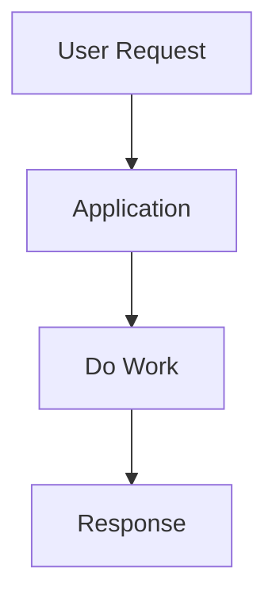

The application must handle the work immediately.

With a queue:

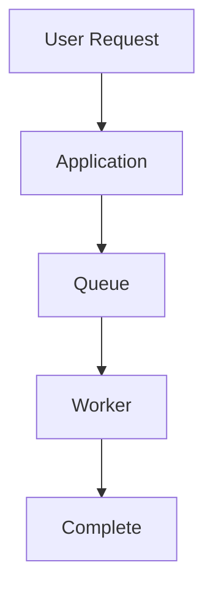

The application can accept the work without waiting for the worker to finish it.

### The main reason queues exist

> **Queues allow systems to separate the arrival of work from the processing of work.**

This separation creates several useful properties:

- work can wait
- producers and consumers can operate at different speeds
- traffic bursts can be absorbed
- workers can scale independently
- temporary failures can be isolated
- long-running work can move out of the request path

---

# 1. What Is a Queue?

Imagine a line at a bank.

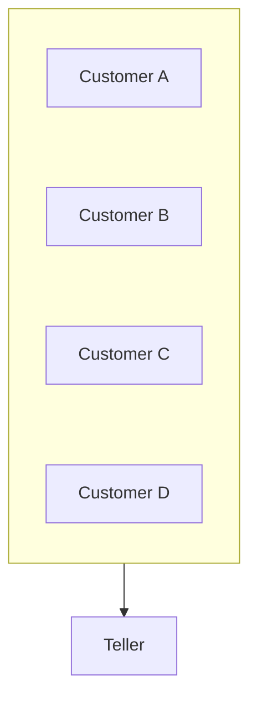

Customers arrive at different times, but the teller processes them one at a time.

A software queue works similarly:

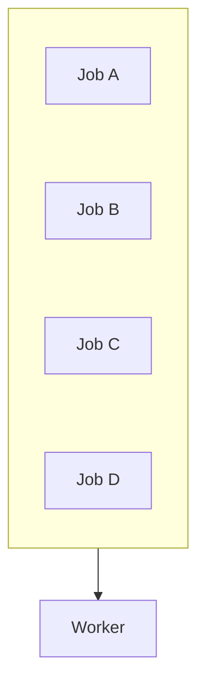

The jobs wait until a worker can process them.

A queue therefore has two important sides:

```text
Producer → Queue → Consumer
```

Where:

- **Producer** creates or submits work.
- **Queue** holds the work.
- **Consumer/Worker** processes the work.

---

# 2. Why Not Process Everything Immediately?

Suppose an e-commerce application receives an order.

After payment, several things may need to happen:

```text
Create Order
Send Email
Generate Invoice
Update Analytics
Notify Warehouse
Send SMS
```

Some of these operations may not need to finish before the user receives the order confirmation.

If everything happens synchronously:

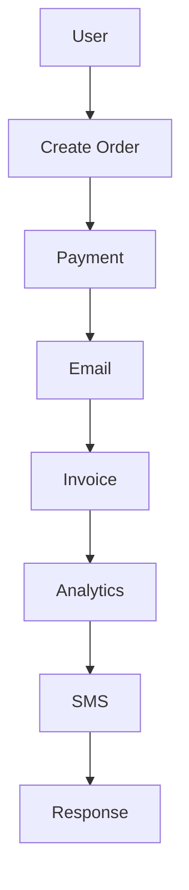

The user waits for every operation.

Instead:

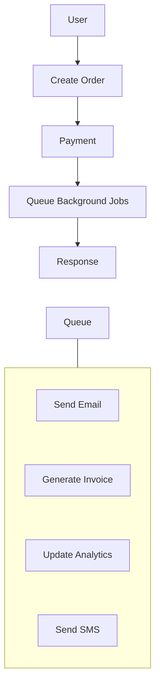

Now the request path contains only the work that must happen immediately.

---

# 3. Queue as a Buffer

One of the most important purposes of a queue is **buffering**.

Imagine workers can process:

```text
100 jobs/second
```

But a sudden traffic spike produces:

```text
500 jobs/second
```

Without a queue:

```text
Incoming: 500/s
Processing: 100/s

400 jobs/s cannot be processed immediately
```

With a queue:

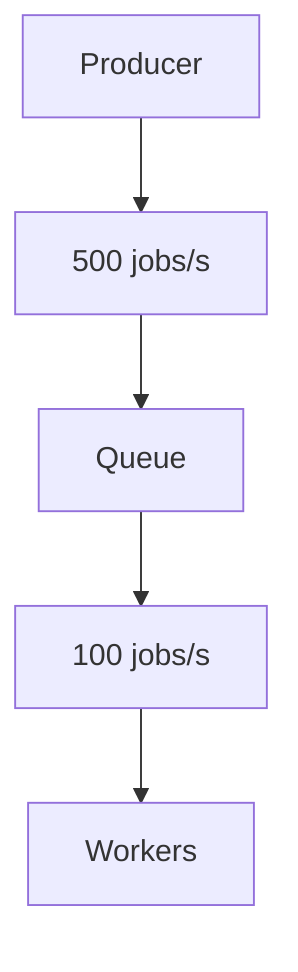

The extra work waits.

This is called **queue backlog**.

```text
Incoming Work
      ↓
   [QUEUE]
████████████
      ↓
  Workers
```

The queue temporarily absorbs the difference between arrival rate and processing rate.

---

# 4. Queue Backlog

A backlog occurs when work arrives faster than it is processed.

For example:

```text
Arrival rate   = 1,000 jobs/s
Worker capacity =   700 jobs/s
```

The difference is:

```text
1,000 - 700 = 300 jobs/s
```

So the backlog grows by roughly 300 jobs per second while that imbalance continues.

This is important:

> **A queue can absorb a temporary overload, but it cannot permanently fix insufficient processing capacity.**

If:

```text
Arrival rate > Processing capacity
```

for long enough, the queue eventually becomes too large.

Possible consequences include:

- increasing job latency
- memory/storage pressure
- delayed processing
- expired jobs
- user-visible delays
- queue capacity problems

---

# 5. Queues Absorb Bursts

Consider a report-generation system.

Normal traffic:

```text
100 reports/minute
```

At the end of the month:

```text
5,000 reports/minute
```

It may be wasteful to permanently run enough workers for the maximum spike.

Instead:

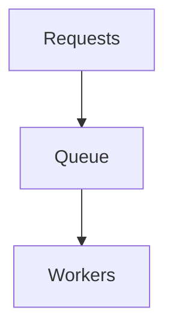

During normal traffic:

```text
Queue: █
Workers: 2
```

During a spike:

```text
Queue: █████████████████
Workers: 20
```

The system can temporarily scale workers to reduce the backlog.

This is one reason queues are useful in scalable architectures.

---

# 6. Producer and Consumer Can Run at Different Speeds

Without a queue:

```text
Producer → Consumer
```

The producer and consumer are tightly connected.

With a queue:

```text
Producer → Queue → Consumer
```

They can operate independently.

For example:

```text
Producer:
1,000 jobs/s

Queue:
stores pending jobs

Workers:
700 jobs/s
```

The queue provides a temporary separation between those rates.

This is sometimes called **rate decoupling**.

---

# 7. Queues Decouple Components

A queue can also reduce direct dependency between services.

Without a queue:

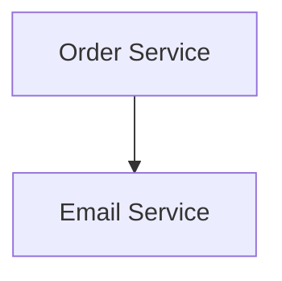

If the Email Service is slow:

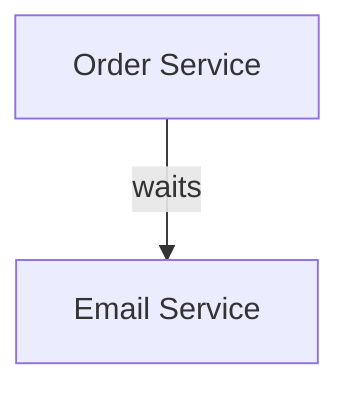

The order request may become slow.

With a queue:

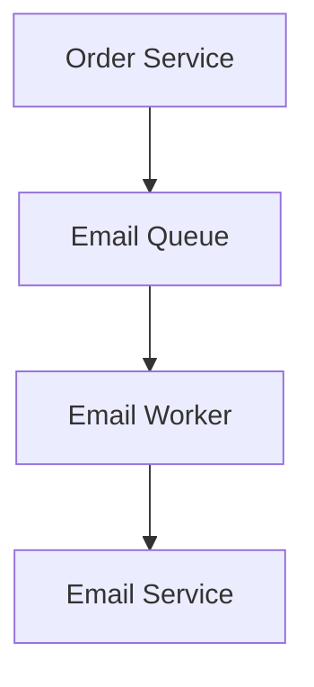

The Order Service only needs to successfully submit the job.

The email can be processed later.

This creates **temporal decoupling**.

The producer does not require the consumer to finish immediately.

---

# 8. Queues Provide Failure Isolation

Suppose the email provider is temporarily unavailable.

The job can remain pending or be retried later.

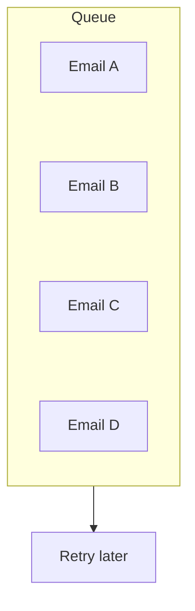

This can prevent a temporary downstream failure from immediately breaking the user's request.

However, the queue itself must be reliable enough to preserve the work.

---

# 9. Queue + Worker

A queue normally works together with workers.

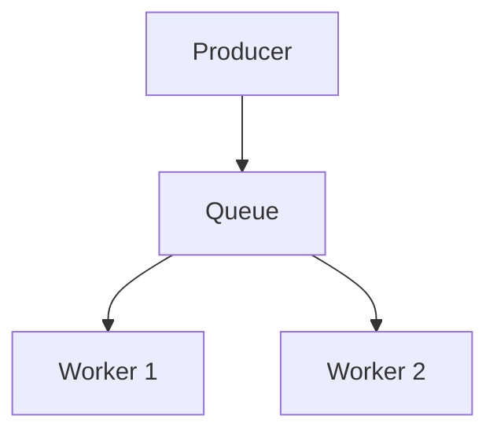

Multiple workers can process jobs concurrently.

For example:

```text
Queue
 ├── Job A → Worker 1
 ├── Job B → Worker 2
 ├── Job C → Worker 3
 └── Job D → Worker 1
```

This allows processing capacity to increase by adding workers.

That becomes important in the next chapters.

---

# 10. Queue Does Not Mean Infinite Capacity

A common beginner misconception is:

> "If we add a queue, the system can handle unlimited traffic."

It cannot.

A queue is storage for pending work.

Suppose:

```text
Incoming = 10,000 jobs/s
Workers = 1,000 jobs/s
```

The queue may temporarily absorb the difference.

But eventually:

```text
Queue
████████████████████████████
████████████████████████████
████████████████████████████
```

The backlog keeps growing.

The real solution may require:

- more workers
- faster workers
- fewer jobs
- batching
- rate limiting
- better downstream capacity
- dropping non-critical work
- changing the architecture

This connects directly to **backpressure**, which comes later in this level.

---

# 11. Queue Latency

Queues introduce another form of latency:

**waiting time**.

Suppose:

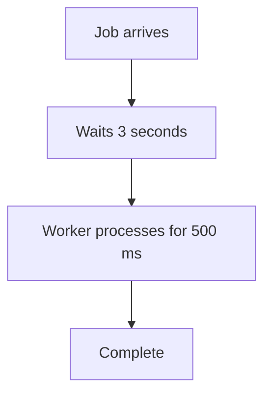

Total completion time is approximately:

```text
3 sec waiting
+
0.5 sec processing
=
3.5 sec
```

So asynchronous processing can make the user's request faster while making the actual job completion later.

This is an important distinction:

```text
Request latency
≠
Job completion latency
```

---

# 12. Queue Depth

A useful operational metric is **queue depth**.

Queue depth means:

> How much work is currently waiting to be processed?

For example:

```text
Queue depth = 20
```

means approximately 20 jobs are waiting, depending on the queue's semantics and whether jobs are currently being processed.

A growing queue can indicate:

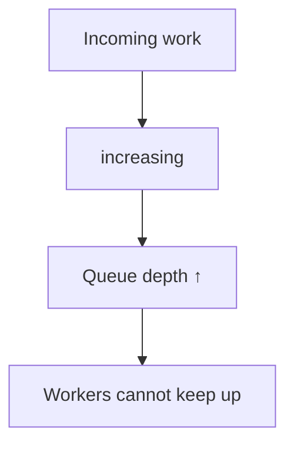

A healthy system should monitor more than just whether the queue is "up."

Useful metrics include:

- queue depth
- oldest job age
- processing rate
- failure rate
- retry count
- worker utilization
- job latency

---

# 13. Queue Depth vs Queue Age

Queue depth alone can be misleading.

Imagine:

```text
Queue depth = 100
```

That might be normal if workers process jobs quickly.

But:

```text
Oldest job = 30 minutes old
```

is a much stronger signal that processing is falling behind.

Therefore:

> **How long work has been waiting can matter as much as how much work is waiting.**

A useful mental model is:

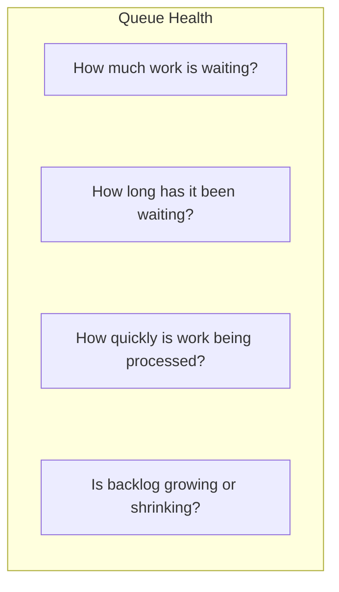

---

# 14. What Happens When a Worker Fails?

Suppose:

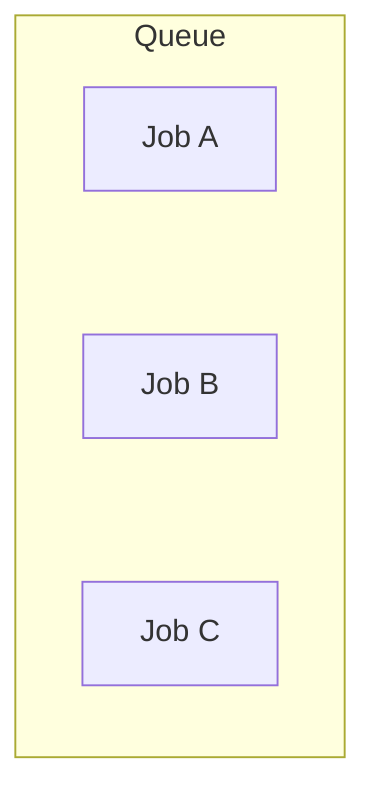

Worker receives Job A:

```text
Job A → Worker
```

The worker crashes before completing it.

A robust queue system needs a mechanism to determine whether Job A should become available again.

This introduces concepts such as:

- acknowledgements
- visibility timeouts
- retries
- redelivery
- dead-letter queues

These topics are covered later in Level 5.

The important idea here is:

> **Putting work into a queue does not automatically guarantee that the work will be processed exactly once or successfully.**

---

# 15. Queues and Durability

There is an important difference between:

```text
Temporary memory buffer
```

and:

```text
Durable queue
```

If queued jobs exist only in volatile memory:

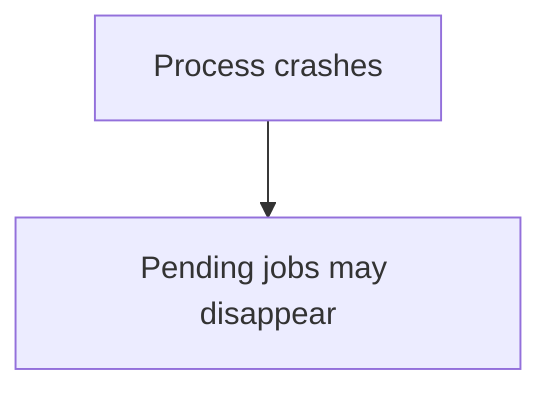

A durable queue is designed to preserve messages across appropriate failures.

Therefore, when designing a queue, ask:

> **Can we afford to lose this job?**

For example:

| Work | Losing it acceptable? |
|---|---|
| Analytics event | Sometimes |
| Welcome email | Usually undesirable |
| Payment instruction | Generally unacceptable |
| Critical order update | Generally unacceptable |
| Temporary UI event | Sometimes |

The answer depends on business requirements.

---

# 16. Queue Ordering

Many queues process work in arrival order:

```text
A → B → C → D
```

But distributed systems can make ordering more complicated.

For example, if multiple workers process jobs simultaneously:

```text
A → Worker 1
B → Worker 2
```

Job B may finish before Job A.

```text
Submitted:
A → B

Completed:
B → A
```

Therefore:

> **Submission order does not automatically guarantee completion order.**

Whether ordering matters depends on the application.

For example:

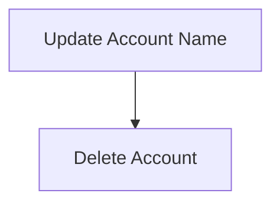

Processing these in the wrong order could create a correctness problem.

Ordering will be studied explicitly in **05.09 — Message Ordering**.

---

# 17. Queue vs Direct API Call

Consider:

```text
Service A → Service B
```

A direct call may be appropriate when:

- the result is required immediately
- the operation is short
- failure should be immediately visible
- the caller cannot safely continue without the result

A queue may be appropriate when:

- work can happen later
- processing may take a long time
- traffic arrives in bursts
- the consumer may temporarily be unavailable
- work needs retrying
- producer and consumer should scale independently

The decision is not:

> "Queues are better."

The real question is:

> **Does this work need to happen now, or can it safely happen later?**

---

# 18. Example — Image Processing

A user uploads an image.

The system needs to generate:

- thumbnail
- WebP version
- multiple resolutions
- metadata
- moderation result

Doing everything inside the upload request may be expensive.

Instead:

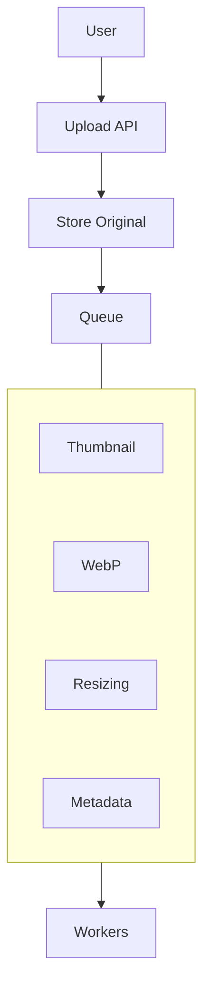

The user can receive:

```text
Upload accepted
```

while processing continues.

---

# 19. Queue and Scaling

Queues allow workers to scale independently.

Suppose:

```mermaid
flowchart TD
  accTitle: One worker
  accDescr: Queue, then Worker 1.
  N0["Queue"] --> N1["Worker 1"]
```

Processing is too slow.

Add workers:

```mermaid
flowchart TD
  accTitle: Adding workers
  accDescr: The queue feeds workers 1, 2, 3 and 4.
  Q["Queue"] --- G
  subgraph G[" "]
    direction TB
    subgraph G1[" "]
      direction LR
      W1["Worker 1"] ~~~ W2["Worker 2"]
    end
    subgraph G2[" "]
      direction LR
      W3["Worker 3"] ~~~ W4["Worker 4"]
    end
    G1 ~~~ G2
  end
```

Now more jobs can be processed concurrently.

This gives a simple scaling model:

```mermaid
flowchart TD
  accTitle: A simple scaling model
  accDescr: More backlog, then Need more processing capacity, then Add workers.
  N0["More backlog"] --> N1["Need more processing capacity"] --> N2["Add workers"]
```

But this only works while the underlying work and downstream dependencies can safely support more concurrency.

Adding workers blindly can overload:

- databases
- APIs
- storage
- external providers
- CPU
- memory

So:

> **Worker scaling must respect downstream capacity.**

---

# 20. Queues Introduce Complexity

Queues solve some problems by introducing others.

| Benefit | New concern |
|---|---|
| Burst absorption | Backlog |
| Async processing | Delayed completion |
| Failure isolation | Retry handling |
| Independent scaling | Worker coordination |
| Durable work | Storage requirements |
| Decoupling | Harder debugging |
| Retries | Duplicate processing |
| Parallel workers | Ordering |
| Temporary buffering | Capacity planning |

This is why a queue should not be added simply because it is a common system-design component.

---

# 21. When a Queue May Not Be Necessary

A queue may be unnecessary when:

- the operation is short
- the result is required immediately
- traffic is predictable
- direct service communication is sufficient
- the system is small
- retrying is simpler at the request layer
- introducing asynchronous processing would create more complexity than value

For example:

```text
Browser → API → Database
```

does not automatically need:

```text
Browser → API → Queue → Worker → Database
```

Architecture should follow the actual problem.

---

# 22. Hands-On Exercise — Model a Queue

You do not need RabbitMQ, Kafka, or another broker for this exercise.

First model the architecture:

```mermaid
flowchart TD
  accTitle: Model the architecture
  accDescr: Producer, then Queue, then Worker.
  N0["Producer"] --> N1["Queue"] --> N2["Worker"]
```

Assume:

```text
Producer rate = 100 jobs/s
Worker rate   = 80 jobs/s
```

### Step 1 — Calculate the backlog growth

```text
100 - 80 = 20 jobs/s
```

The queue grows by approximately:

```text
20 jobs/s
```

while those rates remain constant.

### Step 2 — Change the worker capacity

Suppose:

```text
Producer = 100 jobs/s
Workers  = 120 jobs/s
```

Now:

```text
120 - 100 = 20 jobs/s
```

The workers can process faster than jobs arrive, so the backlog can shrink if work is already waiting.

### Step 3 — Introduce a burst

Suppose:

```text
Normal traffic = 100 jobs/s
Burst           = 300 jobs/s
Worker capacity = 120 jobs/s
```

During the burst:

```text
300 - 120 = 180 jobs/s
```

of additional backlog accumulates.

Ask:

1. Is the burst temporary?
2. How large can the queue become?
3. How long can jobs wait?
4. Can more workers be started?
5. Can the downstream database handle those workers?
6. What happens if the worker fails?

---

# 23. Lab Challenge — Design an Async Email System

Design this system:

> A website sends a welcome email after user registration.

Requirements:

- registration should remain responsive
- email may be delayed
- email provider can temporarily fail
- email should be retried
- multiple workers may process emails

Draw:

```mermaid
flowchart TD
  accTitle: An async email system
  accDescr: User, then Registration API, then Database, then Queue, then Email Workers, then Email Provider.
  N0["User"] --> N1["Registration API"] --> N2["Database"] --> N3["Queue"] --> N4["Email Workers"] --> N5["Email Provider"]
```

Then answer:

### Question 1

Why is email a good candidate for asynchronous processing?

### Question 2

What happens if the email provider is unavailable?

### Question 3

What happens if the worker crashes?

### Question 4

Can two workers process the same email?

### Question 5

How would you know that email processing is falling behind?

Think about:

```text
Queue depth
Oldest job age
Processing rate
Failure rate
Retry rate
```

The detailed answers belong to later chapters covering workers, delivery semantics, retries, idempotency, and dead-letter queues.

---

# 24. System Design View

Queues are fundamentally about **decoupling time**.

Without a queue:

```mermaid
flowchart TD
  accTitle: Without a queue
  accDescr: The producer must interact with the consumer now.
  P["Producer"] --- C["must interact with Consumer now"]
```

With a queue:

```mermaid
flowchart TD
  accTitle: With a queue
  accDescr: Producer, then Queue, then Consumer.
  N0["Producer"] --> N1["Queue"] --> N2["Consumer"]
```

The producer and consumer no longer need to complete the entire interaction at the same moment.

This enables:

- asynchronous processing
- burst absorption
- independent scaling
- failure isolation
- retryable work
- workload smoothing

But it also introduces:

- backlog
- delayed completion
- duplicate processing
- ordering concerns
- monitoring requirements
- recovery complexity

The architectural value comes from the **separation**, not from the queue itself.

---

# 25. Common Mistakes

### Mistake 1 — "A queue makes the system faster"

Not necessarily.

A queue can make the **request** faster by moving work outside the request path.

The queued job itself may complete later.

---

### Mistake 2 — "A queue solves overload"

Only temporarily.

If:

```text
Arrival rate > Processing rate
```

for long enough, backlog grows.

---

### Mistake 3 — "A queue guarantees exactly-once processing"

Not automatically.

Delivery and processing semantics depend on the queue system and consumer design.

---

### Mistake 4 — "Async means parallel"

Not necessarily.

Asynchronous work can still be processed by one worker.

---

### Mistake 5 — "More workers are always better"

More workers can overload downstream systems.

---

### Mistake 6 — "Every background task needs a queue"

Small applications may not need this complexity.

---

### Mistake 7 — "Queue depth is the only important metric"

A queue with 100 jobs may be healthy or severely delayed.

Measure **age and processing rate** too.

---

# Key Principle

> **A queue separates the arrival of work from the processing of work. It can absorb temporary bursts, allow independent worker scaling, isolate temporary failures, and move non-critical work out of the request path. But a queue does not create unlimited capacity—it introduces backlog, latency, ordering, retry, durability, and operational concerns that the system must explicitly handle.**

---

# Quick Reference

| Concept | Meaning |
|---|---|
| Producer | Creates/submits work |
| Queue | Holds pending work |
| Consumer | Receives work |
| Worker | Processes work |
| Backlog | Work waiting to be processed |
| Queue depth | Amount of pending work |
| Queue age | How long work has been waiting |
| Burst absorption | Temporarily buffering sudden load |
| Temporal decoupling | Producer and consumer need not finish together |
| Durable queue | Designed to preserve queued work across appropriate failures |
| Worker scaling | Increasing processing capacity |
| Queue latency | Time spent waiting before processing |

### Core Flow

```mermaid
flowchart TD
  accTitle: Core flow
  accDescr: Producer, then Queue, then Worker, then Complete.
  N0["Producer"] --> N1["Queue"] --> N2["Worker"] --> N3["Complete"]
```

### Main Reason

```text
Arrival of Work
       ≠
Processing of Work
```

The queue exists between them.

---

# Knowledge Check

### 1. What is the primary purpose of a queue?

A. Make databases faster  
B. Separate work arrival from work processing  
C. Replace the application server  
D. Eliminate failures

**Answer:** B

---

### 2. What happens when work arrives faster than workers can process it?

**Answer:** Queue backlog grows.

---

### 3. Does a queue permanently solve insufficient processing capacity?

**Answer:** No. It can absorb temporary overload, but sustained overload causes backlog growth.

---

### 4. Does asynchronous processing always make the actual work complete faster?

**Answer:** No. It can reduce request latency while increasing or separating job completion latency.

---

### 5. Why can queues help with temporary downstream failures?

**Answer:** Work can remain queued and be processed or retried when the downstream dependency becomes available.

---

### 6. Does adding more workers always improve the system?

**Answer:** No. Workers consume resources and may overload downstream dependencies.

---

# Remember

```text
Queue = Work Waiting

Producer → Queue → Worker
```

A queue is useful when:

```text
Work can happen later
        +
Producer and consumer should be decoupled
```

The most important question is:

> **Can this work safely wait?**

If yes, a queue may be a useful architectural tool.

---

# Next Chapter

## 05.03 — Message Queue

Next, we will look more closely at the **message queue itself**:

- What a message is
- What a queue stores
- Producer and consumer
- Enqueue and dequeue
- Message acknowledgement
- Visibility
- Queue semantics
- Durable vs non-durable queues
- Multiple consumers
- Competing consumers
- Queue depth
- Message retention
- Basic queue architecture
- Failure scenarios
- Hands-on message queue exercise
