# 05.03 — Message Queue

## Learning Objectives

By the end of this chapter, you should understand:

- What a message queue is
- What a message contains
- Producer, queue, consumer, and worker roles
- Enqueue and dequeue
- How messages wait for processing
- How multiple consumers share work
- Acknowledgements and message completion
- Durable vs non-durable queues
- Message retention
- Queue depth and message age
- Basic queue failure scenarios
- When a message queue is useful

---

# Core Concept

A **message queue** is a system that stores messages until consumers are ready to process them.

The basic architecture is:

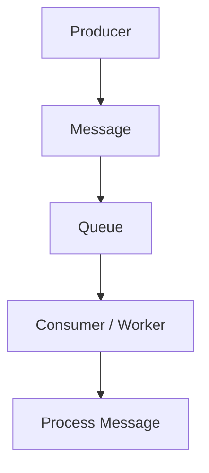

For example:

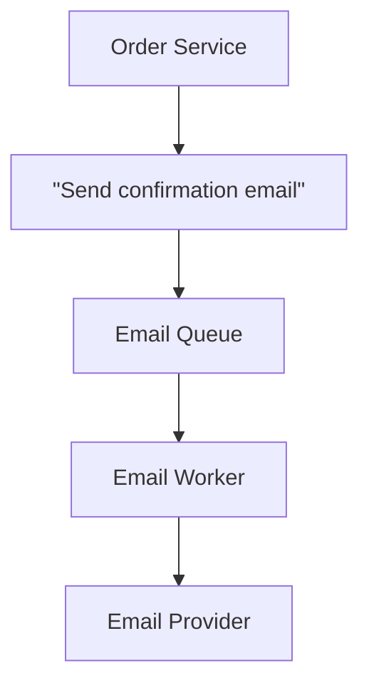

The queue separates the producer from the consumer.

The producer does not need to wait for the consumer to finish processing the message.

---

# 1. What Is a Message?

A **message** is a piece of information sent between components.

For example:

```json
{
  "type": "send_email",
  "user_id": 1024,
  "email": "user@example.com"
}
```

The message tells the consumer what work needs to happen.

A message may contain:

- an event
- a command
- an identifier
- parameters
- metadata
- timestamps
- correlation information

The exact structure depends on the application.

---

# 2. Message vs Work

A useful distinction:

**Message**

> Information describing something that was sent.

**Work**

> The processing that happens because of that message.

For example:

```text
Message:
"Generate invoice for order 5001"

Work:
Create the invoice PDF
Store it
Update the order
```

The queue primarily stores the **message**.

A worker interprets that message and performs the corresponding work.

---

# 3. Producer

The **producer** creates and sends messages.

Example:

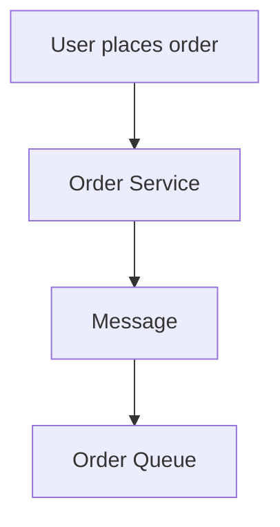

The Order Service is the producer.

A producer could be:

- web application
- backend service
- scheduled job
- another worker
- serverless function

A queue does not care whether the producer is a browser, PHP application, Node.js service, or another system, as long as it follows the queue's interface.

---

# 4. Queue

The queue holds messages waiting to be processed.

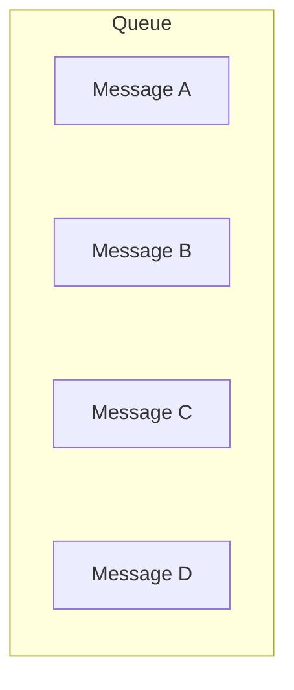

Messages can wait because:

- no worker is available
- workers are busy
- traffic temporarily increased
- downstream processing is slow
- processing is intentionally delayed

This waiting area is the key architectural value of the queue.

---

# 5. Consumer

A **consumer** receives messages from the queue.

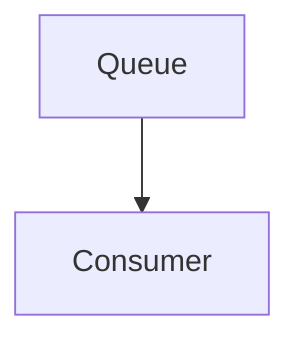

The consumer decides what to do with the message.

In many systems, the consumer is a **worker**:

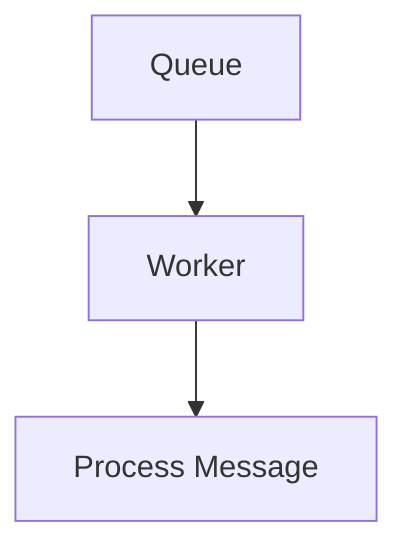

The terms are related but not identical:

- **Consumer** describes the role of receiving messages.
- **Worker** usually describes a process or component that performs background work.

A worker can therefore act as a consumer.

---

# 6. Enqueue and Dequeue

Two common terms are:

### Enqueue

Putting a message into the queue.

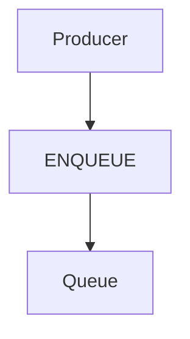

### Dequeue

Removing or delivering a message from the queue for processing.

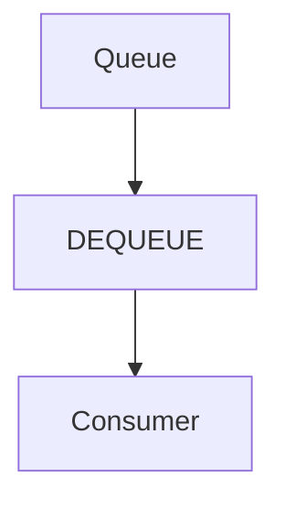

Conceptually:

```text
Enqueue:
A → B → C

Queue:
[A][B][C]

Dequeue:
[A] → Consumer
```

Real queue systems may use more sophisticated delivery and acknowledgement mechanisms than simply removing a message immediately.

---

# 7. Basic Message Lifecycle

A simplified lifecycle looks like:

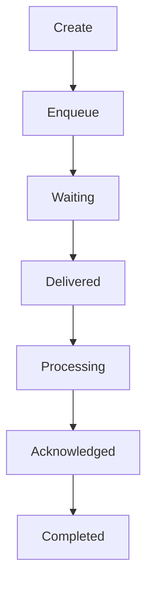

This lifecycle is important because failure can occur at almost every stage.

For example:

```text
Enqueue ❌
Delivery ❌
Processing ❌
Acknowledgement ❌
```

Later chapters will examine these failure cases in more detail.

---

# 8. Acknowledgement

A queue often needs to know whether a consumer successfully processed a message.

A simplified flow:

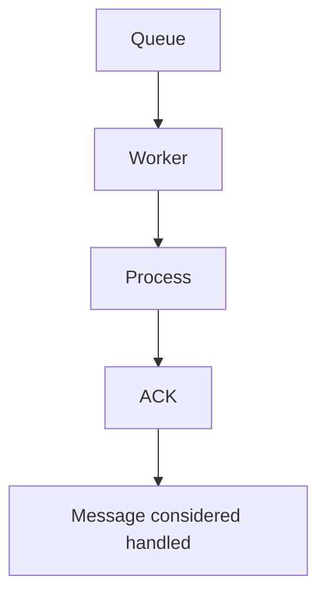

**ACK** means acknowledgement.

It tells the queue something similar to:

> "I successfully handled this message."

If processing fails:

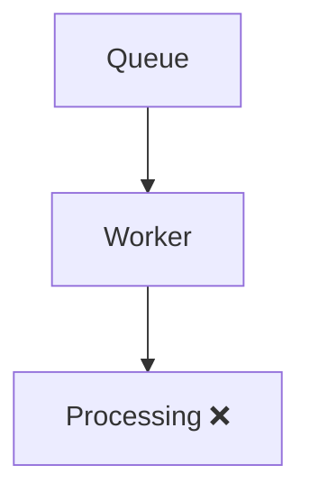

the message may need to become available again.

This can lead to:

```text
Retry
Redelivery
Dead-lettering
```

These are covered later.

---

# 9. Why Not Delete the Message Immediately?

Suppose the queue removes a message immediately when a worker receives it:

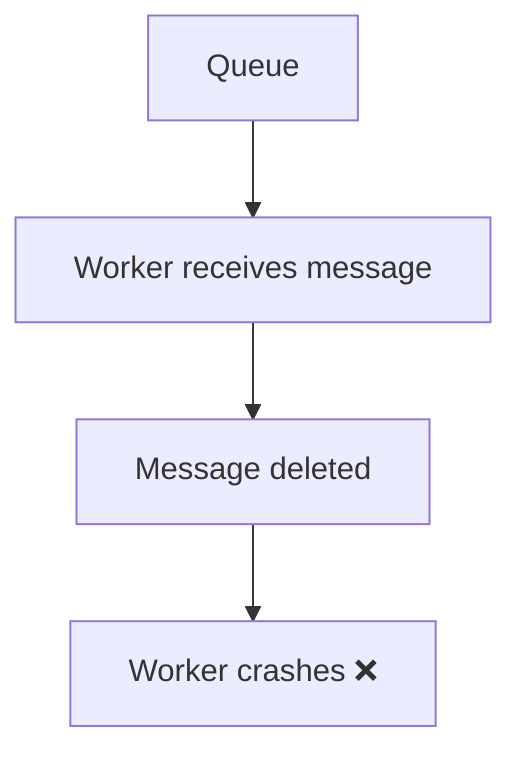

The work may be lost.

A more reliable design can keep the message associated with in-progress processing until the worker confirms success.

Conceptually:

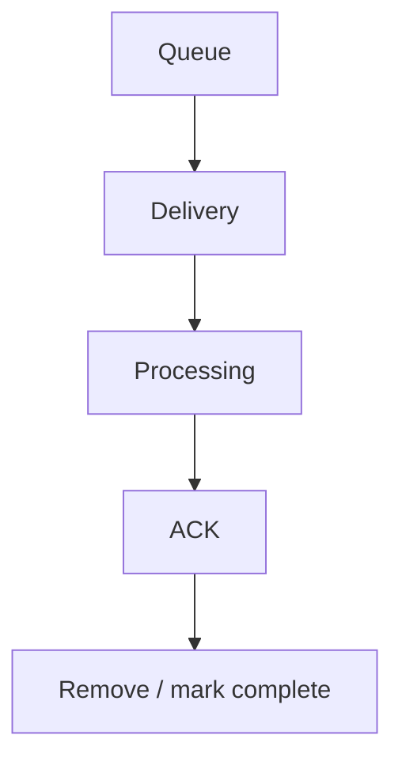

The exact mechanism differs between queue technologies.

Some use acknowledgements; others use visibility timeouts, leases, or similar mechanisms.

---

# 10. Multiple Consumers

A queue can have multiple consumers.

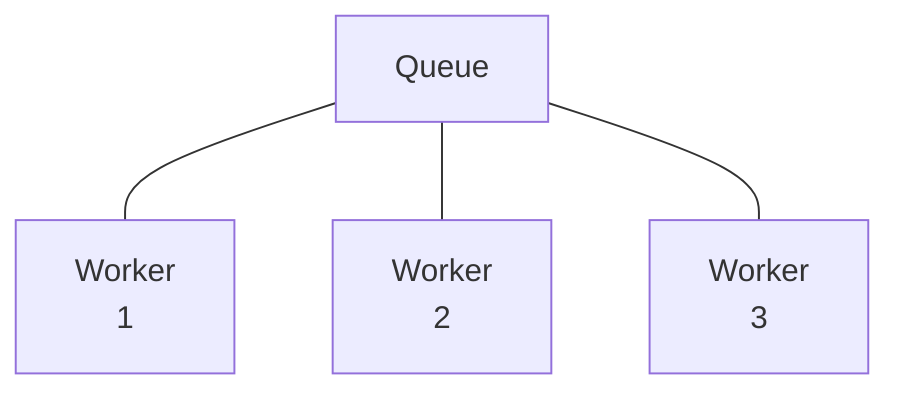

The workers can share the workload.

For example:

```text
Queue
 ├── Job A → Worker 1
 ├── Job B → Worker 2
 ├── Job C → Worker 3
 ├── Job D → Worker 1
 └── Job E → Worker 2
```

This is commonly called the **competing consumers** pattern.

It allows processing capacity to increase by adding consumers.

---

# 11. Competing Consumers

Imagine:

```text
Queue = 1,000 jobs
```

with:

```text
Worker 1
```

If one worker processes 100 jobs/second, capacity is roughly:

```text
100 jobs/s
```

Adding workers may provide:

```text
Worker 1 → 100/s
Worker 2 → 100/s
Worker 3 → 100/s
Worker 4 → 100/s
```

Potential capacity:

```text
≈ 400 jobs/s
```

assuming the work scales well and downstream dependencies can handle the additional load.

This is not guaranteed linear scaling.

---

# 12. One Message Should Usually Have One Intended Processor

Consider:

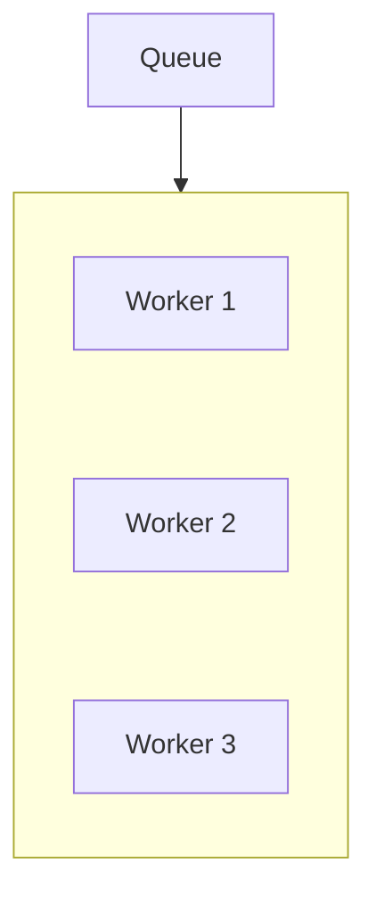

For a normal work queue, a message is generally delivered to one competing consumer at a time.

For example:

```text
Job A → Worker 1
```

rather than:

```text
Job A → Worker 1
Job A → Worker 2
Job A → Worker 3
```

If multiple independent consumers need to receive the same event, a **pub/sub** architecture is usually more appropriate.

That distinction becomes important in:

**05.06 — Pub/Sub**

---

# 13. Queue Ordering

A queue may preserve some ordering guarantees.

A simple FIFO queue means:

```text
First In
   ↓
First Out

A → B → C → D
```

But ordering becomes more complicated with:

- multiple workers
- retries
- failures
- partitions
- parallel processing

Therefore:

> **Queue order and processing-completion order are not necessarily the same thing.**

Detailed ordering is intentionally covered later in **05.09 — Message Ordering**.

---

# 14. Durable vs Non-Durable Queues

One important distinction is whether queued messages survive failures.

### Non-durable / volatile

Conceptually:

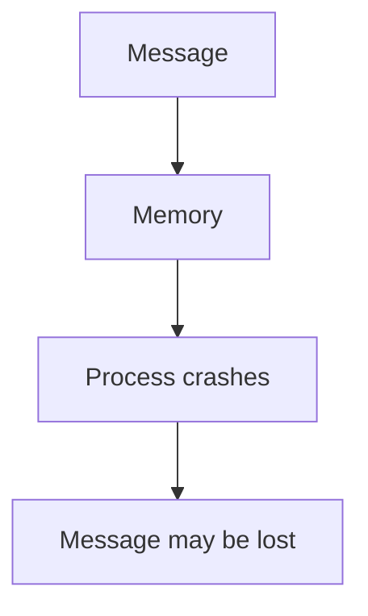

### Durable

Conceptually:

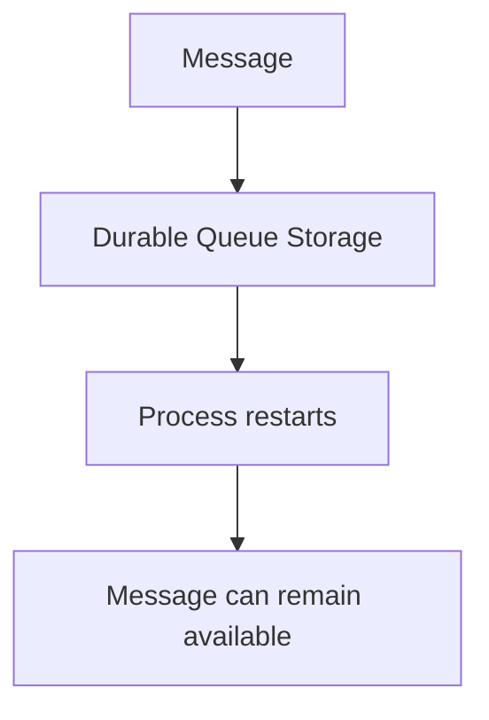

Durability has a cost.

It may require:

- persistent storage
- replication
- additional I/O
- recovery mechanisms

Therefore, durability should match the importance of the message.

---

# 15. Message Retention

A queue may retain messages for a configured period.

For example:

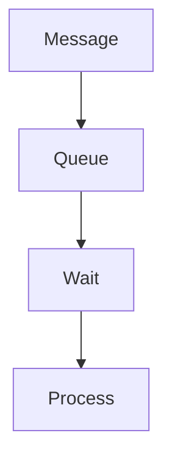

If a message remains unprocessed too long, the system may:

- keep it
- expire it
- move it elsewhere
- reject it
- dead-letter it

Retention policies matter because queues are not necessarily permanent storage systems.

A queue should generally not become an unlimited archive.

---

# 16. Message Age

Queue depth should be combined with **message age**.

Example:

```text
Queue depth = 50
Oldest message = 2 seconds
```

may be healthy.

But:

```text
Queue depth = 50
Oldest message = 45 minutes
```

indicates a serious processing delay.

Useful queue metrics include:

| Metric | What it tells you |
|---|---|
| Queue depth | How much work is waiting |
| Oldest message age | How long work has waited |
| Processing rate | How quickly workers consume |
| Failure rate | How often processing fails |
| Retry count | How often messages return |
| Processing latency | How long processing takes |

---

# 17. What Happens When a Consumer Crashes?

Consider:

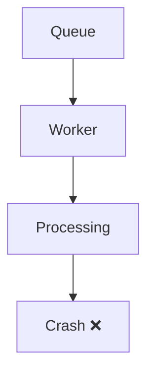

The system must determine what happens to the message.

Possible approaches include:

```text
Retry
Redeliver
Delay
Dead-letter
Discard
```

The correct choice depends on the message and failure.

For example:

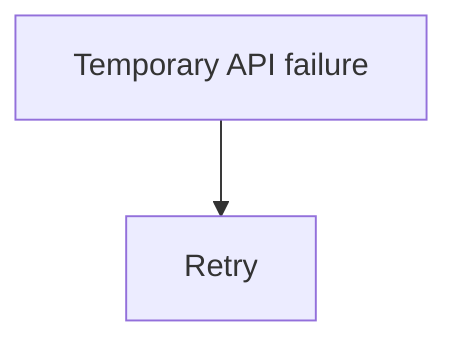

while:

```mermaid
flowchart TD
  accTitle: Invalid message
  accDescr: Invalid message, then Dead-letter / investigate.
  N0["Invalid message"] --> N1["Dead-letter / investigate"]
```

This distinction becomes central in later chapters.

---

# 18. Duplicate Processing

Suppose:

```mermaid
flowchart TD
  accTitle: A lost acknowledgement
  accDescr: Queue, then Worker, then Process successfully, then ACK fails ❌.
  N0["Queue"] --> N1["Worker"] --> N2["Process successfully"] --> N3["ACK fails ❌"]
```

The queue may not know that processing actually succeeded.

It may deliver the message again:

```mermaid
flowchart TD
  accTitle: Redelivery
  accDescr: Message A, then Worker, then Processed, then ACK lost, then Message A delivered again.
  N0["Message A"] --> N1["Worker"] --> N2["Processed"] --> N3["ACK lost"] --> N4["Message A delivered again"]
```

Now the work may happen twice.

This is one reason queue consumers often need **idempotency**.

Detailed idempotency is covered in:

**05.11 — Idempotency**

---

# 19. Queue vs Database Table

A beginner may ask:

> "Why not just put pending jobs into a database table?"

You can.

For small systems, a database-backed job table can be perfectly reasonable.

For example:

```text
jobs
----------------
id
type
payload
status
created_at
```

Workers can poll it.

But dedicated queue systems are designed specifically for message delivery and workload coordination.

They may provide features such as:

- efficient message delivery
- acknowledgements
- visibility/leases
- retries
- message retention
- consumer coordination
- delivery semantics
- high-throughput processing

The correct choice depends on workload and operational requirements.

---

# 20. Message Queue vs Pub/Sub

These concepts are related but serve different communication patterns.

### Message Queue

Usually:

```mermaid
flowchart TD
  accTitle: Message queue
  accDescr: Producer, then Queue, then One competing consumer.
  N0["Producer"] --> N1["Queue"] --> N2["One competing consumer"]
```

The message represents work that needs processing.

### Pub/Sub

Usually:

```mermaid
flowchart TD
  accTitle: Pub/sub
  accDescr: The producer publishes to a topic; consumers A, B and C each receive it.
  P["Producer"] --> T["Topic"] --> G
  subgraph G[" "]
    direction TB
    I0["Consumer A"] ~~~ I1["Consumer B"] ~~~ I2["Consumer C"]
  end
```

Multiple independent subscribers can receive the event.

Example:

```text
Order Created
```

could be consumed independently by:

```text
Inventory Service
Analytics Service
Notification Service
```

Pub/sub is covered in **05.06**.

---

# 21. Message Size Matters

Messages should generally contain the information needed to process the work without becoming unnecessarily large.

Instead of:

```json
{
  "entire_order": "...very large object..."
}
```

a message might contain:

```json
{
  "type": "order_created",
  "order_id": 5001
}
```

The worker can retrieve the required data.

But this creates another trade-off:

```mermaid
flowchart TD
  accTitle: A small message
  accDescr: Small message, then Worker needs additional database/API call.
  N0["Small message"] --> N1["Worker needs additional database/API call"]
```

versus:

```mermaid
flowchart TD
  accTitle: A large message
  accDescr: Large message, then More queue storage/network/serialization cost.
  N0["Large message"] --> N1["More queue storage/network/serialization cost"]
```

The right choice depends on consistency, performance, and failure requirements.

---

# 22. What If the Original Data Changes?

Suppose the queue contains:

```json
{
  "order_id": 5001
}
```

The worker processes it five minutes later.

During those five minutes, the order may have changed.

This creates a design question:

> Should the message contain the original data, or should the worker read the current data?

### Option A — Message contains data

```mermaid
flowchart TD
  accTitle: Message contains data
  accDescr: Message, then Worker.
  N0["Message"] --> N1["Worker"]
```

The worker processes the captured information.

### Option B — Message contains an identifier

```mermaid
flowchart TD
  accTitle: Message contains an identifier
  accDescr: Message, then order_id, then Database, then Current order.
  N0["Message"] --> N1["order_id"] --> N2["Database"] --> N3["Current order"]
```

Each approach has different consistency and coupling implications.

There is no universal answer.

---

# 23. Message Queue Is Not a Magic Reliability Layer

A queue itself can fail.

Possible problems include:

- queue unavailable
- storage failure
- lost messages
- duplicate delivery
- backlog growth
- consumer failure
- producer failure
- malformed messages
- poison messages
- network failures

Therefore:

```text
Queue
```

does not automatically mean:

```text
Reliable system
```

Reliability depends on the complete design.

---

# 24. Hands-On Exercise — Build a Simple Queue Model

You can model the concept without installing a message broker.

Create:

```text
Producer
Queue
Worker
```

Use an in-memory array/list as the queue.

Conceptually:

```text
queue = []

Producer:
    add message

Worker:
    take message
    process message
```

Example messages:

```text
send_email:user_101
send_email:user_102
generate_invoice:5001
generate_invoice:5002
```

Expected state:

```mermaid
flowchart TD
  accTitle: Expected queue state
  accDescr: The producer adds four messages to the queue; the worker takes them.
  P["Producer"] --> G
  subgraph G[" "]
    direction TB
    I0["[send_email:user_101]"] ~~~ I1["[send_email:user_102]"] ~~~ I2["[generate_invoice:5001]"] ~~~ I3["[generate_invoice:5002]"]
  end
  G --> W["Worker"]
```

### Exercise

Implement these operations:

```text
enqueue(message)
dequeue()
acknowledge(message)
```

Then simulate:

1. Add five messages.
2. Process one message.
3. Process another message.
4. Simulate a worker failure.
5. Decide whether the failed message should be retried.
6. Display queue depth.
7. Display the oldest waiting message.

The goal is to understand the lifecycle—not to build a production queue.

---

# 25. Lab Challenge — Competing Consumers

Start with:

```text
Queue
 ├── Job A
 ├── Job B
 ├── Job C
 ├── Job D
 └── Job E
```

Add three workers:

```text
Worker 1
Worker 2
Worker 3
```

Create a simple simulation where each worker receives available jobs.

Then observe:

```text
Job A → Worker 1
Job B → Worker 2
Job C → Worker 3
Job D → Worker 1
Job E → Worker 2
```

Now simulate:

```text
Worker 2 crashes
```

Ask:

- What happens to its current message?
- Can another worker process it?
- When should it become available again?
- How do you prevent duplicate processing?
- What happens if the message itself is invalid?

These questions prepare you for later chapters on delivery semantics, retries, and dead-letter queues.

---

# 26. System Design View

A message queue creates a boundary:

```text
             Asynchronous Boundary
                    │
                    ↓
Producer → Message Queue → Consumer
```

Before the queue:

```text
Producer
```

controls when work is submitted.

After the queue:

```text
Consumer
```

controls when work is processed.

This separation allows the architecture to evolve independently.

For example:

```text
Version 1
Producer → Queue → Worker
```

Later:

```mermaid
flowchart TD
  accTitle: More workers later
  accDescr: Producer, queue, then workers 1 to 4.
  P["Producer"] --> Q["Queue"] --> G
  subgraph G[" "]
    direction TB
    I0["Worker 1"] ~~~ I1["Worker 2"] ~~~ I2["Worker 3"] ~~~ I3["Worker 4"]
  end
```

Later still:

```mermaid
flowchart TD
  accTitle: Auto-scaled workers
  accDescr: Producer, then Queue, then Auto-scaled Workers, then Database / APIs / Storage.
  N0["Producer"] --> N1["Queue"] --> N2["Auto-scaled Workers"] --> N3["Database / APIs / Storage"]
```

The queue becomes a coordination point between the arrival and processing rates.

---

# 27. The Core Trade-Off

A message queue gives you:

```text
Decoupling
+
Buffering
+
Independent processing
+
Retry possibilities
+
Independent scaling
```

But you also inherit:

```text
Backlog
+
Delayed completion
+
Duplicate processing
+
Ordering concerns
+
Monitoring
+
Failure recovery
```

The queue is therefore an architectural trade-off.

---

# Key Principle

> **A message queue stores messages between producers and consumers so that work can be processed independently of when it arrives. It provides buffering, decoupling, and a foundation for asynchronous processing, but reliable message processing still requires explicit decisions about acknowledgements, durability, ordering, retries, duplicates, monitoring, and failure recovery.**

---

# Quick Reference

| Term | Meaning |
|---|---|
| Message | Information sent between components |
| Producer | Creates/sends messages |
| Queue | Holds pending messages |
| Consumer | Receives messages |
| Worker | Processes background work |
| Enqueue | Add message to queue |
| Dequeue | Deliver/remove message for processing |
| ACK | Acknowledge successful processing |
| Queue depth | Amount of pending work |
| Message age | How long a message has waited |
| Durable queue | Queue designed to preserve messages across appropriate failures |
| Competing consumers | Multiple workers sharing queue work |
| Backlog | Unprocessed pending messages |
| Pub/Sub | One message/event delivered independently to multiple subscribers |

### Basic Architecture

```mermaid
flowchart TD
  accTitle: Basic architecture
  accDescr: Producer, then Message, then Queue, then Consumer / Worker, then Process, then ACK.
  N0["Producer"] --> N1["Message"] --> N2["Queue"] --> N3["Consumer / Worker"] --> N4["Process"] --> N5["ACK"]
```

---

# Knowledge Check

### 1. What does a message queue store?

**Answer:** Messages waiting to be processed.

### 2. What is the difference between a producer and consumer?

**Answer:** A producer sends messages; a consumer receives them.

### 3. What does ACK mean?

**Answer:** An acknowledgement that the consumer has successfully handled a message.

### 4. Why is immediate message deletion potentially dangerous?

**Answer:** If the worker crashes after deletion but before completing the work, the message may be lost.

### 5. Can multiple workers consume from the same queue?

**Answer:** Yes. This is commonly called competing consumers.

### 6. Does FIFO automatically guarantee that jobs finish in order?

**Answer:** No. Multiple workers can process messages concurrently and finish in a different order.

### 7. Why is queue depth useful?

**Answer:** It shows how much work is waiting and can reveal growing backlog.

### 8. Why can duplicate processing happen?

**Answer:** A message may be processed successfully but its acknowledgement may fail or be lost, causing redelivery.

---

# Remember

```mermaid
flowchart TD
  accTitle: Remember
  accDescr: Producer, then Message, then Queue, then Worker, then Process, then ACK.
  N0["Producer"] --> N1["Message"] --> N2["Queue"] --> N3["Worker"] --> N4["Process"] --> N5["ACK"]
```

The queue answers one fundamental problem:

> **"Where does the work wait when the producer and consumer cannot—or should not—process it at the same time?"**

---

# Next Chapter

## 05.04 — Worker

Next, we will focus on the component that actually **processes queued work**:

- What a worker is
- Worker lifecycle
- Polling vs push-based delivery
- Fetching messages
- Processing messages
- Acknowledgements
- Worker concurrency
- Worker scaling
- Worker crashes
- Graceful shutdown
- Long-running jobs
- Worker health
- Poison messages
- Multiple workers
- Hands-on worker exercise
