# 05.04 — Worker

## Learning Objectives

By the end of this chapter, you should understand:

- What a worker is
- How workers consume messages from queues
- The worker lifecycle
- Polling and message delivery
- Acknowledgements
- Worker concurrency
- Worker scaling
- Worker failures and recovery
- Graceful shutdown
- Long-running jobs
- Poison messages
- Worker health and monitoring
- Why worker design affects the reliability of asynchronous systems

---

# Core Concept

A **worker** is a process or service that performs background work, usually by consuming messages from a queue.

The basic architecture is:

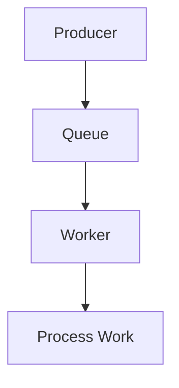

The queue stores the work.

The worker **does the work**.

This distinction is fundamental:

> **Queue = where work waits. Worker = what processes the work.**

---

# 1. What Does a Worker Actually Do?

A simplified worker lifecycle is:

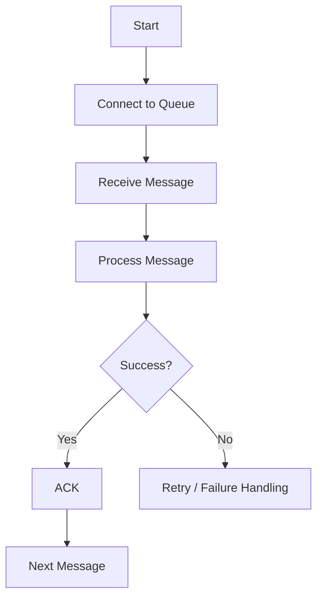

A worker usually repeats this process continuously.

Conceptually:

```text
while running:

    message = receive()

    process(message)

    acknowledge(message)
```

Production workers are more complicated because they must handle failures, timeouts, retries, shutdown, concurrency, and monitoring.

---

# 2. Worker Pulls Work From a Queue

A common model is:

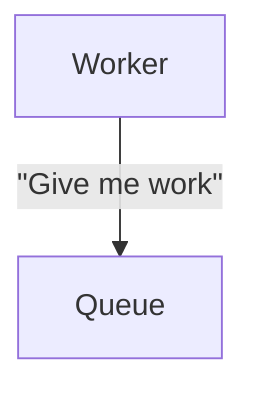

The worker asks the queue for available messages.

This is called **polling** when the worker repeatedly checks for work.

Some queue systems use other delivery mechanisms where the queue pushes or delivers messages to consumers. The exact model depends on the technology.

---

# 3. Polling

Polling means repeatedly checking for work.

A simple model:

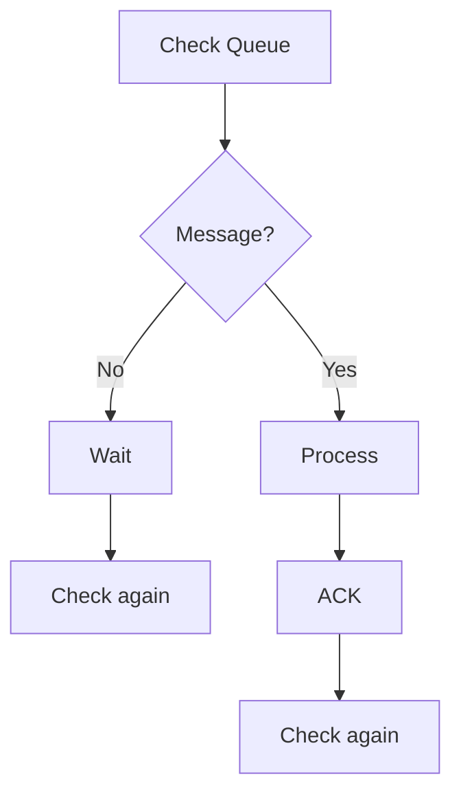

Polling can be:

- inefficient if performed too frequently
- slow to react if performed too infrequently
- expensive if each check creates network overhead

Many queue systems therefore support mechanisms such as **long polling**, where the worker can wait for a message rather than repeatedly making empty requests.

---

# 4. Long Polling

Instead of:

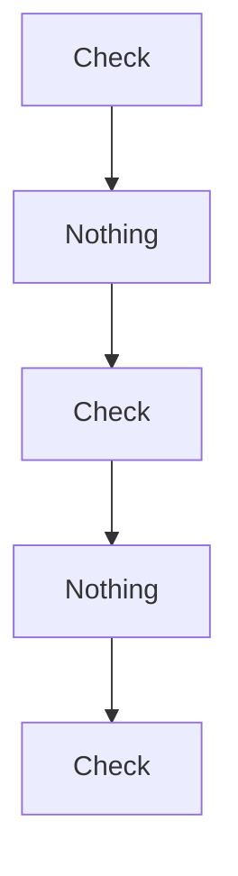

a worker can ask:

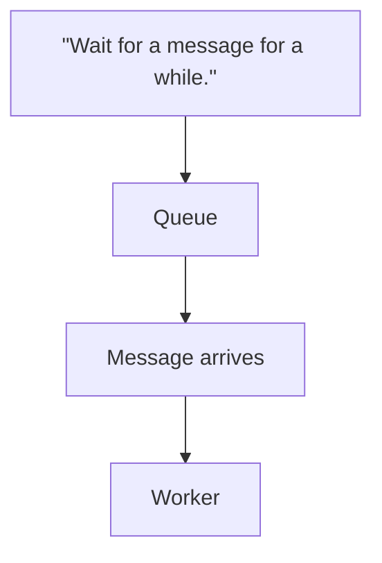

This can reduce unnecessary requests while allowing the worker to receive work promptly.

The exact behavior depends on the queue technology.

---

# 5. Receiving a Message Does Not Mean the Work Is Complete

Consider:

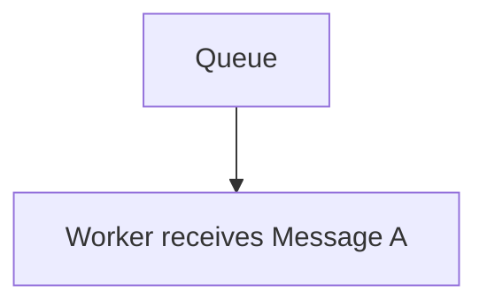

At this point:

```text
Received ≠ Completed
```

The worker still needs to process it.

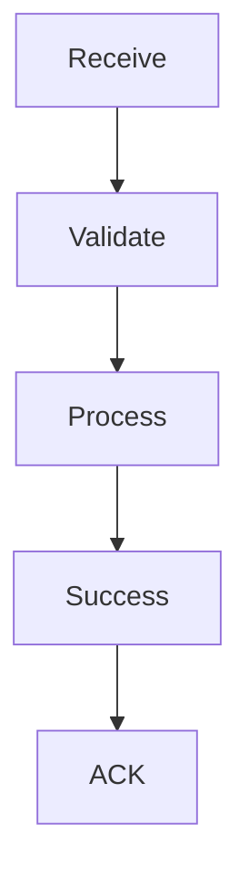

This distinction is important for reliable processing.

---

# 6. Visibility Timeout / Lease

Some queue systems temporarily hide a message after delivering it.

For example:

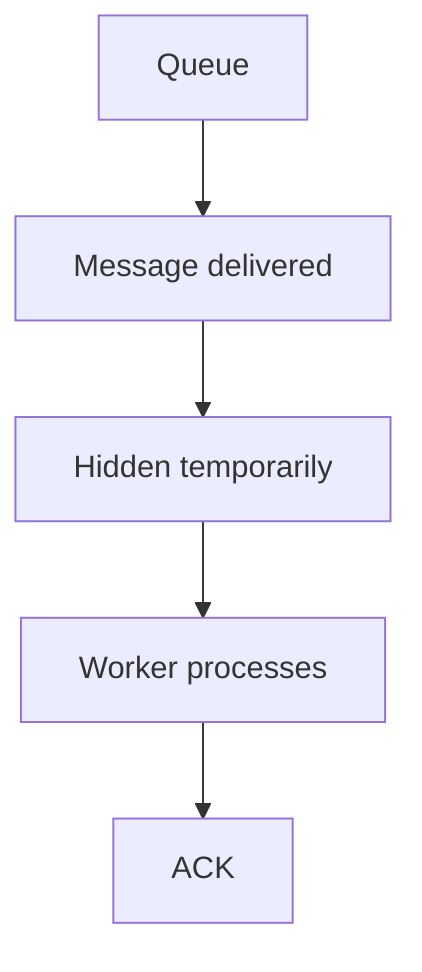

If the worker crashes:

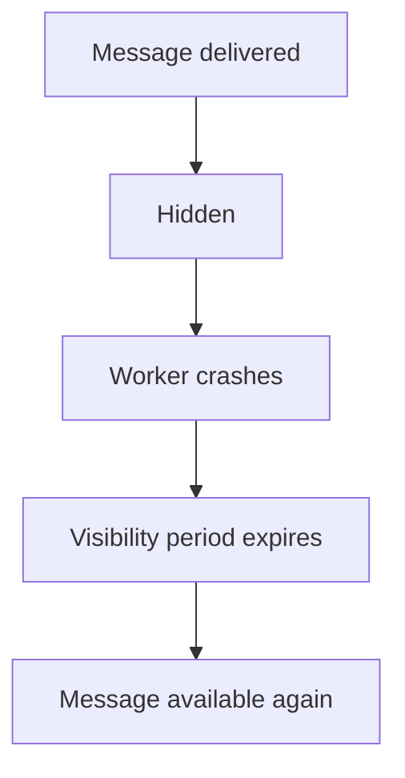

This prevents another worker from immediately processing the same message while the first worker is still working.

The exact terminology differs by technology, but the general idea is:

> **A message can be temporarily reserved for a worker while processing is in progress.**

---

# 7. Worker Processing Time Matters

Suppose a job normally takes:

```text
2 seconds
```

but occasionally takes:

```text
10 minutes
```

This affects:

- concurrency
- worker capacity
- visibility/lease settings
- timeouts
- memory usage
- queue backlog

If a queue assumes a job should finish within 30 seconds but the worker needs 5 minutes, the message could become available again while the original worker is still processing it.

That can cause duplicate processing.

Therefore:

> **Message visibility and worker processing time must be compatible.**

---

# 8. Worker Concurrency

A worker does not necessarily process only one message at a time.

A worker process may use concurrency:

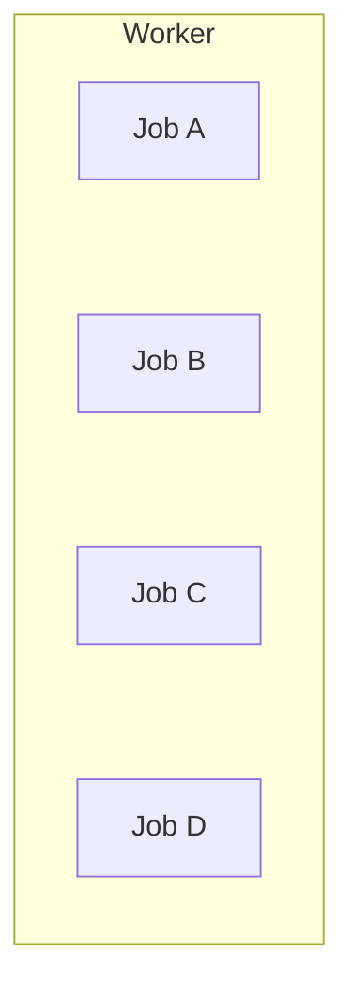

For example:

```text
Worker
 ├── Thread / Task 1 → Job A
 ├── Thread / Task 2 → Job B
 ├── Thread / Task 3 → Job C
 └── Thread / Task 4 → Job D
```

Higher concurrency can increase throughput.

But it can also increase pressure on:

- CPU
- memory
- database connections
- external APIs
- network
- storage

Therefore:

> **More concurrency is not automatically better.**

---

# 9. Worker Scaling

Suppose one worker processes:

```text
100 jobs/s
```

The queue receives:

```text
500 jobs/s
```

One worker cannot keep up.

Add workers:

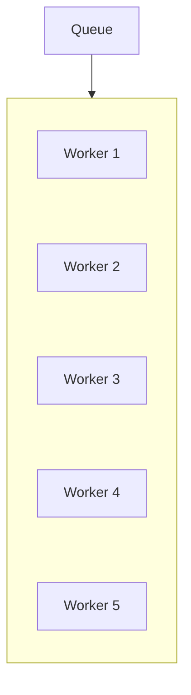

If each can process approximately 100 jobs/s:

```text
5 × 100
≈ 500 jobs/s
```

assuming the workload scales well.

But downstream limits may prevent this ideal result.

---

# 10. Worker Backlog

A worker does not directly control how much work arrives.

```text
Producer
   ↓
Queue ███████████████
   ↓
Workers
```

If workers cannot keep up:

```text
Queue depth ↑
Oldest message age ↑
```

Possible responses:

- add workers
- increase worker concurrency
- optimize processing
- reduce incoming work
- batch operations
- fix downstream bottlenecks
- apply backpressure

---

# 11. Worker Failure vs Job Failure

These are different.

### Worker failure

The worker process crashes.

```text
Worker ❌
```

### Job failure

The worker remains alive, but processing a particular message fails.

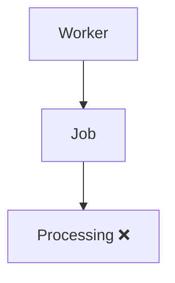

The responses can differ.

A worker crash may affect the current message and other in-progress work.

A job failure may require retrying only that particular message.

---

# 12. Poison Messages

A **poison message** is a message that repeatedly causes processing to fail.

Example:

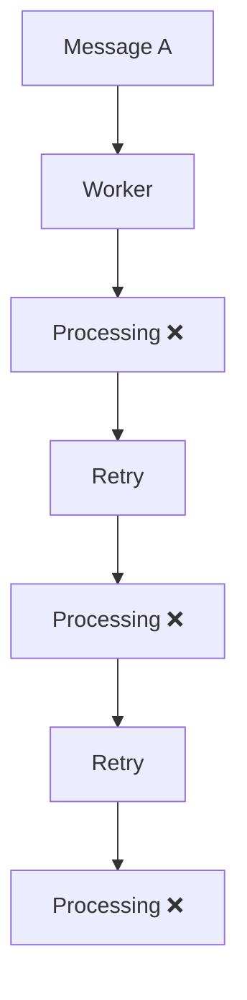

It can consume worker capacity continuously.

A common solution is to limit retries and eventually move the message to a **dead-letter queue**.

Dead-letter queues are covered in **05.13**.

---

# 13. Worker Validation

Workers should not blindly trust incoming messages.

Before processing, a worker may validate:

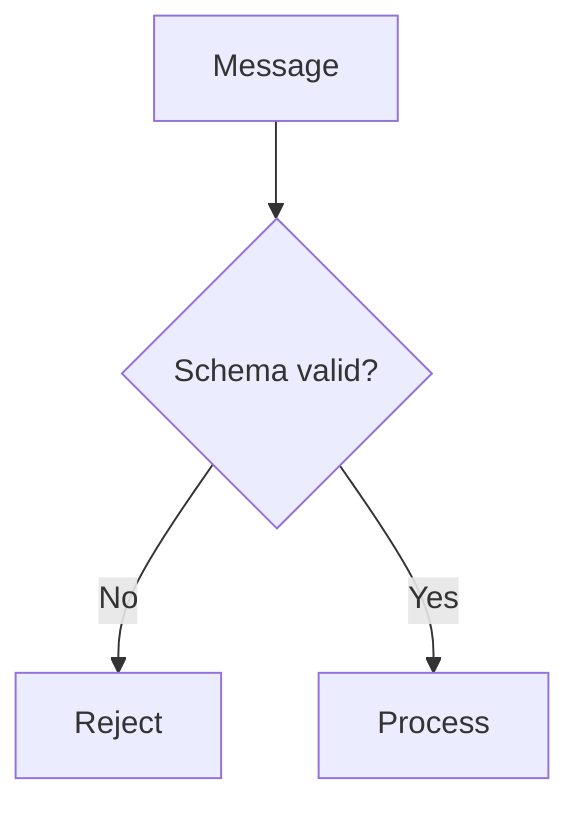

Examples:

- required field missing
- invalid identifier
- unsupported message type
- malformed payload
- invalid data format

Invalid messages should not necessarily be retried indefinitely.

A permanent data problem is different from a temporary infrastructure failure.

---

# 14. Worker Idempotency

A worker may receive the same message more than once.

If processing is not safe to repeat:

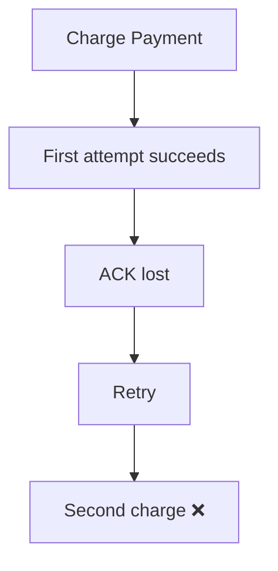

This is why important operations often require **idempotency**.

The detailed topic is:

**05.11 — Idempotency**

---

# 15. Graceful Shutdown

Workers are often long-running processes.

Suppose a worker is processing:

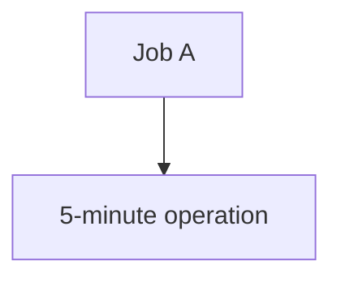

The server needs to restart.

A poor shutdown might do:

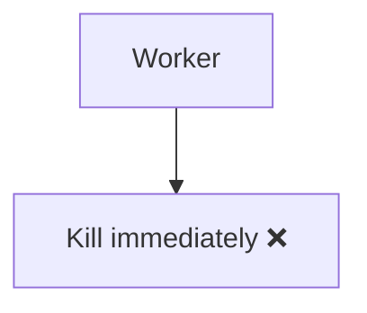

A graceful shutdown can:

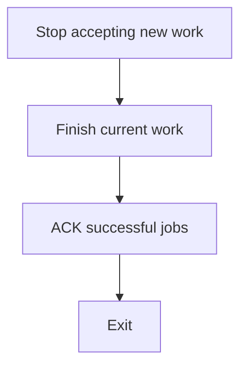

This reduces unnecessary redelivery and partially completed work.

However, graceful shutdown must respect maximum shutdown time and job behavior.

---

# 16. Long-Running Jobs

Some jobs may take seconds.

Others may take minutes or hours.

Examples:

```text
Thumbnail generation     → seconds
Large report             → minutes
Video transcoding        → minutes/hours
Data migration           → hours
```

Long-running jobs create additional concerns:

- visibility timeout
- worker memory
- worker restarts
- progress tracking
- retries
- cancellation
- partial completion
- idempotency

Sometimes a long job should itself be broken into smaller jobs.

For example:

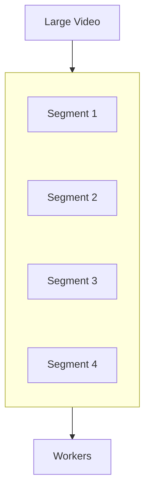

This can improve parallelism and failure recovery, but also increases orchestration complexity.

---

# 17. Worker Health

A worker can be running but still unhealthy.

For example:

```text
Worker process = running
Processing rate = 0
```

Possible causes:

- stuck processing
- database connection problem
- external API timeout
- memory pressure
- deadlock
- queue connection failure

Therefore:

> **Process existence is not the same as worker health.**

Monitor actual work.

Useful metrics include:

- jobs processed
- jobs failed
- processing latency
- throughput
- retry count
- active workers
- worker errors
- CPU/memory
- queue depth
- oldest message age

---

# 18. Worker Health Checks

A basic health check might ask:

```text
Is worker process alive?
```

A stronger operational check may also consider:

```text
Can worker connect to queue?
Can worker receive work?
Can worker process work?
Can worker reach required dependencies?
```

Different systems need different health-check depth.

A health endpoint returning `200 OK` does not necessarily prove that the worker is successfully processing jobs.

---

# 19. Worker Observability

When an asynchronous system fails, debugging is harder because the original request may have already completed.

For example:

```mermaid
flowchart TD
  accTitle: Async failure
  accDescr: User Request, then Queue, then Worker, then Failure.
  N0["User Request"] --> N1["Queue"] --> N2["Worker"] --> N3["Failure"]
```

The user may only know:

> "My report hasn't arrived."

Observability should therefore connect:

```mermaid
flowchart TD
  accTitle: Correlating work
  accDescr: Request, then Job ID, then Message ID, then Worker, then Database / API calls.
  N0["Request"] --> N1["Job ID"] --> N2["Message ID"] --> N3["Worker"] --> N4["Database / API calls"]
```

Useful identifiers include:

- request ID
- job ID
- message ID
- correlation ID

This allows engineers to trace work across asynchronous boundaries.

---

# 20. Worker and Database Connections

Workers often communicate with databases.

Suppose:

```text
10 workers
×
10 DB connections each
=
100 connections
```

If the database supports only:

```text
80 connections
```

the workers can create a connection bottleneck.

This is why worker concurrency and database connection pools must be designed together.

The same principle applies to:

- Redis
- HTTP APIs
- object storage
- message brokers
- third-party services

---

# 21. Worker and Retries

Suppose processing fails temporarily:

```mermaid
flowchart TD
  accTitle: Temporary failure
  accDescr: Worker, then External API, then Temporary failure, then Retry.
  N0["Worker"] --> N1["External API"] --> N2["Temporary failure"] --> N3["Retry"]
```

Retries can improve reliability.

But uncontrolled retries can create:

```mermaid
flowchart TD
  accTitle: Uncontrolled retries
  accDescr: Failure, then Retry, then Failure, then Retry, then Failure, then Retry.
  N0["Failure"] --> N1["Retry"] --> N2["Failure"] --> N3["Retry"] --> N4["Failure"] --> N5["Retry"]
```

This can overload the dependency further.

Later chapters will cover retry strategies and their interaction with queues.

---

# 22. Worker and Timeouts

A worker should not wait forever.

For example:

```text
Worker
  ↓
External API
  ↓
............
............
............
```

If the API never responds, the worker remains occupied.

A timeout allows the worker to stop waiting:

```mermaid
flowchart TD
  accTitle: Timeout
  accDescr: Worker, then API, then Timeout, then Failure handling.
  N0["Worker"] --> N1["API"] --> N2["Timeout"] --> N3["Failure handling"]
```

Timeouts should be chosen with the expected processing time and retry behavior in mind.

---

# 23. Worker and Backpressure

Suppose:

```text
Queue
████████████████████
       ↓
    Workers
       ↓
   Database
       ↓
Database overloaded
```

Adding more workers may make the database problem worse.

The system may instead need to slow down consumption.

This is a form of **backpressure**.

Backpressure asks:

> **How do we prevent a fast producer or consumer group from overwhelming a slower downstream component?**

This will be covered in detail in **05.14 — Backpressure**.

---

# 24. Hands-On Exercise — Build a Worker Loop

You can simulate a worker without installing a message broker.

Create:

```mermaid
flowchart TD
  accTitle: Lab queue
  accDescr: The queue holds jobs A, B, C and D.
  subgraph G["Queue"]
    direction TB
    I0["Job A"] ~~~ I1["Job B"] ~~~ I2["Job C"] ~~~ I3["Job D"]
  end
```

Create a worker loop:

```text
while queue has messages:

    message = dequeue()

    process(message)

    acknowledge(message)
```

Track:

```text
Processed
Failed
Retried
Queue Depth
```

### Simulate these situations

1. Normal processing
2. Worker failure
3. Job failure
4. Retry
5. Duplicate delivery
6. Slow job
7. Empty queue

The objective is to understand the worker lifecycle rather than implement a production queue.

---

# 25. Lab Challenge — Three Workers

Start with:

```mermaid
flowchart TD
  accTitle: Lab queue with six jobs
  accDescr: The queue holds A, B, C, D, E and F.
  subgraph G["Queue"]
    direction TB
    I0["A"] ~~~ I1["B"] ~~~ I2["C"] ~~~ I3["D"] ~~~ I4["E"] ~~~ I5["F"]
  end
```

Add:

```text
Worker 1
Worker 2
Worker 3
```

Simulate:

```text
A → Worker 1
B → Worker 2
C → Worker 3
D → Worker 1
E → Worker 2
F → Worker 3
```

Now simulate:

```text
Worker 2 crashes while processing E
```

Ask:

1. What happens to E?
2. When can another worker receive it?
3. Could E be processed twice?
4. What prevents duplicate side effects?
5. How would you monitor this failure?
6. What happens if E fails repeatedly?

These questions prepare you for:

- delivery semantics
- idempotency
- retries
- dead-letter queues

---

# 26. Practical Worker Design Checklist

Before deploying workers, ask:

### Work

- What does the worker process?
- How long does a typical job take?
- Can the job be safely repeated?

### Queue

- How is the message received?
- How is it acknowledged?
- How long can it remain invisible/in-flight?
- How long are messages retained?

### Failure

- What happens if the worker crashes?
- What happens if the job fails?
- What happens if the dependency fails?
- How many retries are allowed?

### Scaling

- How many jobs can one worker process?
- How many workers can the database support?
- Can workers scale independently?

### Observability

- Can we see queue depth?
- Can we see oldest message age?
- Can we identify failed jobs?
- Can we trace a job back to its original request?

---

# System Design View

A worker turns queued messages into actual system work.

```mermaid
flowchart TD
  accTitle: System design view
  accDescr: Producer, queue, workers 1 and 2, then completed work.
  P["Producer"] --> Q["Queue"] --> W1["Worker 1"] & W2["Worker 2"] --> C["Completed Work"]
```

As the system grows:

```mermaid
flowchart TD
  accTitle: Worker pool and dependencies
  accDescr: Producer, queue, a worker pool of workers 1 to N, then dependencies: database, APIs, storage and other services.
  P["Producer"] --> Q["Queue"] --> WP
  subgraph WP["Worker Pool"]
    direction TB
    W0["Worker 1"] ~~~ W1["Worker 2"] ~~~ W2["Worker 3"] ~~~ W3["Worker 4"] ~~~ W4["Worker N"]
  end
  WP --> DP
  subgraph DP["Dependencies"]
    direction TB
    D0["Database"] ~~~ D1["APIs"] ~~~ D2["Storage"] ~~~ D3["Other Services"]
  end
```

The worker pool becomes a **processing layer**.

Its capacity is determined not only by the number of workers, but by the entire downstream path.

---

# The Core Trade-Off

Workers provide:

```text
Independent processing
+
Horizontal scaling
+
Background execution
+
Failure isolation
+
Queue-based workload smoothing
```

But they introduce:

```text
Concurrency
+
Retries
+
Duplicate processing
+
Ordering concerns
+
Resource limits
+
Graceful shutdown
+
Monitoring
+
Failure recovery
```

A worker is therefore not simply:

> "A script that runs in the background."

It is a component responsible for reliably converting queued messages into completed work.

---

# Key Principle

> **A worker is a processing component that consumes messages from a queue and performs the associated work. Reliable workers must handle acknowledgements, failures, retries, concurrency, timeouts, graceful shutdown, idempotency, and resource limits. Scaling workers increases processing capacity only when the rest of the system can support that additional load.**

---

# Quick Reference

| Concept | Meaning |
|---|---|
| Worker | Processes background work |
| Consumer | Receives messages |
| Polling | Repeatedly checking for work |
| Long polling | Waiting for work instead of repeatedly checking |
| ACK | Successful processing acknowledgement |
| Visibility timeout | Temporary reservation of a message |
| Concurrency | Multiple jobs processed at the same time |
| Worker pool | Multiple workers processing queue work |
| Backlog | Work waiting for processing |
| Poison message | Message that repeatedly fails |
| Graceful shutdown | Finish/handle current work before exiting |
| Worker health | Ability to actually process work |
| Idempotency | Safe handling of repeated processing |

### Worker Lifecycle

```mermaid
flowchart TD
  accTitle: Worker lifecycle
  accDescr: Receive, validate, process. Success? Yes: ACK, then next message. No: retry / failure handling.
  N0["Receive"] --> N1["Validate"] --> N2["Process"] --> D{"Success?"}
  D -->|"Yes"| Y0["ACK"] --> Y1["Next Message"]
  D -->|"No"| X0["Retry / Failure Handling"]
```

---

# Knowledge Check

### 1. What is a worker?

**Answer:** A process or service that performs background work, commonly by consuming messages from a queue.

### 2. What is the difference between a queue and a worker?

**Answer:** The queue stores pending work; the worker processes that work.

### 3. Does receiving a message mean it has been completed?

**Answer:** No. The worker must successfully process it and acknowledge it according to the queue's semantics.

### 4. Why can a message be delivered more than once?

**Answer:** For example, processing may succeed but the acknowledgement may be lost, causing the queue to redeliver the message.

### 5. What is a poison message?

**Answer:** A message that repeatedly fails processing.

### 6. Why isn't adding workers always a solution?

**Answer:** More workers can overload downstream dependencies such as databases or external APIs.

### 7. Why is graceful shutdown important?

**Answer:** It reduces the chance of abandoning in-progress work and causing unnecessary redelivery or partial processing.

### 8. What should you monitor besides whether a worker process is running?

**Answer:** Processing rate, failures, latency, retries, queue depth, message age, and dependency health.

---

# Remember

```mermaid
flowchart TD
  accTitle: Remember
  accDescr: Queue, then Worker, then Process, then ACK.
  N0["Queue"] --> N1["Worker"] --> N2["Process"] --> N3["ACK"]
```

The queue answers:

> **"Where does the work wait?"**

The worker answers:

> **"Who processes the work?"**

And the system-design question is:

> **"How do we make that processing reliable, scalable, observable, and safe under failure?"**

---

# Next Chapter

## 05.05 — Message Broker

Next, we will distinguish a **message queue** from a **message broker** and understand:

- What a message broker is
- Why brokers exist
- Queue vs broker
- Routing messages
- Producers and consumers
- Multiple queues
- Topics and subscriptions
- Message delivery
- Broker responsibilities
- Decoupling services
- RabbitMQ and Kafka at a conceptual level
- Broker failure scenarios
- When a broker is useful
- Hands-on broker architecture exercise
