# 05.05 — Message Broker

## Learning Objectives

By the end of this chapter, you should understand:

- What a message broker is
- Why message brokers exist
- The difference between a queue and a broker
- How producers, brokers, queues, and consumers interact
- Message routing
- Multiple queues and consumers
- Topics and subscriptions at a conceptual level
- How brokers decouple services
- Broker responsibilities
- Broker failure considerations
- When a message broker is useful

---

# Core Concept

A **message broker** is a system that receives, routes, stores, and delivers messages between producers and consumers.

A simplified architecture is:

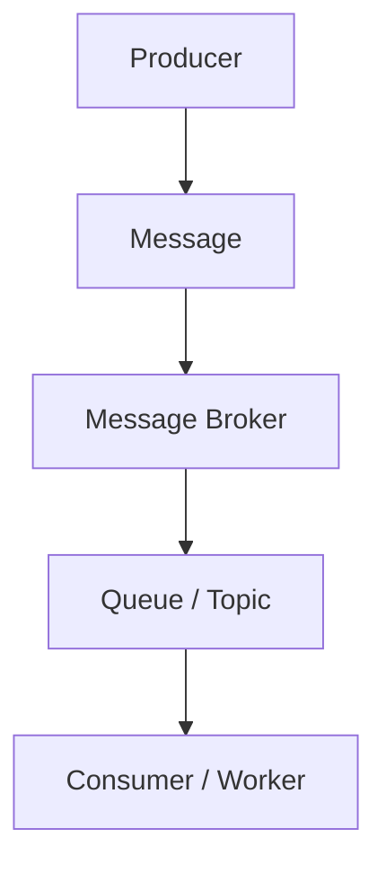

The broker acts as an intermediary.

Instead of:

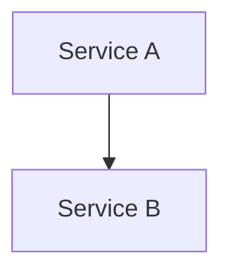

you can have:

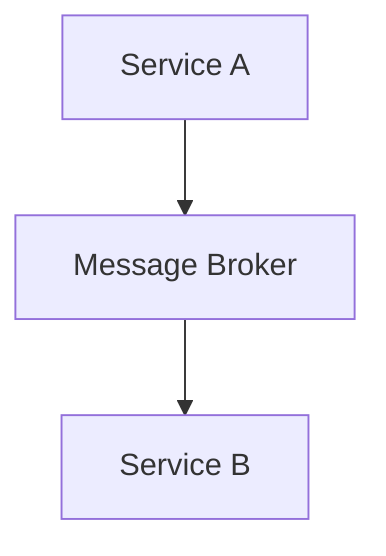

This allows services to communicate without being directly connected to each other.

> **A message broker manages communication between message producers and consumers.**

---

# 1. Why Does a Message Broker Exist?

Imagine an application with several services:

```text
Order Service
Payment Service
Email Service
Inventory Service
Analytics Service
Notification Service
```

If every service communicates directly with every other service:

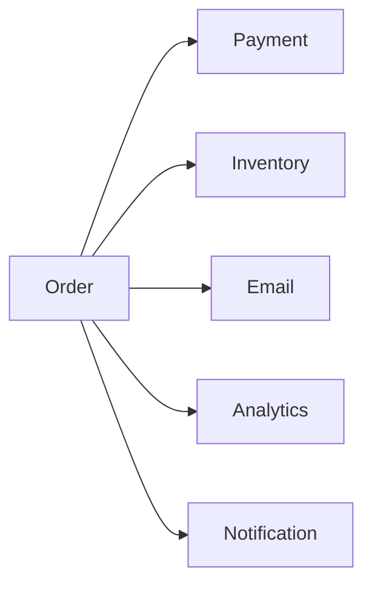

As the system grows, the number of communication relationships grows too.

A broker introduces an intermediary:

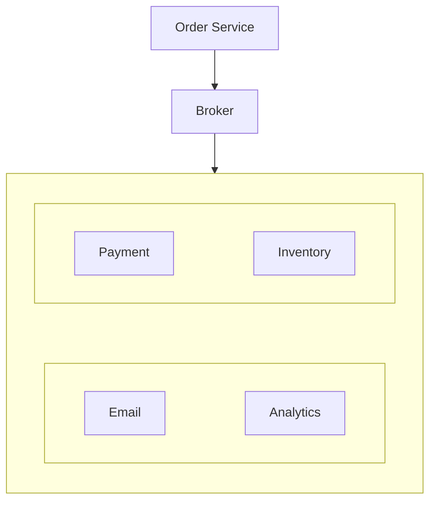

Now the producer does not need to know every consumer's communication details.

---

# 2. Broker as a Communication Middle Layer

A useful mental model is:

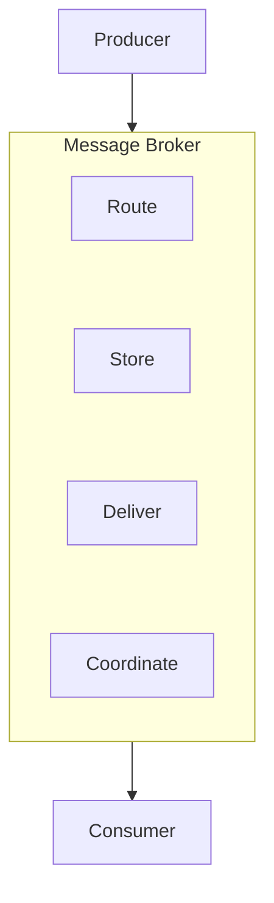

The broker can provide capabilities such as:

- message routing
- queues
- topics
- subscriptions
- delivery coordination
- acknowledgements
- retention
- retry-related mechanisms
- consumer management

The exact features depend on the broker technology.

---

# 3. Queue vs Message Broker

This distinction is important.

A **queue** is primarily a place where messages wait to be processed.

A **message broker** is a broader messaging system that manages the movement of messages between producers and consumers.

Conceptually:

```text
Queue
=
A messaging destination / work buffer
```

while:

```text
Message Broker
=
A messaging system that manages routing and delivery
```

A broker may contain multiple queues:

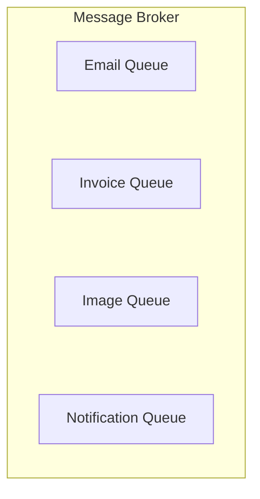

Therefore:

> **A queue can be a component of a message broker.**

---

# 4. A More Complete Architecture

Consider:

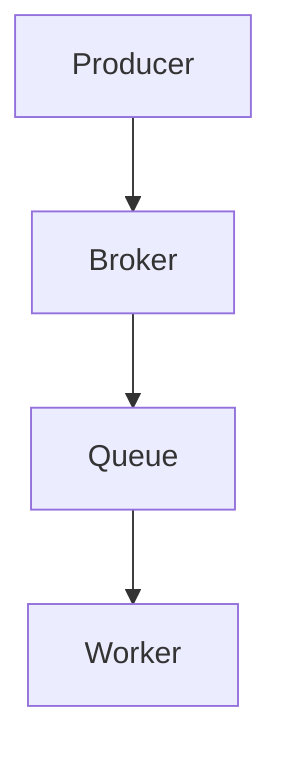

The responsibilities can be separated conceptually:

```text
Producer
  → Creates message

Broker
  → Receives and routes message

Queue
  → Holds message

Worker
  → Processes message
```

In real technologies, these responsibilities may overlap.

For example, a broker may manage the queue internally rather than exposing it as a completely separate system.

---

# 5. Broker

The broker receives the message:

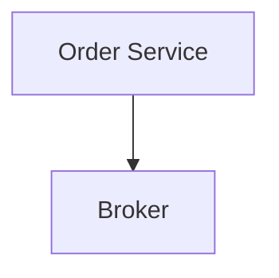

The broker then determines where the message should go.

Routing is one of the major reasons a broker is more than a simple queue.

---

# 6. Queue

The destination queue holds messages waiting for consumers.

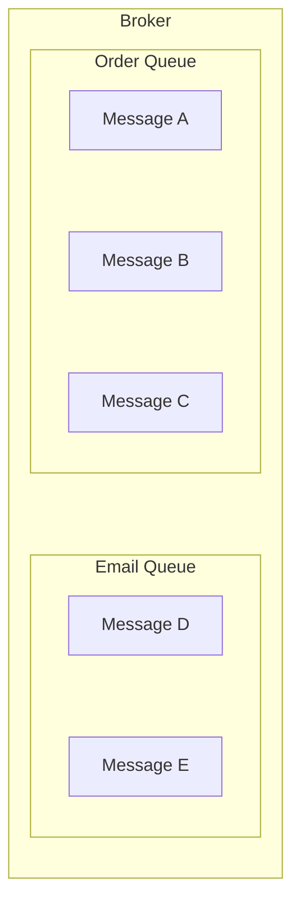

Different workers can consume from different queues.

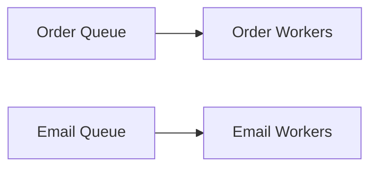

This allows different workloads to scale independently.

---

# 7. Routing

Suppose a system produces three message types:

```text
order_created
image_uploaded
send_email
```

The broker can route them to different destinations:

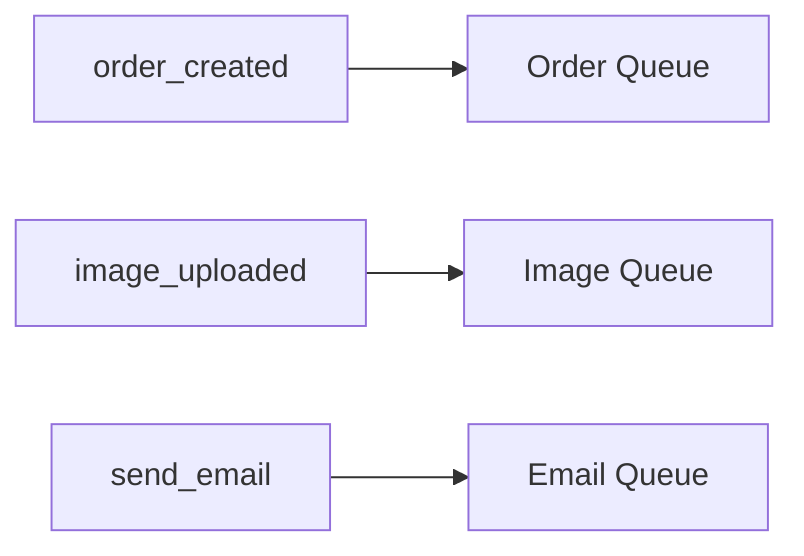

The exact routing model depends on the messaging system.

The important idea is:

> **The producer submits a message; the messaging layer determines where it should be delivered.**

---

# 8. One Queue, Multiple Workers

A broker can manage a queue consumed by multiple workers:

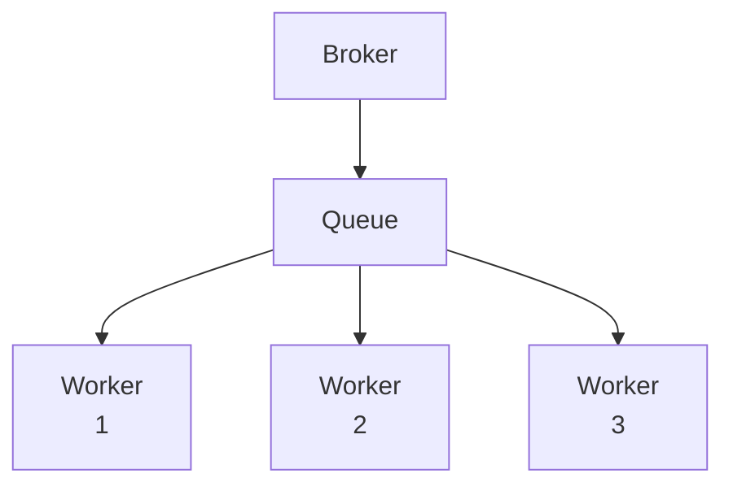

The workers compete for available messages.

This is useful when the workload represents **work that should normally be processed once by one worker**.

This is the competing-consumer model from 05.03 and 05.04.

---

# 9. One Message, Multiple Consumers

Sometimes multiple independent systems need the same event.

For example:

```text
Order Created
```

might need to reach:

```text
Inventory
Analytics
Notification
Fraud Detection
```

A simple work queue is not the right mental model if each independent consumer needs its own copy.

Conceptually:

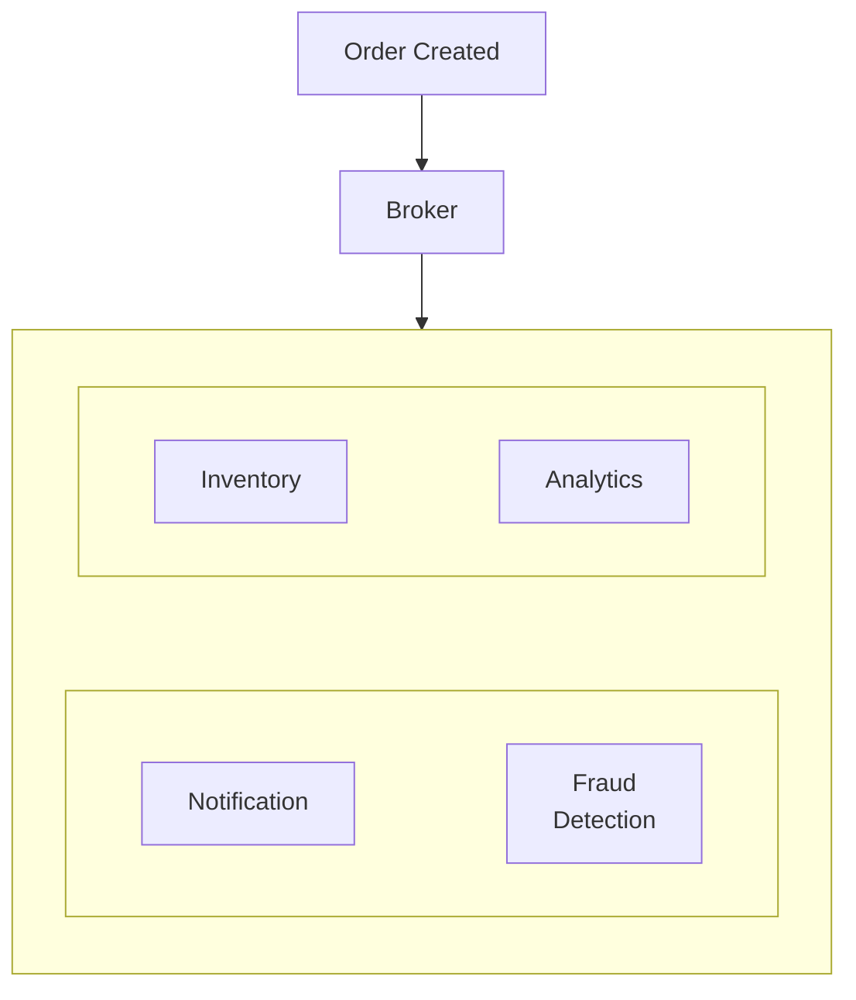

This is where **pub/sub** becomes useful.

The next chapter, **05.06 — Pub/Sub**, will focus on this pattern.

---

# 10. Queue vs Topic

Two common messaging concepts are:

### Queue

A destination for work that consumers process.

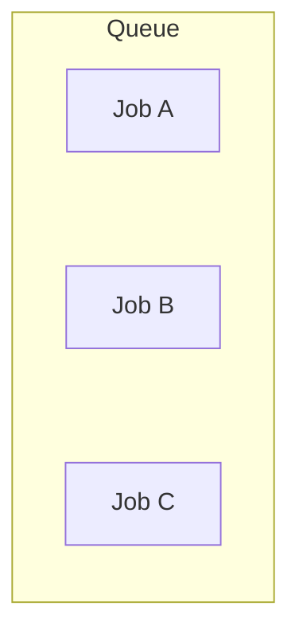

### Topic

A destination representing a stream/category of messages to which multiple consumers can subscribe.

Conceptually:

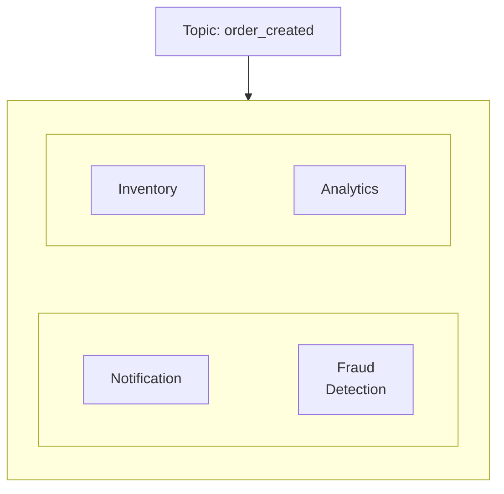

Different messaging technologies implement these concepts differently.

Do not assume that every broker uses exactly the same terminology or behavior.

---

# 11. Broker Decouples Producers and Consumers

Without a broker:


Service A needs to know how to communicate with Service B.

With a broker:

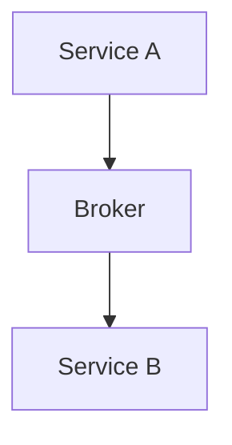

Service A mainly needs to understand the messaging contract.

This provides **communication decoupling**.

For example, Service B can be:

- temporarily unavailable
- scaled independently
- replaced
- moved to another service implementation

without necessarily requiring the producer to directly manage that change.

However, the message contract and routing configuration still create dependencies.

---

# 12. Temporal Decoupling

A broker can also provide **temporal decoupling**.

For example:

```text
10:00
Order created

10:00:01
Message stored

10:00:10
Worker processes message
```

The producer and consumer do not have to complete the operation at exactly the same time.

---

# 13. Broker Does Not Eliminate Failures

A broker introduces another critical component.

Now the architecture is:

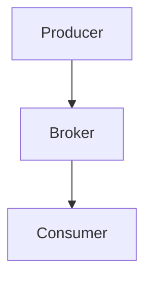

The broker can fail too.

Possible failures include:

- broker unavailable
- network partition
- storage failure
- message loss
- duplicate delivery
- queue backlog
- routing errors
- overloaded broker
- consumer connection failures

Therefore:

> **Adding a broker moves complexity; it does not eliminate complexity.**

Production brokers commonly use replication, persistence, clustering, or managed high-availability features depending on the technology.

---

# 14. Broker Availability

If a producer cannot reach the broker:

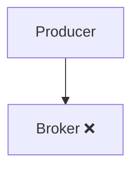

What happens?

Possible strategies include:

- retry sending
- temporarily buffer locally
- reject the operation
- fall back to another path
- return an error

The correct strategy depends on the importance of the message.

For example:

```text
Critical payment event
```

and:

```text
Optional analytics event
```

may have completely different failure policies.

---

# 15. Broker and Consumer Groups

Some messaging systems organize consumers into groups.

Conceptually:

```mermaid
flowchart TD
  accTitle: A consumer group
  accDescr: Queue / Topic, then a consumer group of consumers 1, 2 and 3.
  Q["Queue / Topic"] --> G
  subgraph G["Consumer Group"]
    direction TB
    C0["Consumer 1"] ~~~ C1["Consumer 2"] ~~~ C2["Consumer 3"]
  end
```

The group can divide work among its members.

This allows processing capacity to scale horizontally.

Different technologies use different concepts and terminology for consumer groups, so the exact behavior should be learned from the specific system being used.

---

# 16. Broker and Message Retention

Messaging systems may retain messages for a configured period.

For example:

```mermaid
flowchart TD
  accTitle: Message retention
  accDescr: Message, then Broker, then Retained, then Consumer reads.
  N0["Message"] --> N1["Broker"] --> N2["Retained"] --> N3["Consumer reads"]
```

Depending on the technology, a message may be:

- removed after acknowledgement
- retained for a configured period
- retained until a policy is met
- replayable

Replayability is particularly important in event-streaming systems and will become more relevant when studying Kafka.

---

# 17. Broker vs Database

A broker and a database solve different primary problems.

### Database

Designed primarily for:

- persistent application data
- queries
- updates
- relationships
- transactions

### Message broker

Designed primarily for:

- message delivery
- asynchronous communication
- buffering
- routing
- consumer coordination

A broker may persist messages, but that does not make it a replacement for an application database.

Similarly:

> **A database table containing jobs is not automatically equivalent to a full message broker.**

---

# 18. A Realistic Architecture

Consider an e-commerce platform:

```mermaid
flowchart TD
  accTitle: A realistic architecture
  accDescr: Order API, then Message Broker, which reaches the Inventory, Notification, Analytics and Fraud workers.
  N0["Order API"] --> N1["Message Broker"] --> G
  subgraph G[" "]
    direction TB
    subgraph G1[" "]
      direction LR
      A["Inventory<br/>Worker"] ~~~ B["Notification<br/>Worker"]
    end
    subgraph G2[" "]
      direction LR
      C["Analytics<br/>Worker"] ~~~ D["Fraud<br/>Worker"]
    end
    G1 ~~~ G2
  end
```

The Order API handles the immediate order operation.

The broker handles asynchronous communication.

Different consumers can scale independently.

For example:

```text
Inventory:
5 workers

Notifications:
20 workers

Analytics:
3 workers

Fraud:
10 workers
```

The workloads are different, so their processing capacity can be different.

---

# 19. Message Contracts

A message should have a predictable structure.

For example:

```json
{
  "event": "user.registered",
  "version": 1,
  "user_id": 1001,
  "occurred_at": "2026-10-05T10:00:00Z"
}
```

Important considerations include:

- message type
- schema
- version
- identifier
- timestamp
- correlation information
- optional metadata

As systems evolve, consumers may still be processing older message versions.

This is why message schema evolution becomes an important distributed-system concern.

---

# 20. Broker and Message Ordering

A broker may provide ordering guarantees, but those guarantees are usually limited by:

- queue
- partition
- consumer
- key
- concurrency
- retry behavior

For example:

```text
A
B
C
```

may be ordered within one queue or partition but not globally across a distributed system.

Do not assume:

> "The broker preserves order everywhere."

Ordering requirements must be explicitly understood.

Detailed treatment comes in:

**05.09 — Message Ordering**

---

# 21. RabbitMQ and Kafka — Why They Appear Here

Two technologies commonly discussed in system design are:

- **RabbitMQ**
- **Apache Kafka**

Both are messaging systems, but their architectural models are different.

At a very high level:

```text
RabbitMQ
→ message broker / queue-oriented messaging

Kafka
→ distributed event streaming platform
```

This is intentionally simplified.

Neither should be understood as simply:

```text
RabbitMQ = queue
Kafka = queue
```

They provide different models, capabilities, and operational characteristics.

Detailed treatment comes later in:

- **05.07 — RabbitMQ**
- **05.08 — Kafka**

---

# 22. When Does a Message Broker Make Sense?

A broker may be useful when you need:

### Asynchronous communication

```mermaid
flowchart TD
  accTitle: Asynchronous communication
  accDescr: Producer, then Broker, then Consumer.
  N0["Producer"] --> N1["Broker"] --> N2["Consumer"]
```

### Burst absorption

```mermaid
flowchart TD
  accTitle: Burst absorption
  accDescr: Traffic spike, then Broker, then Workers.
  N0["Traffic spike"] --> N1["Broker"] --> N2["Workers"]
```

### Independent scaling

```mermaid
flowchart TD
  accTitle: Independent scaling
  accDescr: Broker, then Worker Pool.
  N0["Broker"] --> N1["Worker Pool"]
```

### Failure isolation

```mermaid
flowchart TD
  accTitle: Failure isolation
  accDescr: Producer, then Durable Broker, then Consumer later.
  N0["Producer"] --> N1["Durable Broker"] --> N2["Consumer later"]
```

### Multiple destinations

```mermaid
flowchart TD
  accTitle: Multiple destinations
  accDescr: The broker holds Queue A, Queue B and Topic C.
  subgraph G["Broker"]
    direction TB
    I0["Queue A"] ~~~ I1["Queue B"] ~~~ I2["Topic C"]
  end
```

### Service decoupling

```mermaid
flowchart TD
  accTitle: Service decoupling
  accDescr: Service A, then Broker, then Service B.
  N0["Service A"] --> N1["Broker"] --> N2["Service B"]
```

---

# 23. When Might a Broker Be Unnecessary?

Do not add a broker simply because the architecture diagram looks more sophisticated.

A direct API may be better when:

- the response is required immediately
- the operation is simple
- traffic is low
- there is no need for buffering
- asynchronous processing adds unnecessary complexity

For example:

```mermaid
flowchart TD
  accTitle: A direct path
  accDescr: Browser, then API, then Database.
  N0["Browser"] --> N1["API"] --> N2["Database"]
```

may be completely appropriate.

You do not need:

```mermaid
flowchart TD
  accTitle: An unnecessary broker
  accDescr: Browser, then API, then Broker, then Worker, then Database.
  N0["Browser"] --> N1["API"] --> N2["Broker"] --> N3["Worker"] --> N4["Database"]
```

unless the problem actually requires asynchronous processing.

---

# 24. Hands-On Exercise — Design a Broker

Imagine a system that receives three types of work:

```text
send_email
generate_invoice
resize_image
```

Design:

```mermaid
flowchart TD
  accTitle: Broker design
  accDescr: Producer, then Message Broker, which routes to the Email, Invoice and Image queues, each with its own workers.
  P["Producer"] --> M["Message Broker"] --> E["Email<br/>Queue"] & I["Invoice<br/>Queue"] & G["Image<br/>Queue"]
  E --> EW["Workers"]
  I --> IW["Workers"]
  G --> GW["Workers"]
```

### Step 1 — Define messages

Example:

```json
{
  "type": "send_email",
  "user_id": 1001
}
```

```json
{
  "type": "generate_invoice",
  "order_id": 5001
}
```

```json
{
  "type": "resize_image",
  "image_id": 9001
}
```

### Step 2 — Define routing

```mermaid
flowchart LR
  accTitle: Routing
  accDescr: send_email to Email Queue, generate_invoice to Invoice Queue, resize_image to Image Queue.
  A0["send_email"] --> B0["Email Queue"]
  A1["generate_invoice"] --> B1["Invoice Queue"]
  A2["resize_image"] --> B2["Image Queue"]
```

### Step 3 — Define workers

```mermaid
flowchart LR
  accTitle: Workers
  accDescr: Email Queue to Email Workers, Invoice Queue to Invoice Workers, Image Queue to Image Workers.
  A0["Email Queue"] --> B0["Email Workers"]
  A1["Invoice Queue"] --> B1["Invoice Workers"]
  A2["Image Queue"] --> B2["Image Workers"]
```

### Step 4 — Consider failures

Ask:

1. What happens if the email worker crashes?
2. What happens if image processing is slow?
3. What happens if invoice generation repeatedly fails?
4. Which messages require durable storage?
5. Can any message be safely processed twice?
6. How would you monitor queue backlog?

---

# 25. Lab Challenge — One Event, Multiple Consumers

Consider:

> A customer places an order.

The system needs:

- inventory update
- analytics event
- confirmation notification

Model this as:

```mermaid
flowchart TD
  accTitle: One event, multiple consumers
  accDescr: Order Service, Broker, order.created, which reaches Inventory, Analytics and Notification.
  N0["Order Service"] --> N1["Broker"] --> N2["order.created"] --> G
  subgraph G[" "]
    direction TB
    I0["Inventory"] ~~~ I1["Analytics"] ~~~ I2["Notification"]
  end
```

Now answer:

### Question 1

Should these consumers share one work queue?

### Question 2

What happens if Analytics is unavailable?

### Question 3

Should Inventory and Notification wait for Analytics?

### Question 4

Which consumers need the event independently?

### Question 5

Would a pub/sub model be more appropriate?

These questions lead directly into **05.06 — Pub/Sub**.

---

# System Design View

A message broker becomes valuable when communication itself needs infrastructure.

```mermaid
flowchart TD
  accTitle: Broker system design view
  accDescr: Producer, then Broker, which routes to two queues, each with a worker, and to a topic with subscribers.
  P["Producer"] --> B["Broker"] --> Q1["Queue"] & Q2["Queue"] & T["Topic"]
  Q1 --> W1["Worker"]
  Q2 --> W2["Worker"]
  T --> S["Subscribers"]
```

The broker can provide a controlled communication boundary between systems.

This allows architecture to evolve from:

```mermaid
flowchart TD
  accTitle: Direct call
  accDescr: Service A, then Service B.
  N0["Service A"] --> N1["Service B"]
```

to:

```mermaid
flowchart TD
  accTitle: Through a broker
  accDescr: Service A, then Broker, then Service B.
  N0["Service A"] --> N1["Broker"] --> N2["Service B"]
```

and eventually:

```mermaid
flowchart TD
  accTitle: Broker fan-out
  accDescr: Service A, then Broker, which reaches services B, C, D and E.
  N0["Service A"] --> N1["Broker"] --> G
  subgraph G[" "]
    direction TB
    subgraph G1[" "]
      direction LR
      A["Service B"] ~~~ B["Service C"]
    end
    subgraph G2[" "]
      direction LR
      C["Service D"] ~~~ D["Service E"]
    end
    G1 ~~~ G2
  end
```

But every new messaging path adds:

- operational dependencies
- monitoring requirements
- failure modes
- message contracts
- delivery semantics
- debugging complexity

Therefore:

> **A broker is infrastructure for communication, not merely another server placed between services.**

---

# The Core Trade-Off

| Message Broker Benefit | New Responsibility |
|---|---|
| Service decoupling | Message contracts |
| Asynchronous processing | Delayed completion |
| Buffering | Backlog management |
| Routing | Routing configuration |
| Independent scaling | Consumer coordination |
| Failure isolation | Recovery handling |
| Durable messaging | Storage/replication cost |
| Multiple consumers | Delivery semantics |
| Retry support | Duplicate processing |

---

# Key Principle

> **A message broker is a communication layer that receives, routes, stores, and delivers messages between producers and consumers. Queues are commonly used inside or alongside brokers to hold work, while topics and subscriptions can support independent consumers of the same event. A broker reduces direct service coupling, but it introduces its own availability, durability, routing, delivery, and operational concerns.**

---

# Quick Reference

| Concept | Meaning |
|---|---|
| Message Broker | Infrastructure that manages message communication |
| Producer | Creates/sends messages |
| Queue | Holds messages for processing |
| Consumer | Receives messages |
| Worker | Processes background work |
| Routing | Determining where a message should go |
| Topic | Messaging destination for publish/subscribe patterns |
| Subscription | Consumer's interest in a topic |
| ACK | Processing acknowledgement |
| Durability | Ability to preserve messages across appropriate failures |
| Consumer Group | Group of consumers sharing processing work in systems that support the concept |
| Message Contract | Expected structure/meaning of a message |

### Mental Model

```mermaid
flowchart TD
  accTitle: Mental model
  accDescr: Producer, Message, then the message broker (routing, queues, topics, delivery), then Consumer / Worker.
  N0["Producer"] --> N1["Message"] --> G
  subgraph G["Message Broker"]
    direction TB
    I0["Routing"] ~~~ I1["Queues"] ~~~ I2["Topics"] ~~~ I3["Delivery"]
  end
  G --> Z["Consumer / Worker"]
```

---

# Knowledge Check

### 1. What is a message broker?

**Answer:** A system that manages communication between message producers and consumers by receiving, routing, storing, and delivering messages.

### 2. Is a queue the same thing as a broker?

**Answer:** No. A queue is primarily a messaging destination/work buffer; a broker is a broader messaging system that can manage queues, routing, delivery, and other messaging capabilities.

### 3. Why does a broker reduce direct coupling?

**Answer:** Producers communicate with the messaging layer instead of directly managing every consumer connection.

### 4. Can a broker contain multiple queues?

**Answer:** Yes.

### 5. Why might one event need multiple consumers?

**Answer:** Different independent services may need to react to the same event, such as inventory, analytics, and notifications.

### 6. Does a broker guarantee that messages are processed exactly once?

**Answer:** No. Delivery semantics depend on the messaging technology and consumer design.

### 7. Does adding a broker eliminate failures?

**Answer:** No. It introduces another infrastructure component with its own failure modes.

### 8. When is a direct API often better than messaging?

**Answer:** When the caller needs an immediate result and asynchronous buffering or decoupling is not necessary.

---

# Remember

```text
Queue
→ Where messages wait

Worker
→ Who processes the work

Broker
→ Infrastructure that manages message communication

Topic
→ Where publishers can distribute events to subscribers
```

The key progression is:

```mermaid
flowchart TD
  accTitle: Key progression
  accDescr: Message, then Queue, then Worker.
  N0["Message"] --> N1["Queue"] --> N2["Worker"]
```

and the broader messaging architecture is:

```mermaid
flowchart TD
  accTitle: Broader messaging architecture
  accDescr: Producer, then Broker, then Queue / Topic, then Consumer / Worker.
  N0["Producer"] --> N1["Broker"] --> N2["Queue / Topic"] --> N3["Consumer / Worker"]
```

The most important question is:

> **Do we need infrastructure that manages communication, routing, buffering, and delivery between independently operating components?**

If yes, a message broker may be appropriate.

---

# Next Chapter

## 05.06 — Pub/Sub

Next, we will introduce **Publish/Subscribe**, where one event can be delivered independently to multiple consumers:

- What Pub/Sub means
- Publisher
- Subscriber
- Topic
- Subscription
- Pub/Sub vs message queue
- One-to-many communication
- Independent consumers
- Event fan-out
- Consumer isolation
- Failure handling
- Message retention
- Ordering considerations
- Real-world examples
- Hands-on Pub/Sub exercise
