# 05.06 — Pub/Sub

## Learning Objectives

By the end of this chapter, you should understand:

- What Pub/Sub means
- Publisher, topic, subscriber, and subscription
- How one event reaches multiple consumers
- The difference between Pub/Sub and a work queue
- Why Pub/Sub reduces direct service coupling
- Consumer independence and failure isolation
- Fan-out and scaling
- Ordering, delivery, and duplicate messages
- When Pub/Sub is useful—and when it is unnecessary

---

# 1. What Is Pub/Sub?

**Pub/Sub (Publish/Subscribe)** is a messaging pattern where a **publisher sends a message to a topic**, and multiple independent subscribers can receive that message.

The publisher does not need to know who will consume the message.

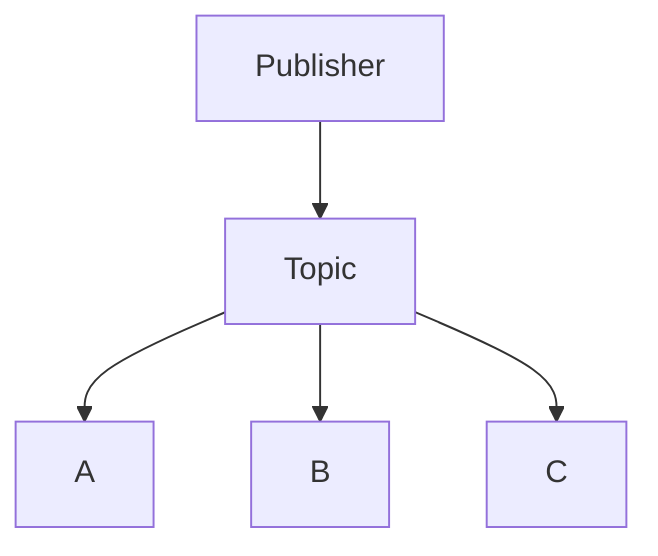

For example, when an order is created:

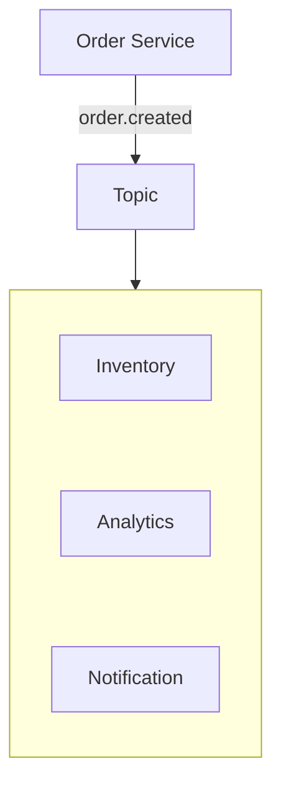

The Order Service publishes one event.

Multiple systems can react to it independently.

---

# 2. Why Does Pub/Sub Exist?

Without Pub/Sub, a service may need to call several other services directly:

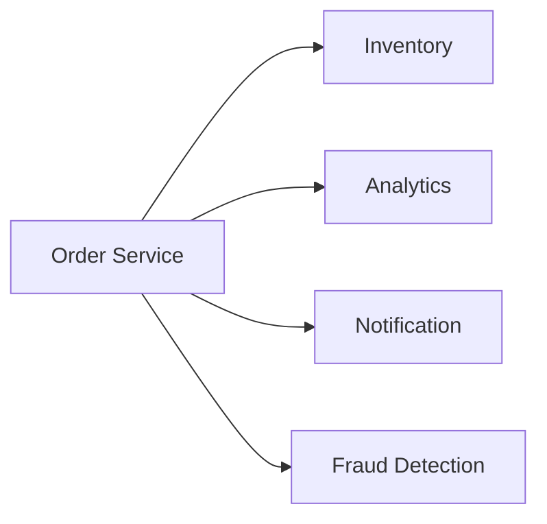

Now the Order Service knows about every downstream service.

Adding another consumer requires changing the Order Service.

Pub/Sub changes this:

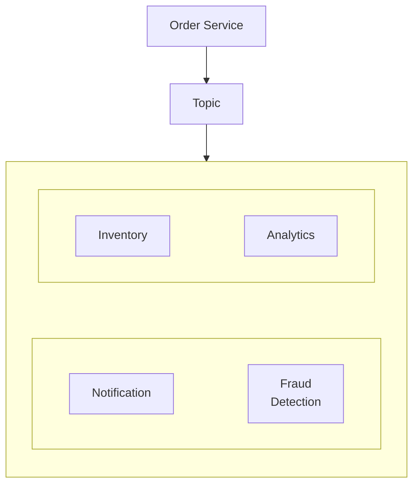

The publisher only knows:

> "An order was created."

It does not need to know:

> "Which services are interested in this event?"

This reduces **direct coupling**.

---

# 3. The Four Important Concepts

## Publisher

The **publisher** produces a message.

Example:

```text
Order Service
```

It publishes:

```text
order.created
```

The publisher does not normally need to know the individual subscribers.

---

## Topic

A **topic** represents a category or stream of messages.

Examples:

```text
order.created
user.registered
payment.completed
image.uploaded
```

Think of a topic as:

> "This is where messages about this kind of event are published."

---

## Subscriber

A **subscriber** is a consumer interested in messages from a topic.

For example:

```text
Inventory Service
Analytics Service
Notification Service
```

---

## Subscription

A **subscription** represents a subscriber's interest in a topic and provides the mechanism through which that subscriber receives messages.

Conceptually:

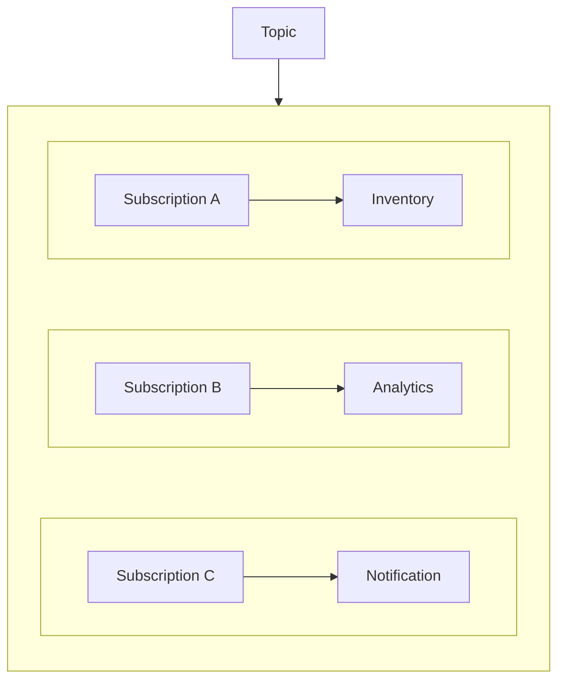

The exact implementation of subscriptions varies between messaging technologies.

---

# 4. How Pub/Sub Works

A simplified flow is:

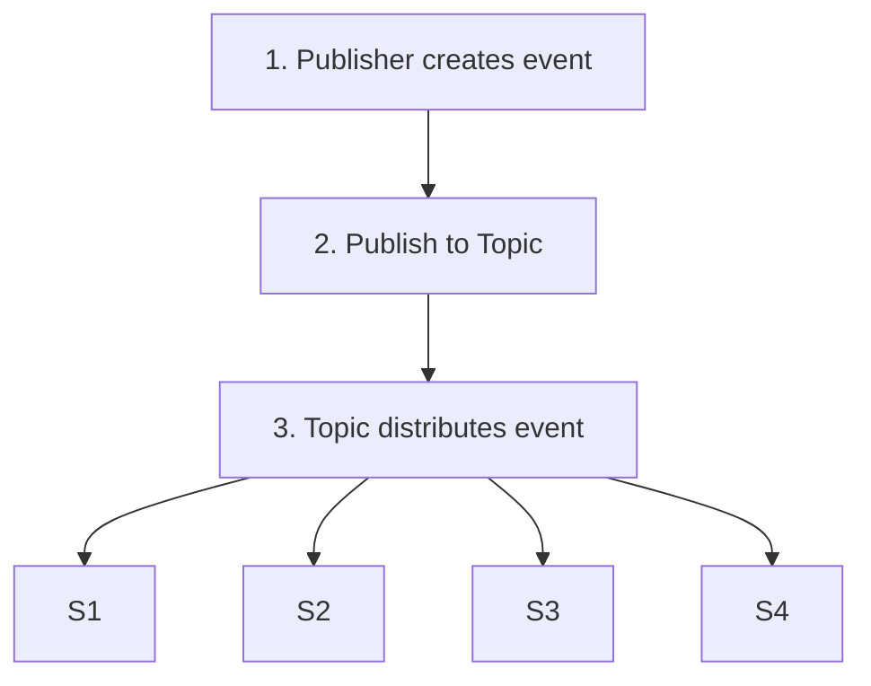

Each subscriber can process the event independently.

---

# 5. What Is Fan-Out?

**Fan-out** means distributing one published message to multiple consumers.

One event:

```text
order.created
```

can trigger several independent actions.

This is one of the most important reasons Pub/Sub exists.

---

# 6. Pub/Sub vs Message Queue

This distinction is fundamental.

### Work Queue

A work queue usually distributes work among competing consumers.

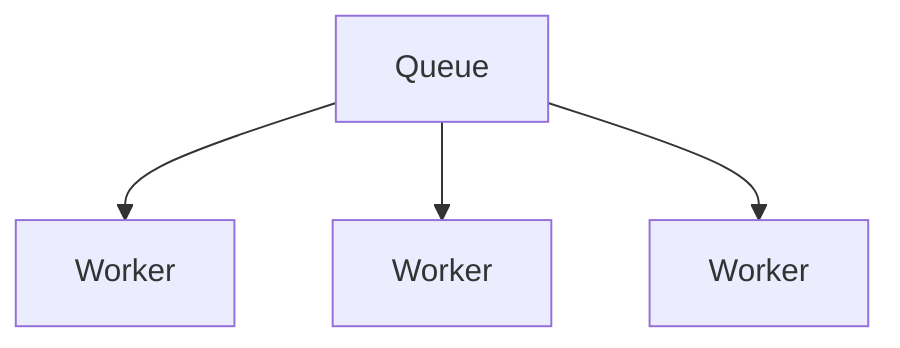

One message → typically one worker processes it

For example:

```text
Generate PDF
```

You normally want **one worker** to generate that PDF, not three workers generating the same PDF.

---

### Pub/Sub

Pub/Sub allows independent subscribers to receive the same event.

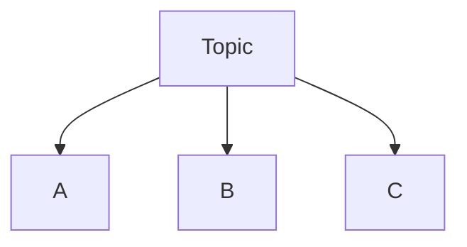

One event → multiple independent consumers

For example:

```text
order.created
```

may be consumed by:

- Inventory
- Analytics
- Notification
- Fraud Detection

### Core Difference

| Work Queue | Pub/Sub |
|---|---|
| Distribute work | Distribute events/messages |
| Competing consumers | Independent subscribers |
| One work item usually processed by one consumer | One event can reach many subscribers |
| Good for background jobs | Good for event fan-out |
| Example: image processing | Example: `order.created` |

The exact behavior depends on the messaging technology, but this mental model is extremely useful.

---

# 7. Pub/Sub Does Not Mean "Everyone Gets Everything"

A subscriber only receives messages through its subscription.

Conceptually:

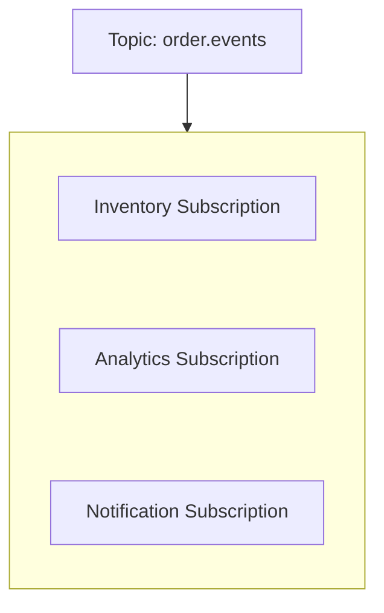

This allows each consumer to have its own delivery state and processing behavior.

One subscriber may be temporarily slow while another continues processing.

That is an important form of **consumer isolation**.

---

# 8. Independent Consumer Scaling

Suppose analytics becomes expensive.

You may need more analytics workers:

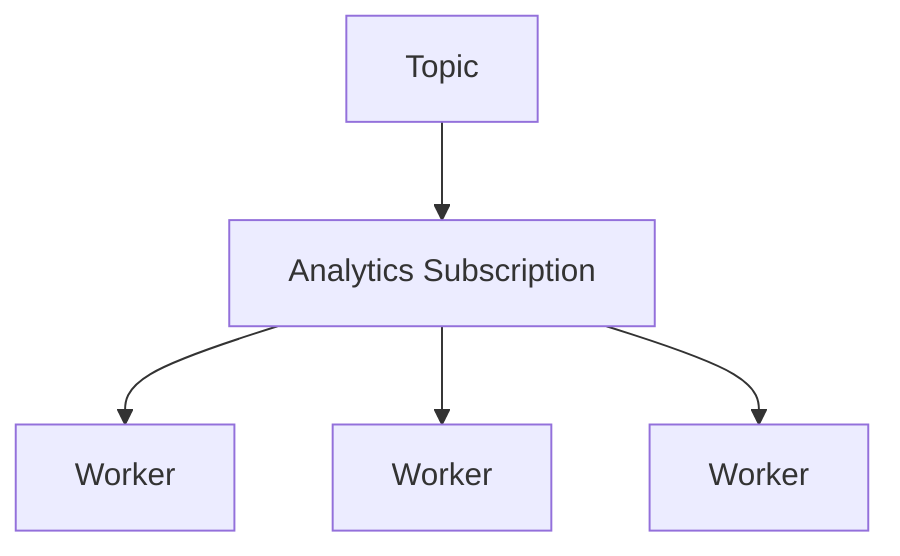

Meanwhile, notification might need only one worker:

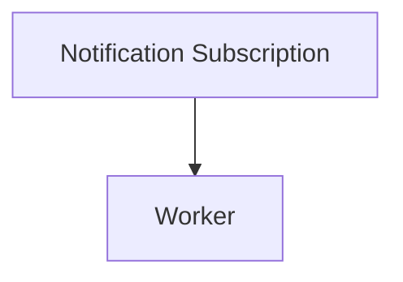

Different consumers can therefore scale according to their own workloads.

---

# 9. Independent Failure

Suppose the Notification Service is temporarily unavailable.

A well-designed Pub/Sub system can allow the other subscribers to continue processing:

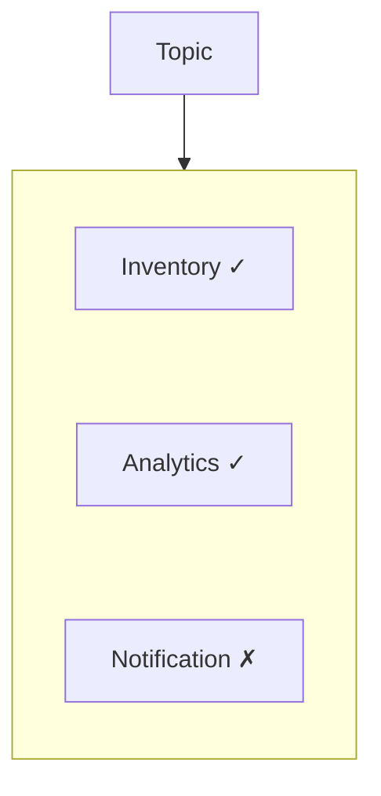

The notification subscriber may accumulate pending messages while:

```text
Inventory → continues
Analytics → continues
Notification → recovers later
```

This is an important form of **failure isolation**.

However, this is not automatic. The messaging system must provide suitable durability, retention, retry, and delivery behavior.

---

# 10. Pub/Sub Is Useful for Events

Pub/Sub works especially well when the message describes something that **happened**.

Examples:

```text
user.registered
order.created
payment.completed
video.uploaded
comment.created
shipment.delivered
```

These are events.

The publisher is effectively saying:

> "This happened."

Different services can decide whether they care.

---

# 11. Event vs Command

This distinction is useful.

### Event

An event describes something that already happened.

```text
order.created
```

It does not necessarily tell a specific service what it must do.

### Command

A command asks a specific component to perform work.

```text
generate_invoice
send_email
resize_image
```

A command is closer to:

> "Do this."

An event is closer to:

> "This happened."

The same messaging infrastructure can sometimes carry both, but their **meaning and ownership are different**.

---

# 12. Retention and Replay

Some Pub/Sub systems can retain messages for a period of time.

This can enable a subscriber to process messages later or replay historical messages.

Conceptually:

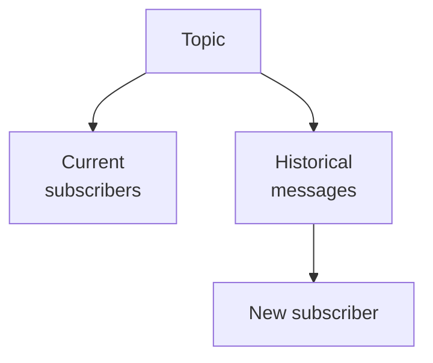

But **not every Pub/Sub system provides the same retention or replay capabilities**.

These are technology-specific features.

This becomes particularly important when studying Kafka later.

---

# 13. Pub/Sub Failure Scenarios

A production Pub/Sub system must consider:

| Failure | Possible Concern |
|---|---|
| Publisher fails | Event may never be published |
| Broker/topic unavailable | Publishing or delivery may fail |
| Subscriber crashes | Messages may remain pending |
| Consumer is slow | Backlog grows |
| Message processing fails | Retry may be required |
| ACK is lost | Duplicate delivery may occur |
| Subscriber is permanently broken | Backlog may grow indefinitely |
| Event schema changes | Old consumers may fail |

The architecture must define what happens in each case.

---

# 14. Real Example — Order Processing

Imagine an e-commerce system.

### Inventory

Reserves stock.

### Analytics

Records the purchase for reporting.

### Notification

Sends confirmation to the customer.

Each consumer has a different responsibility.

The Order Service does not need to synchronously call all three services.

---

# 15. Pub/Sub vs Queue vs Direct API

| Architecture | Main Idea | Good For |
|---|---|---|
| Direct API | Service calls another service directly | Immediate request/response |
| Work Queue | Work is distributed to workers | Background jobs |
| Pub/Sub | Event is distributed to independent subscribers | Event fan-out |
| Message Broker | Messaging layer that manages communication | Routing, queues, topics, delivery |

These concepts can also exist together.

For example:

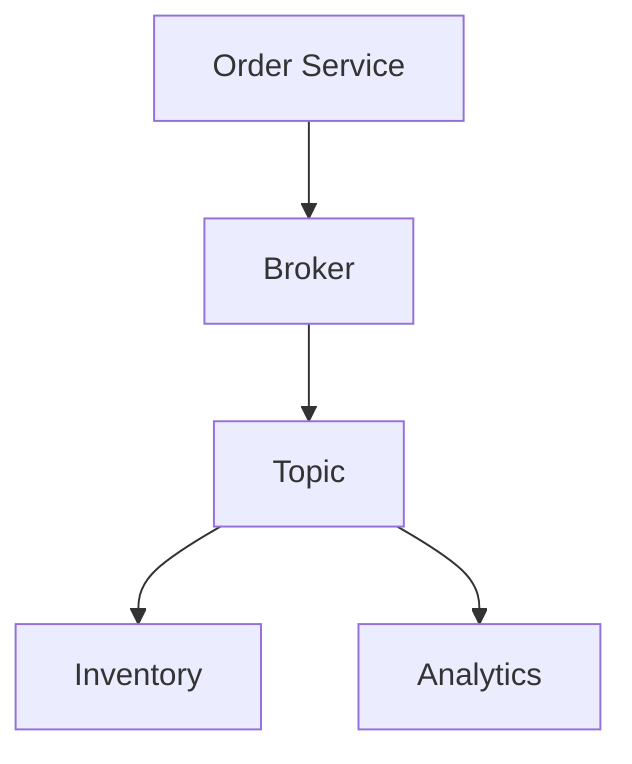

And a subscriber may internally use workers:

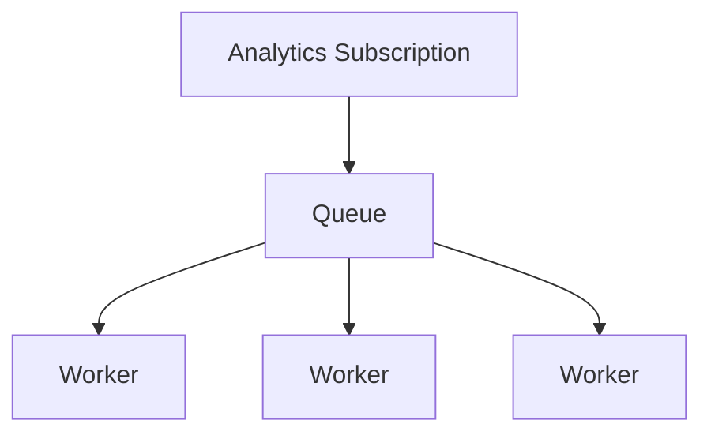

Real systems often combine these patterns.

---

# 16. Hands-On Exercise — Model a Pub/Sub System

Imagine a simple e-commerce application.

When an order is created, the system publishes:

```text
order.created
```

There are four consumers:

```text
Inventory
Analytics
Notification
Fraud Detection
```

## Step 1 — Draw the Architecture

Create:

```text
Order Service
      |
      v
    Topic
```

Then connect four subscriptions.

---

## Step 2 — Assign Responsibilities

Fill in:

| Subscriber | Responsibility |
|---|---|
| Inventory | ? |
| Analytics | ? |
| Notification | ? |
| Fraud Detection | ? |

---

## Step 3 — Simulate a Failure

Assume:

```text
Notification Service
```

is down for 10 minutes.

Answer:

1. Should Inventory stop?
2. Should Analytics stop?
3. What should happen to notification events?
4. What happens when Notification recovers?

The correct architecture should isolate the notification failure from unrelated consumers.

---

## Step 4 — Add a New Consumer

Add:

```text
Customer Loyalty Service
```

Question:

> Should the Order Service itself need to be rewritten just because a new subscriber wants `order.created`?

A major benefit of Pub/Sub is that the answer can often be **no**.

---

# 17. Common Mistakes

### Mistake 1 — Treating Pub/Sub as a Work Queue

Pub/Sub is primarily about **independent subscribers receiving events**.

### Mistake 2 — Assuming One Message Has One Consumer

A published event can reach multiple independent subscribers.

### Mistake 3 — Assuming Global Ordering

Ordering guarantees depend on the messaging technology and configuration.

### Mistake 4 — Assuming Exactly-Once Delivery

Do not assume duplicate delivery is impossible.

### Mistake 5 — Ignoring Backlog

Slow subscribers can accumulate large amounts of pending work.

### Mistake 6 — Making Every Event Synchronous

The purpose of Pub/Sub is often to decouple event producers from downstream processing.

### Mistake 7 — Using Pub/Sub for Everything

If one service simply needs an immediate answer from another service, a direct API call may be simpler.

---

# 18. System Design View

Pub/Sub becomes valuable when the system has:

- multiple independent consumers
- event-driven workflows
- asynchronous processing
- services that should evolve independently
- different scaling requirements
- a need for failure isolation
- fan-out requirements

The architectural progression can look like:

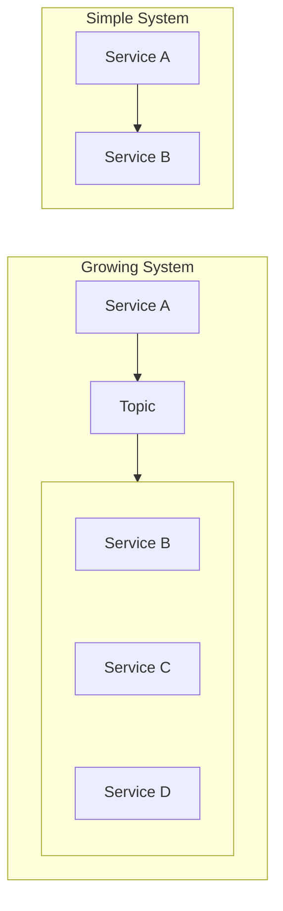

The second architecture reduces direct coupling, but it also introduces:

- message delivery concerns
- event contracts
- retries
- duplicate processing
- ordering
- retention
- monitoring
- backlog management
- failure recovery.

So Pub/Sub is not simply:

> "A better API."

It is a different communication model.

---

# 19. A Practical Decision Framework

Ask:

### 1. Does the caller need an immediate response?

**Yes** → Direct API may be appropriate.

**No** → Consider asynchronous messaging.

### 2. Is this one unit of work?

**Yes** → A work queue may be appropriate.

### 3. Should multiple independent systems react to the same event?

**Yes** → Pub/Sub is a strong candidate.

### 4. Can consumers process at different speeds?

**Yes** → Separate subscriptions can provide useful isolation.

### 5. Can duplicate delivery occur?

Design consumers to tolerate it where required.

### 6. Does ordering matter?

Define the required ordering guarantee explicitly.

### 7. Can the subscriber be unavailable?

Define retention, retry, and recovery behavior.

---

# 20. Pub/Sub Mental Model

Remember this simple model:

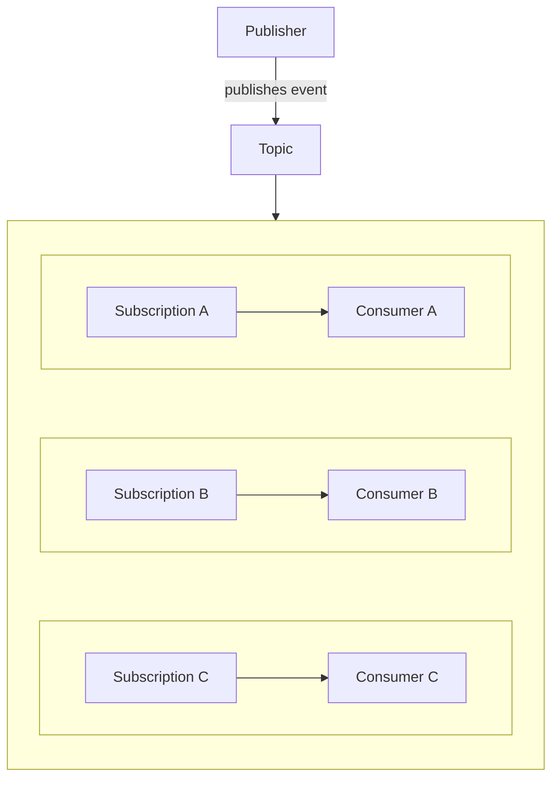

The key idea is:

> **One event can have many independent consumers.**

---

# 21. Key Principle

> **Pub/Sub is a messaging pattern where a publisher sends an event to a topic and multiple independent subscribers can receive and process that event. It is especially useful for event fan-out and reducing direct service coupling, but reliable Pub/Sub systems still require explicit decisions about delivery, ordering, duplicates, retention, backlog, and failure recovery.**

---

# 22. Quick Reference

| Concept | Meaning |
|---|---|
| Publisher | Produces a message/event |
| Topic | Category/stream where messages are published |
| Subscriber | Consumer interested in messages |
| Subscription | Subscriber's delivery relationship with a topic |
| Fan-out | One event reaching multiple consumers |
| Event | Something that happened |
| Work Queue | Distributes work among competing consumers |
| Consumer Isolation | Subscribers can process independently |
| Backlog | Messages waiting for processing |
| Ordering | Sequence guarantees provided by the messaging system |
| Replay | Processing retained historical messages again |

---

# 23. Knowledge Check

### Q1. What is the main purpose of Pub/Sub?

A. Store relational data  
B. Distribute events to independent subscribers  
C. Replace every HTTP API  
D. Make databases faster  

**Answer:** B

---

### Q2. What does fan-out mean?

**Answer:** One published event is delivered to multiple independent consumers.

---

### Q3. What is the main difference between a work queue and Pub/Sub?

**Answer:** A work queue usually distributes a work item among competing consumers, while Pub/Sub allows multiple independent subscribers to receive the same event.

---

### Q4. Does Pub/Sub automatically guarantee global ordering?

**Answer:** No. Ordering depends on the messaging technology and configuration.

---

### Q5. Can a Pub/Sub consumer receive the same message more than once?

**Answer:** Yes. Duplicate delivery can occur, so consumers may need idempotent processing.

---

### Q6. Why does Pub/Sub reduce coupling?

**Answer:** The publisher can publish an event without directly knowing every downstream consumer.

---

# 24. Remember

```text
Queue:
"Someone needs to do this work."

Pub/Sub:
"Something happened; whoever cares can react."

Publisher:
"I produced an event."

Topic:
"These events belong here."

Subscriber:
"I am interested in these events."

Subscription:
"Deliver those events to me."

Fan-out:
"One event → many independent consumers."
```

---

# 25. Next Chapter

## 05.07 — RabbitMQ

Topics:

- What RabbitMQ is
- RabbitMQ architecture
- Producer
- Exchange
- Queue
- Binding
- Routing key
- Consumer
- Direct exchange
- Fanout exchange
- Topic exchange
- Headers exchange
- Work queues
- Pub/Sub with RabbitMQ
- Acknowledgements
- Durable queues/messages
- Consumer failures
- Dead-lettering preview
- RabbitMQ vs generic message queues
- RabbitMQ vs Kafka
- Hands-on RabbitMQ exercise
- When RabbitMQ makes sense
- Common mistakes
- System design trade-offs
