# 05.07 — RabbitMQ

## Learning Objectives

By the end of this chapter, you should understand:

- What RabbitMQ is
- The role of exchanges, queues, bindings, and routing keys
- How messages move through RabbitMQ
- Direct, fanout, topic, and headers exchanges
- Work queues and Pub/Sub with RabbitMQ
- Acknowledgements and message durability
- Consumer failures and redelivery
- RabbitMQ's relationship with workers and brokers
- When RabbitMQ makes sense—and when it does not

---

# 1. What Is RabbitMQ?

RabbitMQ is a **message broker** used to route and deliver messages between producers and consumers.

It commonly sits between applications that need asynchronous communication.

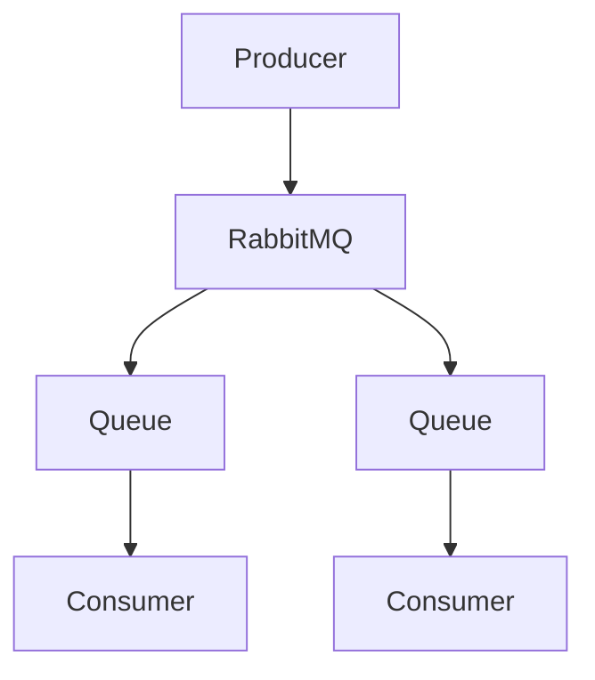

RabbitMQ can support:

- work queues
- routing
- fan-out
- Pub/Sub
- asynchronous processing
- retries and failure handling
- message acknowledgements
- durable messaging

The important point is:

> RabbitMQ is a concrete implementation of the messaging concepts learned in the previous chapters.

---

# 2. RabbitMQ vs Message Queue

These terms should not be treated as synonyms.

A **message queue** is a messaging concept:

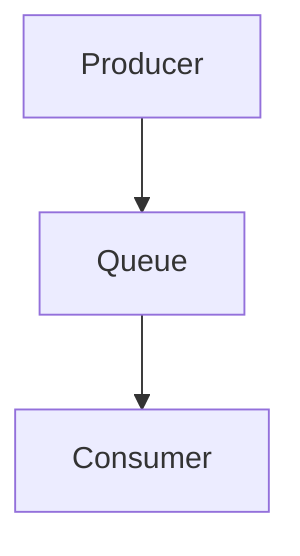

RabbitMQ is a **message broker** that provides queues along with routing and other messaging capabilities.

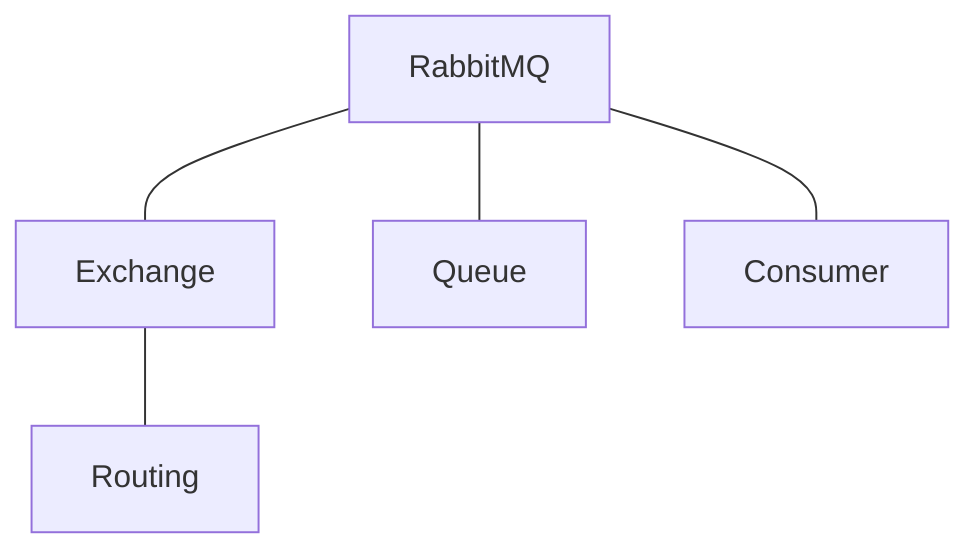

So:

```text
Message Queue = concept/pattern
RabbitMQ      = messaging technology/broker
```

---

# 3. The Basic RabbitMQ Architecture

A simplified RabbitMQ flow is:

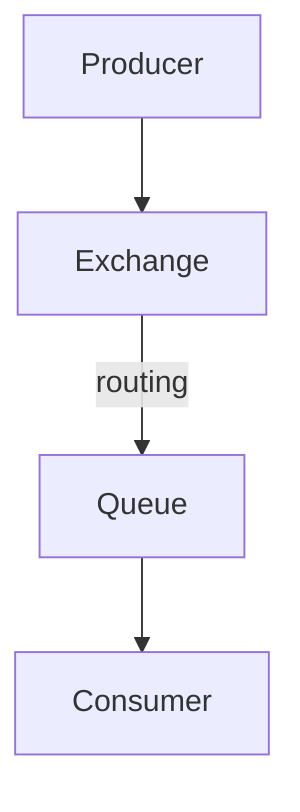

This is one of the most important diagrams in this chapter.

Unlike the simple queue model:

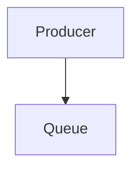

RabbitMQ normally introduces an **exchange** between the producer and queue.

---

# 4. What Is an Exchange?

An **exchange** receives messages from producers and decides which queues should receive them.

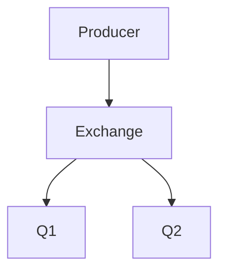

The exchange does not normally perform the business work itself.

Its primary responsibility is:

> **Routing messages to queues.**

This separation makes RabbitMQ flexible.

---

# 5. What Is a Queue?

A RabbitMQ **queue** stores messages until consumers process them.

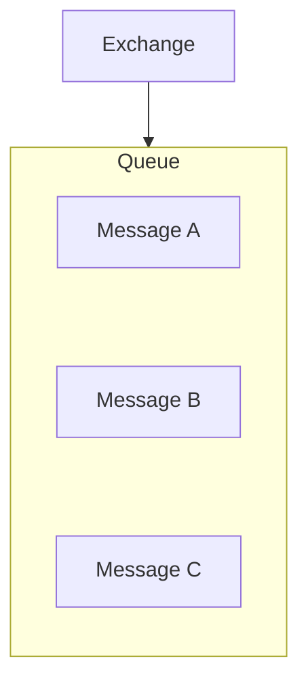

A consumer receives messages from the queue.

Queues therefore provide:

- buffering
- temporal decoupling
- work distribution
- waiting space for messages
- a boundary between producers and consumers.

---

# 6. What Is a Binding?

A **binding** connects an exchange to a queue.

Conceptually:

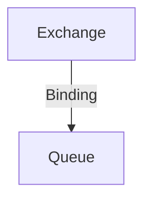

The binding can include routing information depending on the exchange type.

For example:

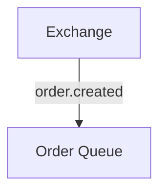

Bindings tell RabbitMQ how messages should be routed.

---

# 7. What Is a Routing Key?

A **routing key** is information attached to a published message that can help an exchange determine where the message should go.

Example:

```text
order.created
```

or:

```text
image.uploaded
```

The meaning of the routing key depends on the exchange type.

For example, a topic exchange can use patterns such as:

```text
order.*
```

or:

```text
order.#
```

Routing keys therefore become part of the messaging design.

---

# 8. The Complete Flow

A typical message flow is:

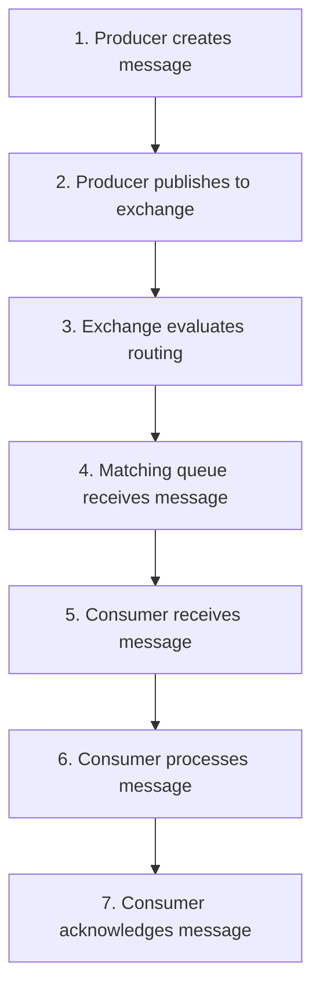

Remember:

> **Publishing a message is not the same as completing the work.**

---

# 9. RabbitMQ Exchange Types

RabbitMQ provides several exchange types.

The four important ones for learning are:

1. Direct
2. Fanout
3. Topic
4. Headers

Each provides a different routing model.

---

# 10. Direct Exchange

A **direct exchange** routes messages using an exact routing-key match.

Example:

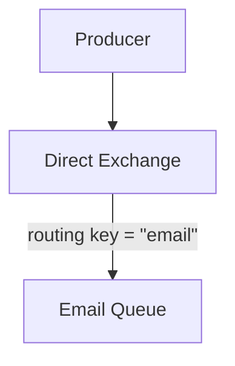

Another:

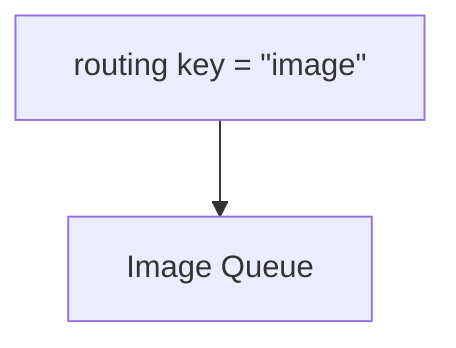

Conceptually:

```text
"email" → Email Queue
"image" → Image Queue
"payment" → Payment Queue
```

Use a direct exchange when you want explicit routing based on a specific key.

---

# 11. Fanout Exchange

A **fanout exchange** sends a message to all queues bound to it.

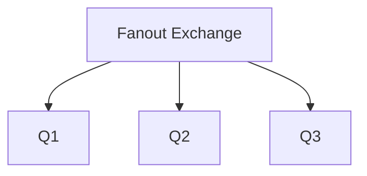

Suppose an event is:

```text
user.registered
```

It may be sent to:

```text
Email Queue
Analytics Queue
Welcome Notification Queue
```

No routing-key matching is required for the basic fanout behavior.

This is useful for **fan-out**.

---

# 12. Topic Exchange

A **topic exchange** routes messages according to routing-key patterns.

Example routing keys:

```text
order.created
order.paid
order.cancelled
payment.completed
payment.failed
```

A queue may bind to:

```text
order.*
```

and receive:

```text
order.created
order.paid
order.cancelled
```

Another queue could bind to:

```text
payment.*
```

and receive:

```text
payment.completed
payment.failed
```

Topic exchanges are useful when messages belong to hierarchical categories.

---

# 13. Topic Wildcards

RabbitMQ topic routing uses:

```text
*
```

and

```text
#
```

with specific semantics.

Conceptually:

```text
* = one word

# = zero or more words
```

For example:

```text
order.*
```

can match:

```text
order.created
order.paid
```

while:

```text
order.#
```

can match:

```text
order.created
order.payment.completed
order.shipping.delayed
```

The exact routing design should be kept simple enough that developers can reason about it.

---

# 14. Headers Exchange

A **headers exchange** routes messages using message headers instead of the routing key.

Conceptually:

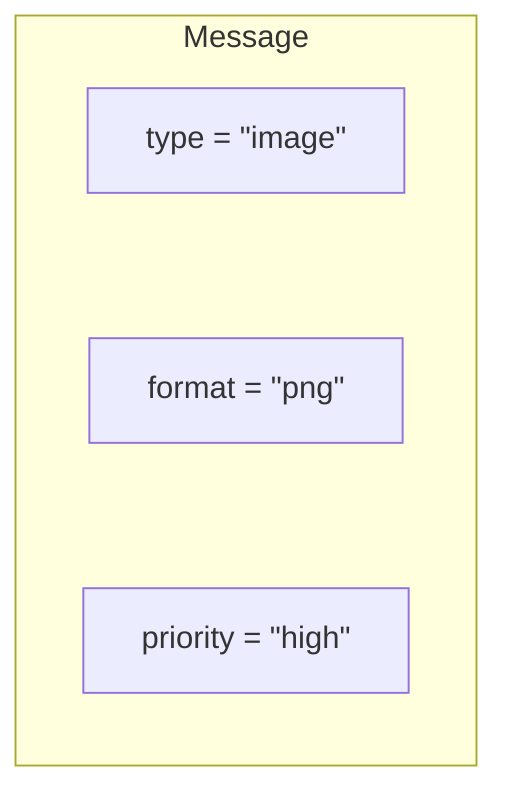

The exchange can route based on those attributes.

Headers exchanges are useful for more attribute-based routing, but they are less central to the basic RabbitMQ mental model than direct, fanout, and topic exchanges.

---

# 15. Exchange Types at a Glance

| Exchange | Main Routing Idea |
|---|---|
| Direct | Exact routing-key match |
| Fanout | Send to all bound queues |
| Topic | Pattern-based routing key |
| Headers | Route using message headers |

A simple mental model:

```text
Direct  → "Exactly this"
Fanout  → "Everyone"
Topic   → "Messages matching this pattern"
Headers → "Messages with these attributes"
```

---

# 16. RabbitMQ Work Queue

RabbitMQ can implement a work queue.

Architecture:

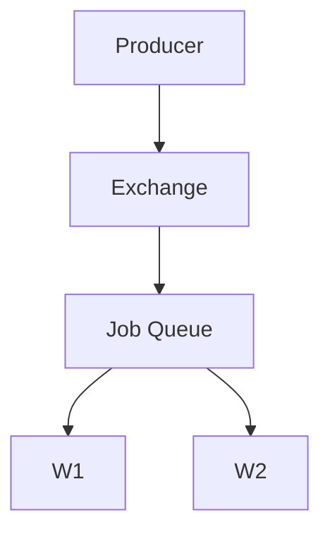

Suppose five image-processing jobs are waiting.

Two workers compete for those jobs.

```text
Job 1 → Worker 1
Job 2 → Worker 2
Job 3 → Worker 1
Job 4 → Worker 2
```

The goal is usually:

> Each job should be processed by one worker.

This is different from Pub/Sub fan-out.

---

# 17. RabbitMQ Pub/Sub

RabbitMQ can also implement Pub/Sub using exchanges and multiple queues.

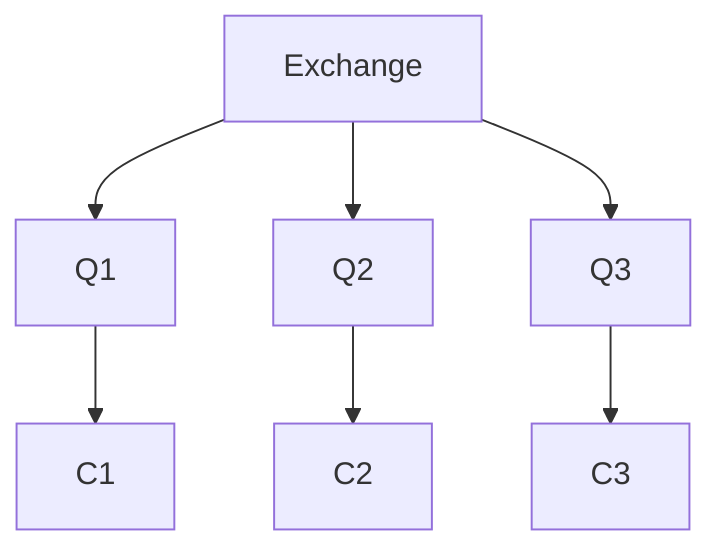

Each queue represents an independent consumer path.

A message published to a suitable exchange can therefore reach multiple queues.

This creates fan-out.

---

# 18. Acknowledgement Timing Matters

Bad pattern:

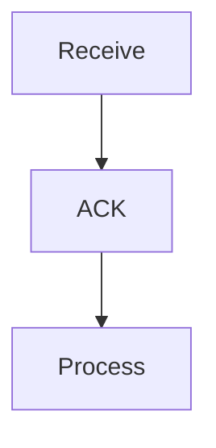

If the worker crashes during processing:

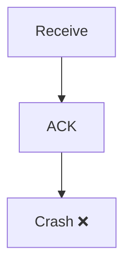

The broker may consider the message completed even though the business operation was not.

A safer conceptual flow is:

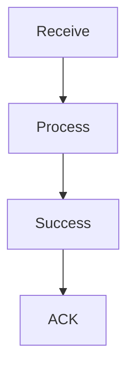

The exact reliability design depends on the application and failure model.

---

# 19. Durable Messaging

For important messages, losing a message because the broker restarts may be unacceptable.

RabbitMQ supports durability mechanisms involving:

- durable queues
- persistent messages
- appropriate acknowledgement behavior

But these settings should not be treated as a magical guarantee.

Durability is an architectural decision involving:

- broker configuration
- storage
- acknowledgements
- replication/availability
- failure recovery.

---

# 20. RabbitMQ and Prefetch

RabbitMQ can control how many unacknowledged messages a consumer receives using **prefetch** settings.

Conceptually:

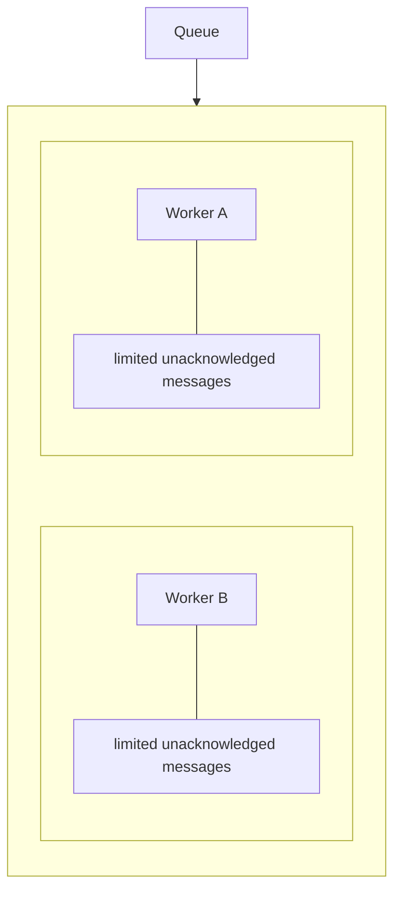

This helps prevent one worker from receiving an excessive amount of work before completing its current tasks.

Prefetch therefore participates in **work distribution and flow control**.

The correct value depends on:

- processing time
- message size
- worker concurrency
- fairness requirements
- downstream capacity.

---

# 21. RabbitMQ and Pub/Sub

The concepts from 05.06 map naturally to RabbitMQ:

```text
Pub/Sub Concept       RabbitMQ Concept

Publisher             Producer
Topic                  Exchange
Subscription           Queue + Binding
Subscriber             Consumer
Fan-out                Fanout exchange / multiple bindings
```

This is a useful learning bridge.

However, these are conceptual mappings rather than perfect one-to-one terminology across all messaging systems.

---

# 22. RabbitMQ vs Kafka — Preview

RabbitMQ and Kafka are both important messaging technologies, but they are designed around somewhat different models.

At a very high level:

| RabbitMQ | Kafka |
|---|---|
| Message broker | Distributed event streaming platform |
| Strong routing model | Partitioned log model |
| Queues/exchanges | Topics/partitions |
| Excellent for task/message routing | Excellent for high-throughput event streams |
| Consumer acknowledgement is central | Consumer offsets are central |
| Flexible routing | Strong partition/log model |

This is intentionally simplified.

**05.08 — Kafka** will examine Kafka properly.

Do not conclude:

> "Kafka is just a faster RabbitMQ."

They solve overlapping but different architectural problems.

---

# 23. RabbitMQ Is Not the Business Logic

This distinction is important.

RabbitMQ handles messaging.

Your application handles business logic.

```mermaid
flowchart TD
  accTitle: Messaging vs business logic
  accDescr: RabbitMQ sends a message to the worker, whose business logic uses the database / API / storage.
  N0["RabbitMQ"] -->|"message"| N1["Worker"] -->|"business logic"| N2["Database / API / Storage"]
```

For example:

RabbitMQ does not decide:

> "Subtract 2 from product stock."

The Inventory Worker does.

RabbitMQ transports the instruction/event.

---

# 24. Hands-On Exercise — Build a RabbitMQ Mental Model

Imagine an image-processing application.

Requirements:

- users upload images
- images must be resized
- multiple workers can process images
- failed jobs should be recoverable
- processing should happen asynchronously

Design:

```mermaid
flowchart TD
  accTitle: Image-processing design
  accDescr: Web Application, Exchange, Image Queue, then Worker A and Worker B.
  N0["Web Application"] --> N1["Exchange"] --> N2["Image Queue"] --> WA["Worker A"] & WB["Worker B"]
```

Answer:

### 1. What is the producer?

**Web Application**

### 2. What is the exchange?

**The routing component that receives the published message and routes it to the appropriate queue.**

### 3. What is the queue?

**The buffer holding image-processing jobs.**

### 4. What are the consumers?

**Worker A and Worker B.**

### 5. When should the worker ACK?

After the processing has successfully completed according to the application's success criteria.

---

# 25. Lab Challenge — Add Multiple Event Consumers

Now change the system.

When an image is uploaded, several independent systems should react:

```text
image.uploaded
```

Consumers:

- Image Processing
- Analytics
- Notification

Design:

```mermaid
flowchart TD
  accTitle: Multiple event consumers
  accDescr: The exchange routes to the Image, Analytics and Notification queues, each with a worker.
  E["Exchange"] --> G
  subgraph G[" "]
    direction TB
    subgraph G0[" "]
      direction LR
      GA0["Image Q"] --> GB0["Worker"]
    end
    subgraph G1[" "]
      direction LR
      GA1["Analytics Q"] --> GB1["Worker"]
    end
    subgraph G2[" "]
      direction LR
      GA2["Notification Q"] --> GB2["Worker"]
    end
    G0 ~~~ G1 ~~~ G2
  end
```

Questions:

1. Which exchange type could support simple fan-out?
2. Why should each consumer have its own queue?
3. What happens if Notification is down?
4. Should Image Processing stop?
5. Could a message be delivered again?
6. What should happen if processing succeeds but the ACK is lost?

These questions connect RabbitMQ to the reliability concepts introduced earlier.

---

# 26. When Does RabbitMQ Make Sense?

RabbitMQ is a strong candidate when you need:

- asynchronous background jobs
- task queues
- flexible routing
- work distribution
- event fan-out
- service decoupling
- acknowledgements
- controlled delivery
- moderate-to-high messaging workloads
- explicit broker-managed routing.

Examples:

```text
Image processing
Email processing
Order workflows
Background jobs
Notification pipelines
Service integration
Task distribution
```

---

# 27. Common Mistakes

### Mistake 1 — Thinking RabbitMQ Is Just a Queue

RabbitMQ is a broker containing routing and messaging capabilities. Queues are one important part of it.

### Mistake 2 — Sending Everything Through One Queue

Different workloads may need different queues and routing policies.

### Mistake 3 — ACKing Before Processing

This can acknowledge work before it has actually completed.

### Mistake 4 — Assuming Redelivery Means Exactly-Once Processing

A message can be delivered again.

### Mistake 5 — Ignoring Consumer Speed

Slow consumers create backlog.

### Mistake 6 — Adding Unlimited Workers

Workers can overload databases, APIs, or other downstream systems.

### Mistake 7 — Using RabbitMQ Without a Failure Model

Queues introduce new failure states. They do not remove them.

### Mistake 8 — Treating RabbitMQ and Kafka as Identical

They overlap but have different architectural models and strengths.

---

# 28. System Design View

RabbitMQ can sit inside a larger architecture:

```mermaid
flowchart TD
  accTitle: RabbitMQ in a larger system
  accDescr: Load Balancer, Application, publish message to RabbitMQ, three queues and workers, then Databases.
  L["Load Balancer"] --> A["Application"] -->|"Publish Message"| R["RabbitMQ"] --> Q1["Queue"] & Q2["Queue"] & Q3["Queue"]
  Q1 --> W1["Worker"]
  Q2 --> W2["Worker"]
  Q3 --> W3["Worker"]
  W1 & W2 & W3 --> D["Databases"]
```

RabbitMQ provides **asynchronous communication and workload coordination**.

It does not replace:

- databases
- caches
- APIs
- workers
- monitoring
- authentication
- business logic.

It becomes one component in the larger system.

---

# 29. Practical RabbitMQ Decision Framework

Before introducing RabbitMQ, ask:

### Communication

Do services need asynchronous communication?

### Routing

Do messages need flexible routing?

### Work Distribution

Should multiple workers compete for jobs?

### Fan-Out

Should one event reach multiple independent consumers?

### Reliability

What happens if a consumer crashes?

### Delivery

When is a message considered successfully processed?

### Backlog

What happens if consumers are slower than producers?

### Downstream Capacity

Can the database or external API handle increased worker concurrency?

### Operations

Can the team operate and monitor RabbitMQ reliably?

If these answers justify a broker, RabbitMQ can be a strong choice.

---

# 30. RabbitMQ Mental Model

Remember:

```mermaid
flowchart TD
  accTitle: RabbitMQ mental model
  accDescr: Producer, Exchange, routing to Queue, Consumer, process, then ACK.
  N0["Producer"] --> N1["Exchange"] -->|"routing"| N2["Queue"] --> N3["Consumer"] -->|"process"| N4["ACK"]
```

And:

```mermaid
flowchart TD
  accTitle: Exchange to queues to consumers
  accDescr: The exchange routes to queues A, B and C, consumed by consumers A, B and C.
  E["Exchange"] --> G
  subgraph G[" "]
    direction TB
    subgraph G0[" "]
      direction LR
      GA0["Queue A"] --> GB0["Consumer A"]
    end
    subgraph G1[" "]
      direction LR
      GA1["Queue B"] --> GB1["Consumer B"]
    end
    subgraph G2[" "]
      direction LR
      GA2["Queue C"] --> GB2["Consumer C"]
    end
    G0 ~~~ G1 ~~~ G2
  end
```

The exchange decides **where the message should go**.

The queue provides **waiting and delivery**.

The consumer performs **the actual work**.

The ACK communicates **successful processing**.

---

# 31. Key Principle

> **RabbitMQ is a message broker that receives messages from producers, routes them through exchanges, stores them in queues, and delivers them to consumers. Its power comes from flexible routing, work distribution, acknowledgements, and asynchronous communication—but reliable RabbitMQ architectures still require careful decisions about durability, retries, duplicates, ordering, consumer capacity, and failure recovery.**

---

# 32. Quick Reference

| RabbitMQ Concept | Meaning |
|---|---|
| Producer | Publishes messages |
| Exchange | Routes messages |
| Queue | Stores messages for consumers |
| Binding | Connects an exchange to a queue |
| Routing Key | Helps determine message routing |
| Consumer | Receives and processes messages |
| ACK | Confirms successful processing |
| Direct Exchange | Exact routing-key matching |
| Fanout Exchange | Broadcast to bound queues |
| Topic Exchange | Pattern-based routing |
| Headers Exchange | Header-based routing |
| Prefetch | Limits unacknowledged deliveries |
| Durable Queue | Queue intended to survive broker restart |
| Persistent Message | Message configured for durable storage |
| Redelivery | Message delivered again after unsuccessful processing |

---

# 33. Knowledge Check

### Q1. What is RabbitMQ?

**Answer:** A message broker used to route and deliver messages between producers and consumers.

### Q2. What does an exchange do?

**Answer:** It receives published messages and routes them to queues according to its routing rules.

### Q3. What is the difference between an exchange and a queue?

**Answer:** An exchange handles routing; a queue stores messages waiting for consumers.

### Q4. Which exchange broadcasts to all bound queues?

**Answer:** Fanout exchange.

### Q5. Which exchange uses routing-key patterns?

**Answer:** Topic exchange.

### Q6. Why are acknowledgements important?

**Answer:** They allow a consumer to tell RabbitMQ that processing has successfully completed.

### Q7. Can a message be processed more than once?

**Answer:** Yes. Redelivery can result in duplicate processing, so consumers may need idempotency.

### Q8. Does adding more workers always improve performance?

**Answer:** No. Workers may simply overload downstream systems.

---

# 34. Remember

```text
RabbitMQ is the broker.

Producer → publishes

Exchange → routes

Binding → connects routing to queues

Queue → holds messages

Consumer → processes

ACK → confirms successful processing

Worker scaling → increases processing capacity,
but only when downstream systems can handle it.
```

---

# 35. Next Chapter

## 05.08 — Kafka

Topics:

- What Kafka is
- Event streaming vs message queues
- Kafka topics
- Partitions
- Brokers
- Producers
- Consumers
- Consumer groups
- Offsets
- Partition keys
- Ordering within partitions
- Retention
- Replay
- Replication
- Kafka scaling
- Consumer lag
- Kafka vs RabbitMQ
- When Kafka makes sense
- Common Kafka mistakes
- Hands-on Kafka exercise
- System design trade-offs
