# 05.08 — Kafka

## Learning Objectives

By the end of this chapter, you should understand:

- What Apache Kafka is
- The difference between messaging and event streaming
- Topics, partitions, and brokers
- Producers and consumers
- Consumer groups and offsets
- Partition keys and ordering
- Retention and replay
- Replication and failure handling
- Consumer lag
- Kafka vs RabbitMQ
- When Kafka makes sense—and when it does not

---

# Beginner Vocabulary

Before learning Kafka architecture, learn these words first.

| Term | Beginner-Friendly Meaning |
|---|---|
| **Kafka** | A system for storing and streaming large amounts of events/records |
| **Event** | A record describing something that happened, such as `order.created` |
| **Record** | An individual piece of data stored in Kafka |
| **Producer** | An application that sends records to Kafka |
| **Consumer** | An application that reads records from Kafka |
| **Topic** | A named stream/category where related records are stored |
| **Partition** | A smaller ordered section of a topic |
| **Broker** | A Kafka server that stores and serves data |
| **Cluster** | A group of Kafka brokers working together |
| **Partition Key** | A value used to decide which partition receives a record |
| **Offset** | The position of a record inside a partition |
| **Consumer Group** | Multiple consumers working together to process a topic |
| **Retention** | How long Kafka keeps records |
| **Replay** | Reading older records again |
| **Consumer Lag** | How far a consumer is behind the available records |
| **Replication** | Keeping copies of partition data on multiple brokers |
| **Leader** | The broker currently responsible for a partition |
| **Replica** | Another copy of a partition |
| **Ordering** | The sequence in which records are stored/read within an ordering boundary such as a partition |
| **Hot Partition** | A partition receiving much more traffic than others |
| **Throughput** | How much data/events the system can process over time |

### The 10 Words You Must Remember

If Kafka feels overwhelming, remember these first:

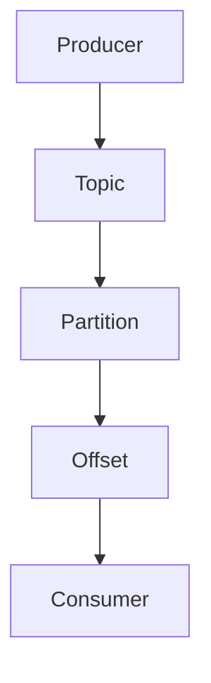

And:

```text
Broker
Cluster
Consumer Group
Retention
Lag
```

A simple mental translation:

```text
Producer       = "I send the event."

Topic          = "This event belongs here."

Partition      = "This is the section where it is stored."

Offset         = "This is the event's position."

Consumer       = "I read the event."

Consumer Group = "We process the topic together."

Broker         = "I store and serve Kafka data."

Retention      = "Keep the event for this long."

Lag            = "The consumer is this far behind."

Replay         = "Read old events again."
```

### One Important Vocabulary Warning

Kafka uses **topic**, **partition**, and **consumer group** differently from a simple queue.

Do not think:

```text
Topic = Queue
Partition = Worker
Consumer Group = Queue
```

Instead:

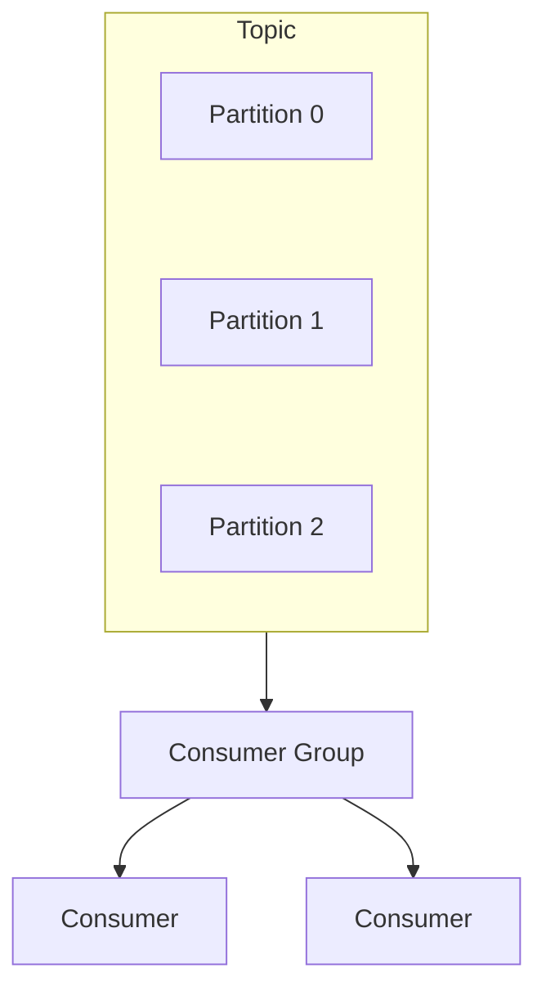

The **topic** is the logical stream, **partitions** provide the distributed ordered sequences inside that stream, and the **consumer group** determines how consumers cooperate to process those partitions.

---

# 1. What Is Kafka?

Apache Kafka is a **distributed event streaming platform** designed to publish, store, and process streams of records at scale.

A simplified Kafka architecture is:

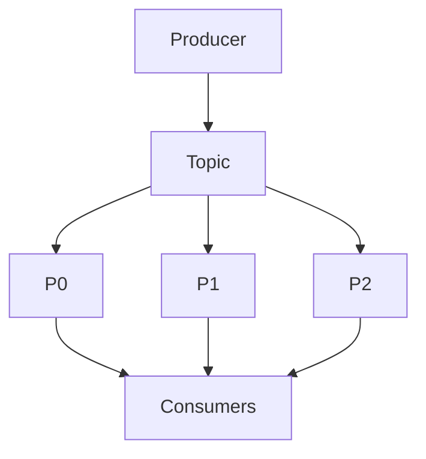

The important idea is:

> **Kafka stores an ordered sequence of records in partitions, allowing multiple consumers to process those records independently.**

Kafka is commonly used for:

- event streaming
- service integration
- analytics pipelines
- activity/event collection
- data pipelines
- log and telemetry streams
- asynchronous processing
- event-driven architectures.

---

# 2. Why Does Kafka Exist?

Imagine a large application generating millions of events:

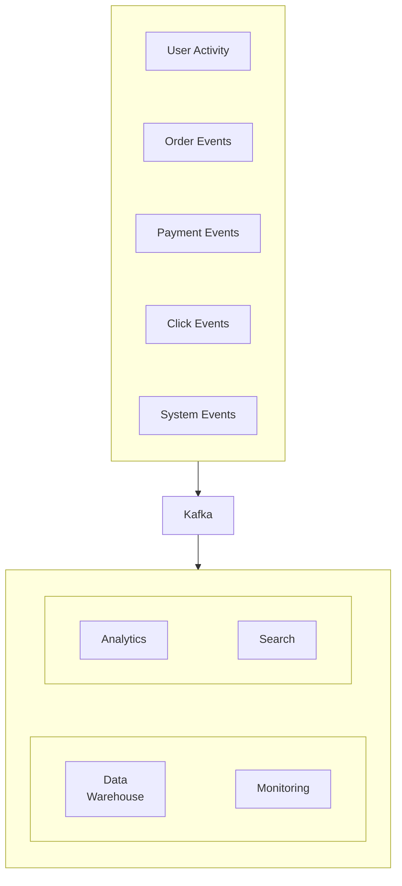

Without a shared event-streaming platform, each producer may need to communicate with multiple downstream systems.

Kafka provides a durable stream that multiple consumers can read independently.

The key architectural idea is:

> **Produce the event once; allow multiple consumers to process it according to their own needs.**

---

# 3. Kafka Is Not Just a Queue

A traditional work queue is often modeled as:

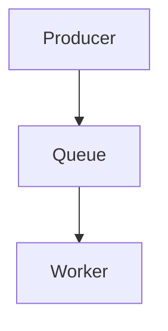

After a worker successfully processes a message, the message may be considered completed and removed from the active queue.

Kafka is better understood as:

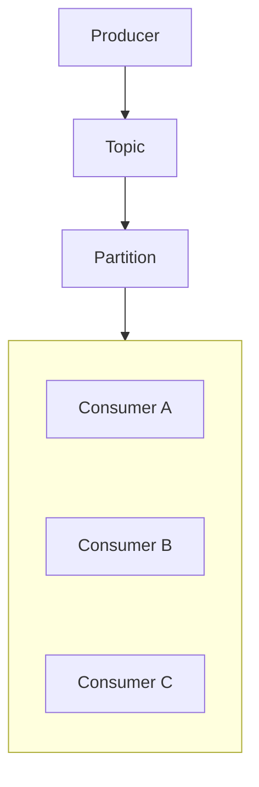

The records remain available according to the topic's **retention policy**.

Consumers track where they are in the stream.

This makes **replay** and independent consumption possible.

---

# 4. What Is a Kafka Topic?

A **topic** is a named stream/category of records.

Examples:

```text
orders
payments
user-events
clicks
notifications
system-logs
```

A producer publishes records to a topic:

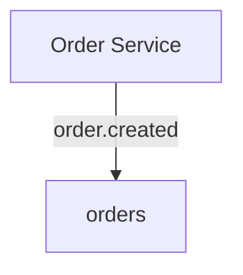

A topic is therefore a logical name for a stream of related events.

---

# 5. What Is a Partition?

A Kafka topic can be divided into multiple **partitions**.

For example:

```text
Topic: orders

Partition 0
----------------
Record 0
Record 1
Record 2
Record 3

Partition 1
----------------
Record 0
Record 1
Record 2

Partition 2
----------------
Record 0
Record 1
Record 2
```

Partitions are fundamental to Kafka's scalability model.

A large topic does not have to be stored and processed by one node.

It can be distributed across multiple brokers.

---

# 6. Ordering Exists Within a Partition

Kafka provides ordering within a partition.

For example:

```text
Partition 0

Offset
  0 → order.created
  1 → order.paid
  2 → order.shipped
```

A consumer reading that partition can observe the records in that order.

But do not assume global ordering across the entire topic.

For example:

```text
Partition 0: A → B → C

Partition 1: X → Y → Z
```

There is no single global sequence such as:

```text
A → X → B → Y → C → Z
```

that Kafka automatically guarantees.

This is one of Kafka's most important design constraints.

---

# 7. Why Multiple Partitions?

Partitions provide parallelism.

Suppose:

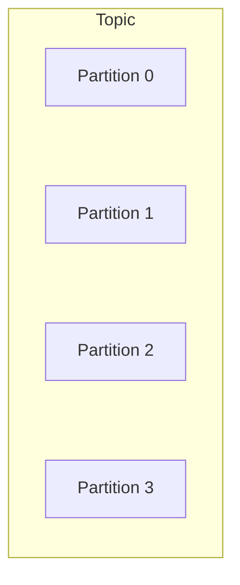

Different consumers can process different partitions concurrently.

```text
P0 → Consumer A
P1 → Consumer B
P2 → Consumer C
P3 → Consumer D
```

This allows Kafka to process large streams without forcing every consumer through one sequential path.

---

# 8. What Is a Kafka Broker?

A **broker** is a Kafka server that stores and serves topic partitions.

For example:

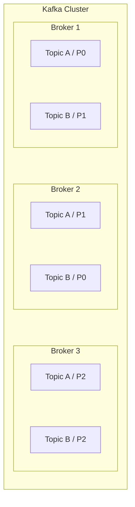

A Kafka cluster normally contains multiple brokers.

This allows Kafka to distribute:

- storage
- network traffic
- partition processing
- replicas.

---

# 9. Producer

A **producer** publishes records to Kafka.

Example:

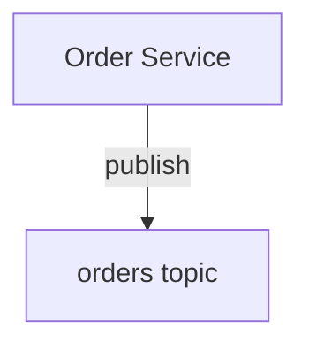

The producer may specify a **key**.

For example:

```text
key = customer_id
value = order.created
```

The key can influence which partition receives the record.

This becomes extremely important for ordering and data locality.

---

# 10. Partition Keys

Suppose an application wants all events for the same customer to remain ordered.

It could use:

```text
customer_id
```

as the partition key.

Conceptually:

```text
customer 101 → Partition 0
customer 205 → Partition 2
customer 301 → Partition 1
```

Then:

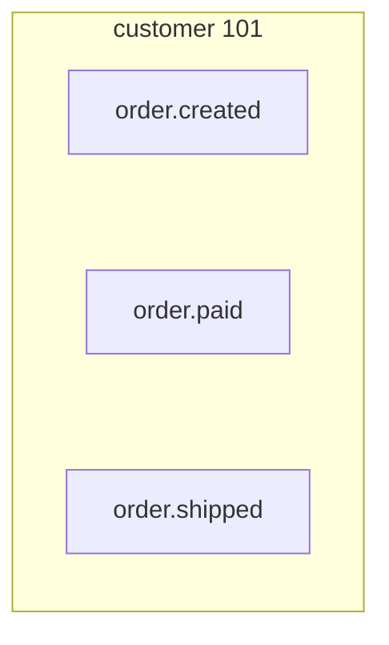

can be routed to the same partition.

This can preserve ordering for that key.

However, the partition-key strategy must also provide reasonable workload distribution.

---

# 11. The Partition-Key Trade-Off

A key that provides excellent ordering may create poor distribution.

Imagine one customer generates 80% of all traffic.

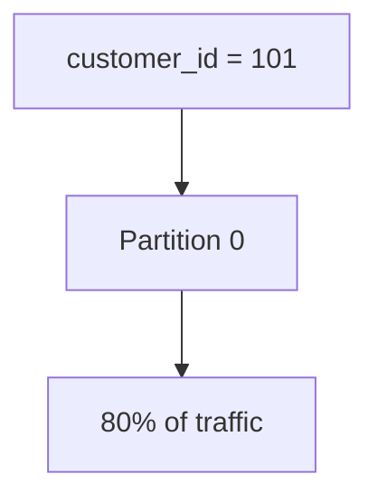

Now Partition 0 becomes hot.

This connects directly to:

> **04.17 — Hot Partitions**

Therefore, choosing a Kafka partition key is a system-design decision.

You must consider:

- ordering requirements
- distribution
- cardinality
- traffic patterns
- hot keys
- data locality
- consumer behavior.

---

# 12. Consumer

A **consumer** reads records from Kafka.

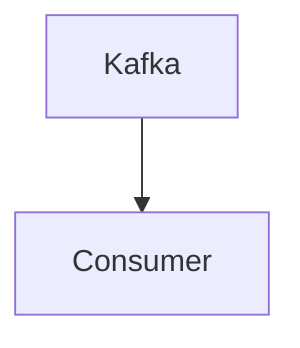

Unlike a simple queue model, the consumer tracks its position in the stream.

That position is represented by an **offset**.

---

# 13. What Is an Offset?

An **offset** identifies a record's position within a partition.

Example:

```text
Partition 0

Offset 0 → Event A
Offset 1 → Event B
Offset 2 → Event C
Offset 3 → Event D
```

A consumer might currently be at:

```text
Offset 2
```

It knows which records it has already processed and where it should continue.

Offsets are therefore central to Kafka's consumption model.

---

# 14. Kafka Consumer Groups

A **consumer group** is a group of consumers working together to consume a topic.

Example:

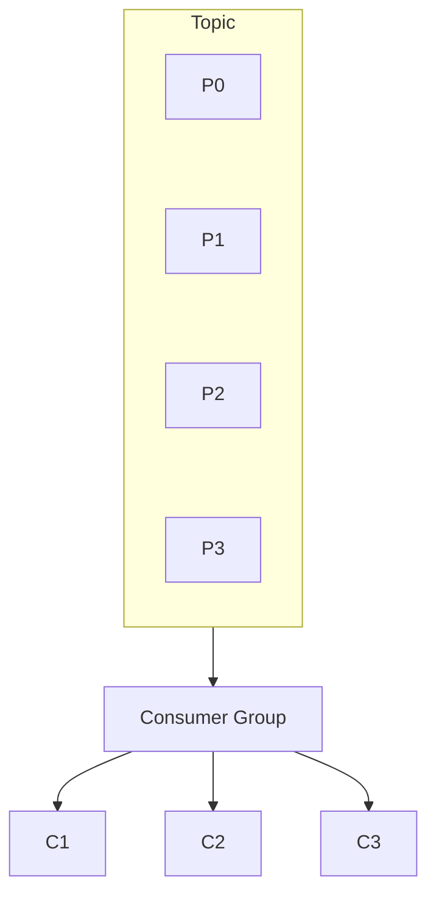

Partitions can be distributed among consumers in the group.

For example:

```text
C1 → P0
C2 → P1
C3 → P2 + P3
```

This allows the group to process the topic in parallel.

---

# 15. One Partition, One Consumer in a Group

A key mental model:

> **Within a consumer group, a partition is assigned to one consumer at a time.**

But another consumer group can independently read the same topic:

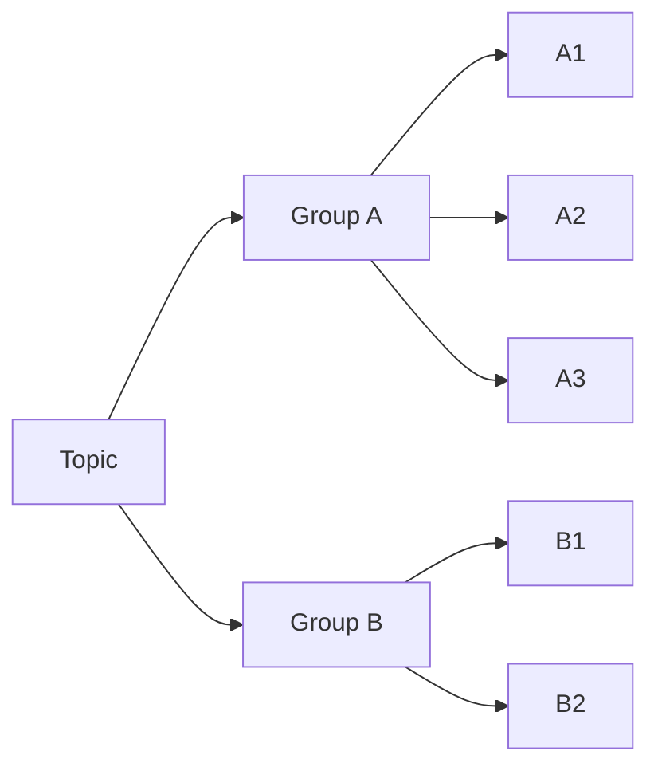

This is one of Kafka's most powerful features.

---

# 16. Multiple Consumer Groups

Suppose an `orders` topic contains:

```text
order.created
order.paid
order.shipped
```

Three different systems need the events:

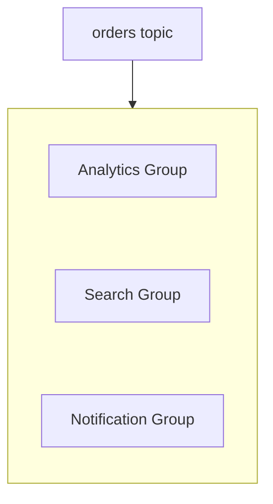

Each group maintains its own consumption position.

Analytics can process the stream independently of Search.

---

# 17. Kafka and Pub/Sub

The key difference from the generic Pub/Sub model is that Kafka gives us a **persistent partitioned log with offsets and retention**.

---

# 18. Retention

Kafka normally retains records according to configured policies.

For example:

```text
orders topic

Day 1 → Events
Day 2 → Events
Day 3 → Events
Day 4 → Events
```

After the retention period or other retention limits are reached, older records may be removed.

This means:

> **Kafka does not require a consumer to process a record immediately for the record to disappear.**

The record can remain available while it is within the retention policy.

---

# 19. Replay

Because records can remain in Kafka after being consumed, a consumer can potentially read historical records again.

For example:

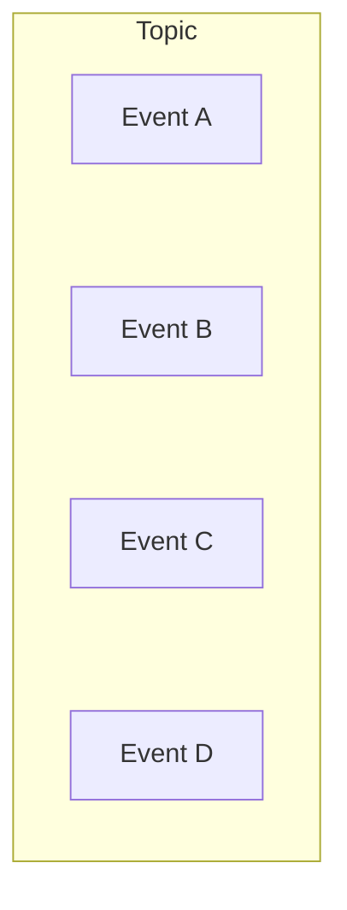

A consumer has processed:

```text
A B C D
```

Later, a new consumer can start from an earlier position.

```text
Replay:
A B C D
```

This is useful for:

- rebuilding derived data
- debugging
- recovering from processing bugs
- creating new consumers
- reprocessing historical events.

Replay is one of Kafka's major architectural strengths.

---

# 20. Kafka Is Not an Infinite Event Archive

A common mistake is assuming:

> "Kafka stores every event forever."

It does not by default.

Retention depends on configuration and available storage.

For example:

```text
Retention:
7 days
```

means old records may eventually disappear.

If permanent historical storage is required, the architecture may need another system such as object storage or a data warehouse.

---

# 21. Consumer Lag

Suppose Kafka receives:

```text
1,000 events/sec
```

but a consumer group processes:

```text
700 events/sec
```

The consumer falls behind.

This is called **consumer lag**.

Conceptually:

```text
Kafka position
     |
     |  10,000
     |
     |     ← lag
     |
Consumer position
     |
     |   7,000
```

Lag indicates that consumers are behind the available stream.

It is an important operational metric.

---

# 22. What Causes Consumer Lag?

Possible causes include:

- insufficient consumers
- slow processing
- slow database
- downstream API latency
- expensive computation
- network problems
- consumer failures
- rebalancing
- uneven partition traffic
- hot partitions.

The correct response is not always:

> "Add more consumers."

First identify the bottleneck.

---

# 23. Partition Count Limits Consumer Parallelism

Suppose a topic has:

```text
3 partitions
```

and the consumer group has:

```text
10 consumers
```

You cannot have all 10 consumers actively consume separate partitions simultaneously from that topic within the same group.

Conceptually:

```text
P0 → C1
P1 → C2
P2 → C3

C4–C10
  ↓
No partition currently assigned
```

Therefore:

> **Partition count places an upper bound on active parallelism within a consumer group for a topic.**

This makes partition planning important.

---

# 24. More Partitions Are Not Free

Increasing partitions can improve parallelism, but it also introduces:

- more metadata
- more storage structures
- more network activity
- more coordination
- more operational complexity
- more potential unevenness.

So:

> More partitions ≠ automatically better architecture.

Choose a partition count based on expected throughput, parallelism, retention, and operational requirements.

---

# 25. Replication

Kafka can replicate partitions across brokers.

Conceptually:

```text
Partition 0

Broker 1 → Leader
Broker 2 → Replica
Broker 3 → Replica
```

If a broker fails, another replica may be able to take over according to the cluster's configured replication and availability mechanisms.

Replication improves resilience.

But it also increases:

- storage usage
- network traffic
- operational complexity.

---

# 26. Kafka Failure Scenario

Suppose:

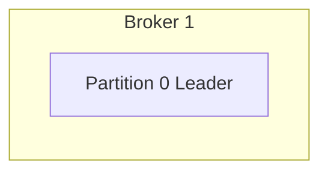

Broker 1 fails.

If healthy replicas exist:

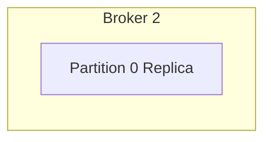

the cluster can perform a leadership transition according to its configured mechanisms.

Consumers may then continue reading after the cluster recovers the partition's availability.

This is why replication is important for production Kafka deployments.

---

# 27. Kafka vs RabbitMQ

Both are messaging technologies, but their mental models differ.

| RabbitMQ | Kafka |
|---|---|
| Message broker | Event streaming platform |
| Exchanges + queues | Topics + partitions |
| Routing is central | Partitioned log is central |
| ACK-based delivery model | Offset-based consumption model |
| Work queues are common | Event streams are common |
| Flexible routing | High-throughput partitioned streams |
| Message can be removed after successful processing | Records remain according to retention |
| Replay is not the central model | Replay is a major capability |
| Consumer groups are not the same central concept | Consumer groups are fundamental |

This does **not** mean one is universally better.

The right choice depends on the problem.

---

# 28. Example — RabbitMQ vs Kafka

Suppose you need to process:

```text
resize_uploaded_image
```

and only one worker needs to perform the task.

A work queue is a natural fit:

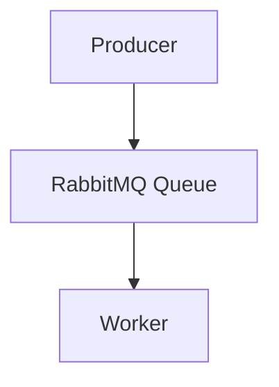

Now suppose millions of user activity events must feed:

- analytics
- recommendations
- fraud detection
- data warehouse
- monitoring

A persistent event stream may be a better fit:

```mermaid
flowchart TD
  accTitle: A persistent event stream
  accDescr: Applications, Kafka Topic, then Analytics, Recommendations, Fraud, Warehouse and Monitoring.
  N0["Applications"] --> N1["Kafka Topic"] --> G
  subgraph G[" "]
    direction TB
    I0["Analytics"] ~~~ I1["Recommendations"] ~~~ I2["Fraud"] ~~~ I3["Warehouse"] ~~~ I4["Monitoring"]
  end
```

The consumers can independently read and process the stream.

---

# 29. Kafka and Databases

Kafka does not replace a relational database simply because it stores data.

For example:

```mermaid
flowchart TD
  accTitle: Kafka and PostgreSQL
  accDescr: Kafka holds the event stream; PostgreSQL holds the current application state.
  K["Kafka"] --> E["Event Stream"]
  P["PostgreSQL"] --> S["Current Application State"]
```

A system may use Kafka to transport events while PostgreSQL stores authoritative transactional state.

Another service may consume Kafka events and build its own read model.

This is an important example of **polyglot architecture**.

---

# 30. Hands-On Exercise — Model a Kafka System

Imagine an e-commerce application.

The Order Service produces:

```text
order.created
order.paid
order.shipped
```

Design a Kafka architecture.

## Step 1 — Create a Topic

Use:

```text
orders
```

## Step 2 — Add Partitions

For example:

```mermaid
flowchart TD
  accTitle: Partitions of orders
  accDescr: The orders topic has partitions P0, P1 and P2.
  subgraph T["orders"]
    direction TB
    P0["P0"] ~~~ P1["P1"] ~~~ P2["P2"]
  end
```

## Step 3 — Add Consumer Groups

```mermaid
flowchart TD
  accTitle: Consumer groups on orders
  accDescr: The orders topic is read by the Analytics, Notification and Fraud groups.
  T["orders"] --> G
  subgraph G[" "]
    direction TB
    I0["Analytics Group"] ~~~ I1["Notification Group"] ~~~ I2["Fraud Group"]
  end
```

## Step 4 — Decide the Partition Key

Possible options:

```text
order_id
customer_id
```

Ask:

> Which key provides the ordering and distribution characteristics the system actually needs?

There is no universal answer.

---

# 31. Lab Challenge — Find the Problem

Suppose:

```text
orders topic

P0 → 90% of traffic
P1 → 5%
P2 → 5%
```

Consumers:

```text
C1 → P0
C2 → P1
C3 → P2
```

Consumer C1 has very high lag.

### Questions

1. Is the problem necessarily insufficient total consumer capacity?
2. What could cause P0 to receive most traffic?
3. Could the partition key be responsible?
4. Would adding another consumer automatically fix P0?
5. What metrics should you inspect?

The likely investigation starts with:

```mermaid
flowchart TD
  accTitle: Where to investigate
  accDescr: Hot Partition, then Partition Key, then Traffic Distribution, then Consumer Processing Rate, then Downstream Bottleneck.
  N0["Hot Partition"] --> N1["Partition Key"] --> N2["Traffic Distribution"] --> N3["Consumer Processing Rate"] --> N4["Downstream Bottleneck"]
```

---

# 32. Lab Challenge — Replay

Suppose Analytics processed:

```text
Events 1–1,000,000
```

but a bug caused incorrect analytics data.

The event stream is still within its retention period.

Question:

> What Kafka capability could allow Analytics to process historical events again?

**Answer:** Replay from an earlier offset.

This is one of the major reasons Kafka's retention model is valuable.

---

# 33. When Does Kafka Make Sense?

Kafka is a strong candidate when you need:

- high-throughput event streams
- multiple independent consumers
- durable event retention
- replay
- partition-based scalability
- event-driven architectures
- analytics pipelines
- data integration
- large streams of activity/events
- independent consumer groups.

Examples:

```text
User activity streams
Order events
Payment events
IoT events
Application telemetry
Data pipelines
Analytics pipelines
Event-driven microservices
```

---

# 34. When Might Kafka Be Unnecessary?

Kafka introduces substantial operational complexity.

It may be unnecessary when:

- the application is small
- simple background jobs are the only requirement
- one queue is sufficient
- immediate request/response is enough
- event replay is unnecessary
- throughput is modest
- the team does not need a distributed event-streaming platform.

For example:

```mermaid
flowchart TD
  accTitle: A simpler design
  accDescr: Web App, then Simple Job Queue, then Worker.
  N0["Web App"] --> N1["Simple Job Queue"] --> N2["Worker"]
```

may be much easier than operating a Kafka cluster.

---

# 35. Common Mistakes

### Mistake 1 — Thinking Kafka Is Just a Faster Queue

Kafka's persistent partitioned-log model is fundamentally important.

### Mistake 2 — Assuming Global Ordering

Ordering is provided within partitions, not automatically across the entire topic.

### Mistake 3 — Ignoring the Partition Key

A poor key can create hot partitions.

### Mistake 4 — Adding Unlimited Consumers

Consumer parallelism is constrained by partition count within a consumer group.

### Mistake 5 — Assuming More Partitions Are Always Better

Partitions improve parallelism but add operational cost.

### Mistake 6 — Ignoring Consumer Lag

A consumer that exists but cannot keep up is still a system bottleneck.

### Mistake 7 — Assuming Kafka Stores Events Forever

Retention is configurable and finite unless the architecture provides another long-term store.

### Mistake 8 — Treating Kafka as a Database

Kafka is an event-streaming platform, not a replacement for every database workload.

### Mistake 9 — Ignoring Event Schema Evolution

Many independent consumers depend on event contracts.

---

# 36. System Design View

A larger Kafka architecture may look like:

```mermaid
flowchart TD
  accTitle: Kafka as an event backbone
  accDescr: Applications (Order Service, User Service) publish to Kafka topics / partitions, read by Analytics, Search and Notifications, which feed the data warehouse, search index and notification DB.
  A["Applications"] --> OS["Order Service"] & US["User Service"] --> K["Kafka"] --> TP["Topics / Partitions"] --> R
  subgraph R[" "]
    direction TB
    subgraph R0[" "]
      direction LR
      RA0["Analytics"] --> RB0["Data Warehouse"]
    end
    subgraph R1[" "]
      direction LR
      RA1["Search"] --> RB1["Search Index"]
    end
    subgraph R2[" "]
      direction LR
      RA2["Notifications"] --> RB2["Notification DB"]
    end
    R0 ~~~ R1 ~~~ R2
  end
```

Kafka becomes a **shared event backbone**.

But that also means:

> If Kafka becomes a critical dependency, its availability, capacity, replication, monitoring, and failure recovery become critical system-design concerns.

---

# 37. Kafka Decision Framework

Before choosing Kafka, ask:

### 1. Is the workload an event stream?

If yes, Kafka may fit naturally.

### 2. Do multiple independent consumers need the same events?

If yes, Kafka's consumer-group model can be useful.

### 3. Do consumers need replay?

If yes, Kafka is particularly attractive.

### 4. Is throughput large enough to justify partitions?

If no, a simpler queue may be better.

### 5. Does ordering matter?

Define the ordering scope before choosing the partition key.

### 6. What should determine partition placement?

Choose the key based on:

- ordering
- distribution
- cardinality
- workload.

### 7. How much lag is acceptable?

Define operational thresholds.

### 8. Who operates Kafka?

A powerful distributed system still creates operational responsibilities.

---

# 38. Kafka Mental Model

Remember:

```mermaid
flowchart TD
  accTitle: Kafka mental model
  accDescr: Producer, Topic, partitions P0, P1 and P2, then a consumer group of three consumers.
  P["Producer"] --> T["Topic"] --> P0["P0"] & P1["P1"] & P2["P2"] --> CG["Consumer Group"] --> G
  subgraph G[" "]
    direction TB
    I0["Consumer"] ~~~ I1["Consumer"] ~~~ I2["Consumer"]
  end
```

And:

```text
Partition → ordered sequence
Offset    → position in partition
Group     → consumers sharing work
Retention → how long records remain available
Lag       → how far consumers are behind
```

---

# 39. Key Principle

> **Kafka is a distributed event streaming platform built around durable, partitioned logs. Topics organize streams, partitions provide ordering and scalability, consumer groups provide parallel processing, offsets track consumption, and retention enables independent consumption and replay. Kafka is powerful when a system needs high-throughput event streams and multiple independent consumers, but its partitioning, ordering, lag, retention, replication, and operational complexity must be designed deliberately.**

---

# 40. Quick Reference

| Kafka Concept | Meaning |
|---|---|
| Producer | Publishes records |
| Topic | Named stream of records |
| Partition | Ordered sequence within a topic |
| Broker | Kafka server storing/serving partitions |
| Partition Key | Determines partition placement |
| Consumer | Reads records |
| Consumer Group | Consumers cooperating to process a topic |
| Offset | Position of a record within a partition |
| Retention | How long records remain available |
| Replay | Reading historical records again |
| Consumer Lag | Difference between available records and consumer progress |
| Replication | Keeping copies of partition data |
| Hot Partition | Partition receiving disproportionate workload |

---

# 41. Knowledge Check

### Q1. What is Kafka?

**Answer:** A distributed event streaming platform for publishing, storing, and processing streams of records.

### Q2. Why does Kafka use partitions?

**Answer:** Partitions provide scalability, parallelism, and ordered sequences within each partition.

### Q3. Where does Kafka guarantee ordering?

**Answer:** Within an individual partition.

### Q4. What is an offset?

**Answer:** A position identifying a record within a partition.

### Q5. What does a consumer group do?

**Answer:** It allows multiple consumers to cooperate in processing a topic's partitions.

### Q6. Can two different consumer groups read the same topic?

**Answer:** Yes. Each group maintains its own consumption progress.

### Q7. Why is the partition key important?

**Answer:** It influences data distribution and can preserve ordering for records sharing the same key.

### Q8. What is consumer lag?

**Answer:** The amount by which a consumer or consumer group is behind the available records in the Kafka stream.

### Q9. Why is replay possible?

**Answer:** Kafka retains records according to its retention policy, allowing consumers to read from earlier offsets while those records remain available.

### Q10. Does Kafka replace every message queue?

**Answer:** No. Kafka and traditional message brokers solve overlapping but different problems and have different architectural trade-offs.

---

# 42. Remember

```text
Kafka = distributed event stream

Topic = named stream

Partition = ordered sequence

Broker = Kafka server

Producer = publishes

Consumer = reads

Consumer Group = shares processing

Offset = position

Retention = how long records remain

Replay = read historical records again

Lag = consumer falling behind

Partition Key = controls distribution and ordering scope
```

The most important relationship is:

```text
Topic
  |
  +-- Partition 0 → ordered records
  |
  +-- Partition 1 → ordered records
  |
  +-- Partition 2 → ordered records
           |
           v
     Consumer Group
```

And the most important design question is:

> **How should events be partitioned so that the system gets the ordering, distribution, and processing capacity it actually needs?**

---

# 43. Next Chapter

## 05.09 — Message Ordering

Topics:

- Why ordering matters
- Global ordering vs partial ordering
- Ordering within a queue
- Ordering within a Kafka partition
- Ordering keys
- FIFO concepts
- Multiple consumers and ordering
- Concurrent processing
- Completion order vs delivery order
- Retries and ordering
- Failed messages and later messages
- Partitioning and ordering
- Reordering
- When ordering is actually required
- Designing around ordering requirements
- Real-world examples
- Hands-on ordering exercise
- Common mistakes
- System design trade-offs
