# 05.09 — Message Ordering

## Learning Objectives

By the end of this chapter, you should understand:

- What message ordering means
- Why ordering matters in distributed systems
- Global ordering vs partial ordering
- Ordering in queues
- Ordering in Kafka partitions
- Ordering keys
- FIFO processing
- Why multiple consumers complicate ordering
- Delivery order vs processing/completion order
- How retries can affect ordering
- What happens when one message fails
- How partitioning affects ordering
- When ordering is actually necessary
- How to design around ordering requirements

---

# Beginner Vocabulary

| Term | Beginner-Friendly Meaning |
|---|---|
| **Ordering** | The sequence in which messages/events are handled |
| **FIFO** | First In, First Out — the first message enters first and is processed first |
| **Sequence** | The expected order of events |
| **Ordering Key** | A value used to keep related messages in the same ordering group |
| **Partition** | An ordered section of a Kafka topic |
| **Concurrent** | Multiple pieces of work happening at the same time |
| **Delivery Order** | The order in which messages are given to consumers |
| **Processing Order** | The order in which consumers actually process messages |
| **Completion Order** | The order in which processing finishes |
| **Retry** | Trying to process a failed message again |
| **Reordering** | Changing messages back into the required sequence |
| **Head-of-Line Blocking** | Later messages wait because an earlier message is blocking progress |
| **Sequence Number** | A number used to identify the expected position of an event |

### The Simple Mental Model

```text
Messages arrive:

A → B → C → D

If order matters:

A must happen before B
B must happen before C
C must happen before D
```

But if the messages are independent:

```text
A
B
C
D
```

they may be processed concurrently.

The first system-design question is therefore:

> **Does the business actually require these messages to be processed in order?**

---

# 1. What Is Message Ordering?

**Message ordering** means controlling the sequence in which related messages are delivered, processed, or completed.

Suppose an order goes through:

```text
order.created
order.paid
order.shipped
```

The correct sequence is:

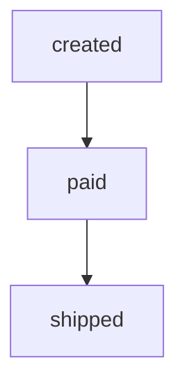

Processing:

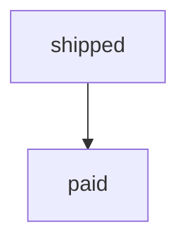

would be incorrect.

Ordering therefore becomes a **correctness requirement** when the meaning of one event depends on another.

---

# 2. Why Does Ordering Matter?

Some events represent a sequence of state changes.

Example:

```text
Account balance:

Deposit ₹1,000
Withdraw ₹500
Deposit ₹200
```

The intended sequence is:

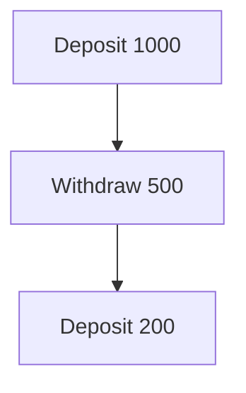

If the operations are processed in a different order, the final state may be incorrect.

Another example:

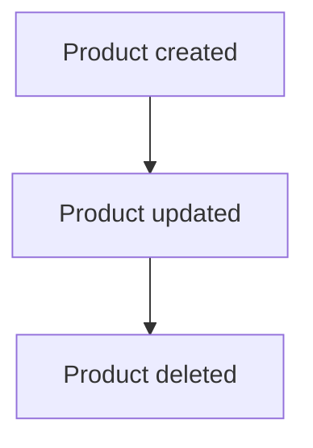

Processing:

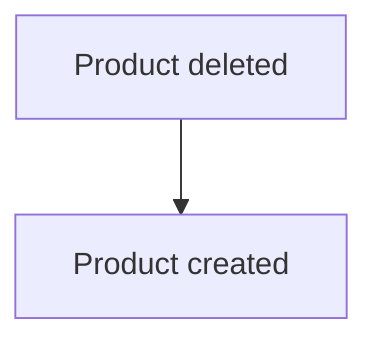

could produce an incorrect state.

---

# 3. Not Every Message Needs Ordering

Consider image processing:

```text
image-101
image-102
image-103
image-104
```

If each image is independent:

```text
image-101 ──→ Worker A
image-102 ──→ Worker B
image-103 ──→ Worker C
image-104 ──→ Worker D
```

there may be no reason to enforce:

```text
101 → 102 → 103 → 104
```

Doing so would reduce parallelism unnecessarily.

Therefore:

> **Ordering should be introduced because the business requires it, not because messages happen to arrive in a particular sequence.**

---

# 4. Global Ordering

**Global ordering** means every message in a stream has one consistent sequence.

For example:

```text
A → B → C → D → E → F
```

There is only one ordering.

This is simple conceptually.

But global ordering can become expensive at scale because it limits parallel processing.

If only one sequence exists:

```text
A → B → C → D → E → F
         ↑
      one path
```

you cannot freely process unrelated messages in parallel without carefully preserving the sequence.

---

# 5. Partial Ordering

Often, only related messages need ordering.

Suppose we have:

```text
Customer A:
A1 → A2 → A3

Customer B:
B1 → B2 → B3

Customer C:
C1 → C2 → C3
```

There may be no requirement for:

```text
A1 before B1
B2 before C1
C3 before A3
```

Only each customer's events need ordering.

This is **partial ordering**.

Conceptually:

```text
Customer A → A1 → A2 → A3
Customer B → B1 → B2 → B3
Customer C → C1 → C2 → C3
```

These sequences can potentially be processed concurrently.

This is often a much better scaling model.

---

# 6. The Important Design Question

Instead of asking:

> "How do I order every message?"

ask:

> **"Which messages must be ordered relative to each other?"**

For example:

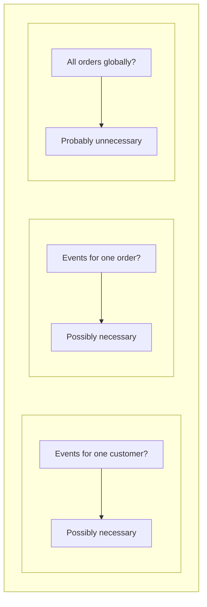

This distinction can dramatically change the architecture.

---

# 7. FIFO — First In, First Out

FIFO means:

> **The first message entering the system should be processed before later messages.**

Example:

```text
Queue

A
B
C
D
```

Expected processing:

```text
A → B → C → D
```

FIFO is easy to describe.

Guaranteeing it across a distributed system is more complicated.

---

# 8. Queue Ordering

A simple queue may provide FIFO-like behavior:

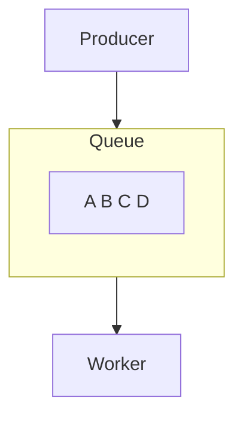

The worker receives:

```text
A → B → C → D
```

But even if messages are delivered in order, that does not automatically mean they **finish** in order.

---

# 9. Delivery Order vs Completion Order

Suppose a worker receives:

```text
A → B
```

But processing times differ:

```text
A = 5 seconds
B = 1 second
```

If processing is concurrent:

```text
A ───────────────→ complete
B ───→ complete
```

The completion order becomes:

```text
B → A
```

So:

```text
Delivery order:
A → B

Completion order:
B → A
```

This distinction is extremely important.

> **Receiving messages in order does not automatically guarantee completing them in order.**

---

# 10. Concurrent Processing Breaks Simple Ordering

Suppose:

```text
Queue
A B C D
```

and four workers process messages simultaneously:

```text
A → Worker 1
B → Worker 2
C → Worker 3
D → Worker 4
```

They may finish:

```text
C → A → D → B
```

If the application requires strict ordering, this architecture is unsafe without additional coordination.

---

# 11. Why Not Use One Worker?

A simple solution is:

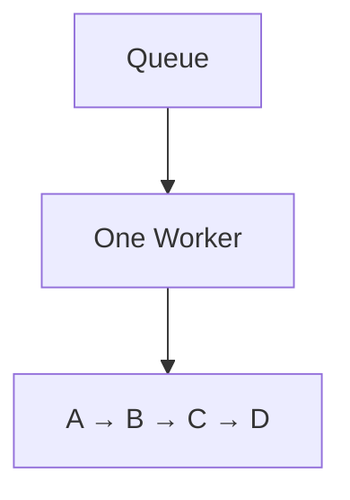

This preserves sequential processing.

But it reduces throughput.

If:

```text
Processing capacity = 100 messages/sec
Incoming rate = 1,000 messages/sec
```

the backlog grows.

```text
Queue
████████████████████
```

Therefore:

> **Strict global ordering and maximum parallelism are often competing goals.**

---

# 12. Ordering by Key

A common solution is to order only related messages.

For example:

```text
order_id = 101
```

can be the ordering key.

Events:

```text
101 created
101 paid
101 shipped
```

should remain ordered.

But:

```text
order_id = 202
```

does not necessarily need to wait for order 101.

Conceptually:

```text
Order 101:
created → paid → shipped

Order 202:
created → paid → shipped
```

The two sequences can potentially run independently.

---

# 13. Kafka Ordering Key

Kafka commonly uses a record key to influence partition assignment.

For example:

```text
key = order_id
```

Then events for the same order can be routed to the same partition.

Conceptually:

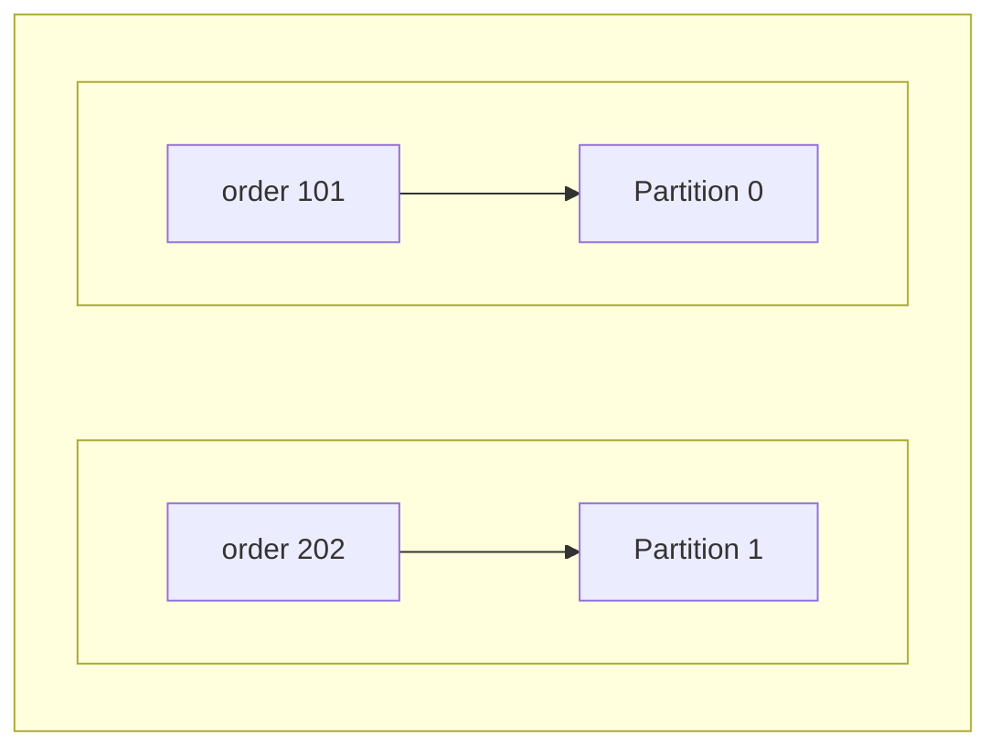

Then:

```text
Partition 0
101 created
101 paid
101 shipped
```

can preserve the order of events for order 101.

This is one of the most important connections between **partitioning and ordering**.

---

# 14. Ordering and Partitioning Are Connected

Remember:

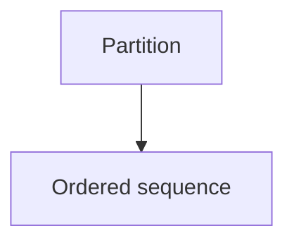

Therefore:

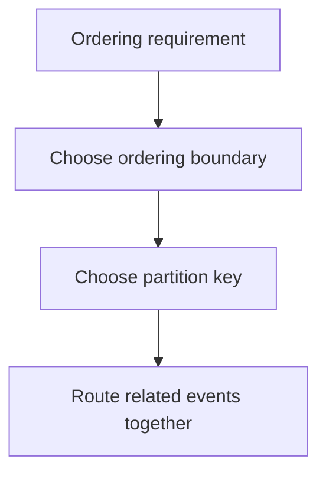

This is why Kafka partition-key design is also an ordering decision.

---

# 15. Multiple Consumers and Ordering

Suppose:

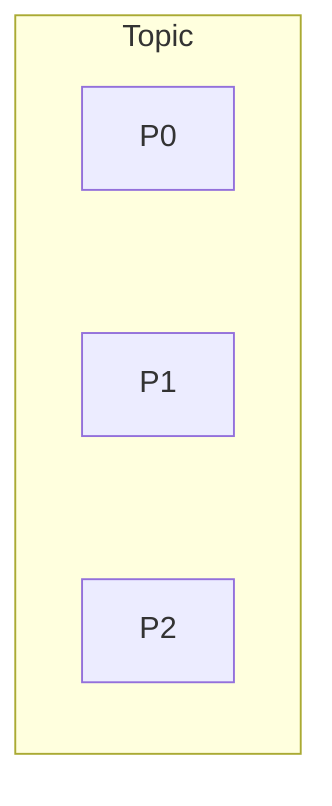

and:

```text
Consumer A → P0
Consumer B → P1
Consumer C → P2
```

Ordering inside each partition can be maintained.

But the system does not automatically establish:

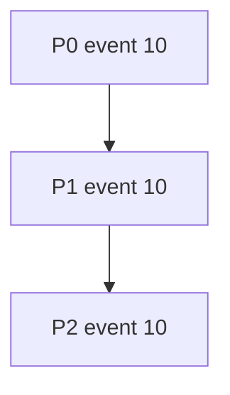

as a global sequence.

Therefore:

> **Partition-level ordering is not global ordering.**

---

# 16. Retries Can Change the Picture

Suppose:

```text
A → B → C
```

A fails.

```text
A → FAILED
B → SUCCESS
C → SUCCESS
```

Now what should happen?

### Option 1 — Block Later Messages

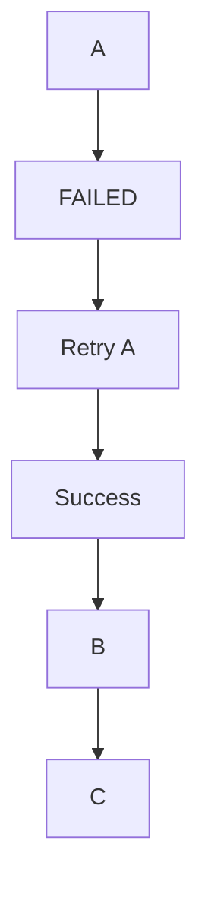

This preserves ordering but may delay B and C.

### Option 2 — Process Later Messages

```text
A → FAILED
B → SUCCESS
C → SUCCESS
```

This improves throughput but may violate business ordering.

Therefore:

> **Retry policy and ordering policy are connected.**

---

# 17. Head-of-Line Blocking

Suppose:

```text
A → B → C → D
```

A cannot be processed because of a temporary failure.

If strict ordering is required:

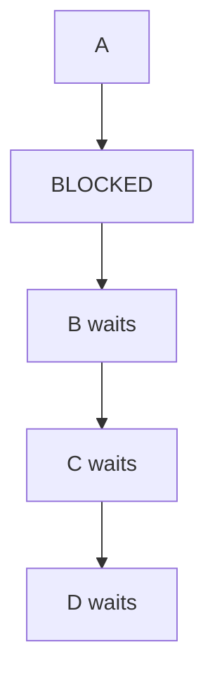

This is called **head-of-line blocking**.

One blocked message can prevent later messages from progressing.

Ordering therefore has a direct effect on latency.

---

# 18. Processing Order vs State Order

Sometimes the real requirement is not:

> "Messages must finish in order."

Instead, the requirement may be:

> "The final state must reflect the correct sequence."

For example:

```text
Price = ₹100

Update → ₹120
Update → ₹150
```

If the updates are applied incorrectly:

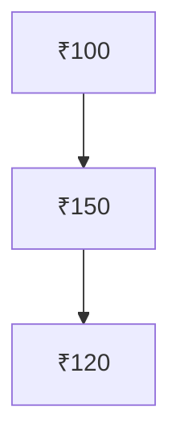

the final state becomes wrong.

Therefore, systems sometimes use:

- sequence numbers
- versions
- timestamps
- optimistic concurrency
- conditional updates.

The exact technique depends on the data model.

---

# 19. Sequence Numbers

A producer can attach a sequence number:

```text
order_id = 101

sequence = 1 → created
sequence = 2 → paid
sequence = 3 → shipped
```

The consumer can detect unexpected ordering:

```text
Received:
1
3
```

It knows:

```text
2 is missing
```

This can allow the system to:

- wait
- retry
- request missing data
- buffer the later event
- reject the event.

Sequence numbers are useful when ordering cannot be guaranteed entirely by transport infrastructure.

---

# 20. Reordering

Sometimes messages arrive out of order:

```text
Received:

3
1
2
```

The application may buffer them:

```text
Buffer:

1
2
3
```

and process:

```text
1 → 2 → 3
```

But buffering introduces:

- memory usage
- waiting time
- timeout decisions
- missing-message handling
- complexity.

So reordering should not be added casually.

---

# 21. Ordering vs Throughput

Consider two designs.

### Design A — Global Ordering

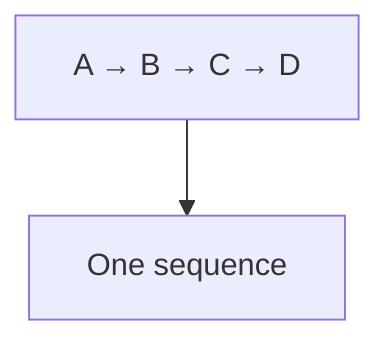

Advantages:

- simple ordering model
- predictable sequence

Disadvantages:

- limited parallelism
- one slow item can block others
- lower throughput.

### Design B — Per-Key Ordering

```text
Key A: A1 → A2 → A3

Key B: B1 → B2 → B3

Key C: C1 → C2 → C3
```

Advantages:

- preserves important relationships
- allows parallelism between keys
- better scalability

Disadvantages:

- more complex routing
- requires correct key selection
- possible hot keys/partitions.

---

# 22. When Is Ordering Actually Required?

Ordering is commonly important for:

- financial state transitions
- inventory updates
- account operations
- workflow state changes
- order lifecycle events
- configuration changes
- replicated state updates.

Ordering may be unnecessary for:

- independent image processing
- independent analytics events
- sending unrelated emails
- independent thumbnail generation
- many batch-processing tasks.

The key question is:

> **Would processing these events in a different order produce an incorrect result or unacceptable behavior?**

---

# 23. Real Example — User Activity

Suppose a user generates:

```text
page_view
button_click
video_play
video_pause
```

Analytics may not require strict global ordering across every user.

Instead:

```text
User A events
User B events
User C events
```

can often be processed independently.

The architecture can therefore prioritize:

```text
High throughput
+
Acceptable event ordering
```

rather than global ordering.

---

# 24. Real Example — Inventory

Suppose inventory starts at:

```text
10 units
```

Events:

```text
Order A → -3
Order B → -4
Restock → +10
```

Ordering may matter because these events affect shared state.

The system must define exactly what consistency and ordering guarantees are required.

For inventory, simply saying:

> "Kafka preserves ordering"

is not enough.

You must define:

- ordering key
- state ownership
- concurrency control
- failure handling
- duplicate handling
- consistency requirements.

---

# 25. Hands-On Exercise — Ordering Model

Imagine a system producing:

```text
customer_id = 101

login
profile_updated
password_changed
logout
```

### Question 1

Should these events necessarily have an order?

**Answer:** Potentially yes, depending on how downstream systems use them.

### Question 2

Should events from customer 101 block customer 202?

**Answer:** Usually not.

### Question 3

What is a possible ordering boundary?

```text
customer_id
```

### Question 4

What might be a suitable Kafka partition key?

```text
customer_id
```

assuming the traffic distribution and scalability requirements support it.

---

# 26. Lab Challenge — Completion Order

Suppose a worker receives:

```text
A
B
C
```

Processing times:

```text
A = 5 seconds
B = 1 second
C = 2 seconds
```

If they are processed concurrently:

```text
A ─────────────→
B ──→
C ─────→
```

Completion order could be:

```text
B → C → A
```

### Question

Does this violate ordering?

**Answer:** It depends on the system's requirement.

If the requirement is only **delivery order**, perhaps not.

If the requirement is **completion/application order**, then yes.

This is why the system must define what "ordered" actually means.

---

# 27. Lab Challenge — Failed Message

Suppose:

```text
A → B → C
```

and A fails.

You have two choices:

### Strict Ordering

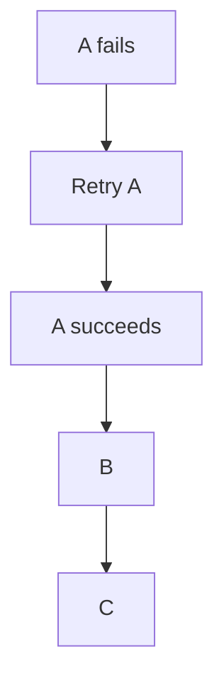

### Continue Processing

```text
A fails

B
C
```

Ask:

> Which behavior is correct for the business?

There is no universal answer.

For an order state transition, blocking may be necessary.

For independent analytics events, continuing may be acceptable.

---

# 28. Practical Ordering Design

When designing an ordered messaging system, define:

### 1. Ordering scope

```text
Global?
Per customer?
Per order?
Per account?
Per partition?
```

### 2. Ordering boundary

Where is the sequence enforced?

```text
Queue?
Partition?
Consumer?
Database?
Application?
```

### 3. Failure behavior

What happens when an earlier message fails?

```text
Block?
Retry?
Skip?
Dead-letter?
Reorder?
```

### 4. Concurrency

Can related messages be processed simultaneously?

If not, why?

### 5. Recovery

What happens after:

- worker crash
- timeout
- duplicate delivery
- missing event
- delayed event?

---

# 29. Ordering and Idempotency

Ordering alone does not solve duplicate processing.

Suppose:

```text
A → B → C
```

A is processed successfully, but the acknowledgement fails.

The system may deliver A again:

```text
A
A
B
C
```

Even if the order is preserved, the consumer must safely handle the duplicate.

This is why ordering and **idempotency** are related but different concerns.

> **Ordering controls sequence. Idempotency controls the effect of repeated processing.**

Idempotency is covered in:

> **05.11 — Idempotency**

---

# 30. Ordering and Delivery Semantics

Message systems can have different delivery behaviors.

For example:

```text
At-most-once
At-least-once
Exactly-once
```

These affect what happens when failures occur.

A system may preserve message order while still delivering a message more than once.

Therefore:

```text
Ordering ≠ Delivery Semantics
```

Both must be designed separately.

This becomes the focus of:

> **05.10 — Message Delivery Semantics**

---

# 31. Common Mistakes

### Mistake 1 — Assuming Every Message Must Be Ordered

Many messages are independent.

### Mistake 2 — Confusing Delivery With Completion

Receiving A before B does not mean A finishes before B.

### Mistake 3 — Assuming Kafka Provides Global Ordering

Kafka ordering is primarily partition-level.

### Mistake 4 — Ignoring the Partition Key

The key affects both distribution and ordering locality.

### Mistake 5 — Using One Global Sequence for Everything

This can unnecessarily destroy parallelism.

### Mistake 6 — Ignoring Failed Messages

A failed earlier message can block later messages.

### Mistake 7 — Assuming Ordering Prevents Duplicates

Ordering and duplicate handling are separate concerns.

### Mistake 8 — Ignoring Hot Partitions

Keeping all events for one hot key together can create a hotspot.

### Mistake 9 — Adding Reordering Without a Need

Buffering and reordering add complexity and latency.

---

# 32. Ordering Decision Framework

Use this simple flow:

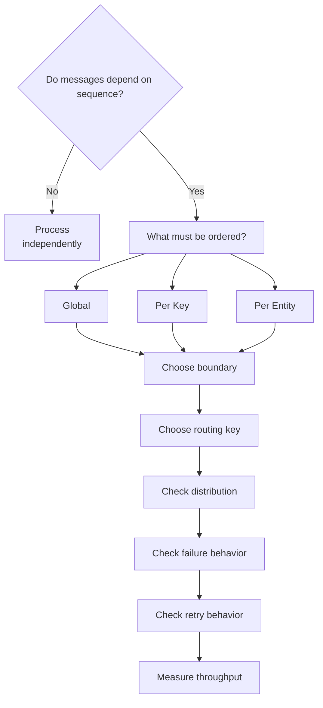

The goal is:

> **Use the smallest ordering scope that still preserves correctness.**

---

# 33. System Design View

Ordering creates a fundamental trade-off:

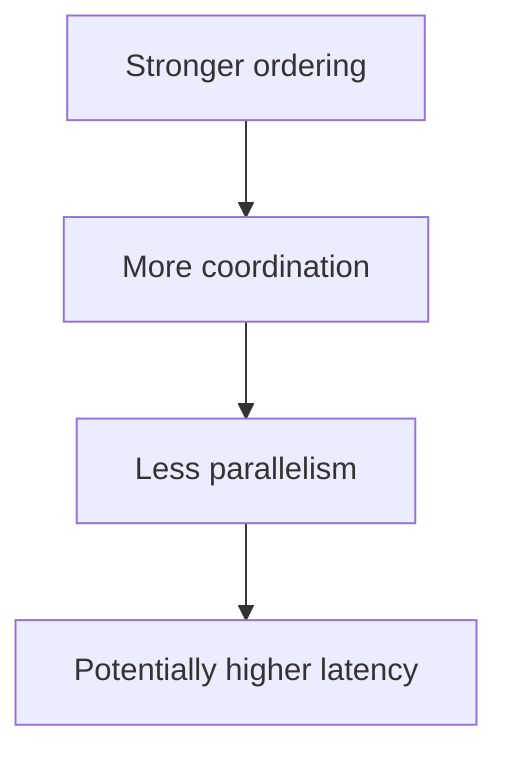

While:

```mermaid
flowchart TD
  accTitle: Looser ordering
  accDescr: Looser ordering, then More parallelism, then Higher throughput, then More application responsibility.
  N0["Looser ordering"] --> N1["More parallelism"] --> N2["Higher throughput"] --> N3["More application responsibility"]
```

Good system design does not automatically choose the strongest ordering.

It chooses the **minimum ordering guarantee required by the business**.

---

# 34. Key Principle

> **Message ordering should be designed around business correctness, not assumed for every message. The strongest useful ordering boundary is rarely global; per-key or per-entity ordering often provides the necessary correctness while preserving parallelism. In systems such as Kafka, ordering is tied closely to partitioning and key selection, while retries, failures, concurrency, and duplicate delivery introduce additional ordering challenges.**

---

# 35. Quick Reference

| Concept | Meaning |
|---|---|
| Ordering | Required sequence of related messages |
| Global Ordering | One sequence for the entire stream |
| Partial Ordering | Only related messages must remain ordered |
| FIFO | First In, First Out |
| Ordering Key | Key used to keep related messages together |
| Partition | Ordered sequence in Kafka |
| Delivery Order | Order messages are delivered |
| Processing Order | Order processing begins |
| Completion Order | Order processing finishes |
| Retry | Processing a failed message again |
| Head-of-Line Blocking | One blocked message delays later messages |
| Reordering | Restoring the required sequence after out-of-order arrival |

### Remember

```mermaid
flowchart TD
  accTitle: Ordering design steps
  accDescr: Ordering requirement, then Define ordering scope, then Choose ordering key, then Choose routing/partition boundary, then Design concurrency, then Design failure + retry behavior, then Measure throughput and latency.
  N0["Ordering requirement"] --> N1["Define ordering scope"] --> N2["Choose ordering key"] --> N3["Choose routing/partition boundary"] --> N4["Design concurrency"] --> N5["Design failure + retry behavior"] --> N6["Measure throughput and latency"]
```

The most useful rule:

> **Order only what must be ordered.**

---

# 36. Knowledge Check

### Q1. Does every message need to be globally ordered?

**No.** Only messages whose relationship requires ordering need to be ordered.

### Q2. Does Kafka provide global ordering across all partitions?

**No.** Kafka provides ordering within a partition.

### Q3. Why is the partition key important?

Because it influences where records are placed and can keep related records within the same partition.

### Q4. Can messages be delivered in order but complete out of order?

**Yes.** Concurrent processing can cause this.

### Q5. What happens if an earlier message fails and strict ordering is required?

Later messages may need to wait until the earlier message succeeds or is otherwise resolved.

### Q6. What is head-of-line blocking?

A situation where one blocked message prevents later messages from progressing.

### Q7. Does ordering prevent duplicate processing?

**No.** Duplicate handling is a separate concern.

### Q8. Why can per-key ordering scale better than global ordering?

Independent keys can often be processed concurrently while preserving order within each key.

### Q9. What is the main trade-off of stronger ordering?

More coordination and less parallelism.

### Q10. What is the best general ordering rule?

> **Use the smallest ordering scope that preserves correctness.**

---

# 37. Remember

```text
Not everything needs ordering.

Global ordering
    ↓
Simple sequence
    ↓
Limited parallelism

Per-key ordering
    ↓
Related events stay ordered
    ↓
Independent keys can run concurrently

Kafka
    ↓
Ordering within partition
    ↓
Partition key matters

Concurrency
    ↓
Delivery order ≠ completion order

Failure
    ↓
Retries can affect ordering

Strong ordering
    ↓
More coordination

Useful ordering
    ↓
Correctness + reasonable scalability
```

> **Order only what must be ordered.**

---

# 38. Next Chapter

## 05.10 — Message Delivery Semantics

Topics:

- What message delivery semantics mean
- At-most-once delivery
- At-least-once delivery
- Exactly-once processing
- Message acknowledgement
- What happens when a consumer crashes
- Duplicate delivery
- Lost messages
- Redelivery
- Visibility timeouts
- Commit/offset behavior
- Delivery vs processing guarantees
- Why exactly-once is difficult
- Idempotent consumers
- Transactional processing
- RabbitMQ delivery behavior
- Kafka offset behavior
- Choosing delivery semantics
- Real-world examples
- Hands-on delivery exercise
- Common mistakes
- System design trade-offs
