# 05.10 — Message Delivery Semantics

## Learning Objectives

By the end of this chapter, you should understand:

- What message delivery semantics mean
- At-most-once delivery
- At-least-once delivery
- Exactly-once semantics
- Acknowledgements and offsets
- What happens when a consumer crashes
- Why duplicate messages happen
- How messages can be lost
- Redelivery and retry behavior
- Visibility timeouts
- Delivery vs processing guarantees
- Why exactly-once is difficult
- How idempotency improves reliability
- RabbitMQ and Kafka delivery concepts
- How to choose appropriate delivery semantics

---

# Beginner Vocabulary

| Term | Beginner-Friendly Meaning |
|---|---|
| **Delivery** | Getting a message from the messaging system to a consumer |
| **Processing** | The consumer performing the work described by the message |
| **Acknowledgement (ACK)** | A signal saying the consumer has successfully handled a message |
| **Redelivery** | Sending a message to a consumer again after an earlier attempt was not confirmed as successful |
| **Duplicate** | The same logical message being processed more than once |
| **Message Loss** | A message is no longer available even though the required processing did not happen |
| **At-Most-Once** | A message is processed zero or one time, but may be lost |
| **At-Least-Once** | A message is intended to be processed one or more times, so duplicates are possible |
| **Exactly-Once** | The system provides a guarantee that the intended effect occurs once within a defined scope |
| **Offset** | A consumer's position in a Kafka partition |
| **Commit** | Recording that a message/offset has been successfully handled |
| **Retry** | Trying failed processing again |
| **Visibility Timeout** | A period during which a received message is temporarily hidden from other consumers |
| **Idempotent** | Repeating the same operation does not create an additional unwanted effect |
| **Side Effect** | A change caused by processing, such as charging a card or sending an email |

### The Most Important Distinction

Do not treat these as the same thing:

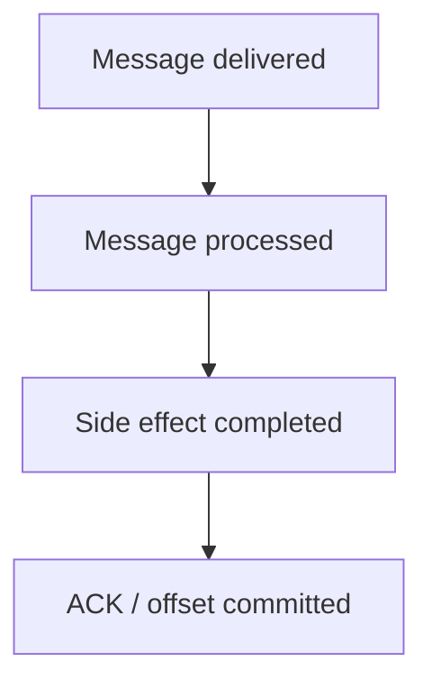

A failure can happen between **any two steps**.

That is where delivery semantics become important.

---

# 1. What Are Message Delivery Semantics?

**Message delivery semantics** describe what a messaging system guarantees about how messages are delivered and processed when failures occur.

The three commonly discussed models are:

```text
At-Most-Once
At-Least-Once
Exactly-Once
```

They answer a basic question:

> **What can happen to a message when the system experiences failure?**

---

# 2. Why Do Delivery Guarantees Matter?

Imagine:

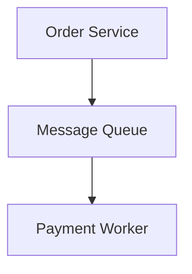

The worker receives:

```text
charge_customer
```

Suppose the worker charges the customer successfully.

Then the worker crashes **before acknowledging the message**.

The queue may think:

```text
Message not completed
```

and deliver it again.

Now:

```text
First attempt  → Charge ₹1,000 → Worker crashes
Second attempt → Charge ₹1,000 again
```

The customer could be charged twice.

The messaging system did not necessarily "break."

The architecture failed to make the **side effect idempotent**.

This distinction is fundamental.

---

# 3. Delivery vs Side Effects

Even successful processing can involve multiple steps.

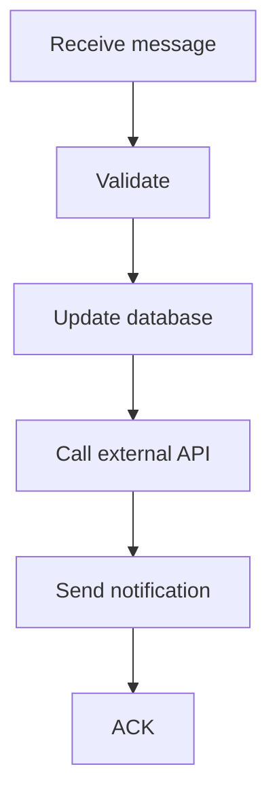

A failure can happen anywhere.

For example:

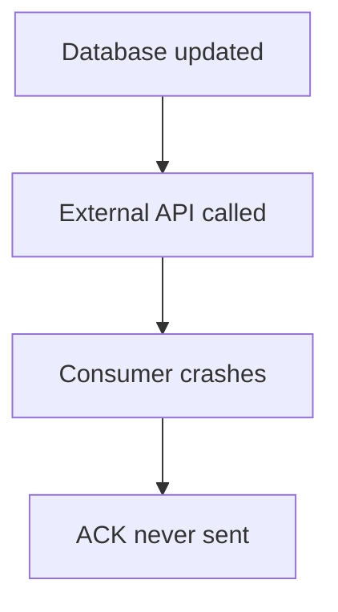

The message may be delivered again.

Therefore, delivery semantics alone cannot guarantee that every external side effect happens exactly once.

---

# 4. At-Most-Once Delivery

**At-most-once** means:

> A message is processed zero or one time.

So:

```text
0 times ← possible
1 time  ← possible
2 times ← should not happen
```

The important trade-off is:

> **Messages may be lost.**

---

# 5. How At-Most-Once Can Happen

Imagine:

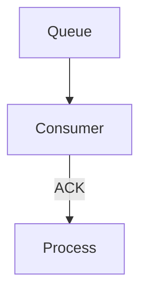

The consumer acknowledges the message before processing it.

If the consumer crashes:

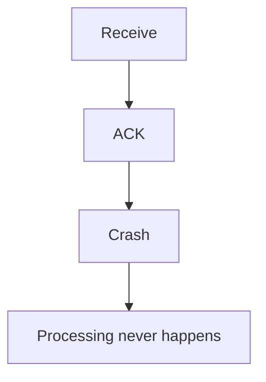

The messaging system may consider the message completed.

The result:

```text
Message lost
```

---

# 6. Why Use At-Most-Once?

At-most-once can make sense when losing an occasional message is acceptable.

Examples may include:

- non-critical telemetry
- best-effort metrics
- temporary analytics signals
- low-value notifications
- some real-time transient events.

But it is generally inappropriate when every event must be processed.

For example:

```text
Payment
Bank transfer
Inventory deduction
Order creation
```

should not casually use a model where messages can disappear before the required effect happens.

---

# 7. At-Least-Once Delivery

**At-least-once** means:

> The system attempts to ensure that a message is processed, but the same message may be delivered or processed more than once.

So:

```text
0 times ← should be avoided
1 time  ← normal
2+ times ← possible
```

The key trade-off is:

> **Messages are less likely to be lost, but duplicates are possible.**

---

# 8. How At-Least-Once Happens

Consider:

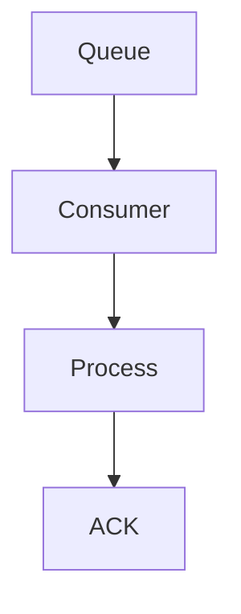

The consumer acknowledges **after successful processing**.

Suppose:

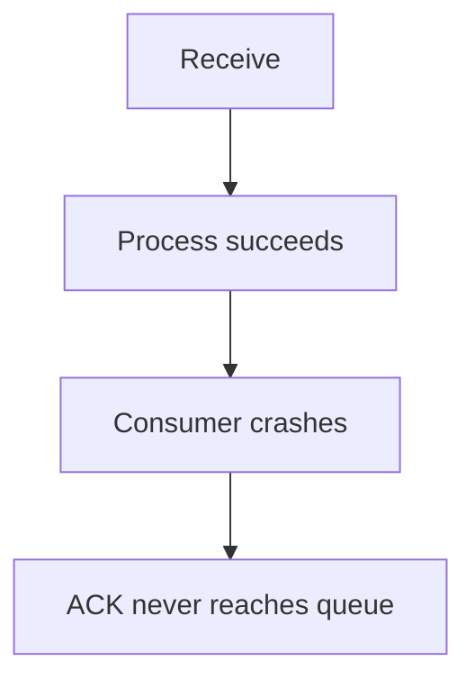

The queue may redeliver:

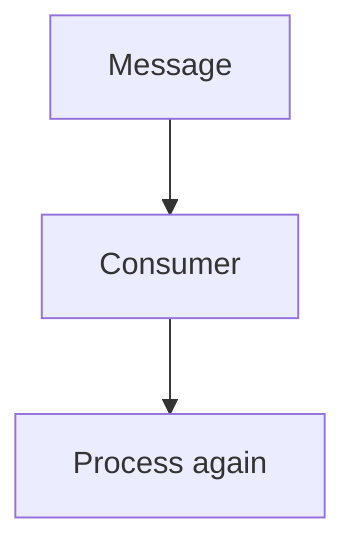

Therefore:

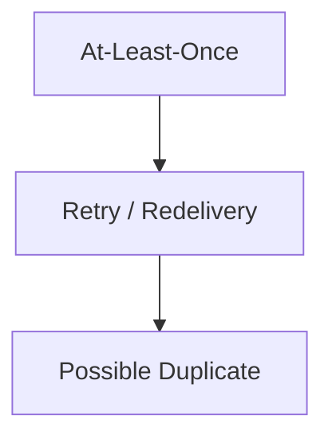

This is why idempotency becomes extremely important.

---

# 9. At-Least-Once Is Common in Production

At-least-once processing is often a practical choice because:

```text
Avoid losing important work
        +
Accept possible duplicates
        +
Make consumers idempotent
```

can be easier and safer than trying to create a perfect exactly-once distributed system.

The architecture becomes:

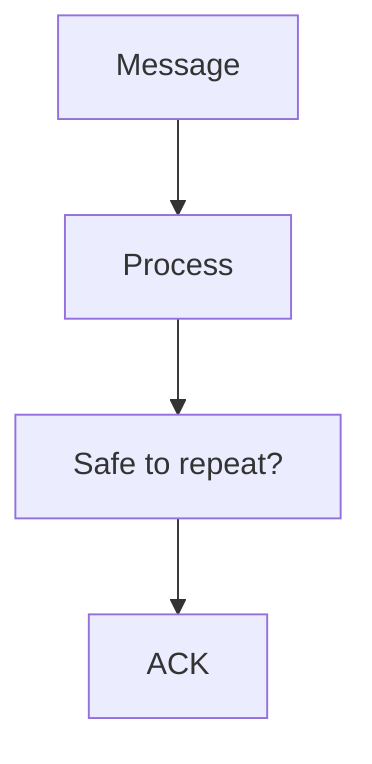

---

# 10. What Is Exactly-Once?

**Exactly-once** is commonly described as:

> A message's intended effect occurs exactly once.

That sounds simple.

In a real distributed system, it is much harder.

Consider:

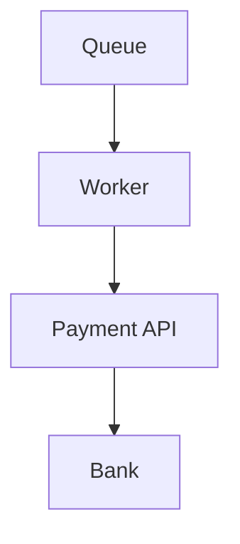

The worker calls the payment API.

The payment succeeds.

But the worker crashes before recording the result.

After restart:

```text
Should the worker retry?
```

If it retries:

```text
Possible duplicate payment
```

If it does not:

```text
Possible missing payment result
```

The worker cannot automatically know what happened unless the surrounding system provides a reliable way to determine the operation's state.

---

# 11. Exactly-Once Is About Scope

When someone says:

> "This system provides exactly-once."

ask:

> **Exactly once where?**

For example:

```text
Kafka processing
```

is different from:

```text
Kafka → Database
```

which is different from:

```text
Kafka → Database → External Payment Provider
```

A guarantee may apply within one system boundary but not automatically across every external system.

Therefore:

> **Exactly-once must always be understood within a defined boundary and processing model.**

---

# 12. Processing Longer Than Visibility Timeout

Suppose:

```text
Visibility timeout = 60 seconds
Processing time = 5 minutes
```

The message may become visible again while the first worker is still processing.

```text
Worker A
  |
  +---- Processing -------------------->

60 sec
  |
  v
Message visible again
  |
  v
Worker B
  |
  +---- Same message
```

This can produce duplicate processing.

Possible solutions include:

- extending the lease
- heartbeat mechanisms
- shorter jobs
- idempotent processing
- technology-specific visibility management.

---

# 13. Kafka Offsets

Kafka uses a different model.

Consumers track their position using **offsets**.

Conceptually:

```text
Partition

0 → A
1 → B
2 → C
3 → D
```

A consumer may have processed through:

```text
Offset 2
```

The consumer group stores its progress according to Kafka's offset-management mechanism.

If a failure occurs before progress is committed:

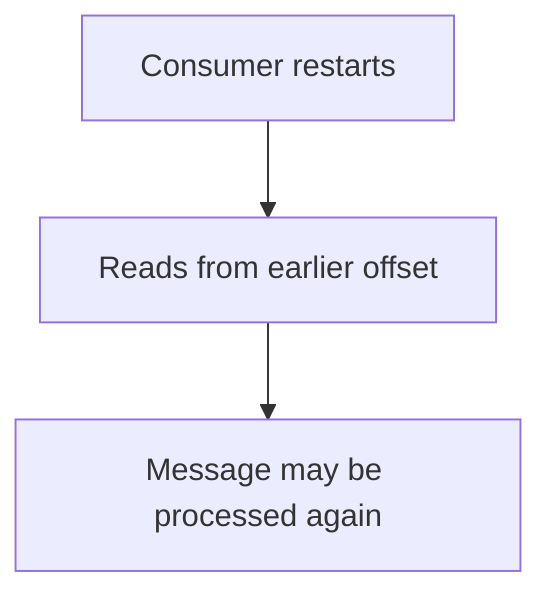

This is one reason duplicate processing can occur.

---

# 14. RabbitMQ and Kafka Are Different

The concepts are related but their mechanisms differ.

### RabbitMQ

Common model:

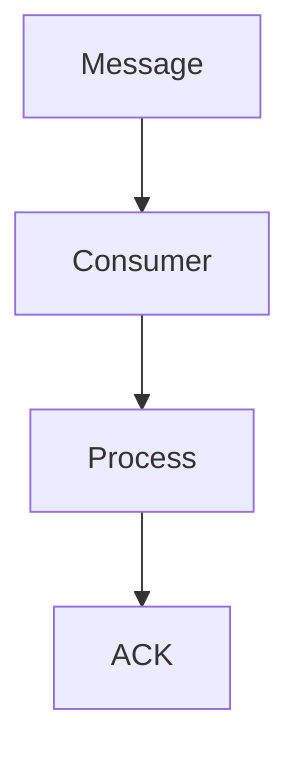

### Kafka

Common model:

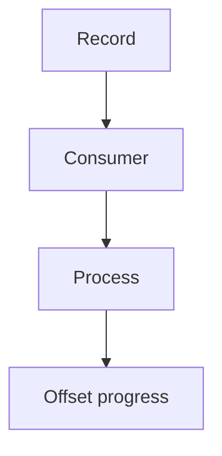

Do not assume:

```text
RabbitMQ ACK = Kafka Offset
```

They solve related problems using different architectures.

---

# 15. Delivery Semantics Comparison

| Model | Duplicate Processing | Message Loss | Main Trade-Off |
|---|---:|---:|---|
| At-Most-Once | Avoided by design | Possible | Less duplication, possible loss |
| At-Least-Once | Possible | Minimized | Safer delivery, requires idempotency |
| Exactly-Once | Intended effect once within defined scope | Depends on system | Strong guarantee, high complexity |

The practical choice is often:

```text
At-Least-Once
      +
Idempotent Consumer
```

rather than trying to make every external side effect exactly-once.

---

# 16. What Is Idempotency?

An operation is **idempotent** when performing it multiple times produces the same intended final result as performing it once.

For example:

```text
Set order status = "PAID"
```

Repeating it:

```text
PAID
PAID
PAID
```

does not create three payments.

Compare:

```text
Balance = Balance + ₹1,000
```

Repeating it:

```text
+₹1,000
+₹1,000
```

creates an additional effect.

Therefore, the second operation is not naturally idempotent.

Idempotency will be covered in depth in:

> **05.11 — Idempotency**

---

# 17. Idempotency + At-Least-Once

A common production pattern is:

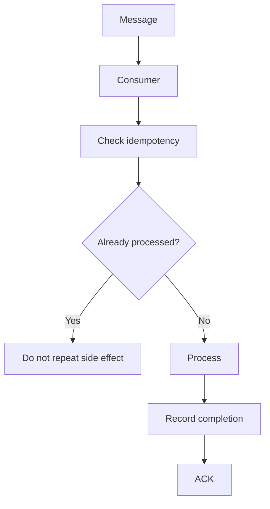

This converts possible duplicate delivery into safe repeated attempts.

---

# 18. Duplicate Messages Are Not Always Identical

A duplicate can happen because the same logical message is delivered again.

For example:

```text
message_id = abc123
```

appears twice:

```text
abc123
abc123
```

The consumer can use the message ID to detect repetition.

But this only works if:

- the ID is stable
- the consumer can store processing state
- the check and side effect are coordinated safely.

Otherwise, a race condition can still occur.

---

# 19. The Duplicate Processing Race

Imagine two workers receive the same message:

```text
Worker A → message 123
Worker B → message 123
```

Both check:

```text
"Has message 123 been processed?"
```

Both receive:

```text
No
```

Then both process it.

```text
A → Process
B → Process
```

This is why simply having a `processed=true` field is not automatically sufficient.

The deduplication check and state transition need an appropriate atomicity/coordination strategy.

---

# 20. Message Loss Scenarios

Messages can be lost for different reasons depending on the architecture.

Examples:

### ACK Before Processing

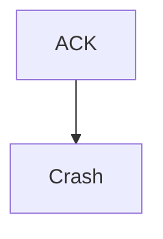

### Non-Durable Messaging

A broker restart may lose messages if they were not durably stored.

### Retention Expiration

A Kafka record may eventually disappear after its retention policy is reached.

### Consumer Bugs

A consumer may incorrectly commit progress before successful processing.

Therefore:

> **"The broker accepted the message" does not automatically mean "the business operation completed."**

---

# 21. Durability Does Not Mean Exactly-Once

Suppose a message is durably stored:

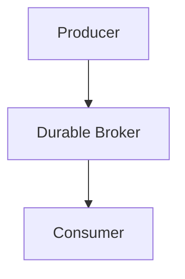

This protects against some forms of message loss.

But the consumer can still:

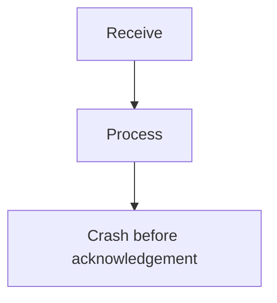

and process the message again.

Therefore:

```text
Durability ≠ Exactly-Once
```

Similarly:

```text
Replication ≠ Exactly-Once
```

and:

```text
ACK ≠ Exactly-Once
```

Each solves a different problem.

---

# 22. Exactly-Once Processing vs Exactly-Once Effect

These phrases should not be treated as identical.

### Exactly-Once Processing

The consumer framework may ensure a record is handled once within a particular processing boundary.

### Exactly-Once Effect

The real-world side effect happens only once.

For example:

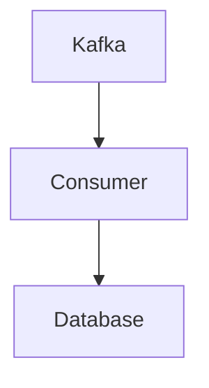

may support stronger atomic processing than:

```mermaid
flowchart TD
  accTitle: Kafka to an external provider
  accDescr: Kafka, then Consumer, then External Payment Provider.
  N0["Kafka"] --> N1["Consumer"] --> N2["External Payment Provider"]
```

because the external provider is outside the same transactional boundary.

Therefore:

> **Exactly-once effect is usually harder than exactly-once message handling.**

---

# 23. A Practical Production Pattern

A common architecture is:

```mermaid
flowchart TD
  accTitle: A practical production pattern
  accDescr: Producer, then Durable Queue / Kafka, then Consumer, then Idempotency Check, then Database Transaction, then Record Successful Processing, then ACK / Commit Progress.
  N0["Producer"] --> N1["Durable Queue / Kafka"] --> N2["Consumer"] --> N3["Idempotency Check"] --> N4["Database Transaction"] --> N5["Record Successful Processing"] --> N6["ACK / Commit Progress"]
```

The goal is not to pretend failures cannot happen.

The goal is:

> **Make failures safe to recover from.**

---

# 24. Choosing Delivery Semantics

Ask these questions:

### 1. Can the message be lost?

If yes:

```text
At-Most-Once
```

may be acceptable.

### 2. Must the work happen?

If yes:

```text
At-Least-Once
```

is often a better starting point.

### 3. Can processing be repeated safely?

If yes, idempotent consumers make at-least-once much easier to operate.

### 4. Is exactly-once genuinely required?

Define exactly:

```text
Exactly once where?
```

and:

```text
Exactly once for which effect?
```

### 5. Does an external system participate?

If yes, understand its own failure and idempotency mechanisms.

---

# 25. Real-World Decision Examples

| Work | Likely Approach |
|---|---|
| Critical payment command | At-least-once + idempotency |
| Inventory update | At-least-once + idempotent state transition |
| Analytics event | At-least-once or best-effort depending on business need |
| Temporary telemetry | At-most-once may be acceptable |
| Order creation | At-least-once + deduplication |
| Search indexing | At-least-once + idempotent update |
| Email sending | At-least-once requires careful duplicate handling |

These are starting points, not universal rules.

---

# 26. Hands-On Exercise — Delivery Failure

Consider:

```mermaid
flowchart TD
  accTitle: Hands-on flow
  accDescr: Queue, then Worker, then Database.
  N0["Queue"] --> N1["Worker"] --> N2["Database"]
```

The worker receives:

```text
order.created
```

It successfully inserts the order into the database.

Then:

```text
Worker crashes
```

before sending the ACK.

### What happens?

The queue may redeliver:

```text
order.created
```

The worker receives it again.

If the database operation blindly inserts another order:

```text
Order 1001
Order 1002
```

you may create a duplicate order.

A safer design is:

```text
event_id = abc123
```

with a uniqueness/idempotency mechanism that prevents the same logical event from creating the effect twice.

---

# 27. Lab Challenge — Choose the Model

Classify these scenarios:

### A. System monitoring ping

Missing one event is acceptable.

**Possible choice:** At-most-once.

### B. Payment command

Missing the operation is dangerous.

**Possible choice:** At-least-once + idempotency.

### C. Image resize job

Repeating the same resize is acceptable if the operation is safely idempotent.

**Possible choice:** At-least-once + idempotent processing.

### D. Critical financial transaction

Requires carefully defined transactional and idempotency guarantees.

**Answer:** Do not simply say "exactly-once." Define the complete processing boundary and failure model.

---

# 28. Common Mistakes

### Mistake 1 — "ACK Means the Work Happened Exactly Once"

ACK only represents the messaging system's acknowledgement mechanism.

### Mistake 2 — "At-Least-Once Means No Messages Are Lost"

It reduces loss under the designed failure model, but retention, durability, bugs, and configuration still matter.

### Mistake 3 — "At-Least-Once Is Bad Because It Creates Duplicates"

Duplicates are a manageable engineering problem when consumers are designed to be idempotent.

### Mistake 4 — "Exactly-Once Solves Everything"

Exactly-once guarantees have a defined scope and do not automatically extend to external systems.

### Mistake 5 — ACK Before Processing

This can cause message loss.

### Mistake 6 — ACK After Processing Without Considering Duplicates

A crash before ACK can cause redelivery.

### Mistake 7 — Confusing Delivery With Side Effects

Receiving a message does not mean the business operation completed.

### Mistake 8 — Ignoring Retry Behavior

Retries are a major source of duplicate processing.

### Mistake 9 — Treating RabbitMQ ACK and Kafka Offset as Identical

They are different mechanisms.

---

# 29. System Design View

Delivery semantics are really about **failure recovery**.

A robust system assumes:

```text
Consumer can crash
Broker can fail
Network can fail
ACK can be lost
Processing can partially complete
External API can timeout
Messages can be duplicated
```

Then it asks:

```text
What happens next?
```

A good architecture does not depend on:

> "This probably won't happen."

It designs the recovery path explicitly.

---

# 30. Delivery Semantics Decision Framework

```mermaid
flowchart TD
  accTitle: Delivery semantics decision framework
  accDescr: Can the message be safely lost? Yes: at-most-once may fit. No: must the work survive failures? Yes: use at-least-once. Can processing repeat safely? No: add an idempotency/deduplication strategy. Yes: at-least-once + idempotent processing. Do you truly need exactly-once effect? Yes: define the complete transactional/idempotency boundary first.
  subgraph R1[" "]
    direction TB
    Q1{"Can the message be safely lost?"} -->|"Yes"| A1["At-Most-Once may fit"]
  end
  subgraph R2[" "]
    direction TB
    Q2{"Must the work survive failures?"} -->|"Yes"| U["Use At-Least-Once"]
  end
  subgraph R3[" "]
    direction TB
    Q3{"Can processing repeat safely?"} -->|"No"| AD["Add idempotency/ deduplication strategy"]
  end
  subgraph R4[" "]
    direction TB
    AL["At-Least-Once + Idempotent Processing"] --> Q4{"Do you truly need exactly-once effect?"} -->|"Yes"| DF["Define the complete transactional/ idempotency boundary first"]
  end
  Q1 -->|"No"| Q2
  U --> Q3
  Q3 -->|"Yes"| AL
```

---

# 31. Key Principle

> **Message delivery semantics define what a messaging system guarantees when delivery, processing, acknowledgement, and failures interact. At-most-once may lose messages, at-least-once may create duplicates, and exactly-once is a scoped guarantee that is difficult to extend across external systems. In practice, durable messaging combined with at-least-once delivery and idempotent processing is often a strong foundation for reliable systems.**

---

# 32. Quick Reference

| Concept | Meaning |
|---|---|
| Delivery | Message reaches consumer |
| Processing | Consumer performs the work |
| ACK | Consumer confirms successful handling |
| At-Most-Once | Zero or one processing attempt |
| At-Least-Once | One or more attempts may occur |
| Exactly-Once | Intended effect once within defined scope |
| Redelivery | Message delivered again |
| Duplicate | Same logical work processed again |
| Visibility Timeout | Temporary hiding period after delivery |
| Offset | Kafka consumer position |
| Commit | Record progress/acknowledgement of processing |
| Idempotency | Repeating operation safely |
| Side Effect | Real state change caused by processing |

### The Failure Rule

```mermaid
flowchart TD
  accTitle: The failure rule
  accDescr: Delivered, then Processed, then Side Effect, then ACK / Commit.
  N0["Delivered"] --> N1["Processed"] --> N2["Side Effect"] --> N3["ACK / Commit"]
```

Ask at every step:

> **What happens if the system crashes here?**

---

# 33. Knowledge Check

### Q1. What does at-most-once mean?

A message is processed zero or one time, but loss is possible.

### Q2. What does at-least-once mean?

The system attempts to ensure processing, but duplicate processing can occur.

### Q3. Why do duplicates happen?

For example, processing can succeed but the ACK or offset commit can fail before the system records completion.

### Q4. Does ACK guarantee exactly-once processing?

No.

### Q5. What is a visibility timeout?

A period during which a received message is temporarily hidden before becoming eligible for redelivery if processing is not confirmed.

### Q6. What is Kafka's equivalent of a traditional queue ACK?

There is no exact equivalent. Kafka primarily tracks consumer progress using offsets and commits.

### Q7. Why is exactly-once difficult?

Because failures can occur between processing steps, and external systems have independent state and failure behavior.

### Q8. What is a common practical strategy?

At-least-once delivery combined with idempotent processing.

### Q9. Does durable storage guarantee exactly-once effects?

No.

### Q10. What question should you ask about exactly-once?

> **Exactly once where, and for which effect?**

---

# 34. Remember

```text
At-Most-Once
    ↓
Possible loss
    ↓
Avoid duplicate processing

At-Least-Once
    ↓
Possible duplicates
    ↓
Use idempotency

Exactly-Once
    ↓
Strong scoped guarantee
    ↓
Define the boundary carefully
```

And always remember the failure window:

```mermaid
flowchart TD
  accTitle: The failure window
  accDescr: Receive, then Process, then Side Effect, then ACK / Commit.
  N0["Receive"] --> N1["Process"] --> N2["Side Effect"] --> N3["ACK / Commit"]
```

A crash can happen between any two steps.

That is why reliable messaging is not simply about **delivering messages**.

It is about making the entire **failure-and-recovery path safe**.

---

# 35. Next Chapter

## 05.11 — Idempotency

Topics:

- What idempotency means
- Why duplicate processing happens
- Idempotent vs non-idempotent operations
- Idempotency keys
- Message IDs
- Deduplication
- Database uniqueness constraints
- Idempotent database updates
- Payment idempotency
- API idempotency
- Consumer-side idempotency
- Race conditions
- Idempotency records
- Transactions and idempotency
- Retry-safe operations
- Idempotency with RabbitMQ
- Idempotency with Kafka
- Failure scenarios
- Hands-on idempotency exercise
- Common mistakes
- System design trade-offs
