# 05.11 — Idempotency

## Learning Objectives

By the end of this chapter, you should understand:

- What idempotency means
- Why duplicate processing happens
- Idempotent vs non-idempotent operations
- Idempotency keys
- Message IDs and deduplication
- Database uniqueness constraints
- Idempotent database updates
- API idempotency
- Payment idempotency
- Consumer-side idempotency
- Race conditions
- Idempotency records
- Transactions and idempotency
- Retry-safe operations
- Idempotency with RabbitMQ and Kafka
- Common failure scenarios
- When idempotency is necessary

---

# Beginner Vocabulary

| Term | Beginner-Friendly Meaning |
|---|---|
| Idempotent | Repeating the same operation does not create an unwanted additional effect |
| Duplicate | The same logical request or message appears more than once |
| Retry | Trying an operation again after failure |
| Idempotency Key | A unique identifier used to recognize repeated requests |
| Message ID | An identifier assigned to a message/event |
| Deduplication | Detecting and ignoring duplicate work |
| Side Effect | A change caused by an operation, such as charging money |
| Unique Constraint | A database rule preventing duplicate values |
| Race Condition | A problem caused by operations happening concurrently |
| Consumer | Application that reads and processes messages |
| Idempotency Record | Stored information showing that an operation was already processed |
| Atomic | Completed as one indivisible operation |
| Exactly-Once Effect | The intended real-world effect happens only once |

---

# 1. What Is Idempotency?

**Idempotency means that performing the same logical operation multiple times produces the same intended result as performing it once.**

For example:

```text
Set user status = "active"
```

Doing this once:

```text
active
```

Doing it again:

```text
active
```

The final state is still:

```text
active
```

Compare that with:

```text
Increase account balance by ₹500
```

Doing it once:

```text
₹500
```

Doing it twice:

```text
₹1000
```

The second operation creates an additional effect.

That operation is not naturally idempotent.

---

# 2. Why Does Idempotency Matter?

Distributed systems frequently retry work.

A request or message may be processed successfully, but the caller may not receive confirmation.

For example:

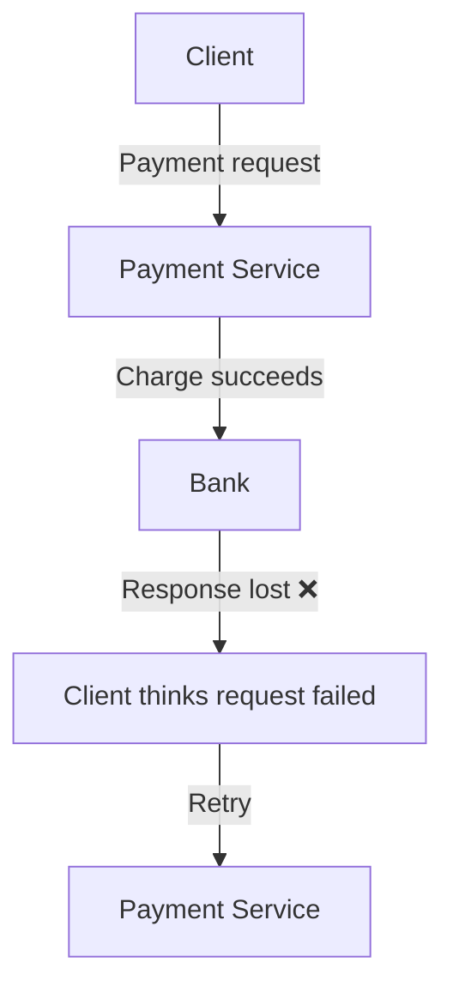

Without protection:

```text
First attempt  → ₹1,000 charged
Retry          → ₹1,000 charged again
```

The customer is charged:

```text
₹2,000
```

The system needed a way to recognize:

> "This is the same logical operation I already completed."

That is where idempotency becomes important.

---

# 3. Idempotent vs Non-Idempotent Operations

### Naturally idempotent example

```text
PUT /users/42/status

{
  "status": "active"
}
```

Repeating the same operation still produces:

```text
status = active
```

### Non-idempotent example

```text
POST /accounts/42/increment

{
  "amount": 500
}
```

Repeating it could produce:

```text
+500
+500
```

The final result is different.

### Simple comparison

| Operation | Naturally Idempotent? |
|---|---|
| Set status to `active` | Usually yes |
| Set email to a specific value | Usually yes |
| Delete a specific resource | Often yes |
| Add ₹500 to balance | No |
| Create a new order | Usually no |
| Charge a payment | No |
| Send an email | No |
| Increment a counter | No |

The important question is not:

> "Is this API GET or POST?"

The better question is:

> **"Can repeating this logical operation create an unwanted additional effect?"**

---

# 4. Idempotency Does Not Mean "Run Only Once"

This distinction is extremely important.

Idempotency does **not** necessarily mean:

```text
Operation runs physically only once.
```

It means:

```text
Repeated execution does not create an additional unwanted effect.
```

For example:

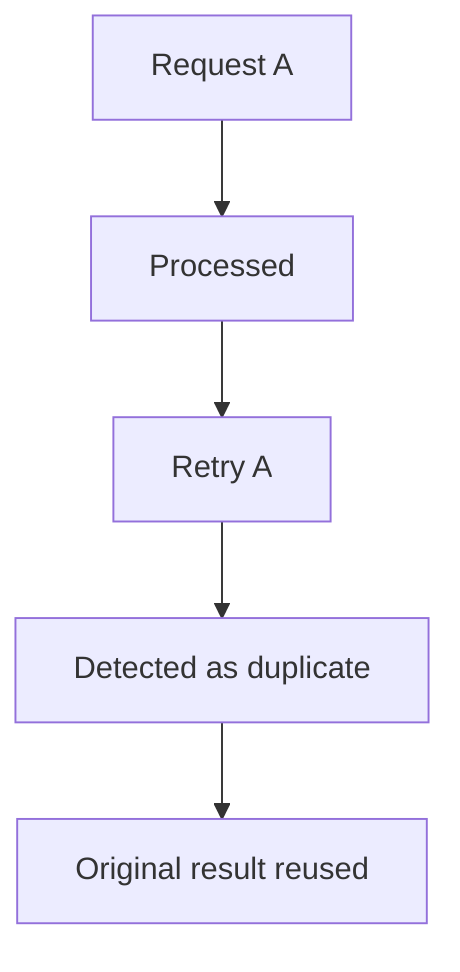

The retry may still reach the service.

What matters is that it does not create another business effect.

---

# 5. Idempotency Key

An **idempotency key** is a unique identifier representing one logical operation.

Example:

```text
Idempotency-Key:
order-payment-7f92a
```

The client sends:

```text
POST /payments

Idempotency-Key: order-payment-7f92a
```

The server records the operation.

If the client retries:

```text
POST /payments

Idempotency-Key: order-payment-7f92a
```

The server recognizes:

```text
This operation was already processed.
```

It can return the original result instead of performing the side effect again.

---

# 6. Basic Idempotency Flow

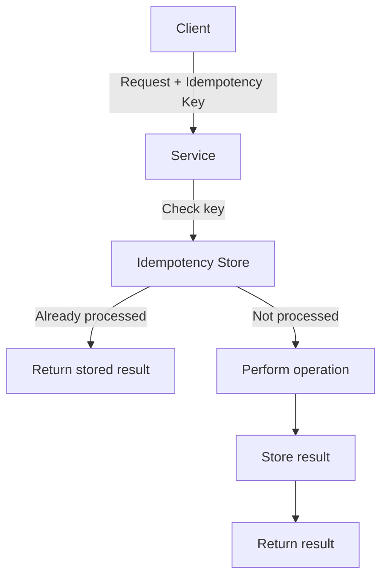

This transforms:

```text
Retry → Repeat side effect
```

into:

```text
Retry → Recognize previous operation → Return previous result
```

---

# 7. Idempotency Key Must Represent the Logical Operation

A key should identify the **operation**, not merely the network request.

Bad design:

```text
Generate a new key for every retry
```

Then:

```text
Attempt 1 → key A
Attempt 2 → key B
```

The system sees two different operations.

Better:

```text
Logical payment
      |
      +── Attempt 1 → key A
      +── Attempt 2 → key A
      +── Attempt 3 → key A
```

All retries use the same key.

---

# 8. Message IDs

Messaging systems can also use unique message identifiers.

Example:

```json
{
  "message_id": "msg-9821",
  "event": "order.created",
  "order_id": "ORD-1001"
}
```

A consumer can record processed message IDs.

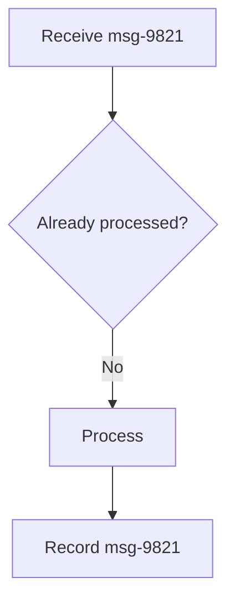

If the same message is delivered again:

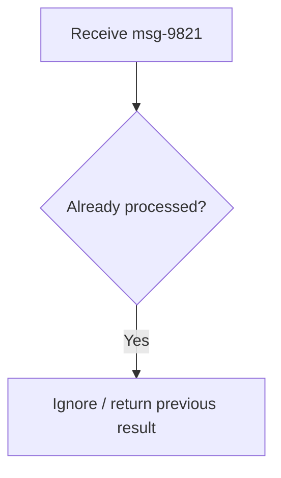

This is consumer-side deduplication.

---

# 9. Idempotency vs Deduplication

These concepts are related but not identical.

### Deduplication

Detect:

```text
"This message/request is a duplicate."
```

### Idempotency

Ensure:

```text
"Even if this operation happens again, the business effect remains correct."
```

Deduplication is one technique for implementing idempotency.

But idempotency can also be achieved through:

- state-setting operations
- unique constraints
- conditional updates
- database transactions
- idempotency keys
- version checks

---

# 10. Database Uniqueness as an Idempotency Tool

A database can help prevent duplicate business operations.

Suppose an order payment has:

```text
payment_reference = PAY-123
```

Create a unique constraint:

```sql
CREATE UNIQUE INDEX
idx_payment_reference
ON payments(payment_reference);
```

If the same payment is inserted twice:

```text
PAY-123
PAY-123
```

the database rejects the duplicate.

The database becomes part of the protection mechanism.

---

# 11. Why Application Checks Alone Are Dangerous

Consider:

```text
if payment_not_exists():
    create_payment()
```

Two requests arrive simultaneously.

```text
Request A ──→ Check → Not found
Request B ──→ Check → Not found
```

Both continue:

```text
Request A → Insert
Request B → Insert
```

Duplicate records may be created.

This is a **race condition**.

A database uniqueness constraint can provide stronger protection:

```text
Request A ──→ INSERT ──→ Success
Request B ──→ INSERT ──→ Unique constraint violation
```

Application logic and database constraints should work together.

---

# 12. Idempotent Database Updates

Some database operations can naturally be designed to be idempotent.

Instead of:

```sql
UPDATE accounts
SET balance = balance + 500;
```

which can produce an additional effect when repeated, use a business operation identifier.

For example:

```text
payment_id = PAY-123
```

Then the system ensures:

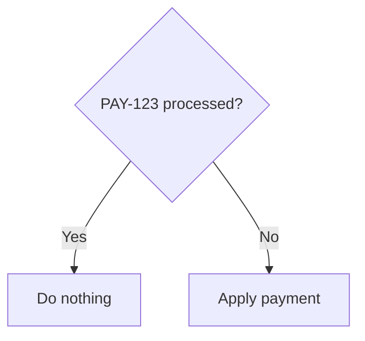

The exact implementation depends on the database and transaction design.

The principle is:

> **Make the business operation uniquely identifiable.**

---

# 13. Idempotency Records

A service may maintain a dedicated table:

```text
idempotency_records

------------------------------------------------
key             status       response
------------------------------------------------
PAY-123         completed    {...}
PAY-456         completed    {...}
PAY-789         processing   ...
```

When a request arrives:

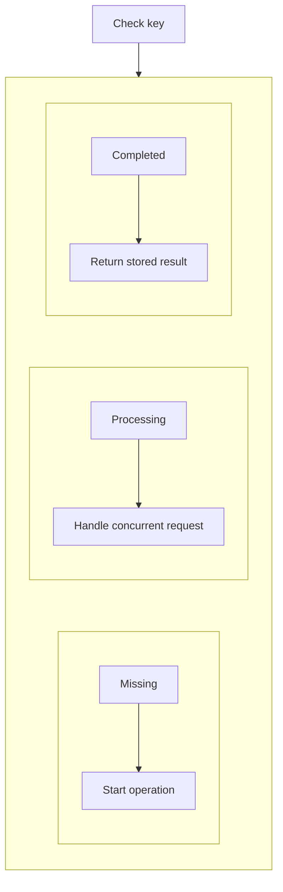

The record may contain:

- idempotency key
- operation type
- user/account ID
- status
- response
- created time
- expiration time
- resource ID

---

# 14. The Processing State Is Important

Suppose two identical requests arrive at nearly the same time.

```text
Request A ──→ Check key
Request B ──→ Check key
```

If both see:

```text
Not processed
```

they may both execute.

A better design creates a state first:

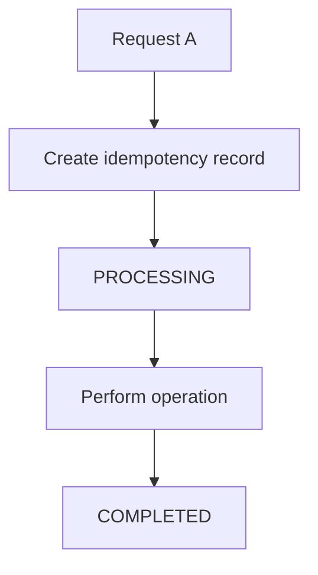

Request B then sees:

```text
PROCESSING
```

and must follow a defined policy.

For example:

```text
Wait
or
Return "operation in progress"
or
Retry later
```

---

# 15. Transactions and Idempotency

Suppose an order service must:

1. create an order
2. record the idempotency key

These operations should often be coordinated in one database transaction.

Conceptually:

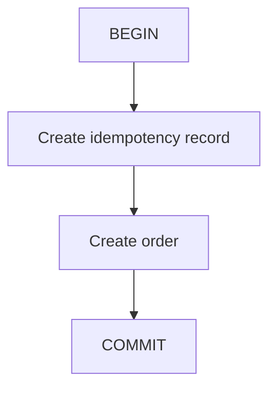

If something fails:

```text
ROLLBACK
```

The exact design depends on where the side effect occurs.

A database transaction cannot automatically make an external API call atomic with the database.

---

# 16. API Idempotency

A public API can expose idempotency directly.

Example:

```http
POST /payments
Idempotency-Key: 8d7a-payment-001
```

The server can guarantee that repeated requests using the same key do not create multiple payments.

A useful response model:

```text
First request
→ 201 Created
→ Payment created

Retry
→ Same logical result
→ Existing payment returned
```

The exact HTTP status and API behavior depend on the API design.

---

# 17. What If the Same Key Has Different Data?

Consider:

```text
Request 1
Key: PAY-123
Amount: ₹1,000
```

Later:

```text
Request 2
Key: PAY-123
Amount: ₹2,000
```

The server should not silently treat these as the same valid operation.

The system should detect:

```text
Same idempotency key
+
Different request parameters
```

and reject the request or otherwise follow a clearly defined policy.

Therefore an idempotency key should have a well-defined scope.

---

# 18. Idempotency and Timeouts

Consider:

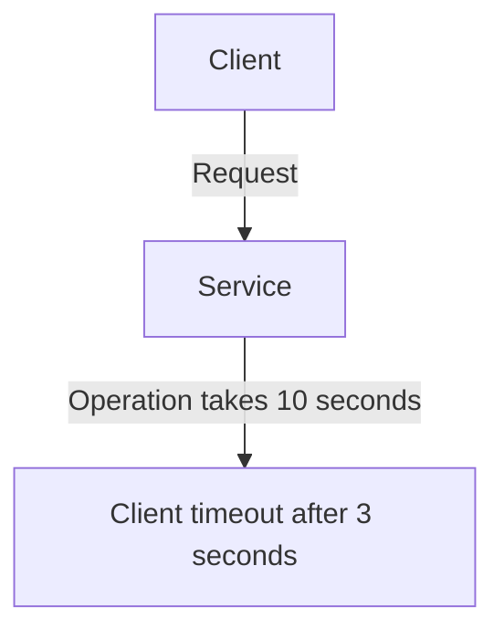

The client may retry:

```text
Retry
```

But the original operation might still be running.

Therefore:

```text
Timeout ≠ Operation definitely failed
```

Idempotency protects against this ambiguity.

---

# 19. Idempotency and Side Effects

The more important the side effect, the more carefully idempotency should be designed.

Examples:

| Operation | Duplicate Effect |
|---|---|
| Set profile name | Usually harmless |
| Increment view counter | Possibly acceptable |
| Create order | Usually undesirable |
| Reserve inventory | Dangerous |
| Charge payment | Critical |
| Send notification | Possibly undesirable |
| Issue refund | Critical |

Ask:

> **What happens if this operation runs twice?**

If the answer is:

> "Something bad happens."

then idempotency deserves explicit design.

---

# 20. Idempotency Does Not Mean Every Operation Must Be Stored Forever

Idempotency records can have retention policies.

For example:

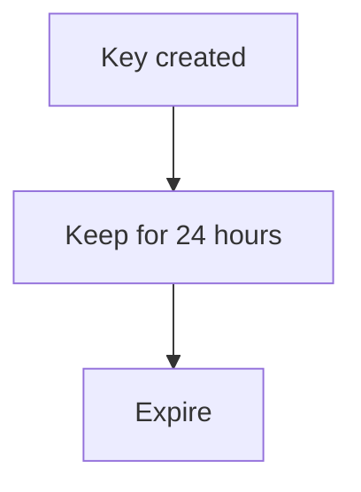

The correct retention period depends on:

- client retry behavior
- business operation lifetime
- API contract
- duplicate risk
- storage cost

A payment operation may require a different policy from a temporary background job.

---

# 21. Idempotency Key Scope

An idempotency key should normally be scoped appropriately.

For example:

```text
User A + PAY-123
```

should not accidentally collide with:

```text
User B + PAY-123
```

Depending on the system, the uniqueness boundary may be:

```text
user_id + idempotency_key
```

or:

```text
account_id + operation_type + idempotency_key
```

The exact scope is a design decision.

---

# 22. A Reliable Message Processing Pattern

A common production approach is:

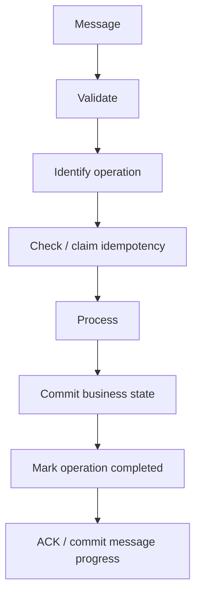

The exact transaction boundaries matter.

The goal is to avoid:

```text
Business effect succeeds
but
Idempotency state says it failed
```

or:

```text
Idempotency state says completed
but
Business effect never happened
```

These failure windows must be designed explicitly.

---

# 23. Failure Scenario — Crash Before Recording Completion

Suppose:

```text
1. Receive message
2. Process payment
3. Payment succeeds
4. Service crashes
5. Idempotency record not updated
```

On retry:

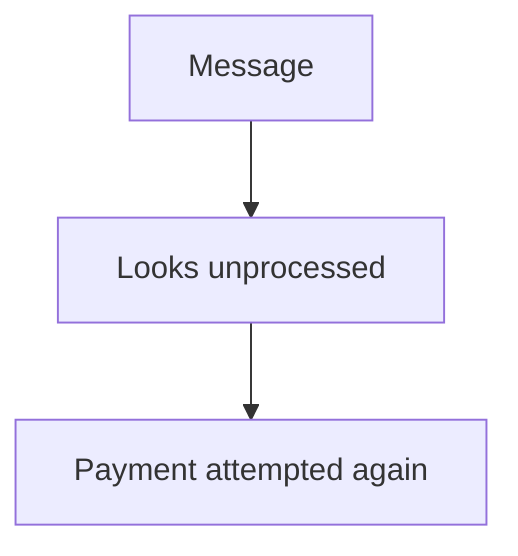

The system still needs protection at the business-operation level.

For critical operations, the idempotency state and business effect often need to be coordinated transactionally where possible.

For external systems, provider-supported idempotency or reconciliation may be required.

---

# 24. Failure Scenario — Marked Complete Too Early

The opposite problem:

```text
1. Mark operation COMPLETED
2. Process payment
3. Service crashes
```

Now the system may believe:

```text
Completed
```

when the actual effect never happened.

Therefore:

> **Do not mark an operation successfully completed before the required business effect is safely committed.**

---

# 25. Idempotency and External Side Effects

The problem becomes harder when the operation crosses system boundaries.

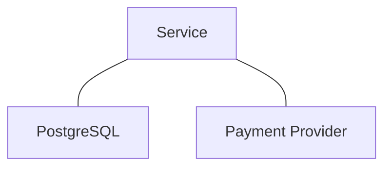

A single database transaction cannot atomically include the external payment provider.

Possible approaches include:

- provider-side idempotency keys
- durable operation records
- outbox/event patterns
- reconciliation
- state machines
- retry-safe APIs

These patterns become increasingly important as systems become distributed.

---

# 26. Idempotency With State Machines

Complex operations can be modeled as states.

Example:

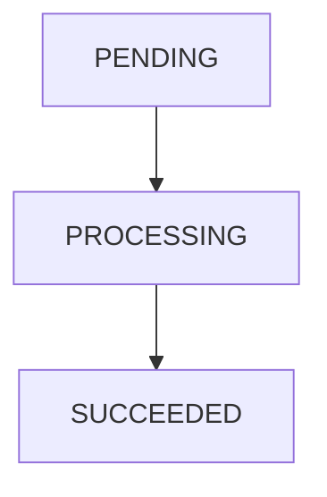

Failure:

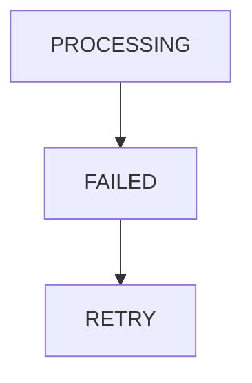

The system can prevent invalid transitions.

For example:

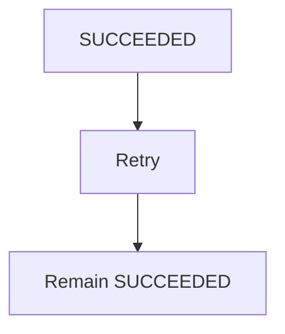

The retry does not create another business effect.

---

# 27. Idempotency and Conditional Updates

Another useful technique is conditional state transition.

Instead of:

```sql
UPDATE orders
SET status = 'shipped';
```

the system can require:

```text
status must currently be 'paid'
```

Conceptually:

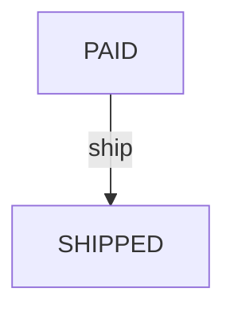

If another worker already changed it:

```text
SHIPPED
```

the same operation cannot accidentally perform the transition again.

This creates an explicit state boundary.

---

# 28. Idempotency and Version Numbers

Some systems use versions to prevent stale updates.

Example:

```text
Order version = 7
```

Update:

```text
Change order where version = 7
```

If another process already changed it:

```text
Version = 8
```

the update does not apply.

This helps prevent:

- duplicate state changes
- stale writes
- concurrent update conflicts

Versioning is especially useful when multiple workers or services can modify the same logical resource.

---

# 29. Idempotency Is Not the Same as Concurrency Control

They work together but solve different problems.

### Idempotency

Handles:

```text
Same operation repeated
```

### Concurrency control

Handles:

```text
Different operations happening at the same time
```

Example:

```text
Two customers buy the last product simultaneously.
```

That is primarily a concurrency/inventory correctness problem.

If one customer retries the same purchase request, that introduces an idempotency problem.

A production system may need both.

---

# 30. Hands-On Exercise — Build an Idempotent Order API

Use PostgreSQL and a simple application.

Create:

```text
orders
-----------------------------
id
customer_id
total
status
created_at
```

Create:

```text
idempotency_records
-----------------------------
key
customer_id
status
order_id
response
created_at
```

Add a uniqueness rule:

```sql
UNIQUE (customer_id, key)
```

## Step 1 — First Request

Send:

```text
POST /orders
Idempotency-Key: ORDER-1001
```

Result:

```text
Order created
```

Record:

```text
ORDER-1001 → COMPLETED
```

## Step 2 — Retry

Send the same request:

```text
POST /orders
Idempotency-Key: ORDER-1001
```

Expected:

```text
No second order
```

Return the original result.

## Step 3 — Different Key

Send:

```text
POST /orders
Idempotency-Key: ORDER-1002
```

Expected:

```text
A new order
```

## Step 4 — Same Key, Different Data

Send:

```text
Key: ORDER-1001
Total: different value
```

Expected:

```text
Reject as an idempotency-key conflict
```

---

# 31. Lab Challenge — Simulate a Duplicate Message

Create this message:

```json
{
  "message_id": "msg-1001",
  "event": "order.created",
  "order_id": "ORD-1001"
}
```

Deliver it twice:

```text
msg-1001
msg-1001
```

Design the consumer so that:

```text
First delivery
→ Process order

Second delivery
→ Detect duplicate
→ Do not create another business effect
```

Then simulate:

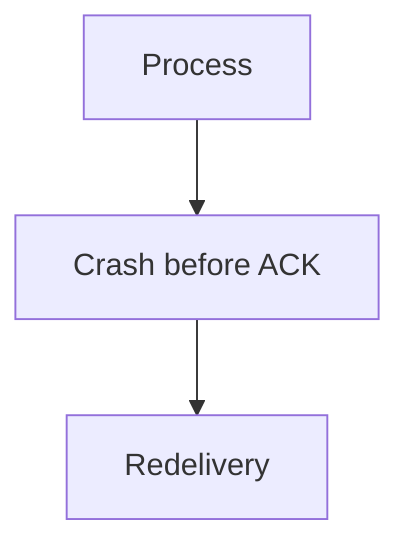

Your consumer should still produce the correct final state.

---

# 32. Practical Idempotency Checklist

For any retryable operation, ask:

1. What is the logical operation?
2. What uniquely identifies it?
3. Can it be repeated?
4. What happens if it runs twice?
5. Where is the idempotency key stored?
6. Is the key unique?
7. What happens during concurrent requests?
8. What happens if the service crashes?
9. What happens if the response is lost?
10. What happens if an external API succeeds but the local service crashes?
11. How long should idempotency records remain?
12. Can the operation be safely retried?

---

# 33. Common Mistakes

### Mistake 1 — Assuming retries are rare

Retries are normal in distributed systems.

---

### Mistake 2 — Using a new idempotency key for every retry

That defeats the purpose.

---

### Mistake 3 — Checking first, inserting later

This can create race conditions.

Prefer atomic database mechanisms.

---

### Mistake 4 — Assuming message IDs automatically provide idempotency

A message ID is useful only if the consumer actually uses it to protect processing.

---

### Mistake 5 — Treating ACK as idempotency

ACK controls message delivery/progress.

Idempotency controls repeated business effects.

They solve different problems.

---

### Mistake 6 — Storing only "processed = true"

For APIs, it can be useful to store enough information to return the original result.

---

### Mistake 7 — Marking success too early

Do not mark the operation completed before the required business effect is safely handled.

---

### Mistake 8 — Assuming database transactions solve external effects

A local transaction cannot automatically include an independent payment provider or external API.

---

### Mistake 9 — Ignoring concurrent requests

Two identical requests can arrive at almost the same time.

---

### Mistake 10 — Trying to eliminate every duplicate

A more practical strategy is often:

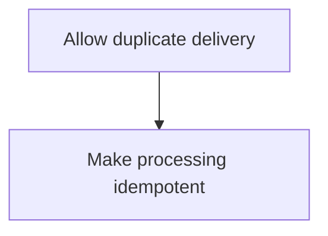

---

# 34. System Design View

Idempotency becomes increasingly important as systems become distributed.

A simple application might have:

```mermaid
flowchart TD
  accTitle: A simple application
  accDescr: Client, then Application, then Database.
  N0["Client"] --> N1["Application"] --> N2["Database"]
```

A larger system may have:

```mermaid
flowchart TD
  accTitle: A larger system
  accDescr: Client, then API, then Queue, then Worker, then Database, then Payment Provider.
  N0["Client"] --> N1["API"] --> N2["Queue"] --> N3["Worker"] --> N4["Database"] --> N5["Payment Provider"]
```

Now failures can occur at many boundaries.

```text
Network
Queue
Worker
Database
External API
Response
```

You cannot assume that:

```text
One request = One execution
```

Instead, design around:

```text
Retry
+
Duplicate delivery
+
Timeout
+
Crash
+
Recovery
```

Idempotency becomes a fundamental reliability technique.

---

# 35. Idempotency Decision Framework

Use this simple flow:

```mermaid
flowchart TD
  accTitle: Idempotency decision framework
  accDescr: Can the operation be retried? Yes: can retry create an unwanted effect? No: usually safe. Yes: design idempotency, identify operation, choose idempotency key, make claim atomic, coordinate state/effect, test failure + retry.
  Q1{"Can the operation be retried?"} -->|"Yes"| Q2{"Can retry create an unwanted effect?"}
  Q2 -->|"No"| S["Usually safe"]
  Q2 -->|"Yes"| N0["Design idempotency"] --> N1["Identify operation"] --> N2["Choose idempotency key"] --> N3["Make claim atomic"] --> N4["Coordinate state/effect"] --> N5["Test failure + retry"]
```

---

# 36. Idempotency in the Bigger Messaging Architecture

The concepts from Level 5 now connect:

```mermaid
flowchart TD
  accTitle: Idempotency in the messaging architecture
  accDescr: Producer, then Message Broker, then Queue / Topic, then Consumer / Worker, then Retry, then Duplicate Delivery, then Idempotent Processing, then Database / External System.
  N0["Producer"] --> N1["Message Broker"] --> N2["Queue / Topic"] --> N3["Consumer / Worker"] --> N4["Retry"] --> N5["Duplicate Delivery"] --> N6["Idempotent Processing"] --> N7["Database / External System"]
```

Each chapter addresses a different part:

| Concept | Main Question |
|---|---|
| Queue | Where does work wait? |
| Worker | Who performs the work? |
| Broker | How are messages routed/delivered? |
| Pub/Sub | How does one event reach multiple consumers? |
| Kafka | How are high-volume event streams stored and consumed? |
| Ordering | In what sequence should related messages be handled? |
| Delivery Semantics | What happens when delivery and processing fail? |
| Idempotency | What happens when the same operation happens again? |

---

# 37. Key Principle

> **Idempotency makes repeated execution of the same logical operation safe by preventing unwanted additional effects. It is especially important when retries, duplicate messages, timeouts, crashes, and at-least-once delivery are possible. Reliable idempotency requires a clear operation identity, concurrency-safe claiming, appropriate database constraints or state tracking, and careful handling of external side effects.**

---

# 38. Quick Reference

### Idempotency

```mermaid
flowchart TD
  accTitle: Idempotency
  accDescr: Same logical operation, then Repeated attempts, then Same intended business effect.
  N0["Same logical operation"] --> N1["Repeated attempts"] --> N2["Same intended business effect"]
```

### API

```mermaid
flowchart TD
  accTitle: API idempotency
  accDescr: Request + Idempotency-Key, then Check / Claim, then Process, then Store Result, then Return.
  N0["Request + Idempotency-Key"] --> N1["Check / Claim"] --> N2["Process"] --> N3["Store Result"] --> N4["Return"]
```

### Message Consumer

```mermaid
flowchart TD
  accTitle: Message consumer
  accDescr: Message, Message ID. Already processed? Yes: ignore / return result. No: process, record completion.
  N0["Message"] --> N1["Message ID"] --> D{"Already processed?"}
  D -->|"Yes"| Y["Ignore / return result"]
  D -->|"No"| X0["Process"] --> X1["Record completion"]
```

### Common Protection Mechanisms

- Idempotency keys
- Message IDs
- Unique constraints
- Atomic inserts
- Transactions
- Conditional updates
- State machines
- Version checks
- Provider-side idempotency
- Reconciliation

### Remember

```text
Retry is normal.
Duplicate delivery is possible.
Idempotency makes duplicates safe.
```

---

# 39. Knowledge Check

### 1. What does idempotency mean?

**Answer:** Repeating the same logical operation does not create an unwanted additional effect.

### 2. Why is idempotency important with at-least-once delivery?

**Answer:** Because the same message may be delivered or processed more than once.

### 3. What is an idempotency key?

**Answer:** A unique identifier representing one logical operation so retries can be recognized.

### 4. Why is "check then insert" dangerous?

**Answer:** Concurrent requests can both observe that the operation does not exist and both perform it.

### 5. What can a database unique constraint provide?

**Answer:** A concurrency-safe mechanism for preventing duplicate values or operations identified by a unique business key.

### 6. Does an ACK guarantee idempotency?

**Answer:** No. ACK controls delivery/progress; idempotency protects the business effect from repeated processing.

### 7. Can a database transaction make an external payment exactly once?

**Answer:** Not by itself. The external system is outside the local database transaction.

### 8. Why can a timeout cause duplicate processing?

**Answer:** The original operation may have succeeded even though the client did not receive the response, causing the client to retry.

### 9. Is idempotency the same as ordering?

**Answer:** No. Ordering controls sequence; idempotency controls repeated execution.

### 10. What is a common production strategy?

**Answer:** Durable messaging + at-least-once delivery + idempotent processing.

---

# 40. Remember

```text
Distributed systems retry.

Retries can duplicate work.

Duplicate work can duplicate side effects.

Idempotency makes repeated operations safe.

Identify the operation.
Claim it safely.
Perform the effect.
Record the result.
Handle retries.
```

The goal is not necessarily:

> **"Make duplicates impossible."**

The goal is:

> **"Make duplicate attempts safe."**

---

# 41. Next Chapter

## 05.12 — Retries

Next, we will study:

- Why systems retry
- Temporary vs permanent failures
- Retryable vs non-retryable errors
- Immediate retries
- Fixed delays
- Exponential backoff
- Jitter
- Maximum retry attempts
- Retry budgets
- Timeouts + retries
- Retry amplification
- Retry storms
- Queue retries
- Worker retries
- API retries
- Database retries
- Idempotency + retries
- Dead-letter queues
- Failure classification
- When not to retry
- Hands-on retry exercise
- System-design trade-offs
