# 05.12 — Retries

## Learning Objectives

By the end of this chapter, you should understand:

- Why distributed systems retry
- Temporary vs permanent failures
- Retryable vs non-retryable errors
- Immediate retries
- Fixed delays
- Exponential backoff
- Jitter
- Maximum retry attempts
- Retry budgets
- Timeouts + retries
- Retry amplification
- Retry storms
- Queue and worker retries
- API and database retries
- Idempotency + retries
- Dead-letter queues
- Failure classification
- When not to retry

---

# Beginner Vocabulary

| Term | Beginner-Friendly Meaning |
|---|---|
| Retry | Trying the same operation again after failure |
| Temporary Failure | A failure that may disappear if tried again later |
| Permanent Failure | A failure that will probably not succeed without changing the request or system state |
| Backoff | Waiting before trying again |
| Exponential Backoff | Increasing the wait time after each failed attempt |
| Jitter | Adding randomness to retry delays |
| Retry Limit | Maximum number of retry attempts |
| Retry Budget | Limit on how much retry traffic a system is allowed to generate |
| Retry Storm | A large number of retries overwhelming a system |
| Retry Amplification | Extra load created by retries on top of original traffic |
| Timeout | Maximum time allowed for an operation to complete |
| Idempotency | Making repeated execution of the same logical operation safe |
| Dead-Letter Queue | Place for messages that cannot be successfully processed after defined attempts |
| Backpressure | Slowing incoming work when downstream processing cannot keep up |
| Transient Error | Another name commonly used for a temporary failure |
| Permanent Error | Failure that should normally not be retried |

---

# 1. What Is a Retry?

A **retry** means attempting an operation again after an earlier attempt failed or did not produce a usable result.

Simple example:

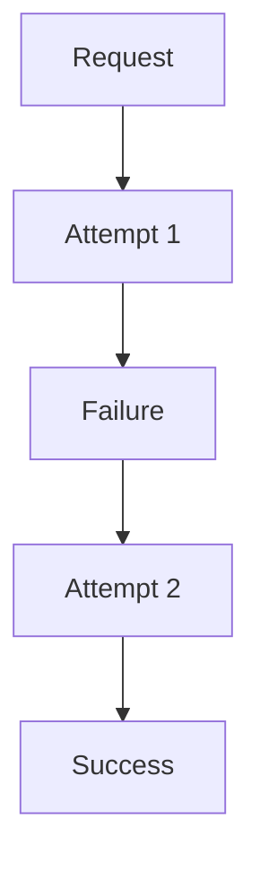

Retries are common because distributed systems operate across:

- networks
- databases
- APIs
- queues
- services
- cloud infrastructure
- external providers

Any of these can temporarily fail.

---

# 2. Why Do Systems Retry?

Consider:

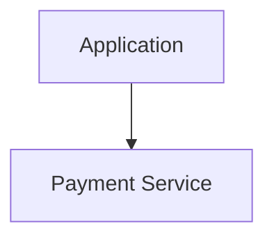

The payment service may temporarily return:

```text
503 Service Unavailable
```

Trying again a moment later may succeed.

Without retries:

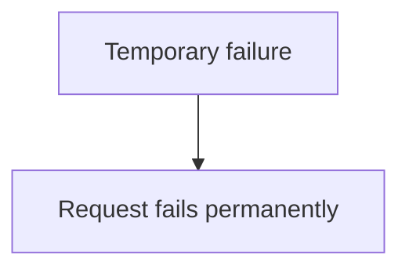

With a sensible retry:

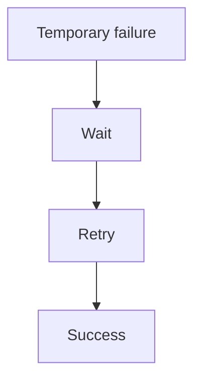

Retries can improve reliability when the failure is genuinely temporary.

---

# 3. Not Every Failure Should Be Retried

This is one of the most important rules.

Consider:

```text
POST /orders

{
  "quantity": -5
}
```

The server returns:

```text
400 Bad Request
```

Retrying the same request will probably produce:

```text
400 Bad Request
```

again.

The problem is not temporary infrastructure failure.

The request itself is invalid.

Therefore:

> **Retrying is useful only when another attempt has a reasonable chance of succeeding.**

---

# 4. Database Retries

Database operations can also fail temporarily.

Examples:

- connection interruption
- temporary network failure
- database failover
- serialization failure
- deadlock victim

Some failures may be retryable.

But blindly retrying database operations can be dangerous.

Consider:

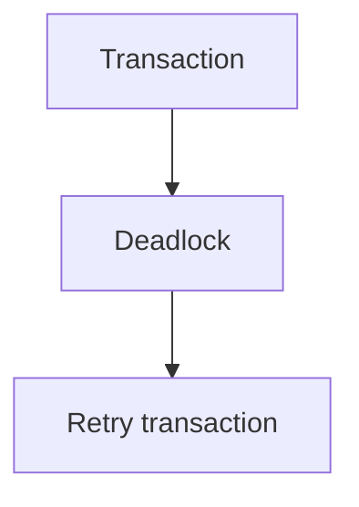

This may be appropriate if the database explicitly reports a retryable transaction failure.

But the entire transaction may need to be retried, not just one SQL statement.

---

# 5. Transaction Retry

Suppose:

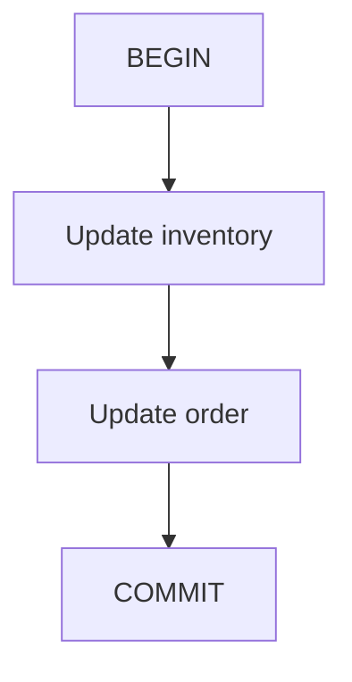

The transaction fails because of a serialization conflict.

A safe retry pattern may be:

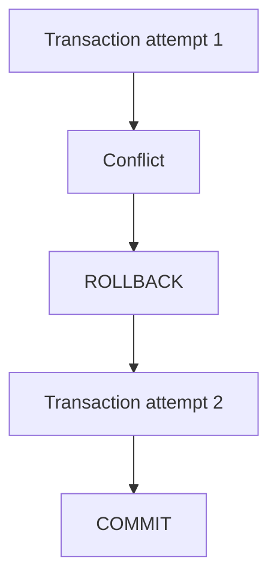

The application must ensure the transaction is retry-safe.

This connects directly to:

- transactions
- isolation levels
- idempotency

---

# 6. Queue and Worker Retries

A worker may process a message:

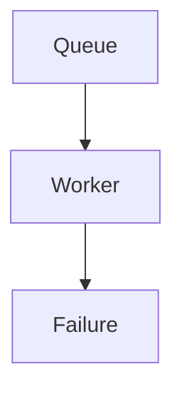

The system may retry:

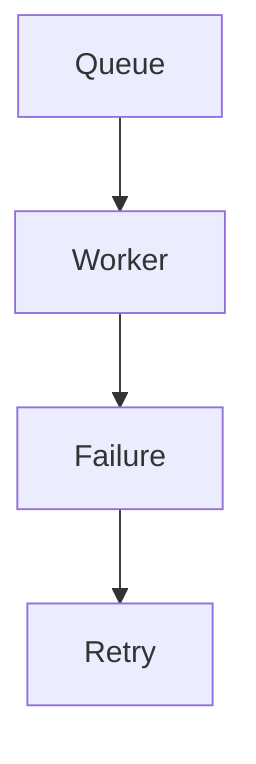

Possible strategies include:

- immediate retry
- delayed retry
- exponential backoff
- retry queue
- scheduled retry
- dead-letter queue after maximum attempts

The correct strategy depends on the failure type.

---

# 7. Retry Queue

A simple architecture can separate failed work:

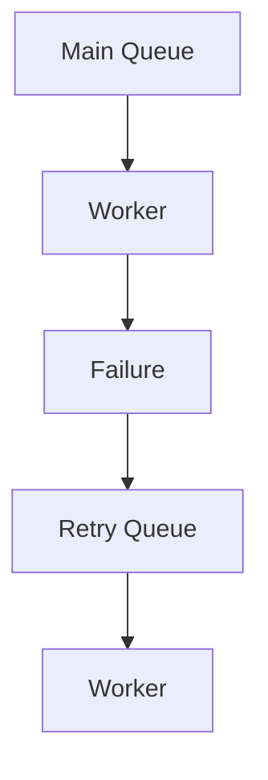

The retry queue can delay the next attempt.

For example:

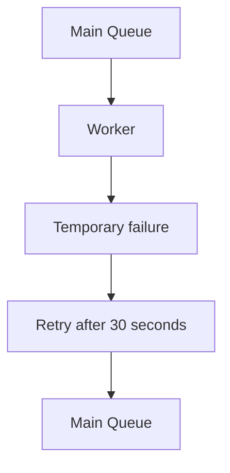

This prevents immediate repeated processing.

---

# 8. Retry Delays and Queues

Queues provide an important advantage:

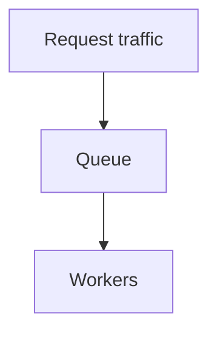

Workers can control how aggressively failed work is retried.

This is often safer than thousands of application servers independently retrying the same dependency.

---

# 9. When Not to Retry Queue Messages

Consider:

```text
Message:
quantity = -5
```

If the worker fails because the message is permanently invalid:

```text
Retry
Retry
Retry
Retry
```

will not fix it.

Instead:

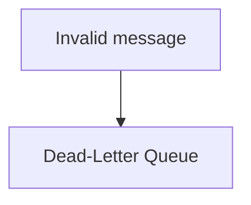

This prevents a bad message from consuming worker capacity indefinitely.

---

# 10. Dead-Letter Queue

A **dead-letter queue (DLQ)** stores messages that could not be successfully processed after the defined retry policy.

Conceptually:

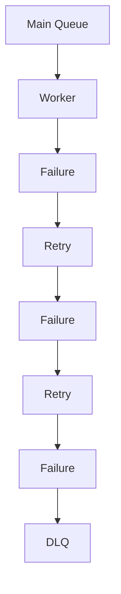

The DLQ allows operators or another process to investigate the message later.

Detailed DLQ behavior is covered in:

**05.13 — Dead-Letter Queues**

---

# 11. Retry and Backpressure

Suppose workers process:

```text
1,000 jobs/sec
```

but the downstream service can handle only:

```text
500 requests/sec
```

Adding retries increases pressure.

Backpressure can instead slow processing:

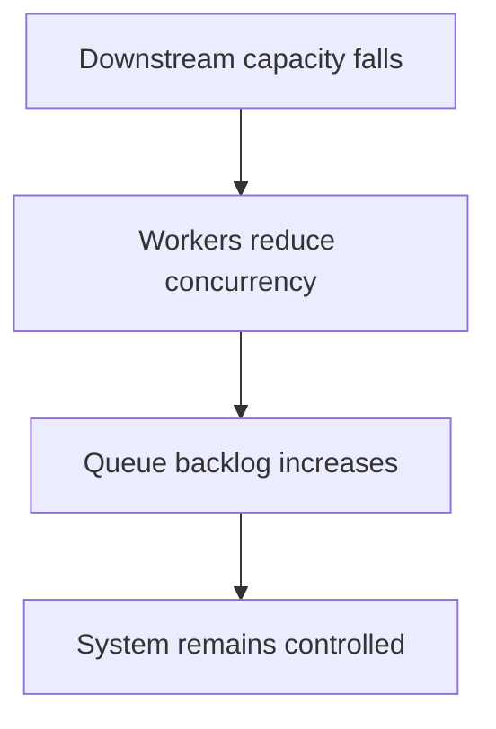

This is healthier than unlimited retry traffic.

---

# 12. Failure Scenario — External API

Suppose an order service calls a shipping provider.

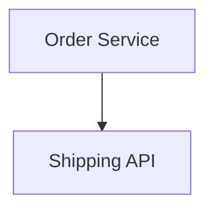

The API returns:

```text
503
```

A sensible flow might be:

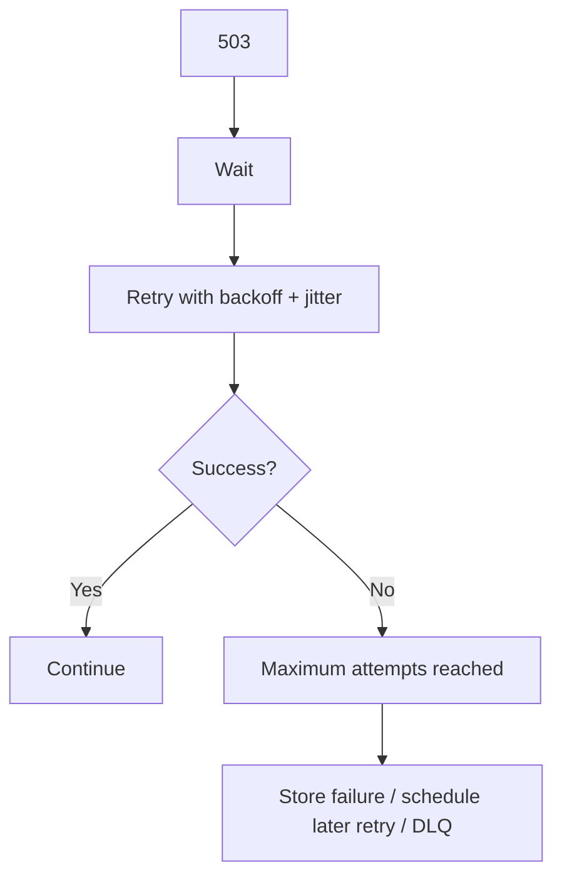

The exact recovery depends on whether shipping is required before the user request can complete.

---

# 13. Hands-On Exercise — Build a Retry Simulator

Create a small program that simulates a dependency.

The dependency should randomly produce:

```text
SUCCESS
TEMPORARY_FAILURE
PERMANENT_FAILURE
```

Example:

```text
Attempt 1 → TEMPORARY_FAILURE
Wait
Attempt 2 → TEMPORARY_FAILURE
Wait longer
Attempt 3 → SUCCESS
```

Implement:

- maximum attempts
- exponential backoff
- jitter
- permanent-error detection
- total retry timeout

Log:

```text
Attempt
Failure type
Delay
Result
```

---

# 14. Lab Challenge — Retry Storm

Simulate:

```text
1,000 clients
```

Each client receives:

```text
503
```

Compare two strategies.

### Strategy A

```text
Immediate retry
```

### Strategy B

```text
Exponential backoff + jitter
```

Observe when retry requests occur.

The goal is to understand:

> **Why spreading retries reduces synchronized load.**

---

# 15. Lab Challenge — Idempotent Payment Retry

Simulate:

```text
Payment = ₹1,000
Idempotency-Key = PAY-1001
```

Force:

```text
Attempt 1 → Payment succeeds
Response → Lost
```

Then:

```text
Attempt 2 → Retry
```

Expected:

```text
Only one payment effect
```

The exercise connects:

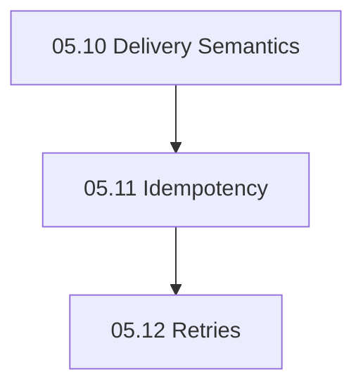

---

# 16. Practical Retry Design Checklist

Before adding a retry, ask:

1. What failed?
2. Is the failure temporary?
3. Is the operation safe to repeat?
4. Is idempotency available?
5. How many attempts are allowed?
6. What is the per-attempt timeout?
7. What is the overall deadline?
8. What backoff should be used?
9. Is jitter needed?
10. Could retries overload the dependency?
11. Is there a retry budget?
12. What happens after the final failure?
13. Should the work enter a queue or DLQ?
14. How will retry behavior be monitored?

---

# 17. Common Mistakes

### Mistake 1 — Retrying every error

Permanent errors do not become successful through repetition.

### Mistake 2 — Retrying immediately

This can create retry storms.

### Mistake 3 — No retry limit

An endless retry loop can consume resources indefinitely.

### Mistake 4 — No backoff

Repeated failures can continuously hammer the dependency.

### Mistake 5 — No jitter

Clients can synchronize their retries.

### Mistake 6 — Ignoring idempotency

A retry can create duplicate side effects.

### Mistake 7 — Ignoring total deadlines

Retries can make a request much slower than intended.

### Mistake 8 — Retrying overloaded systems indefinitely

Retries can amplify overload.

### Mistake 9 — Retrying invalid queue messages forever

Use appropriate failure handling and eventually a DLQ.

### Mistake 10 — Treating retries as a scaling strategy

Retries recover from temporary failures; they do not create capacity.

---

# 18. System Design View

Retries are a small mechanism with large architectural consequences.

Consider:

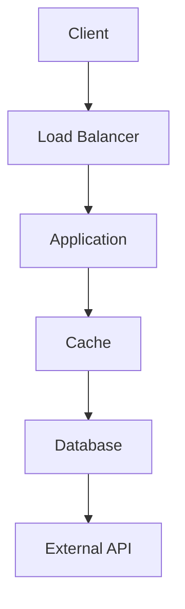

A retry can occur at several layers.

For example:

```text
Client → Application
Application → Database
Application → External API
Worker → Queue
```

If every layer retries independently:

```text
Client retries
     ×
Application retries
     ×
Database driver retries
     ×
Worker retries
```

the total number of attempts can become surprisingly large.

This is **retry multiplication**.

Therefore retry ownership must be deliberate.

---

# 19. Choose a Retry Owner

A system should know:

> **Which layer is responsible for retrying this failure?**

For example:

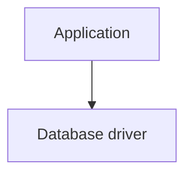

If the driver already handles a specific transient failure, the application may not need another aggressive retry layer.

Similarly:

```mermaid
flowchart TD
  accTitle: Queue redelivery
  accDescr: Queue, then Worker.
  N0["Queue"] --> N1["Worker"]
```

may already provide redelivery.

The goal is controlled recovery, not duplicated retry logic.

---

# 20. Observability for Retries

Retries should be visible.

Useful metrics include:

- retry count
- retry rate
- retry success rate
- attempts per operation
- retry delay
- final failure rate
- timeout rate
- rate-limit responses
- dependency error rate
- queue retry count
- DLQ count

A useful metric is:

```text
Retry Success Rate
=
Successful Retries / Total Retry Attempts
```

If retries rarely succeed, the retry policy may be wasting resources.

---

# 21. Retry Logs

A useful structured log might contain:

```json
{
  "operation": "payment",
  "attempt": 2,
  "max_attempts": 4,
  "error": "timeout",
  "delay_ms": 1800,
  "idempotency_key": "PAY-1001"
}
```

This makes retry behavior easier to investigate.

Correlation IDs can also connect the retry attempts belonging to one logical request.

---

# 22. Retry and Asynchronous Architecture

Retries behave differently depending on whether work is synchronous or asynchronous.

### Synchronous

```mermaid
flowchart TD
  accTitle: Synchronous retry
  accDescr: Client, then Service, then Dependency, then Retry, then Response.
  N0["Client"] --> N1["Service"] --> N2["Dependency"] --> N3["Retry"] --> N4["Response"]
```

Retries directly affect user-facing latency.

### Asynchronous

```mermaid
flowchart TD
  accTitle: Asynchronous retry
  accDescr: Producer, then Queue, then Worker, then Retry, then Complete.
  N0["Producer"] --> N1["Queue"] --> N2["Worker"] --> N3["Retry"] --> N4["Complete"]
```

The retry can happen in the background.

This can improve user experience, but the system must track job state and eventual completion.

---

# 23. Retry and User Experience

Not every failed operation should visibly expose retries to the user.

For example:

```text
Generate report
```

could return:

```text
202 Accepted
```

while background workers retry the job.

The user sees:

```text
Report processing...
```

instead of waiting through multiple retry attempts.

This connects retries with:

- asynchronous work
- queues
- workers
- user-facing state

---

# 24. Retry Decision Framework

Use this mental model:

```mermaid
flowchart TD
  accTitle: Retry decision framework
  accDescr: Operation fails. Is failure temporary? No: stop. Yes: is retry safe? No: stop. Yes: retry policy (timeout, max attempts, backoff, jitter, retry budget, idempotency), then retry / recover. Still failing? No: success. Yes: final failure, then DLQ / fallback / controlled error.
  O["Operation fails"] --> Q1
  subgraph R1[" "]
    direction TB
    Q1{"Is failure temporary?"} -->|"No"| S1["Stop"]
  end
  subgraph R2[" "]
    direction TB
    Q2{"Is retry safe?"} -->|"No"| S2["Stop"]
  end
  subgraph RP["Retry policy"]
    direction TB
    P0["Timeout"] ~~~ P1["Max attempts"] ~~~ P2["Backoff"] ~~~ P3["Jitter"] ~~~ P4["Retry budget"] ~~~ P5["Idempotency"]
  end
  subgraph R3[" "]
    direction TB
    Q3{"Still failing?"} -->|"No"| SU["Success"]
  end
  Q1 -->|"Yes"| Q2
  Q2 -->|"Yes"| RP
  RP --> RR["Retry / Recover"] --> Q3
  Q3 -->|"Yes"| FF["Final failure"] --> DL["DLQ / fallback / controlled error"]
```

---

# 25. Key Principle

> **Retries are a reliability mechanism for temporary failures, not a universal response to errors. A safe retry strategy classifies failures, limits attempts, uses appropriate timeouts, applies backoff and jitter, respects capacity and retry budgets, and works with idempotency to prevent duplicate side effects. Poorly designed retries can amplify failures and create retry storms, while well-designed retries can help a system recover without overwhelming its dependencies.**

---

# 26. Quick Reference

### Good Retry Model

```mermaid
flowchart TD
  accTitle: Good retry model
  accDescr: Failure, classify, retryable, idempotent, backoff + jitter, retry limit / deadline, retry. Success? Yes: done. No: controlled failure / DLQ.
  N0["Failure"] --> N1["Classify"] --> N2["Retryable?"] --> N3["Idempotent?"] --> N4["Backoff + Jitter"] --> N5["Retry Limit / Deadline"] --> N6["Retry"] --> D{"Success?"}
  D -->|"Yes"| Y["Done"]
  D -->|"No"| X["Controlled failure / DLQ"]
```

### Important Terms

| Concept | Purpose |
|---|---|
| Retry | Try operation again |
| Backoff | Wait longer between attempts |
| Exponential Backoff | Increase delay after failures |
| Jitter | Spread retry timing |
| Retry Limit | Prevent endless retries |
| Retry Budget | Control retry-generated traffic |
| Timeout | Limit waiting time |
| Idempotency | Make repeated effects safe |
| DLQ | Isolate repeatedly failing messages |
| Backpressure | Control workload when downstream capacity is limited |
| Circuit Breaker | Stop calls to an unhealthy dependency |

### Remember

```text
Retry temporary failures.
Do not blindly retry permanent failures.

Back off.
Add jitter.
Limit attempts.
Respect deadlines.

Make side effects idempotent.
Watch retry traffic.

Retries should help recovery,
not become another source of failure.
```

---

# 27. Knowledge Check

### 1. Why do systems retry?

**Answer:** To recover from failures that may be temporary.

### 2. Should every error be retried?

**Answer:** No. Permanent failures normally should not be retried unchanged.

### 3. What is exponential backoff?

**Answer:** A strategy that increases the delay between retry attempts after repeated failures.

### 4. Why is jitter useful?

**Answer:** It prevents many clients from retrying at exactly the same time.

### 5. What is retry amplification?

**Answer:** Additional traffic generated by retries on top of the original traffic.

### 6. What is a retry storm?

**Answer:** A situation where many retries overload an already failing dependency.

### 7. Why are timeouts important?

**Answer:** They prevent a single attempt or series of retries from consuming unlimited time and resources.

### 8. Why is idempotency important when retrying payments?

**Answer:** The original payment may have succeeded even if the response was lost; idempotency prevents the retry from creating a second payment.

### 9. What should happen to a permanently invalid queue message?

**Answer:** It should normally stop being retried and may be moved to a dead-letter queue for investigation.

### 10. Can retries solve permanent capacity problems?

**Answer:** No. Retries can actually make overload worse.

---

# 28. Remember

```text
Failure does not automatically mean retry.

First classify the failure.

If retryable:
    Make it safe.
    Set a deadline.
    Limit attempts.
    Back off.
    Add jitter.
    Respect capacity.

Then retry.

If it still fails:
    Stop retrying aggressively.
    Recover through the appropriate failure path.
```

The most important mental model is:

> **Retry is controlled recovery, not repeated hope.**

---

# 29. Next Chapter

## 05.13 — Dead-Letter Queues

Next, we will study:

- What a Dead-Letter Queue is
- Why DLQs exist
- Poison messages
- Maximum retry attempts
- Moving failed messages to a DLQ
- Retry queue vs DLQ
- Temporary vs permanent failures
- Message inspection
- Manual recovery
- Reprocessing
- DLQ retention
- Monitoring
- Alerting
- DLQ growth
- Ordering implications
- Duplicate handling
- RabbitMQ DLQ concepts
- Kafka failure/reprocessing concepts
- Common DLQ mistakes
- Hands-on DLQ exercise
- System-design trade-offs
