# 05.13 — Dead-Letter Queues

## Learning Objectives

By the end of this chapter, you should understand:

- What a Dead-Letter Queue (DLQ) is
- Why DLQs exist
- What a poison message is
- How retries and DLQs work together
- Maximum retry attempts
- Temporary vs permanent failures
- Retry queue vs DLQ
- Moving failed messages to a DLQ
- Inspecting failed messages
- Reprocessing messages
- DLQ retention
- Monitoring and alerting
- DLQ growth
- Ordering implications
- Duplicate handling
- RabbitMQ DLQ concepts
- Kafka failure and reprocessing concepts
- Common DLQ mistakes

---

# Beginner Vocabulary

| Term | Beginner-Friendly Meaning |
|---|---|
| Dead-Letter Queue (DLQ) | A place where messages go when normal processing has failed repeatedly |
| Poison Message | A message that repeatedly causes processing to fail |
| Retry | Trying to process a failed message again |
| Retry Queue | A queue used to delay or organize another processing attempt |
| Failure | An attempt to process a message did not succeed |
| Permanent Failure | A failure unlikely to succeed without changing the message or system |
| Transient Failure | A temporary failure that may succeed later |
| Reprocessing | Trying a failed message again after investigation or correction |
| Acknowledgement (ACK) | Signal that a message was successfully handled |
| Redelivery | Delivering a message again after unsuccessful processing |
| Retention | How long a message is kept |
| Backlog | Work waiting to be processed |
| Consumer | Application that reads messages |
| Routing | Deciding where a message should go |
| Quarantine | Separating problematic data from normal processing |
| Replay | Reading and processing retained events again |

---

# 1. What Is a Dead-Letter Queue?

A **Dead-Letter Queue (DLQ)** is a destination for messages that cannot be successfully processed through the normal processing path after a defined failure policy.

Basic flow:

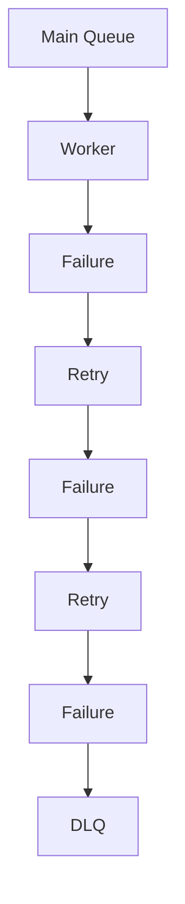

Instead of allowing the same message to fail forever, the system moves it out of the normal path.

The main queue can then continue processing other messages.

---

# 2. Why Do DLQs Exist?

Imagine a queue containing:

```text
Message A
Message B
Message C
Message D
```

Suppose Message B is invalid.

Without appropriate failure handling:

```text
A → Success
B → Failure
B → Retry
B → Failure
B → Retry
B → Failure
...
```

Message B may repeatedly consume worker capacity.

A DLQ changes the behavior:

```text
A → Success
B → Failure → Retry → Failure → DLQ
C → Success
D → Success
```

The problematic message is isolated.

This is the main purpose of a DLQ:

> **Keep repeatedly failing work from blocking or consuming the normal processing path indefinitely.**

---

# 3. DLQ Is a Failure-Handling Mechanism

A DLQ does not fix the underlying problem.

It provides a controlled place for failed messages.

Think of it as:

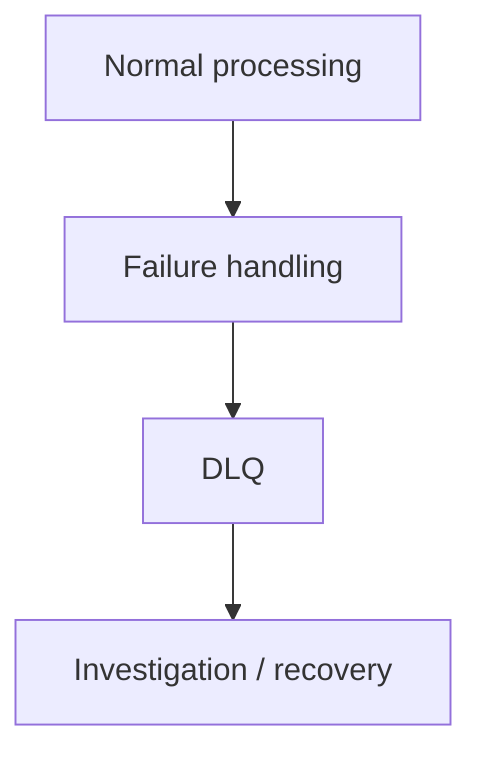

The real question becomes:

> **Why did this message fail, and what should happen to it now?**

---

# 4. Retry Before DLQ

A typical architecture is:

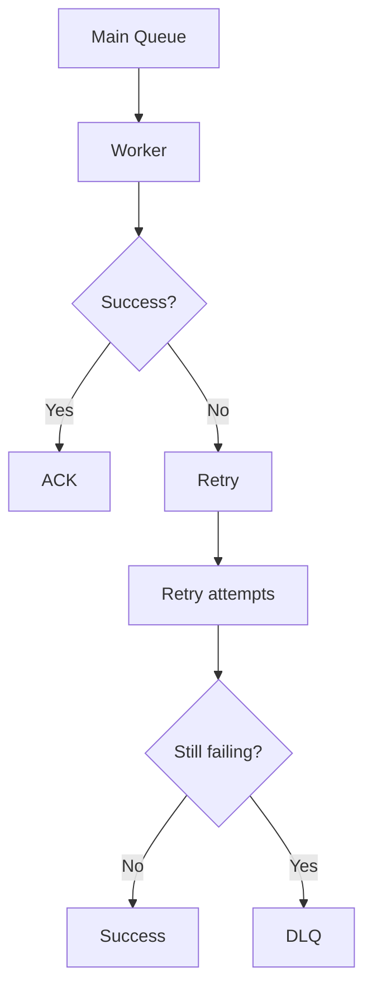

The retry policy determines when the message should be considered unsuitable for normal processing.

---

# 5. Maximum Retry Attempts

A system may define:

```text
Maximum attempts = 3
```

Then:

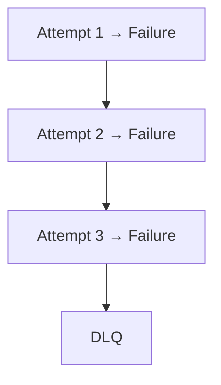

The exact number is a system-design decision.

Some operations may need:

```text
1 retry
```

while others may tolerate:

```text
10 retries
```

The important point is:

> **A retry policy must eventually decide when to stop retrying.**

---

# 6. Poison Message

A **poison message** is a message that repeatedly causes processing failures.

For example:

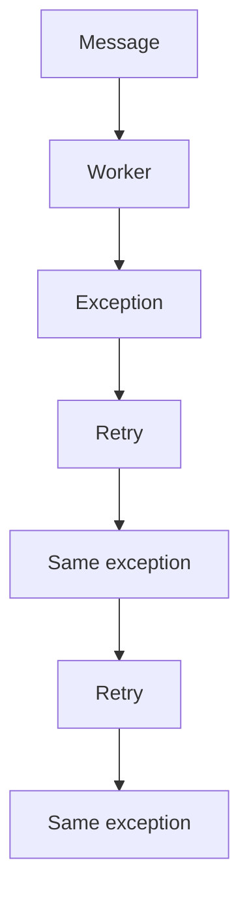

Common causes include:

- invalid data
- unsupported format
- missing required field
- unexpected schema
- corrupted payload
- impossible business state
- application bug
- incompatible message version

A poison message can consume worker capacity if it is not isolated.

---

# 7. Temporary vs Permanent Failure

Not every failed message should immediately enter a DLQ.

### Temporary failure

Example:

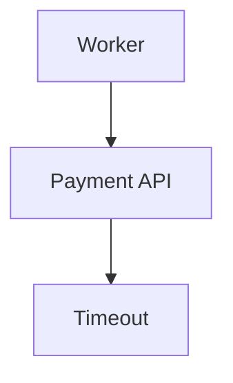

The message may succeed later.

Retrying makes sense.

### Permanent failure

Example:

```text
order.quantity = -5
```

Retrying without changing the message is unlikely to help.

DLQ may be appropriate.

The system therefore needs failure classification.

---

# 8. Retry Queue vs Dead-Letter Queue

These are not the same thing.

### Retry Queue

Purpose:

> **Try the message again later.**

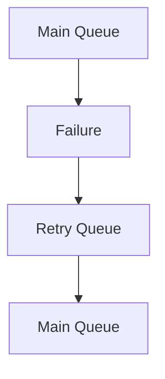

### Dead-Letter Queue

Purpose:

> **Stop normal processing and isolate the failed message.**

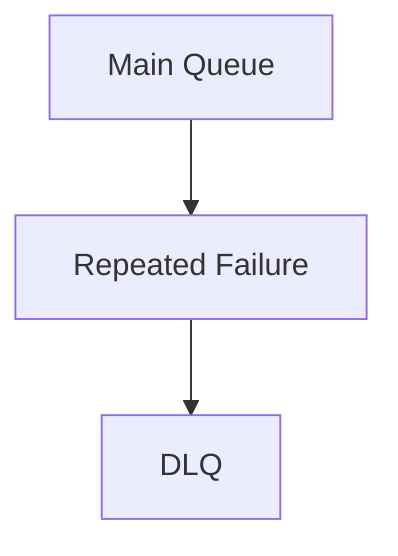

Simple mental model:

```text
Retry Queue → "Try again later."

DLQ → "Stop normal processing and investigate."
```

---

# 9. DLQ Is Not Always a Physical Queue

The name can be misleading.

A DLQ may be implemented using:

- a separate queue
- a separate topic
- a separate stream
- a separate storage destination
- another failure-handling mechanism

The architectural idea matters more than the physical implementation:

> **Separate failed messages from the normal processing path so they can be inspected and handled deliberately.**

---

# 10. What Should a DLQ Message Contain?

A useful DLQ record should preserve enough information to investigate the failure.

It may contain:

```text
Original message
Message ID
Original queue/topic
Failure reason
Error information
Attempt count
First failure time
Last failure time
Consumer/service
Correlation ID
Schema/version
```

Example:

```json
{
  "message_id": "msg-1001",
  "original_queue": "order-processing",
  "attempts": 3,
  "error": "Invalid quantity",
  "failed_at": "2026-10-05T12:30:00Z",
  "original_message": {
    "order_id": "ORD-1001",
    "quantity": -5
  }
}
```

The exact format depends on the messaging technology.

---

# 11. Preserve the Original Message

When possible, the DLQ should preserve the original message or enough information to reconstruct it.

Why?

Because operators need to answer:

> "What exactly did the worker receive?"

Without the original data:

```text
Failure: Invalid request
```

is not very useful.

With the original message:

```text
order_id = ORD-1001
quantity = -5
```

the problem is immediately easier to understand.

---

# 12. Preserve Failure Context

The original message alone may not be enough.

Suppose:

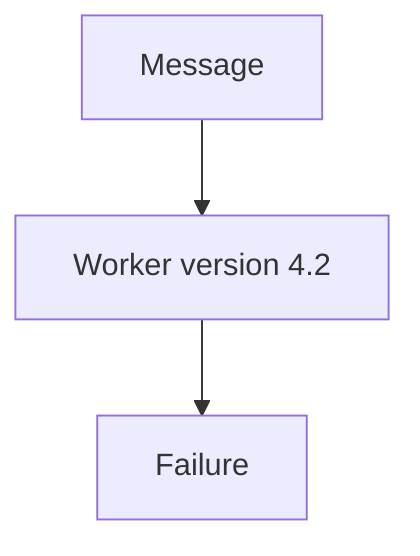

The same message may work after a software bug is fixed.

Therefore useful context can include:

- service name
- application version
- error type
- attempt count
- timestamps
- dependency response
- correlation ID

This makes troubleshooting much easier.

---

# 13. DLQ Retention

A DLQ should normally have a defined retention policy.

For example:

```text
DLQ retention = 7 days
```

or:

```text
DLQ retention = 30 days
```

The correct value depends on:

- business importance
- investigation time
- storage cost
- compliance requirements
- recovery process

A DLQ that silently deletes messages too quickly may destroy the evidence needed to recover from failures.

---

# 14. What Happens After a Message Reaches the DLQ?

There are several possible outcomes.

### Option 1 — Fix and reprocess

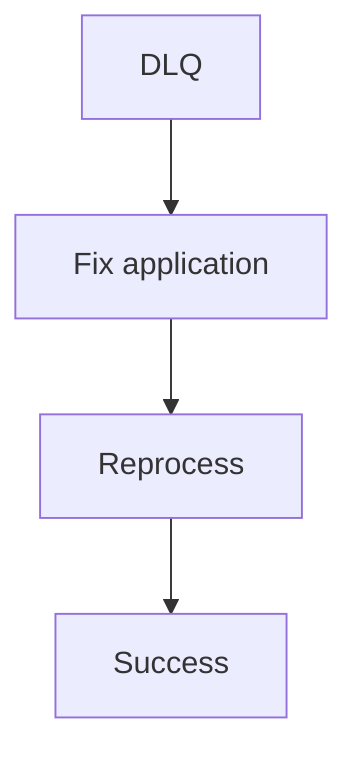

### Option 2 — Correct the data

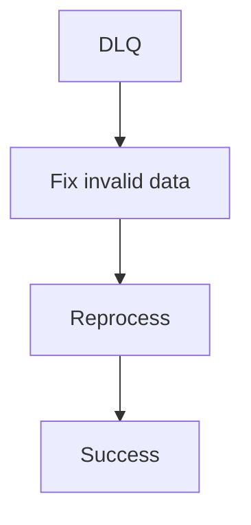

### Option 3 — Discard

If the message is no longer relevant:

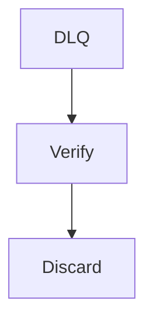

### Option 4 — Compensate

Some business operations may require a compensating action.

For example:

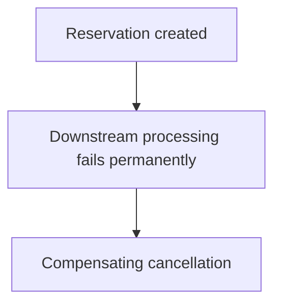

The correct response depends on business semantics.

---

# 15. Reprocessing Is a New Risk

Reprocessing a DLQ message is not automatically safe.

Suppose the original attempt partially succeeded:

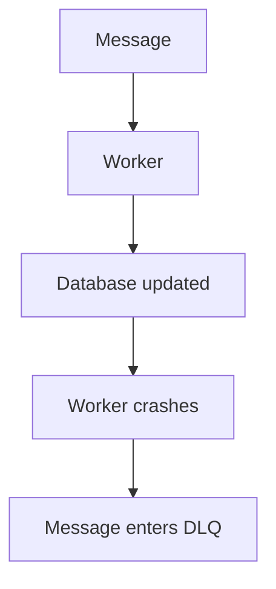

If the message is reprocessed:

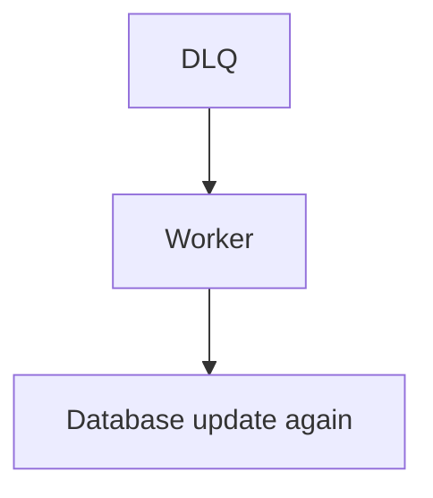

the system may create a duplicate effect.

Therefore:

> **DLQ reprocessing must also be idempotent.**

This connects directly to:

**05.11 — Idempotency**

---

# 16. DLQ + Idempotency

A safe recovery path can look like:

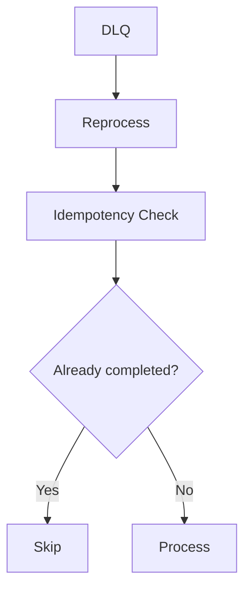

This protects against duplicate business effects during recovery.

---

# 17. Head-of-Line Blocking

If strict ordering is required:

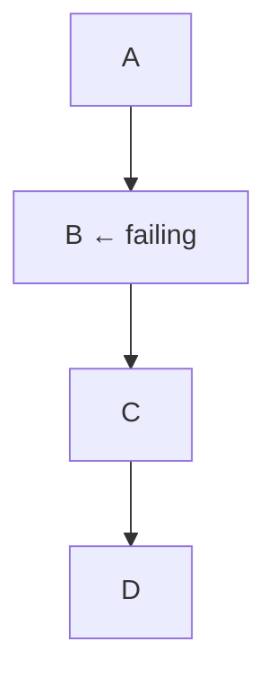

C and D may need to wait for B.

This is **head-of-line blocking**.

A DLQ can remove B from the normal path:

```text
A → Success
B → DLQ
C → Continue
D → Continue
```

But this is safe only if the application can tolerate B being skipped temporarily or permanently.

DLQ design therefore cannot be separated from ordering requirements.

---

# 18. DLQ Monitoring

A DLQ should be monitored.

Useful metrics include:

- DLQ message count
- messages entering DLQ per minute
- oldest DLQ message age
- failure reason
- retry count
- messages reprocessed
- messages permanently discarded
- processing success after reprocessing

Important alert:

```text
DLQ depth > expected threshold
```

But depth alone is not enough.

---

# 19. DLQ Age Matters

Consider:

```text
DLQ depth = 10
```

That might be acceptable.

But:

```text
Oldest message = 30 days
```

could indicate a serious operational problem.

Useful questions:

```text
How many messages?
How old are they?
Why did they fail?
Are failures increasing?
Are they being investigated?
```

---

# 20. DLQ Growth

A growing DLQ often indicates an unresolved system problem.

```text
Messages entering DLQ
        >
Messages leaving DLQ
```

Therefore:

```text
DLQ depth ↑
```

Possible causes:

- application bug
- invalid producer data
- schema mismatch
- downstream dependency failure
- insufficient worker capacity
- configuration problem
- permanent business-rule failures

The DLQ is therefore also an observability signal.

---

# 21. Failure Reason Classification

Do not record only:

```text
ERROR
```

Prefer meaningful categories such as:

```text
INVALID_PAYLOAD
SCHEMA_MISMATCH
DEPENDENCY_TIMEOUT
AUTHORIZATION_FAILURE
BUSINESS_RULE_VIOLATION
DATABASE_ERROR
UNKNOWN_ERROR
```

This allows operators to distinguish:

```text
Temporary infrastructure problem
```

from:

```text
Permanent data problem
```

---

# 22. DLQ Alerts

Not every DLQ message requires the same urgency.

For example:

| Failure | Possible Priority |
|---|---|
| Invalid test message | Low |
| Broken analytics event | Medium |
| Failed customer notification | Medium |
| Failed order processing | High |
| Failed payment event | Critical |

Alerting should reflect business impact.

---

# 23. RabbitMQ and DLQs

RabbitMQ supports dead-lettering through its messaging model.

Conceptually:

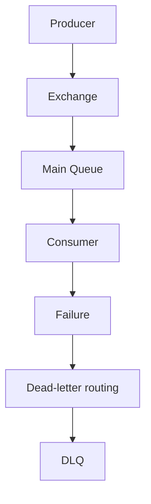

RabbitMQ can route messages that meet configured dead-letter conditions to another exchange/queue.

Common triggers can include:

- rejection without requeue
- message expiration
- queue length limits
- other configured dead-letter conditions

The exact configuration depends on the RabbitMQ version and queue/exchange setup.

The architectural idea remains:

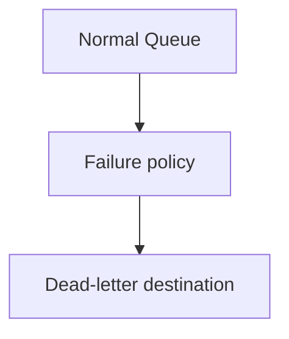

---

# 24. RabbitMQ and Requeue

RabbitMQ consumers can reject or negatively acknowledge messages.

Conceptually:

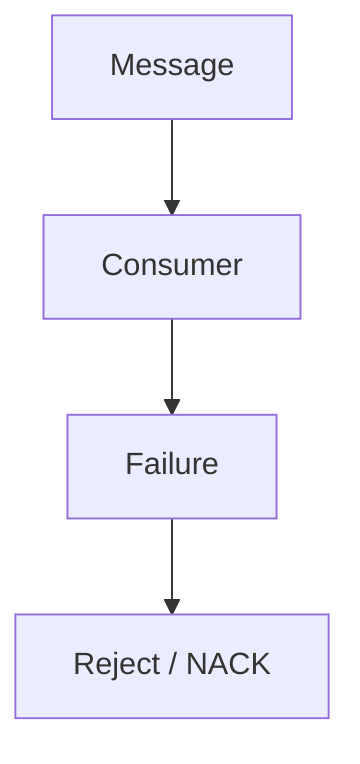

The system may:

```text
Requeue
```

or:

```text
Dead-letter
```

depending on the configured behavior.

Requeue is not automatically a retry strategy.

If a message is immediately requeued:

```mermaid
flowchart TD
  accTitle: A requeue loop
  accDescr: Failure, then Requeue, then Receive, then Failure, then Requeue.
  N0["Failure"] --> N1["Requeue"] --> N2["Receive"] --> N3["Failure"] --> N4["Requeue"]
```

it can create a rapid failure loop.

Backoff and controlled retry mechanisms are therefore important.

---

# 25. Kafka and DLQ Concepts

Kafka does not have exactly the same queue model as RabbitMQ.

Kafka is based around:

```mermaid
flowchart TD
  accTitle: Kafka model
  accDescr: Topic, then Partitions, then Offsets.
  N0["Topic"] --> N1["Partitions"] --> N2["Offsets"]
```

A common application-level failure pattern is:

```mermaid
flowchart TD
  accTitle: Kafka failure pattern
  accDescr: Kafka Topic, then Consumer, then Processing Failure, then Retry / Error Topic, then DLQ / Dead-Letter Topic.
  N0["Kafka Topic"] --> N1["Consumer"] --> N2["Processing Failure"] --> N3["Retry / Error Topic"] --> N4["DLQ / Dead-Letter Topic"]
```

The exact architecture depends on the Kafka ecosystem and application.

The important point is:

> **With Kafka, dead-letter handling is commonly modeled using another topic or error stream rather than assuming a RabbitMQ-style queue.**

---

# 26. Kafka and Offset Management

Suppose:

```text
Partition 0

Offset:
100
101
102 ← failing
103
104
```

The consumer must decide how to handle offset 102.

Possible approaches include:

```text
Retry 102
```

or:

```text
Send 102 to error topic
Advance processing
```

But advancing past 102 means the original record is no longer blocking normal consumption.

This can improve availability but may affect ordering and processing guarantees.

The choice is architectural.

---

# 27. Error Topic vs DLQ

In Kafka systems, you may see terms such as:

- error topic
- retry topic
- dead-letter topic
- failed-event topic

These are not necessarily identical.

A useful conceptual distinction:

```text
Retry Topic
→ Try processing later.

Dead-Letter Topic
→ Stop normal processing and isolate the event.
```

The naming and implementation vary between Kafka applications.

---

# 28. DLQ and Schema Evolution

A message may fail because its schema is incompatible.

Example:

Producer sends:

```json
{
  "user_id": 42,
  "email": "a@example.com"
}
```

Consumer expects:

```json
{
  "user_id": 42,
  "email": "a@example.com",
  "phone": "..."
}
```

If the consumer requires `phone`, old messages may fail.

A DLQ can preserve those messages while the compatibility problem is fixed.

This is one reason message contracts and schema evolution matter.

---

# 29. DLQ and Application Bugs

Suppose a new application release contains:

```text
Bug in order processing
```

Thousands of messages fail:

```mermaid
flowchart TD
  accTitle: A buggy release
  accDescr: Main Queue, then Worker v4, then Bug, then Retry, then DLQ.
  N0["Main Queue"] --> N1["Worker v4"] --> N2["Bug"] --> N3["Retry"] --> N4["DLQ"]
```

After deploying the fix:

```text
Worker v5
```

the DLQ can potentially be reprocessed.

This is a powerful recovery mechanism.

But reprocessing should still be controlled and idempotent.

---

# 30. DLQ and Business State

A message can fail even though some business state has already changed.

Example:

```mermaid
flowchart TD
  accTitle: Partial business state
  accDescr: Order Created, then Inventory Reserved, then Notification fails.
  N0["Order Created"] --> N1["Inventory Reserved"] --> N2["Notification fails"]
```

If the notification message enters a DLQ:

```text
DLQ
```

the order may still be valid.

Therefore DLQ handling must understand what the message represents.

Not every failed message means:

> "Undo everything."

Sometimes it means:

> "One downstream step still needs to happen."

---

# 31. Compensation vs Reprocessing

Some failures require reprocessing.

Others require compensation.

Example:

```text
Payment succeeded
Shipping reservation failed
```

Simply retrying the shipping message may be correct.

But in another workflow:

```text
Payment succeeded
Order permanently invalid
```

the correct business response might be:

```text
Refund payment
```

That is compensation.

DLQ handling therefore belongs to the broader business workflow, not just infrastructure.

---

# 32. Hands-On Exercise — Build a DLQ Simulator

Create:

```text
Main Queue
Retry Queue
DLQ
```

Use messages like:

```json
{
  "message_id": "msg-1001",
  "type": "order.created",
  "order_id": "ORD-1001"
}
```

Worker behavior:

```text
Success
→ ACK

Temporary failure
→ Retry

Repeated failure
→ DLQ

Permanent invalid message
→ DLQ
```

Track:

```text
message_id
attempt_count
status
failure_reason
```

---

# 33. Lab Challenge — Poison Message

Create:

```json
{
  "message_id": "msg-9999",
  "order_id": "ORD-9999",
  "quantity": -5
}
```

Configure:

```text
Maximum attempts = 3
```

Expected:

```mermaid
flowchart TD
  accTitle: Expected lab result
  accDescr: Attempt 1 → Failure, then Attempt 2 → Failure, then Attempt 3 → Failure, then DLQ.
  N0["Attempt 1 → Failure"] --> N1["Attempt 2 → Failure"] --> N2["Attempt 3 → Failure"] --> N3["DLQ"]
```

Verify that:

```text
Main Queue
```

continues processing other valid messages.

---

# 34. Lab Challenge — Reprocess a DLQ Message

Take:

```text
msg-9999
```

from the DLQ.

Fix the underlying data:

```text
quantity = 5
```

Then reprocess.

Expected:

```mermaid
flowchart TD
  accTitle: Reprocessing a fixed message
  accDescr: DLQ, then Correct message, then Worker, then Success.
  N0["DLQ"] --> N1["Correct message"] --> N2["Worker"] --> N3["Success"]
```

Now repeat the reprocessing.

Verify that your system's idempotency mechanism prevents an unwanted duplicate business effect.

---

# 35. Practical DLQ Investigation Workflow

When a DLQ grows:

```mermaid
flowchart TD
  accTitle: DLQ investigation workflow
  accDescr: Observe, then Measure DLQ depth, then Check oldest message, then Group by failure reason, then Identify common cause, then Classify temporary/permanent, then Fix root cause, then Test recovery, then Reprocess safely, then Monitor.
  N0["Observe"] --> N1["Measure DLQ depth"] --> N2["Check oldest message"] --> N3["Group by failure reason"] --> N4["Identify common cause"] --> N5["Classify temporary/permanent"] --> N6["Fix root cause"] --> N7["Test recovery"] --> N8["Reprocess safely"] --> N9["Monitor"]
```

Do not start by blindly replaying everything.

---

# 36. Common Mistakes

### Mistake 1 — Sending every failure directly to the DLQ

Temporary failures should usually get controlled retries first.

### Mistake 2 — Retrying forever

A poison message can consume resources indefinitely.

### Mistake 3 — Treating DLQ as permanent deletion

A DLQ should normally support investigation and recovery.

### Mistake 4 — Reprocessing without idempotency

The original business effect may already have happened.

### Mistake 5 — Ignoring ordering

Removing one failed message may allow later messages to violate required sequence.

### Mistake 6 — No failure reason

Without useful error information, troubleshooting becomes difficult.

### Mistake 7 — No DLQ monitoring

A DLQ can silently grow until recovery becomes much harder.

### Mistake 8 — No retention policy

Failed messages may consume unlimited storage or disappear before investigation.

### Mistake 9 — Assuming DLQ fixes the root cause

It only isolates the symptom.

### Mistake 10 — Blindly replaying the entire DLQ

Reprocessing should be controlled, tested, and preferably idempotent.

---

# 37. System Design View

A production messaging architecture may look like:

```mermaid
flowchart TD
  accTitle: DLQ system design view
  accDescr: Producer, Main Queue, Worker. Success: ACK. Failure: retry policy; retry back to the main queue, or exhausted to the DLQ, then investigation: reprocess, fix data or discard.
  N0["Producer"] --> N1["Main Queue"] --> N2["Worker"] --> S["Success"] & F["Failure"]
  S --> A["ACK"]
  F --> RP["Retry Policy"] --> R["Retry"] & E["Exhausted"]
  R --> MQ["Main Queue"]
  E --> D["DLQ"] --> I["Investigation"] --> G
  subgraph G[" "]
    direction TB
    I0["Reprocess"] ~~~ I1["Fix Data"] ~~~ I2["Discard"]
  end
```

Each path has a different responsibility.

---

# 38. The Messaging Reliability Chain

The previous chapters now connect:

```mermaid
flowchart TD
  accTitle: The messaging reliability chain
  accDescr: Level 5 chapters 05.01 to 05.13 in order.
  N0["05#46;01 Synchronous / Asynchronous"] --> N1["05#46;02 Why Queues Exist"] --> N2["05#46;03 Message Queue"] --> N3["05#46;04 Worker"] --> N4["05#46;05 Message Broker"] --> N5["05#46;06 Pub/Sub"] --> N6["05#46;07 RabbitMQ"] --> N7["05#46;08 Kafka"] --> N8["05#46;09 Message Ordering"] --> N9["05#46;10 Delivery Semantics"] --> N10["05#46;11 Idempotency"] --> N11["05#46;12 Retries"] --> N12["05#46;13 Dead-Letter Queues"]
```

The reliability story is now:

```mermaid
flowchart TD
  accTitle: The reliability story
  accDescr: Message, then Deliver, then Process, then Failure?, then Retry, then Duplicate?, then Idempotency, then Still failing?, then DLQ, then Investigate / Recover.
  N0["Message"] --> N1["Deliver"] --> N2["Process"] --> N3["Failure?"] --> N4["Retry"] --> N5["Duplicate?"] --> N6["Idempotency"] --> N7["Still failing?"] --> N8["DLQ"] --> N9["Investigate / Recover"]
```

---

# 39. DLQ Decision Framework

Use this mental model:

```mermaid
flowchart TD
  accTitle: DLQ decision framework
  accDescr: Message processing fails. Is failure temporary? No: DLQ. Yes: retry. Retry succeeds? Yes: done. No: attempts left? Yes: retry. No: DLQ.
  M["Message processing fails"] --> Q1{"Is failure temporary?"}
  Q1 -->|"Yes"| R1["Retry"] --> Q2{"Retry succeeds?"}
  Q1 -->|"No"| D1["DLQ"]
  Q2 -->|"Yes"| OK["Done"]
  Q2 -->|"No"| Q3{"Attempts left?"}
  Q3 -->|"Yes"| R2["Retry"]
  Q3 -->|"No"| D2["DLQ"]
```

After DLQ:

```mermaid
flowchart TD
  accTitle: After the DLQ
  accDescr: DLQ, investigate, what caused failure? Fix code: reprocess. Fix data: reprocess. Business issue: compensate / discard.
  N0["DLQ"] --> N1["Investigate"] --> N2["What caused failure?"] --> R
  subgraph R[" "]
    direction TB
    subgraph R0[" "]
      direction TB
      RA0["Fix code"] --> RB0["Reprocess"]
    end
    subgraph R1[" "]
      direction TB
      RA1["Fix data"] --> RB1["Reprocess"]
    end
    subgraph R2[" "]
      direction TB
      RA2["Business issue"] --> RB2["Compensate / discard"]
    end
    R0 ~~~ R1 ~~~ R2
  end
```

---

# 40. Key Principle

> **A Dead-Letter Queue isolates messages that cannot be successfully processed through the normal retry path, allowing the main system to continue while preserving failed work for investigation and recovery. A useful DLQ strategy distinguishes temporary from permanent failures, limits retries, preserves failure context, monitors DLQ growth, respects ordering, and makes reprocessing idempotent and controlled.**

---

# 41. Quick Reference

### Normal Processing

```mermaid
flowchart TD
  accTitle: Normal processing
  accDescr: Message, then Worker, then Success, then ACK.
  N0["Message"] --> N1["Worker"] --> N2["Success"] --> N3["ACK"]
```

### Retry

```mermaid
flowchart TD
  accTitle: Retry
  accDescr: Message, then Worker, then Temporary Failure, then Backoff, then Retry.
  N0["Message"] --> N1["Worker"] --> N2["Temporary Failure"] --> N3["Backoff"] --> N4["Retry"]
```

### DLQ

```mermaid
flowchart TD
  accTitle: DLQ path
  accDescr: Message, then Repeated / Permanent Failure, then DLQ, then Investigate, then Reprocess / Fix / Compensate / Discard.
  N0["Message"] --> N1["Repeated / Permanent Failure"] --> N2["DLQ"] --> N3["Investigate"] --> N4["Reprocess / Fix / Compensate / Discard"]
```

### Retry Queue vs DLQ

| Mechanism | Purpose |
|---|---|
| Main Queue | Normal processing |
| Retry Queue | Try failed work later |
| DLQ | Isolate work that should leave normal processing |
| Error Topic | Common Kafka-style failure destination |
| Reprocessing | Attempt recovery after investigation |

### DLQ Must Consider

- Failure classification
- Retry count
- Failure reason
- Message retention
- Ordering
- Idempotency
- Monitoring
- Reprocessing
- Business compensation

---

# 42. Knowledge Check

### 1. What is a DLQ?

**Answer:** A destination where messages are isolated after failing the normal processing/retry policy.

### 2. Why not retry a message forever?

**Answer:** A permanent failure or poison message can consume resources indefinitely.

### 3. What is a poison message?

**Answer:** A message that repeatedly causes processing to fail.

### 4. What is the difference between a retry queue and a DLQ?

**Answer:** A retry queue is for trying the message again later; a DLQ is for removing a repeatedly or permanently failing message from normal processing.

### 5. Should every temporary failure go directly to a DLQ?

**Answer:** Usually no. Temporary failures may deserve controlled retries first.

### 6. Why should a DLQ preserve failure context?

**Answer:** Operators need to understand what failed, why it failed, and how to recover it.

### 7. Why is idempotency important when reprocessing a DLQ message?

**Answer:** The original business effect may already have occurred, so reprocessing must not create an unwanted duplicate effect.

### 8. Can a DLQ solve the root cause of a failure?

**Answer:** No. It isolates the failed message; the underlying problem still needs investigation.

### 9. Why does ordering matter for DLQs?

**Answer:** Moving one failed message aside may allow later messages to proceed out of the required order.

### 10. What should you monitor?

**Answer:** DLQ depth, oldest message age, failure reasons, arrival rate, reprocessing rate, and recovery success.

---

# 43. Remember

```text
Temporary failure
      ↓
Retry

Permanent / repeatedly failing
      ↓
DLQ

DLQ
      ↓
Investigate
      ↓
Fix
      ↓
Recover safely
```

And always ask:

> **"If I replay this message, what happens if the original operation already succeeded?"**

That question connects **Dead-Letter Queues** directly to **Idempotency**.

---

# 44. Next Chapter

## 05.14 — Backpressure

Next, we will study:

- What backpressure means
- Why consumers cannot always keep up
- Producer rate vs consumer capacity
- Queue growth
- Backlog
- Worker concurrency
- Downstream capacity
- Flow control
- Load shedding
- Rate limiting vs backpressure
- Backpressure in queues
- Backpressure in streaming systems
- Slow consumers
- Kafka consumer lag
- RabbitMQ consumer behavior
- Protecting databases and APIs
- Scaling workers vs overwhelming dependencies
- Failure scenarios
- Hands-on backpressure exercise
- System-design trade-offs
