# 05.14 — Backpressure

## Learning Objectives

By the end of this chapter, you should understand:

- What backpressure means
- Why consumers cannot always keep up with producers
- Producer rate vs consumer capacity
- Queue growth and backlog
- Worker concurrency
- Downstream capacity
- Flow control
- Load shedding
- Rate limiting vs backpressure
- Backpressure in queues and streaming systems
- Slow consumers and Kafka consumer lag
- RabbitMQ consumer behavior
- How to protect databases and APIs
- Why adding workers can sometimes make things worse
- How backpressure changes system architecture

---

# Beginner Vocabulary

| Term | Beginner-Friendly Meaning |
|---|---|
| **Backpressure** | A way of slowing or controlling incoming work when downstream processing cannot keep up |
| **Producer** | Component that creates or sends work |
| **Consumer** | Component that receives and processes work |
| **Capacity** | Maximum amount of work a component can safely handle |
| **Backlog** | Work waiting to be processed |
| **Queue Depth** | Number of messages currently waiting in a queue |
| **Concurrency** | Number of tasks being processed at the same time |
| **Flow Control** | Controlling how quickly data or work moves through a system |
| **Load Shedding** | Intentionally rejecting or dropping work when the system cannot safely handle it |
| **Downstream** | The component receiving work from another component |
| **Upstream** | The component sending work to another component |
| **Slow Consumer** | A consumer processing work more slowly than it arrives |
| **Consumer Lag** | How far a consumer is behind the available data |
| **Saturation** | A component operating near or beyond its useful capacity |
| **Throughput** | Amount of work completed over time |
| **Overload** | More work arriving than the system can safely process |

---

# 1. What Is Backpressure?

**Backpressure is the mechanism by which a system controls incoming work when a downstream component cannot keep up.**

Imagine a water pipe:

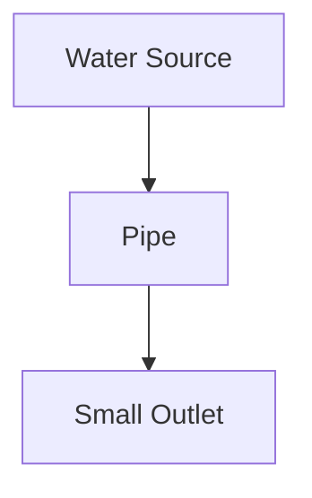

If water enters faster than the outlet can handle, pressure builds.

Software systems can have a similar problem:

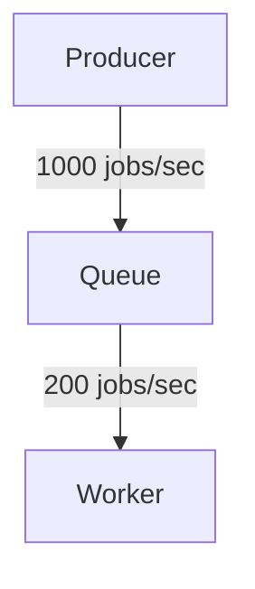

The worker can process only 200 jobs per second.

So:

```text
Incoming = 1000 jobs/sec
Processing = 200 jobs/sec

Backlog growth = 800 jobs/sec
```

The queue will continue growing unless something changes.

**Backpressure is about preventing uncontrolled growth and protecting the system when demand exceeds available capacity.**

---

# 2. Why Does Backpressure Exist?

Components in a system rarely have exactly the same processing capacity.

For example:

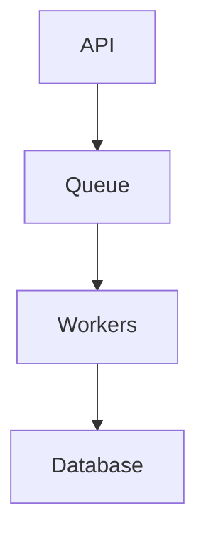

The API may accept:

```text
2,000 requests/sec
```

Workers may process:

```text
1,000 jobs/sec
```

But the database may safely handle only:

```text
600 writes/sec
```

The real bottleneck is therefore the database.

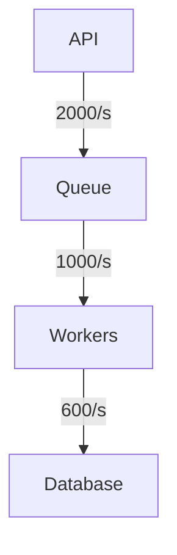

Adding more workers does not automatically solve this.

It may make the database problem worse.

---

# 3. Worker Concurrency

A worker can process one job at a time or several jobs concurrently.

For example:

```text
Worker

Job A
Job B
Job C
Job D
```

Higher concurrency can increase throughput.

But only until another resource becomes the bottleneck.

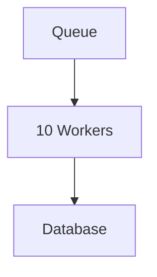

Suppose each worker opens several database connections.

Increasing workers from:

```text
10 → 50
```

may produce:

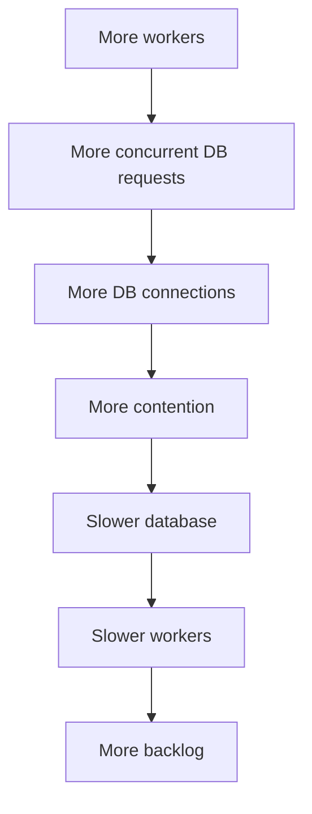

This is an important system-design lesson:

> **More concurrency is not the same as more useful capacity.**

---

# 4. Downstream Capacity

Always consider the next component.

Suppose:

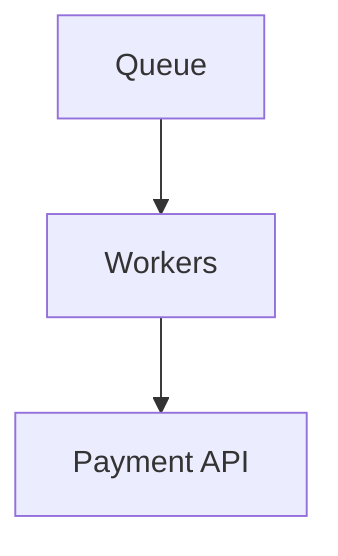

The workers may be able to process:

```text
5,000 jobs/sec
```

But the payment API may safely accept:

```text
500 requests/sec
```

If you run 5,000 jobs concurrently:

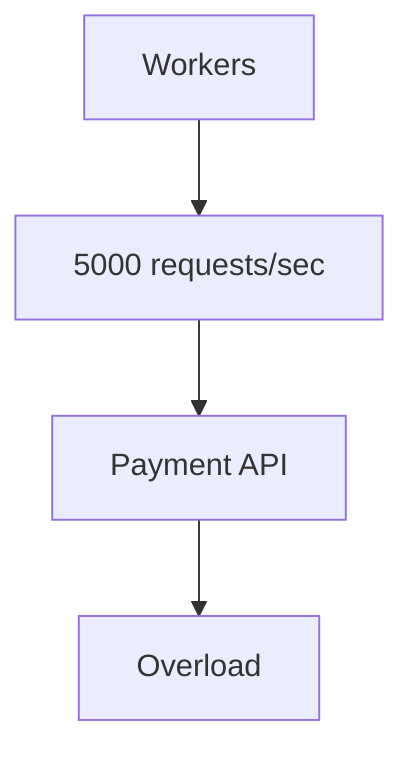

The worker layer must respect downstream capacity.

This is one of the most important reasons backpressure exists.

---

# 5. Backpressure as Flow Control

Backpressure is a form of **flow control**.

Instead of allowing work to flow without limits:

```text
Producer → Consumer
```

the system controls the flow:

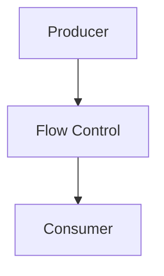

Depending on the architecture, flow control can mean:

- slowing producers
- limiting concurrency
- limiting queue intake
- limiting outstanding requests
- pausing consumers
- delaying work
- rejecting work
- dropping non-critical work
- buffering temporarily

The exact mechanism depends on the system.

---

# 6. What Can We Do About Kafka Lag?

Possible responses include:

### Add consumers

```text
Topic
 ├── Partition 0 → Consumer A
 ├── Partition 1 → Consumer B
 ├── Partition 2 → Consumer C
 └── Partition 3 → Consumer D
```

This can increase parallelism when enough partitions are available.

But:

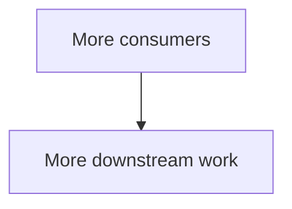

If the database is already saturated, this may make the problem worse.

### Optimize processing

Reduce:

- unnecessary database calls
- expensive computation
- network requests
- serialization overhead

### Control downstream concurrency

Instead of:

```text
1000 concurrent DB writes
```

use a controlled limit:

```text
100 concurrent DB writes
```

### Slow intake

If the architecture supports it, consumers can reduce processing concurrency or pause consumption temporarily.

The goal is not always:

> "Remove lag immediately."

Sometimes the correct goal is:

> **Protect the downstream system while reducing lag safely.**

---

# 7. Backpressure vs Rate Limiting

These concepts are related but not identical.

### Rate Limiting

Controls how much traffic is allowed into a system.

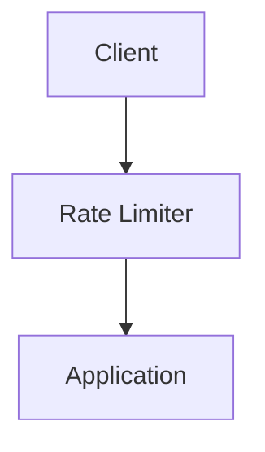

Example:

```text
100 requests/minute per user
```

### Backpressure

Responds to the current capacity of downstream processing.

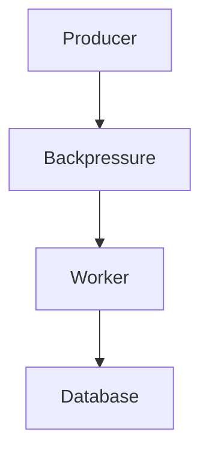

The system may slow or reject work because the downstream component cannot safely keep up.

### Simple Difference

| Rate Limiting | Backpressure |
|---|---|
| Controls allowed traffic | Controls flow based on processing capacity |
| Often policy-based | Often capacity/state-based |
| Protects system from excessive demand | Protects downstream components from overload |
| Can be applied before work enters system | Can happen throughout processing pipeline |

They can work together.

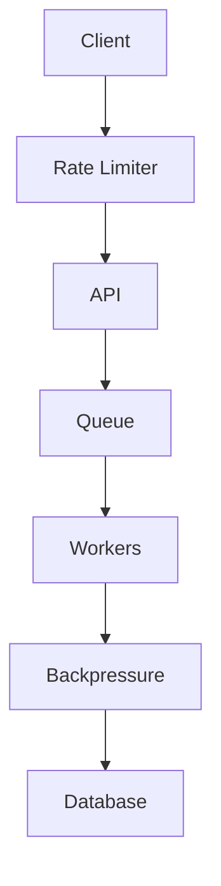

---

# 8. Backpressure vs Load Shedding

Sometimes slowing work is not enough.

If the system is severely overloaded, it may intentionally reject or drop some work.

This is **load shedding**.

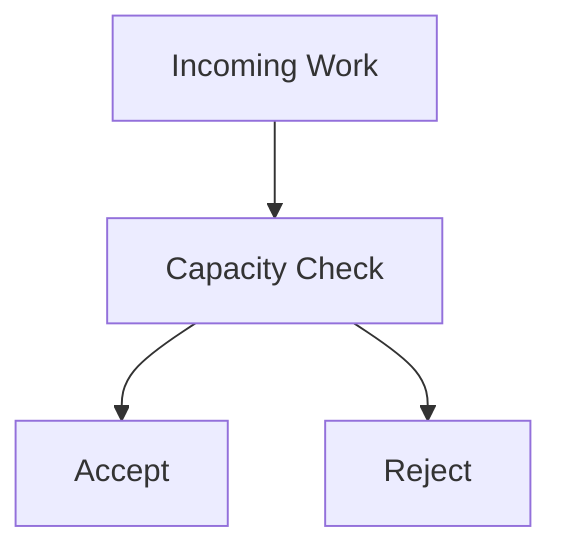

For example:

```text
Critical payment request → Accept
Optional recommendation → Drop/defer
Analytics event → Buffer/drop depending on requirements
```

Load shedding should be based on business importance.

Do not blindly drop important operations.

---

# 9. Backpressure and Critical vs Non-Critical Work

Not all work has the same priority.

Suppose an e-commerce system receives:

```text
Order Payment
Email Notification
Analytics Event
Recommendation Update
```

During overload:

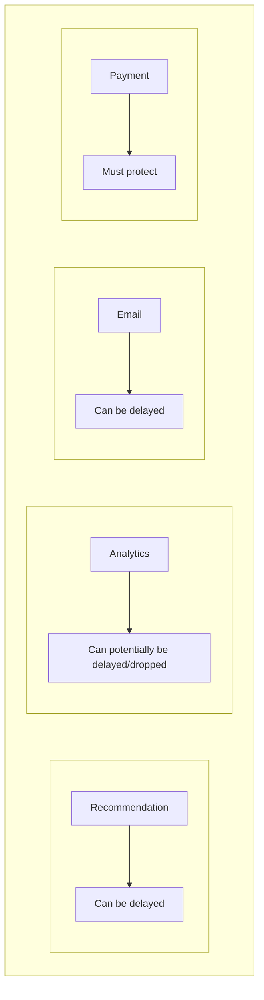

This allows the system to preserve critical functionality.

A useful principle is:

> **When capacity becomes scarce, protect the work that matters most.**

---

# 10. Backpressure Protects Databases

Consider:

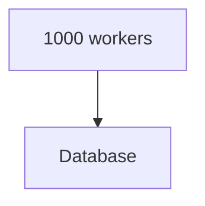

If the database can safely process only:

```text
300 writes/sec
```

the application should not continuously send:

```text
5000 writes/sec
```

Possible controls include:

- worker concurrency limits
- connection pool limits
- queueing
- batching
- rate limiting
- circuit breakers
- load shedding
- retry budgets
- backoff
- database query optimization

Notice the connection to previous chapters:

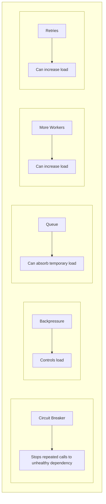

These mechanisms work together.

---

# 11. Backpressure and Dead-Letter Queues

A DLQ handles messages that repeatedly fail normal processing.

Backpressure solves a different problem.

```text
Backpressure
    ↓
"Processing is too fast for downstream capacity."

DLQ
    ↓
"This message repeatedly failed and should leave the normal path."
```

They can work together:

```text
Producer
   ↓
Main Queue
   ↓
Worker
   ↓
Failure
   ↓
Retry
   ↓
DLQ

Meanwhile:

Backpressure
   ↓
Controls worker/concurrency rate
```

This prevents the retry/DLQ mechanism from becoming another source of overload.

---

# 12. A Complete Backpressure Flow

Consider an image-processing platform:

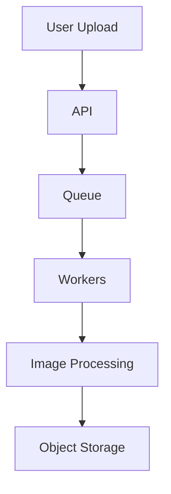

Suppose object storage becomes slow.

Without control:

```text
Workers
  ↓↓↓↓↓↓↓↓↓
Storage
  ↓
Overload
```

With controlled concurrency:

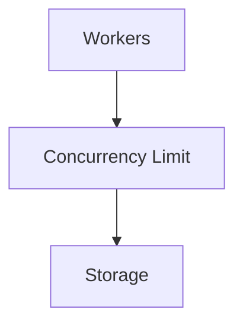

The workers process only as many operations as the downstream system can safely handle.

The queue absorbs temporary excess work.

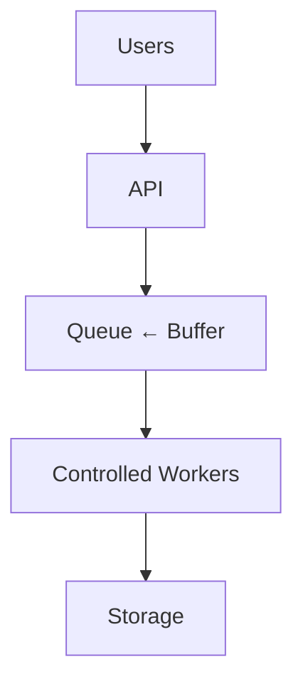

This is backpressure-aware architecture.

---

# 13. Backpressure Does Not Mean "Stop Everything"

Backpressure does not necessarily mean shutting down the pipeline.

It can mean:

- process fewer jobs concurrently
- slow consumption
- delay non-critical work
- reduce batch size
- limit outstanding requests
- pause consumers temporarily
- reject low-priority requests
- prioritize critical work

The objective is:

> **Keep the system within a safe operating range.**

---

# 14. Failure Scenario — Database Overload

Consider:

```mermaid
flowchart TD
  accTitle: Database overload setup
  accDescr: API, then Queue, then 20 Workers, then Database.
  N0["API"] --> N1["Queue"] --> N2["20 Workers"] --> N3["Database"]
```

Database capacity:

```text
500 writes/sec
```

Current worker demand:

```text
1000 writes/sec
```

### Without Backpressure

```mermaid
flowchart TD
  accTitle: Without backpressure
  accDescr: Workers, then 1000 writes/s, then Database, then High CPU, then Slow queries, then Timeouts, then Retries, then Even more load.
  N0["Workers"] --> N1["1000 writes/s"] --> N2["Database"] --> N3["High CPU"] --> N4["Slow queries"] --> N5["Timeouts"] --> N6["Retries"] --> N7["Even more load"]
```

The system enters a failure loop.

### With Backpressure

```mermaid
flowchart TD
  accTitle: With backpressure
  accDescr: Workers, then Concurrency Limit, then 500-ish writes/s, then Database.
  N0["Workers"] --> N1["Concurrency Limit"] --> N2["500-ish writes/s"] --> N3["Database"]
```

The queue may grow temporarily:

```text
Queue ↑
```

But the database remains healthy.

Later:

```mermaid
flowchart TD
  accTitle: Recovery
  accDescr: Database recovers, then Workers process backlog, then Queue ↓.
  N0["Database recovers"] --> N1["Workers process backlog"] --> N2["Queue ↓"]
```

This is often a much healthier failure mode.

---

# 15. Failure Scenario — External API Throttling

Suppose:

```text
Worker → Payment Provider
```

The provider allows:

```text
100 requests/sec
```

Your workers attempt:

```text
500 requests/sec
```

The provider starts returning throttling errors.

If workers immediately retry:

```mermaid
flowchart TD
  accTitle: Immediate retries under throttling
  accDescr: 500 requests, then Failures, then Retries, then 1000 requests, then More throttling.
  N0["500 requests"] --> N1["Failures"] --> N2["Retries"] --> N3["1000 requests"] --> N4["More throttling"]
```

Instead:

```mermaid
flowchart TD
  accTitle: Respecting provider limits
  accDescr: Queue, then Workers, then Concurrency / Rate Control, then Payment API.
  N0["Queue"] --> N1["Workers"] --> N2["Concurrency / Rate Control"] --> N3["Payment API"]
```

The system respects downstream capacity.

Retries should still use the strategy from **05.12 — Retries**.

---

# 16. Backpressure Decision Flow

When a system is overloaded:

```mermaid
flowchart TD
  accTitle: Backpressure decision flow
  accDescr: Observe overload, find the bottleneck. Is incoming work temporary? No: increase capacity or reduce demand. Yes: buffer, can consumers keep up?, control concurrency, protect downstream, prioritize critical work, load shed if necessary, measure again.
  N0["Observe overload"] --> N1["Where is the bottleneck?"] --> Q{"Is incoming work temporary?"}
  Q -->|"Yes"| Y0["Buffer"] --> Y1["Can consumers keep up?"] --> Y2["Control concurrency"] --> Y3["Protect downstream"] --> Y4["Prioritize critical work"] --> Y5["Load shed if necessary"] --> Y6["Measure again"]
  Q -->|"No"| X["Increase capacity or reduce demand"]
```

Do not immediately add servers.

First understand the bottleneck.

---

# 17. Practical Backpressure Investigation

Use this sequence:

## Step 1 — Measure arrival rate

```text
How fast is work arriving?
```

## Step 2 — Measure processing rate

```text
How fast is work completing?
```

## Step 3 — Measure backlog

```text
Queue depth?
Oldest message age?
```

## Step 4 — Find the bottleneck

```text
CPU?
Database?
Network?
External API?
Storage?
Locks?
```

## Step 5 — Check concurrency

```text
How many jobs are active?
```

## Step 6 — Check downstream capacity

```text
Can the next component handle current traffic?
```

## Step 7 — Choose control

Possible responses:

- reduce concurrency
- slow consumers
- add workers
- optimize processing
- batch work
- increase downstream capacity
- rate-limit
- load-shed
- prioritize work

## Step 8 — Measure again

```mermaid
flowchart TD
  accTitle: Measure again
  accDescr: Change, then Observe, then Measure, then Adjust.
  N0["Change"] --> N1["Observe"] --> N2["Measure"] --> N3["Adjust"]
```

---

# 18. Hands-On Exercise — Build a Backpressure Simulator

Create a small JavaScript simulation.

Model:

```mermaid
flowchart TD
  accTitle: Simulator model
  accDescr: Producer, then Queue, then Workers, then Database.
  N0["Producer"] --> N1["Queue"] --> N2["Workers"] --> N3["Database"]
```

Use:

```text
Producer rate: 100 jobs/sec
Worker capacity: 30 jobs/sec
Workers: 3
Database capacity: 80 jobs/sec
```

Calculate the effective processing capacity.

```text
3 workers × 30 jobs/sec
= 90 jobs/sec
```

But the database allows only:

```text
80 jobs/sec
```

Therefore the real downstream limit is approximately:

```text
80 jobs/sec
```

The producer sends:

```text
100 jobs/sec
```

So backlog grows at approximately:

```text
100 - 80
= 20 jobs/sec
```

### Experiment 1

Run the system for 60 seconds.

Observe:

- queue depth
- completed jobs
- processing rate

### Experiment 2

Increase workers:

```text
3 → 6
```

Ask:

> Did the database capacity increase?

It should not.

### Experiment 3

Limit database concurrency.

Observe whether the database remains stable while the queue absorbs excess work.

### Experiment 4

Reduce producer rate:

```text
100 → 70 jobs/sec
```

Observe the queue draining.

### Core lesson

You should discover:

```text
More workers ≠ unlimited capacity
```

---

# 19. Lab Challenge — Protect the Database

Given:

```text
Producer = 1000 jobs/sec

Queue
  ↓

Workers = 50

Database = 300 writes/sec
```

Answer:

1. What is the bottleneck?
2. What happens to the queue?
3. Would adding another 50 workers solve the problem?
4. What could protect the database?
5. What should happen to non-critical work?
6. What metrics should you monitor?
7. What happens if workers also retry failed DB operations?

### Suggested Reasoning

The database is the bottleneck.

```mermaid
flowchart TD
  accTitle: The database is the bottleneck
  accDescr: 1000 jobs/s, then Queue, then Workers, then 300 writes/s, then Database.
  N0["1000 jobs/s"] --> N1["Queue"] --> N2["Workers"] --> N3["300 writes/s"] --> N4["Database"]
```

Adding workers can increase pressure on the database rather than solve the underlying problem.

A better design may use:

```mermaid
flowchart TD
  accTitle: Controlled worker concurrency
  accDescr: Queue, then Controlled Worker Concurrency, then Database.
  N0["Queue"] --> N1["Controlled Worker Concurrency"] --> N2["Database"]
```

along with appropriate:

- query optimization
- connection limits
- retry controls
- backoff
- prioritization
- capacity planning
- monitoring.

---

# 20. Backpressure and Capacity Planning

Backpressure should not become an excuse to ignore capacity.

If:

```text
Arrival = 10,000 jobs/sec
Processing = 5,000 jobs/sec
```

and this continues for hours, the queue will keep growing.

Eventually:

```mermaid
flowchart TD
  accTitle: Long-term overload
  accDescr: Queue, then Storage pressure, then Retention problems, then Increasing latency, then Failure.
  N0["Queue"] --> N1["Storage pressure"] --> N2["Retention problems"] --> N3["Increasing latency"] --> N4["Failure"]
```

Backpressure protects the system temporarily.

Long-term overload requires architectural action:

```mermaid
flowchart TD
  accTitle: Architectural action
  accDescr: Observe, then Identify bottleneck, then Increase capacity or Reduce demand, then Rebalance system.
  N0["Observe"] --> N1["Identify bottleneck"] --> N2["Increase capacity or Reduce demand"] --> N3["Rebalance system"]
```

---

# 21. Backpressure and Scaling

Backpressure helps answer an important question:

> **How much should we scale?**

Suppose:

```text
10 workers → DB healthy
20 workers → DB healthy
30 workers → DB near saturation
40 workers → DB overloaded
```

Then the useful worker capacity may be around:

```text
30 workers
```

Adding 100 workers would not necessarily improve the system.

The architecture should scale based on the limiting resource.

---

# 22. Backpressure and System Architecture

Backpressure is especially important in pipelines:

```text
A → B → C → D
```

Every component has a capacity.

For example:

```text
A = 5000/s
B = 3000/s
C = 1000/s
D = 800/s
```

The end-to-end capacity is constrained by the bottleneck.

```text
5000 → 3000 → 1000 → 800
                         ↑
                     Bottleneck
```

If D slows further:

```text
800 → 500
```

the pressure propagates backward.

```mermaid
flowchart BT
  accTitle: Pressure propagates backward
  accDescr: D slows, so C must slow, so B must slow, so A must slow.
  N0["A must slow"] --> N1["B must slow"] --> N2["C must slow"] --> N3["D slows"]
```

That is the fundamental idea behind **backpressure**.

---

# 23. Backpressure in Event-Driven Systems

A typical event-driven architecture may look like:

```mermaid
flowchart TD
  accTitle: Event-driven pipeline
  accDescr: Service A, then Kafka / RabbitMQ, then Service B, then Database.
  N0["Service A"] --> N1["Kafka / RabbitMQ"] --> N2["Service B"] --> N3["Database"]
```

If Service B cannot keep up:

```text
Producer
   ↓
Broker
   ↓
Consumer
   ↓
Database
       ↑
     Slow
```

The system needs a strategy for controlling the flow.

Possible controls include:

- consumer concurrency
- consumer rate
- queue depth limits
- partition/consumer scaling
- downstream connection limits
- batching
- load shedding
- retry limits
- backoff

Backpressure therefore connects many concepts from this Level:

```text
Queues
Workers
Retries
DLQs
Ordering
Kafka
RabbitMQ
```

---

# 24. Backpressure Trade-Offs

| Strategy | Benefit | Cost / Risk |
|---|---|---|
| Add workers | More processing capacity | Can overload downstream |
| Increase concurrency | Higher throughput | More resource contention |
| Queue work | Absorbs bursts | Adds waiting time |
| Slow consumers | Protects downstream | Increases backlog |
| Rate limit | Controls incoming load | Rejects/delays requests |
| Load shed | Protects critical system | Some work is lost/rejected |
| Batch work | Reduces per-item overhead | Adds latency |
| Cache | Reduces repeated work | Staleness/invalidation complexity |
| Increase downstream capacity | Raises bottleneck capacity | Higher cost/complexity |
| Optimize processing | Improves useful capacity | Engineering effort |

There is no single universal backpressure mechanism.

---

# 25. Common Mistakes

### Mistake 1 — "Just add more workers"

More workers can overload the database or external API.

### Mistake 2 — Treating queues as unlimited

Queues can eventually exhaust storage or create unacceptable latency.

### Mistake 3 — Watching only queue depth

Also monitor queue age and processing rate.

### Mistake 4 — Ignoring downstream capacity

Workers are not useful if the database cannot accept their requests.

### Mistake 5 — Retrying aggressively during overload

Retries can amplify an existing failure.

### Mistake 6 — Dropping all traffic

Load shedding should protect important work first.

### Mistake 7 — Assuming backpressure fixes permanent overload

Backpressure controls pressure; it does not create capacity.

### Mistake 8 — Confusing rate limiting with backpressure

They solve related but different problems.

### Mistake 9 — Scaling without measuring

Always identify the bottleneck first.

---

# 26. System Design View

Backpressure is a system-level concept.

A scalable system is not simply:

```text
More Servers
```

It is:

```mermaid
flowchart TD
  accTitle: A scalable system
  accDescr: Demand, then Controlled Flow, then Processing Capacity, then Downstream Capacity, then Safe Completion.
  N0["Demand"] --> N1["Controlled Flow"] --> N2["Processing Capacity"] --> N3["Downstream Capacity"] --> N4["Safe Completion"]
```

When demand exceeds capacity:

```mermaid
flowchart TD
  accTitle: When demand exceeds capacity
  accDescr: Detect, then Control, then Protect, then Recover, then Scale or reduce demand.
  N0["Detect"] --> N1["Control"] --> N2["Protect"] --> N3["Recover"] --> N4["Scale or reduce demand"]
```

This is closely related to the Systemly principle:

> **Find the bottleneck before changing the architecture.**

---

# 27. Backpressure Mental Model

Remember these four questions:

```text
1. How fast is work arriving?

2. How fast can we process it?

3. What is the limiting resource?

4. What should happen when demand exceeds capacity?
```

Then choose:

```text
Buffer
Slow
Scale
Batch
Prioritize
Reject
Drop
Recover
```

---

# 28. Key Principle

> **Backpressure is a way to control the flow of work when downstream processing cannot keep up. It protects systems from uncontrolled backlog and overload by slowing consumption, limiting concurrency, buffering work, prioritizing important operations, or shedding load when necessary. A queue can absorb temporary bursts, but persistent overload requires increasing capacity, reducing demand, or redesigning the bottleneck.**

---

# Quick Reference

```mermaid
flowchart TD
  accTitle: Backpressure in brief
  accDescr: Backpressure, then Incoming work > Processing capacity, then Control the flow, then Protect downstream.
  N0["Backpressure"] --> N1["Incoming work > Processing capacity"] --> N2["Control the flow"] --> N3["Protect downstream"]
```

### Remember

```mermaid
flowchart TD
  accTitle: Remember
  accDescr: Producer Rate > Consumer Capacity, then Backlog, then Backpressure, then Control / Buffer / Scale / Shed.
  N0["Producer Rate > Consumer Capacity"] --> N1["Backlog"] --> N2["Backpressure"] --> N3["Control / Buffer / Scale / Shed"]
```

### Important Metrics

```text
Arrival Rate
Processing Rate
Queue Depth
Oldest Message Age
Consumer Lag
Worker Utilization
Downstream Latency
Error Rate
Retry Rate
```

### Key Relationships

```text
Queue
  → absorbs temporary bursts

Worker
  → performs processing

Backpressure
  → controls processing flow

Rate Limiting
  → controls allowed traffic

Load Shedding
  → intentionally rejects/drops selected work

Retry
  → makes another attempt after failure

DLQ
  → isolates repeatedly failing messages
```

---

# Knowledge Check

### 1. What happens when producer rate continuously exceeds consumer capacity?

**Answer:** Backlog grows continuously.

### 2. Does adding workers always increase useful throughput?

**Answer:** No. A downstream dependency may become the bottleneck.

### 3. What is Kafka consumer lag?

**Answer:** The amount by which a consumer is behind the available records it needs to process.

### 4. What is the difference between rate limiting and backpressure?

**Answer:** Rate limiting controls how much traffic is allowed; backpressure controls work flow when processing capacity or downstream capacity is insufficient.

### 5. Why can aggressive retries make overload worse?

**Answer:** Retries create additional traffic on top of the original workload.

### 6. What should a system do when it cannot safely process all incoming work?

**Answer:** Depending on business requirements, it may buffer, slow processing, prioritize critical work, increase capacity, reject requests, or shed non-critical load.

### 7. Does a queue permanently solve an overload problem?

**Answer:** No. It can absorb temporary bursts, but persistent overload causes backlog and increasing latency.

---

# Remember

> **A healthy system does not try to process everything as fast as possible. It processes work at a rate the entire system can safely sustain.**

---

# Next Chapter

## 05.15 — Asynchronous Architecture

The next chapter brings the Level 5 concepts together:

- What asynchronous architecture means
- Request/response vs background processing
- Queues and workers
- Message brokers
- Pub/Sub
- Event-driven communication
- Decoupling services
- Async workflows
- Job status tracking
- Retries and idempotency
- Dead-letter handling
- Backpressure
- Failure isolation
- User experience
- Reliability
- Observability
- Designing complete asynchronous systems
- When asynchronous architecture helps
- When it adds unnecessary complexity
- Hands-on asynchronous architecture exercise
- System-design trade-offs
