# 05.15 — Asynchronous Architecture

## Learning Objectives

By the end of this chapter, you should understand:

- What asynchronous architecture means
- Synchronous request/response vs asynchronous workflows
- How queues and workers fit together
- The role of message brokers and Pub/Sub
- How asynchronous systems decouple services
- How to design background workflows
- Job submission and job-status tracking
- Retries, idempotency, and dead-letter handling
- Backpressure and workload control
- Failure isolation and recovery
- How asynchronous architecture affects user experience
- Observability requirements
- When asynchronous architecture is useful—and when it adds unnecessary complexity

---

# Beginner Vocabulary

| Term | Beginner-Friendly Meaning |
|---|---|
| **Asynchronous Architecture** | An architecture where a request can start work without waiting for all of that work to finish |
| **Synchronous** | The caller waits for the operation to complete |
| **Asynchronous** | The caller can continue while the work finishes later |
| **Workflow** | A sequence of steps needed to complete a business operation |
| **Queue** | A place where work waits before being processed |
| **Worker** | A process that performs background work |
| **Message Broker** | A system that receives, routes, stores, and delivers messages |
| **Event** | A record describing something that happened |
| **Publisher** | Component that publishes an event |
| **Subscriber** | Component interested in receiving an event |
| **Job** | A unit of work that may be processed in the background |
| **Job ID** | Identifier used to track a background job |
| **Retry** | Trying failed work again |
| **Idempotency** | Making repeated processing of the same logical operation safe |
| **DLQ** | Destination for messages that repeatedly fail normal processing |
| **Backpressure** | Controlling work when downstream processing cannot keep up |
| **Consumer** | Component that receives and processes messages |
| **Consumer Lag** | How far a consumer is behind available events |
| **Acknowledgement** | Confirmation that processing has succeeded |
| **Dead Letter** | A message removed from the normal processing path after repeated failure |

---

# 1. What Is Asynchronous Architecture?

**Asynchronous architecture separates submitting work from completing work.**

In a simple synchronous system:

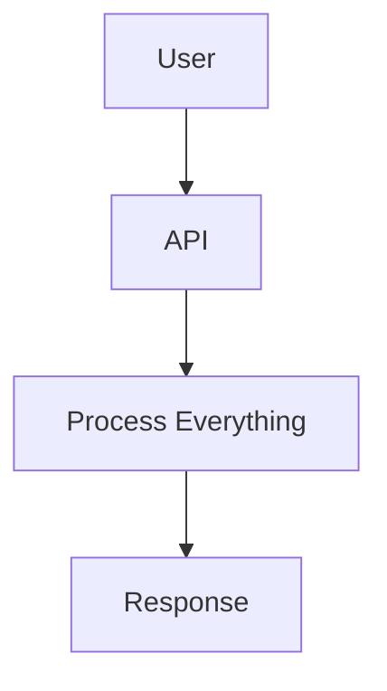

The user waits until the complete operation finishes.

In an asynchronous system:

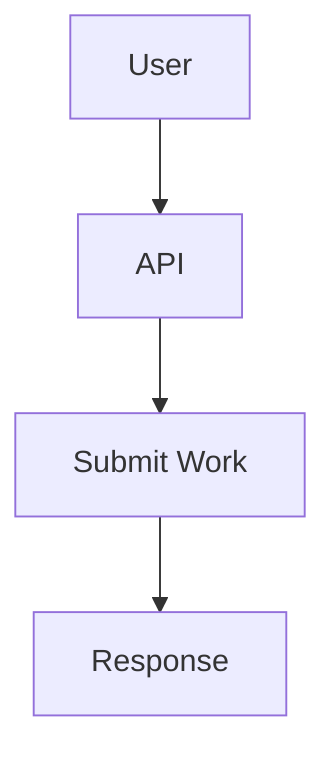

The actual work continues separately:

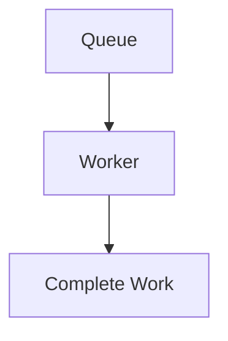

So the architecture becomes:

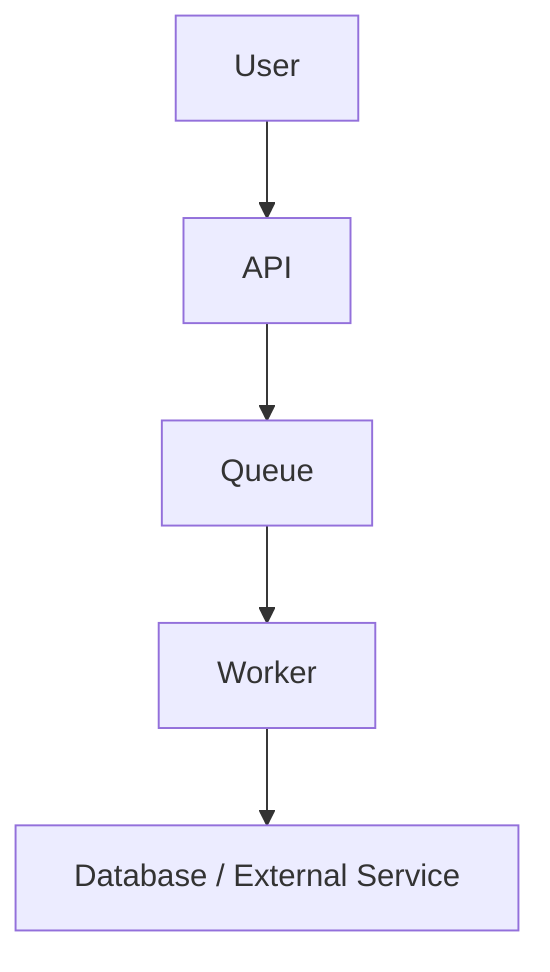

The important idea is:

> **The request does not need to remain open for the entire workflow.**

---

# 2. Synchronous vs Asynchronous Architecture

### Synchronous

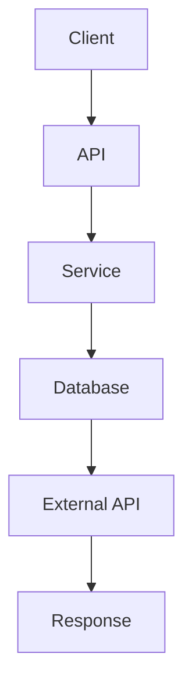

The request depends on every step completing before the response.

### Asynchronous

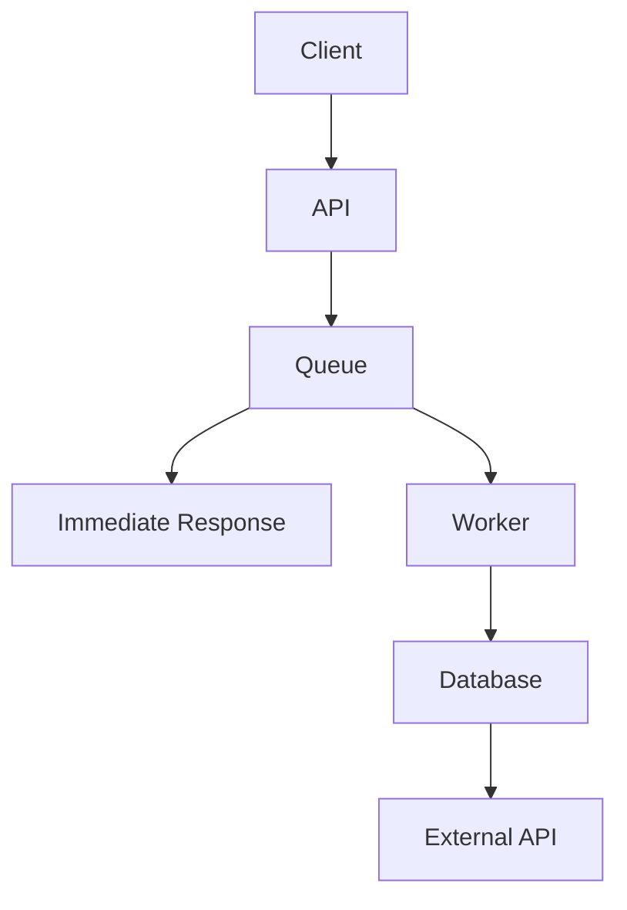

The request can finish earlier.

### The fundamental question

Ask:

> **Does the caller need this work completed before it can safely continue?**

If yes, synchronous processing may be appropriate.

If no, asynchronous processing may be a better fit.

---

# 3. Why Does Asynchronous Architecture Exist?

Asynchronous architecture is useful when work is:

- slow
- expensive
- bursty
- retryable
- independent of the immediate response
- dependent on unreliable external services
- suitable for background processing
- better handled separately from user-facing traffic

Examples:

```text
Image processing
Email sending
Video transcoding
Report generation
Search indexing
Analytics processing
Notifications
Large imports
Data exports
```

Instead of making the user wait:

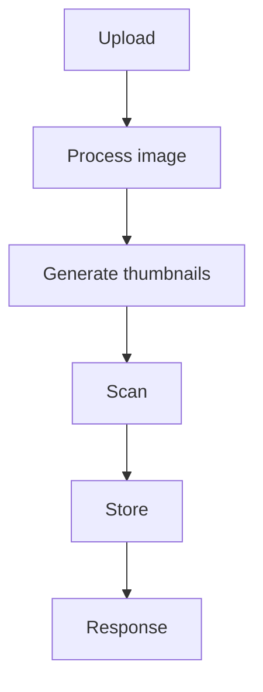

the system can do:

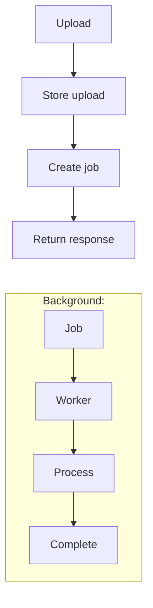

---

# 4. The Basic Asynchronous Architecture

The simplest useful pattern is:

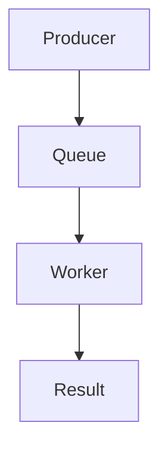

Each component has a clear responsibility.

### API

Accepts the request and creates work.

### Queue

Stores work until it can be processed.

### Worker

Performs the work.

### Database

Stores the resulting state.

This separation is the foundation of many asynchronous systems.

---

# 5. Asynchronous Architecture Is More Than "Use a Queue"

A queue is only one component.

A complete asynchronous system may need:

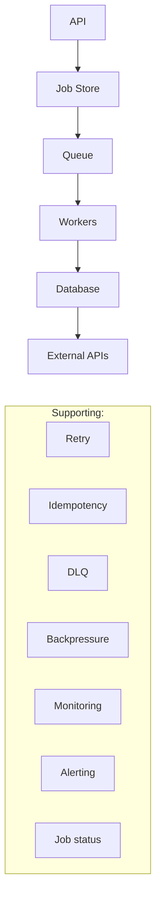

The architecture grows according to requirements.

---

# 6. Request/Response vs Job Submission

A common asynchronous API pattern is:

```text
POST /reports
```

The API receives the request and creates a report job.

Instead of waiting:

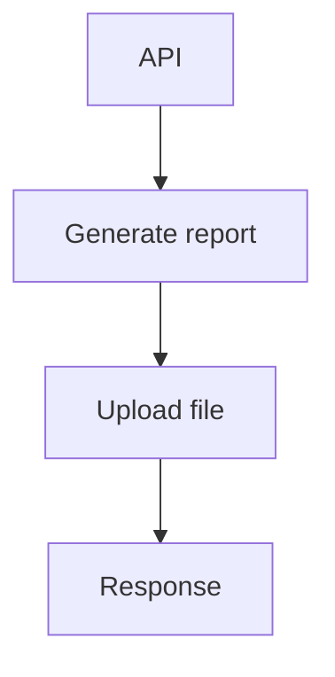

it can return:

```text
202 Accepted
```

with a job identifier:

```json
{
  "job_id": "job_12345",
  "status": "queued"
}
```

The client can later check:

```text
GET /reports/job_12345
```

and receive:

```json
{
  "job_id": "job_12345",
  "status": "completed",
  "download_url": "..."
}
```

The exact API design depends on the application, but the architectural pattern is:

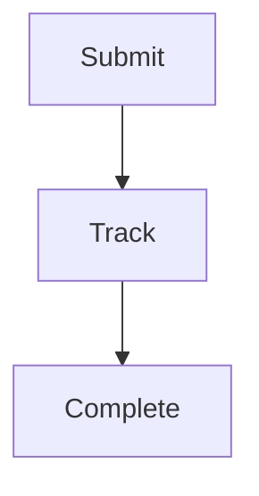

---

# 7. Job Status

Asynchronous work often needs a state model.

For example:

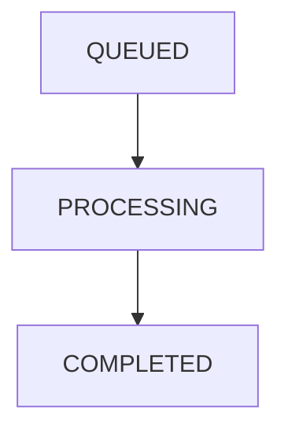

A more complete model:

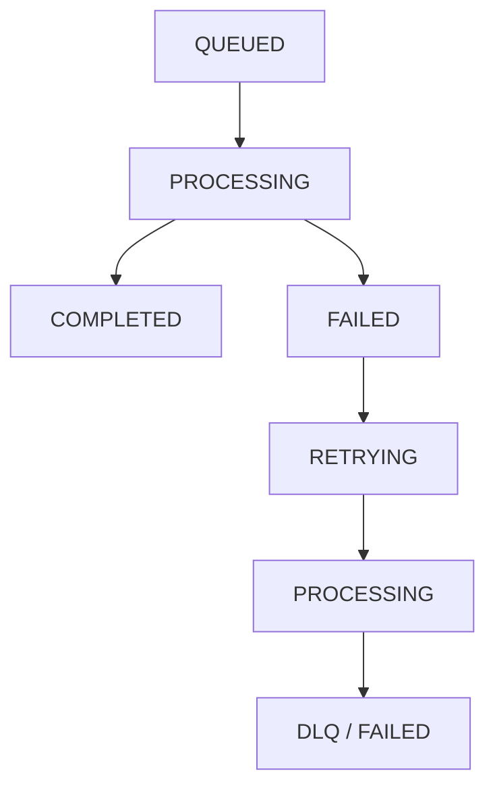

The status should represent meaningful business state, not merely whether a worker process is alive.

---

# 8. Why Job Status Matters

Imagine a video upload system.

The user uploads:

```text
video.mp4
```

The API responds immediately:

```text
Upload accepted.
```

But the video still needs:

- validation
- transcoding
- thumbnail generation
- metadata extraction
- storage processing

The user needs to know:

```text
Processing...
```

or:

```text
Completed
```

or:

```text
Processing failed
```

Therefore asynchronous architecture often requires a **state model**.

---

# 9. Queues Provide Temporal Decoupling

In synchronous architecture:

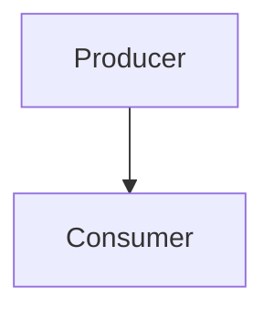

The producer depends directly on the consumer.

In asynchronous architecture:

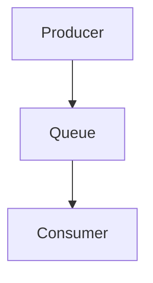

The producer and consumer no longer need to operate at exactly the same time.

The producer can create work now.

The consumer can process it later.

This is called **temporal decoupling**.

---

# 10. Queues Absorb Bursts

Suppose an application normally receives:

```text
100 jobs/sec
```

but suddenly receives:

```text
1000 jobs/sec
```

A queue can absorb some of the burst:

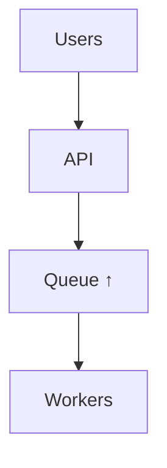

After the burst:

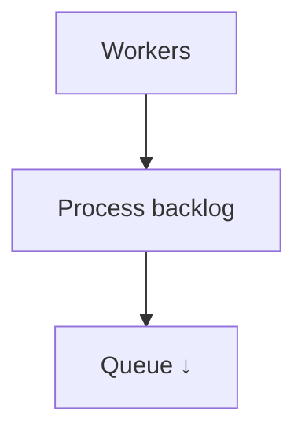

This is one of the most useful properties of asynchronous architecture.

But remember from **05.14 — Backpressure**:

> **A queue absorbs temporary overload; it does not create unlimited processing capacity.**

---

# 11. Workers Provide Independent Scaling

Suppose one worker processes:

```text
20 jobs/sec
```

You can run:

```text
5 workers
```

for approximately:

```text
100 jobs/sec
```

of theoretical worker capacity, assuming the workload scales effectively.

Architecture:

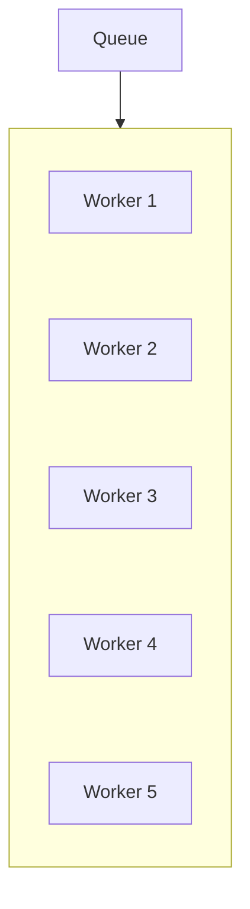

Workers can often scale independently from the API layer.

For example:

```text
API Servers
    3

Workers
   20
```

This is useful when background processing has very different resource requirements from request handling.

---

# 12. But Worker Scaling Has Limits

More workers do not mean infinite capacity.

Consider:

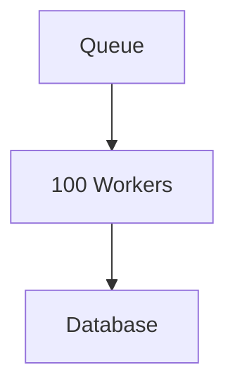

If the database can handle only:

```text
500 writes/sec
```

then increasing workers may simply create:

```mermaid
flowchart TD
  accTitle: More workers, more load
  accDescr: More DB requests, then DB contention, then Higher latency, then Timeouts, then Retries, then More load.
  N0["More DB requests"] --> N1["DB contention"] --> N2["Higher latency"] --> N3["Timeouts"] --> N4["Retries"] --> N5["More load"]
```

Asynchronous architecture must therefore include **capacity control**.

This connects directly to backpressure.

---

# 13. Backpressure in Asynchronous Architecture

A healthy asynchronous system controls work flow:

```mermaid
flowchart TD
  accTitle: Controlled work flow
  accDescr: Producer, then Queue, then Controlled Workers, then Downstream.
  N0["Producer"] --> N1["Queue"] --> N2["Controlled Workers"] --> N3["Downstream"]
```

When downstream capacity decreases:

```mermaid
flowchart BT
  accTitle: When downstream capacity decreases
  accDescr: Downstream slows; workers reduce pressure; the queue absorbs temporary excess.
  N0["Queue absorbs temporary excess"] --> N1["Workers reduce pressure"] --> N2["Downstream slows"]
```

Possible controls include:

- worker concurrency limits
- consumer limits
- queue limits
- rate limits
- batching
- prioritization
- load shedding

The goal is:

> **Keep the entire pipeline within a safe operating range.**

---

# 14. Message Broker in Asynchronous Architecture

A message broker can provide the communication infrastructure:

```mermaid
flowchart TD
  accTitle: Message broker
  accDescr: Service A, then Message Broker, then Queue, then Worker.
  N0["Service A"] --> N1["Message Broker"] --> N2["Queue"] --> N3["Worker"]
```

The broker may provide:

- routing
- queues
- topics
- subscriptions
- delivery
- acknowledgements
- retention
- consumer management

RabbitMQ is an example of a message broker.

Kafka provides a different model centered around distributed event streams.

The architecture should use the messaging technology that matches the communication requirement.

---

# 15. Work Queue vs Pub/Sub

Asynchronous architecture can use different messaging patterns.

### Work Queue

One job should normally be processed by one worker:

```mermaid
flowchart TD
  accTitle: Work queue
  accDescr: The queue feeds workers A, B and C.
  Q["Queue"] --> A["Worker<br/>A"] & B["Worker<br/>B"] & C["Worker<br/>C"]
```

Useful for:

```text
Resize image
Generate invoice
Process import
Send email
```

### Pub/Sub

One event may need to reach multiple independent consumers:

```mermaid
flowchart TD
  accTitle: Pub/Sub
  accDescr: An order event goes to a topic, which reaches Inventory, Analytics, Notification and Fraud Detection.
  N0["Order Event"] --> N1["Topic"] --> G
  subgraph G[" "]
    direction TB
    subgraph G1[" "]
      direction LR
      A["Inventory"] ~~~ B["Analytics"]
    end
    subgraph G2[" "]
      direction LR
      C["Notification"] ~~~ D["Fraud<br/>Detection"]
    end
    G1 ~~~ G2
  end
```

Useful when multiple services need to react independently.

The choice depends on the business relationship between the producers and consumers.

---

# 16. Event-Driven Asynchronous Architecture

A larger architecture might look like:

```mermaid
flowchart TD
  accTitle: Event-driven architecture
  accDescr: Order Service publishes order.created to the broker, which reaches the Inventory, Notification and Analytics services.
  O["Order Service"] -->|"order.created"| B["Broker"] --> G
  subgraph G[" "]
    direction TB
    I0["Inventory Service"] ~~~ I1["Notification Service"] ~~~ I2["Analytics Service"]
  end
```

The Order Service does not need to call every service directly.

This reduces direct coupling.

This can make the system easier to evolve.

But it also introduces distributed-system complexity.

---

# 17. Asynchronous Does Not Mean Independent of Failure

A queue can separate components, but failures still happen.

For example:

```mermaid
flowchart TD
  accTitle: A payment workflow
  accDescr: API, then Queue, then Worker, then Payment API.
  N0["API"] --> N1["Queue"] --> N2["Worker"] --> N3["Payment API"]
```

Payment API fails.

The worker must decide:

```text
Retry?
Wait?
Fail?
Move to DLQ?
```

This is why asynchronous architecture needs explicit failure handling.

---

# 18. Retries

From **05.12 — Retries**:

Retries are useful for temporary failures.

A typical flow:

```mermaid
flowchart TD
  accTitle: A retry flow
  accDescr: Worker, then Process, then Failure, then Retry, then Backoff, then Try Again.
  N0["Worker"] --> N1["Process"] --> N2["Failure"] --> N3["Retry"] --> N4["Backoff"] --> N5["Try Again"]
```

A safe retry strategy usually includes:

- retryable failure classification
- timeout
- maximum attempts
- exponential backoff
- jitter
- retry budget
- idempotency

Avoid:

```text
while (failure) {
    retry();
}
```

Unlimited retries can create an overload loop.

---

# 19. Idempotency

Asynchronous systems often use **at-least-once processing**.

That means a message can potentially be processed more than once.

For example:

```mermaid
flowchart TD
  accTitle: A duplicate charge
  accDescr: Worker, then Charge payment, then Success, then Worker crashes before ACK, then Message delivered again.
  N0["Worker"] --> N1["Charge payment"] --> N2["Success"] --> N3["Worker crashes before ACK"] --> N4["Message delivered again"]
```

Without protection:

```text
Charge
Charge
```

The business effect may happen twice.

Idempotency provides protection.

For example:

```text
payment_id = PAY-123
```

The system records that the payment was already processed.

Second attempt:

```mermaid
flowchart TD
  accTitle: Idempotent second attempt
  accDescr: PAY-123 already completed, then Do not charge again.
  N0["PAY-123 already completed"] --> N1["Do not charge again"]
```

This is why:

> **Asynchronous reliability often depends on idempotent processing.**

---

# 20. Dead-Letter Handling

If a message repeatedly fails:

```mermaid
flowchart TD
  accTitle: Repeated failure
  accDescr: Queue, then Worker, then Failure, then Retry, then Failure, then Retry, then Failure.
  N0["Queue"] --> N1["Worker"] --> N2["Failure"] --> N3["Retry"] --> N4["Failure"] --> N5["Retry"] --> N6["Failure"]
```

Eventually:

```text
DLQ
```

The DLQ keeps the problematic message away from the normal processing path.

The DLQ should preserve useful context:

- message ID
- failure reason
- attempt count
- timestamps
- original destination
- service information
- correlation ID
- schema/version where relevant

A DLQ is not a garbage bin.

It is a **recovery and investigation boundary**.

---

# 21. Ordering

Some asynchronous workflows require ordering.

For example:

```mermaid
flowchart TD
  accTitle: Ordered account events
  accDescr: Account Created, then Account Activated, then Account Closed.
  N0["Account Created"] --> N1["Account Activated"] --> N2["Account Closed"]
```

Processing these events out of order could produce incorrect state.

But global ordering is expensive.

Often the real requirement is:

> Keep events for the same entity ordered.

For example:

```text
User A:
A1 → A2 → A3

User B:
B1 → B2 → B3
```

A and B can often be processed independently.

This gives:

```text
Per-entity ordering
+
Parallel processing
```

The system can therefore preserve necessary correctness without forcing one global sequence.

---

# 22. Kafka in Asynchronous Architecture

Kafka is particularly useful when asynchronous architecture needs:

- high-throughput event streams
- multiple independent consumers
- durable retention
- replay
- partition-based scaling
- consumer groups

Example:

```mermaid
flowchart TD
  accTitle: Kafka in asynchronous architecture
  accDescr: Order Service publishes to the Kafka topic orders, read by Inventory, Analytics and Fraud.
  N0["Order Service"] --> N1["Kafka Topic: orders"] --> G
  subgraph G[" "]
    direction TB
    I0["Inventory"] ~~~ I1["Analytics"] ~~~ I2["Fraud"]
  end
```

Each consumer group can process the event stream independently.

Consumer lag becomes an important operational signal.

```text
Kafka
  ↓
Consumer
  ↑
Lag
```

If lag continuously increases, consumers are not keeping up with incoming events.

---

# 23. RabbitMQ in Asynchronous Architecture

RabbitMQ is often useful for queue-oriented workloads:

```mermaid
flowchart TD
  accTitle: RabbitMQ model
  accDescr: Producer, then Exchange, then Queue, then Worker.
  N0["Producer"] --> N1["Exchange"] --> N2["Queue"] --> N3["Worker"]
```

For example:

```mermaid
flowchart TD
  accTitle: RabbitMQ image processing
  accDescr: Image Upload, then RabbitMQ, then Image Queue, then Image Workers.
  N0["Image Upload"] --> N1["RabbitMQ"] --> N2["Image Queue"] --> N3["Image Workers"]
```

RabbitMQ's routing and queue model can be useful when the architecture needs flexible message delivery and work distribution.

The important point is not:

> "RabbitMQ is better."

or:

> "Kafka is better."

The correct question is:

> **What messaging behavior does the system require?**

---

# 24. Asynchronous Workflow Example — E-Commerce Order

Consider an online store.

A customer places an order.

### Synchronous Core

The system may need to synchronously:

```mermaid
flowchart TD
  accTitle: Synchronous core
  accDescr: Validate request, then Check essential business rules, then Create order, then Return confirmation.
  N0["Validate request"] --> N1["Check essential business rules"] --> N2["Create order"] --> N3["Return confirmation"]
```

Then background work can happen asynchronously:

```mermaid
flowchart TD
  accTitle: Asynchronous background work
  accDescr: Order created, event, broker, which reaches Email, Inventory, Analytics and Fraud.
  N0["Order Created"] --> N1["Event"] --> N2["Broker"] --> G
  subgraph G[" "]
    direction TB
    subgraph G1[" "]
      direction LR
      A["Email"] ~~~ B["Inventory"]
    end
    subgraph G2[" "]
      direction LR
      C["Analytics"] ~~~ D["Fraud"]
    end
    G1 ~~~ G2
  end
```

This creates a hybrid architecture.

Not everything needs to be asynchronous.

---

# 25. Hybrid Architecture

Real systems commonly combine both models.

```mermaid
flowchart TD
  accTitle: Hybrid architecture
  accDescr: Client, then API, then Synchronous Core, then Database, then Event, then Queue / Broker, then Asynchronous Workers.
  N0["Client"] --> N1["API"] --> N2["Synchronous Core"] --> N3["Database"] --> N4["Event"] --> N5["Queue / Broker"] --> N6["Asynchronous Workers"]
```

For example:

### Synchronous

```text
Create order
Validate payment
Reserve critical inventory
```

### Asynchronous

```text
Send email
Update analytics
Generate recommendation
Create search index
Send notification
```

This is often more practical than trying to make everything asynchronous.

---

# 26. User Experience

Asynchronous architecture changes what the user sees.

Instead of:

```text
Please wait...
████████████████
```

for 30 seconds, the system can respond:

```text
Your report is being generated.

Job: #12345
Status: Processing
```

The UI can later show:

```text
✓ Report completed
```

or:

```text
⚠ Report generation failed
```

This creates a better user experience when the operation naturally takes time.

But the user must understand that:

> **Accepted does not necessarily mean completed.**

---

# 27. Tracking Progress

Long-running jobs may expose progress:

```mermaid
flowchart TD
  accTitle: Measured progress
  accDescr: Queued, then 10%, then 35%, then 70%, then 100%.
  N0["Queued"] --> N1["10%"] --> N2["35%"] --> N3["70%"] --> N4["100%"]
```

However, progress should only be shown when the system can measure it meaningfully.

Do not invent:

```text
37%
38%
39%
...
```

just to animate a progress bar.

If real progress cannot be measured, statuses such as:

```text
Queued
Processing
Finalizing
Completed
```

may be more honest.

---

# 28. Asynchronous Architecture and Data Consistency

Asynchronous processing often introduces delay between state changes.

For example:

```mermaid
flowchart TD
  accTitle: Delayed propagation
  accDescr: Order Created, then Event, then Search Index Updated.
  N0["Order Created"] --> N1["Event"] --> N2["Search Index Updated"]
```

The order database may show the order immediately.

The search index may update later.

Therefore:

```text
Database = current
Search = temporarily stale
```

This is an example of eventual consistency.

Asynchronous architecture therefore connects directly to Level 4 concepts:

```mermaid
flowchart TD
  accTitle: Async and consistency
  accDescr: Asynchronous Processing, then Delayed Propagation, then Possible Stale State, then Consistency Requirements.
  N0["Asynchronous Processing"] --> N1["Delayed Propagation"] --> N2["Possible Stale State"] --> N3["Consistency Requirements"]
```

The system must decide whether this temporary difference is acceptable.

---

# 29. Asynchronous Architecture and Transactions

A database transaction usually provides atomicity within its defined transactional scope.

But this does not automatically make a multi-service workflow atomic.

For example:

```mermaid
flowchart TD
  accTitle: A multi-step workflow
  accDescr: Database, then Publish Event, then Worker, then External API.
  N0["Database"] --> N1["Publish Event"] --> N2["Worker"] --> N3["External API"]
```

A failure can happen between these steps.

This is why distributed workflows may require patterns such as:

- transactional outbox
- idempotency
- retries
- compensation
- saga-style workflows

These topics appear later in Level 7.

For now, remember:

> **A database transaction does not automatically make an entire asynchronous workflow one atomic transaction.**

---

# 30. Asynchronous Architecture and Observability

Asynchronous systems are harder to debug because the original request and background work may happen at different times.

A request may produce:

```mermaid
flowchart TD
  accTitle: Identifiers to connect
  accDescr: Request ID, then Job ID, then Message ID, then Worker, then Database.
  N0["Request ID"] --> N1["Job ID"] --> N2["Message ID"] --> N3["Worker"] --> N4["Database"]
```

You need to connect these operations.

Useful observability information includes:

- request ID
- correlation ID
- job ID
- message ID
- queue depth
- message age
- processing time
- retry count
- failure reason
- DLQ depth
- consumer lag
- worker utilization

Without this information:

```text
User: "My report failed."

Developer:
"Where?"
```

With correlation:

```mermaid
flowchart TD
  accTitle: With correlation
  accDescr: Request, then Job #123, then Message #456, then Worker #7, then Database timeout.
  N0["Request"] --> N1["Job #123"] --> N2["Message #456"] --> N3["Worker #7"] --> N4["Database timeout"]
```

The failure becomes much easier to investigate.

---

# 31. Failure Isolation

One major benefit of asynchronous architecture is failure isolation.

Suppose email delivery fails:

```mermaid
flowchart TD
  accTitle: Isolated email failure
  accDescr: Order Service, then Event, then Email Worker, then Email Provider ❌.
  N0["Order Service"] --> N1["Event"] --> N2["Email Worker"] --> N3["Email Provider ❌"]
```

The order itself may still exist successfully.

The email can be retried independently.

Without asynchronous separation:

```mermaid
flowchart TD
  accTitle: Without asynchronous separation
  accDescr: Order, then Email Provider ❌, then Order request fails.
  N0["Order"] --> N1["Email Provider ❌"] --> N2["Order request fails"]
```

A secondary failure could unnecessarily affect the primary business operation.

Asynchronous architecture can therefore isolate non-critical dependencies.

---

# 32. But Queues Also Introduce Failure Modes

Asynchronous architecture adds its own risks:

- lost messages
- duplicate messages
- delayed processing
- queue backlog
- consumer lag
- poison messages
- ordering problems
- retry storms
- DLQ growth
- broker failure
- worker failure
- stale state
- difficult debugging
- message schema incompatibility

Therefore:

> **Asynchronous architecture trades request-time coupling for distributed workflow complexity.**

---

# 33. Designing an Asynchronous Workflow

A useful design sequence is:

## Step 1 — Identify the work

```text
What needs to happen?
```

## Step 2 — Identify what must be synchronous

```text
What must complete before the user can continue?
```

## Step 3 — Identify background work

```text
What can safely happen later?
```

## Step 4 — Define state

```text
Queued
Processing
Completed
Failed
```

## Step 5 — Choose communication

```text
Queue?
Pub/Sub?
Event stream?
```

## Step 6 — Define failure handling

```text
Retry?
DLQ?
Compensation?
```

## Step 7 — Define idempotency

```text
What happens if the same message is processed twice?
```

## Step 8 — Define capacity controls

```text
Concurrency?
Backpressure?
Rate limits?
```

## Step 9 — Define observability

```text
How will we know the system is healthy?
```

## Step 10 — Define recovery

```text
What happens when components fail?
```

---

# 34. Asynchronous Architecture Decision Framework

Use asynchronous architecture when:

- work can safely finish later
- request latency is otherwise too high
- workload is bursty
- independent worker scaling is useful
- failures should be isolated
- multiple services need to react independently
- background processing is natural

Be careful when:

- the caller absolutely needs immediate completion
- consistency must be immediate across all affected components
- workflow complexity is low enough for simple synchronous processing
- operational complexity is not justified

Do not add asynchronous infrastructure simply because:

> "Large systems use queues."

Use it because the **problem requires decoupling or background processing**.

---

# 35. When Asynchronous Architecture Is Unnecessary

Suppose:

```mermaid
flowchart TD
  accTitle: A simple synchronous path
  accDescr: API, then Database, then Response.
  N0["API"] --> N1["Database"] --> N2["Response"]
```

takes:

```text
20 ms
```

and has:

```text
Low traffic
Simple workflow
No burst problem
No background work
```

Adding:

```text
Broker
Queue
Worker
Job Store
Retries
DLQ
Monitoring
```

may provide little value.

It adds:

- more components
- more failure modes
- more deployment work
- more monitoring
- more debugging complexity

A simple synchronous architecture may be better.

This follows a core Systemly principle:

> **Do not introduce distributed complexity before the problem requires it.**

---

# 36. Asynchronous Architecture Evolution

A system can evolve gradually.

### Stage 1 — Simple

```mermaid
flowchart TD
  accTitle: Stage 1
  accDescr: API, then Database.
  N0["API"] --> N1["Database"]
```

### Stage 2 — Background job

```mermaid
flowchart TD
  accTitle: Stage 2
  accDescr: API, then Queue, then Worker.
  N0["API"] --> N1["Queue"] --> N2["Worker"]
```

### Stage 3 — Multiple workers

```mermaid
flowchart TD
  accTitle: Stage 3
  accDescr: API, then Queue, then Workers.
  N0["API"] --> N1["Queue"] --> N2["Workers"]
```

### Stage 4 — Reliable processing

```mermaid
flowchart TD
  accTitle: Stage 4
  accDescr: Queue, then workers with retry, idempotency and DLQ.
  Q["Queue"] --> W["Workers"] --- R["Retry"] & I["Idempotency"] & D["DLQ"]
```

### Stage 5 — Event-driven

```mermaid
flowchart TD
  accTitle: Stage 5
  accDescr: Service, broker, then services A, B and C.
  N0["Service"] --> N1["Broker"] --> A["Service<br/>A"] & B["Service<br/>B"] & C["Service<br/>C"]
```

### Stage 6 — High-scale streaming

```mermaid
flowchart TD
  accTitle: Stage 6
  accDescr: Services, then Kafka, then Partitions, then Consumer Groups, then Multiple Processing Pipelines.
  N0["Services"] --> N1["Kafka"] --> N2["Partitions"] --> N3["Consumer Groups"] --> N4["Multiple Processing Pipelines"]
```

The architecture evolves because requirements evolve.

---

# 37. Hands-On Exercise — Design an Async Order Workflow

Design the following system:

> A customer places an order. The customer should receive confirmation quickly. Email, analytics, and recommendation updates can happen later.

Start with:

```mermaid
flowchart TD
  accTitle: Starting point
  accDescr: Customer, then API, then Order Database.
  N0["Customer"] --> N1["API"] --> N2["Order Database"]
```

## Step 1 — Identify synchronous work

Decide what must happen before confirmation.

For example:

```mermaid
flowchart TD
  accTitle: Synchronous work
  accDescr: Validate order, then Create order, then Return confirmation.
  N0["Validate order"] --> N1["Create order"] --> N2["Return confirmation"]
```

## Step 2 — Identify asynchronous work

Move suitable background work out of the request path:

```mermaid
flowchart TD
  accTitle: Asynchronous work
  accDescr: Order created, event, broker, which reaches Email, Analytics and Recommendation.
  N0["Order Created"] --> N1["Event"] --> N2["Broker"] --> G
  subgraph G[" "]
    direction TB
    I0["Email"] ~~~ I1["Analytics"] ~~~ I2["Recommendation"]
  end
```

## Step 3 — Add failure handling

For email:

```mermaid
flowchart TD
  accTitle: Email failure handling
  accDescr: Email Worker, then Failure, then Retry, then DLQ.
  N0["Email Worker"] --> N1["Failure"] --> N2["Retry"] --> N3["DLQ"]
```

## Step 4 — Add idempotency

Ask:

> What happens if `order.created` is delivered twice?

The email worker should avoid creating an unintended duplicate effect if the business requirement does not allow duplicates.

## Step 5 — Add backpressure

Ask:

> What happens if analytics suddenly receives 10× normal traffic?

Possible answer:

```mermaid
flowchart TD
  accTitle: Backpressure for analytics
  accDescr: Broker, then Controlled Consumers, then Backpressure.
  N0["Broker"] --> N1["Controlled Consumers"] --> N2["Backpressure"]
```

## Step 6 — Add observability

Track:

```text
Order ID
Event ID
Queue depth
Processing latency
Retry count
DLQ depth
Consumer lag
```

---

# 38. Lab Challenge — Choose the Architecture

For each operation, decide whether synchronous or asynchronous processing is more appropriate.

| Operation | Likely Choice | Why? |
|---|---|---|
| Validate login credentials | Synchronous | User needs immediate result |
| Generate a large monthly report | Asynchronous | Can take significant time |
| Send order confirmation email | Often asynchronous | User does not usually need email before order response |
| Create the order record | Synchronous | Core business state must be established |
| Generate analytics event | Asynchronous | Can happen after core transaction |
| Resize uploaded images | Asynchronous | Processing can take time |
| Return product price | Synchronous | User needs current response |
| Rebuild search index | Asynchronous | Large background operation |

The important lesson is not to memorize this table.

Ask:

> **Does the caller need the result before continuing?**

---

# 39. Common Mistakes

### Mistake 1 — Making everything asynchronous

Not every operation benefits from a queue.

### Mistake 2 — Treating `202 Accepted` as completion

Accepted means the system accepted the work; it does not necessarily mean the work finished.

### Mistake 3 — No job-status model

Users need a reliable way to understand background work.

### Mistake 4 — Ignoring duplicate processing

At-least-once delivery makes idempotency important.

### Mistake 5 — Retrying forever

Unlimited retries can create retry storms.

### Mistake 6 — Using a DLQ as a trash can

DLQ messages should be investigated and recovered deliberately.

### Mistake 7 — Adding workers without checking downstream capacity

The database or external API may be the real bottleneck.

### Mistake 8 — Ignoring ordering requirements

Some business operations must preserve sequence.

### Mistake 9 — No correlation IDs

Distributed background workflows become difficult to debug.

### Mistake 10 — Ignoring eventual consistency

Different components may observe changes at different times.

### Mistake 11 — Assuming queues guarantee reliability

Reliability depends on durability, acknowledgement, retry, idempotency, recovery, and operational design.

### Mistake 12 — Introducing asynchronous infrastructure too early

Complexity should solve a real problem.

---

# 40. System Design View

Asynchronous architecture is not simply:

```mermaid
flowchart TD
  accTitle: Not just a queue
  accDescr: API, then Queue.
  N0["API"] --> N1["Queue"]
```

It is a complete approach to separating work and managing its lifecycle.

A production system may look like:

```mermaid
flowchart TD
  accTitle: Asynchronous system design view
  accDescr: Client, API, broker / queue; a worker pool (database, external APIs, job store) and event consumers (other services); supported by retries, idempotency, backpressure, DLQ, ordering, observability and alerting.
  N0["Client"] --> N1["API"] --> N2["Broker / Queue"] --> WP & EC
  subgraph B1[" "]
    direction TB
    WP["Worker Pool"] --> DB["Database"] --> EX["External APIs"]
    WP --> JS["Job Store"]
  end
  subgraph B2[" "]
    direction TB
    EC["Event Consumers"] --> OS["Other Services"]
  end
  EX ~~~ EC
  subgraph S["Supporting:"]
    direction TB
    S0["Retries"] ~~~ S1["Idempotency"] ~~~ S2["Backpressure"] ~~~ S3["DLQ"] ~~~ S4["Ordering"] ~~~ S5["Observability"] ~~~ S6["Alerting"]
  end
  OS ~~~ S0
```

The architecture should be no more complicated than the requirements demand.

---

# 41. Practical Checklist

Before introducing asynchronous processing, ask:

### Business

- Does the caller need immediate completion?
- Can the operation safely finish later?
- What happens if it takes several minutes?

### Reliability

- Can messages be duplicated?
- Can messages be lost?
- What happens when a worker crashes?
- What happens when the downstream service fails?

### Capacity

- What is the producer rate?
- What is consumer capacity?
- What is downstream capacity?
- How will backpressure work?

### Data

- What is the source of truth?
- Can state temporarily become stale?
- Is ordering required?
- Is idempotency required?

### Operations

- How will jobs be monitored?
- How will failures be investigated?
- How will DLQ messages be recovered?
- How will consumer lag be detected?

### Architecture

- Is a queue enough?
- Do we need Pub/Sub?
- Do we need a broker?
- Do we need Kafka?
- Is this complexity actually justified?

---

# 42. Key Principle

> **Asynchronous architecture separates submitting work from completing work so that systems can handle slow operations, bursts, independent scaling, failure isolation, and event-driven workflows without keeping the original request waiting for everything to finish. But asynchronous processing does not remove complexity—it moves complexity into queues, workers, state management, retries, idempotency, ordering, backpressure, consistency, observability, and recovery.**

---

# Quick Reference

## Synchronous

```mermaid
flowchart TD
  accTitle: Synchronous
  accDescr: Request, then Work, then Result, then Response.
  N0["Request"] --> N1["Work"] --> N2["Result"] --> N3["Response"]
```

## Asynchronous

```mermaid
flowchart TD
  accTitle: Asynchronous
  accDescr: Request, submit work, response; queue, worker, complete.
  N0["Request"] --> N1["Submit Work"] --> N2["Response"]
  B0["Queue"] --> B1["Worker"] --> B2["Complete"]
  N2 ~~~ B0
```

## Reliable Async Worker

```mermaid
flowchart TD
  accTitle: Reliable async worker
  accDescr: Receive, process. Success? Yes: ACK. No: retry, retry limit, DLQ.
  N0["Receive"] --> N1["Process"] --> D{"Success?"}
  D -->|"Yes"| A["ACK"]
  D -->|"No"| X0["Retry"] --> X1["Retry Limit"] --> X2["DLQ"]
```

## Backpressure

```mermaid
flowchart TD
  accTitle: Backpressure
  accDescr: Producer, then Queue, then Controlled Workers, then Downstream.
  N0["Producer"] --> N1["Queue"] --> N2["Controlled Workers"] --> N3["Downstream"]
```

## Event Fan-Out

```mermaid
flowchart TD
  accTitle: Event fan-out
  accDescr: The publisher publishes to a topic, which reaches consumers A, B and C.
  N0["Publisher"] --> N1["Topic"] --> G
  subgraph G[" "]
    direction TB
    I0["Consumer A"] ~~~ I1["Consumer B"] ~~~ I2["Consumer C"]
  end
```

## Core Questions

```text
What must happen now?
What can happen later?
What can fail?
What happens on retry?
What if the message is duplicated?
What if processing is too slow?
What if downstream is overloaded?
How do we know the job completed?
How do we recover failed work?
```

---

# Knowledge Check

### 1. What is the main idea behind asynchronous architecture?

**Answer:** Separating work submission from work completion so the caller does not need to wait for the entire workflow.

### 2. Does asynchronous processing automatically make work faster?

**Answer:** No. It mainly changes when and where the work is processed and can reduce request latency.

### 3. Why are queues useful?

**Answer:** They provide temporal decoupling and can absorb temporary bursts of work.

### 4. Why isn't adding more workers always the solution?

**Answer:** A downstream dependency such as a database or external API may already be the bottleneck.

### 5. Why is idempotency important?

**Answer:** Asynchronous systems can process the same logical message more than once, and idempotency helps prevent unwanted duplicate effects.

### 6. What is the purpose of a DLQ?

**Answer:** To isolate repeatedly failing messages from the normal processing path while preserving them for investigation or controlled recovery.

### 7. What does backpressure protect?

**Answer:** It controls work flow when consumers or downstream components cannot safely keep up.

### 8. Does every operation need to be asynchronous?

**Answer:** No. Use asynchronous processing when its benefits justify the additional complexity.

### 9. Why can asynchronous systems produce stale data?

**Answer:** Different components may receive and process updates at different times.

### 10. What is one major operational requirement of asynchronous architecture?

**Answer:** Strong observability—such as correlation IDs, job IDs, queue depth, processing latency, retries, failures, and consumer lag.

---

# Remember

> **Do not ask, "Should I use a queue?" Ask, "Which work should be decoupled, why should it be decoupled, and what guarantees does that work require?"**

---

# Level 5 Complete

You have now covered the complete foundation of asynchronous systems:

```mermaid
flowchart TD
  accTitle: Level 5 complete
  accDescr: Synchronous vs Asynchronous, then Queues, then Workers, then Message Brokers, then Pub/Sub, then RabbitMQ, then Kafka, then Ordering, then Delivery Semantics, then Idempotency, then Retries, then DLQ, then Backpressure, then Asynchronous Architecture.
  N0["Synchronous vs Asynchronous"] --> N1["Queues"] --> N2["Workers"] --> N3["Message Brokers"] --> N4["Pub/Sub"] --> N5["RabbitMQ"] --> N6["Kafka"] --> N7["Ordering"] --> N8["Delivery Semantics"] --> N9["Idempotency"] --> N10["Retries"] --> N11["DLQ"] --> N12["Backpressure"] --> N13["Asynchronous Architecture"]
```

The next level moves from asynchronous communication into the deeper problems of **distributed systems**.

# Next Chapter

## Level 6 — Distributed Systems

### 06.01 — What Makes a System Distributed?

Topics:

- What a distributed system is
- Why systems become distributed
- Multiple computers working together
- Network communication
- Shared work
- Shared state
- Coordination
- Partial failure
- Latency between nodes
- Why distributed systems are difficult
- Distributed vs multi-server architecture
- Real-world examples
- Failure scenarios
- Hands-on distributed-system exercise
- System-design trade-offs
