# 06.01 — What Makes a System Distributed?

## Learning Objectives

By the end of this chapter, you should understand:

- What a distributed system is
- Why systems become distributed
- How multiple computers work together
- Why network communication changes system behavior
- The difference between distributed and multi-server systems
- What distributed state means
- Why partial failure is fundamental
- Why network latency matters
- Why coordination becomes difficult
- How distributed systems fail differently from single-machine systems
- The basic trade-offs introduced by distribution

---

# Beginner Vocabulary

| Term | Beginner-Friendly Meaning |
|---|---|
| **Distributed System** | Multiple computers working together as one logical system |
| **Node** | One computer or process participating in a distributed system |
| **Network** | Communication path connecting nodes |
| **Distributed State** | Information that exists or is maintained across multiple nodes |
| **Coordination** | Getting multiple nodes to agree or work together correctly |
| **Partial Failure** | Some components fail while others continue working |
| **Network Partition** | Nodes can no longer reliably communicate with each other |
| **Replication** | Keeping copies of data or state on multiple nodes |
| **Latency** | Time required for communication or processing |
| **Consistency** | What different nodes are allowed to observe |
| **Availability** | Whether a system can successfully respond to requests |
| **Quorum** | Minimum number of nodes whose participation is required for an operation |
| **Leader** | Node temporarily responsible for coordinating certain operations |
| **Consensus** | Process through which distributed nodes agree on a value or decision |
| **Failure Domain** | Group of components that can fail together |
| **Clock Skew** | Difference between clocks on different machines |
| **Split Brain** | Situation where multiple nodes incorrectly believe they are independently authoritative |
| **Fault Tolerance** | Ability to continue operating despite certain failures |

---

# 1. What Is a Distributed System?

A **distributed system is a system in which multiple independent computers or processes communicate over a network to perform work together.**

A simple single-machine application might look like:

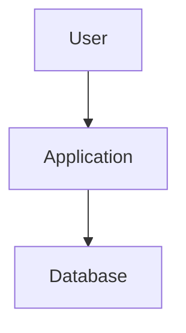

Everything may exist on one machine.

A distributed system might look like:

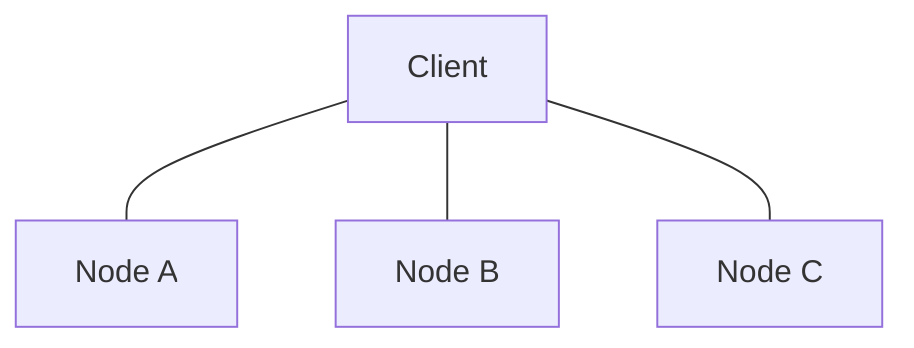

The important part is not simply that there are multiple computers.

The important part is:

> **The computers must communicate and coordinate to provide the behavior of one larger system.**

---

# 2. One Computer vs Multiple Computers

Consider a simple application.

### Single Computer

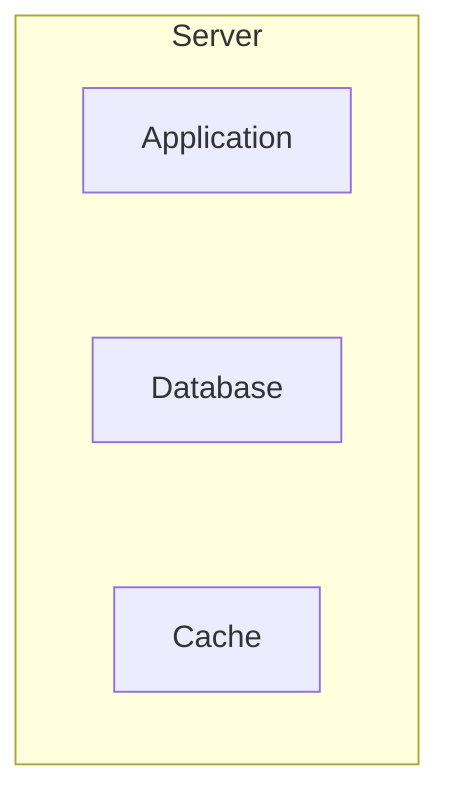

If the machine fails:

```text
Everything fails.
```

Now distribute the application:

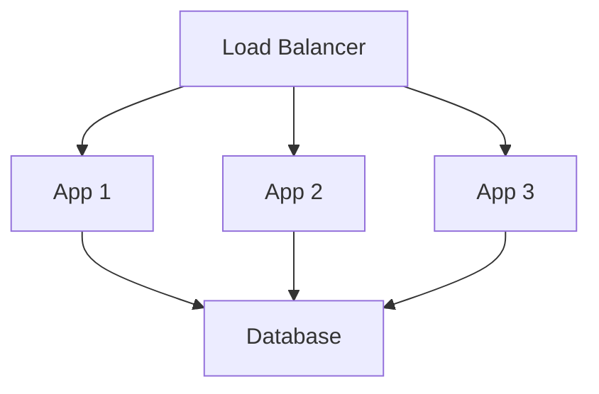

The application layer is now distributed.

The machines must communicate over a network.

That introduces new failure modes.

---

# 3. Why Do Systems Become Distributed?

Systems become distributed for many reasons.

### 1. Scale

One machine may not have enough:

- CPU
- memory
- storage
- network capacity
- connection capacity

So work is distributed:

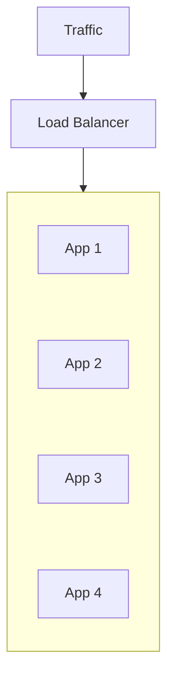

### 2. Availability

Multiple machines can reduce dependence on one machine.

```text
App 1 ❌
App 2 ✓
App 3 ✓
```

The system may continue serving requests.

### 3. Geographic Distribution

Users may be far apart.

```text
India → Region A
Europe → Region B
USA → Region C
```

This can reduce network latency.

### 4. Specialized Work

Different components may perform different jobs:

```text
API Service
Worker Service
Search Service
Database
Cache
Message Broker
```

### 5. Fault Isolation

A failure in one component may not need to bring down everything.

---

# 4. Multiple Servers Does Not Automatically Mean Distributed System

This distinction matters.

Suppose you have:

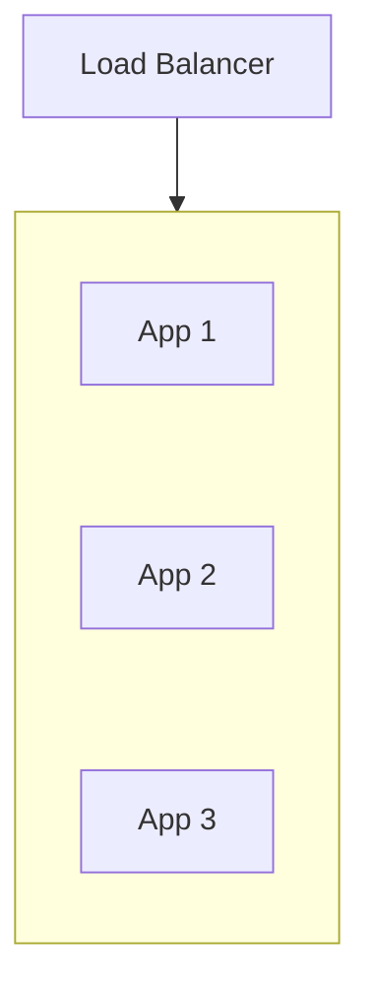

These are multiple servers.

But the application may simply be **horizontally scaled**.

The deeper distributed-system problems become more obvious when the nodes must coordinate shared state or decisions.

For example:

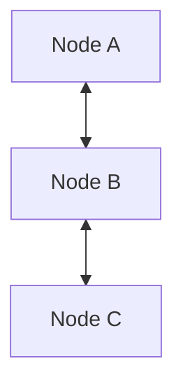

If the nodes need to agree on:

- who is leader
- which data is current
- whether an operation succeeded
- whether another node is alive
- which value should win
- whether a lock is held

then distributed coordination becomes important.

So:

> **Multiple machines are a common ingredient of distributed systems, but the difficult part is coordination across those machines.**

---

# 5. The Network Changes Everything

Inside one process:

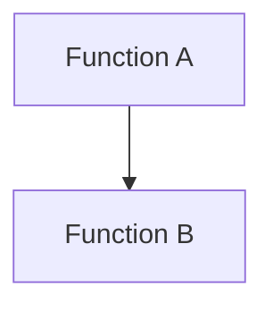

A function call may be extremely fast and usually has predictable local failure behavior.

Across machines:

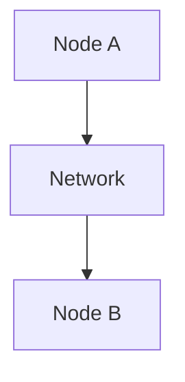

Now communication can experience:

- latency
- packet loss
- connection failure
- timeout
- congestion
- retransmission
- partial connectivity
- DNS problems
- routing problems

The system must therefore treat communication as something that can fail.

---

# 6. Local Call vs Network Call

Consider:

```text
result = calculatePrice()
```

The local function either returns or throws an error.

Now consider:

```text
response = paymentService.charge()
```

The payment service may:

- respond successfully
- respond slowly
- reject the request
- become unreachable
- process the request but lose the response
- return a response after a timeout

The most dangerous case is:

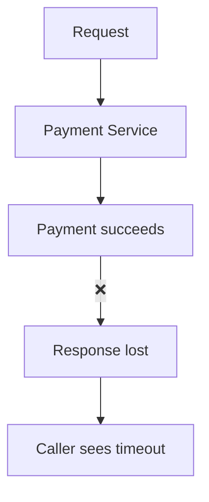

The caller does not automatically know whether the operation happened.

This is a fundamental distributed-systems problem.

---

# 7. The Eight Common Possibilities

When Node A communicates with Node B, the result is not simply:

```text
Success
or
Failure
```

There can be uncertainty.

Conceptually:

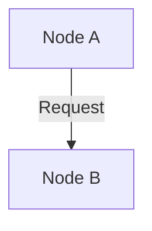

Possible outcomes:

1. Request never reaches B
2. Request reaches B but B fails before processing
3. B processes the request
4. B processes it but response is delayed
5. B processes it but response is lost
6. A times out before receiving response
7. Network connection fails after processing
8. B is alive but unreachable from A

Therefore:

> **A timeout does not necessarily mean the operation did not happen.**

This idea becomes extremely important later when we discuss retries, idempotency, distributed transactions, and consensus.

---

# 8. What Is a Node?

A **node** is an independent participant in a distributed system.

Depending on the architecture, a node could be:

- physical server
- virtual machine
- container
- database server
- broker instance
- application process
- cloud instance

For example:

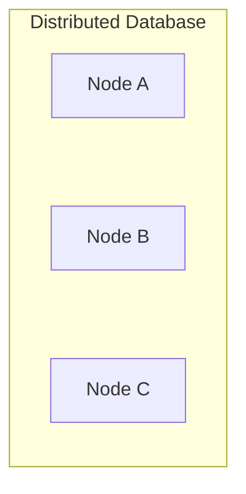

Each node has:

- CPU
- memory
- local state
- network identity
- connections
- failure behavior

Nodes may perform the same role or different roles.

---

# 9. Nodes Communicate Over a Network

A basic distributed system looks like:

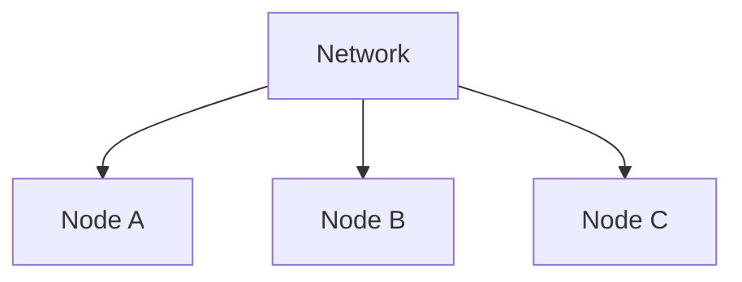

The network becomes part of the system's behavior.

This creates an important difference:

```text
Single Machine
    ↓
Local failure

Distributed System
    ↓
Local failure
+
Network failure
+
Coordination failure
```

The network itself can fail independently of the machines.

---

# 10. What Is Distributed State?

Suppose three nodes maintain copies of a value:

```text
Node A: balance = 100
Node B: balance = 100
Node C: balance = 100
```

Now a payment changes the balance:

```text
balance = 80
```

How do all nodes learn about the change?

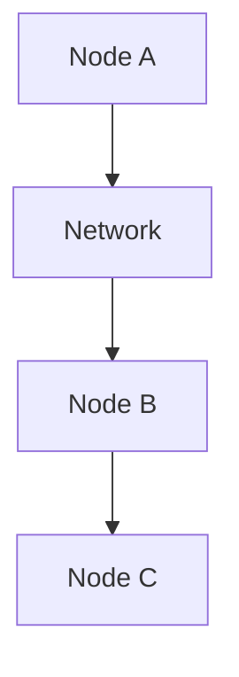

There may temporarily be:

```text
A = 80
B = 100
C = 100
```

This is **distributed state**.

The system now has to answer:

> When should the other nodes see the new value?

That leads directly to consistency.

---

# 11. Replication Creates Coordination Problems

Replication means keeping multiple copies of data.

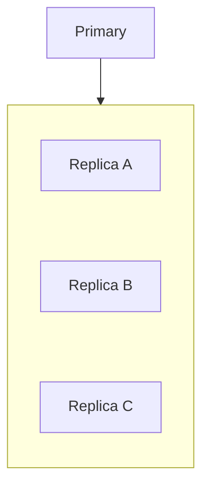

This improves:

- availability
- read capacity
- fault tolerance
- geographic distribution

But now the system must deal with:

- replication delay
- stale reads
- conflicting updates
- node failure
- recovery
- ordering

Replication therefore provides benefits while introducing coordination problems.

---

# 12. Partial Failure

One of the most important ideas in distributed systems is **partial failure**.

In a simple single-machine system:

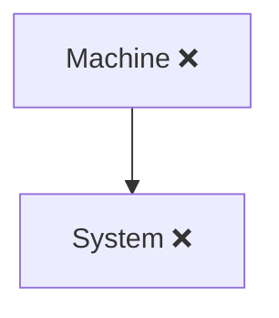

In a distributed system:

```text
Node A ✓
Node B ❌
Node C ✓
```

Some components work while others fail.

This is partial failure.

The system must decide:

> **Can we continue safely with only the components that remain available?**

---

# 13. Why Partial Failure Is Difficult

Suppose:


Node B stops responding.

Node A may think:

```text
"B is dead."
```

But Node B may actually be:

```text
Alive
```

and simply unable to communicate.

This creates uncertainty.

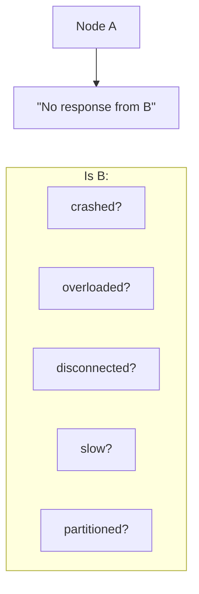

A distributed system often cannot immediately know the exact reason.

This is why timeouts are important—but also imperfect.

---

# 14. Network Partition

A **network partition** occurs when parts of a distributed system cannot reliably communicate.

For example:

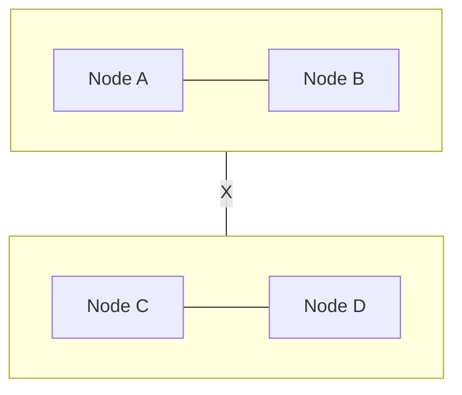

The system is divided into communication groups.

The machines may still be running.

But communication between groups has failed.

This is fundamentally different from:

```text
Node B crashed
```

because both sides may continue operating independently.

---

# 15. Why Partitions Are Dangerous

Suppose Node A and Node B both believe they are allowed to accept writes.

Before the partition:

```text
A = 100
B = 100
```

During partition:

```text
Client → A → balance = 80

Client → B → balance = 50
```

Now:

```text
A = 80
B = 50
```

The system has divergent state.

When communication returns, it must determine what the correct state should be.

This is one of the central challenges of distributed systems.

---

# 16. Distributed Systems Have Clocks—but Clocks Differ

Every machine has a clock.

But:

```text
Node A: 10:00:00.100
Node B: 10:00:00.150
Node C: 10:00:00.070
```

The clocks are not perfectly synchronized.

This difference is called **clock skew**.

Therefore, distributed systems should be careful about assuming:

> "The timestamp on Node A is definitely earlier than the timestamp on Node B."

Wall-clock time alone is not always a reliable way to establish event ordering.

---

# 17. Latency Is Part of the Architecture

Suppose two services communicate:

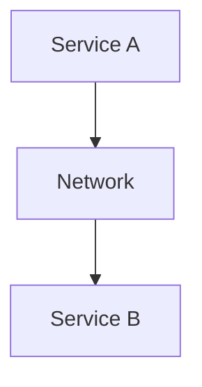

Every request has communication latency.

Now imagine:

```text
A → B → C → D
```

If each network hop adds latency:

```text
A → B = 20 ms
B → C = 30 ms
C → D = 40 ms
```

the total path can become significant.

Distributed architecture therefore has a cost:

> **Communication itself becomes work.**

This affects:

- latency
- throughput
- retries
- timeouts
- user experience
- failure probability

---

# 18. Distributed Does Not Mean "Better"

Distribution solves certain problems.

It also creates new ones.

### Benefits

- scale
- availability
- geographic reach
- fault isolation
- independent scaling
- specialized services

### Costs

- network latency
- partial failure
- coordination
- consistency problems
- operational complexity
- debugging difficulty
- deployment complexity
- data synchronization

Therefore:

> **Distribution is a trade-off, not an automatic upgrade.**

---

# 19. A Simple Distributed Example

Imagine an e-commerce system:

```mermaid
flowchart TD
  accTitle: An e-commerce system
  accDescr: A load balancer sends requests to App A, App B and App C, which all use one database.
  L["Load Balancer"] --> A["App A"] & B["App B"] & C["App C"] --> DB["Database"]
```

The application servers are distributed.

Now add replicas:

```mermaid
flowchart TD
  accTitle: Adding replicas
  accDescr: The application writes to a primary, which replicates to replica A and replica B.
  A["Application"] --> P["Primary"] --> R1["Replica A"] & R2["Replica B"]
```

Now the system must consider:

- replication delay
- read routing
- primary failure
- replica failure
- stale data

Now add a cache:

```mermaid
flowchart TD
  accTitle: Adding a cache
  accDescr: Application, cache, database.
  A["Application"] --- C["Cache"] --- D["Database"]
```

Now there may be another copy of data.

The system becomes increasingly distributed.

---

# 20. Distribution Creates Multiple Truths—or Multiple Views

Suppose:

```text
Database = 100
Cache = 100
Search Index = 100
Replica = 100
```

A user updates the product:

```text
Database = 120
```

For a short period:

```text
Database     = 120
Replica      = 100
Cache        = 100
Search Index = 100
```

Different components now see different versions.

This is not necessarily a bug.

It may be an intentional consistency model.

The system must define:

> **Which component is authoritative, and how quickly should other copies converge?**

---

# 21. Distributed State Requires Ownership

Suppose several nodes can update the same piece of state.

```mermaid
flowchart LR
  accTitle: Shared state
  accDescr: Nodes A, B and C all write to the shared state.
  A["Node A"] & B["Node B"] & C["Node C"] --> S["Shared State"]
```

Who is allowed to write?

If everyone writes independently, conflicts may occur.

A system may instead define:

```mermaid
flowchart TD
  accTitle: Clear ownership
  accDescr: Leader, then Authoritative Write, then Replicas.
  N0["Leader"] --> N1["Authoritative Write"] --> N2["Replicas"]
```

This creates a clear ownership model.

Later chapters will explore:

- leader/follower
- leader election
- quorum
- consensus

---

# 22. Coordination

**Coordination means getting multiple nodes to behave consistently enough for the system's requirements.**

Examples:

### Leader election

```mermaid
flowchart TD
  accTitle: Leader election
  accDescr: Nodes A, B and C: who should be leader?
  subgraph G[" "]
    direction TB
    A["A"] ~~~ R ~~~ C["C"]
    subgraph R[" "]
      direction RL
      Q["Who should be leader?"] --> B["B"]
    end
  end
```

### Distributed lock

```mermaid
flowchart TD
  accTitle: Distributed lock
  accDescr: Node A, then Lock, then Shared Resource.
  N0["Node A"] --> N1["Lock"] --> N2["Shared Resource"]
```

### Replication

```mermaid
flowchart TD
  accTitle: Replication
  accDescr: Primary, then Replicas.
  N0["Primary"] --> N1["Replicas"]
```

### Consensus

```mermaid
flowchart LR
  accTitle: Consensus
  accDescr: A, B and C reach agreement.
  A["A"] & B["B"] & C["C"] --> G["Agreement"]
```

Coordination becomes necessary when independent nodes need to make shared decisions.

---

# 23. Failure Domains

A **failure domain** is a group of components that may fail together.

For example:

```mermaid
flowchart TD
  accTitle: Failure domains
  accDescr: Availability Zone A holds App 1, App 2 and the database; Availability Zone B holds App 3, App 4 and the replica.
  subgraph ZA["Availability Zone A"]
    direction TB
    A0["App 1"] ~~~ A1["App 2"] ~~~ A2["Database"]
  end
  subgraph ZB["Availability Zone B"]
    direction TB
    B0["App 3"] ~~~ B1["App 4"] ~~~ B2["Replica"]
  end
  A2 ~~~ B0
```

If Zone A fails:

```text
Zone A ❌
Zone B ✓
```

The system may continue.

This is more useful than simply putting multiple servers in the same failure domain.

For example:

```mermaid
flowchart TD
  accTitle: Same rack
  accDescr: Servers A, B and C in the same rack.
  subgraph R["Same Rack"]
    direction TB
    I0["Server A"] ~~~ I1["Server B"] ~~~ I2["Server C"]
  end
```

A rack failure could remove all three.

Distribution only helps if the components are separated across meaningful failure domains.

---

# 24. Fault Tolerance

A distributed system is often designed to tolerate specific failures.

For example:

```text
3 Nodes
```

may be designed to continue when:

```text
1 Node fails
```

But that does not mean:

```text
Any number of nodes can fail.
```

Fault tolerance must be defined against specific failure assumptions.

Ask:

> **What failures can this architecture survive?**

For example:

```text
Can survive:
✓ one application server failure
✓ one replica failure

Cannot safely survive:
✗ all database nodes failing
✗ complete region loss
```

This is a much more useful statement than simply saying:

> "The system is highly available."

---

# 25. Redundancy vs Coordination

Adding replicas provides redundancy:

```text
A
B
C
```

But if A, B, and C must agree on state, coordination becomes necessary.

Therefore:

```mermaid
flowchart TD
  accTitle: Redundancy and coordination
  accDescr: Redundancy, then More copies, then More coordination.
  N0["Redundancy"] --> N1["More copies"] --> N2["More coordination"]
```

This is one of the recurring themes of distributed systems.

---

# 26. The Distributed Systems Failure Triangle

When working with distributed systems, always consider:

```text
          Network
             /\
            /  \
           /    \
          /      \
      Node ------ State
     Failure   Coordination
```

Ask:

### Node

Can a machine/process fail?

### Network

Can communication fail or become delayed?

### State

What happens when different nodes have different information?

Many distributed-system problems arise from the interaction of these three.

---

# 27. Hands-On Exercise — Build a Distributed Mental Model

Consider:

```mermaid
flowchart TD
  accTitle: Exercise architecture
  accDescr: A load balancer sends requests to App A, App B and App C, which all use one database.
  L["Load Balancer"] --> A["App A"] & B["App B"] & C["App C"] --> DB["Database"]
```

Answer these questions:

### Question 1

Are App A, B, and C independent nodes?

**Yes.**

### Question 2

What happens if App B fails?

Ideally:

```text
A ✓
B ❌
C ✓
```

The load balancer should stop routing traffic to B.

### Question 3

What happens if App A cannot reach the database?

The application may still be running, but its dependency is unavailable.

### Question 4

What happens if the database is replicated?

Now the system must consider:

- replication
- lag
- consistency
- failover

### Question 5

What happens if network communication between the application and database fails?

The application cannot safely assume the database is unavailable globally.

It only knows that communication failed from its perspective.

---

# 28. Lab Challenge — The Uncertain Failure

Imagine:

```mermaid
flowchart TD
  accTitle: Application calls payment service
  accDescr: The application sends a request to the payment service.
  A["Application"] -->|"Request"| P["Payment Service"]
```

The application sends:

```text
Charge ₹1,000
```

The payment service processes the charge successfully.

But the response is lost.

The application receives:

```text
Timeout
```

### Question 1

Did the payment definitely fail?

**No.**

### Question 2

Could retrying create a duplicate charge?

**Yes.**

### Question 3

What concept helps make the retry safe?

**Idempotency.**

### Question 4

Why is this a distributed-systems problem?

Because the application cannot perfectly determine the remote system's state after communication failure.

This small example demonstrates why distributed systems require careful reasoning about:

```text
Network
State
Failure
Retry
Coordination
```

---

# 29. Practical Investigation Workflow

When a distributed system behaves unexpectedly:

```mermaid
flowchart TD
  accTitle: Investigation workflow
  accDescr: Observe, then Identify affected nodes, then Check network connectivity, then Check latency/timeouts, then Check state differences, then Check replication/coordination, then Identify failure domain, then Determine what the system believes, then Determine what is actually happening, then Recover safely, then Measure again.
  N0["Observe"] --> N1["Identify affected nodes"] --> N2["Check network connectivity"] --> N3["Check latency/timeouts"] --> N4["Check state differences"] --> N5["Check replication/coordination"] --> N6["Identify failure domain"] --> N7["Determine what the system believes"] --> N8["Determine what is actually happening"] --> N9["Recover safely"] --> N10["Measure again"]
```

A particularly useful question is:

> **What does each node believe is true right now?**

---

# 30. Common Mistakes

### Mistake 1 — "Multiple servers automatically solve availability"

Only if the architecture can actually route around failures.

### Mistake 2 — Assuming timeout means failure

The operation may have succeeded even though the response was lost.

### Mistake 3 — Treating the network as reliable

Networks can fail, delay, reorder, or drop communication.

### Mistake 4 — Assuming replicas are immediately identical

Replication can have lag.

### Mistake 5 — Ignoring partial failure

Some nodes may work while others fail.

### Mistake 6 — Assuming more replicas remove all problems

More replicas can introduce more coordination and consistency complexity.

### Mistake 7 — Assuming distributed means scalable

Distribution can improve scalability, but architecture and bottlenecks still matter.

### Mistake 8 — Ignoring failure domains

Three servers in the same failure domain may fail together.

### Mistake 9 — Assuming clocks are perfectly synchronized

Clock skew can make timestamp-based reasoning dangerous.

### Mistake 10 — Adding distributed components too early

A simple system is often easier to reason about and operate.

---

# 31. System Design View

The biggest conceptual shift from earlier chapters is this:

```mermaid
flowchart TD
  accTitle: Single system
  accDescr: Single System, then "Does it work?".
  N0["Single System"] --> N1["#quot;Does it work?#quot;"]
```

Distributed System:

```mermaid
flowchart TD
  accTitle: Distributed system questions
  accDescr: Multiple Nodes, then Do they communicate?, then Do they agree?, then What happens if one fails?, then What if the network fails?, then What state does each node have?, then How do they recover?.
  N0["Multiple Nodes"] --> N1["Do they communicate?"] --> N2["Do they agree?"] --> N3["What happens if one fails?"] --> N4["What if the network fails?"] --> N5["What state does each node have?"] --> N6["How do they recover?"]
```

The system designer must think not only about the **happy path**, but also about disagreement and uncertainty.

---

# 32. Why Distributed Systems Are Difficult

The core difficulty is not simply:

> "There are many computers."

The difficulty is:

> **Each computer has only a partial view of the overall system.**

Node A knows what A sees.

Node B knows what B sees.

Node C knows what C sees.

Because communication takes time and can fail:

```text
A's view ≠ B's view ≠ C's view
```

at least temporarily.

The system therefore needs mechanisms to coordinate these different views when correctness requires it.

---

# 33. The Core Distributed-System Questions

Whenever you see a distributed architecture, ask:

### 1. Who owns the state?

```text
Who is authoritative?
```

### 2. How is state replicated?

```text
How do other nodes learn about changes?
```

### 3. What happens if a node fails?

```text
Who takes over?
```

### 4. What happens if the network fails?

```text
Can nodes continue safely?
```

### 5. How do nodes agree?

```text
Leader?
Quorum?
Consensus?
```

### 6. What happens when nodes disagree?

```text
Conflict?
Retry?
Reject?
Merge?
Recover?
```

### 7. How does the system know it has recovered?

```text
Health?
Freshness?
Synchronization?
```

These questions lead directly into the next chapters.

---

# 34. Connection to Previous Levels

Distributed systems build on everything learned so far.

### Networking

```text
Latency
Timeouts
Network failures
```

### Scaling

```text
Multiple application instances
Load balancing
Failover
```

### Caching

```text
Multiple copies of data
Staleness
Invalidation
```

### Databases

```text
Replication
Sharding
Consistency
```

### Messaging

```text
Queues
Workers
Retries
Idempotency
Backpressure
```

Now these concepts interact across multiple machines.

That interaction is what makes distributed systems difficult.

---

# 35. Connection to Upcoming Chapters

This chapter gives the foundation for:

```mermaid
flowchart TD
  accTitle: Upcoming chapters
  accDescr: 06.02 Distributed State, then 06.03 Partial Failure, then 06.04 Network Partitions, then 06.05 Replication, then 06.06 Quorum, then 06.07 Leader & Follower, then 06.08 Leader Election, then 06.09 Distributed Locks, then 06.10 Consensus.
  N0["06.02 Distributed State"] --> N1["06.03 Partial Failure"] --> N2["06.04 Network Partitions"] --> N3["06.05 Replication"] --> N4["06.06 Quorum"] --> N5["06.07 Leader & Follower"] --> N6["06.08 Leader Election"] --> N7["06.09 Distributed Locks"] --> N8["06.10 Consensus"]
```

Each chapter addresses one of the problems introduced here.

---

# 36. Decision Framework

Before distributing a system, ask:

```text
1. Why do we need more than one node?

2. What resource are we scaling?

3. What failures must we survive?

4. What state must be shared?

5. Who owns that state?

6. How will nodes communicate?

7. What happens when communication fails?

8. How much stale state is acceptable?

9. How will nodes coordinate?

10. How will the system recover?
```

If these questions do not have clear answers, adding more nodes may simply add complexity.

---

# 37. Key Principle

> **A distributed system is not difficult merely because it has multiple computers. It is difficult because those independent computers must communicate, coordinate, and maintain correct behavior despite network latency, partial failure, incomplete information, and changing state. Distribution can provide scale, availability, geographic reach, and fault isolation—but every benefit comes with coordination and operational trade-offs.**

---

# Quick Reference

## Simple System

```mermaid
flowchart TD
  accTitle: Simple system
  accDescr: Client, then Server, then Database.
  N0["Client"] --> N1["Server"] --> N2["Database"]
```

## Distributed Application

```mermaid
flowchart TD
  accTitle: Distributed application
  accDescr: Client, load balancer, then App A, App B and App C.
  N0["Client"] --> N1["Load Balancer"] --> G
  subgraph G[" "]
    direction TB
    I0["App A"] ~~~ I1["App B"] ~~~ I2["App C"]
  end
```

## Distributed State

```mermaid
flowchart TD
  accTitle: Distributed state
  accDescr: Node A, Node B and Node C communicate with each other and share state.
  subgraph R[" "]
    direction LR
    A["Node A"] <--> B["Node B"] <--> C["Node C"]
  end
  R --- S["Shared State"]
```

## Partial Failure

```text
A ✓
B ❌
C ✓
```

## Network Partition

```mermaid
flowchart TD
  accTitle: Network partition
  accDescr: A and B are connected, C and D are connected, and a network failure (X) separates the two groups.
  subgraph R1[" "]
    direction LR
    A["A"] --- B["B"]
  end
  subgraph R2[" "]
    direction LR
    C["C"] --- E["D"]
  end
  R1 ---|"X network failure"| R2
```

## Core Distributed-System Problems

```mermaid
flowchart TD
  accTitle: Core distributed-system problems
  accDescr: Network, then Latency / Failure, then Partial Failure, then Distributed State, then Coordination, then Consistency.
  N0["Network"] --> N1["Latency / Failure"] --> N2["Partial Failure"] --> N3["Distributed State"] --> N4["Coordination"] --> N5["Consistency"]
```

---

# Knowledge Check

### 1. What makes a system distributed?

**Answer:** Multiple independent computers or processes communicate over a network and cooperate to provide system behavior.

### 2. Are three application servers automatically a difficult distributed system?

**Answer:** Not necessarily. The deeper complexity appears when nodes must coordinate state, decisions, or behavior.

### 3. What is partial failure?

**Answer:** A condition where some components fail while other components continue operating.

### 4. Why is a network timeout ambiguous?

**Answer:** The remote operation may have failed, succeeded, or still be processing; the caller only knows that it did not receive a response in time.

### 5. What is distributed state?

**Answer:** State that is maintained, replicated, or observed across multiple nodes.

### 6. Why does replication introduce complexity?

**Answer:** Multiple copies can become temporarily different, creating questions about consistency, ordering, failure, and recovery.

### 7. What is a network partition?

**Answer:** A situation where parts of a distributed system cannot reliably communicate with each other.

### 8. Why does distribution introduce latency?

**Answer:** Communication between nodes requires network operations instead of local function calls.

### 9. What is coordination?

**Answer:** Mechanisms that allow distributed nodes to make compatible decisions or maintain required shared behavior.

### 10. Does distribution automatically make a system better?

**Answer:** No. It can improve scale, availability, and fault isolation, but introduces network, coordination, consistency, and operational complexity.

---

# Remember

> **One machine has local knowledge. A distributed system has multiple partial views of reality. The challenge is making those views work together correctly despite delay, failure, and uncertainty.**

---

# Next Chapter

## 06.02 — Distributed State

The next chapter will focus specifically on:

- What distributed state means
- Why state becomes difficult across nodes
- Local vs shared state
- State ownership
- Replicated state
- State synchronization
- Stale state
- Conflicting updates
- Source of truth
- State propagation
- Strong vs eventual consistency
- Stateless vs stateful distributed services
- Distributed state and caching
- Distributed state and databases
- Failure scenarios
- Hands-on distributed-state exercise
- System-design trade-offs
