# 06.02 — Distributed State

## Learning Objectives

By the end of this chapter, you should understand:

- What **distributed state** means
- Why state becomes difficult when multiple nodes are involved
- Local state vs shared state
- State ownership
- Replicated state
- State synchronization
- Stale state
- Conflicting updates
- Source of truth
- State propagation
- Strong vs eventual consistency
- Stateless vs stateful distributed services
- Distributed state in caching and databases
- Common distributed-state failure scenarios
- How to reason about state in system design

---

# Beginner Vocabulary

| Term | Beginner-Friendly Meaning |
|---|---|
| **State** | Information that describes what has happened or what the system currently knows |
| **Distributed State** | State that exists or is maintained across multiple nodes |
| **Local State** | State stored inside one application instance or node |
| **Shared State** | State that multiple nodes need to access |
| **State Owner** | Component responsible for maintaining the authoritative version of some state |
| **Source of Truth** | The place considered authoritative for a piece of data |
| **Replication** | Keeping copies of state on multiple nodes |
| **Synchronization** | Keeping multiple copies of state aligned |
| **Stale State** | A copy of state that is older than the latest known version |
| **Conflict** | Two or more updates disagree about the correct state |
| **Propagation** | Moving an update from one component to another |
| **Consistency** | Rules describing what different nodes are allowed to observe |
| **Stateless** | A service does not depend on local memory from previous requests |
| **Stateful** | A service depends on information maintained between requests |
| **Session** | State associated with a user's interaction with an application |
| **Replica** | Another copy of data or state |
| **Convergence** | Multiple copies eventually reaching the same state |

---

# 1. What Is Distributed State?

In a single-machine application, state can be relatively simple.

For example:

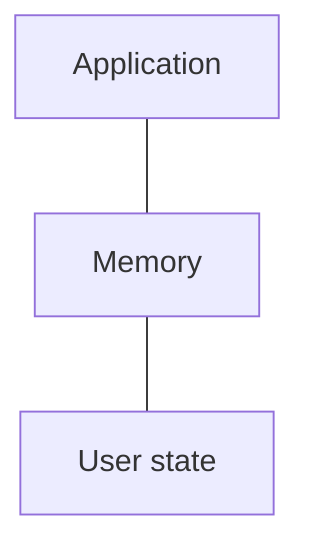

The application knows what is stored in its memory.

But when an application runs on multiple nodes:

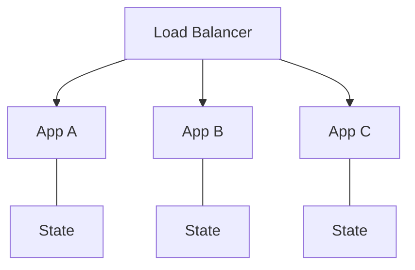

Now there are multiple places where state may exist.

The problem becomes:

> **How do these nodes know what the correct state is?**

That is the beginning of distributed-state problems.

### Simple definition

> **Distributed state is information that must be maintained, accessed, or coordinated across multiple nodes in a distributed system.**

---

# 2. Why Does State Become Difficult Across Nodes?

Consider a simple login session.

With one application server:

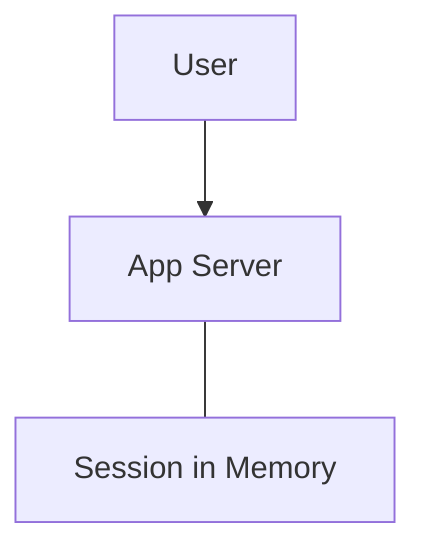

The server knows the user's session.

Now add another server:

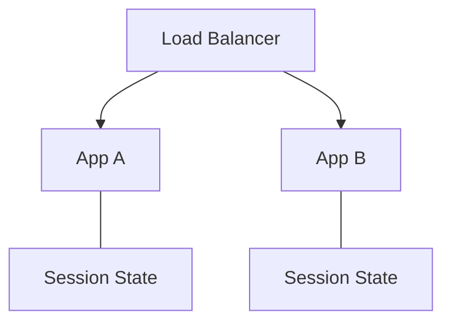

A user's first request may reach App A.

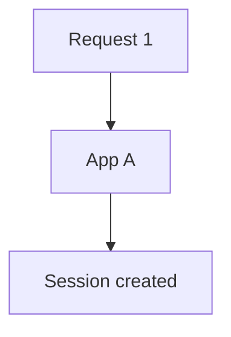

The next request may reach App B.

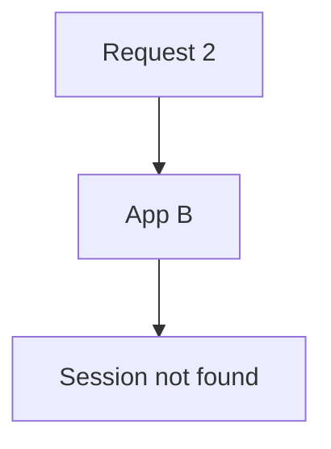

The application now has a problem.

The user's state exists on one node but not the other.

---

# 3. Local State vs Shared State

This distinction is fundamental.

## Local State

State exists only inside one node.

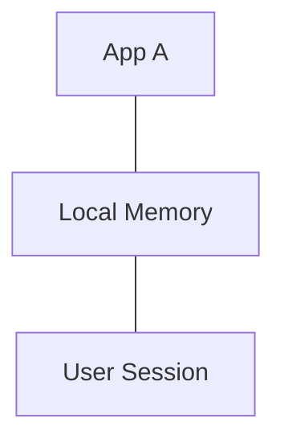

Advantages:

- Very fast
- Simple
- No network call required

Problems:

- Other nodes cannot automatically see it
- State disappears if the process restarts
- Harder to scale horizontally

---

## Shared State

State is stored somewhere accessible by multiple nodes.

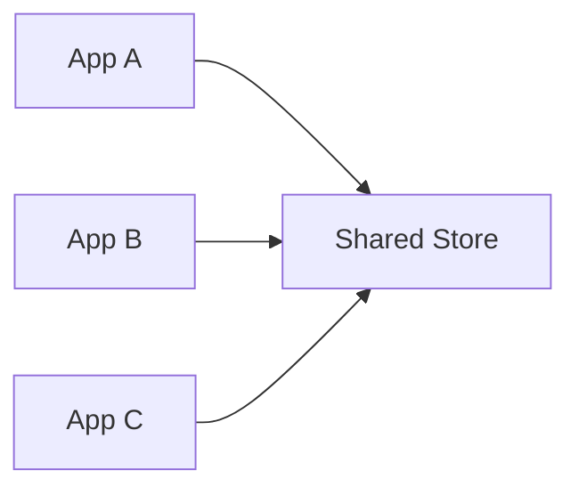

The shared store might be:

- Database
- Redis
- Distributed cache
- Object storage
- Specialized distributed data store

Now any application instance can access the state.

But a new problem appears:

> **The shared store itself becomes part of the distributed architecture.**

It must now handle:

- Availability
- Latency
- Capacity
- Failure
- Consistency
- Connections
- Scaling

Moving state out of an application does not remove the problem.

It changes **where the problem lives**.

---

# 4. State Ownership

Every important piece of state should have a clear owner.

Suppose an e-commerce system contains:

```text
Order
Payment
Inventory
User
```

A reasonable ownership model might be:

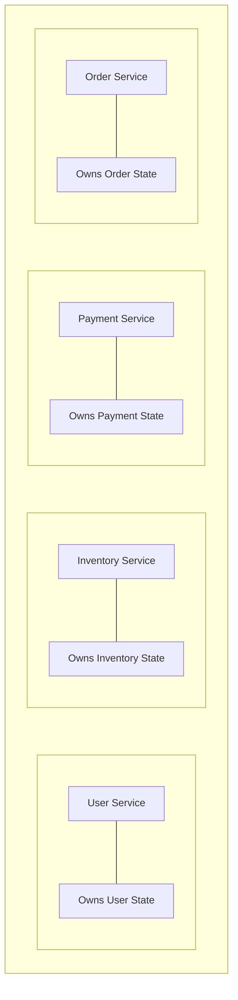

Ownership answers:

> **Which component is authoritative for this state?**

Without clear ownership, multiple services may try to modify the same information.

That creates coordination problems.

---

# 5. Source of Truth

The **source of truth** is the authoritative representation of a piece of data.

For example:

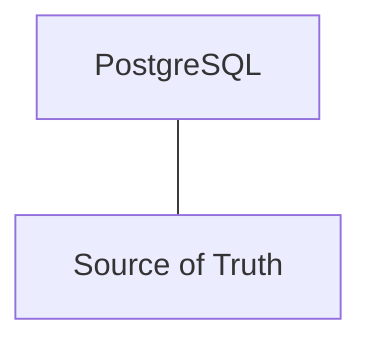

Redis might contain:

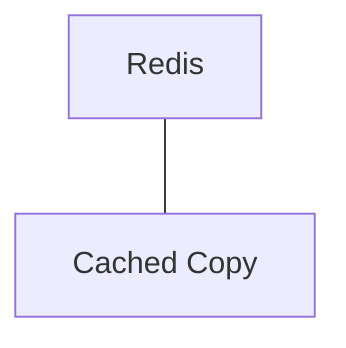

The database remains authoritative.

If Redis disappears:

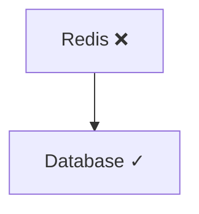

The system can rebuild the cache.

This is one reason caches are usually treated differently from primary data stores.

---

# 6. Not Every Copy Is a Source of Truth

Consider:

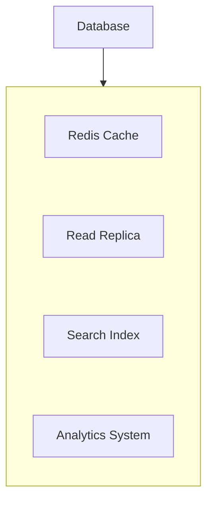

These systems may all contain information derived from the same underlying data.

But they may have different responsibilities.

| Component | Typical Role |
|---|---|
| Primary Database | Source of truth |
| Read Replica | Replicated database state |
| Redis | Cached/derived state |
| Search Index | Search-optimized derived state |
| Analytics Store | Analytical representation |

The important question is not:

> "Where does this data exist?"

It is:

> **"Which copy is authoritative?"**

---

# 7. Replicated State

Replication means maintaining copies of state on multiple nodes.

For example:

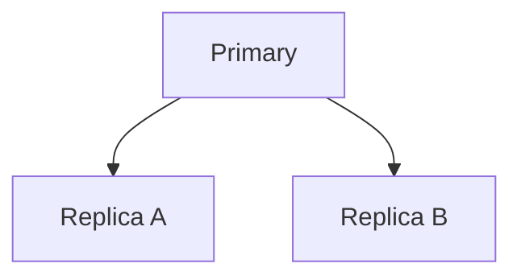

The replicas contain copies of the primary's state.

Why replicate?

- Read scaling
- Availability
- Failover
- Geographic distribution
- Fault isolation

But replication introduces a fundamental problem:

> **Copies may not become identical at exactly the same time.**

---

# 8. State Synchronization

Suppose the primary changes:

```text
Balance = ₹1,000
```

Then a transaction changes it:

```text
Balance = ₹800
```

The update must propagate.

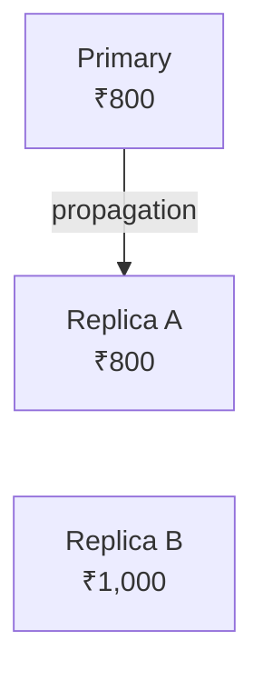

For a short period:

```text
Replica A → ₹800
Replica B → ₹1,000
```

The system contains different views of the same logical state.

Synchronization is the process of bringing those copies into alignment.

---

# 9. State Propagation

A state change usually follows some propagation path.

For example:

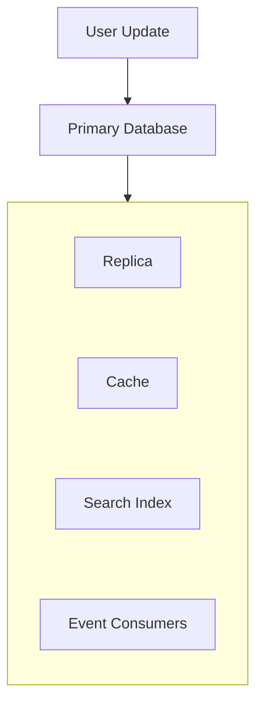

Different destinations may receive the update at different times.

This creates **propagation delay**.

That delay matters when users or services read different copies.

---

# 10. Stale State

A stale copy contains an older version of state.

Example:

```text
Primary
Stock = 0
```

But a replica still says:

```text
Replica
Stock = 1
```

The replica is stale.

This can produce real user-visible behavior.

For example:

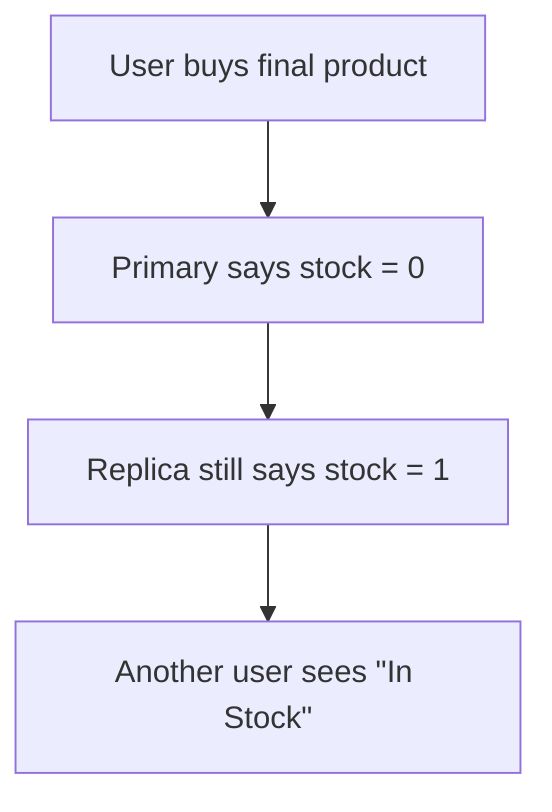

The system has a consistency problem.

---

# 11. Read-After-Write

A common distributed-state problem is:

```text
Write → Read
```

Suppose:

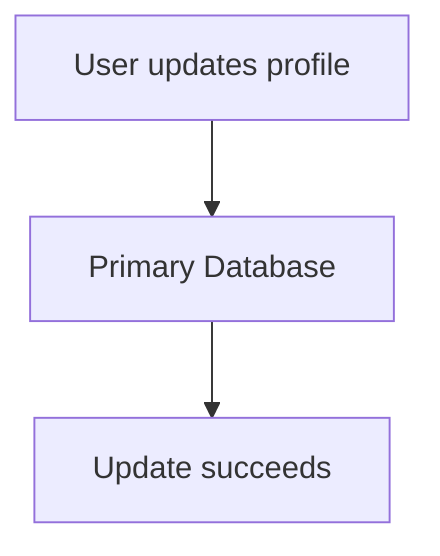

Immediately afterward:

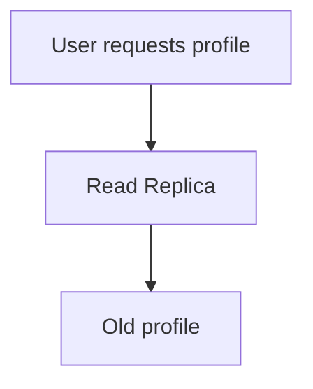

The write succeeded.

But the next read returned old state.

This is called a **read-after-write consistency problem**.

Possible solutions include:

- Read from the primary after a write
- Sticky reads
- Session-level routing
- Version-aware reads
- Waiting for replication
- Using a stronger consistency mechanism

The correct solution depends on the requirement.

---

# 12. Strong vs Eventual Consistency

Distributed state can follow different consistency models.

### Stronger consistency

After an update is accepted, subsequent reads are expected to observe the new state according to the system's consistency guarantee.

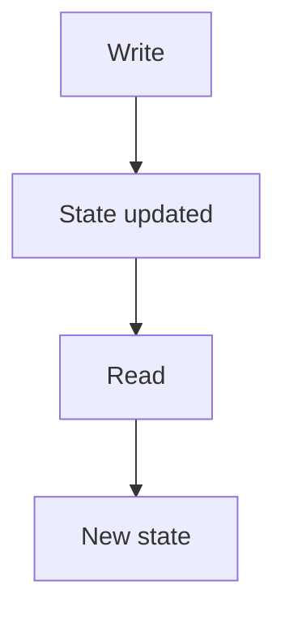

### Eventual consistency

Copies may temporarily disagree.

```mermaid
flowchart TD
  accTitle: Eventual consistency
  accDescr: Write, then Primary updated, then Propagation, then Replica updated, then Copies converge.
  N0["Write"] --> N1["Primary updated"] --> N2["Propagation"] --> N3["Replica updated"] --> N4["Copies converge"]
```

During propagation:

```text
Primary  → New
Replica  → Old
```

Later:

```text
Primary  → New
Replica  → New
```

The important question is:

> **Can the business operation tolerate temporary stale state?**

---

# 13. Conflicting Updates

Distributed state becomes even harder when multiple nodes can modify the same state.

Imagine:

```text
Node A
Balance = ₹1,000
```

and:

```text
Node B
Balance = ₹1,000
```

Both receive updates independently.

```text
Node A → ₹900
Node B → ₹700
```

What should the final value be?

```text
₹900?
₹700?
Something else?
```

The answer requires a conflict-resolution strategy.

Possible approaches include:

- Single authoritative writer
- Version numbers
- Timestamps
- Last-write-wins
- Application-specific merge rules
- Transactions
- Consensus/coordination

There is no universal conflict-resolution strategy.

---

# 14. Single Writer Can Simplify State

One way to reduce conflicts is to establish one authoritative writer.

```mermaid
flowchart TD
  accTitle: Single writer
  accDescr: Requests, then State Owner, then Data Store.
  N0["Requests"] --> N1["State Owner"] --> N2["Data Store"]
```

Other systems can consume copies.

```mermaid
flowchart TD
  accTitle: Consumers of copies
  accDescr: The state owner feeds a replica, a cache and search.
  N0["State Owner"] --> G
  subgraph G[" "]
    direction TB
    I0["Replica"] ~~~ I1["Cache"] ~~~ I2["Search"]
  end
```

This can simplify correctness.

But the owner becomes important infrastructure.

You must consider:

- Capacity
- Availability
- Failover
- Replication
- Recovery

---

# 15. Multiple Writers Increase Coordination

Consider:

```mermaid
flowchart LR
  accTitle: Multiple writers
  accDescr: Nodes A, B and C all update the same state.
  S0["Node A"] & S1["Node B"] & S2["Node C"] --> T["Same State"]
```

Now multiple nodes can update the same state.

Questions immediately appear:

- Which update wins?
- What if updates happen simultaneously?
- What if one update arrives late?
- What if a network connection fails?
- What if nodes disagree?
- How are conflicts detected?

This is why distributed state often requires coordination.

---

# 16. Stateless vs Stateful Services

This distinction is extremely important for horizontal scaling.

## Stateless Service

A stateless service does not depend on local memory from a previous request.

```mermaid
flowchart TD
  accTitle: Stateless request on App A
  accDescr: Request, then App A, then Response.
  N0["Request"] --> N1["App A"] --> N2["Response"]
```

The next request can go anywhere:

```mermaid
flowchart TD
  accTitle: Stateless request on App B
  accDescr: Request, then App B, then Response.
  N0["Request"] --> N1["App B"] --> N2["Response"]
```

This makes horizontal scaling easier.

```mermaid
flowchart TD
  accTitle: Stateless scaling
  accDescr: A load balancer in front of apps A, B and C.
  L["Load Balancer"] --> A["App A"] & B["App B"] & C["App C"]
```

---

## Stateful Service

A stateful service depends on state maintained between requests.

```mermaid
flowchart TD
  accTitle: Stateful service
  accDescr: Request 1 reaches App A, which has local state. Request 2 reaches App B: state unavailable.
  N0["Request 1"] --> N1["App A"] --> N2["Local State"]
  B0["Request 2"] --> B1["App B"] --> B2["State unavailable"]
  N2 ~~~ B0
```

Scaling becomes harder unless state is shared, replicated, or deliberately routed.

---

# 17. Moving State Out of Application Servers

A common architecture is:

```mermaid
flowchart TD
  accTitle: State outside the application servers
  accDescr: A load balancer in front of apps A, B and C, which share Redis, backed by PostgreSQL.
  L["Load Balancer"] --> A["App A"] & B["App B"] & C["App C"] --> R["Redis"] --> P["PostgreSQL"]
```

Now application servers can remain mostly stateless.

Shared state lives outside them.

This is useful for:

- Sessions
- Temporary user state
- Distributed counters
- Rate-limit state
- Cache entries
- Short-lived coordination data

But Redis or another shared store becomes part of the system's critical path.

---

# 18. Distributed State and Caching

Caching creates another copy of state.

```mermaid
flowchart TD
  accTitle: Cache as a copy
  accDescr: Database, then Redis, then Application.
  N0["Database"] --> N1["Redis"] --> N2["Application"]
```

The database may contain:

```text
Price = ₹500
```

while the cache temporarily contains:

```text
Price = ₹450
```

The cache is stale.

This is why caching requires decisions about:

- TTL
- Invalidation
- Cache population
- Freshness
- Source of truth
- Failure behavior

From the earlier caching chapters:

> **A cache is usually an optimization, not the authoritative source of business data.**

---

# 19. Distributed State and Databases

Databases can maintain distributed state through:

- Replication
- Partitioning
- Sharding
- Distributed transactions
- Consensus mechanisms
- Replicated logs

For example:

```mermaid
flowchart TD
  accTitle: Distributed database
  accDescr: The application uses a primary, which replicates to R1 and R2.
  A["Application"] --> P["Primary"] --> R1["R1"] & R2["R2"]
```

The application may see one logical database, while internally multiple machines participate.

This gives scalability or availability benefits but introduces coordination and failure considerations.

---

# 20. State Can Exist at Multiple Layers

A modern system may contain several copies:

```mermaid
flowchart TD
  accTitle: State at multiple layers
  accDescr: Browser, then CDN, then Application Cache, then Database Replica, then Primary Database.
  N0["Browser"] --> N1["CDN"] --> N2["Application Cache"] --> N3["Database Replica"] --> N4["Primary Database"]
```

A single logical piece of information may exist in all of them.

For example:

```text
Product Price

Browser      ₹500
CDN          ₹500
Redis        ₹500
Replica      ₹500
Primary      ₹500
```

After a price change:

```text
Primary      ₹550
Replica      ₹500
Redis        ₹500
CDN          ₹500
Browser      ₹500
```

For some period, different layers may show different values.

This is a **consistency chain**.

---

# 21. The More Copies You Have, the More Propagation You Need

Adding copies can improve:

- Read performance
- Availability
- Geographic latency
- Fault tolerance

But it also increases:

- Synchronization work
- Propagation paths
- Failure scenarios
- Monitoring requirements
- Stale-state possibilities

A useful mental model is:

```mermaid
flowchart TD
  accTitle: Cost of copies
  accDescr: More Copies, then More Propagation, then More Coordination, then More Failure Scenarios.
  N0["More Copies"] --> N1["More Propagation"] --> N2["More Coordination"] --> N3["More Failure Scenarios"]
```

Replication is not free.

---

# 22. Failure Scenario — State Update Succeeds, Propagation Fails

Consider:

```mermaid
flowchart TD
  accTitle: Update succeeds
  accDescr: The primary applies an update: state changed.
  P["Primary"] -->|"Update"| S["State changed ✓"]
```

But:

```mermaid
flowchart LR
  accTitle: Propagation fails
  accDescr: Propagation from the primary to the replica fails (X).
  P["Primary"] -->|"X"| R["Replica"]
```

The replica does not receive the update.

Now:

```text
Primary  → New
Replica  → Old
```

The system must decide:

- Retry propagation?
- Mark replica unhealthy?
- Stop routing reads to it?
- Rebuild the replica?
- Reconcile the state?

This is why distributed-state systems need recovery mechanisms.

---

# 23. Failure Scenario — Shared State Store Is Down

Suppose applications depend on Redis for sessions:

```mermaid
flowchart LR
  accTitle: Shared session store
  accDescr: Apps A, B and C all depend on Redis.
  S0["App A"] & S1["App B"] & S2["App C"] --> T["Redis"]
```

Redis becomes unavailable.

Now several applications may fail even though:

```text
App A ✓
App B ✓
App C ✓
```

The shared state dependency has become a system-wide dependency.

Possible responses depend on the state:

- Fail closed
- Fail open
- Use local fallback
- Re-authenticate
- Degrade functionality
- Rebuild state from another source

The correct choice depends on what the state represents.

---

# 24. Failure Scenario — Two Nodes Have Different State

Suppose:

```text
Node A → Version 10
Node B → Version 8
```

If Node B processes a request using old state, the system may produce incorrect behavior.

This is why systems may need:

- Version checks
- Compare-and-set operations
- Conditional writes
- Stronger reads
- Leader-based writes
- Conflict detection

The goal is not always to eliminate stale state.

The goal is to ensure that stale state cannot violate important business rules.

---

# 25. State Propagation Patterns

State can move through a system in different ways.

### Synchronous propagation

```mermaid
flowchart TD
  accTitle: Synchronous propagation
  accDescr: Update, then Service A, then Service B, then Response.
  N0["Update"] --> N1["Service A"] --> N2["Service B"] --> N3["Response"]
```

The caller may wait for the downstream update.

### Asynchronous propagation

```mermaid
flowchart TD
  accTitle: Asynchronous propagation
  accDescr: Update, then Source of Truth, then Event, then Queue / Broker, then Consumer, then Derived State.
  N0["Update"] --> N1["Source of Truth"] --> N2["Event"] --> N3["Queue / Broker"] --> N4["Consumer"] --> N5["Derived State"]
```

The derived state may update later.

This is common for:

- Search indexes
- Analytics
- Notifications
- Recommendation systems
- Read models

The trade-off is usually:

> **Lower coupling and better scalability in exchange for propagation delay and eventual consistency.**

---

# 26. Distributed State Does Not Mean Everything Must Be Shared

A common mistake is assuming every node should see every piece of state immediately.

That is often unnecessary.

Instead, classify state.

| State | Typical Strategy |
|---|---|
| Request-local data | Keep local |
| Temporary computation | Keep local |
| User session | Shared store or token-based design |
| Primary business data | Authoritative database |
| Cached data | Distributed/local cache |
| Search data | Derived state |
| Analytics data | Derived state |
| Critical coordination state | Strong coordination mechanism |

The goal is:

> **Share only the state that actually needs to be shared.**

---

# 27. Distributed State and Tokens

Some state can be carried by the client rather than stored on every application server.

For example:

```mermaid
flowchart TD
  accTitle: Client-held state
  accDescr: The client holds an authentication token.
  N0["Client"] --- N1["Authentication Token"]
```

Then:

```text
Request → App A
Request → App B
Request → App C
```

Each application can validate the token.

This can reduce server-side session state.

But it introduces other concerns:

- Token expiration
- Revocation
- Token size
- Sensitive information
- Key management
- Token rotation

Moving state into a token does not eliminate system-design trade-offs.

---

# 28. State and Business Criticality

Not all state needs the same consistency.

Consider:

### Product description

A few seconds of stale data may be acceptable.

### Account balance

Stale data may be dangerous.

### Inventory

Stale state may cause overselling.

### Analytics dashboard

Slightly stale data is often acceptable.

Therefore:

```mermaid
flowchart TD
  accTitle: Start from criticality
  accDescr: Business Criticality, then Consistency Requirement, then Architecture Choice.
  N0["Business Criticality"] --> N1["Consistency Requirement"] --> N2["Architecture Choice"]
```

Do not start with:

> "Should we use strong consistency?"

Start with:

> **"What can go wrong if this value is temporarily stale?"**

---

# 29. Hands-On Exercise — Model Distributed State

Let's model a simple e-commerce system.

### Architecture

```mermaid
flowchart TD
  accTitle: Exercise architecture
  accDescr: A load balancer in front of apps A, B and C, which share Redis, backed by the database.
  L["Load Balancer"] --> A["App A"] & B["App B"] & C["App C"] --> R["Redis"] --> D["Database"]
```

### Scenario

A user adds an item to a shopping cart.

Answer these questions:

### Question 1

Where should the authoritative cart state live?

A reasonable answer:

```text
Shared Store / Database
```

depending on the application's design and durability requirements.

### Question 2

Why shouldn't the cart exist only in App A memory?

Because the next request may reach App B.

```text
Request 1 → App A → Cart exists

Request 2 → App B → Cart missing
```

### Question 3

What happens if Redis is used as the cart store and Redis fails?

The system needs a defined failure strategy.

For example:

```text
Redis failure
     ↓
Fallback to durable store
     OR
Temporarily disable cart operation
     OR
Degrade functionality
```

The correct answer depends on the architecture.

---

# 30. Lab Challenge — Identify the Source of Truth

Consider:

```mermaid
flowchart TD
  accTitle: Lab architecture
  accDescr: Primary DB, then Redis, then Search Index, then Analytics.
  N0["Primary DB"] --> N1["Redis"] --> N2["Search Index"] --> N3["Analytics"]
```

The product price is:

```text
Primary DB = ₹500
Redis      = ₹500
Search     = ₹500
Analytics  = ₹500
```

The price changes to ₹550.

After a short delay:

```text
Primary DB = ₹550
Redis      = ₹550
Search     = ₹500
Analytics  = ₹500
```

Answer:

1. Which system should normally be treated as the source of truth?
2. Which systems are stale?
3. Why might the system temporarily allow this?
4. Which user-facing operations can tolerate stale data?
5. Which operations should read authoritative state?

### Expected reasoning

```mermaid
flowchart TD
  accTitle: Expected reasoning
  accDescr: Source of truth: Primary DB. Derived copies: Redis / Search / Analytics.
  N0["Source of Truth"] --> N1["Primary DB"]
  B0["Derived Copies"] --> B1["Redis / Search / Analytics"]
  N1 ~~~ B0
```

The important lesson is not that every copy must update instantly.

The important lesson is that the system must know:

> **Which state is authoritative and how much staleness each consumer can safely tolerate.**

---

# 31. Common Mistakes

### Mistake 1 — Treating every copy as authoritative

Copies can be stale or derived.

### Mistake 2 — Keeping important state only in application memory

Horizontal scaling can make that state inaccessible to other instances.

### Mistake 3 — Assuming replication means instant synchronization

Replication can have propagation delay.

### Mistake 4 — Assuming shared storage solves everything

The shared store introduces another dependency and failure domain.

### Mistake 5 — Sharing all state

Only state that actually needs coordination should be shared.

### Mistake 6 — Ignoring ownership

Multiple writers without clear ownership can create conflicts.

### Mistake 7 — Treating stale state as automatically wrong

Some systems can safely tolerate temporary staleness.

### Mistake 8 — Using strong consistency everywhere

Stronger guarantees can increase coordination, latency, or availability costs.

### Mistake 9 — Forgetting recovery

A propagation mechanism is incomplete if the system does not know how to recover failed updates.

### Mistake 10 — Confusing database consistency with system-wide consistency

A database transaction can commit successfully while:

- cache remains stale
- replica remains behind
- search index remains old
- analytics remains delayed.

---

# 32. System Design View

Distributed state forces you to answer several fundamental questions.

```mermaid
flowchart TD
  accTitle: Distributed state questions
  accDescr: Distributed state: ownership (who owns?), copies (why copy?), propagation (how update?); together they lead to consistency, then failure handling.
  D["Distributed State"] --> W
  subgraph W[" "]
    direction TB
    subgraph W0[" "]
      direction LR
      WA0["Ownership"] --> WB0["Who owns?"]
    end
    subgraph W1[" "]
      direction LR
      WA1["Copies"] --> WB1["Why copy?"]
    end
    subgraph W2[" "]
      direction LR
      WA2["Propagation"] --> WB2["How update?"]
    end
    W0 ~~~ W1 ~~~ W2
  end
  W --> K["Consistency"] --> F["Failure Handling"]
```

A strong design does not simply ask:

> "Where should we store this?"

It asks:

> **"Who owns this state, who needs it, how many copies exist, how are they synchronized, and what happens when they disagree?"**

---

# 33. A Practical Decision Framework

When designing distributed state:

### Step 1 — Identify the state

What information needs to survive between requests?

### Step 2 — Identify the owner

Which component is authoritative?

### Step 3 — Identify access requirements

Who needs to read it?

### Step 4 — Identify writers

Who is allowed to modify it?

### Step 5 — Minimize unnecessary copies

Do you actually need replication or caching?

### Step 6 — Define freshness

How stale can a copy safely be?

### Step 7 — Define propagation

How does the state move?

```text
Synchronous?
Asynchronous?
Event-driven?
Replication?
```

### Step 8 — Define failure behavior

What happens if propagation fails?

### Step 9 — Define conflict behavior

What happens if two updates disagree?

### Step 10 — Measure the system

Monitor:

- Replication lag
- Cache freshness
- Propagation delay
- Failed updates
- Conflicts
- Recovery time
- Stale reads

---

# 34. Key Principle

> **Distributed state is difficult because the same logical information may exist across multiple independent nodes, and those copies may not update at the same time. Good system design establishes clear ownership and a source of truth, minimizes unnecessary shared state, defines how state propagates, chooses an appropriate consistency model, and explicitly handles stale data, conflicts, and failures.**

---

# 35. Quick Reference

| Concept | Key Idea |
|---|---|
| Local State | Exists inside one node |
| Shared State | Accessible by multiple nodes |
| State Owner | Component responsible for authoritative state |
| Source of Truth | Authoritative representation |
| Replication | Copies state across nodes |
| Synchronization | Keeps copies aligned |
| Stale State | Older copy of state |
| Conflict | Competing updates disagree |
| Propagation | Moving updates between components |
| Strong Consistency | Stronger guarantees about what reads observe |
| Eventual Consistency | Copies may temporarily differ and later converge |
| Stateless | No dependence on local state between requests |
| Stateful | Depends on maintained state |
| Cache | Usually a derived/temporary copy |
| Database | Often the authoritative store |
| Distributed State | State coordinated across multiple nodes |

---

# 36. Knowledge Check

### 1. What is distributed state?

State that must be maintained, accessed, or coordinated across multiple nodes.

### 2. Why is local application state difficult with horizontal scaling?

Because different requests can reach different application instances.

### 3. What is a source of truth?

The authoritative representation of a piece of state.

### 4. Does replication guarantee that all copies are immediately identical?

No.

### 5. What is stale state?

A copy that is older than the latest authoritative state.

### 6. Why is state ownership important?

It establishes which component is responsible for authoritative updates.

### 7. Why can caching create consistency problems?

Because cached data can remain older than the source of truth.

### 8. Does shared storage eliminate distributed-state problems?

No. It introduces another shared dependency that must itself be reliable and scalable.

### 9. Why can multiple writers create conflicts?

Because independent nodes may update the same state concurrently or in different orders.

### 10. What is the most important question when designing distributed state?

> **Who owns the state, and what happens when different copies disagree?**

---

# 37. Remember

> **A distributed system can have many copies of state, but it should still have a clear answer to: "Which state is authoritative?"**

---

# Next Chapter

## 06.03 — Partial Failure

Next we examine one of the defining problems of distributed systems:

> **What happens when part of the system fails while the rest of the system continues running?**

Topics include:

- What partial failure means
- Why partial failure is different from total failure
- Node failure
- Network failure
- Timeout vs failure
- Failure detection
- Dependency failure
- Cascading failure
- Partial availability
- Failure isolation
- Retry interaction
- Circuit breakers
- Graceful degradation
- Health checks
- Failure domains
- Recovery strategies
- Hands-on partial-failure exercise
- System-design trade-offs
