# 06.03 — Partial Failure

## Learning Objectives

By the end of this chapter, you should understand:

- What **partial failure** means
- Why partial failure is fundamental to distributed systems
- The difference between total and partial failure
- Node, network, and dependency failures
- Why a timeout does not always mean an operation failed
- Why failure detection is difficult
- How partial failures propagate
- Cascading failures
- Failure isolation and blast radius
- Partial availability
- How retries can make failures worse
- Circuit breakers and graceful degradation
- Health checks and failure detection
- Failure domains
- Recovery strategies
- How to reason about partial failure during system design

---

# Beginner Vocabulary

| Term | Beginner-Friendly Meaning |
|---|---|
| **Partial Failure** | Some part of a system fails while other parts continue working |
| **Total Failure** | The entire system or service becomes unavailable |
| **Node Failure** | A server, process, container, or machine stops working |
| **Network Failure** | Components cannot communicate correctly |
| **Timeout** | An operation took longer than the allowed waiting period |
| **Failure Detection** | Determining whether a component is actually unavailable |
| **Dependency** | Another component a service relies on |
| **Cascading Failure** | One failure causes additional failures elsewhere |
| **Blast Radius** | The amount of the system affected by a failure |
| **Failure Domain** | Components that can fail together |
| **Failover** | Moving work from a failed component to another component |
| **Degradation** | Continuing with reduced functionality |
| **Circuit Breaker** | Mechanism that temporarily stops calls to an failing dependency |
| **Health Check** | Test used to determine whether a component is usable |
| **Retry** | Attempting an operation again after failure |
| **Recovery** | Returning a failed component or service to a healthy state |
| **Partial Availability** | Some operations work while others do not |
| **Dependency Failure** | A required downstream service becomes unavailable |

---

# 1. What Is Partial Failure?

In a simple system:

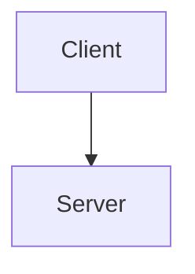

If the server fails:

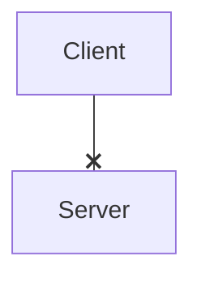

The situation is relatively easy to understand.

The server is unavailable.

But distributed systems contain multiple components:

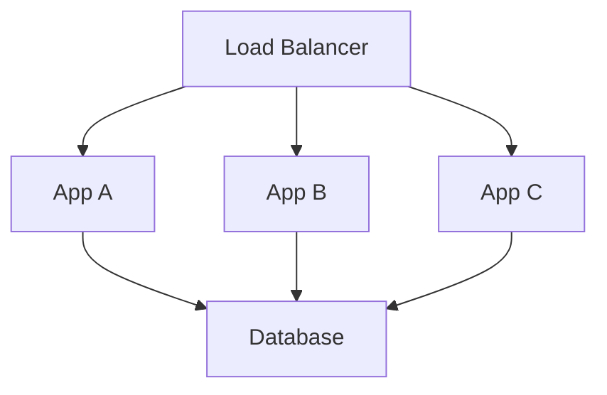

Now imagine:

```text
App A ✓
App B ✓
App C ❌
Database ✓
```

The system is not completely down.

Only part of it has failed.

This is **partial failure**.

### Definition

> **Partial failure occurs when some components of a distributed system fail while other components continue operating.**

This is one of the defining challenges of distributed systems.

---

# 2. Total Failure vs Partial Failure

## Total Failure

The whole service is unavailable.

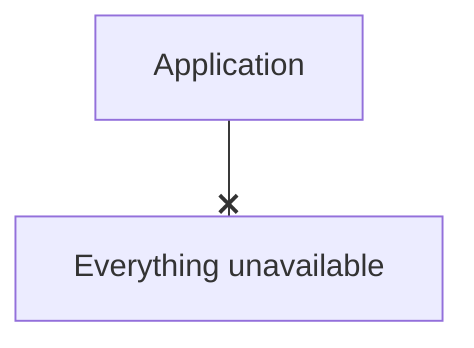

The system has one obvious state:

```text
DOWN
```

## Partial Failure

Some components work and others do not.

```text
App A ✓
App B ✓
App C ❌
DB    ✓
Cache ❌
```

Now the system may be:

```text
Partially available
```

The difficult question becomes:

> **What should the healthy components do when another component is failing?**

---

# 3. Why Partial Failure Is Fundamental

In a single process:

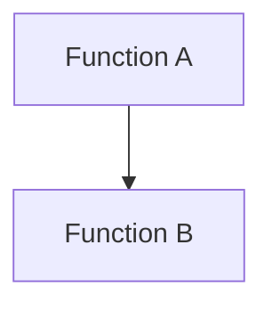

The call between them is usually local.

In a distributed system:

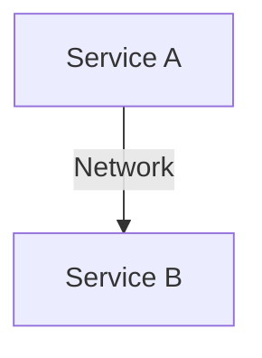

The call can fail because of:

- Service B crashing
- Network failure
- DNS failure
- Connection failure
- Packet loss
- Congestion
- Service overload
- Firewall/routing problems
- Service B becoming extremely slow

Therefore:

> **A distributed system cannot assume that a failed communication attempt tells the complete story about what happened.**

---

# 4. The Classic Timeout Problem

Consider:

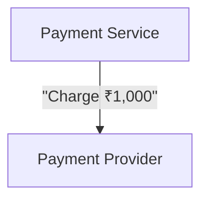

The provider processes the payment.

But the response is lost:

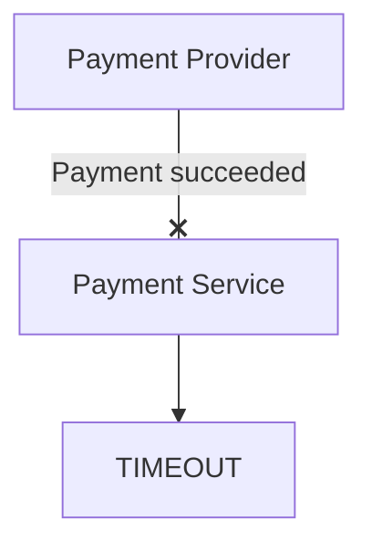

What does the timeout mean?

It could mean:

```text
1. Payment failed.
2. Payment succeeded but response was lost.
3. Payment is still processing.
4. Payment provider is overloaded.
5. Network path failed.
```

The caller does not automatically know which one happened.

This is a fundamental distributed-systems problem:

> **Uncertainty is not the same as failure.**

---

# 5. Failure Detection Is Difficult

Suppose App A sends a request to App B.

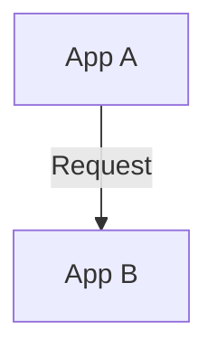

App B does not respond.

App A might conclude:

```text
"App B is down."
```

But App B might actually be:

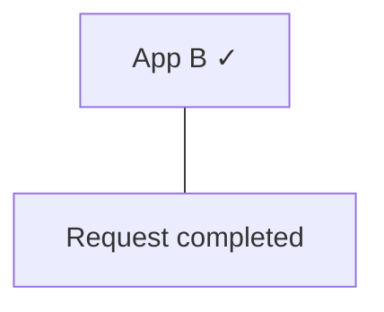

while the response was lost.

Or:

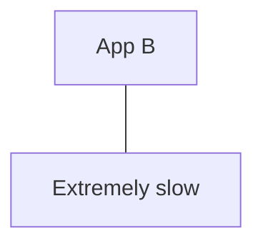

Or:

```text
Network
   |
   X
```

App A cannot directly observe the complete state of App B.

It only observes:

> **"I did not receive a response within my deadline."**

---

# 6. Failure Is Not Binary

A dependency can exist in many states:

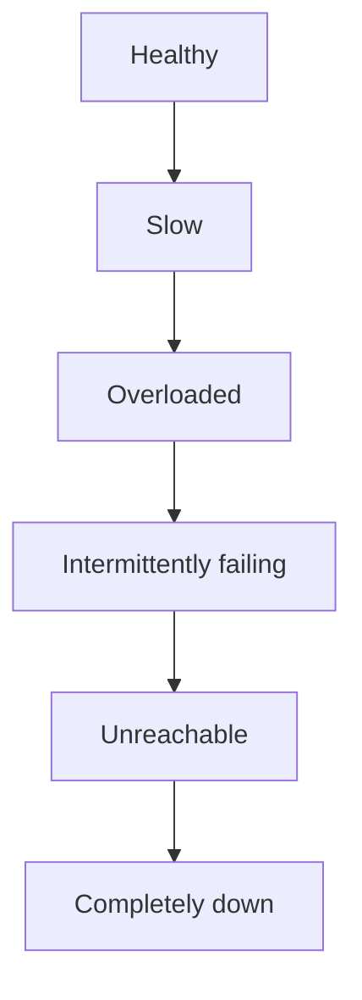

A system that treats everything as simply:

```text
UP / DOWN
```

may make poor decisions.

For example, sending more requests to a slow dependency can make the situation worse.

---

# 7. Node Failure

A node can fail independently.

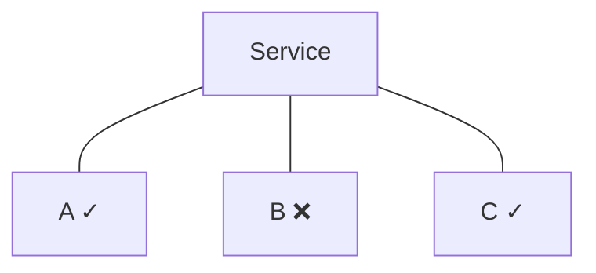

Possible causes:

- Process crash
- Out-of-memory condition
- Machine failure
- Container termination
- Deployment problem
- Disk failure
- Kernel failure
- Resource exhaustion

A resilient system should prevent one failed node from taking down the entire service.

This is why systems often use multiple instances.

---

# 8. Network Failure

The application nodes may still be healthy.

But communication can fail.

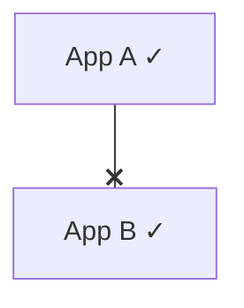

Both services are alive.

They simply cannot communicate correctly.

This is important because:

> **A distributed system can fail even when every individual machine is still running.**

Network problems can include:

- Packet loss
- Connection resets
- Routing problems
- DNS failures
- Firewall issues
- Network partitions
- Extreme latency
- Congestion

---

# 9. Dependency Failure

An application may depend on many services:

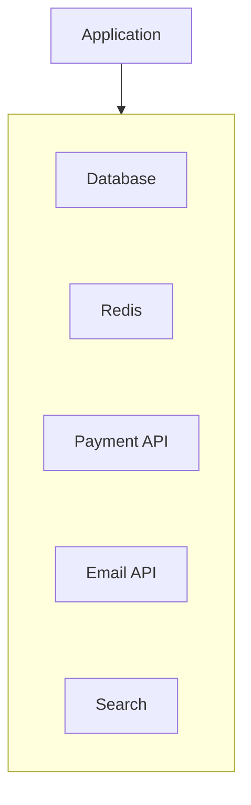

Suppose the payment provider fails:

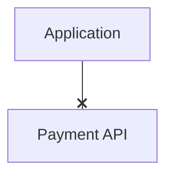

Does the entire application need to fail?

Usually not.

The system should determine which functionality depends on payment.

For example:

```text
Browse Products     ✓
View Cart           ✓
View Orders         ✓
Start Payment       ❌
```

This is **partial availability**.

---

# 10. Partial Availability

A well-designed system can continue providing useful functionality even when some dependencies fail.

For example:

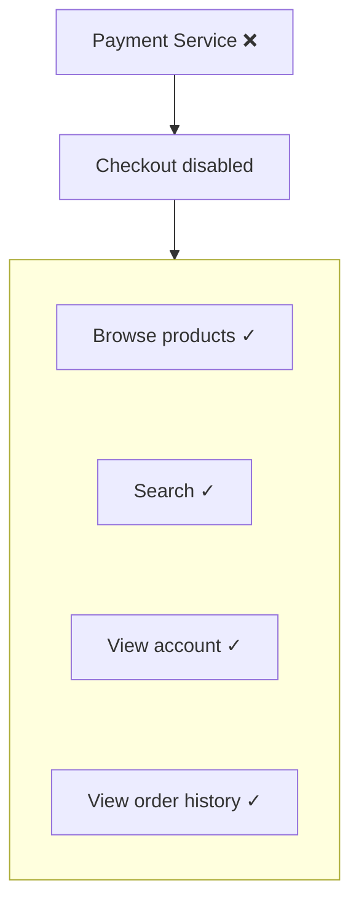

This is better than:

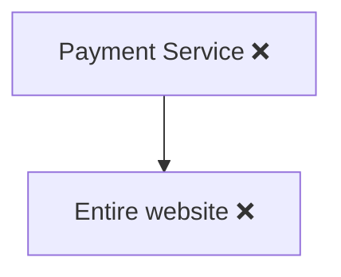

The goal is not always:

> "Everything must continue working."

A more practical goal is:

> **Keep important functionality available while isolating failed functionality.**

---

# 11. Failure Isolation

Failure isolation means preventing a problem in one component from spreading unnecessarily.

Consider:

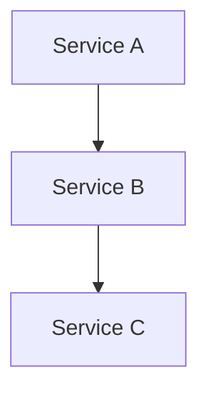

If B becomes slow:

```text
A → B → C
```

A may start accumulating requests.

Then:

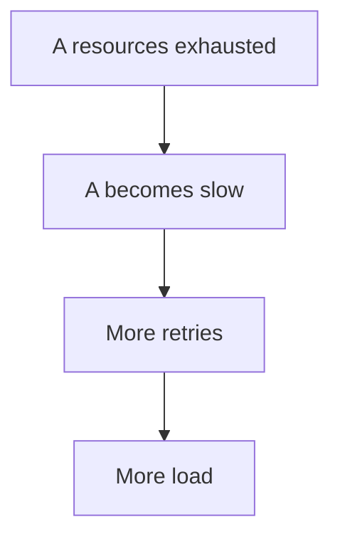

A local problem becomes a system-wide problem.

Good architecture limits this propagation.

---

# 12. Blast Radius

The **blast radius** describes how much of the system is affected by a failure.

### Large blast radius

```mermaid
flowchart TD
  accTitle: Large blast radius
  accDescr: One dependency failure, then All services affected, then Entire system unavailable.
  N0["One dependency failure"] --> N1["All services affected"] --> N2["Entire system unavailable"]
```

### Small blast radius

```mermaid
flowchart TD
  accTitle: Small blast radius
  accDescr: One dependency failure, then One feature affected, then Other features continue.
  N0["One dependency failure"] --> N1["One feature affected"] --> N2["Other features continue"]
```

System design often aims to reduce blast radius.

---

# 13. Failure Domains

A failure domain is a group of components that can fail together.

Examples:

```text
Single machine
Single availability zone
Single region
Single network segment
Single database cluster
```

For example:

```mermaid
flowchart TD
  accTitle: Region as a failure domain
  accDescr: Region A holds App A, DB A and Cache A.
  subgraph R["Region A"]
    direction TB
    I0["App A"] ~~~ I1["DB A"] ~~~ I2["Cache A"]
  end
```

If the entire region fails, everything inside that failure domain may fail together.

This is why redundancy across independent failure domains can improve resilience.

---

# 14. Redundancy Does Not Automatically Mean Resilience

Suppose you have:

```text
App A
App B
App C
```

But all three run on the same physical machine.

```mermaid
flowchart TD
  accTitle: One physical machine
  accDescr: Apps A, B and C all run on one physical machine.
  subgraph M["Physical Machine"]
    direction TB
    I0["App A"] ~~~ I1["App B"] ~~~ I2["App C"]
  end
```

If the machine fails:

```text
App A ❌
App B ❌
App C ❌
```

Three instances did not provide three independent failure domains.

The architecture had redundancy but poor failure isolation.

---

# 15. Health Checks

A health check attempts to answer:

> **"Can this component safely receive work?"**

For example:

```mermaid
flowchart TD
  accTitle: Health checks
  accDescr: The load balancer routes to App A and App B (healthy) and App C (unhealthy).
  N0["Load Balancer"] --> G
  subgraph G[" "]
    direction TB
    I0["App A ✓"] ~~~ I1["App B ✓"] ~~~ I2["App C ❌"]
  end
```

The load balancer can stop sending new requests to App C.

But health checks have limits.

A process can respond:

```text
HTTP 200 OK
```

while its database connection is broken.

So there can be different levels of health.

### Liveness

> Is the process running?

### Readiness

> Is the process currently able to handle traffic?

These are different questions.

---

# 16. Health Is More Than "Process Is Running"

Consider:

```text
Application Process ✓
Database Connection ❌
```

The process is alive.

But it may not be ready for requests that require the database.

Similarly:

```text
Application ✓
Database ✓
External Payment API ❌
```

The application may still serve browsing requests.

Therefore health should be related to the work the component is expected to perform.

---

# 17. Timeouts

Timeouts limit how long a system waits.

Example:

```mermaid
flowchart TD
  accTitle: Timeout
  accDescr: The application sends a request to the database; no response (X) after 2 seconds becomes a timeout.
  A["Application"] -->|"Request"| D["Database"] --x|"No response"| W["2 seconds"] --> T["Timeout"]
```

Without a timeout, a request might wait indefinitely.

That can consume:

- Threads
- Connections
- Memory
- Worker capacity
- Queue slots

Eventually the application itself may become overloaded.

Therefore:

> **Timeouts are a failure-containment mechanism, not merely a user-experience setting.**

---

# 18. Timeouts Must Match the Operation

A timeout that is too short:

```text
Request normally takes 500ms
Timeout = 100ms
```

creates false failures.

A timeout that is too long:

```text
Request normally takes 500ms
Timeout = 60 seconds
```

can hold resources unnecessarily.

Timeout design should consider:

- Expected latency
- Network latency
- Dependency behavior
- Request importance
- Overall user deadline
- Retry strategy

---

# 19. Retries Can Amplify Partial Failures

Suppose a service receives:

```text
100 requests/sec
```

The dependency becomes slow.

Requests start timing out.

The caller retries:

```text
100 original requests
+
100 retries
=
200 requests/sec
```

Now the dependency receives more traffic precisely when it is already struggling.

This is **retry amplification**.

If multiple services retry:

```mermaid
flowchart TD
  accTitle: Retries at every layer
  accDescr: Service A retries Service B, which retries Service C, which retries the database.
  N0["Service A"] -->|"retry"| N1["Service B"] -->|"retry"| N2["Service C"] -->|"retry"| N3["Database"]
```

the load can multiply.

This can turn a partial failure into a cascading failure.

---

# 20. Cascading Failure

A cascading failure occurs when one failing or overloaded component causes additional components to fail.

Example:

```mermaid
flowchart TD
  accTitle: Cascading failure
  accDescr: Payment API slows, then Checkout requests wait, then Application workers fill up, then Request queue grows, then Timeouts increase, then Retries increase, then Application becomes overloaded, then More failures.
  N0["Payment API slows"] --> N1["Checkout requests wait"] --> N2["Application workers fill up"] --> N3["Request queue grows"] --> N4["Timeouts increase"] --> N5["Retries increase"] --> N6["Application becomes overloaded"] --> N7["More failures"]
```

One dependency problem has spread through the system.

---

# 21. Circuit Breaker

A circuit breaker helps prevent repeated calls to a failing dependency.

Conceptually:

```mermaid
flowchart TD
  accTitle: Circuit breaker
  accDescr: Application, then Circuit Breaker, then Payment Service.
  N0["Application"] --> N1["Circuit Breaker"] --> N2["Payment Service"]
```

Normal:

```mermaid
flowchart TD
  accTitle: Circuit closed
  accDescr: Circuit CLOSED, then Requests allowed.
  N0["Circuit CLOSED"] --> N1["Requests allowed"]
```

After repeated failures:

```mermaid
flowchart TD
  accTitle: Circuit open
  accDescr: Circuit open: requests blocked (X).
  A["Circuit OPEN"] --x B["Requests blocked"]
```

After a waiting period:

```mermaid
flowchart TD
  accTitle: Circuit half-open
  accDescr: Circuit HALF-OPEN, then Test request.
  N0["Circuit HALF-OPEN"] --> N1["Test request"]
```

If the dependency recovers:

```mermaid
flowchart TD
  accTitle: Dependency recovered
  accDescr: HALF-OPEN, then CLOSED.
  N0["HALF-OPEN"] --> N1["CLOSED"]
```

If it is still failing:

```mermaid
flowchart TD
  accTitle: Still failing
  accDescr: HALF-OPEN, then OPEN.
  N0["HALF-OPEN"] --> N1["OPEN"]
```

The goal is not to fix the dependency.

The goal is to prevent the caller from continuously overwhelming it.

---

# 22. Graceful Degradation

Graceful degradation means providing reduced functionality when part of the system is unavailable.

For example:

```mermaid
flowchart TD
  accTitle: Graceful degradation
  accDescr: Recommendation Service ❌, then Show products without recommendations.
  N0["Recommendation Service ❌"] --> N1["Show products without recommendations"]
```

Instead of:

```mermaid
flowchart TD
  accTitle: Without degradation
  accDescr: Recommendation Service ❌, then Entire product page ❌.
  N0["Recommendation Service ❌"] --> N1["Entire product page ❌"]
```

Other examples:

- Show cached data
- Disable optional features
- Queue non-critical work
- Return partial results
- Use a fallback provider
- Temporarily disable expensive functionality

The fallback must be safe.

---

# 23. Not Everything Should Have a Fallback

Suppose payment authorization fails.

A dangerous fallback would be:

```mermaid
flowchart TD
  accTitle: A dangerous fallback
  accDescr: Payment Service ❌, then Assume payment succeeded.
  N0["Payment Service ❌"] --> N1["Assume payment succeeded"]
```

That can create financial inconsistency.

A safer behavior may be:

```mermaid
flowchart TD
  accTitle: A safer behavior
  accDescr: Payment Service ❌, then Tell user payment cannot currently be completed.
  N0["Payment Service ❌"] --> N1["Tell user payment cannot currently be completed"]
```

Therefore:

> **Graceful degradation should preserve correctness, not merely availability.**

---

# 24. Failure Isolation vs Failure Hiding

There is an important difference.

### Failure isolation

The failure is contained.

```mermaid
flowchart TD
  accTitle: Failure isolation
  accDescr: Search ❌, then Search unavailable, then Checkout still works.
  N0["Search ❌"] --> N1["Search unavailable"] --> N2["Checkout still works"]
```

### Failure hiding

The system pretends everything is fine.

```mermaid
flowchart TD
  accTitle: Failure hiding
  accDescr: Payment ❌, then Pretend payment succeeded.
  N0["Payment ❌"] --> N1["Pretend payment succeeded"]
```

That is dangerous.

Good resilience makes failures **contained and understandable**, not invisible at any cost.

---

# 25. Partial Failure and Queues

Queues can isolate producers from temporarily unavailable consumers.

```mermaid
flowchart TD
  accTitle: Worker down
  accDescr: The producer sends to the queue; the worker is down (X).
  P["Producer"] --> Q["Queue"] --x W["Worker"]
```

The worker is down.

Messages remain in the queue if the queue is durable and configured appropriately.

When the worker recovers:

```mermaid
flowchart TD
  accTitle: Worker recovers
  accDescr: Queue, then Worker, then Process backlog.
  N0["Queue"] --> N1["Worker"] --> N2["Process backlog"]
```

This is useful for work that does not need immediate completion.

But queue growth must be monitored.

A queue does not make a permanently failed consumer healthy.

---

# 26. Partial Failure and Databases

Consider:

```mermaid
flowchart TD
  accTitle: Replica failure
  accDescr: The application uses a healthy primary and a failed replica.
  A["Application"] --> P["Primary ✓"] & R["Replica ❌"]
```

The application may route suitable reads to another healthy replica.

Or:

```text
Replica A ❌
Replica B ✓
Primary ✓
```

The system can continue.

But if the primary fails:

```text
Primary ❌
Replica A ✓
Replica B ✓
```

the system may need failover and promotion.

This connects directly to:

- Database replication
- Primary/replica architecture
- Failover
- Consistency

---

# 27. Partial Failure and Caches

Suppose:

```mermaid
flowchart TD
  accTitle: Application and Redis
  accDescr: Application, then Redis.
  N0["Application"] --> N1["Redis"]
```

Redis fails.

The application may be able to fall back to the database:

```mermaid
flowchart TD
  accTitle: Falling back to the database
  accDescr: Redis has failed; the application falls back to the database.
  A["Application"] --> R["Redis ❌"] & D["Database ✓"]
```

But this may dramatically increase database traffic.

For example:

```text
Normal:

Application → Redis → Database

Redis failure:

Application ─────────→ Database
```

If thousands of requests suddenly bypass Redis, the database may become overloaded.

Therefore:

> **A cache failure can become a database failure if fallback traffic is not controlled.**

---

# 28. Partial Failure and Load Balancers

Suppose:

```mermaid
flowchart TD
  accTitle: In-flight requests
  accDescr: The load balancer routes to App A (up), App B (down) and App C (up).
  N0["Load Balancer"] --> G
  subgraph G[" "]
    direction TB
    I0["App A ✓"] ~~~ I1["App B ❌"] ~~~ I2["App C ✓"]
  end
```

The load balancer should stop routing new traffic to unhealthy App B.

But what happens to requests already being processed?

They may:

- Complete
- Timeout
- Fail
- Be retried
- Be disconnected

Health checks primarily affect future routing.

They do not magically repair requests already in progress.

---

# 29. Failure During a Write

Distributed failure becomes especially dangerous during state-changing operations.

Consider:

```mermaid
flowchart TD
  accTitle: Creating an order
  accDescr: The application asks the order service to create an order, which saves it to the database.
  N0["Application"] -->|"Create Order"| N1["Order Service"] -->|"Save order"| N2["Database"]
```

Suppose the database commits:

```text
Order created ✓
```

but the response is lost:

```mermaid
flowchart TD
  accTitle: Success is lost
  accDescr: The database's success response is lost (X); the application times out.
  D["Database"] --x|"Success"| A["Application"] --> T["Timeout"]
```

The application may not know whether the order exists.

If it blindly retries:

```mermaid
flowchart TD
  accTitle: Blind retry
  accDescr: Retry, then Create another order.
  N0["Retry"] --> N1["Create another order"]
```

it could create a duplicate.

This is why partial failure connects directly to:

- Idempotency
- Transactions
- Request IDs
- Unique constraints
- Retry design

---

# 30. Failure Isolation Strategies

Common strategies include:

| Strategy | Purpose |
|---|---|
| Timeouts | Stop waiting indefinitely |
| Retries | Recover from temporary failures |
| Backoff | Reduce retry pressure |
| Circuit Breaker | Stop repeatedly calling failing dependency |
| Rate Limiting | Control incoming work |
| Bulkheads | Prevent one workload from consuming all resources |
| Queues | Buffer asynchronous work |
| Health Checks | Avoid sending work to unhealthy nodes |
| Failover | Move work to another component |
| Graceful Degradation | Continue with reduced functionality |
| Caching | Reduce dependency pressure |
| Idempotency | Make repeated operations safe |

These mechanisms solve different problems.

They are not interchangeable.

---

# 31. Bulkhead Isolation

A **bulkhead** limits how much one workload can consume.

Imagine one application serving:

```text
Checkout
Search
Reports
Notifications
```

Without isolation:

```mermaid
flowchart TD
  accTitle: Without isolation
  accDescr: Slow Reports, then Consumes all workers, then Checkout becomes slow.
  N0["Slow Reports"] --> N1["Consumes all workers"] --> N2["Checkout becomes slow"]
```

With separate resource limits:

```mermaid
flowchart TD
  accTitle: Bulkheads
  accDescr: The application has separate checkout, search, report and notification pools.
  N0["Application"] --> G
  subgraph G[" "]
    direction TB
    I0["Checkout Pool"] ~~~ I1["Search Pool"] ~~~ I2["Report Pool"] ~~~ I3["Notification Pool"]
  end
```

A report spike cannot consume every resource.

This reduces blast radius.

---

# 32. Failure Domains and Architecture

A multi-region design may look like:

```mermaid
flowchart TD
  accTitle: Multi-region design
  accDescr: Global routing sends traffic to Region A and Region B, both healthy.
  G["Global Routing"] --> A["Region A ✓"] & B["Region B ✓"]
```

This can reduce the impact of a regional failure.

But it introduces additional distributed-state and consistency complexity.

More redundancy is not automatically better.

---

# 33. A Practical Failure Investigation

When something fails, do not immediately restart everything.

Use a structured process:

```mermaid
flowchart TD
  accTitle: Failure investigation
  accDescr: Observe, then Identify affected component, then Check node health, then Check network, then Check dependency health, then Check latency/timeouts, then Check queue/backlog, then Check retries, then Check resource saturation, then Determine blast radius, then Contain failure, then Recover, then Measure again.
  N0["Observe"] --> N1["Identify affected component"] --> N2["Check node health"] --> N3["Check network"] --> N4["Check dependency health"] --> N5["Check latency/timeouts"] --> N6["Check queue/backlog"] --> N7["Check retries"] --> N8["Check resource saturation"] --> N9["Determine blast radius"] --> N10["Contain failure"] --> N11["Recover"] --> N12["Measure again"]
```

The goal is to distinguish:

```text
Root failure
```

from:

```text
Symptoms
```

---

# 34. Hands-On Exercise — Simulate Partial Failure

Consider:

```mermaid
flowchart TD
  accTitle: Exercise architecture
  accDescr: A load balancer in front of App A and App B, which share Redis, backed by the database.
  L["Load Balancer"] --> A["App A"] & B["App B"] --> R["Redis"] --> D["Database"]
```

### Scenario

Redis becomes unavailable.

Answer:

### 1. Which components are still healthy?

Potentially:

```text
Load Balancer ✓
App A ✓
App B ✓
Database ✓
Redis ❌
```

### 2. What happens if applications fall back directly to the database?

```mermaid
flowchart LR
  accTitle: Fallback to the database
  accDescr: App A and App B both go straight to the database.
  S0["App A"] & S1["App B"] --> T["Database"]
```

Database traffic increases.

### 3. What could happen next?

```mermaid
flowchart TD
  accTitle: What could happen next
  accDescr: Redis failure, then Cache misses, then Database traffic increases, then Database becomes overloaded, then Database latency increases, then Application requests timeout.
  N0["Redis failure"] --> N1["Cache misses"] --> N2["Database traffic increases"] --> N3["Database becomes overloaded"] --> N4["Database latency increases"] --> N5["Application requests timeout"]
```

A partial failure has become a cascading failure.

### 4. What could reduce the impact?

Possible strategies:

- Rate-limit fallback traffic
- Serve safe stale data where acceptable
- Request coalescing
- Protect database capacity
- Temporarily disable non-critical features
- Recover Redis quickly
- Use circuit-breaker behavior around the failing dependency

The correct combination depends on the workload.

---

# 35. Lab Challenge — Payment Timeout

Consider:

```mermaid
flowchart TD
  accTitle: Payment path
  accDescr: User, then Order Service, then Payment Service.
  N0["User"] --> N1["Order Service"] --> N2["Payment Service"]
```

The user sees:

```text
Payment request timed out.
```

But the payment provider may have already charged the customer.

### Question

Should the application immediately retry the payment?

**Not blindly.**

The system should use an idempotency mechanism or payment-status lookup to determine whether the original operation already succeeded.

The key lesson:

> **When the result of a distributed operation is unknown, retrying blindly can create duplicate side effects.**

---

# 36. Common Mistakes

### Mistake 1 — Treating timeout as proof of failure

A timeout means the caller did not receive a result in time.

### Mistake 2 — Retrying everything

Retries can amplify load and create cascading failures.

### Mistake 3 — Making every feature depend on every service

This increases the blast radius.

### Mistake 4 — Assuming health checks solve failure

Health checks help routing but cannot guarantee future success.

### Mistake 5 — Failing the entire application when one optional dependency fails

Unrelated functionality may still be usable.

### Mistake 6 — Using unsafe fallbacks

A fallback must preserve business correctness.

### Mistake 7 — Ignoring fallback capacity

A fallback can overload the next dependency.

### Mistake 8 — Assuming redundancy means independent failure domains

Three instances on one machine can still fail together.

### Mistake 9 — Ignoring in-flight requests

Removing an unhealthy node from routing does not automatically resolve existing requests.

### Mistake 10 — Restarting before understanding the failure

Restarting may remove evidence and hide the actual root cause.

---

# 37. System Design View

Partial failure changes how we think about architecture.

Instead of asking:

> "What happens when the server goes down?"

ask:

> **"What happens when any one component becomes slow, unreachable, inconsistent, or unavailable while the rest of the system continues operating?"**

A useful model is:

```mermaid
flowchart TD
  accTitle: Partial failure model
  accDescr: Failure: node, network or dependency, leading to uncertainty; timeout, retry and fallback lead to failure control: isolation, degrade, recover.
  F["Failure"] --> N["Node"] & W["Network"] & D["Dependency"]
  N & W & D --> U["Uncertainty"]
  U --> T["Timeout"] & R["Retry"] & B["Fallback"]
  T & R & B --> C["Failure Control"]
  C --> I["Isolation"] & G["Degrade"] & V["Recover"]
```

---

# 38. The Deeper Trade-Off

You cannot design a distributed system that never experiences failure.

Instead, design how failure behaves.

A resilient system tries to ensure:

```mermaid
flowchart TD
  accTitle: A resilient design
  accDescr: Failure, then Containment, then Limited Blast Radius, then Useful Degradation, then Safe Recovery.
  N0["Failure"] --> N1["Containment"] --> N2["Limited Blast Radius"] --> N3["Useful Degradation"] --> N4["Safe Recovery"]
```

An unreliable design may look like:

```mermaid
flowchart TD
  accTitle: An unreliable design
  accDescr: Failure, then Retries, then Overload, then Cascading Failure, then System-Wide Outage.
  N0["Failure"] --> N1["Retries"] --> N2["Overload"] --> N3["Cascading Failure"] --> N4["System-Wide Outage"]
```

The difference is architectural behavior under stress.

---

# 39. Partial Failure Decision Framework

For every important dependency, ask:

1. What happens if it becomes slow?
2. What happens if it becomes unreachable?
3. What happens if requests time out?
4. Should we retry?
5. How many times?
6. Can retries amplify the problem?
7. Can we serve stale or cached data?
8. Can we disable this feature temporarily?
9. Can another component take over?
10. What happens to in-flight operations?
11. What happens to queued work?
12. What is the blast radius?
13. What is the recovery path?
14. How do we know recovery succeeded?

These questions turn failure handling from an afterthought into part of architecture.

---

# 40. Key Principle

> **Partial failure is a defining property of distributed systems: one component can fail, slow down, or become unreachable while the rest of the system continues operating. Good system design does not assume failures can be eliminated. It limits their blast radius through timeouts, controlled retries, health checks, isolation, failover, graceful degradation, and safe recovery.**

---

# 41. Quick Reference

| Concept | Key Idea |
|---|---|
| Partial Failure | Some components fail while others continue |
| Total Failure | Entire system/service becomes unavailable |
| Timeout | Operation did not complete within allowed time |
| Failure Detection | Determining whether a component is actually usable |
| Dependency Failure | Required downstream component fails |
| Blast Radius | Amount of system affected |
| Failure Domain | Components that can fail together |
| Health Check | Determines whether a component can receive work |
| Failover | Move work to another component |
| Degradation | Continue with reduced functionality |
| Circuit Breaker | Temporarily stop calls to failing dependency |
| Retry | Try operation again |
| Cascading Failure | One failure causes additional failures |
| Bulkhead | Isolate resource usage between workloads |
| Partial Availability | Some functionality remains available |

---

# 42. Knowledge Check

### 1. What is partial failure?

When some components fail while other components continue operating.

### 2. Why is partial failure fundamental to distributed systems?

Because nodes and network communication can fail independently.

### 3. Does a timeout prove that an operation failed?

No. The operation may have succeeded while the response was lost or delayed.

### 4. What is a cascading failure?

A failure or overload in one component causes additional components to fail.

### 5. Why can retries make a failure worse?

Retries add traffic to a dependency that may already be overloaded.

### 6. What is a circuit breaker used for?

To temporarily stop repeated calls to a failing dependency and protect both sides.

### 7. What is graceful degradation?

Continuing to provide useful functionality with reduced capabilities when part of the system fails.

### 8. Why are failure domains important?

They identify components that may fail together and help determine where redundancy should be placed.

### 9. Why isn't a health check enough to guarantee success?

A component can become unhealthy immediately after passing the check, and a check may not test every dependency or failure mode.

### 10. What is the main goal of failure isolation?

To prevent a local failure from becoming a system-wide failure.

---

# 43. Remember

> **In a distributed system, "it failed" is often incomplete information. A node may be down, a network path may be broken, a dependency may be slow, or the operation may have succeeded while its response was lost. Design for uncertainty, contain the failure, protect dependencies, and recover safely.**

---

# Next Chapter

## 06.04 — Network Partitions

Next we examine a particularly important distributed-systems failure:

> **What happens when parts of the system can no longer communicate reliably with each other?**

Topics include:

- What a network partition means
- Communication failure between nodes
- Partition vs node failure
- Partial connectivity
- Split-brain scenarios
- Stale state during partitions
- Writes during partitions
- Consistency vs availability
- CAP theorem connection
- Quorum during partitions
- Leader isolation
- Partition recovery
- Data reconciliation
- Failure detection
- Network partitions and retries
- Hands-on network-partition exercise
- System-design trade-offs
