# 06.04 — Network Partitions

## Learning Objectives

By the end of this chapter, you should understand:

- What a **network partition** is
- How a partition differs from a node failure
- Why partial connectivity is dangerous
- How partitions affect distributed state
- What happens when nodes cannot communicate
- Why stale state and conflicting writes can appear
- What **split brain** means
- How partitions affect consistency and availability
- How quorum helps during partitions
- What happens to leaders during a partition
- How systems recover after connectivity returns
- Why reconciliation is necessary
- How retries can make partition problems worse
- How CAP Theorem connects to network partitions
- How to reason about partitions during system design

---

# Beginner Vocabulary

| Term | Beginner-Friendly Meaning |
|---|---|
| **Network Partition** | A situation where parts of a distributed system cannot reliably communicate with each other |
| **Partition** | A communication boundary separating nodes that cannot reach each other |
| **Connectivity** | Ability of two components to communicate |
| **Partial Connectivity** | Some nodes can communicate while others cannot |
| **Network Failure** | Communication between components is disrupted |
| **Split Brain** | Multiple parts of a system incorrectly believe they are independently authoritative |
| **Quorum** | Minimum number of nodes required to safely perform an operation |
| **Majority** | More than half of the participating nodes |
| **Leader** | Node responsible for coordinating certain operations |
| **Follower** | Node that follows the leader's state or decisions |
| **Stale State** | State that is older than the latest authoritative state |
| **Conflict** | Two different updates cannot both be accepted as the final state |
| **Reconciliation** | Process of resolving differences after nodes reconnect |
| **Failover** | Moving responsibility to another node |
| **Consistency** | Rules about what different nodes can observe |
| **Availability** | Whether the system can successfully respond to requests |
| **Reachability** | Whether one node can communicate with another |
| **Healing** | Recovery of communication after a partition |

---

# 1. What Is a Network Partition?

A network partition occurs when parts of a distributed system can no longer reliably communicate.

Consider three nodes:

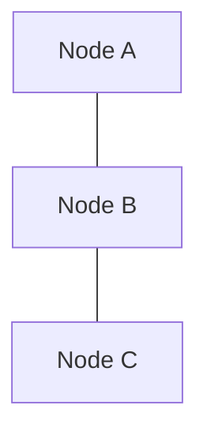

Normally:

```text
A ↔ B
B ↔ C
A ↔ C
```

Now imagine the network breaks:

```text
A    B  X  C
```

Or more generally:

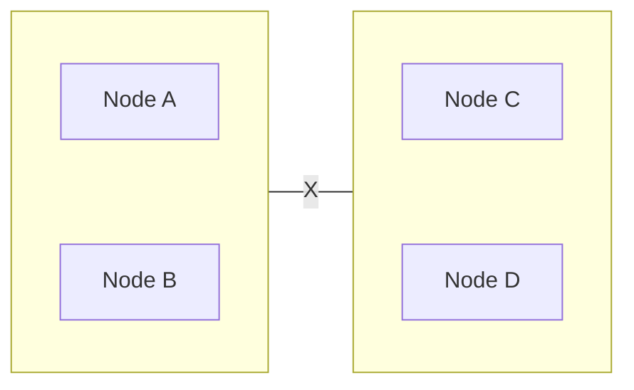

Partition

Both sides may still be powered on.

The applications may still be running.

The databases may still be running.

But communication between the groups is broken.

### Definition

> **A network partition occurs when nodes in a distributed system are unable to communicate reliably across a network boundary, even though the nodes themselves may still be running.**

---

# 2. Network Partition vs Node Failure

These are different problems.

## Node Failure

```text
A ✓
B ❌
C ✓
```

Node B is unavailable.

## Network Partition

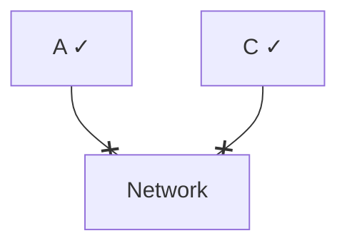

Both A and C may be healthy.

They simply cannot communicate.

This distinction matters because a node may believe:

```text
"I cannot reach B."
```

without knowing whether:

```text
B is down
```

or:

```text
the network path is broken.
```

---

# 3. The Most Important Idea

A network partition creates **different views of reality**.

Suppose:

```text
Node A → "Node B is unavailable."
```

At the same time:

```text
Node B → "Node A is unavailable."
```

Both statements may appear correct from their local perspective.

Neither node has complete information about the entire system.

This connects directly to the previous chapter:

> **In distributed systems, failure detection is based on observations, not perfect knowledge.**

---

# 4. Partial Connectivity

A partition does not always look like:

```text
A B    X    C D
```

It can be more complicated.

For example:

```text
A ↔ B
B ↔ C
A  X  C
```

Or:

```text
A ↔ B

C ↔ D

B  X  C
```

Some communication paths work while others fail.

This is **partial connectivity**.

That makes distributed coordination even more difficult.

---

# 5. A Simple Example

Consider three database nodes:

```text
        Database Cluster

       A
      / \
     /   \
    B-----C
```

Suppose the network link between A and C fails:

```text
       A

      / 
     /
    B

    C
```

Now:

```text
A ↔ B ✓
B ↔ C ✓
A ↔ C ❌
```

The cluster does not have a simple "up/down" state.

Different nodes may have different information about the rest of the cluster.

---

# 6. Why Partitions Are Dangerous

Suppose two nodes maintain the same logical state.

Initially:

```text
A = 100
B = 100
```

Then a partition occurs:

```text
A  X  B
```

Now both sides receive an update.

```text
A → 90
B → 80
```

After the partition heals:

```text
A = 90
B = 80
```

Which value is correct?

```text
90?
80?
```

The system needs a rule for resolving this difference.

This is why network partitions can create consistency problems.

---

# 7. What Happens to Replicated State?

Suppose:

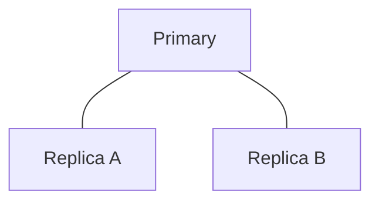

A network partition separates Replica B:

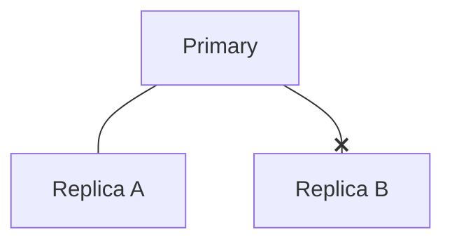

Replica B stops receiving updates.

Therefore:

```text
Primary     → Version 20
Replica A   → Version 20
Replica B   → Version 17
```

Replica B is now stale.

If it continues serving reads:

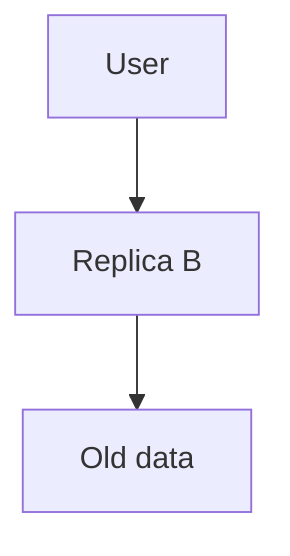

the user may see stale state.

---

# 8. The Split-Brain Problem

A particularly dangerous case is **split brain**.

Imagine a cluster normally has:

```text
Leader A
Followers B C
```

Then A becomes isolated:

```text
A     X     B C
```

Suppose A believes:

```text
"I am still the leader."
```

Meanwhile B and C decide:

```text
"A is unreachable."
"We need a new leader."
```

They elect:

```text
Leader B
```

Now:

```text
A → "I am leader."
B → "I am leader."
```

Two nodes believe they are authoritative.

This is split brain.

---

# 9. Why Split Brain Is Dangerous

Suppose both leaders accept writes:

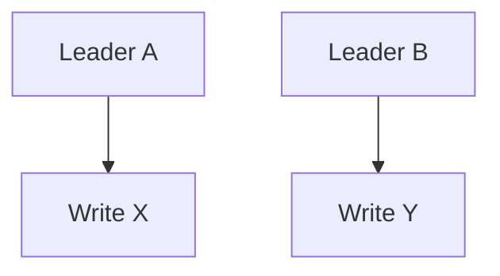

Now the system has two independent histories.

When the partition heals:

```text
A → X
B → Y
```

The system must reconcile them.

Depending on the data, this may be:

- Easy
- Difficult
- Expensive
- Impossible without losing information

For critical state, split brain can be extremely dangerous.

---

# 10. Preventing Split Brain

Systems use coordination mechanisms such as:

- Quorum
- Leader election
- Fencing
- Leases
- Consensus protocols
- Majority-based decisions

The exact mechanism depends on the distributed system.

The underlying principle is:

> **Prevent multiple nodes from simultaneously believing they have exclusive authority.**

---

# 11. Quorum

A quorum is the minimum number of nodes required to participate in an operation.

For a three-node cluster:

```text
A
B
C
```

A majority is:

```text
2 of 3
```

So:

```text
Quorum = 2
```

If the network partitions:

```text
A       B X C
```

the side containing B and C has:

```text
2 nodes
```

and can potentially form a majority.

The isolated A has:

```text
1 node
```

and cannot form a majority.

This can prevent both sides from becoming authoritative.

---

# 12. Quorum Does Not Mean "Everything Keeps Working"

Suppose:

```text
A B | C D
```

The cluster has four nodes.

Depending on the system, a majority may require:

```text
3 nodes
```

Neither side has three.

Therefore the system may have to stop certain operations.

This may reduce availability.

That is intentional.

The system is choosing:

> **Do not accept unsafe operations rather than risk conflicting state.**

---

# 13. Network Partition and CAP Theorem

This is where the earlier CAP chapter becomes important.

CAP discusses what happens during a network partition.

The key trade-off is between:

```text
Consistency
     vs
Availability
```

during the partition.

A system cannot guarantee both strong consistency and availability under an actual network partition.

---

# 14. CP Behavior

A CP-oriented system prioritizes consistency during the partition.

Suppose:

```text
A B  X  C
```

Only A and B form a majority.

The isolated C may stop accepting certain writes.

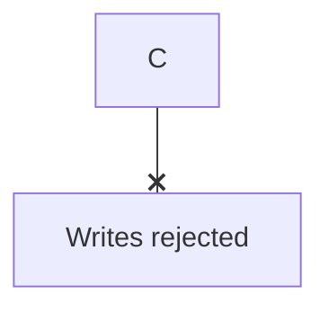

The system sacrifices some availability to preserve consistency.

This is broadly called **CP behavior** in CAP discussions.

---

# 15. AP Behavior

An AP-oriented design may continue accepting operations on multiple sides.

For example:

```text
A B  X  C D
```

Both sides may continue operating.

This improves availability.

But now:

```text
A B → State X
C D → State Y
```

The system may temporarily contain divergent state.

After the partition heals:

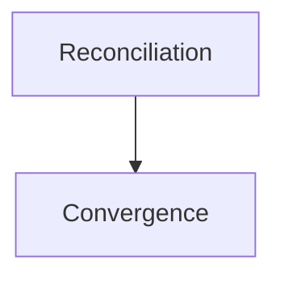

This is broadly called **AP behavior**.

The exact behavior depends on the technology and consistency model.

---

# 16. "Pick Two" Is an Oversimplification

A common explanation of CAP is:

> "Choose two of Consistency, Availability, and Partition Tolerance."

This is misleading.

In a distributed system that must operate over a network, partitions are a real possibility.

The practical question is:

> **When a partition occurs, do we reject or delay some operations to preserve stronger consistency, or continue serving more operations while allowing temporary divergence?**

That is the useful system-design interpretation.

---

# 17. Leader Isolation

An isolated leader creates an interesting situation.

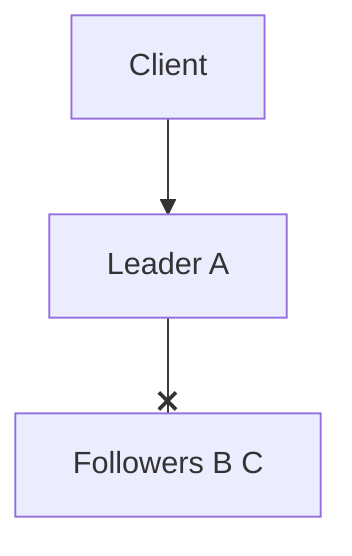

A may still receive client requests.

But if it cannot communicate with the required majority, it may need to stop accepting certain operations.

Otherwise:

```text
A → Write 1
A → Write 2
A → Write 3
```

could create state that the rest of the cluster cannot safely confirm.

---

# 18. What If Clients Can Reach Both Sides?

A network partition can also affect clients.

Imagine:

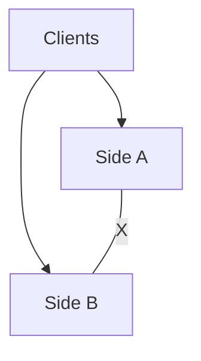

Different users may reach different sides.

Now users can observe different states.

For example:

```text
User 1 → Side A → Order = Confirmed

User 2 → Side B → Order = Pending
```

The system must define whether such temporary differences are acceptable.

---

# 19. Partitions and Caches

Caches can become stale during partitions.

Consider:

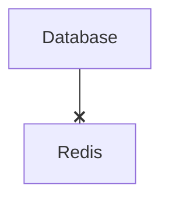

The cache cannot receive updates.

The database says:

```text
Price = ₹550
```

The cache still says:

```text
Price = ₹500
```

If the application continues reading from Redis:

```text
User → Old price
```

Possible strategies include:

- Stop using the stale cache
- Use TTL
- Read from authoritative storage
- Mark cache unhealthy
- Allow stale data if acceptable

The correct choice depends on the business requirement.

---

# 20. Partitions and Message Systems

A network partition can also affect queues and event streams.

For example:

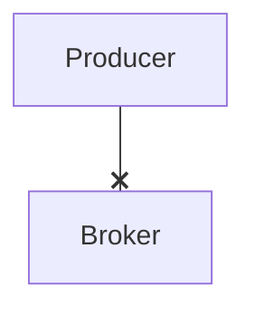

The producer may not know whether the message reached the broker.

This creates uncertainty.

Possible outcomes:

```text
Message never arrived
```

or:

```text
Message arrived but acknowledgement was lost
```

The producer may retry.

Now duplicate messages become possible.

This connects network partitions to:

- Delivery semantics
- Retries
- Idempotency
- Message ordering

---

# 21. Partition + Retry

Consider:

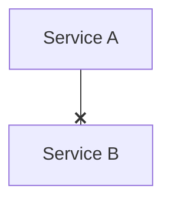

A request times out.

Service A retries:

```text
Retry 1
Retry 2
Retry 3
```

But B may still be healthy.

The network path is broken.

A's retries do not repair the network.

They only create additional traffic.

This can produce:

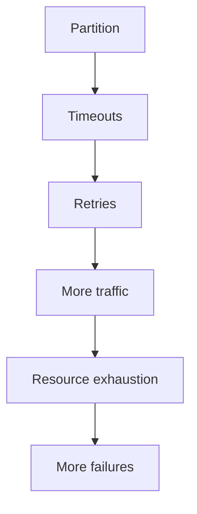

Therefore:

> **Retries must be designed with network partitions in mind.**

---

# 22. Partition Recovery

Eventually the network may recover.

```text
Before:

A B  X  C D

After:

A B ↔ C D
```

Connectivity has returned.

But the system now has another problem:

> **What state should the nodes have?**

They may contain:

```text
A B → Version 20
C D → Version 18
```

Or worse:

```text
A B → State X
C D → State Y
```

Recovery therefore requires more than reconnecting network cables.

---

# 23. Reconciliation

**Reconciliation** is the process of resolving differences after disconnected components reconnect.

Conceptually:

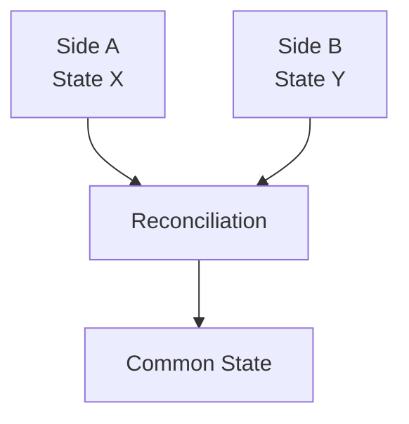

Possible strategies include:

- Discard stale state
- Replay missing operations
- Compare versions
- Merge changes
- Last-write-wins
- Application-specific conflict resolution
- Restore from authoritative source

The correct strategy depends on the data.

---

# 24. Version Numbers Help

Suppose a state has versions:

```text
Node A → Version 20
Node B → Version 17
```

The system can identify:

```text
B is behind
```

and potentially replay changes.

Versioning is useful for detecting:

- Stale state
- Out-of-order updates
- Missing updates
- Conflicts

But version numbers alone do not tell you how to resolve every conflict.

---

# 25. Not All State Can Be Easily Merged

Consider two updates:

```text
User profile:
Name = "Ranjit"
```

and:

```text
User profile:
Name = "Ranjan"
```

A system might choose one based on a conflict policy.

But consider:

```text
Bank balance
₹900
```

vs:

```text
Bank balance
₹700
```

Blindly choosing one value could lose a financial transaction.

For critical state, systems often prefer:

- Single authoritative writer
- Strong coordination
- Transactional mechanisms
- Durable event history
- Explicit reconciliation

The business meaning of the data matters.

---

# 26. Partition Recovery and Event Logs

Suppose a system records operations:

```text
Event 101
Event 102
Event 103
Event 104
```

A disconnected node has only:

```text
Event 101
Event 102
```

After reconnecting, it can potentially catch up:

```text
Event 103
Event 104
```

This is one reason durable logs and event streams can be useful in distributed architectures.

The important concept is:

> **Recovery can sometimes be based on replaying missing state changes rather than copying an entire database from scratch.**

---

# 27. Partition Recovery Is Not Instant

When communication returns:

```text
Network ✓
```

the system may still need to:

- Catch up replicas
- Reconcile state
- Rebuild indexes
- Refresh caches
- Replay events
- Re-establish leadership
- Reconnect clients
- Rebalance workloads

So:

```text
Network restored
```

does not necessarily mean:

```text
System fully recovered
```

---

# 28. Network Partitions and Read Traffic

Suppose:

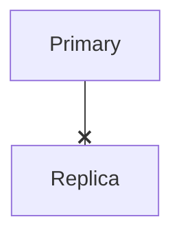

The replica is isolated.

Should it continue serving reads?

It depends.

If stale reads are acceptable:

```text
Replica → Continue serving
```

may be reasonable.

If freshness is critical:

```text
Replica → Stop serving
```

may be safer.

This is another example of:

> **Consistency requirements determine failure behavior.**

---

# 29. Network Partitions and Writes

Writes are more dangerous.

Suppose two sides independently accept writes:

```text
Side A → Write X

Side B → Write Y
```

After recovery:

```text
X + Y
```

may conflict.

Therefore systems may choose to:

- Reject writes without quorum
- Route writes to a surviving leader
- Allow writes and reconcile later
- Use conflict-free data structures for suitable workloads
- Use application-specific merge logic

There is no universal solution.

---

# 30. Hands-On Exercise — Simulate a Partition

Consider a three-node cluster:

```text
       A
      / \
     /   \
    B-----C
```

Assume:

```text
Quorum = 2
```

Now the network partition becomes:

```text
A  X  B
 \    /
  \  /
   C
```

Suppose A is isolated:

```text
A

B ↔ C
```

### Question 1

Which side has a majority?

```text
B + C = 2
```

Therefore B/C have quorum.

### Question 2

Should A independently become leader?

No.

A does not have the required majority.

### Question 3

What should happen to writes on A?

Depending on the system, writes may be rejected or otherwise restricted because A cannot safely establish authority.

### Question 4

Why?

Because allowing A to independently accept authoritative writes could create conflicting state.

---

# 31. Lab Challenge — Two-Sided Writes

Start with:

```text
Inventory = 10
```

Partition the system:

```text
Side A  X  Side B
```

Side A receives:

```text
Order for 3
```

Side B receives:

```text
Order for 4
```

If both sides independently accept the orders:

```text
Side A → Inventory = 7
Side B → Inventory = 6
```

When the partition heals:

```text
7 vs 6
```

The system must reconcile.

### Important question

Can the system safely allow both writes?

That depends on the business requirement.

For inventory where overselling is unacceptable, stronger coordination may be required.

---

# 32. Lab Challenge — Partition and Cache

Consider:

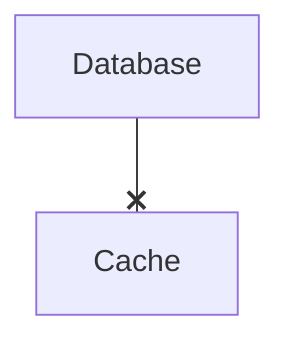

The database updates:

```text
Price = ₹600
```

The cache still contains:

```text
Price = ₹500
```

Answer:

1. Is the cache stale?
2. What should happen if the price is informational?
3. What should happen if the cached value controls payment?
4. What mechanism could detect or limit stale data?

### Expected reasoning

A stale price might be acceptable for a product-display page depending on the business rules.

It should not automatically be trusted for a financially critical operation.

The payment path should use authoritative state or an appropriate consistency mechanism.

---

# 33. Common Mistakes

### Mistake 1 — Thinking a partition means servers are dead

The servers may be perfectly healthy.

Only communication may be broken.

### Mistake 2 — Treating timeout as proof of failure

A timeout only tells you that the expected response was not observed.

### Mistake 3 — Allowing every side to become a leader

This can create split brain.

### Mistake 4 — Assuming quorum means every request succeeds

Quorum can intentionally reject operations when safe coordination is unavailable.

### Mistake 5 — Assuming network recovery means state recovery

Nodes may still need synchronization and reconciliation.

### Mistake 6 — Retrying indefinitely during a partition

Retries can amplify traffic and make recovery harder.

### Mistake 7 — Treating all stale data as equally dangerous

Business requirements determine acceptable staleness.

### Mistake 8 — Ignoring client routing

Different clients may reach different sides of a partition.

### Mistake 9 — Assuming replication automatically solves conflicts

Replication can create copies; it does not automatically decide how conflicting independent writes should be resolved.

### Mistake 10 — Treating CAP as a database feature

CAP describes distributed-system trade-offs during partitions; it is not simply a database configuration switch.

---

# 34. System Design View

Network partitions force three fundamental questions:

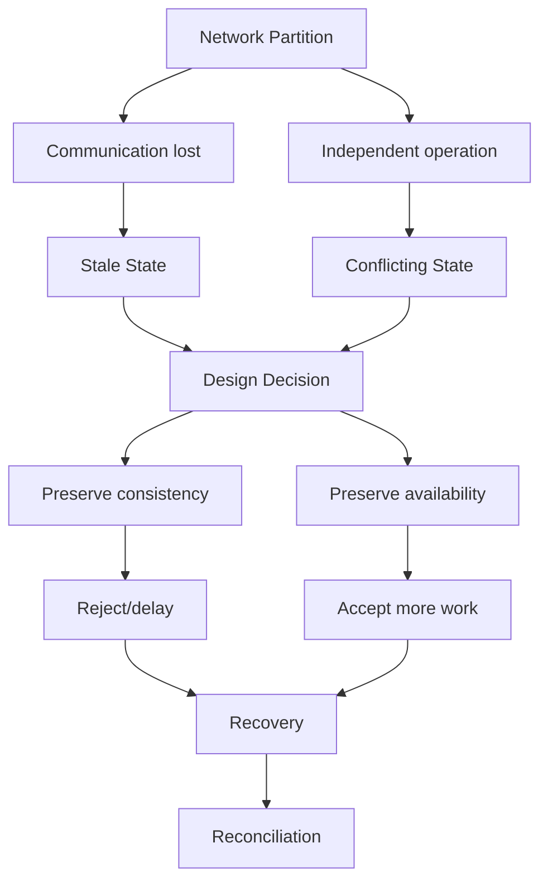

The architecture must explicitly decide what should happen.

---

# 35. A Practical Partition Decision Framework

For every distributed component, ask:

### Communication

1. What happens if nodes cannot communicate?
2. Can some nodes communicate while others cannot?

### State

3. What state becomes stale?
4. Can multiple sides modify the same state?
5. What conflicts could occur?

### Authority

6. Who is allowed to write?
7. How is leadership determined?
8. Is quorum required?

### Availability

9. Which operations can continue?
10. Which operations should stop?

### Recovery

11. How does the system detect healing?
12. How does it catch up?
13. How are conflicting updates resolved?

### Protection

14. What happens to retries?
15. Can retries overload the system?
16. What is the blast radius?

---

# 36. Key Principle

> **A network partition occurs when parts of a distributed system cannot reliably communicate even though the nodes themselves may still be running. During a partition, nodes can develop different views of state, become uncertain about failures, and potentially accept conflicting operations. Good distributed-system design explicitly defines authority, quorum, consistency, availability, failure behavior, and recovery rather than assuming the network is always reliable.**

---

# 37. Quick Reference

| Concept | Key Idea |
|---|---|
| Network Partition | Nodes cannot reliably communicate |
| Node Failure | A node itself becomes unavailable |
| Partial Connectivity | Some communication paths still work |
| Split Brain | Multiple sides believe they are authoritative |
| Quorum | Required number of nodes for safe coordination |
| Majority | More than half of the participating nodes |
| Stale State | Older state caused by failed/delayed propagation |
| Conflict | Different sides produce incompatible updates |
| Reconciliation | Resolving differences after recovery |
| Leader | Node coordinating authoritative operations |
| CP | Favor consistency during partition |
| AP | Favor continued availability with possible divergence |
| CAP | Trade-off between consistency and availability during partition |
| Fencing | Preventing an old/isolated authority from continuing dangerous operations |

---

# 38. Knowledge Check

### 1. What is a network partition?

A situation where parts of a distributed system cannot reliably communicate with each other.

### 2. Are nodes necessarily dead during a network partition?

No. They may be healthy but unable to communicate.

### 3. Why can partitions create stale state?

Updates cannot reliably propagate between disconnected components.

### 4. What is split brain?

A situation where multiple sides of a partition believe they independently have authority.

### 5. Why is split brain dangerous?

It can allow conflicting writes and produce divergent system state.

### 6. What does quorum provide?

A minimum participation requirement that can help prevent minority sides from independently making authoritative decisions.

### 7. What is the CAP trade-off during a partition?

Whether the system preserves stronger consistency or continues accepting more operations for availability.

### 8. Does network recovery automatically resolve state differences?

No. State may need synchronization, replay, or reconciliation.

### 9. Why can retries be dangerous during a partition?

They can multiply traffic while the underlying communication problem remains.

### 10. What is the most important partition-design question?

> **What is the system allowed to do while nodes cannot communicate, and how will the system recover safely afterward?**

---

# 39. Remember

> **A network partition does not necessarily mean a machine has failed. It means the system has lost reliable communication between parts of itself. The real danger is that each side may continue operating with incomplete information.**
