# 06.05 — Replication

## Learning Objectives

By the end of this chapter, you should understand:

- What **replication** means in a distributed system
- Why systems maintain multiple copies of data or state
- Primary/replica replication
- Synchronous vs asynchronous replication
- Replication lag
- How replicated state is propagated
- Read scaling and availability benefits
- Replication and consistency
- What happens when a replica falls behind
- What happens when a replica fails
- Replication during network partitions
- Replication vs backup
- Replication vs sharding
- Replication vs caching
- How replicas recover and catch up
- The trade-offs introduced by replication

---

# Beginner Vocabulary

| Term | Beginner-Friendly Meaning |
|---|---|
| **Replication** | Keeping copies of data or state on multiple nodes |
| **Replica** | A copy of data maintained on another node |
| **Primary** | Node responsible for accepting authoritative writes in a primary/replica design |
| **Follower** | Node that receives and follows state from another node |
| **Replication Log** | Record of changes that can be propagated to replicas |
| **Replication Lag** | Delay between a change on the source and its appearance on a replica |
| **Synchronous Replication** | Write is not considered complete until required replicas confirm it |
| **Asynchronous Replication** | Source can complete the write before replicas confirm it |
| **Failover** | Moving responsibility from a failed node to another node |
| **Promotion** | Making a replica the new primary or leader |
| **Catch-Up** | Bringing a replica up to date with missing changes |
| **Consistency** | Rules describing what different copies are allowed to observe |
| **Stale Read** | Reading older data from a replica |
| **Quorum** | Required number of nodes participating in an operation |
| **Durability** | Ability of committed data to survive failures |
| **Backup** | Separate recovery copy used to restore data |
| **Shard** | Portion of a dataset stored separately |
| **Source of Truth** | Authoritative representation of state |

---

# 1. What Is Replication?

Replication means maintaining multiple copies of the same logical state.

For example:

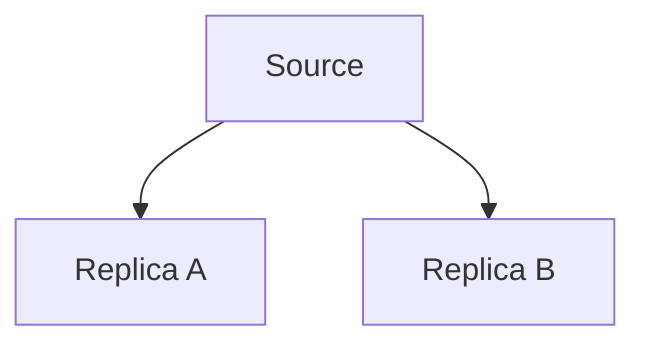

If the source contains:

```text
User 42
Balance = ₹1,000
```

the replicas may also maintain:

```text
Replica A
Balance = ₹1,000

Replica B
Balance = ₹1,000
```

The copies represent the same logical data.

### Definition

> **Replication is the process of maintaining multiple copies of data or system state across different nodes.**

Replication is one of the most common techniques used to improve:

- Availability
- Read capacity
- Fault tolerance
- Geographic access
- Recovery options

But replication also introduces new problems.

---

# 2. Replication Is Copying, Not Dividing

This distinction is important.

Replication:

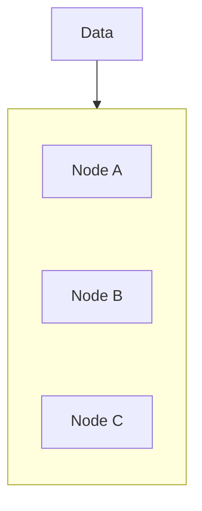

Each node contains a copy.

Sharding:

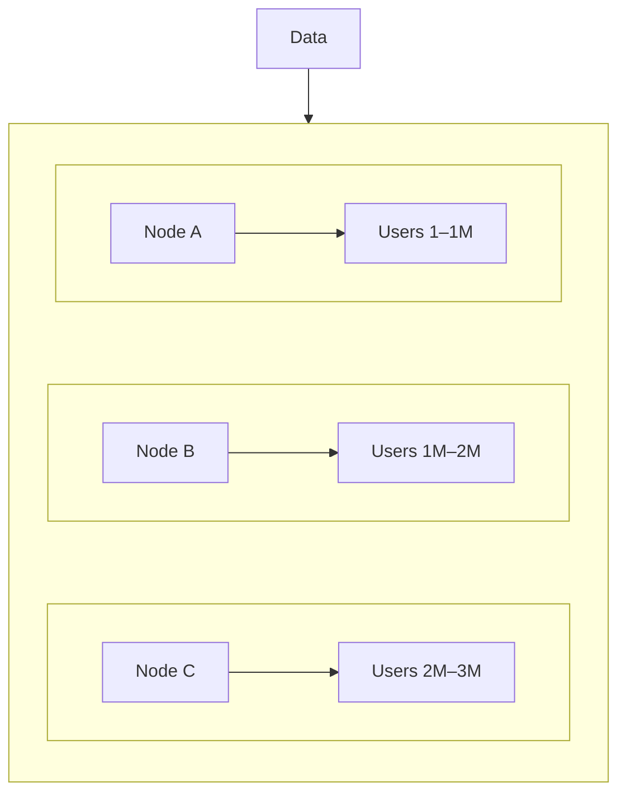

The data is divided.

Therefore:

> **Replication copies data. Sharding divides data.**

They can also be combined.

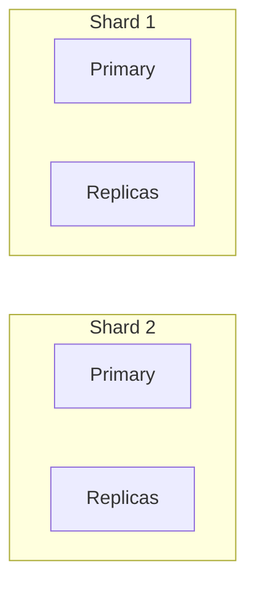

---

# 3. Primary and Replica

A common replication model is:

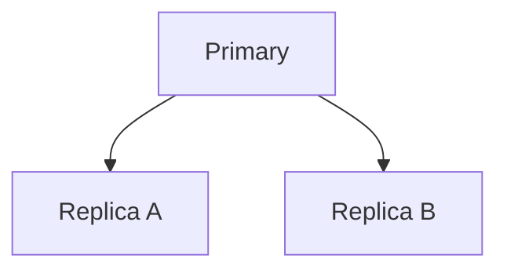

The primary usually:

- Accepts authoritative writes
- Produces changes
- Coordinates replication

Replicas usually:

- Receive replicated changes
- Serve selected reads
- Support failover
- Provide redundancy

This is not the only replication architecture.

Other models include:

- Multi-primary
- Leader/follower
- Peer-to-peer
- Quorum-based systems

We will encounter these models later.

---

# 4. How Does Replication Happen?

A simplified flow is:

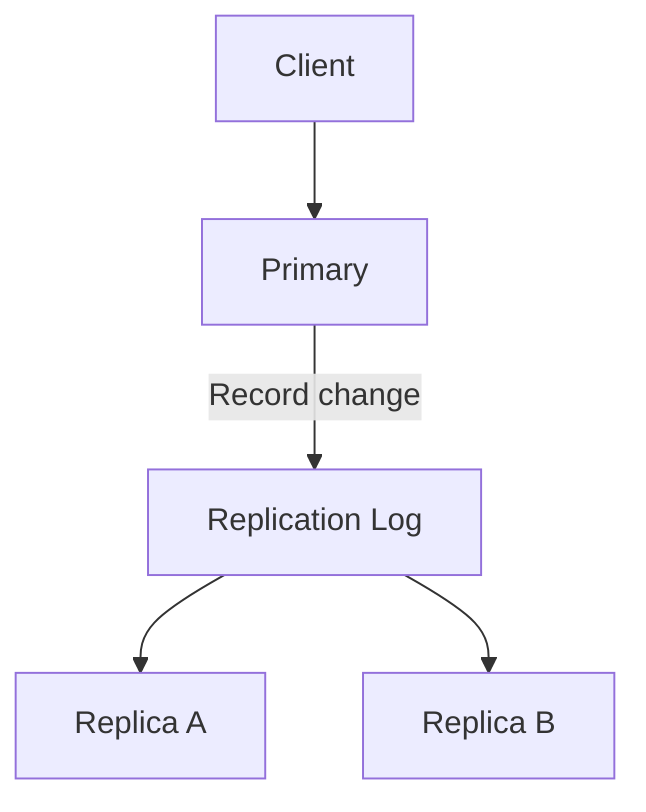

The primary records changes.

Replicas receive those changes and apply them.

The exact mechanism depends on the technology.

For databases this may involve:

- Write-ahead logs
- Replication logs
- Change streams
- Logical changes
- Physical changes

The important concept is:

> **Replicas need a reliable representation of changes so they can reproduce the source state.**

---

# 5. Replication Is About State Changes

Suppose the source contains:

```text
Balance = ₹1,000
```

A new operation occurs:

```text
Withdraw ₹200
```

Instead of simply saying:

```text
"Make balance ₹800"
```

a replication system may propagate a representation of the underlying change.

Conceptually:

```text
Change 101
Withdraw ₹200
```

Replica applies:

```text
₹1,000 - ₹200 = ₹800
```

This makes replication more than periodically copying an entire database.

---

# 6. The Old Primary Problem

Suppose:

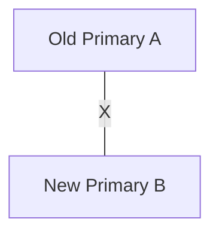

The network partition heals.

A comes back online.

If A still believes it is primary:

```text
A → accepts writes
B → accepts writes
```

you can get split brain.

A safe system must ensure the old primary cannot continue acting as authoritative after another node has been promoted.

Mechanisms can include:

- Fencing
- Epochs/terms
- Leases
- Consensus
- Controlled reconfiguration

---

# 7. Replica Catch-Up

Suppose a replica falls behind:

```text
Primary  → Version 100
Replica  → Version 80
```

After recovering, it needs changes:

```text
81
82
83
...
100
```

Conceptually:

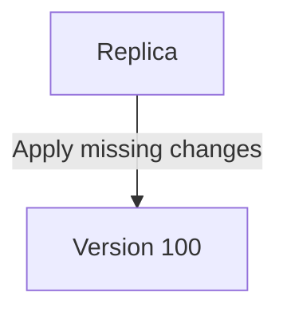

This is called **catch-up**.

If the replica is too far behind or its state is no longer usable, the system may need to rebuild it from a known-good source.

---

# 8. Full Rebuild vs Incremental Catch-Up

### Incremental catch-up

```text
Replica = Version 80
Primary = Version 100

Apply:
81 → 82 → ... → 100
```

Efficient when the replica is only slightly behind.

### Full rebuild

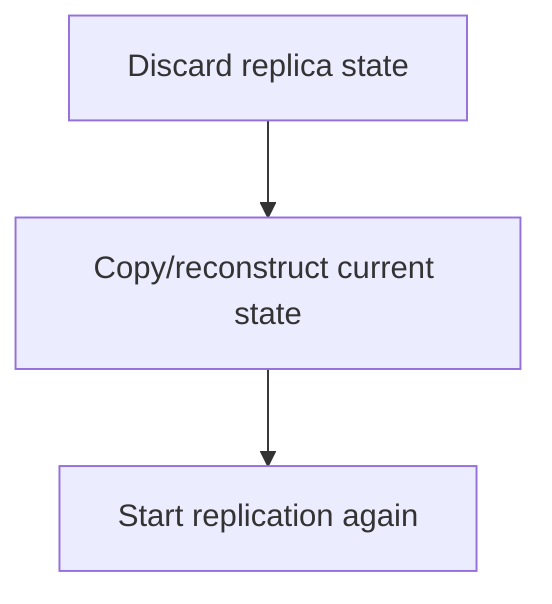

More expensive, but sometimes necessary.

---

# 9. Replication During a Network Partition

Consider:

```text
Primary A  X  Replica B
```

B cannot receive new changes.

Therefore:

```text
A → Version 50
B → Version 42
```

B becomes stale.

If B continues accepting writes independently:

```text
A → Version 51
B → Version 43
```

the system may now have divergent state.

This is why replication and network partitions are closely connected.

---

# 10. Replication Does Not Automatically Solve Partitions

Replication provides multiple copies.

But during a partition:

```text
Copy A  X  Copy B
```

the copies may stop synchronizing.

The system still needs rules for:

- Which side can write
- Whether reads can continue
- Whether a replica can be promoted
- How quorum works
- How conflicts are handled
- How state is reconciled

Replication creates redundancy.

It does not remove distributed-systems problems.

---

# 11. Replication and Quorum

Some distributed systems use quorum-based replication.

Suppose:

```text
A B C
```

A majority is:

```text
2 of 3
```

A write may require participation from enough nodes to satisfy the system's safety requirements.

For example:

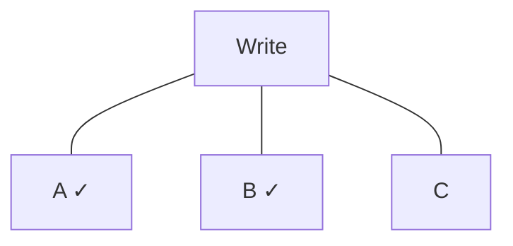

Two nodes participated.

The exact semantics depend on the system.

The general idea is:

> **Quorum reduces the chance that two disconnected minorities can both make independent authoritative decisions.**

---

# 12. Replication and Consistency

Replication creates multiple copies.

Therefore the system must define what readers can observe.

Possible models include:

### Stronger consistency

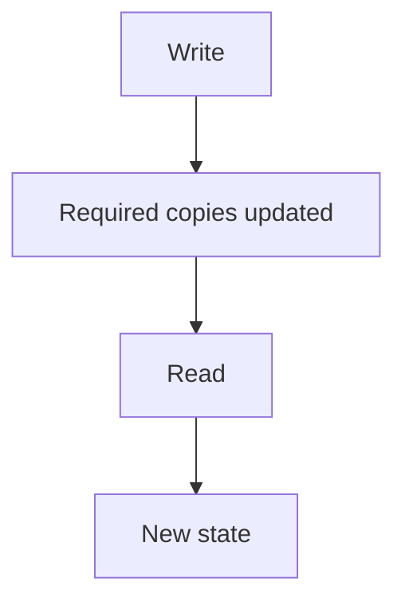

### Eventual consistency

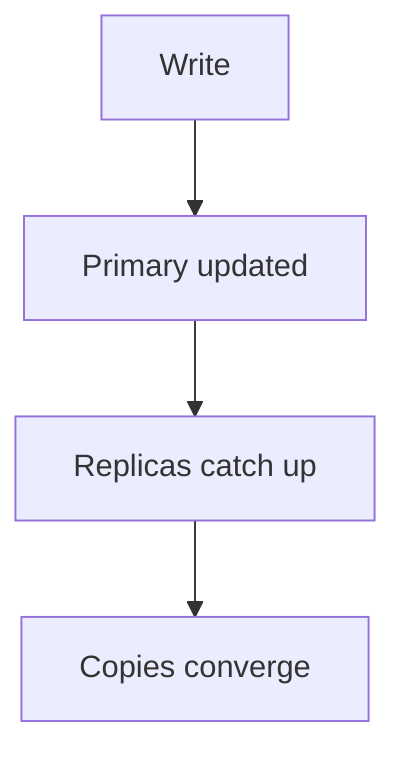

The right choice depends on:

- Business correctness
- Latency
- Availability
- Network distance
- Failure requirements

---

# 13. Replication and Sharding Together

Large systems often combine them.

For example:

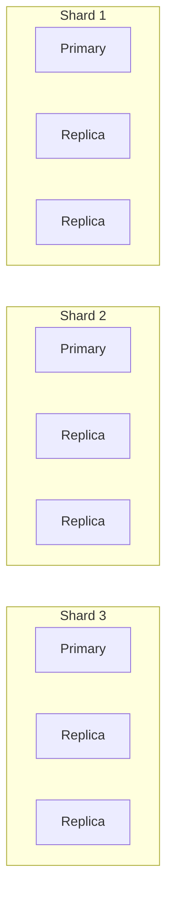

Sharding provides:

```text
Data distribution
```

Replication provides:

```text
Copies / redundancy
```

Together:

> **Sharding distributes ownership; replication provides copies of each ownership unit.**

---

# 14. Replication and Disaster Recovery

Replication can be part of disaster recovery.

For example:

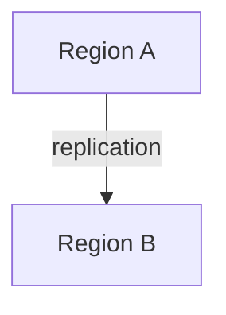

If Region A fails:

```text
Region A ❌
Region B ✓
```

Region B may provide a recovery path.

But disaster recovery also requires:

- Recovery procedures
- Data validation
- Failover mechanisms
- DNS/routing changes
- Application configuration
- Backup strategy
- Recovery testing

Replication alone does not guarantee disaster recovery.

---

# 15. Hands-On Exercise — Model Replication

Consider:

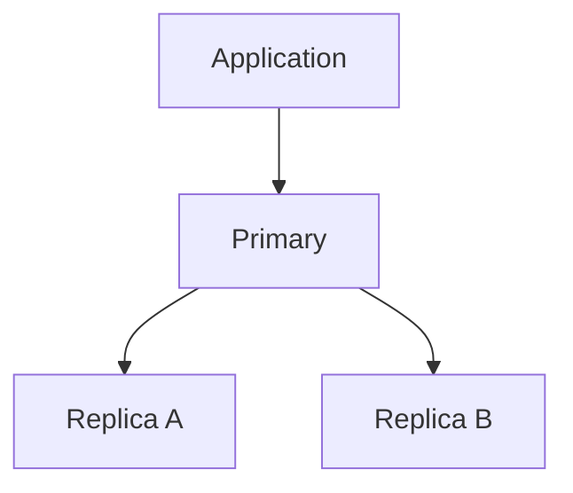

### Scenario

The primary contains:

```text
Orders = 1,000,000
Version = 500
```

Replica A:

```text
Version = 500
```

Replica B:

```text
Version = 497
```

### Question 1

Which replica is more current?

```text
Replica A
```

### Question 2

Would Replica B necessarily be unusable?

No.

It depends on how much staleness the application can tolerate.

### Question 3

Should an immediately-after-write order lookup necessarily use Replica B?

Not if read-after-write correctness is required.

### Question 4

What could the system do?

Possible strategies:

- Read from primary
- Route to a sufficiently fresh replica
- Wait for required replication position
- Use sticky reads

---

# 16. Lab Challenge — Primary Failure

Start with:

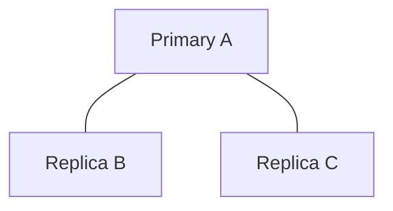

Suppose:

```text
A → Version 100
B → Version 100
C → Version 98
```

Then A fails.

### Questions

1. Which replica appears most up-to-date?
2. Should B automatically become primary?
3. What must happen to C?
4. What happens to existing application connections?
5. How do you prevent old A from returning later and accepting writes?

### Expected reasoning

Replica B is the strongest candidate based on the simplified state above, but real promotion requires an actual failover mechanism and authority decision.

C may need to catch up from the new primary.

Applications need to reconnect or be rerouted.

Old A must be prevented from acting as an independent writer if it returns with stale state.

---

# 17. Common Mistakes

### Mistake 1 — Thinking replication means backup

Replication can copy accidental changes or deletions.

### Mistake 2 — Assuming replicas are always current

Asynchronous replication can produce lag.

### Mistake 3 — Sending every read to replicas

Some reads require stronger freshness.

### Mistake 4 — Assuming more replicas automatically improve everything

More replicas increase storage, network traffic, monitoring, and coordination.

### Mistake 5 — Assuming replication scales writes

Primary/replica replication usually scales reads more easily than writes.

### Mistake 6 — Ignoring replica lag

A replica that is alive but far behind may still be unsuitable.

### Mistake 7 — Assuming failover is instantaneous

Promotion, routing, reconnection, and state validation all take time.

### Mistake 8 — Ignoring the old primary

A returning old primary can create split brain if not safely controlled.

### Mistake 9 — Treating every replica as equally useful

Freshness, latency, capacity, and health can differ.

### Mistake 10 — Adding replication before identifying the problem

Replication should solve a specific requirement such as availability, read scaling, or geographic distribution.

---

# 18. System Design View

Replication should begin with a requirement.

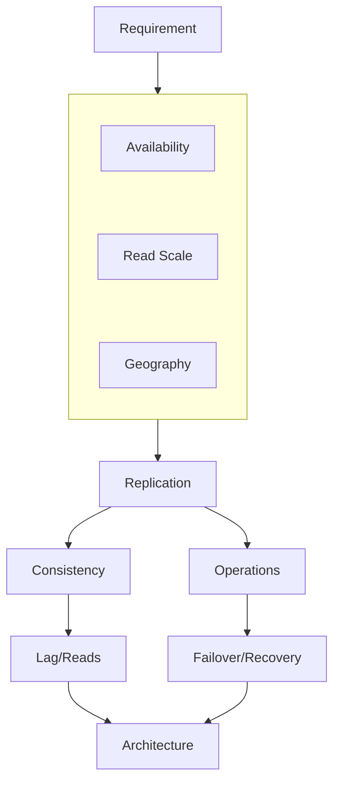

The wrong question is:

> "Should we add replicas?"

The better question is:

> **"What problem are we trying to solve, and what consistency and operational costs are we willing to accept?"**

---

# 19. Replication Decision Framework

Before introducing replication, ask:

### Purpose

1. Why do we need another copy?
2. Availability?
3. Read scaling?
4. Geographic latency?
5. Disaster recovery?

### Consistency

6. How stale can replicas be?
7. Are stale reads acceptable?
8. Which operations require fresh state?

### Write path

9. Is replication synchronous or asynchronous?
10. How does replication affect write latency?

### Failure

11. What happens when a replica fails?
12. What happens when the primary fails?
13. How is failover decided?
14. How is the old primary prevented from writing?

### Recovery

15. How does a replica catch up?
16. When must it be rebuilt?
17. How is recovery verified?

### Operations

18. How is replication lag monitored?
19. How are unhealthy replicas removed from routing?
20. How is failover tested?

---

# 20. Replication Mental Model

Remember:

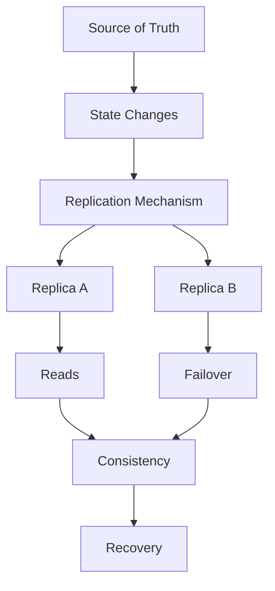

Or:

> **Copy the state → propagate changes → monitor lag → serve appropriate reads → handle failure → catch up or rebuild.**

---

# 21. Key Principle

> **Replication maintains multiple copies of system state to improve availability, read capacity, geographic access, or fault tolerance. But every additional copy introduces synchronization, consistency, lag, storage, network, and failure-management costs. A good replication design starts with a clear purpose and explicitly defines how writes, reads, lag, failover, recovery, and partitions should behave.**

---

# 22. Quick Reference

| Concept | Key Idea |
|---|---|
| Replication | Maintaining multiple copies of state |
| Primary | Usually authoritative write node |
| Replica | Copy of primary state |
| Synchronous | Write waits for required replication confirmation |
| Asynchronous | Write can complete before replica confirmation |
| Replication Lag | Replica is behind source |
| Promotion | Making replica the new primary |
| Catch-Up | Applying missing changes |
| Failover | Moving responsibility after failure |
| Read Scaling | Distributing suitable reads across replicas |
| Quorum | Required node participation for safe coordination |
| Replication | Copies data |
| Sharding | Divides data |
| Cache | Usually optimization copy |
| Backup | Recovery copy for data loss |
| Split Brain | Multiple nodes incorrectly act as authority |

---

# 23. Knowledge Check

### 1. What is replication?

Maintaining multiple copies of data or state across nodes.

### 2. Why do systems replicate data?

For availability, read scaling, geographic distribution, fault tolerance, or other specific requirements.

### 3. What is replication lag?

The difference between the latest state on the source and the state currently applied on a replica.

### 4. What is the main difference between synchronous and asynchronous replication?

Synchronous replication waits for required replication confirmation; asynchronous replication allows the source to complete before replicas necessarily confirm.

### 5. Does replication automatically provide strong consistency?

No.

### 6. Does replication automatically scale writes?

No. Primary/replica architectures generally make read scaling easier than write scaling.

### 7. Is replication the same as backup?

No. Replication helps maintain operational copies; backups provide recovery from deletion, corruption, and historical data loss.

### 8. What happens if a replica falls behind?

It may become stale and may need to catch up or be rebuilt.

### 9. Why is the old primary dangerous after failover?

If it returns and accepts writes independently, it can create split brain and conflicting state.

### 10. What is the most important question before adding replication?

> **What specific problem are we solving with another copy of the state?**

---

# 24. Remember

> **Replication gives a system more than one copy of its state—but more copies mean more synchronization. The real design problem is not copying data; it is deciding how those copies stay useful, consistent enough, recoverable, and safe when nodes or networks fail.**

---

# Next Chapter

## 06.06 — Quorum

Next we examine how distributed systems decide whether **enough nodes have participated** for an operation to be considered safe.

Topics include:

- What quorum means
- Majority
- Read quorum
- Write quorum
- Quorum intersection
- Why overlapping quorums matter
- Quorum with replication
- Quorum during network partitions
- Quorum and consistency
- Quorum and availability
- Quorum failure scenarios
- What happens when quorum cannot be reached
- Quorum vs consensus
- Practical quorum examples
- Hands-on quorum exercise
- System-design trade-offs
