# 06.06 — Quorum

## Learning Objectives

By the end of this chapter, you should understand:

- What **quorum** means in a distributed system
- Why distributed systems need quorum
- What a majority is
- Read quorum and write quorum
- Why quorum overlap matters
- How quorum works with replication
- How quorum behaves during network partitions
- The relationship between quorum and consistency
- The relationship between quorum and availability
- Why quorum does not automatically mean strong consistency
- Why quorum is not the same as consensus
- How to reason about quorum during failures

---

# Beginner Vocabulary

| Term | Beginner-Friendly Meaning |
|---|---|
| **Quorum** | Minimum number of nodes that must participate for an operation to be accepted |
| **Majority** | More than half of the nodes |
| **Replica** | A copy of data or state |
| **Read Quorum** | Minimum number of replicas that must participate in a read |
| **Write Quorum** | Minimum number of replicas that must participate in a write |
| **Quorum Size** | Number of nodes required for an operation |
| **Quorum Intersection** | The overlap between nodes participating in different quorums |
| **Consistency** | Rules about what values a system can return |
| **Availability** | Whether the system can continue accepting requests |
| **Network Partition** | Situation where parts of the system cannot reliably communicate |
| **Replication Factor** | Number of copies maintained for data |
| **Failure Tolerance** | Number of failures the system can tolerate under a particular design |
| **Stale Read** | Reading an older version of data |
| **Consensus** | A protocol for distributed nodes to agree on a value or decision |
| **Leader** | Node responsible for coordinating certain operations |
| **Write Acknowledgement** | Confirmation that required nodes accepted a write |

---

# 1. What Is Quorum?

Imagine a distributed system with three replicas:

```text
        A
       / \
      /   \
     B-----C
```

Suppose the system requires at least **2 of 3 nodes** to participate.

Then:

```text
Quorum = 2
```

Possible quorums include:

```text
A + B
A + C
B + C
```

But:

```text
A
```

alone is not enough.

Neither is:

```text
B
```

or:

```text
C
```

alone.

### Definition

> **A quorum is the minimum amount of distributed participation required for an operation to be accepted according to a system's rules.**

The exact meaning of "participation" depends on the system.

It may mean:

- Acknowledging a write
- Responding to a read
- Participating in a decision
- Confirming membership
- Maintaining a majority

---

# 2. Why Do Distributed Systems Need Quorum?

Consider three replicas:

```text
A
B
C
```

Suppose A and B cannot communicate with C.

```text
A ----- B     X     C
```

Now imagine both sides believe they should accept writes.

If:

```text
A + B
```

accept a write,

and:

```text
C
```

also accepts a conflicting write,

the system can develop two different versions of reality.

Quorum can prevent this by requiring enough nodes to participate.

With a 3-node system:

```text
Quorum = 2
```

The isolated node C has only:

```text
1 node
```

It cannot reach quorum.

Therefore it cannot independently make an authoritative decision if the system requires a quorum.

---

# 3. Majority

For many distributed systems, quorum is based on a majority.

A majority means:

> **More than half of the participating nodes.**

Examples:

| Nodes | Majority |
|---:|---:|
| 1 | 1 |
| 2 | 2 |
| 3 | 2 |
| 4 | 3 |
| 5 | 3 |
| 6 | 4 |
| 7 | 4 |

For example:

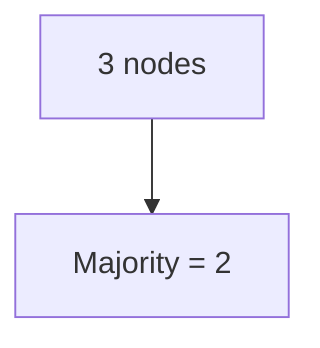

And:


The important property is that two different majorities must overlap.

---

# 4. Why Does Majority Overlap Matter?

Consider five nodes:

```text
A B C D E
```

A majority requires:

```text
3 nodes
```

Suppose one operation uses:

```text
A B C
```

Another operation uses:

```text
C D E
```

They overlap at:

```text
C
```

This overlap is important.

The same node can act as a point of shared knowledge between two quorums.

This leads to an important concept:

> **Quorum intersection helps prevent two independent majorities from making completely disconnected authoritative decisions.**

---

# 5. Quorum Is About More Than Counting Nodes

A common beginner interpretation is:

> "Quorum just means more than half."

That is useful, but incomplete.

A quorum is meaningful because it provides a defined participation boundary.

For example:

```text
5 replicas
Write quorum = 3
```

means:

> A write needs acknowledgement from at least 3 replicas according to the system's rules.

It does **not** automatically mean:

- All 5 nodes have the data
- Every read sees the newest data
- The system is strongly consistent
- The write is permanent forever
- A failure cannot lose data

The exact guarantees depend on the replication and storage design.

---

# 6. Quorum With Replication

Suppose we have:

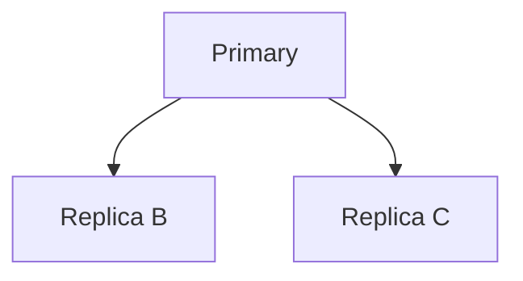

Replication factor:

```text
3
```

Suppose the system requires:

```text
Write quorum = 2
```

A write might proceed like:

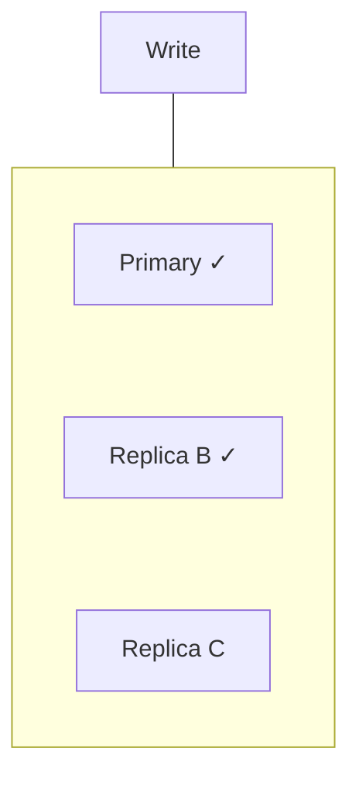

Two participating nodes are enough.

The client receives success.

Replica C may catch up later.

The exact semantics depend on the database or distributed system.

---

# 7. Write Quorum

A **write quorum** defines how many replicas must acknowledge a write.

Suppose:

```text
N = 5
W = 3
```

where:

- `N` = number of replicas
- `W` = write quorum

Then:

```text
3 replicas
```

must participate according to the system's write rules.

Conceptually:

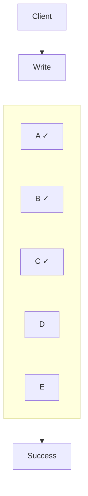

The remaining replicas can catch up later if the system permits that.

---

# 8. Read Quorum

A **read quorum** defines how many replicas participate in a read.

Suppose:

```text
N = 5
R = 3
```

A read may gather responses from three replicas.

```text
Read
 |
 +---- A → Version 100
 +---- B → Version 100
 +---- C → Version 99
```

The system can use its consistency rules to determine which result should be returned.

For example, the newest version may be selected.

But this behavior is system-dependent.

A quorum read is not automatically the same thing as "read the newest value."

---

# 9. The R + W > N Rule

A commonly taught quorum relationship is:

```text
R + W > N
```

where:

- `R` = read quorum
- `W` = write quorum
- `N` = number of replicas

Why is this useful?

Because the read quorum and write quorum must overlap.

For example:

```text
N = 5
R = 3
W = 3
```

Then:

```text
R + W = 6
6 > 5
```

Therefore, any read quorum and write quorum must share at least one replica.

Conceptually:

```text
Write: A B C
Read:      C D E
           ^
        overlap
```

That overlap can help the read discover the written version.

---

# 10. What Does Quorum Intersection Actually Provide?

But there is an important qualification:

> **Quorum mathematics alone does not define the entire consistency model.**

The system also needs rules for:

- Version comparison
- Conflict resolution
- Read repair
- Write propagation
- Failure handling
- Concurrent writes
- Tombstones/deletions
- Membership changes

So:

```text
R + W > N
```

is a useful design relationship, not a universal guarantee of every form of strong consistency.

---

# 11. Why Not Always Use Large Quorums?

Suppose:

```text
N = 5
```

and we require:

```text
W = 5
```

Every write must reach every replica.

This can provide stronger coordination.

But now one slow or unavailable replica can affect writes.

```text
A ✓
B ✓
C ✓
D ✓
E ❌
```

If all five are required:

```text
Write → Cannot complete
```

The system becomes less tolerant of replica failure.

---

# 12. Smaller Quorums Improve Availability

Suppose:

```text
N = 5
W = 3
```

Now two replicas can be unavailable:

```text
A ✓
B ✓
C ✓
D ❌
E ❌
```

and the write can still potentially succeed.

This provides more availability.

But fewer replicas participating can mean:

- More replicas may temporarily lag
- Less immediate redundancy
- Different consistency behavior
- More recovery work

Therefore:

> **Larger quorums generally provide stronger coordination at the cost of availability and latency.**

---

# 13. Quorum During a Network Partition

This is where quorum becomes especially important.

Suppose:

```text
A B C X D E
```

There are five nodes.

The partition separates:

```text
A B C
```

from:

```text
D E
```

With quorum:

```text
3
```

the first side has:

```text
3 nodes → quorum
```

The second side has:

```text
2 nodes → no quorum
```

Therefore only the majority side can continue operations that require quorum.

This helps prevent both sides from independently believing they have authority.

---

# 14. What Happens to the Minority Side?

The minority side may:

- Reject writes
- Stop serving certain operations
- Continue serving limited reads
- Wait for connectivity to return
- Become unavailable for quorum-dependent operations

This can feel like a failure.

But sometimes refusing an operation is the safer behavior.

For example:

```text
Inventory = 1
```

If two isolated sides both allow a sale:

```text
Side A → sells 1
Side B → sells 1
```

the system may oversell the inventory.

A quorum-based design may instead reject one side's write.

---

# 15. Quorum and Availability

This creates an important trade-off.

During a partition:

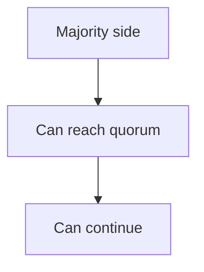

while:

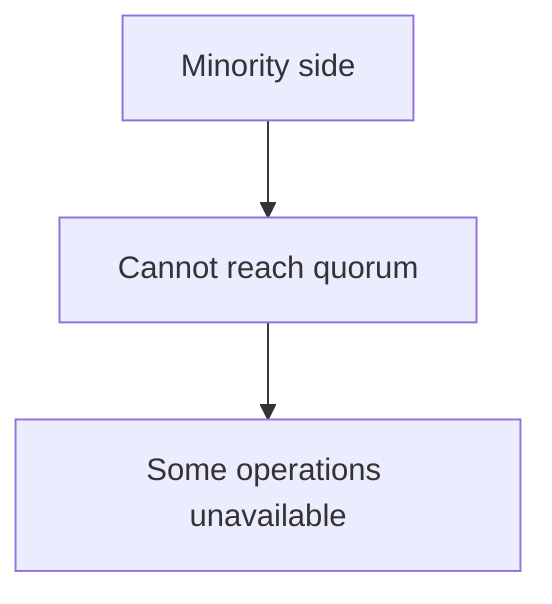

Therefore quorum can intentionally sacrifice some availability to preserve coordination.

This connects directly to **CAP Theorem**.

During a network partition, a system cannot guarantee both:

- Strong consistency
- Full availability

for the same operation under the relevant model.

---

# 16. Quorum Does Not Mean "Everything Is Available"

Suppose a system has five nodes:

```text
A B C D E
```

and quorum is three.

If:

```text
A B C
```

are available, the quorum-dependent operation can proceed.

But that does not mean:

```text
D E
```

are healthy.

The system may still have:

- Reduced redundancy
- Reduced fault tolerance
- Increased recovery risk

So:

> **Meeting quorum means an operation has enough required participation. It does not mean the whole cluster is healthy.**

---

# 17. Quorum and Latency

A quorum operation may need responses from multiple nodes.

Therefore:

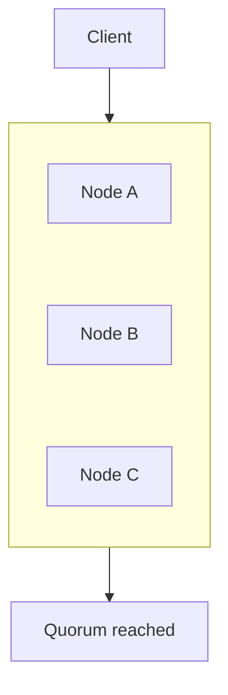

The operation may be affected by the slowest required participant.

For geographically distributed nodes:

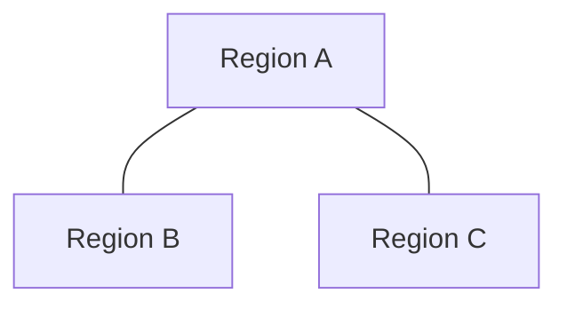

network latency can become significant.

This is one reason geographically distant synchronous/quorum-based replication can increase write latency.

---

# 18. Quorum and Failure

Suppose:

```text
N = 5
Quorum = 3
```

Initially:

```text
A ✓
B ✓
C ✓
D ✓
E ✓
```

One fails:

```text
A ✓
B ✓
C ✓
D ✓
E ❌
```

Still enough.

Two fail:

```text
A ✓
B ✓
C ✓
D ❌
E ❌
```

Still enough.

Three fail:

```text
A ✓
B ✓
C ❌
D ❌
E ❌
```

Only two remain.

```text
2 < 3
```

Quorum cannot be reached.

The system may need to reject quorum-dependent operations.

---

# 19. Quorum Is Not the Same as Replication

These concepts are related but different.

### Replication

Answers:

> **How many copies of the state do we maintain?**

Example:

```text
N = 5
```

Five replicas.

### Quorum

Answers:

> **How many nodes must participate in a particular operation?**

Example:

```text
W = 3
R = 3
```

So:

```text
Replication → copies
Quorum      → required participation
```

---

# 20. Quorum Is Not the Same as Consensus

This distinction is extremely important.

Quorum can mean:

```text
"Enough nodes responded."
```

Consensus means something stronger:

```text
"Distributed nodes agreed on a decision/value
according to a consensus protocol."
```

For example:

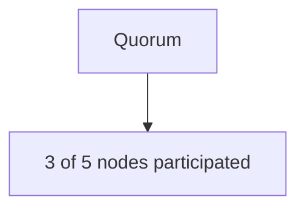

does not by itself explain:

- How conflicting proposals are resolved
- How leadership is established
- How nodes agree on ordering
- How a new leader is chosen
- How stale nodes are prevented from making decisions

Consensus protocols address these deeper coordination problems.

The next chapters will build toward this distinction.

---

# 21. Quorum and Leader-Based Systems

Suppose:

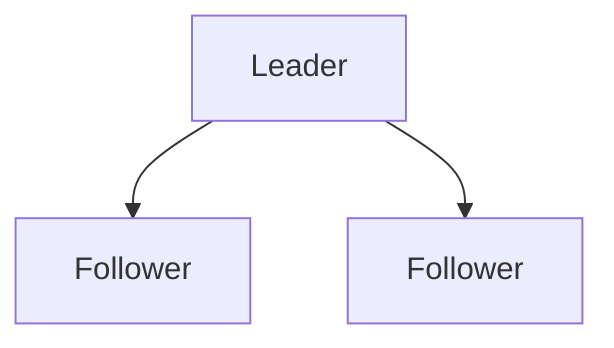

A leader-based system may use a majority to make decisions.

For example:

```text
3 nodes
Quorum = 2
```

If the leader loses contact with one follower but can still communicate with the other:

```text
Leader ✓
Follower ✓
Follower ❌
```

the leader may still have a majority.

But if it loses communication with both:

```text
Leader ✓
Follower ❌
Follower ❌
```

it cannot reach quorum.

Depending on the protocol, it may stop accepting certain operations.

This is one reason quorum and leader election are closely related.

---

# 22. Quorum and Stale Replicas

Suppose:

```text
N = 5
```

and the versions are:

```text
A → 100
B → 100
C → 100
D → 95
E → 95
```

A read quorum might receive:

```text
A → 100
D → 95
E → 95
```

A system needs rules to determine which version is authoritative.

Possible mechanisms include:

- Version numbers
- Timestamps
- Logical clocks
- Vector clocks
- Application-specific conflict resolution

The quorum tells us **which nodes participated**.

It does not, by itself, tell us **which value wins**.

---

# 23. Quorum and Concurrent Writes

Imagine two clients write at nearly the same time.

```text
Client A → Value X
Client B → Value Y
```

Different replicas may temporarily see:

```text
A → X
B → X
C → Y
D → Y
```

A quorum system alone does not magically decide whether:

```text
X
```

or:

```text
Y
```

is correct.

The system needs a conflict-resolution strategy.

Possible strategies include:

- Leader ordering
- Versioning
- Last-write-wins
- Application-specific merge
- Consensus
- Rejection of conflicting writes

This becomes increasingly important in distributed systems.

---

# 24. Quorum and Read Repair

Some replicated systems can use reads to identify stale replicas.

For example:

```text
Read:
A → Version 100
B → Version 100
C → Version 98
```

The system learns:

```text
C is stale
```

It may then repair C:

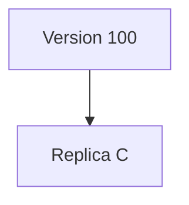

This is sometimes called **read repair**.

The exact behavior depends on the technology.

The important idea is:

> **Reads can sometimes help detect and repair replica divergence.**

---

# 25. Quorum and Data Loss

Consider:

```text
N = 5
W = 3
```

A write succeeds on:

```text
A B C
```

Then:

```text
A B C
```

all fail before the state is safely recovered elsewhere.

The system may lose access to the acknowledged state.

Therefore quorum configuration must be considered together with:

- Durable storage
- Failure domains
- Replication
- Recovery
- Backup
- Failover

Quorum is not a replacement for durability or backup.

---

# 26. Failure Domains Matter

Suppose you have:

```text
Node A → Server Rack 1
Node B → Server Rack 1
Node C → Server Rack 1
```

A quorum of two might look safe.

But if Rack 1 loses power:

```text
A ❌
B ❌
C ❌
```

the entire quorum disappears.

A better design may spread replicas:

```text
Zone A → Node A
Zone B → Node B
Zone C → Node C
```

Now a single zone failure may leave enough nodes.

Therefore:

> **Quorum is only as resilient as the failure domains containing its members.**

---

# 27. Quorum and Geographic Distribution

Consider:

```text
Region A → A
Region B → B
Region C → C
```

A quorum may survive one regional failure.

But cross-region communication can increase latency.

This creates another trade-off:

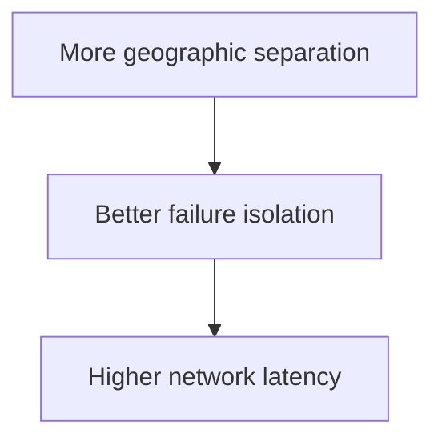

System design often balances:

- Latency
- Failure isolation
- Consistency
- Availability
- Cost

---

# 28. Hands-On Exercise — Quorum

Use this cluster:

```text
        A
       / \
      B---C
```

There are:

```text
N = 3
```

Set:

```text
W = 2
R = 2
```

### Scenario 1 — All Nodes Healthy

```text
A ✓
B ✓
C ✓
```

Can a write succeed?

**Yes.**

At least two nodes can acknowledge.

---

### Scenario 2 — One Node Fails

```text
A ✓
B ✓
C ❌
```

Can a write succeed?

**Yes**, assuming the system can use A and B for the required quorum.

---

### Scenario 3 — Two Nodes Fail

```text
A ✓
B ❌
C ❌
```

Can a quorum write succeed?

No.

Only:

```text
1 < 2
```

nodes are available.

---

# 29. Lab Challenge — Network Partition

Start with:

```text
A B C
```

Quorum:

```text
2
```

Partition the cluster:

```text
A B  X  C
```

### Questions

1. Which side has quorum?
2. Which side can perform quorum-dependent writes?
3. What should happen to C?
4. Why is allowing C to accept authoritative writes dangerous?
5. What happens when the network heals?

### Reasoning

The:

```text
A + B
```

side has quorum.

The:

```text
C
```

side does not.

C should not independently become authoritative if the system requires quorum.

After recovery, C must synchronize with the authoritative state according to the system's recovery rules.

---

# 30. Lab Challenge — Choose the Quorum

You have:

```text
N = 5
```

Compare:

### Option A

```text
R = 1
W = 1
```

### Option B

```text
R = 3
W = 3
```

### Option C

```text
R = 2
W = 4
```

Think about:

- Read latency
- Write latency
- Failure tolerance
- Quorum intersection
- Consistency behavior

There is no universally best configuration.

The right configuration depends on the system's requirements and actual implementation semantics.

---

# 31. Quorum Decision Framework

When designing quorum-based behavior, ask:

### Replication

1. How many copies exist?
2. Where are those copies located?
3. Are they in independent failure domains?

### Writes

4. How many nodes must acknowledge?
5. What happens if quorum cannot be reached?
6. What happens to slower replicas?

### Reads

7. How many nodes participate?
8. How are conflicting responses handled?
9. How are stale replicas detected?

### Failures

10. What happens during a partition?
11. Which side retains authority?
12. How is the minority side prevented from becoming authoritative?

### Recovery

13. How do stale replicas catch up?
14. How are divergent states reconciled?
15. How is the recovered node safely reintroduced?

### Performance

16. How much network latency is introduced?
17. What happens when one node is slow?
18. Are replicas spread across failure domains?

---

# 32. Common Mistakes

### Mistake 1 — "Quorum simply means majority."

Majority is one common quorum strategy, but quorum is more generally about required participation.

### Mistake 2 — "Quorum guarantees strong consistency."

Quorum configuration alone does not define the complete consistency model.

### Mistake 3 — "If a write reaches quorum, every replica has the data."

Not necessarily. Some replicas may catch up later.

### Mistake 4 — "More quorum is always better."

Larger quorums can increase latency and reduce availability.

### Mistake 5 — "Quorum replaces backups."

It does not.

### Mistake 6 — "Quorum is consensus."

Quorum can be part of a consensus protocol, but quorum by itself is not consensus.

### Mistake 7 — "Three replicas in one server rack provide three independent failures."

They may all fail together.

### Mistake 8 — "Quorum solves network partitions."

Quorum helps define safe behavior during partitions; it does not prevent the partition.

### Mistake 9 — "The minority side is useless."

It may still perform limited operations, but it cannot safely perform operations requiring quorum.

### Mistake 10 — "All nodes are equally healthy because they are reachable."

A node may be reachable but stale, overloaded, or unable to safely participate.

---

# 33. System Design View

Quorum is best understood as a **coordination boundary**.

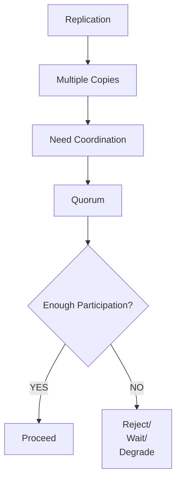

The system must decide what happens when quorum cannot be reached.

That decision is architectural.

For example:

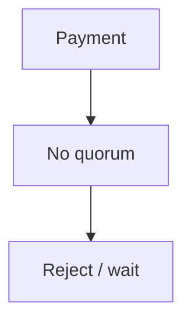

may be safer than:

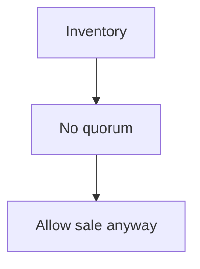

because inventory correctness may depend on coordination.

---

# 34. The Deeper Trade-Off

Quorum is fundamentally about balancing:

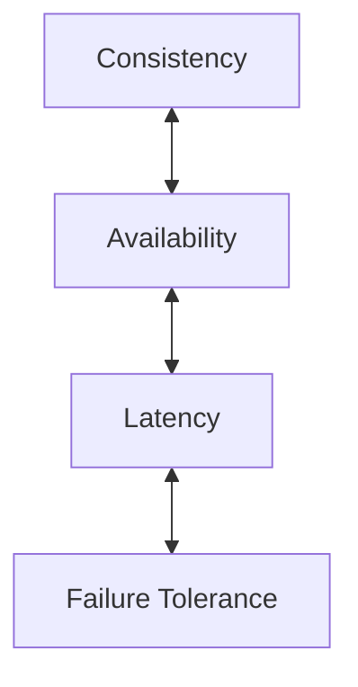

Increasing coordination can improve safety.

But coordination costs:

- Network round trips
- Waiting
- Failure sensitivity
- Operational complexity

Reducing coordination can improve:

- Latency
- Availability
- Geographic flexibility

but may allow:

- Stale reads
- Temporary divergence
- Conflicts
- More complex reconciliation

There is no free quorum.

---

# 35. Quorum Mental Model

Remember these three questions:

### 1. How many copies exist?

```text
N
```

### 2. How many must participate?

```text
R / W
```

### 3. What happens when enough nodes cannot participate?

```text
Wait?
Reject?
Read stale data?
Continue with reduced guarantees?
```

That third question is often the most important one.

---

# 36. Key Principle

> **Quorum defines how much distributed participation is required before an operation can be considered acceptable. By requiring overlapping sets of replicas to participate, quorum can help systems preserve coordination during failures and partitions. But quorum is not automatically strong consistency or consensus: its real guarantees depend on replication, versioning, conflict handling, durability, failure domains, and the rules used when quorum cannot be reached.**

---

# 37. Quick Reference

| Concept | Meaning |
|---|---|
| Quorum | Required participation for an operation |
| Majority | More than half of nodes |
| N | Number of replicas |
| R | Read quorum |
| W | Write quorum |
| `R + W > N` | Common quorum-intersection relationship |
| Quorum Intersection | Different quorums share participating nodes |
| Write Quorum | Nodes required for a write |
| Read Quorum | Nodes required for a read |
| Partition | Communication failure between system parts |
| Minority | Side without enough nodes for quorum |
| Consensus | Protocol for distributed agreement |
| Replication | Maintaining multiple copies |
| Failover | Moving authority after failure |
| Failure Domain | Components that can fail together |

---

# 38. Knowledge Check

1. What is a quorum?
2. Why is majority commonly used?
3. What does `N` represent?
4. What do `R` and `W` represent?
5. Why is `R + W > N` useful?
6. Does quorum automatically guarantee strong consistency?
7. What happens if a network partition leaves only a minority side?
8. Why can larger quorums increase latency?
9. Why does quorum not replace backup?
10. How is quorum different from consensus?

### Answers

1. The minimum required participation from distributed nodes for an operation to be accepted according to the system's rules.
2. A majority ensures that two independent majorities must overlap.
3. The number of replicas participating in the replication model.
4. `R` is the read quorum; `W` is the write quorum.
5. It ensures that a read quorum and write quorum must overlap.
6. No. The complete consistency behavior depends on the system's replication, versioning, conflict-resolution, and read/write rules.
7. Quorum-dependent operations may be rejected or delayed because the minority cannot safely establish the required participation.
8. More nodes may need to respond, and the operation can become sensitive to network latency or slow replicas.
9. Quorum is about distributed participation and coordination; backups provide historical recovery from data loss or corruption.
10. Quorum defines sufficient participation; consensus is a protocol/process for distributed nodes to agree on a value or decision.

---

# 39. Remember

> **Replication gives you multiple copies. Quorum defines how many of those copies must participate. The important system-design question is not simply "What is the quorum?" but "What should the system do when quorum is unavailable?"**
  
---

# Next Chapter

## 06.07 — Leader & Follower

Next, we will examine how distributed systems assign responsibility to one node while other nodes follow its state.

Topics include:

- What leader/follower means
- Why systems use leaders
- Leader responsibilities
- Follower responsibilities
- Write routing
- Read routing
- Replication
- Leader failure
- Follower failure
- Leader promotion
- Leader and quorum
- Leader and network partitions
- Split brain
- Stale followers
- Multi-leader systems
- Leader bottlenecks
- When leader/follower architecture makes sense
- Hands-on leader/follower exercise
- System-design trade-offs
