# 06.07 — Leader & Follower

## Learning Objectives

By the end of this chapter, you should understand:

- What **leader/follower** architecture means
- Why distributed systems use a leader
- The responsibilities of a leader
- The responsibilities of followers
- How writes and reads are routed
- How leader/follower relates to replication
- How quorum can support leader-based systems
- What happens when a follower fails
- What happens when the leader fails
- Why stale followers are a concern
- Why split brain is dangerous
- Leader bottlenecks and scaling limits
- Multi-leader alternatives
- When leader/follower architecture makes sense
- The trade-offs introduced by centralized coordination

---

# Beginner Vocabulary

| Term | Beginner-Friendly Meaning |
|---|---|
| **Leader** | Node currently responsible for coordinating authoritative operations |
| **Follower** | Node that follows the leader's state or decisions |
| **Primary** | Common database term for the authoritative write node |
| **Replica** | Copy of data or state maintained by another node |
| **Leader Election** | Process of choosing a new leader when needed |
| **Promotion** | Making a follower the new leader |
| **Failover** | Moving responsibility from a failed leader to another node |
| **Replication** | Copying state or changes between nodes |
| **Quorum** | Required number of nodes participating in an operation or decision |
| **Term / Epoch** | Number or generation used to distinguish leadership periods |
| **Split Brain** | Situation where multiple nodes believe they are independently authoritative |
| **Stale Replica** | Follower whose state is behind the leader |
| **Heartbeat** | Periodic signal used to indicate that a node is alive/reachable |
| **Fencing** | Preventing an old or isolated leader from continuing to act as leader |
| **Write Routing** | Deciding where write operations should go |
| **Read Routing** | Deciding where read operations should go |
| **Multi-Leader** | Architecture where multiple nodes can act as leaders/writers |
| **Hotspot** | Concentrated workload that makes one node a bottleneck |

---

# 1. What Is Leader / Follower Architecture?

A leader/follower architecture assigns a particular node responsibility for coordinating a set of operations.

A simple example:

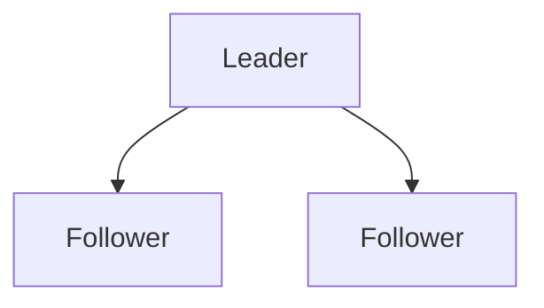

The leader may:

- Accept writes
- Establish ordering
- Coordinate replication
- Make certain decisions

Followers may:

- Receive replicated state
- Serve selected reads
- Provide redundancy
- Become candidates for promotion

### Definition

> **Leader/follower architecture is a distributed design in which one node acts as the current authority for certain operations while other nodes follow its state or decisions.**

The exact responsibilities depend on the system.

---

# 2. Why Do Systems Use a Leader?

Suppose three nodes can all accept writes:

```text
A ← Write X
B ← Write Y
C ← Write Z
```

Now the system must determine:

```text
Which write happened first?
Which value wins?
What should replicas contain?
How are conflicts resolved?
```

Coordination becomes difficult.

A leader can simplify this.

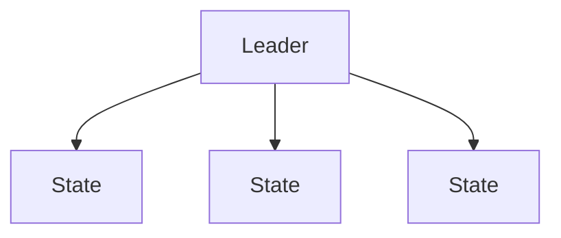

Instead of multiple nodes independently deciding the write order, one node can establish an authoritative sequence.

This can make:

- Write ordering easier
- Conflict handling simpler
- Replication easier
- Client routing clearer

But the leader becomes important infrastructure.

---

# 3. The Basic Architecture

A common design is:

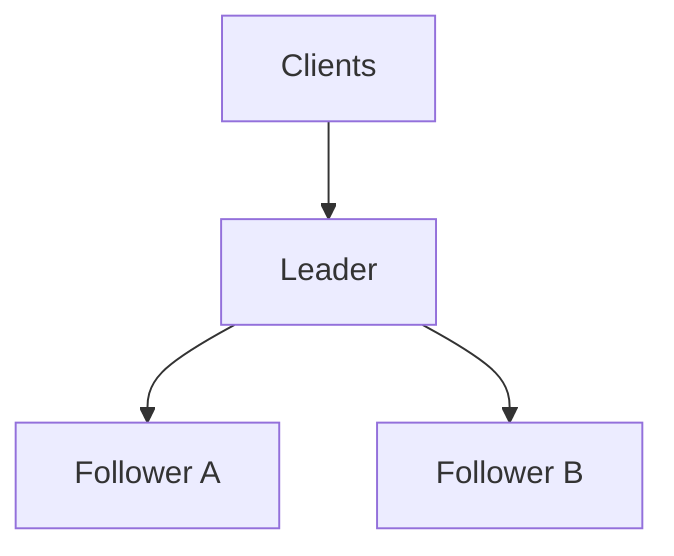

Write path:

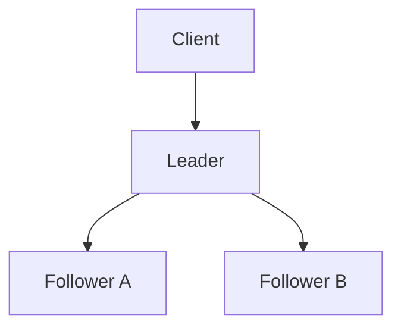

Read path may be:

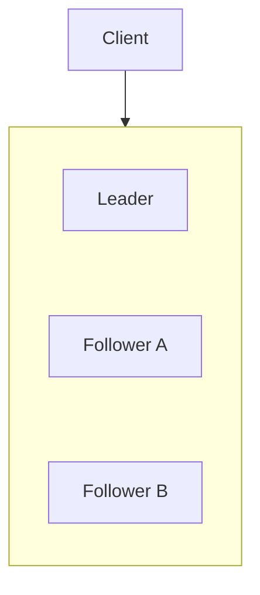

But reads should not automatically go to followers.

The correct destination depends on freshness and consistency requirements.

---

# 4. Leader Responsibilities

A leader may be responsible for:

- Accepting authoritative writes
- Ordering operations
- Validating changes
- Replicating changes
- Coordinating followers
- Managing membership
- Responding to clients
- Maintaining authoritative state

For example:

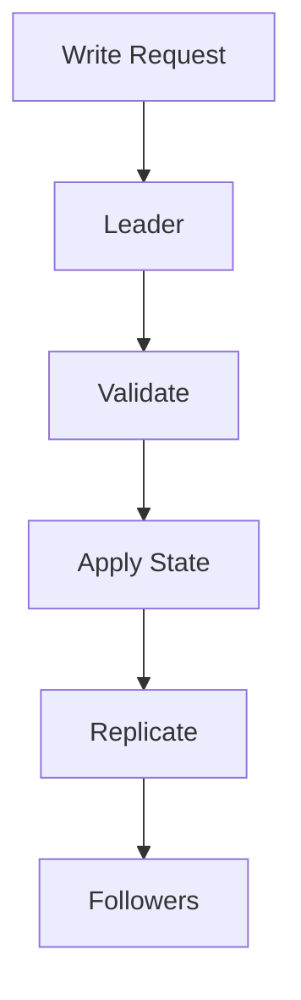

The exact sequence depends on the technology.

---

# 5. Follower Responsibilities

Followers commonly:

- Receive replicated changes
- Apply those changes
- Serve selected reads
- Maintain redundant copies
- Support failover
- Report health and replication status

For example:

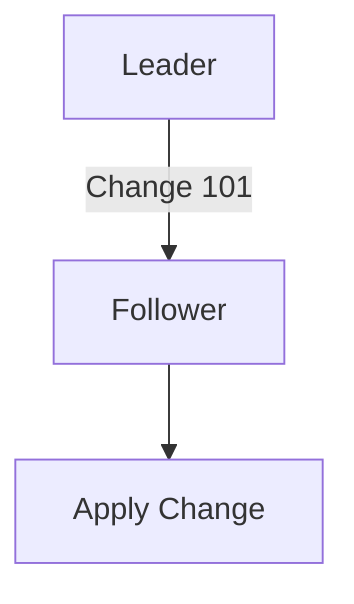

A follower is therefore not simply a passive backup.

It may actively:

- Serve reads
- Participate in quorum
- Report health
- Prepare for promotion
- Replicate state to other nodes in some architectures

---

# 6. Leader vs Primary

You have already seen the term **primary** in database architecture.

These concepts are closely related.

```text
Database terminology:
Primary → Replica
```

Distributed-system terminology:

```text
Leader → Follower
```

Often:

```text
Leader ≈ Primary
Follower ≈ Replica
```

But they are not universal synonyms.

A leader may coordinate things other than database writes.

For example:

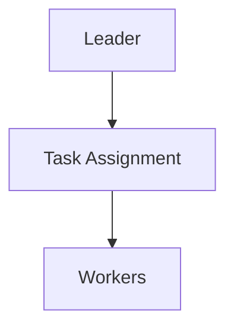

Therefore:

> **Leader/follower is a broader distributed-systems pattern; primary/replica is commonly used for replicated databases.**

---

# 7. Leader and Replication

Leader/follower commonly uses replication.

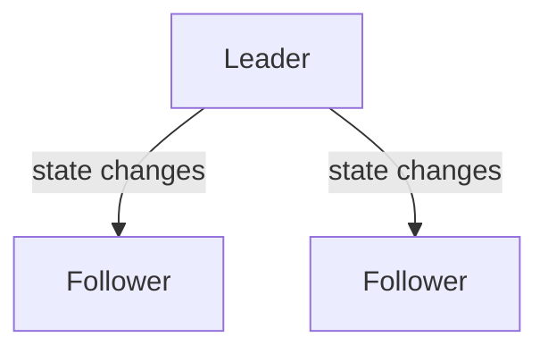

Suppose the leader contains:

```text
Version = 100
```

Follower A:

```text
Version = 100
```

Follower B:

```text
Version = 98
```

Follower B is behind.

The leader remains authoritative.

The follower must catch up.

---

# 8. Leader and Write Routing

One of the simplest benefits of leader architecture is clear write routing.

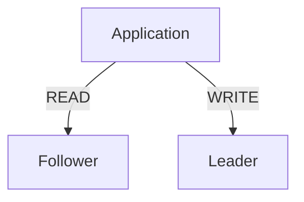

This reduces the number of nodes independently accepting writes.

Instead of:

```text
A → Write
B → Write
C → Write
```

the system can use:

```text
A → Leader → Write
B → Follower
C → Follower
```

This can greatly simplify coordination.

---

# 9. Leader Bottleneck

Leader architecture simplifies writes.

But the leader can become a bottleneck.

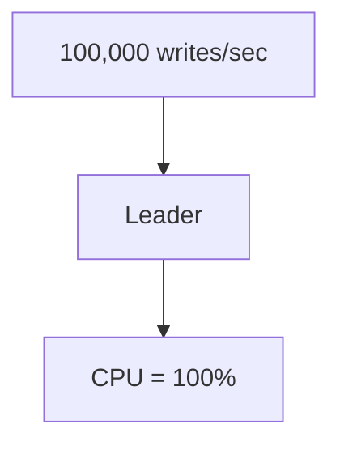

Adding more followers does not automatically solve this.

Followers primarily help with:

- Read scaling
- Redundancy
- Failover

The leader may still handle most writes.

This creates an important architectural question:

> **Can one leader provide enough write capacity for the workload?**

If not, the system may eventually need:

- Sharding
- Partitioned leaders
- Multiple leaders
- Distributed ownership
- Different data architecture

---

# 10. Leader as a Coordination Bottleneck

The bottleneck is not always CPU.

The leader may also become limited by:

- Network bandwidth
- Disk I/O
- Lock contention
- Transaction rate
- Replication bandwidth
- Connection limits
- Serialization
- Coordination overhead

For example:

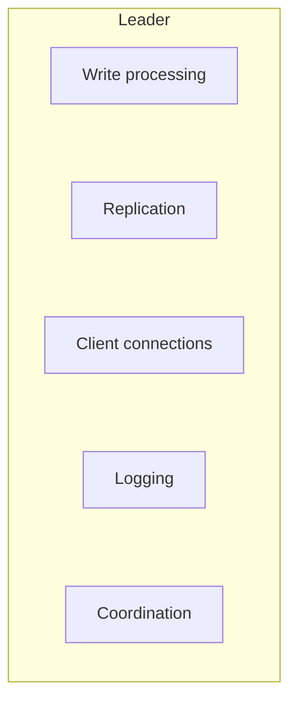

All these responsibilities compete for resources.

---

# 11. Multiple Follower Failures

Suppose:

```text
Leader ✓
Follower A ❌
Follower B ❌
```

The leader may still serve writes.

But redundancy has decreased.

The system is now more vulnerable to another failure.

Therefore:

> **Availability is not the same as redundancy.**

A system can remain available while becoming increasingly fragile.

---

# 12. Leader Failure

Now consider:

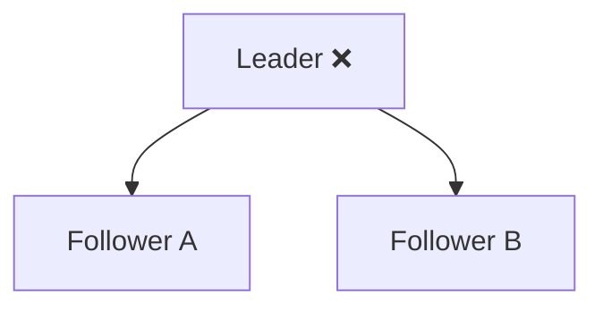

Who should become leader?

This is not simply:

```text
"Pick one."
```

The system needs to determine:

- Which follower is sufficiently up-to-date?
- Who has authority to promote?
- Can the remaining nodes communicate?
- Is quorum available?
- Is another node already leader?
- How will clients discover the new leader?
- What happens to the old leader if it returns?

This leads directly into **leader election**, which is the next chapter.

---

# 13. Promotion

Suppose:

```text
Old Leader ❌

Follower A → Version 100
Follower B → Version 98
```

Follower A may be a better promotion candidate because it has more current state.

Conceptually:

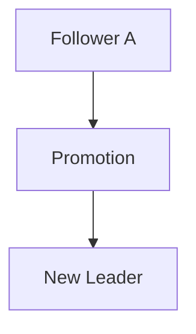

But promotion should not be based only on "which node has the highest version."

A real system also needs authority and coordination rules.

---

# 14. Why Promotion Is Dangerous

Imagine:

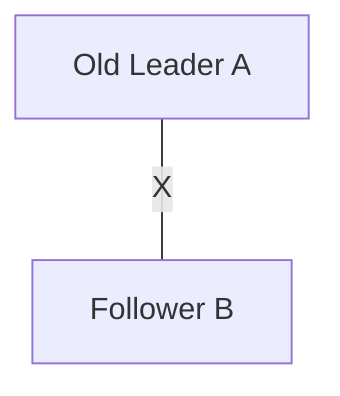

B is promoted.

Later the network reconnects:

```text
A ←→ B
```

If A still thinks it is leader:

```text
A → Write X
B → Write Y
```

you now have two leaders.

This is **split brain**.

Split brain can cause:

- Conflicting writes
- Divergent state
- Duplicate operations
- Data corruption
- Difficult recovery

Therefore safe promotion requires more than detecting that a node appears unreachable.

---

# 15. Heartbeats

Systems often use heartbeats.

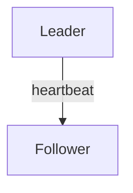

Repeated signals indicate that a node is reachable.

For example:

```text
t1 → heartbeat ✓
t2 → heartbeat ✓
t3 → heartbeat ✓
t4 → timeout
```

The follower may now suspect a leader failure.

But:

> **A missed heartbeat does not prove that the leader has crashed.**

The network itself may be broken.

This is why leader election requires additional coordination rules.

---

# 16. Leader and Network Partitions

Consider:

```text
A — B  X  C
```

Suppose A is leader.

The partition leaves:

```text
A + B
```

on one side and:

```text
C
```

on the other.

If quorum requires two nodes:

```text
A + B → quorum
C     → no quorum
```

The minority side should not independently establish authority.

This connects the concepts:

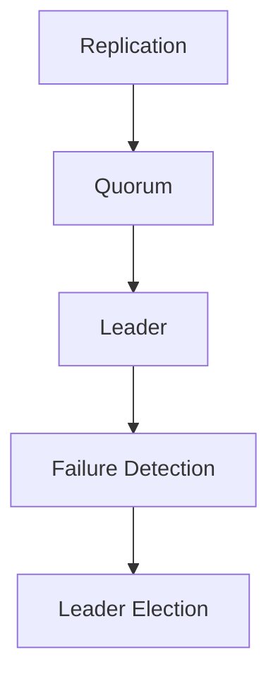

Each solves a different part of the problem.

---

# 17. Leader Terms / Epochs

Distributed systems often need to distinguish different leadership periods.

For example:

```text
Term 10 → Leader A
Term 11 → Leader B
```

A node receiving a message from an older term can recognize:

```text
"This message belongs to an old leadership generation."
```

This helps prevent stale leaders from continuing to make decisions.

The exact mechanism varies by system.

It may use:

- Terms
- Epochs
- Generations
- Logical versions

The principle is the same:

> **Leadership must have an identifiable generation so stale authority can be rejected.**

---

# 18. Fencing

Suppose:

```text
Old Leader A
```

becomes isolated.

Later:

```text
New Leader B
```

is elected.

A safe system may need to actively prevent A from performing authoritative work.

This is called **fencing**.

Conceptually:

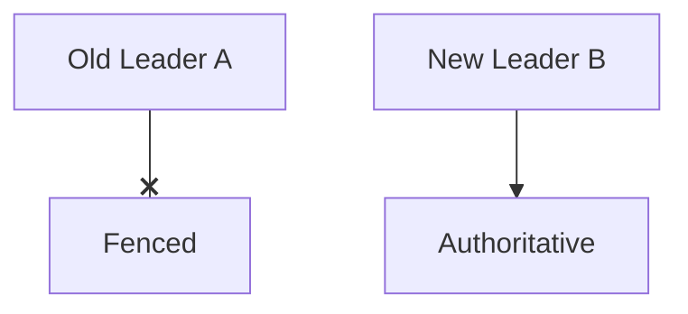

Fencing can involve mechanisms such as:

- Expiring leases
- Epoch checks
- Storage-level ownership
- External coordination
- Network/device controls

The exact implementation depends on the system.

---

# 19. Leader/Follower and Caching

Caching can be placed around a leader/follower architecture.

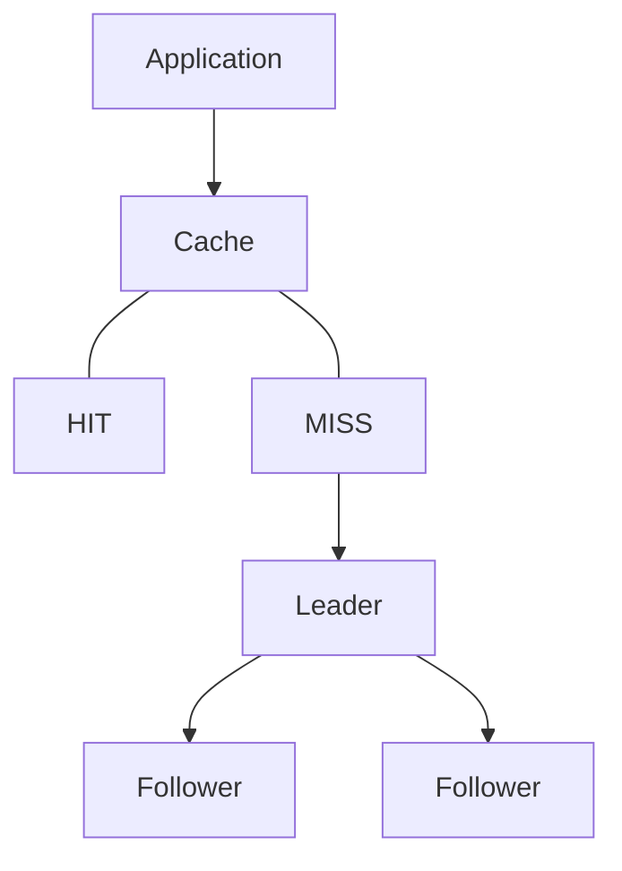

Now there can be multiple freshness layers:

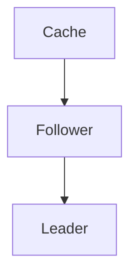

Each layer can become stale.

This makes invalidation and consistency important.

---

# 20. Leader/Follower and Queues

Leader/follower can also appear in messaging systems.

For example:

```mermaid
flowchart TD
  accTitle: Leader and follower brokers
  accDescr: A leader broker with two follower brokers.
  L["Leader Broker"] --- A["Follower Broker"] & B["Follower Broker"]
```

The exact architecture differs by technology.

The general pattern remains:

```mermaid
flowchart TD
  accTitle: The general pattern
  accDescr: One node coordinates, then Other nodes replicate/follow.
  N0["One node coordinates"] --> N1["Other nodes replicate/follow"]
```

This is why leader/follower is a general distributed-systems concept, not only a database concept.

---

# 21. Multi-Leader Architecture

A different design allows multiple leaders.

```mermaid
flowchart TD
  accTitle: Multi-leader architecture
  accDescr: Leader A and leader B replicate with each other and both feed the followers.
  subgraph R[" "]
    direction LR
    A["Leader A"] <--> B["Leader B"]
  end
  R --- F["Followers"]
```

Multiple leaders can accept writes.

This can improve:

- Geographic write latency
- Write availability
- Regional autonomy

But it introduces:

- Write conflicts
- Conflict resolution
- More complex replication
- Ordering problems
- More complicated failure handling

For example:

```text
Leader A → Balance = ₹800
Leader B → Balance = ₹900
```

Which value is correct?

The system needs a conflict-resolution strategy.

---

# 22. Single Leader vs Multi-Leader

| Architecture | Main Advantage | Main Cost |
|---|---|---|
| Single Leader | Simple write coordination | Leader bottleneck/failover complexity |
| Multi-Leader | Multiple write locations | Conflict resolution |
| Leaderless | More distributed participation | More complex consistency/coordination |

There is no universally best architecture.

The correct choice depends on:

- Workload
- Geography
- Consistency requirements
- Failure model
- Operational capability

---

# 23. Leader/Follower vs Leaderless

Leader/follower:

```mermaid
flowchart TD
  accTitle: Leader/follower
  accDescr: A leader with two followers.
  L["Leader"] --> F1["Follower"] & F2["Follower"]
```

Leaderless:

```mermaid
flowchart LR
  accTitle: Leaderless
  accDescr: A, B and C communicate directly with each other.
  A["A"] <--> B["B"] <--> C["C"]
```

In a leaderless design, multiple nodes may participate directly in reads/writes.

Quorum mechanisms often become more important.

Leader-based designs simplify ordering by assigning authority.

Leaderless designs can distribute responsibility more broadly but often require more sophisticated consistency and conflict handling.

---

# 24. When Leader/Follower Makes Sense

Leader/follower is useful when:

- One authoritative write sequence is valuable
- Write conflicts should be minimized
- Read traffic is much larger than write traffic
- Failover is required
- Replication is needed
- A single coordinator can handle the write workload
- Operational simplicity is important

Common examples include:

- Relational databases
- Distributed logs
- Coordination systems
- Some messaging systems
- Replicated state machines

---

# 25. When Leader/Follower May Not Be Enough

It may become problematic when:

### The leader becomes a write bottleneck

```mermaid
flowchart TD
  accTitle: Write bottleneck
  accDescr: Too many writes, then Leader, then Saturation.
  N0["Too many writes"] --> N1["Leader"] --> N2["Saturation"]
```

### Users need geographically local writes

```text
India → Leader in USA
```

The network distance can increase latency.

### Multiple regions need independent write availability

A multi-leader or partitioned architecture may be more suitable.

### The dataset is too large for one leader

Sharding may be required:

```text
Shard A → Leader A
Shard B → Leader B
Shard C → Leader C
```

This is an important evolution pattern.

---

# 26. Leader/Follower and Sharding

Sharding can create multiple independent leader groups.

```mermaid
flowchart TD
  accTitle: Leader/follower per shard
  accDescr: Shards 1, 2 and 3 each have a leader with followers F1 and F2.
  subgraph S1["Shard 1"]
    direction TB
    L1["Leader"] --> A1["F1"] & B1["F2"]
  end
  subgraph S2["Shard 2"]
    direction TB
    L2["Leader"] --> A2["F1"] & B2["F2"]
  end
  subgraph S3["Shard 3"]
    direction TB
    L3["Leader"] --> A3["F1"] & B3["F2"]
  end
  A1 & B1 ~~~ L2
  A2 & B2 ~~~ L3
```

Now the system has:

- Multiple leaders
- Multiple follower groups
- Distributed ownership

The architecture can scale further.

But it also introduces more coordination and routing complexity.

---

# 27. Hands-On Exercise — Design a Leader/Follower System

Consider:

```mermaid
flowchart TD
  accTitle: Exercise architecture
  accDescr: The application uses a leader with two followers.
  A["Application"] --> L["Leader"] --> F1["Follower"] & F2["Follower"]
```

Requirements:

- Orders must have one authoritative write path.
- Product browsing can tolerate small amounts of staleness.
- Current account balance must be fresh.
- Leader failure should not permanently stop the system.

### Design

Write operations:

```text
Create Order → Leader
Update Order → Leader
Update Balance → Leader
```

Read operations:

```text
Product Catalog → Follower
Order History → Follower
Current Balance → Leader
```

Failure:

```mermaid
flowchart TD
  accTitle: Failure handling
  accDescr: Leader fails, then Elect/promote suitable follower, then Redirect writes, then Recover old leader safely.
  N0["Leader fails"] --> N1["Elect/promote suitable follower"] --> N2["Redirect writes"] --> N3["Recover old leader safely"]
```

---

# 28. Lab Challenge — Identify the Problem

You have:

```text
Leader      → 10,000 writes/sec
Follower A  → 5,000 reads/sec
Follower B  → 5,000 reads/sec
```

Read traffic increases dramatically.

The leader's CPU is currently:

```text
35%
```

Followers are:

```text
90%
```

### Question

Would adding another follower necessarily solve the current bottleneck?

**Possibly yes**, if the bottleneck is read capacity and reads can safely be routed to another follower.

Now change the situation:

```text
Leader CPU = 100%
Followers = 30%
```

Would another follower solve the bottleneck?

**No.**

The leader is the constrained component.

Possible solutions might involve:

- Query optimization
- Reducing write load
- Batching
- Vertical scaling
- Sharding
- Partitioned leadership
- Different data architecture

The correct solution depends on the actual workload.

---

# 29. Practical Leader/Follower Investigation

When a leader/follower system becomes slow or unreliable:

```mermaid
flowchart TD
  accTitle: Leader/follower investigation
  accDescr: Observe, then Identify Leader, then Check Leader Capacity, then Check Follower Health, then Check Replication Lag, then Check Network, then Check Quorum, then Check Failure Detection, then Check Read Routing, then Check Write Routing, then Check Client Connections, then Identify Bottleneck, then Recover / Scale, then Measure Again.
  N0["Observe"] --> N1["Identify Leader"] --> N2["Check Leader Capacity"] --> N3["Check Follower Health"] --> N4["Check Replication Lag"] --> N5["Check Network"] --> N6["Check Quorum"] --> N7["Check Failure Detection"] --> N8["Check Read Routing"] --> N9["Check Write Routing"] --> N10["Check Client Connections"] --> N11["Identify Bottleneck"] --> N12["Recover / Scale"] --> N13["Measure Again"]
```

Do not immediately add more followers.

First identify what is actually constrained.

---

# 30. Common Mistakes

### Mistake 1 — Thinking leader means "most powerful server"

Leader is about **authority**, not necessarily hardware size.

### Mistake 2 — Sending every read to followers

Freshness requirements determine routing.

### Mistake 3 — Assuming followers are always current

Replication lag can make them stale.

### Mistake 4 — Adding followers to solve a write bottleneck

Followers generally increase read capacity, not single-leader write capacity.

### Mistake 5 — Treating leader failure as simple server replacement

Failover also requires authority, routing, state, and client reconnection.

### Mistake 6 — Promoting a follower without checking its state

A stale follower may not contain the latest committed state.

### Mistake 7 — Ignoring the old leader

A returning old leader can create split brain.

### Mistake 8 — Assuming heartbeat proves failure

A missed heartbeat can be caused by network problems.

### Mistake 9 — Assuming quorum automatically elects a leader

Quorum provides participation rules; leader election is a separate coordination problem.

### Mistake 10 — Using one leader when the workload requires distributed write ownership

A single leader can become a fundamental scaling limit.

---

# 31. System Design View

Leader/follower architecture can be understood as:

```mermaid
flowchart TD
  accTitle: Leader/follower system design
  accDescr: Need authoritative coordination: leader, which provides replication and ordering; followers give read scale and failover.
  N["Need authoritative coordination"] --> L["Leader"] --> R["Replication"] & O["Ordering"]
  R & O --> F["Followers"] --> S["Read Scale"] & V["Failover"]
```

The design works well when one authority can coordinate the required operations.

As the system grows:

```mermaid
flowchart TD
  accTitle: Architecture evolution
  accDescr: Single Leader, then Leader + Followers, then Leader + Many Followers, then Sharded Leaders, then Multiple Leaders / Distributed Coordination.
  N0["Single Leader"] --> N1["Leader + Followers"] --> N2["Leader + Many Followers"] --> N3["Sharded Leaders"] --> N4["Multiple Leaders / Distributed Coordination"]
```

Architecture evolves when the constraints change.

---

# 32. The Core Trade-Off

Leader/follower provides a useful simplification:

```mermaid
flowchart TD
  accTitle: The simplification
  accDescr: One authority, then Simpler ordering, then Simpler writes.
  N0["One authority"] --> N1["Simpler ordering"] --> N2["Simpler writes"]
```

But creates a dependency:

```mermaid
flowchart TD
  accTitle: The dependency
  accDescr: One authority, then Leader capacity, then Potential bottleneck.
  N0["One authority"] --> N1["Leader capacity"] --> N2["Potential bottleneck"]
```

It also creates a failure problem:

```mermaid
flowchart TD
  accTitle: The failure problem
  accDescr: Leader fails, then Who becomes leader?.
  N0["Leader fails"] --> N1["Who becomes leader?"]
```

Therefore the architecture trades:

> **Simpler coordination for dependence on leader availability and capacity.**

---

# 33. Decision Framework

Use leader/follower when you can answer **yes** to questions such as:

- Do we benefit from one authoritative write path?
- Can one leader handle the write workload?
- Can followers safely serve selected reads?
- Can we tolerate replication lag where appropriate?
- Do we have a safe failover mechanism?
- Can we prevent split brain?
- Can we monitor leader and follower health?
- Can followers recover and catch up?

If these assumptions stop being true, the architecture may need to evolve.

---

# 34. Key Principle

> **Leader/follower architecture assigns one node authority over a set of operations while other nodes replicate and follow its state or decisions. This simplifies write ordering and conflict management, and followers can provide read capacity and failover. But the leader can become a bottleneck or single coordination point, and leader failure introduces difficult questions around election, quorum, stale state, split brain, and recovery.**

---

# 35. Quick Reference

| Concept | Meaning |
|---|---|
| Leader | Current authoritative coordinator |
| Follower | Node that follows leader state/decisions |
| Primary | Common database term similar to leader |
| Replica | Copy of state |
| Promotion | Making follower the new leader |
| Failover | Moving responsibility after failure |
| Replication | Propagating state between nodes |
| Leader Election | Choosing a new leader |
| Quorum | Required node participation |
| Heartbeat | Signal indicating reachability |
| Term / Epoch | Leadership generation |
| Fencing | Preventing stale authority from acting |
| Split Brain | Multiple nodes incorrectly acting as leader |
| Stale Follower | Follower behind leader |
| Multi-Leader | Multiple nodes can accept authoritative writes |

---

# 36. Knowledge Check

### 1. Why do distributed systems use leaders?

To provide a clear authority for operations such as writes, ordering, or coordination.

### 2. Is a leader always the same thing as a database primary?

Not necessarily. Primary/replica is commonly a database pattern; leader/follower is a broader distributed-systems pattern.

### 3. Do followers have to serve only reads?

No. Their exact responsibilities depend on the system.

### 4. Why can followers return stale data?

Because replication may be asynchronous or delayed.

### 5. Why can a leader become a bottleneck?

It may coordinate and process a large amount of write or other authoritative work.

### 6. Does adding followers automatically increase write capacity?

No.

### 7. What happens when a leader fails?

The system needs a safe mechanism to detect the failure, choose or elect a new leader, redirect clients, and prevent the old leader from causing conflicting operations.

### 8. Why is split brain dangerous?

Multiple nodes may independently accept authoritative operations, creating conflicting state.

### 9. Why is quorum useful with leader-based systems?

It can help establish whether enough nodes are participating to safely maintain authority or make certain decisions.

### 10. What is the next major problem after understanding leader/follower?

How the system safely chooses a new leader when the current leader fails.

---

# 37. Remember

> **A leader provides authority; followers provide copies, redundancy, and potentially read capacity. The difficult part begins when the leader becomes slow, stale followers fall behind, or the leader disappears—because the system must then decide who is authoritative and how to prevent conflicting decisions.**

---

# Next Chapter

## 06.08 — Leader Election

Next we move from:

> **"What is a leader?"**

to:

> **"How does a distributed system safely choose a leader?"**

Topics include:

- What leader election means
- Why leader election is necessary
- Failure detection
- Candidate nodes
- Election terms/epochs
- Quorum and elections
- Majority-based elections
- Split brain prevention
- Stale leaders
- Fencing
- Heartbeats
- Election timeouts
- Leader re-election
- Network partitions
- Election failure scenarios
- Leader election vs failover
- Leader election vs consensus
- Practical election examples
- Hands-on leader-election exercise
- System-design trade-offs
