# 06.08 — Leader Election

## Learning Objectives

By the end of this chapter, you will be able to:

- Explain what leader election means.
- Understand why distributed systems need leader election.
- Explain how nodes detect a missing leader.
- Understand candidates, elections, terms, and epochs.
- Explain the role of quorum/majority.
- Understand why network partitions make elections difficult.
- Explain how split brain can occur.
- Understand how fencing protects against stale leaders.
- Distinguish leader election from failover.
- Distinguish leader election from consensus.
- Reason about common leader-election failure scenarios.

---

# Beginner Vocabulary

| Term | Beginner-Friendly Meaning |
|---|---|
| **Leader** | The node currently responsible for coordinating certain operations. |
| **Follower** | A node that follows the current leader's state or decisions. |
| **Leader Election** | The process of choosing a new leader when leadership is unavailable or needs to change. |
| **Candidate** | A node that is trying to become the leader. |
| **Election** | The process through which nodes decide who should become leader. |
| **Term** | A numbered period representing one leadership generation. |
| **Epoch** | Another common name for a leadership generation/version. |
| **Heartbeat** | A periodic signal showing that a node is still active. |
| **Quorum** | The minimum number of nodes required to make certain decisions safely. |
| **Majority** | More than half of the participating nodes. |
| **Split Brain** | A situation where multiple nodes believe they are independently authoritative. |
| **Fencing** | Preventing an old or invalid leader from continuing to perform authoritative work. |
| **Failover** | Moving service or traffic to another component after failure. |
| **Promotion** | Changing a follower into the active leader. |
| **Stale Leader** | An old leader that incorrectly continues acting as leader. |
| **Network Partition** | A situation where parts of a distributed system cannot reliably communicate. |
| **Consensus** | A broader process for distributed nodes to agree on decisions or values. |

---

# 1. What Is Leader Election?

In a leader/follower system, one node may be responsible for coordinating certain operations.

For example:

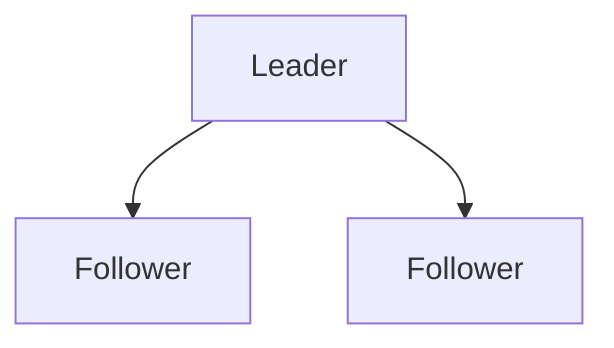

The leader might coordinate:

- Writes.
- Replication.
- Ordering.
- Configuration changes.
- Work assignment.
- Cluster membership decisions.

But what happens if the leader fails?

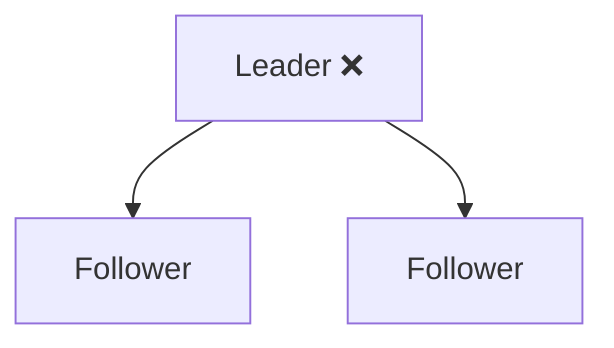

The system needs to determine:

> **Who should become the new leader?**

The process of choosing that new leader is called **leader election**.

---

# 2. Why Does Leader Election Exist?

Without an election mechanism, the system may not know who has authority.

Imagine three nodes:

```text
Node A = Leader
Node B = Follower
Node C = Follower
```

Node A fails.

Now:

```text
Node A = ❌
Node B = ?
Node C = ?
```

Both B and C might think:

> "I should take over."

If both become authoritative, the system can enter an unsafe state.

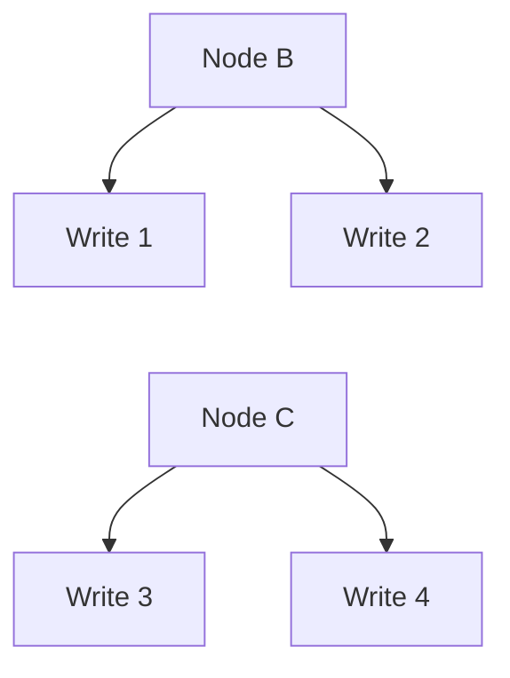

Now there are two competing authorities.

Leader election exists to establish:

> **Which node has authority to lead the system now?**

---

# 3. Leader Election Is a Distributed Problem

At first, leader election sounds simple:

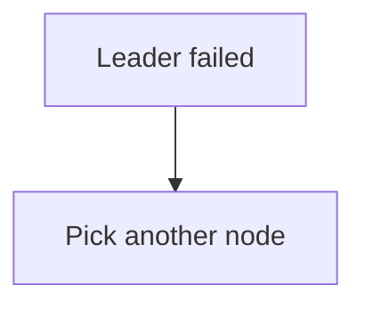

But each node has only a partial view of the system.

For example:

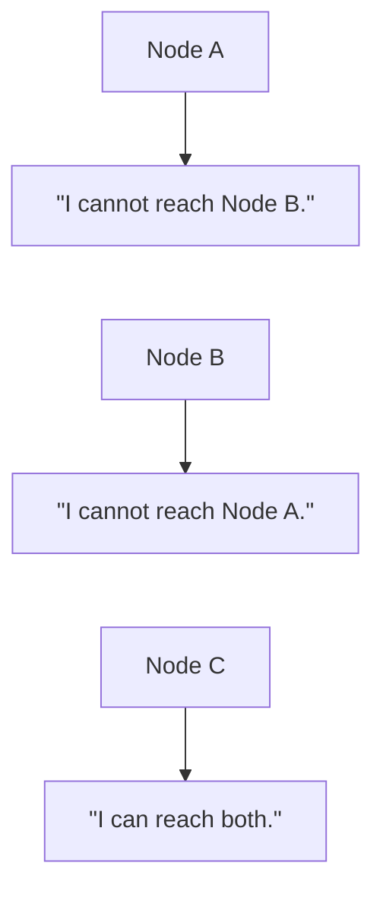

A node that cannot reach another node cannot automatically know why.

The other node might be:

- Dead.
- Slow.
- Network-isolated.
- Restarting.
- Temporarily overloaded.

Therefore:

> **Failure detection is not the same as proving that a node has failed.**

This is one of the most important ideas in distributed systems.

---

# 4. Heartbeats

Leader election commonly relies on some form of health or liveness signal.

A leader may periodically send:

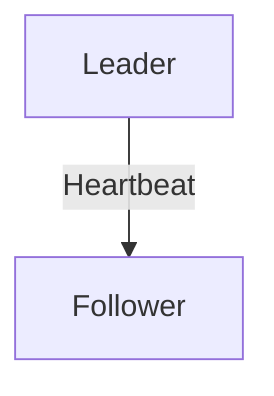

For multiple followers:

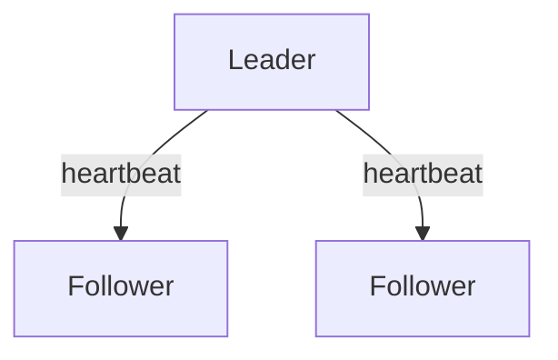

A heartbeat basically communicates:

> "I am still participating as leader."

If followers stop receiving expected heartbeats, they may suspect that the leader is unavailable.

But the system must be careful.

No heartbeat could mean:

```text
Leader crashed
       OR
Network problem
       OR
Leader overloaded
       OR
Follower overloaded
       OR
Temporary packet loss
```

Therefore, an election timeout represents **suspicion**, not absolute proof.

---

# 5. Election Timeout

Suppose followers expect a heartbeat every 1 second.

If a follower receives nothing for a defined period:

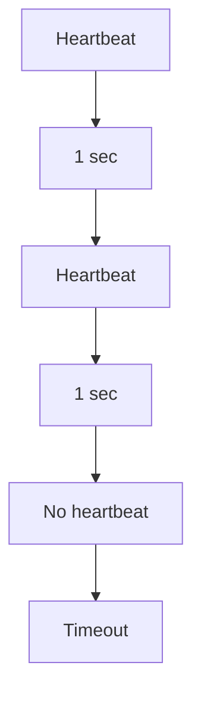

The follower may begin an election.

Conceptually:

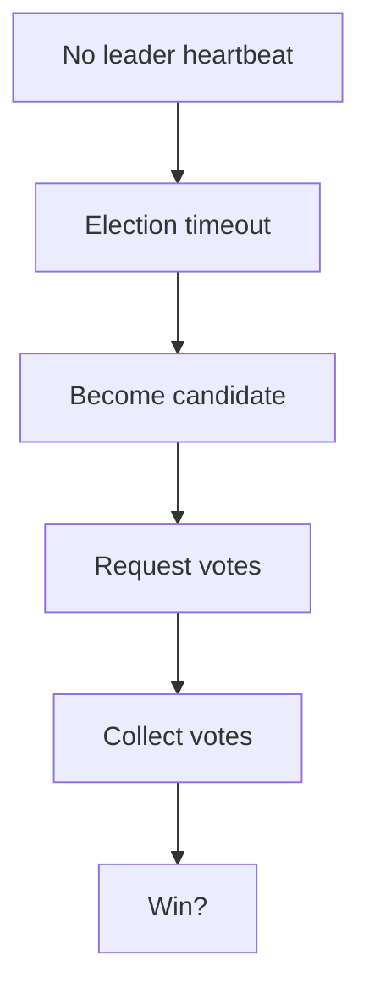

The exact timeout and election behavior depend on the technology.

---

# 6. Candidate

When a node believes a new leader is required, it can become a **candidate**.

For example:

```text
Before election:

A = Leader
B = Follower
C = Follower
```

If A becomes unavailable:

```text
A = ❌
B = Candidate
C = Follower
```

The candidate asks other eligible nodes to participate in the election.

Conceptually:

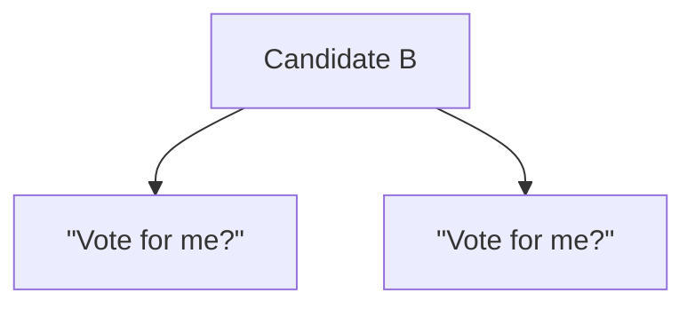

The candidate needs to satisfy the election rules defined by the distributed system.

---

# 7. Why Majority Matters

Consider three nodes:

```text
A
B
C
```

A majority is:

```text
2 out of 3
```

Suppose A is leader.

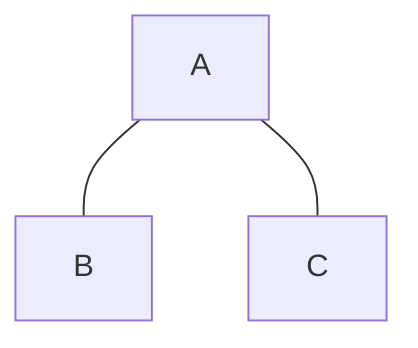

A fails.

B and C can communicate:

```text
B <----> C
```

They have:

```text
2 / 3 nodes
```

So they have a majority.

One can become the new leader according to the election protocol.

For example:

```text
B = Candidate
C = Follower

B requests vote
      ↓
C votes B
      ↓
B has majority
      ↓
B becomes Leader
```

The exact rules depend on the implementation.

---

# 8. Why Not Just Let Anyone Become Leader?

Suppose B cannot reach C.

```text
A ❌

B     X     C
```

B might say:

> "Nobody else is responding. I'll become leader."

But C might make the same decision:

> "Nobody else is responding. I'll become leader."

Now:

```text
B = Leader
C = Leader
```

This is dangerous.

Both sides may accept operations.

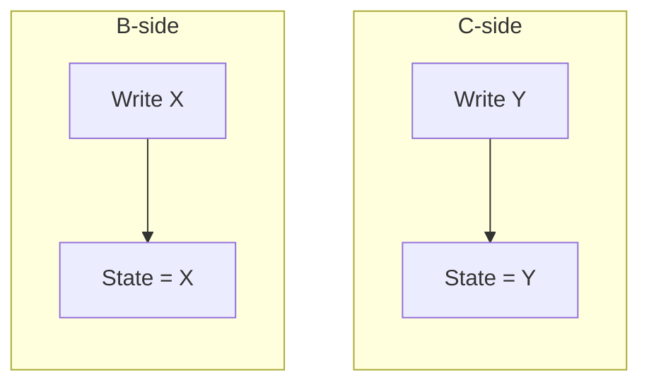

This is one way **split brain** can occur.

A safe election mechanism therefore needs rules about:

- Who can vote.
- How many votes are required.
- Which leadership generation is current.
- What happens during a partition.
- How stale leaders are prevented from acting.

---

# 9. Election Terms

A system needs a way to distinguish one leadership generation from another.

Consider:

```text
Term 1
-------
Leader = A
```

A fails.

Then:

```text
Term 2
-------
Leader = B
```

Later B fails:

```text
Term 3
-------
Leader = C
```

The term acts like a leadership generation number.

Conceptually:

```text
Term 1 → Term 2 → Term 3 → Term 4
```

This helps nodes recognize whether a message belongs to:

- Current leadership.
- Older leadership.
- A future leadership generation.

---

# 10. Why Terms Matter

Imagine an old leader comes back after being disconnected.

Before the partition:

```text
Term 5
Leader = A
```

A becomes isolated.

The remaining nodes elect B:

```text
Term 6
Leader = B
```

Later A reconnects.

A may still think:

```text
"I am Leader."
```

But the cluster knows:

```text
Current term = 6
A's term = 5
```

Therefore A is stale.

```text
Term 5 → OLD
Term 6 → CURRENT
```

The system can reject A's leadership claims.

This is one reason leadership generations are so important.

---

# 11. Epochs

Some systems use the term **epoch** instead of term.

The basic idea is similar:

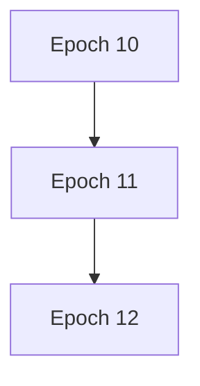

Each leadership generation gets a newer identifier.

A node can compare:

```text
My term = 11
Received term = 12
```

and understand:

> "The other side knows about a newer leadership generation."

The exact meaning of terms/epochs depends on the system.

For System Design, remember:

> **A leadership generation gives the system a way to distinguish current authority from old authority.**

---

# 12. Election With Three Nodes

Let's walk through a simple example.

Initial state:

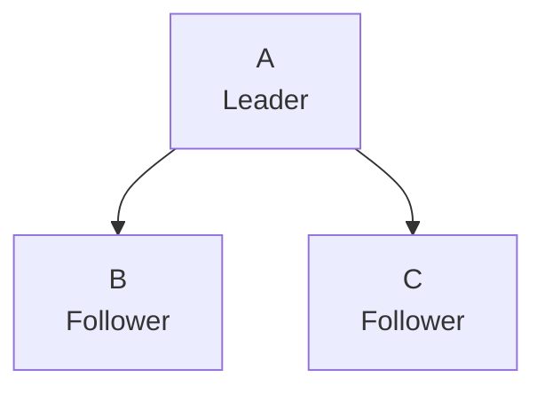

Assume:

```text
Nodes = 3
Majority = 2
```

## Step 1 — Leader fails

```text
        A ❌

        B       C
```

## Step 2 — B detects missing heartbeats

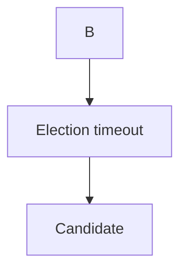

## Step 3 — B requests votes

```text
B → C
"Vote for me?"
```

## Step 4 — C agrees

```text
B = Candidate
C = Vote for B
```

B now has:

```text
B + C = 2 nodes
```

## Step 5 — B becomes leader

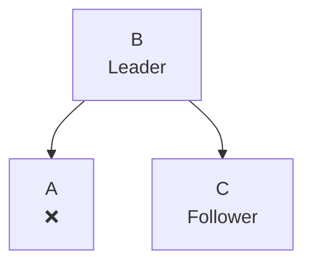

The system has a new leader.

---

# 13. What If Two Candidates Start?

This can happen.

Suppose:

```text
A ❌

B → Candidate
C → Candidate
```

Both may attempt to become leader.

```text
B: "Vote for me."

C: "Vote for me."
```

The election protocol needs a deterministic way to resolve this.

Possible mechanisms include:

- Voting rules.
- Terms/epochs.
- Majority requirements.
- Randomized election timeouts.
- Candidate priority.
- Election rounds.

The exact mechanism depends on the distributed system.

A common technique is to avoid having every node start an election simultaneously.

---

# 14. Randomized Election Timeouts

Suppose B and C both detect the missing leader.

If both start elections at exactly the same time:

```text
B → Candidate
C → Candidate
```

They may split votes.

A later election round may be required.

Randomized election timeouts can reduce repeated collisions.

Conceptually:

```text
B timeout = 850 ms
C timeout = 1120 ms
```

B starts first.

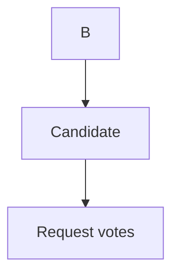

C may then see that B is already establishing leadership and participate accordingly.

The exact implementation varies.

The important idea is:

> **Election timing can be designed to reduce repeated election collisions.**

---

# 15. Election and Network Partitions

Network partitions make leader election particularly difficult.

Consider five nodes:

```text
A   B   C   D   E
```

Suppose the network separates:

```text
A   B   C    X    D   E
```

The left side has:

```text
3 nodes
```

The right side has:

```text
2 nodes
```

If the election requires a majority:

```text
Majority = 3
```

Then:

```text
A B C
-----
Can potentially elect leader

D E
---
Cannot obtain majority
```

This helps prevent both sides from independently becoming authoritative.

---

# 16. Fencing Stale Leaders

Election alone is not always enough.

Imagine:

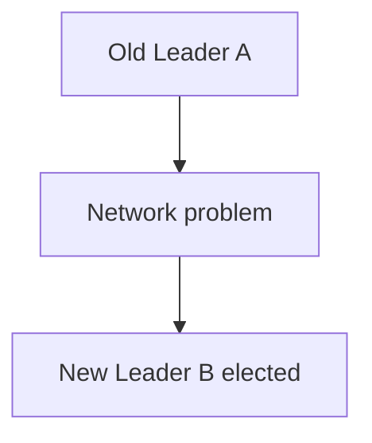

A might still be running.

If A continues accepting writes, the system has two authorities.

A mechanism called **fencing** can prevent the old leader from continuing to perform authoritative operations.

Conceptually:

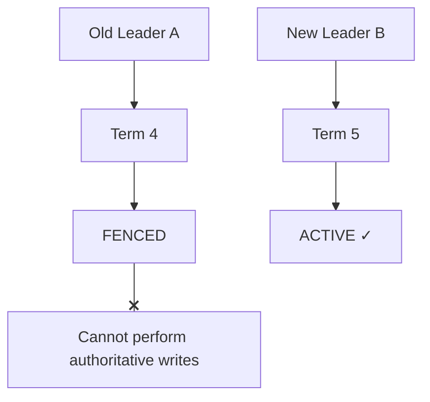

Fencing might involve:

- Rejecting operations using an older term.
- Revoking a lease.
- Removing access to shared storage.
- Disabling old-node authority.
- Using generation numbers.
- Using infrastructure-level isolation.

The exact mechanism depends on the system.

The important idea is:

> **A new leader is not enough. The old leader must also be prevented from acting as leader.**

---

# 17. Leader Election vs Failover

These concepts are related but not identical.

## Leader Election

Answers:

> **Who should become leader?**

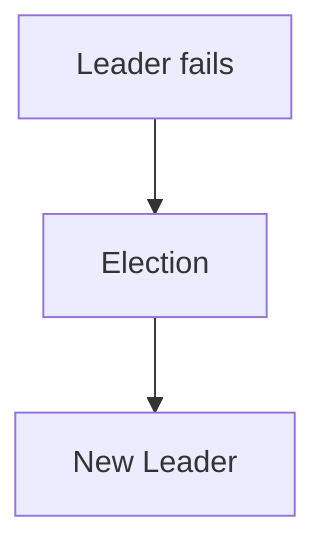

## Failover

Is the broader process of continuing service after failure.

It can include:

```mermaid
flowchart TD
  accTitle: Failover
  accDescr: Failure, then Detect failure, then Elect/promote replacement, then Fence old component, then Redirect clients, then Reconnect services, then Recover state, then Resume service.
  N0["Failure"] --> N1["Detect failure"] --> N2["Elect/promote replacement"] --> N3["Fence old component"] --> N4["Redirect clients"] --> N5["Reconnect services"] --> N6["Recover state"] --> N7["Resume service"]
```

Therefore:

> **Leader election is one possible part of failover.**

Failover can exist without a distributed leader election.

For example, a load balancer can simply stop sending traffic to an unhealthy server.

---

# 18. Leader Election vs Consensus

These concepts are also related but different.

### Leader Election

The question is:

> **Who is the leader?**

```text
A
B  → Choose one leader
C
```

### Consensus

The broader question is:

> **How can distributed nodes agree on a decision or value despite failures?**

For example:

```mermaid
flowchart LR
  accTitle: Consensus
  accDescr: A, B and C agree on a value.
  A["A"] & B["B"] & C["C"] --> V["Agree on a value"]
```

Consensus algorithms often contain leader-election mechanisms.

But:

> **Leader election is not the same thing as consensus.**

Consensus is covered later in:

**06.10 — Consensus**

---

# 19. Leader Election vs Promotion

These terms are often used together.

### Promotion

Changing a node from follower to active leader.

```mermaid
flowchart TD
  accTitle: Promotion
  accDescr: Follower, then Promotion, then Leader.
  N0["Follower"] --> N1["Promotion"] --> N2["Leader"]
```

### Election

The distributed process that determines who should receive leadership.

```mermaid
flowchart TD
  accTitle: Election
  accDescr: Candidates, then Voting / Election, then Winner, then Promotion.
  N0["Candidates"] --> N1["Voting / Election"] --> N2["Winner"] --> N3["Promotion"]
```

In some systems these concepts are tightly integrated.

In others, promotion may be controlled by an external coordinator.

---

# 20. Election Timeout Trade-Off

Suppose the election timeout is too short.

```mermaid
flowchart TD
  accTitle: Timeout too short
  accDescr: Normal network delay, then Timeout, then Unnecessary election.
  N0["Normal network delay"] --> N1["Timeout"] --> N2["Unnecessary election"]
```

This can cause leadership changes even though the leader is healthy.

Too many elections can create instability.

Now suppose the timeout is too long.

```mermaid
flowchart TD
  accTitle: Timeout too long
  accDescr: Leader fails, then Long wait, then Election starts.
  N0["Leader fails"] --> N1["Long wait"] --> N2["Election starts"]
```

Recovery becomes slower.

Therefore:

| Timeout | Benefit | Risk |
|---|---|---|
| Too short | Faster failure detection | False elections |
| Too long | More stable | Slow failover |
| Carefully chosen | Balanced behavior | Still affected by real network conditions |

There is no universal timeout value.

It depends on:

- Network latency.
- Processing time.
- Failure characteristics.
- Cluster size.
- Recovery requirements.

---

# 21. Election and Replicated State

Leader election becomes more difficult when nodes do not have identical state.

Suppose:

```text
A:
Orders 1–100

B:
Orders 1–100

C:
Orders 1–95
```

If C becomes leader, what happens to orders 96–100?

This is why election protocols may consider the state of candidates.

A candidate with stale state may not be eligible to become leader under the system's safety rules.

This leads toward an important distributed-systems principle:

> **Leadership is not only about availability. It is also about having an acceptable view of the system's state.**

The exact state-selection rules depend on the technology and protocol.

---

# 22. Leader Election and Stale State

Consider:

```mermaid
flowchart TD
  accTitle: Leader and follower
  accDescr: Leader A, then Follower B.
  N0["Leader A"] --> N1["Follower B"]
```

A has:

```text
State version = 100
```

B has:

```text
State version = 95
```

If A disappears, B may be available but behind.

A safe system may need to ensure that the new leader has sufficiently current state before accepting authoritative operations.

Possible approaches include:

- Waiting for state catch-up.
- Selecting a more up-to-date candidate.
- Recovering missing state.
- Using replicated logs.
- Requiring quorum.
- Rejecting unsafe leadership.

The exact mechanism depends on the distributed system.

---

# 23. Leadership Can Change More Than Once

Leader election is not necessarily a one-time event.

A system may experience:

```mermaid
flowchart TD
  accTitle: Leader churn
  accDescr: Leader A, then A fails, then Leader B, then B fails, then Leader C, then Network instability, then Leader D.
  N0["Leader A"] --> N1["A fails"] --> N2["Leader B"] --> N3["B fails"] --> N4["Leader C"] --> N5["Network instability"] --> N6["Leader D"]
```

Frequent leadership changes are sometimes called **leader churn**.

Leader churn can be caused by:

- Unstable networks.
- Aggressive timeouts.
- Overloaded nodes.
- Resource exhaustion.
- Configuration problems.
- Repeated failures.

Leader churn can itself become a system problem.

It may cause:

- Interrupted writes.
- Reconnection overhead.
- Cache/state refresh.
- Increased coordination.
- Client errors.
- Increased latency.

Therefore:

> **A system should not treat every short interruption as a reason to repeatedly change leadership.**

---

# 24. What If No Candidate Gets a Majority?

An election can fail.

For example:

```text
5-node cluster

A → Candidate
B → Candidate
C → Candidate
D → unavailable
E → unavailable
```

No candidate may obtain enough votes.

The system may then:

```mermaid
flowchart TD
  accTitle: Failed election
  accDescr: Wait, then Start another election round, then Choose new candidates, then Retry.
  N0["Wait"] --> N1["Start another election round"] --> N2["Choose new candidates"] --> N3["Retry"]
```

The exact mechanism varies.

This is an important distributed-systems behavior:

> **Sometimes the correct outcome is not to elect anyone yet.**

Safety may be more important than immediately restoring leadership.

---

# 25. Election Safety vs Election Speed

Leader election usually balances two goals.

### Safety

Avoid:

```text
Two leaders
Conflicting authority
Stale leader writes
Unsafe state
```

### Speed

Recover quickly:

```mermaid
flowchart TD
  accTitle: Speed
  accDescr: Leader fails, then New leader, then Service resumes.
  N0["Leader fails"] --> N1["New leader"] --> N2["Service resumes"]
```

These goals can conflict.

For example:

```mermaid
flowchart TD
  accTitle: Safer, slower
  accDescr: More validation, then Safer, then Potentially slower election.
  N0["More validation"] --> N1["Safer"] --> N2["Potentially slower election"]
```

Whereas:

```mermaid
flowchart TD
  accTitle: Faster, riskier
  accDescr: Aggressive election, then Faster takeover, then Higher risk of false election.
  N0["Aggressive election"] --> N1["Faster takeover"] --> N2["Higher risk of false election"]
```

System design is about choosing appropriate behavior for the failure model.

---

# 26. Real Example — Database Cluster

Consider:

```mermaid
flowchart TD
  accTitle: Database cluster
  accDescr: The application writes to the leader, which has replica A and replica B.
  X["Application"] --> L["Leader"] --> A["Replica A"] & B["Replica B"]
```

The leader handles writes.

Suppose the leader fails.

```mermaid
flowchart TD
  accTitle: The leader fails
  accDescr: The leader has failed (X); replica A and replica B remain.
  L["Leader ❌"] --> A["Replica A"] & B["Replica B"]
```

The system needs to determine:

1. Is the leader really unavailable?
2. Which replicas are healthy?
3. Which replica has sufficiently current state?
4. Does a majority exist?
5. Which node should become leader?
6. How should the old leader be prevented from returning as a second leader?
7. How should application connections be redirected?

Leader election is therefore only one part of the overall recovery process.

---

# 27. Real Example — Distributed Lock Service

Imagine a cluster coordinates locks:

```mermaid
flowchart TD
  accTitle: Lock cluster
  accDescr: A service uses a lock cluster: A is leader, B and C are followers.
  S["Service"] --> G
  subgraph G["Lock Cluster"]
    direction TB
    I0["A = Leader"] ~~~ I1["B = Follower"] ~~~ I2["C = Follower"]
  end
```

The leader coordinates lock ownership.

If A fails:

```text
A ❌

B
C
```

A new leader may need to be elected before the system safely continues granting certain locks.

Otherwise:

```text
Old leader A
       +
New leader B
       ↓
Both grant the same lock
```

That could violate the purpose of the lock.

This is why fencing and leadership generations are important in coordination systems.

---

# 28. Leader Election and Leases

Some systems use a **lease** concept.

A lease is temporary authority that expires unless renewed.

Conceptually:

```mermaid
flowchart TD
  accTitle: Leases
  accDescr: Leader A holds a lease valid until T; time passes and the lease expires.
  N0["Leader A"] -->|"Lease valid until T"| N1["Time passes"] --> N2["Lease expires"]
```

If A cannot renew its authority:

```mermaid
flowchart TD
  accTitle: Lease expires
  accDescr: A, then Lease expires, then A should stop acting as leader.
  N0["A"] --> N1["Lease expires"] --> N2["A should stop acting as leader"]
```

Another node may then obtain leadership.

Leases can help with stale authority, but they depend on careful timing and failure assumptions.

Clock behavior and lease implementation must be designed carefully.

---

# 29. Why Clock Time Is Dangerous

Distributed systems should be careful about assuming:

> "My clock says the lease expired, therefore everyone agrees it expired."

Different machines can have:

- Clock skew.
- Network delay.
- Scheduling delays.
- Pause events.
- Time synchronization issues.

Therefore, leadership systems often rely on protocol-specific mechanisms rather than blindly trusting wall-clock time.

This connects back to:

**06.01 — What Makes a System Distributed?**

where clock skew was introduced.

---

# 30. Hands-On Exercise — Simulate Leader Election

You can model a simple five-node cluster:

```text
A
B
C
D
E
```

Assume:

```text
Majority = 3
```

Initial state:

```text
A = Leader
B = Follower
C = Follower
D = Follower
E = Follower
```

## Step 1 — Fail the leader

```text
A ❌
```

## Step 2 — Choose a candidate

For example:

```text
C = Candidate
```

## Step 3 — Request votes

```text
C → B
C → D
C → E
```

Suppose:

```text
B → YES
D → YES
E → NO
```

C has:

```text
C + B + D = 3
```

Therefore C has a majority.

```text
C = Leader
```

---

# 31. Lab Challenge — Network Partition

Start with:

```text
A = Leader
B = Follower
C = Follower
D = Follower
E = Follower
```

Now create:

```text
A B C   |   D E
```

The network is partitioned.

Answer:

1. Which side has a majority?
2. Which side can potentially elect a leader?
3. Why should the minority side not independently elect a leader?
4. What happens if D incorrectly becomes leader anyway?
5. What should happen when the network reconnects?

### Expected reasoning

```text
A B C
-----
3 nodes
Majority

D E
---
2 nodes
Minority
```

The majority side can potentially establish new authority.

The minority side should not independently establish authoritative leadership if the system's election rules require majority participation.

When connectivity returns, the system must reconcile leadership generations and state.

---

# 32. Lab Challenge — Stale Leader

Consider:

```text
Term 20
Leader = A
```

A becomes isolated.

The remaining cluster elects:

```text
Term 21
Leader = B
```

A later reconnects.

Answer:

1. Is A still the current leader?
2. Why?
3. How can B's leadership generation be recognized as newer?
4. What should A do?
5. Why is fencing important?

### Expected reasoning

A is stale because:

```text
A = Term 20
B = Term 21
```

The newer leadership generation has authority according to the protocol.

A should step down and synchronize with the current cluster.

Fencing helps prevent A from continuing authoritative operations while B is leader.

---

# 33. Practical Leader-Election Investigation

When investigating a leadership problem, follow a structured process:

```mermaid
flowchart TD
  accTitle: Leader-election investigation
  accDescr: Observe, then Who is currently leader?, then What is the current term/epoch?, then Which nodes are reachable?, then Which nodes have quorum?, then Which nodes are healthy?, then Which nodes have current state?, then Are multiple nodes claiming leadership?, then Is a stale leader still active?, then Is fencing working?, then Is the election repeatedly failing?, then Recover safely, then Measure again.
  N0["Observe"] --> N1["Who is currently leader?"] --> N2["What is the current term/epoch?"] --> N3["Which nodes are reachable?"] --> N4["Which nodes have quorum?"] --> N5["Which nodes are healthy?"] --> N6["Which nodes have current state?"] --> N7["Are multiple nodes claiming leadership?"] --> N8["Is a stale leader still active?"] --> N9["Is fencing working?"] --> N10["Is the election repeatedly failing?"] --> N11["Recover safely"] --> N12["Measure again"]
```

Do not start by simply restarting random nodes.

First understand:

> **Who believes they are leader, who the cluster considers leader, and why those views differ.**

---

# 34. Common Mistakes

### Mistake 1 — "No heartbeat means the leader is definitely dead"

Not necessarily.

The network or receiving node may be the problem.

---

### Mistake 2 — "The first available node becomes leader"

Leadership requires authority, not merely availability.

---

### Mistake 3 — Ignoring quorum

Without appropriate election rules, multiple partitions can independently elect leaders.

---

### Mistake 4 — Ignoring stale leaders

Electing a new leader is not enough if the old leader can still perform authoritative work.

---

### Mistake 5 — Treating election as failover

Election chooses leadership.

Failover is the broader recovery process.

---

### Mistake 6 — Treating election as consensus

Leader election determines leadership.

Consensus addresses broader distributed agreement.

---

### Mistake 7 — Choosing the most available node without considering state

A node that is alive but significantly behind may not be a safe leader.

---

### Mistake 8 — Using extremely aggressive election timeouts

This can create unnecessary leader changes.

---

### Mistake 9 — Ignoring repeated elections

Frequent elections may indicate:

- Network instability.
- Resource exhaustion.
- Incorrect timeout settings.
- Node instability.
- Infrastructure problems.

---

### Mistake 10 — Assuming leadership recovery means data recovery

A new leader does not automatically mean that every replica is synchronized.

---

# 35. Leader Election Decision Framework

When designing a leader-election mechanism, ask:

| Question | Why It Matters |
|---|---|
| Who can become leader? | Defines eligible candidates. |
| How is failure detected? | Determines when an election begins. |
| How many votes are required? | Establishes authority. |
| Is quorum required? | Helps prevent split brain. |
| How are terms/epochs tracked? | Distinguishes leadership generations. |
| What happens to stale leaders? | Prevents old authority from continuing. |
| How is state freshness evaluated? | Avoids promoting unsafe/stale nodes. |
| What happens during partitions? | Defines consistency/availability behavior. |
| How are clients redirected? | Completes service recovery. |
| What happens if election fails? | Defines retry/recovery behavior. |
| How are repeated elections detected? | Helps identify instability. |
| How is the new leader observed? | Supports monitoring and debugging. |

---

# 36. Leader Election in the Bigger Architecture

Leader election sits inside a larger distributed-system process.

```mermaid
flowchart TD
  accTitle: Leader election in the bigger architecture
  accDescr: Distributed cluster, leader/followers, leader failure, failure detection, election timeout, candidate, vote/quorum, new leadership; then fencing and promotion; client routing, state catch-up, normal operation.
  N0["Distributed Cluster"] --> N1["Leader / Followers"] --> N2["Leader Failure"] --> N3["Failure Detection"] --> N4["Election Timeout"] --> N5["Candidate"] --> N6["Vote / Quorum"] --> N7["New Leadership"] --> F["Fencing"] & P["Promotion"]
  F & P --> M0["Client Routing"] --> M1["State Catch-Up"] --> M2["Normal Operation"]
```

Leader election is therefore not an isolated feature.

It interacts with:

- Replication.
- Quorum.
- Network partitions.
- Failure detection.
- State synchronization.
- Fencing.
- Client routing.
- Recovery.
- Observability.

---

# 37. Leader Election and System Evolution

A simple system might begin with:

```mermaid
flowchart TD
  accTitle: Simple system
  accDescr: Application, then Database.
  N0["Application"] --> N1["Database"]
```

Later:

```mermaid
flowchart TD
  accTitle: Primary and replicas
  accDescr: The application uses a primary with two replicas.
  A["Application"] --> P["Primary"] --> R1["Replica"] & R2["Replica"]
```

Then:

```mermaid
flowchart TD
  accTitle: Dynamic leadership
  accDescr: The application uses a leader/coordinator with two followers.
  A["Application"] --> L["Leader / Coordinator"] --> F1["Follower"] & F2["Follower"]
```

As the system becomes more distributed, leadership may need to be managed dynamically.

This creates additional requirements:

```text
Failure Detection
       +
Election
       +
Quorum
       +
Fencing
       +
State Recovery
       +
Observability
```

The architecture has evolved because the system's failure and scaling requirements evolved.

---

# 38. The Deeper Trade-Off

Leader election is fundamentally about **authority under uncertainty**.

A node cannot always know:

> "Is the old leader actually dead?"

It may only know:

> "I cannot currently communicate with the old leader."

The system therefore needs rules that preserve safety despite incomplete information.

This is why distributed systems use mechanisms such as:

- Quorum.
- Terms/epochs.
- Election timeouts.
- Voting.
- Fencing.
- Replication state.
- Failure detection.
- Consensus protocols.

The goal is not perfect knowledge.

The goal is:

> **Safe behavior despite imperfect knowledge.**

---

# 39. Key Principle

> **Leader election is the distributed process of choosing a new authoritative leader when leadership is unavailable or must change. Safe leader election requires more than detecting a failed node: it must handle incomplete failure information, quorum, leadership generations, stale leaders, network partitions, state freshness, and fencing. Leader election is related to failover and consensus, but it is not the same as either.**

---

# 40. Quick Reference

```mermaid
flowchart TD
  accTitle: Leader election at a glance
  accDescr: Leader sends heartbeats to followers; when the leader is unavailable, an election timeout makes a candidate, which requests votes; quorum gives a new leader, which gets a new term/epoch, fences the old leader, redirects clients and recovers state.
  N0["Leader"] -->|"Heartbeats"| N1["Followers"] -->|"Leader unavailable"| N2["Election Timeout"] --> N3["Candidate"] -->|"Request Votes"| N4["Quorum"] --> N5["New Leader"] --> G
  subgraph G[" "]
    direction TB
    I0["New Term / Epoch"] ~~~ I1["Fence Old Leader"] ~~~ I2["Redirect Clients"] ~~~ I3["Recover / Catch Up State"]
  end
```

### Core Terms

| Concept | Meaning |
|---|---|
| Leader | Current authoritative coordinator |
| Follower | Node following the leader |
| Candidate | Node attempting to become leader |
| Election | Process of choosing leadership |
| Heartbeat | Signal that a node is active |
| Election timeout | Period after which an election may begin |
| Quorum | Required participation for safe decisions |
| Term / Epoch | Leadership generation |
| Split brain | Multiple nodes believe they are authoritative |
| Fencing | Preventing stale authority from acting |
| Failover | Broader recovery process after failure |
| Consensus | Distributed agreement on decisions/values |

### Three Important Distinctions

```text
Leader Election
"What is the leader?"

Failover
"How do we continue service after failure?"

Consensus
"How do distributed nodes agree safely?"
```

---

# 41. Knowledge Check

### 1. What is leader election?

**Answer:**  
The distributed process of choosing a new authoritative leader.

### 2. Why isn't "no heartbeat" proof that a leader has failed?

**Answer:**  
The leader may still be running but unreachable because of network failure, overload, or another problem.

### 3. Why is quorum useful during leader election?

**Answer:**  
It helps ensure that a new leader is chosen with sufficient participation and reduces the risk of multiple independent leaders.

### 4. What is a candidate?

**Answer:**  
A node attempting to become the leader.

### 5. Why are terms or epochs useful?

**Answer:**  
They identify leadership generations and help nodes distinguish current authority from stale leadership.

### 6. What is split brain?

**Answer:**  
A situation where multiple nodes or groups believe they are independently authoritative.

### 7. Why is fencing important?

**Answer:**  
It prevents an old or stale leader from continuing to perform authoritative operations after a new leader has been established.

### 8. What is the difference between leader election and failover?

**Answer:**  
Leader election chooses the new leader; failover is the broader process of detecting failure, switching authority/traffic, recovering state, reconnecting clients, and restoring service.

### 9. What is the difference between leader election and consensus?

**Answer:**  
Leader election chooses leadership. Consensus is a broader mechanism for distributed nodes to agree on values or decisions.

### 10. Why can an available node still be an unsafe leader candidate?

**Answer:**  
It may have stale or incomplete state and therefore may not be safe to make authoritative.

---

# Remember

> **A leader is not simply the node that is alive. It is the node that the distributed system currently recognizes as authoritative.**

And:

> **A new leader is only safe when the old leader cannot continue acting with authority.**

---

# Next Chapter

## 06.09 — Distributed Locks

Next we will examine how distributed systems coordinate **exclusive access to shared resources**.

Topics include:

- What a distributed lock is
- Why distributed locks exist
- Local locks vs distributed locks
- Lock ownership
- Lock acquisition
- Lock release
- Lock expiration
- Leases
- Lock timeouts
- Redis-based locks
- Database-based locks
- Lock contention
- Deadlocks
- Stale lock holders
- Fencing tokens
- Network partitions
- Lock failure scenarios
- When distributed locks make sense
- When they should be avoided
- Hands-on distributed-lock exercise
- System-design trade-offs
