# 06.09 — Distributed Locks

## Learning Objectives

By the end of this chapter, you will be able to:

- Explain what a distributed lock is.
- Understand why ordinary in-process locks are insufficient across multiple nodes.
- Explain lock ownership, acquisition, and release.
- Understand lock expiration and leases.
- Recognize lock contention and its performance impact.
- Understand stale lock holders and fencing.
- Compare database-based and Redis-based locking at a conceptual level.
- Identify failure scenarios involving distributed locks.
- Understand when distributed locks are useful and when they should be avoided.
- Design safer lock usage in a distributed system.

---

# Beginner Vocabulary

| Term | Beginner-Friendly Meaning |
|---|---|
| **Lock** | A mechanism that allows only an authorized owner to perform a protected operation at a time. |
| **Distributed Lock** | A lock whose ownership is coordinated across multiple machines or processes. |
| **Lock Owner** | The process or node that currently holds the lock. |
| **Lock Acquisition** | The process of obtaining a lock. |
| **Lock Release** | Giving up a lock so another process can acquire it. |
| **Lock Contention** | Multiple processes competing for the same lock. |
| **Lease** | Temporary ownership that expires unless renewed. |
| **TTL** | Time after which a lock entry automatically expires. |
| **Stale Lock** | A lock that remains associated with a process that is no longer safely operating. |
| **Fencing** | Preventing an old lock holder from performing work after another process has taken ownership. |
| **Fencing Token** | A monotonically increasing value used to identify newer lock ownership. |
| **Deadlock** | A situation where processes wait indefinitely for resources held by each other. |
| **Critical Section** | The part of work that must be protected from conflicting concurrent execution. |
| **Lock Contender** | A process attempting to acquire a lock. |
| **Ownership** | The system's record of which process currently controls the protected resource. |
| **Split Brain** | Multiple nodes incorrectly believe they have authority. |
| **Idempotency** | Designing repeated execution so it does not create unwanted additional effects. |

---

# 1. What Is a Distributed Lock?

Suppose two application servers need to modify the same resource.

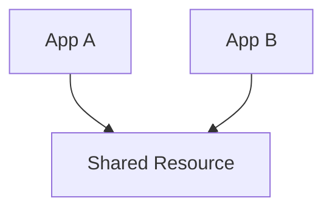

If both modify it at the same time, they may interfere with each other.

A lock can provide exclusive access:

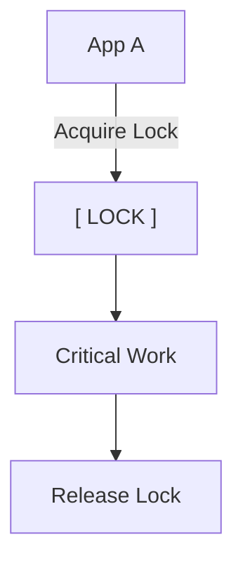

While A holds the lock:

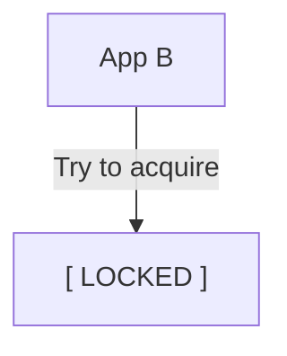

B must wait, retry, or fail according to the system's rules.

A **distributed lock** performs this coordination across independent processes or machines.

---

# 2. Why Do We Need Distributed Locks?

An ordinary programming lock usually protects resources inside one process.

For example:

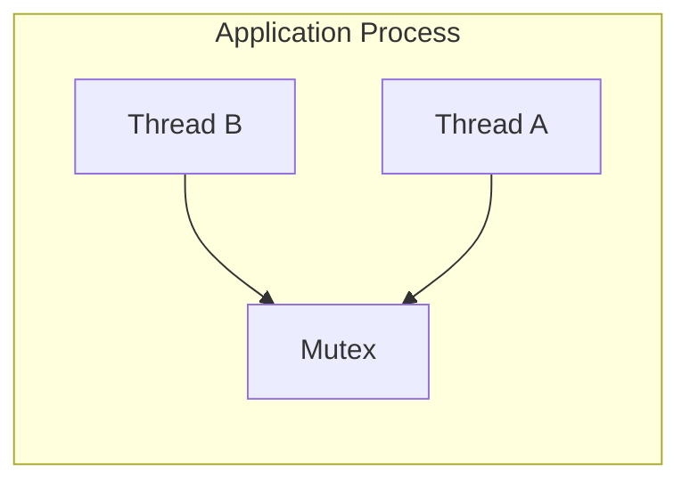

A mutex can coordinate threads inside that process.

But consider:

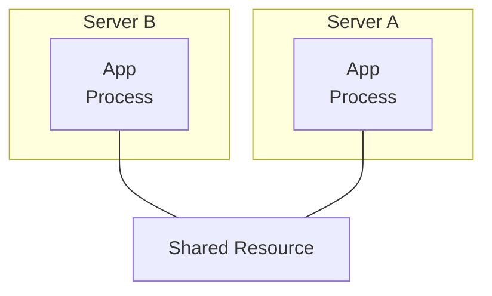

A local mutex on Server A knows nothing about Server B.

Server B could still enter the critical section.

Therefore:

> **A local lock protects local execution. A distributed lock coordinates ownership across multiple independent processes or nodes.**

---

# 3. Example — Scheduled Job

Imagine three application servers:

```text
Server A
Server B
Server C
```

All run the same scheduled job:

```text
Generate Daily Report
```

Without coordination:

```text
A → Generate report
B → Generate report
C → Generate report
```

The same report may be generated three times.

A distributed lock can provide:

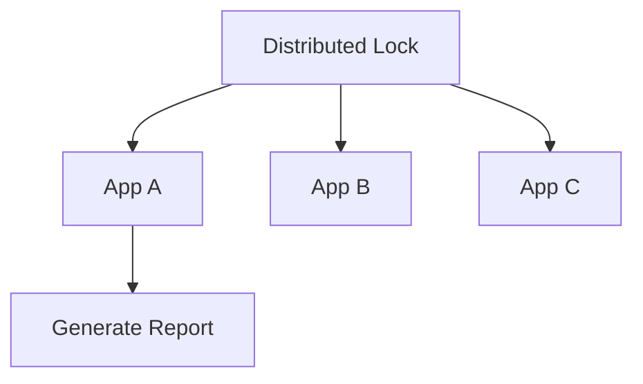

Only the lock owner performs the protected work.

---

# 4. The Basic Lock Lifecycle

A simplified lifecycle is:

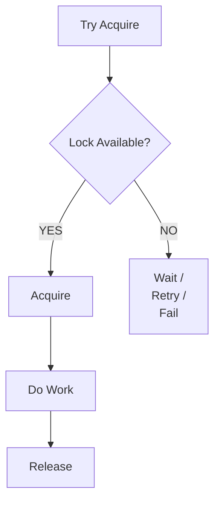

The critical question is:

> **Who currently owns the lock?**

A distributed lock system needs a reliable way to answer that question.

---

# 5. Lock Ownership

Suppose:

```text
App A
```

acquires:

```text
lock:report
```

The lock system records something conceptually like:

```text
lock:report
owner = App A
```

App B attempts:

```text
lock:report
```

and receives:

```text
LOCKED
```

The ownership relationship is therefore:

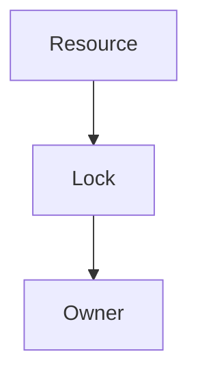

The system must prevent an unrelated process from accidentally releasing another process's lock.

This is why lock ownership should normally include an identifier.

For example:

```text
Lock:
  resource = report
  owner = worker-abc123
```

---

# 6. Why Lock Ownership Matters

Imagine:

```text
App A acquires lock
```

Then A becomes slow.

App B waits.

Later:

```text
A's lock expires
```

B acquires the lock.

Now:

```text
A → still running
B → new owner
```

If A blindly executes:

```text
Release lock
```

it could accidentally release B's lock.

Therefore:

> **A lock should be released only by its valid current owner.**

Conceptually:

```text
Release(resource, ownerId)
```

not simply:

```text
Release(resource)
```

---

# 7. Lock Acquisition Must Be Atomic

Suppose the lock is currently free.

Two processes arrive at almost exactly the same time:

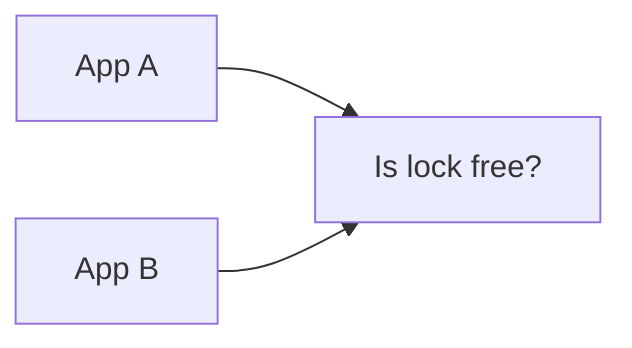

If both perform:

```text
CHECK
```

and then:

```text
SET
```

independently, both could see:

```text
FREE
```

and both acquire the lock.

That is unsafe.

The acquisition needs to behave conceptually like one atomic operation:

```text
IF lock does not exist
    create lock
    assign owner
ELSE
    reject
```

There must be no unsafe gap between checking and claiming ownership.

---

# 8. Lock Contention

Suppose one process holds a lock:

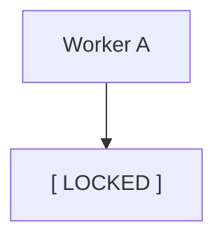

Five other workers want the same lock:

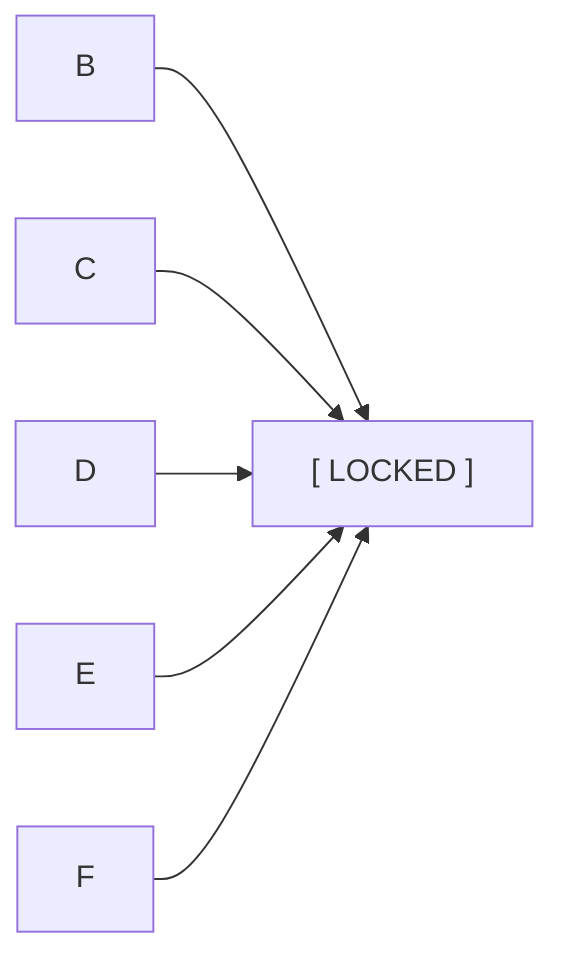

They are **contending** for the lock.

This is called **lock contention**.

High contention can cause:

- Increased latency.
- Waiting.
- More retries.
- Reduced throughput.
- CPU/network overhead.
- Queue-like behavior.
- Cascading delays.

Therefore:

> **A distributed lock is coordination, not free performance.**

---

# 9. Locks Create Serialization

Suppose ten workers can normally process ten jobs simultaneously.

```text
A B C D E F G H I J
```

Now they all need one shared lock:

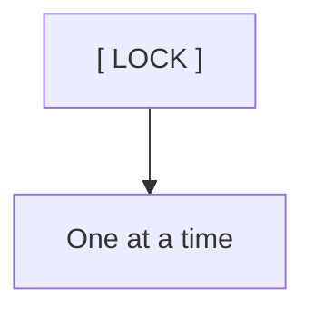

The work becomes serialized.

Instead of:

```text
10 operations concurrently
```

you may get:

```text
1 operation at a time
```

Therefore, before introducing a lock, ask:

> **Does this operation truly require exclusive access?**

Sometimes the better solution is:

- Idempotency.
- Atomic database updates.
- Unique constraints.
- Partitioning work.
- Queues.
- Optimistic concurrency.
- Better data ownership.

---

# 10. Distributed Lock vs Database Constraint

A lock is not always the best way to prevent duplicate work.

Suppose you want:

> Only one payment record for a particular transaction ID.

You might think:

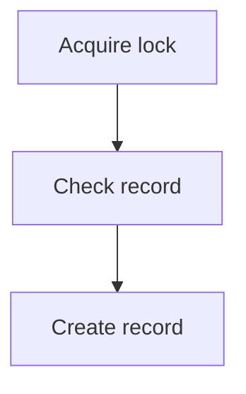

But a database uniqueness constraint may be safer:

```sql
UNIQUE(transaction_id)
```

Then the database itself prevents duplicates.

This leads to an important design principle:

> **Prefer the strongest simple correctness mechanism that naturally belongs to the data.**

A lock is useful when the protected operation cannot be expressed cleanly as an atomic database operation or constraint.

---

# 11. Distributed Locks and Atomic Operations

Sometimes the operation can be made atomic without a separate lock.

For example:

```text
UPDATE inventory
SET quantity = quantity - 1
WHERE product_id = 42
  AND quantity > 0;
```

The database can perform this as one atomic operation.

You may not need:

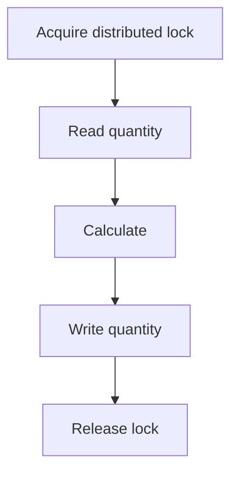

The atomic database operation may be simpler and safer.

This is an important alternative to distributed locking.

---

# 12. Lock Expiration

What happens if a process acquires a lock and crashes?

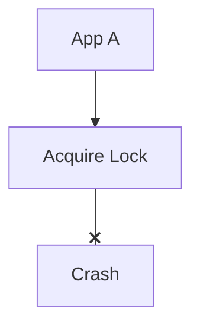

If the lock never expires:

```text
[ LOCKED FOREVER ]
```

No other process can proceed.

This is sometimes called a **stale lock** problem.

A common solution is to give the lock a lifetime.

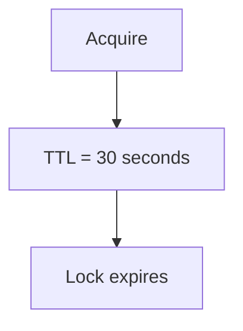

If the owner disappears, the lock can eventually become available.

---

# 13. TTL Does Not Automatically Make Locks Safe

A TTL solves one problem:

> **What happens if the owner disappears?**

But it introduces another:

> **What if the owner is still running after the TTL expires?**

Consider:

```text
A acquires lock
TTL = 10 seconds
```

A starts work:

```text
Work
████████████████████
```

But the operation takes 15 seconds.

After 10 seconds:

```text
Lock expires
```

B acquires it:

```text
A → still working
B → new owner
```

Now:

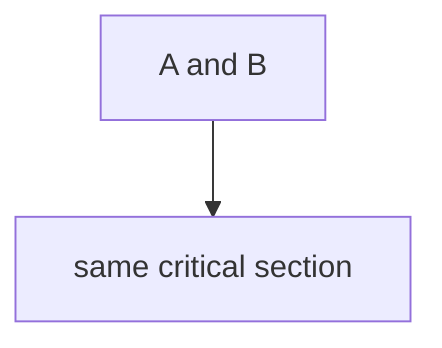

The lock's TTL did not prevent concurrent execution.

This is why:

> **Lock expiration and safe ownership are separate problems.**

---

# 14. Leases

A **lease** is temporary authority.

Conceptually:

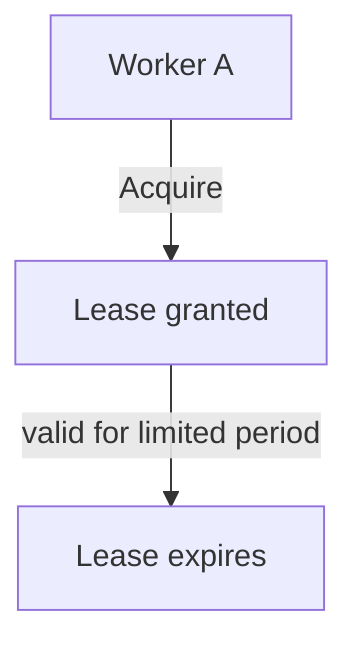

The owner may need to renew it:

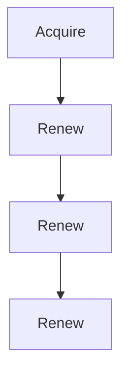

If renewal stops:

```text
Lease expires
```

Another process can acquire ownership.

Leases are useful for temporary coordination but require careful handling of:

- Time.
- Network delays.
- Process pauses.
- Renewal failures.
- Expiration.
- Stale owners.

---

# 15. Fencing

A powerful way to address stale owners is **fencing**.

Each successful lock acquisition receives an increasing token.

For example:

```text
A acquires lock
Token = 41
```

Later:

```text
A loses lock

B acquires lock
Token = 42
```

Now:

```text
A → Token 41
B → Token 42
```

The protected resource can reject operations carrying an older token.

```text
Token 41 → REJECT
Token 42 → ACCEPT
```

This provides a crucial safety property:

> **Newer ownership can invalidate older ownership.**

---

# 16. Why Fencing Is Different From Lock Expiration

TTL answers:

> **When should the lock become available again?**

Fencing answers:

> **How do we prevent an old owner from acting after it loses ownership?**

These are different problems.

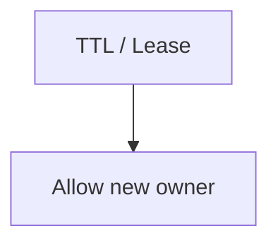

and:

```mermaid
flowchart TD
  accTitle: What fencing does
  accDescr: Fencing, then Reject old owner.
  N0["Fencing"] --> N1["Reject old owner"]
```

A robust design may need both.

---

# 17. Distributed Lock With Fencing

Conceptually:

```mermaid
flowchart TD
  accTitle: Lock with fencing
  accDescr: Worker A acquires from the lock service, gets token 41, and works on the protected resource with token 41.
  N0["Worker A"] -->|"Acquire"| N1["Lock Service"] -->|"Token 41"| N2["Worker A"] -->|"Work(token=41)"| N3["Protected Resource"]
```

Later:

```mermaid
flowchart TD
  accTitle: New owner
  accDescr: A loses ownership; worker B acquires from the lock service and gets token 42.
  N0["A loses ownership"] --> N1["Worker B"] -->|"Acquire"| N2["Lock Service"] -->|"Token 42"| N3["Worker B"]
```

If A tries to continue:

```mermaid
flowchart TD
  accTitle: Old token rejected
  accDescr: A → token 41, then Resource, then REJECT.
  N0["A → token 41"] --> N1["Resource"] --> N2["REJECT"]
```

B:

```mermaid
flowchart TD
  accTitle: New token accepted
  accDescr: B → token 42, then Resource, then ACCEPT.
  N0["B → token 42"] --> N1["Resource"] --> N2["ACCEPT"]
```

This is the core idea of fencing.

---

# 18. Redis-Based Distributed Locks

Redis is commonly used for distributed coordination because it provides fast atomic operations and expiration mechanisms.

Conceptually:

```mermaid
flowchart LR
  accTitle: Redis-based locks
  accDescr: Applications A, B and C coordinate through Redis.
  S0["Application A"] & S1["Application B"] & S2["Application C"] --> T["Redis"]
```

A lock might conceptually be represented as:

```text
lock:report
owner = worker-123
TTL = 30s
```

The acquisition must be atomic.

A simplified conceptual operation is:

```text
SET lock:report worker-123 NX EX 30
```

Where:

- `NX` means create only if the key does not already exist.
- `EX 30` gives the key a 30-second expiration.

This is a conceptual Redis example, not a complete production lock protocol.

---

# 19. Redis Lock Release

A dangerous release operation would be:

```text
DELETE lock:report
```

Why?

Because the original owner may have lost the lock.

Suppose:

```mermaid
flowchart TD
  accTitle: Deleting another owner's lock
  accDescr: A owns lock, then TTL expires, then B acquires lock, then A resumes, then A deletes lock.
  N0["A owns lock"] --> N1["TTL expires"] --> N2["B acquires lock"] --> N3["A resumes"] --> N4["A deletes lock"]
```

A has now deleted B's lock.

Therefore release should verify ownership.

Conceptually:

```text
IF lock.owner == myOwnerId
    DELETE lock
```

The check-and-delete should itself be atomic.

---

# 20. Redis Locks Are Not Automatically Perfect

Using Redis does not magically solve distributed locking.

You still need to reason about:

- Redis availability.
- Network partitions.
- Lock expiration.
- Client pauses.
- Clock/timing assumptions.
- Ownership.
- Fencing.
- Failover behavior.
- Multiple Redis nodes.
- What happens if Redis becomes unreachable.
- Whether the protected resource understands fencing.

Therefore:

> **"We use Redis locks" is not a complete distributed-lock design.**

You must understand the failure model.

---

# 21. Database-Based Distributed Locks

A relational database can also coordinate locks.

For example:

```mermaid
flowchart LR
  accTitle: Database-based locks
  accDescr: Applications A, B and C coordinate through the database.
  S0["Application A"] & S1["Application B"] & S2["Application C"] --> T["Database"]
```

Possible approaches include:

- Database advisory locks.
- Row-level locking.
- Unique constraints.
- Lock rows.
- Transactions.
- Compare-and-update patterns.

The correct choice depends on the database and operation.

For example:

```text
BEGIN

SELECT ...
FOR UPDATE

UPDATE ...

COMMIT
```

can protect rows inside a database transaction.

This is often preferable when the resource being protected is already stored in that database.

---

# 22. Database Lock vs Distributed Lock

These concepts overlap but should not be treated as identical.

A database row lock may protect:

```text
Database state
```

A distributed lock may coordinate:

```text
Multiple application processes
```

For example:

```mermaid
flowchart TD
  accTitle: Lock service in front of an external API
  accDescr: Workers A, B and C use the lock service before calling the external API.
  subgraph G[" "]
    direction TB
    I0["Worker A"] ~~~ I1["Worker B"] ~~~ I2["Worker C"]
  end
  G --> L["Lock Service"] --> E["External API"]
```

The protected resource might not be a database row at all.

Therefore the choice depends on where the correctness boundary actually exists.

---

# 23. Lock Scope

The size of the critical section matters.

Bad:

```mermaid
flowchart TD
  accTitle: Bad lock scope
  accDescr: Acquire Lock, then Call external API, then Wait 5 seconds, then Write database, then Generate report, then Release Lock.
  N0["Acquire Lock"] --> N1["Call external API"] --> N2["Wait 5 seconds"] --> N3["Write database"] --> N4["Generate report"] --> N5["Release Lock"]
```

The lock is held for a long time.

Better:

```mermaid
flowchart TD
  accTitle: Better lock scope
  accDescr: Acquire Lock, then Perform only required coordination, then Release quickly.
  N0["Acquire Lock"] --> N1["Perform only required coordination"] --> N2["Release quickly"]
```

The goal is to keep the protected section as small as safely possible.

But:

> **Do not shorten the critical section by removing operations that actually require protection.**

Correctness comes first.

---

# 24. Lock Granularity

Suppose you have:

```text
Products:
1
2
3
4
5
```

A single global lock means:

```text
lock:products
```

Only one product operation can happen at a time.

That may be unnecessarily restrictive.

Instead:

```text
lock:product:1
lock:product:2
lock:product:3
```

Now independent products can be processed concurrently.

```text
Product 1 → Worker A
Product 2 → Worker B
Product 3 → Worker C
```

This is called choosing an appropriate **lock granularity**.

Smaller lock scope can improve concurrency.

But too many locks can create:

- More coordination.
- More memory.
- More management overhead.
- More complex failure handling.

---

# 25. Lock Ordering and Deadlocks

Consider two resources:

```text
Resource A
Resource B
```

Worker 1:

```mermaid
flowchart TD
  accTitle: Worker 1
  accDescr: Acquire A, then Wait for B.
  N0["Acquire A"] --> N1["Wait for B"]
```

Worker 2:

```mermaid
flowchart TD
  accTitle: Worker 2
  accDescr: Acquire B, then Wait for A.
  N0["Acquire B"] --> N1["Wait for A"]
```

Now:

```text
Worker 1 → A → waiting for B
Worker 2 → B → waiting for A
```

Neither can continue.

This is a **deadlock**.

A common mitigation is consistent lock ordering.

For example:

```text
Always acquire A before B
```

Then both workers follow:

```text
A → B
```

rather than:

```text
A → B
B → A
```

Lock ordering becomes especially important when multiple distributed locks can be held simultaneously.

---

# 26. Lock Timeout

A lock attempt may wait only for a limited time.

For example:

```mermaid
flowchart TD
  accTitle: Lock timeout
  accDescr: Try lock, then Wait 100 ms, then Still unavailable, then Give up.
  N0["Try lock"] --> N1["Wait 100 ms"] --> N2["Still unavailable"] --> N3["Give up"]
```

This prevents an application from waiting indefinitely.

But timeout behavior must be designed carefully.

The application might:

- Retry.
- Return an error.
- Queue the work.
- Use another strategy.
- Degrade gracefully.

A lock timeout should not automatically trigger aggressive retries.

Otherwise:

```mermaid
flowchart TD
  accTitle: Retry feedback loop
  accDescr: Lock contention, then Retry, then More contention, then More retries.
  N0["Lock contention"] --> N1["Retry"] --> N2["More contention"] --> N3["More retries"]
```

This can become a feedback loop.

---

# 27. Distributed Locks and Queues

Sometimes a queue is better than a lock.

Suppose you need to ensure:

> Only one worker processes a particular job.

Instead of:

```mermaid
flowchart TD
  accTitle: Competing for a lock
  accDescr: Workers, then Compete for lock, then Process job.
  N0["Workers"] --> N1["Compete for lock"] --> N2["Process job"]
```

a queue can naturally distribute work:

```mermaid
flowchart TD
  accTitle: A queue distributes work
  accDescr: The queue delivers to worker A, worker B and worker C.
  Q["Queue"] --> A["Worker<br/>A"] & B["Worker<br/>B"] & C["Worker<br/>C"]
```

Only one worker receives a particular queue message under the queue's delivery model.

This avoids manually coordinating ownership in some architectures.

Therefore:

> **If the real problem is work distribution, consider a queue before introducing a distributed lock.**

---

# 28. Distributed Locks and Idempotency

Locks are sometimes used to prevent duplicate operations.

But locks are not a complete substitute for idempotency.

Consider:

```mermaid
flowchart TD
  accTitle: Crash after charging
  accDescr: Worker A acquires the lock and charges the payment, then crashes before release (X).
  W["Worker A"] -->|"Acquire lock"| P["Charge payment"] --x C["Crash before release"]
```

The lock eventually expires.

Worker B:

```mermaid
flowchart TD
  accTitle: Worker B charges again
  accDescr: Acquire lock, then Charge payment again.
  N0["Acquire lock"] --> N1["Charge payment again"]
```

Without idempotency, the customer might be charged twice.

Therefore:

```text
Distributed Lock
       +
Idempotency
```

may be required.

For critical operations such as payments, idempotency is often a more fundamental correctness mechanism than relying only on a lock.

---

# 29. Distributed Locks and Leader Election

These concepts are related but different.

### Leader Election

Chooses one node to act as leader.

```text
A
B  → Elect one leader
C
```

### Distributed Lock

Temporarily grants ownership of a specific resource or critical section.

```mermaid
flowchart LR
  accTitle: Distributed lock
  accDescr: A, B and C compete for a lock on one resource.
  S0["A"] & S1["B"] & S2["C"] --> T["Lock(resource)"]
```

A leader might coordinate many operations.

A distributed lock might protect one specific operation.

Therefore:

> **Leader = role. Lock owner = temporary resource ownership.**

A leader can also acquire locks, but leadership and locking are not the same mechanism.

---

# 30. Distributed Locks and Network Partitions

Consider:

```mermaid
flowchart TD
  accTitle: Worker cut off from the lock service
  accDescr: A network partition (X) separates worker A from the lock service.
  L["Lock Service"] --x P["Network Partition"] --- W["Worker A"]
```

Worker A cannot reach the lock service.

What should it do?

It should not assume:

> "I still own the lock."

It may be unable to prove that its ownership remains valid.

This is one of the most difficult aspects of distributed locking.

A safe system must define:

- What happens when the lock service is unreachable?
- Can the owner continue?
- Can another node acquire the lock?
- How is stale ownership prevented?
- Is there a fencing mechanism?
- What is the protected resource's authority model?

---

# 31. The Lock Service Is Itself a Distributed System

Suppose you deploy:

```mermaid
flowchart TD
  accTitle: Lock service dependency
  accDescr: Application, then Lock Service.
  N0["Application"] --> N1["Lock Service"]
```

Now the lock service becomes critical infrastructure.

What if it fails?

```mermaid
flowchart LR
  accTitle: Lock service down
  accDescr: Apps A, B and C depend on a failed lock service.
  S0["App A"] & S1["App B"] & S2["App C"] --> T["Lock Service ❌"]
```

Applications may no longer be able to acquire locks.

Therefore a production lock service may itself need:

- Replication.
- Failure handling.
- Leader election.
- Quorum.
- Persistence where appropriate.
- Monitoring.
- Recovery.

This creates an important system-design lesson:

> **A coordination mechanism becomes another dependency that must be made reliable.**

---

# 32. Failure Scenario — Lock Service Failure

```mermaid
flowchart TD
  accTitle: Lock service failure
  accDescr: Workers depend on the lock service, which has failed (X).
  W["Workers"] --> L["Lock Service ❌"]
```

Questions:

- Do current owners retain authority?
- Can new owners be granted?
- Should protected operations stop?
- Can the lock service recover?
- Can two lock-service instances disagree?
- Is there a quorum?
- Is state durable?

There is no universal answer.

The correct behavior depends on whether the protected operation prioritizes:

- Safety.
- Availability.
- Latency.
- Temporary unavailability.

---

# 33. When Distributed Locks Make Sense

Distributed locks can be useful when:

### 1. A critical operation must be temporarily exclusive

```text
Generate one expensive report
```

### 2. Multiple nodes may perform the same scheduled job

```text
App A
App B
App C
```

but only one should execute it.

### 3. A resource has temporary ownership

```text
Leader-like ownership
```

### 4. Work cannot easily be expressed as an atomic database operation

The operation spans multiple resources.

### 5. A coordination boundary is genuinely required

The system needs explicit ownership.

---

# 34. When Distributed Locks May Be the Wrong Tool

Avoid introducing a distributed lock merely because concurrency exists.

Consider alternatives first:

| Problem | Possible Better Mechanism |
|---|---|
| Prevent duplicate database records | Unique constraint |
| Atomic state update | Database atomic operation |
| Distribute background jobs | Queue |
| Duplicate API requests | Idempotency |
| Process one event once | Consumer/delivery semantics + idempotency |
| Coordinate leadership | Leader election |
| Protect one database row | Database transaction/row lock |
| Scale a hot resource | Partitioning/sharding |
| Prevent overload | Rate limiting/backpressure |

The key question is:

> **What correctness problem are we actually trying to solve?**

---

# 35. A Practical Decision Framework

Before adding a distributed lock, ask:

```mermaid
flowchart TD
  accTitle: Before adding a lock
  accDescr: 1. What resource needs protection?, then 2. Why must access be exclusive?, then 3. Can the database enforce the rule?, then 4. Can an atomic operation solve it?, then 5. Can a queue distribute the work?, then 6. Can idempotency solve duplicate execution?, then 7. If a lock is required:, then 8. Who owns it?, then 9. How is ownership acquired atomically?, then 10. How does ownership expire?, then 11. What happens if the owner pauses?, then 12. How is a stale owner fenced?, then 13. What happens during a network partition?, then 14. What happens if the lock service fails?, then 15. How is contention controlled?.
  N0["1#46; What resource needs protection?"] --> N1["2#46; Why must access be exclusive?"] --> N2["3#46; Can the database enforce the rule?"] --> N3["4#46; Can an atomic operation solve it?"] --> N4["5#46; Can a queue distribute the work?"] --> N5["6#46; Can idempotency solve duplicate execution?"] --> N6["7#46; If a lock is required:"] --> N7["8#46; Who owns it?"] --> N8["9#46; How is ownership acquired atomically?"] --> N9["10#46; How does ownership expire?"] --> N10["11#46; What happens if the owner pauses?"] --> N11["12#46; How is a stale owner fenced?"] --> N12["13#46; What happens during a network partition?"] --> N13["14#46; What happens if the lock service fails?"] --> N14["15#46; How is contention controlled?"]
```

---

# 36. Hands-On Exercise — Build a Lock Simulator

Create a small simulation with:

```text
Workers:
A
B
C
```

Protected resource:

```text
daily-report
```

Initial state:

```text
Lock = FREE
```

## Step 1

Worker A requests the lock.

Expected:

```text
A → ACQUIRED
```

## Step 2

Worker B requests the lock.

Expected:

```text
B → WAIT / REJECT
```

## Step 3

Worker A releases the lock.

Expected:

```text
Lock = FREE
```

## Step 4

Worker B retries.

Expected:

```text
B → ACQUIRED
```

## Step 5

Simulate A crashing while holding the lock.

Add:

```text
TTL = 10 seconds
```

After expiration:

```text
B → ACQUIRED
```

---

# 37. Lab Challenge — Stale Owner

Extend the simulator.

### Initial state

```text
A acquires lock
Token = 10
```

A starts work.

Then:

```text
Lock expires
```

B acquires:

```text
Token = 11
```

A resumes.

Now test:

```text
A → write(resource, token=10)
```

Expected:

```text
REJECT
```

Then:

```text
B → write(resource, token=11)
```

Expected:

```text
ACCEPT
```

### Lesson

A lock expiration alone allows a new owner.

A fencing token prevents an old owner from continuing to act.

---

# 38. Lock Investigation Checklist

When a distributed lock causes a production problem, check:

### Ownership

- Who currently owns the lock?
- What is the owner identifier?
- Is the owner still alive?

### Timing

- When was the lock acquired?
- When does it expire?
- Was it renewed?
- Could the process have paused?

### Contention

- How many contenders exist?
- How long are they waiting?
- How often are they retrying?

### Safety

- Can stale owners still act?
- Is fencing implemented?
- Is ownership checked during release?

### Dependency

- Is the lock service healthy?
- Is the network healthy?
- Is the lock service itself partitioned?

### Recovery

- What happens after owner failure?
- What happens after lock-service failure?
- Can another worker safely take ownership?

---

# 39. Common Mistakes

### Mistake 1 — Using a local mutex across multiple servers

A process-local lock cannot coordinate independent machines.

### Mistake 2 — Check then set

Separate:

```text
CHECK
```

and:

```text
SET
```

operations can race.

Lock acquisition needs an atomic mechanism.

### Mistake 3 — Lock without expiration

A crashed owner can leave the system permanently blocked.

### Mistake 4 — Assuming TTL solves everything

The original owner may continue after expiration.

### Mistake 5 — Releasing another worker's lock

Always verify ownership before release.

### Mistake 6 — Ignoring fencing

A stale worker may continue accessing the protected resource.

### Mistake 7 — Holding locks too long

Long critical sections create contention and reduce throughput.

### Mistake 8 — Using one global lock unnecessarily

A global lock can turn a scalable system into a serialized system.

### Mistake 9 — Using locks instead of idempotency

Locks can expire or fail. Critical operations should still be safe against duplicates where appropriate.

### Mistake 10 — Assuming Redis automatically makes locking safe

The correctness depends on the complete protocol and failure model.

### Mistake 11 — Ignoring the lock service as a dependency

If the lock service fails, the application's behavior must be defined.

### Mistake 12 — Using locks when a database constraint would be simpler

The simplest correctness mechanism is often the better one.

---

# 40. System Design View

A distributed lock adds a new coordination path:

```mermaid
flowchart LR
  accTitle: A new coordination path
  accDescr: Applications A, B and C all call the lock service.
  S0["Application A"] & S1["Application B"] & S2["Application C"] --> T["Lock Service"]
```

The protected operation then becomes:

```mermaid
flowchart TD
  accTitle: Protected operation
  accDescr: Request, then Acquire Lock, then Critical Work, then Release Lock.
  N0["Request"] --> N1["Acquire Lock"] --> N2["Critical Work"] --> N3["Release Lock"]
```

This introduces new failure points:

```mermaid
flowchart TD
  accTitle: New failure points
  accDescr: Lock acquisition, then Lock service, then Network, then Lease expiration, then Critical work, then Release.
  N0["Lock acquisition"] --> N1["Lock service"] --> N2["Network"] --> N3["Lease expiration"] --> N4["Critical work"] --> N5["Release"]
```

Therefore a distributed lock should be treated as an architectural component, not a small utility function.

---

# 41. The Core Trade-Off

Distributed locks provide:

```text
Exclusive ownership
```

but introduce:

```text
Coordination
Contention
Latency
Failure handling
Expiration
Stale owners
Operational complexity
```

The goal is not:

> "Use locks whenever multiple servers exist."

The goal is:

> **Use the smallest coordination mechanism that safely enforces the required correctness rule.**

Sometimes that mechanism is:

```text
Database constraint
```

Sometimes:

```text
Atomic update
```

Sometimes:

```text
Queue
```

Sometimes:

```text
Idempotency
```

Sometimes:

```text
Distributed lock
```

And sometimes:

```text
Leader election
```

---

# 42. Key Principle

> **A distributed lock provides temporary exclusive ownership of a shared resource across independent processes or machines. The difficult part is not acquiring a lock—it is defining safe ownership across crashes, delays, network partitions, expiration, contention, and stale processes. TTLs and leases help recover abandoned locks, while fencing can prevent old owners from continuing to act after ownership changes. Before introducing a distributed lock, first determine whether a database constraint, atomic operation, queue, idempotency, or another simpler mechanism can solve the actual correctness problem.**

---

# 43. Quick Reference

```mermaid
flowchart TD
  accTitle: Distributed lock at a glance
  accDescr: Worker A acquires from the lock service, gets ownership, does the critical work, then releases.
  N0["Worker A"] -->|"Acquire"| N1["Lock Service"] -->|"Ownership"| N2["Critical Work"] --> N3["Release"]
```

### Safe Lock Model

```mermaid
flowchart TD
  accTitle: Safe lock model
  accDescr: Acquire, then Owner ID, then Lease / Expiration, then Critical Work, then Verify Ownership, then Release.
  N0["Acquire"] --> N1["Owner ID"] --> N2["Lease / Expiration"] --> N3["Critical Work"] --> N4["Verify Ownership"] --> N5["Release"]
```

### With Fencing

```mermaid
flowchart TD
  accTitle: With fencing
  accDescr: Acquire, token 41, work with token 41, lock expires, new owner, token 42; old token 41 is rejected, new token 42 accepted.
  N0["Acquire"] --> N1["Token = 41"] --> N2["Work(token=41)"] --> N3["Lock expires"] --> N4["New owner"] --> N5["Token = 42"] --> G
  subgraph G[" "]
    direction TB
    I0["Old token 41 → REJECT"] ~~~ I1["New token 42 → ACCEPT"]
  end
```

### Important Distinctions

| Concept | Purpose |
|---|---|
| Lock | Temporary exclusive ownership |
| Lease | Ownership that expires |
| TTL | Automatic expiration mechanism |
| Fencing | Prevents stale owners from acting |
| Fencing token | Identifies newer ownership |
| Lock contention | Multiple processes competing for ownership |
| Leader election | Chooses a leader |
| Queue | Distributes/waits for work |
| Idempotency | Makes repeated operations safe |
| Database constraint | Enforces data correctness |

---

# 44. Knowledge Check

### 1. Why can't a normal mutex coordinate two application servers?

Because a normal mutex usually exists only inside one process or machine and cannot coordinate independent processes.

### 2. Why must lock acquisition be atomic?

To prevent two processes from simultaneously observing the lock as free and both acquiring it.

### 3. Why does a distributed lock need an owner identifier?

So the system can distinguish the valid owner and prevent one process from releasing another process's lock.

### 4. Why are leases useful?

They allow ownership to expire when the original owner disappears.

### 5. Why doesn't a TTL completely solve stale ownership?

Because the original process may continue running after its lease expires and another process acquires the lock.

### 6. What does fencing solve?

It prevents an old lock holder from continuing to perform protected operations after a newer owner has taken control.

### 7. Why can a global lock hurt performance?

It serializes work that might otherwise execute concurrently and can create heavy contention.

### 8. When might a database constraint be better than a distributed lock?

When the actual correctness rule is about database data, such as preventing duplicate records.

### 9. Why can a queue sometimes replace a distributed lock?

If the actual problem is distributing work so only one worker processes each job, the queue can provide that ownership model naturally.

### 10. What should happen if the lock service becomes unreachable?

The system must have an explicit safety policy; it should not blindly assume that existing ownership remains valid forever.

---

# Remember

> **A distributed lock is not simply "a lock stored somewhere else."**

It is a distributed ownership protocol.

You must reason about:

```mermaid
flowchart TD
  accTitle: What to reason about
  accDescr: Ownership, then Expiration, then Failure, then Stale Owners, then Fencing, then Recovery.
  N0["Ownership"] --> N1["Expiration"] --> N2["Failure"] --> N3["Stale Owners"] --> N4["Fencing"] --> N5["Recovery"]
```

And always ask:

> **Can I solve this correctness problem without introducing a distributed lock?**

---

# Next Chapter

## 06.10 — Consensus

Next we move from **choosing a leader** to the deeper distributed-systems problem:

> **How can multiple independent nodes agree on a decision or value even when some nodes fail or the network becomes unreliable?**

Topics include:

- What consensus means
- Why distributed agreement is difficult
- Agreement vs leader election
- Consensus requirements
- Proposals and decisions
- Majority participation
- Consensus and quorum
- Consensus and replication
- Consensus and leader election
- Network partitions
- Node failures
- Safety vs liveness
- Log replication
- Raft at a conceptual level
- Paxos at a conceptual level
- Why consensus is expensive
- When consensus is necessary
- When consensus should be avoided
- Practical consensus examples
- Hands-on consensus exercise
- System-design trade-offs
