# 06.10 — Consensus

## Learning Objectives

By the end of this chapter, you will be able to:

- Explain what consensus means in a distributed system.
- Understand why distributed agreement is difficult.
- Distinguish consensus from replication, quorum, and leader election.
- Understand proposals, votes, and committed decisions.
- Explain how majority participation helps consensus.
- Understand what happens during node failures and network partitions.
- Distinguish **safety** from **liveness**.
- Understand the basic idea behind Raft and Paxos.
- Recognize why consensus introduces latency and coordination costs.
- Identify situations where consensus is necessary and where it may be unnecessary.

---

# Beginner Vocabulary

| Term | Beginner-Friendly Meaning |
|---|---|
| **Consensus** | A process that allows distributed nodes to agree on a decision or value. |
| **Proposal** | A value or decision that a node asks the group to accept. |
| **Agreement** | The requirement that participating nodes do not make conflicting decisions. |
| **Quorum** | The minimum number of nodes required for an operation or decision. |
| **Majority** | More than half of the nodes. |
| **Leader** | A node currently coordinating certain operations. |
| **Follower** | A node that follows the leader's decisions or replicated state. |
| **Candidate** | A node attempting to become leader. |
| **Term / Epoch** | A numbered leadership generation. |
| **Commit** | The point at which a decision is considered safely accepted according to the protocol. |
| **Log** | An ordered record of proposed operations or decisions. |
| **Replication** | Maintaining copies of state or data on multiple nodes. |
| **Network Partition** | A situation where parts of a distributed system cannot reliably communicate. |
| **Safety** | Ensuring the system does not make conflicting or invalid decisions. |
| **Liveness** | The ability of the system to continue making progress when conditions allow it. |
| **Split Brain** | Multiple nodes incorrectly believe they have independent authority. |
| **State Machine** | A system that applies the same ordered operations to reach the same resulting state. |
| **Commit Index** | A marker indicating how far a replicated log has safely been committed in protocols such as Raft. |

---

# 1. What Is Consensus?

Imagine three computers:

```text
A
B
C
```

They need to agree on one decision:

```text
"Who is the current leader?"
```

or:

```text
"Should this operation be accepted?"
```

or:

```text
"The next value in the replicated log is X."
```

The challenge is that these computers communicate over a network.

They can experience:

- Node failures.
- Network delays.
- Lost messages.
- Network partitions.
- Slow nodes.
- Duplicate messages.
- Stale information.

Consensus is the distributed-systems problem of allowing nodes to reach a safe common decision despite these difficulties.

A simple mental model is:

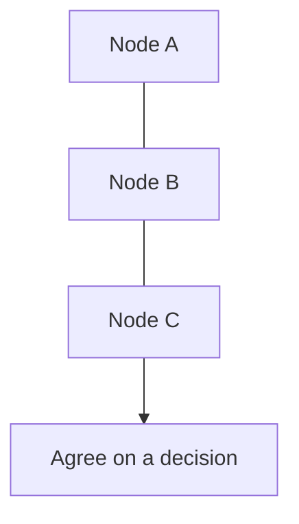

More precisely:

> **Consensus allows a group of distributed nodes to agree on a value or decision while maintaining defined safety guarantees despite certain failures.**

---

# 2. Why Is Consensus Difficult?

On one computer:

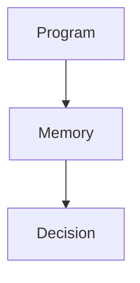

The program has one local view.

With multiple computers:

```text
Node A ←→ Node B ←→ Node C
```

each node has its own:

- Memory.
- State.
- Network connection.
- Clock.
- View of events.

Suppose A sends:

```text
"Accept X"
```

to B.

The message might:

- Arrive quickly.
- Arrive late.
- Never arrive.
- Arrive after another message.
- Be received by B while C is unreachable.

Therefore the system cannot simply assume:

> "Everyone knows what I know."

This is the fundamental difficulty behind distributed agreement.

---

# 3. A Simple Consensus Example

Suppose three nodes need to decide:

```text
Leader = B
```

Initial state:

```text
A → ?
B → ?
C → ?
```

A proposal is made:

```text
Proposal:
Leader = B
```

The nodes communicate:

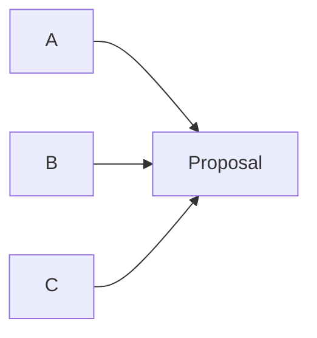

Suppose the protocol determines:

```text
A → Accept
B → Accept
C → Accept
```

The group can safely record:

```text
Leader = B
```

The important part is not the exact voting messages.

The important idea is:

> **Multiple independent nodes need a protocol that determines when a decision is safe to consider agreed.**

---

# 4. Consensus Is More Than Voting

It is tempting to define consensus as:

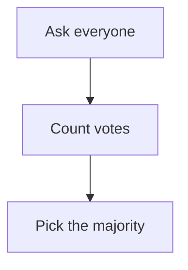

That is incomplete.

A real consensus protocol must also reason about:

- Which proposal is current.
- Which leadership generation is current.
- Whether a node has stale state.
- Whether a previous decision was already committed.
- What happens when messages are delayed.
- What happens when nodes fail.
- What happens during a partition.
- How conflicting proposals are handled.
- How a decision becomes durable.
- How nodes recover after failure.

Therefore:

> **Consensus is a protocol for safe distributed agreement, not simply a vote counter.**

---

# 5. What Must Consensus Provide?

Different consensus algorithms have different formal definitions, but the core goals can be understood through a few ideas.

### Agreement

Correct nodes should not decide conflicting values.

```text
A → X
B → X
C → X
```

is safe.

But:

```text
A → X
B → Y
C → X
```

would violate agreement for the same decision.

---

### Validity

A system should not arbitrarily decide a value that was never legitimately proposed according to the protocol.

For example:

```text
Proposed:
X or Y
```

The protocol should not suddenly decide:

```text
Z
```

without a valid protocol reason.

---

### Progress

When the system has enough healthy connectivity and participation, it should eventually be able to make progress.

This relates to **liveness**.

These properties are implemented differently by different protocols.

For System Design, the important lesson is:

> **Consensus must preserve safety while still allowing progress under conditions where progress is possible.**

---

# 6. Safety vs Liveness

This distinction is extremely important.

## Safety

Safety means:

> **Something bad does not happen.**

For example:

```text
Never commit conflicting values
```

or:

```text
Never have two valid leaders for the same leadership generation
```

---

## Liveness

Liveness means:

> **Something good eventually happens.**

For example:

```text
A decision eventually gets made
```

or:

```text
A healthy cluster eventually elects a leader
```

These goals can conflict.

During a network partition, a system may choose:

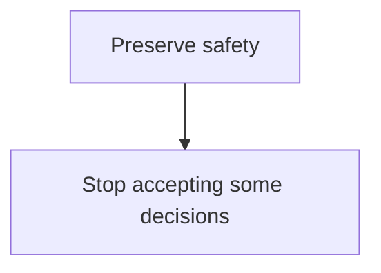

rather than:

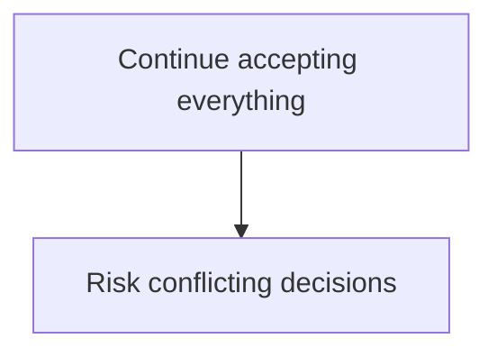

This is a central distributed-systems trade-off.

---

# 7. Consensus and Quorum

Quorum was introduced in **06.06 — Quorum**.

Suppose we have:

```text
A B C
```

Majority:

```text
2
```

A consensus protocol can require participation from:

```text
2 / 3
```

Why is this useful?

Because two different majorities must overlap.

For three nodes:

```text
Set 1 = A B
Set 2 = B C
```

They overlap at:

```text
B
```

This overlap can help prevent two independent decisions from both being considered authoritative under the protocol's rules.

But remember:

> **Quorum alone is not consensus.**

Consensus requires additional protocol rules about ordering, state, leadership, proposals, commitment, and recovery.

---

# 8. Consensus and Replication

Replication means:

```text
Copy state
```

Consensus means:

```text
Agree safely on decisions/state transitions
```

They are related.

A replicated state machine might work like:

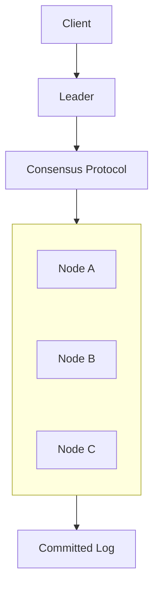

The nodes replicate an ordered sequence of operations.

Consensus helps determine which operations are accepted and in what order.

Therefore:

> **Replication copies state; consensus coordinates agreement about the state or operations that should become authoritative.**

---

# 9. Consensus and Leader Election

Leader election asks:

> **Who should be leader?**

Consensus asks:

> **What should the distributed group agree on?**

They are different.

For example:

```text
Leader Election

A
B → Who becomes leader?
C
```

Consensus:

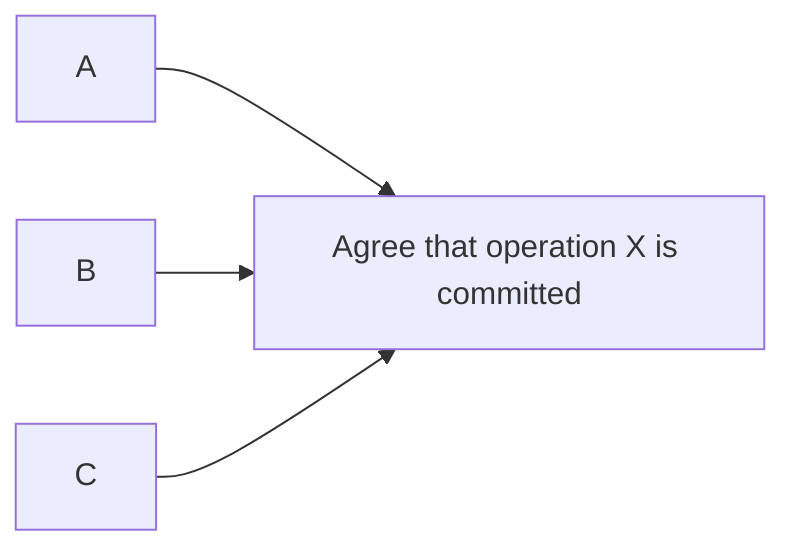

Many practical consensus protocols use a leader because having one coordinator simplifies communication.

Therefore:

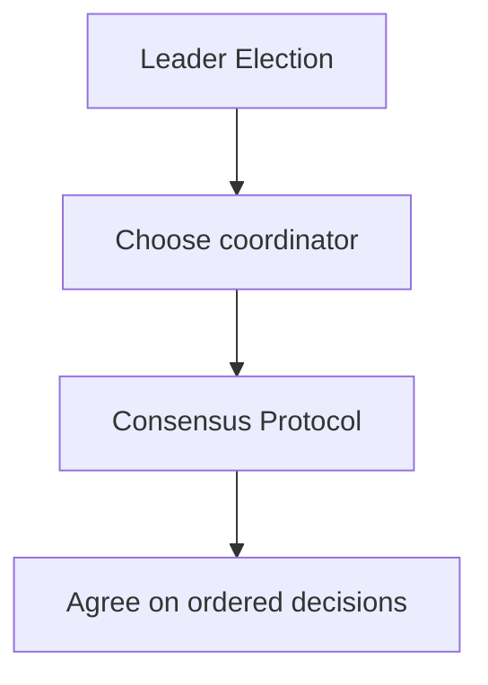

But leader election by itself does not provide full consensus.

---

# 10. Consensus During Normal Operation

Consider three nodes:

```text
A = Leader
B = Follower
C = Follower
```

A client sends:

```text
SET balance = 500
```

The leader proposes the operation.

Conceptually:

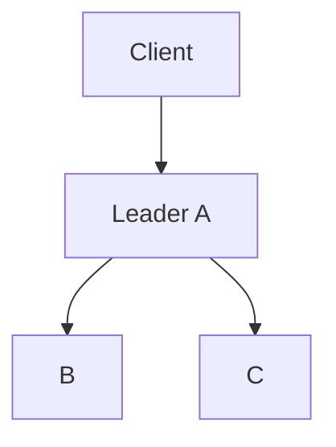

The followers receive the operation.

Suppose the protocol requires a majority.

```text
A + B = 2
```

The operation can become committed according to the protocol's rules.

Then:

```text
Committed:
SET balance = 500
```

Followers can apply the same ordered operation.

The result is:

```text
A → balance = 500
B → balance = 500
C → balance = 500
```

The exact implementation differs between protocols, but this is the basic replicated-state-machine idea.

---

# 11. Why Ordering Matters

Suppose two operations arrive:

```text
1. balance = 500
2. balance = 700
```

If different nodes apply them in different orders:

```text
Node A:
500 → 700

Node B:
700 → 500
```

the nodes can end with different state.

Therefore consensus protocols often establish an agreed ordering:

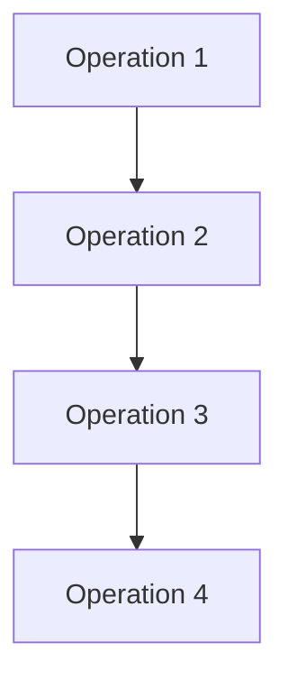

Each node applies the operations in the same sequence.

This creates the idea of a:

> **Replicated state machine**

---

# 12. Replicated State Machine

Imagine every node starts with:

```text
balance = 100
```

The agreed operation log is:

```text
1. +50
2. -20
3. +100
```

Every node applies:

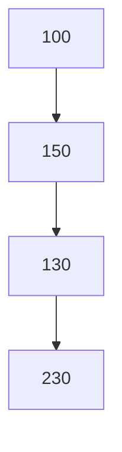

Therefore:

```text
Node A → 230
Node B → 230
Node C → 230
```

The important idea is:

> **If nodes start from compatible state and apply the same ordered deterministic operations, they can reach the same resulting state.**

Consensus can be used to agree on that ordered operation sequence.

---

# 13. The Log

Many consensus systems use some form of an ordered log.

Conceptually:

```text
Log

[1] SET X
[2] SET Y
[3] UPDATE Z
[4] DELETE A
```

The log gives the system an ordered history of operations.

Nodes can replicate it:

```text
Node A:
1 2 3 4

Node B:
1 2 3 4

Node C:
1 2 3 4
```

If a node is temporarily behind:

```text
Node A:
1 2 3 4 5 6

Node B:
1 2 3 4

Node C:
1 2 3 4 5
```

the system can bring B and C up to date.

This connects consensus with:

- Replication.
- State recovery.
- Ordering.
- Commit decisions.

---

# 14. Committed vs Uncommitted

An operation can exist in a node's local log without yet being considered safely committed.

Conceptually:

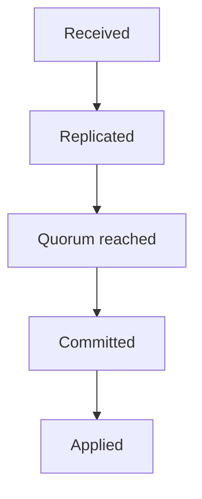

The exact order and meaning depend on the protocol.

The important distinction is:

```text
"I have seen this"
```

versus:

```text
"The distributed protocol has accepted this as authoritative."
```

A node seeing an operation locally does not automatically mean the cluster has committed it.

---

# 15. What Happens When the Leader Fails?

Suppose:

```text
A = Leader
B = Follower
C = Follower
```

A accepts an operation.

Then:

```text
A
X
```

B and C remain.

The cluster needs to:

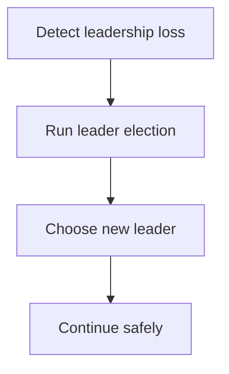

This connects directly to **06.08 — Leader Election**.

The new leader must follow the consensus protocol's rules when deciding:

- Which state is current.
- Which entries are committed.
- Which entries may be discarded.
- Which entries need replication.
- Which operations can safely continue.

---

# 16. What If the Leader Fails Before Replication?

Consider:

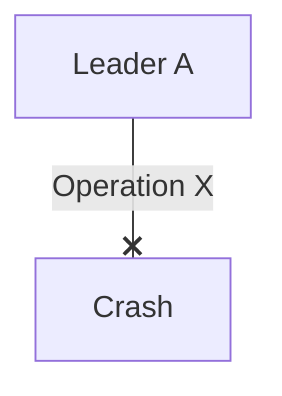

Perhaps:

```text
A → has X
B → has X
C → does not have X
```

What should happen?

The answer depends on whether X was committed according to the protocol.

If it was not committed, the new leader may not preserve it.

If it was committed, the protocol must ensure that a new valid leader does not incorrectly discard the committed decision.

This is one reason consensus protocols carefully define:

- Quorum.
- Commit rules.
- Log ordering.
- Leadership terms.
- Candidate state.
- Recovery.

---

# 17. Network Partition

Now consider:

```text
A B C   |   D E
```

Five nodes.

Majority:

```text
3
```

The left side has:

```text
A B C = 3
```

The right side:

```text
D E = 2
```

If consensus requires majority participation:

```text
A B C
-----
Can potentially continue

D E
---
Cannot independently commit
```

The minority side may have to stop making authoritative progress.

This is a deliberate trade-off.

The system is effectively saying:

> **"We would rather stop some operations than risk two conflicting decisions."**

---

# 18. Consensus and CAP

CAP says that during a network partition, a distributed system cannot simultaneously guarantee both:

- Strong consistency.
- Availability.

Consensus protocols often prioritize safety and therefore may refuse to commit decisions when the required majority cannot be reached.

For example:

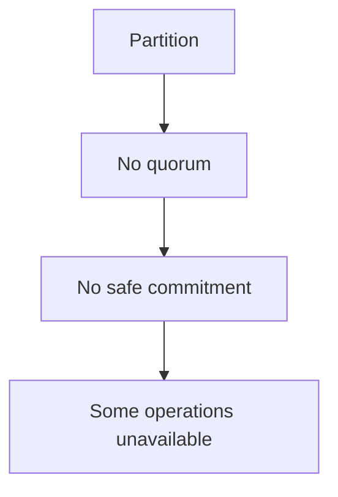

This does not mean:

> "Consensus systems are always unavailable."

It means:

> **Under the failure conditions where the protocol cannot safely establish agreement, it may stop making progress.**

During normal connectivity, the system can remain highly available.

---

# 19. Consensus and Fencing

This connects directly to **06.09 — Distributed Locks**.

Suppose an old leader continues running:

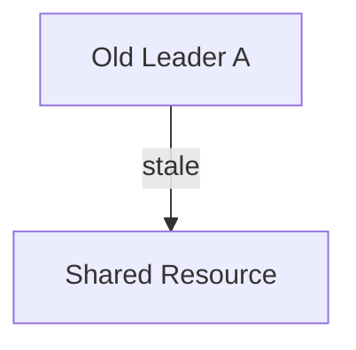

while:

```text
New Leader B
```

is already authoritative.

The system needs a mechanism to prevent A from performing conflicting authoritative operations.

This can involve:

- Terms/epochs.
- Fencing.
- Authority checks.
- Storage-level protection.
- Protocol-specific rules.

The broader principle is:

> **Old authority must not be allowed to override newer authority.**

---

# 20. Raft — Conceptual Overview

**Raft** is a consensus algorithm designed to make distributed consensus easier to understand and implement.

You do not need to memorize its implementation yet.

At a high level, Raft uses three main roles:

```text
Follower
Candidate
Leader
```

The system starts with followers.

If a follower does not hear from a leader:

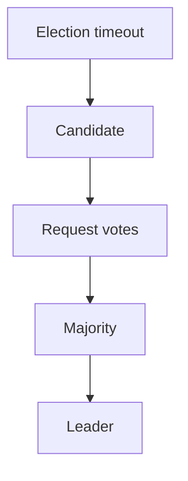

The leader then coordinates log replication.

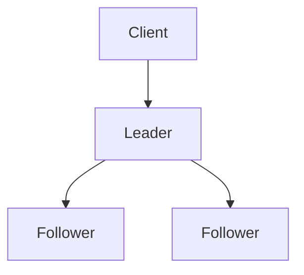

Raft uses terms to distinguish leadership generations.

---

# 21. Raft Log Replication — Simplified

Suppose:

```text
Leader
```

receives:

```text
SET X = 10
```

It appends the operation to its log:

```text
[1] SET X = 10
```

Then replicates it:

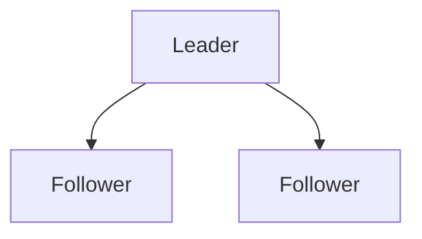

Once the protocol determines that the entry is safely committed:

```text
Committed [1]
```

nodes can apply it to their state machines.

Simplified:

```mermaid
flowchart TD
  accTitle: Raft, simplified
  accDescr: Client, then Leader, then Replicate, then Majority, then Commit, then Apply.
  N0["Client"] --> N1["Leader"] --> N2["Replicate"] --> N3["Majority"] --> N4["Commit"] --> N5["Apply"]
```

This is a useful mental model, not a complete description of Raft's rules.

---

# 22. Raft Terms

Raft divides leadership into terms.

For example:

```text
Term 1 → Leader A
Term 2 → Leader B
Term 3 → Leader C
```

A term can contain:

- Election activity.
- One leader under normal conditions.
- Log replication.

A newer term supersedes an older term.

This helps nodes recognize stale information.

---

# 23. Paxos — Conceptual Overview

**Paxos** is another family of consensus algorithms.

At a high level, Paxos addresses the problem of reaching agreement among distributed nodes despite failures.

It is historically important and widely discussed in distributed-systems literature.

You may encounter roles such as:

- Proposer.
- Acceptor.
- Learner.

The terminology and protocol mechanics differ significantly from Raft.

For this curriculum, the important point is:

> **Paxos and Raft are different approaches to solving distributed consensus.**

You do not need to memorize Paxos message flows at this stage.

---

# 24. Raft vs Paxos

| Concept | Raft | Paxos |
|---|---|---|
| Purpose | Distributed consensus | Distributed consensus |
| Common teaching style | Designed with understandability in mind | Historically influential but often harder to explain |
| Leadership | Strong leader model | Can use leadership/coordinator roles depending on variant |
| Log replication | Central concept | Consensus can be used to establish ordered decisions |
| Terms / generations | Terms | Ballot/proposal numbering |
| Typical educational use | Commonly used to teach consensus | Important foundational consensus family |
| Implementation details | Still complex | Often considered conceptually difficult |

Do not interpret this table as:

```text
Raft = easy
Paxos = simple alternative
```

Both are sophisticated distributed protocols.

---

# 25. Consensus Is Not a Database

A consensus algorithm does not automatically provide:

- SQL.
- Tables.
- Indexes.
- Query optimization.
- Business logic.
- Object storage.
- A complete application database.

Instead, consensus can provide a foundation for systems that need distributed agreement.

For example:

```mermaid
flowchart TD
  accTitle: Consensus under a coordination system
  accDescr: Application, then Distributed Coordination System, then Consensus, then Replicated State.
  N0["Application"] --> N1["Distributed Coordination System"] --> N2["Consensus"] --> N3["Replicated State"]
```

A database or coordination service can build higher-level functionality on top of such mechanisms.

---

# 26. Consensus and Availability

Consensus introduces coordination.

Suppose every operation needs:

```mermaid
flowchart TD
  accTitle: Every operation coordinates
  accDescr: Leader, then Network, then Majority, then Commit.
  N0["Leader"] --> N1["Network"] --> N2["Majority"] --> N3["Commit"]
```

The operation may now depend on:

- Network latency.
- Majority availability.
- Node health.
- Leader health.

This can increase latency compared with purely local operations.

For example:

```mermaid
flowchart TD
  accTitle: Local write
  accDescr: Local write, then Fast.
  N0["Local write"] --> N1["Fast"]
```

versus:

```mermaid
flowchart TD
  accTitle: Distributed write
  accDescr: Distributed write, then Replicate, then Wait for required participation, then Commit.
  N0["Distributed write"] --> N1["Replicate"] --> N2["Wait for required participation"] --> N3["Commit"]
```

The second path has more coordination.

This is the cost of distributed agreement.

---

# 27. Consensus and Geographic Distribution

Suppose nodes are located in:

```text
India
Europe
US
```

A majority decision may require communication across regions.

That introduces:

- Network latency.
- Cross-region failure.
- Higher operational cost.
- More complicated recovery.

If:

```text
India → Europe
```

takes significant time, every consensus operation requiring those nodes may pay some of that coordination cost.

Therefore:

> **Strong distributed agreement across distant locations has a latency and availability cost.**

This is one reason system designers carefully choose consensus-group placement.

---

# 28. Consensus and Failure Domains

Suppose three consensus nodes are:

```text
Server A → Same rack
Server B → Same rack
Server C → Same rack
```

A rack failure could remove:

```text
A
B
C
```

at once.

Even though the cluster has three nodes, it has poor failure-domain diversity.

Better:

```text
Zone A → Node A
Zone B → Node B
Zone C → Node C
```

Now one zone failure may still leave:

```text
2 / 3
```

available.

This connects consensus to **09 — Reliability** concepts such as failure domains and redundancy.

---

# 29. What Happens When a Node Is Slow?

A node does not have to crash to become a problem.

Suppose:

```text
A = Leader
B = Fast
C = Very Slow
```

The leader may have to deal with:

```text
C → delayed responses
```

Depending on the protocol and operation, the cluster may continue with a sufficient majority.

But persistent slow nodes can cause:

- Increased latency.
- Storage pressure.
- Replication backlog.
- More recovery work.
- Leader changes if timeouts are affected.

Therefore:

> **Distributed systems must handle slow nodes, not only failed nodes.**

---

# 30. What If the Network Recovers?

Suppose:

```text
A B C   |   D E
```

becomes connected again.

The system does not simply say:

```mermaid
flowchart TD
  accTitle: Not that simple
  accDescr: Network restored, then Everything is fixed.
  N0["Network restored"] --> N1["Everything is fixed"]
```

Nodes may have:

- Different logs.
- Different terms.
- Missing entries.
- Stale leadership information.
- Different local state.

The protocol must bring them back into a valid state.

Conceptually:

```mermaid
flowchart TD
  accTitle: Recovery after a partition
  accDescr: Network restored, then Compare leadership/state, then Reject stale authority, then Synchronize missing entries, then Apply committed state, then Return to normal operation.
  N0["Network restored"] --> N1["Compare leadership/state"] --> N2["Reject stale authority"] --> N3["Synchronize missing entries"] --> N4["Apply committed state"] --> N5["Return to normal operation"]
```

This is why recovery is part of consensus design.

---

# 31. Consensus and Client Requests

A client may send:

```text
WRITE X
```

to a follower.

The follower may:

```text
Reject
```

or:

```text
Redirect client
```

or:

```text
Forward request to leader
```

depending on the system.

The client therefore needs some understanding of the current authority path.

A complete system might look like:

```mermaid
flowchart TD
  accTitle: Consensus in a larger system
  accDescr: Client, service, leader, consensus group of three nodes.
  N0["Client"] --> N1["Service"] --> N2["Leader"] --> N3["Consensus Group"] --- G
  subgraph G[" "]
    direction TB
    I0["Node"] ~~~ I1["Node"] ~~~ I2["Node"]
  end
```

Consensus is therefore one layer within a larger architecture.

---

# 32. When Is Consensus Useful?

Consensus is useful when the system genuinely needs distributed agreement about critical state or authority.

Examples include:

### Leader coordination

```text
Who is the current leader?
```

### Distributed configuration

```text
Which configuration version is authoritative?
```

### Coordination services

```text
Who owns this coordination role?
```

### Replicated state machines

```text
Which ordered operations should all nodes apply?
```

### Cluster membership/coordination

```text
Which nodes are currently authoritative participants?
```

The exact use depends on the system.

---

# 33. When Consensus May Be Unnecessary

Do not introduce consensus simply because a system has multiple servers.

For example, you may not need consensus for:

```text
Static CDN content
```

or:

```text
Independent image-processing workers
```

or:

```text
A cache where temporary staleness is acceptable
```

or:

```text
A queue that already provides the required work-distribution semantics
```

The key question is:

> **Do multiple nodes need to agree on one authoritative decision or ordered state transition?**

If not, consensus may add unnecessary complexity.

---

# 34. Consensus vs Eventual Consistency

These approaches solve different problems.

### Consensus-oriented system

Often aims for strong agreement about a sequence of authoritative decisions.

```mermaid
flowchart TD
  accTitle: Consensus-oriented system
  accDescr: Operation, then Consensus, then Committed, then Replicated.
  N0["Operation"] --> N1["Consensus"] --> N2["Committed"] --> N3["Replicated"]
```

### Eventual consistency

Allows temporary differences:

```text
Node A → X
Node B → old X
Node C → old X

        ↓

Propagation

        ↓

All → X
```

Eventual consistency may provide better availability or lower coordination requirements for suitable workloads.

Consensus provides stronger coordination but requires more communication and failure handling.

Neither is universally better.

---

# 35. Consensus and the "Single Source of Truth"

Consensus can help establish an authoritative replicated state, but it does not mean:

```text
Only one physical copy exists
```

A consensus group can have:

```text
Node A → State
Node B → State
Node C → State
```

There are multiple copies.

The important property is that the system has a protocol for determining:

```text
Which state transitions are authoritative?
```

Therefore:

> **Distributed agreement does not eliminate replication; it can make replicated state safer and more coordinated.**

---

# 36. Hands-On Exercise — Consensus Simulation

Create three nodes:

```text
A
B
C
```

Assume:

```text
Majority = 2
```

Initial state:

```text
A = Leader
B = Follower
C = Follower
Term = 1
```

Now propose:

```text
SET inventory = 10
```

Simulate:

```mermaid
flowchart TD
  accTitle: Simulated replication
  accDescr: Leader A sends the operation to B and C.
  L["Leader A"] --> B["B"] & C["C"]
```

Suppose B acknowledges.

You now have:

```text
A + B = 2
```

The operation can be considered committed according to the simplified model.

Record:

```text
[1] SET inventory = 10
```

Then apply:

```text
A → 10
B → 10
C → 10
```

---

# 37. Lab Challenge — Leader Failure

Continue the previous simulation.

Suppose:

```text
A = Leader
B = Follower
C = Follower
```

A fails:

```text
A ❌
```

Now:

```text
B
C
```

Choose a new leader according to a majority-based election model.

Then propose:

```text
SET inventory = 7
```

Ask:

1. Who is the new leader?
2. Which nodes participate?
3. What happens if only one node remains reachable?
4. Can one node safely commit a new operation if the protocol requires a majority?
5. What happens when A returns?

---

# 38. Lab Challenge — Network Partition

Start with five nodes:

```text
A B C D E
```

Majority:

```text
3
```

Create:

```text
A B C   |   D E
```

Now answer:

### Question 1

Which side has quorum?

```text
A B C → 3
D E   → 2
```

### Question 2

Which side can potentially continue consensus-based commits?

```text
A B C
```

### Question 3

What should D and E do if they cannot reach the majority?

They should not independently commit conflicting authoritative decisions if the protocol requires majority agreement.

### Question 4

What happens when the partition heals?

The nodes must reconcile leadership generation and replicated state according to the consensus protocol.

---

# 39. Practical Consensus Investigation

When investigating a consensus problem, follow this sequence:

```mermaid
flowchart TD
  accTitle: Consensus investigation
  accDescr: Observe, then Who is leader?, then What is the current term/epoch?, then Which nodes are reachable?, then Which nodes form quorum?, then Which nodes have current state?, then Are there uncommitted entries?, then Are there conflicting leadership claims?, then Is a node slow rather than failed?, then Can the cluster make progress safely?, then Is the problem safety or liveness?, then Recover, then Synchronize state, then Measure again.
  N0["Observe"] --> N1["Who is leader?"] --> N2["What is the current term/epoch?"] --> N3["Which nodes are reachable?"] --> N4["Which nodes form quorum?"] --> N5["Which nodes have current state?"] --> N6["Are there uncommitted entries?"] --> N7["Are there conflicting leadership claims?"] --> N8["Is a node slow rather than failed?"] --> N9["Can the cluster make progress safely?"] --> N10["Is the problem safety or liveness?"] --> N11["Recover"] --> N12["Synchronize state"] --> N13["Measure again"]
```

The most important questions are:

> **What does the cluster believe?**

and:

> **What is actually reachable and authoritative right now?**

---

# 40. Common Mistakes

### Mistake 1 — "Consensus means majority vote"

Majority participation is often part of consensus, but consensus is a broader protocol.

### Mistake 2 — "Quorum is consensus"

Quorum defines participation requirements.

Consensus defines the broader agreement process.

### Mistake 3 — "Replication is consensus"

Replication copies state.

Consensus coordinates agreement about authoritative decisions/state transitions.

### Mistake 4 — "Leader election is consensus"

Leader election chooses leadership.

Consensus solves broader agreement problems.

### Mistake 5 — "Consensus guarantees availability"

Consensus may intentionally stop progress when safe agreement cannot be achieved.

### Mistake 6 — "A node that sees a value means the value is committed"

Local knowledge does not necessarily mean distributed commitment.

### Mistake 7 — "Network recovery means consensus recovery"

Nodes may still need to synchronize state and discard stale authority.

### Mistake 8 — "More consensus nodes always improve performance"

More nodes can increase coordination, network traffic, storage, and operational complexity.

### Mistake 9 — "Consensus is required for every distributed application"

Many distributed workloads can safely use simpler mechanisms.

### Mistake 10 — "Raft and Paxos are interchangeable terminology"

They are different consensus approaches with different protocol designs.

---

# 41. System Design View

Consensus adds a coordination layer:

```mermaid
flowchart TD
  accTitle: Consensus as a coordination layer
  accDescr: Application, leader, consensus protocol; nodes A, B and C hold the replicated state.
  N0["Application"] --> N1["Leader"] --> N2["Consensus Protocol"] --> A["Node A"] & B["Node B"] & C["Node C"]
  A & B & C --> R["Replicated<br/>State"]
```

The protocol must answer:

```mermaid
flowchart TD
  accTitle: What the protocol must answer
  accDescr: Who has authority?, then What is the current term?, then What operations are proposed?, then Which operations are committed?, then What state is authoritative?, then What happens if a node fails?, then What happens during a partition?, then How does a recovered node catch up?.
  N0["Who has authority?"] --> N1["What is the current term?"] --> N2["What operations are proposed?"] --> N3["Which operations are committed?"] --> N4["What state is authoritative?"] --> N5["What happens if a node fails?"] --> N6["What happens during a partition?"] --> N7["How does a recovered node catch up?"]
```

This is why consensus is one of the deeper layers of distributed systems.

---

# 42. The Core Trade-Off

Consensus provides:

```text
Strong distributed agreement
Ordered decisions
Coordinated authority
Safer replicated state
```

But costs:

```text
Network communication
Coordination latency
Quorum dependency
Failure complexity
Leader management
Recovery complexity
Operational overhead
```

The correct question is not:

> "Can we use consensus?"

The better question is:

> **"Does this part of the system require distributed agreement strong enough to justify the coordination cost?"**

---

# 43. A Useful Mental Model

Think of the previous chapters as building one chain:

```mermaid
flowchart TD
  accTitle: Level 6 so far
  accDescr: Distributed System, then Distributed State, then Partial Failure, then Network Partitions, then Replication, then Quorum, then Leader / Follower, then Leader Election, then Distributed Locks, then Consensus.
  N0["Distributed System"] --> N1["Distributed State"] --> N2["Partial Failure"] --> N3["Network Partitions"] --> N4["Replication"] --> N5["Quorum"] --> N6["Leader / Follower"] --> N7["Leader Election"] --> N8["Distributed Locks"] --> N9["Consensus"]
```

Each concept addresses a deeper coordination problem.

### Replication

> "How do we maintain multiple copies?"

### Quorum

> "How many nodes must participate?"

### Leader Election

> "Who has authority?"

### Distributed Lock

> "Who temporarily owns this resource?"

### Consensus

> "How do distributed nodes safely agree?"

---

# 44. Key Principle

> **Consensus is a distributed protocol for reaching safe agreement about values, decisions, or ordered state transitions despite certain node and network failures. Quorum, replication, leader election, and terms are important building blocks in many consensus systems, but none of them alone is equivalent to consensus. Consensus can provide strong coordination and consistent authoritative state, but it introduces network communication, latency, quorum dependencies, and significant operational complexity. Use it when distributed agreement is genuinely required—not simply because the system has multiple machines.**

---

# 45. Quick Reference

### Consensus Mental Model

```mermaid
flowchart TD
  accTitle: Consensus mental model
  accDescr: Proposal, then Leader / Coordinator, then Replicate, then Quorum, then Commit, then Apply, then Replicated State.
  N0["Proposal"] --> N1["Leader / Coordinator"] --> N2["Replicate"] --> N3["Quorum"] --> N4["Commit"] --> N5["Apply"] --> N6["Replicated State"]
```

### During Failure

```mermaid
flowchart TD
  accTitle: During failure
  accDescr: Leader Failure, then Election, then New Leader, then Check State, then Consensus, then Continue Safely.
  N0["Leader Failure"] --> N1["Election"] --> N2["New Leader"] --> N3["Check State"] --> N4["Consensus"] --> N5["Continue Safely"]
```

### During Partition

```mermaid
flowchart TD
  accTitle: During partition
  accDescr: A B C is the majority and can potentially continue; D E is the minority and cannot safely commit under majority.
  A0["A B C"] --> A1["Majority"] --> A2["Can potentially continue"]
  B0["D E"] --> B1["Minority"] --> B2["Cannot safely commit under majority"]
```

### Core Distinctions

| Concept | Main Question |
|---|---|
| Replication | How do we maintain multiple copies? |
| Quorum | How much participation is required? |
| Leader Election | Who is the leader? |
| Distributed Lock | Who temporarily owns this resource? |
| Consensus | What should distributed nodes agree on? |

### Safety vs Liveness

| Property | Meaning |
|---|---|
| Safety | Prevent invalid or conflicting decisions |
| Liveness | Continue making progress when conditions permit |

---

# 46. Knowledge Check

### 1. What is consensus?

**Answer:**  
A distributed protocol that allows nodes to safely agree on values, decisions, or ordered state transitions despite certain failures.

### 2. Why is consensus difficult?

**Answer:**  
Nodes communicate over unreliable networks and may experience failures, delays, partitions, and incomplete information.

### 3. Is quorum the same as consensus?

**Answer:**  
No. Quorum defines required participation; consensus is the broader protocol for distributed agreement.

### 4. Is replication the same as consensus?

**Answer:**  
No. Replication maintains copies; consensus coordinates agreement about authoritative decisions or state transitions.

### 5. Is leader election the same as consensus?

**Answer:**  
No. Leader election chooses a leader. Consensus solves broader distributed agreement problems, although many consensus protocols use leader election.

### 6. What is safety?

**Answer:**  
The property that the system avoids invalid or conflicting decisions.

### 7. What is liveness?

**Answer:**  
The ability of the system to continue making progress when the required conditions are available.

### 8. Why might a minority partition stop accepting operations?

**Answer:**  
If the consensus protocol requires majority participation, the minority cannot safely establish authoritative agreement.

### 9. Why are logs useful in consensus systems?

**Answer:**  
They provide an ordered sequence of operations that can be replicated and applied consistently across nodes.

### 10. What happens when a partition heals?

**Answer:**  
Nodes must reconcile leadership generations and synchronize their state according to the consensus protocol; connectivity alone does not instantly make every node consistent.

### 11. Why can consensus increase latency?

**Answer:**  
Operations may require network communication and participation from multiple nodes before they can be considered committed.

### 12. When might consensus be unnecessary?

**Answer:**  
When the workload does not require multiple distributed nodes to agree on one authoritative decision or ordered state transition.

---

# Remember

> **Consensus is not about making every node identical at every instant.**

It is about establishing:

```text
Safe authority
      +
Agreed decisions
      +
Defined ordering
      +
Recovery rules
```

despite:

```text
Failure
Delay
Partition
Incomplete information
```

And the most important distinction:

> **Quorum tells you how much participation you need. Consensus tells you how distributed nodes safely agree.**

---

# Next Chapter

## 06.11 — Consistency Models

The next chapter moves from **how distributed nodes agree** to **what different nodes are allowed to observe**.

Topics include:

- What a consistency model is
- Why consistency models exist
- Strong consistency
- Weak consistency
- Eventual consistency
- Read-after-write consistency
- Monotonic reads
- Monotonic writes
- Consistent prefix
- Session consistency
- Causal consistency
- Linearizability
- Sequential consistency
- Replicas and stale reads
- Caches and consistency
- Distributed writes
- Consistency vs latency
- Consistency vs availability
- Choosing a consistency model
- Practical examples
- Hands-on consistency-model exercise
- System-design trade-offs
