# 06.11 — Consistency Models

## Learning Objectives

By the end of this chapter, you will be able to:

- Explain what a consistency model means.
- Understand why distributed systems need consistency guarantees.
- Distinguish strong consistency from eventual consistency.
- Understand stale reads and read-after-write consistency.
- Explain linearizability and sequential consistency.
- Understand monotonic reads, monotonic writes, and causal consistency.
- Distinguish database transaction consistency from distributed consistency.
- Understand how replicas and caches affect what users observe.
- Choose an appropriate consistency model based on business requirements.
- Recognize the trade-off between consistency, latency, availability, and complexity.

---

# Beginner Vocabulary

| Term | Beginner-Friendly Meaning |
|---|---|
| **Consistency Model** | Rules describing what values a system is allowed to return to readers. |
| **Strong Consistency** | Reads reflect the latest completed write according to the system's guarantee. |
| **Eventual Consistency** | Different copies may temporarily differ but can converge later. |
| **Stale Read** | A read that returns an older value than a newer value already exists elsewhere. |
| **Read-After-Write** | A guarantee that a read after your successful write can observe that write. |
| **Linearizability** | Operations appear to take effect atomically at a single point in real-time order. |
| **Sequential Consistency** | Operations appear in one consistent global order, though not necessarily real-time order. |
| **Causal Consistency** | Causally related operations are observed in an order that respects their cause-and-effect relationship. |
| **Monotonic Read** | Once a reader observes a value, later reads do not move backward to an older version. |
| **Monotonic Write** | A client's writes are applied in the order that client issued them. |
| **Session Consistency** | Consistency guarantees maintained within a user's or client's session. |
| **Replica** | A copy of data maintained on another node. |
| **Replication Lag** | Delay before a replica receives or applies an update. |
| **Convergence** | Different copies eventually reach the same state. |
| **Version** | A marker used to identify the relative state or revision of data. |
| **Freshness** | How close returned data is to the latest authoritative state. |
| **Source of Truth** | The authoritative place from which the correct state originates. |

---

# 1. What Is a Consistency Model?

A distributed system can have multiple copies of information:

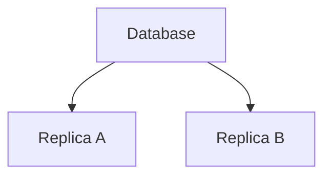

Suppose the original value is:

```text
balance = 500
```

A user changes it:

```text
balance = 700
```

But one replica has not received the update yet.

Now:

```text
Primary      → 700
Replica A    → 700
Replica B    → 500
```

What should happen if a user reads from Replica B?

Possible answer:

```text
500
```

or:

```text
700
```

The answer depends on the **consistency model**.

> **A consistency model defines what a system guarantees about the values and ordering that different readers can observe.**

It is therefore not simply:

> "Is the database consistent?"

The better question is:

> **"What observations does this system guarantee?"**

---

# 2. Why Do Consistency Models Exist?

Distributed systems often contain:

- Multiple servers.
- Multiple replicas.
- Caches.
- Search indexes.
- Asynchronous workers.
- Geographic copies.
- Event-driven services.

These components do not necessarily update simultaneously.

Consider:

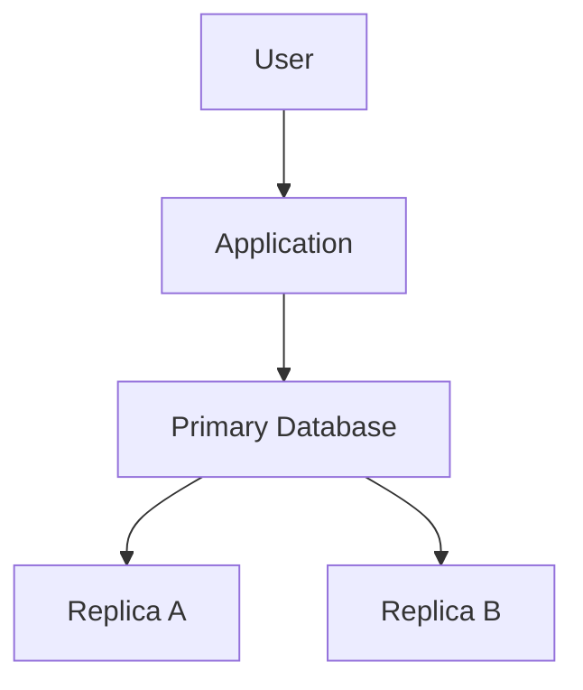

The primary may update first:

```text
Primary → 700
```

while:

```text
Replica A → 700
Replica B → 500
```

temporarily.

Without clearly defined consistency expectations, different parts of the application may make different assumptions.

For example:

```text
Order Service:
"Payment succeeded."

Inventory Service:
"I still see old inventory."
```

Consistency models provide a vocabulary for describing these behaviors.

---

# 3. Strong Consistency

A simplified strong-consistency model says:

> **After a successful write becomes visible according to the system's guarantee, subsequent reads should not return an older value.**

Example:

```text
Initial:
balance = 500
```

Write:

```text
balance = 700
```

After the write is successfully acknowledged:

```text
Read → 700
Read → 700
Read → 700
```

A reader should not suddenly observe:

```text
500
```

if that would violate the model's guarantee.

Strong consistency is useful when stale data can cause incorrect business decisions.

Examples may include:

- Financial balances.
- Inventory availability.
- Critical permissions.
- Some payment state.
- Ownership decisions.

But strong consistency is not free.

It may require:

- Coordination.
- Quorum participation.
- Synchronous replication.
- Leader routing.
- Additional latency.
- Reduced availability during certain failures.

---

# 4. Eventual Consistency

Eventual consistency allows temporary differences.

Suppose:

```text
Primary → 700
Replica A → 700
Replica B → 500
```

Later:

```text
Replica B → 700
```

The system has converged.

Conceptually:

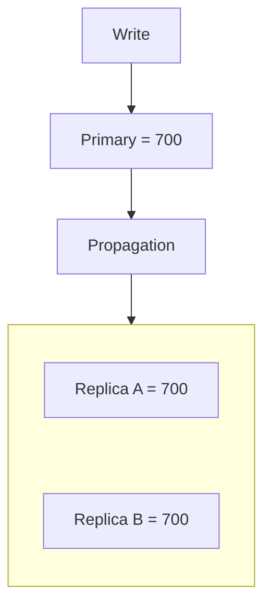

During propagation:

```text
Primary      → 700
Replica A    → 700
Replica B    → 500
```

may be allowed.

Eventually:

```text
All copies → 700
```

This can reduce coordination requirements and improve scalability or availability for suitable workloads.

But the application must tolerate temporary staleness.

---

# 5. Strong vs Eventual Consistency

| Property | Strong Consistency | Eventual Consistency |
|---|---|---|
| Freshness | Stronger guarantee | May temporarily be stale |
| Coordination | Usually higher | Often lower |
| Read latency | Can be higher | Can often be lower |
| Availability during some failures | May decrease | Can often remain higher |
| Temporary divergence | Generally restricted | Expected |
| Complexity | Coordination complexity | Propagation/conflict/recovery complexity |
| Suitable for | Critical correctness | Data that can tolerate staleness |

Neither model is automatically better.

The correct choice depends on the business requirement.

---

# 6. Stale Reads

A stale read occurs when a reader sees an older version of data even though a newer version already exists elsewhere.

Example:

```text
Primary:
price = ₹600

Replica:
price = ₹500
```

A request routed to the replica may return:

```text
₹500
```

even though the current primary value is:

```text
₹600
```

This is a stale read.

Stale reads are not necessarily bugs.

For some workloads:

```text
Product description
```

being a few seconds old may be acceptable.

For others:

```text
Available inventory = 1
```

being stale could cause an incorrect purchase decision.

Therefore:

> **Staleness is a business decision, not merely a technical property.**

---

# 7. Read-After-Write Consistency

Consider:

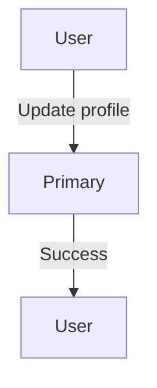

Immediately afterward:

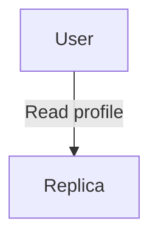

If the replica is behind, the user may see the old profile.

The user experiences:

```text
"I just changed my name.
Why is the old name still showing?"
```

This is a read-after-write consistency problem.

---

# 8. Handling Read-After-Write

Several strategies are possible.

### Strategy 1 — Read from the primary

```text
Write → Primary
Read  → Primary
```

This provides a stronger freshness path.

### Strategy 2 — Sticky reads

After a write:

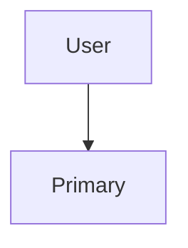

temporarily route related reads to the primary.

### Strategy 3 — Version-aware routing

The client/application tracks:

```text
Required version = 42
```

and only reads from a replica that has reached at least that version.

### Strategy 4 — Accept temporary staleness

For some features:

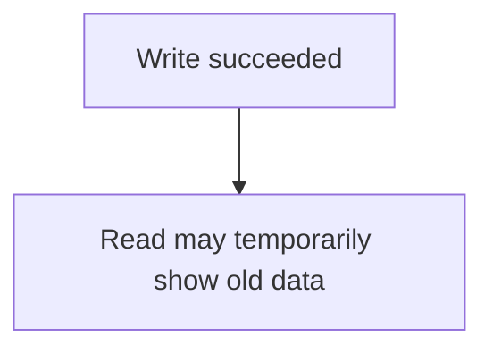

This may be perfectly acceptable.

---

# 9. Consistency Is Not Binary

It is tempting to think:

```text
Consistent
   OR
Inconsistent
```

Real distributed systems are more nuanced.

Different operations can have different requirements.

For example:

```text
Account balance
→ Stronger consistency

Product description
→ Some staleness acceptable

Analytics dashboard
→ Several minutes of lag acceptable

Social like count
→ Temporary difference acceptable
```

One application can therefore use different consistency strategies for different data.

---

# 10. Linearizability

**Linearizability** is a strong consistency guarantee.

A useful simplified definition is:

> **Each operation appears to take effect atomically at some point between its invocation and completion, while respecting real-time ordering between non-overlapping operations.**

Consider:

```text
Write:
balance = 700
```

completes at:

```text
10:00:01
```

A later read begins at:

```text
10:00:02
```

Under linearizable behavior, that later read should not return the old value:

```text
500
```

if the write completed before the read began and both operate under the same consistency guarantee.

The important idea is:

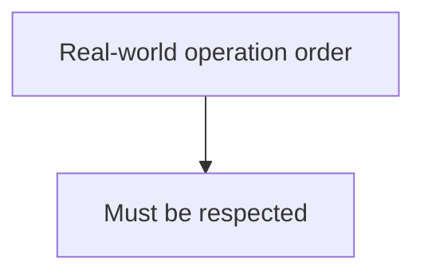

Linearizability is stronger and more precise than simply saying:

> "The data is consistent."

---

# 11. Why Linearizability Matters

Suppose a user changes:

```text
shippingAddress = "Address B"
```

The operation completes.

Then another operation immediately asks:

```text
"What is the shipping address?"
```

If the system returns:

```text
Address A
```

after the completed update to B, the behavior may violate linearizability.

Linearizability is therefore useful for operations where users or systems need a strong view of current state.

But stronger guarantees can require more coordination.

---

# 12. Sequential Consistency

Sequential consistency is another consistency model.

A simplified definition is:

> **The results should be equivalent to executing all operations in one sequential order that preserves the order of operations issued by each individual process.**

The important distinction is that this global order does not necessarily have to preserve real-time ordering between operations from different clients.

Consider:

```text
Client A:
X = 1
X = 2
```

Those operations must remain ordered:

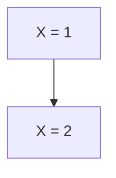

But operations from another client may be interleaved in the global sequence.

Sequential consistency therefore provides ordering guarantees without necessarily providing the full real-time guarantee of linearizability.

---

# 13. Linearizability vs Sequential Consistency

| Property | Linearizability | Sequential Consistency |
|---|---|---|
| Single global order | Yes | Yes |
| Preserves each client's operation order | Yes | Yes |
| Preserves real-time order | Yes | Not necessarily |
| Strength | Stronger | Weaker |
| Coordination implications | Potentially higher | Depends on implementation |

For system design, remember:

> **Linearizability cares about real-time ordering; sequential consistency cares about preserving each client's program order within one valid global sequence.**

---

# 14. Monotonic Reads

Suppose a user reads:

```text
Version 5
```

Then makes another request.

A weakly consistent system might return:

```text
Version 3
```

The user appears to move backward.

Monotonic reads prevent this behavior:

```text
Read 1 → Version 5
Read 2 → Version 5 or newer
```

but not:

```text
Read 1 → Version 5
Read 2 → Version 3
```

This is particularly useful when users make repeated requests across different replicas.

---

# 15. Monotonic Writes

Suppose a client sends:

```text
1. Update name
2. Update address
```

Monotonic writes require the system to preserve the client's write ordering:

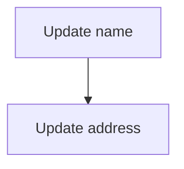

rather than applying:

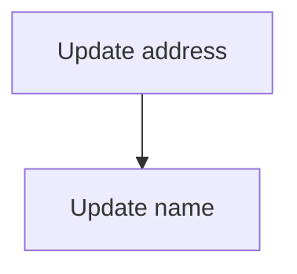

when the application requires the original order.

This is especially important when later operations depend on earlier ones.

---

# 16. Session Consistency

A user session may require certain guarantees even if the entire system does not provide the strongest global consistency.

For example:

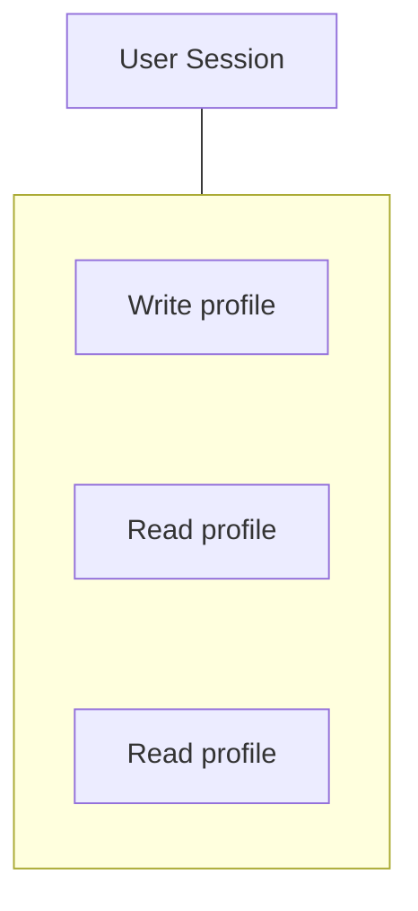

The application may guarantee:

```text
Once the user sees their updated profile,
the same session will not later show the older profile.
```

This is a session-level guarantee.

Session consistency can provide a better user experience without requiring every read across the entire system to use the strongest possible consistency.

---

# 17. Causal Consistency

Some operations have a cause-and-effect relationship.

Suppose:

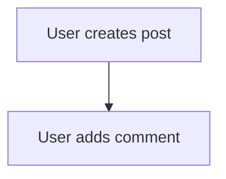

The comment is causally dependent on the post.

A system with causal consistency should not make another user observe:

```text
Comment
```

before:

```text
Post
```

if the system knows the comment was caused by that post.

Conceptually:

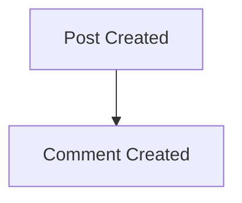

The causal relationship should be preserved.

Causal consistency therefore focuses on:

> **Preserving cause-and-effect relationships between operations.**

---

# 18. Why Causal Consistency Is Useful

Consider a social application:

```text
Alice creates:
"System design is fun."

Then Bob replies:
"Absolutely!"
```

If another user sees:

```text
"Absolutely!"
```

before seeing the original post, the experience is confusing.

Causal consistency can preserve:

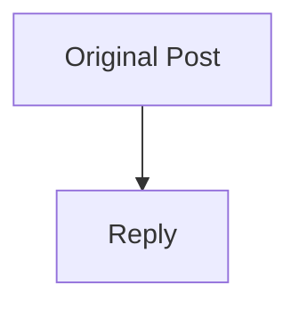

without necessarily requiring every unrelated operation to be globally ordered.

This can provide useful guarantees with less coordination than global strong ordering in some architectures.

---

# 19. Consistency Models at a Glance

| Model | Main Guarantee |
|---|---|
| **Strong consistency** | Reads observe current state according to the defined strong guarantee. |
| **Eventual consistency** | Replicas may temporarily differ but can converge. |
| **Linearizability** | Operations appear atomic and respect real-time ordering. |
| **Sequential consistency** | Operations appear in one order that preserves each client's operation order. |
| **Monotonic reads** | A reader does not move backward to an older version. |
| **Monotonic writes** | A client's writes preserve their ordering. |
| **Session consistency** | Certain consistency guarantees are maintained within a client session. |
| **Causal consistency** | Causally related operations are observed in causal order. |

These models are not all mutually exclusive.

A system can provide combinations of guarantees.

---

# 20. Consistency and Caching

Caches create another copy of data:

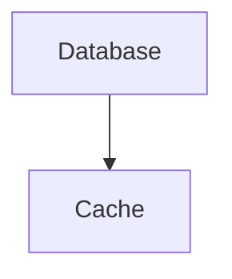

Suppose:

```text
Database → ₹600
Cache    → ₹500
```

A cache read returns:

```text
₹500
```

even though the database contains:

```text
₹600
```

This is another consistency problem.

Caching strategies such as:

- TTL.
- Invalidation.
- Write-through.
- Write-back.
- Cache-aside.

determine how and when cached state changes.

Therefore:

> **A system can have consistency problems even when its database itself is strongly consistent.**

The cache may still be stale.

---

# 21. Consistency and Transactions

A database transaction can provide ACID guarantees.

For example:

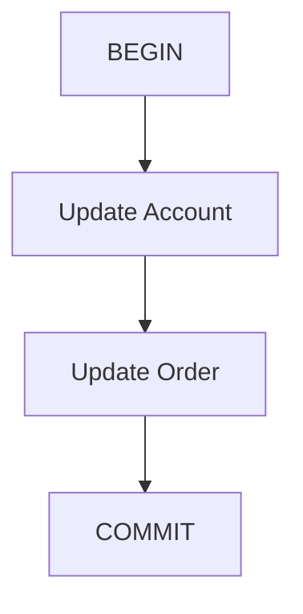

This means the database transaction has a defined atomicity and consistency behavior.

But imagine:

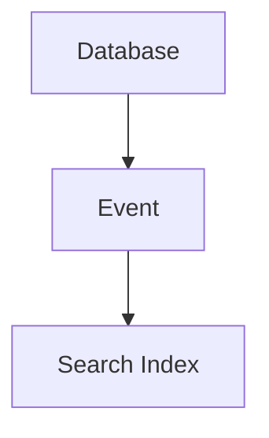

The database transaction may commit successfully while the search index updates later.

Therefore:

```text
Database transaction consistency
          ≠
System-wide consistency
```

This distinction is extremely important.

---

# 22. Consistency Across Services

Consider:

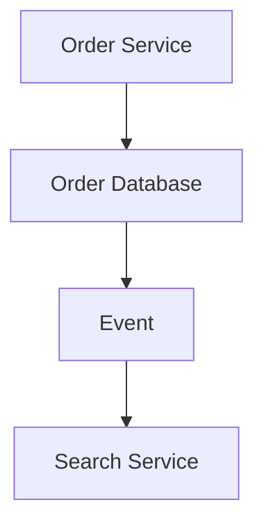

An order may exist in the main database before it appears in search.

Therefore:

```text
Order DB → Order exists
Search    → Order not found yet
```

The system is temporarily divergent.

This may be acceptable if search is eventually updated.

But for critical operations, the application may need to use the authoritative source instead.

---

# 23. Consistency and Availability

A stronger consistency requirement can require more coordination.

During a network partition:

```text
Node A B   |   Node C
```

the system may have to choose between:

```text
Continue operation
```

and:

```text
Wait/reject operation until safe coordination is possible
```

If the operation is critical:

```text
Inventory reservation
```

the system may prefer:

```text
Reject
```

rather than risk conflicting inventory decisions.

For a less critical operation:

```text
Like count
```

the system may accept temporary divergence.

This connects directly to:

**04.20 — CAP Theorem**

and:

**06.04 — Network Partitions**

---

# 24. Consistency and Latency

Stronger consistency may require communication:

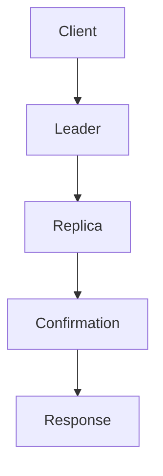

Every additional network hop can contribute latency.

A geographically distributed system may make this more noticeable:

```mermaid
flowchart TD
  accTitle: Cross-region coordination
  accDescr: India, Europe and the US coordinate with each other.
  I["India"] <--> E["Europe"] <--> U["US"]
```

A design requiring cross-region coordination for every write can have substantially different latency characteristics from a design that accepts asynchronous propagation.

Therefore:

> **Consistency requirements can become latency requirements.**

---

# 25. Choosing the Right Consistency Model

Do not begin with:

> "Which consistency model is best?"

Begin with:

> **"What can the business safely tolerate?"**

Ask:

### 1. Can users see stale data?

```text
Yes / No
```

### 2. How stale can it be?

```text
Milliseconds
Seconds
Minutes
```

### 3. Must a user immediately see their own write?

```text
Yes / No
```

### 4. Must operations preserve real-time ordering?

```text
Yes / No
```

### 5. Must cause-and-effect relationships be preserved?

```text
Yes / No
```

### 6. What happens during a network partition?

```text
Reject
Delay
Continue with temporary divergence
```

### 7. What is the cost of stale data?

```text
Minor UX issue
Business error
Financial loss
Safety issue
```

These questions lead toward the appropriate consistency guarantee.

---

# 26. Real Example — Social Feed

Suppose Alice publishes:

```text
Post A
```

The post propagates through:

```text
Feed Service
Search
Recommendations
Notifications
```

Some components may see the post immediately.

Others may see it later.

This can be acceptable:

```mermaid
flowchart TD
  accTitle: Social feed propagation
  accDescr: Post created, then Feed updated, then Search updated later, then Analytics updated later.
  N0["Post created"] --> N1["Feed updated"] --> N2["Search updated later"] --> N3["Analytics updated later"]
```

Trying to make every derived system update synchronously could introduce unnecessary latency and coupling.

Eventual or causal consistency may be more appropriate for some parts of the system.

---

# 27. Real Example — Payment State

Consider:

```text
Payment = SUCCESS
```

The user refreshes the page.

If the page reads from a stale replica:

```text
Payment = PENDING
```

the user may become confused.

For some payment flows, stronger read-after-write guarantees are therefore valuable.

A possible design is:

```mermaid
flowchart TD
  accTitle: Payment status
  accDescr: Payment write, then Primary, then Success, then Read payment status from authoritative source.
  N0["Payment write"] --> N1["Primary"] --> N2["Success"] --> N3["Read payment status from authoritative source"]
```

The exact architecture depends on the payment workflow and business requirements.

The important lesson is:

> **Consistency should follow business correctness.**

---

# 28. Versioning

Versions can help applications reason about freshness.

Suppose:

```text
Current version = 42
```

A replica has:

```text
Version = 39
```

The application can determine:

```text
Replica is behind
```

This can support:

- Read routing.
- Stale-data detection.
- Conflict detection.
- Synchronization.
- Recovery.

Conceptually:

```text
Primary → v42
Replica → v39

Required:
v42

Result:
Replica cannot safely satisfy this read
```

Versioning does not automatically solve consistency, but it provides useful information.

---

# 29. Consistency and Conflicts

Suppose two nodes accept different updates:

```text
Node A:
price = 600

Node B:
price = 650
```

Now the system has a conflict.

Possible strategies include:

- Reject one update.
- Choose a winner.
- Merge changes.
- Use version ordering.
- Use application-specific conflict resolution.
- Reconcile later.

The correct strategy depends on the data.

For example:

```text
Profile description
```

may have one kind of conflict policy.

But:

```text
Bank balance
```

usually cannot be resolved by simply choosing whichever value arrived last.

---

# 30. Hands-On Exercise — Consistency Model

Create this system:

```mermaid
flowchart TD
  accTitle: Exercise architecture
  accDescr: The application uses a primary DB and a replica DB; the primary feeds a cache.
  A["Application"] --> P["Primary<br/>DB"] & R["Replica<br/>DB"]
  P --> C["Cache"]
```

Initial state:

```text
Product price = ₹500
```

Update:

```text
Product price = ₹600
```

Immediately after:

```text
Primary → ₹600
Replica → ₹500
Cache   → ₹500
```

Now classify these requests.

### Request A

User opens the product description.

```text
Replica → ₹500
```

Could this be acceptable?

**Possibly yes**, if short-lived stale product information is acceptable.

### Request B

User completes payment using the displayed price.

Should the application blindly trust the stale cached value?

**No.**

Critical pricing should be validated against an authoritative/current source according to the business rules.

### Request C

User changes their profile and immediately opens it again.

Should the application intentionally route the read to a stale replica?

Usually:

**No**, unless the UX explicitly accepts temporary staleness.

---

# 31. Lab Challenge — Identify the Guarantee

For each scenario, identify the likely consistency requirement.

| Scenario | Likely Requirement |
|---|---|
| Bank balance after successful transfer | Stronger consistency |
| Product description | Eventual may be acceptable |
| Analytics dashboard | Eventual often acceptable |
| User sees their own profile update | Read-after-write |
| Social post followed by comment | Causal ordering may matter |
| Repeated user reads | Monotonic reads can improve UX |
| User's writes must remain ordered | Monotonic writes |
| Payment status immediately after success | Stronger/read-after-write consistency |

The important part is not memorizing this table.

The important part is understanding:

> **Different business operations can require different consistency guarantees.**

---

# 32. Practical Consistency Investigation

When users report:

> "I updated something, but I still see the old value."

Follow this path:

```mermaid
flowchart TD
  accTitle: Consistency investigation
  accDescr: Observe, then What value was written?, then Where was it written?, then What is the source of truth?, then Where was the read served from?, then Cache?, then Replica?, then Search index?, then Check replication lag, then Check cache TTL/invalidation, then Check propagation delay, then Check version, then Identify required consistency guarantee, then Determine whether behavior is expected, then Fix routing/propagation if required, then Measure again.
  N0["Observe"] --> N1["What value was written?"] --> N2["Where was it written?"] --> N3["What is the source of truth?"] --> N4["Where was the read served from?"] --> N5["Cache?"] --> N6["Replica?"] --> N7["Search index?"] --> N8["Check replication lag"] --> N9["Check cache TTL/invalidation"] --> N10["Check propagation delay"] --> N11["Check version"] --> N12["Identify required consistency guarantee"] --> N13["Determine whether behavior is expected"] --> N14["Fix routing/propagation if required"] --> N15["Measure again"]
```

This prevents the common mistake of immediately blaming the database.

---

# 33. Common Mistakes

### Mistake 1 — "Strong consistency is always better"

Stronger consistency can increase coordination, latency, and failure sensitivity.

### Mistake 2 — "Eventual consistency means broken data"

Eventual consistency intentionally permits temporary divergence within defined expectations.

### Mistake 3 — "A strongly consistent database means the whole application is strongly consistent"

Caches, replicas, search indexes, and external services can still be stale.

### Mistake 4 — "Replica means latest data"

A replica may be behind the source.

### Mistake 5 — "Read-after-write happens automatically"

Not when the next read can reach a stale replica or cache.

### Mistake 6 — "Linearizability means all systems are synchronous"

Linearizability is a consistency guarantee, not a statement that every component must literally perform synchronously.

### Mistake 7 — "Eventual consistency means a fixed delay"

"Eventually" does not promise a specific delay unless the system provides an explicit bound.

### Mistake 8 — "CAP consistency and ACID consistency are the same thing"

They are different concepts.

### Mistake 9 — "One consistency model must apply to the whole application"

Different data and operations can have different requirements.

### Mistake 10 — "Caching is unrelated to consistency"

A cache is another representation of data and therefore introduces freshness and consistency questions.

---

# 34. System Design View

Consistency should be considered across the complete architecture:

```mermaid
flowchart TD
  accTitle: Consistency across the architecture
  accDescr: User, application; cache, primary (with replicas) and external service all feed derived systems (search / analytics).
  U["User"] --> A["Application"] --> C["Cache"] & P["Primary"] & X["External<br/>Service"]
  P --> R["Replicas"]
  C & R & X --> D["Derived Systems<br/>Search / Analytics"]
```

Every arrow can introduce:

- Delay.
- Failure.
- Staleness.
- Reordering.
- Duplication.
- Conflicting state.

Therefore the architecture should explicitly define:

```mermaid
flowchart TD
  accTitle: What to define
  accDescr: Source of truth, then Propagation mechanism, then Allowed staleness, then Read routing, then Consistency guarantee, then Failure behavior, then Recovery.
  N0["Source of truth"] --> N1["Propagation mechanism"] --> N2["Allowed staleness"] --> N3["Read routing"] --> N4["Consistency guarantee"] --> N5["Failure behavior"] --> N6["Recovery"]
```

---

# 35. Consistency Decision Framework

Use this sequence:

```mermaid
flowchart TD
  accTitle: Consistency decision framework
  accDescr: 1. What data is being protected?, then 2. What is the source of truth?, then 3. Who writes it?, then 4. Who reads it?, then 5. Can reads be stale?, then 6. How stale can they be?, then 7. Must users see their own writes?, then 8. Must operations preserve ordering?, then 9. Are there causal relationships?, then 10. What happens during partition?, then 11. What latency is acceptable?, then 12. Choose the smallest consistency guarantee that preserves correctness..
  N0["1#46; What data is being protected?"] --> N1["2#46; What is the source of truth?"] --> N2["3#46; Who writes it?"] --> N3["4#46; Who reads it?"] --> N4["5#46; Can reads be stale?"] --> N5["6#46; How stale can they be?"] --> N6["7#46; Must users see their own writes?"] --> N7["8#46; Must operations preserve ordering?"] --> N8["9#46; Are there causal relationships?"] --> N9["10#46; What happens during partition?"] --> N10["11#46; What latency is acceptable?"] --> N11["12#46; Choose the smallest consistency guarantee that preserves correctness."]
```

That final rule is important.

> **Do not pay for stronger consistency than the business actually requires.**

---

# 36. The Deeper Trade-Off

A simplified spectrum looks like:

```text
More Coordination
       ↑
       |
Strong / Linearizable
       |
       |
Causal / Session Guarantees
       |
       |
Eventual Consistency
       |
       ↓
Less Coordination
```

This is not a strict universal ranking of every consistency model.

Different models provide different guarantees.

The useful system-design idea is:

```mermaid
flowchart TD
  accTitle: Stronger guarantees
  accDescr: Stronger guarantees, then More coordination may be required, then Potentially higher latency / lower availability.
  N0["Stronger guarantees"] --> N1["More coordination may be required"] --> N2["Potentially higher latency / lower availability"]
```

while:

```mermaid
flowchart TD
  accTitle: Weaker guarantees
  accDescr: Weaker guarantees, then More temporary divergence may be allowed, then Potentially better scalability / availability.
  N0["Weaker guarantees"] --> N1["More temporary divergence may be allowed"] --> N2["Potentially better scalability / availability"]
```

The exact trade-off depends on implementation and workload.

---

# 37. Consistency Mental Model

When evaluating any distributed read, ask four questions:

### 1. Identity

```text
Which version/data are we talking about?
```

### 2. Authority

```text
Where is the source of truth?
```

### 3. Freshness

```text
How old can this value be?
```

### 4. Ordering

```text
What order must operations be observed in?
```

Then ask:

```text
What happens when communication fails?
```

This creates a practical consistency model for system design.

---

# 38. Key Principle

> **A consistency model defines what a distributed system guarantees about the values and ordering that different readers can observe. Stronger models provide stronger guarantees but can require more coordination, latency, and failure handling. Weaker models can improve scalability and availability by allowing temporary divergence. Good system design does not choose the strongest model everywhere; it chooses the smallest consistency guarantee that preserves the business's correctness and user experience.**

---

# 39. Quick Reference

### Basic Models

| Model | Simple Idea |
|---|---|
| Strong | Reads reflect current state under the defined guarantee |
| Eventual | Copies may differ temporarily but can converge |
| Linearizable | Operations respect real-time ordering |
| Sequential | Operations appear in one order preserving each client's order |
| Causal | Cause-and-effect ordering is preserved |
| Monotonic Reads | Reads do not move backward |
| Monotonic Writes | A client's writes preserve order |
| Session | Certain guarantees are maintained within a session |

### Common Consistency Problem

```mermaid
flowchart TD
  accTitle: Common consistency problem
  accDescr: Write, then Primary = New, then Replication delay, then Replica = Old, then Read, then Stale value.
  N0["Write"] --> N1["Primary = New"] --> N2["Replication delay"] --> N3["Replica = Old"] --> N4["Read"] --> N5["Stale value"]
```

### Common Solutions

```text
Read from primary
       OR
Sticky reads
       OR
Version-aware routing
       OR
Accept bounded/defined staleness
       OR
Stronger coordination
```

---

# 40. Knowledge Check

### 1. What is a consistency model?

**Answer:**  
A set of guarantees describing what values and operation order a distributed system can expose to readers.

### 2. What is a stale read?

**Answer:**  
A read that returns an older version while a newer version already exists elsewhere in the system.

### 3. What is read-after-write consistency?

**Answer:**  
A guarantee that after a successful write, a subsequent relevant read can observe that write.

### 4. What is linearizability?

**Answer:**  
A strong consistency guarantee where operations appear atomic and respect real-time ordering.

### 5. How is sequential consistency different from linearizability?

**Answer:**  
Sequential consistency requires one global order that preserves each client's operation order, while linearizability additionally preserves real-time ordering between non-overlapping operations.

### 6. What are monotonic reads?

**Answer:**  
Once a reader observes a particular version, later reads do not return an older version.

### 7. What are monotonic writes?

**Answer:**  
A client's writes are applied in the order that client issued them.

### 8. What is causal consistency?

**Answer:**  
A consistency guarantee that preserves the order of causally related operations.

### 9. Can a strongly consistent database still be part of an eventually consistent system?

**Answer:**  
Yes. For example, the database may be strongly consistent while its cache, search index, analytics system, or replicated derived view updates asynchronously.

### 10. Why isn't strong consistency always the best choice?

**Answer:**  
It can require additional coordination, latency, and availability trade-offs that may be unnecessary for data that can safely tolerate staleness.

### 11. Why does replication create consistency concerns?

**Answer:**  
Multiple copies can temporarily contain different versions because updates take time to propagate.

### 12. What should determine the consistency model?

**Answer:**  
Business correctness, acceptable staleness, ordering requirements, user experience, latency, availability, and operational constraints.

---

# Remember

> **Consistency is not simply "Is the data correct?"**

Ask:

```text
Correct according to which guarantee?
Observed by whom?
At what time?
From which copy?
In what order?
```

A distributed system may intentionally allow:

```text
Primary → New
Replica → Old
Cache   → Older
```

for a short period.

That is not automatically a system failure.

The real question is:

> **Is that level of divergence acceptable for this operation?**

---

# Next Chapter

## 06.12 — Eventual Consistency

The next chapter goes deeper into **Eventual Consistency**, which was introduced earlier in 04.19 and will now be examined specifically from the distributed-systems perspective.

Topics include:

- Eventual consistency in distributed systems
- Why systems accept temporary divergence
- State propagation
- Convergence
- Replication lag
- Stale reads
- Read-after-write problems
- Versioning
- Ordering
- Conflict resolution
- Last-write-wins
- Merge strategies
- Reconciliation
- Duplicate updates
- Retry interaction
- Event-driven propagation
- Cache consistency
- Search-index consistency
- Failure during propagation
- Recovery after divergence
- User experience
- When eventual consistency is appropriate
- When it is dangerous
- Hands-on convergence exercise
- System-design trade-offs
