# 06.12 — Eventual Consistency

## Learning Objectives

By the end of this chapter, you will be able to:

- Explain what eventual consistency means in a distributed system.
- Understand why distributed systems intentionally allow temporary divergence.
- Trace how state propagates between replicas and services.
- Understand stale reads and read-after-write problems.
- Explain convergence and why it is not automatic.
- Understand ordering, versioning, and conflicting updates.
- Recognize how retries and duplicate delivery affect convergence.
- Understand eventual consistency in databases, caches, search systems, and event-driven architectures.
- Design recovery and reconciliation strategies.
- Decide when eventual consistency is appropriate and when it is dangerous.

---

# Beginner Vocabulary

| Term | Beginner-Friendly Meaning |
|---|---|
| **Eventual Consistency** | Different copies may temporarily disagree but are expected to converge later. |
| **Divergence** | Two copies of the same logical data temporarily contain different values. |
| **Convergence** | Different copies eventually reach the same intended state. |
| **Propagation** | Moving an update from one component or copy to another. |
| **Stale Read** | Reading an older value instead of a newer available value. |
| **Replica Lag** | Delay before a replica catches up with the source. |
| **Version** | A marker identifying a particular state or revision. |
| **Conflict** | Two updates cannot both simply be applied as-is. |
| **Reconciliation** | Detecting and resolving differences between copies of state. |
| **Replication** | Maintaining copies of data or state on multiple nodes. |
| **Derived View** | Data produced from another source, such as a search index. |
| **Retry** | Trying an operation again after failure. |
| **Duplicate** | The same logical operation being delivered or processed more than once. |
| **Ordering** | The sequence in which operations are observed or applied. |
| **Last-Write-Wins** | A conflict policy that selects one version as the winner according to a defined ordering rule. |
| **Idempotent** | Safe to repeat without producing an unwanted additional effect. |
| **Read-After-Write** | Ability to observe your successful write in a later read. |
| **Freshness** | How close a value is to the latest authoritative state. |
| **Source of Truth** | The authoritative source from which correct state originates. |
| **Propagation Delay** | Time between an update being accepted and another copy receiving/applying it. |

---

# 1. What Is Eventual Consistency?

Suppose an application stores a user's profile in a distributed system.

Initially:

```text
name = "Ravi"
```

The user changes it:

```text
name = "Rahul"
```

The primary copy changes first:

```text
Primary → Rahul
```

Other copies may temporarily contain:

```text
Replica A → Rahul
Replica B → Ravi
```

Later:

```text
Replica B → Rahul
```

The copies have converged.

This is the basic idea of eventual consistency:

> **A distributed system may temporarily expose different versions of state, but if updates continue to propagate successfully and no newer conflicting updates replace them, the relevant copies are expected to converge.**

The important word is:

**Eventually.**

It does not automatically mean:

```text
"within 2 seconds"
```

unless the system explicitly provides such a bound.

---

# 2. Why Would a System Allow Temporary Divergence?

At first, eventual consistency may sound like a bad design.

Why not simply update everything immediately?

Because distributed systems often operate across:

- Multiple servers.
- Multiple availability zones.
- Multiple regions.
- Independent services.
- Caches.
- Search indexes.
- Message brokers.
- Background workers.

Updating everything synchronously can require more coordination.

Consider:

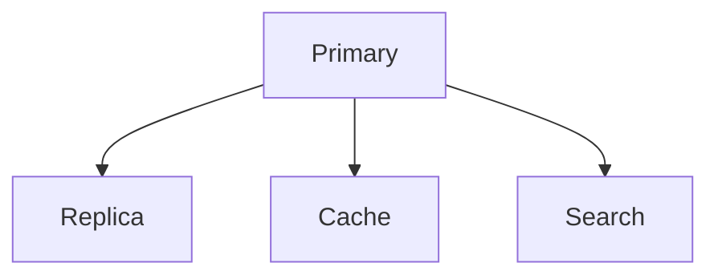

If every component must confirm the update before the original request succeeds:

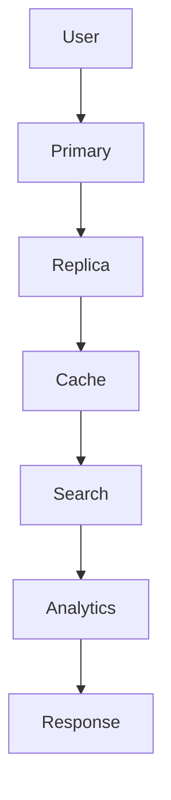

The request becomes dependent on many systems.

Instead, the system may use:

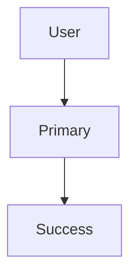

and propagate the update asynchronously:

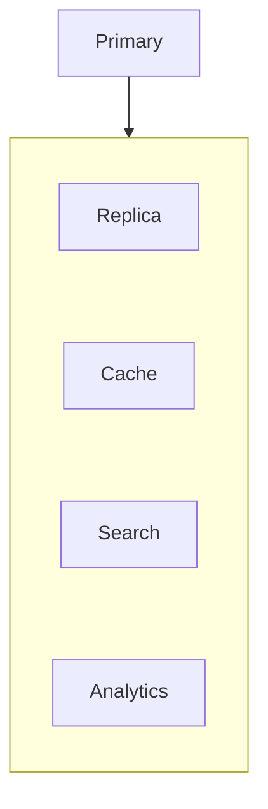

This can reduce request latency and coupling.

---

# 3. Divergence

Divergence means different copies temporarily contain different state.

Example:

```text
Primary  → v10
Replica A → v10
Replica B → v9
Replica C → v8
```

The system is currently divergent.

After propagation:

```text
Primary  → v10
Replica A → v10
Replica B → v10
Replica C → v10
```

the copies have converged.

Divergence is not automatically a failure.

The important questions are:

```text
How large is the divergence?
How long does it last?
Which data is affected?
Can users safely observe it?
Will the system recover automatically?
```

---

# 4. Propagation Through Events

Event-driven systems commonly use asynchronous propagation.

For example:

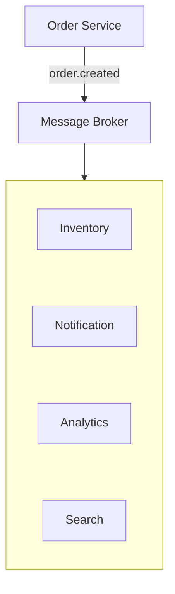

The services may update at different times.

Immediately after the order:

```text
Order DB    → Order exists
Inventory   → Updated
Search      → Not updated yet
Analytics   → Not updated yet
```

Later:

```text
Order DB    → Updated
Inventory   → Updated
Search      → Updated
Analytics   → Updated
```

The system converges.

---

# 5. Failure During Propagation

Now consider:

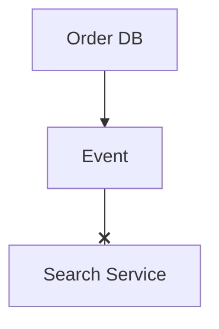

The search service never receives the event.

The system does not automatically converge.

Possible solutions include:

- Retry.
- Durable event storage.
- Consumer recovery.
- Replay.
- Dead-letter handling.
- Reconciliation.
- Periodic repair jobs.

Therefore:

> **Eventual consistency without reliable recovery is only a hope of convergence, not a complete design.**

---

# 6. Eventual Consistency With Analytics

Analytics systems frequently process data asynchronously.

For example:

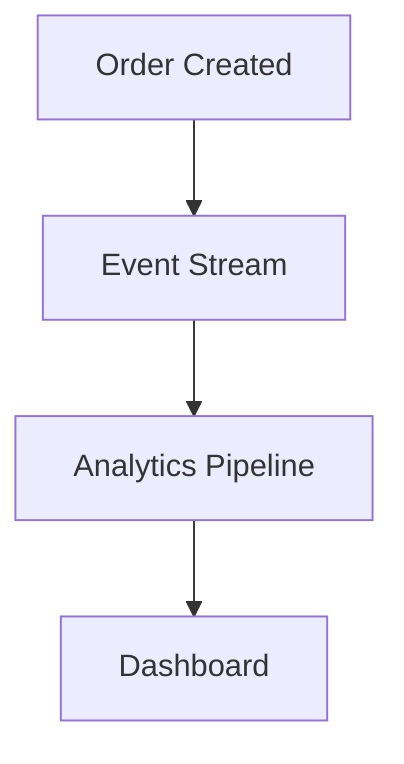

A dashboard might show:

```text
Orders today: 9,998
```

while the transactional database already contains:

```text
Orders today: 10,000
```

The difference may be acceptable if the dashboard is intended for reporting rather than transactional decisions.

This is a classic example of choosing consistency based on purpose.

---

# 7. Retry and Convergence

Suppose an update fails to reach a replica:

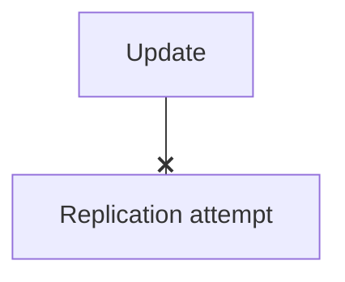

A retry may later succeed:

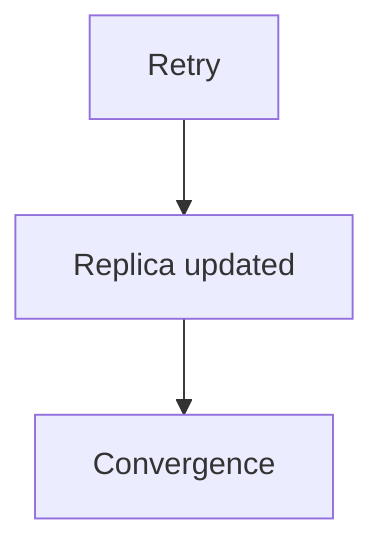

But retries themselves can create problems:

- Duplicate processing.
- Reordering.
- Retry storms.
- Increased load.
- Repeated side effects.

Therefore eventual consistency must be designed together with:

```text
Retries
Idempotency
Ordering
Backpressure
Dead-letter handling
```

---

# 8. Eventual Consistency After a Network Partition

Consider:

```text
Node A  X  Node B
```

The nodes cannot communicate.

Before partition:

```text
value = 100
```

During partition:

```text
Node A → 120
Node B → 130
```

Now there is divergent state.

When connectivity returns:

```text
Node A ↔ Node B
```

the system needs a reconciliation strategy.

Possibilities include:

```text
Choose one version
       OR
Merge versions
       OR
Replay operations
       OR
Use application-specific conflict resolution
```

Simply reconnecting the network does not magically decide which state is correct.

---

# 9. Eventual Consistency and CAP

During a network partition, a system cannot guarantee both:

```text
Strong consistency
+
Availability
```

under the formal CAP model.

An AP-oriented system may continue accepting operations:

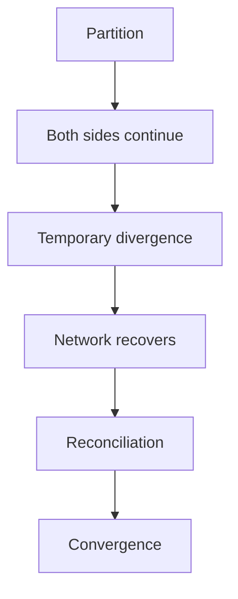

This is one reason eventual consistency often appears in highly distributed systems.

But:

> **Eventual consistency does not automatically mean a system is AP.**

A system can use eventual consistency in specific parts of an otherwise stronger-consistency architecture.

---

# 10. Hands-On Exercise — Simulate Convergence

Create three copies:

```text
Primary
Replica A
Replica B
```

Initial state:

```text
product_id = 42
price = ₹500
version = 10
```

Apply an update:

```text
Primary:
price = ₹600
version = 11
```

Now simulate propagation:

```text
Replica A:
version = 11

Replica B:
version = 10
```

## Step 1

Identify which copy is stale.

**Answer:**

```text
Replica B
```

## Step 2

A user reads Replica B.

What might they see?

```text
₹500
```

## Step 3

Propagate version 11.

```text
Replica B:
price = ₹600
version = 11
```

Now:

```text
Primary    → v11
Replica A  → v11
Replica B  → v11
```

The system has converged.

---

# 11. Lab Challenge — Propagation Failure

Start with:

```text
Primary → v20
Replica → v20
```

Apply:

```text
Primary → v21
```

The propagation fails:

```text
Primary → v21
Replica → v20
```

Now answer:

### Question 1

Is the system converged?

**No.**

### Question 2

Can eventual consistency still be achieved?

**Yes, if the system has a reliable recovery path.**

For example:

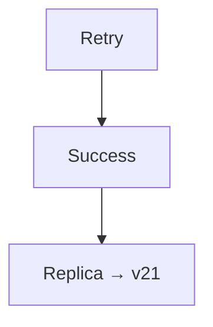

### Question 3

What if retries continue failing?

The replica can remain stale indefinitely.

This is why monitoring and reconciliation are essential.

---

# 12. Practical Investigation Workflow

When two components show different data:

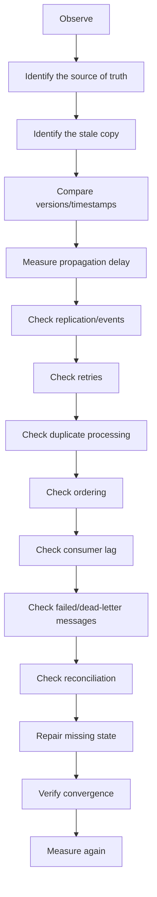

Do not immediately conclude:

> "The database is broken."

The problem may be in the propagation path.

---

# 13. Observability for Eventual Consistency

A system that intentionally allows temporary divergence needs visibility into that divergence.

Useful signals include:

| Metric | Why It Matters |
|---|---|
| Replication lag | Shows how far replicas are behind |
| Event age | Shows how long an event has waited |
| Consumer lag | Shows processing delay |
| Propagation latency | Measures update delivery time |
| Failed events | Indicates propagation problems |
| Retry count | Shows repeated failures |
| DLQ depth | Indicates messages requiring investigation |
| Reconciliation count | Shows repair activity |
| Stale-read rate | Shows user-visible divergence |
| Version gap | Shows difference between copies |

A useful operational question is:

> **How long can the system remain divergent before the business considers it unhealthy?**

---

# 14. Eventual Consistency and Backpressure

Suppose updates arrive at:

```text
1,000 events/sec
```

but consumers process:

```text
700 events/sec
```

Then:

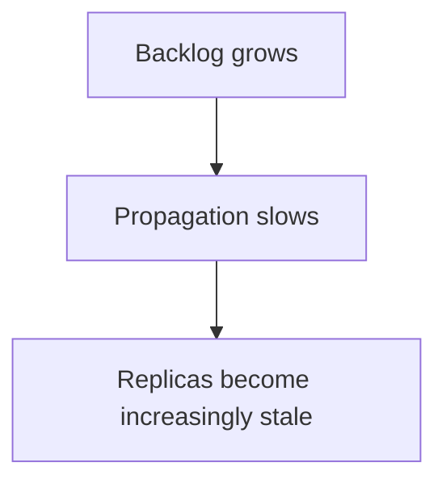

This connects eventual consistency to:

**05.14 — Backpressure**

and:

**05.15 — Asynchronous Architecture**.

Eventually consistent systems must consider not just whether propagation works, but whether it can keep up with incoming changes.

---

# 15. Eventual Consistency and Ordering

Consider:

```text
Update A:
price = ₹600

Update B:
price = ₹700
```

Correct ordering:

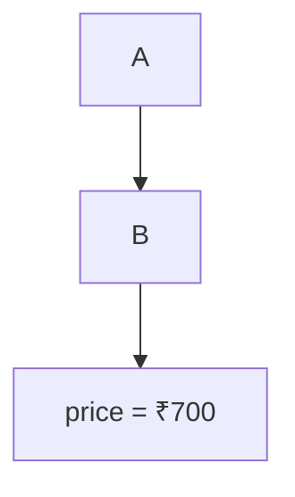

Incorrect ordering:

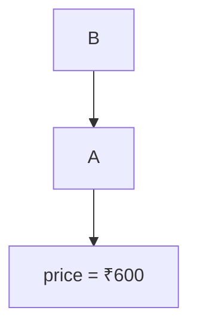

If the system allows out-of-order propagation, it needs a way to prevent older state from overwriting newer state.

Possible mechanisms include:

- Sequence numbers.
- Versions.
- Ordered partitions.
- Per-entity ordering.
- Causal metadata.
- Conflict resolution.

---

# 16. Eventual Consistency and Idempotency

Suppose:

```text
order.created
```

is delivered twice.

A non-idempotent consumer might create:

```text
Order #1001
Order #1002
```

from one logical event.

An idempotent consumer can recognize:

```text
event_id = abc123
```

has already been processed.

Then:

```text
First delivery  → Process
Second delivery → Ignore/reuse result
```

This helps prevent duplicate effects from disrupting convergence.

Therefore:

```text
Eventual Consistency
       +
At-Least-Once Delivery
       +
Idempotency
       ↓
Safer Convergence
```

---

# 17. Eventual Consistency and Recovery

A good architecture assumes propagation failures will happen.

Recovery may include:

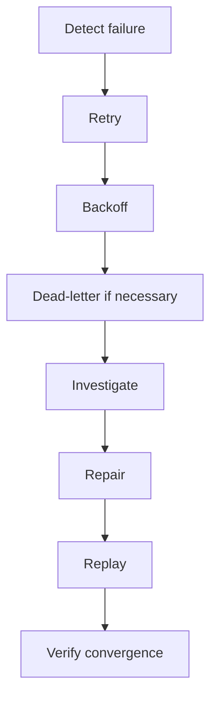

For more serious divergence:

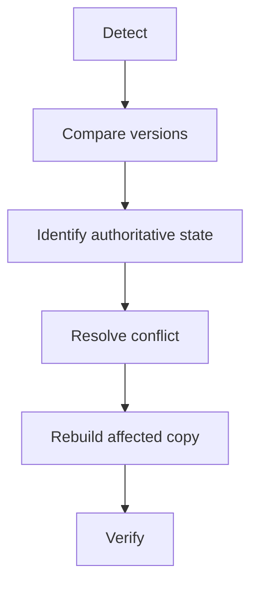

Recovery is part of the consistency design.

It is not an afterthought.

---

# 18. Common Mistakes

### Mistake 1 — "Eventually" means immediately

It does not.

Propagation can take time.

### Mistake 2 — Assuming convergence is automatic

Failed propagation can leave copies permanently stale.

### Mistake 3 — Ignoring ordering

Out-of-order updates can produce incorrect state.

### Mistake 4 — Using timestamps as perfect global truth

Distributed clocks can have skew.

### Mistake 5 — Retrying without idempotency

Retries can create duplicate effects.

### Mistake 6 — Treating every stale read as a system failure

Some workloads intentionally tolerate staleness.

### Mistake 7 — Treating every stale read as harmless

Critical operations may require stronger guarantees.

### Mistake 8 — Making the entire system strongly consistent

Only the operations that require stronger guarantees may need them.

### Mistake 9 — Ignoring propagation backlog

A growing queue can turn temporary staleness into prolonged divergence.

### Mistake 10 — Assuming network recovery means state recovery

Connectivity returning does not automatically resolve conflicting or missing updates.

---

# 19. System Design View

Eventual consistency is usually part of a larger architecture:

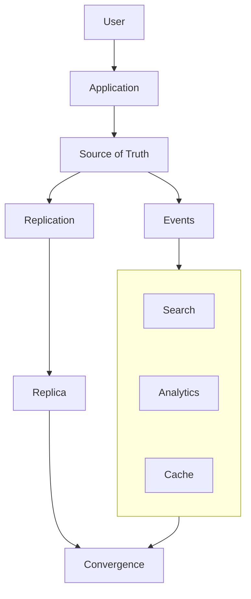

Every asynchronous boundary creates a potential consistency gap.

Therefore the architecture should define:

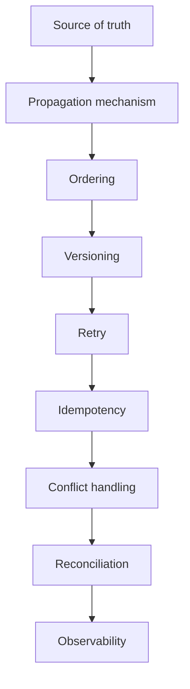

---

# 20. Eventual Consistency Decision Framework

Before choosing eventual consistency, ask:

### Data

```text
What data is becoming distributed?
```

### Staleness

```text
How stale can it safely be?
```

### Propagation

```text
How does the update travel?
```

### Ordering

```text
Must updates be observed in a particular order?
```

### Conflicts

```text
Can multiple writers update the same data?
```

### Recovery

```text
What happens if propagation fails?
```

### Duplicates

```text
Can the same update arrive twice?
```

### Backlog

```text
What happens if consumers cannot keep up?
```

### User experience

```text
What will the user see during divergence?
```

### Business correctness

```text
What is the worst consequence of stale data?
```

If the answer to the final question is:

```text
Financial loss
Security failure
Incorrect ownership
Irreversible action
```

stronger consistency or coordination may be required for that operation.

---

# 21. The Core Trade-Off

Eventual consistency can provide:

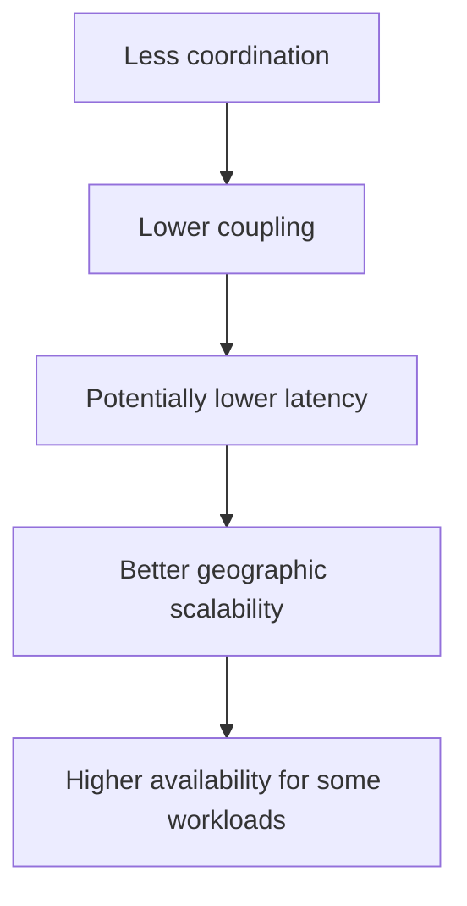

But it introduces:

```mermaid
flowchart TD
  accTitle: What you pay
  accDescr: Temporary staleness, then Propagation delay, then Ordering problems, then Duplicate processing, then Conflict resolution, then Reconciliation, then Operational complexity.
  N0["Temporary staleness"] --> N1["Propagation delay"] --> N2["Ordering problems"] --> N3["Duplicate processing"] --> N4["Conflict resolution"] --> N5["Reconciliation"] --> N6["Operational complexity"]
```

So the real trade-off is not:

```text
Good vs Bad
```

It is:

```text
Immediate agreement
        VS
Temporary divergence + convergence
```

---

# 22. A Useful Mental Model

Think of eventual consistency as a **moving wave of state**.

```text
Time →

Source:
v10 ──→ v11 ──→ v12

Replica A:
v10 ──→ v11 ──→ v12

Replica B:
v10 ─────→ v11 ──→ v12

Replica C:
v10 ─────────────→ v11 ──→ v12
```

The copies are temporarily behind.

The system is healthy if they can continue moving toward the intended state.

The important questions are:

```text
How far behind?
How long behind?
Why behind?
Can it catch up?
What if it cannot?
```

---

# 23. Key Principle

> **Eventual consistency allows distributed copies or derived views to temporarily differ while the system propagates updates toward a converged state. It is useful when temporary staleness is acceptable, but convergence is not automatic: reliable propagation, ordering, versioning, retries, idempotency, conflict handling, backpressure, reconciliation, and observability are all part of a complete eventual-consistency design.**

---

# 24. Quick Reference

### Basic Flow

```mermaid
flowchart TD
  accTitle: Basic flow
  accDescr: Write, then Source of Truth, then Propagation, then Temporary Divergence, then Retry / Ordering / Conflict Handling, then Convergence.
  N0["Write"] --> N1["Source of Truth"] --> N2["Propagation"] --> N3["Temporary Divergence"] --> N4["Retry / Ordering / Conflict Handling"] --> N5["Convergence"]
```

### Common Causes of Divergence

```text
Replication Lag
Event Delay
Consumer Lag
Cache Staleness
Network Partition
Failed Delivery
Out-of-Order Updates
```

### Common Recovery Tools

```text
Retry
Backoff
Idempotency
Versioning
Replay
Reconciliation
Conflict Resolution
```

### Common Examples

| System | Eventual Consistency Often Appropriate? |
|---|---|
| Search index | Yes |
| Analytics | Yes |
| Social feed | Often |
| Product description cache | Often |
| Notification delivery | Often |
| Financial balance | Usually not for authoritative operation |
| Inventory reservation | Usually requires stronger coordination |
| Payment authorization | Requires carefully defined stronger guarantees |

---

# 25. Knowledge Check

### 1. What is eventual consistency?

**Answer:**  
A consistency model where distributed copies may temporarily differ but are expected to converge toward the intended state.

### 2. Does eventual consistency guarantee a fixed convergence time?

**Answer:**  
No. Unless the system explicitly provides a bounded guarantee, "eventually" does not specify an exact time.

### 3. What is divergence?

**Answer:**  
A condition where different copies of logical state temporarily contain different values or versions.

### 4. What is convergence?

**Answer:**  
The process of different copies reaching the same intended state.

### 5. Why can a replica return stale data?

**Answer:**  
Because the latest update has not yet propagated to or been applied by that replica.

### 6. Why is read-after-write difficult?

**Answer:**  
A write may reach the authoritative source before the next read reaches a stale replica or cache.

### 7. Why does ordering matter?

**Answer:**  
Out-of-order updates can cause older state to overwrite newer state or violate business relationships between operations.

### 8. Does versioning solve all conflicts?

**Answer:**  
No. Versioning helps identify ordering or differences, but the system still needs a rule for resolving conflicts.

### 9. Why is idempotency important?

**Answer:**  
Retries and at-least-once delivery can produce duplicate processing. Idempotency prevents repeated delivery from creating unwanted duplicate effects.

### 10. Does network recovery automatically produce convergence?

**Answer:**  
No. Missing updates, conflicting writes, and failed propagation may still require replay, synchronization, or reconciliation.

### 11. Can a system use eventual consistency in only one part of its architecture?

**Answer:**  
Yes. For example, a transactional database may use stronger consistency while search, analytics, or caches update eventually.

### 12. When should eventual consistency be avoided or carefully constrained?

**Answer:**  
When stale or conflicting state can cause unacceptable financial, security, ownership, safety, or irreversible business errors.

---

# Remember

> **Eventual consistency is not "the system will eventually become correct by itself."**

A better mental model is:

```text
Temporary divergence
        +
Reliable propagation
        +
Correct ordering
        +
Duplicate handling
        +
Conflict resolution
        +
Recovery
        ↓
Convergence
```

If the propagation path is broken, the system may remain divergent indefinitely.

The most important question is:

> **Can this data safely be temporarily wrong or stale, and does the system have a reliable path to the intended state?**

---

# Next Chapter

## 06.13 — Split Brain

The next chapter examines one of the most dangerous failure modes in distributed systems: **Split Brain**.

Topics include:

- What split brain means
- Why split brain happens
- Network partitions
- Multiple nodes believing they are leaders
- Conflicting writes
- Duplicate authority
- Split brain vs ordinary node failure
- Split brain vs leader election
- Split brain vs quorum
- Terms and epochs
- Fencing
- Majority-based authority
- Preventing dual leadership
- Data divergence
- Split brain in databases
- Split brain in distributed services
- Split brain in storage systems
- Recovery after split brain
- Reconciliation
- Preventing stale leaders from writing
- Failure scenarios
- Hands-on split-brain exercise
- System-design trade-offs
