# 06.13 — Split Brain

## Learning Objectives

By the end of this chapter, you will be able to:

- Explain what split brain means in a distributed system.
- Understand how network partitions can create multiple authorities.
- Distinguish split brain from a simple node failure.
- Understand why two leaders can be dangerous.
- Explain how quorum, leader election, terms, and fencing help prevent split brain.
- Understand how split brain can cause conflicting writes and divergent state.
- Recognize split-brain scenarios in databases and distributed services.
- Understand how systems recover after split brain.
- Design systems so that stale or isolated nodes cannot continue acting as authority.

---

# Beginner Vocabulary

| Term | Beginner-Friendly Meaning |
|---|---|
| **Split Brain** | A situation where multiple parts of a distributed system believe they are independently authoritative. |
| **Network Partition** | A communication failure that separates parts of a distributed system. |
| **Leader** | The node currently responsible for authoritative coordination or writes. |
| **Follower** | A node that follows the leader's state or decisions. |
| **Quorum** | The minimum number of participating nodes required for an operation or decision. |
| **Majority** | More than half of the nodes. |
| **Election** | Process used to choose a new leader. |
| **Term / Epoch** | A number identifying a generation of leadership. |
| **Fencing** | Preventing an old or invalid leader from continuing to perform authoritative operations. |
| **Stale Leader** | A node that used to be leader but should no longer have authority. |
| **Divergence** | Different nodes having different versions of state. |
| **Conflict** | Two different operations or states that cannot both be accepted as the intended result. |
| **Failover** | Moving service responsibility from a failed or unavailable component to another component. |
| **Authority** | The right to make or accept an authoritative decision. |
| **Heartbeat** | Periodic communication used to indicate that a node is reachable or functioning. |
| **Recovery** | Process of returning the system to a correct operating state after failure. |
| **Reconciliation** | Comparing and resolving differences between divergent copies of state. |
| **Isolation** | Preventing a component from affecting the authoritative system. |

---

# 1. What Is Split Brain?

Imagine a distributed system with three nodes:

```text
Node A
Node B
Node C
```

Normally:

```text
A = Leader
B = Follower
C = Follower
```

Now a network problem occurs:

```text
A  X  B
   X
   C
```

Node A can no longer communicate with B and C.

Suppose A thinks:

```text
"I'm still the leader."
```

Meanwhile B and C decide:

```text
"A is unreachable.
We need a new leader."
```

They elect B:

```text
B = Leader
C = Follower
```

Now:

```text
A → believes it is Leader

B → believes it is Leader
```

This is **split brain**.

> **Split brain occurs when multiple parts of a distributed system incorrectly believe they have authority over the same logical state or workload.**

The dangerous part is not simply that nodes disagree.

The dangerous part is:

> **More than one node believes it is allowed to make authoritative decisions.**

---

# 2. Why Is Split Brain Dangerous?

Suppose:

```text
Leader A
balance = ₹1,000
```

A partition occurs.

A accepts:

```text
withdraw ₹300
```

So:

```text
A:
balance = ₹700
```

The other side elects B.

B still has:

```text
balance = ₹1,000
```

and accepts:

```text
withdraw ₹500
```

Now:

```text
A → ₹700
B → ₹500
```

The system has two conflicting views.

If both continue serving users, the final correct state becomes difficult to determine.

This can cause:

- Conflicting writes.
- Lost updates.
- Duplicate operations.
- Incorrect inventory.
- Incorrect ownership.
- Data corruption.
- Double processing.
- Difficult recovery.

---

# 3. Split Brain vs Node Failure

These are different problems.

### Node failure

```text
A ✓
B ✓
C ❌
```

Node C is unavailable.

The remaining nodes can still agree:

```text
A + B
```

### Split brain

```text
A   |   B + C
```

Communication is broken.

But A may still be running.

The dangerous situation is:

```text
A → thinks it is authoritative

B + C → also think they are authoritative
```

Therefore:

> **A node being alive does not mean it should still have authority.**

---

# 4. How Does Split Brain Happen?

The most common cause is a communication failure.

```text
Normal:

A ↔ B ↔ C
 \   ↔   /
```

Then:

```text
A  X  B
   X
A  X  C
```

The nodes cannot determine each other's state correctly.

Possible causes include:

- Network partition.
- Routing failure.
- Firewall misconfiguration.
- Network interface failure.
- Availability-zone failure.
- Software networking problems.
- Severe network congestion.
- Incorrect failure detection.

The nodes themselves may still be healthy.

---

# 5. Quorum Helps Prevent Split Brain

Consider five nodes:

```text
A B C D E
```

A majority is:

```text
3
```

Suppose the network partitions:

```text
A B C  |  D E
```

The first side has:

```text
3 nodes
```

The second side has:

```text
2 nodes
```

If leadership requires majority:

```text
A B C → can potentially maintain/elect authority

D E → cannot obtain majority
```

The minority side should not independently become authoritative.

This is one of the most important protections against split brain.

---

# 6. Quorum Does Not Magically Solve Everything

Quorum is an important building block.

But:

```text
Quorum
   ≠
Complete split-brain protection
```

A complete design also needs:

- Correct election rules.
- Leadership generations.
- Stale-leader protection.
- Fencing.
- State validation.
- Safe client routing.
- Recovery procedures.

The exact mechanisms depend on the distributed system.

---

# 7. Leader Election and Split Brain

Leader election determines:

> **Which node is allowed to become the current leader?**

A safe election typically considers:

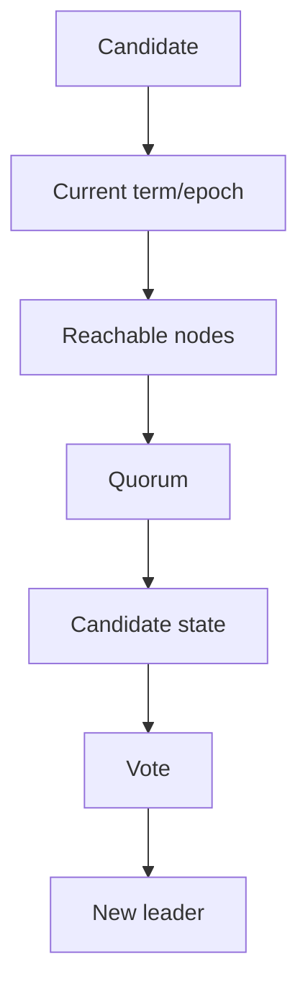

The system must prevent two candidates from both legitimately claiming leadership for the same leadership generation.

This is why election is more than:

```text
"Pick another server."
```

---

# 8. Terms and Epochs

Suppose leadership generations are numbered:

```text
Term 10
```

Node A is leader.

Later:

```text
Term 11
```

Node B becomes leader.

Now A is stale.

```text
A → Term 10
B → Term 11
```

If A later reconnects and tries to perform a leadership operation:

```text
A:
"I'm leader!"
```

the system can recognize:

```text
Term 10 < Term 11
```

and reject A's stale authority.

This is a powerful idea:

> **Leadership generation numbers help distinguish current authority from old authority.**

---

# 9. Fencing

**Fencing** means preventing an old or invalid owner from continuing to affect the authoritative resource.

Conceptually:

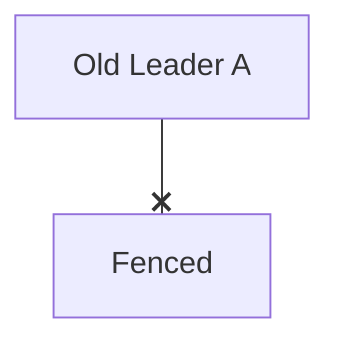

while:

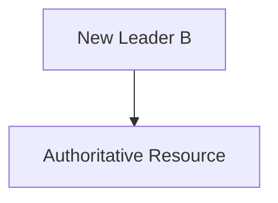

A fencing mechanism can involve:

- Leadership epochs.
- Fencing tokens.
- Storage-level ownership.
- Lease mechanisms.
- Network isolation.
- Resource-manager checks.

The implementation depends on the system.

The important principle is:

> **Do not rely only on the old leader voluntarily stopping. Make the system capable of rejecting stale authority.**

---

# 10. Fencing Tokens

Imagine:

```text
Leader A
Token = 10
```

Later:

```text
Leader B
Token = 11
```

The storage system accepts only operations with the newest valid token.

Therefore:

```text
A → token 10 → REJECT
B → token 11 → ACCEPT
```

Even if A is still running, it cannot safely act as the current owner.

This is stronger than simply saying:

```text
"Please stop, old leader."
```

---

# 11. Heartbeats Are Not Enough

A common mistake is:

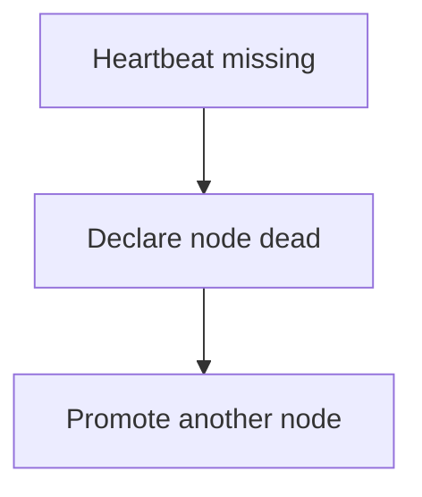

This can be dangerous.

Suppose:

```text
A = Leader
```

but the network path between A and the other nodes fails.

A continues operating.

Meanwhile:

```text
B + C
```

cannot reach A and elect B.

Now:

```text
A → Leader
B → Leader
```

Heartbeats helped detect a problem.

They did not solve authority.

Therefore:

> **Failure detection and authority control are separate problems.**

---

# 12. Split Brain and Network Partitions

The relationship is:

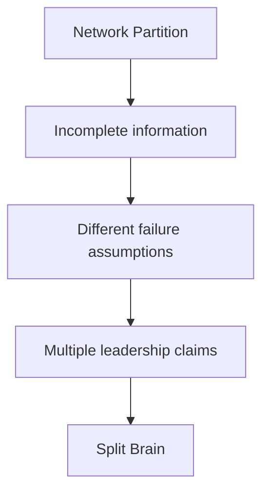

A network partition does not always create split brain.

A correctly designed system may respond:

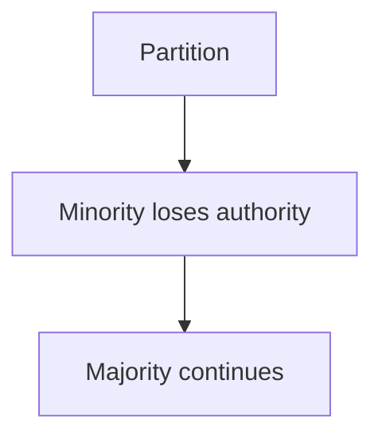

So:

> **A partition is a communication failure; split brain is a dangerous authority failure that can result from it.**

---

# 13. Split Brain in Databases

Consider:

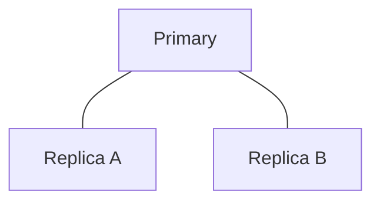

Suppose the primary becomes unreachable.

A replica is promoted:

```text
Replica A → New Primary
```

But the old primary is still running and unaware of the promotion.

Now:

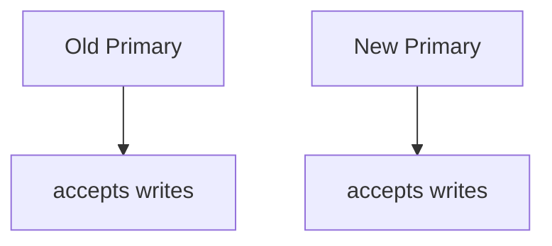

This is a database split-brain scenario.

The system now has:

```text
Two writers
```

for the same logical dataset.

This is extremely dangerous.

---

# 14. Split Brain in Distributed Services

Split brain is not limited to databases.

Imagine two service instances both believe they own a scheduled job:

```text
Scheduler A → "I am the active scheduler."
Scheduler B → "I am the active scheduler."
```

Both execute:

```text
Generate monthly invoice
```

The result could be:

```text
Invoice generated twice
```

Another example:

```text
Worker A → owns resource
Worker B → owns same resource
```

Both modify the same external resource.

The problem is not simply duplicate processes.

The problem is:

> **Multiple processes believe they have exclusive authority.**

---

# 15. Split Brain vs Duplicate Processing

These are related but different.

### Duplicate processing

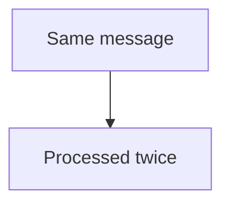

This can happen with at-least-once delivery.

### Split brain

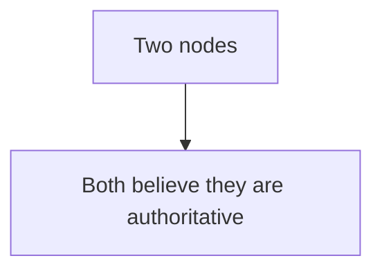

Split brain can cause duplicate processing, but duplicate processing does not automatically mean split brain.

For example:

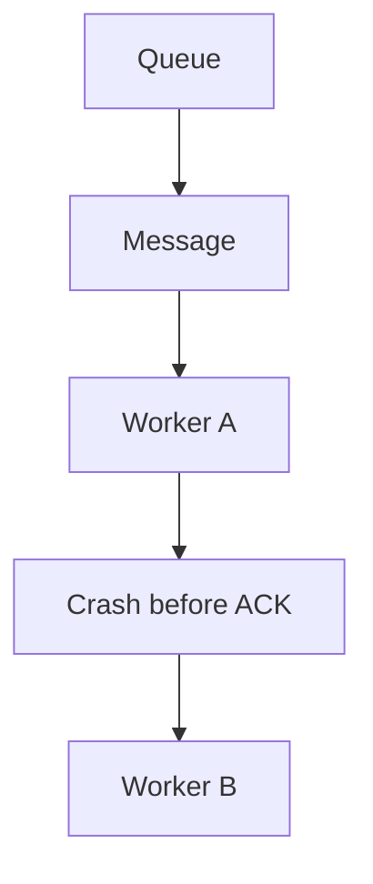

This is normal redelivery behavior, not necessarily split brain.

---

# 16. The Difference Between Data and Authority

This distinction is fundamental.

Two nodes can temporarily contain different data:

```text
A → v10
B → v9
```

without both being allowed to write authoritative state.

But:

```text
A → authoritative
B → authoritative
```

creates a much more dangerous situation.

Therefore:

> **Consistency problems concern what state nodes observe; split brain concerns who is allowed to make authoritative decisions.**

---

# 17. Client Routing Matters

Suppose:

```text
Leader A
Follower B
```

A partition occurs.

Clients may reach both sides.

If the client can send writes to:

```text
A
```

and:

```text
B
```

without authority checks, the system can become unsafe.

Client routing should therefore be connected to:

- Current leader.
- Current term.
- Health.
- Quorum.
- Authority.
- Fencing.

A load balancer alone does not understand distributed leadership unless it is integrated with the system's authority mechanism.

---

# 18. Split Brain During Failover

A simplified safe failover sequence is:

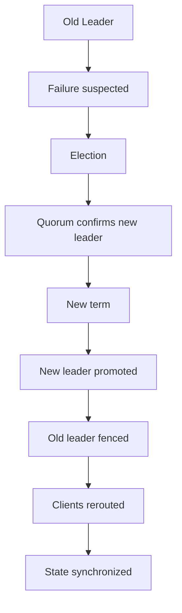

Notice that:

```text
Promotion
```

is not the end.

The old leader must also lose authority.

---

# 19. Recovery After Split Brain

Suppose split brain has already occurred.

```text
Side A:
v20

Side B:
v23
```

The network is restored:

```text
A ↔ B
```

The system needs to determine:

```text
Which state is authoritative?
Which operations were committed?
Which operations were only local?
Which writes must be discarded?
Which writes can be replayed?
Are there conflicts?
```

Possible recovery strategies include:

- Select authoritative history.
- Discard stale state.
- Replay valid operations.
- Rebuild a stale node.
- Merge non-conflicting updates.
- Apply application-specific conflict resolution.
- Restore from a known-good source.

There is no universal recovery algorithm for every system.

---

# 20. Why Recovery Can Be Difficult

Suppose:

```text
Side A:
Order 100 → PAID

Side B:
Order 100 → CANCELLED
```

After reconnection:

```text
Which one is correct?
```

A timestamp alone may not be sufficient.

You may need:

- Transaction history.
- Leadership terms.
- Commit information.
- Operation IDs.
- Business rules.
- Audit records.
- External payment state.

Therefore:

> **Preventing split brain is usually much easier than repairing its consequences.**

---

# 21. Hands-On Exercise — Three-Node Cluster

Imagine:

```text
A = Leader
B = Follower
C = Follower
```

The cluster requires a majority of:

```text
2 nodes
```

Now the network partition is:

```text
A  |  B C
```

### Question 1

Can B and C form a majority?

**Yes.**

### Question 2

Can A alone form a majority?

**No.**

### Question 3

Should A independently become a new authority?

**No.**

### Question 4

What should happen if B becomes the new leader?

A should eventually be prevented from acting as the old leader through the system's leadership-generation and/or fencing mechanisms.

---

# 22. Lab Challenge — Five-Node Partition

Consider:

```text
A B C | D E
```

Five nodes require:

```text
Majority = 3
```

Answer:

### Side A B C

Has:

```text
3 nodes
```

So it can potentially maintain quorum-dependent authority.

### Side D E

Has:

```text
2 nodes
```

It cannot obtain a majority.

Therefore:

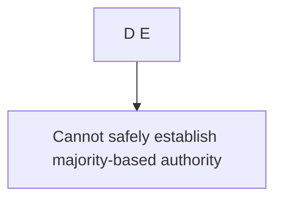

This is the basic safety property that helps prevent two independent leaders.

---

# 23. Lab Challenge — Stale Leader

Start with:

```text
Leader A
Term = 10
```

Network partition occurs.

B and C elect:

```text
Leader B
Term = 11
```

A reconnects and sends:

```text
Write X
Term = 10
```

What should happen?

```text
Term 10 < Term 11
```

Therefore A's stale leadership operation should be rejected according to the system's protocol.

The important concept is:

> **Being alive does not restore authority.**

---

# 24. Practical Split-Brain Investigation

When you suspect split brain:

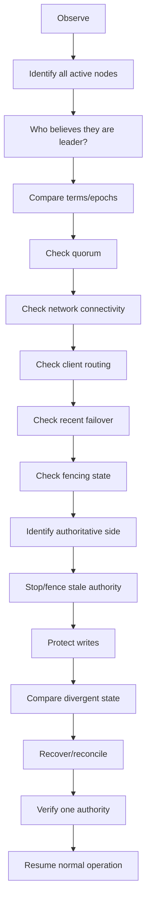

Do not immediately reconnect every component and hope the system fixes itself.

---

# 25. Observability

Split-brain prevention requires visibility into authority.

Useful signals include:

| Signal | Why It Matters |
|---|---|
| Current leader | Shows who believes they have authority |
| Leadership term/epoch | Identifies leadership generation |
| Quorum status | Shows whether authority has required participation |
| Heartbeat status | Shows connectivity/failure signals |
| Network connectivity | Identifies partitions |
| Election count | Frequent elections may indicate instability |
| Fencing events | Shows stale authority being blocked |
| Write rejection | Can reveal stale leaders |
| Divergence | Shows state differences |
| Failover events | Shows leadership transitions |

A useful alert is not simply:

```text
"Server A is down."
```

It may be:

```text
"Multiple nodes report leadership."
```

That is much closer to the actual danger.

---

# 26. Common Mistakes

### Mistake 1 — "If a node is alive, it can remain leader"

False.

Authority can expire or move even while a process remains alive.

### Mistake 2 — "Heartbeat failure proves the node crashed"

False.

The network may simply be broken.

### Mistake 3 — "The first node to promote becomes leader"

Unsafe.

Leadership requires an authority mechanism.

### Mistake 4 — "Quorum alone solves everything"

Quorum is important but must work with election, terms, fencing, and state rules.

### Mistake 5 — "Replication prevents split brain"

Replication creates copies; it does not automatically prevent multiple writers.

### Mistake 6 — "Eventual consistency means split brain"

False.

Temporary divergent state can be intentional without multiple authorities.

### Mistake 7 — "A load balancer can solve leader conflicts"

Not by itself.

The distributed system needs to determine authority.

### Mistake 8 — "Reconnect the nodes and everything will merge correctly"

Unsafe.

Conflicting writes may require explicit recovery.

### Mistake 9 — "A lock expiring automatically stops the old owner"

Not necessarily.

The old process may continue running.

### Mistake 10 — "Failover is complete when a new leader starts"

Not necessarily.

Old authority must be prevented from continuing to act.

---

# 27. System Design View

A safe leader-based architecture can be viewed as:

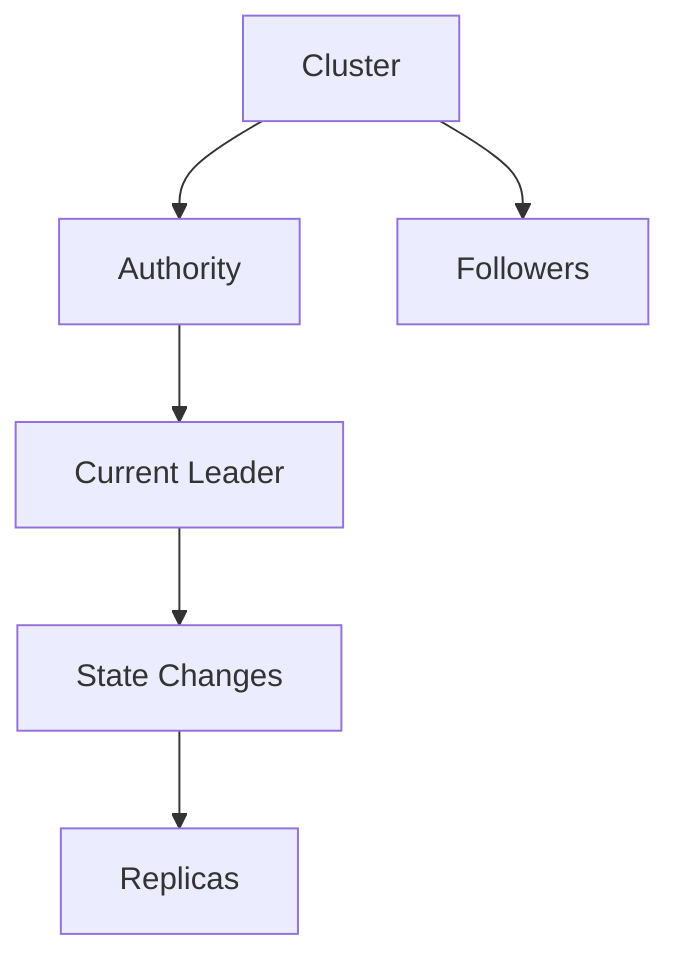

Authority should be controlled by:

```text
Election
   +
Quorum
   +
Term / Epoch
   +
Fencing
   +
State Validation
```

During failure:

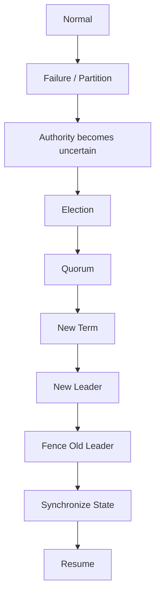

This is much safer than:

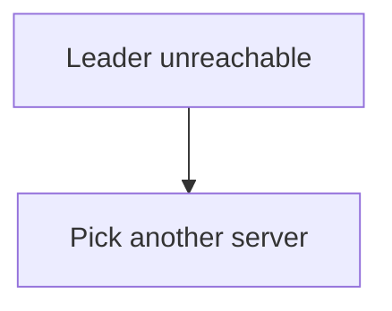

---

# 28. The Core Trade-Off

Preventing split brain often means sacrificing some availability during uncertain conditions.

For example:

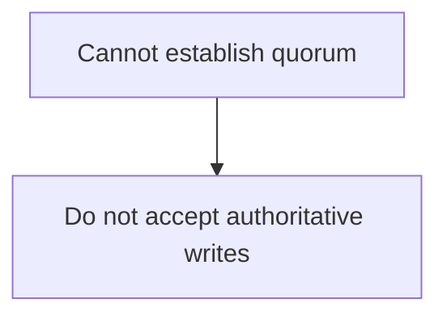

This may frustrate users.

But the alternative could be:

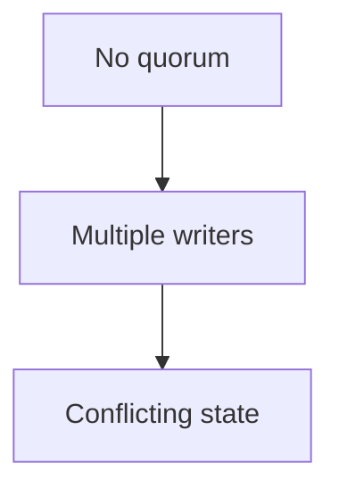

The system may therefore prefer:

```text
Temporary unavailability
```

over:

```text
Permanent or difficult-to-repair corruption
```

This is one of the central distributed-system trade-offs.

---

# 29. Split Brain Decision Framework

When designing a system, ask:

### Authority

```text
Who is allowed to make authoritative decisions?
```

### Failure detection

```text
How do nodes detect that the current leader may be unavailable?
```

### Quorum

```text
What participation is required?
```

### Leadership generation

```text
How do nodes distinguish old leadership from current leadership?
```

### Fencing

```text
How is a stale leader prevented from acting?
```

### Client routing

```text
How do clients find the current authority?
```

### Partition behavior

```text
What happens when communication is lost?
```

### Recovery

```text
How are divergent states reconciled?
```

### Observability

```text
How do operators know multiple authorities exist?
```

If these questions have no clear answers, the architecture may have an unresolved split-brain risk.

---

# 30. A Useful Mental Model

Think of authority as a **single microphone**.

In a healthy system:

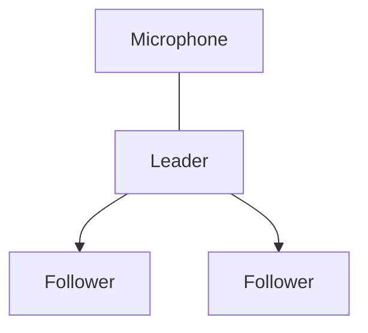

Only one node has the microphone.

During a partition, two nodes may think:

```text
A → "I have the microphone."

B → "I have the microphone."
```

That is split brain.

The solution is not merely telling them to speak more carefully.

The system needs rules that establish:

```text
Who has authority?
How is authority transferred?
How is old authority revoked?
How is the new authority recognized?
```

---

# 31. Key Principle

> **Split brain occurs when multiple parts of a distributed system incorrectly believe they have authority over the same logical state or workload. Network partitions and imperfect failure detection can create this condition, but quorum, safe leader election, terms or epochs, fencing, and authority-aware routing can prevent stale or competing leaders from acting simultaneously. Preventing split brain is usually far safer than trying to reconcile conflicting authoritative writes afterward.**

---

# 32. Quick Reference

### Split Brain

```text
Normal:

A = Leader
B = Follower
C = Follower

Partition:

A  X  B C

Danger:

A = Leader
B = Leader
```

### Protection

```mermaid
flowchart TD
  accTitle: Protection
  accDescr: Quorum, then Leader Election, then Term / Epoch, then Fencing, then One Current Authority.
  N0["Quorum"] --> N1["Leader Election"] --> N2["Term / Epoch"] --> N3["Fencing"] --> N4["One Current Authority"]
```

### Failure Detection Reminder

```text
No heartbeat
      ≠
Node definitely dead
```

### Three Important Distinctions

| Concept | Meaning |
|---|---|
| Network Partition | Nodes cannot reliably communicate |
| Divergence | Copies contain different state |
| Split Brain | Multiple nodes believe they have authority |

### Recovery

```mermaid
flowchart TD
  accTitle: Recovery
  accDescr: Detect, then Establish authority, then Fence stale nodes, then Protect writes, then Compare state, then Reconcile, then Synchronize, then Verify.
  N0["Detect"] --> N1["Establish authority"] --> N2["Fence stale nodes"] --> N3["Protect writes"] --> N4["Compare state"] --> N5["Reconcile"] --> N6["Synchronize"] --> N7["Verify"]
```

---

# 33. Knowledge Check

### 1. What is split brain?

**Answer:**  
A condition where multiple parts of a distributed system incorrectly believe they have authority over the same logical state or workload.

### 2. Does a network partition always cause split brain?

**Answer:**  
No. A correctly designed system can use quorum and authority rules to prevent multiple sides from becoming authoritative.

### 3. Why is split brain dangerous?

**Answer:**  
Multiple authorities can independently accept writes or perform exclusive operations, producing conflicting state, duplicate effects, or data corruption.

### 4. Why isn't a missing heartbeat proof that a node crashed?

**Answer:**  
The node may still be running while the network path between it and other nodes has failed.

### 5. How does quorum help?

**Answer:**  
Requiring a majority or other defined quorum makes it difficult for two disjoint groups to independently establish authoritative leadership.

### 6. What is a leadership term or epoch?

**Answer:**  
A number identifying a generation of leadership so systems can distinguish current authority from stale authority.

### 7. What is fencing?

**Answer:**  
A mechanism that prevents an old or invalid owner from continuing to affect the authoritative resource.

### 8. Why isn't replication enough to prevent split brain?

**Answer:**  
Replication copies state but does not automatically determine which node is allowed to accept authoritative writes.

### 9. How is split brain different from duplicate message processing?

**Answer:**  
Duplicate processing means an operation may be processed more than once; split brain means multiple nodes believe they have authority. Duplicate processing can happen without split brain.

### 10. Why can recovery after split brain be difficult?

**Answer:**  
Different sides may have accepted conflicting operations, and the system must determine which operations were authoritative and how to reconcile or discard divergent state.

### 11. Why can preventing split brain reduce availability?

**Answer:**  
A system may reject or delay writes when it cannot establish safe authority or quorum rather than risk accepting conflicting writes.

### 12. What is the safest general principle?

**Answer:**  
Maintain one clearly defined authority at a time and ensure stale authorities cannot continue acting.

---

# Remember

> **The biggest danger in split brain is not that servers disagree. It is that they disagree about who is allowed to decide.**

A safe distributed system must be able to answer:

```mermaid
flowchart TD
  accTitle: Questions a safe system must answer
  accDescr: Who is the leader?, then Why is it the leader?, then Does it have quorum?, then What leadership term is current?, then Can an old leader still write?, then How is stale authority fenced?.
  N0["Who is the leader?"] --> N1["Why is it the leader?"] --> N2["Does it have quorum?"] --> N3["What leadership term is current?"] --> N4["Can an old leader still write?"] --> N5["How is stale authority fenced?"]
```

If the system cannot answer those questions, failover may create more problems than the original failure.

---

# Next Chapter

## 06.14 — Failure Domains

The next chapter moves from **"Who failed?"** to **"What can fail together?"**

Topics include:

- What a failure domain is
- Why failure domains matter
- Single-machine failure
- Process failure
- Host failure
- Rack failure
- Availability-zone failure
- Region failure
- Network failure domains
- Shared dependencies
- Correlated failures
- Blast radius
- Redundancy across failure domains
- Replication and failure domains
- Quorum and failure domains
- Load balancers and failure domains
- Database architecture and failure domains
- Multi-AZ design
- Multi-region design
- Common failure-domain mistakes
- Hands-on failure-domain exercise
- System-design trade-offs
